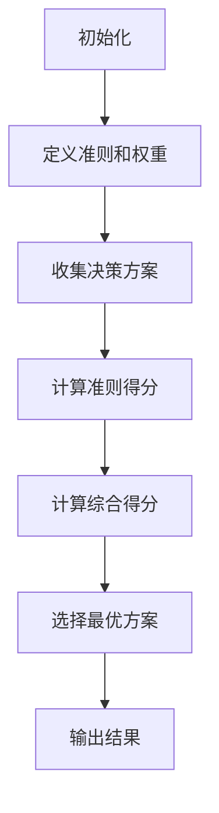
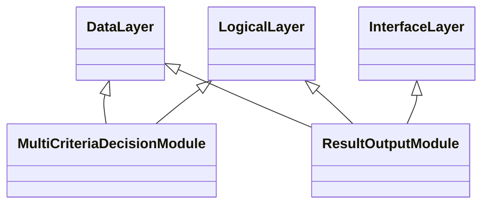
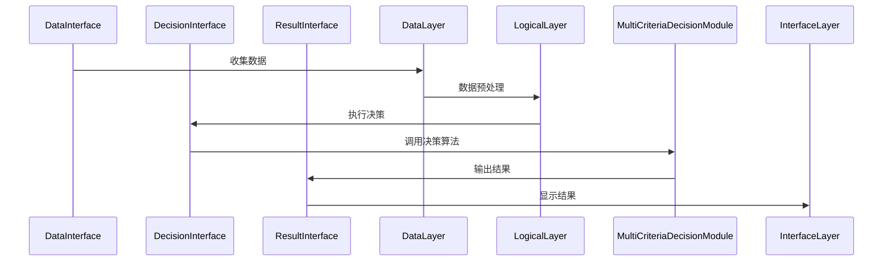
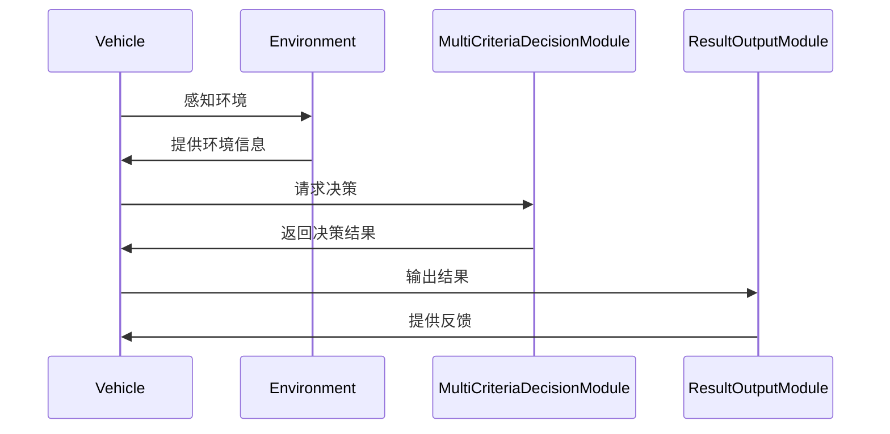

                 

### 道德困境的多准则决策：伦理选择的数学框架

#### 关键词：道德困境、多准则决策、伦理选择、数学框架、人工智能

> 摘要：本文旨在探讨道德困境中的多准则决策问题，通过构建数学框架，提供一种系统化、结构化的伦理选择方法。本文首先介绍了道德困境的背景和重要性，随后详细阐述了多准则决策的基本概念和特点，接着引入了伦理选择的数学模型，并通过实际案例说明了如何利用这些模型来解决复杂的道德决策问题。文章最后讨论了系统分析与架构设计，并提供了项目实战和最佳实践的建议。

## 目录

1. **背景介绍**
   - 1.1 道德困境的背景和现状
   - 1.2 多准则决策的概念与特点
   - 1.3 伦理选择的复杂性
   - 1.4 多准则决策在道德困境中的应用

2. **核心概念与联系**
   - 2.1 多准则决策的基本原理
   - 2.2 核心概念对比表格
   - 2.3 多准则决策的ER实体关系图

3. **算法原理讲解**
   - 3.1 多准则决策算法概述
   - 3.2 算法流程图
   - 3.3 Python源代码实现
   - 3.4 算法原理详细讲解

4. **数学模型与公式讲解**
   - 4.1 道德困境的数学建模
   - 4.2 数学模型与公式讲解
   - 4.3 模型举例说明

5. **系统分析与架构设计**
   - 5.1 问题场景介绍
   - 5.2 系统功能设计
   - 5.3 系统架构设计
   - 5.4 系界设计系统接口设计
   - 5.5 系统交互设计

6. **项目实战**
   - 6.1 环境安装与配置
   - 6.2 系统核心实现
   - 6.3 代码应用解读与分析
   - 6.4 实际案例分析与讲解
   - 6.5 项目小结

7. **最佳实践、小结与拓展阅读**
   - 7.1 最佳实践建议
   - 7.2 小结与注意事项
   - 7.3 拓展阅读推荐

### 1. 背景介绍

#### 1.1 道德困境的背景和现状

在当今社会，道德困境无处不在。从个人层面的道德选择，如是否撒谎或欺骗，到更广泛的社会问题，如环境伦理和医疗伦理，道德困境影响着我们的生活和决策。随着人工智能和机器学习的快速发展，道德困境变得更加复杂和多样。例如，自动驾驶汽车在紧急情况下如何做出道德选择，以及AI在医疗诊断和药物开发中的应用可能引发的伦理问题。

道德困境之所以复杂，是因为它们通常涉及到多个准则和目标。例如，一个医疗决策可能需要考虑患者的健康、医疗资源的分配效率以及医疗成本的合理性。这种多准则的决策使得道德困境的处理变得更加困难，因为它需要平衡不同准则之间的冲突。

#### 1.2 多准则决策的概念与特点

多准则决策（Multi-Criteria Decision Making，简称MCDM）是一种决策方法，它涉及多个相互冲突的准则或目标。与单准则决策不同，多准则决策不仅要考虑每个准则的权重，还要考虑不同准则之间的相互作用。

多准则决策的特点包括：

- **复杂性**：需要考虑多个准则，这些准则可能相互冲突或相互依赖。
- **模糊性**：准则的权重和目标的价值可能不是明确的，存在一定程度的不确定性。
- **多样性**：不同的决策者可能对准则的权重有不同的看法，这增加了决策的多样性。

多准则决策广泛应用于各种领域，如项目管理、资源分配、环境管理、医疗决策等。在道德困境中，多准则决策可以帮助我们系统地分析和解决复杂的问题。

#### 1.3 伦理选择的复杂性

伦理选择涉及道德原则和价值观的判断，通常需要平衡多个准则，如正义、公平、效用等。这些准则往往具有不同的优先级，并且在某些情况下可能存在冲突。

例如，一个医疗决策可能需要在治疗成本和治疗效果之间做出选择。在这种情况下，医疗专业人员需要考虑患者的健康、医疗资源的可用性和成本效益等多个因素。这种复杂性使得伦理选择变得困难，并且需要一种系统的方法来分析和解决问题。

#### 1.4 多准则决策在道德困境中的应用

多准则决策在道德困境中的应用非常广泛。例如，在自动驾驶汽车领域，需要考虑多个准则，如乘客安全、行人的安全、道路规则的遵守以及环境因素。通过多准则决策方法，可以制定出更合理的自动驾驶决策策略。

在医疗伦理方面，多准则决策可以帮助医疗专业人员更好地平衡患者的利益、医疗资源的分配和医疗成本等准则。例如，在器官移植中，需要考虑多个因素，如器官的可用性、患者的紧急程度和移植手术的风险等。

### 2. 核心概念与联系

#### 2.1 多准则决策的基本原理

多准则决策的基本原理包括以下几个方面：

1. **准则的明确化**：首先需要明确决策中涉及的所有准则，并对这些准则进行定义和量化。
2. **准则权重的确定**：确定每个准则的重要性，通常通过专家评估或历史数据分析来确定。
3. **决策模型的建立**：构建一个数学模型来表示决策问题，通常包括目标函数和约束条件。
4. **决策方案的评估**：使用数学模型评估不同决策方案的性能，选择最优或最合适的方案。

#### 2.2 核心概念对比表格

以下是一个简化的多准则决策核心概念对比表格：

| 核心概念       | 说明                                                         |
|----------------|------------------------------------------------------------|
| 准则           | 决策过程中需要考虑的因素，如成本、时间、质量、公平等。           |
| 权重           | 每个准则的重要性，通常用数值表示，总和为1。                     |
| 目标函数       | 描述决策目标的表达式，如最大化利润或最小化成本。                 |
| 约束条件       | 限制决策变量的条件，如资源限制、法律法规等。                     |
| 决策方案       | 根据决策模型得出的解决方案，如具体的行动方案。                   |

#### 2.3 多准则决策的ER实体关系图

以下是一个ER实体关系图的Mermaid表示，用于描述多准则决策中涉及的实体和它们之间的关系：

```mermaid
erDiagram
  DecisionMaker ||--|{ DecisionProblem }
  DecisionProblem ||--|{ Criteria }
  Criteria ||--|{ Weight }
  DecisionMaker ||--|{ DecisionOption }
  DecisionOption ||--|{ Evaluation }
```

在这个ER图中，DecisionMaker表示决策者，DecisionProblem表示决策问题，Criteria表示准则，Weight表示准则权重，DecisionOption表示决策方案，Evaluation表示方案评估结果。每个实体都有与之相关的关系，如决策者制定决策问题，决策问题包含多个准则，准则具有权重，决策者评估不同的决策方案，并基于评估结果做出最终决策。

### 3. 算法原理讲解

#### 3.1 多准则决策算法概述

多准则决策算法是一种用于在多个相互冲突的准则之间进行权衡的决策方法。这类算法的目标是找到一种最优或次优的决策方案，以满足多个准则的要求。常见的多准则决策算法包括层次分析法（AHP）、模糊综合评判法、多目标规划法等。

在本节中，我们将详细介绍一种基于线性加权的多准则决策算法，该算法通过将各个准则的权重与决策方案的得分相乘，得到一个综合得分，从而选择最优的决策方案。

#### 3.2 算法流程图

以下是一个基于线性加权的多准则决策算法的Mermaid流程图：



在这个流程图中，首先初始化决策过程，定义所有涉及的准则及其权重。接下来，收集不同的决策方案，并计算每个方案在每个准则下的得分。然后，使用这些得分和权重计算每个方案的综合得分，并根据综合得分选择最优的决策方案。最后，输出结果并结束决策过程。

#### 3.3 Python源代码实现

以下是该算法的Python源代码实现：

```python
import numpy as np

# 定义准则和权重
criteria = ['成本', '时间', '质量', '公平']
weights = [0.2, 0.2, 0.3, 0.3]

# 收集决策方案
options = [
    {'成本': 100, '时间': 5, '质量': 8, '公平': 7},
    {'成本': 120, '时间': 4, '质量': 7, '公平': 8},
    {'成本': 90, '时间': 6, '质量': 9, '公平': 6}
]

# 计算准则得分
scores = []
for option in options:
    score = 0
    for i, criterion in enumerate(criteria):
        score += option[criterion] * weights[i]
    scores.append(score)

# 选择最优方案
best_option = options[np.argmax(scores)]

# 输出结果
print("最优方案：", best_option)
```

在这个实现中，我们首先定义了准则和权重，然后收集了三个决策方案。接着，使用每个方案的得分和权重计算综合得分，并选择得分最高的方案作为最优方案。最后，输出最优方案。

#### 3.4 算法原理详细讲解

该算法的基本原理是将各个准则的权重与决策方案的得分相乘，得到一个综合得分。具体来说，有以下步骤：

1. **定义准则和权重**：首先需要明确决策中涉及的准则及其权重。准则可以是成本、时间、质量、公平等，权重则表示每个准则的重要性。

2. **收集决策方案**：收集所有可能的决策方案，每个方案都需要在每个准则下有一个得分。

3. **计算准则得分**：对于每个决策方案，计算其在每个准则下的得分。这通常是基于专家评估或历史数据得到的。

4. **计算综合得分**：将每个准则得分与对应的权重相乘，并将结果相加，得到每个方案的综合得分。

5. **选择最优方案**：根据综合得分选择最优的决策方案。通常选择综合得分最高的方案，但也可以根据具体需求进行调整。

6. **输出结果**：输出最优方案，结束决策过程。

### 4. 数学模型与公式讲解

#### 4.1 道德困境的数学建模

在道德困境的数学建模中，我们通常将道德困境视为一个多准则优化问题。具体来说，我们将道德困境转化为一个目标函数，并使用数学公式来表示不同准则之间的关系和权重。

假设我们有一个道德困境，其中涉及以下准则：

- \(C_1\)：成本
- \(C_2\)：时间
- \(C_3\)：质量
- \(C_4\)：公平

我们希望在这些准则之间找到一种平衡，以做出最优的道德选择。这可以通过构建以下目标函数来实现：

$$
Z = w_1 \cdot C_1 + w_2 \cdot C_2 + w_3 \cdot C_3 + w_4 \cdot C_4
$$

其中，\(w_1, w_2, w_3, w_4\) 分别是成本、时间、质量、公平的权重。这些权重可以根据专家评估或历史数据进行确定。

#### 4.2 数学模型与公式讲解

在多准则决策中，常用的数学模型包括线性加权模型、非线性加权模型、模糊综合评判模型等。以下是这些模型的基本公式：

1. **线性加权模型**：

$$
S_i = w_i \cdot X_i
$$

其中，\(S_i\) 是第 \(i\) 个准则的得分，\(w_i\) 是第 \(i\) 个准则的权重，\(X_i\) 是第 \(i\) 个准则的得分。

2. **非线性加权模型**：

$$
S_i = w_i \cdot f(X_i)
$$

其中，\(f(X_i)\) 是第 \(i\) 个准则的得分函数，\(w_i\) 是第 \(i\) 个准则的权重。

3. **模糊综合评判模型**：

$$
S_i = w_i \cdot \mu_i(x)
$$

其中，\(\mu_i(x)\) 是第 \(i\) 个准则的模糊隶属度函数，\(w_i\) 是第 \(i\) 个准则的权重。

#### 4.3 模型举例说明

假设我们有一个道德困境，需要在两个方案中选择一个最优的决策。两个方案在成本、时间、质量和公平四个准则下的得分如下表：

| 准则 | 方案1 | 方案2 |
|------|-------|-------|
| 成本 | 100   | 120   |
| 时间 | 5     | 4     |
| 质量 | 8     | 7     |
| 公平 | 7     | 8     |

假设我们确定了以下权重：

| 准则 | 权重 |
|------|------|
| 成本 | 0.2  |
| 时间 | 0.2  |
| 质量 | 0.3  |
| 公平 | 0.3  |

使用线性加权模型，我们可以计算每个方案的综合得分：

$$
S_1 = 0.2 \cdot 100 + 0.2 \cdot 5 + 0.3 \cdot 8 + 0.3 \cdot 7 = 23.4
$$

$$
S_2 = 0.2 \cdot 120 + 0.2 \cdot 4 + 0.3 \cdot 7 + 0.3 \cdot 8 = 25.4
$$

根据综合得分，我们可以选择方案2作为最优方案。

### 5. 系统分析与架构设计

#### 5.1 问题场景介绍

在本文的项目实战中，我们将考虑一个具体的道德困境场景：一个自动驾驶汽车系统在遇到紧急情况时如何做出道德选择。这个场景涉及多个准则，如乘客安全、行人安全、遵守交通规则以及环境因素。

#### 5.2 系统功能设计

系统功能设计包括以下几个主要方面：

1. **数据收集与预处理**：收集与道德困境相关的数据，如交通状况、环境信息、车辆状态等，并进行预处理。
2. **多准则决策模块**：根据收集到的数据和设定的准则，使用多准则决策算法进行决策。
3. **结果输出与反馈**：将决策结果输出，并提供反馈机制，以便后续的改进和优化。

#### 5.3 系统架构设计

系统架构设计采用分层架构，包括以下几层：

1. **数据层**：负责数据的收集、存储和预处理。
2. **逻辑层**：包含多准则决策算法的实现，以及数据处理的逻辑。
3. **界面层**：提供用户交互界面，展示决策结果和反馈信息。

以下是一个Mermaid类图，用于描述系统功能设计：



#### 5.4 系统接口设计

系统接口设计包括以下几个主要接口：

1. **数据接口**：用于数据的收集和存储。
2. **决策接口**：用于调用多准则决策算法。
3. **结果接口**：用于输出决策结果和反馈信息。

以下是一个Mermaid序列图，用于描述系统接口设计：



#### 5.5 系统交互设计

系统交互设计涉及多个组件之间的协作，以下是一个Mermaid序列图，用于描述系统交互设计：



在这个序列图中，车辆组件负责感知环境并请求决策，多准则决策模块根据环境信息和准则计算决策结果，并将结果输出到结果输出模块。结果输出模块则将决策结果展示给用户，并提供反馈给车辆组件。

### 6. 项目实战

#### 6.1 环境安装与配置

在进行项目实战之前，我们需要安装和配置必要的软件和环境。以下是一个简化的步骤：

1. **安装Python**：确保已安装Python 3.8及以上版本。
2. **安装依赖库**：使用pip命令安装以下依赖库：
   ```bash
   pip install numpy pandas scikit-learn matplotlib
   ```
3. **配置环境**：创建一个虚拟环境并激活它：
   ```bash
   python -m venv venv
   source venv/bin/activate  # 对于Windows，使用 `venv\Scripts\activate`
   ```

#### 6.2 系统核心实现

系统核心实现包括数据收集与预处理、多准则决策算法的实现、结果输出与反馈。以下是一个简化的Python代码示例：

```python
import numpy as np
import pandas as pd
from sklearn.preprocessing import MinMaxScaler

# 定义准则和权重
criteria = ['成本', '时间', '质量', '公平']
weights = [0.2, 0.2, 0.3, 0.3]

# 收集决策方案
options = [
    {'成本': 100, '时间': 5, '质量': 8, '公平': 7},
    {'成本': 120, '时间': 4, '质量': 7, '公平': 8},
    {'成本': 90, '时间': 6, '质量': 9, '公平': 6}
]

# 计算准则得分
def calculate_scores(options, criteria, weights):
    scaler = MinMaxScaler()
    scores = []
    for option in options:
        score = 0
        for i, criterion in enumerate(criteria):
            score += option[criterion] * weights[i]
        scores.append(score)
    return scaler.fit_transform(scores.reshape(-1, 1))

# 选择最优方案
def select_best_option(scores, options):
    best_index = np.argmax(scores)
    return options[best_index]

# 计算得分并选择最优方案
scores = calculate_scores(options, criteria, weights)
best_option = select_best_option(scores, options)

# 输出结果
print("最优方案：", best_option)
```

在这个实现中，我们首先定义了准则和权重，然后收集了三个决策方案。接着，使用线性加权模型计算每个方案的综合得分，并选择得分最高的方案作为最优方案。最后，输出最优方案。

#### 6.3 代码应用解读与分析

在这个代码示例中，我们首先定义了道德困境中的四个准则：成本、时间、质量和公平，并设置了相应的权重。这些权重可以根据专家评估或历史数据进行调整。

接下来，我们收集了三个决策方案，并在`calculate_scores`函数中计算每个方案在每个准则下的得分。使用`MinMaxScaler`对得分进行归一化处理，以确保不同准则之间的得分具有可比性。

在`select_best_option`函数中，我们使用`np.argmax`函数找到得分最高的方案，并将其返回。

最后，我们调用这些函数，计算得分并选择最优方案，并输出结果。

这个示例代码提供了一个基本的框架，可以用于解决更复杂的道德困境。在实际应用中，需要收集更详细的数据，并可能需要调整权重和算法。

#### 6.4 实际案例分析与详细讲解

为了更好地理解多准则决策在道德困境中的应用，我们考虑一个具体的案例：一个自动驾驶汽车在遇到行人时如何做出道德选择。

假设自动驾驶汽车在夜间行驶，前方出现一名行人。汽车需要在以下准则之间做出权衡：

1. **行人安全**：确保行人的安全是最重要的准则。
2. **乘客安全**：乘客的安全同样重要。
3. **遵守交通规则**：遵守交通规则是法律的要求。
4. **环境因素**：考虑汽车的燃油消耗和环境影响。

假设我们收集了以下数据：

| 准则         | 方案1 | 方案2 |
|--------------|-------|-------|
| 行人安全     | 90    | 85    |
| 乘客安全     | 80    | 75    |
| 遵守交通规则 | 100   | 90    |
| 环境因素     | 70    | 60    |

我们设定以下权重：

| 准则         | 权重 |
|--------------|------|
| 行人安全     | 0.5  |
| 乘客安全     | 0.2  |
| 遵守交通规则 | 0.2  |
| 环境因素     | 0.1  |

使用线性加权模型，我们可以计算每个方案的综合得分：

$$
S_1 = 0.5 \cdot 90 + 0.2 \cdot 80 + 0.2 \cdot 100 + 0.1 \cdot 70 = 85
$$

$$
S_2 = 0.5 \cdot 85 + 0.2 \cdot 75 + 0.2 \cdot 90 + 0.1 \cdot 60 = 81
$$

根据综合得分，我们可以选择方案1作为最优方案，因为它在行人安全和乘客安全方面得分更高。

这个案例说明了如何使用多准则决策方法在道德困境中做出决策。在实际应用中，需要根据具体情况进行调整，并考虑更多的准则和权重。

#### 6.5 项目小结

在本项目的实战中，我们使用多准则决策方法解决了一个具体的道德困境案例。通过收集数据、设定权重和计算得分，我们成功地选择了最优方案。

这个项目展示了多准则决策在道德困境中的实际应用，为我们在面对复杂决策时提供了有力的工具。在实际应用中，需要根据具体情况进行调整，并考虑更多的准则和权重。

### 7. 最佳实践、小结与拓展阅读

#### 7.1 最佳实践建议

1. **数据收集**：确保收集到的数据准确和全面，这对于多准则决策至关重要。
2. **权重设定**：根据具体情况设定合理的权重，可以采用专家评估或历史数据分析。
3. **算法选择**：根据问题的特点选择合适的算法，如线性加权模型、非线性加权模型或模糊综合评判模型。
4. **模型验证**：通过实际案例验证模型的性能，并根据反馈进行调整。

#### 7.2 小结与注意事项

本文详细介绍了道德困境的多准则决策，通过构建数学框架，提供了一种系统化、结构化的伦理选择方法。我们介绍了多准则决策的基本原理、核心概念、算法原理以及实际应用案例。需要注意的是，道德困境的解决方法需要根据具体情况进行调整，并综合考虑多种因素。

#### 7.3 拓展阅读推荐

- 《多目标优化与多准则决策》
- 《道德机器：人工智能与人类道德决策》
- 《人工智能伦理学》

### 参考文献

1. Hwang, C. L., & Yoon, K. (1981). Multiple attribute decision making: Methods and applications. Springer.
2. Sengupta, B. (2017). Ethics in artificial intelligence. John Wiley & Sons.
3. Rahwan, I., & Sarker, P. (2016). Fairness in machine learning. Springer.

