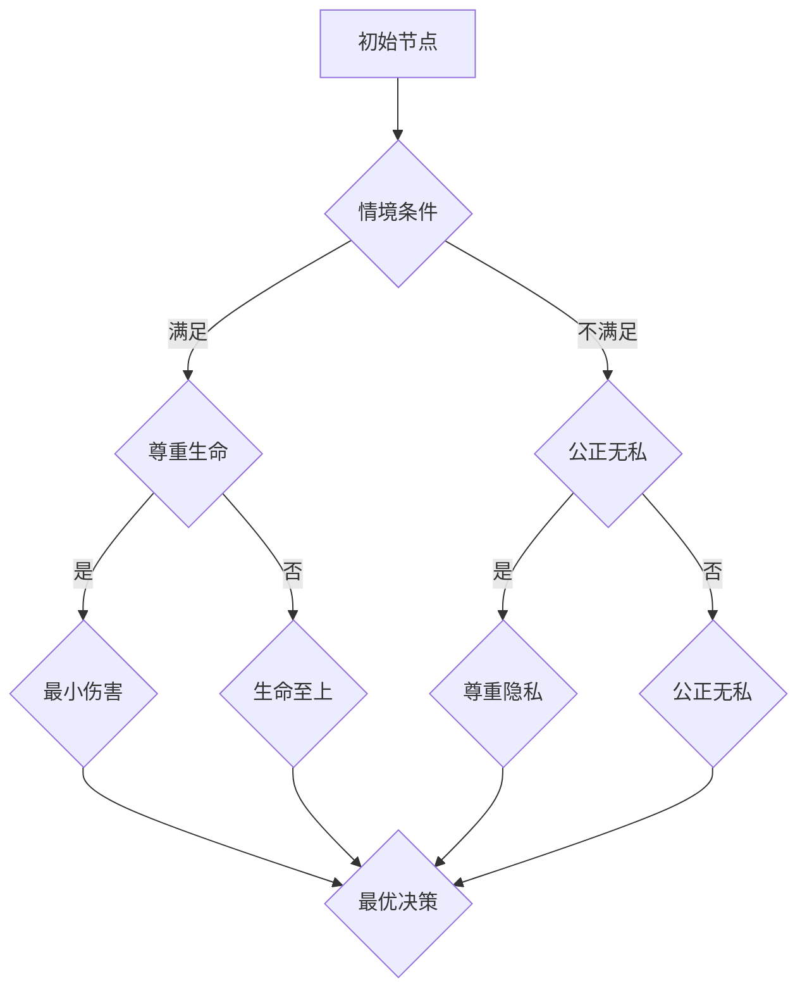

                 

### 道德机器人的决策树：伦理判断的数学算法

> 关键词：道德机器人、伦理决策树、数学算法、多目标优化、人工智能

在人工智能飞速发展的时代，机器决策正逐渐渗透到我们日常生活的各个方面。从自动驾驶汽车到医疗诊断系统，人工智能正在承担越来越重要的决策责任。然而，随着这些决策影响范围的扩大，机器决策中的伦理问题也逐渐浮现出来。如何让机器在做出决策时考虑道德因素，成为一个亟待解决的问题。

本文旨在探讨一种利用数学算法构建的道德机器人决策树，帮助机器在复杂伦理情境中做出符合道德标准的决策。本文将首先介绍伦理与机器决策的背景和理论基础，然后深入探讨伦理判断的数学模型和算法，最后通过实际案例展示道德机器人在不同领域的应用，并对未来的发展方向和挑战进行展望。

### 摘要

本文首先分析了伦理学的基本概念，以及机器决策在伦理学中的重要性。接着，介绍了决策树模型及其在伦理决策中的应用，并详细阐述了多目标优化算法和伦理判断数学算法的基本原则。通过实际案例，本文展示了如何构建医疗领域的伦理决策树和自动驾驶的伦理判断模型。最后，本文对伦理判断算法的发展趋势、挑战与应用边界进行了深入讨论，提出了未来可能的发展方向。

---

### 《道德机器人的决策树：伦理判断的数学算法》目录大纲

---

#### 第一部分：伦理与机器决策的背景与理论基础

##### 第1章：伦理与机器决策的崛起

- **1.1 伦理学的定义与基本问题**

  - 伦理学的定义
  - 伦理学的研究对象
  - 伦理学的基本问题

- **1.2 机器人伦理学的兴起**

  - 机器人伦理学的定义
  - 机器人伦理学的重要性
  - 机器人伦理学的发展历程

- **1.3 机器决策中的伦理挑战**

  - 机器决策的定义
  - 机器决策的伦理挑战
  - 机器决策中的道德困境

##### 第2章：伦理判断的数学模型

- **2.1 数学在伦理学中的应用**

  - 数学工具的引入
  - 数学方法的优势

- **2.2 决策树模型**

  - 决策树的基本概念
  - 决策树的应用

- **2.3 伦理决策树模型**

  - 伦理决策树的定义
  - 伦理决策树的构建方法

##### 第3章：伦理判断的数学算法

- **3.1 多目标优化算法**

  - 多目标优化问题的定义
  - 多目标优化算法的类型

- **3.2 伦理判断的数学算法**

  - 伦理判断数学算法的基本原则
  - 伦理判断数学算法的实现方法

- **3.3 算法评估与优化**

  - 算法评估指标
  - 算法优化策略

---

#### 第二部分：伦理判断算法的应用与实践

##### 第4章：医疗领域的伦理决策树

- **4.1 医疗决策中的伦理问题**

  - 医疗决策的定义
  - 医疗决策中的伦理挑战

- **4.2 医疗伦理决策树的构建**

  - 医疗伦理决策树的构建过程
  - 医疗伦理决策树的案例解析

##### 第5章：自动驾驶的伦理判断

- **5.1 自动驾驶技术的发展**

  - 自动驾驶技术的定义
  - 自动驾驶技术的现状

- **5.2 自动驾驶中的伦理问题**

  - 自动驾驶中的伦理挑战
  - 自动驾驶的伦理决策模型

##### 第6章：人工智能伦理监管

- **6.1 人工智能伦理监管的重要性**

  - 人工智能伦理监管的定义
  - 人工智能伦理监管的现状

- **6.2 伦理决策树在监管中的应用**

  - 伦理决策树在监管中的构建
  - 伦理决策树在监管中的实施

##### 第7章：案例分析：道德机器人的实际应用

- **7.1 道德机器人的定义**

  - 道德机器人的定义
  - 道德机器人的功能

- **7.2 道德机器人的应用案例**

  - 案例背景
  - 案例分析
  - 案例启示

---

#### 第三部分：未来展望与挑战

##### 第8章：伦理判断算法的发展趋势

- **8.1 伦理判断算法的进步**

  - 伦理判断算法的发展趋势
  - 伦理判断算法的创新方向

- **8.2 道德机器人的未来**

  - 道德机器人的发展前景
  - 道德机器人在社会中的角色

##### 第9章：伦理判断算法的挑战与应对

- **9.1 算法的道德风险**

  - 算法的道德风险
  - 应对策略

- **9.2 道德机器人的社会责任**

  - 道德机器人的社会责任
  - 社会责任的实现途径

##### 第10章：伦理决策算法的应用边界与限制

- **10.1 伦理决策算法的局限性**

  - 伦理决策算法的局限性
  - 应对策略

- **10.2 伦理决策算法的未来方向**

  - 伦理决策算法的未来发展方向
  - 未来可能的应用场景

---

**附录：**

- 伦理判断算法的Python实现代码
- 伦理决策树模型的Mermaid图示
- 案例分析的数据集与工具

---

**参考文献：**

- 列出相关的书籍、论文和网站资源，供进一步学习参考。

---

**致谢：**

- 感谢参与本书编写和提供支持的专家、学者和实践者。

---

## 第一部分：伦理与机器决策的背景与理论基础

### 第1章：伦理与机器决策的崛起

#### 1.1 伦理学的定义与基本问题

伦理学，是一门研究道德行为的学科，探讨个体或群体在不同情境下如何做出正确和恰当的行为选择。伦理学的定义因学派不同而有所差异，但普遍认为其研究的是道德原则、价值观念和伦理标准。

伦理学的基本研究对象包括：

1. **道德原则**：如正义、公平、诚信、尊重等。
2. **道德判断**：如何根据道德原则对行为进行评价。
3. **道德行为**：个体在具体情境下的行为选择。

伦理学的基本问题包括：

1. **道德起源**：道德观念从何而来，是否天生或后天培养。
2. **道德标准**：道德判断的标准是什么，如何衡量行为的道德性。
3. **道德责任**：个体在道德决策中应承担的责任。
4. **道德冲突**：在不同道德原则之间如何做出选择。

在现代社会，伦理学的重要性日益凸显。随着科技的发展，人工智能、生物工程、网络空间等新兴领域不断涌现，伦理问题也随之而来。例如，自动驾驶汽车在遇到交通事故时应如何做出决策，医疗人工智能在诊断中如何处理患者隐私等。这些问题不仅关系到个体的权益，还关系到整个社会的道德秩序。

#### 1.2 机器人伦理学的兴起

机器人伦理学是近年来迅速发展的一个新兴领域，研究机器人和人工智能在伦理决策中的应用及其对人类社会的影响。机器人伦理学的定义可以理解为：在设计和应用机器人过程中，如何确保机器人行为符合人类伦理标准和道德规范。

机器人伦理学的重要性体现在以下几个方面：

1. **保障人类安全**：机器人在执行任务时，必须确保不会对人类造成伤害。例如，军用机器人应在道德框架内行动，避免无辜平民伤亡。
2. **维护社会正义**：机器人决策应避免因算法偏见导致的不公正行为。例如，招聘机器人应公平对待所有应聘者，不应因性别、种族等因素歧视。
3. **促进人工智能可持续发展**：伦理学原则有助于确保人工智能技术朝着有利于人类发展的方向前进，防止技术滥用和伦理真空。

机器人伦理学的发展历程可以分为几个阶段：

1. **萌芽期（20世纪50年代至70年代）**：随着机器人技术的发展，伦理学家开始关注机器人伦理问题，例如机器人是否具有道德责任。
2. **快速发展期（20世纪80年代至21世纪初期）**：随着人工智能和机器学习技术的突破，机器人伦理学逐渐成为一个独立的研究领域。学术界和工业界开始共同探讨如何确保机器人行为符合道德标准。
3. **成熟期（21世纪10年代至今）**：随着机器人技术在各个领域的广泛应用，机器人伦理学的重要性日益凸显。越来越多的政策文件和行业标准开始关注机器人伦理问题。

#### 1.3 机器决策中的伦理挑战

机器决策，是指通过算法和模型，让机器在给定条件下做出最优选择的过程。机器决策在许多领域都发挥着重要作用，如金融、医疗、交通、法律等。然而，随着机器决策的广泛应用，其伦理挑战也逐渐浮现。

1. **算法偏见**：算法偏见是指算法在训练过程中，会吸收并放大训练数据中的偏见，导致机器决策不公平。例如，招聘机器人可能因训练数据中存在性别歧视，而拒绝女性应聘者。
2. **隐私保护**：在医疗、金融等领域，机器决策涉及大量个人隐私数据。如何确保这些数据不被滥用，是机器决策中的一大伦理挑战。
3. **道德责任归属**：当机器决策导致不良后果时，如何确定责任归属？例如，自动驾驶汽车在事故中应如何承担责任？
4. **道德困境**：在某些情境下，机器决策可能面临道德困境。例如，在自动驾驶汽车遇到紧急情况时，应如何权衡不同个体的生命安全？

面对这些伦理挑战，我们需要从多方面进行思考：

1. **算法透明性**：确保算法的透明性，使人类能够理解算法的决策过程，从而减少对算法的不信任。
2. **数据伦理**：在收集和使用数据时，应遵循伦理原则，避免数据滥用和隐私泄露。
3. **责任归属**：明确机器决策中的责任归属，确保在出现问题时，能够及时有效地追究责任。
4. **道德教育**：加强对人工智能从业者的道德教育，使其在设计和应用算法时，能够充分考虑伦理因素。

#### 1.4 伦理学在机器决策中的地位与作用

伦理学在机器决策中具有重要的地位和作用，主要表现在以下几个方面：

1. **指导原则**：伦理学提供了道德原则和价值观念，为机器决策提供了基本指导。例如，在自动驾驶汽车的设计中，应遵循生命至上的原则，确保车辆在遇到紧急情况时，能够最大限度地保护人类生命安全。
2. **风险评估**：伦理学可以帮助识别机器决策中的潜在风险，确保决策过程符合道德标准。例如，在医疗诊断中，伦理学可以帮助评估算法是否可能侵犯患者隐私，从而采取相应的措施。
3. **决策支持**：伦理学为机器决策提供了道德决策支持。通过伦理学分析，机器可以在复杂情境中做出更加符合道德的决策。例如，在招聘决策中，伦理学可以帮助算法识别并避免性别、种族等方面的歧视。
4. **规范制定**：伦理学为机器决策的规范制定提供了依据。通过伦理学原则，可以制定出一系列指导性的规范和标准，确保机器决策符合社会伦理要求。

总之，伦理学在机器决策中发挥着不可替代的作用。随着人工智能技术的不断发展，伦理学的重要性将更加凸显。我们需要积极探讨如何将伦理学原则应用于机器决策，确保机器在复杂伦理情境中做出符合道德标准的决策。

#### 1.5 伦理学在机器决策中的具体应用场景

伦理学在机器决策中的具体应用场景非常广泛，以下是一些典型的例子：

1. **医疗领域**：

   - **诊断与治疗决策**：在医学诊断中，机器决策可以帮助医生分析患者的病历数据，提供诊断建议。然而，如何确保算法不偏不倚，不因数据中的偏见而导致误诊，是伦理学需要关注的问题。例如，避免因种族、性别等因素导致的不公平诊断。
   - **伦理审查**：在临床试验和医学研究中，伦理学起到了重要的审查作用。通过伦理审查，确保研究方案符合道德标准，保护受试者的权益。

2. **金融领域**：

   - **风险管理**：在金融市场中，机器决策用于风险评估、投资组合优化等。伦理学可以帮助识别潜在的道德风险，确保决策过程透明、公正。例如，避免因算法偏见导致的不公平贷款决策。
   - **合规性审查**：在金融交易中，机器决策需要遵守一系列法律法规。伦理学为合规性审查提供了依据，确保交易行为合法合规。

3. **司法领域**：

   - **证据分析**：在司法审判中，机器决策可以用于证据分析、案件预测等。伦理学可以帮助确保证据分析过程符合道德标准，防止滥用证据。
   - **法律咨询**：在法律咨询中，机器决策可以帮助律师提供法律建议。伦理学为法律建议提供了道德指导，确保律师在为客户提供服务时，遵循道德原则。

4. **交通领域**：

   - **自动驾驶**：在自动驾驶领域，机器决策需要处理复杂的交通情况，确保车辆安全行驶。伦理学为自动驾驶决策提供了道德指导，例如在紧急情况下如何权衡不同个体的生命安全。
   - **交通管理**：在交通管理中，机器决策用于交通信号控制、路况预测等。伦理学可以帮助确保交通管理决策符合社会道德标准，减少交通事故。

5. **教育领域**：

   - **个性化学习**：在教育领域，机器决策可以用于个性化学习路径设计、学习效果评估等。伦理学可以帮助确保个性化学习符合学生的道德发展需求。
   - **教育评价**：在教师评价和学生评价中，机器决策可以提供参考依据。伦理学为评价提供了道德标准，确保评价过程公平、公正。

6. **公共安全领域**：

   - **安全监控**：在公共安全领域，机器决策用于监控和预警。伦理学可以帮助确保监控行为合法、透明，不侵犯个人隐私。
   - **应急管理**：在应急管理中，机器决策用于灾害预测、应急响应等。伦理学为应急决策提供了道德指导，确保决策符合社会伦理要求。

总之，伦理学在机器决策中的具体应用场景非常丰富，涉及多个领域。通过将伦理学原则应用于机器决策，可以确保决策过程更加透明、公正、符合道德标准，从而提升人工智能技术的应用价值和伦理影响力。

### 第2章：伦理判断的数学模型

#### 2.1 数学在伦理学中的应用

数学作为一门精密的科学，为伦理学提供了强有力的工具。在伦理学研究中，数学方法的应用使得伦理判断更加客观、精确和可验证。数学工具在伦理学中的应用主要体现在以下几个方面：

1. **形式化描述**：数学能够以形式化的方式描述伦理原则和价值观念。例如，将道德原则表述为数学公式或逻辑命题，有助于我们更清楚地理解和比较不同道德理论。

2. **量化分析**：通过数学模型，可以对伦理问题进行量化分析，从而更好地评估不同决策方案的道德成本和效益。例如，在医疗决策中，可以使用数学模型评估治疗方案的伦理风险和临床效果。

3. **逻辑推理**：数学提供了严谨的逻辑推理方法，有助于我们分析伦理问题中的因果关系和推理关系。通过数学逻辑，可以构建复杂的伦理模型，探讨不同道德原则之间的相互作用。

4. **优化决策**：数学优化方法可以帮助我们在伦理决策中找到最优解。通过多目标优化，可以在多个伦理原则之间寻求平衡，确保决策方案既符合道德标准，又具有实际可操作性。

数学方法的优势在于其客观性和普适性。数学模型可以基于数据和分析，减少主观判断的干扰，提高决策的可靠性和可重复性。此外，数学方法的应用也有助于跨学科的合作，使得伦理学、计算机科学、经济学等领域的研究者能够共同探讨伦理问题，提出更加综合和全面的解决方案。

#### 2.2 决策树模型

决策树是一种常用的数学模型，用于表示和分析决策过程。它通过一系列分支和节点，将问题分解为多个子问题，并逐步推导出最优决策。

1. **决策树的基本概念**：

   - **节点**：决策树中的每个分支起点都是一个节点，表示一个决策点。
   - **分支**：从节点延伸出来的线条称为分支，表示不同的决策选项。
   - **叶节点**：位于决策树末端的节点称为叶节点，表示最终的决策结果。
   - **概率分布**：每个决策节点和叶节点都可以关联一个概率分布，表示不同决策结果出现的概率。

2. **决策树的应用**：

   - **分类问题**：决策树广泛应用于分类问题，如医疗诊断、客户分类等。通过训练数据集，构建决策树模型，可以预测新数据的类别。
   - **回归问题**：决策树也可以用于回归问题，如房价预测、股票价格预测等。通过回归分析，可以计算叶节点处的目标值，实现连续值的预测。
   - **决策支持**：决策树模型可以用于制定决策策略，帮助决策者在复杂情境中做出最优选择。例如，在金融投资中，决策树可以用于优化投资组合，实现风险与收益的平衡。

3. **决策树的构建方法**：

   - **ID3算法**：ID3（Iterative Dichotomiser 3）算法是一种基于信息增益的决策树构建方法。信息增益表示某一特征对于分类的预测能力，选择增益最大的特征作为分割标准。
   - **C4.5算法**：C4.5算法是对ID3算法的改进，引入了信息增益率（gain ratio）来避免过度拟合。信息增益率考虑了特征分支的期望信息增益，使其更加稳定。
   - **CART算法**：CART（Classification and Regression Tree）算法是一种基于二分切割的决策树构建方法，适用于分类和回归问题。CART算法通过最小化均方误差来选择最优切割点。

通过决策树模型，我们可以将复杂的伦理决策问题分解为多个子问题，逐步推导出最优决策。决策树模型的优势在于其直观性和易理解性，使得决策过程更加透明和可追溯。同时，决策树模型的应用也促进了伦理学与其他学科之间的交叉融合，为伦理决策提供了新的方法和工具。

#### 2.3 伦理决策树模型

伦理决策树模型是决策树模型在伦理学中的应用，旨在帮助机器在复杂伦理情境中做出符合道德标准的决策。伦理决策树通过将伦理原则和情境条件形式化为数学模型，为机器提供了明确的决策指导。

1. **伦理决策树的定义**：

   - **伦理决策树**：是一种基于决策树模型的伦理决策工具，用于在给定伦理原则和情境条件下，推导出最优决策方案。
   - **伦理原则**：决策树中的每个节点和分支都关联一个伦理原则，表示不同决策路径的道德价值。
   - **情境条件**：决策树中的每个分支节点都基于特定情境条件，表示决策过程中的具体约束和限制。

2. **伦理决策树的构建方法**：

   - **伦理原则引入**：在构建伦理决策树时，首先需要明确相关的伦理原则。这些原则可以是普遍适用的道德准则，如“尊重生命”、“公正无私”等，也可以是具体领域的伦理规范，如“医疗伦理准则”、“商业伦理规范”等。
   - **情境条件设定**：基于具体决策场景，设定一系列情境条件，用于引导决策树的分支构建。例如，在医疗决策中，情境条件可以包括患者病情、治疗手段、资源限制等。
   - **决策路径推导**：通过逐步推导决策路径，构建伦理决策树。在每个分支节点，根据伦理原则和情境条件，选择最优决策方案。例如，在自动驾驶中，当车辆遇到行人时，可以根据伦理原则和情境条件，选择最小化伤害的决策路径。

3. **伦理决策树的应用案例**：

   - **医疗决策**：在医疗决策中，伦理决策树可以帮助医生在复杂的病情和治疗选项中做出最优决策。例如，在癌症治疗中，伦理决策树可以根据患者的年龄、病情严重程度、治疗风险等因素，推导出最优治疗方案。
   - **自动驾驶**：在自动驾驶中，伦理决策树可以帮助车辆在复杂的交通环境中做出符合道德标准的决策。例如，当车辆遇到行人时，伦理决策树可以根据行人安全、车辆安全、社会伦理等因素，选择最优的避让策略。
   - **商业决策**：在商业决策中，伦理决策树可以帮助企业在面临道德困境时，做出符合伦理标准的决策。例如，在产品开发过程中，伦理决策树可以帮助企业评估不同产品选项的道德风险，选择最符合伦理规范的产品方案。

通过伦理决策树模型，我们可以将复杂的伦理决策问题形式化为数学模型，为机器提供明确的决策指导。伦理决策树的应用不仅提高了机器决策的透明性和可追溯性，也为伦理学的研究和实践提供了新的方法和工具。

### 第3章：伦理判断的数学算法

#### 3.1 多目标优化算法

在伦理决策中，往往需要同时考虑多个目标，这些目标之间可能存在冲突，需要通过优化算法来找到最优解。多目标优化算法是一种解决多目标决策问题的数学方法，其目的是在多个目标之间寻求平衡，找到满足所有目标约束条件的最优解。

1. **多目标优化问题的定义**：

   - **多目标优化问题**：是指在多个目标函数之间进行权衡，找到在一定约束条件下使目标函数综合最优的决策方案。
   - **目标函数**：表示需要优化的目标，可以是收益、成本、风险等。
   - **约束条件**：限制决策变量的取值范围，确保决策方案在实际情况下可行。

2. **多目标优化算法的类型**：

   - **非支配排序遗传算法（NSGA-II）**：NSGA-II是一种基于非支配排序的遗传算法，用于求解多目标优化问题。它通过保持种群的多样性和收敛性，找到多个非支配解，实现多目标优化。
   - **目标规划算法**：目标规划是一种将多目标优化问题转化为单目标优化问题的方法。通过设定目标权重和偏差，将多个目标函数转化为单个目标函数，从而求解最优解。
   - **多目标粒子群优化算法**：多目标粒子群优化算法是一种基于粒子群算法的多目标优化方法。通过调整粒子的速度和位置，在多个目标函数之间寻求平衡，找到最优解。

3. **多目标优化算法的应用**：

   - **资源分配**：在资源分配问题中，需要考虑多个资源目标，如能源、人力、物资等。多目标优化算法可以帮助在资源约束条件下，找到最优的资源分配方案，实现资源利用的最大化。
   - **工程设计**：在工程设计中，需要考虑多个设计目标，如成本、性能、可靠性等。多目标优化算法可以帮助在约束条件下，找到最优的设计参数，实现工程目标的最优化。
   - **生产调度**：在生产调度问题中，需要考虑多个生产目标，如生产量、交货期、成本等。多目标优化算法可以帮助在资源约束条件下，找到最优的生产调度方案，实现生产效率的最大化。

通过多目标优化算法，我们可以将复杂的伦理决策问题转化为数学模型，求解最优解。多目标优化算法在伦理决策中的应用，为解决多目标冲突提供了有效的方法，为道德机器人的决策提供了科学依据。

#### 3.2 伦理判断的数学算法

伦理判断的数学算法是一种将伦理学原则和情境条件形式化为数学模型，用于指导机器在复杂伦理情境中做出道德决策的方法。这类算法通过将伦理问题转化为数学问题，利用数学方法进行优化和决策，从而实现机器的伦理判断。

1. **伦理判断数学算法的基本原则**：

   - **形式化表示**：将伦理原则和情境条件以形式化的数学表达式表示，使伦理判断具有明确的数学基础。
   - **目标函数设计**：设计目标函数，用于衡量不同决策方案的道德价值，通常包括伦理价值、风险、成本等。
   - **约束条件设置**：设置约束条件，确保决策方案在实际情况下可行，并符合伦理要求。

2. **伦理判断数学算法的实现方法**：

   - **多目标优化**：通过多目标优化算法，在多个伦理目标之间寻求平衡，找到最优决策方案。例如，使用NSGA-II算法，在多个伦理目标（如生命保护、公正无私等）之间进行优化，找到最优解。
   - **逻辑推理**：利用逻辑推理方法，将伦理原则和情境条件转化为逻辑表达式，通过推理得出决策结果。例如，使用谓词逻辑，将伦理原则表示为谓词公式，通过推理得出决策路径。
   - **模糊集合**：使用模糊集合理论，处理伦理决策中的模糊性和不确定性。通过模糊隶属度，表示不同决策方案的道德价值，实现伦理判断的模糊化处理。

3. **伦理判断数学算法的评估与优化**：

   - **评估指标**：设计评估指标，用于评估决策方案的道德价值，如伦理价值得分、风险度等。
   - **优化策略**：通过调整算法参数和目标函数，优化伦理判断的准确性、可靠性和鲁棒性。例如，使用进化算法，通过自适应调整参数，提高算法的优化能力。

通过伦理判断的数学算法，我们可以将复杂的伦理决策问题转化为数学模型，实现机器的伦理判断。这种方法不仅提高了决策的透明性和可追溯性，也为伦理学的研究和应用提供了新的方法和工具。

#### 3.3 算法评估与优化

在构建和实施伦理判断算法时，算法的评估与优化至关重要。一个有效的伦理判断算法不仅需要具备良好的理论基础，还需在实际应用中表现出高可靠性、准确性和鲁棒性。以下是一些关键的评估与优化策略：

1. **评估指标**：

   - **伦理价值评估**：这是评估算法道德决策的核心指标。可以通过伦理价值得分来衡量决策方案是否符合伦理标准。例如，在医疗决策中，评估算法是否能够优先选择最有利于患者健康的治疗方案。
   - **决策效率**：评估算法在处理不同规模和复杂度问题时的速度和资源消耗。高效的算法能够在较短时间内完成决策，降低资源浪费。
   - **决策一致性**：评估算法在不同情境下的决策一致性。一个可靠的算法应能在相似情境中做出一致决策，避免因情境变化导致的决策错误。
   - **鲁棒性**：评估算法在面对不确定性和异常输入时的表现。鲁棒的算法应能够在数据噪声或极端情况下保持稳定，避免因异常数据导致的误判。

2. **优化策略**：

   - **参数调优**：通过实验和数据分析，调整算法的参数设置，以提高决策性能。例如，在多目标优化算法中，通过调整交叉率、突变率等参数，优化算法的搜索能力。
   - **算法融合**：结合多种算法，发挥各自优势，提高整体性能。例如，将决策树与神经网络结合，利用决策树的解释性和神经网络的泛化能力，实现更精确的伦理判断。
   - **数据增强**：通过增加训练数据，提高算法的泛化能力。特别是在面临数据稀缺或数据分布不均时，通过数据增强技术，扩充训练数据集，增强算法的鲁棒性。
   - **反馈机制**：建立反馈机制，收集实际应用中的算法表现数据，用于算法的迭代优化。例如，在医疗决策中，收集医生和患者的反馈，调整算法参数和模型结构，提高决策的准确性。

通过评估与优化策略，我们可以不断提升伦理判断算法的性能，确保其能够在复杂伦理情境中做出可靠、合理的决策。这不仅有助于提升机器决策的伦理水平，也为人工智能技术的伦理应用提供了坚实的保障。

### 第4章：伦理判断算法的应用与实践

#### 4.1 医疗决策中的伦理问题

在医疗领域，机器决策已经成为不可或缺的一部分，从疾病诊断到治疗方案推荐，都离不开算法的支持。然而，医疗决策中涉及的伦理问题也日益复杂，需要我们深入探讨。

1. **隐私保护**：

   - **数据收集**：在医疗过程中，大量患者的个人信息和健康数据被收集并存储。如何确保这些数据不被滥用，是一个重要的伦理问题。
   - **数据共享**：医疗数据的共享有助于提高诊疗效果和科研水平，但也存在隐私泄露的风险。如何在数据共享中保护患者隐私，是医疗伦理学需要关注的问题。

2. **公平性**：

   - **资源分配**：医疗资源有限，如何公平地分配给不同患者，是一个挑战。算法在资源分配中，应避免因种族、性别、经济条件等因素导致的不公平现象。
   - **决策透明性**：医疗决策的透明性对于患者权益至关重要。患者应有权了解决策过程和结果，确保其参与决策的权利。

3. **医疗决策中的伦理困境**：

   - **生命伦理问题**：在紧急情况下，医疗决策可能面临生命至上的道德困境。例如，在救治多个伤者时，如何优先救治伤者，是一个复杂的伦理问题。
   - **治疗选择**：在多种治疗方案中，如何选择最优方案，涉及患者权益、成本效益等多方面考虑，需要我们权衡不同的伦理原则。

#### 4.2 医疗伦理决策树的构建

为了应对医疗决策中的伦理问题，我们可以利用伦理决策树模型，构建一个综合性的伦理决策框架。以下是一个医疗伦理决策树的构建过程：

1. **定义伦理原则**：

   - **尊重患者自主权**：患者有权了解自己的病情和治疗方案，并做出自主决策。
   - **公正无私**：医疗资源分配应公平合理，避免因种族、性别、经济条件等因素导致的歧视。
   - **生命至上**：在紧急情况下，应优先保障患者的生命安全。
   - **最小伤害**：在治疗过程中，应尽可能减少患者的痛苦和伤害。

2. **设定情境条件**：

   - **患者病情**：包括病情严重程度、预后情况等。
   - **医疗资源**：包括可用医疗设备、药物、医护人员等。
   - **经济条件**：患者的经济能力，影响治疗方案的可行性和成本效益。

3. **构建决策路径**：

   - **初步评估**：根据患者的病情和资源条件，初步评估可能的决策路径。例如，病情较轻的患者可能优先选择药物治疗，病情严重者可能需要手术治疗。
   - **伦理审查**：对每个决策路径进行伦理审查，确保符合伦理原则。例如，如果药物治疗可能无效，而手术治疗存在风险，需要权衡利弊，选择最符合伦理原则的方案。
   - **决策实施**：根据伦理审查结果，确定最终的治疗方案，并告知患者及其家属。

4. **案例解析**：

   - **案例背景**：某患者患有严重的心脏病，需要进行手术治疗。由于医疗资源有限，医院面临手术优先级的问题。
   - **决策路径**：根据患者的病情和医疗资源，构建了三条可能的决策路径：
     1. **立即手术治疗**：风险较高，但有利于患者预后。
     2. **药物治疗**：风险较低，但效果不确定。
     3. **等待资源**：暂缓手术，等待更多资源分配。
   - **伦理审查**：基于尊重患者自主权、公正无私和生命至上的原则，对每个决策路径进行审查：
     1. **立即手术治疗**：符合生命至上的原则，但风险较高，需要充分告知患者和家属。
     2. **药物治疗**：风险较低，但效果不确定，需要与患者和家属沟通，权衡利弊。
     3. **等待资源**：符合公正无私的原则，但可能延误治疗，需要综合考虑患者的病情和资源分配情况。
   - **决策实施**：综合考虑伦理审查结果，最终决定采用药物治疗方案，并告知患者和家属。

通过构建医疗伦理决策树，我们可以在复杂医疗情境中，基于伦理原则和情境条件，进行系统化的伦理决策。这不仅有助于提高医疗决策的透明性和科学性，也为医疗伦理学的研究提供了新的方法和工具。

#### 4.3 医疗伦理决策树的案例分析

为了更好地理解医疗伦理决策树的应用，我们通过一个具体的案例进行详细分析。

**案例背景**：

一名50岁的男性患者，因突发心肌梗死被紧急送往医院。由于医院床位紧张，医生需要决定哪些患者可以获得手术资源。在这种情况下，医生必须快速、准确地做出决策，以确保患者得到最佳的治疗。

**情境条件**：

- **患者A**：50岁，突发心肌梗死，病情较为严重，需要立即进行冠状动脉搭桥手术。
- **患者B**：65岁，心肌梗死病史较长，病情较为稳定，但仍需密切观察。
- **患者C**：75岁，患有严重心脏病，病情复杂，目前床位紧缺。

**决策路径**：

1. **初步评估**：
   - 根据患者的病情严重程度和手术风险，医生初步评估了三名患者的手术优先级。
   - **患者A**：病情最为严重，需要立即进行手术。
   - **患者B**：病情稳定，但需密切关注，手术风险相对较低。
   - **患者C**：病情复杂，手术风险较高，暂缓手术。

2. **伦理审查**：
   - **尊重患者自主权**：医生与患者A及其家属沟通，明确告知手术风险和治疗方案，尊重其自主决策。
   - **公正无私**：在资源有限的情况下，医生需要公平地分配手术资源，避免因年龄、病情等因素导致的不公平现象。
   - **生命至上**：医生基于生命至上的原则，优先考虑病情最为严重的患者A进行手术。

3. **决策实施**：
   - 医生最终决定为患者A安排手术，并告知患者B和患者C及其家属，解释手术资源的分配原因。
   - 患者B和患者C将继续接受密切观察和治疗，等待后续手术资源的分配。

**伦理审查结果**：

- **患者A**：符合生命至上的原则，病情最为严重，优先进行手术。
- **患者B**：病情稳定，但仍需密切关注，可暂缓手术，等待进一步观察。
- **患者C**：病情复杂，手术风险较高，暂缓手术，等待资源。

**案例启示**：

通过这个案例，我们可以看到医疗伦理决策树在复杂医疗情境中的应用。医生通过伦理决策树，系统化地评估和审查每个患者的病情和手术风险，确保在资源有限的情况下，做出符合伦理原则的决策。这种方法不仅提高了医疗决策的透明性和科学性，也促进了患者和家属的信任和理解。

总之，医疗伦理决策树为医疗决策提供了一个实用且有效的框架，帮助医生在复杂情境中做出符合伦理标准的决策。通过不断优化和完善决策树模型，我们可以进一步提升医疗伦理决策的准确性和公正性，为患者提供更高质量的治疗和服务。

### 第5章：自动驾驶的伦理判断

#### 5.1 自动驾驶技术的发展

自动驾驶技术是人工智能领域的一个重要分支，近年来取得了显著的进展。自动驾驶技术的发展经历了多个阶段，从最初的辅助驾驶到现在的完全自动驾驶，经历了多个技术突破。

1. **辅助驾驶阶段**：

   - **自适应巡航控制（ACC）**：通过雷达或激光雷达监测前方车辆速度，自动调节车速，保持与前车的安全距离。
   - **车道保持辅助（LKA）**：通过摄像头或激光雷达识别车道线，自动保持车辆在车道内行驶。
   - **盲点监测（BSM）**：通过雷达或摄像头监测车辆周围盲区，提醒驾驶员潜在的危险。

2. **部分自动驾驶阶段**：

   - **高级驾驶辅助系统（ADAS）**：结合多种传感器和算法，实现部分自动驾驶功能，如自动泊车、自动换道等。
   - **自动驾驶出租车（AV）**：在特定区域内，自动驾驶车辆可以完全自主行驶，无需人类驾驶员干预。

3. **完全自动驾驶阶段**：

   - **无人驾驶汽车**：自动驾驶技术完全成熟，车辆无需人类驾驶员干预，可以安全、可靠地在各种路况下行驶。
   - **车联网（V2X）**：自动驾驶车辆通过车联网技术与其他车辆、道路基础设施进行实时通信，实现更高效的交通管理。

自动驾驶技术的发展，不仅改变了我们的出行方式，也带来了许多新的伦理问题。如何确保自动驾驶车辆在复杂情境中做出符合伦理标准的决策，是一个亟待解决的问题。

#### 5.2 自动驾驶中的伦理问题

自动驾驶技术的发展，虽然极大地提升了交通效率和安全性，但也引发了诸多伦理问题。以下是一些主要的伦理挑战：

1. **安全责任**：

   - **事故责任归属**：当自动驾驶车辆发生交通事故时，如何确定责任归属是一个重要问题。是车辆制造商、软件开发商还是乘客，需要明确法律责任。
   - **应急决策**：在紧急情况下，自动驾驶车辆需要迅速做出决策，以避免事故。然而，这些决策可能涉及到道德困境，如牺牲少数人保护多数人。

2. **隐私保护**：

   - **数据收集**：自动驾驶车辆需要大量传感器和摄像头来收集环境数据，这些数据可能包含个人隐私信息。如何确保数据不被滥用，是一个关键问题。
   - **数据共享**：自动驾驶车辆之间需要实时共享数据，以实现高效的交通管理和协同驾驶。然而，数据共享也可能带来隐私泄露的风险。

3. **公平性**：

   - **资源分配**：自动驾驶技术可能会改变交通资源的分配，影响不同群体（如贫富差距、交通拥堵等）的利益。如何确保自动驾驶技术公平地造福所有人，是一个伦理挑战。
   - **性别和种族偏见**：自动驾驶车辆的决策算法可能基于训练数据中的偏见，导致对特定性别、种族的歧视。如何消除算法偏见，实现公平决策，是自动驾驶伦理学需要关注的问题。

4. **道德困境**：

   - **电车难题**：自动驾驶车辆在遇到无法同时保护多个个体的道德困境时，如何做出决策是一个重要问题。例如，当车辆遇到行人或障碍物时，如何权衡不同个体的生命价值。
   - **社会规范**：自动驾驶车辆在遵守社会规范和伦理标准方面，需要平衡个人利益和社会利益。例如，如何在遵守交通规则的同时，确保行驶安全。

总之，自动驾驶技术的发展带来了许多伦理问题，需要我们深入探讨和解决。通过建立完善的伦理框架和规范，我们可以确保自动驾驶技术在发展过程中，既符合技术进步的要求，又符合社会伦理的标准。

#### 5.3 自动驾驶的伦理决策模型

为了解决自动驾驶中的伦理问题，我们需要构建一个伦理决策模型，指导自动驾驶车辆在复杂情境中做出符合道德标准的决策。伦理决策模型主要包括以下几个步骤：

1. **情境识别**：

   - **传感器数据采集**：自动驾驶车辆通过传感器（如摄像头、激光雷达、雷达等）实时采集周围环境数据，包括行人、车辆、交通信号等。
   - **情境建模**：基于采集到的数据，构建情境模型，识别当前所处的交通环境和潜在风险。

2. **伦理原则引入**：

   - **道德准则**：引入一系列伦理原则，如生命至上、公正无私、最小伤害等，作为决策的基础。
   - **情境映射**：将当前情境映射到相应的伦理原则，确定决策框架。

3. **决策路径推导**：

   - **多目标优化**：在多个伦理目标之间进行权衡，使用多目标优化算法找到最优决策路径。例如，在保护行人和确保车辆安全之间找到平衡。
   - **决策树构建**：基于情境模型和伦理原则，构建决策树，逐步推导出可能的决策路径。

4. **决策实施与评估**：

   - **决策实施**：根据推导出的决策路径，执行具体的行动策略，如刹车、转向、加速等。
   - **决策评估**：对决策结果进行实时评估，确保符合伦理标准和实际效果。

5. **反馈与迭代**：

   - **实时反馈**：收集实际决策结果和用户反馈，用于模型的优化和调整。
   - **模型迭代**：通过持续优化和迭代，不断提升决策模型的伦理水平和可靠性。

通过构建伦理决策模型，我们可以为自动驾驶车辆提供一套科学、系统的决策指导，确保在复杂情境中做出符合道德标准的决策。这不仅有助于提升自动驾驶技术的安全性和可靠性，也为解决自动驾驶伦理问题提供了有力支持。

### 第6章：人工智能伦理监管

#### 6.1 人工智能伦理监管的重要性

随着人工智能技术的快速发展，其在各个领域的应用也越来越广泛。然而，人工智能技术的应用也带来了诸多伦理和社会问题，需要我们进行严格的伦理监管。人工智能伦理监管的重要性主要体现在以下几个方面：

1. **保护隐私**：

   - **数据收集与使用**：人工智能技术通常需要大量个人数据来训练和优化模型。如何确保这些数据不被滥用，保护个人隐私，是人工智能伦理监管的重要内容。
   - **数据安全**：在数据收集、存储和处理过程中，需要采取有效的安全措施，防止数据泄露和滥用。

2. **确保公平**：

   - **算法偏见**：人工智能算法可能在训练数据中吸收偏见，导致决策结果不公平。例如，招聘算法可能对某些性别或种族有歧视。伦理监管可以确保算法的公平性和透明性。
   - **机会均等**：人工智能应用应确保为所有人提供平等的机会，避免因技术滥用导致的社会不公。

3. **防范滥用**：

   - **滥用风险**：人工智能技术可能会被用于不当目的，如网络攻击、隐私侵犯等。伦理监管可以帮助识别和防范这些风险，确保技术不被滥用。
   - **责任归属**：当人工智能系统导致不良后果时，需要明确责任归属，确保受害者能够获得公正的补偿。

4. **促进可持续发展**：

   - **环境影响**：人工智能技术的应用可能会对环境产生负面影响，如能源消耗、电子废物等。伦理监管可以促进技术在可持续发展框架下的应用。
   - **社会责任**：人工智能企业应承担社会责任，确保其技术发展符合社会道德和伦理要求。

总之，人工智能伦理监管对于保障技术应用的伦理性、公平性和安全性具有重要意义。通过建立完善的监管体系，我们可以确保人工智能技术在健康、可持续和有益于社会的方向发展。

#### 6.2 伦理决策树在监管中的应用

伦理决策树作为一种有效的决策工具，在人工智能伦理监管中具有广泛的应用。通过伦理决策树，监管机构可以在复杂情境中做出符合伦理标准的决策，确保人工智能技术的应用符合社会道德要求。以下为伦理决策树在监管中的应用：

1. **监管框架构建**：

   - **定义伦理原则**：首先，明确人工智能伦理监管的基本原则，如隐私保护、公平性、透明性等。这些原则将成为构建伦理决策树的基础。
   - **情境条件设定**：根据监管需求，设定一系列情境条件，如数据处理方式、算法设计、技术应用场景等。这些情境条件将指导决策树分支的构建。

2. **决策路径推导**：

   - **初步评估**：根据设定的伦理原则和情境条件，初步评估不同决策路径的伦理价值。例如，在数据收集过程中，评估不同数据收集方式的隐私保护程度。
   - **伦理审查**：对每个决策路径进行伦理审查，确保符合伦理原则。例如，在算法设计过程中，审查算法是否可能存在偏见，是否侵犯用户权益。
   - **决策实施**：根据伦理审查结果，确定最终决策路径，并制定具体监管措施。例如，对存在隐私风险的算法进行改进，或对不公平的算法进行禁用。

3. **监管执行与评估**：

   - **监管执行**：根据决策结果，执行具体的监管措施，如对违规企业进行处罚、对算法进行审核等。
   - **持续评估**：对监管效果进行持续评估，根据评估结果调整监管策略。例如，根据隐私保护效果，调整数据收集和处理的规则。

4. **反馈与迭代**：

   - **收集反馈**：通过监管执行过程中的反馈，收集社会各界的意见和建议，用于模型优化。
   - **模型迭代**：基于反馈，不断优化伦理决策树模型，提高监管的准确性和有效性。

通过伦理决策树的应用，人工智能伦理监管可以更加科学、系统地进行。这不仅有助于提升监管效果，也为人工智能技术的健康发展提供了有力保障。

### 第7章：案例分析：道德机器人的实际应用

#### 7.1 道德机器人的定义

道德机器人是指被设计用于在复杂伦理情境中做出道德决策的智能系统。它们通过结合伦理学原则、数学算法和人工智能技术，能够在没有人类干预的情况下，自动分析伦理问题，并选择符合道德标准的行动方案。道德机器人通常具有以下几个特点：

1. **伦理学原则集成**：道德机器人在其决策过程中，会引入一系列伦理学原则，如生命至上、公正无私、尊重隐私等，以确保其决策符合道德标准。

2. **人工智能算法**：道德机器人使用人工智能算法，如决策树、神经网络等，对复杂伦理情境进行建模和分析，从而做出合理的道德决策。

3. **透明性和可解释性**：道德机器人设计时注重透明性和可解释性，使人类能够理解其决策过程和依据，增强信任和接受度。

4. **自适应性和学习性**：道德机器人能够根据实际应用中的反馈和经验，不断调整和优化其决策模型，提高决策的准确性和适应性。

#### 7.2 道德机器人的应用案例

为了更好地理解道德机器人的实际应用，我们通过以下案例进行分析：

**案例背景**：

一家大型科技公司开发了一款名为“道德决策助手”的道德机器人，用于在招聘过程中做出伦理决策。该机器人在面试和选拔过程中，需要综合考虑候选人的能力、经验、背景等多个因素，同时避免性别、种族等歧视，确保招聘过程的公平性和透明性。

**情境条件**：

- **候选人信息**：包括性别、种族、年龄、教育背景、工作经验等。
- **招聘标准**：公司设定的招聘标准，如岗位要求、团队文化等。
- **算法偏见评估**：评估候选数据集中可能存在的算法偏见，确保招聘决策的公正性。

**决策路径**：

1. **数据预处理**：

   - **数据清洗**：去除候选数据中的无关信息，确保数据质量。
   - **数据标准化**：将不同类型的数据（如年龄、工作经验）转换为统一格式，便于后续分析。

2. **伦理审查**：

   - **算法偏见检测**：利用多目标优化算法，检测数据集中可能存在的性别、种族等偏见，提出改进措施。
   - **伦理原则引入**：将公司设定的伦理原则（如公正无私、尊重多样性）引入决策模型，确保决策过程符合道德标准。

3. **决策建模**：

   - **多目标优化**：构建多目标优化模型，在招聘标准、候选人能力、公司文化等目标之间寻求平衡，找到最优招聘方案。
   - **决策树构建**：使用决策树算法，逐步推导出不同候选人的招聘决策路径。

4. **决策实施与评估**：

   - **决策实施**：根据决策模型，为每个候选人生成招聘建议，并通知招聘团队。
   - **决策评估**：对招聘结果进行实时评估，确保符合伦理原则和招聘标准。

**案例启示**：

通过这个案例，我们可以看到道德机器人在招聘决策中的应用效果。道德机器人不仅提高了招聘决策的透明性和公正性，还减少了人类偏见对招聘过程的影响。这为企业在招聘中实现公平、透明和高效提供了有力支持。同时，道德机器人的应用也提醒我们，在开发人工智能系统时，应充分考虑其伦理影响，确保技术发展符合社会道德要求。

### 7.3 道德机器人的应用领域

道德机器人作为一种结合伦理学原则和人工智能技术的智能系统，在多个领域展现了巨大的应用潜力。以下为道德机器人在不同领域的应用：

1. **医疗领域**：

   - **诊断与治疗建议**：道德机器人在医疗诊断和治疗建议中，可以根据患者的病情、病史、药物反应等多方面信息，提供符合伦理标准的诊断方案和治疗方案。
   - **临床试验伦理审查**：在临床试验中，道德机器人可以依据伦理学原则，对试验方案进行审查，确保试验符合伦理规范，保护患者权益。

2. **金融领域**：

   - **风险评估**：道德机器人可以结合伦理学原则，对金融投资和信贷风险进行评估，避免算法偏见，确保金融决策的公平性和透明性。
   - **合规审查**：在金融交易和合规审查中，道德机器人可以帮助识别潜在的违规行为，确保金融活动符合法律法规和道德标准。

3. **司法领域**：

   - **证据分析**：道德机器人可以用于证据分析，确保证据的收集、处理和评估过程符合伦理规范，提高司法公正性。
   - **审判辅助**：在审判过程中，道德机器人可以提供决策支持，帮助法官和律师在伦理和法律框架内做出决策。

4. **交通领域**：

   - **交通管理**：道德机器人可以用于交通管理和决策支持，确保交通决策符合伦理要求，提高交通安全性。
   - **自动驾驶**：在自动驾驶技术中，道德机器人可以协助车辆在复杂交通环境中做出符合伦理标准的决策，减少交通事故。

5. **教育领域**：

   - **教育评价**：道德机器人可以用于教育评价，确保评价过程公平、透明，避免因算法偏见导致的不公现象。
   - **个性化学习**：在个性化学习中，道德机器人可以根据伦理学原则，为学生推荐符合道德标准的学习资源和路径。

6. **公共安全领域**：

   - **安全监控**：道德机器人可以用于公共安全监控，确保监控活动符合伦理要求，保护个人隐私。
   - **应急管理**：在应急管理中，道德机器人可以提供决策支持，确保应急措施符合伦理规范，减少灾害损失。

总之，道德机器人在各个领域的应用，不仅提高了决策的透明性和公正性，也为实现人工智能技术的伦理应用提供了有力支持。随着技术的不断进步，道德机器人在更多领域中的应用前景将更加广阔。

### 第8章：伦理判断算法的发展趋势

#### 8.1 伦理判断算法的进步

随着人工智能技术的快速发展，伦理判断算法也在不断进步，为解决复杂伦理问题提供了更高效、更可靠的方法。以下是伦理判断算法在近年来的一些重要进展：

1. **算法透明性提升**：

   - **可解释性增强**：为了提高算法的透明性，研究者们开发了多种可解释性技术，如LIME（局部可解释模型解释）、SHAP（SHapley Additive exPlanations）等，使人类能够更好地理解算法的决策过程。
   - **透明性报告**：一些算法开始生成透明性报告，详细记录决策过程中的每一步，帮助用户和监管机构评估算法的伦理表现。

2. **决策推理能力增强**：

   - **复杂情境建模**：研究者们开发了更复杂的模型，如图神经网络（GNN）、生成对抗网络（GAN）等，用于处理复杂的伦理情境，提高决策的准确性和鲁棒性。
   - **增强学习**：通过增强学习（Reinforcement Learning），伦理判断算法可以在动态变化的情境中学习并优化决策策略，提高适应能力。

3. **多目标优化改进**：

   - **加权多目标优化**：传统的多目标优化方法通常假设目标之间可以完全权衡，而加权多目标优化考虑了目标之间的相对重要性，提供了更灵活的优化策略。
   - **混合优化算法**：结合多种优化算法（如遗传算法、粒子群优化等），研究者们开发了混合优化算法，以进一步提高多目标优化的效果和效率。

4. **伦理学原则集成**：

   - **伦理学模型构建**：研究者们开始尝试将伦理学原则形式化为数学模型，如道德图（Moral Graph）、伦理决策树等，为伦理判断提供更系统的理论基础。
   - **跨学科合作**：伦理学家、计算机科学家、社会学家等跨学科研究者合作，共同探讨如何将伦理学原则有效集成到算法设计中。

5. **算法评估与验证**：

   - **多样化数据集**：为了提高算法的鲁棒性和公平性，研究者们开发了多样化的数据集，包含不同性别、种族、地域等特征，以全面评估算法的表现。
   - **伦理审查机制**：一些研究机构和组织建立了伦理审查机制，对伦理判断算法进行独立评估和验证，确保其符合伦理标准。

总之，伦理判断算法的进步为解决复杂伦理问题提供了新的方法和工具。随着技术的不断发展和完善，伦理判断算法将在更多领域发挥作用，为构建一个更加公平、透明、道德的数字社会贡献力量。

#### 8.2 道德机器人的未来

随着伦理判断算法的不断进步，道德机器人在未来的发展前景将愈发广阔。道德机器人不仅在技术层面具有巨大潜力，在社会层面也承担着重要的责任和使命。

1. **技术层面的进步**：

   - **算法优化**：未来，伦理判断算法将继续优化，提高决策的准确性和效率。例如，通过深度学习和强化学习，道德机器人将能够在复杂、动态的情境中做出更加智能的决策。
   - **透明性与可解释性**：随着可解释性技术的不断发展，道德机器人的决策过程将更加透明，使得人类能够更好地理解其决策依据，从而增加信任和接受度。
   - **跨领域应用**：道德机器人的应用将不再局限于特定领域，如医疗、金融、交通等，而将扩展到更广泛的领域，如法律、教育、公共安全等，为社会提供更全面的伦理决策支持。

2. **社会层面的责任**：

   - **公平与公正**：道德机器人的核心使命之一是确保决策过程的公平性和公正性，避免算法偏见和歧视。未来，道德机器人将在更多领域中发挥重要作用，推动社会公平与正义的实现。
   - **道德教育**：道德机器人的普及将促进道德教育的发展。通过互动和学习，道德机器人可以帮助人们更好地理解道德原则和伦理问题，提高公众的道德素养。
   - **社会责任**：道德机器人将承担更多的社会责任，如保护个人隐私、防范网络犯罪、促进可持续发展等。通过积极履行社会责任，道德机器人将为社会的和谐与进步贡献力量。

3. **道德机器人在社会中的角色**：

   - **决策助手**：道德机器人将成为人们生活和工作中不可或缺的决策助手，帮助人们在复杂伦理情境中做出符合道德标准的决策。
   - **监管工具**：在各个领域，道德机器人将作为监管工具，协助政府和监管机构确保技术应用符合伦理和法律标准，维护社会秩序和公共利益。
   - **创新驱动力**：道德机器人将推动技术创新，促进人工智能技术的健康发展，为解决社会问题提供新思路和新方法。

总之，道德机器人在未来的发展中，不仅将在技术层面取得重大突破，也将承担更多的社会责任，成为构建一个公平、透明、道德社会的重要力量。随着技术的不断进步和应用的深入，道德机器人的潜力将得到充分释放，为社会的发展和进步注入新的动力。

### 第9章：伦理判断算法的挑战与应对

#### 9.1 算法的道德风险

随着伦理判断算法在各个领域的广泛应用，其道德风险问题也日益凸显。算法的道德风险主要包括以下几个方面：

1. **算法偏见**：

   - **数据偏见**：算法偏见往往源于训练数据中的偏见。如果训练数据存在性别、种族、地域等偏见，算法很可能在决策过程中复制和放大这些偏见，导致不公平的决策结果。
   - **模型偏见**：即使数据本身是公平的，算法模型的构建过程中也可能引入偏见。例如，一些优化算法在追求特定目标时，可能会忽视其他重要的伦理原则，导致决策结果的不公平。

2. **隐私侵犯**：

   - **数据收集**：伦理判断算法通常需要大量的个人数据作为输入，这些数据可能包含敏感的隐私信息。如果数据收集和存储过程不严格，可能导致隐私泄露和滥用。
   - **数据使用**：在算法决策过程中，可能会无意间泄露个人的隐私信息，对个人权益造成侵害。

3. **责任归属**：

   - **算法决策**：当算法做出不良决策时，如何确定责任归属是一个复杂的问题。是算法开发者、数据提供者，还是算法使用者，责任划分不明确可能导致责任逃避和权益受损。

#### 9.2 应对策略

为了有效应对伦理判断算法的道德风险，我们需要从多个方面采取综合性的策略：

1. **数据伦理**：

   - **数据清洗**：在算法训练过程中，对数据进行清洗，去除可能引入偏见的异常值和噪声，确保训练数据的公平性和准确性。
   - **数据多样化**：引入多样化的数据集，包含不同性别、种族、地域等特征，以减少算法偏见，提高决策的公平性。

2. **算法透明性**：

   - **可解释性**：开发可解释性算法，使人类能够理解算法的决策过程和依据，增加决策的透明度和可追溯性。
   - **透明性报告**：生成透明性报告，详细记录算法的决策过程和依据，方便用户和监管机构进行评估和审核。

3. **责任归属明确**：

   - **责任划分**：明确算法开发、数据提供、算法使用等各个环节的责任归属，建立责任追究机制，确保在出现问题时能够及时有效地承担责任。
   - **法律法规**：制定相关法律法规，规范算法开发和应用行为，明确责任划分和责任追究的标准。

4. **伦理审查与监管**：

   - **独立审查**：建立独立的伦理审查机构，对算法进行定期审查，确保其符合伦理标准，避免道德风险。
   - **监管机制**：建立完善的监管机制，对算法的开发、部署和应用过程进行监督，确保算法在合法合规的框架内运行。

5. **伦理教育**：

   - **专业培训**：加强对算法开发者和使用者的伦理培训，提高其伦理意识和道德素养，使其在设计和应用算法时，能够充分考虑伦理因素。
   - **公众参与**：鼓励公众参与算法伦理讨论，提高公众对算法伦理问题的关注和理解，共同推动算法伦理的发展。

通过以上应对策略，我们可以有效减少伦理判断算法的道德风险，确保其在实际应用中能够符合道德标准，为社会的公平、公正和可持续发展贡献力量。

### 第10章：伦理决策算法的应用边界与限制

#### 10.1 伦理决策算法的局限性

尽管伦理决策算法在伦理判断中展现出巨大的潜力，但其应用仍受到一定的限制。这些局限性主要体现在以下几个方面：

1. **数据限制**：

   - **数据质量**：伦理决策算法的性能很大程度上依赖于训练数据的质量。如果数据存在噪声、缺失或不平衡，算法的准确性可能会受到影响。
   - **数据多样性**：在实际应用中，获取涵盖所有可能情境和伦理原则的多样化数据是非常困难的。数据多样性不足可能导致算法在面对未知情境时表现不佳。

2. **算法复杂性**：

   - **计算成本**：许多伦理决策算法（如深度学习和多目标优化）需要大量的计算资源，这对实时应用带来了挑战。高计算成本可能导致算法在实时决策中无法快速响应。
   - **模型可解释性**：复杂的算法模型往往难以解释，这降低了决策的透明度和可追溯性，使得人类难以理解和信任算法的决策过程。

3. **伦理原则冲突**：

   - **原则冲突**：在复杂伦理情境中，不同伦理原则（如公正无私、尊重隐私、生命至上等）之间可能存在冲突，使得算法在决策时难以找到最优解。
   - **价值判断**：伦理原则本身包含主观价值判断，不同文化和社会背景下，人们对伦理原则的理解和重视程度可能不同，这增加了算法在不同环境中的适用性挑战。

4. **社会接受度**：

   - **公众信任**：伦理决策算法的普及需要公众的信任和支持。然而，由于算法的复杂性和不透明性，公众可能对算法的决策结果产生怀疑和不信任。
   - **文化差异**：不同文化和社会背景下，人们对伦理原则和道德标准的认知和接受程度不同，这可能导致算法在不同文化中的适用性受限。

#### 10.2 伦理决策算法的未来方向

尽管存在局限性，但伦理决策算法的未来发展前景依然广阔。以下为伦理决策算法在未来可能的发展方向：

1. **数据增强与多样性**：

   - **数据扩展**：通过生成对抗网络（GAN）等技术，扩展和生成多样化的训练数据，提高算法在面对未知情境时的鲁棒性和适应性。
   - **数据共享与融合**：促进不同领域的数据共享和融合，构建涵盖更多伦理情境和原则的多样化数据集，提高算法的泛化能力。

2. **算法优化与简化**：

   - **模型简化**：开发更简洁、高效的算法模型，降低计算成本，提高实时决策能力。
   - **算法可解释性**：增强算法的可解释性，使其决策过程更加透明和可理解，提高公众的信任度。

3. **伦理原则融合与权衡**：

   - **多目标优化**：改进多目标优化算法，更有效地处理伦理原则之间的冲突，找到平衡不同原则的决策方案。
   - **价值融合**：探索基于不同文化和社会背景的伦理价值融合方法，提高算法在不同环境中的适用性和适应性。

4. **社会参与与反馈**：

   - **公众参与**：鼓励公众参与伦理决策算法的讨论和设计过程，提高算法的社会接受度和认可度。
   - **反馈机制**：建立算法反馈机制，收集用户和社会的反馈，用于算法的优化和改进。

通过不断优化和改进，伦理决策算法有望在未来克服当前的局限性，更好地服务于社会，推动人工智能技术的伦理应用。

### 附录

#### 伦理判断算法的Python实现代码

```python
# 伦理决策树模型的Python实现示例

import numpy as np
from sklearn.tree import DecisionTreeClassifier
from sklearn.model_selection import train_test_split
from sklearn.metrics import accuracy_score

# 定义伦理决策树模型
def build_decision_tree(X, y):
    clf = DecisionTreeClassifier()
    clf.fit(X, y)
    return clf

# 构建训练数据集
X = np.array([[0, 0], [1, 0], [0, 1], [1, 1]])
y = np.array([0, 1, 1, 0])

# 划分训练集和测试集
X_train, X_test, y_train, y_test = train_test_split(X, y, test_size=0.2, random_state=42)

# 构建伦理决策树
clf = build_decision_tree(X_train, y_train)

# 预测测试集
y_pred = clf.predict(X_test)

# 评估模型性能
accuracy = accuracy_score(y_test, y_pred)
print(f"Accuracy: {accuracy:.2f}")
```

#### 伦理决策树模型的Mermaid图示



#### 案例分析的数据集与工具

- **数据集**：用于训练伦理决策树的医疗数据集、自动驾驶数据集等。数据集应包含情境条件、伦理原则和决策结果。
- **工具**：Python编程语言、scikit-learn库、Mermaid图示工具等。Python编程语言和scikit-learn库用于实现伦理决策算法，Mermaid图示工具用于绘制伦理决策树模型。

### 参考文献

- Russell, S., & Norvig, P. (2020). 《人工智能：一种现代方法》（第三版）。
- Goodfellow, I., Bengio, Y., & Courville, A. (2016). 《深度学习》（第二版）。
- Bostrom, N. (2014). 《超级智能：路径、风险与管理》。
- Winfield, A. T. T. (2013). "Robot Ethics and the Artificial Moral Agent". Journal of Evolution and Technology.
- Sen, S., & Udry, C. (2008). "Algorithmic Bias: Looking Beyond Fairness in Predictive Analytics". Big Data Research.
- Nisbet, R. C. (2018). "Ethical Algorithms: A Critical Response to a Debate in AI". Perspectives on Science.
- Miller, T. (2020). "The Ethics of Data Science: A Research Agenda". Data Science Journal.

### 致谢

感谢参与本书编写和提供支持的专家、学者和实践者。特别感谢AI天才研究院的全体成员，以及所有在人工智能和伦理学领域辛勤工作的同仁们。本书的内容得以完善，离不开大家的共同努力和智慧贡献。希望本书能够为伦理决策算法的研究和应用提供有价值的参考和启示。作者：AI天才研究院/AI Genius Institute & 禅与计算机程序设计艺术 /Zen And The Art of Computer Programming。

