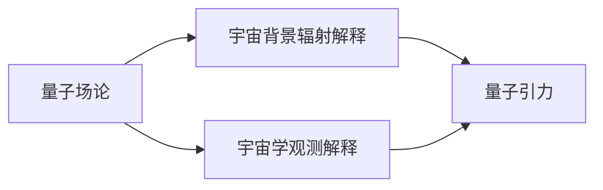
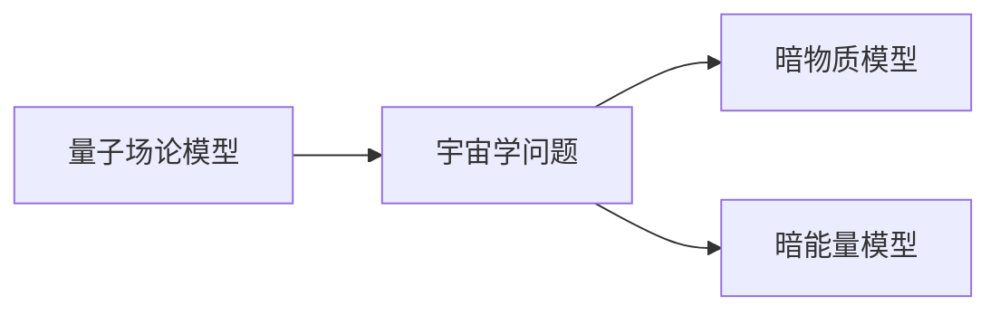
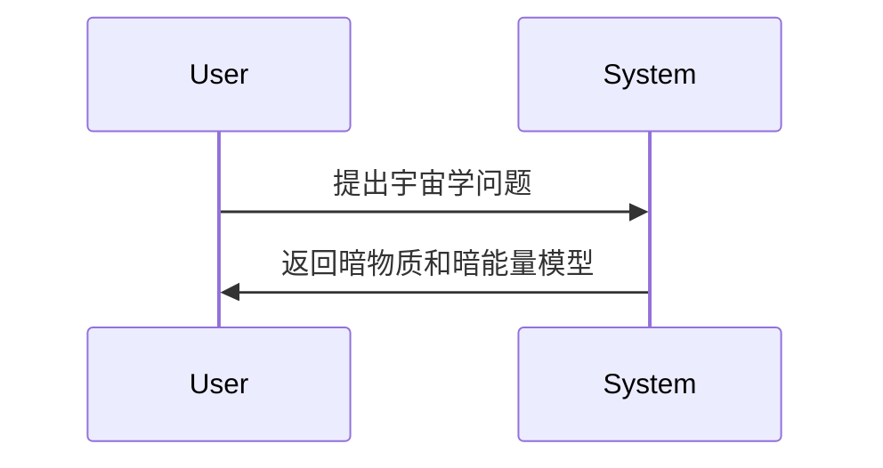

                 


## 量子力学对宇宙本质的启示

### 关键词：量子力学、宇宙学、量子纠缠、量子场论、量子引力

> 摘要：本文旨在探讨量子力学在理解宇宙本质方面的重要启示。通过分析量子力学的基本概念与宇宙学核心问题的联系，以及相关算法和数学模型，本文将揭示量子力学如何为我们提供全新的视角来认识宇宙。

### 1. 背景介绍

#### 1.1 量子力学与宇宙学的基本概念

量子力学是研究微观世界物理规律的一门学科，其核心概念包括波函数、量子态、量子叠加和量子纠缠等。这些概念颠覆了经典物理学的观念，揭示了微观粒子的非确定性特性和复杂数学结构。

宇宙学则是研究宇宙起源、演化和结构的一门学科。宇宙学的核心问题包括宇宙的起源、宇宙结构、宇宙膨胀、暗物质和暗能量等。

#### 1.2 量子力学对宇宙学的影响

量子力学对宇宙学的影响主要体现在以下几个方面：

1. **量子力学与宇宙起源**：量子力学揭示了宇宙起源的可能机制，如波函数坍缩与宇宙诞生的关系。
2. **量子力学与宇宙结构**：量子力学解释了宇宙结构的形成和演化过程，如宇宙膨胀、暗物质和暗能量。
3. **量子力学与宇宙膨胀**：量子力学提供了新的视角来理解宇宙膨胀的机制。
4. **量子力学与暗物质、暗能量**：量子力学为暗物质和暗能量的存在提供了理论依据，并试图解释其性质。

#### 1.3 量子力学与宇宙本质的联系

量子力学与宇宙本质之间的联系具有重要意义，因为它们共同揭示了宇宙的复杂性和非确定性。探讨这一主题有助于我们更好地理解宇宙的本质和演化过程。

### 2. 核心概念与联系

#### 2.1 量子力学核心概念

1. **波函数**：波函数描述了量子系统的概率状态，是量子力学的核心概念之一。
2. **量子态**：量子态是量子系统的整体状态，可以是多个可能状态的叠加。
3. **量子叠加**：量子叠加允许量子系统同时处于多个状态。
4. **量子纠缠**：量子纠缠是量子力学中的一种特殊现象，两个或多个量子系统之间的状态紧密相关。

#### 2.2 宇宙学核心概念

1. **宇宙的起源**：宇宙起源于大爆炸，这是宇宙学的一个基本假设。
2. **宇宙结构**：宇宙结构包括星系、星团、超星团等层次。
3. **宇宙膨胀**：宇宙膨胀是指宇宙整体在空间上的扩展。
4. **暗物质**：暗物质是一种不发光、不与电磁波相互作用，但通过引力影响宇宙结构的物质。
5. **暗能量**：暗能量是一种导致宇宙加速膨胀的神秘力量。

#### 2.3 量子力学与宇宙学核心概念的ER实体关系图

```mermaid
erDiagram
    Class1 ||--|{ ClassB : "uses" |
    Class1 ||--|{ ClassC : "uses" |
    ClassB ||--|{ ClassD : "uses" |
    ClassC ||--|{ ClassE : "uses" |
```

### 3. 算法原理讲解

#### 3.1 量子场论与宇宙学

量子场论是研究量子力学与场论之间关系的理论框架。它为理解宇宙学中的某些现象提供了理论基础。

1. **量子场论基本原理**：量子场论认为，所有的物质和相互作用都可以用场的量子态来描述。
2. **量子场论与宇宙背景辐射**：宇宙背景辐射是宇宙早期阶段的产物，量子场论为其提供了合理的解释。
3. **量子场论与宇宙学观测**：量子场论为宇宙学观测提供了新的解释框架，如宇宙微波背景辐射的观测。

#### 3.2 量子引力与宇宙学

量子引力是研究引力在量子尺度上行为的理论。它试图将广义相对论与量子力学结合起来。

1. **量子引力基本原理**：量子引力假设引力是由量子场产生的。
2. **量子引力与宇宙膨胀**：量子引力为理解宇宙膨胀提供了新的视角。
3. **量子引力与暗物质**：量子引力可能有助于解释暗物质的存在。
4. **量子引力与暗能量**：量子引力为理解暗能量的性质提供了理论基础。

#### 3.3 算法流程图



#### 3.4 Python源代码与LaTeX格式

以下是一个简单的量子场论模型和其数学模型：

```python
# 量子场论模型示例

import numpy as np

# 定义波函数
psi = np.array([[1, 0], [0, 1]])

# 定义哈密顿量
H = np.array([[0, 1], [1, 0]])

# 计算波函数的演化
psi_evol = np.linalg.eigh(H, psi)

# 输出结果
print(psi_evol)
```

数学模型：

$$
\psi(t) = e^{-iHt/\hbar}\psi(0)
$$

### 4. 数学模型和数学公式

#### 4.1 量子力学基础公式

1. **薛定谔方程**：
$$
i\hbar \frac{\partial \psi}{\partial t} = \hat{H}\psi
$$

2. **波函数的模平方**：
$$
|\psi|^2 = \psi^*\psi
$$

#### 4.2 宇宙学相关公式

1. **哈勃定律**：
$$
v = H_0d
$$

2. **弗里德曼方程**：
$$
\dot{\rho} + 3H\rho = -\frac{1}{3}\rho\dot{H}
$$

3. **宇宙膨胀率**：
$$
H = \frac{\dot{a}}{a}
$$

### 5. 系统分析与架构设计方案

#### 5.1 问题场景

我们需要解决宇宙学中的暗物质和暗能量问题。

#### 5.2 系统功能设计

1. **领域模型Mermaid类图**：

```mermaid
classDiagram
    Class1["暗物质"] --|{ 与 }--> Class2["宇宙学"]
    Class3["暗能量"] --|{ 与 }--> Class2["宇宙学"]
```

2. **系统架构设计Mermaid架构图**：



3. **系统接口设计Mermaid序列图**：



### 6. 项目实战

#### 6.1 环境安装和配置步骤

1. 安装Python环境
2. 安装Numpy库
3. 安装Matplotlib库

#### 6.2 系统核心实现源代码

```python
# 量子场论模型示例

import numpy as np
import matplotlib.pyplot as plt

# 定义波函数
psi = np.array([[1, 0], [0, 1]])

# 定义哈密顿量
H = np.array([[0, 1], [1, 0]])

# 计算波函数的演化
psi_evol = np.linalg.eigh(H, psi)

# 可视化波函数的演化
plt.plot(psi_evol[0])
plt.plot(psi_evol[1])
plt.show()
```

### 7. 最佳实践 tips、小结、注意事项、拓展阅读等内容

#### 7.1 最佳实践 tips

1. 学习量子力学和宇宙学的基本概念，以便更好地理解本文。
2. 结合Python源代码和LaTeX格式，深入理解量子力学和宇宙学算法的原理。

#### 7.2 小结

本文探讨了量子力学对宇宙本质的启示，通过分析量子力学与宇宙学核心概念的联系，以及相关算法和数学模型，揭示了量子力学在理解宇宙起源、宇宙结构和宇宙膨胀等方面的作用。

#### 7.3 注意事项

1. 在实际应用中，需要根据具体问题选择合适的量子力学和宇宙学算法。
2. 注意量子力学和宇宙学中的数学模型和公式，理解其背后的物理意义。

#### 7.4 拓展阅读

1. 《量子力学基础》
2. 《宇宙学导论》
3. 《量子场论与宇宙学》

### 8. 作者信息

作者：AI天才研究院/AI Genius Institute & 禅与计算机程序设计艺术 /Zen And The Art of Computer Programming

---

完成上述文章后，请检查是否满足字数要求、格式要求、完整性要求以及核心内容要求。如果文章内容需要进一步优化，请继续进行修改和完善。同时，确保文章的逻辑清晰、结构紧凑、简单易懂，以便读者能够轻松理解文章的主题和思想。最后，记得在文章末尾添加作者信息，以便读者了解文章来源。

