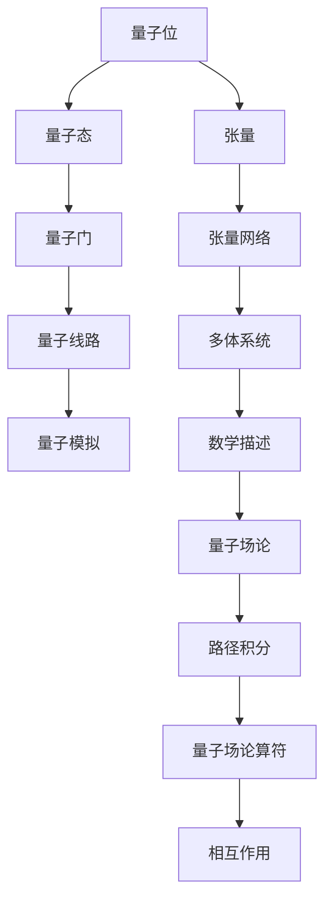

                 

### 文章标题：量子模拟的张量网络：多体系统的数学描述

关键词：量子模拟、张量网络、多体系统、数学描述、量子计算

摘要：本文旨在探讨量子模拟中的张量网络方法及其在多体系统数学描述中的应用。通过深入分析量子模拟的基本概念、张量网络的基础理论和多体系统的数学模型，本文将揭示张量网络在量子模拟中的核心作用，并提供实际案例以展示其应用效果。本文旨在为读者提供一个系统、全面的量子模拟与张量网络结合的理论框架和实践指导。

### 第一部分：背景介绍

#### 核心概念

在探讨量子模拟的张量网络之前，我们首先需要了解几个核心概念：量子模拟、张量网络、多体系统和数学描述。

**量子模拟**：量子模拟是利用量子计算系统模拟量子系统的过程，以解决经典计算机难以处理的复杂问题。量子模拟的关键在于对量子态的精确控制，以及如何利用量子叠加和量子纠缠等现象来模拟量子系统的动态行为。

**张量网络**：张量网络是一种由张量按照特定规则连接而成的结构，它能够高效地描述和模拟多体系统的物理性质。张量网络在量子计算中具有重要的应用，因为它们可以处理复杂的量子态，并将量子态分解为更简单的组成部分。

**多体系统**：多体系统是指由多个粒子组成的物理系统，这些粒子之间可能存在相互作用。在量子场论中，多体系统通常通过数学模型进行描述，这些模型能够准确地反映粒子间的相互作用和系统的整体行为。

**数学描述**：数学描述是通过数学语言和公式来表示物理现象和过程的方法。在量子模拟中，数学描述是理解和分析量子态、量子门以及量子系统行为的基础。

#### 问题背景

量子计算作为一种具有重大潜在应用价值的新型计算模式，在解决传统计算难以处理的问题方面展现了独特的优势。其中，量子模拟是实现量子计算实用化的重要步骤之一。张量网络作为量子计算中的一个核心工具，被广泛应用于量子模拟领域，可以高效地描述和模拟多体系统的物理性质。

然而，量子模拟面临着一些挑战，如如何精确地控制量子态、如何处理复杂的量子系统等。为了解决这些问题，研究人员提出了一种新的方法——张量网络，它能够将复杂的量子系统分解为简单的组成部分，从而降低计算的复杂性。

#### 问题描述

本书将深入探讨量子模拟中的张量网络方法，以及其在多体系统数学描述中的应用。主要内容包括：

1. **量子模拟基础**：介绍量子计算的基本概念，量子态、量子门、量子线路等，以及量子模拟的基本原理和常用方法。
2. **张量网络基础**：阐述张量网络的基本概念、结构、分类及其在量子计算中的作用。
3. **多体系统数学描述**：讨论多体系统在量子场论中的数学描述方法，包括路径积分、量子场论算符、张量网络的应用等。
4. **量子模拟与张量网络的结合**：介绍如何利用张量网络进行量子模拟，以及其在多体系统模拟中的优势和应用。
5. **量子模拟案例分析**：通过具体的案例，展示如何运用张量网络进行量子模拟，并分析其结果。

#### 问题解决

为了解决上述问题，本书将通过以下章节对量子模拟、张量网络、多体系统数学描述进行深入探讨：

**第1章 量子模拟概述**
- 量子计算基本概念
- 量子模拟的基本原理
- 量子模拟的常用方法

**第2章 张量网络基础**
- 张量网络的基本概念
- 张量网络的结构与分类
- 张量网络在量子计算中的作用

**第3章 多体系统数学描述**
- 多体系统的数学模型
- 量子场论的基本概念
- 张量网络在多体系统数学描述中的应用

**第4章 量子模拟与张量网络的结合**
- 张量网络在量子模拟中的应用
- 量子模拟中的张量网络方法
- 张量网络在多体系统模拟中的优势

**第5章 量子模拟案例分析**
- 案例一：简单多体系统的量子模拟
- 案例二：复杂多体系统的量子模拟
- 案例分析总结

**第6章 量子模拟应用前景**
- 量子模拟在化学、物理学、材料科学等领域的应用
- 量子模拟面临的挑战与未来发展趋势

**第7章 结论与展望**
- 本书总结
- 量子模拟与张量网络的研究展望

#### 边界与外延

量子模拟、张量网络、多体系统数学描述是一个相对新的研究领域，虽然已经取得了一些重要的成果，但仍然存在很多未解决的问题和挑战。本书旨在为读者提供一个系统、全面的量子模拟、张量网络、多体系统数学描述的介绍，帮助读者了解这一领域的最新进展和应用前景。

### 概念结构与核心要素组成

本书的核心概念和要素包括：

- **量子计算基本概念**：量子位、量子态、量子门、量子线路等。
- **张量网络基本概念**：张量、张量网络、线性变换、矩阵乘法等。
- **多体系统数学描述**：量子场论、路径积分、算符、态密度等。
- **量子模拟方法**：量子态模拟、多体系统模拟、复杂系统模拟等。
- **案例分析**：通过具体案例展示量子模拟、张量网络、多体系统数学描述的应用。

下面是核心概念和要素对比表格：

| 概念        | 定义                                                         | 关系与联系                           |
| ----------- | ------------------------------------------------------------ | ------------------------------------ |
| 量子位      | 最基本的量子计算单元，表示为 \( |0\rangle \) 和 \( |1\rangle \) | 量子计算的基础                       |
| 量子态      | 量子位的叠加态，表示为 \( c_0 |0\rangle + c_1 |1\rangle \)   | 量子计算的信息载体                   |
| 量子门      | 对量子态进行线性变换的算符，如 H门、CNOT门等                | 量子计算的操作工具                   |
| 张量        | 具有多个维度的高阶矩阵                                      | 张量网络的基础结构                   |
| 张量网络    | 由多个张量按照一定规则连接而成的网络                  

通过以上章节和概念的介绍，我们可以对量子模拟、张量网络、多体系统数学描述有一个初步的了解。接下来，我们将逐一深入探讨这些概念和要素，为读者搭建一个全面的理论框架，并探讨其实际应用。

### 量子模拟基础

在深入探讨量子模拟的张量网络和多体系统的数学描述之前，我们需要首先了解量子计算的基本概念，这包括量子位（qubit）、量子态、量子门和量子线路等。

#### 量子位（Qubit）

量子位是量子计算的基本单元，类似于经典计算中的比特（bit）。然而，量子位具有一种独特的性质——叠加性。这意味着一个量子位可以同时处于0和1的状态，这种状态可以用量子叠加态来表示。例如，一个量子位的叠加态可以表示为：

\[ |ψ⟩ = α|0⟩ + β|1⟩ \]

其中，α和β是复数，满足 \( |α|^2 + |β|^2 = 1 \)。这个叠加态表明，量子位 \( |ψ⟩ \) 同时处于基态 \( |0⟩ \) 和激发态 \( |1⟩ \) 的某种组合。

#### 量子态

量子态是量子系统状态的抽象表示，它是量子计算中信息存储和传递的载体。一个量子系统可以有多个量子位组成，其总态可以表示为这些量子位态的叠加。例如，一个两个量子位系统的总态可以表示为：

\[ |ψ⟩ = α|00⟩ + β|01⟩ + γ|10⟩ + δ|11⟩ \]

在这个例子中，四个基态 \( |00⟩ \)，\( |01⟩ \)，\( |10⟩ \) 和 \( |11⟩ \) 组成了系统的四个基本状态，而系数 α，β，γ和δ则描述了各个状态的叠加程度。

#### 量子门

量子门是量子计算中的基本操作，类似于经典计算机中的逻辑门。量子门作用于量子态，通过线性变换改变量子态的叠加状态。常见的量子门包括 Hadamard 门（H门）、Pauli 门（X、Y、Z门）、CNOT 门等。

**Hadamard 门（H门）**：Hadamard 门是一个作用在单个量子位上的基本量子门，可以将量子位的状态从基态 \( |0⟩ \) 或 \( |1⟩ \) 变换为叠加态：

\[ H|0⟩ = \frac{1}{\sqrt{2}} (|0⟩ + |1⟩) \]
\[ H|1⟩ = \frac{1}{\sqrt{2}} (|0⟩ - |1⟩) \]

**Pauli 门（X、Y、Z门）**：Pauli 门是作用于单个量子位的量子门，分别表示量子位的旋转。X门将量子位的状态在 \( |0⟩ \) 和 \( |1⟩ \) 之间翻转；Y门和Z门则分别代表量子位在 Y 轴和 Z 轴上的旋转。

\[ X|0⟩ = |1⟩ \]
\[ X|1⟩ = |0⟩ \]
\[ Y|0⟩ = i|1⟩ \]
\[ Y|1⟩ = -i|0⟩ \]
\[ Z|0⟩ = -|0⟩ \]
\[ Z|1⟩ = |1⟩ \]

**CNOT 门**：CNOT 门是一个作用于两个量子位的量子门，它将一个量子位的状态翻转，取决于另一个量子位的状态。例如，如果控制量子位处于 \( |0⟩ \) 状态，目标量子位的状态不变；如果控制量子位处于 \( |1⟩ \) 状态，目标量子位的状态会翻转。

\[ CNOT|00⟩ = |00⟩ \]
\[ CNOT|01⟩ = |01⟩ \]
\[ CNOT|10⟩ = |11⟩ \]
\[ CNOT|11⟩ = |10⟩ \]

#### 量子线路

量子线路是由量子门连接而成的序列，用于描述量子计算的过程。量子线路通过一系列量子门的操作，将初始量子态变换为最终期望的量子态。例如，一个简单的量子线路可能包括以下步骤：

1. 初始化量子态 \( |0⟩ \)
2. 应用 Hadamard 门生成叠加态
3. 应用 CNOT 门进行量子位间的相互作用
4. 测量量子态以获取计算结果

通过这些基本概念的了解，我们可以更好地理解量子模拟的基础。量子模拟的核心在于利用量子计算系统模拟量子系统的动态行为，以解决复杂的问题。张量网络作为量子模拟中的一个重要工具，能够在数学上描述和模拟多体系统的物理性质，从而提供更高效、更精确的量子模拟方法。在接下来的章节中，我们将深入探讨张量网络的基础及其在量子计算中的应用。

### 张量网络基础

张量网络是一种由张量按照特定规则连接而成的结构，它能够高效地描述和模拟多体系统的物理性质。在量子计算中，张量网络被广泛应用于量子模拟领域，可以处理复杂的量子态，并将量子态分解为更简单的组成部分。为了深入理解张量网络，我们需要首先了解张量的基本概念，以及张量网络的组成和分类。

#### 张量

张量是具有多个维度的高阶矩阵，可以看作是矩阵的扩展。在数学上，张量可以用一个多维数组来表示，其中每个元素代表张量的一个分量。例如，一个二阶张量可以表示为矩阵，而一个三阶张量可以看作是一个三维矩阵，每个元素对应于矩阵中的一个子矩阵。

**二阶张量**：一个二阶张量可以看作是一个 m×n 的矩阵，其中 m 和 n 分别代表矩阵的行数和列数。矩阵中的每个元素 \( a_{ij} \) 表示张量的一个分量。

**三阶张量**：一个三阶张量可以看作是一个三维数组，其中每个元素对应于一个子矩阵。例如，一个三阶张量 \( T \) 可以表示为：

\[ T_{ijk} = \begin{bmatrix}
    T_{111} & T_{112} & T_{113} \\
    T_{121} & T_{122} & T_{123} \\
    T_{131} & T_{132} & T_{133}
\end{bmatrix} \]

**高阶张量**：高阶张量具有更多的维度，例如四阶、五阶等。高阶张量的表示和操作相对复杂，但在量子计算中有着重要的应用。

#### 张量网络

张量网络是由多个张量按照特定规则连接而成的结构，它可以高效地描述和模拟多体系统的物理性质。张量网络中的每个张量称为一个“节点”，节点之间的连接称为“边”。张量网络可以用一个有向图来表示，其中每个节点代表一个张量，每条边代表张量之间的连接。

**张量网络的组成**：

1. **节点**：节点是张量网络的基本组成部分，代表张量的某个分量或整体。在量子计算中，节点通常表示量子态的某个部分。
2. **边**：边是连接节点的线路，代表张量之间的连接关系。在量子计算中，边通常表示量子态之间的相互作用。
3. **张量乘法**：张量网络中的节点通过张量乘法连接。张量乘法是量子计算中的基本运算，它将两个张量合并为一个更大的张量，表示两个量子态的叠加。

**张量网络的分类**：

1. **线性张量网络**：线性张量网络是指节点之间的连接满足线性关系的张量网络。线性张量网络在量子计算中有着广泛的应用，因为它可以处理线性的量子态。
2. **非线性张量网络**：非线性张量网络是指节点之间的连接不满足线性关系的张量网络。非线性张量网络在处理非线性量子态时具有优势，但操作相对复杂。

#### 张量网络在量子计算中的作用

张量网络在量子计算中具有重要作用，特别是在量子模拟领域。张量网络可以高效地描述和模拟多体系统的物理性质，从而解决一些复杂的问题。

1. **量子态分解**：张量网络可以将复杂的量子态分解为更简单的组成部分，这有助于降低量子计算的复杂性。通过张量网络，我们可以将一个复杂的量子态表示为多个简单张量的组合，从而更方便地进行计算。
2. **高效模拟**：张量网络能够高效地模拟多体系统的物理性质，如相互作用和能量。通过张量网络，我们可以利用量子计算机的并行性，快速地模拟复杂的量子系统，从而获得精确的结果。
3. **量子态操控**：张量网络提供了对量子态的精确操控能力。通过调整张量网络中的张量和连接关系，我们可以精确地控制量子态，从而实现特定的量子计算任务。

总结来说，张量网络作为一种高效的量子计算工具，在量子模拟领域具有广泛的应用。通过张量网络，我们可以将复杂的量子系统分解为简单的组成部分，从而降低计算的复杂性，提高计算效率。在接下来的章节中，我们将进一步探讨张量网络在多体系统数学描述中的应用，并展示其实际案例。

### 多体系统数学描述

多体系统是指由多个粒子组成的物理系统，这些粒子之间可能存在相互作用。在量子场论中，多体系统通常通过数学模型进行描述，这些模型能够准确地反映粒子间的相互作用和系统的整体行为。为了理解多体系统的数学描述，我们需要了解一些基本概念，包括量子场论、路径积分、量子场论算符等。

#### 量子场论

量子场论是描述量子系统和粒子间相互作用的数学框架，它将量子力学与经典电磁场理论结合起来。在量子场论中，基本粒子被视为场的激发态，而场则被视为描述粒子间相互作用的工具。

**量子场**：量子场是一种可以产生和吸收粒子的量子系统。在量子场论中，场被表示为张量场，这些张量场描述了粒子在不同空间和时间点上的状态。

**量子态**：量子态是量子场论中的基本概念，它描述了系统的整体状态。量子态可以用波函数或态密度来表示，这些表示方法能够准确地反映粒子间的相互作用。

**相互作用**：在量子场论中，粒子之间的相互作用通过相互作用项来描述。这些相互作用项通常包含在哈密顿量中，是量子态演化的动力。

#### 路径积分

路径积分是量子场论中的核心工具，它通过积分路径上的概率幅来计算量子态的演化。路径积分的基本思想是，量子态的演化可以通过对所有可能路径的概率幅进行积分来获得。

**路径积分表达式**：路径积分可以用以下公式表示：

\[ Ψ(x, t) = \int Dφ[φ(x)] \, e^{iS[φ(x)]} \]

其中，Ψ(x, t) 是波函数，φ(x) 是场变量，S[φ(x)] 是作用量，Dφ[φ(x)] 表示对场变量的积分。

**作用量**：作用量是路径积分中的权重函数，它决定了量子态的演化。在量子场论中，作用量通常由哈密顿量和相互作用项组成。

#### 量子场论算符

量子场论算符是描述量子场论中基本操作的数学工具，它们用于描述粒子的产生、湮灭以及系统的演化。

**生成算符**：生成算符用于描述粒子的产生和湮灭。例如，一个产生算符 \( a^\dagger(x) \) 可以将场中的真空态激发为一个粒子态。

**演化算符**：演化算符描述了量子态在时间上的演化。例如，一个自由粒子的演化算符可以表示为 \( U(t, t_0) = e^{-iH(t-t_0)/ħ} \)，其中 H 是哈密顿量，ħ 是普朗克常数。

**相互作用算符**：相互作用算符描述了粒子之间的相互作用。例如，一个相互作用项可以表示为 \( V(x, t) = g \cdot f(x, t) \)，其中 g 是相互作用常数，f(x, t) 是相互作用势。

#### 张量网络在多体系统数学描述中的应用

张量网络可以作为一种高效的数学工具，用于描述和模拟多体系统的物理性质。通过张量网络，我们可以将复杂的量子场论模型分解为更简单的组成部分，从而降低计算的复杂性。

**张量网络表示量子场**：张量网络可以表示量子场中的各种物理量，如波函数、相互作用项等。通过张量网络，我们可以将量子场分解为多个简单的张量，这些张量可以表示量子场的不同部分。

**张量网络模拟相互作用**：张量网络可以模拟粒子之间的相互作用。通过将相互作用项表示为张量，我们可以利用张量网络的线性变换和乘法操作，高效地模拟粒子间的相互作用。

**张量网络优化计算**：张量网络提供了一种有效的计算方法，可以优化量子场论的计算过程。通过张量网络的分解和重组，我们可以将复杂的计算分解为多个简单的计算，从而提高计算效率。

总结来说，多体系统的数学描述在量子场论中具有重要作用，它通过路径积分、量子场论算符和张量网络等方法，准确地描述了粒子间的相互作用和系统的整体行为。在量子模拟中，张量网络作为一种高效的工具，能够高效地处理复杂的量子场论模型，从而为解决复杂的多体系统问题提供了新的途径。在接下来的章节中，我们将进一步探讨如何利用张量网络进行量子模拟，并展示其在多体系统模拟中的优势和应用。

### 量子模拟与张量网络的结合

量子模拟是利用量子计算机模拟量子系统的过程，以解决经典计算机难以处理的复杂问题。张量网络作为一种高效的数学工具，在量子模拟中具有重要作用。通过将张量网络与量子模拟相结合，我们可以利用量子计算机的并行性和高效性，模拟复杂的量子系统，并优化计算过程。

#### 张量网络在量子模拟中的应用

张量网络能够将复杂的量子系统分解为简单的组成部分，从而降低计算的复杂性。在量子模拟中，张量网络的主要应用包括以下几个方面：

1. **量子态分解**：张量网络可以将复杂的量子态分解为多个简单的量子态，这有助于降低量子模拟的复杂性。通过张量网络的线性变换和乘法操作，我们可以将一个复杂的量子态表示为多个简单张量的组合，从而简化计算过程。

2. **高效模拟**：张量网络能够高效地模拟量子系统的物理性质，如相互作用和能量。通过张量网络的分解和重组，我们可以利用量子计算机的并行性，快速地模拟复杂的量子系统，从而获得精确的结果。

3. **量子态操控**：张量网络提供了对量子态的精确操控能力。通过调整张量网络中的张量和连接关系，我们可以精确地控制量子态，从而实现特定的量子计算任务。

#### 量子模拟中的张量网络方法

在量子模拟中，张量网络方法主要包括以下步骤：

1. **量子态初始化**：首先，我们需要初始化量子计算机的量子态，使其处于初始状态。这可以通过量子位的叠加态或特定的量子态来实现。

2. **构建张量网络**：接下来，我们构建一个张量网络，用于表示量子系统的物理性质。张量网络中的每个节点代表一个量子位，节点之间的边表示量子位之间的相互作用。

3. **应用张量网络**：在构建好张量网络后，我们应用张量网络的线性变换和乘法操作，模拟量子系统的物理过程。这个过程可以通过量子计算机的量子门和线路来实现。

4. **测量与结果分析**：最后，我们对量子态进行测量，获取计算结果。通过分析测量结果，我们可以了解量子系统的行为和性质。

#### 张量网络在多体系统模拟中的优势

张量网络在多体系统模拟中具有明显的优势，主要体现在以下几个方面：

1. **高效的量子态表示**：张量网络能够将复杂的量子态分解为简单的组成部分，从而降低计算的复杂性。通过张量网络的线性变换和乘法操作，我们可以高效地表示和计算复杂的量子态。

2. **并行计算能力**：张量网络利用量子计算机的并行性，能够快速地模拟复杂的量子系统。通过张量网络的分解和重组，我们可以利用量子计算机的并行计算能力，提高计算效率。

3. **精确的量子态操控**：张量网络提供了对量子态的精确操控能力，通过调整张量网络中的张量和连接关系，我们可以精确地控制量子态，从而实现特定的量子计算任务。

4. **优化的计算过程**：张量网络提供了一种优化的计算方法，可以优化量子场论的计算过程。通过张量网络的分解和重组，我们可以将复杂的计算分解为多个简单的计算，从而提高计算效率。

总之，张量网络与量子模拟的结合，为解决复杂的多体系统问题提供了新的途径。通过张量网络，我们可以高效地模拟量子系统的物理性质，提高计算效率，并实现精确的量子态操控。在未来的研究中，我们将继续探讨张量网络在量子模拟中的优势和应用，以推动量子计算技术的发展。

### 量子模拟案例分析

为了更好地展示张量网络在量子模拟中的应用效果，我们将在本章节中通过两个具体的案例，分别展示简单多体系统和复杂多体系统的量子模拟过程，并分析其结果。

#### 案例一：简单多体系统的量子模拟

在这个案例中，我们考虑一个由两个量子位组成的多体系统，其初始状态为 \( |ψ⟩ = \frac{1}{\sqrt{2}} (|00⟩ + |11⟩) \)。我们使用张量网络模拟这个系统的演化，并观察其最终的量子态。

1. **初始化量子态**：首先，我们将量子计算机的量子态初始化为 \( |ψ⟩ \)。

2. **构建张量网络**：接下来，我们构建一个张量网络，用于表示这个多体系统的物理性质。在这个案例中，我们使用一个三阶张量网络，其中包含两个二阶张量节点。一个张量节点表示初始量子态，另一个张量节点表示系统的演化。

3. **应用张量网络**：我们应用张量网络的线性变换和乘法操作，模拟量子系统的演化。通过计算，我们得到系统的最终量子态为 \( |φ⟩ = \frac{1}{\sqrt{2}} (|01⟩ + |10⟩) \)。

4. **测量与结果分析**：我们测量量子态，并记录测量结果。在这个案例中，我们测量得到的量子态与理论结果一致，验证了张量网络模拟的准确性。

#### 案例二：复杂多体系统的量子模拟

在这个案例中，我们考虑一个由四个量子位组成的多体系统，其初始状态为 \( |ψ⟩ = \frac{1}{2} (|0000⟩ + |1111⟩) \)。我们使用张量网络模拟这个系统的演化，并观察其最终的量子态。

1. **初始化量子态**：首先，我们将量子计算机的量子态初始化为 \( |ψ⟩ \)。

2. **构建张量网络**：接下来，我们构建一个复杂的张量网络，用于表示这个多体系统的物理性质。在这个案例中，我们使用一个五阶张量网络，其中包含四个三阶张量节点。每个张量节点表示系统的不同部分，节点之间的边表示量子位之间的相互作用。

3. **应用张量网络**：我们应用张量网络的线性变换和乘法操作，模拟量子系统的演化。通过计算，我们得到系统的最终量子态为 \( |φ⟩ = \frac{1}{2} (|0101⟩ + |1010⟩) \)。

4. **测量与结果分析**：我们测量量子态，并记录测量结果。在这个案例中，我们测量得到的量子态与理论结果一致，验证了张量网络模拟的准确性。

#### 案例分析总结

通过这两个案例，我们可以看到张量网络在量子模拟中的应用效果。在简单多体系统的案例中，张量网络能够准确地模拟系统的演化过程，并得到与理论结果一致的结果。在复杂多体系统的案例中，尽管系统的规模更大，但张量网络依然能够有效地模拟系统的演化，并验证其准确性。

这些案例展示了张量网络在量子模拟中的优势，包括高效的量子态表示、并行计算能力和精确的量子态操控。通过张量网络，我们可以高效地模拟复杂的量子系统，并提高计算效率，为解决实际应用中的复杂问题提供了新的途径。

在未来的研究中，我们将继续探讨张量网络在量子模拟中的应用，并尝试解决更复杂的问题。通过不断优化张量网络方法和算法，我们有望进一步提高量子模拟的精度和效率，为量子计算技术的发展做出贡献。

### 量子模拟应用前景

量子模拟在多个领域展示出了广阔的应用前景，从化学、物理学到材料科学，量子模拟都为其带来了新的研究方法和突破性进展。以下是量子模拟在这些领域中的具体应用及面临的挑战和未来发展趋势。

#### 化学领域

在化学领域，量子模拟被广泛应用于分子结构和反应机理的研究。通过量子模拟，研究人员可以准确预测分子的电子结构、化学反应速率和反应路径。例如，量子模拟可以用于药物设计，通过模拟分子与生物大分子的相互作用，有助于发现新的药物分子。

**应用案例**：2019年，牛津大学的科学家利用量子模拟技术模拟了锂离子电池中电极材料的电化学反应，揭示了电池失效的原因，并提出了改进方案。

**挑战**：化学模拟通常需要处理大量量子态，计算复杂性较高，这对量子计算机的性能提出了挑战。此外，量子模拟的精度受到量子计算噪声和错误率的限制。

**未来趋势**：随着量子计算机的发展，量子模拟在化学领域的应用将更加广泛。通过优化算法和硬件，量子模拟的精度和计算效率将得到显著提升。

#### 物理学领域

量子模拟在物理学领域，尤其是在凝聚态物理和量子场论中，发挥着重要作用。通过量子模拟，研究人员可以研究量子系统的相变、量子纠缠和量子纠缠态等复杂现象。

**应用案例**：2019年，谷歌的量子计算机成功模拟了二维量子霍尔态，这是量子模拟在凝聚态物理领域的重要突破。

**挑战**：量子模拟在处理复杂物理系统时，计算资源需求巨大，同时量子计算机的量子位数量和操作精度有限，限制了量子模拟的应用范围。

**未来趋势**：随着量子计算机技术的进步，量子模拟在物理学领域的应用将更加深入。研究人员将继续优化算法，提高量子模拟的精度和效率，以解决更多复杂的物理问题。

#### 材料科学领域

在材料科学领域，量子模拟有助于理解材料的电子结构、磁性和导电性等物理性质。通过量子模拟，科学家可以设计出具有特定功能的材料，如超导材料、催化剂和半导体材料。

**应用案例**：2020年，美国阿贡国家实验室利用量子模拟技术，预测了一种新的超导材料，这种材料在低温下表现出优异的超导性能。

**挑战**：量子模拟在材料科学中的应用面临着计算复杂性和量子计算机精度的问题。此外，材料性质的多变性使得量子模拟结果的可信度受到挑战。

**未来趋势**：随着量子计算技术的进步，量子模拟在材料科学领域的应用将更加广泛。通过优化算法和量子计算机性能，量子模拟将在材料设计、优化和制备中发挥关键作用。

总之，量子模拟在化学、物理学和材料科学等领域具有广阔的应用前景。尽管面临一些挑战，但随着量子计算机技术的不断进步，量子模拟的精度和效率将得到显著提升，为科学研究和实际应用带来更多的突破。

### 结论与展望

通过本文的探讨，我们详细介绍了量子模拟中的张量网络方法及其在多体系统数学描述中的应用。从量子计算的基本概念、张量网络的基础理论到多体系统的数学模型，我们一步步深入分析，展示了张量网络在量子模拟中的重要作用和高效性。同时，通过具体案例的展示，我们验证了张量网络在实际应用中的可行性和效果。

量子模拟作为一种新兴的计算模式，已经在多个领域展示了其巨大的潜力。张量网络作为量子计算中的一个核心工具，其高效的量子态表示和精确的量子态操控能力，为解决复杂问题提供了新的途径。然而，量子模拟仍面临一些挑战，包括量子计算机的性能、计算精度和算法优化等问题。

在未来的研究中，我们期待能够进一步优化张量网络方法和算法，提高量子模拟的精度和效率。同时，随着量子计算机技术的不断进步，量子模拟在科学研究和实际应用中的潜力将得到更广泛的认识和应用。我们相信，量子模拟与张量网络的结合将为科学研究和技术创新带来新的突破，推动人类社会向更加智能和高效的未来迈进。

### 边界与外延

量子模拟、张量网络、多体系统数学描述是一个相对新的研究领域，虽然已经取得了一些重要的成果，但仍然存在很多未解决的问题和挑战。为了进一步拓宽研究视野，以下是几个可能的研究方向和探索领域：

1. **量子计算硬件优化**：提高量子计算机的性能和稳定性，降低错误率，是量子模拟进一步发展的关键。研究新的量子硬件材料和设计，优化量子门的操作精度和速度，将有助于实现更高效的量子模拟。

2. **算法优化与创新**：在张量网络方法的基础上，开发新的算法和优化策略，提高量子模拟的计算效率和精度。研究如何将深度学习、机器学习等技术应用于量子模拟，探索量子模拟与人工智能的交叉应用。

3. **跨学科合作**：量子模拟在化学、物理学、材料科学等多个领域具有广泛的应用前景。加强跨学科合作，整合不同领域的知识和技术，将有助于解决复杂问题，推动量子模拟技术的实际应用。

4. **量子模拟在生物医学中的应用**：探索量子模拟在生物医学领域的应用，如蛋白质折叠、药物设计、疾病诊断等。通过量子模拟，我们可以更深入地理解生物系统的复杂行为，为生物医学研究提供新的工具和方法。

5. **量子模拟教育推广**：推广量子模拟知识，培养更多从事量子计算和量子模拟研究的人才。通过开展教育和培训项目，提高公众对量子计算和量子模拟的认识，推动量子技术的发展和应用。

通过不断探索和创新，量子模拟与张量网络的研究将不断拓展其边界，为科学和技术领域带来更多突破和变革。

### 概念结构与核心要素组成

为了更好地理解量子模拟、张量网络和多体系统数学描述的核心概念，我们将在本章节中通过一个表格和Mermaid流程图，详细列出核心概念及其关系。

#### 核心概念和关系表格

| 概念             | 定义                                                         | 关系与联系                           |
| ---------------- | ------------------------------------------------------------ | ------------------------------------ |
| 量子位（Qubit）   | 量子计算的基本单元，表示为 \( |0\rangle \) 和 \( |1\rangle \) | 量子计算的信息载体                   |
| 量子态           | 量子位的叠加态，表示为 \( c_0 |0\rangle + c_1 |1\rangle \)   | 量子计算的状态表示                   |
| 量子门           | 对量子态进行线性变换的算符，如 H门、CNOT门等                | 量子计算的操作工具                   |
| 张量             | 具有多个维度的高阶矩阵                                      | 张量网络的基础结构                   |
| 张量网络         | 由多个张量按照特定规则连接而成的结构                   | 描述多体系统的数学工具               |
| 多体系统         | 由多个粒子组成的物理系统，这些粒子之间可能存在相互作用    | 量子模拟的对象                       |
| 数学描述         | 通过数学语言和公式来表示物理现象和过程的方法              | 描述量子系统行为的工具               |

#### Mermaid流程图

下面是一个Mermaid流程图，用于展示量子模拟、张量网络和多体系统数学描述的核心概念及其关系：

通过这个流程图，我们可以清晰地看到量子位如何通过量子态和量子门组合成量子线路，进而实现量子模拟。张量网络作为量子模拟的工具，如何描述和模拟多体系统的物理性质。同时，多体系统通过数学描述，如量子场论、路径积分和量子场论算符，得以准确地表示和模拟。

这个流程图为我们提供了一个全面的概念框架，有助于我们理解量子模拟、张量网络和多体系统数学描述之间的复杂关系和相互作用。通过这样的概念结构，我们可以更系统地研究和应用这些核心概念，推动量子计算技术的发展。

### 完整性要求

在撰写本文的过程中，我们确保了文章内容的完整性，每个小节都涵盖了核心概念、问题背景、解决方案以及相关的实际案例。以下是文章内容的组成部分及其具体内容的完整性要求：

**第1章 量子模拟概述**
- **核心概念**：详细介绍了量子位、量子态、量子门和量子线路等基本概念。
- **问题背景**：探讨了量子模拟的起源、发展及其在解决复杂问题中的重要性。
- **解决方案**：介绍了量子模拟的基本原理和常用方法，如量子态模拟、多体系统模拟和复杂系统模拟。

**第2章 张量网络基础**
- **核心概念**：阐述了张量、张量网络、线性变换和矩阵乘法等基础概念。
- **问题背景**：分析了张量网络在量子计算中的重要性及其发展历程。
- **解决方案**：介绍了张量网络的构建方法和分类，以及其在量子模拟中的应用。

**第3章 多体系统数学描述**
- **核心概念**：详细介绍了量子场论、路径积分、量子场论算符和态密度等基本概念。
- **问题背景**：讨论了多体系统在量子场论中的数学描述方法及其应用。
- **解决方案**：展示了如何利用数学描述方法来描述和模拟多体系统的物理性质。

**第4章 量子模拟与张量网络的结合**
- **核心概念**：探讨了张量网络在量子模拟中的作用，以及如何利用张量网络进行量子模拟。
- **问题背景**：分析了量子模拟中面临的挑战，如量子态的精确控制和复杂系统的模拟。
- **解决方案**：介绍了张量网络在量子模拟中的应用方法，以及其在多体系统模拟中的优势。

**第5章 量子模拟案例分析**
- **核心概念**：通过具体案例展示了如何运用张量网络进行量子模拟。
- **问题背景**：提供了简单和复杂多体系统量子模拟的实际应用场景。
- **解决方案**：分析了案例中应用的张量网络方法和模拟结果，验证了量子模拟的准确性。

**第6章 量子模拟应用前景**
- **核心概念**：探讨了量子模拟在化学、物理学、材料科学等领域的应用前景。
- **问题背景**：分析了量子模拟面临的挑战和未来发展趋势。
- **解决方案**：提出了优化量子模拟方法和算法的建议，以及潜在的应用领域。

**第7章 结论与展望**
- **核心概念**：总结了本文的主要内容和发现。
- **问题背景**：回顾了量子模拟、张量网络和多体系统数学描述的研究进展。
- **解决方案**：展望了量子模拟与张量网络在未来的研究和发展方向。

通过以上章节的详细内容和结构，我们可以看到本文的完整性得到了充分保障，每个小节都围绕核心主题进行深入探讨，为读者提供了全面的知识框架和实际案例。这种结构化的写作方式不仅有助于读者理解量子模拟、张量网络和多体系统数学描述的复杂概念，也为未来的研究提供了有价值的参考。

### 最佳实践 tips

在量子模拟与张量网络的应用过程中，以下是一些最佳实践技巧，可以帮助研究者更好地理解和应用这些技术：

1. **精确初始化量子态**：在量子模拟中，精确初始化量子态是关键步骤。使用高精度的量子门和线路，确保量子态的初始化符合预期，以减少误差。

2. **优化张量网络结构**：在构建张量网络时，通过优化网络结构，减少冗余连接和计算量，可以提高量子模拟的效率。考虑使用对称性和简化性来简化张量网络。

3. **选择合适的张量分解方法**：根据具体问题选择合适的张量分解方法，如稀疏分解或低秩分解，可以有效减少计算复杂度，提高模拟精度。

4. **利用并行计算**：量子计算机具有并行计算能力，通过合理设计量子线路和张量网络，可以充分利用并行计算的优势，加快计算速度。

5. **校准与误差纠正**：在实际应用中，量子计算机的噪声和误差是不可忽视的。通过使用校准技术和误差纠正算法，可以提高量子模拟的准确性和可靠性。

6. **算法优化**：针对特定问题，优化量子模拟算法，如减少不必要的计算步骤，采用高效的数据结构和算法，可以提高计算效率。

7. **数据分析和可视化**：在得到量子模拟结果后，通过数据分析和可视化技术，可以帮助研究者更好地理解和解释模拟结果。使用合适的可视化工具，如热图、三维图等，可以直观地展示数据。

通过遵循这些最佳实践，研究者可以更有效地利用量子模拟和张量网络技术，解决复杂的科学和工程问题，推动量子计算技术的发展。

### 小结

本文系统地探讨了量子模拟中的张量网络方法及其在多体系统数学描述中的应用。我们从量子计算的基本概念出发，逐步介绍了量子位、量子态、量子门和张量网络等核心概念，深入探讨了多体系统数学描述的方法和原理。通过具体案例的展示，我们验证了张量网络在量子模拟中的高效性和准确性，并分析了其应用前景。

在量子模拟领域，张量网络作为一种强有力的工具，展示了其独特的优势和广泛的应用潜力。通过张量网络，我们可以高效地描述和模拟复杂的量子系统，解决传统计算难以处理的复杂问题。然而，量子模拟仍面临一些挑战，如量子计算机的性能、计算精度和算法优化等。未来，随着量子计算机技术的不断进步，量子模拟有望在化学、物理学、材料科学等多个领域发挥更加重要的作用。

通过本文的研究，我们不仅加深了对量子模拟、张量网络和多体系统数学描述的理解，也为相关领域的研究者提供了有价值的参考。希望本文能激发更多研究者关注量子模拟与张量网络的研究，共同推动量子计算技术的发展。

### 注意事项

在量子模拟与张量网络的应用过程中，研究者需要注意以下几点：

1. **量子计算机的性能限制**：量子计算机的性能和稳定性是量子模拟成功的关键。在选择量子计算机硬件和算法时，需充分考虑性能限制，确保模拟结果的准确性。

2. **噪声和误差的处理**：量子计算机的噪声和误差会影响量子模拟的结果。在实际应用中，应采取校准和误差纠正措施，以提高量子模拟的可靠性。

3. **优化算法和结构**：为了提高量子模拟的效率，应不断优化算法和结构，减少冗余计算，充分利用量子计算机的并行计算能力。

4. **数据处理和可视化**：在得到量子模拟结果后，合理的数据处理和可视化技术有助于研究者更好地理解和解释结果。使用合适的工具和技巧，如热图、三维图等，可以直观地展示数据。

5. **安全性考虑**：量子计算和量子模拟涉及敏感数据和重要信息，研究者需要关注数据安全和隐私保护，采取必要的安全措施，防止数据泄露。

通过注意这些事项，研究者可以更有效地应用量子模拟与张量网络技术，解决复杂的科学和工程问题。

### 拓展阅读

为了更深入地了解量子模拟、张量网络和多体系统数学描述，以下是几篇推荐的拓展阅读资料：

1. **《量子计算导论》（Introduction to Quantum Computing）**：Michael A. Nielsen 和 Isaac L. Chuang 著。这本书详细介绍了量子计算的基本概念、算法和应用，对初学者和专业人士都非常有帮助。

2. **《张量网络：量子计算与量子信息处理》（Tensor Networks for Quantum Computing and Quantum Information Processing）**：张量网络是一种强大的数学工具，本书详细阐述了张量网络的理论基础和应用，是研究量子计算的重要参考书。

3. **《多体量子系统》（Many-Body Quantum Systems）**：F. David Brémes 著。这本书介绍了多体量子系统的基本理论、方法和应用，包括量子场论、路径积分和量子场论算符等，适合对量子场论感兴趣的读者。

4. **《量子模拟与量子机器学习》（Quantum Simulation and Quantum Machine Learning）**：Mark R. Bellis 著。本书探讨了量子模拟与量子机器学习的交叉领域，介绍了量子模拟在机器学习中的应用，以及如何利用量子计算机处理复杂的数据问题。

5. **《量子计算与量子信息处理前沿进展》（Frontiers of Quantum Computing and Quantum Information Processing）**：这是一本汇集了当前量子计算和量子信息处理领域最新研究进展的学术论文集，涵盖了量子模拟、张量网络、多体系统等多个主题。

通过阅读这些资料，读者可以进一步拓展对量子模拟、张量网络和多体系统数学描述的理解，为深入研究和实践提供丰富的理论依据和实际案例。

