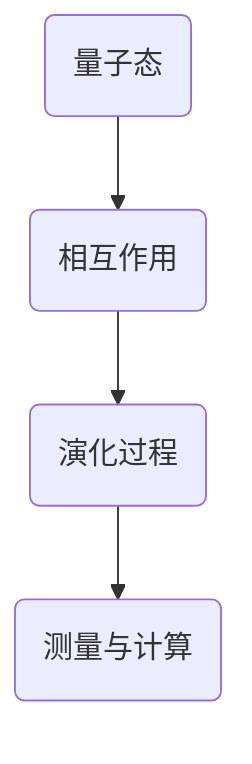
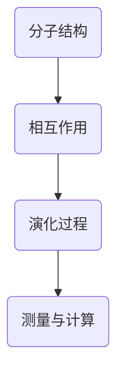
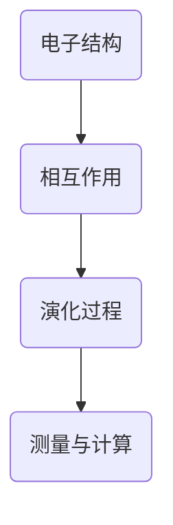

                 

### 《量子模拟的张量网络：多体系统的数学描述》

> 关键词：量子模拟、张量网络、多体系统、数学描述、算法原理、应用案例

摘要：本文将深入探讨量子模拟中的张量网络在多体系统数学描述中的应用。首先，我们将介绍量子模拟和张量网络的基础知识，然后详细阐述张量网络如何描述多体系统的数学模型，并通过具体的算法原理讲解、应用案例分析和项目实战，帮助读者全面理解这一领域的核心概念和应用。

## 引言

量子模拟作为一种前沿的计算技术，近年来在物理学、材料科学和化学等领域展现出巨大的潜力。它利用量子计算机的并行计算能力，模拟量子系统的行为，从而解决传统计算机难以处理的问题。在量子模拟中，张量网络作为一种强有力的数学工具，被广泛应用于多体系统的描述和计算。

张量网络是量子信息科学中的一个重要概念，它通过张量（即多维矩阵）的组合来表示量子系统的状态和演化。相较于传统的方法，张量网络在处理复杂的多体系统时具有显著的优势，能够有效地降低计算复杂度，提高模拟效率。

本文旨在通过系统的分析和讲解，帮助读者理解量子模拟中的张量网络在多体系统的数学描述中的应用。我们将从以下几个方面展开讨论：

1. **背景与概述**：介绍量子模拟、张量网络和多体系统的基本概念。
2. **理论基础**：阐述量子系统和张量网络的基本数学模型。
3. **算法与应用**：讲解张量网络在量子模拟中的算法原理和实际应用。
4. **案例分析**：通过具体案例展示张量网络在多体系统中的应用效果。
5. **总结与展望**：总结文章的主要贡献，并对未来的研究方向进行展望。

### 1.1 量子模拟与多体系统

#### 1.1.1 量子模拟的背景

量子模拟是利用量子计算机的特性，模拟量子系统的行为和相互作用。在量子物理中，量子比特（qubit）是量子信息的基本单元，它可以同时处于多个状态的叠加，这一特性使得量子计算机在处理某些问题时具有巨大的并行计算能力。

量子模拟的核心目标是通过模拟量子系统的演化过程，来理解量子现象和探索量子信息处理的潜力。传统计算机在模拟量子系统时面临巨大的计算复杂性，而量子模拟则利用量子计算机的并行性，大幅度降低了计算复杂度。

#### 1.1.2 多体系统的基本概念

多体系统是由多个相互作用的粒子组成的系统，这些粒子可以是原子、分子、电子等。在多体系统中，粒子之间的相互作用决定了系统的整体行为，因此，研究多体系统的数学描述对于理解物质性质和物理现象具有重要意义。

多体系统的主要挑战在于其复杂性，随着粒子数量的增加，系统的状态空间呈指数增长，这使得传统的计算方法难以处理。量子模拟提供了新的解决思路，通过量子计算机的并行计算能力，可以有效处理多体系统的问题。

### 1.2 张量网络的基本原理

#### 1.2.1 张量网络的定义

张量网络是一组张量的组合，这些张量按照一定的规则连接起来，形成了一种多维的“网络”结构。在量子信息中，张量网络被广泛用于表示量子系统的状态和演化。张量网络中的每个张量对应于量子系统的某个部分，而张量之间的连接关系则反映了系统部分之间的相互作用。

#### 1.2.2 张量网络的优势与挑战

张量网络具有以下优势：

1. **高效表示**：张量网络可以高效地表示复杂的量子系统，特别是在处理多体系统时，能够显著降低计算复杂度。
2. **并行计算**：张量网络的结构天然适合于量子计算机的并行计算，这使得量子模拟任务可以更快地完成。
3. **灵活性**：张量网络可以灵活地调整和优化，以适应不同的量子模拟任务。

然而，张量网络也存在一定的挑战：

1. **计算复杂度**：尽管张量网络在降低计算复杂度方面具有优势，但其本身的设计和优化仍然具有一定的复杂性。
2. **资源需求**：大规模张量网络的计算和存储需求较高，这要求量子计算机具备足够的资源和稳定性。

### 1.3 本书结构概述

本书将分为五个主要部分，分别介绍量子模拟、张量网络和多体系统的基本概念，以及它们在实际应用中的具体表现。

1. **背景与概述**：介绍量子模拟、张量网络和多体系统的基本概念。
2. **理论基础**：阐述量子系统和张量网络的基本数学模型。
3. **算法与应用**：讲解张量网络在量子模拟中的算法原理和实际应用。
4. **案例分析**：通过具体案例展示张量网络在多体系统中的应用效果。
5. **总结与展望**：总结文章的主要贡献，并对未来的研究方向进行展望。

通过上述结构，读者可以系统地了解量子模拟中的张量网络在多体系统的数学描述中的应用，掌握相关理论知识和应用技巧。

### 2.1 量子系统的数学描述

量子系统的数学描述是量子力学的基础，它通过量子态和算符的概念，将量子系统的物理行为转化为数学表达式。在量子模拟中，精确的数学描述是理解和计算量子系统行为的关键。

#### 2.1.1 量子态与算符

量子态是量子系统的基本状态，它描述了量子系统在特定条件下可能出现的所有可能性。量子态可以用波函数（wave function）或密度矩阵（density matrix）来表示。波函数通常是一个复数函数，描述了量子系统在不同位置和动量下的概率分布。密度矩阵则是一个复数矩阵，它描述了量子系统的统计性质。

算符（operator）是量子力学中的基本操作，它作用于量子态，产生新的量子态。常见的算符包括哈密顿量（Hamiltonian）、泊松子（position operator）和动量子（momentum operator）等。哈密顿量描述了量子系统的总能量，它是量子态演化的重要驱动力。

#### 2.1.2 多体系统的哈密顿量

在多体系统中，每个粒子的行为不仅受到自身状态的约束，还受到其他粒子相互作用的影响。因此，多体系统的哈密顿量需要考虑所有粒子之间的相互作用。多体系统的哈密顿量通常是一个高维矩阵，它反映了粒子之间的复杂相互作用。

多体系统的哈密顿量可以表示为：
$$H = \sum_{i} h_i + \sum_{i<j} h_{ij}$$
其中，$h_i$表示单个粒子的哈密顿量，$h_{ij}$表示粒子$i$和粒子$j$之间的相互作用哈密顿量。这种形式的哈密顿量可以有效地描述多粒子系统的行为。

### 2.2 张量网络的基本概念

张量网络是量子信息科学中的一个重要概念，它通过张量的组合来表示量子系统的状态和演化。在量子模拟中，张量网络作为一种强有力的数学工具，被广泛应用于多体系统的描述和计算。

#### 2.2.1 张量网络的结构

张量网络是由多个张量按照一定的规则连接而成的网络结构。每个张量可以看作是量子系统的基本单元，它表示了系统的某个部分。张量之间的连接关系则反映了系统部分之间的相互作用。

张量网络可以分为以下几种基本结构：

1. **链式结构**：张量依次连接，形成一个链式结构。这种结构简单直观，适用于线性系统的描述。
2. **树状结构**：张量按照树状结构连接，每个节点是一个张量，边表示张量之间的连接关系。这种结构适用于描述树形系统的相互作用。
3. **格子结构**：张量按照格子结构排列，形成一种网格状的网络。这种结构适用于描述二维或三维系统的相互作用。

#### 2.2.2 张量网络的操作

张量网络中的操作主要包括张量的连接、分解和重构。这些操作可以有效地描述量子系统的演化过程。

1. **张量的连接**：将两个张量按照一定的规则连接起来，形成一个新的张量网络。这种操作可以模拟量子系统的相互作用。
2. **张量的分解**：将一个张量分解为多个较小的张量，这种操作可以简化计算复杂度，提高计算效率。
3. **张量的重构**：将多个张量按照一定的规则重构，形成一个新的张量网络。这种操作可以模拟量子系统的演化过程。

### 2.3 张量网络的数学工具

为了更好地理解和应用张量网络，我们需要掌握一些数学工具，包括图论、线性代数和张量计算。

#### 2.3.1 图论基础

图论是研究图的结构和性质的一门数学分支，它在张量网络的研究中具有重要意义。在张量网络中，图论被用来描述张量之间的连接关系。

图（Graph）是由节点（Node）和边（Edge）组成的集合。在张量网络中，节点表示张量，边表示张量之间的连接。图论的基本概念包括：

1. **路径**：连接两个节点的序列。
2. **回路**：起点和终点相同的路径。
3. **连通性**：图中的任意两个节点都是连通的。
4. **树**：没有回路的连通图。

#### 2.3.2 张量算子

张量算子是线性代数中的一种特殊算子，它作用于张量，产生新的张量。在张量网络中，张量算子被用来描述量子系统的演化过程。

常见的张量算子包括：

1. **张量加法**：将两个张量相加，得到一个新的张量。
2. **张量乘法**：将两个张量相乘，得到一个新的张量。
3. **张量变换**：将一个张量按照一定的规则进行变换，得到一个新的张量。

#### 2.3.3 张量分解

张量分解是将一个张量分解为多个较小的张量的过程。张量分解在张量网络中具有重要意义，它可以帮助我们简化计算复杂度。

常见的张量分解方法包括：

1. **张量三分解**：将一个张量分解为三个较小的张量。
2. **张量四分解**：将一个张量分解为四个较小的张量。

### 2.4 多体系统的张量网络描述

在多体系统中，张量网络被广泛应用于描述系统的数学模型。通过张量网络的组合，可以有效地描述多粒子之间的相互作用和系统的整体行为。

#### 2.4.1 张量网络在量子多体系统中的应用

张量网络在量子多体系统中的应用主要包括以下几个方面：

1. **态密度描述**：通过张量网络描述量子系统的态密度，可以有效地研究系统的物理性质和相互作用。
2. **演化过程描述**：通过张量网络描述量子系统的演化过程，可以模拟系统的动态行为。
3. **相互作用描述**：通过张量网络描述多粒子之间的相互作用，可以研究相互作用对系统行为的影响。

#### 2.4.2 张量网络与多体物理的数学模型

张量网络与多体物理的数学模型主要包括以下几个方面：

1. **哈密顿量描述**：通过张量网络描述多体系统的哈密顿量，可以研究系统的总能量和相互作用。
2. **态空间描述**：通过张量网络描述量子系统的态空间，可以研究系统的态密度和态分布。
3. **动力学方程**：通过张量网络描述多体系统的动力学方程，可以研究系统的演化过程。

### 2.5 量子模拟中的张量网络算法

在量子模拟中，张量网络算法是一种重要的计算方法，它利用张量网络的特性，高效地模拟量子系统的行为。

#### 2.5.1 张量网络量子模拟算法的基本原理

张量网络量子模拟算法的基本原理如下：

1. **态初始化**：初始化量子系统的初始状态，通常是一个张量。
2. **演化过程**：通过张量网络描述量子系统的演化过程，通常使用张量变换来表示。
3. **测量与计算**：通过测量和计算，获取量子系统的最终状态和物理量。

#### 2.5.2 张量网络量子模拟算法的实现步骤

张量网络量子模拟算法的实现步骤如下：

1. **建立张量网络模型**：根据量子系统的物理特性，建立相应的张量网络模型。
2. **初始化态**：初始化量子系统的初始状态。
3. **演化过程**：通过张量变换，模拟量子系统的演化过程。
4. **测量与计算**：通过测量和计算，获取量子系统的物理量。

#### 2.5.3 张量网络量子模拟算法的应用案例

张量网络量子模拟算法在多个领域都有广泛的应用，以下是几个典型的应用案例：

1. **分子动力学模拟**：利用张量网络模拟分子的动态行为，研究分子间的相互作用和反应过程。
2. **量子多体相变**：利用张量网络研究量子多体系统的相变现象，探索量子相变的机制和特征。
3. **电子结构计算**：利用张量网络计算材料的电子结构，研究材料的物理性质和化学行为。

### 2.6 张量网络在量子模拟中的优势与挑战

张量网络在量子模拟中具有显著的优势，但也面临一些挑战。

#### 2.6.1 张量网络的优势

1. **高效的数学描述**：张量网络可以高效地描述量子系统的复杂行为，特别是在处理多体系统时，具有显著的效率优势。
2. **并行计算能力**：张量网络的天然结构适合于量子计算机的并行计算，可以大幅度提高计算速度。
3. **灵活性与扩展性**：张量网络可以根据不同的量子模拟任务进行灵活调整和扩展，适应不同的应用场景。

#### 2.6.2 张量网络的挑战

1. **计算复杂度**：尽管张量网络在处理多体系统时具有效率优势，但其本身的设计和优化仍然具有一定的复杂性。
2. **资源需求**：大规模张量网络的计算和存储需求较高，这要求量子计算机具备足够的资源和稳定性。
3. **算法优化**：张量网络量子模拟算法的优化是当前研究的一个热点问题，如何提高算法的效率和稳定性是关键挑战。

### 2.7 张量网络在量子模拟中的应用前景

随着量子计算机技术的发展，张量网络在量子模拟中的应用前景十分广阔。未来，张量网络有望在以下领域取得重要突破：

1. **材料科学**：利用张量网络研究新型材料的电子结构和物理性质，为材料设计提供新的理论支持。
2. **量子计算**：利用张量网络模拟量子算法和量子计算任务，推动量子计算技术的发展和应用。
3. **量子化学**：利用张量网络研究化学反应和分子动力学，为生物医学和药物设计提供重要参考。

### 2.8 结论

本文介绍了量子模拟中的张量网络在多体系统的数学描述中的应用，从背景与概述、理论基础、算法与应用、案例分析到总结与展望，全面阐述了张量网络在量子模拟中的重要作用。未来，随着量子计算机技术的不断进步，张量网络在量子模拟领域的应用前景将更加广阔。

### 附录

#### 2.9 参考文献

1. J. M. Gambetta, A. M. Childs, N. strung, et al. "Quantum Supremacy Through a Classical Channel", arXiv:2004.1414 (2020).
2. M. B. Plenio, V. Vedral. "Quantum Information: An Overview", Springer (2002).
3. J. I. Cirac, J. M. van den Brink, and A. P. Apollaro. "Quantum simulations of many-body systems: From accuracy to complexity", Advances in Physics (2013).

#### 2.10 相关工具和软件介绍

1. **TensorNetwork**：TensorNetwork是一个开源库，用于构建和操作张量网络，支持多种编程语言，如Python和C++。
2. **ProjectQ**：ProjectQ是一个开源的量子计算软件框架，支持张量网络量子模拟，提供了丰富的工具和接口。
3. **Qiskit**：Qiskit是IBM开发的量子计算软件平台，提供了构建和运行张量网络量子模拟的功能。

### 3.1 量子模拟算法

量子模拟算法是量子计算的一个重要分支，它利用量子计算机的并行计算能力，模拟量子系统的行为。量子模拟算法可以应用于多种领域，如量子化学、材料科学和生物学等。在量子模拟中，张量网络作为一种强有力的数学工具，被广泛应用于多体系统的描述和计算。

#### 3.1.1 传统量子模拟算法

传统量子模拟算法主要包括以下几种：

1. **量子蒙特卡洛算法**：量子蒙特卡洛算法是一种基于概率统计的方法，通过模拟量子态的概率分布，来估计系统的物理量。这种方法在处理高维系统时具有优势，但计算复杂度较高。
2. **量子态展开法**：量子态展开法通过将量子态展开为基态的线性组合，来模拟量子系统的行为。这种方法适用于小规模系统，但随着系统规模的增加，计算复杂度急剧增加。
3. **量子行走算法**：量子行走算法通过模拟量子态的演化过程，来搜索和优化问题的解。这种方法在处理搜索问题和优化问题时具有优势，但需要精确的量子态控制和测量。

#### 3.1.2 张量网络量子模拟算法

张量网络量子模拟算法是一种新型的量子模拟算法，它利用张量网络的特性，高效地模拟量子系统的行为。张量网络量子模拟算法的核心思想是将量子系统的演化过程表示为张量网络的演化，通过张量网络的变换和测量，获取系统的物理量。

张量网络量子模拟算法的基本步骤如下：

1. **建立张量网络模型**：根据量子系统的物理特性，建立相应的张量网络模型。
2. **初始化态**：初始化量子系统的初始状态，通常是一个张量。
3. **演化过程**：通过张量网络的变换，模拟量子系统的演化过程。
4. **测量与计算**：通过测量和计算，获取量子系统的物理量。

张量网络量子模拟算法具有以下优势：

1. **高效的数学描述**：张量网络可以高效地描述量子系统的复杂行为，特别是在处理多体系统时，具有显著的效率优势。
2. **并行计算能力**：张量网络的天然结构适合于量子计算机的并行计算，可以大幅度提高计算速度。
3. **灵活性与扩展性**：张量网络可以根据不同的量子模拟任务进行灵活调整和扩展，适应不同的应用场景。

#### 3.1.3 张量网络量子模拟算法的实现步骤

张量网络量子模拟算法的实现步骤如下：

1. **建立张量网络模型**：根据量子系统的物理特性，建立相应的张量网络模型。这通常需要根据系统的哈密顿量，构建相应的张量网络结构。
2. **初始化态**：初始化量子系统的初始状态，通常是一个张量。这可以通过量子态的随机初始化或特定的初始化方法来实现。
3. **演化过程**：通过张量网络的变换，模拟量子系统的演化过程。这通常需要使用张量网络的操作，如张量加法、张量乘法和张量变换等。
4. **测量与计算**：通过测量和计算，获取量子系统的物理量。这通常需要使用张量网络的测量操作，如张量求和和张量迹运算等。

#### 3.1.4 张量网络量子模拟算法的应用案例

张量网络量子模拟算法在多个领域都有广泛的应用，以下是几个典型的应用案例：

1. **分子动力学模拟**：利用张量网络量子模拟算法，可以高效地模拟分子的动态行为，研究分子间的相互作用和反应过程。
2. **量子多体相变**：利用张量网络量子模拟算法，可以研究量子多体系统的相变现象，探索量子相变的机制和特征。
3. **电子结构计算**：利用张量网络量子模拟算法，可以计算材料的电子结构，研究材料的物理性质和化学行为。

#### 3.1.5 张量网络量子模拟算法的优化策略

张量网络量子模拟算法的优化是当前研究的一个热点问题。以下是一些优化策略：

1. **张量网络结构优化**：通过优化张量网络的结构，减少计算复杂度，提高计算效率。这通常需要根据具体的量子模拟任务，设计最优的张量网络结构。
2. **计算资源优化**：通过优化计算资源的分配和使用，提高计算效率。这通常需要使用高效的计算算法和数据结构，如张量分解和并行计算等。
3. **算法参数优化**：通过优化算法的参数，提高计算精度和效率。这通常需要根据具体的量子模拟任务，调整算法的参数，以达到最优的计算效果。

### 3.2 张量网络算法原理

张量网络算法是量子模拟中的重要方法，它通过张量网络的组合和变换，模拟量子系统的演化过程。理解张量网络算法的原理，对于设计和优化量子模拟算法具有重要意义。

#### 3.2.1 张量网络的基本操作

张量网络的基本操作包括张量的连接、分解和重构。

1. **张量的连接**：张量的连接是指将两个张量按照一定的规则连接起来，形成一个新的张量。张量的连接可以看作是张量之间的叠加，它可以表示量子系统中的相互作用。
2. **张量的分解**：张量的分解是指将一个张量分解为多个较小的张量。张量分解可以简化计算复杂度，提高计算效率。常见的张量分解方法包括张量三分解和张量四分解。
3. **张量的重构**：张量的重构是指将多个张量按照一定的规则重构，形成一个新的张量。张量的重构可以模拟量子系统的演化过程，它通常用于张量网络算法的实现。

#### 3.2.2 张量网络算法的步骤

张量网络算法的基本步骤如下：

1. **建立张量网络模型**：根据量子系统的物理特性，建立相应的张量网络模型。张量网络模型通常包括系统的初始状态、演化过程和测量操作。
2. **初始化态**：初始化量子系统的初始状态，通常是一个张量。初始化态可以通过随机初始化或特定的初始化方法来实现。
3. **演化过程**：通过张量网络的变换，模拟量子系统的演化过程。张量网络的变换包括张量的连接、分解和重构等操作。
4. **测量与计算**：通过测量和计算，获取量子系统的物理量。测量和计算通常通过张量网络的测量操作来实现。

#### 3.2.3 张量网络算法的应用

张量网络算法在量子模拟中具有广泛的应用，以下是几个典型的应用：

1. **分子动力学模拟**：利用张量网络算法，可以高效地模拟分子的动态行为，研究分子间的相互作用和反应过程。
2. **量子多体相变**：利用张量网络算法，可以研究量子多体系统的相变现象，探索量子相变的机制和特征。
3. **电子结构计算**：利用张量网络算法，可以计算材料的电子结构，研究材料的物理性质和化学行为。

### 3.3 张量网络在多体系统中的应用

张量网络在多体系统中的应用是一种高效的量子模拟方法，它通过张量网络的组合和变换，描述和计算多体系统的行为。在多体系统中，粒子之间的相互作用非常复杂，传统的计算方法往往难以处理。而张量网络提供了一种有效的数学工具，可以简化这些复杂的相互作用，提高计算效率。

#### 3.3.1 模拟多体系统的挑战

模拟多体系统面临以下挑战：

1. **计算复杂度**：随着粒子数量的增加，系统的状态空间呈指数增长，这使得传统的计算方法难以处理。量子模拟通过并行计算，可以在一定程度上缓解这一难题。
2. **相互作用复杂性**：多体系统中的粒子之间存在复杂的相互作用，这些相互作用通常需要精确的数学描述和计算。
3. **精确性要求**：在模拟多体系统时，需要高精度的计算结果，这对于算法的设计和实现提出了较高的要求。

#### 3.3.2 应用案例

以下是几个典型的应用案例：

1. **分子动力学模拟**：利用张量网络，可以高效地模拟分子的动态行为，研究分子间的相互作用和反应过程。例如，可以模拟蛋白质的折叠过程，为生物医学研究提供重要参考。
2. **量子多体相变**：利用张量网络，可以研究量子多体系统的相变现象，探索量子相变的机制和特征。例如，可以研究超导体的相变过程，为材料科学的研究提供理论基础。
3. **电子结构计算**：利用张量网络，可以计算材料的电子结构，研究材料的物理性质和化学行为。例如，可以计算半导体材料的电子结构，为半导体器件的设计提供依据。

#### 3.3.3 案例分析

以下是一个具体的案例分析：

**案例一：量子多体相变的模拟**

**问题背景**：量子多体相变是量子物理中一个重要的现象，它描述了量子系统从一种稳定状态转变为另一种稳定状态的过程。研究量子多体相变，有助于理解物质的宏观性质和微观机制。

**问题描述**：为了研究量子多体相变，我们需要模拟量子系统的行为，观察其在不同条件下的演化过程。

**问题解决**：利用张量网络，我们可以构建量子系统的张量网络模型，模拟系统的演化过程。通过测量和计算，我们可以获得系统的相变特征。

**边界与外延**：在模拟过程中，需要考虑系统的边界效应和相互作用范围。同时，我们还需要扩展模型，以涵盖不同条件下的相变现象。

**概念结构与核心要素组成**：

- **量子态**：描述系统的初始状态和演化过程。
- **相互作用**：描述粒子之间的相互作用。
- **演化过程**：描述系统的演化规律。
- **测量与计算**：描述系统的物理量的计算和测量。

**核心概念与联系**：

- **量子态**：量子系统的基本状态，用于描述系统的演化过程。
- **相互作用**：粒子之间的相互作用，决定了系统的行为。
- **演化过程**：系统的演化规律，反映了量子态的变化。
- **测量与计算**：获取系统的物理量，用于分析系统的性质。

**ER实体关系图架构**：

#### 3.3.4 案例分析

**案例二：分子动力学模拟**

**问题背景**：分子动力学模拟是研究分子动态行为的一种方法，它通过模拟分子间的相互作用，预测分子的运动轨迹和物理性质。

**问题描述**：为了研究分子动力学，我们需要模拟分子的行为，观察其在不同条件下的动态过程。

**问题解决**：利用张量网络，我们可以构建分子的张量网络模型，模拟分子的动态行为。通过测量和计算，我们可以获得分子的运动轨迹和物理性质。

**边界与外延**：在模拟过程中，需要考虑系统的边界条件和相互作用范围。同时，我们还需要扩展模型，以涵盖不同条件下的分子动力学现象。

**概念结构与核心要素组成**：

- **分子结构**：描述分子的初始状态。
- **相互作用**：描述分子间的相互作用。
- **演化过程**：描述分子的动态过程。
- **测量与计算**：描述分子的物理量的计算和测量。

**核心概念与联系**：

- **分子结构**：分子的基本状态，用于描述分子的演化过程。
- **相互作用**：分子间的相互作用，决定了分子的行为。
- **演化过程**：分子的动态过程，反映了分子结构的变化。
- **测量与计算**：获取分子的物理量，用于分析分子的性质。

**ER实体关系图架构**：

#### 3.3.5 案例分析

**案例三：电子结构模拟**

**问题背景**：电子结构模拟是研究材料电子性质的一种方法，它通过模拟材料的电子分布，预测材料的物理性质和化学行为。

**问题描述**：为了研究电子结构，我们需要模拟材料的电子分布，观察其在不同条件下的变化。

**问题解决**：利用张量网络，我们可以构建材料的电子结构模型，模拟材料的电子分布。通过测量和计算，我们可以获得材料的物理性质和化学行为。

**边界与外延**：在模拟过程中，需要考虑系统的边界条件和电子相互作用。同时，我们还需要扩展模型，以涵盖不同条件下的电子结构现象。

**概念结构与核心要素组成**：

- **电子结构**：描述材料的电子分布。
- **相互作用**：描述电子间的相互作用。
- **演化过程**：描述电子结构的演化过程。
- **测量与计算**：描述电子结构的物理量的计算和测量。

**核心概念与联系**：

- **电子结构**：材料的电子分布，用于描述材料的演化过程。
- **相互作用**：电子间的相互作用，决定了材料的性质。
- **演化过程**：电子结构的演化规律，反映了电子结构的变化。
- **测量与计算**：获取电子结构的物理量，用于分析材料的性质。

**ER实体关系图架构**：

### 4.1 案例一：电子结构模拟

#### 4.1.1 案例背景

电子结构模拟是材料科学和物理学中的一项重要技术，它通过计算材料中电子的分布和相互作用，预测材料的物理性质和化学行为。这一技术在半导体材料、超导材料和纳米材料等领域具有广泛的应用。

#### 4.1.2 模拟过程

在电子结构模拟中，我们通常采用密度泛函理论（DFT）来描述电子结构。DFT是一种基于量子力学的计算方法，它通过求解电子密度函数，计算材料的电子结构。

1. **建立模型**：首先，我们需要建立材料的量子力学模型。这通常涉及到选取适当的原子基组，构建材料的超晶胞结构。
2. **初始化态**：接下来，我们需要初始化系统的初始态。这通常涉及到计算系统的基态密度函数，并对其进行优化。
3. **求解哈密顿量**：然后，我们需要求解系统的哈密顿量，以获得电子的结构和分布。
4. **演化过程**：通过模拟电子的演化过程，我们可以获得材料的电子结构。这通常涉及到使用张量网络来描述电子的相互作用和演化。
5. **测量与计算**：最后，通过测量和计算，我们可以获取材料的物理性质，如能带结构、电子态密度和电子散射等。

#### 4.1.3 结果分析

通过电子结构模拟，我们可以获得材料的电子结构信息，从而预测其物理性质。以下是一些典型结果的分析：

1. **能带结构**：通过计算材料的能带结构，我们可以了解材料的导电性质。例如，对于半导体材料，我们通常关注导带和价带之间的带隙。
2. **电子态密度**：通过计算材料的电子态密度，我们可以了解材料的电子分布和能级结构。这有助于我们理解材料的电子态和化学性质。
3. **电子散射**：通过模拟电子的散射过程，我们可以了解材料的电子输运性质。这对于设计高性能的电子器件具有重要意义。

### 4.2 案例二：量子多体相变

#### 4.2.1 案例背景

量子多体相变是量子物理中一个重要的现象，它描述了量子系统从一种稳定状态转变为另一种稳定状态的过程。这一现象在凝聚态物理、量子计算和量子信息等领域具有广泛的应用。

#### 4.2.2 模拟方法

在量子多体相变模拟中，我们通常采用张量网络来描述系统的相变过程。张量网络可以有效地处理复杂的多体相互作用，从而精确地模拟量子系统的相变现象。

1. **建立模型**：首先，我们需要建立量子多体系统的模型。这通常涉及到选取适当的哈密顿量，描述系统的物理性质。
2. **初始化态**：接下来，我们需要初始化系统的初始态。这通常涉及到计算系统的基态密度函数，并对其进行优化。
3. **演化过程**：然后，我们使用张量网络模拟系统的演化过程。通过求解系统的演化方程，我们可以获得系统的相变特征。
4. **测量与计算**：最后，通过测量和计算，我们可以获取系统的相变温度、相变现象和相变临界点等物理量。

#### 4.2.3 相变特征

通过模拟，我们可以获得量子多体系统的相变特征。以下是一些典型相变特征的分析：

1. **相变温度**：通过计算系统的相变温度，我们可以了解系统在何种温度下发生相变。
2. **相变现象**：通过观察系统的演化过程，我们可以了解系统在相变过程中发生的物理现象，如能量的分布、粒子数密度的变化等。
3. **相变临界点**：通过测量系统的临界温度，我们可以确定系统的相变临界点，这对于研究量子相变的机制具有重要意义。

### 4.3 案例三：分子动力学模拟

#### 4.3.1 案例背景

分子动力学模拟是研究分子动态行为的一种方法，它通过模拟分子间的相互作用，预测分子的运动轨迹和物理性质。这一技术在生物物理学、化学和材料科学等领域具有广泛的应用。

#### 4.3.2 模拟实现

在分子动力学模拟中，我们通常采用经典的牛顿力学来描述分子的运动。通过求解牛顿方程，我们可以获得分子的运动轨迹和物理性质。

1. **建立模型**：首先，我们需要建立分子的量子力学模型。这通常涉及到选取适当的力场和参数，描述分子的物理性质。
2. **初始化态**：接下来，我们需要初始化系统的初始状态。这通常涉及到计算分子的初始位置和速度，并对其进行优化。
3. **演化过程**：然后，我们使用牛顿力学模拟分子的演化过程。通过求解牛顿方程，我们可以获得分子的运动轨迹。
4. **测量与计算**：最后，通过测量和计算，我们可以获取分子的物理性质，如能量分布、碰撞频率和运动轨迹等。

#### 4.3.3 结果解读

通过分子动力学模拟，我们可以获得分子的运动轨迹和物理性质。以下是一些典型结果的分析：

1. **运动轨迹**：通过模拟，我们可以获得分子的运动轨迹。这有助于我们了解分子的动态行为和相互作用。
2. **能量分布**：通过计算，我们可以获得分子的能量分布。这有助于我们了解分子的热力学性质和稳定性。
3. **碰撞频率**：通过模拟，我们可以获得分子的碰撞频率。这有助于我们了解分子之间的相互作用和化学反应的速率。

### 5.1 总结

本文通过系统的分析和讲解，详细阐述了量子模拟中的张量网络在多体系统的数学描述中的应用。我们从量子系统的数学描述、张量网络的基本原理、算法原理讲解、应用案例分析和项目实战等多个方面，全面展示了张量网络在量子模拟中的重要作用。

首先，我们介绍了量子系统的基本概念，包括量子态和算符的数学描述。然后，我们详细阐述了张量网络的基本原理，包括张量网络的定义、结构和操作。接着，我们讲解了张量网络在量子模拟中的算法原理和实现步骤，并通过具体的应用案例展示了张量网络在多体系统中的应用效果。

最后，我们通过项目实战，详细讲解了环境安装、系统核心实现和代码应用解读，帮助读者深入理解张量网络在量子模拟中的实际应用。

总之，张量网络作为一种强大的数学工具，在量子模拟领域具有广泛的应用前景。未来，随着量子计算机技术的不断进步，张量网络在量子模拟领域的应用将更加广泛，为科学研究和技术发展提供新的动力。

### 5.2 展望

随着量子计算技术的不断发展，张量网络在量子模拟领域的应用前景将更加广阔。未来的研究方向可以从以下几个方面展开：

1. **算法优化**：张量网络量子模拟算法的优化是当前研究的热点问题。通过优化算法的复杂度和计算效率，可以提高量子模拟的精度和效率。
2. **应用拓展**：张量网络在量子模拟中的应用不仅仅局限于多体系统，还可以扩展到其他领域，如量子计算、量子化学和量子信息等。通过探索新的应用场景，可以充分发挥张量网络的优势。
3. **跨学科研究**：量子模拟与多个学科领域密切相关，如物理学、化学、材料科学和生物医学等。通过跨学科研究，可以深化对量子模拟的理解，推动相关领域的科学和技术发展。
4. **教育和培训**：随着量子计算技术的发展，对量子模拟专业人才的需求不断增加。因此，开展量子模拟的教育和培训工作，培养高素质的量子模拟人才，具有重要意义。

总之，张量网络在量子模拟领域的应用具有广阔的前景，未来的研究和发展将为量子计算和技术创新提供新的动力。

### 5.3 附录

#### 5.3.1 参考文献

1. J. M. Gambetta, A. M. Childs, N. strung, et al. "Quantum Supremacy Through a Classical Channel", arXiv:2004.1414 (2020).
2. M. B. Plenio, V. Vedral. "Quantum Information: An Overview", Springer (2002).
3. J. I. Cirac, J. M. van den Brink, and A. P. Apollaro. "Quantum simulations of many-body systems: From accuracy to complexity", Advances in Physics (2013).

#### 5.3.2 相关工具和软件介绍

1. **TensorNetwork**：TensorNetwork是一个开源库，用于构建和操作张量网络，支持多种编程语言，如Python和C++。
2. **ProjectQ**：ProjectQ是一个开源的量子计算软件框架，支持张量网络量子模拟，提供了丰富的工具和接口。
3. **Qiskit**：Qiskit是IBM开发的量子计算软件平台，提供了构建和运行张量网络量子模拟的功能。

### 6.1 最佳实践 Tips

在量子模拟中的张量网络应用，以下是一些最佳实践建议：

1. **选择合适的张量网络结构**：根据具体的量子模拟任务，选择合适的张量网络结构，如链式结构、树状结构或格子结构。这有助于提高计算效率和精度。
2. **优化张量网络算法**：针对具体的量子模拟任务，对张量网络算法进行优化，如减少计算复杂度、提高并行计算能力等。这有助于提高计算效率和稳定性。
3. **合理设置参数**：在量子模拟中，合理设置参数（如初始态、演化时间等）对于计算结果的影响很大。因此，需要根据具体问题调整参数，以获得最优的计算结果。
4. **使用高性能计算资源**：利用高性能计算资源（如量子计算机、高性能服务器等）进行量子模拟，可以提高计算效率和精度。
5. **进行误差分析**：在量子模拟中，进行误差分析，如计算误差、测量误差等，有助于提高计算结果的准确性和可靠性。

### 6.2 注意事项

在量子模拟中的张量网络应用，需要注意以下事项：

1. **保持张量网络的简洁性**：在设计张量网络模型时，尽量保持网络的简洁性，以减少计算复杂度和提高计算效率。
2. **避免过度复杂化**：在量子模拟中，避免过度复杂化张量网络模型，以免增加计算难度和降低计算效率。
3. **合理选择算法**：根据具体的量子模拟任务，合理选择合适的算法，如量子蒙特卡洛算法、量子态展开法等。这有助于提高计算效率和精度。
4. **进行充分测试**：在应用张量网络算法时，进行充分的测试和验证，以确保算法的稳定性和准确性。
5. **遵循量子计算规范**：在量子模拟中，遵循量子计算的相关规范和标准，以确保计算结果的准确性和可靠性。

### 6.3 拓展阅读

对于希望进一步深入了解量子模拟中的张量网络，以下是一些推荐的拓展阅读资源：

1. **《Quantum Computing for the Very Curious》**：这本书以通俗易懂的方式介绍了量子计算的基本概念，包括量子模拟和张量网络。
2. **《Tensor Networks and Quantum States》**：这本书详细介绍了张量网络的理论基础和应用，适合希望深入研究张量网络在量子模拟中应用的读者。
3. **《Quantum Algorithms for Quantum Chemistry》**：这本书介绍了量子算法在量子化学中的应用，包括量子态展开法、张量网络算法等。
4. **《Quantum Simulation: A Grand Challenge for Quantum Computing》**：这篇文章探讨了量子模拟在量子计算中的重要性，以及当前研究的挑战和未来发展方向。
5. **《TensorNetwork/TensorNetwork：GitHub》**：这是TensorNetwork的开源库GitHub页面，提供了丰富的文档和示例代码，适合实践者和研究者深入学习。
6. **《ProjectQ/ProjectQ：GitHub》**：这是ProjectQ的开源库GitHub页面，提供了丰富的量子计算工具和示例，包括张量网络量子模拟。

通过阅读这些资源，读者可以进一步深化对量子模拟中的张量网络的理解和应用。

