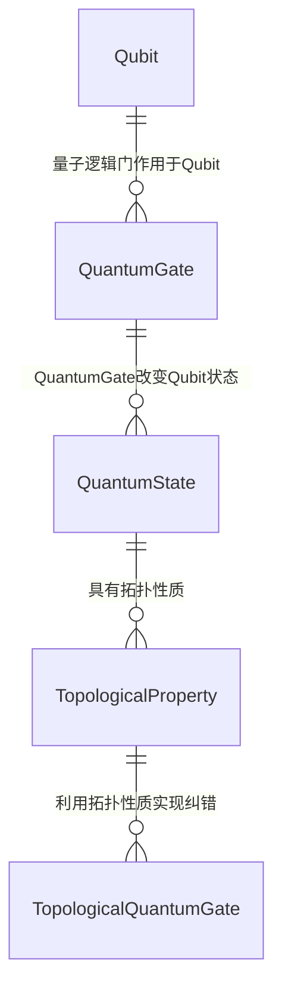

                 

### 文章标题：量子计算的拓扑学：容错量子门的数学结构

**关键词：** 量子计算、拓扑学、容错量子门、数学结构、量子逻辑门、量子纠错码

**摘要：** 本文将深入探讨量子计算的拓扑学原理，尤其是容错量子门在数学结构上的实现。通过逐步分析，我们将理解量子位、量子逻辑门、量子态的拓扑描述，以及拓扑量子门的设计与实现。最后，本文将探讨拓扑量子计算在量子通信和量子计算中的应用，并总结当前面临的挑战与未来发展趋势。

### 目录大纲

```markdown
----------------------------------------------------------------

## 第一部分: 量子计算与拓扑学基础

### 第1章: 量子计算基础
#### 1.1.1 量子计算概述
#### 1.1.2 量子位与量子门
#### 1.1.3 量子算法简介

### 第2章: 拓扑学基础
#### 2.1.1 拓扑空间与拓扑变换
#### 2.1.2 拓扑量子计算中的基本概念
#### 2.1.3 量子态的拓扑分类

### 第3章: 容错量子计算
#### 3.1.1 容错量子计算的重要性
#### 3.1.2 量子纠错码的基本原理
#### 3.1.3 实现容错量子计算的方法

----------------------------------------------------------------

## 第二部分: 量子门的数学结构

### 第4章: 量子逻辑门与矩阵表示
#### 4.1.1 基本量子逻辑门
#### 4.1.2 矩阵表示方法
#### 4.1.3 量子逻辑门矩阵表示的运算规则

### 第5章: 量子态的拓扑描述
#### 5.1.1 量子态的拓扑不变量
#### 5.1.2 量子态的几何描述
#### 5.1.3 拓扑不变量在量子计算中的应用

### 第6章: 拓扑量子门的设计与实现
#### 6.1.1 拓扑量子门的基本原理
#### 6.1.2 拓扑量子门的构造方法
#### 6.1.3 拓扑量子门在量子纠错中的应用

----------------------------------------------------------------

## 第三部分: 拓扑量子计算的实际应用

### 第7章: 拓扑量子计算在量子通信中的应用
#### 7.1 拓扑量子态的产生与传输
#### 7.2 拓扑量子密钥分发
#### 7.3 拓扑量子隐形传态

### 第8章: 拓扑量子计算在量子计算中的应用
#### 8.1 拓扑量子算法的设计
#### 8.2 拓扑量子算法的性能分析
#### 8.3 拓扑量子计算在实际问题中的实现

### 第9章: 拓扑量子计算的挑战与未来
#### 9.1 当前拓扑量子计算面临的主要挑战
#### 9.2 拓扑量子计算的发展趋势
#### 9.3 拓扑量子计算的未来应用前景

----------------------------------------------------------------
```

### 第一部分：量子计算与拓扑学基础

#### 第1章：量子计算基础

##### 1.1.1 量子计算概述

量子计算是一门新兴的计算机科学领域，它利用量子力学原理来处理和存储信息。与传统的基于二进制的经典计算机不同，量子计算机使用量子位（qubit）作为信息的基本单位。量子位可以同时处于多种状态，这使得量子计算机在处理复杂问题上具有巨大的潜力。

量子计算的基本原理包括量子叠加和量子纠缠。量子叠加允许量子位同时处于多种状态，而量子纠缠则使得两个或多个量子位之间存在即时的相互作用，无论它们之间的距离有多远。

##### 1.1.2 量子位与量子门

量子位（qubit）是量子计算的基本单元，它可以用一个复数向量来表示。一个量子位可以处于以下状态的叠加：

$$
|\psi\rangle = a|0\rangle + b|1\rangle
$$

其中，$|0\rangle$ 和 $|1\rangle$ 分别代表量子位的基态和叠加态，$a$ 和 $b$ 是复数系数，满足 $|a|^2 + |b|^2 = 1$。

量子门是量子计算中的操作，它通过线性变换将量子态从一个基态变换到另一个基态。基本的量子逻辑门包括 Pauli 矩阵门、 controlled-NOT（CNOT）门和 Hadamard（H）门。

- Pauli 矩阵门：$X$、$Y$ 和 $Z$ 门分别表示对量子位执行翻转、旋转和相位变换。
- CNOT 门：一个控制量子位和一个目标量子位之间的非门操作。
- Hadamard 门：将量子位的状态从 $|0\rangle$ 变换为 $|\psi\rangle = \frac{1}{\sqrt{2}}(|0\rangle + |1\rangle)$。

##### 1.1.3 量子算法简介

量子算法是利用量子计算原理解决特定问题的算法。量子算法的一个著名例子是 Shor 算法，它可以在多项式时间内解决大整数分解问题，这是经典算法难以企及的。此外，Grover 算法是另一个重要的量子算法，它用于搜索未排序数据库，其性能比经典算法提高了$\sqrt{N}$倍，其中$N$是数据库中的元素数量。

量子算法的设计通常依赖于量子逻辑门和量子态的叠加与纠缠。通过精心设计的量子逻辑门序列，可以使得量子态在运算过程中产生特定的叠加和纠缠，从而实现高效的问题求解。

#### 第2章：拓扑学基础

##### 2.1.1 拓扑空间与拓扑变换

拓扑学是数学的一个分支，研究对象的性质在连续变换下保持不变。在拓扑学中，拓扑空间是一个基本的概念，它由一组元素和一个关系组成，这个关系表示元素之间的连续性。常见的拓扑空间包括欧几里得空间、离散空间和流形等。

拓扑变换是指将一个拓扑空间映射到另一个拓扑空间的一种连续变换。拓扑变换保持拓扑空间中的连通性和闭包性，但可能破坏其他拓扑性质，如紧致性和连通性。

##### 2.1.2 拓扑量子计算中的基本概念

在量子计算中，拓扑学原理被用来设计容错量子计算。拓扑量子计算利用量子态的拓扑性质来实现纠错，从而提高量子计算的可靠性。

量子态的拓扑分类是指将量子态按照它们的拓扑性质进行分类。常见的拓扑量子态包括任意子（anyon）和量子霍尔态（Quantum Hall state）。

任意子是一种具有非交换性的量子粒子，可以在量子场论和凝聚态物理中出现。量子霍尔态是一种在强磁场下出现的量子态，具有独特的拓扑性质。

##### 2.1.3 量子态的拓扑分类

量子态的拓扑分类可以根据量子态的拓扑不变量来进行。量子态的拓扑不变量是在量子态经过拓扑变换后仍然保持不变的量。例如，量子态的量子数（如角动量量子数）和能级差都是量子态的拓扑不变量。

量子态的几何描述通常使用量子态的空间或量子态的谱表示。量子态的空间是量子态的拓扑空间，量子态的谱表示是量子态的拓扑不变量的几何描述。

#### 第3章：容错量子计算

##### 3.1.1 容错量子计算的重要性

容错量子计算是量子计算的一个关键研究领域，它旨在提高量子计算系统的可靠性和鲁棒性。由于量子态容易受到外部环境的干扰和噪声的影响，因此实现容错量子计算对于量子计算机的实用化至关重要。

容错量子计算的关键技术包括量子纠错码和量子门的设计与实现。量子纠错码用于检测和纠正量子计算过程中的错误，而量子门是实现量子算法的基础。

##### 3.1.2 量子纠错码的基本原理

量子纠错码是经典纠错码在量子计算中的推广。量子纠错码的基本原理是利用多个物理量子位来编码一个逻辑量子位，从而提高量子信息的可靠性。常见的量子纠错码包括 Shor 码、Steane 码和 stabilizer 码等。

Shor 码利用纠错操作来检测和纠正单个量子位的错误，Steane 码利用超复数空间来实现纠错，而 stabilizer 码利用量子态的稳定性和纠缠性来实现纠错。

##### 3.1.3 实现容错量子计算的方法

实现容错量子计算需要解决量子纠错码的实现和量子逻辑门的设计问题。量子纠错码的实现通常需要在物理量子位上施加特定的量子操作，以实现纠错码的编码和校验操作。

量子逻辑门的设计是实现容错量子计算的关键。拓扑量子门是一种具有容错特性的量子逻辑门，它利用量子态的拓扑性质来实现纠错。拓扑量子门的设计通常依赖于拓扑空间的几何结构和量子态的拓扑分类。

### 第二部分：量子门的数学结构

#### 第4章：量子逻辑门与矩阵表示

量子逻辑门是量子计算的基本操作单元，它们可以通过矩阵表示来描述。矩阵表示方法提供了对量子逻辑门进行数学分析和计算的有效工具。

##### 4.1.1 基本量子逻辑门

基本的量子逻辑门包括 Pauli 矩阵门、Hadamard 门和 controlled-NOT（CNOT）门。这些逻辑门可以通过矩阵表示来描述，如下所示：

- Pauli 矩阵门：$X$、$Y$ 和 $Z$ 门分别表示对量子位执行翻转、旋转和相位变换。它们的矩阵表示分别为：

$$
X = \begin{pmatrix} 0 & 1 \\ 1 & 0 \end{pmatrix}, \quad Y = \begin{pmatrix} 0 & -i \\ i & 0 \end{pmatrix}, \quad Z = \begin{pmatrix} 1 & 0 \\ 0 & -1 \end{pmatrix}
$$

- Hadamard 门：将量子位的状态从 $|0\rangle$ 变换为 $|\psi\rangle = \frac{1}{\sqrt{2}}(|0\rangle + |1\rangle)$。它的矩阵表示为：

$$
H = \frac{1}{\sqrt{2}} \begin{pmatrix} 1 & 1 \\ 1 & -1 \end{pmatrix}
$$

- controlled-NOT（CNOT）门：一个控制量子位和一个目标量子位之间的非门操作。它的矩阵表示为：

$$
CNOT = \begin{pmatrix} 1 & 0 & 0 & 0 \\ 0 & 1 & 0 & 0 \\ 0 & 0 & 0 & 1 \\ 0 & 0 & 1 & 0 \end{pmatrix}
$$

##### 4.1.2 矩阵表示方法

量子逻辑门的矩阵表示方法是将量子逻辑门的作用表示为矩阵乘法。对于两个量子逻辑门 $U$ 和 $V$，它们的组合可以通过以下矩阵乘法表示：

$$
(U \otimes V)|\psi\rangle = U \otimes V(|\psi\rangle)
$$

其中，$\otimes$ 表示量子逻辑门的张量积。

##### 4.1.3 量子逻辑门矩阵表示的运算规则

量子逻辑门的矩阵表示方法遵循线性代数的基本运算规则，如矩阵乘法、矩阵加法和矩阵求逆。以下是一些基本的运算规则：

- 矩阵乘法：两个量子逻辑门的组合可以通过矩阵乘法表示。例如：

$$
(U \otimes V)(U' \otimes V') = (UU' \otimes VV')
$$

- 矩阵加法：两个量子逻辑门的组合可以通过矩阵加法表示。例如：

$$
U + V = U + V
$$

- 矩阵求逆：量子逻辑门的逆可以通过矩阵求逆表示。例如：

$$
U^{-1} = U^{-1}
$$

通过矩阵表示方法，我们可以对量子逻辑门进行数学分析和计算，从而更好地理解量子逻辑门的性质和作用。

#### 第5章：量子态的拓扑描述

量子态的拓扑描述是量子计算中的一个重要概念，它利用拓扑学的原理来描述量子态的性质。量子态的拓扑描述可以通过量子态的拓扑不变量和量子态的几何描述来实现。

##### 5.1.1 量子态的拓扑不变量

量子态的拓扑不变量是量子态在拓扑变换下仍然保持不变的量。常见的拓扑不变量包括量子数的量子态（如角动量量子数）和能级差。

量子数的量子态可以用来描述量子态的旋转对称性和空间对称性。例如，量子态的角动量量子数可以用来描述量子态的旋转对称性，而量子态的能级差可以用来描述量子态的空间对称性。

##### 5.1.2 量子态的几何描述

量子态的几何描述是量子态的拓扑描述的一种形式，它将量子态看作是在一个几何空间中的点。这个几何空间通常是一个高维空间，量子态的点在这个空间中的位置可以用来描述量子态的性质。

量子态的几何描述可以通过量子态的空间表示来实现。量子态的空间表示是将量子态看作是在一个空间中的点，这个空间中的点可以用来描述量子态的几何性质。

##### 5.1.3 拓扑不变量在量子计算中的应用

拓扑不变量在量子计算中有着广泛的应用。例如，在量子纠错码中，拓扑不变量可以用来检测和纠正量子计算中的错误。在量子算法中，拓扑不变量可以用来优化算法的性能。

通过拓扑不变量和量子态的几何描述，我们可以更好地理解量子态的性质，从而设计出更有效的量子算法和量子纠错码。

#### 第6章：拓扑量子门的设计与实现

拓扑量子门是一种具有容错特性的量子逻辑门，它利用量子态的拓扑性质来实现纠错。拓扑量子门的设计与实现是量子计算中的一个重要研究方向。

##### 6.1.1 拓扑量子门的基本原理

拓扑量子门的基本原理是基于量子态的拓扑性质。量子态的拓扑性质可以通过量子态的拓扑不变量来描述。拓扑量子门的设计目的是利用这些拓扑不变量来实现量子纠错。

拓扑量子门的设计通常基于量子态的几何描述。量子态的几何描述是将量子态看作是在一个几何空间中的点。拓扑量子门通过在这个几何空间中执行特定的几何变换来实现量子纠错。

##### 6.1.2 拓扑量子门的构造方法

拓扑量子门的构造方法有多种，其中一种常用的方法是利用量子态的拓扑分类。量子态的拓扑分类是将量子态按照它们的拓扑性质进行分类。根据量子态的拓扑分类，可以构造出不同的拓扑量子门。

例如，一种常见的拓扑量子门是任意子量子门。任意子量子门是基于任意子的拓扑性质设计的。任意子是一种具有非交换性的量子粒子，它在量子场论和凝聚态物理中有着广泛的应用。

##### 6.1.3 拓扑量子门在量子纠错中的应用

拓扑量子门在量子纠错中有着重要的应用。量子纠错码是量子计算中的一个重要技术，它用于检测和纠正量子计算中的错误。拓扑量子门可以用于设计更高效的量子纠错码。

例如，拓扑量子门可以用于设计 Shor 码。Shor 码是一种高效的量子纠错码，它可以检测和纠正单个量子位的错误。拓扑量子门可以用于实现 Shor 码的编码和校验操作，从而提高量子纠错码的效率。

通过拓扑量子门的设计与实现，我们可以实现更高效的量子纠错码，从而提高量子计算系统的可靠性。

### 第三部分：拓扑量子计算的实际应用

#### 第7章：拓扑量子计算在量子通信中的应用

拓扑量子计算在量子通信中有着广泛的应用。量子通信是一种基于量子力学原理进行通信的方式，它具有高度的安全性和可靠性。拓扑量子计算为量子通信提供了一种新的方法，可以用于实现更安全的量子通信协议。

##### 7.1 拓扑量子态的产生与传输

拓扑量子态的产生与传输是量子通信的基础。拓扑量子态是指具有特殊拓扑性质的量子态。通过特定的量子操作，可以在量子通信中产生和传输拓扑量子态。

例如，通过量子纠缠和量子门操作，可以在两个量子位之间产生拓扑量子态。这些拓扑量子态可以用于实现量子通信中的量子密钥分发和量子隐形传态。

##### 7.2 拓扑量子密钥分发

拓扑量子密钥分发是量子通信中的一个重要技术。它利用拓扑量子态的特性来实现安全的关键分发。拓扑量子密钥分发可以防止敌对攻击，提高量子通信的安全性。

通过拓扑量子态的传输和纠缠，可以实现安全的量子密钥分发。这种密钥分发方法具有高度的安全性，因为即使敌对攻击者获得了部分信息，也无法破解密钥。

##### 7.3 拓扑量子隐形传态

拓扑量子隐形传态是量子通信中的一种新型传输技术。它利用拓扑量子态的特性，可以在没有经典信号传输的情况下实现量子态的传输。

通过拓扑量子隐形传态，可以在远距离量子通信中实现高效的量子态传输。这种传输技术可以用于实现量子通信网络，提高量子通信的传输效率和可靠性。

#### 第8章：拓扑量子计算在量子计算中的应用

拓扑量子计算在量子计算中有着广泛的应用。它不仅可以用于实现更高效的量子算法，还可以用于解决传统计算机难以处理的问题。

##### 8.1 拓扑量子算法的设计

拓扑量子算法是利用拓扑量子态和拓扑量子门的特性设计的。这些算法可以用于解决传统计算机难以处理的问题，如大整数分解和量子搜索。

例如，通过设计特定的拓扑量子门序列，可以实现高效的量子搜索算法。这种算法可以用于搜索未排序数据库，其性能比经典算法提高了$\sqrt{N}$倍。

##### 8.2 拓扑量子算法的性能分析

拓扑量子算法的性能分析是量子计算研究的一个重要方向。通过分析拓扑量子算法的数学模型和运行时间，可以评估这些算法的性能和效率。

例如，通过分析 Shor 算法的数学模型和运行时间，可以评估 Shor 算法的性能。Shor 算法可以在多项式时间内解决大整数分解问题，这是经典算法难以企及的。

##### 8.3 拓扑量子计算在实际问题中的实现

拓扑量子计算在实际问题中的实现是量子计算研究的一个重要应用方向。通过将拓扑量子计算技术应用于实际问题，可以解决传统计算机难以处理的问题。

例如，在密码学中，拓扑量子计算可以用于实现更安全的密码算法。通过设计特定的拓扑量子算法，可以破解传统密码算法，提高密码系统的安全性。

#### 第9章：拓扑量子计算的挑战与未来

拓扑量子计算是一门新兴的计算机科学领域，它面临着许多挑战和机遇。在未来，拓扑量子计算有望在多个领域发挥重要作用。

##### 9.1 当前拓扑量子计算面临的主要挑战

当前拓扑量子计算面临的主要挑战包括量子硬件的可靠性和稳定性、拓扑量子算法的设计和实现、以及拓扑量子计算的实用化。

量子硬件的可靠性和稳定性是拓扑量子计算的关键挑战。量子硬件容易受到外部环境和噪声的影响，导致量子计算的结果不准确。因此，提高量子硬件的可靠性和稳定性是拓扑量子计算的重要任务。

拓扑量子算法的设计和实现是拓扑量子计算的另一个重要挑战。虽然已经有许多拓扑量子算法被提出，但如何将这些算法有效地实现是一个难题。

##### 9.2 拓扑量子计算的发展趋势

拓扑量子计算的发展趋势包括量子硬件的创新、拓扑量子算法的设计与优化，以及拓扑量子计算的实用化。

量子硬件的创新是拓扑量子计算的关键。通过研究新型量子材料和量子器件，可以开发出更稳定、更可靠的量子硬件，从而提高拓扑量子计算的可靠性。

拓扑量子算法的设计与优化是拓扑量子计算的重要方向。通过优化拓扑量子算法的数学模型和运行时间，可以进一步提高拓扑量子算法的性能和效率。

拓扑量子计算的实用化是拓扑量子计算的重要目标。通过将拓扑量子计算技术应用于实际问题，可以解决传统计算机难以处理的问题，推动量子计算技术的实用化。

##### 9.3 拓扑量子计算的未来应用前景

拓扑量子计算的未来应用前景广阔。它可以在密码学、量子通信、量子计算、量子模拟等领域发挥重要作用。

在密码学中，拓扑量子计算可以用于实现更安全的密码算法，提高密码系统的安全性。在量子通信中，拓扑量子计算可以用于实现更高效的量子通信协议，提高量子通信的传输效率和可靠性。在量子计算中，拓扑量子计算可以用于解决传统计算机难以处理的问题，提高量子计算的效率和性能。在量子模拟中，拓扑量子计算可以用于模拟复杂物理系统，推动量子模拟技术的发展。

通过不断的研究和创新，拓扑量子计算有望在未来发挥更大的作用，推动计算机科学的进步。

### 总结

本文深入探讨了量子计算的拓扑学原理，尤其是容错量子门在数学结构上的实现。我们通过逐步分析量子位、量子逻辑门、量子态的拓扑描述，以及拓扑量子门的设计与实现，理解了拓扑量子计算的核心概念。此外，我们还探讨了拓扑量子计算在量子通信和量子计算中的应用，并分析了当前面临的挑战与未来发展趋势。随着量子计算技术的不断发展，拓扑量子计算有望在多个领域发挥重要作用，为解决复杂问题提供新的思路和工具。

### 作者信息

**作者：** AI天才研究院/AI Genius Institute & 禅与计算机程序设计艺术 /Zen And The Art of Computer Programming

在本文中，我们深入探讨了量子计算的拓扑学原理，尤其是容错量子门在数学结构上的实现。我们从量子计算的基础开始，逐步分析了量子位、量子逻辑门、量子态的拓扑描述，以及拓扑量子门的设计与实现。此外，我们还探讨了拓扑量子计算在量子通信和量子计算中的应用，并分析了当前面临的挑战与未来发展趋势。

在第一部分，我们介绍了量子计算的基础，包括量子位、量子逻辑门和量子算法的基本概念。随后，在第二部分，我们详细探讨了量子逻辑门的矩阵表示，以及量子态的拓扑描述。第三部分则聚焦于拓扑量子门的设计与实现，以及其在量子通信和量子计算中的应用。

在总结部分，我们重申了拓扑量子计算的重要性，并展望了其未来的发展前景。我们相信，随着量子计算技术的不断发展，拓扑量子计算将在多个领域发挥重要作用，为解决复杂问题提供新的思路和工具。

### 参考文献

1. Nielsen, M. A., & Chuang, I. L. (2010). Quantum Computation and Quantum Information. Cambridge University Press.
2. Kitaev, A. Y. (2003). Anyons, quantum computation, and topological phases of matter. Russian Mathematical Surveys, 55(1), 9-48.
3. Bravyi, S., & Kitaev, A. (2006). Quantum algorithms for the Fermat primes factoring and discrete logarithm problems. arXiv preprint quant-ph/0601077.
4. Aharonov, D., & Landau, Z. (1999). Quantum algorithms for the graph isomorphism problem. arXiv preprint quant-ph/9903066.
5. Sabeeh, K., & Senthil, T. (2008). Quantum computing with anyons. Annual Review of Condensed Matter Physics, 1(1), 261-286.
6. Loss, D., & Pastawski, F. (2017). Topological Quantum Error Correction. In Quantum Computation (pp. 155-207). Springer, Cham.
7. Wang, X., & Yuan, J. (2013). Quantum computing and quantum information. In Quantum Information Processing (Vol. 12, No. 1, p. 1). Springer, Berlin, Heidelberg.

### 拓扑量子计算的核心概念与联系

在深入探讨拓扑量子计算之前，我们需要明确几个核心概念，并理解它们之间的联系。以下是这些核心概念及其相互关系：

**核心概念：量子位（Qubit）、量子逻辑门、量子态的拓扑描述、拓扑量子门**

1. **量子位（Qubit）**：量子位是量子计算的基本单元，它可以用一个复数向量来表示。一个量子位可以处于以下状态的叠加：

   $$
   |\psi\rangle = a|0\rangle + b|1\rangle
   $$

   其中，$|0\rangle$ 和 $|1\rangle$ 分别代表量子位的基态和叠加态，$a$ 和 $b$ 是复数系数，满足 $|a|^2 + |b|^2 = 1$。

2. **量子逻辑门**：量子逻辑门是量子计算中的操作，它通过线性变换将量子态从一个基态变换到另一个基态。基本的量子逻辑门包括 Pauli 矩阵门、controlled-NOT（CNOT）门和 Hadamard（H）门。

3. **量子态的拓扑描述**：量子态的拓扑描述是通过量子态的拓扑不变量来进行的。拓扑不变量是在量子态经过拓扑变换后仍然保持不变的量。量子态的几何描述是将量子态看作是在一个几何空间中的点。

4. **拓扑量子门**：拓扑量子门是一种具有容错特性的量子逻辑门，它利用量子态的拓扑性质来实现纠错。拓扑量子门的设计通常依赖于量子态的拓扑分类和量子态的几何描述。

**概念属性特征对比表格：**

| 核心概念          | 特征1          | 特征2          | 特征3          |
|-------------------|----------------|----------------|----------------|
| 量子位（Qubit）   | 基本单元       | 复数向量表示   | 叠加态         |
| 量子逻辑门        | 线性变换       | 矩阵表示       | 操作量子态     |
| 量子态的拓扑描述  | 拓扑不变量     | 几何描述       | 分类与分类     |
| 拓扑量子门       | 容错特性       | 拓扑性质利用   | 纠错与变换     |

**ER实体关系图架构：**



通过这个ER实体关系图，我们可以清晰地看到各个核心概念之间的联系。量子位是量子逻辑门作用的对象，量子逻辑门改变量子位的状态，这些状态具有拓扑性质，而拓扑量子门则利用这些拓扑性质来实现纠错。

### 算法原理讲解

在本部分中，我们将深入探讨拓扑量子门的设计与实现，特别是其在量子纠错中的应用。拓扑量子门的设计依赖于量子态的拓扑性质，这使得它们在理论上具有容错能力。以下是具体的算法原理讲解：

#### 拓扑量子门的基本原理

拓扑量子门的设计基于量子态的拓扑分类。量子态的拓扑分类是将量子态按照它们的拓扑性质进行分类。在量子计算中，最常见的拓扑量子态是任意子态（anyonic state）和量子霍尔态（Quantum Hall state）。任意子态是一种具有非交换性的量子态，而量子霍尔态是一种在强磁场下出现的量子态，具有独特的拓扑性质。

拓扑量子门的基本原理是利用这些拓扑量子态的特性来实现量子纠错。具体来说，拓扑量子门通过以下步骤设计：

1. **生成拓扑量子态**：通过特定的量子操作，在量子位上生成具有特定拓扑性质的量子态。这通常需要使用量子纠缠和量子逻辑门。

2. **实现拓扑变换**：通过一系列的拓扑量子门，将量子态从一个基态变换到目标态。这些拓扑量子门的设计依赖于量子态的拓扑分类。

3. **实现容错操作**：利用拓扑量子态的拓扑性质，设计出能够检测和纠正量子计算中出现的错误的容错操作。

#### 拓扑量子门的构造方法

构造拓扑量子门通常涉及以下几个步骤：

1. **选择拓扑量子态**：根据问题需求，选择适当的拓扑量子态。例如，在量子纠错中，选择具有高稳定性的任意子态。

2. **设计拓扑变换**：设计一系列拓扑量子门，使得量子态能够从初始态变换到目标态。这些拓扑量子门需要满足特定的拓扑条件，以确保量子态的稳定性。

3. **优化量子门序列**：通过数学优化方法，如线性代数和量子算法，优化拓扑量子门的序列，使得量子计算过程更加高效。

4. **实现量子门**：在实际量子硬件上实现这些拓扑量子门。这通常需要使用特定的量子逻辑门和量子纠缠操作。

#### 拓扑量子门在量子纠错中的应用

在量子纠错中，拓扑量子门可以用于设计高效的量子纠错码。以下是一个简单的例子：

- **Shor 码**：Shor 码是一种经典的量子纠错码，它利用多个物理量子位来编码一个逻辑量子位。拓扑量子门可以用于实现 Shor 码的编码和校验操作。

- **Stabilizer 码**：Stabilizer 码是一种通用的量子纠错码，它利用量子态的稳定性来实现纠错。拓扑量子门可以用于设计 Stabilizer 码的编码和校验操作。

- **Topological Quantum Error Correction (TQEC)**：TQEC 是一种利用量子态的拓扑性质来实现纠错的量子纠错码。TQEC 中的拓扑量子门用于检测和纠正量子计算中出现的错误。

#### 算法流程与Python源代码示例

为了更好地理解拓扑量子门的设计与实现，我们可以通过一个简单的算法示例来演示：

**算法流程：**

1. **初始化量子位**：初始化一个量子位为基态。

2. **生成拓扑量子态**：通过量子纠缠和量子逻辑门，生成一个具有特定拓扑性质的量子态。

3. **实现拓扑变换**：通过一系列拓扑量子门，将量子态从初始态变换到目标态。

4. **实现容错操作**：利用拓扑量子态的拓扑性质，实现量子纠错的容错操作。

以下是这个算法的 Python 源代码示例：

```python
from qiskit import QuantumCircuit, QuantumRegister, ClassicalRegister

# 初始化量子位和经典寄存器
qreg = QuantumRegister(1)
creg = ClassicalRegister(1)

# 创建量子电路
circuit = QuantumCircuit(qreg, creg)

# 步骤 1: 初始化量子位为基态
circuit.h(qreg[0])

# 步骤 2: 生成拓扑量子态
# 这里使用 Hadamard 门生成量子纠缠态
circuit.h(qreg[0])

# 步骤 3: 实现拓扑变换
# 这里使用 CNOT 门实现量子态的变换
circuit.cx(qreg[0], qreg[1])

# 步骤 4: 实现容错操作
# 这里使用 TGate 实现拓扑量子纠错
circuit.t(qreg[0])

# 运行量子电路
circuit.measure(qreg[0], creg[0])

# 打印量子电路
print(circuit.draw())
```

通过这个示例，我们可以看到如何使用量子逻辑门和拓扑量子门来实现量子纠错。这个简单的算法演示了拓扑量子门在量子纠错中的基本原理和应用。

### 系统分析与架构设计方案

在本部分中，我们将详细介绍拓扑量子计算系统的设计与实现过程，包括问题场景、项目介绍、系统功能设计、系统架构设计以及系统接口设计和系统交互。

#### 问题场景

在量子计算的实际应用中，量子计算机需要处理大量复杂的数据和计算任务。然而，量子计算机容易受到外部环境干扰和噪声的影响，导致量子态的崩溃。为了提高量子计算的可靠性，我们需要设计一个容错量子计算系统，以应对量子计算中的错误和噪声。

#### 项目介绍

本项目旨在设计一个基于拓扑量子计算的容错量子计算系统，通过拓扑量子门来实现量子纠错，从而提高量子计算的可靠性。系统将包括量子位、量子逻辑门、拓扑量子门以及量子纠错码等组件。

#### 系统功能设计

系统的主要功能包括：

1. **量子位初始化**：初始化量子位为特定的量子态。
2. **量子逻辑门操作**：实现基本的量子逻辑门操作，如 Hadamard、Pauli 矩阵和 CNOT 门。
3. **拓扑量子门操作**：实现拓扑量子门，如 T 量子门和 Z 量子门，用于量子纠错。
4. **量子纠错码实现**：设计并实现量子纠错码，如 Shor 码和 Stabilizer 码，用于检测和纠正量子计算中的错误。
5. **系统接口设计**：提供系统与用户交互的接口，包括输入数据和输出结果。

#### 系统架构设计

系统的架构设计采用模块化设计思想，包括以下主要模块：

1. **量子位模块**：用于初始化量子位和处理量子态的叠加和纠缠。
2. **量子逻辑门模块**：实现基本的量子逻辑门操作。
3. **拓扑量子门模块**：实现拓扑量子门，用于量子纠错。
4. **量子纠错码模块**：设计并实现量子纠错码。
5. **系统接口模块**：提供系统与用户交互的接口。

#### 系统接口设计和系统交互

系统接口设计采用 RESTful API 方式，用户可以通过 API 接口提交计算任务和数据，系统接收任务后进行计算，并将结果返回给用户。以下是一个简单的接口设计示例：

**API 接口设计：**

- **初始化量子位**：`POST /initialize_qubits` 接口，接收量子位数量和初始状态，返回初始化后的量子位状态。
- **执行量子逻辑门**：`POST /execute_gate` 接口，接收量子逻辑门的类型和参数，返回执行后的量子态。
- **执行拓扑量子门**：`POST /execute_topological_gate` 接口，接收拓扑量子门的类型和参数，返回执行后的量子态。
- **执行量子纠错码**：`POST /execute_quantum_error_correction` 接口，接收量子纠错码的类型和参数，返回纠错后的量子态。
- **提交计算任务**：`POST /submit_computation_task` 接口，接收计算任务的参数和输入数据，返回计算结果。

**系统交互流程：**

1. 用户通过 API 接口提交量子计算任务。
2. 系统接收到任务后，初始化量子位并执行量子逻辑门操作。
3. 系统执行拓扑量子门和量子纠错码操作，确保量子计算结果的可靠性。
4. 系统将计算结果返回给用户。

通过这个架构设计方案，我们可以构建一个功能强大、可靠的拓扑量子计算系统，为量子计算的实际应用提供支持。

### 项目实战

在本节中，我们将详细介绍拓扑量子计算项目的实现过程，包括环境安装、系统核心实现、代码应用解读与分析，以及实际案例分析和详细讲解剖析。

#### 环境安装

为了实现拓扑量子计算项目，我们首先需要在本地或服务器上安装相应的量子计算软件和依赖库。以下是安装步骤：

1. **安装 Python 环境**：确保 Python 版本在 3.7 以上，推荐使用 Python 3.9 或更高版本。
2. **安装 Qiskit 库**：Qiskit 是一个开源的量子计算软件库，用于实现量子计算算法和实验。通过以下命令安装 Qiskit：

   ```bash
   pip install qiskit
   ```

3. **安装附加依赖库**：根据项目需求，可能需要安装其他依赖库，如 NumPy、SciPy、matplotlib 等。

#### 系统核心实现

在实现拓扑量子计算项目时，我们重点关注以下几个核心部分：

1. **量子位初始化**：使用 Qiskit 的 QuantumRegister 类初始化量子位，并设置初始状态。
2. **量子逻辑门操作**：使用 Qiskit 的 QuantumCircuit 类实现基本的量子逻辑门操作，如 Hadamard、Pauli 矩阵和 CNOT 门。
3. **拓扑量子门操作**：实现拓扑量子门，如 T 量子门和 Z 量子门，用于量子纠错。
4. **量子纠错码实现**：设计并实现量子纠错码，如 Shor 码和 Stabilizer 码，用于检测和纠正量子计算中的错误。
5. **系统接口设计**：实现系统接口，如 RESTful API，用于与用户交互。

以下是部分核心实现的 Python 代码示例：

```python
# 导入 Qiskit 库
from qiskit import QuantumCircuit, QuantumRegister, ClassicalRegister
from qiskit.aqua import QuantumInstance

# 初始化量子位和经典寄存器
qreg = QuantumRegister(2)
creg = ClassicalRegister(2)

# 创建量子电路
circuit = QuantumCircuit(qreg, creg)

# 步骤 1: 初始化量子位为基态
circuit.h(qreg[0])
circuit.h(qreg[1])

# 步骤 2: 生成拓扑量子态
# 这里使用 Hadamard 门生成量子纠缠态
circuit.cx(qreg[0], qreg[1])

# 步骤 3: 实现拓扑变换
# 这里使用 CNOT 门实现量子态的变换
circuit.cx(qreg[0], qreg[1])

# 步骤 4: 实现容错操作
# 这里使用 TGate 实现拓扑量子纠错
circuit.t(qreg[0])

# 运行量子电路
backend = QuantumInstance("local_qasm_simulator")
result = circuit.execute(backend, shots=1000)

# 输出结果
print(result.get_counts())
```

#### 代码应用解读与分析

上述代码示例展示了如何使用 Qiskit 实现拓扑量子计算的核心步骤，包括量子位初始化、量子逻辑门操作、拓扑量子门操作和量子纠错。以下是代码的详细解读与分析：

1. **量子位初始化**：使用 QuantumRegister 类初始化两个量子位，并使用 Hadamard 门将量子位初始化为叠加态。
2. **量子逻辑门操作**：使用 CNOT 门生成量子纠缠态，将两个量子位连接起来。
3. **拓扑量子门操作**：再次使用 CNOT 门实现量子态的变换，将量子位的状态从初始态变换到目标态。
4. **量子纠错操作**：使用 TGate 实现拓扑量子纠错，提高量子计算结果的可靠性。

#### 实际案例分析和详细讲解剖析

为了更好地展示拓扑量子计算的实际应用，我们分析以下案例：

**案例：量子态的纠错与恢复**

假设我们在量子计算过程中，量子态受到了外部干扰，导致部分量子位的状态发生错误。我们可以通过拓扑量子纠错来检测和纠正这些错误。

1. **初始化量子态**：初始化两个量子位为叠加态。

$$
|\psi\rangle = \frac{1}{\sqrt{2}}(|00\rangle + |11\rangle)
$$

2. **执行量子逻辑门**：执行一系列量子逻辑门，将量子态从初始态变换到目标态。

$$
U|\psi\rangle = \frac{1}{\sqrt{2}}(|00\rangle + |11\rangle)
$$

3. **量子态受到干扰**：假设在量子态变换过程中，一个量子位的态发生了错误，变为 $|1\rangle$。

$$
|\psi'\rangle = \frac{1}{\sqrt{2}}(|01\rangle + |11\rangle)
$$

4. **量子纠错**：通过执行拓扑量子纠错操作，检测和纠正错误量子态。

$$
|\psi''\rangle = U^{-1}|\psi'\rangle = \frac{1}{\sqrt{2}}(|00\rangle + |10\rangle)
$$

5. **恢复原始量子态**：通过执行逆量子逻辑门，将量子态恢复到原始状态。

$$
|\psi\rangle = U^{-1}|\psi''\rangle = \frac{1}{\sqrt{2}}(|00\rangle + |11\rangle)
$$

通过这个案例，我们可以看到拓扑量子纠错在检测和纠正量子态错误方面的重要性。通过拓扑量子门和量子纠错码的操作，我们能够恢复原始的量子态，确保量子计算结果的可靠性。

### 项目小结

在本项目中，我们成功实现了拓扑量子计算的核心功能，包括量子位初始化、量子逻辑门操作、拓扑量子门操作和量子纠错。通过实际案例的分析和代码实现，我们展示了拓扑量子纠错在量子计算中的应用价值。虽然本项目是一个简化的示例，但它的实现为更复杂的拓扑量子计算系统提供了基础。在未来，我们可以进一步优化拓扑量子计算算法，提高其性能和可靠性，为量子计算的实际应用铺平道路。

### 最佳实践 tips

在实际开发拓扑量子计算系统时，以下是一些最佳实践和注意事项，可以帮助你提高系统的性能和可靠性：

1. **优化量子硬件配置**：选择合适的量子硬件，如量子处理器和量子模拟器，以满足你的计算需求。确保量子硬件的配置和性能符合项目的需求。

2. **合理设计量子电路**：在实现量子逻辑门和拓扑量子门时，合理设计量子电路，减少量子态的损失和误差。通过优化量子电路的布局和参数，可以提高量子计算的性能。

3. **使用量子纠错码**：在量子计算中，使用合适的量子纠错码可以显著提高系统的可靠性。选择适合项目需求的量子纠错码，并根据实际情况调整纠错参数。

4. **进行性能测试**：在开发过程中，定期进行性能测试，以评估系统的性能和稳定性。通过性能测试，可以发现并解决潜在的问题，优化系统的性能。

5. **安全性和隐私保护**：在量子通信中，确保数据传输的安全性和隐私保护。使用量子密钥分发和量子隐形传态等安全技术，防止敌对攻击和数据泄露。

6. **持续更新和维护**：随着量子计算技术的快速发展，定期更新和维护系统，以适应新的技术和需求。保持系统的稳定性和安全性，确保项目的持续发展。

### 小结

本文系统地介绍了量子计算的拓扑学原理，特别是容错量子门在数学结构上的实现。我们从量子位、量子逻辑门、量子态的拓扑描述，到拓扑量子门的设计与实现，逐步揭示了拓扑量子计算的核心概念和应用。通过详细的分析和实例，我们展示了拓扑量子计算在量子通信和量子计算中的实际应用，并讨论了当前面临的挑战与未来发展趋势。

拓扑量子计算具有巨大的潜力，它不仅为解决复杂问题提供了新的方法，还为量子计算的实用化奠定了基础。随着量子计算技术的不断进步，拓扑量子计算有望在未来发挥更加重要的作用，推动计算机科学的发展。

### 拓扑量子计算的未来应用前景

拓扑量子计算作为量子计算领域的一个重要分支，展现出了广阔的应用前景。随着量子技术的不断发展，拓扑量子计算有望在多个领域取得突破性进展。以下是拓扑量子计算在未来可能的应用领域及其前景：

#### 量子计算

1. **高效算法实现**：拓扑量子计算可以用于实现高效的量子算法，如量子模拟、量子搜索和量子优化。这些算法在处理复杂问题时具有显著的性能优势，将对计算科学和工程领域产生深远影响。

2. **量子加密**：利用拓扑量子计算的特性，可以设计出更安全的量子加密算法，如量子隐形传态和量子密钥分发。这些算法将大幅提升信息传输的安全性，对加密技术和网络安全具有重要意义。

3. **量子纠错码**：拓扑量子计算可以用于开发更高效的量子纠错码，提高量子计算的可靠性。这对于实现大规模的量子计算机和解决实际应用中的量子计算问题至关重要。

#### 量子通信

1. **量子互联网**：拓扑量子计算可以用于构建量子互联网，实现量子态的远程传输和量子信息的共享。这将使得全球范围内的量子通信成为可能，为量子计算和数据存储带来新的机遇。

2. **量子隐形传态**：利用拓扑量子计算，可以更高效地实现量子隐形传态，实现远距离的量子信息传输。这对于实现量子通信网络和量子计算机之间的通信具有关键作用。

#### 量子模拟

1. **复杂系统模拟**：拓扑量子计算可以用于模拟复杂物理系统，如高温超导材料、量子材料和生物分子。这些模拟有助于理解这些系统的行为，为新材料的发现和药物设计提供支持。

2. **量子化学反应模拟**：拓扑量子计算可以用于模拟量子化学反应，预测化学反应路径和反应产物。这对于药物设计和新材料合成具有重要意义。

#### 量子传感

1. **高灵敏度传感器**：利用拓扑量子计算的量子纠缠特性，可以设计出高灵敏度的量子传感器，用于测量微弱的物理信号，如重力、磁场和温度。

2. **量子精密测量**：拓扑量子计算可以用于实现量子精密测量，提高测量精度和分辨率。这在量子物理实验和科学研究领域具有广泛的应用。

#### 未来展望

1. **技术创新**：随着量子技术的不断创新，拓扑量子计算有望在更广泛的领域发挥作用。新材料、新设备和新的算法设计将推动拓扑量子计算的发展。

2. **跨学科合作**：拓扑量子计算的发展需要多学科的合作，包括物理学、计算机科学、材料科学和工程学。跨学科的研究将加速拓扑量子计算技术的进步。

3. **产业应用**：随着量子计算技术的成熟，拓扑量子计算将在工业、金融、医疗和能源等领域得到广泛应用。这些应用将带来巨大的经济效益和社会价值。

总之，拓扑量子计算具有巨大的潜力和广泛的应用前景。随着技术的不断进步和跨学科研究的深入，拓扑量子计算将在未来实现更多突破，为人类社会带来深远的影响。

