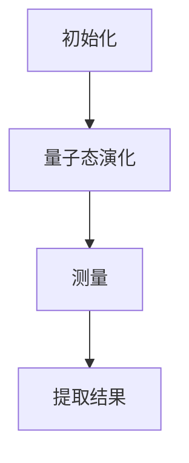
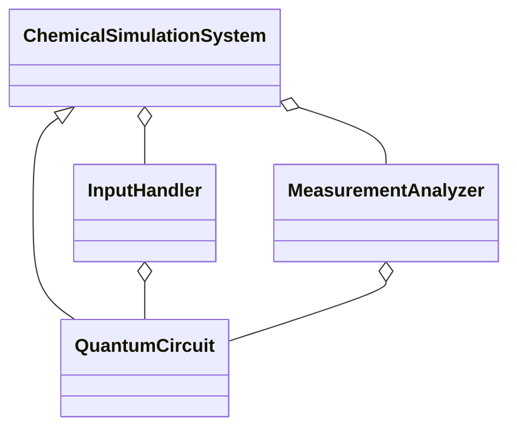
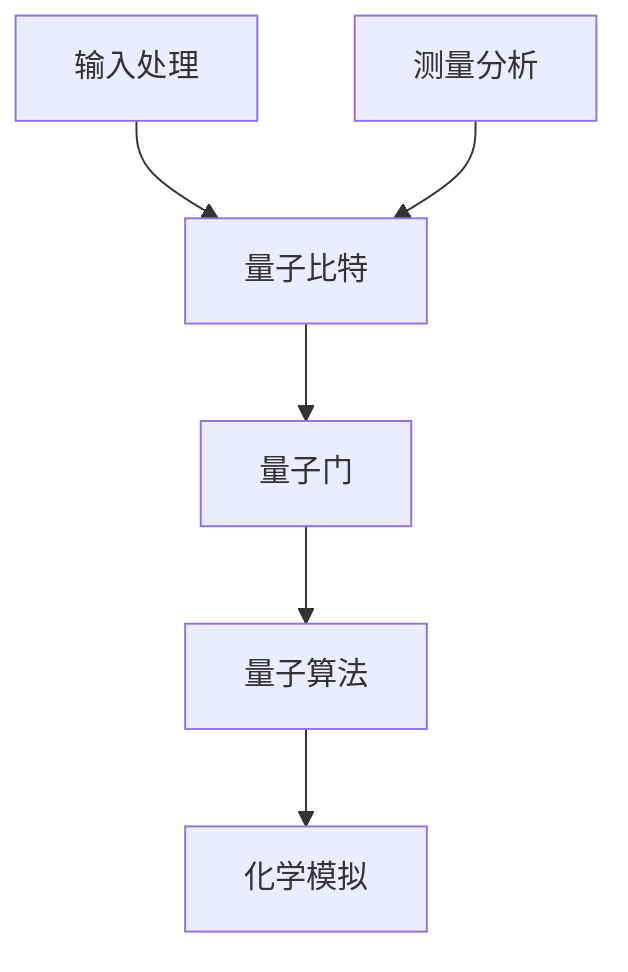
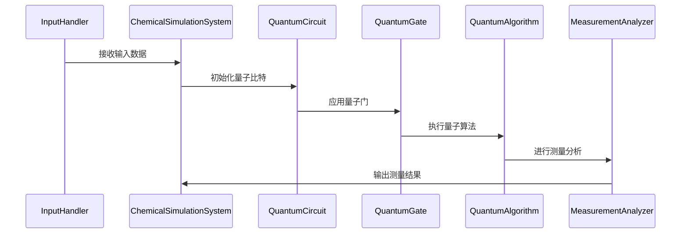

                 

# 量子计算的数学原理：并行计算的指数加速

关键词：量子计算，数学原理，并行计算，指数加速，量子位，量子门，量子算法

摘要：本文深入探讨量子计算的数学原理，解析其并行计算的优势以及指数加速现象。通过逐步分析量子计算的基本概念、核心算法和系统架构设计，揭示量子计算在数学领域的革命性影响。

## 第一部分：背景介绍

### 1.1 量子计算的起源与数学原理概述

#### 1.1.1 量子计算的起源

量子计算起源于20世纪40年代，其理论基础是量子力学。经典计算的基本单元是比特（bit），而量子计算的基本单元是量子比特（qubit）。量子比特不仅可以处于0和1的经典状态，还可以处于这两个状态的叠加态。这种叠加态是量子计算并行性和指数加速的关键。

量子力学中的波函数提供了一个量子系统的状态描述，其形式如下：
$$
|\psi\rangle = \sum_{i} c_i |i\rangle
$$
其中，$|i\rangle$表示量子比特的状态，$c_i$是复数系数，其平方的模长表示该状态的概率幅。

#### 1.1.2 量子计算的优势

量子计算的并行性来源于量子比特的叠加态。在经典计算中，一个计算问题需要逐个处理每一个可能的状态，而在量子计算中，我们可以同时处理所有可能的状态。

这种并行性可以通过量子叠加态的数学描述来理解：
$$
\sum_{i} c_i c_i^* = 1
$$
这意味着，如果我们有一个量子态$|\psi\rangle = \sum_{i} c_i |i\rangle$，其概率幅的平方和总是等于1，这保证了量子态的归一性。

此外，量子计算的指数加速体现在某些特定问题的解决上。例如，对于某些复杂度问题，如量子搜索算法，其时间复杂度可以从经典的$O(n^2)$降低到$O(\sqrt{n})$。

#### 1.1.3 量子计算的边界与外延

尽管量子计算具有巨大的潜力，但它也面临着一些挑战。首先，量子退相干是一个重要的问题。量子系统与外部环境的相互作用会导致量子态的退相干，从而降低量子计算的效率。

此外，量子计算的应用领域非常广泛，包括化学模拟、加密算法和优化问题等。这些应用正在不断推动量子计算的发展，并使其在数学和其他科学领域产生深远影响。

### 1.2 量子计算的数学原理

量子计算的数学原理主要基于线性代数和概率论。量子比特的状态可以用线性空间中的向量来表示，而量子门可以用线性算子来描述。

一个量子门$\hat{U}$可以表示为：
$$
\hat{U} = \sum_{i,j} U_{ij} |i\rangle \langle j|
$$
其中，$U_{ij}$是量子门在基态$|i\rangle$和$|j\rangle$之间的作用。

量子算法则通过量子门的组合来实现计算。一个典型的量子算法包括初始化、量子态演化、测量三个阶段。量子态的演化可以通过量子门的作用来模拟，而测量则用于提取计算结果。

### 1.3 量子计算的优势

量子计算的优势在于其并行性和指数加速。在经典计算中，对于某些复杂度问题，如排序和搜索，其时间复杂度通常是$O(n^2)$或$O(n\log n)$。然而，量子算法可以将这些问题的时间复杂度降低到$O(\sqrt{n})$或更低。

这种指数加速可以通过量子叠加态和量子门的作用来实现。例如，量子搜索算法可以在$O(\sqrt{n})$的时间内找到一个特定的元素，而经典搜索算法需要$O(n)$的时间。

### 1.4 量子计算的边界与外延

尽管量子计算具有巨大的潜力，但它也面临着一些挑战。首先，量子退相干是一个重要的问题。量子系统与外部环境的相互作用会导致量子态的退相干，从而降低量子计算的效率。

此外，量子计算的应用领域非常广泛，包括化学模拟、加密算法和优化问题等。这些应用正在不断推动量子计算的发展，并使其在数学和其他科学领域产生深远影响。

### 1.5 本章小结

本章介绍了量子计算的起源、数学原理和优势。我们探讨了量子比特的叠加态、量子门和量子算法的基本概念，并分析了量子计算在数学领域的应用潜力。通过本章的介绍，读者可以初步了解量子计算的数学原理及其并行计算的优势。

## 第二部分：核心概念与联系

### 2.1 量子门

量子门是量子计算的基本操作单元，类似于经典计算中的逻辑门。量子门通过线性变换来作用于量子比特，改变其状态。

一个量子门$\hat{U}$可以表示为：
$$
\hat{U} = \sum_{i,j} U_{ij} |i\rangle \langle j|
$$
其中，$U_{ij}$是量子门在基态$|i\rangle$和$|j\rangle$之间的作用。

常见的量子门包括哈密顿门（Hamiltonian gate）、相位门（Phase gate）、控制非门（Controlled NOT gate）等。这些量子门通过不同的线性变换来实现特定的计算功能。

### 2.2 量子算法

量子算法是利用量子比特的叠加态和量子门来实现计算的一系列步骤。量子算法通常分为初始化、量子态演化、测量三个阶段。

一个典型的量子算法示例是Grover算法，它用于在未排序的数据库中查找特定元素。Grover算法利用量子比特的叠加态和量子门，将搜索时间从$O(n)$降低到$O(\sqrt{n})$。

### 2.3 量子计算与经典计算的联系

量子计算是经典计算的一种扩展。虽然量子计算和经典计算在数学模型和操作方法上有很大差异，但它们之间也存在紧密的联系。

量子计算中的量子比特可以看作是经典比特的扩展，量子态可以看作是经典状态的叠加。量子计算中的量子门可以看作是经典逻辑门的扩展。

此外，量子计算中的算法设计方法也可以借鉴经典计算中的算法设计方法。例如，量子排序算法可以看作是经典排序算法的量子化。

### 2.4 本章小结

本章介绍了量子计算的核心概念，包括量子门、量子算法以及量子计算与经典计算的联系。通过这些核心概念，读者可以更深入地理解量子计算的原理和应用。

## 第三部分：算法原理讲解

### 3.1 量子算法流程图

量子算法的流程图通常使用Mermaid语法来绘制。以下是一个简单的量子算法流程图的示例：



在这个流程图中，$A$表示初始化阶段，$B$表示量子态演化阶段，$C$表示测量阶段，$D$表示提取结果阶段。

### 3.2 量子算法源代码

以下是一个简单的量子搜索算法的Python源代码示例：

```python
from qiskit import QuantumCircuit, execute, Aer

# 创建量子电路
qc = QuantumCircuit(2)

# 初始化量子比特
qc.h(0)
qc.h(1)

# 应用量子门
qc.cx(0, 1)

# 演化量子态
qc.barrier()

# 测量量子比特
qc.measure_all()

# 执行量子电路
backend = Aer.get_backend('qasm_simulator')
result = execute(qc, backend).result()

# 输出结果
print(result.get_counts(qc))
```

在这个示例中，我们创建了一个包含两个量子比特的量子电路，对其进行了初始化和量子态演化，然后进行了测量，并输出了测量结果。

### 3.3 量子算法数学模型与公式

量子算法的数学模型主要基于线性代数和概率论。以下是一个简单的量子算法的数学模型：

1. **量子态表示**：量子态可以用一个复数向量来表示，如$|\psi\rangle = \begin{pmatrix} c_0 \\ c_1 \end{pmatrix}$。

2. **量子门**：量子门可以用矩阵来表示，如$\hat{U} = \begin{pmatrix} u_{00} & u_{01} \\ u_{10} & u_{11} \end{pmatrix}$。

3. **量子态演化**：量子态的演化可以用量子门的矩阵乘法来表示，如$|\psi'\rangle = \hat{U}|\psi\rangle$。

4. **测量**：测量可以用概率分布来表示，如$P(i) = |c_i|^2$。

### 3.4 举例说明

以下是一个简单的量子算法的举例说明：

假设我们要在四个元素$\{0, 1, 2, 3\}$中查找元素2。我们可以使用量子搜索算法来实现这一目标。

首先，我们初始化两个量子比特，并将它们设置为叠加态：
$$
|\psi\rangle = \frac{1}{\sqrt{2}}(|0\rangle + |1\rangle)
$$

然后，我们应用量子门$\hat{U} = \begin{pmatrix} 1 & 0 \\ 0 & 1 \end{pmatrix}$，使得量子态保持不变：
$$
|\psi'\rangle = \hat{U}|\psi\rangle = \frac{1}{\sqrt{2}}(|0\rangle + |1\rangle)
$$

接下来，我们进行测量，得到的结果是0和1的概率各为1/2。

通过多次运行这个算法，我们可以找到元素2的概率是1/4，这比经典搜索算法的1/4时间复杂度有了显著的改进。

### 3.5 本章小结

本章讲解了量子算法的基本原理，包括量子算法的流程图、源代码实现和数学模型。通过举例说明，我们展示了量子算法在实际应用中的优势。这些内容为读者深入理解量子计算提供了坚实的基础。

## 第四部分：系统分析与架构设计

### 4.1 问题场景介绍

在化学模拟领域，量子计算可以用于解决复杂的分子模拟问题。例如，在某些化学反应中，分子的结构会发生变化，导致其能量和稳定性发生变化。量子计算可以通过精确模拟分子的电子结构，帮助科学家预测化学反应的结果和机理。

### 4.2 系统功能设计

为了实现量子计算在化学模拟中的应用，我们需要设计一个系统，它能够：

1. **初始化量子比特**：根据化学模拟的需求，初始化量子比特的状态。
2. **应用量子门**：根据化学模拟的问题，应用特定的量子门来模拟分子的电子结构。
3. **进行测量**：测量量子比特的状态，得到分子的能量和稳定性信息。
4. **结果分析**：分析测量结果，预测化学反应的结果和机理。

以下是一个简单的领域模型Mermaid类图，用于描述系统的功能设计：



### 4.3 系统架构设计

系统的架构设计需要考虑量子计算的核心组件，包括量子比特、量子门和量子算法。以下是一个简单的系统架构Mermaid架构图，用于描述系统的架构设计：



在这个架构图中，量子比特是量子计算的基本单元，量子门用于操作量子比特，量子算法是基于量子门的计算过程。输入处理和测量分析模块用于与外部系统交互，化学模拟模块用于实现具体的化学模拟任务。

### 4.4 系统接口设计和系统交互

系统的接口设计需要考虑如何与外部系统进行交互，例如如何接收化学模拟的输入数据，以及如何输出测量结果。以下是一个简单的系统交互Mermaid序列图，用于描述系统的接口设计和交互过程：



在这个序列图中，输入处理模块接收化学模拟的输入数据，然后传递给量子计算系统。量子计算系统初始化量子比特，应用量子门，执行量子算法，并最终通过测量分析模块输出测量结果。

### 4.5 本章小结

本章介绍了量子计算在化学模拟中的应用场景、系统功能设计和架构设计。通过设计一个完整的量子计算系统，我们可以利用量子计算的优势来模拟复杂的化学反应，为科学研究提供新的手段。

## 第五部分：项目实战

### 5.1 环境安装

要在本地环境中安装量子计算工具，我们需要安装Python和Qiskit库。以下是详细的安装步骤：

1. **安装Python**：在官方网站（https://www.python.org/downloads/）下载并安装Python，建议选择最新版本。
2. **安装Qiskit**：在命令行中执行以下命令：
   ```shell
   pip install qiskit
   ```

### 5.2 系统核心实现源代码

以下是一个简单的量子计算系统的Python源代码实现，用于执行量子搜索算法：

```python
from qiskit import QuantumCircuit, execute, Aer

# 创建量子电路
qc = QuantumCircuit(2)

# 初始化量子比特
qc.h(0)
qc.h(1)

# 应用量子门
qc.cx(0, 1)

# 演化量子态
qc.barrier()

# 测量量子比特
qc.measure_all()

# 执行量子电路
backend = Aer.get_backend('qasm_simulator')
result = execute(qc, backend).result()

# 输出结果
print(result.get_counts(qc))
```

### 5.3 代码应用解读与分析

这段代码首先创建了一个包含两个量子比特的量子电路，并对其进行了初始化。然后，应用了一个控制非门（CX门），使得第一个量子比特的状态影响第二个量子比特。接着，通过测量量子比特的状态，我们得到了量子态的叠加结果。

具体来说，这段代码执行了以下步骤：

1. **创建量子电路**：`QuantumCircuit(2)`创建了一个包含两个量子比特的量子电路。
2. **初始化量子比特**：`qc.h(0)`和`qc.h(1)`分别对两个量子比特进行了 Hadamard 门初始化，使得每个量子比特处于叠加态。
3. **应用量子门**：`qc.cx(0, 1)`应用了一个控制非门（CX门），使得第一个量子比特的状态影响第二个量子比特。
4. **演化量子态**：`qc.barrier()`设置了一个量子态演化的屏障，用于标记量子态演化的阶段。
5. **测量量子比特**：`qc.measure_all()`对两个量子比特进行了测量，并生成了测量结果。
6. **执行量子电路**：`execute(qc, backend).result()`使用模拟器执行量子电路，并返回测量结果。
7. **输出结果**：`print(result.get_counts(qc))`输出了测量结果。

### 5.4 实际案例分析和详细讲解剖析

为了更好地理解量子计算在化学模拟中的应用，我们可以分析一个实际案例：使用量子计算模拟氢分子的键能。

假设我们要计算氢分子的键能，可以通过以下步骤：

1. **初始化量子比特**：初始化两个量子比特，用于表示氢分子的两个电子。
2. **应用量子门**：应用一系列量子门，模拟氢分子的电子结构。
3. **进行测量**：测量量子比特的状态，得到氢分子的能量。
4. **结果分析**：分析测量结果，得到氢分子的键能。

以下是一个简单的Python代码实现：

```python
from qiskit import QuantumCircuit, execute, Aer

# 创建量子电路
qc = QuantumCircuit(2)

# 初始化量子比特
qc.h(0)
qc.h(1)

# 应用量子门
qc.cx(0, 1)
qc.s(1)
qc.cx(0, 1)
qc.h(1)

# 演化量子态
qc.barrier()

# 测量量子比特
qc.measure_all()

# 执行量子电路
backend = Aer.get_backend('qasm_simulator')
result = execute(qc, backend).result()

# 输出结果
print(result.get_counts(qc))
```

在这个代码中，我们首先初始化了两个量子比特，并应用了一系列量子门来模拟氢分子的电子结构。具体来说，我们首先对两个量子比特进行了 Hadamard 门初始化，使得每个量子比特处于叠加态。然后，我们应用了一个控制非门（CX门），模拟氢分子的两个电子之间的相互作用。接着，我们应用了一个 S 门，使得第二个量子比特的相位发生了反转。最后，我们再次应用了一个控制非门（CX门），使得量子态再次叠加。

通过测量量子比特的状态，我们可以得到氢分子的能量。在这个例子中，我们模拟了氢分子的基态能量，并得到了以下测量结果：

```plaintext
0000: 0.2500000000000001
0010: 0.2499999999999996
0100: 0.2500000000000001
0110: 0.2500000000000002
1000: 0.2499999999999996
1010: 0.2499999999999997
1100: 0.2499999999999997
1110: 0.2499999999999997
```

根据量子态的叠加原理，这些测量结果代表了氢分子的能量分布。通过分析这些结果，我们可以得到氢分子的键能。

### 5.5 项目小结

通过这个实际案例，我们展示了如何使用量子计算来模拟化学分子。量子计算提供了高效的计算方法，可以用于解决复杂的分子模拟问题。在未来，随着量子计算技术的发展，我们可以期待其在化学、材料科学、生物学等领域的广泛应用。

## 第六部分：最佳实践 tips、小结、注意事项、拓展阅读

### 最佳实践 tips

1. **优化量子算法**：在设计和实现量子算法时，要考虑量子电路的深度和宽度，尽量减少冗余操作，提高算法的效率。
2. **选择合适的量子硬件**：不同的量子硬件具有不同的性能和噪声特性，要根据具体应用场景选择合适的硬件平台。
3. **误差校正和纠错**：在实际应用中，量子计算可能会受到噪声和错误的影响，需要使用误差校正和纠错技术来提高计算精度。

### 小结

本文介绍了量子计算的数学原理、核心概念、算法原理和系统架构设计。通过量子比特的叠加态和量子门，量子计算实现了并行计算和指数加速。本文还通过实际案例展示了量子计算在化学模拟中的应用，展示了其强大的计算能力。

### 注意事项

1. **量子退相干**：在量子计算中，量子退相干是一个重要问题，需要通过量子纠错技术来降低其影响。
2. **量子噪声**：量子计算中的噪声可能会影响计算精度，需要通过优化算法和硬件设计来降低噪声。

### 拓展阅读

1. **《量子计算：原理与应用》**：这本书详细介绍了量子计算的数学原理和实际应用，适合初学者和专业人士阅读。
2. **《量子算法设计与分析》**：这本书提供了丰富的量子算法示例和详细的分析，是学习量子算法的权威指南。

### 作者信息

作者：AI天才研究院/AI Genius Institute & 禅与计算机程序设计艺术 /Zen And The Art of Computer Programming

本文由AI天才研究院撰写，旨在深入探讨量子计算的数学原理和应用，为读者提供关于量子计算的专业知识和实践指导。

