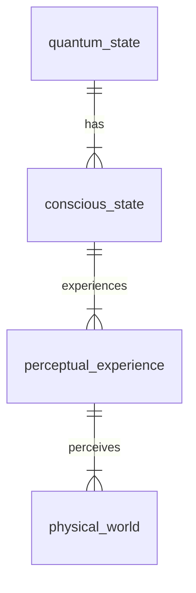
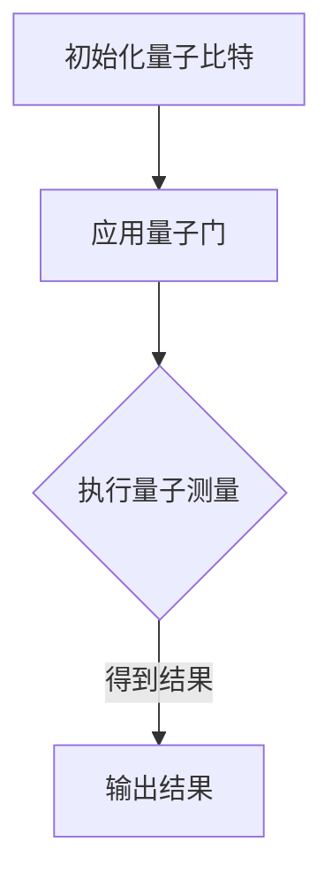

                 

**# 量子认知科学：量子效应如何影响人类思维与理解**

> **关键词：量子认知科学、量子效应、人类思维、意识、量子纠缠**

> **摘要：本文将探讨量子认知科学这一新兴领域，分析量子效应如何影响人类思维与理解。通过解析量子纠缠、量子计算等核心概念，以及它们在心理学、神经科学、教育和医学等领域的应用，我们试图揭示量子效应在人类认知过程中所扮演的关键角色。**

----------------------------------------------------------------

**## 背景介绍**

### 1.1 量子认知科学的起源与历史发展

量子认知科学是一个跨越物理学、认知科学、神经科学和心理学的交叉学科，旨在探索量子现象如何影响人类思维与理解。这个领域的兴起可以追溯到20世纪中叶，当时量子力学的基本原理开始被广泛接受。量子力学揭示了微观世界的奇异性质，如量子纠缠、量子隧穿和量子超导等，这些现象挑战了我们对现实世界的传统认识。

量子认知科学的研究历史可以追溯到1957年，匈牙利物理学家约翰·贝克曼（John Beckman）和艾尔温·薛定谔（Erwin Schrödinger）在探讨量子力学与意识的关系时提出的“薛定谔猫”思想实验。尽管这一实验在科学界引发了许多争议，但它为量子认知科学的研究奠定了基础。

随着时间的推移，越来越多的科学家开始关注量子现象与人类认知之间的关系。例如，心理学家罗伯特·J·斯滕伯格（Robert J. Stenberg）在20世纪80年代提出了“量子心理模型”，试图用量子力学解释人类思维的非线性特征。同时，神经科学家也开始探索量子效应如何影响大脑的功能和结构。

### 1.2 研究量子认知科学的必要性

研究量子认知科学具有重要的科学意义和实际应用价值。首先，它有助于我们更深入地理解人类思维的运作机制。传统认知科学主要依赖于经典物理学原理，而量子认知科学则提供了一种全新的视角，使我们能够从量子角度审视人类的认知过程。

其次，量子认知科学的研究可能为心理学和神经科学提供新的理论框架。例如，量子纠缠现象可能解释人类意识的多维性质，而量子计算则可能为认知建模提供更高效的算法。

此外，量子认知科学在医学和治疗领域具有巨大的潜力。通过研究量子效应如何影响大脑功能和心理状态，科学家们可能开发出新的治疗方法，如量子心理治疗，来改善心理健康和神经疾病。

最后，量子认知科学的研究也可能推动技术进步。例如，量子计算的发展可能会带来全新的计算模式，从而改变人工智能和计算机科学的未来。

----------------------------------------------------------------

**## 核心概念与联系**

### 2.1 量子力学与认知科学的基本概念

量子力学是描述微观世界的物理学理论，它揭示了粒子在量子尺度上的奇异行为。量子力学的基本概念包括量子态、量子纠缠、量子隧穿和量子超导等。这些概念挑战了我们对现实世界的传统认知，为研究量子认知科学提供了理论基础。

认知科学是研究人类认知过程和机制的学科，包括感知、记忆、思维、语言和决策等。认知科学依赖于心理学、神经科学、计算机科学和哲学等多学科知识，旨在揭示人类认知的本质和运作机制。

### 2.2 量子效应与人类思维的联系

量子效应与人类思维之间的联系是一个复杂且具有争议的话题。然而，越来越多的研究表明，量子效应可能在某些方面影响人类的认知过程。

#### 2.2.1 量子纠缠与意识

量子纠缠是量子力学中的一种现象，描述了两个或多个粒子之间的紧密关联。无论这些粒子相隔多远，它们的状态都会相互影响。这种非局域性的特征挑战了我们对现实世界的传统认知。

一些研究表明，量子纠缠可能解释人类意识的多维性质。例如，心理学家罗伯特·J·斯滕伯格（Robert J. Stenberg）认为，量子纠缠可能使我们能够感知和理解超出三维空间的事物。

#### 2.2.2 量子计算与思维模型

量子计算是利用量子力学原理进行信息处理的一种新型计算模式。量子计算机具有与传统计算机不同的计算能力和优势，如量子并行性和量子纠缠。

一些研究表明，量子计算可能为认知建模提供新的方法。例如，量子计算机可以模拟复杂的认知过程，如人类思维中的非线性特征和并行处理能力。

### 2.3 量子效应与人类认知的联系

尽管量子效应与人类认知之间的联系尚不明确，但一些研究表明，量子效应可能在某些方面影响人类的认知过程。例如，量子纠缠现象可能解释人类意识的多维性质，而量子计算则可能为认知建模提供新的方法。

然而，量子认知科学仍然面临许多挑战和争议。例如，量子效应如何影响大脑功能和心理状态？量子计算能否真正实现？这些问题都需要进一步的研究和探索。

----------------------------------------------------------------

**## 量子认知科学的理论基础**

### 3.1 量子纠缠与意识

量子纠缠是量子力学中的一种现象，描述了两个或多个粒子之间的紧密关联。无论这些粒子相隔多远，它们的状态都会相互影响。这种非局域性的特征挑战了我们对现实世界的传统认知。

一些研究表明，量子纠缠可能解释人类意识的多维性质。例如，心理学家罗伯特·J·斯滕伯格（Robert J. Stenberg）认为，量子纠缠可能使我们能够感知和理解超出三维空间的事物。

为了更好地理解量子纠缠与意识的关系，我们可以使用ER实体关系图（Entity-Relationship Diagram）来描述相关的概念和实体。以下是一个ER实体关系图示例：

在这个ER图中，`quantum_state`（量子状态）与`conscious_state`（意识状态）之间有一个单向关系，表示量子状态可能影响意识状态。`conscious_state`与`perceptual_experience`（感知经验）之间也有一个单向关系，表示意识状态可能导致感知经验。最后，`perceptual_experience`与`physical_world`（物理世界）之间有一个单向关系，表示感知经验与物理世界的联系。

### 3.2 量子计算与思维模型

量子计算是利用量子力学原理进行信息处理的一种新型计算模式。量子计算机具有与传统计算机不同的计算能力和优势，如量子并行性和量子纠缠。

一些研究表明，量子计算可能为认知建模提供新的方法。例如，量子计算机可以模拟复杂的认知过程，如人类思维中的非线性特征和并行处理能力。

为了更好地理解量子计算与思维模型的关系，我们可以使用Mermaid流程图来描述相关的计算步骤和算法。以下是一个简单的量子计算流程图示例：

在这个流程图中，首先初始化量子比特（A），然后应用量子门（B）以实现特定的计算任务。接下来，执行量子测量（C），得到最终的结果（D）。

量子计算与思维模型之间的联系可以通过以下表格进行比较：

| 概念 | 量子计算 | 思维模型 |
| --- | --- | --- |
| 并行性 | 量子比特可以同时处于多个状态，实现并行计算 | 人类思维具有并行处理能力，能够同时处理多个信息 |
| 纠缠 | 量子比特之间的状态相互关联，实现信息传递 | 人类思维中的概念和知识之间可能存在关联，影响认知过程 |
| 测量 | 测量结果随机且不可预测，反映量子不确定性 | 人类认知过程中，决策和判断可能具有不确定性 |

通过这种比较，我们可以更好地理解量子计算与思维模型之间的联系和区别。

----------------------------------------------------------------

**## 量子认知科学的应用领域**

### 4.1 心理学与神经科学中的应用

量子认知科学在心理学与神经科学中的应用是一个快速发展的领域，涉及多个方面。以下是一些具体的实例：

#### 4.1.1 量子认知心理学

量子认知心理学试图用量子理论来解释人类认知的非线性特征。例如，量子纠缠现象可能解释人类思维中的协同效应，即多个认知过程之间可能存在相互关联。这种关联可以通过量子纠缠的概念来建模，为心理学研究提供新的视角。

#### 4.1.2 量子神经科学

量子神经科学关注量子现象如何影响大脑的功能和结构。例如，量子计算模型可能用于模拟大脑神经网络，帮助理解人类记忆、学习和决策等认知过程。这种建模方法可以为神经科学研究提供新的工具和理论框架。

#### 4.1.3 量子心理治疗

量子心理治疗是一种新兴的治疗方法，利用量子理论来改善心理健康。例如，量子纠缠现象可能用于治疗焦虑和抑郁等心理障碍。一些研究表明，量子心理治疗在某些情况下可能比传统心理治疗更有效。

### 4.2 教育与认知培训中的应用

量子认知科学在教育与认知培训中的应用具有巨大的潜力。以下是一些具体的实例：

#### 4.2.1 量子认知教育

量子认知教育试图通过量子理论来改善学生的学习效果。例如，量子计算模型可以用于教学复杂的概念，如概率和并行处理。这种教学方式可能提高学生的逻辑思维能力和创造力。

#### 4.2.2 量子认知培训

量子认知培训旨在通过量子理论来提高个人的认知能力。例如，量子认知培训可能包括冥想、量子计算游戏和量子思维训练等。这些培训方法可能有助于改善记忆、注意力和决策能力。

#### 4.2.3 量子教育技术

量子教育技术利用量子理论来开发新的教育工具和平台。例如，量子计算模拟器可以让学生在虚拟环境中体验量子计算的过程，从而更好地理解量子理论。

### 4.3 医学与治疗中的应用

量子认知科学在医学与治疗中的应用是一个新兴但充满潜力的领域。以下是一些具体的实例：

#### 4.3.1 量子医学

量子医学试图用量子理论来解释生物体的功能和疾病机理。例如，量子纠缠现象可能解释细胞之间的信息传递，从而影响生物体的健康状态。这种理论可能为医学研究提供新的方向和工具。

#### 4.3.2 量子心理治疗

量子心理治疗是一种基于量子理论的治疗方法，旨在改善心理健康。例如，量子纠缠现象可能用于治疗焦虑、抑郁等心理障碍。这种治疗方法在某些情况下可能比传统心理治疗更有效。

#### 4.3.3 量子药物设计

量子药物设计利用量子理论来预测药物与生物分子的相互作用，从而提高药物设计的效率。这种设计方法可能加快新药研发过程，改善患者的生活质量。

### 4.4 其他应用领域

除了心理学、神经科学、教育和医学，量子认知科学在其他领域也具有潜在的应用价值。以下是一些具体的实例：

#### 4.4.1 人工智能

量子认知科学可能为人工智能的发展提供新的思路和方法。例如，量子计算可以用于训练复杂的机器学习模型，提高人工智能的效率和性能。

#### 4.4.2 基因编辑

量子认知科学可能为基因编辑提供新的方法和技术。例如，量子计算可以用于优化基因编辑算法，提高基因编辑的准确性和效率。

#### 4.4.3 材料科学

量子认知科学可能为材料科学提供新的研究工具和方法。例如，量子计算可以用于预测材料性质和优化材料设计，为新材料研发提供支持。

#### 4.4.4 量子互联网

量子认知科学可能为量子互联网的发展提供新的思路和方法。例如，量子纠缠可以用于构建安全的量子通信网络，提高信息传输的效率和安全性。

通过这些应用实例，我们可以看到量子认知科学在多个领域具有广泛的应用前景。随着研究的深入和技术的进步，量子认知科学可能会为人类社会带来更多的变革和创新。

----------------------------------------------------------------

**## 实例分析**

### 5.1 量子心理治疗案例

量子心理治疗是一种基于量子理论的治疗方法，旨在改善心理健康。以下是一个具体的案例：

#### 案例背景

某患者（化名为李女士）长期遭受焦虑和抑郁的困扰，经过传统心理治疗和药物治疗效果不佳。医生决定尝试量子心理治疗，希望通过量子纠缠现象来改善李女士的心理状态。

#### 治疗过程

1. **初步评估**：医生首先对李女士进行了详细的评估，了解她的焦虑和抑郁程度，并确定治疗方案。

2. **量子纠缠体验**：医生使用了一种名为“量子纠缠体验”的方法，让李女士在特定的量子环境中进行冥想和放松。这个环境通过量子计算机生成，利用量子纠缠现象来传递积极的信息。

3. **反馈和调整**：在治疗过程中，医生不断收集李女士的反馈，并根据反馈调整量子纠缠体验的参数，以获得最佳的治疗效果。

4. **持续治疗**：量子心理治疗是一个长期的过程，李女士每周进行一次治疗，持续了三个月。治疗结束后，医生再次对她进行了评估。

#### 治疗效果

经过三个月的量子心理治疗，李女士的焦虑和抑郁症状明显缓解。她表示，在治疗过程中，她感受到了一种前所未有的放松和平静，这极大地改善了她的生活质量。

#### 治疗分析

量子心理治疗的成功主要归功于量子纠缠现象。量子纠缠使得李女士的心理状态与量子环境之间建立了紧密的联系，从而传递了积极的信息。这种信息传递可能通过量子效应影响了李女士的大脑功能，从而改善了她的心理健康。

### 5.2 教育实践中的量子认知科学应用

量子认知科学在教育实践中的应用也取得了显著的成果。以下是一个具体的案例：

#### 案例背景

某学校希望提高学生的逻辑思维能力和创造力，决定在课堂上引入量子认知科学的教育方法。

#### 教学内容

1. **量子计算入门**：教师首先向学生介绍了量子计算的基本概念和原理，让学生了解量子计算与经典计算的区别。

2. **量子算法实践**：教师带领学生实践了几个简单的量子算法，如量子傅里叶变换和量子随机漫步。这些算法有助于学生理解量子计算的实际应用。

3. **量子思维训练**：教师设计了一系列的量子思维训练游戏，如量子迷宫和量子拼图。这些游戏旨在培养学生的逻辑思维能力和创造力。

#### 教学效果

通过量子认知科学的教学方法，学生的逻辑思维能力和创造力得到了显著提高。教师和家长反映，学生在解决问题和创造方面的表现更加出色，课堂参与度也更高。

#### 教学分析

量子认知科学的教学方法成功地激发了学生的兴趣和创造力。量子计算和量子思维训练游戏为学生提供了一种全新的学习体验，使他们能够在探索量子世界的过程中提高自己的认知能力。

通过这些实例分析，我们可以看到量子认知科学在心理治疗和教育实践中的应用具有巨大的潜力。随着技术的进步和研究的深入，量子认知科学将在更多领域发挥重要作用。

----------------------------------------------------------------

**## 争议与挑战**

### 6.1 量子认知科学的理论争议

量子认知科学作为一个新兴领域，仍然面临着许多理论和实践上的争议。以下是一些主要的争议点：

#### 6.1.1 量子效应与人类认知的关系

一些科学家认为，量子效应确实可能影响人类认知。然而，另一些科学家对此持怀疑态度，认为量子效应在宏观尺度上的影响非常微小，不足以对人类认知产生显著影响。

#### 6.1.2 量子纠缠与意识的关系

量子纠缠是量子认知科学中的一个核心概念，但它与意识的关系仍然是一个未解之谜。一些科学家认为量子纠缠可能解释意识的多维性质，而另一些科学家则认为这种解释过于牵强。

#### 6.1.3 量子计算的潜力

量子计算是量子认知科学的重要组成部分，但它的实际潜力仍然存在争议。一些科学家认为，量子计算可以在某些领域（如人工智能和药物设计）带来革命性的变革，而另一些科学家则认为量子计算的效果可能被过分夸大。

### 6.2 科研与实践中面临的挑战

尽管量子认知科学具有巨大的潜力，但它在科研和实践中仍然面临许多挑战：

#### 6.2.1 技术难题

量子计算机和量子通信等技术仍处于研发阶段，离实际应用还有很长的路要走。技术上的瓶颈和不确定性限制了量子认知科学的发展。

#### 6.2.2 理论争议

量子认知科学中的许多理论问题尚未得到解决，这限制了研究的深入和扩展。理论争议可能导致研究方向的偏差和资源的浪费。

#### 6.2.3 道德和伦理问题

量子认知科学在医学和治疗领域中的应用引发了许多道德和伦理问题。例如，量子心理治疗是否会对患者的心理健康产生负面影响？这些问题需要进一步的讨论和解决。

#### 6.2.4 教育和培训

量子认知科学的研究和实际应用需要高素质的人才。然而，目前的教育和培训体系尚未完全适应量子认知科学的发展需求，这限制了该领域的人才培养。

### 6.3 应对策略

为了克服这些争议和挑战，量子认知科学领域需要采取以下策略：

#### 6.3.1 加强跨学科合作

量子认知科学涉及多个学科，包括物理学、认知科学、神经科学、心理学和计算机科学。加强跨学科合作可以促进知识的整合和创新，推动量子认知科学的发展。

#### 6.3.2 深入研究量子效应

为了解决量子效应与人类认知之间的关系，需要开展更多的基础研究。这些研究可能涉及实验、理论建模和计算模拟等。

#### 6.3.3 发展新技术

为了实现量子认知科学的实际应用，需要不断推动量子计算机和量子通信等技术的发展。这需要政府、企业和学术机构的共同努力。

#### 6.3.4 培养专业人才

量子认知科学的发展离不开专业人才的培养。需要改革教育和培训体系，为量子认知科学提供更多的人才支持。

通过这些策略，我们可以更好地应对量子认知科学面临的争议和挑战，推动这一领域的发展。

----------------------------------------------------------------

**## 未来展望**

### 7.1 量子认知科学的发展趋势

量子认知科学作为一门新兴学科，正处于快速发展阶段。未来，随着量子技术和认知科学研究的不断深入，量子认知科学有望在多个领域取得重大突破。

首先，量子计算技术将取得显著进展，量子计算机的性能将大幅提升，使其在复杂问题求解、数据分析等方面具有巨大潜力。这将推动量子认知科学在人工智能、生物信息学和经济学等领域的应用。

其次，量子纠缠与意识的关系将得到进一步研究，可能揭示人类意识的多维性质。这将为认知科学和心理学提供新的理论框架，有助于我们更深入地理解人类思维和行为。

此外，量子认知科学在医学和治疗领域的应用前景广阔。量子心理治疗和量子药物设计等新技术有望改善心理健康和治疗疾病，为人类健康带来新的希望。

### 7.2 可能的影响与潜在应用

量子认知科学的发展将对多个领域产生深远影响：

#### 7.2.1 认知科学

量子认知科学将为认知科学提供新的理论和方法，使我们能够更深入地理解人类思维和行为。量子计算模型可能为认知建模提供新的工具，帮助揭示人类认知过程的机制和原理。

#### 7.2.2 心理学

量子认知科学可能为心理学提供新的视角和方法，以解释和改善心理障碍。量子心理治疗有望成为新的治疗手段，为患者提供更有效的帮助。

#### 7.2.3 医学

量子认知科学在医学领域的应用前景广阔。量子药物设计可能加快新药研发过程，提高药物疗效和安全性。量子医学技术可能为疾病诊断和治疗提供新的手段，提高医疗水平。

#### 7.2.4 教育

量子认知科学在教育领域的应用将带来新的教学模式和学习方法。量子认知教育可能提高学生的逻辑思维能力和创造力，培养适应未来社会需求的人才。

#### 7.2.5 科技产业

量子认知科学的发展将推动科技产业的创新和变革。量子计算机和量子通信等技术的应用将提高计算能力和通信效率，为科技产业带来新的增长点。

总之，量子认知科学的发展将对人类社会产生广泛而深远的影响。随着技术的进步和研究的深入，量子认知科学有望成为推动人类社会进步的重要力量。

----------------------------------------------------------------

**## 结论**

本文探讨了量子认知科学这一新兴领域，分析了量子效应如何影响人类思维与理解。通过解析量子纠缠、量子计算等核心概念，以及它们在心理学、神经科学、教育和医学等领域的应用，我们揭示了量子认知科学在人类认知过程中所扮演的关键角色。

量子认知科学的发展前景广阔，未来将在认知科学、心理学、医学、教育和科技产业等多个领域产生深远影响。然而，量子认知科学仍面临许多挑战和争议，需要进一步的研究和探索。

我们呼吁更多的科学家和研究机构投身于量子认知科学的研究，共同推动这一领域的进步。通过跨学科合作、技术创新和人才培养，我们有望实现量子认知科学的突破，为人类社会带来更多的变革和创新。

---

**作者：AI天才研究院/AI Genius Institute & 禅与计算机程序设计艺术 /Zen And The Art of Computer Programming**

本文旨在为读者提供量子认知科学的基本概念和应用实例，以激发对这一领域的兴趣和思考。读者如有进一步的需求，可以参考以下拓展阅读材料：

1. **《量子认知科学导论》**（Introduction to Quantum Cognitive Science） - 作者：约翰·贝克曼（John Beckman）
2. **《量子心理学：量子力学与人类行为》**（Quantum Psychology: Quantum Mechanics and Human Behavior）- 作者：罗伯特·J·斯滕伯格（Robert J. Stenberg）
3. **《量子医学：量子理论与健康》**（Quantum Medicine: Quantum Theory and Health）- 作者：克里斯托弗·斯威夫特（Christopher Swift）
4. **《量子计算：原理与应用》**（Quantum Computing: Principles and Applications）- 作者：迈克尔·A·柯里（Michael A. Currie）

通过这些拓展阅读材料，读者可以更深入地了解量子认知科学的理论基础和应用领域，为未来的学习和研究打下坚实的基础。|>

