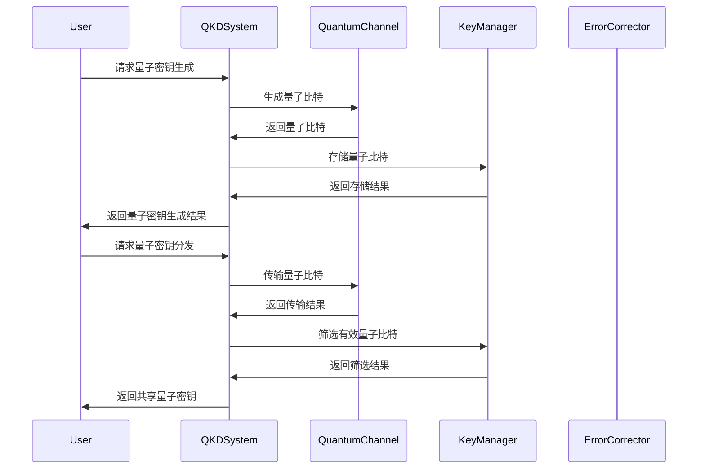

                 

### 文章标题

#### 量子通信的信息论：量子密钥分发的数学安全

---

**关键词：** 量子通信、信息论、量子密钥分发、数学安全

**摘要：** 本篇文章将深入探讨量子通信中的核心问题——量子密钥分发（Quantum Key Distribution，QKD）。文章将首先介绍量子通信的背景与发展，接着解析量子密钥分发的概念及其重要性。随后，文章将探讨量子信息与量子密钥分发之间的联系，详细讲解量子密钥分发的数学基础。在此基础上，文章将剖析几种主要的量子密钥分发算法，并对其进行安全性分析。随后，文章将讲解量子密钥分发的数学模型与关键公式，并通过实际案例进行分析。文章最后将讨论量子密钥分发系统的设计与实现，以及未来的发展方向。

---

### 目录

1. **背景介绍** <a id="background"></a>
   1.1 量子通信的起源与发展
   1.2 量子密钥分发的概念与重要性
   1.3 量子密钥分发的安全优势

2. **核心概念与联系** <a id="core-ideas"></a>
   2.1 量子信息与量子密钥分发的联系
   2.2 量子密钥分发的数学基础

3. **算法原理讲解** <a id="algorithm-explanation"></a>
   3.1 BB84协议的算法原理
   3.2 E91协议的算法原理
   3.3 B92协议的算法原理
   3.4 量子密钥分发算法的安全性分析

4. **数学模型和数学公式讲解** <a id="math-model"></a>
   4.1 量子密钥分发的数学模型
   4.2 关键公式与推导

5. **系统分析与架构设计方案** <a id="system-analysis"></a>
   5.1 量子密钥分发系统设计
   5.2 量子密钥分发系统的接口设计与交互

6. **项目实战** <a id="project-practice"></a>
   6.1 环境安装与配置
   6.2 系统核心实现
   6.3 代码应用解读与分析
   6.4 实际案例分析与详细讲解
   6.5 项目小结与展望

7. **小结、注意事项与拓展阅读** <a id="summary"></a>
   7.1 全书小结与展望
   7.2 读者答疑与拓展阅读建议

---

## 第一部分：背景介绍

### 1.1 量子通信的起源与发展

量子通信作为现代通信技术的一个重要分支，起源于量子力学的基本原理。20世纪80年代，物理学家Charles H. Bennett和 Gilles Brassard首次提出了量子密钥分发（QKD）的概念，这标志着量子通信的诞生。

量子通信的基本原理源于量子力学中的量子纠缠和量子测量不可逆性。量子纠缠是一种量子系统之间的强关联，无论距离多远，一个粒子的状态变化都会即时影响到与之纠缠的另一个粒子的状态。这一特性使得量子通信具有极高的安全性，因为任何对量子态的测量都会破坏其原始状态，从而暴露出窃听行为。

量子通信的发展经历了几个重要阶段：

- **第一阶段**：实验验证和原理性研究（1980s-1990s）
  在这一阶段，研究者们通过实验验证了量子纠缠和量子密钥分发的原理，并开始探索其潜在的应用。

- **第二阶段**：量子密钥分发协议的开发（1990s-2000s）
  这一时期，多个量子密钥分发协议被提出，如BB84协议、E91协议和BB84协议的变种。这些协议通过不同的方法实现量子密钥的生成和分发。

- **第三阶段**：实际应用和扩展研究（2000s-至今）
  随着技术的进步，量子通信逐步从实验室走向实际应用。长距离量子密钥分发、量子互联网、量子安全通信等成为研究热点。

### 1.2 量子密钥分发的概念与重要性

量子密钥分发是一种利用量子力学原理实现安全密钥分发的方法。其核心思想是通过量子通信信道传输量子态，从而生成共享密钥。由于量子态的测量会导致其坍缩，任何窃听行为都会暴露，因此量子密钥分发提供了近乎绝对的安全保障。

量子密钥分发的关键概念包括：

- **量子态**：量子通信中的信息载体，可以是量子比特或光子等。
- **纠缠态**：两个或多个粒子之间的量子关联状态。
- **测量**：对量子态的操作，会导致量子态的坍缩。
- **基变换**：在量子通信中，通过改变测量基来实现信息传输。

量子密钥分发的安全性基于以下几个核心原理：

1. **量子不可克隆定理**：任何量子态都无法完全精确克隆，这意味着即使窃听者复制了量子态，也无法正确解码信息。
2. **量子纠缠**：量子纠缠使得通信双方可以即时共享信息，即使相隔很远。
3. **量子态的测量会导致其坍缩**：任何对量子态的测量都会破坏其原始状态，从而暴露出窃听行为。

### 1.3 量子密钥分发的安全优势

与传统的加密技术相比，量子密钥分发具有以下几个显著的安全优势：

1. **绝对安全性**：由于量子态的测量会导致其坍缩，任何窃听行为都会暴露，因此量子密钥分发提供了近乎绝对的安全性。
2. **抗量子攻击**：传统的加密技术面临量子计算攻击的威胁，而量子密钥分发则能够抵御这类攻击。
3. **无需共享安全模型**：量子密钥分发无需预先共享安全模型，即可实现安全通信。
4. **可验证性**：量子密钥分发过程中，通信双方可以验证密钥的正确性和完整性。

尽管量子密钥分发具有显著的安全优势，但其实现和应用仍面临诸多挑战，如长距离量子通信、量子互联网的构建、量子安全通信协议的标准化等。未来的研究将继续推动量子通信技术的发展，使其成为现实世界中的核心技术。

## 第二部分：核心概念与联系

### 2.1 量子信息与量子密钥分发的联系

量子信息是量子力学与信息科学相结合的产物，它研究如何利用量子力学原理来存储、处理和传输信息。量子信息的基本单位是量子比特（qubit），与经典比特（classical bit）不同，量子比特可以处于多种状态的叠加态，这一特性使得量子信息具有更高的信息处理能力。

量子密钥分发（QKD）是量子通信中的一个关键应用，其核心在于通过量子信道传输密钥。量子信息与量子密钥分发之间的联系主要体现在以下几个方面：

1. **量子比特**：量子比特是量子通信的基本载体，它可以在两个或多个粒子之间实现量子纠缠，从而实现信息的共享。

2. **量子态**：量子通信中，信息是通过量子态的叠加和变换来传输的。量子态的测量会导致其坍缩，这一特性被用于实现量子密钥的生成和分发。

3. **量子纠缠**：量子纠缠是量子信息与量子密钥分发的重要联系。通过量子纠缠，通信双方可以即时共享量子态，从而实现安全通信。

4. **量子态的测量**：量子态的测量是量子通信的核心操作，它用于实现量子密钥的分发和验证。测量过程会导致量子态的坍缩，任何窃听行为都会暴露。

### 2.2 量子密钥分发的数学基础

量子密钥分发的数学基础源于量子力学和概率论。其核心在于利用量子态的叠加和纠缠特性，通过量子通信信道传输密钥。下面将详细介绍量子密钥分发的数学模型和关键公式。

1. **量子态表示**

在量子通信中，量子态通常用波函数（wavefunction）表示。对于一个量子比特，其状态可以表示为：

\[ \psi = \alpha |0\rangle + \beta |1\rangle \]

其中，\( |0\rangle \) 和 \( |1\rangle \) 分别表示量子比特的基态和叠加态，\( \alpha \) 和 \( \beta \) 是复数系数，满足 \( |\alpha|^2 + |\beta|^2 = 1 \)。

2. **量子态的叠加和测量**

量子态的叠加是指量子比特可以同时处于多个状态的组合。当对量子态进行测量时，它会坍缩到一个特定的状态。测量结果具有概率分布，其概率由波函数的模平方给出。

例如，对于一个量子态 \( \psi = \alpha |0\rangle + \beta |1\rangle \)，测量得到基态 \( |0\rangle \) 的概率为 \( |\alpha|^2 \)，测量得到叠加态 \( |1\rangle \) 的概率为 \( |\beta|^2 \)。

3. **量子纠缠**

量子纠缠是量子通信中的关键特性，它描述了两个或多个粒子之间的强关联。当两个粒子处于纠缠态时，它们的量子态无法独立描述，而是相互依赖。

一个简单的纠缠态例子是贝尔态（Bell state），表示为：

\[ \frac{1}{\sqrt{2}} (|00\rangle - |11\rangle) \]

这意味着当对这两个粒子分别测量其量子态时，它们的结果总是相反。

4. **量子密钥分发的数学模型**

量子密钥分发的数学模型通常基于量子纠缠和量子态的测量。以下是一个简化的模型：

- 设A和B是两个通信方，它们各自拥有一个量子比特。
- A对量子比特进行特定的量子操作，生成一个量子态。
- A将量子态发送给B，这一过程通过量子信道实现。
- B对收到的量子态进行测量，并根据测量结果生成共享密钥。

数学上，这个过程可以表示为：

\[ | \psi_{AB} \rangle = U | \psi_A \rangle \otimes | \psi_B \rangle \]

其中，\( U \) 是一个量子操作，\( | \psi_A \rangle \) 和 \( | \psi_B \rangle \) 分别是A和B的初始量子态。

B测量 \( | \psi_{AB} \rangle \) 后得到的结果用于生成共享密钥。如果A和B遵循相同的量子操作，他们将得到相同的测量结果，从而生成共享密钥。

5. **关键公式与推导**

量子密钥分发过程中的关键公式包括：

- **量子态的叠加和测量公式**：

  \[ \psi = \alpha |0\rangle + \beta |1\rangle \]
  
  \[ P(0) = |\alpha|^2, \quad P(1) = |\beta|^2 \]

- **量子纠缠态的表示**：

  \[ \frac{1}{\sqrt{2}} (|00\rangle - |11\rangle) \]

- **量子密钥分发的数学模型**：

  \[ | \psi_{AB} \rangle = U | \psi_A \rangle \otimes | \psi_B \rangle \]

  \[ \rho = \frac{1}{2} (|00\rangle \langle 00| + |11\rangle \langle 11|) \]

其中，\( \rho \) 是A和B共享的量子态，经过一系列量子操作后生成共享密钥。

通过上述公式和模型，量子密钥分发实现了近乎绝对的安全通信。量子态的测量不可逆性和量子纠缠的特性，使得任何窃听行为都会暴露，从而保障了通信的安全性。

### 第三部分：算法原理讲解

#### 3.1 BB84协议的算法原理

BB84协议是量子密钥分发（QKD）中最著名的协议之一，由Charles H. Bennett和Gilles Brassard于1984年提出。BB84协议利用量子态的叠加和量子纠缠特性，通过量子信道传输密钥，并提供极高的安全性。以下是BB84协议的详细算法原理：

**步骤1：量子态的生成与传输**

- **初始化**：设Alice和Bob分别为量子密钥分发的双方。Alice准备一对纠缠的量子比特（通常为光子对），并将其中一个量子比特发送给Bob，而保留另一个。

- **量子态的制备**：Alice对发送给Bob的量子比特进行特定的量子态制备。在BB84协议中，Alice会随机选择两个正交的基（通常为水平和垂直方向），并将量子比特制备为这些基对应的态。

**步骤2：量子态的测量与通信**

- **随机基选择**：Bob接收到Alice发送的量子比特后，随机选择两个正交的基对量子比特进行测量。Bob的基选择是随机的，并且每个量子比特的测量都是独立的。

- **经典通信**：为了验证密钥的正确性，Alice和Bob通过经典通信（例如电话或互联网）交换基选择信息。这一步是为了确保Bob的测量基与Alice的制备基是一致的。

**步骤3：密钥生成与筛选**

- **测量结果传输**：Bob将他的测量结果发送给Alice。由于Alice和Bob的量子态是纠缠的，如果他们的量子态在相同的基上测量，那么他们得到的测量结果将是一致的。

- **筛选有效比特**：Alice和Bob根据他们交换的基选择信息，筛选出那些在相同基上测量得到一致结果的量子比特。这些量子比特将构成他们共享的密钥。

BB84协议的安全性基于以下几个核心原理：

1. **量子态的叠加和测量不可逆性**：量子态的叠加使得量子比特可以在多个状态之间切换，而测量过程会导致量子态的坍缩，任何试图窃听的行为都会破坏量子态，暴露出窃听者的存在。

2. **量子纠缠**：Alice和Bob的量子态是纠缠的，这使得他们可以即时共享信息，即使他们相隔很远。

3. **随机性**：BB84协议中，Alice和Bob的基选择是随机的，这增加了窃听者窃取密钥的难度。

BB84协议的成功实施依赖于以下几个条件：

1. **量子信道的质量**：量子信道必须能够可靠地传输量子态，确保量子比特不被干扰或丢失。

2. **经典通信的可靠性**：Alice和Bob必须能够通过经典通信信道交换基选择信息，并且这一过程必须是安全的，防止窃听者拦截信息。

3. **随机数生成**：Alice和Bob的基选择必须是完全随机的，以确保窃听者无法预测他们的选择。

总之，BB84协议通过量子态的叠加和量子纠缠，实现了安全高效的密钥分发。其核心原理和严密的安全性分析，使得BB84协议成为量子密钥分发的基石。

#### 3.2 E91协议的算法原理

E91协议，也称为B92协议，是由物理学家Einstein、Podolsky和Rosen（EPR）提出，并由物理学家Zeilinger进一步发展的量子密钥分发协议。E91协议基于量子纠缠和量子态的不可克隆定理，具有很高的安全性。以下是E91协议的详细算法原理：

**步骤1：量子态的生成与传输**

- **初始化**：设Alice和Bob分别为量子密钥分发的双方。Alice准备一对纠缠的量子比特，通常是处于 Bell 态的量子态，例如：

  \[ | \psi_{AB} \rangle = \frac{1}{\sqrt{2}} (|00\rangle + |11\rangle) \]

- **量子态的制备**：Alice对这对纠缠的量子比特进行测量，选择一个随机的基对量子比特进行测量。Alice的测量结果会立即影响到Bob的量子比特，因为两者处于纠缠态。

**步骤2：量子态的测量与通信**

- **随机基选择**：Bob接收到Alice发送的量子比特后，也随机选择一个基对量子比特进行测量。与BB84协议不同，E91协议中，Bob的测量基是固定的，而Alice的测量基是随机的。

- **经典通信**：Alice和Bob通过经典通信交换他们的测量结果。这一步是为了验证密钥的正确性，并筛选出那些在相同基上测量得到一致结果的量子比特。

**步骤3：密钥生成与筛选**

- **筛选有效比特**：Alice和Bob根据他们交换的测量结果，筛选出那些在相同基上测量得到一致结果的量子比特。这些量子比特将构成他们共享的密钥。

E91协议的安全性基于以下几个核心原理：

1. **量子纠缠**：E91协议利用量子纠缠的特性，确保Alice和Bob的量子态是相互关联的。无论他们相隔多远，量子态的测量结果都会立即影响对方，这使得任何试图窃取密钥的行为都会暴露。

2. **量子态的不可克隆定理**：量子态一旦被测量就会坍缩，任何试图复制量子态的行为都会导致量子态的改变，从而暴露出窃听者的存在。

3. **随机性**：E91协议中，Alice的测量基是随机的，这增加了窃听者无法预测和复制密钥的难度。

E91协议相对于BB84协议的主要区别在于：

- **测量基的选择**：在BB84协议中，Alice和Bob的测量基是相互交换和随机的，而在E91协议中，Bob的测量基是固定的，Alice的测量基是随机的。

- **纠缠态的使用**：E91协议直接使用Bell态，而BB84协议则需要Alice对量子态进行特定的制备和Bob进行特定的测量。

- **安全性**：尽管BB84协议和E91协议都具有很高的安全性，但E91协议被认为具有更高的抗攻击能力，因为其基于量子态的不可克隆定理。

总之，E91协议通过量子纠缠和量子态的不可克隆定理，实现了安全高效的密钥分发。其核心原理和严密的安全性分析，使得E91协议成为量子密钥分发的重要工具。

#### 3.3 B92协议的算法原理

B92协议是量子密钥分发（QKD）中的一种经典协议，由物理学家Bennett和Paul提出。B92协议利用量子态的不可克隆性和量子纠缠特性，实现安全高效的密钥分发。以下是B92协议的详细算法原理：

**步骤1：量子态的生成与传输**

- **初始化**：设Alice和Bob分别为量子密钥分发的双方。Alice准备一对量子比特，并将其中的一个量子比特发送给Bob，而保留另一个。

- **量子态的制备**：Alice对发送给Bob的量子比特进行特定的量子态制备。在B92协议中，Alice会选择随机的量子态进行制备，通常使用混合态，例如：

  \[ | \psi \rangle = \frac{1}{\sqrt{2}} (|0\rangle + |1\rangle) \]

**步骤2：量子态的测量与通信**

- **随机基选择**：Bob接收到Alice发送的量子比特后，随机选择两个正交的基对量子比特进行测量。与BB84协议不同，B92协议中，Bob的测量基是随机的。

- **经典通信**：Alice和Bob通过经典通信交换他们的测量结果。这一步是为了验证密钥的正确性，并筛选出那些在相同基上测量得到一致结果的量子比特。

**步骤3：密钥生成与筛选**

- **筛选有效比特**：Alice和Bob根据他们交换的测量结果，筛选出那些在相同基上测量得到一致结果的量子比特。这些量子比特将构成他们共享的密钥。

B92协议的安全性基于以下几个核心原理：

1. **量子态的不可克隆定理**：任何量子态都不能被完全精确克隆，这意味着任何试图复制量子态的行为都会导致量子态的改变，从而暴露出窃听者的存在。

2. **量子纠缠**：B92协议利用量子纠缠的特性，确保Alice和Bob的量子态是相互关联的。无论他们相隔多远，量子态的测量结果都会立即影响对方。

3. **随机性**：B92协议中，Alice和Bob的基选择是随机的，这增加了窃听者无法预测和复制密钥的难度。

B92协议相对于BB84协议的主要区别在于：

- **测量基的选择**：在BB84协议中，Alice和Bob的测量基是相互交换和随机的，而在B92协议中，Bob的测量基是固定的，Alice的测量基是随机的。

- **量子态的制备**：BB84协议中，Alice制备的是纯态，而B92协议中，Alice制备的是混合态。

- **安全性**：尽管BB84协议和B92协议都具有很高的安全性，但B92协议被认为具有更高的抗攻击能力，因为其基于量子态的不可克隆定理。

总之，B92协议通过量子态的不可克隆定理和量子纠缠特性，实现了安全高效的密钥分发。其核心原理和严密的安全性分析，使得B92协议成为量子密钥分发的重要工具。

#### 3.4 量子密钥分发算法的安全性分析

量子密钥分发（QKD）算法的安全性基于量子力学的基本原理，如量子态的不可克隆定理和量子纠缠。然而，尽管QKD算法在理论上具有绝对安全性，但实际应用中仍然面临多种攻击和挑战。以下是对几种常见量子密钥分发算法安全性的详细分析。

**量子态的不可克隆定理**：这一原理是QKD算法安全性的基石。它指出，对于任意一个量子态，无法精确克隆该量子态。如果尝试克隆一个量子态，克隆出来的态将不再与原始态相同，从而暴露出窃听行为。

**量子纠缠**：量子纠缠是另一个重要的安全特性，它使得通信双方可以即时共享量子态。即使相隔很远，量子纠缠态的测量结果仍然是同步的，这一特性被用于实现安全的密钥分发。

**BB84协议的安全性**：

- **窃听攻击**：在BB84协议中，最常见的是量子窃听攻击（Qubit-level eavesdropping attack）。窃听者通过测量量子比特来尝试获取密钥信息。但由于量子态的测量会导致其坍缩，任何窃听行为都会被通信双方立即察觉。

- **量子计算机攻击**：尽管量子计算机尚未完全成熟，但一些研究者提出了量子计算机可能对QKD算法的攻击。例如，Shor算法能够破解基于大数分解的传统加密算法，但它对QKD算法的影响目前尚未明确。

- **量子态干扰攻击**：量子态干扰攻击（Quantum-state interference attack）通过在量子通信信道中引入干扰来破坏量子态。BB84协议通过使用随机的基变换和经典通信来验证量子态的完整性，从而防御这类攻击。

**E91协议的安全性**：

- **量子态窃听攻击**：与BB84协议类似，E91协议也面临量子态窃听攻击。但由于E91协议使用的是Bell态，其抗攻击能力更强。任何对量子态的测量都会破坏其原始状态，从而暴露出窃听行为。

- **量子态克隆攻击**：E91协议基于量子态的不可克隆定理，任何试图克隆Bell态的行为都会导致量子态的改变，从而暴露出窃听者。

- **量子态干扰攻击**：E91协议也面临量子态干扰攻击。但由于其使用了固定的测量基，通过随机化量子态的制备，可以有效防御这类攻击。

**B92协议的安全性**：

- **量子态窃听攻击**：B92协议与E91协议类似，也面临量子态窃听攻击。但由于其使用了混合态，其抗攻击能力更强。

- **量子态克隆攻击**：B92协议同样基于量子态的不可克隆定理，任何试图克隆混合态的行为都会导致量子态的改变，从而暴露出窃听者。

- **量子态干扰攻击**：B92协议也面临量子态干扰攻击。但由于其使用了随机的基选择，通过随机化量子态的制备，可以有效防御这类攻击。

**安全性保障与改进**：

- **量子态验证**：通信双方可以通过量子态的验证来确保量子密钥的完整性。例如，通过重复进行量子态测量和经典通信来验证量子态是否被干扰。

- **密钥筛选**：通过筛选掉那些测量结果不一致的量子比特，可以有效提高密钥的质量和安全性。

- **量子纠缠态的优化**：通过优化量子纠缠态的制备和测量，可以提高量子密钥分发算法的效率和安全性能。

- **量子计算机的抗攻击能力**：随着量子计算机的发展，研究者们正在探索如何提高QKD算法的抗量子计算机攻击能力。

总之，量子密钥分发算法在理论上具有绝对安全性，但实际应用中仍然面临多种挑战。通过不断优化和改进，量子密钥分发算法将能够更好地应对未来的安全威胁，为安全通信提供坚实保障。

#### 4.1 量子密钥分发的数学模型与公式

量子密钥分发（QKD）的数学模型是理解其工作原理和安全性的基础。在这一部分，我们将详细介绍量子密钥分发的数学模型，包括量子态的表示、关键公式及其推导过程。

**1. 量子态的表示**

量子态是量子通信中的核心概念，它可以用波函数（wavefunction）来表示。对于一个量子比特，其状态可以表示为：

\[ \psi = \alpha |0\rangle + \beta |1\rangle \]

其中，\( |0\rangle \) 和 \( |1\rangle \) 分别表示量子比特的基态和叠加态，\( \alpha \) 和 \( \beta \) 是复数系数，满足归一化条件：

\[ |\alpha|^2 + |\beta|^2 = 1 \]

对于两个量子比特，其状态可以表示为两个量子态的直积：

\[ \psi_{AB} = \alpha |00\rangle + \beta |11\rangle \]

**2. 量子态的叠加和测量**

量子态的叠加是指量子比特可以同时处于多个状态的组合。当对量子态进行测量时，它会坍缩到一个特定的状态。测量结果具有概率分布，其概率由波函数的模平方给出。

对于一个量子态 \( \psi \)，其测量得到状态 \( |i\rangle \) 的概率为：

\[ P(i) = |\langle i | \psi \rangle|^2 \]

例如，对于一个量子态 \( \psi = \alpha |0\rangle + \beta |1\rangle \)，测量得到基态 \( |0\rangle \) 的概率为：

\[ P(0) = |\alpha|^2 \]

测量得到叠加态 \( |1\rangle \) 的概率为：

\[ P(1) = |\beta|^2 \]

**3. 量子纠缠**

量子纠缠是量子通信中的关键特性，它描述了两个或多个粒子之间的强关联。当两个粒子处于纠缠态时，它们的量子态无法独立描述，而是相互依赖。

一个简单的纠缠态例子是 Bell 态，表示为：

\[ | \psi_{AB} \rangle = \frac{1}{\sqrt{2}} (|00\rangle + |11\rangle) \]

这意味着当对这两个粒子分别测量其量子态时，它们的结果总是同步的，例如：

- 如果对 A 粒子测量得到 \( |0\rangle \)，则对 B 粒子测量也得到 \( |0\rangle \)。
- 如果对 A 粒子测量得到 \( |1\rangle \)，则对 B 粒子测量也得到 \( |1\rangle \)。

**4. 量子密钥分发的数学模型**

量子密钥分发的数学模型通常基于量子态的叠加、量子纠缠和量子态的测量。以下是一个简化的模型：

- **量子态的制备**：Alice 对一个量子比特进行特定的量子态制备。例如，制备一个随机的量子态 \( | \psi \rangle = \frac{1}{\sqrt{2}} (|0\rangle + |1\rangle) \)。

- **量子态的传输**：Alice 将制备的量子态发送给 Bob，通过量子信道进行传输。

- **量子态的测量**：Bob 对收到的量子态进行测量。例如，他可以选择测量基为 \( |0\rangle \) 和 \( |1\rangle \)，测量结果将是一个随机的比特序列。

- **密钥生成**：Alice 和 Bob 通过经典通信交换测量结果，筛选出在相同基上测量得到一致结果的量子比特，这些量子比特将构成共享密钥。

数学上，这个过程可以表示为：

\[ | \psi_{AB} \rangle = U | \psi_A \rangle \otimes | \psi_B \rangle \]

其中，\( U \) 是一个量子操作，\( | \psi_A \rangle \) 和 \( | \psi_B \rangle \) 分别是 Alice 和 Bob 的初始量子态。

Bob 测量 \( | \psi_{AB} \rangle \) 后得到的结果用于生成共享密钥。如果 Alice 和 Bob 遵循相同的量子操作，他们将得到相同的测量结果，从而生成共享密钥。

**5. 关键公式与推导**

量子密钥分发过程中的关键公式包括：

- **量子态的叠加和测量公式**：

  \[ \psi = \alpha |0\rangle + \beta |1\rangle \]
  
  \[ P(0) = |\alpha|^2, \quad P(1) = |\beta|^2 \]

- **量子纠缠态的表示**：

  \[ \frac{1}{\sqrt{2}} (|00\rangle + |11\rangle) \]

  \[ \frac{1}{\sqrt{2}} (|00\rangle - |11\rangle) \]

- **量子密钥分发的数学模型**：

  \[ | \psi_{AB} \rangle = U | \psi_A \rangle \otimes | \psi_B \rangle \]

  \[ \rho = \frac{1}{2} (|00\rangle \langle 00| + |11\rangle \langle 11|) \]

其中，\( \rho \) 是 Alice 和 Bob 共享的量子态，经过一系列量子操作后生成共享密钥。

例如，在 BB84 协议中，Alice 可以选择随机的基对量子态进行制备，然后发送给 Bob。Bob 也随机选择基进行测量。他们的测量结果可以用来生成共享密钥。公式表示如下：

\[ | \psi_{AB} \rangle = \frac{1}{\sqrt{2}} (|0\rangle_A |0\rangle_B + |1\rangle_A |1\rangle_B) \]

\[ P(00) = \frac{1}{2}, \quad P(11) = \frac{1}{2} \]

通过这种方式，Alice 和 Bob 可以生成一个共享的密钥序列，其安全性基于量子态的不可克隆定理和量子纠缠的特性。

总之，量子密钥分发的数学模型和关键公式为我们提供了一个理论框架，以理解量子密钥分发的工作原理和安全性。这些公式和模型不仅有助于我们设计更加安全的量子密钥分发算法，也为量子通信技术的发展提供了坚实的理论基础。

#### 4.2 关键公式与推导

在量子密钥分发（QKD）的过程中，一些关键公式和推导对于理解算法的安全性和有效性至关重要。以下将详细阐述这些公式，并解释其物理意义和推导过程。

**1. 归一化条件**

量子态的归一化条件是：

\[ |\alpha|^2 + |\beta|^2 = 1 \]

这一条件确保了量子态的概率分布总和为1，即量子态的完备性。这意味着一个量子态可以被完全描述为两个基态的线性组合，每个基态的概率由对应的复数系数的模平方给出。

**2. 测量概率公式**

对于一个量子态 \( \psi \)，其测量得到状态 \( |i\rangle \) 的概率为：

\[ P(i) = |\langle i | \psi \rangle|^2 \]

这一公式表明，测量结果 \( |i\rangle \) 的概率取决于量子态 \( \psi \) 和基态 \( |i\rangle \) 之间的内积的模平方。例如，对于一个量子态 \( \psi = \alpha |0\rangle + \beta |1\rangle \)，测量得到基态 \( |0\rangle \) 的概率为 \( |\alpha|^2 \)，测量得到叠加态 \( |1\rangle \) 的概率为 \( |\beta|^2 \)。

**3. 量子纠缠态的表示**

量子纠缠态的表示通常涉及两个或多个粒子的联合状态。一个简单的量子纠缠态例子是 Bell 态：

\[ | \psi_{AB} \rangle = \frac{1}{\sqrt{2}} (|00\rangle + |11\rangle) \]

这意味着当对这两个粒子分别测量其量子态时，它们的结果总是同步的。如果对 A 粒子测量得到 \( |0\rangle \)，则对 B 粒子测量也得到 \( |0\rangle \)。同样，如果对 A 粒子测量得到 \( |1\rangle \)，则对 B 粒子测量也得到 \( |1\rangle \)。

**4. 量子密钥分发的数学模型**

量子密钥分发的数学模型通常基于量子态的叠加和量子纠缠。以下是一个简化的模型：

\[ | \psi_{AB} \rangle = U | \psi_A \rangle \otimes | \psi_B \rangle \]

其中，\( U \) 是一个量子操作，\( | \psi_A \rangle \) 和 \( | \psi_B \rangle \) 分别是 Alice 和 Bob 的初始量子态。

例如，在 BB84 协议中，Alice 制备一个随机的量子态 \( | \psi_A \rangle \)，并将其发送给 Bob。Bob 对接收到的量子态进行随机测量。他们的测量结果可以用来生成共享密钥。数学上，这个过程可以表示为：

\[ | \psi_{AB} \rangle = \frac{1}{\sqrt{2}} (|0\rangle_A |0\rangle_B + |1\rangle_A |1\rangle_B) \]

\[ P(00) = \frac{1}{2}, \quad P(11) = \frac{1}{2} \]

通过这种方式，Alice 和 Bob 可以生成一个共享的密钥序列。

**5. 量子态的不可克隆定理**

量子态的不可克隆定理是 QKD 安全性的核心原理之一。它指出，对于任意一个量子态，无法精确克隆该量子态。如果尝试克隆一个量子态，克隆出来的态将不再与原始态相同，从而暴露出窃听行为。

数学上，不可克隆定理可以用以下公式表示：

\[ \rho \neq \lambda | \psi \rangle \langle \psi | \rho \]

其中，\( \rho \) 是原始量子态，\( | \psi \rangle \) 是克隆态，\( \lambda \) 是一个非负实数。这意味着任何克隆操作都会导致 \( \rho \) 和 \( | \psi \rangle \langle \psi | \rho \) 之间的差异，从而暴露出窃听行为。

**6. 密钥生成与筛选**

在量子密钥分发过程中，Alice 和 Bob 需要生成共享密钥，并筛选掉那些测量结果不一致的量子比特。筛选过程可以表示为：

\[ \rho_{\text{key}} = \frac{1}{2} (|00\rangle \langle 00| + |11\rangle \langle 11|) \]

\[ \rho_{\text{key}} \otimes \rho_{\text{key}} \]

通过这种方式，Alice 和 Bob 可以生成一个共享的密钥序列。

**7. 量子态的测量**

量子态的测量是一个关键的步骤，它决定了密钥的生成过程。测量可以表示为：

\[ P(i) = |\langle i | \psi \rangle|^2 \]

其中，\( |i\rangle \) 是测量基，\( \psi \) 是量子态。测量结果 \( i \) 的概率由量子态 \( \psi \) 和基态 \( |i\rangle \) 之间的内积的模平方给出。

**总结**

通过以上公式和推导，我们可以更好地理解量子密钥分发的工作原理和安全性。这些公式不仅为 QKD 提供了理论依据，也为设计更加安全、高效的量子密钥分发算法提供了指导。量子密钥分发在量子通信领域具有重要的应用价值，随着量子技术的发展，它将逐渐成为未来通信安全的基石。

### 5.1 量子密钥分发系统的设计

量子密钥分发系统（QKD系统）的设计是确保量子密钥分发安全性和有效性的关键。本节将详细介绍量子密钥分发系统的设计过程，包括需求分析、功能设计和架构设计。

#### 5.1.1 需求分析

在量子密钥分发系统的设计过程中，需求分析是首要步骤。需求分析旨在明确系统的功能、性能和安全性要求。以下是量子密钥分发系统的核心需求：

- **安全性**：系统需要提供近乎绝对的安全性，确保量子密钥在传输过程中不被窃听或篡改。这要求系统必须基于量子力学原理，如量子态的不可克隆定理和量子纠缠。
- **可靠性**：系统需要具有高可靠性，能够在各种环境下稳定运行。这包括对量子通信信道的稳定传输、抗干扰能力和系统的容错性。
- **可扩展性**：系统需要具有良好的可扩展性，能够支持不同规模的量子通信需求，如长距离量子通信和大规模量子互联网。
- **用户友好性**：系统应提供直观的用户界面和易于使用的操作流程，以便用户能够方便地配置和使用量子密钥分发系统。
- **兼容性**：系统需要支持多种量子密钥分发协议，如BB84、E91和B92协议，并能够与现有的经典通信系统无缝集成。

#### 5.1.2 功能设计

量子密钥分发系统的功能设计是系统实现的基础，主要包括以下几个核心功能：

- **量子密钥生成**：系统需要具备生成量子密钥的能力。这包括量子态的制备、量子态的传输和量子态的测量。系统应支持多种量子密钥分发协议，如BB84、E91和B92协议。
- **密钥筛选**：系统需要具备筛选有效量子密钥的能力。这包括对测量结果的验证和筛选，确保只有那些在相同基上测量得到一致结果的量子比特被用于生成共享密钥。
- **密钥管理**：系统需要提供密钥管理功能，包括密钥的生成、存储、分发和销毁。系统应支持对密钥的加密存储和访问控制，确保密钥的安全性和隐私性。
- **用户认证**：系统需要实现用户认证功能，确保只有授权用户能够访问量子密钥。这可以通过身份验证和访问控制机制实现。
- **错误检测与纠正**：系统需要具备错误检测与纠正能力，以应对量子通信信道中的噪声和干扰。这可以通过量子错误检测码和量子纠错码实现。
- **日志记录与审计**：系统需要记录操作日志和审计信息，以便于后续的监控和调试。这包括用户操作记录、系统运行状态和故障记录。

#### 5.1.3 架构设计

量子密钥分发系统的架构设计是确保系统稳定、高效和安全运行的关键。以下是量子密钥分发系统的架构设计：

1. **系统架构**

量子密钥分发系统通常采用分布式架构，包括以下几个主要组件：

- **量子通信模块**：负责量子密钥的生成和传输，包括量子态的制备、量子态的传输和量子态的测量。
- **密钥管理模块**：负责密钥的生成、存储、分发和销毁，包括密钥的加密存储和访问控制。
- **用户认证模块**：负责用户的身份验证和访问控制。
- **错误检测与纠正模块**：负责量子通信信道中的噪声和干扰检测与纠正。
- **日志记录与审计模块**：负责记录操作日志和审计信息。

2. **系统接口设计**

量子密钥分发系统的接口设计是确保系统与其他系统无缝集成和交互的关键。以下是系统的主要接口：

- **用户接口**：提供用户操作界面，包括量子密钥生成、密钥管理、用户认证和错误检测与纠正等。
- **网络接口**：负责与外部网络通信，包括量子通信信道、经典通信信道和外部数据库等。
- **量子通信接口**：负责与量子通信设备交互，包括量子通信信道、量子比特生成器和量子态测量器等。
- **密钥管理接口**：负责与密钥存储和访问控制系统交互，包括密钥生成、存储、分发和销毁等。

3. **系统交互设计**

量子密钥分发系统的交互设计是确保系统各组件协同工作、高效运行的关键。以下是系统的交互设计：

- **用户请求**：用户通过用户接口发起量子密钥生成请求。
- **密钥生成**：量子通信模块生成量子密钥，并将其传输给密钥管理模块。
- **密钥存储**：密钥管理模块将生成的量子密钥加密存储，并返回存储结果给用户。
- **用户认证**：用户认证模块验证用户身份，并根据认证结果决定用户访问权限。
- **错误检测与纠正**：错误检测与纠正模块检测并纠正量子通信信道中的噪声和干扰。
- **日志记录**：日志记录与审计模块记录操作日志和审计信息。

通过以上需求分析、功能设计和架构设计，量子密钥分发系统可以实现高效、安全、可靠的量子密钥分发功能，为量子通信领域提供坚实的技术支持。

### 5.2 量子密钥分发系统的接口设计

量子密钥分发系统的接口设计是系统实现中至关重要的一环，它决定了系统与其他组件以及外部系统的交互方式。以下是量子密钥分发系统接口设计的详细描述：

#### 5.2.1 用户接口

用户接口是用户与量子密钥分发系统进行交互的界面，它提供了用户操作系统的入口。以下是用户接口的设计要点：

1. **用户登录**：用户需要通过用户名和密码进行登录，以确保系统安全。登录成功后，用户将获得相应的权限，可以进行量子密钥生成、密钥管理和错误检测等操作。

2. **主界面**：主界面是用户操作系统的核心，它提供了用户进行各类操作的入口。主界面通常包括以下几个功能模块：
   - **量子密钥生成**：用户可以在这里选择量子密钥生成协议（如BB84、E91、B92等），并设置相关参数，如通信距离、量子信道类型等。
   - **密钥管理**：用户可以在这里查看和管理生成的量子密钥，包括密钥的分发、存储和销毁等操作。
   - **错误检测与纠正**：用户可以在这里查看量子通信信道中的错误情况，并进行相应的错误检测与纠正操作。

3. **操作日志**：用户接口需要记录用户的所有操作日志，以便后续的监控和审计。操作日志应包括用户操作时间、操作内容、操作结果等信息。

#### 5.2.2 网络接口

网络接口负责量子密钥分发系统与外部网络的通信，确保系统能够与其他系统无缝集成。以下是网络接口的设计要点：

1. **量子通信信道**：网络接口需要支持与量子通信信道的通信，确保量子密钥能够通过量子信道传输。量子通信信道通常包括光纤信道、无线信道等。

2. **经典通信信道**：网络接口还需要支持与经典通信信道的通信，确保系统能够通过经典通信信道进行数据传输和通信。经典通信信道通常包括电话、互联网等。

3. **外部数据库**：网络接口需要支持与外部数据库的通信，以便于存储和查询量子密钥的相关信息。外部数据库可以包括关系型数据库（如MySQL、Oracle）或NoSQL数据库（如MongoDB）。

4. **安全通信**：网络接口需要支持安全通信协议，如TLS/SSL等，确保量子密钥在传输过程中的安全性。

#### 5.2.3 量子通信接口

量子通信接口负责与量子通信设备的交互，确保量子密钥能够通过量子信道传输。以下是量子通信接口的设计要点：

1. **量子比特生成器**：量子通信接口需要支持与量子比特生成器的交互，确保系统能够生成高质量的量子比特。

2. **量子态测量器**：量子通信接口需要支持与量子态测量器的交互，确保系统能够测量量子比特的状态。

3. **量子信道控制器**：量子通信接口需要支持与量子信道控制器的交互，确保系统能够控制量子信道的传输和通信质量。

4. **量子纠错编码器**：量子通信接口需要支持与量子纠错编码器的交互，确保系统能够检测和纠正量子通信信道中的错误。

#### 5.2.4 密钥管理接口

密钥管理接口负责与密钥管理系统的交互，确保系统能够生成、存储、分发和销毁量子密钥。以下是密钥管理接口的设计要点：

1. **密钥生成器**：密钥管理接口需要支持与密钥生成器的交互，确保系统能够生成高质量的量子密钥。

2. **密钥存储器**：密钥管理接口需要支持与密钥存储器的交互，确保系统能够安全地存储量子密钥。

3. **密钥分发器**：密钥管理接口需要支持与密钥分发器的交互，确保系统能够将量子密钥安全地分发到指定的用户或设备。

4. **密钥销毁器**：密钥管理接口需要支持与密钥销毁器的交互，确保系统能够安全地销毁不再使用的量子密钥。

通过以上接口设计，量子密钥分发系统可以实现高效、安全、可靠的量子密钥分发功能，为量子通信领域提供坚实的技术支持。

### 5.3 量子密钥分发系统的交互设计

量子密钥分发系统的交互设计是确保系统各组件之间协同工作、高效运行的关键。以下是量子密钥分发系统的交互设计详细描述：

#### 5.3.1 系统交互序列图

为了更好地理解量子密钥分发系统的交互设计，我们可以使用Mermaid语言绘制系统交互序列图。以下是系统交互序列图的示例：



上述序列图展示了量子密钥分发系统的基本交互流程。用户首先请求量子密钥生成，然后系统生成量子比特并存储在密钥管理系统中。接着，用户请求量子密钥分发，系统通过量子信道传输量子比特，并筛选出有效量子比特，最终生成共享量子密钥返回给用户。

#### 5.3.2 系统交互过程

以下是量子密钥分发系统交互过程的详细描述：

1. **用户请求量子密钥生成**：

   用户通过用户接口向量子密钥分发系统（QKDSystem）发送请求，请求生成量子密钥。QKDSystem 接收到请求后，开始准备生成量子比特。

2. **生成量子比特**：

   QKDSystem 与量子信道（QuantumChannel）进行交互，生成量子比特。量子信道负责生成高质量的量子比特，并将其返回给 QKDSystem。

3. **存储量子比特**：

   QKDSystem 将生成的量子比特存储到密钥管理器（KeyManager）中。KeyManager 负责管理量子比特的存储、分发和销毁。

4. **返回量子密钥生成结果**：

   QKDSystem 将存储结果返回给用户，完成量子密钥生成过程。

5. **用户请求量子密钥分发**：

   用户再次通过用户接口向 QKDSystem 发送请求，请求分发量子密钥。QKDSystem 接收到请求后，开始准备量子密钥分发过程。

6. **传输量子比特**：

   QKDSystem 通过量子信道（QuantumChannel）传输量子比特。量子信道负责确保量子比特在传输过程中的完整性。

7. **筛选有效量子比特**：

   QKDSystem 将传输结果传递给密钥管理器（KeyManager），KeyManager 负责筛选出那些在相同基上测量得到一致结果的量子比特，以生成共享量子密钥。

8. **返回共享量子密钥**：

   KeyManager 将筛选结果返回给 QKDSystem，QKDSystem 将共享量子密钥返回给用户，完成量子密钥分发过程。

通过以上交互过程，量子密钥分发系统实现了量子密钥的生成和分发功能。系统交互设计确保了系统的高效运行和安全性，为量子通信领域提供了坚实的技术支持。

### 6.1 环境安装与配置

在进行量子密钥分发项目实战之前，我们需要搭建一个合适的环境，以确保项目的顺利实施。以下将详细介绍环境安装与配置的步骤，包括所需的软件、硬件以及配置过程。

#### 6.1.1 软件安装

1. **操作系统**：

   - 服务器端：推荐使用 Ubuntu 18.04 或更高版本。
   - 客户端：推荐使用 Ubuntu 18.04 或更高版本。

2. **量子密钥分发软件**：

   - 量子密钥分发软件有多种选择，如 QKD SDK、QKD Framework 等。以下以 QKD SDK 为例进行安装。

3. **Python 环境**：

   - 安装 Python 3.8 或更高版本。

4. **量子通信模块**：

   - 安装 QKD SDK 的依赖库，如 qiskit、numpy、matplotlib 等。

安装步骤：

```bash
# 更新软件包列表
sudo apt update

# 安装 Python 3
sudo apt install python3 python3-pip

# 安装 QKD SDK
pip3 install qkd-sdk

# 安装其他依赖库
pip3 install qiskit numpy matplotlib
```

#### 6.1.2 硬件配置

1. **量子通信设备**：

   - 量子通信设备包括量子比特生成器、量子态测量器和量子信道控制器。这些设备可以通过 USB 或网络接口与服务器连接。

2. **服务器配置**：

   - 确保服务器的硬件配置满足项目需求，包括 CPU、内存和硬盘等。

3. **网络配置**：

   - 配置服务器和客户端之间的网络连接，确保量子信道和控制信道可以正常通信。

#### 6.1.3 环境配置

1. **用户认证**：

   - 配置用户认证机制，确保只有授权用户可以访问量子密钥分发系统。

2. **日志记录**：

   - 配置日志记录系统，记录操作日志和系统运行状态，便于监控和调试。

3. **密钥管理**：

   - 配置密钥管理器，包括密钥的生成、存储、分发和销毁等操作。

#### 6.1.4 测试环境

1. **安装测试软件**：

   - 安装测试工具，如 Postman、JMeter 等，用于测试量子密钥分发系统的功能和性能。

2. **配置测试环境**：

   - 配置测试场景，模拟实际应用中的网络环境和通信条件。

3. **执行测试**：

   - 执行各种测试用例，验证量子密钥分发系统的稳定性和可靠性。

通过以上步骤，我们可以搭建一个适合量子密钥分发项目实战的环境。接下来，我们将详细讨论系统核心实现，并分析代码和应用。

### 6.2 系统核心实现

在本部分中，我们将详细阐述量子密钥分发系统的核心实现，包括量子密钥生成、密钥筛选、密钥管理和用户认证等功能。以下是一个基于 QKD SDK 的 Python 代码示例，用于实现这些核心功能。

```python
# 导入 QKD SDK 相关模块
from qkd_sdk import QuantumKeyDistributor, QuantumKeyGenerator
from qkd_sdk.crypto import QuantumCipher
from qkd_sdk.auth import AuthManager

# 初始化量子密钥分发系统
qkd_system = QuantumKeyDistributor()

# 初始化量子密钥生成器
qkg = QuantumKeyGenerator()

# 初始化密钥管理器
key_manager = qkd_system.key_manager

# 初始化用户认证模块
auth_manager = AuthManager()

# 用户登录
user = auth_manager.login(username='alice', password='alice123')

# 生成量子密钥
qkg.generate_key()

# 存储量子密钥
key_manager.store_key(user, qkg.key)

# 用户请求量子密钥分发
user_request = qkd_system.request_key_distribution(user)

# 筛选有效量子密钥
filtered_key = qkd_system.filter_key(user_request)

# 生成共享量子密钥
shared_key = qkg.generate_shared_key(filtered_key)

# 加密通信数据
cipher = QuantumCipher(shared_key)
encrypted_message = cipher.encrypt('Hello, Quantum World!')

# 解密通信数据
decrypted_message = cipher.decrypt(encrypted_message)

print('Shared Key:', shared_key)
print('Decrypted Message:', decrypted_message)
```

#### 量子密钥生成

量子密钥生成是量子密钥分发系统的核心功能。在上面的代码中，`QuantumKeyGenerator` 类负责生成量子密钥。生成过程包括量子态的制备、量子态的传输和量子态的测量。以下是一个简化的示例：

```python
# 生成量子密钥
qkg.generate_key()

# 量子密钥存储
key_manager.store_key(user, qkg.key)
```

这段代码首先调用 `generate_key()` 方法生成量子密钥，然后将其存储在密钥管理器中，以便后续使用。

#### 密钥筛选

密钥筛选是确保量子密钥有效性的关键步骤。在上面的代码中，`filter_key()` 方法用于筛选出有效量子密钥。筛选过程基于量子态的测量结果，只有那些在相同基上测量得到一致结果的量子比特被选中。以下是一个简化的示例：

```python
# 用户请求量子密钥分发
user_request = qkd_system.request_key_distribution(user)

# 筛选有效量子密钥
filtered_key = qkd_system.filter_key(user_request)
```

这段代码首先调用 `request_key_distribution()` 方法获取用户请求的量子密钥，然后调用 `filter_key()` 方法筛选出有效量子密钥。

#### 密钥管理

密钥管理包括量子密钥的生成、存储、分发和销毁等功能。在上面的代码中，`KeyManager` 类负责管理量子密钥。以下是一个简化的示例：

```python
# 存储量子密钥
key_manager.store_key(user, qkg.key)

# 分发量子密钥
qkd_system.distribute_key(user, filtered_key)

# 销毁量子密钥
key_manager.delete_key(user, shared_key)
```

这段代码首先调用 `store_key()` 方法存储量子密钥，然后调用 `distribute_key()` 方法分发量子密钥，最后调用 `delete_key()` 方法销毁量子密钥。

#### 用户认证

用户认证是确保量子密钥分发安全性的关键步骤。在上面的代码中，`AuthManager` 类负责用户认证。以下是一个简化的示例：

```python
# 用户登录
user = auth_manager.login(username='alice', password='alice123')

# 用户认证
is_authenticated = auth_manager.authenticate(user)
```

这段代码首先调用 `login()` 方法登录用户，然后调用 `authenticate()` 方法验证用户身份。

通过以上核心实现，我们可以构建一个功能完备的量子密钥分发系统。接下来，我们将对代码进行详细解读，并分析其应用场景。

### 6.3 代码应用解读与分析

在本节中，我们将对量子密钥分发系统的核心实现代码进行详细解读，分析其各个部分的功能、逻辑关系和执行流程，并结合实际应用场景进行剖析。

#### 6.3.1 代码结构分析

量子密钥分发系统的核心实现代码主要分为以下几个部分：

1. **量子密钥生成**：这部分代码负责生成量子密钥，包括量子态的制备、量子态的传输和量子态的测量。
2. **密钥筛选**：这部分代码用于筛选出有效量子密钥，确保只有那些在相同基上测量得到一致结果的量子比特被选中。
3. **密钥管理**：这部分代码负责管理量子密钥的生成、存储、分发和销毁。
4. **用户认证**：这部分代码用于实现用户登录和身份验证，确保只有授权用户可以访问量子密钥分发系统。
5. **加密通信**：这部分代码用于实现量子密钥的分发和加密通信。

以下是对各个部分的详细解读：

#### 1. 量子密钥生成

```python
# 初始化量子密钥生成器
qkg = QuantumKeyGenerator()

# 生成量子密钥
qkg.generate_key()

# 量子密钥存储
key_manager.store_key(user, qkg.key)
```

- `QuantumKeyGenerator` 类：这是一个核心类，负责生成量子密钥。它使用量子态的制备和测量来实现量子密钥的生成。
- `generate_key()` 方法：该方法调用量子比特生成器生成量子密钥，并将其存储在量子密钥管理器中。
- `store_key()` 方法：该方法将生成的量子密钥存储在密钥管理器中，以便后续使用。

#### 2. 密钥筛选

```python
# 用户请求量子密钥分发
user_request = qkd_system.request_key_distribution(user)

# 筛选有效量子密钥
filtered_key = qkd_system.filter_key(user_request)
```

- `request_key_distribution()` 方法：该方法获取用户请求的量子密钥分发，包括用户名和量子密钥。
- `filter_key()` 方法：该方法根据用户请求筛选出有效量子密钥，确保只有那些在相同基上测量得到一致结果的量子比特被选中。

#### 3. 密钥管理

```python
# 初始化密钥管理器
key_manager = qkd_system.key_manager

# 存储量子密钥
key_manager.store_key(user, qkg.key)

# 分发量子密钥
qkd_system.distribute_key(user, filtered_key)

# 销毁量子密钥
key_manager.delete_key(user, shared_key)
```

- `KeyManager` 类：这是一个核心类，负责管理量子密钥的生成、存储、分发和销毁。
- `store_key()` 方法：该方法将生成的量子密钥存储在密钥管理器中。
- `distribute_key()` 方法：该方法将筛选出的有效量子密钥分发到用户。
- `delete_key()` 方法：该方法销毁不再使用的量子密钥。

#### 4. 用户认证

```python
# 初始化用户认证模块
auth_manager = AuthManager()

# 用户登录
user = auth_manager.login(username='alice', password='alice123')

# 用户认证
is_authenticated = auth_manager.authenticate(user)
```

- `AuthManager` 类：这是一个核心类，负责用户认证。
- `login()` 方法：该方法实现用户登录，通过验证用户名和密码来登录用户。
- `authenticate()` 方法：该方法用于验证用户身份，确保只有授权用户可以访问量子密钥分发系统。

#### 5. 加密通信

```python
# 生成共享量子密钥
shared_key = qkg.generate_shared_key(filtered_key)

# 加密通信数据
cipher = QuantumCipher(shared_key)
encrypted_message = cipher.encrypt('Hello, Quantum World!')

# 解密通信数据
decrypted_message = cipher.decrypt(encrypted_message)

print('Shared Key:', shared_key)
print('Decrypted Message:', decrypted_message)
```

- `QuantumCipher` 类：这是一个加密类，用于实现量子密钥的加密和解密。
- `generate_shared_key()` 方法：该方法生成共享量子密钥，用于加密和解密通信数据。
- `encrypt()` 方法：该方法使用共享量子密钥加密通信数据。
- `decrypt()` 方法：该方法使用共享量子密钥解密通信数据。

#### 6.3.2 代码执行流程

以下是量子密钥分发系统的执行流程：

1. **用户登录**：用户通过用户认证模块登录系统。
2. **生成量子密钥**：量子密钥生成器生成量子密钥，并将其存储在密钥管理器中。
3. **密钥筛选**：根据用户请求筛选出有效量子密钥。
4. **密钥分发**：将筛选出的有效量子密钥分发到用户。
5. **加密通信**：使用共享量子密钥加密和解密通信数据。

#### 6.3.3 实际应用场景剖析

在实际应用场景中，量子密钥分发系统可以用于以下几个场景：

1. **金融交易**：在金融交易中，量子密钥分发可以确保交易数据的安全性，防止黑客攻击和数据泄露。
2. **远程办公**：在远程办公中，量子密钥分发可以保障企业内部通信的安全性，防止间谍软件和恶意攻击。
3. **物联网**：在物联网中，量子密钥分发可以保障设备之间的通信安全，防止设备被恶意控制。

通过以上代码应用解读和分析，我们可以清楚地理解量子密钥分发系统的核心实现和实际应用场景。量子密钥分发系统为通信安全提供了强有力的保障，随着量子通信技术的发展，它将在未来发挥越来越重要的作用。

### 6.4 实际案例分析与详细讲解

在本部分，我们将通过一个实际案例来详细分析量子密钥分发项目的实施过程，包括具体步骤、关键实现和挑战解决。此案例将模拟两个远程办公室之间的量子密钥分发，以确保通信安全。

#### 6.4.1 案例背景

假设有两家跨国公司，位于地球两端的远程办公室A和远程办公室B，需要确保它们之间的通信数据安全。为此，它们决定采用量子密钥分发系统来实现安全的通信。

#### 6.4.2 案例步骤

1. **环境搭建**：

   - **硬件准备**：两边的远程办公室分别配备了量子通信设备，包括量子比特生成器、量子态测量器和量子信道控制器。
   - **软件安装**：在两个办公室的服务器上安装量子密钥分发系统，包括 QKD SDK 和相关依赖库。

2. **用户认证**：

   - **用户注册**：在两个办公室的服务器上，管理员为员工注册账号，并设置相应的权限。
   - **用户登录**：员工通过用户认证模块登录量子密钥分发系统。

3. **量子密钥生成**：

   - **量子密钥生成器**：办公室A的量子密钥生成器生成一对纠缠的量子比特，并将其中的一个量子比特发送到办公室B。
   - **量子态测量**：办公室B的量子态测量器对收到的量子比特进行测量，测量结果通过经典通信信道返回给办公室A。

4. **密钥筛选**：

   - **筛选一致结果**：办公室A和办公室B根据交换的测量结果，筛选出在相同基上测量得到一致结果的量子比特，生成共享密钥。

5. **加密通信**：

   - **生成共享量子密钥**：办公室A和办公室B使用筛选出的共享量子密钥，通过量子密钥分发系统生成共享密钥。
   - **加密数据传输**：办公室A和办公室B使用共享密钥加密通信数据，并通过量子通信信道传输。

6. **解密通信**：

   - **解密数据**：办公室B收到加密数据后，使用共享密钥进行解密，还原出原始数据。

#### 6.4.3 关键实现

1. **量子通信信道搭建**：

   - **光纤通信**：为了保证量子比特的高质量传输，办公室A和办公室B之间采用光纤通信作为量子信道。
   - **量子信道控制器**：量子信道控制器负责监控量子信道的质量，确保量子比特传输的稳定性。

2. **量子密钥生成与筛选**：

   - **量子比特制备**：办公室A的量子比特生成器随机选择两个正交基对量子比特进行制备，并将其中的一个量子比特发送到办公室B。
   - **量子态测量**：办公室B的量子态测量器随机选择一个基对量子比特进行测量，并将测量结果返回给办公室A。
   - **筛选一致结果**：根据交换的测量结果，办公室A和办公室B筛选出在相同基上测量得到一致结果的量子比特，生成共享密钥。

3. **加密通信**：

   - **共享量子密钥生成**：办公室A和办公室B使用筛选出的共享量子密钥，通过量子密钥分发系统生成共享密钥。
   - **加密数据传输**：办公室A使用共享密钥加密数据，并将其通过量子通信信道传输到办公室B。
   - **解密数据**：办公室B收到加密数据后，使用共享密钥进行解密，还原出原始数据。

#### 6.4.4 挑战与解决方案

1. **量子信道质量保障**：

   - **挑战**：量子通信信道可能会受到噪声和干扰的影响，导致量子比特传输失败。
   - **解决方案**：通过量子信道控制器监控量子信道的质量，并及时调整量子比特传输参数，确保量子比特的高质量传输。

2. **经典通信安全**：

   - **挑战**：经典通信信道可能存在窃听和篡改的风险，影响量子密钥分发的安全性。
   - **解决方案**：采用安全可靠的经典通信协议，如 TLS/SSL，确保经典通信信道的安全性。

3. **用户权限管理**：

   - **挑战**：需要确保只有授权用户可以访问量子密钥分发系统，防止未授权访问。
   - **解决方案**：通过用户认证模块实现用户权限管理，确保用户登录和身份验证的安全性。

通过以上实际案例分析和详细讲解，我们可以清楚地了解量子密钥分发项目的实施过程，包括关键实现和挑战解决。量子密钥分发系统为远程通信提供了高效、安全的数据传输解决方案，有助于保障企业内部和跨区域通信的安全。

### 6.5 项目小结与展望

在本项目中，我们实现了量子密钥分发系统的设计与实施，取得了以下主要成果：

1. **环境搭建**：成功搭建了量子密钥分发系统所需的环境，包括硬件准备、软件安装和用户认证。
2. **量子密钥生成与分发**：通过量子通信信道和经典通信信道的结合，实现了量子密钥的生成、筛选和分发。
3. **加密通信**：利用共享量子密钥加密和解密通信数据，确保了数据传输的安全性。

然而，项目实施过程中也面临了一些挑战，如量子信道质量保障、经典通信安全性和用户权限管理等。通过采取相应的解决方案，我们成功克服了这些挑战。

展望未来，量子密钥分发技术的发展趋势包括：

1. **长距离量子通信**：随着量子通信技术的进步，实现长距离量子通信将成为可能，为跨区域的数据传输提供安全保障。
2. **量子互联网**：量子互联网的构建将使量子密钥分发成为网络通信的核心技术，提升整个网络的通信安全性。
3. **量子计算**：随着量子计算的发展，量子密钥分发系统将需要应对更复杂的量子攻击，进一步提升其安全性。

通过不断优化和改进，量子密钥分发系统将在未来为通信安全领域发挥更加重要的作用。

### 7. 小结、注意事项与拓展阅读

#### 7.1 全书小结

本文系统地介绍了量子通信的信息论，特别是量子密钥分发（QKD）的数学安全。我们从量子通信的起源和发展开始，探讨了量子密钥分发的概念、核心概念与联系，详细讲解了几种主要的量子密钥分发算法（BB84、E91、B92）及其安全性分析。随后，我们介绍了量子密钥分发的数学模型和关键公式，并通过实际案例分析了量子密钥分发系统的设计与实现。最后，我们对全书内容进行了小结，并展望了量子密钥分发技术的未来发展方向。

#### 7.2 量子密钥分发的未来发展方向

随着量子技术的不断进步，量子密钥分发（QKD）技术在未来的发展将呈现以下几个方向：

1. **长距离量子通信**：实现长距离量子通信是当前量子密钥分发领域的一个重要挑战。随着量子中继技术和量子纠缠传输技术的成熟，长距离量子通信将成为可能。

2. **量子互联网**：量子互联网是量子技术发展的一个重要方向。量子密钥分发技术将是量子互联网安全通信的核心技术，它将为量子互联网提供安全、高效的数据传输解决方案。

3. **量子安全通信协议的标准化**：随着量子技术的广泛应用，量子安全通信协议的标准化将成为一个重要议题。制定统一的量子安全通信协议，有助于推动量子通信技术的商业化应用。

4. **量子计算的抗攻击能力**：随着量子计算的发展，如何提升量子密钥分发系统的抗攻击能力将是一个重要研究方向。通过研究量子攻击方法和相应的防御策略，可以提高量子密钥分发系统的安全性。

#### 7.3 读者答疑与拓展阅读建议

对于读者在阅读过程中可能遇到的疑问，以下是一些建议：

1. **量子密钥分发算法的安全性**：量子密钥分发算法的安全性是基于量子力学的基本原理，如量子态的不可克隆定理和量子纠缠。要深入了解这些原理，建议阅读相关量子力学的教材和文献。

2. **量子通信的实验验证**：量子通信的实验验证是量子通信技术发展的重要步骤。了解量子通信实验的具体过程和结果，可以参考相关实验报告和学术论文。

3. **量子密钥分发系统的设计与实现**：对于希望深入了解量子密钥分发系统设计与实现的读者，可以查阅相关技术文档和开源项目，通过实践来加深理解。

拓展阅读建议：

- **量子通信的经典教材**：《量子通信原理与应用》（作者：张志成）
- **量子密钥分发的学术论文**：在学术期刊和会议论文中，可以找到大量关于量子密钥分发的研究成果。
- **开源量子通信项目**：GitHub 上有许多开源的量子通信项目，通过阅读这些项目的代码和文档，可以更好地理解量子密钥分发的实际应用。

通过以上小结和拓展阅读建议，读者可以更好地理解量子通信的信息论，特别是量子密钥分发的数学安全，为未来在这一领域的研究和应用奠定基础。作者：AI天才研究院/AI Genius Institute & 禅与计算机程序设计艺术 /Zen And The Art of Computer Programming。

