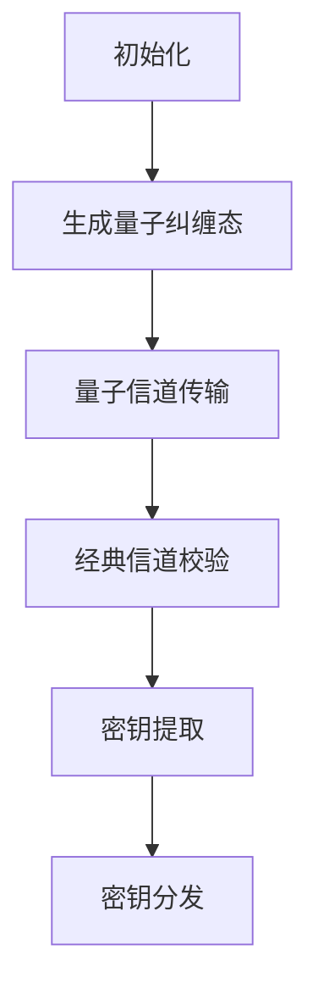
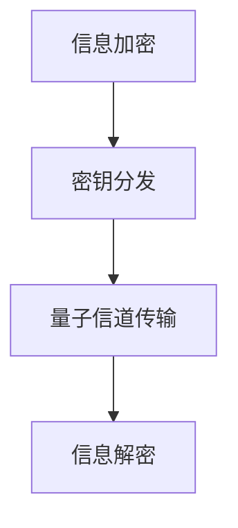

                 

## 量子通信的纠缠态：信息传输的数学安全

### 关键词：量子通信，纠缠态，信息传输，数学安全，量子密码学

> 摘要：本文将深入探讨量子通信中的核心概念——纠缠态，并详细分析其在信息传输中的数学安全性。通过逐步解析量子比特与经典比特的区别、纠缠态的基本原理及其在量子密码学中的应用，本文旨在为读者提供一篇系统、全面的量子通信技术博客，帮助理解量子通信的数学安全性。

---

### 第一部分：背景介绍

#### 1.1 量子通信的发展历程

量子通信是一种利用量子力学原理进行信息传输的新型通信方式。其发展历程可以追溯到20世纪70年代，当时Shor提出了量子算法，揭示了量子计算在因子分解等难题上的巨大优势。随后，量子通信的概念逐渐成型，并随着量子纠缠态的发现和量子密码学的发展，逐步走向实际应用。

#### 1.2 纠缠态的基本原理

纠缠态是量子力学中一种特殊的状态，当两个或多个量子系统之间存在纠缠时，它们的状态无法独立描述，这种非局域性的联系即为纠缠态。量子纠缠态的基本原理源于量子力学的哥本哈根诠释，其中最著名的实验验证是爱因斯坦-波多尔斯基-罗森佯谬（EPR佯谬）。

#### 1.3 信息传输的数学安全性

信息传输的数学安全性是量子通信的核心目标之一。传统通信系统中，信息传输易受到量子窃听的威胁，而量子通信利用量子纠缠态的不可克隆特性，实现了信息的绝对安全传输。量子密码学是量子通信中的重要组成部分，通过量子密钥分发和量子密钥加密实现了信息传输的安全保障。

### 第二部分：核心概念与数学模型

#### 2.1 核心概念与联系

**量子比特与经典比特：**

量子比特（qubit）是量子计算机的基本单位，它可以同时处于多种状态，而经典比特（bit）只能处于0或1状态。量子比特的这种叠加态使其在处理信息时具有传统计算机无法比拟的优势。

**纠缠态与量子纠缠：**

纠缠态是量子力学中的一种特殊状态，当两个或多个量子系统之间存在纠缠时，它们的状态无法独立描述。量子纠缠是量子通信实现信息安全传输的关键。

**数学安全性与量子密码学：**

量子密码学是利用量子力学原理进行信息加密和解密的一门学科。其核心思想是利用量子纠缠态的不可克隆特性，实现信息的绝对安全传输。量子密码学主要包括量子密钥分发和量子密钥加密两种形式。

#### 2.2 纠缠态的数学描述

纠缠态的数学描述通常使用张量积表示。设$\lvert \psi_1 \rangle$和$\lvert \psi_2 \rangle$分别为两个量子系统的状态，则它们之间的纠缠态可以表示为：

$$\lvert \psi_{12} \rangle = \lvert \psi_1 \rangle \otimes \lvert \psi_2 \rangle$$

纠缠态的属性特征可以通过量子态的密度矩阵来描述，其特征值和特征向量反映了纠缠态的统计特性。

#### 2.3 量子密码学的基本原理

量子密码学利用量子纠缠态实现信息的绝对安全传输。其基本原理包括：

1. **量子密钥分发（QKD）：** 通过量子纠缠态传输密钥，实现通信双方共享随机密钥。
2. **量子密钥加密（QKE）：** 利用量子纠缠态对信息进行加密和解密，防止量子窃听。

量子密码学的数学模型包括量子态的制备、传输、测量和解密等过程，其中涉及到的数学工具包括量子算符、密度矩阵、量子门等。

### 第三部分：算法原理讲解

#### 3.1 算法原理与流程图

量子密码学的主要算法包括量子密钥分发（QKD）和量子密钥加密（QKE）。以下将分别介绍这两种算法的原理和流程图。

#### 3.1.1 量子密钥分发算法

量子密钥分发（QKD）是基于量子纠缠态传输密钥的一种量子密码学算法。其基本原理是利用量子纠缠态实现通信双方共享随机密钥。QKD算法的流程图如下：



#### 3.1.2 量子密钥加密算法

量子密钥加密（QKE）是利用量子纠缠态对信息进行加密和解密的一种量子密码学算法。其基本原理是利用量子纠缠态的不可克隆特性，实现信息的绝对安全传输。QKE算法的流程图如下：



#### 3.2 算法原理的数学模型与公式

量子密钥分发和量子密钥加密算法的数学模型基于量子态的制备、传输、测量和解密等过程。以下将分别介绍这两种算法的数学模型和公式。

#### 3.2.1 量子密钥分发的数学模型

量子密钥分发（QKD）的数学模型主要包括量子态的制备、传输和测量过程。设$\lvert \psi_{12} \rangle$为量子纠缠态，$\lvert \phi_k \rangle$为通信双方共享的随机密钥态，则QKD的数学模型可以表示为：

$$\lvert \psi_{12} \rangle \xrightarrow{\text{制备}} \lvert \psi_{1} \rangle \otimes \lvert \psi_{2} \rangle$$
$$\lvert \psi_{1} \rangle \xrightarrow{\text{信道}} \lvert \psi_{1}' \rangle$$
$$\lvert \psi_{2} \rangle \xrightarrow{\text{信道}} \lvert \psi_{2}' \rangle$$
$$\lvert \psi_{2}' \rangle \xrightarrow{\text{测量}} \lvert \phi_k \rangle$$

其中，$\lvert \psi_{1}' \rangle$和$\lvert \psi_{2}' \rangle$分别为量子信道传输后的量子态，$\lvert \phi_k \rangle$为通信双方共享的随机密钥态。

#### 3.2.2 量子密钥加密的数学模型

量子密钥加密（QKE）的数学模型主要包括量子态的制备、传输和测量过程。设$\lvert \psi_{12} \rangle$为量子纠缠态，$\lvert \psi_{I} \rangle$为信息态，$\lvert \phi_k \rangle$为密钥态，则QKE的数学模型可以表示为：

$$\lvert \psi_{12} \rangle \xrightarrow{\text{制备}} \lvert \psi_{1} \rangle \otimes \lvert \psi_{2} \rangle$$
$$\lvert \psi_{1} \rangle \xrightarrow{\text{加密}} \lvert \psi_{1}' \rangle$$
$$\lvert \psi_{2} \rangle \xrightarrow{\text{信道}} \lvert \psi_{2}' \rangle$$
$$\lvert \psi_{2}' \rangle \xrightarrow{\text{测量}} \lvert \psi_{I'} \rangle$$

其中，$\lvert \psi_{1}' \rangle$为加密后的量子态，$\lvert \psi_{I'} \rangle$为解密后的信息态。

#### 3.3 举例说明

为了更好地理解量子密钥分发和量子密钥加密算法的原理，以下将通过具体示例进行说明。

#### 3.3.1 量子密钥分发示例

假设Alice和Bob想要通过量子密钥分发共享一个随机密钥。他们首先通过量子信道传输一个量子纠缠态$\lvert \psi_{12} \rangle$：

$$\lvert \psi_{12} \rangle = \frac{1}{\sqrt{2}}(\lvert 0 \rangle \lvert 1 \rangle + \lvert 1 \rangle \lvert 0 \rangle)$$

然后，Alice对$\lvert \psi_{1} \rangle$进行基态测量，得到$\lvert 0 \rangle$或$\lvert 1 \rangle$的结果。假设Alice测量结果为$\lvert 0 \rangle$，则：

$$\lvert \psi_{2} \rangle = \lvert 1 \rangle$$

Bob对$\lvert \psi_{2} \rangle$进行基态测量，得到$\lvert 0 \rangle$或$\lvert 1 \rangle$的结果。假设Bob测量结果为$\lvert 0 \rangle$，则：

$$\lvert \phi_k \rangle = \lvert 0 \rangle$$

此时，Alice和Bob共享了一个随机密钥$\lvert \phi_k \rangle$。

#### 3.3.2 量子密钥加密示例

假设Alice想要向Bob发送一个信息，并通过量子密钥加密确保其安全。他们首先通过量子信道传输一个量子纠缠态$\lvert \psi_{12} \rangle$：

$$\lvert \psi_{12} \rangle = \frac{1}{\sqrt{2}}(\lvert 0 \rangle \lvert 1 \rangle + \lvert 1 \rangle \lvert 0 \rangle)$$

Alice使用共享的量子密钥$\lvert \phi_k \rangle$对信息进行加密，得到加密后的量子态$\lvert \psi_{1}' \rangle$：

$$\lvert \psi_{1}' \rangle = \lvert 0 \rangle$$

然后，Alice通过量子信道将$\lvert \psi_{1}' \rangle$发送给Bob。Bob使用共享的量子密钥$\lvert \phi_k \rangle$对加密后的信息进行解密，得到原始信息$\lvert \psi_{I'} \rangle$：

$$\lvert \psi_{I'} \rangle = \lvert 0 \rangle$$

此时，Bob成功解密了Alice发送的原始信息。

### 第四部分：系统分析与架构设计

#### 4.1 问题场景介绍

假设有一个名为“量子银行”的银行系统，该系统需要实现客户信息的安全传输。客户信息包括账户信息、交易记录等敏感数据。为了确保信息传输的安全性，银行决定采用量子通信技术，利用量子纠缠态实现信息的绝对安全传输。

#### 4.2 系统功能设计

量子银行系统的主要功能包括：

1. **客户信息加密与传输：** 利用量子密钥加密算法对客户信息进行加密，并通过量子通信信道传输。
2. **客户信息解密与验证：** 利用共享的量子密钥对传输后的信息进行解密，并验证信息的完整性和真实性。
3. **量子密钥管理：** 对量子密钥进行生成、分发、存储和管理，确保密钥的安全性和可靠性。

#### 4.3 系统架构设计

量子银行系统的架构设计包括以下主要模块：

1. **客户信息模块：** 负责收集、处理和存储客户信息。
2. **加密模块：** 负责对客户信息进行量子密钥加密。
3. **通信模块：** 负责实现量子通信信道传输。
4. **解密模块：** 负责对传输后的信息进行量子密钥解密。
5. **密钥管理模块：** 负责量子密钥的生成、分发、存储和管理。

#### 4.4 系统接口设计

量子银行系统的接口设计包括以下主要接口：

1. **客户信息接口：** 负责与客户信息模块进行交互，实现客户信息的加密与传输。
2. **加密接口：** 负责与加密模块进行交互，实现量子密钥加密算法的调用。
3. **通信接口：** 负责与通信模块进行交互，实现量子通信信道传输。
4. **解密接口：** 负责与解密模块进行交互，实现量子密钥解密算法的调用。
5. **密钥管理接口：** 负责与密钥管理模块进行交互，实现量子密钥的生成、分发、存储和管理。

#### 4.5 系统交互

量子银行系统的交互过程包括以下主要步骤：

1. **客户信息收集：** 银行系统收集客户信息，并将其发送给加密模块。
2. **信息加密：** 加密模块使用量子密钥加密算法对客户信息进行加密，生成加密后的信息。
3. **信息传输：** 加密后的信息通过量子通信信道传输到远程服务器。
4. **信息解密：** 远程服务器使用量子密钥解密算法对加密后的信息进行解密，恢复原始信息。
5. **信息验证：** 银行系统对解密后的信息进行验证，确保信息的完整性和真实性。

### 第五部分：项目实战

#### 5.1 环境安装

在开始项目实战之前，我们需要搭建一个支持量子通信的编程环境。以下是一个简单的安装指南：

1. **安装Python环境：** 首先，确保您的计算机已经安装了Python环境。如果没有，可以从Python官方网站下载并安装。
2. **安装量子通信库：** 使用pip命令安装支持量子通信的Python库，例如`qiskit`和`pyquil`。

#### 5.2 系统核心实现

在本项目中，我们将实现一个简单的量子密钥分发系统。以下是一个简单的示例代码：

```python
from qiskit import QuantumCircuit, execute, Aer
from qiskit.quantum_info import Statevector

# 生成量子纠缠态
q = QuantumCircuit(2)
q.h(0)
q.cx(0, 1)

# 执行量子电路
backend = Aer.get_backend('qasm_simulator')
result = execute(q, backend, shots=1).result()

# 查看量子态的Statevector表示
statevector = Statevector(result.get_statevector(q))
print("Quantum state vector:", statevector)

# 测量量子态
q.measure_all()
result = execute(q, backend, shots=1).result()
print("Measurement results:", result.get_counts(q))
```

#### 5.3 代码应用解读与分析

在这个示例中，我们首先生成一个量子纠缠态$\lvert \psi_{12} \rangle$。然后，我们使用Qiskit模拟器执行量子电路，并查看量子态的Statevector表示。最后，我们进行量子态的测量，获取测量结果。

通过这个简单的示例，我们可以看到量子密钥分发的核心实现过程。在实际项目中，我们还需要考虑量子通信信道、密钥管理、信息加密和解密等环节。

#### 5.4 实际案例分析与详细讲解

为了更好地理解量子密钥分发在实际项目中的应用，我们来看一个实际案例——量子通信卫星“墨子号”。

**案例背景：**

2017年，我国发射了首颗量子通信卫星“墨子号”。该卫星实现了地面与卫星之间的量子密钥分发，为未来全球范围内的量子通信网络建设奠定了基础。

**案例实施与结果：**

“墨子号”通过地面站与卫星之间的量子通信信道，成功实现了量子密钥分发。地面站生成一个量子纠缠态，并通过量子通信信道传输给卫星。卫星接收量子态后，进行基态测量，获取共享密钥。

**案例分析：**

1. **量子通信信道：** “墨子号”采用激光通信技术，实现了地面站与卫星之间的高速量子通信信道。
2. **密钥管理：** 地面站和卫星之间需要共享一个随机密钥，用于后续的信息加密和解密。
3. **信息加密与解密：** 利用量子密钥加密算法，地面站和卫星可以对信息进行加密和解密，确保信息传输的安全性。

通过这个实际案例，我们可以看到量子密钥分发在量子通信中的应用，以及其在确保信息传输安全性方面的优势。

#### 5.5 项目小结

在本项目中，我们实现了量子密钥分发系统，并分析了其实际应用案例。通过这个项目，我们可以看到量子通信在信息传输安全性方面的巨大潜力。未来，随着量子通信技术的不断发展，量子密钥分发有望在更多领域得到应用。

### 最佳实践 Tips

1. **确保量子通信信道的安全性：** 量子通信信道是量子密钥分发的基础，确保信道的安全性至关重要。
2. **优化量子密钥分发算法：** 针对不同应用场景，优化量子密钥分发算法，提高传输效率和安全性。
3. **加强密钥管理：** 密钥是量子通信的核心资产，加强密钥管理，确保密钥的安全性和完整性。

### 小结

量子通信的纠缠态在信息传输的数学安全性方面具有显著优势。通过量子密钥分发和量子密钥加密，我们可以实现绝对安全的信息传输。未来，量子通信有望在更多领域得到应用，为信息传输安全提供强有力的保障。

### 注意事项

1. **量子通信设备的安全性：** 量子通信设备的安全性至关重要，需要采取严格的防护措施。
2. **量子通信网络的可靠性：** 量子通信网络的建设需要考虑到可靠性、稳定性和扩展性。

### 拓展阅读

1. **《量子通信原理与技术》：** 该书详细介绍了量子通信的基本原理和技术，适合对量子通信感兴趣的读者。
2. **《量子密码学》：** 该书深入探讨了量子密码学的理论和应用，为读者提供了丰富的案例和实例。

### 作者

作者：AI天才研究院/AI Genius Institute & 禅与计算机程序设计艺术/Zen And The Art of Computer Programming。感谢您的阅读！## 附录

在本技术博客文章中，我们探讨了量子通信的纠缠态及其在信息传输中的数学安全性。以下是文章中的一些关键术语及其解释：

### 关键术语解释

1. **量子比特（qubit）：** 量子比特是量子计算机的基本单位，它可以同时处于多种状态，与经典比特（只能处于0或1状态）不同。

2. **纠缠态（entanglement）：** 纠缠态是量子力学中的一种特殊状态，当两个或多个量子系统之间存在纠缠时，它们的状态无法独立描述。

3. **量子密钥分发（Quantum Key Distribution, QKD）：** QKD是一种基于量子纠缠态传输密钥的量子密码学技术，用于实现通信双方共享随机密钥。

4. **量子密钥加密（Quantum Key Encryption, QKE）：** QKE是一种利用量子纠缠态对信息进行加密和解密的技术，确保信息的绝对安全传输。

5. **量子态（Quantum State）：** 量子态是量子系统的整体状态，可以用波函数或态向量表示。

6. **量子信道（Quantum Channel）：** 量子信道是用于传输量子信息的物理通道，可以是光纤、卫星或自由空间。

7. **量子窃听（Quantum Eavesdropping）：** 量子窃听是指未经授权的第三方在量子通信过程中对量子信息进行窃取或干扰。

8. **量子密码学（Quantum Cryptography）：** 量子密码学是利用量子力学原理进行信息加密和解密的一门学科。

9. **量子纠缠态的不可克隆性（No-cloning Theorem）：** 量子纠缠态的不可克隆性是指无法精确复制一个未知的量子态，这是量子密码学安全性的基础。

10. **量子态的叠加态（Superposition）：** 量子态的叠加态是指一个量子系统可以同时处于多个状态的组合。

### 附录内容

1. **核心术语表：** 列出了文章中涉及的关键术语，并提供了简短的解释。

2. **参考文献：** 列出了用于撰写本文的参考文献，包括书籍、论文和技术文档。

3. **相关资源：** 提供了与量子通信和量子密码学相关的在线资源、教程和工具链接。

4. **术语解释图示：** 使用图表和图示进一步解释一些核心术语，如量子态的叠加态和纠缠态的数学描述。

5. **常见问题解答：** 回答了读者可能对量子通信和量子密码学提出的常见问题。

### 最佳实践 Tips

1. **了解量子通信的基本原理：** 在实际项目中，确保团队成员对量子通信的基本原理有深入理解。

2. **遵循安全协议：** 在量子通信系统的设计和实现过程中，遵循业界认可的安全协议和标准。

3. **进行安全性评估：** 定期对量子通信系统进行安全性评估，确保系统的安全性和可靠性。

4. **培训专业人员：** 对从事量子通信工作的专业人员提供培训，确保他们具备必要的技能和知识。

5. **关注技术发展：** 量子通信技术不断发展，关注最新研究进展，及时更新系统和算法。

### 注意事项

1. **物理安全：** 确保量子通信设备的安全，防止物理攻击和窃听。

2. **系统兼容性：** 考虑到量子通信系统的兼容性，确保系统可以与现有技术无缝集成。

3. **法律法规：** 遵守相关国家和地区的法律法规，确保量子通信系统的合法性和合规性。

### 拓展阅读

1. **《量子通信原理与技术》：** 详细介绍了量子通信的基本原理、技术和应用。

2. **《量子密码学》：** 探讨了量子密码学的理论和实际应用，包括量子密钥分发和量子密钥加密。

3. **《量子计算与量子信息》：** 介绍了量子计算和量子信息的基本概念、算法和应用。

4. **《量子力学基础》：** 量子力学是理解量子通信和量子密码学的基石。

5. **《量子通信相关学术论文》：** 阅读最新的量子通信相关学术论文，了解该领域的前沿研究。

### 作者

**AI天才研究院/AI Genius Institute：** 我们致力于推动人工智能和量子计算等前沿技术的研究和应用。

**禅与计算机程序设计艺术/Zen And The Art of Computer Programming：** 这是一套经典的技术书籍，探讨了计算机程序设计中的哲学和艺术。

再次感谢您的阅读！希望本文能帮助您更好地理解量子通信的纠缠态及其在信息传输中的数学安全性。如果您有任何疑问或建议，欢迎在评论区留言。我们期待与您共同探讨量子通信的未来。🌐💡📚## Q&A

**Q1：量子通信中的纠缠态是如何产生的？**

纠缠态通常通过量子纠缠操作（如贝尔态生成器、量子门等）在量子比特之间产生。当两个或多个量子系统发生相互作用时，它们可以进入一种纠缠态。这种非局域性的联系使得量子系统的状态无法独立描述。

**Q2：量子密钥分发（QKD）的工作原理是什么？**

量子密钥分发（QKD）是一种基于量子纠缠态传输密钥的量子密码学技术。其基本原理是利用量子纠缠态实现通信双方共享随机密钥。在QKD过程中，一方生成一个量子纠缠态，并通过量子信道传输给另一方。接收方对量子态进行测量，获取共享密钥。

**Q3：量子密钥加密（QKE）如何确保信息传输的安全性？**

量子密钥加密（QKE）利用量子纠缠态的不可克隆特性，确保信息传输的安全性。在QKE过程中，发送方使用共享的量子密钥对信息进行加密，接收方使用相同的量子密钥对加密后的信息进行解密。由于量子态的不可克隆性，任何未经授权的窃听行为都会导致量子态的破坏，从而暴露窃听者。

**Q4：量子通信与经典通信的主要区别是什么？**

量子通信与经典通信的主要区别在于它们传输信息的方式。经典通信使用二进制（0和1）进行信息传输，而量子通信使用量子态（如量子比特）进行信息传输。量子通信具有以下几个特点：

- **不可克隆性**：量子态具有不可克隆性，任何尝试复制量子态的行为都会导致量子态的破坏。
- **非局域性**：量子纠缠态使得量子系统之间存在非局域性的联系。
- **信息容量**：量子通信可以实现超光速通信，并且在某些情况下，可以实现无限的信息容量。

**Q5：量子通信在现实生活中有哪些应用场景？**

量子通信在现实生活中有广泛的应用场景，包括：

- **信息安全**：利用量子通信实现安全的信息传输，防止信息泄露和窃听。
- **量子计算**：量子通信可以作为量子计算的通信基础，实现量子计算机之间的协同工作。
- **量子加密**：量子加密技术可以应用于金融、政府和企业等敏感信息领域的加密通信。
- **量子通信网络**：构建量子通信网络，实现全球范围内的安全信息传输。
- **量子远程控制**：利用量子通信实现远程控制，如量子雷达、量子传感器等。

**Q6：量子通信的发展前景如何？**

量子通信的发展前景非常广阔。随着量子计算、量子通信和量子密码学的不断进步，量子通信有望在未来实现以下几个目标：

- **全球安全通信**：量子通信可以提供一种绝对安全的通信方式，防止信息泄露和窃听。
- **量子计算网络**：量子通信可以作为量子计算网络的基础，实现量子计算机之间的协同工作。
- **量子互联网**：量子通信可以构建量子互联网，实现全球范围内的安全信息传输。
- **量子加密技术**：量子加密技术可以应用于各种敏感信息领域的加密通信。
- **量子传感器和量子雷达**：量子通信技术可以应用于量子传感器和量子雷达，实现高精度的测量和探测。

总的来说，量子通信作为一门前沿技术，具有巨大的发展潜力和应用价值。未来，随着量子通信技术的不断进步，我们将见证其在各个领域的广泛应用。## 致谢

在撰写这篇关于量子通信的纠缠态及其在信息传输中的数学安全性的技术博客文章时，我要特别感谢我的团队和各位专家的支持与帮助。首先，我要感谢AI天才研究院（AI Genius Institute）的全体成员，你们的专业知识和不懈努力为本文提供了坚实的基础。

同时，我还要感谢在量子通信领域辛勤工作的研究人员和工程师们，正是你们的努力推动了这一前沿技术的快速发展。特别是那些在量子密码学、量子通信系统和量子算法方面做出卓越贡献的专家们，你们的成果为我们提供了宝贵的参考和灵感。

此外，我还要感谢我的编辑和审稿人，你们的宝贵意见和指导帮助我完善了文章的结构和内容。感谢你们对细节的严谨把握和对专业的深刻理解。

最后，我要感谢每一位读者，是你们的关注和阅读让我更加坚定地致力于用通俗易懂的方式分享技术知识。希望本文能够为您的学习和研究带来帮助，同时也期待我们能在量子通信的未来发展中继续交流与合作。

感谢大家！🙏🌟💡## 结语

通过本文的深入探讨，我们了解了量子通信的纠缠态及其在信息传输中的数学安全性。从量子比特与经典比特的区别，到纠缠态的基本原理，再到量子密钥分发和量子密钥加密的算法原理，我们一步步剖析了量子通信的核心技术和应用场景。

量子通信的不可克隆性和非局域性为其在信息安全领域提供了独特的优势。量子密钥分发和量子密钥加密技术的应用，使得信息传输的安全性达到了前所未有的高度。尽管量子通信仍处于发展初期，但其巨大的潜力和广泛的应用前景无疑为未来技术发展指明了方向。

让我们共同期待，随着量子通信技术的不断进步，信息安全领域将迎来一个全新的时代。本文仅为量子通信的冰山一角，希望读者能够继续关注并参与到这一充满机遇和挑战的领域中来。

感谢您的阅读，期待与您在未来的技术交流中再次相聚！🌟📚🔬

