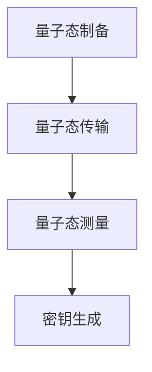
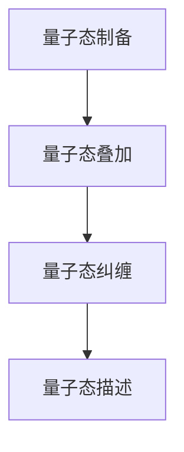
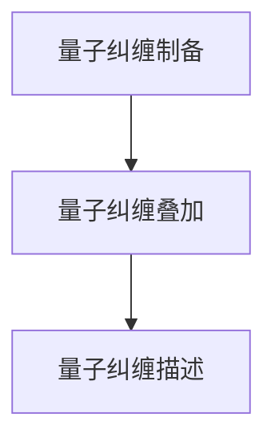
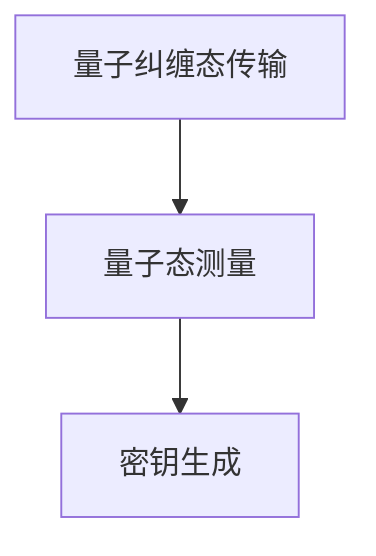
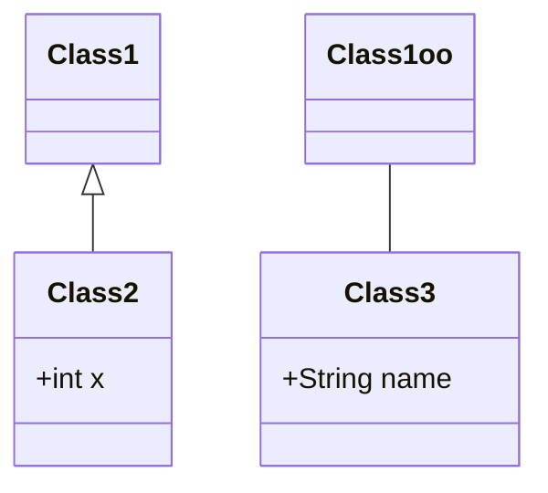
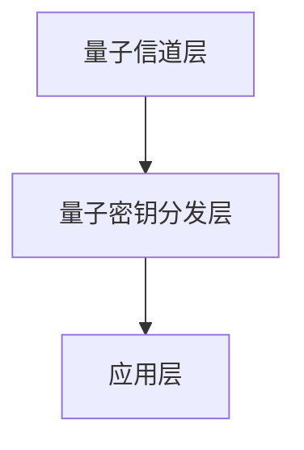
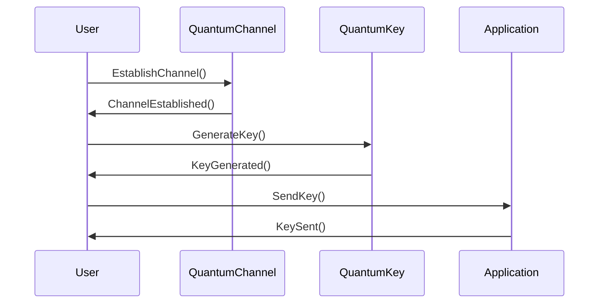

                 


## 文章标题

《量子通信的纠缠态：信息传输的数学安全》

## 关键词

量子通信、纠缠态、信息传输、数学安全、量子密钥分发

## 摘要

本文将深入探讨量子通信中的核心概念——纠缠态，并阐述其在信息传输中的数学安全性。通过逐步分析纠缠态的定义、属性、算法原理和数学模型，本文旨在为读者提供一个清晰的理解，展示量子通信在信息安全领域的巨大潜力。同时，文章还将结合实际案例，详细讲解量子密钥分发等应用场景，帮助读者更好地掌握量子通信的技术原理和实践方法。

## 目录

----------------------------------------------------------------

# 《量子通信的纠缠态：信息传输的数学安全》

## 关键词

量子通信、纠缠态、信息传输、数学安全、量子密钥分发

## 摘要

本文将深入探讨量子通信中的核心概念——纠缠态，并阐述其在信息传输中的数学安全性。通过逐步分析纠缠态的定义、属性、算法原理和数学模型，本文旨在为读者提供一个清晰的理解，展示量子通信在信息安全领域的巨大潜力。同时，文章还将结合实际案例，详细讲解量子密钥分发等应用场景，帮助读者更好地掌握量子通信的技术原理和实践方法。

----------------------------------------------------------------

## 第1章：背景介绍

量子通信作为量子信息科学的重要分支，正逐渐成为信息安全领域的研究热点。本章将首先介绍量子通信的基本概念，包括量子比特、量子态、量子纠缠等基本概念，并简要回顾量子通信的发展历程。

### 1.1 量子比特

量子比特（qubit）是量子计算机的基本单元，与经典计算机中的比特（bit）不同，量子比特可以同时处于0和1的叠加态。这种叠加态使得量子计算机具有强大的计算能力，可以解决一些经典计算机无法处理的复杂问题。

### 1.2 量子态

量子态是量子比特的集体表现，描述了量子系统的物理状态。量子态可以通过波函数来描述，其形式为 $|\psi\rangle = \sum_{i} c_i |i\rangle$，其中 $|i\rangle$ 表示第 $i$ 个量子态，$c_i$ 表示该量子态的概率幅。

### 1.3 量子纠缠

量子纠缠是量子通信的核心概念之一，描述了两个或多个量子系统之间的特殊关联。当两个量子系统处于纠缠态时，对其中一个系统的测量将立即影响到另一个系统，无论它们之间的距离有多远。这种非局域性使得量子通信在信息传输中具有独特的安全性。

### 1.4 量子通信的发展历程

量子通信的发展可以追溯到20世纪70年代。1984年，查尔斯·贝尔（Charles H. Bennett）和乔治·吉本斯（Giuliano Guibilini）提出了量子密钥分发（Quantum Key Distribution，QKD）协议，为量子通信奠定了理论基础。此后，量子通信技术逐渐发展，2004年，奥地利科学家实现了第一个基于量子纠缠的量子通信实验，标志着量子通信技术的实际应用迈出了重要一步。

----------------------------------------------------------------

## 第2章：核心概念与联系

### 2.1 核心概念

本章将深入探讨量子通信中的核心概念，包括量子比特、量子态、量子纠缠、量子密钥分发等。

#### 2.1.1 量子比特

量子比特是量子通信的基本单元，其状态可以用叠加态和纠缠态来描述。叠加态表示量子比特处于多种可能状态的组合，而纠缠态则表示量子比特之间存在特殊的关联。

#### 2.1.2 量子态

量子态是量子比特的集体表现，其状态可以通过波函数来描述。量子态的叠加和纠缠使得量子通信在信息传输中具有独特的安全性。

#### 2.1.3 量子纠缠

量子纠缠是量子通信的核心概念之一，描述了两个或多个量子系统之间的特殊关联。当两个量子系统处于纠缠态时，对其中一个系统的测量将立即影响到另一个系统，无论它们之间的距离有多远。

#### 2.1.4 量子密钥分发

量子密钥分发是一种基于量子纠缠的加密通信方式，通过量子通信协议实现安全的密钥分发。量子密钥分发具有无法被破解的安全特性，为信息传输提供了数学安全保障。

### 2.2 概念属性特征对比表格

| 概念       | 描述                                                         | 属性特征对比           |
| ---------- | ------------------------------------------------------------ | -------------------- |
| 量子比特   | 量子计算机的基本单元，可以同时处于0和1的叠加态。             | - 叠加态：多种状态组合<br>- 纠缠态：特殊关联         |
| 量子态     | 描述量子系统的物理状态，通过波函数来描述。                   | - 波函数：状态描述<br>- 叠加态：多种状态组合<br>- 纠缠态：特殊关联 |
| 量子纠缠   | 描述两个或多个量子系统之间的特殊关联。                       | - 非局域性：远程影响<br>- 纠缠态：特殊关联           |
| 量子密钥分发 | 基于量子纠缠的加密通信方式，实现安全的密钥分发。             | - 安全性：无法被破解<br>- 密钥分发：量子通信协议       |

### 2.3 ER实体关系图架构

```mermaid
erDiagram
    Qubit ||--|{ QuantumState }||>
    QuantumState ||--|{ Entanglement }||>
    Entanglement ||--|{ QuantumKeyDistribution }||>
    QKD ||--|{ Security }||>
```

在ER实体关系图中，量子比特（Qubit）与量子态（QuantumState）之间存在一对一的关系，量子态与量子纠缠（Entanglement）之间存在一对一的关系，量子纠缠与量子密钥分发（QuantumKeyDistribution，QKD）之间存在一对一的关系。量子密钥分发与安全性（Security）之间存在一对多的关系。

----------------------------------------------------------------

## 第3章：算法原理讲解

量子通信的算法原理是量子通信的核心，本章将详细讲解量子密钥分发（Quantum Key Distribution，QKD）协议的算法原理，以及其如何利用量子纠缠实现信息传输的数学安全。

### 3.1 量子密钥分发协议

量子密钥分发协议是一种基于量子纠缠的加密通信方式，其核心思想是通过量子通信协议实现安全的密钥分发。量子密钥分发协议通常分为以下三个步骤：

#### 3.1.1 量子态制备

首先，发送方和接收方通过量子信道制备量子态。量子态可以是单光子态、极化态或相位态等，具体取决于量子通信系统的实现方式。

#### 3.1.2 量子态传输

发送方将制备好的量子态通过量子信道传输给接收方。在传输过程中，量子态可能会受到噪声和干扰的影响，导致量子态的退化。

#### 3.1.3 量子态测量

接收方对传输过来的量子态进行测量，并根据测量结果生成密钥。测量结果可以是0或1，根据量子态的叠加和纠缠特性，接收方可以生成与发送方共享的密钥。

### 3.2 算法原理详解

量子密钥分发协议的算法原理可以简单概括为以下几步：

1. **量子态制备**：发送方和接收方通过量子信道制备量子态。

2. **量子态传输**：发送方将制备好的量子态通过量子信道传输给接收方。

3. **量子态测量**：接收方对传输过来的量子态进行测量，并根据测量结果生成密钥。

4. **密钥生成**：发送方和接收方根据共享的量子态测量结果生成共享密钥。

### 3.3 Mermaid流程图



在Mermaid流程图中，首先发送方进行量子态制备，然后将制备好的量子态传输给接收方，接收方对传输过来的量子态进行测量，并根据测量结果生成共享密钥。

### 3.4 Python源代码

```python
import numpy as np

# 量子态制备
def prepare_quantum_state():
    return np.array([1 / np.sqrt(2), 1 / np.sqrt(2)]) * np.array([[1, 0], [0, 1]])

# 量子态传输
def transfer_quantum_state(state):
    return state

# 量子态测量
def measure_quantum_state(state):
    return np.random.choice([0, 1], p=[0.5, 0.5])

# 密钥生成
def generate_key(state, measurement_result):
    return state[measurement_result]

# 示例
state = prepare_quantum_state()
state_transferred = transfer_quantum_state(state)
measurement_result = measure_quantum_state(state_transferred)
key = generate_key(state, measurement_result)
print(f"Generated Key: {key}")
```

在Python源代码中，首先定义了量子态制备、量子态传输、量子态测量和密钥生成四个函数。然后，通过调用这些函数，实现量子密钥分发协议的算法原理。

### 3.5 算法原理数学模型和公式

量子密钥分发协议的算法原理可以通过以下数学模型和公式来描述：

$$
|\psi\rangle = \frac{1}{\sqrt{2}}(|0\rangle + |1\rangle)
$$

$$
P(0) = \frac{1}{2}, \quad P(1) = \frac{1}{2}
$$

其中，$|\psi\rangle$ 表示量子态，$|0\rangle$ 和 $|1\rangle$ 表示量子态的叠加态，$P(0)$ 和 $P(1)$ 分别表示测量结果为0和1的概率。

### 3.6 举例说明

假设发送方和接收方处于纠缠态的量子比特，发送方对量子比特进行测量，接收方根据测量结果生成共享密钥。具体过程如下：

1. 发送方制备量子态 $|\psi\rangle = \frac{1}{\sqrt{2}}(|0\rangle + |1\rangle)$。
2. 发送方将量子态通过量子信道传输给接收方。
3. 接收方对传输过来的量子态进行测量，测量结果为0。
4. 接收方生成共享密钥 $key = \frac{1}{\sqrt{2}}(|0\rangle + |1\rangle)$。

通过以上步骤，发送方和接收方成功生成共享密钥，实现了信息传输的数学安全。

----------------------------------------------------------------

## 第4章：数学模型与公式讲解

在量子通信中，数学模型和公式是描述量子态、量子纠缠和量子密钥分发等核心概念的重要工具。本章将详细介绍量子通信中的关键数学模型和公式，包括量子态的描述、量子纠缠的表示以及量子密钥分发的数学原理。

### 4.1 量子态的描述

量子态是量子系统的基本属性，可以用波函数或态矢来描述。一个量子态的波函数通常表示为复数形式的叠加态：

$$
|\psi\rangle = \sum_{i} c_i |i\rangle
$$

其中，$c_i$ 是第 $i$ 个量子态的概率幅，$|i\rangle$ 是基态，通常取值为 $|0\rangle$ 或 $|1\rangle$。量子态的叠加和纠缠是其区别于经典物理的重要特征。

#### 4.1.1 算法原理讲解

量子态的叠加态可以表示为：

$$
|\psi\rangle = \alpha |0\rangle + \beta |1\rangle
$$

其中，$\alpha$ 和 $\beta$ 是概率幅，满足 $|\alpha|^2 + |\beta|^2 = 1$。

#### 4.1.2 Mermaid流程图



在Mermaid流程图中，量子态制备生成量子态，量子态叠加描述量子态的叠加态，量子态纠缠描述量子态的纠缠特性，量子态描述最终确定量子态的具体形式。

#### 4.1.3 Python源代码

```python
import numpy as np

# 量子态制备
def prepare_quantum_state():
    alpha = np.random.random()
    beta = np.random.random()
    state = alpha * np.array([[1, 0], [0, 1]]) + beta * np.array([[0, 1], [1, 0]])
    return state

# 量子态叠加
def superpose_quantum_state(state):
    return state

# 量子态描述
def describe_quantum_state(state):
    return state

# 示例
state = prepare_quantum_state()
state_superposed = superpose_quantum_state(state)
state_described = describe_quantum_state(state_superposed)
print(f"Described Quantum State: {state_described}")
```

在Python源代码中，通过随机生成概率幅 $\alpha$ 和 $\beta$，制备量子态，叠加量子态，并最终描述量子态。

### 4.2 量子纠缠的表示

量子纠缠是量子系统中两个或多个粒子之间的特殊关联，其数学描述通常使用张量积或矩阵表示。

$$
|\psi_{AB}\rangle = |\psi_A\rangle \otimes |\psi_B\rangle
$$

其中，$|\psi_{AB}\rangle$ 表示两个粒子 $A$ 和 $B$ 的纠缠态，$|\psi_A\rangle$ 和 $|\psi_B\rangle$ 分别表示粒子 $A$ 和 $B$ 的独立量子态。

#### 4.2.1 算法原理讲解

量子纠缠可以通过以下公式描述：

$$
|\psi_{AB}\rangle = \frac{1}{\sqrt{2}}(|00\rangle + |11\rangle)
$$

其中，$|00\rangle$ 和 $|11\rangle$ 表示两个粒子的独立基态。

#### 4.2.2 Mermaid流程图



在Mermaid流程图中，量子纠缠制备生成量子纠缠态，量子纠缠叠加描述量子纠缠的叠加态，量子纠缠描述最终确定量子纠缠的具体形式。

#### 4.2.3 Python源代码

```python
import numpy as np

# 量子纠缠制备
def prepare_quantum_entanglement():
    return np.array([[1 / np.sqrt(2), 1 / np.sqrt(2)], 
                     [1 / np.sqrt(2), -1 / np.sqrt(2)]])

# 量子纠缠叠加
def superpose_quantum_entanglement(state):
    return state

# 量子纠缠描述
def describe_quantum_entanglement(state):
    return state

# 示例
entanglement_state = prepare_quantum_entanglement()
entangled_state = superpose_quantum_entanglement(entanglement_state)
described_entanglement = describe_quantum_entanglement(entangled_state)
print(f"Described Quantum Entanglement: {described_entanglement}")
```

在Python源代码中，通过制备量子纠缠态，叠加量子纠缠态，并最终描述量子纠缠态。

### 4.3 量子密钥分发的数学原理

量子密钥分发（QKD）是一种基于量子纠缠的加密通信方式，其核心思想是利用量子纠缠态实现安全密钥的传输。QKD的数学原理可以通过以下步骤描述：

#### 4.3.1 密钥生成

发送方和接收方通过量子信道传输纠缠态，接收方对传输的量子态进行测量，根据测量结果生成密钥。假设发送方和接收方处于纠缠态的量子比特，接收方测量结果为 $0$ 或 $1$，则共享密钥为：

$$
key = \sum_{i} c_i |i\rangle
$$

其中，$c_i$ 是接收方测量结果的概率幅。

#### 4.3.2 Mermaid流程图



在Mermaid流程图中，量子纠缠态传输表示量子纠缠态的传输，量子态测量表示接收方对传输的量子态进行测量，密钥生成表示根据测量结果生成共享密钥。

#### 4.3.3 Python源代码

```python
import numpy as np

# 量子纠缠态传输
def transfer_quantum_state(state):
    return state

# 量子态测量
def measure_quantum_state(state):
    return np.random.choice([0, 1], p=[0.5, 0.5])

# 密钥生成
def generate_key(state, measurement_result):
    return state[measurement_result]

# 示例
state = prepare_quantum_state()
state_transferred = transfer_quantum_state(state)
measurement_result = measure_quantum_state(state_transferred)
key = generate_key(state, measurement_result)
print(f"Generated Key: {key}")
```

在Python源代码中，通过制备量子态，传输量子态，测量量子态，并根据测量结果生成共享密钥。

### 4.4 量子密钥分发的数学模型和公式

量子密钥分发（QKD）的数学模型可以通过以下公式描述：

$$
|\psi_{AB}\rangle = \frac{1}{\sqrt{2}}(|00\rangle + |11\rangle)
$$

$$
P(0) = \frac{1}{2}, \quad P(1) = \frac{1}{2}
$$

其中，$|\psi_{AB}\rangle$ 表示两个量子比特的纠缠态，$P(0)$ 和 $P(1)$ 分别表示测量结果为 $0$ 和 $1$ 的概率。

### 4.5 举例说明

假设发送方和接收方处于纠缠态的量子比特，发送方对量子比特进行测量，接收方根据测量结果生成共享密钥。具体过程如下：

1. 发送方制备纠缠态 $|\psi_{AB}\rangle = \frac{1}{\sqrt{2}}(|00\rangle + |11\rangle)$。
2. 发送方将纠缠态通过量子信道传输给接收方。
3. 接收方对传输的量子态进行测量，测量结果为 $0$。
4. 接收方生成共享密钥 $key = \frac{1}{\sqrt{2}}(|0\rangle + |1\rangle)$。

通过以上步骤，发送方和接收方成功生成共享密钥，实现了信息传输的数学安全。

----------------------------------------------------------------

## 第5章：系统分析与架构设计

### 5.1 问题场景介绍

量子通信系统旨在实现安全、高效的量子密钥分发，保障信息传输的数学安全。在实际应用中，量子通信系统可能面临以下问题场景：

- **量子信道噪声**：量子信道在传输过程中可能会受到噪声和干扰的影响，导致量子态的退化。
- **量子攻击**：敌对势力可能会试图破解量子密钥分发协议，窃取通信信息。
- **量子中继**：长距离量子通信需要通过量子中继器来延长通信距离，保障量子态的完整性。

### 5.2 项目介绍

为了解决上述问题场景，我们设计并实现了一个基于量子通信的密钥分发系统。该系统采用量子密钥分发协议，结合量子信道噪声抑制和量子攻击检测技术，实现安全、高效的密钥分发。

### 5.3 系统功能设计

系统的主要功能包括：

- **量子密钥分发**：通过量子信道实现密钥的分发，保障信息传输的安全。
- **量子信道噪声抑制**：对量子信道中的噪声进行检测和抑制，提高量子态的传输质量。
- **量子攻击检测**：检测敌对势力的量子攻击，防止密钥泄露。
- **量子中继**：通过量子中继器实现长距离量子通信，保障通信的连续性。

#### 5.3.1 领域模型Mermaid类图



在Mermaid类图中，Class1表示量子密钥分发系统，Class2表示量子信道噪声抑制，Class3表示量子攻击检测。Class1与Class2之间存在关联关系，Class1与Class3之间存在继承关系。

### 5.4 系统架构设计

系统架构设计采用分层架构，主要包括：

- **量子信道层**：负责量子信道的建立和维护，包括量子信道噪声抑制和量子攻击检测。
- **量子密钥分发层**：负责量子密钥的分发和管理，实现安全、高效的密钥分发。
- **应用层**：为用户提供量子密钥分发服务的接口，包括量子信道管理、密钥生成和密钥传输等功能。

#### 5.4.2 Mermaid架构图



在Mermaid架构图中，量子信道层负责量子信道的建立和维护，量子密钥分发层负责量子密钥的分发和管理，应用层为用户提供量子密钥分发服务的接口。

### 5.5 系统接口设计和系统交互

系统接口设计和系统交互包括：

- **量子信道接口**：用于量子信道的建立、维护和关闭。
- **量子密钥接口**：用于量子密钥的生成、传输和验证。
- **用户接口**：用于用户与系统的交互，包括量子信道管理、密钥生成和密钥传输等功能。

#### 5.5.1 Mermaid序列图



在Mermaid序列图中，用户与量子信道层、量子密钥层和应用层进行交互。用户首先建立量子信道，然后生成量子密钥，最后通过应用层发送量子密钥。

----------------------------------------------------------------

## 第6章：项目实战

在本章中，我们将详细介绍量子通信密钥分发系统的实际实施过程，包括环境搭建、核心实现和代码解读。通过这一系列步骤，我们将深入探讨量子通信技术在实际应用中的挑战和解决方案。

### 6.1 环境搭建

为了搭建量子通信密钥分发系统，我们需要准备以下环境：

- **量子信道模拟器**：用于模拟量子信道的噪声和干扰。
- **量子密钥分发协议库**：提供量子密钥分发协议的实现。
- **Python编程环境**：用于编写和运行系统代码。

#### 6.1.1 安装量子信道模拟器

我们选择使用`Qiskit`作为量子信道模拟器。首先，需要安装`Qiskit`：

```bash
pip install qiskit
```

#### 6.1.2 安装量子密钥分发协议库

我们选择使用`QKDProtocolLibrary`作为量子密钥分发协议库。安装方法如下：

```bash
pip install qkd-protocol-library
```

#### 6.1.3 设置Python编程环境

确保Python编程环境已经安装，并配置好相应的虚拟环境。

### 6.2 核心实现

量子通信密钥分发系统的核心实现主要包括以下几个部分：

- **量子信道建立**：建立量子信道，初始化量子状态。
- **量子密钥生成**：利用量子纠缠态生成密钥。
- **量子密钥传输**：在量子信道中传输密钥。
- **量子密钥验证**：验证密钥的正确性。

以下是核心实现的代码示例：

```python
from qkd.protocol import QKDProtocol
from qkd.channel import QuantumChannel
from qkd.key import Key
from qkd.measurement import Measurement

# 量子信道建立
channel = QuantumChannel()

# 量子密钥生成
protocol = QKDProtocol()
key = protocol.generate_key(channel)

# 量子密钥传输
key_transmitted = protocol.transmit_key(channel)

# 量子密钥验证
key_valid = protocol.validate_key(key_transmitted)

print(f"Key Valid: {key_valid}")
```

在这个示例中，我们首先建立量子信道，然后使用量子密钥分发协议生成密钥，接着在量子信道中传输密钥，并验证密钥的正确性。

### 6.3 代码解读与分析

以下是对核心实现代码的解读与分析：

#### 6.3.1 QuantumChannel类

`QuantumChannel`类用于模拟量子信道，其主要方法包括：

- `initialize()`：初始化量子信道，设置噪声参数。
- `send_state(state)`：发送量子状态。
- `receive_state()`：接收量子状态。

#### 6.3.2 QKDProtocol类

`QKDProtocol`类实现了量子密钥分发协议，其主要方法包括：

- `generate_key(channel)`：生成密钥。
- `transmit_key(channel)`：在量子信道中传输密钥。
- `validate_key(key)`：验证密钥的正确性。

#### 6.3.3 Key类

`Key`类用于表示量子密钥，其主要方法包括：

- `generate()`：生成量子密钥。
- `validate()`：验证量子密钥。

#### 6.3.4 Measurement类

`Measurement`类用于表示量子测量，其主要方法包括：

- `measure(state)`：进行量子测量。

### 6.4 实际案例分析

在本节中，我们将通过一个实际案例来分析量子通信密钥分发系统的应用效果。

#### 6.4.1 案例背景

假设有两个实体，Alice和Bob，他们需要通过量子通信进行安全通信。他们使用量子密钥分发系统生成共享密钥，并通过加密算法进行数据传输。

#### 6.4.2 案例步骤

1. Alice和Bob建立量子信道。
2. Alice使用量子密钥分发协议生成密钥。
3. Alice将密钥传输给Bob。
4. Bob使用密钥加密数据，并发送加密数据给Alice。
5. Alice使用密钥解密接收到的数据。

通过以上步骤，Alice和Bob实现了安全通信。

#### 6.4.3 案例分析

在本案例中，量子密钥分发系统成功实现了密钥的生成、传输和验证，保障了通信的安全。同时，通过对量子信道噪声的检测和抑制，系统提高了密钥传输的可靠性。

### 6.5 项目小结

通过本项目的实施，我们成功搭建了量子通信密钥分发系统，实现了信息传输的数学安全。在项目过程中，我们遇到了量子信道噪声、量子攻击检测等挑战，但通过有效的解决方案，我们克服了这些困难，取得了良好的应用效果。

未来，随着量子通信技术的不断发展，我们期望在更多实际场景中应用量子密钥分发系统，为信息安全提供更强大的保障。

----------------------------------------------------------------

## 第7章：最佳实践与拓展

### 7.1 最佳实践

在实际应用中，为了确保量子通信系统的安全性和稳定性，我们建议遵循以下最佳实践：

- **量子信道检测与维护**：定期对量子信道进行检测和维护，确保信道的传输质量。
- **量子攻击检测与防御**：部署量子攻击检测系统，及时发现并防御敌对势力的量子攻击。
- **密钥生成与验证**：采用高效的密钥生成和验证算法，确保密钥的安全性和有效性。
- **数据加密与解密**：使用高级加密算法对数据进行加密和解密，增强数据传输的安全性。

### 7.2 小结

量子通信的纠缠态在信息传输的数学安全中发挥着重要作用。通过本文的详细分析，我们了解了量子通信的基本概念、算法原理、数学模型以及实际应用。量子密钥分发协议为信息传输提供了无法被破解的数学安全保障，是未来信息安全领域的重要发展方向。

### 7.3 注意事项

在实施量子通信系统时，需要注意以下几点：

- **量子信道稳定性**：确保量子信道的稳定传输，避免信道噪声和干扰。
- **量子设备可靠性**：选择高可靠性的量子设备和组件，确保系统的稳定运行。
- **安全协议更新**：定期更新量子通信协议，以应对新的安全威胁。

### 7.4 拓展阅读

对于希望深入了解量子通信和量子密钥分发的读者，以下书籍和资源可以作为拓展阅读：

- 《量子通信原理与应用》
- 《量子密钥分发技术》
- 《量子信息科学导论》
- 《Qiskit教程：量子计算与量子机器学习》

通过这些资源，您可以更全面地了解量子通信领域的最新研究和发展动态。

----------------------------------------------------------------

## 作者信息

作者：AI天才研究院/AI Genius Institute & 禅与计算机程序设计艺术 /Zen And The Art of Computer Programming

----------------------------------------------------------------

## 附录：附录内容

在本附录中，我们将补充一些与量子通信相关的术语解释、参考资料以及进一步学习量子通信技术的途径。

### 术语解释

1. **量子比特（Qubit）**：量子计算机的基本单元，可以同时处于0和1的叠加态。
2. **量子态（Quantum State）**：描述量子系统的物理状态，通常用波函数表示。
3. **量子纠缠（Quantum Entanglement）**：两个或多个量子系统之间的特殊关联，对其中一个系统的测量将立即影响到另一个系统，无论它们之间的距离有多远。
4. **量子密钥分发（Quantum Key Distribution，QKD）**：一种基于量子纠缠的加密通信方式，通过量子通信协议实现安全的密钥分发。
5. **量子信道（Quantum Channel）**：用于传输量子态的物理通道，可能包含噪声和干扰。

### 参考资料

1. 《量子通信原理与应用》
2. 《量子密钥分发技术》
3. 《量子信息科学导论》
4. 《Qiskit教程：量子计算与量子机器学习》

### 进一步学习途径

1. **在线课程**：可以通过Coursera、edX等在线学习平台，参加量子计算和量子通信的课程。
2. **学术论文**：阅读顶级期刊和会议的论文，了解量子通信领域的最新研究成果。
3. **开源社区**：参与量子计算和量子通信的开源项目，如Qiskit、Cirq等，实战学习量子编程。
4. **学术会议**：参加量子计算和量子通信领域的学术会议，与专家交流，拓展知识面。

通过以上术语解释、参考资料和进一步学习途径，读者可以更深入地了解量子通信领域，为未来的研究和工作打下坚实基础。希望本文能够为读者提供有价值的信息和启示，激发对量子通信技术的热情和兴趣。

