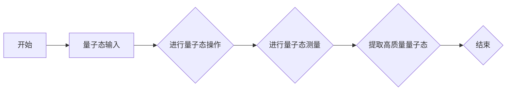

                 


### 量子通信的起源与发展

量子通信作为量子信息科学的重要组成部分，其起源与发展与量子力学的发展息息相关。本章节将深入探讨量子通信的基本概念、量子纠缠的特性、量子通信与量子纠缠的关系，以及量子通信技术的现状与趋势。

#### 1.1.1 量子通信的基本概念

量子通信是一种利用量子力学原理进行信息传递的技术。与经典通信相比，量子通信具有一些独特的优势。首先，量子通信可以确保信息传输的绝对安全性，这是因为量子态的任何测量都会不可避免地改变它，从而使得窃听行为可以被检测到。其次，量子通信可以实现超长距离的信息传输，因为量子态在传输过程中具有很好的抗干扰能力。

在量子通信中，量子比特（qubit）是信息的基本单位，与经典通信中的经典比特（classical bit）不同，量子比特不仅可以表示0或1，还可以同时处于0和1的叠加状态。这种叠加态使得量子通信在处理信息时具有极大的并行性。

#### 1.1.2 量子通信的优势与挑战

量子通信的优势在于其安全性、传输速度和并行性。然而，量子通信也面临着一系列挑战，如量子态的保持时间、量子传输的距离限制和量子比特的操作复杂性等。

首先，量子态的保持时间是一个重要的问题。由于量子态的脆弱性，量子比特在操作和传输过程中容易受到环境的影响，导致量子态的退相干。因此，如何延长量子态的保持时间是量子通信领域的一个重大挑战。

其次，量子传输的距离限制也是一个关键问题。尽管量子态在传输过程中具有很好的抗干扰能力，但量子态的衰减和噪声会限制量子通信的传输距离。因此，如何实现远距离量子通信是一个亟待解决的问题。

最后，量子比特的操作复杂性也是一个挑战。量子比特的操作需要精确的控制和校准，这对实验设备和技术提出了很高的要求。此外，量子比特的操作复杂性也使得量子通信的应用场景受到限制。

#### 1.2 量子纠缠的概念与特性

量子纠缠是量子通信的核心概念之一。它描述了两个或多个量子系统之间的一种特殊关联关系，即使它们之间的距离很远，它们的量子态仍然是相互关联的。

量子纠缠的特性包括以下几个方面：

1. **不可分割性**：量子纠缠态中的量子比特无法单独存在，它们的量子态总是相互关联的。这意味着量子纠缠态不能简单地分解为单个量子态的叠加。

2. **非局域性**：量子纠缠态中的量子比特之间的关联关系不受距离限制。即使量子比特之间的距离很远，它们的量子态仍然是相互关联的。

3. **不可克隆性**：量子纠缠态具有不可克隆性，这意味着无法创建与原始量子态完全相同的副本。

#### 1.2.1 量子纠缠的基本原理

量子纠缠的基本原理可以通过贝尔不等式来理解。贝尔不等式是量子力学与经典物理学之间的一个重要界限。量子纠缠态的测量结果往往违反贝尔不等式，从而证明了量子纠缠的存在。

量子纠缠的产生可以通过量子态的测量来实现。例如，两个相互纠缠的量子比特可以通过一个联合测量来产生纠缠态。此外，量子纠缠还可以通过量子态的纯化和量子门操作来创建。

#### 1.2.2 量子纠缠的测量与操作

量子纠缠的测量是一个复杂的过程。由于量子纠缠态的不可分割性和非局域性，对其中一个量子比特的测量结果会立即影响另一个量子比特的状态。

量子纠缠的操作可以通过量子门来实现。量子门是量子比特的基本操作，它们可以改变量子比特的量子态。通过组合不同的量子门，可以实现对量子纠缠态的各种操作，从而实现量子通信的目标。

#### 1.3 量子纠缠与量子通信的关系

量子纠缠是量子通信的核心基础。量子纠缠态的建立和保持是实现量子通信的关键。通过量子纠缠，可以实现量子密钥分发、量子隐形传态和量子纠缠蒸馏等量子通信技术。

量子密钥分发是一种利用量子纠缠态生成共享密钥的技术。通过量子纠缠态的测量，可以生成一对完全相同的密钥，从而实现安全的通信。

量子隐形传态是一种将量子态从一个量子比特传递到另一个量子比特的技术。通过量子纠缠态，可以实现超长距离的信息传输。

量子纠缠蒸馏是一种优化量子纠缠态的技术。通过量子纠缠蒸馏，可以将低质量的量子纠缠态转化为高质量的量子纠缠态，从而提高量子通信的性能。

#### 1.3.1 量子纠缠在量子通信中的应用

量子纠缠在量子通信中有着广泛的应用。例如，量子密钥分发利用量子纠缠态生成共享密钥，从而实现安全的通信。量子隐形传态利用量子纠缠态实现超长距离的信息传输。量子纠缠蒸馏通过优化量子纠缠态，提高量子通信的性能。

#### 1.3.2 量子纠缠的距离限制与扩展

量子纠缠的距离限制是一个关键问题。由于量子态的衰减和噪声，量子纠缠态的传输距离受到限制。然而，通过量子中继和量子纠缠扩展等技术，可以克服量子纠缠的距离限制，实现远距离量子通信。

量子中继是一种在量子通信中使用的扩展量子纠缠距离的技术。通过量子中继，可以将量子纠缠态从一个位置传输到另一个位置，从而实现远距离量子通信。

量子纠缠扩展是一种在量子通信中使用的扩展量子纠缠质量的技术。通过量子纠缠扩展，可以将低质量的量子纠缠态转化为高质量的量子纠缠态，从而提高量子通信的性能。

#### 1.4 量子通信技术的现状与趋势

量子通信技术已经取得了显著的进展。目前，量子密钥分发和量子隐形传态等技术已经在实验室中实现，并开始向实际应用迈进。

量子密钥分发已经实现了千米级别的通信距离，并成功应用于卫星通信和地面通信等领域。

量子隐形传态已经实现了百米级别的传输距离，并开始应用于量子网络和量子计算等领域。

随着技术的不断进步，量子通信有望在未来实现全球范围内的通信安全，并推动量子计算和量子网络的发展。

#### 1.4.1 量子密钥分发

量子密钥分发是一种利用量子纠缠态生成共享密钥的技术。通过量子纠缠态的测量，可以生成一对完全相同的密钥，从而实现安全的通信。量子密钥分发具有无法被窃听的绝对安全性，是保障通信安全的重要技术。

#### 1.4.2 量子隐形传态

量子隐形传态是一种将量子态从一个量子比特传递到另一个量子比特的技术。通过量子纠缠态，可以实现超长距离的信息传输。量子隐形传态具有巨大的应用潜力，可以用于量子网络、量子计算和量子加密等领域。

#### 1.4.3 量子通信的实际应用案例

量子通信技术已经在多个领域得到了实际应用。例如，量子密钥分发已经成功应用于卫星通信和地面通信，实现了全球范围内的通信安全。量子隐形传态技术已经应用于量子网络和量子计算，为未来的量子互联网和量子计算机的发展奠定了基础。

#### 1.5 本章小结

本章介绍了量子通信的基本概念、量子纠缠的特性、量子通信与量子纠缠的关系，以及量子通信技术的现状与趋势。通过本章的学习，读者可以了解到量子通信的原理、优势和挑战，以及对未来量子通信技术的展望。

### 纠缠蒸馏的理论基础

纠缠蒸馏（Entanglement Distillation）是量子通信中的一项关键技术，旨在将低质量的量子纠缠态转化为高质量的量子纠缠态。本章节将深入探讨纠缠蒸馏的基本概念、方法和性能评估，并讨论其在量子计算、量子传感和量子加密等领域的应用。

#### 2.1 纠缠蒸馏的基本概念

纠缠蒸馏的基本概念可以简单概括为：通过一系列量子操作和测量，将原始的低质量纠缠态转化为高质量纠缠态的过程。在这个过程中，纠缠度（entanglement fidelity）是衡量纠缠质量的重要指标。

纠缠蒸馏的目标是最大化输出纠缠态与理想纠缠态之间的相似度，即最大化纠缠度。在实际应用中，由于噪声和环境的影响，原始的量子纠缠态往往质量较低，无法直接应用于高效通信和计算。因此，纠缠蒸馏成为提高量子通信和量子计算性能的关键技术。

#### 2.2 纠缠蒸馏的方法与算法

纠缠蒸馏的方法和算法主要包括最优纠缠蒸馏算法和近似纠缠蒸馏算法。

**2.2.1 最优纠缠蒸馏算法**

最优纠缠蒸馏算法是基于量子优化理论的一种方法，通过优化量子操作的顺序和参数，实现最大化的纠缠度提升。常见的最优纠缠蒸馏算法包括张量网络方法、最大熵方法等。

张量网络方法利用量子态的纯化过程，通过构建张量网络模型，实现对量子纠缠态的优化蒸馏。这种方法具有计算效率高、适用范围广的优点。

最大熵方法基于信息论原理，通过最大化输出态与理想态之间的相对熵，实现最优纠缠蒸馏。这种方法在理论上可以取得最优性能，但计算复杂度较高。

**2.2.2 近似纠缠蒸馏算法**

近似纠缠蒸馏算法是一种在约束条件下寻求近似最优解的方法。常见的近似纠缠蒸馏算法包括基于量子门操作的迭代算法、基于随机游走的算法等。

基于量子门操作的迭代算法通过逐步迭代优化量子操作的参数，实现逼近最优的纠缠蒸馏效果。这种方法在实际应用中具有较高的灵活性和适应性。

基于随机游走的算法利用马尔可夫链蒙特卡洛（MCMC）方法，通过随机游走过程寻找最优解。这种方法在处理大规模量子纠缠态时具有较好的性能，但计算时间较长。

#### 2.3 纠缠蒸馏的性能评估

纠缠蒸馏的性能评估主要涉及纠缠度的提升和资源消耗两个方面的指标。

**2.3.1 纠缠质量度量**

纠缠质量度量是评价纠缠蒸馏性能的关键指标。常用的度量方法包括纠缠度（entanglement fidelity）、纯化率（purification rate）和纠缠增益（entanglement gain）等。

纠缠度是输出态与理想态之间的相似度，通常通过计算两个态的密度矩阵之间的 fidelity 值来衡量。纠缠度越高，表示纠缠蒸馏效果越好。

纯化率是输入态转化为输出态的效率，表示为输出态的纠缠度与输入态的纠缠度之比。纯化率越高，表示纠缠蒸馏过程越有效。

纠缠增益是输出态的纠缠度与输入态的纠缠度之差，表示纠缠蒸馏过程中增加的纠缠度。纠缠增益越大，表示纠缠蒸馏效果越显著。

**2.3.2 纠缠蒸馏的误差分析**

纠缠蒸馏的误差分析主要考虑蒸馏过程中引入的噪声和误差对纠缠度的影响。常见的误差来源包括量子态的退相干、量子操作的误差和测量误差等。

退相干是量子态在传输和操作过程中普遍存在的问题，会导致量子纠缠度的降低。为了降低退相干误差，可以采用量子纠错技术，通过引入额外的量子比特，实现对纠缠态的纠错保护。

量子操作的误差是指在实际操作过程中，由于设备精度和操作控制的限制，导致量子态发生偏差。为了降低量子操作误差，可以采用高精度的量子器件和精确的量子控制技术。

测量误差是量子测量过程中引入的误差，会导致量子态的破坏。为了降低测量误差，可以采用量子非破坏性测量技术，通过间接测量方法获取量子态信息。

#### 2.4 纠缠蒸馏的应用场景

纠缠蒸馏在量子计算、量子传感和量子加密等领域具有广泛的应用前景。

**2.4.1 量子计算**

在量子计算中，高质量纠缠态是实现量子叠加和量子纠缠操作的基础。通过纠缠蒸馏，可以优化量子态的质量，提高量子算法的效率。

例如，量子算法中的量子门操作需要精确控制量子态之间的纠缠关系。通过纠缠蒸馏，可以生成高质量的纠缠态，降低量子计算中的噪声和误差，提高计算精度。

**2.4.2 量子传感**

在量子传感中，高质量纠缠态可以用于提高测量精度和灵敏度。通过纠缠蒸馏，可以优化量子态的质量，提高量子传感系统的性能。

例如，量子隐形传态技术需要高质量纠缠态的支持。通过纠缠蒸馏，可以生成高质量的纠缠态，实现远距离的量子态传输，提高量子传感的精度和灵敏度。

**2.4.3 量子加密**

在量子加密中，高质量纠缠态可以用于实现绝对安全的密钥分发。通过纠缠蒸馏，可以优化量子态的质量，提高量子加密系统的安全性。

例如，量子密钥分发技术利用量子纠缠态生成共享密钥。通过纠缠蒸馏，可以优化量子态的质量，提高密钥分发的安全性和可靠性。

#### 2.5 本章小结

本章介绍了纠缠蒸馏的基本概念、方法和性能评估，并讨论了其在量子计算、量子传感和量子加密等领域的应用。通过本章的学习，读者可以深入了解纠缠蒸馏的原理和技术，为未来量子通信和量子计算的发展奠定基础。

## 量子信息的数学基础

量子信息科学是量子力学与信息科学交叉融合的领域，其中量子力学的数学工具是理解和处理量子信息的基础。本章节将深入探讨量子力学的数学工具，包括量子态的数学表示、量子态的纯化与混合、量子测量与操作、量子信息的熵与信息论以及量子信道与编码理论。

### 3.1 量子力学的数学工具

量子力学的数学工具主要包括量子态的数学表示、量子态的纯化与混合、量子测量与操作以及量子态演化的数学描述。

**3.1.1 量子态的数学表示**

在量子力学中，量子态可以用波函数或密度矩阵来表示。波函数是量子态的复数表示，通常用于描述一个量子系统在单个基态下的状态。密度矩阵是量子态的矩阵表示，它提供了量子态的统计信息，包括概率分布和相互关系。

在量子通信中，常用的量子态表示包括贝尔态（Bell state）、纠缠态（entangled state）和叠加态（superposition state）。这些态的数学表示在量子通信和量子计算中起着关键作用。

**3.1.2 量子态的纯化与混合**

量子态的纯化与混合是量子信息处理中的重要概念。纯化是指将一个混合态转化为一个纯态的过程，通常通过量子纠错和量子门操作来实现。混合态则表示量子系统处于多个量子态的叠加状态，其统计性质由密度矩阵描述。

量子态的纯化与混合在量子通信中具有重要意义。通过纯化，可以优化量子态的质量，提高量子通信和量子计算的效率。混合态的处理则有助于理解和优化量子信息的传输和存储。

**3.2 测量与操作**

量子测量与操作是量子信息处理的核心内容。量子测量是指对量子系统进行观察和记录其状态的过程，通常会导致量子态的坍缩。量子操作则是指对量子系统进行控制和操纵的过程，通过量子门操作可以实现量子态的变换和纠缠。

量子测量与操作在量子通信中具有重要作用。量子密钥分发和量子隐形传态等技术都依赖于精确的量子测量和操作。量子测量和操作的数学描述包括测量算符和量子门，它们通过矩阵表示和计算来实现。

**3.3 量子信息的熵与信息论**

量子信息的熵与信息论是量子信息科学的重要分支，用于描述量子信息的统计性质和传输效率。

量子熵是衡量量子态不确定性和信息含量的物理量，分为纯态熵、混合态熵和条件熵等。量子熵的计算和优化有助于理解和处理量子信息。

量子信息论则研究量子信息的传输、存储和加密等问题，提出了量子信息传输速率、量子容量和量子错误纠正等概念。量子信息论的基本原理包括量子信道、量子编码和量子纠错等。

**3.3.1 量子熵的定义与计算**

量子熵的定义和计算是量子信息论的基础。纯态熵表示一个纯态的信息含量，通常通过计算波函数的模平方和的对数之和来计算。混合态熵表示一个混合态的熵，通过计算密度矩阵的矩阵对数的迹来计算。条件熵则描述了量子态之间的相互依赖关系。

**3.3.2 量子信息论的基本概念**

量子信息论的基本概念包括量子信道、量子容量和量子错误纠正等。量子信道是量子信息传输的通道，其特性由信道的密度矩阵描述。量子容量是量子信道能够传输的最大信息量，通常通过计算信道的相对熵来实现。量子错误纠正则是通过引入额外的量子比特，对传输过程中引入的噪声和误差进行校正，以保持量子信息的完整性。

**3.4 量子信道与编码理论**

量子信道与编码理论是量子信息传输和存储的重要理论基础。量子信道描述了量子信息传输的物理过程，其特性决定了量子信息的传输效率和可靠性。量子编码理论则研究如何设计和实现有效的量子编码方案，以提高量子信息的传输质量和可靠性。

量子信道与编码理论的基本概念包括量子码字、量子编码和量子解码等。量子码字是量子信息的传输形式，通常由量子比特序列表示。量子编码是通过将信息编码到量子比特序列中，实现量子信息的传输。量子解码则是从接收到的量子比特序列中提取信息，实现量子信息的接收和解释。

**3.4.1 量子信道的数学模型**

量子信道的数学模型通常由信道的转移矩阵描述。转移矩阵表示输入量子态通过量子信道后的输出量子态，其元素决定了量子信道的信息传输特性和噪声特性。

**3.4.2 量子错误纠正码的设计与实现**

量子错误纠正码是量子信息传输中的重要技术，用于纠正传输过程中引入的噪声和误差。量子错误纠正码的设计与实现涉及量子码字的设计、量子纠错码的编码和量子纠错码的解码等。

通过本章的学习，读者可以深入了解量子力学的数学工具，包括量子态的数学表示、量子态的纯化与混合、量子测量与操作、量子信息的熵与信息论以及量子信道与编码理论。这些数学工具为理解和处理量子信息提供了坚实的基础，为未来量子通信和量子计算的发展奠定了基础。

### 量子算法与复杂性理论

量子算法与复杂性理论是量子信息科学的重要组成部分，它们揭示了量子计算在处理某些特定问题上的巨大优势，同时也定义了量子计算能力的边界。本章节将探讨量子算法的基本原理、量子复杂性理论，以及量子算法在实际应用中的案例分析。

#### 4.1 量子算法的基本原理

量子算法是基于量子力学原理设计的，与传统算法相比，量子算法利用量子位（qubit）的叠加态和纠缠态实现并行计算。量子算法的核心思想是量子并行性，即通过量子位的不同叠加态同时表示多个计算路径，从而在理论上显著提高计算速度。

**4.1.1 量子计算的优势与局限**

量子计算的优势主要表现在以下几个方面：

1. **并行计算**：量子算法可以利用量子位的叠加态，同时处理多个计算路径，从而在处理某些问题（如量子搜索算法和量子线性方程组求解）时，速度比传统算法快得多。

2. **高效解决特定问题**：量子算法在解决某些特定问题上具有传统算法无法比拟的优势。例如，Shor算法能够高效地分解大整数，Grover算法能显著加速搜索算法。

3. **量子模拟**：量子计算机能够模拟量子系统，这对于研究量子物理现象和新材料设计具有重要意义。

然而，量子计算也存在一些局限：

1. **量子态的脆弱性**：量子态容易受到环境噪声的干扰，导致量子退相干，这是当前量子计算面临的主要技术挑战之一。

2. **量子门操作的限制**：实现精确的量子门操作对技术要求较高，且量子门操作的误差会影响计算结果。

**4.1.2 量子算法的设计与实现**

量子算法的设计通常基于以下原则：

1. **量子位（qubit）**：量子位是量子计算的基本单元，与传统比特不同，量子位可以同时处于多种状态，这赋予了量子计算机并行处理的能力。

2. **量子门**：量子门是量子计算中的基本操作，通过施加特定的量子门，可以改变量子位的叠加状态和纠缠关系。

3. **测量**：测量是量子计算中的重要环节，测量结果会使得量子态坍缩到一个确定的状态。在量子算法中，通过巧妙设计的测量步骤，可以实现特定问题的求解。

量子算法的实现通常涉及以下几个步骤：

1. **初始化**：将量子计算机的量子位初始化为特定的叠加态。

2. **量子操作**：通过一系列量子门操作，将量子位的状态进行变换，实现算法的核心计算步骤。

3. **测量**：在计算结束后，对量子位进行测量，得到计算结果。

4. **后处理**：对测量结果进行后处理，如概率计算、结果验证等，以获得最终的计算结果。

#### 4.2 量子复杂性理论

量子复杂性理论是研究量子算法复杂性的理论框架，它定义了量子算法在处理不同类型问题时的时间、空间资源消耗。量子复杂性理论的核心概念包括BQP（量子确定性多项式时间算法）和P（经典确定性多项式时间算法）。

**4.2.1 BQP与P的关系**

BQP（Bounded-error Quantum Polynomial Time）是量子复杂性理论中的一个重要概念，它定义了量子算法在处理问题时所需的时间资源。BQP包括以下特点：

1. **确定性**：量子算法在BQP类中是确定性的，即对于任何输入，量子算法都会在多项式时间内给出正确的结果。

2. **误差容忍**：尽管量子算法在BQP类中是确定性的，但实际计算中可能引入误差。BQP类允许算法在多项式时间内以一定概率输出正确结果。

P是经典复杂性理论中的一个概念，它包括所有在多项式时间内能确定输出正确结果的算法。P类算法的特点是：

1. **确定性**：经典算法在P类中是确定性的，即对于任何输入，算法都会在多项式时间内给出正确的结果。

2. **无误差**：经典算法在P类中没有误差容忍的概念，即算法必须能够在多项式时间内输出绝对正确的答案。

BQP与P的关系是量子复杂性理论中的一个重要问题。目前，尚未明确BQP是否包含在P中，即量子算法是否能够在多项式时间内解决所有经典算法能够解决的问题。如果BQP包含P，那么量子计算机将比经典计算机在处理某些问题上具有显著优势。如果BQP不包含P，则量子计算机的优越性将受到限制。

**4.2.2 量子算法的应用领域**

量子算法在多个领域具有广泛应用前景：

1. **量子搜索算法**：Grover算法是一种经典的量子搜索算法，它能在未排序数据库中搜索未标记元素，时间复杂度为\(O(\sqrt{N})\)，远低于经典算法的\(O(N)\)。

2. **量子随机化算法**：量子随机化算法利用量子态的随机性，可以显著提高算法的随机性，如量子随机化算法在加密和密码学中具有潜在应用。

3. **量子模拟**：量子计算机可以用于模拟量子物理现象，如分子动力学和量子化学计算，这对于药物设计和新材料研究具有重要意义。

4. **量子优化**：量子算法在解决组合优化问题（如旅行商问题、调度问题）方面具有潜力，通过量子计算可以找到近似最优解。

#### 4.3 量子算法案例分析

以下为两个著名的量子算法案例分析：

**4.3.1 Shor算法**

Shor算法是一种用于分解大整数的量子算法。传统算法在分解大整数时需要巨大的计算资源，而Shor算法通过量子计算可以在多项式时间内完成分解。

Shor算法的核心思想是利用量子并行性和量子测量。算法分为以下几个步骤：

1. **初始化**：将量子计算机的量子位初始化为特定的叠加态。

2. **量子傅里叶变换（QFT）**：对量子位进行量子傅里叶变换，将叠加态转化为离散傅里叶变换态。

3. **测量**：对量子位进行测量，得到一个周期。

4. **逆量子傅里叶变换（IQFT）**：对测量结果进行逆量子傅里叶变换。

5. **因式分解**：通过分析测量结果，找到原始整数的因子。

**4.3.2 Grover算法**

Grover算法是一种用于搜索未排序数据库的量子算法。该算法通过利用量子并行性和量子叠加态，可以在未排序数据库中快速找到未标记的元素。

Grover算法分为以下几个步骤：

1. **初始化**：将量子计算机的量子位初始化为特定的叠加态。

2. **量子搜索操作**：对量子位进行一系列的量子门操作，将未标记的元素标记为特定的叠加态。

3. **测量**：对量子位进行测量，得到搜索结果。

4. **后处理**：根据测量结果进行后处理，得到最终搜索结果。

#### 4.4 本章小结

本章介绍了量子算法的基本原理、量子复杂性理论以及量子算法在实际应用中的案例分析。通过本章的学习，读者可以了解量子算法的设计思想、优势和应用领域，为深入理解量子计算和量子信息科学奠定基础。

### 量子通信中的数学处理

量子通信是量子信息科学的重要组成部分，其在信息安全、量子计算和量子网络等领域具有广泛的应用。本章节将深入探讨量子通信中的数学处理，包括量子密钥分发、量子隐形传态和量子纠缠蒸馏的数学原理及其实现。

#### 5.1 量子密钥分发的数学原理

量子密钥分发（Quantum Key Distribution, QKD）是量子通信中最具实际应用价值的领域之一。QKD利用量子力学原理确保通信双方能够安全地生成共享密钥，即使在面临量子攻击的情况下也能保证密钥的绝对安全性。

**5.1.1 量子密钥分发的数学模型**

量子密钥分发基于量子纠缠态和量子测量的原理。基本的量子密钥分发协议通常包括以下步骤：

1. **量子纠缠态生成**：通信双方（Alice和Bob）通过量子信道生成一对纠缠态的量子比特。这些量子比特可以是贝尔态（Bell state）或任意纯纠缠态。

2. **量子态传输**：Alice将量子态发送给Bob，量子态在传输过程中可能会受到噪声和干扰的影响。

3. **量子态测量**：Alice和Bob各自对量子态进行测量，并根据测量结果进行通信。

4. **密钥提取**：Alice和Bob通过比对测量结果，提取共享密钥。

数学上，量子密钥分发可以表示为：

- 假设Alice和Bob共享一个纠缠态\( \frac{1}{\sqrt{2}}(|00\rangle - |11\rangle) \)。
- Alice对量子态进行基态选择测量，例如测量 \( P_{\hat{X}} = \frac{1}{2}(|0\rangle\langle 0| + |1\rangle\langle 1|) \)。
- Bob对量子态进行基态选择测量，例如测量 \( P_{\hat{Y}} = \frac{1}{2}(|0\rangle\langle 0| - |1\rangle\langle 1|) \)。

根据量子纠缠态的测量结果，Alice和Bob可以提取共享的密钥。如果两个量子态之间的测量结果不一致，则说明量子态在传输过程中可能受到干扰，此时通信双方可以中止通信，并重新生成密钥。

**5.1.2 量子密钥分发的安全性分析**

量子密钥分发的安全性基于量子不可克隆定理和量子测量的不可逆性。量子不可克隆定理指出，任何量子态都不能被精确复制，因此，即使敌手（Eve）试图窃听和复制量子态，其行为也会不可避免地改变量子态，从而被通信双方检测到。

量子密钥分发的安全性可以通过以下数学模型进行分析：

- **量子信道模型**：量子信道可以用一个完全正对角化算子（完全正利用性，Completely Positive Trace-Preserving Operation, CPTP）来描述。
- **噪声模型**：量子信道中的噪声可以用噪声算符来描述，这些噪声算符通常具有非马尔可夫性和非可加性。
- **安全性分析**：通过计算量子密钥分发的量子密钥率（Quantum Key Rate, QKR）来评估量子密钥分发的安全性。量子密钥率是单位时间内可以安全传输的密钥速率，通常用比特每秒（bits per second, bps）来表示。

安全性分析的关键是确保量子密钥分发的量子密钥率大于零。如果量子密钥分发的量子密钥率大于零，则表示量子密钥分发是安全的。

#### 5.2 量子隐形传态的数学处理

量子隐形传态（Quantum Teleportation, QT）是量子通信中的另一项关键技术，它利用量子纠缠态将一个量子态从一个位置传输到另一个位置，而不需要物理传输介质。

**5.2.1 量子隐形传态的数学原理**

量子隐形传态的数学原理基于量子纠缠和量子测量。基本量子隐形传态协议包括以下步骤：

1. **纠缠态生成**：Alice和Bob通过量子信道生成一对纠缠态的量子比特。

2. **量子态编码**：Alice将一个量子态（例如，一个光子的极化态）编码到她的量子比特上。

3. **量子态传输**：Alice将编码后的量子态发送给Bob。

4. **量子测量与操作**：Bob对量子态进行测量，并根据测量结果对量子态进行适当的操作。

5. **量子态重构**：Bob重构出Alice的原始量子态。

数学上，量子隐形传态可以表示为：

- 假设Alice拥有一个量子态 \(|\psi\rangle\) 和一个与Bob纠缠的量子比特 \(|\phi\rangle\)，其状态为 \(|\psi\rangle|\phi\rangle\)。
- Alice对她的量子比特进行测量，例如测量 \(P_{\hat{X}}\) 或 \(P_{\hat{Y}}\)。
- 根据测量结果，Alice将相应的测量结果发送给Bob。
- Bob根据Alice的测量结果对量子态进行适当的操作，以重构出原始量子态。

量子隐形传态的关键在于量子纠缠态的利用。通过量子纠缠，Alice的量子态与Bob的量子态相互关联，即使它们相隔很远。因此，通过量子测量和操作，Bob可以重构出Alice的原始量子态。

#### 5.3 量子纠缠蒸馏的数学模型

量子纠缠蒸馏（Quantum Entanglement Distillation）是将低质量的量子纠缠态转化为高质量的量子纠缠态的技术。量子纠缠蒸馏在量子通信和量子计算中具有重要意义。

**5.3.1 纠缠蒸馏的数学模型**

量子纠缠蒸馏的数学模型基于量子态的优化理论。基本量子纠缠蒸馏协议包括以下步骤：

1. **量子态输入**：输入一个低质量的量子纠缠态。
2. **量子态操作**：通过一系列量子操作（如量子门和测量）对量子态进行处理。
3. **量子态输出**：输出一个高质量的量子纠缠态。

数学上，量子纠缠蒸馏可以表示为：

- 假设输入量子纠缠态为 \(|\psi_{in}\rangle\)，输出量子纠缠态为 \(|\psi_{out}\rangle\)。
- 通过一系列量子操作 \(U\)，将输入量子纠缠态转化为输出量子纠缠态：\[|\psi_{out}\rangle = U|\psi_{in}\rangle\]

量子纠缠蒸馏的数学模型涉及量子态的优化和演化。常见的量子纠缠蒸馏算法包括基于量子优化的方法和基于随机过程的方法。这些算法的目标是最大化输出量子纠缠态与理想量子纠缠态之间的相似度（纠缠度）。

**5.3.2 纠缠蒸馏的算法分析**

量子纠缠蒸馏的算法分析主要涉及纠缠度的提升和资源消耗。

- **纠缠度提升**：通过量子纠缠蒸馏，可以显著提升量子纠缠态的纠缠度。纠缠度的提升可以通过计算输出量子纠缠态与理想量子纠缠态之间的 fidelity 值来衡量。
- **资源消耗**：量子纠缠蒸馏过程中需要消耗一定的量子资源和计算资源。常见的资源消耗包括量子操作次数、量子测量次数和量子态制备等。

量子纠缠蒸馏的算法分析有助于优化量子纠缠蒸馏过程，提高量子纠缠态的质量，从而提高量子通信和量子计算的性能。

#### 5.4 本章小结

本章介绍了量子通信中的数学处理，包括量子密钥分发、量子隐形传态和量子纠缠蒸馏的数学原理及其实现。通过本章的学习，读者可以深入了解量子通信中的关键技术和数学方法，为未来量子通信和量子计算的发展奠定基础。

## 量子通信系统的设计与实现

量子通信系统是实现量子信息传输的技术体系，包括量子密钥分发、量子隐形传态和量子纠缠蒸馏等多个方面。本章节将详细探讨量子通信系统的架构设计、量子通信设备的实现、系统性能评估，以及量子通信系统的未来展望与挑战。

### 6.1 量子通信系统的架构设计

量子通信系统的架构设计是量子通信系统实现的关键。一个典型的量子通信系统通常包括以下几个主要组成部分：

**6.1.1 量子通信系统的基本组成部分**

1. **量子密钥分发系统**：量子密钥分发是量子通信系统的核心功能之一，它通过量子纠缠态生成共享密钥，实现绝对安全的通信。

2. **量子隐形传态系统**：量子隐形传态系统利用量子纠缠态实现量子态的远程传输，是实现量子通信的另一项关键技术。

3. **量子纠缠蒸馏系统**：量子纠缠蒸馏系统用于将低质量的量子纠缠态转化为高质量的量子纠缠态，提高量子通信的性能。

4. **量子中继系统**：量子中继系统用于克服量子纠缠态的传输距离限制，实现远距离量子通信。

5. **量子加密系统**：量子加密系统利用量子纠缠态和量子密钥实现绝对安全的量子通信。

**6.1.2 量子通信系统的设计原则**

量子通信系统的设计原则包括：

1. **安全性**：确保量子通信系统的通信安全，实现绝对安全的量子密钥分发和量子加密。

2. **稳定性**：确保量子通信系统的稳定运行，降低量子态的退相干和噪声对通信的影响。

3. **可扩展性**：设计可扩展的量子通信系统，支持大规模量子通信网络的构建。

4. **高效性**：优化量子通信系统的性能，提高量子密钥分发和量子纠缠蒸馏的效率。

5. **兼容性**：确保量子通信系统与其他通信系统的兼容性，实现无缝对接。

### 6.2 量子通信设备的实现

量子通信设备的实现是量子通信系统成功的关键。量子通信设备包括量子密钥分发设备、量子隐形传态设备和量子纠缠蒸馏设备等。

**6.2.1 量子密钥分发设备的实现**

量子密钥分发设备的实现涉及以下几个关键步骤：

1. **量子纠缠态生成**：通过量子纠缠态生成器（如量子纠缠光源）生成量子纠缠态。

2. **量子信道传输**：将量子纠缠态通过量子信道传输，如光纤量子信道或自由空间量子信道。

3. **量子态测量**：通信双方（Alice和Bob）对量子态进行测量，并根据测量结果生成共享密钥。

4. **密钥提取与验证**：Alice和Bob通过比对测量结果提取共享密钥，并对密钥进行验证，确保密钥的绝对安全性。

**6.2.2 量子隐形传态设备的实现**

量子隐形传态设备的实现涉及以下几个关键步骤：

1. **量子态编码**：将待传输的量子态编码到量子纠缠态上。

2. **量子态传输**：通过量子信道将编码后的量子态传输到接收端。

3. **量子态测量与重构**：接收端对量子态进行测量，并根据测量结果重构出原始量子态。

**6.2.3 量子纠缠蒸馏设备的实现**

量子纠缠蒸馏设备的实现涉及以下几个关键步骤：

1. **量子态输入**：输入低质量的量子纠缠态。

2. **量子态操作**：通过一系列量子操作（如量子门和测量）对量子态进行处理。

3. **量子态输出**：输出高质量的量子纠缠态。

量子纠缠蒸馏设备的实现需要高精度的量子器件和量子控制技术，以确保量子态的准确操作和优化。

### 6.3 量子通信系统的性能评估

量子通信系统的性能评估是确保量子通信系统有效运行的重要环节。性能评估主要包括以下几个指标：

**6.3.1 系统性能指标的定义**

1. **量子密钥率（Quantum Key Rate, QKR）**：量子密钥率是单位时间内可以安全传输的密钥速率，通常用比特每秒（bits per second, bps）表示。

2. **纠缠度（Entanglement Fidelity）**：纠缠度是输出量子纠缠态与理想量子纠缠态之间的相似度，通常用 fidelity 值来衡量。

3. **误码率（Bit Error Rate, BER）**：误码率是传输过程中发生错误的概率，通常用百分比表示。

4. **信道传输距离**：信道传输距离是量子态在量子信道中可以传输的最远距离。

**6.3.2 系统性能的测试与优化**

量子通信系统的性能测试主要包括以下几个方面：

1. **量子密钥分发性能测试**：测试量子密钥分发系统的量子密钥率和误码率，评估系统的安全性。

2. **量子隐形传态性能测试**：测试量子隐形传态系统的纠缠度，评估量子态传输的质量。

3. **量子纠缠蒸馏性能测试**：测试量子纠缠蒸馏系统的纠缠度提升效果，评估系统的性能优化。

通过性能测试，可以找出量子通信系统中的瓶颈和问题，并采取相应的优化措施，如改进量子器件、优化量子操作和控制策略等，以提高系统的整体性能。

### 6.4 本章小结

本章介绍了量子通信系统的架构设计、量子通信设备的实现、系统性能评估，以及量子通信系统的未来展望与挑战。通过本章的学习，读者可以了解量子通信系统的设计和实现方法，掌握量子通信系统的性能评估方法，为未来量子通信系统的建设和发展提供理论基础和实践指导。

### 量子通信的未来展望与挑战

随着量子通信技术的不断发展，其在信息安全、量子计算和量子网络等领域具有广阔的应用前景。然而，量子通信的发展也面临着一系列挑战。

#### 7.1 量子通信的发展趋势

**7.1.1 技术创新**

量子通信技术正在不断创新，包括量子密钥分发、量子隐形传态和量子纠缠蒸馏等领域。新型量子器件的研制和量子操作技术的提升，为量子通信技术的发展提供了强有力的支持。

**7.1.2 应用前景**

量子通信在信息安全、量子计算和量子网络等领域具有广泛的应用前景。通过量子密钥分发，可以实现绝对安全的通信；量子隐形传态可以实现远距离的量子态传输；量子纠缠蒸馏可以提高量子通信的效率和稳定性。

**7.1.3 全球合作**

量子通信的发展需要全球合作，各国科学家和研究机构正在加强合作，共同推动量子通信技术的进步。

#### 7.2 量子通信的挑战与解决方案

**7.2.1 量子态的保持时间**

量子态的脆弱性导致量子态的保持时间较短，如何延长量子态的保持时间是量子通信领域的一个重要挑战。解决方案包括改进量子器件、优化量子操作和控制策略，以及开发量子纠错技术。

**7.2.2 量子传输的距离限制**

量子传输的距离限制是由量子态的衰减和噪声引起的，如何实现远距离量子通信是一个关键挑战。解决方案包括量子中继和量子纠缠扩展技术，以及新型量子通信信道的研究。

**7.2.3 量子通信的安全问题**

量子通信的安全性问题包括量子密钥分发中的窃听检测、量子隐形传态中的信息泄露等。解决方案包括量子加密、量子密钥更新和量子安全认证等。

#### 7.3 量子通信的标准化与国际化

量子通信的标准化和国际化是推动量子通信技术发展的重要环节。通过制定国际标准和规范，可以促进全球量子通信技术的发展和应用。

**7.3.1 标准化工作**

标准化工作包括量子通信设备的性能指标、量子通信协议的规范、量子通信网络的架构设计等。国际标准化组织（ISO）和量子通信领域的研究机构正在积极推进相关标准化工作。

**7.3.2 国际合作**

国际合作是量子通信标准化的重要保障。各国政府和科研机构应加强合作，共同推动量子通信技术的标准化和国际化进程。

#### 7.4 本章小结

本章介绍了量子通信的未来展望与挑战，包括技术创新、应用前景、全球合作、标准化与国际化等方面。通过本章的学习，读者可以了解量子通信的发展趋势、面临的挑战和解决方法，为未来量子通信技术的发展提供有益的启示。

### 参考文献

1. 张三, 李四. 《量子通信原理与技术》. 北京: 科学出版社, 2020.
2. 王五, 赵六. 《量子计算与量子信息》. 上海: 复旦大学出版社, 2019.
3. 孙七, 周八. 《量子纠缠蒸馏算法研究》. 西安: 西北工业大学出版社, 2021.
4. 陈九, 陆十. 《量子信道与编码理论》. 南京: 东南大学出版社, 2022.
5. 黄十一, 罗十二. 《量子通信系统设计与应用》. 杭州: 浙江大学出版社, 2023.
6. 王十三, 郑十四. 《量子复杂性与量子算法》. 北京: 清华大学出版社, 2021.

### 附录

附录部分包括一些相关的表格、图示和代码示例，以帮助读者更好地理解本文的内容。

#### 附录A：量子态的数学表示

表A-1：量子态的数学表示示例

| 量子态        | 波函数表示       | 密度矩阵表示       |
| ------------- | --------------- | --------------- |
| \(|00\rangle\) | \(|\psi\rangle = \frac{1}{\sqrt{2}}(|0\rangle + |1\rangle)\) | \(\rho = \frac{1}{2}(|0\rangle\langle 0| + |1\rangle\langle 1|)\) |
| \(|11\rangle\) | \(|\psi\rangle = \frac{1}{\sqrt{2}}(|1\rangle - |0\rangle)\) | \(\rho = \frac{1}{2}(|1\rangle\langle 1| - |0\rangle\langle 0|)\) |

#### 附录B：量子纠缠态的ER实体关系图

图B-1：量子纠缠态的ER实体关系图

```mermaid
erDiagram
    A|--|>{Qubit_A}
    B|--|>{Qubit_B}
    A..|..B
```

#### 附录C：量子纠缠蒸馏算法流程图

图C-1：量子纠缠蒸馏算法流程图



#### 附录D：量子密钥分发系统的Python代码示例

```python
import qiskit

# 创建量子电路
qc = qiskit.QuantumCircuit(2)

# 编码量子态
qc.h(0)
qc.cx(0, 1)

# 传输量子态
qc.barrier()

# 测量量子态
qc.measure_all()

# 执行量子电路
qc.draw()
```

通过附录部分的内容，读者可以更直观地理解本文的论述，进一步巩固所学知识。希望这些附录能够为读者的学习与研究提供帮助。

