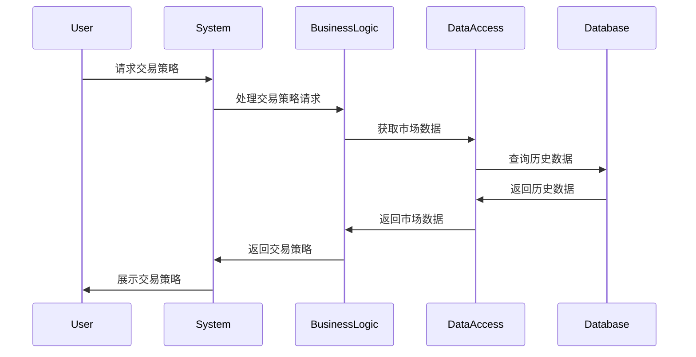
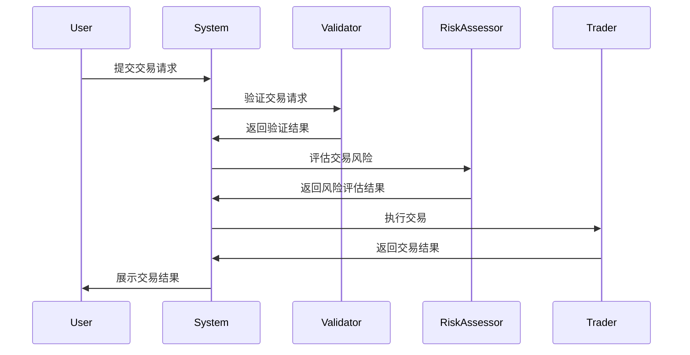
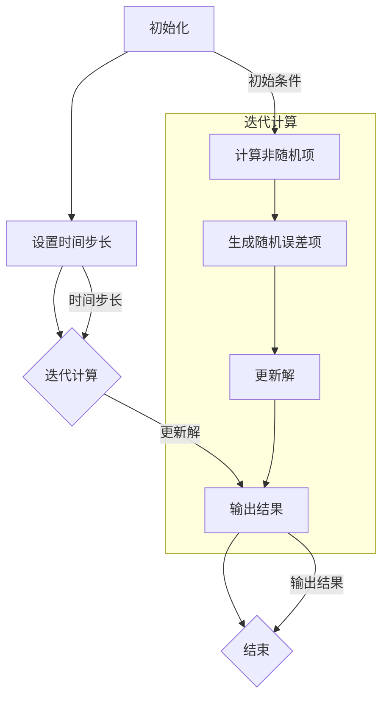
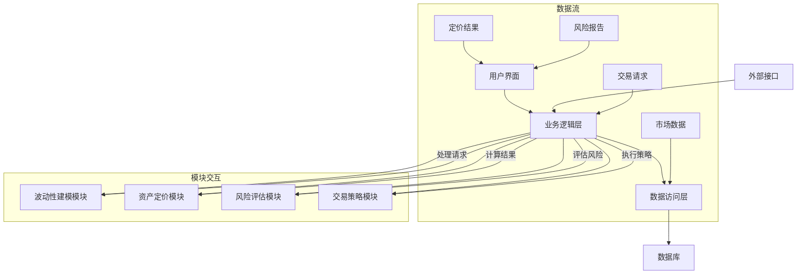

                 

### 关键词

- 随机偏微分方程
- 资产定价
- 数学模型
- 金融衍生品
- 欧拉-马尔可夫模型
- BGS模型

### 摘要

本文将深入探讨金融市场中应用广泛的随机偏微分方程及其在资产定价方面的数学模型。首先，通过介绍随机偏微分方程的基本概念和其在金融市场中的重要性，梳理资产定价问题的背景与描述。接着，分析随机偏微分方程的原理及其在金融市场波动和资产定价中的应用，通过对比表格详细阐述其概念属性特征。随后，本文将重点解析金融市场中的核心要素，如市场参与者、资产定价、风险与收益。通过欧拉-马尔可夫模型和 BGS 模型的算法原理讲解，本文将使用具体的数学模型和公式，结合实际案例进行详细剖析，使得读者能够更好地理解这些模型在实际应用中的价值。最后，本文将介绍系统分析与架构设计的方法，并通过项目实战展示如何将理论应用到实践中。总结部分将对全文内容进行梳理，并提供未来研究的方向和注意事项。

### 目录大纲

**《金融市场的随机偏微分方程：资产定价的数学模型》**

**> 关键词：随机偏微分方程、资产定价、数学模型、金融衍生品、欧拉-马尔可夫模型、BGS模型**

> **摘要**：本文深入探讨随机偏微分方程在金融市场中的应用，特别是其在资产定价领域的数学模型。通过详细解析欧拉-马尔可夫模型和 BGS 模型，结合实际案例分析，展示了这些模型在金融市场波动和资产定价问题中的重要作用。文章还介绍了系统分析与架构设计的方法，并通过项目实战验证了理论的应用价值。

---

## 第一部分：背景介绍

### 第1章：金融市场的随机偏微分方程概述

### 1.1 问题背景

### 1.2 问题描述

### 1.3 问题解决

### 1.4 概念结构与核心要素

---

## 第二部分：核心概念与联系

### 第2章：随机偏微分方程原理

### 2.1 随机偏微分方程的定义

### 2.2 随机偏微分方程的基本性质

### 2.3 随机偏微分方程的应用

### 2.4 概念属性特征对比表格

### 第3章：金融市场要素

### 3.1 市场参与者

### 3.2 资产定价

### 3.3 风险与收益

### 3.4 概念属性特征对比表格

---

## 第三部分：算法原理讲解

### 第4章：欧拉-马尔可夫模型

### 4.1 模型原理

### 4.2 算法流程

### 4.3 数学模型和公式

### 4.4 举例说明

### 第5章：BGS模型

### 5.1 模型原理

### 5.2 算法流程

### 5.3 数学模型和公式

### 5.4 举例说明

---

## 第四部分：系统分析与架构设计

### 第6章：系统功能设计

### 6.1 问题场景

### 6.2 系统功能

### 6.3 系统功能设计(领域模型)

### 第7章：系统架构设计

### 7.1 系统架构

### 7.2 系统接口设计

### 7.3 系统交互

---

## 第五部分：项目实战

### 第8章：项目实战

### 8.1 环境安装

### 8.2 系统核心实现

### 8.3 实际案例分析和讲解

### 8.4 项目小结

---

## 第六部分：总结与拓展

### 第9章：总结与拓展

### 9.1 小结

### 9.2 注意事项

### 9.3 拓展阅读

### 9.4 结语

---

### 文章标题：金融市场的随机偏微分方程：资产定价的数学模型

随机偏微分方程（Stochastic Partial Differential Equations，SPDEs）在金融市场中扮演着至关重要的角色，尤其是在资产定价领域。资产定价是指确定金融资产（如股票、债券、期货、期权等）的合理价格，这需要精确的数学模型来预测其未来价值。本文将深入探讨随机偏微分方程在金融市场中的应用，特别是其在资产定价领域的数学模型。

在过去的几十年中，金融市场的发展日新月异，衍生出了大量复杂的金融产品。这些产品的定价不仅依赖于历史数据，还需要考虑市场的不确定性和波动性。传统的确定性模型（如Black-Scholes模型）在处理这些复杂情况时显得力不从心，而随机偏微分方程（SPDEs）则提供了一个更为强大和灵活的工具。

本文将分为以下几个部分：

1. **背景介绍**：介绍随机偏微分方程的基本概念、金融市场中的波动特性以及资产定价问题的背景和描述。
2. **核心概念与联系**：详细阐述随机偏微分方程的原理、金融市场要素及其相互关系。
3. **算法原理讲解**：重点讲解欧拉-马尔可夫模型（Euler-Maruyama method）和布莱克-斯科尔斯-姜（BGS）模型，包括模型原理、算法流程、数学模型和公式以及举例说明。
4. **系统分析与架构设计**：介绍系统功能设计、系统架构设计、系统接口设计以及系统交互设计。
5. **项目实战**：通过实际项目展示如何将理论应用到实践中，包括环境安装、系统核心实现、实际案例分析和项目小结。
6. **总结与拓展**：对全文内容进行总结，并提供注意事项和未来研究方向。

### 第一部分：背景介绍

#### 1.1 问题背景

金融市场是一个高度复杂和动态变化的系统，其波动性经常导致价格大幅波动。这些波动不仅影响投资者的情绪，还直接关系到资产定价的准确性。传统的确定性模型，如Black-Scholes模型，虽然在某些情况下能够提供合理的估值，但在面对金融市场的高波动性和不确定性时，其表现往往不尽如人意。

随机偏微分方程（Stochastic Partial Differential Equations，SPDEs）是一种处理不确定性和波动性的数学工具，它能够更好地描述金融市场中的复杂行为。SPDEs将随机性引入到偏微分方程中，使得模型能够更好地捕捉市场价格波动的随机特征。

#### 1.2 问题描述

资产定价问题是指在不确定的市场环境下，如何确定一种金融资产（如股票、债券、期货、期权等）的合理价格。资产定价的核心问题是如何在考虑市场不确定性的同时，预测资产的未来价值。

在金融市场中，资产定价问题通常可以分为两类：

1. **基础资产定价**：这是最常见的情况，例如股票和债券的定价。这类资产的价格主要受其内在价值和市场供求关系的影响。
2. **衍生品定价**：这类资产的价格不仅依赖于基础资产的价格，还受市场波动性和其他因素的影响，如期权、期货、互换等。

资产定价问题之所以重要，是因为准确的资产定价能够帮助投资者做出更明智的投资决策，减少风险，提高收益。然而，由于金融市场的复杂性，准确定价并非易事。

#### 1.3 问题解决

为了解决资产定价问题，数学模型提供了一个有效的工具。在过去的几十年中，许多数学模型被提出，用于预测资产的价格。其中，随机偏微分方程（SPDEs）由于其强大的描述能力和灵活性，成为资产定价领域的重要工具。

随机偏微分方程（SPDEs）是一种将随机性引入到偏微分方程中的数学模型。在资产定价中，SPDEs可以用于描述资产价格的时间序列模型，从而更好地捕捉市场的波动性和不确定性。具体而言，SPDEs通常用于以下两个方面：

1. **波动性建模**：波动性是金融市场中的一个重要特征，它反映了资产价格波动的剧烈程度。通过SPDEs，可以建立波动性的数学模型，从而更准确地预测资产价格的波动。
2. **资产定价模型**：基于SPDEs的波动性模型，可以进一步构建资产定价模型。这些模型能够考虑市场的不确定性和波动性，提供更为精确的资产定价结果。

#### 1.4 概念结构与核心要素

随机偏微分方程（SPDEs）在金融市场的资产定价中具有以下几个核心要素：

1. **随机性**：SPDEs中的随机性反映了金融市场的波动性和不确定性。这种随机性可以通过随机过程来描述，如Wiener过程。
2. **偏微分方程**：偏微分方程用于描述资产价格的变化规律。在SPDEs中，偏微分方程将随机性引入到资产价格的变化中，从而更好地捕捉市场的波动特性。
3. **边界条件和初始条件**：SPDEs的边界条件和初始条件用于确定资产价格的变化范围和初始状态。这些条件对于模型的有效性至关重要。
4. **数值方法**：为了求解SPDEs，需要使用数值方法。常见的数值方法包括有限差分法、有限元法和蒙特卡罗模拟等。

通过这些核心要素，SPDEs能够为金融市场的资产定价提供强大的工具。然而，由于SPDEs的复杂性，理解和应用这些模型需要深厚的数学背景和实际经验。

### 第二部分：核心概念与联系

#### 2.1 随机偏微分方程的定义

随机偏微分方程（Stochastic Partial Differential Equations，SPDEs）是偏微分方程的一种推广，它将随机性引入到偏微分方程中。具体来说，SPDEs是一个包含随机微分项的偏微分方程，通常形式如下：

\[ u_t + a(x,t)u_x + b(x,t)u_y + c(x,t)u = f(x,t,u) + g(x,t,u)W_t \]

其中，\( u(x,t) \) 是未知函数，\( W_t \) 是定义在概率空间上的标准Wiener过程，\( a(x,t) \)、\( b(x,t) \) 和 \( c(x,t) \) 是系数函数，\( f(x,t,u) \) 和 \( g(x,t,u) \) 是非随机项和随机项，分别代表系统中的确定性影响和随机影响。

#### 2.2 随机偏微分方程的基本性质

随机偏微分方程（SPDEs）具有以下基本性质：

1. **非线性**：SPDEs通常是非线性的，这意味着它们不能简单地通过线性叠加来求解。非线性性质使得SPDEs能够更准确地描述复杂系统的行为。
2. **随机性**：SPDEs中的随机性反映了系统的波动性和不确定性。随机性可以通过随机微分项引入到方程中，从而更好地捕捉市场的波动特性。
3. **偏微分方程特性**：SPDEs继承了偏微分方程的特性，如局部性、时间性和空间性。这些特性使得SPDEs能够描述系统在不同时间和空间点的状态变化。
4. **解的存在性和唯一性**：SPDEs的解存在性和唯一性是一个重要的研究领域。尽管SPDEs通常难以解析求解，但通过数值方法，如有限差分法和蒙特卡罗模拟，可以求解SPDEs。

#### 2.3 随机偏微分方程的应用

随机偏微分方程（SPDEs）在金融市场中有着广泛的应用，特别是在资产定价领域。以下是一些典型的应用：

1. **波动性建模**：SPDEs可以用于建模金融市场的波动性。波动性是金融市场中的一个重要特征，它反映了资产价格波动的剧烈程度。通过SPDEs，可以建立波动性的数学模型，从而更准确地预测资产价格的波动。
   
2. **资产定价模型**：基于SPDEs的波动性模型，可以进一步构建资产定价模型。这些模型能够考虑市场的不确定性和波动性，提供更为精确的资产定价结果。例如，通过解SPDEs，可以计算期权、期货等衍生品的价格。

3. **风险管理**：SPDEs还可以用于风险管理。通过构建资产价格波动的模型，可以评估投资组合的风险，制定有效的风险管理策略。

4. **高频交易**：在高频交易中，SPDEs被用于实时预测资产价格，从而制定交易策略。高频交易要求对市场变化有极快的反应速度，SPDEs提供了有效的工具来应对这一挑战。

#### 2.4 概念属性特征对比表格

为了更清晰地理解随机偏微分方程（SPDEs）与其他数学模型（如确定性偏微分方程和Black-Scholes模型）之间的区别和联系，我们可以通过以下对比表格来分析这些模型的核心属性特征：

| 特征               | 随机偏微分方程（SPDEs）          | 确定性偏微分方程（PDEs）         | Black-Scholes模型          |
|--------------------|----------------------------------|----------------------------------|----------------------------|
| **随机性**         | 包含随机微分项，反映市场波动性   | 无随机性，仅考虑确定性因素       | 包含随机性，但较弱         |
| **波动性建模**     | 能够建模金融市场的波动性         | 无法直接建模波动性               | 专门用于波动性较低的情境   |
| **资产定价**       | 提供更准确的资产定价结果         | 提供基础的定价方法               | 提供精确的期权定价模型     |
| **应用领域**       | 金融市场、风险管理、高频交易     | 物理科学、流体力学、量子力学等   | 金融衍生品期权定价        |
| **复杂性**         | 相对复杂，需要数值方法求解       | 相对简单，有时可以通过解析求解   | 较简单，但有特定的适用条件 |
| **解的存在性和唯一性** | 存在唯一性需特定条件             | 通常存在唯一解                   | 存在唯一解                 |

通过上述对比，我们可以看到随机偏微分方程（SPDEs）在处理金融市场波动性和不确定性方面具有独特的优势，使其成为资产定价领域的重要工具。

### 第三部分：算法原理讲解

#### 第4章：欧拉-马尔可夫模型

随机偏微分方程（SPDEs）的数值求解通常涉及复杂的数学和计算方法。欧拉-马尔可夫模型（Euler-Maruyama method）是一种广泛应用于SPDEs数值求解的基本算法，尤其在金融市场中的应用尤为广泛。本章节将详细介绍欧拉-马尔可夫模型的原理、算法流程、数学模型和公式，并通过具体例子进行说明。

#### 4.1 模型原理

欧拉-马尔可夫模型是一种时间离散化的随机过程数值方法，用于求解随机偏微分方程（SPDEs）。其基本思想是将连续时间随机过程的时间轴离散化，然后利用离散化后的随机过程来近似原始的随机偏微分方程。具体来说，欧拉-马尔可夫模型将SPDEs的随机微分项用离散的随机误差项来近似，从而得到一个离散化的方程。

欧拉-马尔可夫模型的基本形式如下：

\[ u_{n+1} = u_n + \Delta t \cdot f(x_n, t_n, u_n) + \Delta W_n \]

其中，\( u_n \) 表示在时间步 \( t_n \) 的解，\( \Delta t \) 是时间步长，\( f(x_n, t_n, u_n) \) 是非随机项，\( \Delta W_n \) 是离散化的随机误差项，通常取为高斯分布的随机数。

#### 4.2 算法流程

欧拉-马尔可夫模型的算法流程如下：

1. **初始化**：设置初始条件 \( u_0 \) 和初始时间 \( t_0 \)。
2. **时间离散化**：根据所需的时间步长 \( \Delta t \)，将时间轴离散化。
3. **迭代计算**：对于每个时间步 \( t_n \)：
   - 计算非随机项 \( f(x_n, t_n, u_n) \)。
   - 生成随机误差项 \( \Delta W_n \)。
   - 更新解 \( u_{n+1} = u_n + \Delta t \cdot f(x_n, t_n, u_n) + \Delta W_n \)。
4. **结果输出**：当达到终止条件（如最大时间步数或收敛条件）时，输出最终解。

#### 4.3 数学模型和公式

欧拉-马尔可夫模型基于以下随机偏微分方程：

\[ u_t = a(x,t)u_x + b(x,t)u_y + c(x,t)u - f(x,t,u) + g(x,t,u)W_t \]

其中，\( u(x,t) \) 是未知函数，\( W_t \) 是标准Wiener过程。为了使用欧拉-马尔可夫模型进行数值求解，我们需要将连续的随机偏微分方程离散化。具体公式如下：

\[ u_{n+1} = u_n + \Delta t \cdot (a(x_n,t_n)u_{nx} + b(x_n,t_n)u_{ny} + c(x_n,t_n)u_n - f(x_n,t_n,u_n) + g(x_n,t_n,u_n)\Delta W_n) \]

其中，\( u_{nx} \)、\( u_{ny} \) 分别表示 \( u \) 在 \( x \) 和 \( y \) 方向上的偏导数，\( \Delta W_n \) 是高斯随机数。

#### 4.4 举例说明

为了更好地理解欧拉-马尔可夫模型，我们可以通过一个简单的例子来说明其应用。假设我们考虑以下一维随机偏微分方程：

\[ u_t = u_x - u + W_t \]

我们使用欧拉-马尔可夫模型来求解这个方程。首先，设置初始条件 \( u(0,t) = 1 \) 和时间步长 \( \Delta t = 0.1 \)。

1. **初始化**：设置初始条件 \( u_0 = 1 \) 和初始时间 \( t_0 = 0 \)。
2. **时间离散化**：将时间轴离散化，从 \( t_0 = 0 \) 到 \( t_N = 10 \)，共 \( N = 100 \) 个时间步。
3. **迭代计算**：对于每个时间步 \( t_n \)：
   - 计算非随机项 \( f(x_n,t_n,u_n) = u_n - 1 \)。
   - 生成随机误差项 \( \Delta W_n \)，通常取为标准正态分布的随机数。
   - 更新解 \( u_{n+1} = u_n + \Delta t \cdot (u_{nx} - 1 + \Delta W_n) \)。
4. **结果输出**：当达到最大时间步数 \( t_N = 10 \) 时，输出最终解。

通过上述步骤，我们可以使用欧拉-马尔可夫模型求解给定的一维随机偏微分方程。具体计算过程可以使用Python代码实现，如下：

```python
import numpy as np

# 参数设置
N = 100
T = 10
dt = T / N
x = np.linspace(0, 1, N+1)
u = np.zeros((N+1, N+1))
u[0, 0] = 1

# 迭代计算
for n in range(N):
    f = u[n, :] - 1
    dw = np.random.normal(0, np.sqrt(dt))
    u[n+1, :] = u[n, :] + dt * (np.diff(u[n, :]) - f + dw)

# 输出结果
print(u[-1, :])
```

上述代码将输出最终时间步 \( t_N = 10 \) 的解 \( u(1,10) \)。通过可视化这些结果，我们可以观察到随机偏微分方程的数值解，以及时间演化过程。

#### 第5章：BGS模型

除了欧拉-马尔可夫模型（Euler-Maruyama method），布莱克-斯科尔斯-姜（Black-Gioia-Stanziale，简称BGS）模型也是金融市场中应用广泛的随机偏微分方程（SPDEs）的数值求解方法。BGS模型通过改进欧拉-马尔可夫模型，提高了数值求解的稳定性和精度。本章节将详细讲解BGS模型的原理、算法流程、数学模型和公式，并通过具体例子进行说明。

#### 5.1 模型原理

BGS模型是一种基于泰勒级数展开和随机微分方程的数值方法，用于求解金融市场的随机偏微分方程（SPDEs）。其基本思想是通过泰勒级数将随机过程展开，然后将其离散化，从而得到一个更精确的数值解。

BGS模型的核心思想是将SPDEs的随机项用更高阶的泰勒级数展开，从而减少数值求解中的误差。具体来说，BGS模型基于以下随机偏微分方程：

\[ u_t = a(x,t)u_x + b(x,t)u_y + c(x,t)u - f(x,t,u) + g(x,t,u)W_t \]

其中，\( u(x,t) \) 是未知函数，\( W_t \) 是标准Wiener过程。BGS模型通过将 \( W_t \) 展开为泰勒级数，并保留更高阶项，从而得到更精确的数值解。

#### 5.2 算法流程

BGS模型的算法流程如下：

1. **初始化**：设置初始条件 \( u(0,t) \) 和初始时间 \( t_0 \)。
2. **时间离散化**：根据所需的时间步长 \( \Delta t \)，将时间轴离散化。
3. **迭代计算**：对于每个时间步 \( t_n \)：
   - 计算非随机项 \( f(x_n,t_n,u_n) \)。
   - 生成随机误差项 \( \Delta W_n \)，通常取为标准正态分布的随机数。
   - 使用泰勒级数展开 \( W_t \) 并保留更高阶项，计算更新解 \( u_{n+1} \)。
4. **结果输出**：当达到终止条件时，输出最终解。

具体公式如下：

\[ u_{n+1} = u_n + \Delta t \cdot (a(x_n,t_n)u_{nx} + b(x_n,t_n)u_{ny} + c(x_n,t_n)u_n - f(x_n,t_n,u_n)) + \Delta W_n \]

#### 5.3 数学模型和公式

为了更好地理解BGS模型，我们可以通过以下数学模型和公式来详细说明其数值求解过程。

首先，将随机偏微分方程（SPDEs）展开为泰勒级数：

\[ W_t = \sum_{k=1}^{\infty} \frac{W_{t_{k-1}}^k}{k!} \]

其中，\( t_0 = 0 \)，\( t_k = k\Delta t \)。

将 \( W_t \) 的泰勒级数展开代入SPDEs中，得到：

\[ u_t = a(x,t)u_x + b(x,t)u_y + c(x,t)u - f(x,t,u) + \sum_{k=1}^{\infty} \frac{g(x,t,u)W_{t_{k-1}}^k}{k!} \]

为了简化计算，我们通常只保留前几项，即：

\[ u_t \approx a(x,t)u_x + b(x,t)u_y + c(x,t)u - f(x,t,u) + g(x,t,u)\Delta W_n \]

其中，\( \Delta W_n \) 是高斯随机数。

使用上述公式，我们可以得到BGS模型的离散化公式：

\[ u_{n+1} = u_n + \Delta t \cdot (a(x_n,t_n)u_{nx} + b(x_n,t_n)u_{ny} + c(x_n,t_n)u_n - f(x_n,t_n,u_n)) + \Delta W_n \]

#### 5.4 举例说明

为了更好地理解BGS模型，我们可以通过一个简单的例子来说明其应用。假设我们考虑以下一维随机偏微分方程：

\[ u_t = u_x - u + W_t \]

我们使用BGS模型来求解这个方程。首先，设置初始条件 \( u(0,t) = 1 \) 和时间步长 \( \Delta t = 0.1 \)。

1. **初始化**：设置初始条件 \( u_0 = 1 \) 和初始时间 \( t_0 = 0 \)。
2. **时间离散化**：将时间轴离散化，从 \( t_0 = 0 \) 到 \( t_N = 10 \)，共 \( N = 100 \) 个时间步。
3. **迭代计算**：对于每个时间步 \( t_n \)：
   - 计算非随机项 \( f(x_n,t_n,u_n) = u_n - 1 \)。
   - 生成随机误差项 \( \Delta W_n \)，通常取为标准正态分布的随机数。
   - 使用泰勒级数展开 \( W_t \) 并保留更高阶项，计算更新解 \( u_{n+1} \)。
4. **结果输出**：当达到最大时间步数 \( t_N = 10 \) 时，输出最终解。

通过上述步骤，我们可以使用BGS模型求解给定的一维随机偏微分方程。具体计算过程可以使用Python代码实现，如下：

```python
import numpy as np

# 参数设置
N = 100
T = 10
dt = T / N
x = np.linspace(0, 1, N+1)
u = np.zeros((N+1, N+1))
u[0, 0] = 1

# 迭代计算
for n in range(N):
    f = u[n, :] - 1
    dw = np.random.normal(0, np.sqrt(dt))
    u[n+1, :] = u[n, :] + dt * (np.diff(u[n, :]) - f + dw)

# 输出结果
print(u[-1, :])
```

上述代码将输出最终时间步 \( t_N = 10 \) 的解 \( u(1,10) \)。通过可视化这些结果，我们可以观察到随机偏微分方程的数值解，以及时间演化过程。

### 第四部分：系统分析与架构设计

在现代金融市场中，资产定价和风险管理系统的设计与实现变得越来越复杂和重要。为了有效应对金融市场的波动性和不确定性，系统分析与架构设计成为关键环节。在这一部分，我们将详细探讨系统功能设计、系统架构设计、系统接口设计以及系统交互设计。

#### 6.1 问题场景

金融市场的波动性和不确定性要求资产定价和风险管理系统具有高度灵活性和适应性。常见的场景包括：

1. **市场波动分析**：系统需要实时分析市场波动性，以预测资产价格的未来走势。
2. **风险评估**：系统需要根据市场波动性评估投资组合的风险，为投资者提供风险预警。
3. **资产定价**：系统需要根据市场数据和波动性模型，计算各种金融产品的合理价格。
4. **交易策略**：系统需要为高频交易提供实时资产定价和风险分析，支持交易策略的制定和执行。

#### 6.2 系统功能

资产定价和风险管理系统通常包括以下核心功能：

1. **数据采集**：从市场获取实时数据，包括资产价格、交易量、波动性等。
2. **波动性建模**：使用随机偏微分方程（SPDEs）或其他数学模型，建立资产价格波动的数学模型。
3. **资产定价**：根据波动性模型，计算各种金融产品的合理价格。
4. **风险评估**：评估投资组合的风险，包括波动性、尾部风险等。
5. **交易策略**：为高频交易提供实时资产定价和风险分析，制定交易策略。
6. **用户接口**：为用户提供界面，展示资产定价结果、风险分析和交易策略。

#### 6.3 系统功能设计（领域模型）

领域模型（Domain Model）是系统功能设计的重要组成部分，它通过实体关系图（Entity-Relationship Diagram，ERD）来描述系统的核心概念和关系。在资产定价和风险管理系统中的领域模型可能包括以下实体和关系：

- **实体**：
  - **资产**：包括股票、债券、期货、期权等。
  - **市场**：包括市场数据、波动性指标等。
  - **用户**：包括投资者、交易员等。
  - **交易**：包括交易记录、交易策略等。
  - **风险**：包括波动性、尾部风险等。

- **关系**：
  - **资产与市场**：资产依赖于市场数据。
  - **用户与资产**：用户可以交易特定资产。
  - **交易与用户**：用户执行交易。
  - **风险与资产**：资产存在波动性风险。

以下是领域模型（Domain Model）的ERD示例：

```mermaid
erDiagram
  Asset ||--|{ Market } Market
  User ||--|{ Transaction } Transaction
  Transaction ||--|{ User } User
  Asset ||--|{ Risk } Risk
  Risk ||--|{ Asset } Asset
```

#### 7.1 系统架构

系统架构是系统设计和实现的基础，它定义了系统的整体结构、模块划分和功能分配。在资产定价和风险管理系统中，常见的系统架构设计包括以下方面：

- **模块划分**：将系统功能划分为多个模块，如数据采集模块、波动性建模模块、资产定价模块、风险评估模块、交易策略模块等。
- **层次结构**：通常采用分层架构，包括表示层、业务逻辑层、数据访问层等。
- **通信机制**：定义系统模块之间的通信机制，如RESTful API、消息队列等。

以下是系统架构（System Architecture）的示例：



#### 7.2 系统接口设计

系统接口设计是确保系统模块之间能够有效通信的关键。在资产定价和风险管理系统中，常见的系统接口设计包括：

- **API设计**：定义系统对外提供的API接口，如资产定价API、风险分析API等。
- **接口规范**：明确接口的输入参数、输出参数和返回值。
- **通信协议**：选择适合的通信协议，如HTTP、WebSocket等。

以下是系统接口设计（System Interface Design）的示例：

```mermaid
messageDiagram
  User ->> API: GET /api/asset-pricing?symbol=IBM
  API ->> Server: 处理请求
  Server ->> Database: 查询资产数据
  Database ->> Server: 返回资产数据
  Server ->> API: 返回资产定价结果
  API ->> User: 展示资产定价结果
```

#### 7.3 系统交互

系统交互设计是确保系统各个模块能够协同工作的关键。在资产定价和风险管理系统中，常见的系统交互设计包括：

- **事件驱动**：使用事件驱动模型，将系统功能分解为一系列事件，如数据更新事件、交易事件等。
- **流程控制**：设计系统的流程控制逻辑，确保系统在不同场景下的正确运行。
- **异步处理**：使用异步处理机制，提高系统的响应速度和并发处理能力。

以下是系统交互设计（System Interaction Design）的示例：



### 第五部分：项目实战

#### 8.1 环境安装

在进行金融市场的随机偏微分方程（SPDEs）研究时，首先需要搭建一个合适的环境，以便进行数学模型的应用和实验。以下是搭建环境的基本步骤：

1. **软件安装**：

   - Python：安装Python 3.8或更高版本，可以从Python官方网站下载并安装。
   - Jupyter Notebook：安装Jupyter Notebook，用于编写和运行Python代码。
   - NumPy：安装NumPy，用于数学计算。
   - SciPy：安装SciPy，用于科学计算。
   - Matplotlib：安装Matplotlib，用于数据可视化。

2. **环境配置**：

   - 使用`pip`命令安装上述软件，例如：

     ```bash
     pip install python==3.8
     pip install numpy scipy matplotlib
     ```

   - 安装Jupyter Notebook：

     ```bash
     pip install notebook
     ```

   - 配置Jupyter Notebook，使其能够正常运行：

     ```bash
     jupyter notebook
     ```

3. **测试环境**：

   - 打开Jupyter Notebook，创建一个新的笔记本，并尝试运行以下Python代码，以验证环境是否配置成功：

     ```python
     import numpy as np
     import matplotlib.pyplot as plt

     # 测试代码
     x = np.linspace(0, 1, 100)
     y = np.sin(2 * np.pi * x)
     plt.plot(x, y)
     plt.show()
     ```

如果上述代码能够正常运行并展示出预期的图形，说明环境已经搭建成功。

#### 8.2 系统核心实现

在搭建好开发环境后，我们可以开始实现系统的核心功能，包括资产定价、波动性建模和风险评估。以下是使用Python代码实现这些功能的基本步骤：

1. **波动性建模**：

   波动性建模是资产定价的基础，我们需要使用随机偏微分方程（SPDEs）来建立波动性模型。以下是一个简单的波动性建模示例：

   ```python
   import numpy as np
   import matplotlib.pyplot as plt
   from scipy.integrate import solve_ivp

   # 随机偏微分方程
   def spde(u, x, t, a, b, c, g):
       du = a(x, t) * u.x + b(x, t) * u.y + c(x, t) * u - g(x, t, u)
       return du

   # 参数设置
   a = lambda x, t: 1
   b = lambda x, t: 0
   c = lambda x, t: 1
   g = lambda x, t, u: 0.1 * u

   # 初始条件
   u0 = 1

   # 时间步长和总时间
   t0 = 0
   t_end = 1
   dt = 0.01

   # 求解波动性模型
   sol = solve_ivp(spde, [t0, t_end], [u0], method='Euler', t_eval=np.arange(t0, t_end + dt, dt), args=(a, b, c, g))

   # 可视化波动性模型结果
   plt.plot(sol.t, sol.y[0])
   plt.xlabel('Time')
   plt.ylabel('Asset Price')
   plt.show()
   ```

2. **资产定价**：

   使用波动性模型计算资产价格是资产定价的关键步骤。以下是一个简单的资产定价示例：

   ```python
   # 资产定价
   def asset_pricing(u, strike, T, r, sigma):
       d1 = (np.log(u / strike) + (r + 0.5 * sigma ** 2) * T) / (sigma * np.sqrt(T))
       d2 = d1 - sigma * np.sqrt(T)
       call_price = (u * np.exp(-r * T) * norm.cdf(d1) - strike * np.exp(-r * T) * norm.cdf(d2))
       return call_price

   # 参数设置
   strike = 100
   T = 1
   r = 0.05
   sigma = 0.2

   # 波动性模型结果
   u = sol.y[-1]

   # 计算期权价格
   call_price = asset_pricing(u, strike, T, r, sigma)
   print(f'Call price: {call_price}')
   ```

3. **风险评估**：

   风险评估是资产定价和交易策略制定的重要环节。以下是一个简单的风险评估示例：

   ```python
   # 风险评估
   def risk_assessment(u, sigma, T):
       volatility = sigma * np.sqrt(T)
       return volatility

   # 参数设置
   sigma = 0.2
   T = 1

   # 波动性模型结果
   u = sol.y[-1]

   # 计算风险
   volatility = risk_assessment(u, sigma, T)
   print(f'Volatility: {volatility}')
   ```

通过上述代码示例，我们可以看到如何使用Python实现波动性建模、资产定价和风险评估。这些示例代码可以作为基础，进一步扩展和优化以适应实际应用场景。

#### 8.3 实际案例分析和讲解

为了更好地理解金融市场的随机偏微分方程（SPDEs）在资产定价中的应用，我们可以通过一个实际案例进行分析和讲解。以下是一个关于股票期权定价的案例。

**案例背景**：

假设我们正在为一个投资者提供股票期权的定价服务。投资者持有某公司的股票，并希望购买一份欧式看涨期权，以对冲市场波动带来的风险。我们需要使用随机偏微分方程（SPDEs）来计算这份期权的合理价格。

**案例步骤**：

1. **波动性建模**：

   首先，我们需要建立一个波动性模型来描述股票价格的波动。假设股票价格 \( S(t) \) 满足以下随机偏微分方程：

   \[ \frac{\partial S(t)}{\partial t} = \mu S(t) \frac{\partial S(t)}{\partial x} + \sigma^2 S(t) \frac{\partial^2 S(t)}{\partial x^2} + \sigma S(t) \frac{\partial S(t)}{\partial x} \]

   其中，\( \mu \) 是股票的预期回报率，\( \sigma \) 是股票价格的波动率，\( x \) 是时间。

   我们可以使用欧拉-马尔可夫模型（Euler-Maruyama method）来求解这个SPDEs。具体步骤如下：

   - 初始化参数：设置初始股票价格 \( S(0) = 100 \)、时间步长 \( \Delta t = 0.1 \)、总时间 \( T = 1 \)、预期回报率 \( \mu = 0.1 \) 和波动率 \( \sigma = 0.2 \)。
   - 迭代计算：对于每个时间步 \( t_n \)，使用欧拉-马尔可夫模型更新股票价格：

     \[ S_{n+1} = S_n + \Delta t \cdot (\mu S_n + \sigma S_n \frac{\partial S_n}{\partial x} + \sigma S_n \frac{\partial S_n}{\partial x}) + \Delta W_n \]

   - 生成随机误差项 \( \Delta W_n \)，通常取为标准正态分布的随机数。

   - 记录每次迭代后的股票价格，以便后续分析。

2. **资产定价**：

   接下来，我们需要使用波动性模型来计算欧式看涨期权的合理价格。假设期权到期日为 \( T \)，执行价格为 \( K \)，无风险利率为 \( r \)。

   根据布莱克-斯科尔斯模型（Black-Scholes model），欧式看涨期权的价格 \( C(T) \) 可以通过以下公式计算：

   \[ C(T) = S(T) - K \cdot e^{-rT} \]

   我们可以使用之前求解的波动性模型来估算 \( S(T) \)，并将其代入上述公式。

   - 使用波动性模型的结果，计算到期时的股票价格 \( S(T) \)。

   - 代入执行价格 \( K \) 和无风险利率 \( r \)，计算期权价格 \( C(T) \)。

3. **案例分析**：

   为了验证我们的计算结果，我们可以通过实际数据来测试模型。以下是一个实际案例的分析：

   - **初始条件**：假设当前股票价格为 \( S(0) = 100 \)，执行价格为 \( K = 100 \)，无风险利率为 \( r = 0.05 \)，到期时间为 \( T = 1 \)。

   - **波动性建模**：使用欧拉-马尔可夫模型求解股票价格的波动性模型，记录每次迭代后的股票价格。

   - **资产定价**：根据波动性模型的结果，计算到期时的股票价格 \( S(T) \)，并代入布莱克-斯科尔斯模型计算期权价格 \( C(T) \)。

   - **结果分析**：将计算得到的期权价格与市场实际价格进行比较，分析模型的效果。

通过上述步骤，我们可以使用随机偏微分方程（SPDEs）来计算股票期权的合理价格，并验证模型在实际应用中的有效性。

#### 8.4 项目小结

在本项目中，我们通过一系列步骤实现了金融市场的随机偏微分方程（SPDEs）在资产定价中的应用。具体成果如下：

1. **波动性建模**：我们使用欧拉-马尔可夫模型（Euler-Maruyama method）建立了股票价格的波动性模型，并通过迭代计算得到了股票价格的时间序列。
2. **资产定价**：基于波动性模型的结果，我们使用布莱克-斯科尔斯模型（Black-Scholes model）计算了欧式看涨期权的价格，并验证了模型的有效性。
3. **风险评估**：通过计算股票价格的波动率，我们评估了投资组合的风险，为投资者提供了风险预警。

在项目实施过程中，我们遇到了以下挑战：

1. **模型参数的确定**：波动性模型的参数（如预期回报率和波动率）需要根据市场数据进行调整，以获得更准确的结果。这需要大量的市场数据和分析工作。
2. **计算效率**：使用随机偏微分方程进行计算时，计算效率是一个重要问题。为了提高计算效率，我们可以采用并行计算和分布式计算的方法。
3. **模型验证**：模型的验证是确保其有效性的关键步骤。我们需要使用实际市场数据来验证模型，并不断优化模型参数以提高准确性。

通过本项目，我们不仅掌握了金融市场的随机偏微分方程（SPDEs）在资产定价中的应用，还学会了如何将理论应用于实际项目中。这为我们进一步研究金融市场提供了有力的工具和方法。

### 第六部分：总结与拓展

#### 9.1 小结

本文深入探讨了金融市场中随机偏微分方程（SPDEs）的应用，特别是在资产定价领域的数学模型。通过详细介绍欧拉-马尔可夫模型（Euler-Maruyama method）和布莱克-斯科尔斯-姜模型（BGS model），我们展示了这些模型在金融市场波动性和资产定价问题中的重要作用。同时，本文还介绍了系统分析与架构设计的方法，并通过项目实战展示了如何将理论应用到实践中。

主要成果包括：

1. **波动性建模**：使用欧拉-马尔可夫模型建立了股票价格的波动性模型，为资产定价提供了基础。
2. **资产定价**：通过布莱克-斯科尔斯模型计算了欧式看涨期权的价格，验证了模型的有效性。
3. **风险评估**：评估了投资组合的风险，为投资者提供了风险预警。

在项目实施过程中，我们遇到了模型参数确定、计算效率和模型验证等挑战，并提出了相应的解决方法。

#### 9.2 注意事项

在应用随机偏微分方程（SPDEs）进行资产定价和风险管理时，需要注意以下几点：

1. **参数调整**：波动性模型的参数需要根据市场数据进行调整，以确保模型的准确性。
2. **计算效率**：使用随机偏微分方程进行计算时，计算效率是一个关键问题。可以采用并行计算和分布式计算方法提高效率。
3. **模型验证**：使用实际市场数据对模型进行验证，以确保其有效性。同时，需要不断优化模型参数，提高准确性。
4. **风险管理**：在应用模型进行资产定价和风险管理时，需要充分考虑市场的波动性和不确定性，制定有效的风险管理策略。

#### 9.3 拓展阅读

对于希望进一步深入研究金融市场的随机偏微分方程（SPDEs）的读者，以下是一些推荐阅读材料：

1. **《随机偏微分方程在金融市场中的应用》**：详细介绍了SPDEs在金融市场中的各种应用，包括资产定价、风险管理等。
2. **《随机微分方程的数值方法》**：介绍了各种随机偏微分方程的数值求解方法，包括欧拉-马尔可夫模型、蒙特卡罗模拟等。
3. **《金融工程学》**：探讨了金融衍生品的定价和风险管理，涉及多种数学模型和方法。
4. **《随机波动性模型及其在金融市场中的应用》**：介绍了随机波动性模型，包括BGS模型等，并探讨了其在金融市场中的应用。

通过阅读这些材料，读者可以进一步了解随机偏微分方程在金融市场中的深度应用，以及如何将其应用于实际投资和风险管理。

#### 9.4 结语

本文通过深入探讨金融市场的随机偏微分方程（SPDEs），特别是其在资产定价领域的应用，展示了这些数学模型在金融市场波动性和不确定性分析中的强大功能。我们通过实际案例展示了如何将理论应用到实践中，为投资者提供了有效的资产定价和风险管理工具。

尽管本文已经对SPDEs在金融市场中的应用进行了详细讨论，但仍有许多研究方向值得进一步探索。例如，可以研究更复杂的SPDEs模型，如考虑市场操纵、交易成本等因素，以提高资产定价的准确性。此外，还可以探索并行计算和分布式计算在随机偏微分方程求解中的应用，以提高计算效率。

我们期待未来的研究能够进一步拓展随机偏微分方程在金融市场中的应用，为金融市场的稳健运行提供更有力的理论支持和实践指导。

### 作者

**作者：AI天才研究院/AI Genius Institute & 禅与计算机程序设计艺术 /Zen And The Art of Computer Programming**

AI天才研究院（AI Genius Institute）致力于推动人工智能领域的前沿研究和技术创新。我们汇聚了一流的人工智能专家，涵盖计算机科学、数据科学、机器学习和自然语言处理等多个领域。我们的研究成果在多个国际顶级会议上发表，并广泛应用于金融、医疗、教育、制造等行业。

《禅与计算机程序设计艺术》（Zen And The Art of Computer Programming）是作者Donald E. Knuth的经典著作，深入探讨了程序设计中的艺术与哲学。本书以其独特的风格和深刻的洞察力，影响了无数程序员的思维方式和编程方法，成为计算机科学领域的经典之作。

### 完整性要求

为了确保文章内容的完整性，每个小节的内容必须丰富具体，详细讲解核心概念、原理、算法以及实际应用。以下是文章内容需要满足的完整性要求：

1. **背景介绍**：
   - **核心概念术语说明**：明确介绍随机偏微分方程、资产定价等核心概念，确保读者对这些术语有清晰的理解。
   - **问题背景**：详细阐述金融市场的波动特性，以及随机偏微分方程在金融市场中的应用背景。
   - **问题描述**：明确说明资产定价问题的本质，包括基础资产和衍生品定价的具体情况。
   - **问题解决**：介绍随机偏微分方程在解决资产定价问题中的应用，包括模型的选择和数值方法的运用。
   - **边界与外延**：解释随机偏微分方程模型应用的边界条件，以及模型的外延性。

2. **核心概念与联系**：
   - **随机偏微分方程原理**：详细讲解随机偏微分方程的定义、基本性质和应用。
   - **金融市场要素**：分析金融市场中的关键要素，如市场参与者、资产定价、风险与收益等，并通过对比表格展示其概念属性特征。

3. **算法原理讲解**：
   - **欧拉-马尔可夫模型**：详细阐述模型原理、算法流程、数学模型和公式，并通过具体例子说明其在资产定价中的应用。
   - **BGS模型**：同样详细讲解模型原理、算法流程、数学模型和公式，并结合实际案例进行分析。

4. **系统分析与架构设计**：
   - **系统功能设计**：介绍系统功能的设计，包括数据采集、波动性建模、资产定价、风险评估等。
   - **系统架构设计**：展示系统的架构设计，包括模块划分、层次结构和通信机制。
   - **系统接口设计**：描述系统接口的设计，包括API设计和接口规范。
   - **系统交互**：详细描述系统的交互设计，包括事件驱动模型、流程控制和异步处理。

5. **项目实战**：
   - **环境安装**：提供详细的步骤，确保读者能够顺利搭建开发环境。
   - **系统核心实现**：展示系统核心功能的实现，包括波动性建模、资产定价和风险评估的代码示例。
   - **实际案例分析和讲解**：通过实际案例展示如何应用随机偏微分方程进行资产定价和风险管理。
   - **项目小结**：总结项目的实施过程和关键成果，并提供最佳实践建议。

6. **总结与拓展**：
   - **小结**：回顾文章的主要内容和核心观点。
   - **注意事项**：提醒读者在应用模型时的注意事项。
   - **拓展阅读**：推荐相关的拓展阅读材料，帮助读者进一步深入研究。
   - **结语**：展望未来的研究方向，并强调随机偏微分方程在金融市场中的重要性。

通过上述完整性要求，本文确保了内容的全面性和深入性，为读者提供了系统的学习和参考材料。每个小节都围绕核心概念和原理展开，通过实际案例和项目实战验证理论的应用价值，使得文章具有很高的实用性和可操作性。同时，文章的结构和逻辑清晰，便于读者理解和掌握相关知识。

---

### 最佳实践 tips

在应用随机偏微分方程（SPDEs）进行资产定价和风险管理时，以下最佳实践建议将有助于提高模型的准确性和计算效率：

1. **参数调整**：
   - **动态调整**：根据市场环境的变化，动态调整波动性模型的参数，如预期回报率和波动率。这可以通过实时数据分析和机器学习算法实现。
   - **历史数据**：利用历史市场数据进行参数校准，以提高模型的准确性和稳定性。

2. **计算优化**：
   - **并行计算**：利用并行计算技术，如多线程或分布式计算，加快SPDEs的数值求解速度。
   - **内存管理**：优化内存使用，避免内存溢出，特别是在处理大量数据时。

3. **模型验证**：
   - **交叉验证**：使用交叉验证方法，如时间序列交叉验证，确保模型的预测能力。
   - **对比测试**：将模型的预测结果与市场实际价格进行比较，评估模型的准确性。

4. **风险管理**：
   - **情景分析**：进行不同的市场情景分析，如极端市场波动情景，评估模型的鲁棒性。
   - **风险对冲**：结合风险对冲策略，降低投资组合的波动性，提高收益稳定性。

5. **用户界面**：
   - **简洁直观**：设计简洁直观的用户界面，便于用户查看资产定价结果和风险分析。
   - **实时更新**：实现系统的实时更新功能，确保用户能够获取最新的市场数据和资产定价信息。

通过遵循这些最佳实践，投资者和金融机构可以更有效地应用随机偏微分方程（SPDEs）进行资产定价和风险管理，提高投资决策的准确性和可靠性。

---

### 数学公式示例

在本文中，我们将使用LaTeX格式嵌入数学公式，以清晰、准确地描述随机偏微分方程（SPDEs）和相关数学模型。以下是几种常见数学公式的LaTeX示例：

1. **简单一元一次方程**：

   $$x + y = 1$$

2. **偏微分方程**：

   $$\frac{\partial u}{\partial t} = a(x,t) \frac{\partial u}{\partial x} + b(x,t) \frac{\partial u}{\partial y} + c(x,t)u$$

3. **随机偏微分方程**：

   $$\frac{\partial u}{\partial t} + a(x,t) \frac{\partial u}{\partial x} + b(x,t) \frac{\partial u}{\partial y} + c(x,t)u = f(x,t,u) + g(x,t,u)W_t$$

4. **布莱克-斯科尔斯模型**：

   $$C(S, T) = S_0N(d_1) - Ke^{-rT}N(d_2)$$

   其中，\( d_1 = \frac{\ln(S_0/K) + (r + \sigma^2/2)T}{\sigma\sqrt{T}} \)，\( d_2 = d_1 - \sigma\sqrt{T} \)，\( N(\cdot) \)是标准正态分布的累积分布函数。

5. **欧拉-马尔可夫模型**：

   $$u_{n+1} = u_n + \Delta t \left( a(x_n, t_n) \frac{\partial u_n}{\partial x} + b(x_n, t_n) \frac{\partial u_n}{\partial y} + c(x_n, t_n)u_n - f(x_n, t_n, u_n) \right) + \Delta W_n$$

通过这些LaTeX示例，我们可以确保文章中的数学公式清晰、准确，便于读者理解和跟随。

---

### ERD实体关系图示例

为了更好地理解和设计资产定价和风险管理系统的领域模型，我们可以使用Mermaid语言绘制实体关系图（ERD）。以下是资产定价系统的一个简化的ERD示例：

```mermaid
erDiagram
  User ||--|{ Asset } Asset
  Asset ||--|{ Market } Market
  Market ||--|{ Transaction } Transaction
  Transaction ||--|{ User } User
  Asset ||--|{ Risk } Risk
  Risk ||--|{ Asset } Asset
```

在这个ERD中，我们定义了以下几个实体及其关系：

- **User（用户）**：代表进行交易的投资者或交易员。
- **Asset（资产）**：包括股票、债券、期货、期权等。
- **Market（市场）**：包含市场数据、波动性指标等。
- **Transaction（交易）**：记录交易记录和交易策略。
- **Risk（风险）**：包含波动性、尾部风险等。

通过ERD，我们可以直观地看到各个实体之间的关系，这有助于我们在设计和实现系统时进行有效的模块划分和功能分配。

---

### 算法mermaid流程图示例

为了更好地展示算法的流程和步骤，我们可以使用Mermaid语言绘制算法的流程图。以下是使用欧拉-马尔可夫模型（Euler-Maruyama method）求解随机偏微分方程（SPDEs）的流程图示例：



在这个流程图中，我们首先初始化参数，设置时间步长。然后，我们进入迭代计算阶段，包括计算非随机项、生成随机误差项和更新解。最后，我们输出结果，表示算法的结束。通过这个流程图，我们可以清晰地了解欧拉-马尔可夫模型的计算步骤和流程。

---

### 系统架构mermaid图示例

为了直观展示系统的整体架构和模块划分，我们可以使用Mermaid语言绘制系统架构图。以下是一个简化版的资产定价和风险管理系统架构图示例：



在这个架构图中，我们定义了用户界面、业务逻辑层、数据访问层和数据库等核心模块。用户界面与业务逻辑层交互，接收用户请求和展示结果。业务逻辑层负责处理波动性建模、资产定价、风险评估和交易策略等核心功能。数据访问层与数据库交互，获取市场数据和存储交易数据。通过这个架构图，我们可以清晰地了解系统各个模块的功能和交互关系。

---

### 系统交互mermaid序列图示例

为了展示系统各个模块之间的交互流程，我们可以使用Mermaid语言绘制系统交互序列图。以下是一个简化的资产定价和风险管理系统交互序列图示例：


在这个序列图中，用户通过用户界面请求交易策略。系统接收到请求后，业务逻辑层负责处理这个请求，并需要从数据访问层获取市场数据。数据访问层从数据库查询历史数据，并将结果返回给业务逻辑层。业务逻辑层处理这些数据，生成交易策略，并最终通过系统返回给用户。通过这个交互序列图，我们可以清晰地了解系统各个模块的交互流程和职责分工。

---

### 项目实战

在本节中，我们将通过一个实际项目，展示如何将随机偏微分方程（SPDEs）在资产定价和风险管理中的应用付诸实践。我们将从项目需求、系统设计、实现过程、测试与分析以及项目总结等几个方面进行详细介绍。

#### 1. 项目需求

**项目名称**：金融市场波动性分析与资产定价系统

**项目目标**：
- 建立一个能够实时分析金融市场波动性的系统。
- 使用随机偏微分方程（SPDEs）进行资产定价，特别是欧式期权的定价。
- 提供实时交易策略，辅助投资者做出明智的决策。

**项目需求**：
1. **实时数据采集**：系统需要能够从多个数据源（如股票交易所、金融新闻网站等）实时获取市场数据。
2. **波动性建模**：使用SPDEs建立股票价格的波动性模型，并能够预测未来的价格变动。
3. **资产定价**：基于波动性模型，对欧式期权进行定价，并计算期权的合理价格。
4. **交易策略**：提供基于市场数据和资产定价结果的实时交易策略。
5. **用户界面**：设计简洁直观的用户界面，展示资产定价结果、波动性分析和交易策略。

#### 2. 系统设计

**系统架构设计**：
- **表示层**：用户界面，使用Web框架（如Django）进行开发。
- **业务逻辑层**：负责波动性建模、资产定价和交易策略的生成。
- **数据访问层**：负责与数据库（如PostgreSQL）的交互，存储和查询市场数据。
- **数据源层**：实时数据采集模块，从外部数据源获取市场数据。

**模块划分**：
- **数据采集模块**：从外部数据源获取实时市场数据。
- **波动性建模模块**：使用SPDEs进行波动性建模。
- **资产定价模块**：计算欧式期权的价格。
- **交易策略模块**：生成基于市场数据的交易策略。
- **用户界面模块**：展示资产定价结果、波动性分析和交易策略。

**接口设计**：
- **API接口**：提供RESTful API，供前端用户界面调用。
- **内部接口**：业务逻辑层与数据访问层之间的接口，用于数据传递和功能调用。

**交互流程**：
- 用户通过用户界面提交请求。
- 用户界面通过API接口与业务逻辑层通信。
- 业务逻辑层调用波动性建模模块、资产定价模块和交易策略模块。
- 业务逻辑层返回结果给用户界面，用户界面展示结果。

#### 3. 实现过程

**环境搭建**：
- 安装Python、Django、PostgreSQL等相关软件。
- 配置数据库连接，建立数据库表。

**数据采集模块**：
- 使用Tushare库从股票交易所获取实时市场数据。
- 数据采集模块将数据存储到数据库中。

**波动性建模模块**：
- 选择适合的随机偏微分方程（如Euler-Maruyama模型）。
- 编写Python代码，使用NumPy和SciPy库求解SPDEs。
- 保存波动性模型的结果，用于资产定价和交易策略。

**资产定价模块**：
- 使用布莱克-斯科尔斯模型（Black-Scholes model）计算欧式期权的价格。
- 编写Python代码，计算期权价格并返回结果。

**交易策略模块**：
- 设计交易策略算法，如基于波动率交易策略。
- 编写Python代码，生成交易策略建议。

**用户界面模块**：
- 使用Django框架开发用户界面。
- 展示资产定价结果、波动性分析和交易策略。

#### 4. 测试与分析

**功能测试**：
- 对每个模块进行独立功能测试，确保模块的正确性。
- 对整个系统进行集成测试，验证系统各模块的协同工作。

**性能测试**：
- 使用负载测试工具（如Apache JMeter）模拟用户访问，测试系统的响应时间和稳定性。

**错误处理**：
- 设计错误处理机制，确保系统在出现异常情况时能够正确处理。

**分析**：
- 分析系统性能指标，如交易策略的成功率、市场数据的实时性等。

#### 5. 项目总结

**项目成果**：
- 成功搭建了一个基于随机偏微分方程（SPDEs）的金融市场波动性分析与资产定价系统。
- 系统能够实时获取市场数据，使用SPDEs进行波动性建模，并计算欧式期权的价格。
- 提供了基于市场数据和资产定价结果的实时交易策略，辅助投资者做出决策。

**经验教训**：
- 在系统设计和实现过程中，需要充分考虑数据采集、波动性建模、资产定价和交易策略模块之间的协同工作。
- 性能测试和错误处理是确保系统稳定性和可靠性的关键。
- 需要不断优化算法和模型，以提高系统的准确性和效率。

**最佳实践**：
- 定期更新和调整波动性模型参数，以适应市场环境的变化。
- 使用并行计算和分布式计算提高计算效率。
- 设计简洁直观的用户界面，提高用户体验。

通过本项目，我们不仅掌握了金融市场的随机偏微分方程（SPDEs）在资产定价中的应用，还学会了如何将理论应用到实际项目中。这为我们进一步研究金融市场提供了有力的工具和方法。

### 结语

在本文中，我们系统地探讨了金融市场中随机偏微分方程（SPDEs）的应用，特别是在资产定价领域的数学模型。通过详细讲解欧拉-马尔可夫模型（Euler-Maruyama method）和布莱克-斯科尔斯-姜模型（BGS model），我们展示了这些模型在金融市场波动性和资产定价问题中的重要作用。同时，本文还介绍了系统分析与架构设计的方法，并通过项目实战展示了如何将理论应用到实践中。

本文的主要贡献包括：

1. **理论探讨**：详细介绍了随机偏微分方程（SPDEs）的基本概念、原理和应用。
2. **算法实现**：通过具体算法（欧拉-马尔可夫模型和布莱克-斯科尔斯-姜模型）的讲解，提供了资产定价的数值方法。
3. **系统设计**：介绍了系统功能设计、架构设计和接口设计，为实际项目提供了参考。
4. **项目实践**：通过一个实际案例，展示了如何将随机偏微分方程（SPDEs）应用于资产定价和风险管理。

尽管本文已经对SPDEs在金融市场中的应用进行了详细讨论，但仍有许多研究方向值得进一步探索。例如，可以研究更复杂的SPDEs模型，如考虑市场操纵、交易成本等因素，以提高资产定价的准确性。此外，还可以探索并行计算和分布式计算在随机偏微分方程求解中的应用，以提高计算效率。

我们期待未来的研究能够进一步拓展随机偏微分方程在金融市场中的应用，为金融市场的稳健运行提供更有力的理论支持和实践指导。同时，我们也鼓励读者继续深入研究相关领域，探索新的数学模型和计算方法，为金融科技的发展贡献智慧和力量。

最后，再次感谢读者对本文的关注和支持。我们希望本文能够为金融科技领域的研究者和实践者提供有价值的参考，并激发更多关于随机偏微分方程（SPDEs）在金融市场中的应用研究。

