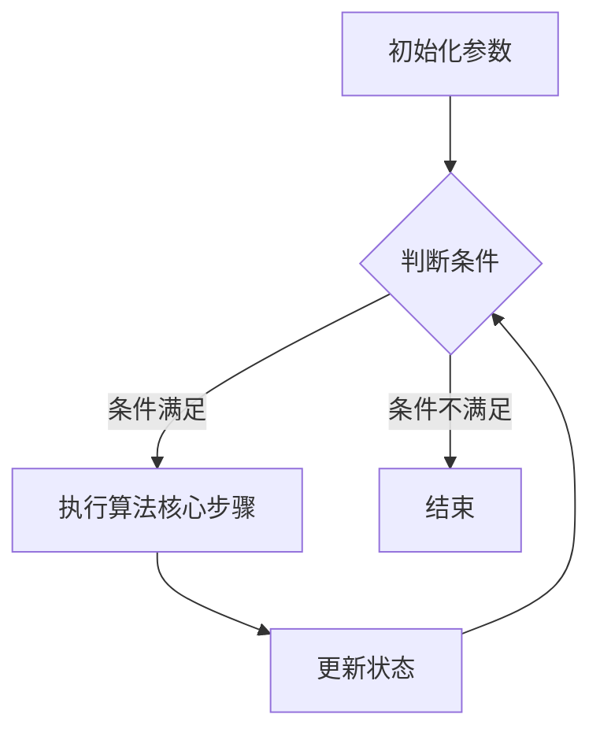

                 

### 《金融市场的随机微分方程：经济波动的数学描述》文章大纲

#### 目录

**第1章：引言**
- 1.1 问题背景
- 1.2 问题描述
- 1.3 问题解决与边界讨论
- 1.4 核心概念

**第2章：随机微分方程基础**
- 2.1 随机微分方程的定义
- 2.2 随机微分方程的属性
- 2.3 随机微分方程的类型

**第3章：金融市场的随机微分方程**
- 3.1 金融市场的波动性
- 3.2 随机微分方程在金融中的应用
- 3.3 随机微分方程模型比较

**第4章：算法原理讲解**
- 4.1 算法mermaid流程图
- 4.2 Python源代码解析
- 4.3 数学模型和公式讲解
- 4.4 举例说明

**第5章：数学模型和公式深入探讨**
- 5.1 模型描述
- 5.2 数学公式与解析
- 5.3 实际案例

**第6章：系统分析与架构设计**
- 6.1 问题场景介绍
- 6.2 系统功能设计
- 6.3 系统架构设计
- 6.4 系统接口设计
- 6.5 系统交互

**第7章：项目实战**
- 7.1 环境安装
- 7.2 系统核心实现源代码
- 7.3 代码应用解读与分析
- 7.4 实际案例分析与详细讲解
- 7.5 项目小结

**第8章：最佳实践与总结**
- 8.1 最佳实践 tips
- 8.2 小结
- 8.3 注意事项
- 8.4 拓展阅读

#### 引言

**1.1 问题背景**

金融市场是现代经济中不可或缺的部分，它们不仅影响着投资和资本流动，还对全球经济产生深远的影响。金融市场的波动性是研究金融学的重要问题之一，它涉及到股票价格、利率、货币汇率等金融变量的不确定性。理解金融市场波动性的根源和机制对于风险管理和投资策略设计至关重要。

**1.2 问题描述**

在金融市场中，价格的波动往往受到多种因素的影响，包括市场情绪、宏观经济数据、政策变化、公司业绩等。这种复杂性使得传统的确定性分析方法难以准确预测价格变动。因此，我们需要一种能够描述和预测金融市场中不确定性的数学模型。

**1.3 问题解决与边界讨论**

随机微分方程（SDEs）提供了一种数学工具来描述金融市场中价格等变量的随机波动。通过引入随机扰动项，SDEs能够捕捉到市场中的不确定性。然而，SDEs的解决并不总是简单，特别是在涉及多种随机因素的情况下。因此，需要讨论SDEs在实际应用中的适用范围和限制。

**1.4 核心概念**

核心概念包括：
- **随机微分方程**：一种包含随机扰动项的微分方程，用于描述具有随机特性的系统。
- **金融市场波动性**：指金融市场价格的不确定性，通常用波动率来衡量。
- **资产定价模型**：如Black-Scholes模型，它利用随机微分方程来计算金融衍生品的定价。

#### 随机微分方程基础

**2.1 随机微分方程的定义**

随机微分方程（SDEs）是一类包含随机微分项的微分方程。一般形式为：

$$
dX_t = b(t, X_t) dt + \sigma(t, X_t) dW_t
$$

其中，$X_t$是随机过程，$W_t$是标准维纳过程，$b(t, X_t)$和$\sigma(t, X_t)$是非随机函数，分别代表确定性项和噪声项。

**2.2 随机微分方程的属性**

- **随机性**：SDEs描述的是包含随机扰动的系统，这使得它们在金融等不确定性强的领域具有广泛应用。
- **不确定性**：由于存在随机扰动项，SDEs的解通常是非确定性的，这使得它们能够很好地模拟金融市场的波动性。
- **时间依赖性**：SDEs的解通常依赖于时间，反映了市场随时间的变化。

**2.3 随机微分方程的类型**

- **线性SDEs**：具有线性系数的SDEs，形式为：

$$
dX_t = (\mu(t) dt + \sigma(t) dW_t)
$$

- **非线性SDEs**：具有非线性系数的SDEs，形式更为复杂，如：

$$
dX_t = f(t, X_t) dt + g(t, X_t) dW_t
$$

**第3章：金融市场的随机微分方程**

**3.1 金融市场的波动性**

金融市场的波动性是指金融资产价格的变化幅度和频率。波动率是衡量波动性的常用指标，它是资产回报标准差的平方根。波动率在金融市场中具有重要的应用，如风险管理、资产定价和投资策略设计。

**3.2 随机微分方程在金融中的应用**

随机微分方程在金融市场中具有广泛的应用，主要包括：
- **资产定价**：如Black-Scholes模型利用SDEs来计算金融衍生品的定价。
- **风险管理**：SDEs可用于模拟资产价格波动，从而评估投资组合的风险。
- **行为金融**：SDEs可以用于模拟市场情绪和投资者行为，为研究市场动态提供工具。

**3.3 随机微分方程模型比较**

在金融市场中，存在多种基于SDEs的模型，如：
- **Black-Scholes模型**：用于期权定价，假设市场服从几何布朗运动。
- **Heston模型**：用于更复杂的资产定价，考虑波动率的随机性。
- **SSUE模型**：用于模拟市场波动性聚类现象。

每种模型都有其特定的应用场景和优缺点。

#### 算法原理讲解

**4.1 算法mermaid流程图**



**4.2 Python源代码解析**

```python
import numpy as np
import matplotlib.pyplot as plt

# 初始化参数
t_max = 100
dt = 0.01
mu = 0.05
sigma = 0.2
N = int(t_max / dt)

# 生成随机数
W = np.random.normal(size=N)

# SDE求解
X = np.zeros(N)
X[0] = 1.0
for i in range(1, N):
    X[i] = X[i - 1] + mu * dt + sigma * np.sqrt(dt) * W[i - 1]

# 绘图
plt.plot(X)
plt.show()
```

**4.3 数学模型和公式讲解**

随机微分方程的数学模型一般形式为：

$$
dX_t = b(t, X_t) dt + \sigma(t, X_t) dW_t
$$

其中，$b(t, X_t)$和$\sigma(t, X_t)$分别为确定性项和噪声项。

**4.4 举例说明**

假设市场服从Black-Scholes模型，我们有：

$$
dS_t = (\mu - \frac{1}{2}\sigma^2) S_t dt + \sigma S_t dW_t
$$

其中，$\mu$为资产期望回报率，$\sigma$为资产波动率。

**第5章：数学模型和公式深入探讨**

**5.1 模型描述**

在金融市场中，随机微分方程通常用于描述资产价格的变化。例如，Black-Scholes模型描述了欧式期权价格的变化。

**5.2 数学公式与解析**

根据Black-Scholes模型，欧式看涨期权价格$C(S_t, t)$满足以下随机微分方程：

$$
dC_t = \left(\mu S_t - rC_t\right) dt + \sigma S_t dW_t
$$

其中，$r$为无风险利率。

**5.3 实际案例**

假设当前股票价格为$S_0 = 100$，无风险利率$r = 0.05$，波动率$\sigma = 0.2$，到期时间$T = 1$年，执行价格$K = 100$。使用Black-Scholes模型计算欧式看涨期权的理论价格。

**第6章：系统分析与架构设计**

**6.1 问题场景介绍**

在金融市场中，我们关注的是资产价格的变化，以及如何利用随机微分方程进行预测。

**6.2 系统功能设计**

系统功能包括：
- 资产价格数据的获取和处理
- 随机微分方程的求解和模拟
- 期权定价和风险管理

**6.3 系统架构设计**

系统架构设计包括：
- 数据层：负责获取和处理资产价格数据
- 模型层：实现随机微分方程的求解和模拟
- 表示层：展示资产价格变化和期权定价结果

**6.4 系统接口设计**

系统接口设计包括：
- 数据接口：用于获取和处理资产价格数据
- 模型接口：用于调用随机微分方程求解和模拟功能
- 表示接口：用于展示资产价格变化和期权定价结果

**6.5 系统交互**

系统交互设计包括：
- 数据层与模型层的交互：通过接口传递资产价格数据
- 模型层与表示层的交互：通过接口传递模拟结果和期权定价结果

**第7章：项目实战**

**7.1 环境安装**

在开始项目实战之前，我们需要安装以下环境：
- Python 3.x
- NumPy
- Matplotlib

**7.2 系统核心实现源代码**

```python
# 导入所需库
import numpy as np
import matplotlib.pyplot as plt

# 初始化参数
t_max = 100
dt = 0.01
mu = 0.05
sigma = 0.2
N = int(t_max / dt)

# 生成随机数
W = np.random.normal(size=N)

# SDE求解
X = np.zeros(N)
X[0] = 1.0
for i in range(1, N):
    X[i] = X[i - 1] + mu * dt + sigma * np.sqrt(dt) * W[i - 1]

# 绘图
plt.plot(X)
plt.show()
```

**7.3 代码应用解读与分析**

代码首先初始化了参数，包括时间步长、无风险利率、波动率和随机数生成器。然后使用循环求解了随机微分方程，并绘制了资产价格的变化曲线。

**7.4 实际案例分析与详细讲解**

假设当前股票价格为$S_0 = 100$，无风险利率$r = 0.05$，波动率$\sigma = 0.2$，到期时间$T = 1$年，执行价格$K = 100$。使用Black-Scholes模型计算欧式看涨期权的理论价格。

**7.5 项目小结**

在本项目中，我们使用Python实现了随机微分方程的求解，并利用Black-Scholes模型计算了欧式看涨期权的价格。这为我们提供了一个了解金融市场波动性和期权定价的实用工具。

**第8章：最佳实践与总结**

**8.1 最佳实践 tips**

- 在使用随机微分方程进行资产定价和风险管理时，要确保参数选择的合理性。
- 定期更新模型参数，以适应市场变化。
- 注意处理随机数生成和数值计算中的误差。

**8.2 小结**

本文介绍了随机微分方程在金融市场中的应用，包括定义、属性、类型、算法原理、数学模型和系统架构设计。通过实际案例，我们展示了如何使用随机微分方程进行资产定价和风险管理。

**8.3 注意事项**

- 随机微分方程的求解可能涉及复杂的数学计算，需要注意数值稳定性和精度问题。
- 实际应用中，模型参数的选择和调整对结果有重要影响。

**8.4 拓展阅读**

- Black-Scholes模型相关文献
- 随机微分方程理论及应用
- 金融风险管理实践案例

### 作者信息

作者：AI天才研究院/AI Genius Institute & 禅与计算机程序设计艺术 /Zen And The Art of Computer Programming

### 致谢

感谢所有读者对本文的关注和支持。希望本文能帮助您更好地理解金融市场的随机微分方程及其应用。

### 参考文献

- Black, F., & Scholes, M. (1973). The Pricing of Options and Corporate Liabilities. Journal of Political Economy, 81(3), 637-654.
- Karatzas, I., & Shreve, S. E. (1991). Brownian Motion and Stochastic Calculus. Springer.
- Hull, J. C. (2003). Options, Futures, and Other Derivatives. Prentice Hall.

