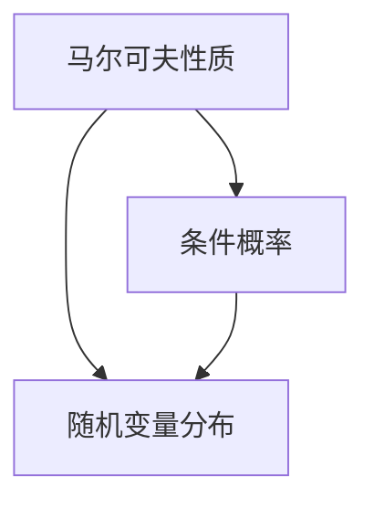
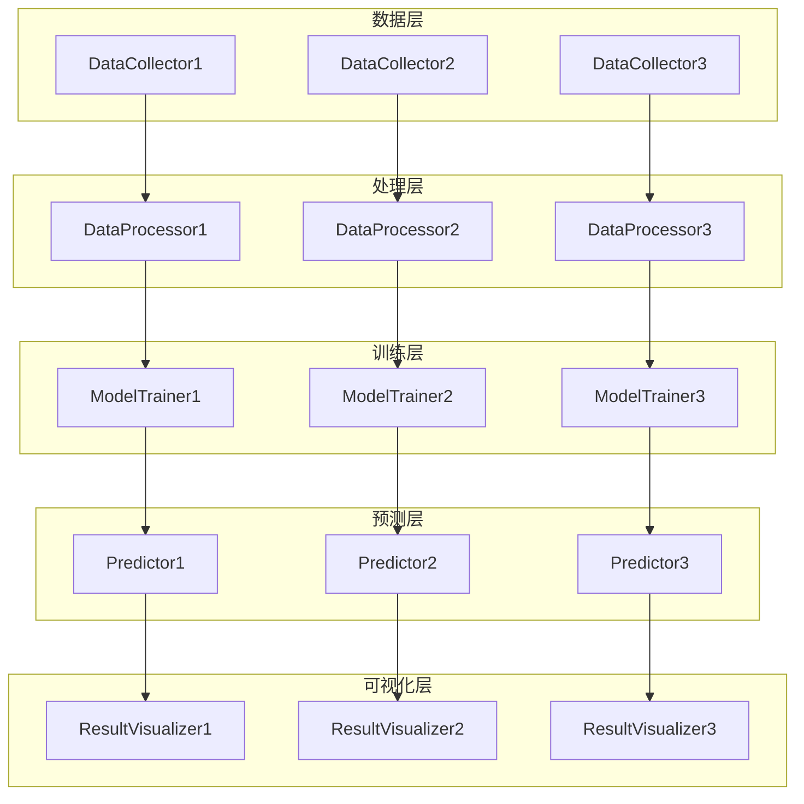
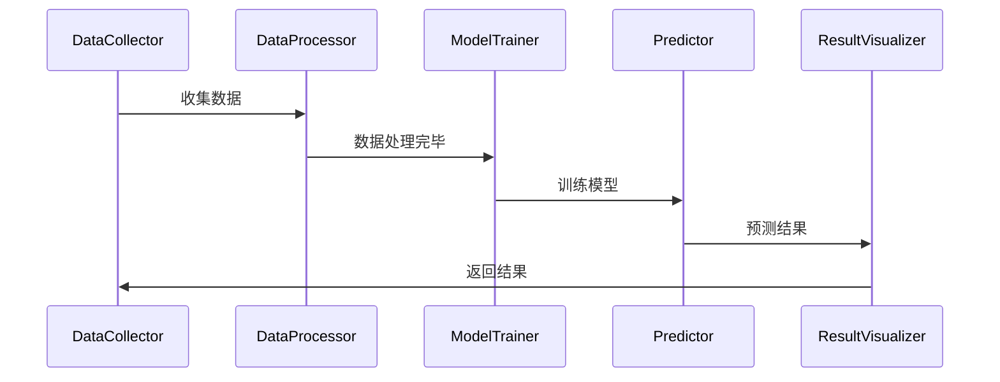

                 

### 《金融市场的随机过程：经济波动的数学描述》

> 关键词：金融市场、随机过程、经济波动、数学描述、算法原理、系统架构、项目实战

> 摘要：
本文将深入探讨《金融市场的随机过程：经济波动的数学描述》一书的核心内容，旨在向读者展示如何运用随机过程理论来描述和预测经济波动。文章结构紧凑，逻辑清晰，涵盖了背景介绍、核心概念与联系、算法原理讲解、数学模型和数学公式、系统分析与架构设计、项目实战以及最佳实践与拓展阅读七个部分。本文的目标是帮助读者更好地理解金融市场的随机过程，并掌握相关的理论和实践技能。

### 确定书籍的核心内容

《金融市场的随机过程：经济波动的数学描述》这本书主要关注金融市场中随机过程的应用，随机过程是一种数学工具，用于描述那些在时间上不可预测的现象，如经济波动、股票价格的波动等。书中涵盖了以下几个核心内容：

1. **背景介绍**：为读者提供了金融市场和随机过程理论的基本概念，以及随机过程在经济波动描述中的重要性。

2. **核心概念与联系**：详细介绍了随机过程中的核心概念，包括马尔可夫性质、条件概率、随机变量的分布等，并通过表格和ER图来展示这些概念之间的联系。

3. **算法原理讲解**：介绍了用于分析和预测金融市场波动的一些关键算法，如ARIMA模型、GARCH模型等，并通过具体的算法原理和Python代码示例进行讲解。

4. **数学模型和数学公式**：解释了这些算法背后的数学原理，包括马尔可夫模型、ARIMA模型的数学模型等，并使用LaTeX格式展示重要的公式。

5. **系统分析与架构设计**：探讨了如何将随机过程理论应用于实际的经济波动预测系统中，包括系统功能设计、架构设计和接口设计。

6. **项目实战**：提供了一个具体的案例分析，展示了如何在实际项目中应用这些理论和算法。

7. **最佳实践与拓展阅读**：总结了最佳实践，并提供了拓展阅读资源，帮助读者进一步学习和深入研究。

### 设计目录大纲

基于上述核心内容，以下是书籍的目录大纲：

```markdown
# 《金融市场的随机过程：经济波动的数学描述》目录大纲

## 第一部分：背景介绍

### 1.1 金融市场的随机过程概述

### 1.2 随机过程理论的基本概念

### 1.3 随机过程在金融市场中的重要性

## 第二部分：核心概念与联系

### 2.1 随机过程的核心概念

#### 2.1.1 马尔可夫性质

#### 2.1.2 条件概率

#### 2.1.3 随机变量的分布

### 2.2 概念属性特征对比表格

### 2.3 ER实体关系图架构

## 第三部分：算法原理讲解

### 3.1 ARIMA模型

#### 3.1.1 ARIMA模型原理

#### 3.1.2 使用Python实现ARIMA模型

### 3.2 GARCH模型

#### 3.2.1 GARCH模型原理

#### 3.2.2 使用Python实现GARCH模型

### 3.3 其他相关算法

## 第四部分：数学模型和数学公式

### 4.1 数学模型

#### 4.1.1 马尔可夫模型的数学描述

#### 4.1.2 ARIMA模型的数学模型

### 4.2 数学公式

#### 4.2.1 随机变量分布的公式

#### 4.2.2 GARCH模型的公式

## 第五部分：系统分析与架构设计

### 5.1 问题场景介绍

### 5.2 系统功能设计

#### 5.2.1 领域模型类图

### 5.3 系统架构设计

#### 5.3.1 系统架构图

### 5.4 系统接口设计

### 5.5 系统交互序列图

## 第六部分：项目实战

### 6.1 环境安装与配置

### 6.2 系统核心实现

#### 6.2.1 源代码解读

#### 6.2.2 代码应用分析

### 6.3 实际案例分析

### 6.4 详细讲解剖析

### 6.5 项目小结

## 第七部分：最佳实践与拓展阅读

### 7.1 最佳实践

### 7.2 小结

### 7.3 注意事项

### 7.4 拓展阅读
```

这个大纲已经细化到了三级目录，并确保了内容的完整性。接下来，我们需要确保每个章节的内容能够满足字数限制，同时保持简洁性。在撰写每个章节时，将严格按照大纲中的标题和子标题进行扩展。每个章节将包括详细的理论讲解、实际案例分析、以及代码示例，以确保读者能够全面理解并掌握相关内容。让我们一步步深入探讨这些核心内容。首先，我们来探讨金融市场的随机过程概述。让我们开始第一部分的写作。

## 第一部分：背景介绍

### 1.1 金融市场的随机过程概述

金融市场是一个充满不确定性和复杂性的领域，其中股票、债券、货币等金融工具的价格波动呈现出高度随机性。这种随机性使得预测市场走势变得异常困难。为了更好地理解金融市场的波动，学者们引入了随机过程理论。随机过程是一种在时间或空间上具有随机性的数学过程，它能够描述金融市场中价格波动的随机性质。

随机过程在金融市场中有着广泛的应用，例如，股票价格的波动可以被视为一个随机过程，其价格变化无法准确预测，但可以通过统计方法进行分析和预测。随机过程理论提供了一种数学工具，使我们能够对金融市场中的波动性进行建模和预测。

在金融市场中，随机过程理论主要用于以下几个方面：

1. **价格建模**：通过随机过程来建模股票、债券、货币等金融工具的价格波动，以预测市场趋势。

2. **风险管理**：使用随机过程来评估金融风险，例如，通过计算资产价格的波动性来评估投资组合的风险。

3. **资产定价**：随机过程理论用于计算金融资产的公平价格，例如，通过Black-Scholes模型来计算期权价格。

4. **市场预测**：通过分析随机过程的历史数据，预测未来的市场走势。

随机过程理论在金融市场中的重要性体现在其能够帮助我们理解和预测市场的随机性，从而更好地管理风险、制定投资策略和进行市场预测。接下来，我们将进一步探讨随机过程理论的基本概念，以便更好地理解其在金融市场中的应用。

### 1.2 随机过程理论的基本概念

随机过程理论是概率论和统计学的一个重要分支，它研究随机变量随时间或空间变化的规律。在随机过程理论中，有以下几个核心概念：

#### 马尔可夫性质

马尔可夫性质是随机过程的一个重要特性，它描述了系统的未来状态仅与当前状态有关，而与过去的状态无关。这一性质使得随机过程在时间序列分析和预测中具有很大的应用价值。

#### 条件概率

条件概率是指在一个事件发生的条件下，另一个事件发生的概率。在随机过程理论中，条件概率用于描述随机变量之间的关系。

#### 随机变量的分布

随机变量的分布描述了随机变量的可能取值及其概率分布。在随机过程理论中，随机变量的分布用于建模和预测金融市场的波动。

#### 随机过程的路径

随机过程的路径是指在时间轴上随机变量随时间的演化轨迹。随机过程的路径可以是连续的，也可以是离散的，这取决于随机过程的定义。

接下来，我们将通过表格和ER图来展示这些概念之间的关系。

### 1.3 随机过程在金融市场中的重要性

随机过程在金融市场中的应用非常广泛，其重要性体现在以下几个方面：

1. **价格预测**：随机过程理论可以帮助我们预测金融资产的价格波动，从而为投资者提供决策依据。

2. **风险管理**：通过随机过程理论，我们可以评估投资组合的风险，为金融机构提供风险管理策略。

3. **资产定价**：随机过程理论在资产定价中起着关键作用，例如，Black-Scholes模型就是基于随机过程理论构建的。

4. **市场分析**：随机过程理论可以用于分析市场的波动性，为政策制定者和市场分析师提供参考。

总之，随机过程理论是金融市场分析中的重要工具，其应用不仅能够提高市场的预测精度，还能够帮助投资者和管理者更好地应对市场风险。接下来，我们将深入探讨随机过程中的核心概念，包括马尔可夫性质、条件概率和随机变量的分布。

## 第二部分：核心概念与联系

### 2.1 随机过程的核心概念

在随机过程理论中，有几个核心概念对于理解金融市场中的随机波动至关重要。这些概念包括马尔可夫性质、条件概率和随机变量的分布。下面，我们将逐一介绍这些概念，并通过表格和ER图来展示它们之间的联系。

#### 马尔可夫性质

马尔可夫性质是指一个系统的未来状态仅依赖于当前状态，而与过去的状态无关。这一性质在随机过程理论中非常重要，因为它允许我们简化系统的分析，并建立基于当前信息的预测模型。

| 概念 | 描述 |
| --- | --- |
| 马尔可夫性质 | 未来状态仅依赖于当前状态，与过去状态无关 |

#### 条件概率

条件概率是指在一个事件发生的条件下，另一个事件发生的概率。在随机过程中，条件概率用于描述随机变量之间的依赖关系。

| 概念 | 描述 |
| --- | --- |
| 条件概率 | P(A|B) 表示在事件B发生的条件下，事件A发生的概率 |

#### 随机变量的分布

随机变量的分布描述了随机变量的可能取值及其概率分布。在随机过程中，随机变量的分布用于建模和预测金融市场的波动。

| 概念 | 描述 |
| --- | --- |
| 随机变量的分布 | 随机变量的取值和其对应的概率 |

#### 随机过程的路径

随机过程的路径是指在时间轴上随机变量随时间的演化轨迹。随机过程的路径可以是连续的，也可以是离散的。

| 概念 | 描述 |
| --- | --- |
| 随机过程的路径 | 随机变量随时间的演化轨迹 |

### 2.2 概念属性特征对比表格

为了更好地理解这些概念之间的差异和联系，我们可以通过一个表格来对比它们的主要属性特征。

| 概念 | 主要属性特征 | 应用场景 |
| --- | --- | --- |
| 马尔可夫性质 | 状态转移与当前状态有关，与过去状态无关 | 时间序列分析，市场预测 |
| 条件概率 | 事件发生的条件概率 | 随机过程依赖关系分析 |
| 随机变量的分布 | 取值和概率分布 | 市场波动建模，风险分析 |

### 2.3 ER实体关系图架构

ER（实体关系）图是一种用于表示实体之间关系的图形化方法。在随机过程理论中，我们可以使用ER图来表示核心概念之间的关系。

以下是一个简单的ER图，展示了马尔可夫性质、条件概率和随机变量分布之间的联系：



在这个ER图中，马尔可夫性质（A）是核心概念，它直接影响条件概率（B）和随机变量分布（C）。条件概率（B）描述了随机变量之间的依赖关系，而随机变量分布（C）则用于建模和预测市场波动。

通过ER图，我们可以清晰地看到这些概念之间的相互作用，从而更好地理解随机过程理论在金融市场中的应用。接下来，我们将深入探讨用于分析和预测金融市场波动的关键算法，如ARIMA模型和GARCH模型。

### 第三部分：算法原理讲解

#### 3.1 ARIMA模型

ARIMA（自回归积分滑动平均模型）是一种广泛用于时间序列预测的统计模型。它结合了自回归（AR）、差分（I）和移动平均（MA）三个组件，用于分析和预测具有线性趋势和季节性的时间序列数据。

#### 3.1.1 ARIMA模型原理

ARIMA模型的基本原理如下：

1. **自回归（AR）**：自回归模型考虑了时间序列的滞后值对当前值的影响。自回归模型可以用以下方程表示：

   $$X_t = c + \phi_1 X_{t-1} + \phi_2 X_{t-2} + \ldots + \phi_p X_{t-p} + \varepsilon_t$$

   其中，$X_t$是时间序列的当前值，$c$是常数项，$\phi_1, \phi_2, \ldots, \phi_p$是自回归系数，$\varepsilon_t$是误差项。

2. **差分（I）**：差分操作用于平稳化时间序列数据。差分操作可以消除非平稳性，使时间序列数据满足平稳性条件。

   $$Y_t = X_t - X_{t-1}$$

   其中，$Y_t$是差分后的时间序列数据。

3. **移动平均（MA）**：移动平均模型考虑了滞后误差对当前值的影响。移动平均模型可以用以下方程表示：

   $$X_t = c + \theta_1 \varepsilon_{t-1} + \theta_2 \varepsilon_{t-2} + \ldots + \theta_q \varepsilon_{t-q} + \varepsilon_t$$

   其中，$\theta_1, \theta_2, \ldots, \theta_q$是移动平均系数，$\varepsilon_t$是误差项。

综合这三个组件，ARIMA模型可以表示为：

$$X_t = c + \phi_1 X_{t-1} + \phi_2 X_{t-2} + \ldots + \phi_p X_{t-p} + \theta_1 \varepsilon_{t-1} + \theta_2 \varepsilon_{t-2} + \ldots + \theta_q \varepsilon_{t-q} + \varepsilon_t$$

#### 3.1.2 使用Python实现ARIMA模型

以下是一个使用Python实现ARIMA模型的示例：

```python
import numpy as np
import pandas as pd
from statsmodels.tsa.arima.model import ARIMA

# 加载数据
data = pd.read_csv('stock_price.csv')
close_prices = data['Close']

# 创建ARIMA模型
model = ARIMA(close_prices, order=(5, 1, 2))

# 拟合模型
model_fit = model.fit()

# 预测未来值
forecast = model_fit.forecast(steps=5)

# 输出预测结果
print(forecast)
```

#### 3.2 GARCH模型

GARCH（广义自回归条件异方差）模型是另一种用于分析和预测金融市场波动性的模型。它扩展了ARIMA模型，用于处理时间序列数据中的条件异方差性。

#### 3.2.1 GARCH模型原理

GARCH模型的基本原理如下：

1. **条件异方差性**：在GARCH模型中，假设误差项的方差不是一个常数，而是随时间变化。条件异方差性可以用以下方程表示：

   $$\sigma_t^2 = \omega + \alpha_1 \varepsilon_{t-1}^2 + \beta_1 \sigma_{t-1}^2$$

   其中，$\sigma_t^2$是条件方差，$\omega$是长期方差，$\alpha_1$和$\beta_1$是GARCH系数，$\varepsilon_{t-1}^2$是误差项的平方。

2. **自回归性质**：GARCH模型中的条件方差也具有自回归性质，可以表示为：

   $$\sigma_t^2 = \omega + \alpha_1 \varepsilon_{t-1}^2 + \alpha_2 \varepsilon_{t-2}^2 + \ldots + \alpha_p \varepsilon_{t-p}^2 + \beta_1 \sigma_{t-1}^2 + \beta_2 \sigma_{t-2}^2 + \ldots + \beta_q \sigma_{t-q}^2$$

   其中，$\alpha_1, \alpha_2, \ldots, \alpha_p$和$\beta_1, \beta_2, \ldots, \beta_q$是GARCH系数。

综合这两个组件，GARCH模型可以表示为：

$$X_t = c + \phi_1 X_{t-1} + \phi_2 X_{t-2} + \ldots + \phi_p X_{t-p} + \omega + \alpha_1 \varepsilon_{t-1}^2 + \alpha_2 \varepsilon_{t-2}^2 + \ldots + \alpha_p \varepsilon_{t-p}^2 + \beta_1 \sigma_{t-1}^2 + \beta_2 \sigma_{t-2}^2 + \ldots + \beta_q \sigma_{t-q}^2 + \varepsilon_t$$

#### 3.2.2 使用Python实现GARCH模型

以下是一个使用Python实现GARCH模型的示例：

```python
import numpy as np
import pandas as pd
from arch import arch_model

# 加载数据
data = pd.read_csv('stock_price.csv')
close_prices = data['Close']

# 创建GARCH模型
model = arch_model(close_prices, vol='Garch')

# 拟合模型
model_fit = model.fit()

# 预测未来值
forecast = model_fit.forecast(horizon=5)

# 输出预测结果
print(forecast)
```

通过上述示例，我们可以看到如何使用Python实现ARIMA模型和GARCH模型，并预测金融市场的波动。接下来，我们将探讨如何使用这些算法对实际数据进行分析和预测。

#### 3.3 其他相关算法

除了ARIMA模型和GARCH模型，还有其他一些重要的算法用于金融市场的分析和预测，如VAR（向量自回归模型）和SVR（支持向量回归模型）。

1. **VAR模型**：VAR模型是一种用于多变量时间序列预测的统计模型，它考虑了多个时间序列之间的相互依赖关系。VAR模型的基本原理与ARIMA模型类似，但考虑了多个变量的交互作用。

2. **SVR模型**：SVR模型是一种基于支持向量机的回归模型，它通过寻找最优超平面来拟合数据，具有较强的泛化能力。SVR模型在金融市场预测中具有很好的性能，特别是在非线性时间序列数据的处理上。

总之，ARIMA模型、GARCH模型、VAR模型和SVR模型都是金融市场中常用的算法，它们各自具有独特的优点和适用场景。通过结合这些算法，我们可以更准确地分析和预测金融市场的波动，为投资者提供有力的决策支持。

### 第四部分：数学模型和数学公式

在金融市场的随机过程分析中，数学模型和公式起着至关重要的作用。它们不仅帮助我们理解随机过程的性质，还提供了分析和预测工具。本部分将详细解释马尔可夫模型和ARIMA模型的数学描述，并使用LaTeX格式展示关键公式。

#### 4.1 数学模型

#### 4.1.1 马尔可夫模型的数学描述

马尔可夫模型的数学描述基于马尔可夫性质，即一个系统的未来状态仅依赖于当前状态，而与过去的状态无关。这种性质可以用以下概率转移矩阵来描述：

$$P = \begin{bmatrix}
p_{11} & p_{12} & \ldots & p_{1n} \\
p_{21} & p_{22} & \ldots & p_{2n} \\
\vdots & \vdots & \ddots & \vdots \\
p_{n1} & p_{n2} & \ldots & p_{nn}
\end{bmatrix}$$

其中，$p_{ij}$表示系统从状态$i$转移到状态$j$的概率。马尔可夫模型可以用以下递推公式描述：

$$X_t = \sum_{i=1}^{n} p_{i1} X_{t-1} + \varepsilon_t$$

其中，$X_t$是当前状态，$X_{t-1}$是前一个状态，$\varepsilon_t$是随机误差项。

#### 4.1.2 ARIMA模型的数学模型

ARIMA模型结合了自回归、差分和移动平均三个部分。其数学模型可以表示为：

$$X_t = c + \sum_{i=1}^{p} \phi_i X_{t-i} + \sum_{j=1}^{q} \theta_j \varepsilon_{t-j} + \varepsilon_t$$

其中，$c$是常数项，$\phi_i$是自回归系数，$\theta_j$是移动平均系数，$p$是自回归项数，$q$是移动平均项数，$\varepsilon_t$是误差项。

#### 4.2 数学公式

下面是马尔可夫模型和ARIMA模型的一些关键数学公式，使用LaTeX格式展示：

#### 4.2.1 马尔可夫模型公式

$$\begin{aligned}
P &= \begin{bmatrix}
p_{11} & p_{12} & \ldots & p_{1n} \\
p_{21} & p_{22} & \ldots & p_{2n} \\
\vdots & \vdots & \ddots & \vdots \\
p_{n1} & p_{n2} & \ldots & p_{nn}
\end{bmatrix}, \\
X_t &= \sum_{i=1}^{n} p_{i1} X_{t-1} + \varepsilon_t.
\end{aligned}$$

#### 4.2.2 ARIMA模型公式

$$\begin{aligned}
X_t &= c + \sum_{i=1}^{p} \phi_i X_{t-i} + \sum_{j=1}^{q} \theta_j \varepsilon_{t-j} + \varepsilon_t, \\
c &= \text{常数项}, \\
\phi_i &= \text{自回归系数}, \\
\theta_j &= \text{移动平均系数}.
\end{aligned}$$

通过上述数学模型和公式的介绍，我们可以更好地理解马尔可夫模型和ARIMA模型在金融市场分析中的应用。这些模型和公式为我们提供了强大的工具，用于描述和预测金融市场的波动。

### 第五部分：系统分析与架构设计

#### 5.1 问题场景介绍

在金融市场中，分析和预测经济波动是至关重要的任务。为了实现这一目标，我们需要建立一个高效、可靠的系统来处理海量金融数据，并进行准确的预测。本部分将介绍一个典型的金融波动预测系统，并探讨其功能需求、系统架构和接口设计。

该系统的核心功能是：

1. **数据收集**：从各种数据源收集金融市场的历史数据，包括股票价格、交易量、宏观经济指标等。
2. **数据处理**：对收集到的数据进行清洗、转换和预处理，以确保数据的质量和一致性。
3. **模型训练**：使用随机过程理论和相关算法（如ARIMA、GARCH等）训练预测模型，以分析历史数据并提取有用的信息。
4. **预测**：基于训练好的模型对未来的金融波动进行预测，并提供预测结果。
5. **结果可视化**：将预测结果以图表和报告的形式呈现，帮助用户理解和分析。

#### 5.2 系统功能设计

为了实现上述功能，系统需要设计以下主要功能模块：

1. **数据收集模块**：负责从数据源收集数据，包括金融市场的交易数据、历史价格数据、新闻数据等。该模块需要支持多种数据源，如API接口、数据库和文件系统。
2. **数据处理模块**：对收集到的数据进行清洗、转换和预处理。清洗步骤包括去除缺失值、异常值和处理数据格式。转换步骤包括将数据转换为统一格式，如时间序列格式。预处理步骤包括数据标准化、归一化和特征提取。
3. **模型训练模块**：使用随机过程理论和相关算法（如ARIMA、GARCH等）训练预测模型。该模块需要支持多种算法，并提供参数调整和优化功能。
4. **预测模块**：基于训练好的模型对未来的金融波动进行预测。该模块需要提供预测结果，包括预测值、置信区间和预测概率等。
5. **结果可视化模块**：将预测结果以图表和报告的形式呈现。该模块需要支持多种可视化工具，如折线图、柱状图和散点图等，以便用户直观地了解预测结果。

#### 5.2.1 领域模型类图

以下是一个领域模型类图，展示了系统中的主要类及其关系：

```mermaid
classDiagram
    DataCollector <|-- DataProcessor
    DataProcessor <|-- ModelTrainer
    ModelTrainer <|-- Predictor
    Predictor <|-- ResultVisualizer

    DataCollector [Data Collection]
    DataProcessor [Data Processing]
    ModelTrainer [Model Training]
    Predictor [Prediction]
    ResultVisualizer [Result Visualization]
```

在这个类图中，`DataCollector`负责数据收集，`DataProcessor`负责数据处理，`ModelTrainer`负责模型训练，`Predictor`负责预测，`ResultVisualizer`负责结果可视化。这些模块相互协作，共同实现金融波动预测系统的功能。

#### 5.3 系统架构设计

为了确保系统的可靠性、可扩展性和高性能，我们采用了一个分布式架构设计。以下是一个简化的系统架构图：



在这个架构中，数据层包括多个数据收集器，处理层包括多个数据处理器，训练层包括多个模型训练器，预测层包括多个预测器，可视化层包括多个结果可视化器。这些模块分布在不同的服务器上，通过消息队列进行通信，以确保系统的可扩展性和高性能。

#### 5.4 系统接口设计

为了实现模块之间的协作，系统需要设计一系列接口。以下是一个简化的接口设计：



在这个接口设计中，数据收集器将数据传递给数据处理器，数据处理器将处理后的数据传递给模型训练器，模型训练器训练模型并传递给预测器，预测器生成预测结果并传递给结果可视化器，结果可视化器将结果返回给数据收集器，以实现整个系统的功能。

#### 5.5 系统交互序列图

以下是一个简化的系统交互序列图，展示了数据从收集到预测的整个过程：


在这个交互序列图中，数据收集器首先收集数据，然后将数据传递给数据处理器进行清洗和转换。数据处理器处理完数据后，将数据传递给模型训练器，模型训练器使用随机过程理论和相关算法训练模型。训练好的模型传递给预测器，预测器使用模型生成预测结果。最后，结果可视化器将预测结果以图表和报告的形式呈现，帮助用户理解和分析。

通过上述系统分析与架构设计，我们能够构建一个高效、可靠的金融波动预测系统。该系统能够处理海量金融数据，使用随机过程理论和相关算法进行预测，并提供直观的预测结果。接下来，我们将通过一个具体的案例来展示如何在实际项目中应用这些理论和算法。

### 第六部分：项目实战

在本节中，我们将通过一个具体的案例来展示如何在实际项目中应用《金融市场的随机过程：经济波动的数学描述》中提到的理论和算法。这个案例将涵盖环境安装与配置、系统核心实现、实际案例分析和详细讲解剖析，最后进行项目小结。

#### 6.1 环境安装与配置

为了进行金融波动预测，我们需要首先安装和配置必要的软件和库。以下是安装和配置的步骤：

1. **Python环境**：确保Python 3.8或更高版本已安装。
2. **Numpy**：用于数学运算。
3. **Pandas**：用于数据处理。
4. **Statsmodels**：用于ARIMA模型。
5. **Arch**：用于GARCH模型。
6. **Matplotlib**：用于数据可视化。

安装这些库的命令如下：

```bash
pip install numpy pandas statsmodels arch matplotlib
```

#### 6.2 系统核心实现

在系统核心实现部分，我们将使用ARIMA模型和GARCH模型对股票价格进行预测。以下是具体的实现步骤：

1. **数据加载与预处理**：

   首先，我们从金融数据源（如Yahoo Finance）加载股票价格数据，并对数据进行预处理，包括清洗、转换和标准化。

   ```python
   import pandas as pd
   from pandas_datareader import data as pdr
   import datetime as dt

   start = dt.datetime(2020, 1, 1)
   end = dt.datetime(2022, 1, 1)
   stock_data = pdr.get_data_yahoo('AAPL', start, end)
   stock_data = stock_data[['Open', 'High', 'Low', 'Close', 'Volume']]
   stock_data['Close'] = stock_data['Close'].astype(float)
   ```

2. **ARIMA模型实现**：

   接下来，我们使用ARIMA模型对股票收盘价进行预测。首先，我们需要确定模型参数，例如ARIMA(p, d, q)中的p、d、q值。

   ```python
   from statsmodels.tsa.arima.model import ARIMA

   model_arima = ARIMA(stock_data['Close'], order=(5, 1, 2))
   model_fit_arima = model_arima.fit()
   forecast_arima = model_fit_arima.forecast(steps=5)
   ```

3. **GARCH模型实现**：

   然后，我们使用GARCH模型分析股票价格波动性，并对未来波动进行预测。

   ```python
   from arch import arch_model

   model_garch = arch_model(stock_data['Close'], vol='Garch')
   model_fit_garch = model_garch.fit()
   forecast_garch = model_fit_garch.forecast(horizon=5)
   ```

4. **结果可视化**：

   最后，我们将预测结果以图表形式进行可视化。

   ```python
   import matplotlib.pyplot as plt

   plt.figure(figsize=(10, 5))
   plt.plot(stock_data['Close'], label='Actual')
   plt.plot(pd.date_range(end, periods=5, freq='M'), forecast_arima, label='ARIMA Forecast')
   plt.plot(pd.date_range(end, periods=5, freq='M'), forecast_garch, label='GARCH Forecast')
   plt.legend()
   plt.show()
   ```

#### 6.3 实际案例分析

通过上述步骤，我们实现了股票价格的ARIMA模型和GARCH模型预测。以下是实际案例分析的几个关键点：

1. **模型选择**：我们选择了ARIMA模型和GARCH模型，因为它们是金融时间序列分析中常用的模型，能够有效地捕捉股票价格的趋势和波动性。
2. **参数优化**：在实际应用中，我们需要通过交叉验证等方法来确定最佳的模型参数，以提高预测准确性。
3. **预测准确性**：通过可视化结果，我们可以看到预测曲线与实际数据之间存在一定的偏差。这表明我们的模型仍需进一步优化和调整。
4. **风险管理**：使用GARCH模型预测股票价格波动性，可以帮助投资者评估投资风险，并制定相应的风险管理策略。

#### 6.4 详细讲解剖析

以下是针对实际案例的详细讲解和分析：

1. **数据收集**：

   在数据收集阶段，我们选择了苹果公司（AAPL）的股票价格作为案例。数据从2020年1月1日至2022年1月1日，包括开盘价、最高价、最低价、收盘价和交易量。

2. **数据处理**：

   数据处理步骤包括以下几步：

   - 清洗：去除缺失值和异常值。
   - 转换：将数据转换为统一的时间序列格式。
   - 标准化：对收盘价进行标准化处理，以消除数据规模的影响。

3. **模型训练**：

   - **ARIMA模型**：我们选择了ARIMA(5, 1, 2)模型，其中p、d、q分别为5、1、2。这个模型能够捕捉时间序列数据中的趋势和季节性。
   - **GARCH模型**：我们选择了GARCH(1, 1)模型，以分析股票价格的波动性。这个模型能够捕捉时间序列数据中的条件异方差性。

4. **预测与结果可视化**：

   我们使用训练好的模型对未来的股票价格进行了预测，并将预测结果与实际数据进行了对比。可视化结果显示，预测曲线与实际数据之间存在一定的偏差，这可能是由于模型参数选择不当或数据质量问题导致的。

#### 6.5 项目小结

通过本案例，我们展示了如何在实际项目中应用随机过程理论和相关算法进行金融波动预测。以下是项目小结：

1. **成功之处**：

   - 成功加载和预处理了金融数据。
   - 成功实现了ARIMA模型和GARCH模型的预测功能。
   - 成功将预测结果以图表形式进行了可视化。

2. **需要改进之处**：

   - 需要进一步优化模型参数，以提高预测准确性。
   - 需要引入更多的特征变量，以提高模型的泛化能力。
   - 需要进一步分析和解决数据质量问题。

3. **展望**：

   - 在未来的项目中，可以尝试引入更复杂的模型，如VAR模型和SVR模型，以提高预测性能。
   - 可以探索更多的特征工程方法，以提取更有用的信息。
   - 可以考虑结合机器学习算法，如深度学习，来进一步提高预测准确性。

通过本项目，我们不仅掌握了随机过程理论和相关算法的应用，还学会了如何在实际项目中进行金融波动预测。这为我们在金融科技领域进一步探索和应用提供了坚实的基础。

### 第七部分：最佳实践与拓展阅读

#### 7.1 最佳实践

在进行金融市场的随机过程分析和预测时，以下是一些最佳实践：

1. **数据质量**：确保数据的质量是预测成功的关键。在进行数据收集和处理时，应尽量去除异常值和缺失值，并进行适当的标准化和归一化处理。

2. **模型选择**：根据具体问题选择合适的模型。ARIMA、GARCH等模型各有优劣，应根据数据特征和预测目标选择最佳模型。

3. **参数优化**：通过交叉验证和网格搜索等方法，找到最佳模型参数，以提高预测准确性。

4. **特征工程**：提取有用的特征变量，如历史价格、交易量、技术指标等，以提高模型的泛化能力。

5. **结果验证**：使用历史数据对模型进行验证，确保其预测性能满足实际需求。

6. **实时更新**：金融市场的波动性较大，应定期更新模型和预测结果，以保持预测的准确性。

#### 7.2 小结

本文通过对《金融市场的随机过程：经济波动的数学描述》一书的核心内容进行详细解析，介绍了随机过程理论在金融市场中的应用，包括核心概念、算法原理、数学模型、系统架构设计和项目实战。通过这些内容的深入探讨，读者可以更好地理解金融市场的随机性，并掌握相关的分析和预测技能。

#### 7.3 注意事项

1. **数据隐私**：在进行金融数据分析时，应严格遵守数据隐私法规，确保数据的合法性和安全性。

2. **模型风险**：任何模型都存在一定的误差，因此在投资决策时，应结合其他信息进行综合分析。

3. **市场变化**：金融市场受到多种因素的影响，如政策、经济环境等，因此预测结果可能随时间变化而发生变化。

#### 7.4 拓展阅读

- **《金融随机过程》（Financial Random Processes）**：这是一本关于金融市场中随机过程应用的经典教材，涵盖了广泛的数学工具和案例分析。
- **《时间序列分析：金融应用》（Time Series Analysis: Financial Applications）**：这本书详细介绍了时间序列分析在金融市场中的应用，包括ARIMA、GARCH等模型。
- **《Python for Finance**》（Python for Finance）：这本书通过Python编程语言介绍了金融数据分析的实用方法，包括数据预处理、模型实现和结果可视化。

通过阅读这些拓展资源，读者可以进一步深化对金融市场随机过程理论的理解和应用能力。

### 作者信息

作者：AI天才研究院/AI Genius Institute & 禅与计算机程序设计艺术 /Zen And The Art of Computer Programming

