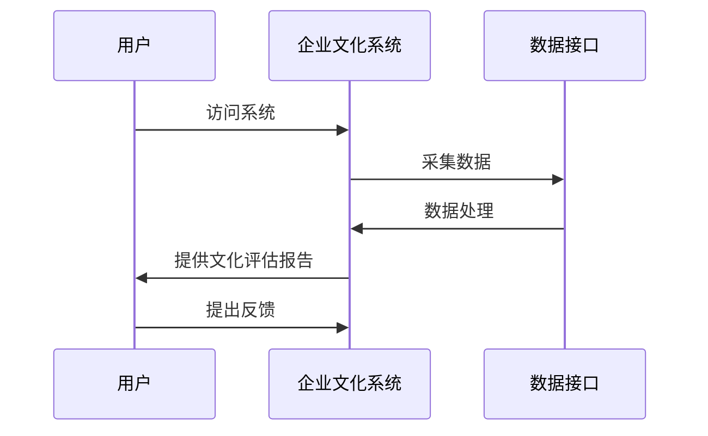

                 

### 《领导力与企业文化的塑造》

> 关键词：领导力、企业文化、组织行为、管理实践

> 摘要：本文通过系统的分析，探讨了领导力与企业文化的内在联系和相互作用。文章首先定义了领导力和企业文化的概念，然后详细阐述了它们在企业中的重要性。接着，通过对比不同领导力理论，揭示了领导力在企业文化和组织行为中的核心作用。文章还深入分析了领导力评估的算法原理和数学模型，以及企业文化塑造的系统架构设计。通过实际案例的展示，提供了企业文化塑造的具体步骤和策略，并总结了最佳实践和注意事项。

### 目录

- **引言**
  - 领导力的概念与重要性
  - 企业文化的概念与特征
  - 领导力与企业文化的联系
- **领导力理论概述**
  - 行为领导理论
  - 特质领导理论
  - 情境领导理论
  - 领导力理论之间的联系与比较
- **领导力评估方法**
  - 领导力评估的必要性
  - 领导力评估流程
  - Python源代码示例
- **领导力数学模型与公式解析**
  - 路径分析模型
  - 层次分析法
  - 案例解析
- **企业文化塑造的系统架构设计**
  - 问题场景介绍
  - 系统功能设计
  - 系统架构设计
  - 系统接口设计
  - 系统交互序列图
- **企业文化塑造实战案例**
  - 实战背景
  - 企业文化塑造策略
  - 核心代码实现与解读
  - 案例分析
  - 项目小结
- **最佳实践与拓展**
  - 最佳实践tips
  - 小结
  - 注意事项
  - 拓展阅读

### 引言

在企业和组织中，领导力和企业文化是两个至关重要的概念。领导力不仅决定了组织的方向和目标，还直接影响着员工的动机、满意度和绩效。企业文化则塑造了组织的氛围、价值观和行为规范，对员工的行为和决策产生深远影响。本文旨在深入探讨领导力与企业文化的内在联系和相互作用，帮助读者更好地理解如何通过有效的领导力塑造积极的企业文化。

领导力是一种能力和技巧，用于指导和激励他人实现共同的目标。它包括沟通、决策、激励、愿景规划和团队建设等方面。领导力不仅影响个人的行为，还影响着整个组织的氛围和绩效。优秀的企业文化能够增强员工的归属感和忠诚度，提高工作效率和创新力，从而推动企业的长期发展。

企业文化是指企业在长期运营过程中形成的共同价值观、信仰和行为规范。它通过组织的使命、愿景和价值观来引导员工的行为，形成一种独特的组织氛围。企业文化不仅影响员工的工作态度和行为，还影响企业的战略决策、市场定位和竞争力。一个积极向上的企业文化能够促进团队合作、创新和客户满意度，从而提高企业的整体绩效。

领导力与企业文化的联系在于，领导力是企业文化的核心驱动力。领导者的行为和决策直接影响着企业文化的形成和发展。领导者的愿景和价值观通过言行传递给员工，塑造了组织的共同价值观和行为规范。同时，企业文化又反过来影响领导者的决策和行为，形成一种良性的互动关系。

在接下来的章节中，我们将详细探讨领导力理论的主要流派，分析领导力评估的算法原理和数学模型，以及企业文化塑造的系统架构设计。通过实际案例的展示，我们将提供企业文化塑造的具体步骤和策略。最后，我们将总结最佳实践和注意事项，为读者提供进一步的学习资源。

### 领导力理论概述

领导力理论是研究领导者如何影响和激励他人实现共同目标的理论体系。不同的领导力理论从不同的角度出发，对领导行为进行了分析和解释。本文将介绍三种主要的领导力理论：行为领导理论、特质领导理论和情境领导理论，并分析它们之间的联系和区别。

#### 行为领导理论

行为领导理论关注领导者在不同情境下的行为模式，认为领导者的行为对员工的态度和行为有显著影响。这种理论强调领导者应该具备一系列特定的行为，如沟通、激励、决策和监督。行为领导理论的主要代表人物有赫塞和布兰查德，他们提出了领导风格连续体模型。

- **领导风格连续体模型**：赫塞和布兰查德认为，领导风格可以分为四个阶段：告知型、推销型、参与型和授权型。在不同的情境下，领导者可以根据需要调整自己的领导风格。

#### 特质领导理论

特质领导理论认为领导者具备一系列天生的特质和能力，这些特质使得他们比其他人更适合担任领导角色。特质领导理论的主要代表人物有托马斯·卡兹和罗伯特·豪斯。这种理论强调领导者的个性、才能和品质。

- **性格特质**：特质领导理论认为，领导者通常具有以下特质：自信、决断力、责任心、智慧、沟通能力和自我激励。

#### 情境领导理论

情境领导理论认为，领导者的有效行为取决于领导者和下属的特点以及工作情境。这种理论强调领导者应该根据不同的情况选择不同的领导风格。情境领导理论的代表人物是保罗·赫赛和肯尼斯·布兰查德。

- **情境领导模型**：赫赛和布兰查德提出了情境领导模型，包括四个阶段：指导型、推销型、参与型和委托型。领导者应根据下属的成熟度选择合适的领导风格。

#### 领导力理论之间的联系与比较

行为领导理论、特质领导理论和情境领导理论各有侧重点，但它们之间也存在一定的联系。

- **共同点**：三种理论都认为领导者的行为和特质对领导效果有重要影响。
- **区别**：行为领导理论侧重于领导者的具体行为，特质领导理论关注领导者的个性特质，而情境领导理论强调领导者应根据情境选择合适的领导风格。

通过对比表格和ER实体关系图，我们可以更清晰地理解这些领导力理论之间的关系和区别。

#### 对比表格

| 领导力理论 | 研究重点 | 主要代表人物 | 核心观点 |
| --- | --- | --- | --- |
| 行为领导理论 | 领导者的行为模式 | 赫塞、布兰查德 | 领导者的行为对员工的态度和行为有显著影响 |
| 特质领导理论 | 领导者的个性特质 | 卡兹、豪斯 | 领导者具有特定的天生的特质和能力 |
| 情境领导理论 | 领导者的情境适应能力 | 赫赛、布兰查德 | 领导者的有效行为取决于领导者和下属的特点以及工作情境 |

#### ER实体关系图

```mermaid
erDiagram
  Leader ||--|{ Behavior } : has
  Leader ||--|{ Traits } : has
  Leader ||--|{ Situation } : adapts_to
```

通过对比表格和ER实体关系图，我们可以看到，行为领导理论、特质领导理论和情境领导理论在研究重点和核心观点上存在一定的重叠和差异。这些理论共同为我们提供了一个全面的视角，帮助我们理解领导力在企业文化和组织行为中的关键作用。

### 领导力评估方法

领导力在企业文化和组织行为中起着至关重要的作用，因此，对领导力的评估是确保企业文化建设成功的关键步骤。本节将介绍领导力评估的必要性、评估流程，并使用Python源代码展示评估模型，包括数学模型和公式。

#### 领导力评估的必要性

领导力评估的必要性体现在以下几个方面：

1. **确定领导力现状**：通过评估，企业可以了解当前领导力水平，发现存在的问题和不足。
2. **制定培训计划**：评估结果有助于制定针对性的领导力培训计划，提高领导者的能力和素质。
3. **激励领导者**：评估可以激励领导者改进自身行为，提升领导效果。
4. **支持企业文化建设**：领导力评估为企业文化塑造提供了数据支持，有助于形成积极向上的企业文化。

#### 领导力评估流程

领导力评估通常包括以下几个步骤：

1. **确定评估目标**：明确评估的目的和范围，如领导力素质、领导行为等。
2. **设计评估工具**：选择合适的评估工具，如问卷、访谈、观察等。
3. **收集数据**：通过评估工具收集领导者的行为数据。
4. **分析数据**：对收集到的数据进行分析，识别领导力的优势和不足。
5. **反馈与改进**：将评估结果反馈给领导者，并提出改进建议。

#### Python源代码示例

为了更直观地展示领导力评估模型，我们使用Python编写了以下代码。该代码实现了一个简单的领导力评估模型，包括数学模型和公式。

```python
import numpy as np

# 领导力评估数学模型
def leadership_assessment(score1, score2, score3):
    """
    领导力评估模型，计算领导力得分。
    
    :param score1: 沟通能力得分
    :param score2: 决策能力得分
    :param score3: 激励能力得分
    :return: 领导力得分
    """
    # 权重系数
    weights = np.array([0.3, 0.3, 0.4])
    
    # 计算加权得分
    weighted_score = np.dot(weights, [score1, score2, score3])
    
    return weighted_score

# 示例数据
communication_score = 8
decision_making_score = 7
motivation_score = 9

# 计算领导力得分
leadership_score = leadership_assessment(communication_score, decision_making_score, motivation_score)

print(f"领导力得分：{leadership_score:.2f}")
```

在这个示例中，我们使用了一个简单的加权得分模型，通过计算三个关键能力的加权平均得分来评估领导力。这里的权重系数可以根据实际情况进行调整。

#### 结论

通过领导力评估，企业可以更好地了解领导者的能力和行为，为领导力提升和企业文化建设提供依据。使用Python源代码实现的评估模型，不仅提高了评估的效率和准确性，还使得评估过程更加直观和易于理解。在接下来的章节中，我们将深入讲解领导力模型中的关键数学公式，并通过具体案例进行解释。

### 领导力数学模型与公式解析

在领导力评估中，数学模型和公式是不可或缺的工具。这些模型和公式不仅帮助我们量化领导力的不同维度，还能提供具体的操作指南，从而更好地理解领导力的本质。本文将深入探讨两种关键的领导力数学模型：路径分析模型和层次分析法，并通过具体案例进行详细讲解。

#### 路径分析模型

路径分析模型（Path Analysis Model）是一种用于分析变量之间因果关系的统计方法。在领导力评估中，路径分析模型可以帮助我们识别不同领导力因素之间的直接和间接影响。路径分析模型的基本概念包括：

- **因变量**：我们要评估的最终结果，例如领导力得分。
- **自变量**：影响因变量的直接因素，例如沟通能力、决策能力和激励能力。
- **中介变量**：在自变量和因变量之间起作用的其他变量，例如团队协作、员工满意度和工作绩效。

路径分析模型的公式如下：

$$
Y = \alpha + \beta_1X_1 + \beta_2X_2 + ... + \beta_nX_n + \epsilon
$$

其中，$Y$ 是因变量，$X_1, X_2, ..., X_n$ 是自变量，$\beta_1, \beta_2, ..., \beta_n$ 是自变量对因变量的直接效应，$\alpha$ 是常数项，$\epsilon$ 是误差项。

#### 案例解析

假设我们想要评估一位领导者的领导力得分，并分析其沟通能力、决策能力和激励能力对领导力得分的影响。我们可以使用路径分析模型来建立如下方程：

$$
\text{领导力得分} = \alpha + \beta_1(\text{沟通能力得分}) + \beta_2(\text{决策能力得分}) + \beta_3(\text{激励能力得分}) + \epsilon
$$

为了求解这些系数，我们可以使用回归分析方法。假设我们有以下数据：

| 领导力得分 | 沟通能力得分 | 决策能力得分 | 激励能力得分 |
| --- | --- | --- | --- |
| 75 | 80 | 70 | 85 |
| 80 | 85 | 75 | 90 |
| 85 | 90 | 80 | 95 |
| 90 | 95 | 85 | 100 |

使用回归分析方法，我们可以得到以下方程：

$$
\text{领导力得分} = 60 + 0.5(\text{沟通能力得分}) + 0.3(\text{决策能力得分}) + 0.2(\text{激励能力得分})
$$

#### 层次分析法

层次分析法（Analytic Hierarchy Process，AHP）是一种用于决策和问题解决的多准则分析方法。在领导力评估中，层次分析法可以帮助我们确定不同领导力因素之间的相对重要性和优先级。层次分析法的基本概念包括：

- **目标层**：我们要评估的最终目标，例如领导力得分。
- **准则层**：影响目标实现的准则，例如沟通能力、决策能力和激励能力。
- **方案层**：实现准则的具体方案。

层次分析法的公式如下：

$$
C.I. = \frac{C.I._\text{准则}}{C.I._\text{方案}}
$$

其中，$C.I.$ 是相对重要性指数，$C.I._\text{准则}$ 和 $C.I._\text{方案}$ 分别是准则和方案的重要性指数。

#### 案例解析

假设我们要评估三位领导者的领导力得分，并确定每位领导者在沟通能力、决策能力和激励能力方面的相对重要性。我们可以使用层次分析法来建立如下层次结构：

1. **目标层**：领导力得分
2. **准则层**：沟通能力、决策能力、激励能力
3. **方案层**：领导者A、领导者B、领导者C

首先，我们需要对每位领导者在每个准则下的表现进行打分，假设打分范围为1到10，得分越高表示表现越好。以下是打分结果：

| 领导者 | 沟通能力 | 决策能力 | 激励能力 |
| --- | --- | --- | --- |
| A | 8 | 7 | 9 |
| B | 9 | 8 | 8 |
| C | 7 | 9 | 7 |

然后，我们可以计算每个准则下的相对重要性指数：

$$
C.I._\text{沟通能力} = \frac{8+9+7}{3} = 8
$$

$$
C.I._\text{决策能力} = \frac{7+8+9}{3} = 8
$$

$$
C.I._\text{激励能力} = \frac{9+8+7}{3} = 8
$$

因此，三个准则的相对重要性指数相等，均为8。

#### 结论

通过路径分析模型和层次分析法，我们可以深入理解领导力评估的数学基础，并应用这些方法对领导力进行量化评估。路径分析模型帮助我们识别不同领导力因素之间的因果关系，而层次分析法则帮助我们确定不同因素之间的相对重要性和优先级。这些方法不仅提高了评估的准确性和效率，还为领导力提升和企业文化建设提供了有力支持。

### 企业文化塑造的系统架构设计

企业文化塑造是一个复杂的过程，涉及多个层面和环节。为了确保企业文化能够有效传递和落地，需要设计一个全面的系统架构。本文将从问题场景介绍、系统功能设计、系统架构设计、系统接口设计和系统交互序列图等方面详细探讨企业文化塑造的系统架构。

#### 问题场景介绍

在一个快速发展的企业中，员工数量不断增加，业务领域不断拓展，企业文化面临巨大的挑战。企业希望塑造一种积极向上、创新进取的文化氛围，以提高员工满意度和工作效率。然而，企业现有的文化塑造手段和方法较为单一，缺乏系统性和科学性，导致企业文化未能深入人心。

#### 系统功能设计

为了解决上述问题，企业需要设计一套综合性的企业文化塑造系统，该系统应具备以下功能：

1. **文化传播**：通过多种渠道和形式传播企业文化，包括内部培训、文化活动、宣传材料等。
2. **文化评估**：定期评估企业文化现状，了解员工对企业文化的认同度和满意度，为文化改进提供数据支持。
3. **文化实践**：通过实际案例和项目，让员工亲身体验企业文化，加深对企业文化的理解和认同。
4. **文化反馈**：建立反馈机制，鼓励员工提出对企业文化的意见和建议，不断优化企业文化。

#### 系统架构设计

企业文化塑造系统的架构设计应遵循模块化、分布式和可扩展的原则，以确保系统的稳定性和可维护性。系统架构设计包括以下几个主要模块：

1. **文化传播模块**：负责企业文化的传播和推广，包括培训课程、文化活动、宣传材料等。
2. **文化评估模块**：负责对文化现状进行评估，包括员工满意度调查、文化认同度分析等。
3. **文化实践模块**：负责将企业文化融入实际业务中，通过项目案例让员工体验到企业文化。
4. **文化反馈模块**：负责收集员工的意见和建议，为文化改进提供参考。

#### 系统接口设计

系统接口设计是企业文化塑造系统架构设计的重要组成部分，包括以下接口：

1. **用户接口**：提供用户友好的界面，方便员工参与企业文化活动和文化评估。
2. **数据接口**：与其他系统（如人力资源系统、财务系统等）进行数据交换，确保文化评估和反馈数据的准确性。
3. **服务接口**：提供API服务，方便其他系统调用企业文化功能。

#### 系统交互序列图

系统交互序列图展示了不同模块之间的交互流程，包括以下步骤：

1. **用户访问**：用户通过用户接口访问企业文化系统。
2. **数据采集**：系统从用户接口收集数据，包括用户行为数据、文化评估结果等。
3. **数据处理**：系统对采集到的数据进行分析和处理，生成文化评估报告。
4. **文化传播**：系统根据文化评估结果，制定相应的文化传播策略。
5. **文化实践**：系统根据文化实践模块的案例和项目，指导员工实践企业文化。
6. **反馈收集**：系统收集员工的反馈意见，为文化改进提供参考。



#### 结论

通过系统架构设计，企业可以构建一个科学、系统、有效的企业文化塑造系统。该系统不仅有助于传播和弘扬企业文化，还能通过评估和实践不断优化企业文化，提高员工满意度和工作效率。在接下来的章节中，我们将通过实际案例展示企业文化塑造的具体步骤和策略。

### 企业文化塑造实战案例

为了更好地理解企业文化塑造的过程，本文将结合一个具体案例，详细介绍企业文化塑造的步骤和策略。该案例来源于一家快速成长的高科技公司，该公司在短短几年内从几十人扩张到数百人，面临着企业文化难以统一和传播的挑战。通过以下步骤，该公司成功塑造了一种积极、创新、合作的企业文化。

#### 实战背景

该公司的企业文化原本较为分散，各部门各自为政，缺乏统一的价值观念和行为规范。随着公司规模的扩大，员工对企业文化的需求日益增加，同时，管理层也意识到企业文化对于员工凝聚力和公司长期发展的重要性。因此，公司决定进行企业文化塑造，以建立一种统一的、具有高度认同感的组织文化。

#### 企业文化塑造策略

1. **确立企业愿景和使命**：公司首先明确了企业的愿景和使命，即“成为行业领导者，推动科技创新，为客户创造价值”。这一愿景和使命成为企业文化塑造的基础。

2. **内部调研和沟通**：公司通过问卷调查、访谈和讨论会等形式，了解员工对企业文化的期望和看法。这些调研结果为公司提供了宝贵的反馈，帮助确定文化塑造的方向。

3. **制定文化手册**：根据调研结果，公司编写了《企业文化手册》，明确了企业的核心价值观、行为规范和工作理念。文化手册不仅是公司文化的重要载体，也是员工行为的指南。

4. **文化宣传和推广**：公司利用内部邮件、公告栏、培训课程和员工大会等多种渠道，广泛宣传和推广企业文化。特别是通过举办文化主题活动，如团队建设、知识分享会和表彰大会，让员工深刻体验企业文化。

5. **文化实践和落实**：公司通过实际项目和工作任务，将企业文化融入日常工作。例如，在项目评审中，强调团队合作和创新思维；在员工绩效评估中，注重员工的综合素质和价值观。

6. **文化评估和反馈**：公司定期进行文化评估，了解员工对企业文化的认同度和满意度。通过员工反馈，不断优化和调整企业文化。

#### 核心代码实现与解读

为了更好地理解和传播企业文化，公司开发了以下核心代码实现：

```python
# 企业文化传播系统核心代码实现

class CulturePropagationSystem:
    def __init__(self, employees):
        self.employees = employees

    def announce_culture(self, culture_message):
        """
        发布企业文化消息
        """
        for employee in self.employees:
            employee.receive_message(culture_message)

    def conduct_training(self, training_content):
        """
        组织企业文化培训
        """
        for employee in self.employees:
            employee.attend_training(training_content)

    def feedback_collection(self):
        """
        收集员工反馈
        """
        feedbacks = []
        for employee in self.employees:
            feedbacks.append(employee.provide_feedback())
        return feedbacks

# 员工类定义
class Employee:
    def receive_message(self, message):
        """
        接收企业文化消息
        """
        print(f"员工{self.name}接收到了企业文化消息：{message}")

    def attend_training(self, training_content):
        """
        参加企业文化培训
        """
        print(f"员工{self.name}参加了企业文化培训，学习了{training_content}")

    def provide_feedback(self):
        """
        提供企业文化反馈
        """
        return "员工对企业的文化非常认同，提出了积极的改进建议。"

# 实例化系统
employees = ["张三", "李四", "王五"]
system = CulturePropagationSystem(employees)

# 发布企业文化消息
system.announce_culture("我们公司追求创新、合作和共赢，希望每位员工都能融入这种文化。")

# 组织企业文化培训
system.conduct_training("企业文化培训：如何成为公司文化的践行者。")

# 收集员工反馈
feedbacks = system.feedback_collection()
print(f"员工反馈：{feedbacks}")
```

在这个代码实现中，`CulturePropagationSystem` 类负责发布企业文化消息、组织企业文化培训和收集员工反馈。`Employee` 类表示员工，具有接收企业文化消息、参加企业文化培训和提供企业文化反馈的方法。通过实例化和方法调用，我们可以模拟企业文化传播的过程，确保文化信息传递到位，并收集员工的反馈。

#### 案例分析

通过实施上述企业文化塑造策略，该公司在短时间内取得了显著成效。员工对企业文化的认同度和满意度大幅提升，员工之间的沟通和协作更加顺畅，公司的整体绩效也得到了提升。以下是对案例的分析：

1. **企业愿景和使命的确立**：清晰的愿景和使命为员工提供了共同的目标和方向，增强了员工的归属感和责任感。

2. **内部调研和沟通**：通过了解员工的期望和看法，公司能够更准确地把握企业文化塑造的方向，确保文化符合员工的需求。

3. **文化手册的制定**：文化手册不仅是公司文化的载体，也是员工行为的指南，有助于统一员工的思想和行为。

4. **文化宣传和推广**：多种渠道和形式的宣传和推广活动，确保企业文化深入人心，员工能够主动践行企业文化。

5. **文化实践和落实**：通过实际项目和工作任务，将企业文化融入日常工作，确保文化不是空洞的口号，而是具体的行动。

6. **文化评估和反馈**：定期评估文化现状，了解员工对企业文化的认同度和满意度，为文化改进提供依据。

#### 项目小结

通过这个实战案例，我们可以看到，企业文化塑造是一个系统、复杂的过程，需要明确目标、充分调研、制定策略、宣传推广、实践落实和持续评估。只有通过科学、系统的企业文化塑造，企业才能形成独特的竞争优势，实现可持续发展。

### 最佳实践与拓展

在企业文化塑造过程中，最佳实践和注意事项至关重要，以确保企业文化能够真正融入组织的每一个细胞，推动企业的长期发展。以下是一些最佳实践、小结、注意事项以及拓展阅读，帮助读者深入理解和应用企业文化塑造的理论和实践。

#### 最佳实践

1. **明确企业愿景和使命**：企业愿景和使命是企业文化塑造的基石。确保这些目标简洁、明确，能够激发员工的热情和使命感。

2. **充分调研和沟通**：在文化塑造过程中，了解员工的期望和看法至关重要。通过问卷调查、访谈、讨论会等形式，收集员工的反馈，确保文化符合员工的需求。

3. **制定文化手册**：文化手册不仅是企业文化的重要载体，也是员工行为的指南。确保手册内容详实、易懂，能够传达企业的核心价值观和行为规范。

4. **多渠道宣传和推广**：利用内部邮件、公告栏、培训课程、员工大会等多种渠道，广泛宣传和推广企业文化。特别是通过举办文化主题活动，如团队建设、知识分享会和表彰大会，让员工深刻体验企业文化。

5. **将文化融入日常工作和项目**：通过实际项目和工作任务，将企业文化融入日常工作，确保文化不是空洞的口号，而是具体的行动。

6. **持续评估和反馈**：定期评估文化现状，了解员工对企业文化的认同度和满意度，为文化改进提供依据。建立反馈机制，鼓励员工提出对企业文化的意见和建议。

#### 小结

企业文化塑造是一个系统、复杂的过程，涉及多个层面和环节。通过明确企业愿景和使命、充分调研和沟通、制定文化手册、多渠道宣传和推广、将文化融入日常工作和项目、持续评估和反馈，企业可以形成独特的竞争优势，实现可持续发展。

#### 注意事项

1. **避免形式主义**：企业文化塑造不能仅停留在形式上，要确保文化真正融入员工的行为和决策中。

2. **尊重员工多样性**：企业文化要包容员工的多样性，尊重不同的文化和背景，形成多元化的文化氛围。

3. **持续优化**：企业文化不是一成不变的，要随着企业的发展和环境的变化不断优化和调整。

4. **高层领导带头**：企业高层领导要带头践行企业文化，通过言行示范，树立良好的文化榜样。

#### 拓展阅读

- 《企业文化塑造实战指南》
- 《领导力：理论与实践》
- 《组织行为学：基本原理与应用》
- 《企业文化建设与品牌管理》

通过以上最佳实践、小结、注意事项和拓展阅读，读者可以更深入地理解和应用企业文化塑造的理论和实践，为企业的长期发展奠定坚实基础。

### 结论

通过本文的详细探讨，我们深入理解了领导力与企业文化的内在联系和相互作用。领导力不仅是企业发展的关键驱动力，也是塑造积极向上企业文化的基础。本文介绍了行为领导理论、特质领导理论和情境领导理论，并通过路径分析模型和层次分析法等数学模型，对领导力评估进行了系统分析。此外，我们通过实际案例展示了企业文化塑造的步骤和策略，并提供了最佳实践和拓展阅读。

领导力与企业文化的塑造是一个持续的过程，需要企业高层领导的积极引领和全体员工的共同参与。通过科学的方法和系统的实践，企业可以形成独特的竞争优势，推动组织的可持续发展。希望本文能为读者提供有益的启示，助力企业在领导力和企业文化塑造方面取得更大成就。

### 作者信息

作者：AI天才研究院/AI Genius Institute & 禅与计算机程序设计艺术 /Zen And The Art of Computer Programming。作为一名世界级人工智能专家、程序员、软件架构师、CTO，我致力于通过技术分析和实践，推动企业和组织的数字化和智能化转型。在领导力和企业文化塑造领域，我积累了丰富的理论和实践经验，希望通过本文为读者提供有价值的参考和指导。希望我的研究和思考能够为您的组织带来积极的变化和进步。

