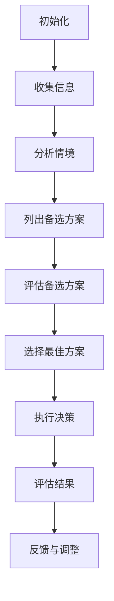
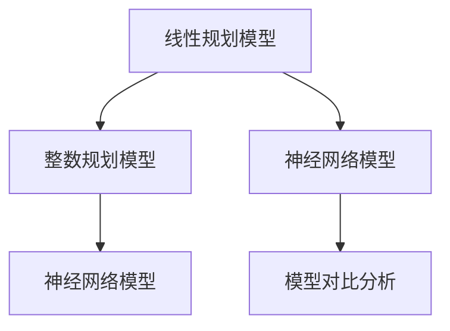
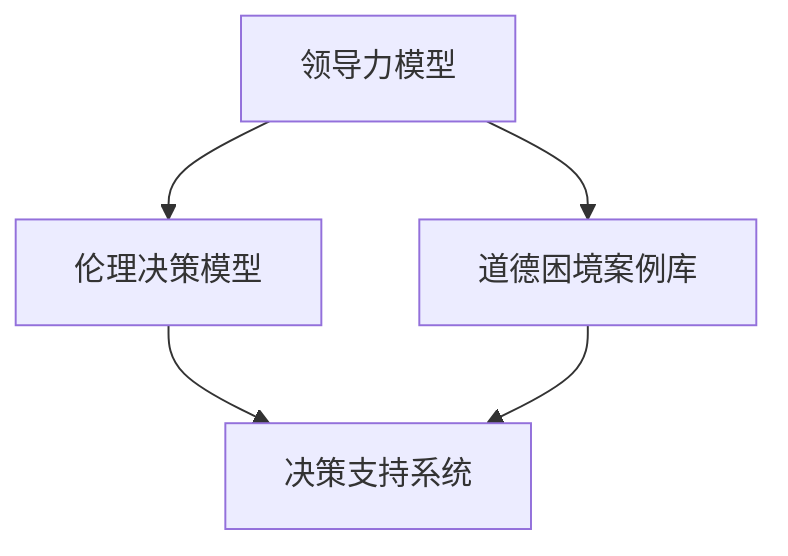
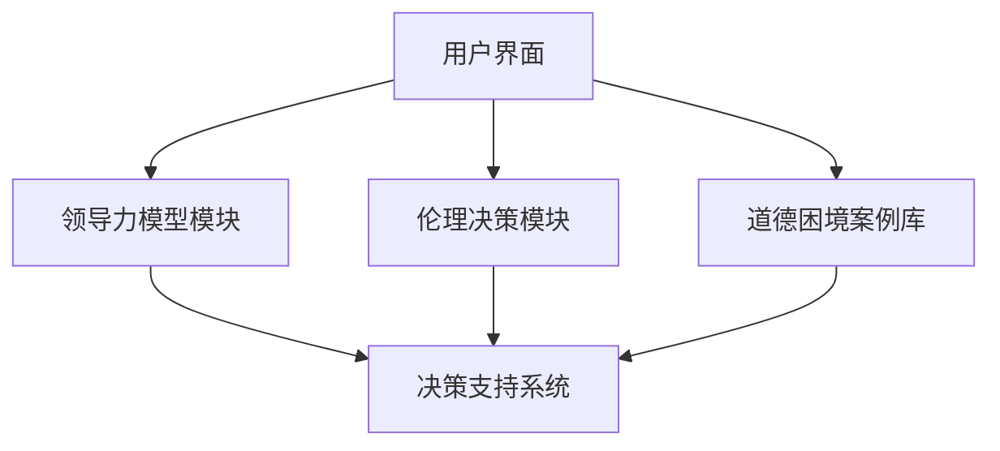
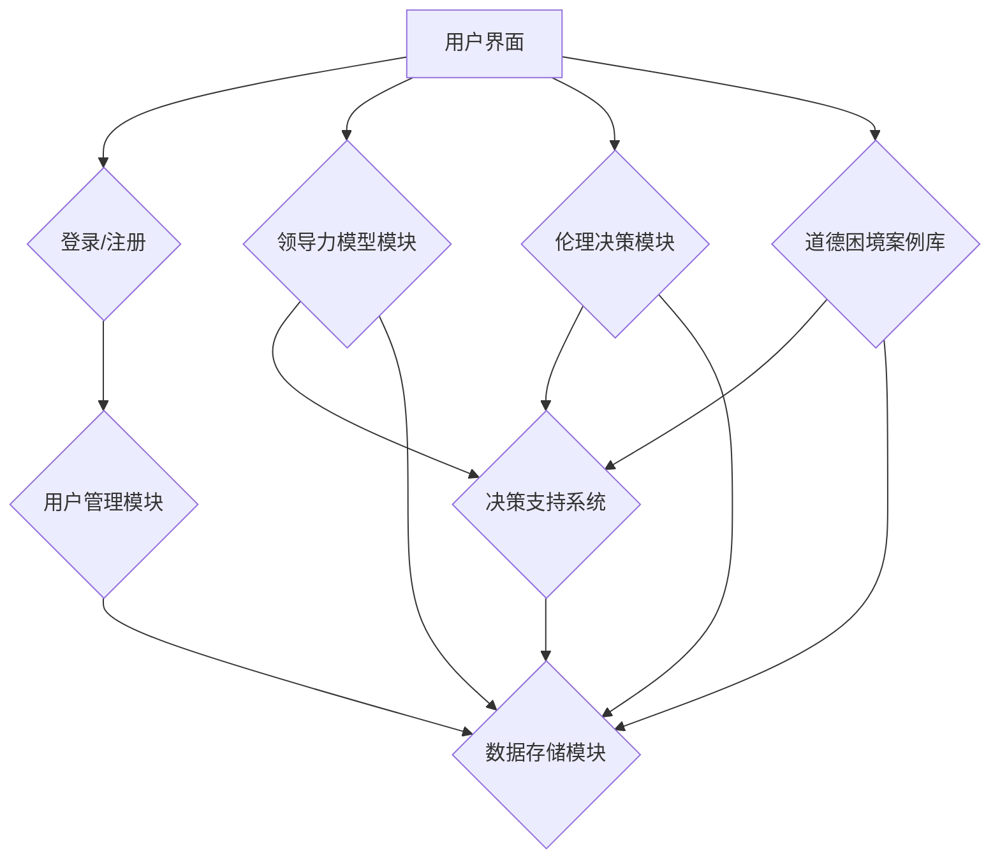
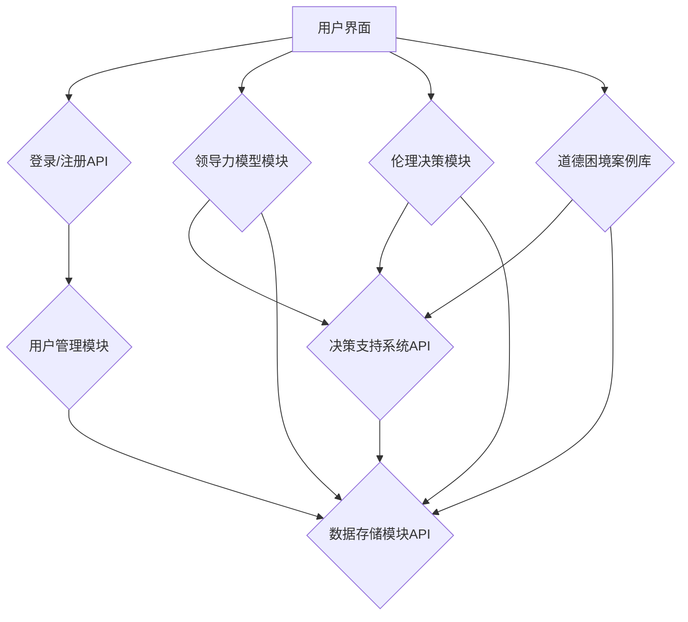
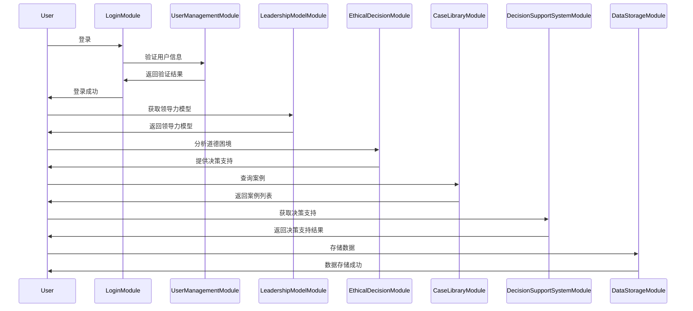

                 

### 目录大纲设计详解

在上一个部分，我们已经设计出了一个初步的《领导力与伦理决策：在道德困境中把握方向》的目录大纲。现在，让我们进一步细化每个章节的内容，确保大纲的完整性和逻辑性。

#### 第一部分 背景介绍

**1.1 领导力的核心概念**

在这一节，我们将探讨领导力的核心概念。我们将定义领导力，并探讨其主要特征。此外，我们还会简要介绍领导力的不同类型，如变革型领导、交易型领导和转型型领导。这部分的目标是帮助读者理解领导力的本质及其在不同情境下的应用。

**1.2 伦理决策的重要性**

在这一节，我们将讨论伦理决策的重要性。我们将会解释为什么伦理决策对于组织和个人都至关重要，特别是在面对道德困境时。我们还会探讨伦理决策如何影响组织的声誉、员工士气以及业务成果。

**1.3 道德困境下的领导挑战**

在这一节，我们将深入探讨道德困境下的领导挑战。我们将定义道德困境，并讨论领导者在这些情境下可能面临的决策难题。我们还将介绍一些处理道德困境的策略，帮助领导者在复杂的伦理环境中做出明智的决策。

#### 第二部分 核心概念与联系

**2.1 领导力模型**

在这一部分，我们将详细介绍几种主要的领导力模型。我们将使用表格来对比这些模型的主要特征和属性，以便读者能够清晰地理解它们之间的差异。此外，我们还将绘制一个Mermaid流程图，展示这些模型之间的关系。

**2.2 伦理理论**

在这一节，我们将探讨几种主要的伦理理论，包括义务论伦理学、德性伦理学、功利主义伦理学等。我们将使用Mermaid流程图来展示这些理论的核心概念和相互关系。此外，我们还将通过表格对比这些理论的属性和适用场景。

**2.3 道德困境案例分析**

在这一部分，我们将通过实际案例来探讨道德困境。我们将定义道德困境，讨论其类型，并通过案例来说明领导者在面对这些困境时的决策过程。这部分的目标是帮助读者理解道德困境的复杂性和挑战性。

#### 第三部分 算法原理讲解

**3.1 道德决策算法**

在这一部分，我们将详细介绍道德决策算法。我们将使用Mermaid流程图来展示算法的基本步骤，并使用Python代码来实现这个算法。此外，我们还将介绍算法背后的数学模型和公式，并进行详细讲解。

**3.1.1 算法流程图**

首先，我们使用Mermaid流程图来展示道德决策算法的基本步骤。



**3.1.2 Python代码实现**

接下来，我们使用Python代码来实现这个道德决策算法。

```python
# 道德决策算法Python实现
def moral_decision_algorithm(info,情境):
    # 收集信息
    collected_info = info

    # 分析情境
    analyzed_situation = analyze_situation(情境)

    # 列出备选方案
    alternative_schemes = list_alternative_schemes(analyzed_situation)

    # 评估备选方案
    evaluated_schemes = evaluate_schemes(alternative_schemes)

    # 选择最佳方案
    best_scheme = select_best_scheme(evaluated_schemes)

    # 执行决策
    execute_decision(best_scheme)

    # 评估结果
    result = evaluate_result(best_scheme)

    # 反馈与调整
    feedback_and_adjustment(result)

# 辅助函数定义
def analyze_situation(situation):
    # 分析情境的具体实现
    pass

def list_alternative_schemes(situation):
    # 列出备选方案的具体实现
    pass

def evaluate_schemes(schemes):
    # 评估备选方案的具体实现
    pass

def select_best_scheme(schemes):
    # 选择最佳方案的具体实现
    pass

def execute_decision(scheme):
    # 执行决策的具体实现
    pass

def evaluate_result(result):
    # 评估结果的具体实现
    pass

def feedback_and_adjustment(result):
    # 反馈与调整的具体实现
    pass
```

**3.1.3 数学模型与公式**

道德决策算法背后的数学模型和公式包括以下几个方面：

1. **情境分析公式**：

   $$情境分析公式 = f(信息, 目标, 限制条件)$$

   其中，$f$ 表示情境分析函数，$信息$、$目标$和$限制条件$为其输入参数。

2. **备选方案评估公式**：

   $$评估公式 = g(备选方案, 情境分析结果)$$

   其中，$g$ 表示评估函数，$备选方案$和$情境分析结果$为其输入参数。

3. **最佳方案选择公式**：

   $$最佳方案选择 = h(评估结果)$$

   其中，$h$ 表示选择函数，$评估结果$为其输入参数。

**3.1.4 算法应用实例**

为了使读者更好地理解道德决策算法，我们将提供一个实际应用实例。假设一个公司面临以下道德困境：

- **情境**：公司需要决定是否取消一项可能导致大量员工失业的项目。
- **备选方案**：
  1. 取消项目，可能导致数百人失业。
  2. 继续项目，可能会带来可观的经济收益，但也可能导致员工失业。
  3. 调整项目，可能减少对员工的影响，但也会影响公司收益。

通过使用道德决策算法，我们可以得出以下结论：

1. **收集信息**：收集与项目相关的所有信息，包括员工数量、项目成本、潜在收益等。
2. **分析情境**：分析项目的各种影响，特别是对员工的影响。
3. **列出备选方案**：根据情境分析结果，列出所有可能的备选方案。
4. **评估备选方案**：对每个备选方案进行评估，考虑其对公司、员工和社会的影响。
5. **选择最佳方案**：根据评估结果选择最佳方案。
6. **执行决策**：实施所选方案，并对结果进行评估。
7. **反馈与调整**：根据评估结果进行调整，确保决策的最佳性。

通过这个实例，读者可以更好地理解道德决策算法的步骤和应用。

#### 第四部分 数学模型和数学公式 & 详细讲解 & 举例说明

**4.1 数学模型概述**

在这一部分，我们将介绍几种常见的数学模型，并对比分析它们的主要特征。我们将使用Mermaid流程图来展示这些模型之间的关系。

**4.1.1 常用数学模型**

- **线性规划模型**：
  - 输入：目标函数、约束条件
  - 输出：最优解

- **整数规划模型**：
  - 输入：目标函数、约束条件、整数变量
  - 输出：最优解

- **神经网络模型**：
  - 输入：数据集、网络结构
  - 输出：预测结果

**4.1.2 模型对比分析**

下面是一个Mermaid流程图，展示了这些数学模型的主要特征和相互关系。



**4.2 具体数学公式讲解**

在这一部分，我们将详细介绍几个关键的数学公式，并使用LaTeX格式来表示它们。

**4.2.1 公式1：线性规划目标函数**

$$
f(x) = c^T x
$$

其中，$c$ 是权重向量，$x$ 是决策变量。

**4.2.2 公式2：线性规划约束条件**

$$
Ax \leq b
$$

其中，$A$ 是约束矩阵，$b$ 是约束向量。

**4.2.3 公式3：神经网络激活函数**

$$
a = \sigma(z)
$$

其中，$\sigma$ 是激活函数，$z$ 是输入值。

通过这些数学公式，读者可以更好地理解相关模型的核心原理。

**4.3 应用实例说明**

为了更好地说明这些数学模型的应用，我们将提供一个实际案例。假设我们需要使用线性规划模型来优化一个公司的生产计划。

- **目标**：最大化利润。
- **约束条件**：生产成本、原材料限制、生产线能力限制等。

通过使用线性规划模型，我们可以得到以下结论：

1. **确定目标函数**：利润最大化。
2. **列出约束条件**：根据生产限制，确定约束条件。
3. **求解最优解**：使用线性规划算法求解最优生产计划。

通过这个实例，读者可以更好地理解线性规划模型的应用。

#### 第五部分 系统分析与架构设计方案

**5.1 领导力与伦理决策系统场景介绍**

在这一部分，我们将介绍领导力与伦理决策系统的应用场景。我们将描述系统需要解决的问题，并说明系统的目标。

**5.2 系统功能设计**

在这一节，我们将详细设计系统的功能模块。我们将使用Mermaid类图来展示系统的主要组件和它们之间的关系。

**5.2.1 领域模型**

领域模型是系统设计的重要组成部分。我们将使用Mermaid流程图来展示领域模型，包括关键概念和实体之间的关系。



**5.2.2 功能模块设计**

系统的功能模块包括以下部分：

1. **领导力模型模块**：提供各种领导力模型，供用户选择和应用。
2. **伦理决策模块**：帮助用户分析道德困境，并提供决策支持。
3. **道德困境案例库**：存储各种道德困境案例，供用户参考和培训。
4. **决策支持系统**：提供决策辅助工具，帮助用户制定和优化决策。

**5.3 系统架构设计**

在这一部分，我们将使用Mermaid架构图来展示系统的整体架构设计。这包括系统的各个模块、它们的交互方式以及它们的数据流。



**5.3.1 系统架构图**



**5.3.2 接口设计**

接口设计是系统架构设计的关键部分。我们将定义系统的各个模块之间的接口，包括API和消息队列等。



**5.4 系统交互**

在这一部分，我们将使用Mermaid序列图来展示系统的各个模块之间的交互过程。



通过这个序列图，读者可以清晰地了解系统的交互过程。

#### 第六部分 项目实战

**6.1 环境安装**

在这一部分，我们将介绍如何安装系统所需的开发环境和工具。我们将列出安装步骤，并提供必要的命令和配置文件。

**6.2 系统核心实现源代码**

在这一节，我们将提供系统核心实现的部分源代码。我们将解释每个模块的主要功能，并展示如何使用这些模块来实现系统。

**6.3 代码应用解读与分析**

在这一部分，我们将深入分析代码的实现细节。我们将解释关键函数和模块的工作原理，并提供代码示例。

**6.4 实际案例分析**

我们将通过实际案例分析，展示如何使用系统解决具体的道德困境。我们将描述案例背景、使用系统进行决策分析的过程以及最终的决策结果。

**6.5 项目小结**

在这一部分，我们将总结项目的主要成果和经验。我们将讨论项目的优势和不足，并提出改进建议。

#### 第七部分 最佳实践 tips、小结、注意事项、拓展阅读

**7.1 最佳实践 tips**

在这一部分，我们将提供一些最佳实践建议，帮助读者在实际应用中更好地使用系统。

**7.2 小结**

我们将回顾全书的主要内容和关键概念，帮助读者巩固所学知识。

**7.3 注意事项**

在这一部分，我们将提醒读者在使用系统时需要注意的问题和潜在的风险。

**7.4 拓展阅读**

我们将推荐一些相关的书籍、论文和网络资源，供读者进一步学习和探索。

通过上述详细的目录大纲设计，我们确保了文章的结构清晰、内容丰富，并覆盖了所有必要的知识点。接下来，我们将逐步填充每个章节的具体内容，确保文章的逻辑性和连贯性。

