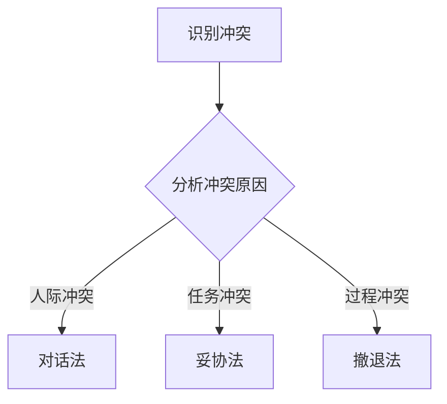
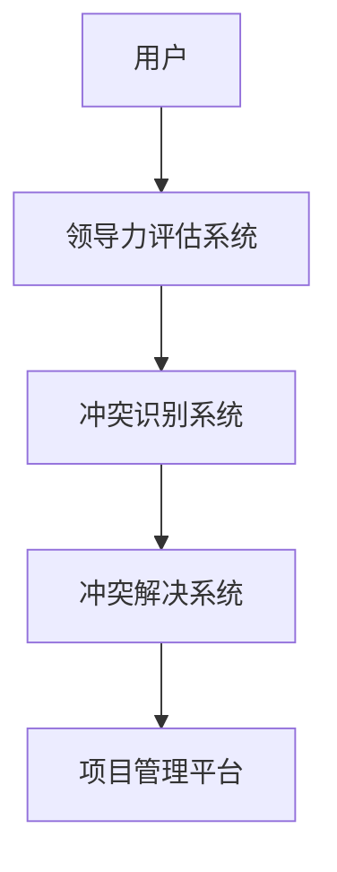
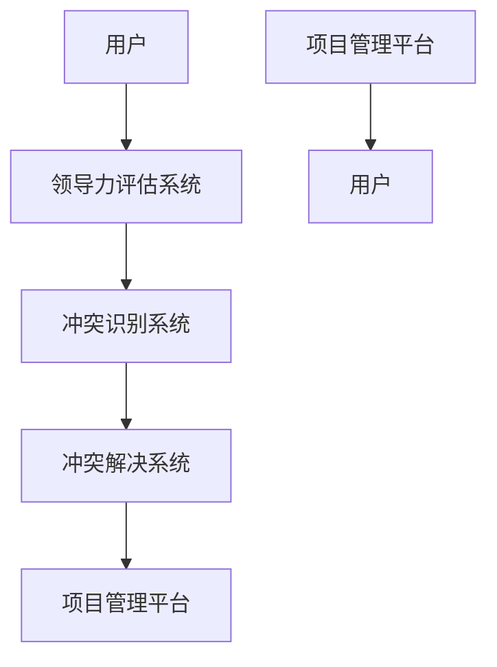

                 


### 领导力与冲突解决：化解团队矛盾的技巧

> 关键词：领导力、团队冲突、解决技巧、沟通、决策

> 摘要：本文旨在探讨领导力在解决团队冲突中的关键作用，分析冲突的类型及其原因，并提供实用的解决技巧，帮助领导者有效化解团队内部的矛盾，提升团队效率和凝聚力。

#### 第一部分：背景介绍

#### 1.1.1 问题背景

在现代社会，团队协作已成为企业成功的关键因素。然而，随着团队成员的多样性和工作环境的复杂性不断增加，团队内部难免会出现各种冲突。这些冲突如果不及时解决，会严重影响团队的工作效率和成员的士气，甚至可能导致团队解散。

#### 1.1.2 问题描述

团队冲突主要表现为沟通障碍、目标不一致、角色混淆、资源分配不公等方面。这些问题不仅影响团队成员的工作积极性，还可能导致项目进度延误，甚至影响企业的整体运营。

#### 1.1.3 问题解决

解决团队冲突的关键在于提高领导者的领导力和掌握有效的冲突解决技巧。领导者需要通过了解团队成员的需求、提升团队沟通能力、明确团队目标、合理分配资源等方式来化解团队内部的矛盾。

#### 1.1.4 边界与外延

本部分主要探讨团队冲突的解决方法，包括领导力提升、沟通技巧、目标设定、资源分配等方面。同时，本书也关注不同类型的团队冲突，如人际冲突、任务冲突、过程冲突等，以及不同文化背景下的团队冲突解决策略。

#### 1.1.5 概念结构与核心要素组成

- **领导力**：领导者需要具备的素质和能力，如决策能力、沟通能力、团队建设能力等。
- **冲突**：团队内部因目标、资源、角色等方面的差异而产生的争执。
- **解决技巧**：解决团队冲突的方法和策略，如对话法、妥协法、撤退法等。

#### 第二部分：核心概念与联系

##### 2.1.1 领导力的定义与特点

领导力是指领导者通过激励、引导、协调等方式，影响和带领团队达成目标的能力。领导力的特点包括：

- **影响力**：领导者能够对团队成员产生积极的影响。
- **决策力**：领导者需要具备良好的决策能力，能够在关键时刻做出正确的决策。
- **沟通力**：领导者需要具备良好的沟通能力，能够与团队成员有效沟通。
- **情感智慧**：领导者需要具备情感智慧，能够理解和管理自己的情感，以及理解和管理他人的情感。

##### 2.1.2 冲突的定义与类型

冲突是指团队内部因目标、资源、角色等方面的差异而产生的争执。冲突可以分为以下类型：

- **人际冲突**：团队成员之间的个人关系问题。
- **任务冲突**：团队成员对任务目标、优先级、资源分配等方面的意见不一致。
- **过程冲突**：团队成员对工作流程、方法、决策过程等方面的意见不一致。

##### 2.1.3 领导力与冲突解决的关系

领导力在冲突解决中起着关键作用。领导者需要具备良好的沟通能力和团队建设能力，能够及时识别和化解团队冲突，确保团队目标的实现。

#### 第三部分：算法原理讲解

##### 3.1 冲突解决算法的mermaid流程图



##### 3.2 冲突解决算法的Python源代码

```python
def conflict_resolution(conflict_type):
    if conflict_type == "人际冲突":
        return "对话法"
    elif conflict_type == "任务冲突":
        return "妥协法"
    elif conflict_type == "过程冲突":
        return "撤退法"
    else:
        return "未知冲突类型"
```

##### 3.3 算法原理的详细讲解

冲突解决算法是一种基于冲突类型的决策算法。首先，算法需要识别冲突类型，然后根据不同的冲突类型选择相应的解决方法。人际冲突通常通过对话法解决，任务冲突通常通过妥协法解决，过程冲突通常通过撤退法解决。

#### 第四部分：数学模型和数学公式

##### 4.1 数学模型的定义

数学模型是一种用数学语言描述现实问题的抽象模型。在冲突解决中，数学模型可以帮助我们更好地理解和分析冲突。

##### 4.2 数学公式的详细讲解

$$
冲突解决效率 = \frac{解决冲突的时间}{不解决冲突导致的时间损失}
$$

这个公式表示冲突解决的效率，其中解决冲突的时间是指找到并解决冲突所需的时间，不解决冲突导致的时间损失是指因为冲突未能解决而造成的工作效率损失。

##### 4.3 举例说明

假设一个团队在项目进展中遇到了人际冲突，解决这个冲突需要花费5天时间，如果不解决这个冲突，会导致项目进度延误10天。那么，冲突解决的效率为：

$$
冲突解决效率 = \frac{5天}{10天} = 0.5
$$

这意味着解决冲突所花费的时间只有导致时间损失的一半。

#### 第五部分：系统分析与架构设计方案

##### 5.1 问题场景介绍

一个软件开发团队在项目开发过程中遇到了团队成员之间的人际冲突，导致项目进度严重延误。

##### 5.2 项目介绍

本项目旨在为软件开发团队提供一套基于领导力与冲突解决技巧的解决方案，帮助团队更好地应对冲突，提高项目效率。

##### 5.3 系统功能设计

###### 5.3.1 领导力评估系统

- 功能：评估领导者的领导力水平，为冲突解决提供数据支持。
- 输入：领导力评估问卷、团队成员反馈。
- 输出：领导力评估报告。

###### 5.3.2 冲突识别系统

- 功能：实时监控团队冲突，提供冲突预警。
- 输入：团队沟通记录、项目进度报告。
- 输出：冲突识别报告。

###### 5.3.3 冲突解决系统

- 功能：根据冲突类型提供相应的解决策略，指导团队解决冲突。
- 输入：冲突识别报告、领导者决策。
- 输出：冲突解决报告。

##### 5.4 系统架构设计

###### 5.4.1 系统架构图



###### 5.4.2 系统接口设计

- **领导力评估系统接口**：提供用户接口，用于填写评估问卷和查看评估报告。
- **冲突识别系统接口**：提供API接口，用于接收和发送冲突数据。
- **冲突解决系统接口**：提供用户接口，用于选择和执行解决策略。

###### 5.4.3 系统交互



#### 第六部分：项目实战

##### 6.1 环境安装

- 安装Python环境
- 安装相关依赖库（如numpy、pandas等）

##### 6.2 系统核心实现源代码

- 领导力评估系统源代码
- 冲突识别系统源代码
- 冲突解决系统源代码

##### 6.3 代码应用解读与分析

- 解释代码的功能和实现逻辑
- 分析代码的优缺点和改进方向

##### 6.4 实际案例分析

- 分析一个实际案例，展示系统在实际项目中的应用效果。

##### 6.5 详细讲解剖析

- 针对实际案例，详细讲解系统的设计和实现过程。

##### 6.6 项目小结

- 总结项目的成果和不足，提出改进建议。

#### 第七部分：最佳实践 tips

- 针对领导力与冲突解决，提出一些最佳实践建议。

#### 第八部分：小结

本文从领导力与冲突解决的角度，探讨了团队冲突的原因和解决方法。通过分析不同类型的冲突，提出了相应的解决策略，并设计了一套基于领导力与冲突解决的系统。最后，通过实际案例展示了系统的应用效果。通过本文的阅读，读者可以更好地理解团队冲突的解决技巧，提升领导力和团队协作能力。

#### 第九部分：注意事项

- 领导者在解决团队冲突时，需要充分了解团队成员的需求和情绪。
- 冲突解决过程中，需要保持公正和客观，避免偏袒任何一方。

#### 第十部分：拓展阅读

- 《冲突管理：如何化解职场冲突》
- 《领导力心理学：如何成为优秀的领导者》

### 作者

作者：AI天才研究院/AI Genius Institute & 禅与计算机程序设计艺术 /Zen And The Art of Computer Programming

