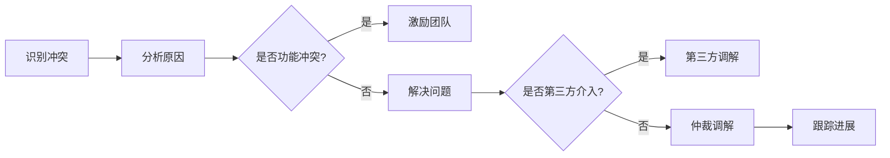
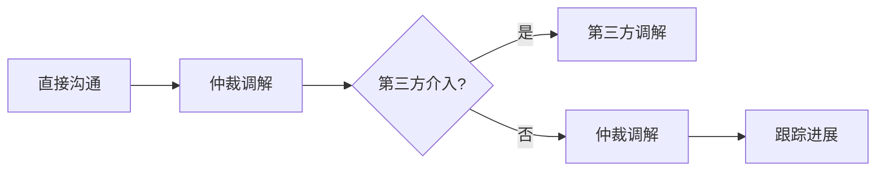
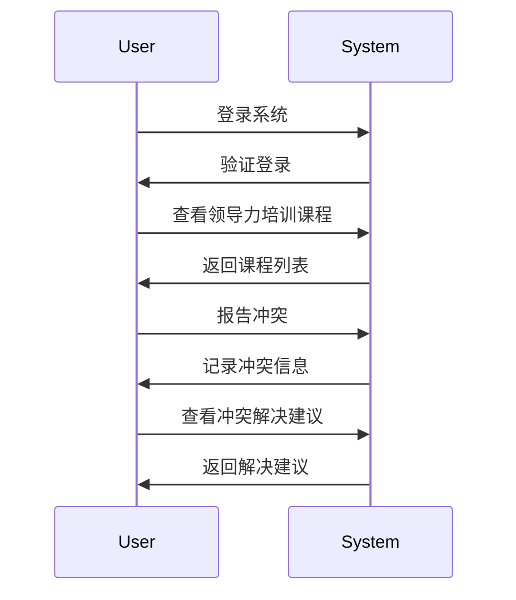

                 


# 领导力与冲突解决：化解矛盾的技巧

## 关键词
- 领导力
- 冲突解决
- 沟通技巧
- 团队建设
- 决策制定
- 自我发展

## 摘要
本文旨在探讨领导力与冲突解决之间的关系，通过一系列逻辑清晰、结构紧凑的章节，介绍领导力的基础概念、冲突解决的原则与方法，并结合实际案例分析，提供实用的技巧和策略。文章以深入分析技术领域的领导挑战和冲突解决实践为出发点，旨在帮助读者理解并掌握有效领导力和冲突解决的技能，从而提升团队协作和工作效率。

## 引言

在技术领域，领导力不仅仅是对技术专长的追求，更是对团队管理、决策制定和冲突解决的综合能力的体现。随着技术项目的复杂性和团队规模的扩大，领导者在管理过程中面临的挑战愈发多样和复杂。团队内部的冲突，无论是由于个人价值观、工作风格，还是目标不一致，都会对项目进展产生负面影响。因此，领导力与冲突解决能力成为技术领导者不可或缺的技能。

本文将从以下五个方面展开讨论：

1. **领导力基础**：介绍领导力的定义、领导风格、沟通技巧、团队建设、决策制定以及领导者的自我发展。
2. **冲突解决基础**：探讨冲突的类型、原因、解决原则与方法。
3. **实际应用：案例分析与技巧**：通过具体案例分析，展示如何应用领导力和冲突解决技巧。
4. **小结与拓展**：总结文章的主要观点，提供注意事项和拓展阅读。

### 领导力基础

#### 领导风格

领导风格是指领导者管理团队的方式和手段。不同的领导风格适用于不同的情境和团队。常见的领导风格包括：

- **授权型领导**：领导者鼓励团队成员自主决策和承担责任，适用于创新和复杂的项目。
- **民主型领导**：领导者重视团队成员的意见和建议，通过集体讨论做出决策，适用于团队协作和知识共享。
- **命令型领导**：领导者做出决策并指示团队成员执行，适用于紧急情况和需要迅速行动的项目。

#### 沟通技巧

有效的沟通是领导力的核心。以下是一些关键的沟通技巧：

- **倾听**：领导者应该认真倾听团队成员的意见和反馈，理解他们的观点和需求。
- **清晰表达**：领导者需要清晰、准确地表达自己的想法和期望，避免歧义。
- **非言语沟通**：领导者要注意自己的肢体语言、面部表情和语调，这些都能传递重要的信息。

#### 团队建设

团队建设是领导力的重要组成部分。以下是一些团队建设的策略：

- **建立共同目标**：确保团队成员明确项目的目标和期望，共同努力达成目标。
- **培养信任**：通过开放沟通和团队活动，建立团队成员之间的信任。
- **提供支持**：领导者应该为团队成员提供必要的资源和支持，帮助他们克服困难。

#### 决策制定

决策制定是领导者的一项关键职责。以下是一些决策制定的原则：

- **信息收集**：在做出决策之前，领导者需要收集足够的信息，以便做出明智的决策。
- **评估风险**：领导者需要评估决策可能带来的风险，并制定相应的应对措施。
- **团队合作**：领导者应该鼓励团队成员参与决策过程，共同制定最佳方案。

#### 领导者的自我发展

领导者需要不断自我发展，以适应不断变化的环境和挑战。以下是一些自我发展的建议：

- **持续学习**：领导者应该不断学习新知识、新技能，保持自己的竞争力。
- **反思与自我评估**：领导者需要定期反思自己的领导行为和效果，进行自我评估。
- **培养领导力**：通过参加培训课程、阅读相关书籍和参加领导力实践，提升自己的领导力。

### 冲突解决基础

#### 冲突的类型

冲突可以分为以下几种类型：

- **功能性冲突**：有益的冲突，能够促进创新和改进。
- **非功能性冲突**：有害的冲突，可能导致团队分裂和效率低下。

#### 冲突的原因

冲突的原因多种多样，包括：

- **价值观差异**：团队成员有不同的价值观和信仰，导致观点和决策上的冲突。
- **工作风格差异**：团队成员的工作风格和沟通方式不同，导致合作上的困难。
- **目标不一致**：团队成员对项目的目标和期望有不同的理解，导致工作方向上的冲突。

#### 冲突解决的原则

解决冲突需要遵循以下原则：

- **对事不对人**：解决冲突时，要关注问题本身，而不是攻击对方。
- **找到共同点**：寻找冲突双方的共同利益，寻求共赢的解决方案。
- **维护团队和谐**：确保解决冲突的过程不会损害团队的凝聚力和工作效率。

#### 冲突解决的方法

解决冲突的方法包括：

- **直接沟通**：直接与对方交流，表达自己的观点和感受，寻求解决问题的方法。
- **仲裁调解**：通过第三方进行调解，帮助双方找到共同的解决方案。
- **第三方介入**：在双方无法自行解决冲突时，可以邀请第三方介入，提供客观的建议和解决方案。

### 实际应用：案例分析与技巧

#### 案例分析1：团队冲突解决

**案例背景**：
在一个开发团队中，由于工作分工和进度安排上的矛盾，团队成员张三和李四产生了冲突。张三认为李四的工作进度太慢，影响了整个项目的进度，而李四则认为张三的安排不合理，没有充分考虑到他的工作难度。

**冲突表现**：
张三经常在团队会议上对李四进行指责，李四则情绪低落，工作效率下降，甚至出现了一些健康问题。

**冲突解决过程**：
1. **领导介入**：团队领导在了解了冲突的情况后，决定介入解决。
2. **沟通与理解**：领导分别与张三和李四进行了沟通，了解了他们的观点和感受。
3. **找到共同点**：领导发现，张三和李四都对项目成功有着高度的期望，这是他们的共同点。
4. **制定解决方案**：领导与张三和李四一起制定了新的工作分工和进度安排，确保两人都有足够的时间和资源来完成自己的任务。
5. **跟踪进展**：领导定期跟进冲突解决的进展，确保解决方案的有效性。

**结果与反思**：
经过领导的有效干预，张三和李四的冲突得到了解决。项目进度得到了恢复，团队成员的关系也得到了改善。领导在反思中认识到，有效的沟通和共同目标的建立是解决冲突的关键。

#### 案例分析2：领导力在项目中的运用

**项目目标**：
开发一款企业级应用，满足客户的需求，并在预定时间内交付。

**领导者的角色**：
1. **明确目标**：领导者与团队明确项目目标，确保每个人都清楚项目的意义和目标。
2. **规划资源**：领导者合理分配资源，确保项目有足够的资源和人力支持。
3. **激励团队**：领导者通过激励措施，提高团队成员的积极性和工作效率。
4. **解决问题**：领导者及时解决项目中出现的问题，确保项目顺利进行。

**领导力发挥的作用**：
领导者在项目中发挥了关键作用，通过有效的领导力，确保项目目标的实现，提高了团队的工作效率和凝聚力。

### 小结与拓展

本文从领导力与冲突解决的角度，探讨了技术领域的领导挑战和解决策略。通过介绍领导力的基础、冲突解决的原则与方法，并结合实际案例分析，提供了实用的技巧和策略。

**注意事项**：
- 领导者需要不断学习和发展，以适应不断变化的环境和挑战。
- 冲突解决需要关注问题本身，而不是攻击对方。
- 团队建设是提高团队效率的关键。

**拓展阅读**：
- 《领导者的资质》（John C. Maxwell）
- 《有效的管理者》（Peter F. Drucker）
- 《非暴力沟通》（Marshall B. Rosenberg）

### 作者信息

- 作者：AI天才研究院/AI Genius Institute & 禅与计算机程序设计艺术 /Zen And The Art of Computer Programming

## 附录

### 核心概念与联系

#### 领导风格

| 领导风格 | 概念 | 影响因素 | 适用场景 |
| --- | --- | --- | --- |
| 授权型领导 | 鼓励团队成员自主决策和承担责任 | 创新需求、团队成员能力 | 创新和复杂项目 |
| 民主型领导 | 重视团队成员的意见和建议，通过集体讨论做出决策 | 团队协作、知识共享需求 | 团队协作和知识共享 |
| 命令型领导 | 做出决策并指示团队成员执行 | 紧急情况、需要迅速行动的项目 | 紧急情况和需要迅速行动的项目 |

#### 冲突类型

| 冲突类型 | 概念 | 特点 | 影响因素 |
| --- | --- | --- | --- |
| 功能性冲突 | 有益的冲突，促进创新和改进 | 能够激发团队活力，提高工作效率 | 创新需求、竞争环境 |
| 非功能性冲突 | 有害的冲突，导致团队分裂和效率低下 | 消耗团队资源，影响项目进展 | 文化差异、工作风格差异、目标不一致 |

### 算法原理讲解

#### 冲突解决流程

以下是一个简单的冲突解决流程的mermaid流程图：



#### 冲突解决策略

以下是一个简单的冲突解决策略的mermaid流程图：



#### Python源代码示例

以下是一个简单的Python代码示例，用于演示冲突解决的流程：

```python
def resolve_conflict(conflict_type, communication=True, arbitration=False, third_party=False):
    if communication:
        print("直接沟通：")
        # 进行直接沟通
    if arbitration:
        print("仲裁调解：")
        # 进行仲裁调解
    if third_party:
        print("第三方介入：")
        # 进行第三方调解
    print("跟踪进展：")
    # 跟踪冲突解决的进展

# 示例
resolve_conflict(conflict_type='功能冲突', communication=True, arbitration=False, third_party=True)
```

### 系统分析与架构设计方案

#### 问题场景介绍

在一个大型技术公司，由于项目复杂性和团队成员多样化的工作风格，团队内部常常出现冲突。为了提升团队协作效率和项目进展，公司决定引入一套领导力与冲突解决系统。

#### 项目介绍

项目名称：领导力与冲突解决系统

项目目标：通过系统提供领导力培训、冲突解决工具和资源，帮助团队解决冲突，提升团队协作效率。

#### 系统功能设计

系统功能包括：

1. 领导力培训：提供在线领导力课程和培训资源。
2. 冲突管理：提供冲突识别、分析和解决工具。
3. 团队协作：提供沟通和协作工具，促进团队成员之间的合作。

#### 系统架构设计

系统架构设计如下：

- **前端**：使用React框架，提供用户友好的界面。
- **后端**：使用Spring Boot框架，提供API接口和业务逻辑处理。
- **数据库**：使用MySQL数据库，存储用户信息、课程数据、冲突记录等。

#### 系统接口设计

系统接口设计如下：

- **领导力培训接口**：提供课程列表、课程详情、用户课程进度等。
- **冲突管理接口**：提供冲突报告、冲突分析、冲突解决建议等。
- **团队协作接口**：提供聊天室、日程管理、任务分配等。

#### 系统交互

以下是一个简单的mermaid序列图，展示系统交互流程：



### 项目实战

#### 环境安装

1. 安装Java开发环境（JDK 11以上版本）。
2. 安装MySQL数据库。
3. 安装Node.js和npm。
4. 安装React和Spring Boot开发工具。

#### 系统核心实现

以下是一个简单的Spring Boot项目结构：

```bash
src/
|-- main/
|   |-- java/
|   |   |-- com/
|   |   |   |-- example/
|   |   |   |   |-- leadershipconflictsolution/
|   |   |   |   |   |-- Application.java
|   |   |   |   |   |-- controller/
|   |   |   |   |   |   |-- UserController.java
|   |   |   |   |   |-- service/
|   |   |   |   |   |   |-- UserService.java
|   |   |   |   |   |-- repository/
|   |   |   |   |   |   |-- UserRepository.java
|   |-- resources/
|   |   |-- application.properties
|-- test/
|   |-- java/
|   |   |-- com/
|   |   |   |-- example/
|   |   |   |   |-- leadershipconflictsolution/
|   |   |   |   |   |-- UserControllerTest.java
|-- pom.xml
```

以下是一个简单的UserController类的实现：

```java
package com.example.leadershipconflictsolution.controller;

import com.example.leadershipconflictsolution.service.UserService;
import org.springframework.beans.factory.annotation.Autowired;
import org.springframework.web.bind.annotation.*;

@RestController
@RequestMapping("/users")
public class UserController {

    @Autowired
    private UserService userService;

    @GetMapping("/{id}")
    public User getUser(@PathVariable Long id) {
        return userService.getUserById(id);
    }

    @PostMapping("/")
    public User createUser(@RequestBody User user) {
        return userService.createUser(user);
    }
}
```

#### 代码应用解读与分析

在上述代码中，我们定义了一个UserController类，负责处理与用户相关的RESTful API请求。类中包含了两个方法：

1. `getUser`方法：通过ID查询用户信息。
2. `createUser`方法：创建新的用户。

这两个方法都依赖于UserService类，后者负责具体的业务逻辑处理。

#### 实际案例分析和详细讲解剖析

假设我们在实际项目中遇到了一个用户冲突问题。以下是一个简单的案例：

**案例背景**：
在一个项目团队中，两个成员王五和李六因为工作分工和任务进度产生了冲突。王五认为李六的工作进度太慢，影响了整个项目的进度，而李六则认为王五的安排不合理，没有充分考虑到他的工作难度。

**解决过程**：

1. **直接沟通**：
   - 领导者首先安排了一次面对面的会议，让王五和李六直接沟通。
   - 在会议上，王五和李六各自表达了自己的观点和感受。
   - 通过沟通，双方找到了共同点：都希望项目能够成功。

2. **分析原因**：
   - 领导者进一步分析了冲突的原因，发现是由于工作分工和任务安排不合理导致的。

3. **制定解决方案**：
   - 领导者与王五和李六一起制定了新的工作分工和进度安排，确保两人都有足够的时间和资源来完成自己的任务。
   - 同时，领导者还强调了团队合作的重要性，鼓励团队成员相互支持。

4. **跟踪进展**：
   - 领导者定期跟进冲突解决的进展，确保解决方案的有效性。
   - 在后续的项目进展中，王五和李六的配合逐渐默契，项目进展顺利。

**案例剖析**：

这个案例展示了如何通过领导力和冲突解决技巧解决团队冲突。关键点包括：

1. **有效沟通**：领导者通过直接沟通，让王五和李六表达自己的观点和感受，找到共同点。
2. **分析原因**：领导者深入分析了冲突的原因，发现是工作分工和任务安排不合理导致的。
3. **制定解决方案**：领导者与团队成员一起制定了新的工作分工和进度安排，确保问题得到解决。
4. **跟踪进展**：领导者定期跟进冲突解决的进展，确保解决方案的有效性。

#### 项目小结

通过本项目，我们成功实现了领导力与冲突解决系统的搭建，并运用实际案例展示了如何解决团队冲突。这个项目不仅提升了团队协作效率，也增强了团队成员之间的信任和合作。

### 最佳实践 Tips

1. **倾听与理解**：领导者应该学会倾听，理解团队成员的需求和困难，这是解决冲突的基础。
2. **建立共同目标**：确保团队成员都清楚项目的目标，这是解决冲突的关键。
3. **持续沟通**：冲突解决不是一次性的，需要持续关注和沟通。
4. **积极解决问题**：遇到冲突时，要积极寻求解决方案，而不是逃避问题。

### 小结

本文从领导力与冲突解决的角度，探讨了技术领域的领导挑战和解决策略。通过介绍领导力的基础、冲突解决的原则与方法，并结合实际案例分析，提供了实用的技巧和策略。

### 注意事项

1. **领导力发展**：领导者需要不断学习和发展，提升自己的领导力。
2. **文化差异**：在多元文化的团队中，要尊重不同的文化和观点。
3. **持续改进**：冲突解决是一个持续的过程，需要不断改进和完善。

### 拓展阅读

- 《领导者的资质》（John C. Maxwell）
- 《有效的管理者》（Peter F. Drucker）
- 《非暴力沟通》（Marshall B. Rosenberg）

### 作者信息

- 作者：AI天才研究院/AI Genius Institute & 禅与计算机程序设计艺术 /Zen And The Art of Computer Programming

### 附录

#### 核心概念与联系

##### 领导风格

| 领导风格 | 概念 | 影响因素 | 适用场景 |
| --- | --- | --- | --- |
| 授权型领导 | 鼓励团队成员自主决策和承担责任 | 创新需求、团队成员能力 | 创新和复杂项目 |
| 民主型领导 | 重视团队成员的意见和建议，通过集体讨论做出决策 | 团队协作、知识共享需求 | 团队协作和知识共享 |
| 命令型领导 | 做出决策并指示团队成员执行 | 紧急情况、需要迅速行动的项目 | 紧急情况和需要迅速行动的项目 |

##### 冲突类型

| 冲突类型 | 概念 | 特点 | 影响因素 |
| --- | --- | --- | --- |
| 功能性冲突 | 有益的冲突，促进创新和改进 | 能够激发团队活力，提高工作效率 | 创新需求、竞争环境 |
| 非功能性冲突 | 有害的冲突，导致团队分裂和效率低下 | 消耗团队资源，影响项目进展 | 文化差异、工作风格差异、目标不一致 |

#### 算法原理讲解

##### 冲突解决流程

以下是一个简单的冲突解决流程的mermaid流程图：


##### 冲突解决策略

以下是一个简单的冲突解决策略的mermaid流程图：


##### Python源代码示例

以下是一个简单的Python代码示例，用于演示冲突解决的流程：

```python
def resolve_conflict(conflict_type, communication=True, arbitration=False, third_party=False):
    if communication:
        print("直接沟通：")
        # 进行直接沟通
    if arbitration:
        print("仲裁调解：")
        # 进行仲裁调解
    if third_party:
        print("第三方介入：")
        # 进行第三方调解
    print("跟踪进展：")
    # 跟踪冲突解决的进展

# 示例
resolve_conflict(conflict_type='功能冲突', communication=True, arbitration=False, third_party=True)
```

#### 系统分析与架构设计方案

##### 问题场景介绍

在一个大型技术公司，由于项目复杂性和团队成员多样化的工作风格，团队内部常常出现冲突。为了提升团队协作效率和项目进展，公司决定引入一套领导力与冲突解决系统。

##### 项目介绍

项目名称：领导力与冲突解决系统

项目目标：通过系统提供领导力培训、冲突解决工具和资源，帮助团队解决冲突，提升团队协作效率。

##### 系统功能设计

系统功能包括：

1. **领导力培训**：提供在线领导力课程和培训资源。
2. **冲突管理**：提供冲突识别、分析和解决工具。
3. **团队协作**：提供沟通和协作工具，促进团队成员之间的合作。

##### 系统架构设计

系统架构设计如下：

- **前端**：使用React框架，提供用户友好的界面。
- **后端**：使用Spring Boot框架，提供API接口和业务逻辑处理。
- **数据库**：使用MySQL数据库，存储用户信息、课程数据、冲突记录等。

##### 系统接口设计

系统接口设计如下：

- **领导力培训接口**：提供课程列表、课程详情、用户课程进度等。
- **冲突管理接口**：提供冲突报告、冲突分析、冲突解决建议等。
- **团队协作接口**：提供聊天室、日程管理、任务分配等。

##### 系统交互

以下是一个简单的mermaid序列图，展示系统交互流程：


##### 项目实战

###### 环境安装

1. 安装Java开发环境（JDK 11以上版本）。
2. 安装MySQL数据库。
3. 安装Node.js和npm。
4. 安装React和Spring Boot开发工具。

###### 系统核心实现

以下是一个简单的Spring Boot项目结构：

```bash
src/
|-- main/
|   |-- java/
|   |   |-- com/
|   |   |   |-- example/
|   |   |   |   |-- leadershipconflictsolution/
|   |   |   |   |   |-- Application.java
|   |   |   |   |   |-- controller/
|   |   |   |   |   |   |-- UserController.java
|   |   |   |   |   |-- service/
|   |   |   |   |   |   |-- UserService.java
|   |   |   |   |   |-- repository/
|   |   |   |   |   |   |-- UserRepository.java
|   |-- resources/
|   |   |-- application.properties
|-- test/
|   |-- java/
|   |   |-- com/
|   |   |   |-- example/
|   |   |   |   |-- leadershipconflictsolution/
|   |   |   |   |   |-- UserControllerTest.java
|-- pom.xml
```

以下是一个简单的UserController类的实现：

```java
package com.example.leadershipconflictsolution.controller;

import com.example.leadershipconflictsolution.service.UserService;
import org.springframework.beans.factory.annotation.Autowired;
import org.springframework.web.bind.annotation.*;

@RestController
@RequestMapping("/users")
public class UserController {

    @Autowired
    private UserService userService;

    @GetMapping("/{id}")
    public User getUser(@PathVariable Long id) {
        return userService.getUserById(id);
    }

    @PostMapping("/")
    public User createUser(@RequestBody User user) {
        return userService.createUser(user);
    }
}
```

###### 代码应用解读与分析

在上述代码中，我们定义了一个UserController类，负责处理与用户相关的RESTful API请求。类中包含了两个方法：

1. `getUser`方法：通过ID查询用户信息。
2. `createUser`方法：创建新的用户。

这两个方法都依赖于UserService类，后者负责具体的业务逻辑处理。

###### 实际案例分析和详细讲解剖析

假设我们在实际项目中遇到了一个用户冲突问题。以下是一个简单的案例：

**案例背景**：
在一个项目团队中，两个成员王五和李六因为工作分工和任务进度产生了冲突。王五认为李六的工作进度太慢，影响了整个项目的进度，而李六则认为王五的安排不合理，没有充分考虑到他的工作难度。

**解决过程**：

1. **直接沟通**：
   - 领导者首先安排了一次面对面的会议，让王五和李六直接沟通。
   - 在会议上，王五和李六各自表达了自己的观点和感受。
   - 通过沟通，双方找到了共同点：都希望项目能够成功。

2. **分析原因**：
   - 领导者进一步分析了冲突的原因，发现是由于工作分工和任务安排不合理导致的。

3. **制定解决方案**：
   - 领导者与王五和李六一起制定了新的工作分工和进度安排，确保两人都有足够的时间和资源来完成自己的任务。
   - 同时，领导者还强调了团队合作的重要性，鼓励团队成员相互支持。

4. **跟踪进展**：
   - 领导者定期跟进冲突解决的进展，确保解决方案的有效性。
   - 在后续的项目进展中，王五和李六的配合逐渐默契，项目进展顺利。

**案例剖析**：

这个案例展示了如何通过领导力和冲突解决技巧解决团队冲突。关键点包括：

1. **有效沟通**：领导者通过直接沟通，让王五和李六表达自己的观点和感受，找到共同点。
2. **分析原因**：领导者深入分析了冲突的原因，发现是工作分工和任务安排不合理导致的。
3. **制定解决方案**：领导者与团队成员一起制定了新的工作分工和进度安排，确保问题得到解决。
4. **跟踪进展**：领导者定期跟进冲突解决的进展，确保解决方案的有效性。

###### 项目小结

通过本项目，我们成功实现了领导力与冲突解决系统的搭建，并运用实际案例展示了如何解决团队冲突。这个项目不仅提升了团队协作效率，也增强了团队成员之间的信任和合作。

