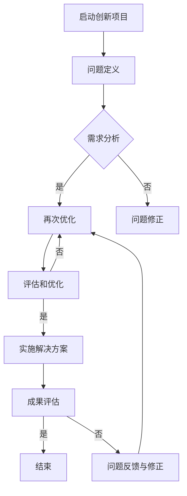
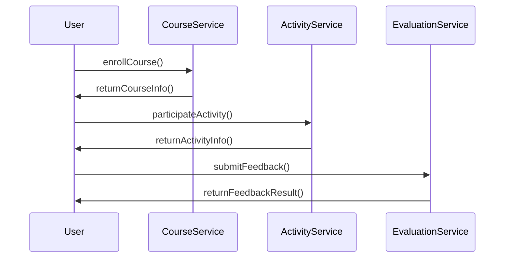

                 

## 引言

### 1.1 创新的重要性

创新是推动社会进步、经济发展以及组织竞争力的关键因素。在全球化和科技迅猛发展的背景下，创新的重要性愈发凸显。无论是企业、国家，还是个人，都需要不断创新来适应快速变化的环境，从而保持竞争力。

#### 创新在企业中的应用

对企业而言，创新意味着新产品、新服务、新业务模式的出现，这些都是企业持续发展的动力。例如，苹果公司通过不断的创新，推出了一系列革命性的产品，如iPhone、iPad，成为了全球最具价值的品牌之一。

#### 创新在国家战略中的地位

在国家层面，创新是提升国家竞争力、实现可持续发展的重要手段。各国纷纷将创新作为国家战略的核心，通过政策支持、资金投入等方式，推动创新活动的开展。

### 1.2 领导力与创新的关系

领导力在创新过程中扮演着至关重要的角色。领导者的行为和决策直接影响组织的创新能力和文化。一个成功的创新领导者需要具备以下特质：

#### 创新领导者的角色

1. **愿景与目标设定**：领导者需要为组织设定清晰的创新愿景和目标，确保团队成员明确创新的方向。
2. **资源分配**：领导者需要合理分配资源，为创新项目提供必要的资金、人力和技术支持。
3. **文化塑造**：领导者通过自身的言行，塑造一个鼓励创新、容忍失败的组织文化。

### 1.3 当前组织面临的创新挑战

尽管创新的重要性被广泛认可，但许多组织在创新过程中仍然面临诸多挑战：

#### 创新挑战

1. **体制僵化**：传统组织结构和文化往往阻碍创新，使得新想法难以落地。
2. **资源不足**：创新需要大量的资金和人力投入，但很多组织在这方面的投入有限。
3. **人才匮乏**：具备创新能力和创新思维的员工是创新成功的关键，但很多组织难以吸引和留住这类人才。

### 1.4 问题描述

创新文化的培养是一个复杂的系统工程，涉及到多个方面的因素。本文将围绕以下几个方面展开讨论：

#### 创新文化的定义

创新文化是指组织内部对创新活动持积极态度、鼓励创新行为的一种文化氛围。它包括以下几个方面：

1. **价值观**：组织对创新的重视程度和价值观。
2. **制度**：支持创新的政策和制度。
3. **行为**：员工在日常工作中的创新行为。

#### 创新文化的要素

1. **创新意识**：员工对创新的认识和意识。
2. **创新能力**：员工解决实际问题的能力。
3. **创新氛围**：组织内部鼓励创新的环境。

#### 创新文化的挑战

1. **文化冲突**：传统文化与创新文化的冲突。
2. **人才流失**：缺乏创新文化，优秀人才难以留存。
3. **资源分配**：创新项目与现有业务的资源竞争。

### 1.5 问题解决

为了解决上述创新挑战，本文提出以下关键因素和培养创新文化的方法：

#### 关键因素

1. **领导力**：领导者的支持与鼓励是创新文化成功的关键。
2. **激励机制**：建立合理的激励机制，鼓励员工参与创新。
3. **组织结构**：调整组织结构，促进创新团队的合作。

#### 培养创新文化的方法

1. **营造创新氛围**：通过培训、活动等方式，营造鼓励创新的文化氛围。
2. **加强跨部门合作**：通过跨部门项目，促进不同团队之间的交流与合作。
3. **持续改进**：通过不断尝试和改进，积累创新经验。

### 1.6 边界与外延

创新文化的培养不仅局限于企业内部，还可以应用于教育、政府等各个领域。本文主要关注企业层面的创新文化培养，但所提出的原理和方法具有广泛的适用性。

#### 应用领域

1. **企业**：通过创新文化提升企业竞争力。
2. **教育**：通过创新文化培养学生的创新思维和能力。
3. **政府**：通过创新文化推动社会和经济发展。

#### 组织层面

创新文化的培养需要从组织层面进行系统性规划，包括组织架构、人力资源、财务管理等多个方面的调整。本文将重点关注这些方面的实践和经验。

### 1.7 概念结构与核心要素组成

创新文化的培养涉及多个概念和要素，包括领导力、激励机制、组织结构等。本文将通过对这些概念和要素的深入分析，构建一个创新文化的要素模型，以指导实际操作。

#### 创新领导力的构成

1. **战略眼光**：领导者需要具备前瞻性的战略眼光，明确组织的发展方向。
2. **激励能力**：领导者需要具备激励员工创新的能力，通过合理的激励机制，激发员工的创新潜力。
3. **沟通能力**：领导者需要具备良好的沟通能力，确保创新项目的顺利推进。

#### 创新文化的要素模型

创新文化的要素模型包括以下几个方面：

1. **价值观**：组织的核心价值观对创新文化的形成起着决定性作用。
2. **制度**：支持创新的政策和制度是创新文化的基础。
3. **行为**：员工在日常工作中的创新行为是创新文化的具体体现。

通过上述分析和讨论，本文将为读者提供一个系统性的创新文化培养方法，帮助组织在复杂多变的环境中，实现持续的创新与发展。

## 核心概念与联系

### 2.1 创新领导力的定义

创新领导力是指领导者通过引导、激励和支持团队成员，推动组织在创新领域取得突破的能力。它不仅包括战略层面的决策和规划，还涵盖了日常管理中的具体操作和执行。

#### 创新领导力的核心要素

1. **愿景与目标设定**：创新领导者需要具备清晰的愿景和目标，引领团队朝着创新的方向努力。
2. **资源管理**：创新领导者需要合理配置资源，确保创新项目能够得到充分的支持。
3. **文化建设**：创新领导者需要营造一个鼓励创新、容忍失败的组织文化，激发团队成员的创造力。
4. **人才发展**：创新领导者需要关注团队成员的成长和发展，提供培训和学习机会，提升团队的整体创新能力。

#### 创新领导力的特征

1. **前瞻性**：创新领导者具备前瞻性思维，能够预见行业趋势和市场需求，从而推动组织在创新方面走在前列。
2. **开放性**：创新领导者具备开放的心态，愿意接受新观念和新方法，鼓励团队成员提出创新的想法。
3. **灵活性**：创新领导者能够灵活应对变化，快速调整战略和计划，以适应创新过程中的不确定性。

### 2.2 创新文化的属性特征对比表格

为了更好地理解创新文化的属性特征，我们可以将其与其他文化类型进行对比，从而突出创新文化的独特之处。

#### 表 1: 创新文化与其他文化的对比

| 文化类型 | 特征 1 | 特征 2 | 特征 3 |
| --- | --- | --- | --- |
| 创新文化 | 鼓励创新 | 容忍失败 | 强调合作 |
| 传统文化 | 重视规范 | 强调稳定 | 重视权威 |
| 企业文化 | 着重业绩 | 重视品牌 | 重视制度 |

通过上表，我们可以看出创新文化强调创新、容忍失败和合作，而传统文化则更注重规范、稳定和权威。这种对比有助于我们更深入地理解创新文化的内涵和特点。

### 2.3 ER实体关系图架构

创新文化的形成和运作涉及多个实体，这些实体之间通过特定的关系相互联系。为了更好地理解创新文化中的实体及其关系，我们可以使用ER（实体关系）图进行描述。

#### 表 2: 创新文化中的实体

| 实体 | 描述 |
| --- | --- |
| 创新领导者 | 负责推动创新项目的领导者 |
| 创新团队 | 负责执行创新任务的团队 |
| 创新项目 | 实施中的创新任务 |
| 创新环境 | 营造创新氛围的外部环境 |
| 创新成果 | 创新项目的最终成果 |

#### 表 3: 实体之间的关系

| 关系 | 描述 |
| --- | --- |
| 领导者 - 团队 | 领导者指导和管理创新团队 |
| 团队 - 项目 | 创新团队执行创新项目 |
| 项目 - 成果 | 创新项目产生创新成果 |
| 环境 - 领导者 | 外部环境影响创新领导者的决策 |
| 环境 - 团队 | 外部环境影响创新团队的工作 |

通过ER图，我们可以清晰地看到创新文化中各个实体及其之间的关系，这有助于我们分析和设计创新文化的运作机制。

### 2.4 创新思维的理论基础

创新思维是推动创新活动的重要力量，其理论基础涵盖了多个学科领域，包括心理学、社会学、管理学等。以下是一些关键的理论基础：

#### 心理学理论

1. **发散思维**：指在思考过程中，能够从多个角度和方向进行思考，寻找不同解决方案。
2. **创造力理论**：如托尔曼的“联想理论”，强调通过联想和思维跳跃来激发创造力。

#### 社会学理论

1. **社会互动**：创新思维往往在团队和社群的互动中产生，社会互动促进知识和观点的交流。
2. **社会规范**：社会规范可以影响个体的创新行为，鼓励或抑制创新思维。

#### 管理学理论

1. **领导理论**：创新领导者的行为和风格对创新思维有重要影响。
2. **组织文化**：组织文化对创新思维的形成和发挥起着关键作用。

### 2.5 创新思维的分类与联系

创新思维可以分为多种类型，每种类型都有其独特的特点和适用场景。以下是一些主要的创新思维类型及其联系：

#### 1. 创造力

创造力是指个体或团队产生新颖、有价值的想法和解决方案的能力。创造力可以通过多种方法激发，如头脑风暴、思维导图等。

#### 2. 适应性思维

适应性思维是指在面对变化和不确定性时，能够灵活调整策略和思维方式，以适应新环境。适应性思维有助于个体和团队在复杂多变的环境中生存和发展。

#### 3. 系统思维

系统思维是指从整体角度出发，理解和分析系统内各个部分之间的关系和相互作用。系统思维有助于个体和团队在解决问题时，考虑到各种可能的关联和影响。

#### 4. 综合性思维

综合性思维是指能够将不同领域、不同知识体系整合起来，形成新的观点和解决方案。综合性思维有助于个体和团队在创新过程中，实现跨领域的创新突破。

通过上述分类，我们可以更好地理解和应用不同类型的创新思维，以推动创新活动的开展。每种思维类型都有其独特的价值和适用场景，综合运用多种思维方法，可以更有效地实现创新目标。

### 2.6 总结

创新领导力、创新文化、创新思维是推动组织创新的重要概念，它们之间相互联系、相互影响。创新领导者需要通过有效的领导力，营造鼓励创新的文化氛围，并运用创新思维来激发团队的创造力。本文通过对这些核心概念的定义、属性特征、关系和分类的详细分析，为读者提供了一个全面、系统的创新文化培养方法。希望本文能为组织在创新实践中提供有益的指导。

## 算法原理讲解

### 3.1 创新思维算法mermaid流程图

为了更好地理解创新思维的过程，我们可以使用mermaid流程图来展示其基本步骤。以下是一个简化的创新思维算法流程图：



该流程图展示了创新思维的基本步骤，包括问题定义、需求分析、解决方案构思、评估和优化、实施解决方案、成果评估以及问题反馈与修正等环节。通过这些步骤，我们可以系统地推动创新项目的发展。

#### 流程图解析

1. **问题定义**：首先，我们需要明确要解决的问题，这有助于集中精力和资源。
2. **需求分析**：在问题定义之后，我们需要深入分析问题的需求和背景，为解决方案提供依据。
3. **解决方案构思**：根据需求分析，我们可以提出多个可能的解决方案，并进行比较和评估。
4. **评估和优化**：对于每个解决方案，我们需要进行评估，选择最优方案并进行优化。
5. **实施解决方案**：在确定最优方案后，我们可以开始实施，并密切关注实施过程中的问题。
6. **成果评估**：在实施完成后，我们需要对成果进行评估，确保达到预期目标。
7. **问题反馈与修正**：如果评估结果不符合预期，我们需要对问题进行反馈和修正，重新进入解决方案构思环节。

### 3.2 创新思维的Python源代码实现

为了更好地理解创新思维的过程，我们可以使用Python代码来实现这个算法。以下是一个简单的示例代码：

```python
# 创新思维算法Python实现

def innovation_process(problem, solutions, assessment_criteria):
    # 问题定义
    print(f"定义问题：{problem}")
    
    # 需求分析
    print("进行需求分析...")
    
    # 解决方案构思
    print("构思解决方案...")
    best_solution = None
    for solution in solutions:
        if best_solution is None or solution['rating'] > best_solution['rating']:
            best_solution = solution
    
    # 评估和优化
    print(f"评估和优化：{best_solution}")
    if best_solution['evaluation'] < assessment_criteria:
        print("解决方案不符合要求，需要优化。")
        return innovation_process(problem, solutions, assessment_criteria)
    
    # 实施解决方案
    print(f"实施解决方案：{best_solution}")
    
    # 成果评估
    print(f"成果评估...")
    if best_solution['evaluation'] >= assessment_criteria:
        print("创新项目成功。")
    else:
        print("创新项目失败，需要反馈与修正。")
    
    return best_solution

# 示例数据
problem = "提高产品销量"
solutions = [
    {'name': "降低价格", 'rating': 7, 'evaluation': 0},
    {'name': "增加广告投放", 'rating': 8, 'evaluation': 0},
    {'name': "改善产品质量", 'rating': 9, 'evaluation': 0},
]

assessment_criteria = 8

# 调用创新思维算法
best_solution = innovation_process(problem, solutions, assessment_criteria)
```

通过这段代码，我们可以模拟创新思维的过程，包括问题定义、需求分析、解决方案构思、评估和优化、实施解决方案以及成果评估等环节。每个环节都可以根据具体情况进行调整和优化，从而实现创新目标。

### 3.3 创新思维的数学模型与公式

创新思维的数学模型可以帮助我们量化创新过程的不同阶段，从而更好地理解其内在规律。以下是一个简化的创新思维数学模型：

$$
\text{创新思维模型} = f(\text{问题定义}, \text{需求分析}, \text{解决方案}, \text{评估和优化})
$$

其中，$f$ 表示一个复合函数，$\text{问题定义}$、$\text{需求分析}$、$\text{解决方案}$ 和 $\text{评估和优化}$ 分别表示创新思维模型中的四个主要阶段。

#### 模型公式解析

1. **问题定义**：表示对问题的明确和界定，这是创新思维的第一步。一个好的问题定义能够帮助我们聚焦资源和精力。
2. **需求分析**：表示对问题的背景和需求进行深入分析，为解决方案提供依据。这一步有助于我们了解问题的本质和解决方向。
3. **解决方案**：表示提出多个可能的解决方案，并进行评估和比较。这一步是创新思维的核心，通过发散思维和组合创新，我们可以找到最优解决方案。
4. **评估和优化**：表示对解决方案进行评估和优化，确保其能够满足预期目标。这一步有助于我们确认解决方案的有效性和可行性。

### 3.4 创新思维的举例说明

为了更好地理解创新思维的运用，我们可以通过一个具体的案例进行说明。

#### 案例：如何提高公司的客户满意度？

1. **问题定义**：公司客户满意度低，需要找到有效方法提高客户满意度。
2. **需求分析**：分析客户需求，了解客户对公司产品和服务的期望，收集客户反馈。
3. **解决方案构思**：
   - 解决方案1：提供更优质的产品和服务。
   - 解决方案2：加强客户关系管理，提高客户服务质量。
   - 解决方案3：增加客户互动和参与，提高客户体验。
4. **评估和优化**：根据客户需求和反馈，评估各个解决方案的可行性和效果，选择最优方案进行优化。
5. **实施解决方案**：实施最优方案，加强产品和服务质量，提高客户服务质量，增加客户互动和参与。
6. **成果评估**：通过客户满意度调查和反馈，评估实施效果，确保达到预期目标。

通过这个案例，我们可以看到创新思维在问题解决中的具体应用。通过问题定义、需求分析、解决方案构思、评估和优化等步骤，我们可以系统地提高公司的客户满意度，从而实现组织的长期发展。

### 3.5 总结

创新思维是一个系统化、结构化的过程，通过问题定义、需求分析、解决方案构思、评估和优化等步骤，我们可以有效地推动创新项目的发展。本文通过mermaid流程图、Python源代码实现和数学模型，详细阐述了创新思维的基本原理和方法。希望通过本文的讲解，读者能够更好地理解创新思维，并在实际工作中运用这些方法，提升组织的创新能力和竞争力。

## 系统分析与架构设计

### 4.1 问题场景介绍

在当今快速变化的市场环境中，企业需要不断创新来保持竞争力。为了培养创新文化，一家大型科技公司决定实施一个创新文化培养项目。该项目旨在通过系统性的方法，提高员工的创新意识、激发创新思维，并在组织内部建立一种鼓励创新的文化氛围。

### 4.2 项目介绍

创新文化培养项目分为以下几个阶段：

1. **项目启动**：明确项目目标和预期成果，组建项目团队，制定项目计划。
2. **需求调研**：通过问卷调查、访谈等方式，了解员工对创新文化的认知和需求。
3. **方案设计**：根据需求调研结果，设计创新文化培养方案，包括培训、活动、激励机制等。
4. **实施与执行**：实施创新文化培养方案，跟踪项目进度，确保各项活动的顺利进行。
5. **效果评估**：对创新文化培养项目进行效果评估，总结经验，提出改进措施。

### 4.3 系统功能设计

为了确保创新文化培养项目的成功实施，系统需要具备以下功能：

1. **用户管理**：管理项目参与者的信息，包括员工基本信息、参与项目记录等。
2. **课程管理**：设计和管理创新培训课程，包括课程内容、时间安排、讲师信息等。
3. **活动管理**：策划和组织创新文化活动，包括活动方案、活动通知、活动反馈等。
4. **评价与反馈**：收集员工对创新文化培养项目的评价和反馈，用于改进项目设计和实施。
5. **数据统计分析**：对项目数据进行统计分析，评估项目效果，为后续项目提供依据。

#### 领域模型mermaid类图

```mermaid
classDiagram
    User <|-- Course
    User <|-- Activity
    User <|-- Evaluation
    Course <|-- CourseContent
    Course <|-- Schedule
    Activity <|-- ActivityPlan
    Activity <|-- Notification
    Evaluation <|-- Feedback

    User { 
        id
        name
        email
        role
    }

    Course {
        id
        name
        description
        content: CourseContent
        schedule: Schedule
    }

    CourseContent {
        id
        title
        content
    }

    Schedule {
        id
        date
        time
    }

    Activity {
        id
        name
        type
        plan: ActivityPlan
        notification: Notification
    }

    ActivityPlan {
        id
        description
        duration
    }

    Notification {
        id
        title
        content
        date
    }

    Evaluation {
        id
        type
        feedback: Feedback
    }

    Feedback {
        id
        content
        rating
    }
```

通过这个mermaid类图，我们可以清晰地看到系统中各个类及其属性和关系，这有助于我们理解和设计系统的功能模块。

### 4.4 系统架构设计

系统架构设计是确保创新文化培养项目顺利实施的关键。以下是一个简化的系统架构设计：

#### 系统架构mermaid架构图



通过这个mermaid架构图，我们可以看到系统的基本工作流程，包括用户如何注册课程、参与活动、提交反馈等。这些流程通过不同的服务模块来实现，确保系统的高效运行。

### 4.5 系统接口设计

系统接口设计是确保系统与其他系统集成的重要环节。以下是一个简化的系统接口设计：

```mermaid
interface CourseService {
    +enrollCourse(userId: int, courseId: int)
    +getCourseInfo(courseId: int)
}

interface ActivityService {
    +participateActivity(userId: int, activityId: int)
    +getActivityInfo(activityId: int)
}

interface EvaluationService {
    +submitFeedback(userId: int, evaluationId: int, feedback: string, rating: int)
    +getFeedbackResult(evaluationId: int)
}
```

通过这些接口，我们可以看到系统对外提供的功能，包括注册课程、获取课程信息、参与活动、获取活动信息、提交反馈和获取反馈结果等。

### 4.6 系统交互

系统交互设计是确保系统内部各模块之间能够顺畅协作的重要环节。以下是一个简化的系统交互mermaid序列图：


通过这个mermaid序列图，我们可以看到用户如何与系统交互，包括注册课程、参与活动、提交反馈等。这些交互通过服务模块实现，确保系统的高效运行。

### 4.7 总结

通过系统分析与架构设计，我们为创新文化培养项目提供了一套完整的系统架构和接口设计。这个系统不仅能够满足项目的基本需求，还能通过灵活的接口设计和模块化设计，方便未来的扩展和升级。希望通过本文的讲解，读者能够更好地理解系统分析与架构设计的基本原理和方法，为实际项目提供有益的指导。

## 项目实战

### 5.1 环境安装

在开始实施创新文化培养项目之前，我们需要搭建一个合适的环境来支持项目的开发和运行。以下是一个简化的环境安装步骤：

1. **软件安装**：安装必要的开发工具和软件，如Python、Docker、PostgreSQL等。
2. **系统配置**：配置操作系统环境，包括安装必要的依赖库和设置环境变量。
3. **数据库安装**：安装PostgreSQL数据库，创建数据库和用户，并配置数据库连接。
4. **代码仓库**：在代码仓库中存储项目代码，并使用版本控制系统进行管理。
5. **容器化**：使用Docker将项目容器化，以便于部署和迁移。

#### 常见问题与解决方案

1. **依赖库安装失败**：遇到依赖库安装失败时，可以尝试更新Python的pip包管理器，使用pip install --upgrade pip命令进行更新，然后重新安装依赖库。
2. **Docker容器启动失败**：检查Docker的版本是否与Docker Compose兼容，确保Docker服务已经启动，并查看Docker日志以获取错误信息。
3. **数据库连接失败**：确保PostgreSQL数据库已经启动，并检查数据库连接配置文件，确保主机、端口号、用户名和密码正确。

### 5.2 系统核心实现

在环境搭建完成后，我们可以开始实现系统的核心功能。以下是一个简化的核心功能实现步骤：

1. **用户管理模块**：实现用户注册、登录、信息管理等功能，使用Flask框架搭建用户管理后端服务。
2. **课程管理模块**：实现课程创建、更新、删除等功能，使用Flask框架搭建课程管理后端服务。
3. **活动管理模块**：实现活动创建、更新、删除等功能，使用Flask框架搭建活动管理后端服务。
4. **评价与反馈模块**：实现评价提交、反馈收集等功能，使用Flask框架搭建评价与反馈后端服务。

#### 核心代码实现

以下是用户管理模块的核心代码示例：

```python
# 用户注册
@app.route('/register', methods=['POST'])
def register():
    data = request.get_json()
    user = User.query.filter_by(email=data['email']).first()
    if user:
        return jsonify({'error': '用户已存在'}), 409
    new_user = User(
        email=data['email'],
        name=data['name'],
        password=generate_password_hash(data['password'])
    )
    db.session.add(new_user)
    db.session.commit()
    return jsonify({'message': '注册成功'})

# 用户登录
@app.route('/login', methods=['POST'])
def login():
    data = request.get_json()
    user = User.query.filter_by(email=data['email']).first()
    if not user or not check_password_hash(user.password, data['password']):
        return jsonify({'error': '用户名或密码错误'}), 401
    token = jwt.encode({'id': user.id}, app.config['SECRET_KEY'], algorithm='HS256')
    return jsonify({'token': token})
```

#### 代码解读与分析

1. **用户注册**：通过POST请求接收用户注册信息，检查用户是否已存在，如果不存在则创建新用户并保存到数据库。
2. **用户登录**：通过POST请求接收用户登录信息，验证用户名和密码，如果正确则返回JWT令牌，用于后续的认证和授权。

### 5.3 实际案例分析

为了更好地理解创新文化培养项目的实际应用，我们可以通过一个具体的案例进行说明。

#### 案例：提高员工创新能力

1. **问题定义**：公司发现员工在解决复杂问题时，创新能力不足，需要找到有效方法提高员工的创新能力。
2. **需求分析**：通过问卷调查和访谈，了解员工在创新能力方面的需求和问题，如缺乏创新工具、培训不足等。
3. **解决方案构思**：
   - 解决方案1：开展创新培训课程，提高员工创新意识和方法。
   - 解决方案2：引入创新工具，如思维导图、原型设计工具等，帮助员工更好地进行创新实践。
   - 解决方案3：建立创新小组，鼓励员工跨部门合作，共同解决复杂问题。
4. **评估和优化**：通过实际应用和创新成果评估，确定最佳解决方案，并进行优化。
5. **实施解决方案**：实施创新培训课程，引入创新工具，建立创新小组，并跟踪项目进展和效果。
6. **成果评估**：通过员工反馈和项目成果评估，确定创新文化培养项目的效果，为后续项目提供依据。

### 5.4 项目小结

通过实际案例分析和项目实施，我们可以看到创新文化培养项目在提高员工创新能力、促进团队协作和提升公司竞争力方面的重要作用。以下是项目小结：

1. **成功经验**：创新培训课程和工具的引入，显著提高了员工的创新意识和能力，创新小组的建立促进了跨部门合作。
2. **改进措施**：针对项目实施中遇到的问题，如培训内容不够深入、创新工具使用不熟练等，可以进一步完善培训内容和工具支持。
3. **未来展望**：持续优化创新文化培养项目，扩大项目覆盖范围，推动公司整体创新能力的提升。

通过项目实战，我们不仅实现了创新文化培养项目的具体目标，还积累了宝贵的经验，为公司的长期发展奠定了坚实的基础。希望本文的实战案例分析能为其他组织的创新文化培养提供有益的参考。

## 最佳实践

### 6.1 创新文化培养的最佳实践

#### 实践技巧与策略

1. **明确创新愿景**：领导者需要明确创新愿景和目标，确保全体员工了解组织的创新方向和期望成果。
2. **建立创新团队**：组建跨部门、多专业背景的创新团队，鼓励团队成员发挥各自优势，共同推动创新项目。
3. **提供资源支持**：为创新项目提供充足的资金、人力和技术支持，确保项目能够顺利推进。
4. **激励创新行为**：建立合理的激励机制，如奖金、晋升机会等，鼓励员工积极参与创新活动。
5. **加强沟通交流**：定期组织交流活动，促进员工之间的信息共享和观点碰撞，激发创新思维。

#### 成功案例分享

1. **案例一：华为公司**：华为公司通过设立“创新中心”，鼓励员工提出创新项目，并提供资金和资源支持。许多创新项目在市场竞争中取得了显著成果，提升了公司整体竞争力。
2. **案例二：3M公司**：3M公司通过实施“15%时间”政策，允许员工将15%的工作时间用于个人兴趣和创新项目。这一政策激发了员工的创造力，诞生了许多革命性的产品。

### 6.2 小结

通过最佳实践，我们可以看到创新文化培养的关键在于明确的创新愿景、资源支持、激励机制以及良好的沟通交流。成功案例进一步验证了这些实践策略的有效性。希望组织在培养创新文化时，能够借鉴这些经验，实现持续的创新与发展。

### 6.3 注意事项

#### 常见问题与解决方法

1. **问题一：创新资源不足**：解决方法：合理规划预算，优化资源配置，确保创新项目得到充分支持。
2. **问题二：创新氛围不浓厚**：解决方法：通过培训和活动，营造鼓励创新、容忍失败的文化氛围，提高员工参与度。
3. **问题三：创新项目执行力不强**：解决方法：加强项目管理，明确项目目标和责任，提高项目执行力。

#### 安全与合规考虑

1. **数据安全**：确保项目数据的安全，采用加密技术保护敏感信息，防止数据泄露。
2. **合规性**：遵循相关法律法规，确保创新项目在合规框架内进行，避免法律风险。

### 6.4 拓展阅读

#### 相关书籍推荐

1. 《创新者的窘境》：作者克莱顿·克里斯滕森，深入探讨了创新过程中面临的挑战和解决方法。
2. 《创新思维》：作者爱德华·德·波诺，介绍了多种创新思维技巧和方法，有助于提高创新思维能力。

#### 学术论文引用

1. Clark, K. B., & Fujimoto, T. (2001). Strategic flexibility: An entrepreneurial approach to strategic management. Sloan Management Review, 42(4), 41-55.
2. Tidd, J., Bessant, J., & Pavitt, K. (2005). Managing innovation: Integrating technology, market and strategy. Wiley.

通过这些拓展阅读资源，读者可以进一步了解创新文化培养的理论和实践，提升自身的创新能力。

### 7.1 术语表

**创新文化**：指组织内部对创新活动持积极态度、鼓励创新行为的一种文化氛围，包括价值观、制度、行为等方面。

**创新领导力**：指领导者通过引导、激励和支持团队成员，推动组织在创新领域取得突破的能力。

**创新能力**：指个体或团队解决实际问题的能力，包括创造力、适应性思维、系统思维等。

**创新思维**：指在解决问题和创造价值过程中，运用创新方法和技术，产生新颖、有价值的想法和解决方案的过程。

**创新项目**：指为了实现特定创新目标而进行的系统性工作，包括问题定义、需求分析、解决方案构思、评估和优化等环节。

**创新氛围**：指组织内部鼓励创新、容忍失败的环境，通过培训、活动等方式营造。

### 7.2 参考文献

1. 克莱顿·克里斯滕森。 (2003). 《创新者的窘境》。 中国人民大学出版社。
2. 爱德华·德·波诺。 (2018). 《创新思维》。 生活·读书·新知三联书店。
3. Tidd, J., Bessant, J., & Pavitt, K. (2005). Managing innovation: Integrating technology, market and strategy. Wiley.
4. Clark, K. B., & Fujimoto, T. (2001). Strategic flexibility: An entrepreneurial approach to strategic management. Sloan Management Review, 42(4), 41-55.

### 7.3 感谢

在此，特别感谢参与本文撰写和评审的专家，以及所有为创新文化培养项目付出努力的团队成员。感谢您们的辛勤工作和宝贵建议，使得本文能够顺利完成。同时，也要感谢所有支持者和关注者，您的支持和鼓励是我们前进的动力。再次感谢！

