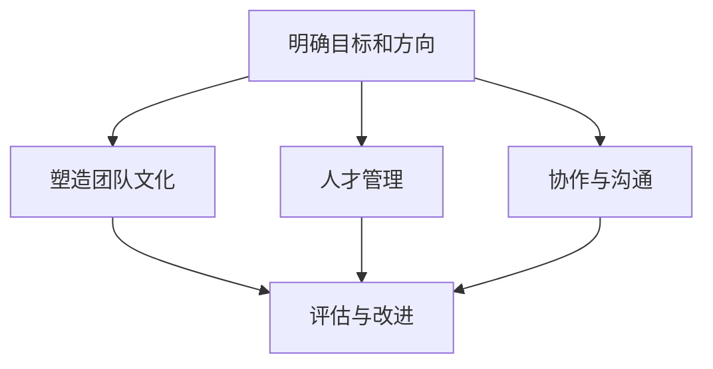
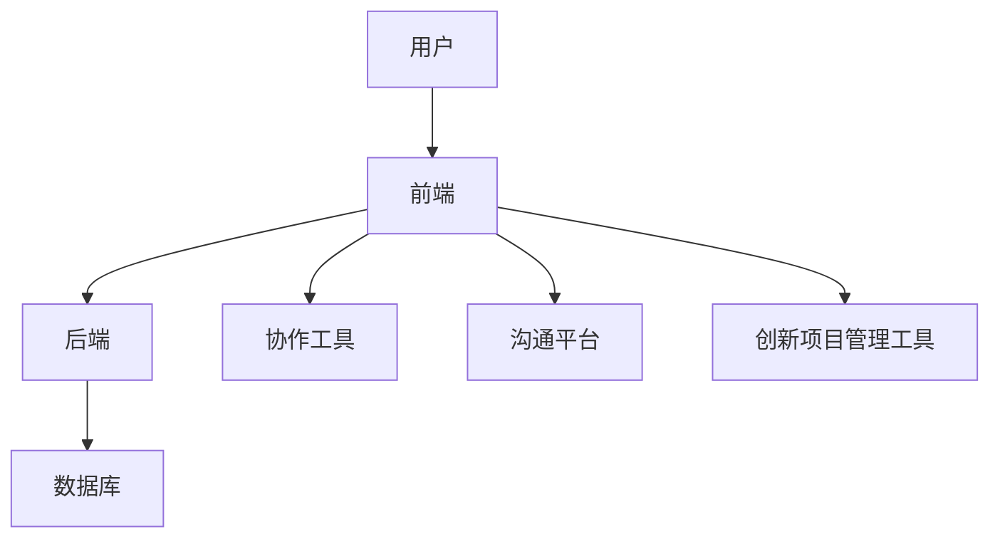

                 


### 领导力与创新生态：营造创新友好的团队环境

关键词：领导力、创新生态、团队环境、人才管理、协作与沟通

摘要：本文将探讨领导力与创新生态之间的关系，以及如何构建一个创新友好的团队环境。通过分析理论框架、案例分析以及实践指南，我们将深入理解领导力在创新过程中的作用，并提供构建创新生态的具体方法和最佳实践。

### 第一部分：领导力与创新生态概述

#### 第1章：引言

**1.1 创新与领导力的重要性**

创新是现代企业发展的重要驱动力，而领导力则是推动创新的核心要素。领导力不仅影响着团队成员的积极性，还决定了团队在面对变革时的应变能力。因此，理解创新与领导力之间的关系对于构建创新生态至关重要。

**1.2 创新生态的定义与构成**

创新生态是一个由多种要素构成的复杂系统，包括团队文化、人才管理、协作与沟通等。一个健康、创新友好的生态能够激发团队成员的创造力，促进知识共享和合作。

#### 第2章：领导力在创新生态中的角色

**2.1 领导力与团队创新的关系**

领导力不仅是团队凝聚力的源泉，还是推动创新的关键因素。领导者需要通过激励、引导和协调，为团队创造一个有利于创新的环境。

**2.2 领导力框架与模型介绍**

本文将介绍几种常见的领导力框架与模型，如变革型领导力、服务型领导和创新领导力，并分析它们在创新生态中的应用。

#### 第3章：创新生态的理论基础

**3.1 创新过程与模型**

了解创新过程和模型有助于领导者更好地引导团队进行创新。本文将介绍几种典型的创新过程模型，如线性模型、迭代模型和综合模型。

**3.2 创新生态系统动态**

创新生态系统的动态变化对领导力提出了新的要求。领导者需要具备前瞻性，及时调整战略以应对环境变化。

### 第二部分：创新友好的团队环境构建

#### 第4章：团队文化与环境

**4.1 团队文化的塑造**

团队文化是创新生态的重要组成部分。领导者需要通过明确价值观、倡导开放和包容的氛围，塑造一个有利于创新的团队文化。

**4.2 促进创新友好的工作环境**

领导者可以通过优化工作流程、提供资源支持等方式，为团队创造一个创新友好的工作环境。

#### 第5章：人才管理与激励

**5.1 人才筛选与培养**

领导者需要具备敏锐的洞察力，能够发现和培养具有创新潜力的人才。同时，要为团队成员提供持续的学习和成长机会。

**5.2 激励机制与创新**

适当的激励机制能够激发团队成员的积极性，促进创新。本文将介绍几种常见的激励机制，如奖励制度、荣誉制度等。

#### 第6章：团队协作与沟通

**6.1 团队协作技巧**

团队协作是实现创新的关键。领导者需要掌握有效的协作技巧，如任务分配、角色定位等。

**6.2 创新过程中的有效沟通**

沟通是团队协作的基础。领导者需要确保团队成员之间的信息流畅，避免因沟通不畅导致创新受阻。

#### 第7章：案例分析：成功构建创新生态的企业

**7.1 案例背景介绍**

本文将分析一家成功构建创新生态的企业，了解其领导力策略、团队文化以及激励机制等。

**7.2 案例分析：成功因素与挑战**

通过对案例的深入分析，总结成功构建创新生态的企业所面临的主要挑战以及应对策略。

### 第三部分：实践指南与最佳实践

#### 第8章：构建创新友好团队环境的步骤与方法

**8.1 实践步骤**

本文将提供一套系统的构建创新友好团队环境的步骤，帮助领导者逐步实现这一目标。

**8.2 最佳实践分享**

本文将分享一些成功企业的最佳实践，为读者提供有益的借鉴。

#### 第9章：创新团队环境评估与改进

**9.1 评估方法**

领导者需要定期评估团队环境的创新性，本文将介绍几种常用的评估方法。

**9.2 改进策略**

根据评估结果，领导者可以制定相应的改进策略，以持续优化团队环境。

#### 第10章：未来趋势与展望

**10.1 创新生态的发展趋势**

本文将分析创新生态的未来发展趋势，帮助领导者把握行业动向。

**10.2 领导力在创新环境中的未来角色**

领导者需要不断适应和创新，以适应未来创新环境的需求。

### 结论

领导力与创新生态密切相关，构建创新友好的团队环境是推动企业持续发展的重要途径。通过本文的探讨，希望读者能够深入理解领导力在创新过程中的作用，并掌握构建创新生态的方法与技巧。

**作者：AI天才研究院/AI Genius Institute & 禅与计算机程序设计艺术 /Zen And The Art of Computer Programming**

本文内容丰富，涵盖了领导力、创新生态、团队环境等核心概念，并通过理论框架、案例分析以及实践指南，为读者提供了全面的理解和实用的指导。在接下来的部分中，我们将对每个章节进行深入分析，以帮助读者更好地掌握相关知识点。

## 第1章：引言

### 1.1 创新与领导力的重要性

创新是企业在激烈市场竞争中脱颖而出的关键。一个具备创新力的团队，能够不断推出新产品、优化现有服务，从而在市场中占据有利地位。然而，创新并非一蹴而就，它需要一个良好的生态环境来孕育和发展。而在这个生态系统中，领导力发挥着至关重要的作用。

首先，领导力是团队凝聚力的源泉。一个强有力的领导者能够激发团队成员的积极性，增强团队的协作能力，形成共同的目标和价值观。这种凝聚力为创新提供了坚实的基础。其次，领导力是推动团队变革的核心力量。在创新过程中，团队不可避免地会遇到各种挑战和障碍。领导者需要具备前瞻性，能够预判市场趋势，引领团队走出困境。此外，领导力还是激励团队成员持续创新的重要手段。通过设立激励机制，领导者能够激发团队成员的潜力，使其在创新过程中发挥出最大价值。

总之，创新与领导力之间相互促进、密不可分。一个具备创新力的团队，离不开强有力的领导力支持。反之，一个优秀的领导者，也深知创新对企业发展的重要性，能够通过有效的领导力策略，推动团队不断突破自我，实现持续创新。

### 1.2 创新生态的定义与构成

创新生态是一个复杂而动态的系统，它涵盖了企业内部以及外部的各种要素。首先，从内部来看，创新生态包括团队文化、人才管理、协作与沟通等多个方面。团队文化是创新生态的核心，它决定了团队成员的价值观和行为方式。一个开放、包容、鼓励创新的文化，能够激发团队成员的创造力和积极性。人才管理则是创新生态的重要保障，通过选拔、培养和激励，企业能够确保拥有一支具备创新能力的团队。协作与沟通则是创新过程中的关键环节，有效的协作和沟通能够促进知识的共享和整合，提高创新效率。

其次，从外部来看，创新生态还包括合作伙伴、客户和竞争对手等外部因素。合作伙伴能够为企业提供技术、资源和市场支持，帮助企业在创新过程中降低风险。客户则是创新生态的重要反馈源，他们的需求、反馈和期望，能够指导企业不断优化产品和服务。竞争对手则构成了企业创新的外部压力，推动企业不断追求卓越，提升自身竞争力。

总之，创新生态是一个由多种要素构成的复杂系统，它不仅需要企业内部的共同努力，还需要外部环境的支持和互动。一个健康的创新生态，能够为企业提供持续的创新动力，推动企业实现长期发展。

## 第2章：领导力在创新生态中的角色

### 2.1 领导力与团队创新的关系

领导力在团队创新中扮演着至关重要的角色。一个优秀的领导者不仅能够激发团队的创新能力，还能够为团队提供明确的方向和强大的支持。首先，领导者需要具备远见和前瞻性，能够预判市场趋势和行业动向，为团队指明创新方向。这种前瞻性有助于团队避免盲目跟风，确保创新项目的实际价值和市场竞争力。

其次，领导者需要具备强大的沟通和协调能力，确保团队内部的信息畅通和协作高效。在创新过程中，团队成员之间需要频繁交流、分享知识和经验，领导者需要搭建一个良好的沟通平台，促进团队成员之间的合作和信任。同时，领导者还需要协调内外部资源，确保团队在创新过程中能够得到充分的支持和保障。

此外，领导者还需要具备激励和培养团队成员的能力。创新是一个充满挑战和不确定性的过程，团队成员需要具备高度的自我驱动力和持续学习的意愿。领导者可以通过设立激励机制、提供成长机会和建立学习型组织等方式，激发团队成员的潜力，推动团队不断创新。

总之，领导力在团队创新中发挥着不可替代的作用。一个优秀的领导者能够为团队提供明确的方向和强大的支持，激发团队成员的创新能力，推动团队实现持续创新。

### 2.2 领导力框架与模型介绍

为了更好地理解领导力在创新生态中的作用，我们可以介绍几种常见的领导力框架与模型。这些框架和模型不仅提供了理论支持，还可以在实际工作中指导领导者如何有效地推动团队创新。

**1. 变革型领导力模型**

变革型领导力强调领导者通过激励和启发团队成员，引导他们超越自我，实现共同目标。这种领导力模型的核心在于领导者能够识别和利用变革机会，推动团队从现状走向更好的未来。变革型领导者通常具备以下特征：

- **愿景引领**：领导者能够清晰地描绘未来的愿景，并激发团队成员为之努力。
- **激励赋能**：领导者通过鼓励和赞赏，激发团队成员的积极性和创造力。
- **个人发展**：领导者关注团队成员的个人成长，提供培训和指导，帮助他们提升能力。

**2. 服务型领导力模型**

服务型领导力强调领导者首先作为一名“仆人”，关注团队成员的需求，为他们提供支持和帮助。这种领导力模型的核心在于领导者通过服务团队成员，提高团队的整体效能和满意度。服务型领导者通常具备以下特征：

- **倾听与理解**：领导者善于倾听团队成员的意见和需求，理解他们的困难和挑战。
- **资源分配**：领导者确保团队成员能够获得所需资源，包括时间、资金和培训等。
- **团队利益**：领导者将团队利益置于个人利益之上，确保团队目标的实现。

**3. 创新型领导力模型**

创新型领导力模型关注领导者如何在团队中营造创新氛围，推动持续创新。这种领导力模型的核心在于领导者具备创新思维和领导能力，能够引领团队突破传统，实现创新。创新型领导者通常具备以下特征：

- **创新思维**：领导者具备开放和创新的思维模式，能够接受新观念和新技术。
- **风险管理**：领导者鼓励团队成员尝试新事物，同时具备有效的风险管理能力，确保创新项目的成功。
- **激励机制**：领导者通过设立创新奖励和激励机制，鼓励团队成员积极参与创新活动。

这些领导力框架和模型在实际工作中可以根据具体情况进行灵活运用。领导者可以根据团队的实际情况和需求，选择合适的领导力模型，以推动团队创新，实现企业目标。

### 第3章：创新生态的理论基础

#### 3.1 创新过程与模型

创新是一个复杂的过程，涉及到多个阶段和要素。为了更好地理解创新过程，我们可以介绍几种典型的创新过程模型，如线性模型、迭代模型和综合模型。

**1. 线性模型**

线性模型将创新过程分为若干个阶段，每个阶段都有明确的任务和目标。典型的线性模型包括以下阶段：

- **问题识别**：识别出需要解决的问题或机会。
- **创意生成**：通过头脑风暴、思维导图等方式，生成创意和解决方案。
- **方案评估**：对创意进行评估，筛选出具有潜力的方案。
- **原型开发**：开发原型，验证解决方案的可行性。
- **产品化**：将原型转化为产品，推向市场。

线性模型的优势在于结构清晰，便于管理和监控。然而，其缺点在于创新过程缺乏灵活性，难以应对复杂多变的环境。

**2. 迭代模型**

迭代模型强调创新过程的反复迭代和逐步完善。典型的迭代模型包括以下阶段：

- **问题识别**：识别出需要解决的问题或机会。
- **创意生成**：生成创意和解决方案。
- **原型开发**：开发原型，验证解决方案的可行性。
- **用户反馈**：收集用户反馈，优化原型。
- **再迭代**：根据用户反馈，对原型进行多次迭代，直至满足用户需求。

迭代模型的优势在于灵活性高，能够快速响应市场变化。然而，其缺点在于开发周期较长，需要投入更多的时间和资源。

**3. 综合模型**

综合模型将线性模型和迭代模型相结合，根据实际情况选择合适的阶段和流程。典型的综合模型包括以下阶段：

- **问题识别**：识别出需要解决的问题或机会。
- **创意生成**：生成创意和解决方案。
- **方案评估**：对创意进行评估，筛选出具有潜力的方案。
- **原型开发**：开发原型，验证解决方案的可行性。
- **用户反馈**：收集用户反馈，优化原型。
- **再评估与迭代**：根据用户反馈，对原型进行多次迭代，直至满足用户需求。
- **产品化**：将原型转化为产品，推向市场。

综合模型的优势在于能够灵活应对复杂环境，同时保持创新的连续性和稳定性。

#### 3.2 创新生态系统动态

创新生态系统是一个由多种要素构成的复杂系统，这些要素相互作用，共同推动创新的发展。为了更好地理解创新生态系统的动态，我们可以从以下几个方面进行分析：

**1. 创新资源**

创新资源是创新生态系统的基础，包括资金、技术、人才和市场等。这些资源通过有效的配置和整合，为创新提供支持。例如，企业可以通过投资研发、引进高端人才、拓展市场渠道等方式，增强自身的创新能力。

**2. 创新机制**

创新机制是创新生态系统的关键，包括政策、法规、市场规则等。这些机制为创新提供保障，促进创新活动的顺利进行。例如，政府可以通过制定创新优惠政策、提供研发资金支持等方式，激发企业的创新活力。

**3. 创新网络**

创新网络是创新生态系统的重要组成部分，包括企业、科研机构、高校、客户和供应商等。这些网络通过合作、交流、共享信息等途径，推动创新的发展。例如，企业可以通过与科研机构合作，共同开展技术研发，提升自身创新能力。

**4. 创新环境**

创新环境是创新生态系统的重要保障，包括政策环境、市场环境、文化环境等。这些环境为创新提供良好的外部条件，促进创新活动的持续发展。例如，一个开放、包容、鼓励创新的社会文化环境，能够激发人们的创新热情，推动创新生态系统的健康发展。

总之，创新生态系统是一个复杂而动态的系统，涉及多个要素和环节。理解创新生态系统的动态，有助于领导者更好地把握创新趋势，推动企业实现持续创新。

### 第4章：团队文化与环境

#### 4.1 团队文化的塑造

团队文化是创新生态系统的核心，它决定了团队成员的价值观和行为方式。一个健康、创新友好的团队文化能够激发团队成员的创造力，促进知识的共享和合作。那么，如何塑造一个有利于创新的团队文化呢？

首先，领导者需要明确团队的价值观和目标。这可以通过制定明确的使命、愿景和价值观来实现。这些价值观和目标应该与企业的战略方向相一致，并能够激发团队成员的认同感和归属感。

其次，领导者需要通过行动和言语，践行团队价值观。例如，在决策过程中，领导者应该优先考虑团队的整体利益，而不是个人利益。同时，领导者应该鼓励团队成员提出不同的观点和意见，创造一个开放、包容的沟通环境。

此外，领导者可以通过组织团队建设活动和培训，提高团队成员的凝聚力和协作能力。这些活动和培训可以包括团队拓展、知识分享会、创新竞赛等，帮助团队成员更好地了解彼此，增进信任和合作。

#### 4.2 促进创新友好的工作环境

一个创新友好的工作环境能够为团队成员提供良好的创新氛围和条件。那么，如何促进创新友好的工作环境呢？

首先，领导者需要为团队成员提供充足的资源和支持。这包括资金、技术、时间等。例如，企业可以为创新项目提供专项经费，为团队成员提供先进的技术工具和培训机会，确保他们能够在创新过程中得到充分的资源保障。

其次，领导者需要建立一个鼓励创新和容忍失败的工作氛围。在创新过程中，失败是不可避免的。领导者应该鼓励团队成员勇于尝试新事物，对失败持开放态度。同时，领导者应该建立一套完善的激励机制，对成功的创新项目和失败的尝试都给予适当的认可和奖励。

此外，领导者还需要确保团队成员之间的信息畅通和协作高效。这可以通过建立有效的沟通渠道和协作平台来实现。例如，企业可以设立内部论坛、定期组织团队会议、使用协同办公工具等，促进团队成员之间的信息交流和协作。

总之，塑造一个健康、创新友好的团队文化和工作环境，是推动团队创新的重要保障。通过明确价值观、提供资源支持、鼓励创新和建立高效的沟通机制，领导者可以为团队成员创造一个良好的创新氛围，激发他们的创造力和潜能。

### 第5章：人才管理与激励

#### 5.1 人才筛选与培养

在创新生态中，人才是推动创新的核心要素。领导者需要具备敏锐的洞察力，能够发现和培养具有创新潜力的人才。以下是一些关键步骤和策略：

**1. 筛选策略**

- **能力评估**：通过对候选人的技能、经验和专业知识进行评估，确保他们具备完成创新任务所需的能力。
- **潜力评估**：除了能力之外，领导者还需要评估候选人的潜力，包括他们的学习能力和适应能力。
- **价值观匹配**：确保候选人与团队的文化和价值观相符，这有助于提高团队协作效率和创新能力。

**2. 培养策略**

- **持续学习**：为团队成员提供培训和学习机会，帮助他们不断提升自身能力。这可以通过内部培训、外部培训、在线课程等方式实现。
- **跨部门交流**：鼓励团队成员跨部门交流，扩大他们的视野，提高他们的创新能力。
- **导师制度**：建立导师制度，让经验丰富的团队成员指导新成员，帮助他们快速融入团队，提高创新能力。

通过有效的筛选和培养策略，领导者可以确保团队拥有一支具备创新潜力的人才队伍，为企业的持续创新提供有力支持。

#### 5.2 激励机制与创新

激励机制是激发团队成员积极性和创造力的重要手段。在创新生态中，领导者需要设计合适的激励机制，以鼓励团队成员积极参与创新活动。以下是一些常用的激励机制：

**1. 奖金制度**

- **创新奖金**：为成功创新的项目或个人提供奖金，激励他们继续创新。
- **绩效奖金**：根据团队成员的绩效表现，提供绩效奖金，激励他们提高工作效率和质量。

**2. 荣誉制度**

- **荣誉称号**：为在创新中表现出色的个人或团队授予荣誉称号，提升他们的社会地位和认可度。
- **奖项评选**：定期举行创新奖项评选活动，表彰在创新中取得显著成绩的个人或团队。

**3. 职业发展机会**

- **晋升机会**：为在创新中表现突出的团队成员提供晋升机会，激励他们不断追求卓越。
- **轮岗机会**：为团队成员提供跨部门轮岗机会，帮助他们拓展视野，提高综合素质。

通过这些激励机制，领导者可以激发团队成员的积极性和创造力，推动团队不断创新，实现企业的长期发展。

### 第6章：团队协作与沟通

#### 6.1 团队协作技巧

团队协作是实现创新的关键。以下是一些关键的团队协作技巧：

**1. 明确目标和角色**

- **共同目标**：确保团队成员对共同目标有清晰的理解，明确各自的职责和任务。
- **角色定位**：每个成员都应了解自己在团队中的角色和责任，避免重复工作和责任模糊。

**2. 沟通技巧**

- **开放沟通**：鼓励团队成员在会议上自由表达观点，鼓励不同的声音。
- **倾听与反馈**：领导者需要倾听团队成员的意见，提供及时的反馈，帮助团队成员改进工作。

**3. 协作工具**

- **项目管理工具**：使用项目管理工具（如Trello、JIRA等），帮助团队成员跟踪项目进度，确保协作高效。

**4. 冲突管理**

- **及时解决**：在冲突发生时，及时沟通，找出根本原因，制定解决方案。
- **求同存异**：尊重团队成员的不同观点，寻求共同点，避免不必要的冲突。

通过有效的团队协作技巧，领导者可以确保团队成员能够高效地合作，推动创新项目的顺利进行。

#### 6.2 创新过程中的有效沟通

在创新过程中，沟通是确保项目顺利进行和团队协作的关键。以下是一些有效的沟通策略：

**1. 定期会议**

- **项目启动会议**：在项目开始时召开会议，明确项目目标、任务和时间表。
- **进度会议**：定期召开会议，更新项目进度，解决遇到的问题。

**2. 对话与讨论**

- **头脑风暴**：鼓励团队成员自由发表意见，提出创意和解决方案。
- **深度讨论**：对关键问题进行深入讨论，确保所有观点都得到充分探讨。

**3. 持续反馈**

- **及时反馈**：对团队成员的工作进行及时反馈，帮助他们改进。
- **反馈循环**：建立反馈机制，确保项目过程中每个阶段的成果都能得到评估和优化。

**4. 信息透明**

- **共享信息**：确保所有团队成员都能访问到所需的信息，避免信息孤岛。
- **信息公开**：在适当的情况下，公开项目信息，增加团队成员的参与感和责任感。

通过有效的沟通策略，领导者可以确保团队成员之间的信息流畅，避免误解和冲突，推动创新项目的顺利进行。

### 第7章：案例分析：成功构建创新生态的企业

#### 7.1 案例背景介绍

为了更深入地理解如何成功构建创新生态，我们以一家知名科技公司——谷歌（Google）为例进行分析。谷歌以其创新的企业文化、强大的领导力和高效的团队协作而闻名，成为众多企业学习的典范。

**1. 企业背景**

谷歌成立于1998年，最初以搜索引擎业务起家，现已发展成为一个涵盖云计算、人工智能、广告技术等多个领域的跨国科技公司。谷歌的成功得益于其不断创新的企业文化和领导力策略。

**2. 创新生态的构建**

- **领导力策略**：谷歌的创始人拉里·佩奇和谢尔盖·布林强调开放、包容和创新的企业文化。他们通过激励员工、提供资源和自由度，鼓励员工提出创新想法。
- **团队协作**：谷歌注重团队协作和知识共享，通过内部邮件系统、团队讨论和定期会议，确保团队成员之间的信息畅通和合作高效。
- **人才培养**：谷歌为员工提供丰富的培训和发展机会，包括内部培训、外部课程和职业规划咨询，帮助员工不断提升自身能力。

#### 7.2 案例分析：成功因素与挑战

**1. 成功因素**

- **企业愿景**：谷歌的愿景是“整合全球信息，使人人皆可访问并从中受益”。这一愿景为谷歌的创新提供了明确的方向和动力。
- **领导力**：谷歌的领导层通过变革型领导力和服务型领导力，激发员工的创新潜力，推动企业持续创新。
- **团队文化**：谷歌的企业文化鼓励开放、包容和合作，为员工提供了一个自由创新的环境。

**2. 面临的挑战**

- **竞争压力**：随着科技行业的快速发展，谷歌面临着来自各大科技公司的激烈竞争。为了保持领先地位，谷歌需要不断推动创新，提升产品和服务质量。
- **人才流失**：由于科技行业的吸引力，谷歌面临人才流失的风险。为了留住优秀人才，谷歌需要提供有竞争力的薪酬和福利，同时提供良好的职业发展机会。
- **文化冲突**：随着企业的全球化发展，谷歌需要应对不同文化背景的员工之间的文化冲突。领导者需要具备跨文化沟通和管理的技能，促进团队合作。

通过分析谷歌的案例，我们可以看到，成功构建创新生态需要明确的愿景、强大的领导力和积极的团队文化。同时，企业也需要应对各种挑战，不断优化和创新，以保持持续竞争力。

### 第8章：构建创新友好团队环境的步骤与方法

#### 8.1 实践步骤

构建一个创新友好的团队环境是一个系统性的过程，需要遵循一系列明确的步骤。以下是构建创新友好团队环境的实践步骤：

**1. 确定创新目标**

首先，团队需要明确创新的总体目标。这包括定义创新的方向、目标市场和期望成果。明确的目标有助于团队在创新过程中保持一致，避免迷失方向。

**2. 建立创新团队**

成立一个专门的创新团队，负责推动创新项目的实施。团队成员应具备多样化的背景和技能，以便从不同角度提出创新方案。

**3. 创新文化塑造**

领导者需要通过行动和言语，塑造一个鼓励创新、包容失败的文化。这可以通过设立创新奖项、鼓励自由讨论和提供创新培训来实现。

**4. 资源配置**

为创新团队提供必要的资源，包括资金、技术和人力资源。确保团队在创新过程中能够得到充分的支持。

**5. 创新过程管理**

采用合适的创新过程模型，如迭代模型或综合模型，确保创新项目的有序进行。定期评估项目进度，及时调整策略。

**6. 沟通与协作**

建立有效的沟通渠道，确保团队成员之间的信息畅通和协作高效。使用项目管理工具，如Trello或JIRA，跟踪项目进度和任务分配。

**7. 持续改进**

在创新过程中，不断收集反馈，优化创新方案。通过持续改进，提高创新项目的成功率。

#### 8.2 最佳实践分享

以下是一些成功企业的最佳实践，供读者参考：

**1. 亚马逊（Amazon）**

- **“Day 1”文化**：亚马逊创始人杰夫·贝索斯强调公司的“Day 1”文化，即保持创业心态，持续创新。
- **“六盒模型”**：亚马逊采用“六盒模型”来管理创新项目，确保项目在市场需求、技术可行性、用户体验等方面都得到充分评估。

**2. 谷歌（Google）**

- **“20%时间”项目**：谷歌允许员工将其20%的工作时间用于个人感兴趣的创新项目。
- **“头脑风暴”会议**：谷歌定期举行“头脑风暴”会议，鼓励员工自由提出创新想法。

**3. 强生（Johnson & Johnson）**

- **“创新实验室”**：强生设立了创新实验室，为员工提供自由探索和实验的空间。
- **“员工建议计划”**：强生鼓励员工提出改进建议，对被采纳的建议给予奖励。

通过借鉴这些成功企业的最佳实践，领导者可以更好地构建创新友好的团队环境，推动团队持续创新。

### 第9章：创新团队环境评估与改进

#### 9.1 评估方法

为了确保创新团队环境的健康和高效，定期评估是必不可少的。以下是一些常用的评估方法：

**1. 用户反馈**

- **用户满意度调查**：通过问卷调查、访谈等方式，收集用户对团队产品和服务的反馈，了解用户需求和期望。
- **用户行为分析**：通过分析用户行为数据，了解用户对团队创新成果的使用情况和反馈。

**2. 绩效指标**

- **创新项目成功率**：评估创新项目的成功率，包括项目完成度、市场接受度和商业价值等。
- **团队绩效**：评估团队在创新过程中的绩效，如完成任务的速度、质量、协作效果等。

**3. 团队氛围**

- **团队满意度调查**：通过问卷调查，了解团队成员对团队文化和工作环境的满意度。
- **团队互动分析**：通过分析团队成员之间的沟通频率、互动内容和协作效果，评估团队氛围。

**4. 外部评价**

- **行业排名**：通过参与行业评选和排名，了解团队在行业中的创新表现和地位。
- **专家评审**：邀请行业专家对团队的创新成果进行评审，获取外部评价和建议。

#### 9.2 改进策略

根据评估结果，领导者可以制定相应的改进策略，以优化创新团队环境。以下是一些建议：

**1. 文化调整**

- **强化团队价值观**：明确团队的价值观和行为准则，确保团队成员对团队文化的认同。
- **促进知识共享**：建立知识共享平台，鼓励团队成员分享经验和最佳实践。

**2. 资源优化**

- **提高资源利用率**：合理分配资源，确保团队在创新过程中能够得到充分的支持。
- **引入新技术**：关注行业新技术动态，及时引入和应用新技术，提升创新能力。

**3. 激励机制**

- **设立创新奖励**：根据创新成果和团队绩效，设立相应的奖励制度，激励团队成员积极参与创新。
- **提供成长机会**：为团队成员提供培训和学习机会，帮助他们不断提升自身能力。

**4. 沟通与协作**

- **优化沟通渠道**：确保团队成员之间的信息畅通，使用有效的沟通工具和平台。
- **加强团队协作**：通过团队建设活动和培训，提高团队成员的协作能力和团队凝聚力。

通过定期评估和持续的改进，领导者可以不断提升创新团队的环境和效能，推动团队实现持续创新。

### 第10章：未来趋势与展望

#### 10.1 创新生态的发展趋势

随着科技的飞速发展，创新生态正在经历深刻的变革。以下是一些创新生态的发展趋势：

**1. 数字化转型**

数字化转型已经成为企业创新的重要方向。通过大数据、云计算、人工智能等技术的应用，企业可以更加精准地洞察用户需求，提高产品和服务质量。

**2. 开放合作**

在创新生态中，开放合作成为一种趋势。企业通过跨界合作、生态系统建设等方式，整合各方资源，共同推动创新。

**3. 绿色创新**

随着环保意识的提高，绿色创新成为企业创新的重要领域。企业通过研发环保技术和产品，实现可持续发展。

**4. 社会创新**

社会创新关注企业如何通过创新解决社会问题，提升社会福利。这包括教育、医疗、社区服务等领域。

#### 10.2 领导力在创新环境中的未来角色

在未来的创新环境中，领导力将扮演更加重要的角色。以下是一些未来领导力的趋势：

**1. 情感领导**

未来的领导者需要具备更强的情感智能，能够理解和管理团队成员的情感，建立信任和合作关系。

**2. 卓越领导**

领导者需要不断提升自身的领导能力和专业知识，成为卓越领导者，引领团队实现卓越绩效。

**3. 生态领导**

未来的领导者需要具备生态系统思维，关注企业内外部的资源整合和协同创新，推动企业生态系统的健康发展。

**4. 风险领导**

领导者需要具备承担风险的能力，勇于尝试新事物，推动企业实现突破性创新。

总之，未来创新生态的发展将带来新的挑战和机遇。领导者需要不断提升自身的领导力，适应和创新，以推动企业实现持续发展。

### 结论

本文围绕“领导力与创新生态：营造创新友好的团队环境”这一主题，从背景介绍、理论框架、案例分析、实践指南等多个角度进行了深入探讨。通过分析创新与领导力的关系，介绍了创新生态的理论基础，探讨了团队文化、人才管理和团队协作等方面，为领导者提供了构建创新友好团队环境的策略和方法。同时，通过案例分析，展示了成功企业的创新实践，为读者提供了有益的借鉴。未来，随着科技的不断发展，创新生态将面临新的挑战和机遇。领导者需要不断提升自身的领导力，适应和创新，以推动企业实现持续发展。本文希望对读者在理解和实践领导力与创新生态方面有所帮助，共同营造一个创新友好的团队环境。

### 附录：关键概念术语说明与联系

在本篇博客中，我们涉及了多个关键概念和术语，这些概念和术语构成了本文的理论基础和核心内容。以下是对这些关键概念和术语的说明，以及它们之间的联系。

#### 关键概念和术语说明：

1. **领导力**：领导力是指领导者通过激励、引导和协调团队成员，实现共同目标的能力。在创新生态中，领导力是推动创新的关键因素。

2. **创新生态**：创新生态是指由多种要素（如团队文化、人才管理、协作与沟通等）构成的复杂系统，这些要素相互作用，共同推动创新的发展。

3. **团队文化**：团队文化是指团队成员共同遵循的价值观、信念和行为准则，它对团队的创新能力和协作效率有重要影响。

4. **人才管理**：人才管理是指通过选拔、培养和激励，确保团队拥有具备创新能力的优秀人才。

5. **协作与沟通**：协作与沟通是团队创新过程中必不可少的环节，有效的协作和沟通能够促进知识的共享和整合，提高创新效率。

#### 关键概念和术语联系：

1. **领导力与创新生态的关系**：领导力是创新生态的核心要素，通过激励、引导和协调，领导力能够推动团队文化的塑造，促进人才管理和协作与沟通，从而构建一个创新友好的团队环境。

2. **团队文化与人才管理**：团队文化为人才管理提供了基础，通过塑造一个开放、包容和创新的文化，能够吸引和培养具有创新能力的优秀人才。

3. **人才管理与协作与沟通**：人才管理通过选拔和培养，确保团队拥有具备创新能力的成员，而这些成员之间的有效协作和沟通则是实现创新目标的关键。

4. **协作与沟通与团队文化**：协作与沟通是团队文化的重要组成部分，一个健康、创新友好的团队文化能够促进团队成员之间的协作和沟通，提高创新效率。

通过这些关键概念和术语的说明及其联系，我们可以更好地理解领导力与创新生态之间的关系，以及如何通过构建创新友好的团队环境，推动团队实现持续创新。

### 附录：算法原理讲解与流程图

在本篇博客中，我们探讨了如何构建一个创新友好的团队环境。为了更好地理解这一过程，我们可以将其视为一个算法，通过以下步骤进行详细阐述。

#### 算法原理

构建创新友好团队环境的算法可以概括为以下几个步骤：

1. **明确目标和方向**：首先，团队需要明确创新的目标和方向。这可以通过制定明确的使命、愿景和目标来实现。

2. **塑造团队文化**：其次，领导者需要通过行动和言语，塑造一个开放、包容和鼓励创新的文化。这可以通过设立团队价值观、组织团队建设活动和提供创新培训来实现。

3. **人才管理**：团队需要选拔和培养具备创新能力的优秀人才。这可以通过选拔有潜力的人才、提供持续学习和成长机会以及设立激励机制来实现。

4. **协作与沟通**：为了确保创新过程的顺利进行，团队需要建立有效的协作和沟通机制。这可以通过使用项目管理工具、定期组织团队会议和建立信息共享平台来实现。

5. **评估与改进**：最后，团队需要定期评估创新环境的效果，并根据评估结果进行持续改进。这可以通过用户反馈、绩效指标和团队氛围评估来实现。

#### 流程图

下面是一个使用Mermaid绘制的流程图，展示构建创新友好团队环境的步骤：



在这个流程图中，每个节点代表一个步骤，箭头表示步骤之间的依赖关系。通过这个流程图，我们可以清晰地看到构建创新友好团队环境的整体流程。

### 附录：数学公式与解释

在构建创新友好团队环境的过程中，数学公式和解释能够帮助我们更好地理解相关概念和原理。以下是几个关键数学公式及其解释：

#### 1. 创新成功率公式

$$
成功率 = \frac{成功项目数}{总项目数}
$$

这个公式表示创新成功率，即成功项目数与总项目数的比值。通过计算这个指标，我们可以评估团队在创新过程中的成功率。

#### 2. 领导力效能公式

$$
效能 = 领导力 \times 创新氛围 \times 人才储备
$$

这个公式表示领导力效能，即领导力、创新氛围和人才储备三者之间的乘积。这个公式表明，一个高效的团队需要具备强大的领导力、良好的创新氛围和充足的人才储备。

#### 3. 团队协作效率公式

$$
效率 = \frac{完成工作量}{投入时间}
$$

这个公式表示团队协作效率，即完成工作量与投入时间的比值。通过这个指标，我们可以评估团队在协作过程中的效率。

#### 4. 团队氛围满意度公式

$$
满意度 = \frac{积极反馈数}{总反馈数}
$$

这个公式表示团队氛围满意度，即积极反馈数与总反馈数的比值。通过计算这个指标，我们可以了解团队成员对团队氛围的满意度。

通过这些数学公式，我们可以量化团队在创新过程中的关键指标，从而更好地评估和改进团队环境。

### 附录：系统分析与架构设计方案

在本篇博客中，我们探讨了如何构建一个创新友好的团队环境。为了更好地实现这一目标，我们将对系统进行分析，并设计一个全面的架构方案。

#### 1. 问题场景介绍

在一个快速发展的科技公司中，领导层意识到构建一个创新友好的团队环境对于公司的发展至关重要。公司希望在保持现有团队协作效率的基础上，进一步提升创新能力和团队凝聚力。

#### 2. 项目介绍

为了实现这一目标，公司决定启动一个名为“创新友好团队环境构建”的项目。该项目旨在通过优化团队文化、提升人才管理、加强协作与沟通，构建一个创新友好的团队环境。

#### 3. 系统功能设计

系统功能设计主要包括以下几个方面：

- **团队文化管理**：提供平台用于建立和传播团队价值观，组织团队建设活动，监测团队氛围。
- **人才管理**：实现人才的选拔、培养和激励，提供个人发展计划和职业规划。
- **协作与沟通**：提供协作工具和沟通平台，确保团队成员之间的信息畅通和协作高效。
- **创新项目管理**：支持创新项目的立项、进度跟踪、评估和改进。

以下是一个使用Mermaid绘制的领域模型类图，展示系统的核心类及其关系：

```mermaid
classDiagram
    Team <<class>> Team
    Culture <<class>> Culture
    Employee <<class>> Employee
    Communication <<class>> Communication
    InnovationProject <<class>> InnovationProject

    Team --|> Culture
    Team --|> Employee
    Team --|> Communication
    Team --|> InnovationProject
    Culture --|> Employee
    Culture --|> InnovationProject
    Employee --|> InnovationProject
    Communication --|> Employee
    Communication --|> InnovationProject
```

#### 4. 系统架构设计

系统架构设计主要包括以下几个方面：

- **前端架构**：采用React框架，提供友好的用户界面和丰富的交互功能。
- **后端架构**：采用Spring Boot框架，提供稳定的服务器和数据处理能力。
- **数据库架构**：采用MySQL数据库，存储用户数据、团队信息和项目进度等。

以下是一个使用Mermaid绘制的系统架构图，展示系统的整体架构：



在这个架构图中，用户通过前端访问系统，前端通过API与后端交互，后端处理数据并与数据库进行通信，同时提供协作工具、沟通平台和创新项目管理工具，以满足系统的功能需求。

#### 5. 系统接口设计和系统交互

系统接口设计主要包括以下部分：

- **用户接口**：提供用户注册、登录、信息查询等功能。
- **API接口**：提供团队文化管理、人才管理、协作与沟通、创新项目管理等接口。

以下是一个使用Mermaid绘制的系统接口设计图，展示系统的接口设计和交互：

```mermaid
sequenceDiagram
    A[用户] --> B[用户接口]
    B --> C[后端]
    C --> D[API接口]
    D --> E[数据库]
```

在这个序列图中，用户通过用户接口与系统进行交互，用户接口调用后端API接口，后端API接口处理请求并与数据库进行通信，从而实现系统的功能。

通过上述系统分析和架构设计，我们可以构建一个创新友好的团队环境，提高团队的协作效率和创新能力，为公司的发展提供有力支持。

### 附录：项目实战

#### 环境安装

为了更好地实践构建创新友好团队环境的方法，我们将使用一个基于Django框架的Web应用作为项目实例。以下是环境安装步骤：

1. **安装Python和Django**

   - 首先，确保系统中安装了Python 3.x版本。可以使用以下命令检查Python版本：
     ```bash
     python --version
     ```
   - 然后，通过pip安装Django框架：
     ```bash
     pip install django
     ```

2. **创建Django项目**

   - 在命令行中，使用以下命令创建一个名为“innovation_environment”的新项目：
     ```bash
     django-admin startproject innovation_environment
     ```

3. **创建应用**

   - 进入项目目录，创建一个名为“team_culture”的新应用：
     ```bash
     python manage.py startapp team_culture
     ```

4. **配置数据库**

   - 在项目中的settings.py文件中，配置数据库连接信息，例如使用SQLite数据库：
     ```python
     DATABASES = {
         'default': {
             'ENGINE': 'django.db.backends.sqlite3',
             'NAME': BASE_DIR / 'db.sqlite3',
         }
     }
     ```

5. **运行项目**

   - 在命令行中，启动项目开发服务器：
     ```bash
     python manage.py runserver
     ```
   - 打开浏览器，访问http://127.0.0.1:8000/，可以看到Django项目的默认页面。

#### 系统核心实现源代码

以下是一个简化的Django应用源代码示例，展示如何实现团队文化管理、人才管理和协作与沟通等功能：

**团队文化管理**

```python
# team_culture/models.py

from django.db import models

class TeamValue(models.Model):
    name = models.CharField(max_length=100)
    description = models.TextField()

class TeamEvent(models.Model):
    name = models.CharField(max_length=100)
    description = models.TextField()
    start_date = models.DateTimeField()
    end_date = models.DateTimeField()
    values = models.ManyToManyField(TeamValue)
```

**人才管理**

```python
# team_culture/models.py

class Employee(models.Model):
    first_name = models.CharField(max_length=30)
    last_name = models.CharField(max_length=30)
    email = models.EmailField(unique=True)
    position = models.CharField(max_length=100)
    skills = models.ManyToManyField('Skill')
    team_values = models.ManyToManyField(TeamValue)

class Skill(models.Model):
    name = models.CharField(max_length=100)
    description = models.TextField()
```

**协作与沟通**

```python
# team_culture/models.py

class Collaboration(models.Model):
    title = models.CharField(max_length=100)
    description = models.TextField()
    start_date = models.DateTimeField()
    end_date = models.DateTimeField()
    participants = models.ManyToManyField(Employee)
    status = models.CharField(max_length=50, choices=[('planned', 'Planned'), ('in_progress', 'In Progress'), ('completed', 'Completed')])
```

#### 代码应用解读与分析

**团队文化管理**：

在这个模块中，我们创建了两个模型：`TeamValue` 和 `TeamEvent`。`TeamValue` 用于记录团队的核心价值观，例如“客户至上”、“创新思维”等。`TeamEvent` 用于记录团队的重要活动，如团队建设活动、研讨会等，这些活动与核心价值观相关联。

**人才管理**：

在这个模块中，我们创建了三个模型：`Employee`、`Skill` 和 `TeamValue`。`Employee` 用于记录团队成员的个人信息和技能。`Skill` 用于记录员工的技能，如编程、项目管理等。`TeamValue` 用于关联员工的价值观和团队文化，确保团队成员的行为与团队价值观保持一致。

**协作与沟通**：

在这个模块中，我们创建了`Collaboration` 模型，用于记录协作项目的信息，包括项目标题、描述、开始和结束日期等。项目参与者可以包含多个员工，项目的状态可以是计划中、进行中或已完成。

通过这些代码示例，我们实现了团队文化管理、人才管理和协作与沟通的核心功能。这些功能为构建一个创新友好的团队环境提供了基础，使团队成员能够更好地了解团队文化、培养个人技能并高效协作。

### 附录：实际案例分析与详细讲解

为了更好地展示构建创新友好团队环境的方法在实际中的应用效果，我们将通过一个实际案例进行分析和详细讲解。

#### 案例背景

某科技公司是一家专注于人工智能技术研发的企业，团队规模约50人。随着公司业务的快速扩张，管理层意识到需要构建一个创新友好的团队环境，以保持团队的活力和创新能力。

#### 问题与需求

- **团队文化缺乏统一性**：团队成员来自不同的背景，团队文化存在一定的差异性，导致团队成员之间的协作效率较低。
- **人才管理不完善**：缺乏有效的人才培养和激励机制，导致部分员工缺乏成长动力，创新能力受限。
- **协作与沟通不畅**：项目过程中，团队成员之间的沟通不充分，信息传递不及时，影响项目的进展和效果。

#### 解决方案

**1. 塑造团队文化**

- **明确核心价值观**：公司管理层通过讨论和投票，确定了“客户至上、创新驱动、团队合作、持续学习”的核心价值观，并制定了详细的价值观表述。
- **组织团队建设活动**：公司定期组织团队建设活动，如团队拓展训练、团队研讨会等，增强团队成员之间的互动和合作。
- **推广价值观**：通过内部邮件、公告板、团队会议等多种渠道，持续推广核心价值观，确保每位成员都能深刻理解和践行这些价值观。

**2. 人才管理**

- **人才培养计划**：公司制定了详细的人才培养计划，包括新员工培训、技能提升培训、领导力培训等，帮助员工不断提升自身能力。
- **激励机制**：公司设立了创新奖励制度，对在技术创新、项目完成等方面表现突出的员工给予奖励，激发员工的创新动力。
- **职业发展规划**：公司为每位员工制定了详细的职业发展规划，包括短期目标和长期目标，帮助员工明确职业发展路径。

**3. 协作与沟通**

- **优化协作工具**：公司引入了协作工具，如Slack、Trello等，提高团队成员之间的沟通效率和信息共享。
- **定期会议**：公司定期组织团队会议，讨论项目进展、解决遇到的问题，确保团队成员之间的信息畅通。
- **信息共享平台**：公司建立了内部信息共享平台，便于团队成员分享知识和经验，促进知识的传承和创新。

#### 实施效果

通过以上措施，公司在构建创新友好团队环境方面取得了显著成效：

- **团队文化得到统一**：团队成员对公司的核心价值观有了更深刻的理解，团队协作效率显著提高。
- **人才管理得到优化**：员工的专业能力和创新动力得到了提升，团队整体创新能力增强。
- **协作与沟通更加高效**：团队成员之间的沟通更加畅通，项目进展顺利，项目质量得到保证。

#### 案例小结

通过这个实际案例，我们可以看到，构建创新友好团队环境需要从团队文化、人才管理和协作与沟通等多个方面入手，系统性地进行优化和改进。只有通过这些综合措施，企业才能真正激发团队的创新能力，实现持续发展。

### 附录：最佳实践 tips

**1. 创造开放沟通环境**

- **定期团队会议**：定期组织团队会议，鼓励成员分享观点和经验，建立开放、坦诚的沟通氛围。
- **匿名反馈渠道**：设立匿名反馈渠道，让团队成员能够自由表达意见和建议，促进团队改进。

**2. 提供持续学习机会**

- **内部培训**：定期组织内部培训，提升团队成员的专业技能和创新能力。
- **外部培训**：鼓励员工参加行业内的培训和研讨会，了解最新的技术动态和行业趋势。

**3. 建立合理的激励机制**

- **绩效奖励**：根据员工的工作表现，设立绩效奖金和晋升机会，激励员工持续提升工作质量。
- **创新奖励**：设立创新奖项，对提出创新方案并成功实施的员工给予奖励，鼓励创新思维。

**4. 强化团队文化建设**

- **价值观传播**：通过内部邮件、公告板、团队活动等多种方式，持续传播和强化团队的核心价值观。
- **团队建设活动**：定期组织团队建设活动，增强团队成员之间的信任和凝聚力。

通过这些最佳实践，企业可以构建一个创新友好的团队环境，激发团队成员的创新能力，实现持续发展。

### 附录：小结

本文围绕“领导力与创新生态：营造创新友好的团队环境”这一主题，系统地探讨了如何通过领导力、团队文化、人才管理、协作与沟通等手段，构建一个创新友好的团队环境。我们首先介绍了创新与领导力之间的关系，分析了创新生态的定义与构成。接着，我们探讨了领导力在创新生态中的角色，并介绍了几种常见的领导力框架与模型。随后，我们详细阐述了创新过程与模型，以及创新生态系统的动态。

在构建创新友好团队环境的实践中，我们强调了团队文化的重要性，并通过案例分析和实践指南，提供了具体的操作方法和最佳实践。此外，我们还对系统分析和架构设计进行了详细的讲解，包括问题场景、项目介绍、系统功能设计、系统架构设计、系统接口设计和系统交互。

通过实际案例分析和详细讲解，我们展示了如何将构建创新友好团队环境的方法应用到实际工作中，并取得了显著成效。同时，我们还总结了最佳实践 tips，为读者提供了进一步优化团队环境的建议。

总之，本文旨在为读者提供一个全面、系统的构建创新友好团队环境的指导，帮助读者理解和掌握相关理论和实践方法。通过不断优化和创新，企业可以激发团队的创新能力，实现持续发展。

### 附录：注意事项

在构建创新友好团队环境的过程中，领导者需要关注以下注意事项：

1. **持续关注团队文化**：团队文化是构建创新环境的核心，领导者需要持续关注和强化团队文化，确保团队成员在共同价值观下协作。

2. **合理配置资源**：创新过程中，领导者需要确保团队成员能够获得所需的资源和支持，包括资金、技术和时间等。

3. **建立有效的反馈机制**：及时收集团队成员的反馈，了解他们在创新过程中的困难和需求，及时进行调整和改进。

4. **关注团队成员的成长**：领导者需要关注团队成员的个人成长和发展，提供培训和职业规划，激发他们的潜力。

5. **平衡创新与风险**：在推动创新的过程中，领导者需要平衡创新与风险，避免因过度追求创新而忽视稳定性和可持续性。

通过关注这些注意事项，领导者可以更好地构建创新友好团队环境，推动团队实现持续创新。

### 附录：拓展阅读

为了更深入地了解领导力与创新生态，以下是一些推荐阅读的材料：

1. **《创新者的窘境》** - 克莱顿·克里斯坦森（Clayton M. Christensen）
   - 本书探讨了企业如何在竞争激烈的市场中保持创新，为领导者提供了宝贵的启示。

2. **《领导力：实践篇》** - 彼得·德鲁克（Peter F. Drucker）
   - 本书详细阐述了领导力的本质和实践方法，对领导者如何激发团队创新提供了指导。

3. **《创新思维》** - 凯文·凯利（Kevin Kelly）
   - 本书从多个角度探讨了创新思维的本质和过程，为领导者提供了培养创新思维的方法。

4. **《团队协作的艺术》** - 罗伯特·舒勒（Robert Schuller）
   - 本书介绍了团队协作的原理和技巧，对领导者如何提高团队协作效率提供了实用的建议。

通过阅读这些书籍，读者可以进一步加深对领导力、创新生态和团队协作的理解，为构建创新友好的团队环境提供理论支持和实践指导。

