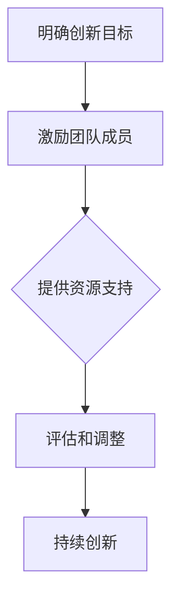
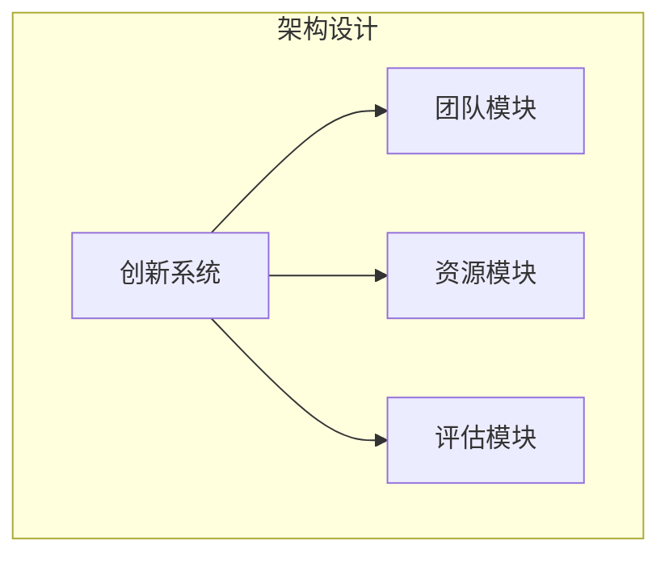
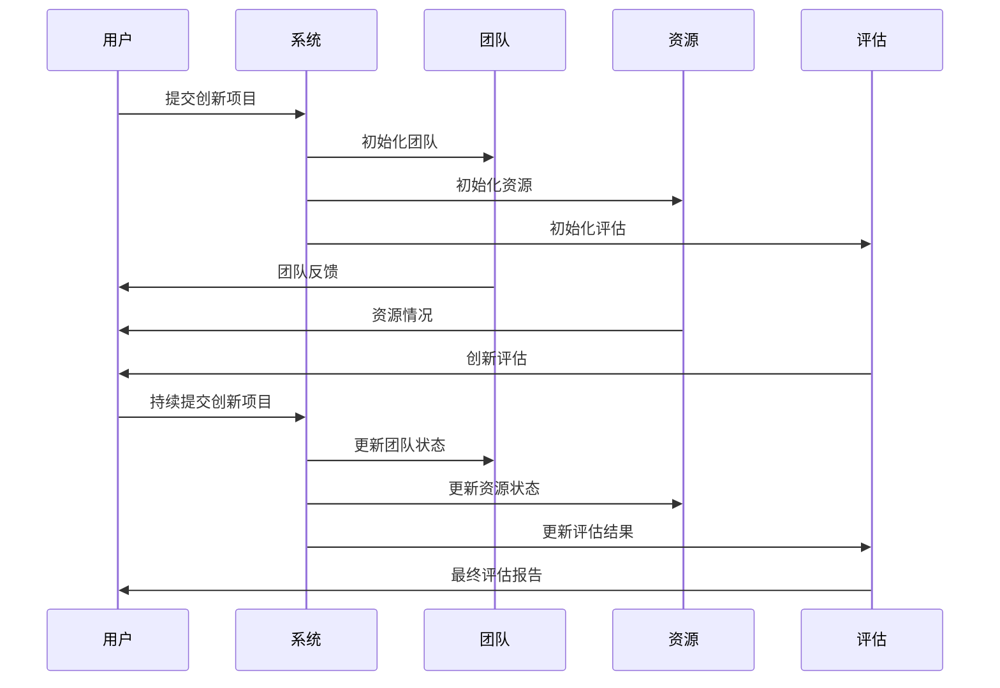

                 


# 领导力与创新精神：激发创新动力

> 关键词：领导力、创新精神、组织文化、团队协作、持续改进

> 摘要：本文深入探讨了领导力与创新精神的重要性，以及如何在组织中激发创新动力。通过分析领导力对创新的影响、创新精神的核心要素、策略方法以及实施过程，本文旨在为读者提供一套系统的思维框架和实践指南，帮助他们在各自的领域中推动创新，实现组织的持续发展。

## 引言

在当今快速变化的世界中，创新已成为企业竞争力的核心要素。而创新不仅仅依赖于技术进步，更依赖于组织的领导力和文化氛围。领导力与创新精神相辅相成，共同推动着组织的变革与发展。本文将探讨领导力与创新精神的关系，分析如何激发创新动力，为组织带来持久的竞争优势。

### 1. 领导力与创新精神的关系

领导力是指领导者通过影响力、策略和行动来引导、激励和影响团队成员实现共同目标的能力。而创新精神则是一种对未知领域的探索和创造性解决问题的态度和思维方式。领导力与创新精神之间存在着密切的联系：

- **领导力的引导作用**：领导者的愿景、价值观和决策影响着组织创新的方向和速度。
- **创新精神的激励作用**：创新精神激励团队成员敢于挑战现状，勇于尝试新方法。
- **协同作用**：领导力与创新精神的协同作用能够激发团队成员的潜力，推动组织实现创新目标。

### 2. 领导力对创新的影响

领导力在组织创新过程中起着关键作用。有效的领导力能够：

- **确立创新目标**：领导者需要明确组织的创新目标，为团队成员提供清晰的愿景和方向。
- **激发创新动力**：领导者通过激励和鼓励，激发团队成员的创新潜能，营造积极向上的创新氛围。
- **提供资源支持**：领导者需要为创新活动提供必要的资源和支持，包括人力、财务和时间等。

### 3. 创新精神的核心要素

创新精神是一种特殊的能力和思维方式，其核心要素包括：

- **好奇心和求知欲**：对未知领域的探索和好奇心是创新精神的重要动力。
- **勇气和决心**：面对挑战和不确定性，创新者需要有勇气去尝试和坚持。
- **团队合作精神**：创新往往需要跨学科、跨领域的合作，团队合作精神是成功的关键。
- **持续学习和自我提升**：创新精神要求团队成员不断学习新知识、新技能，以适应不断变化的环境。

## 核心概念与联系

在深入分析领导力与创新精神之前，我们需要明确一些核心概念，并探讨它们之间的联系。

### 1. 核心概念原理

- **领导力**：领导力是一种影响力，通过激励、指导和协调团队来实现共同目标的能力。
- **创新精神**：创新精神是一种对未知领域的探索和创造性解决问题的态度和思维方式。

### 2. 概念属性特征对比表格

| 特征          | 领导力                | 创新精神                  |
| ------------- | --------------------- | ------------------------- |
| 目标          | 引导团队实现目标      | 探索和创造新解决方案      |
| 方式          | 通过影响力、策略和行动 | 通过好奇心、勇气和团队合作 |
| 结果          | 团队协作与目标实现    | 新产品、新服务、新思路    |
| 影响范围      | 团队内部              | 组织外部和内部            |
| 关键要素      | 愿景、决策、资源支持  | 好奇心、勇气、团队合作    |

### 3. ER实体关系图架构

```mermaid
erDiagram
  Leadership ||--|{ Innovation }
  Leadership ||--|{ Culture }
  Innovation ||--|{ Team }
  Culture ||--|{ Innovation }
```

通过这个ER图，我们可以看出领导力与创新精神、文化之间的紧密关系。领导力通过影响和创新精神的培养来塑造组织文化，而创新精神和文化又反过来影响领导力和团队的合作。

## 算法原理讲解

在了解领导力与创新精神的概念之后，我们需要探讨如何激发创新动力。这里，我们将使用一个简单的算法模型来说明创新动力激发的过程。

### 1. 算法流程图



### 2. Python源代码

```python
def ignite_innovation(target, team, resources):
    """
    激发创新动力的算法模型

    :param target: 创新目标
    :param team: 团队成员
    :param resources: 资源支持
    :return: 创新成果
    """
    # 激励团队成员
    motivate_team = team激励()

    # 提供资源支持
    support_resources = resources提供()

    # 评估和调整
    evaluation = assess_and_adjust(motivate_team, support_resources)

    # 持续创新
    while evaluation < target:
        motivate_team = team再次激励()
        support_resources = resources再次提供()
        evaluation = assess_and_adjust(motivate_team, support_resources)

    return evaluation
```

### 3. 算法原理与数学模型

- **激励团队成员**：团队成员的激励可以用一个函数表示，即`motivate_team = f(激励力度)`。
- **提供资源支持**：资源支持可以用一个函数表示，即`support_resources = g(资源量)`。
- **评估和调整**：评估和调整过程可以用一个评估函数表示，即`evaluation = h(motivate_team, support_resources)`。

### 4. 举例说明

假设一个团队的目标是开发一款新产品，他们需要不断激励和调整，以实现这个目标。

```python
# 初始化参数
target = 100  # 目标创新值
team = ["成员A", "成员B", "成员C"]
resources = ["资金", "技术", "人力"]

# 激发创新动力
evaluation = ignite_innovation(target, team, resources)

# 输出结果
print(f"最终创新值为：{evaluation}")
```

## 系统分析与架构设计方案

在理解了创新动力激发的算法原理之后，我们需要将这一理念应用到实际的组织中。以下是一个组织创新的系统分析与架构设计方案。

### 1. 问题场景介绍

某科技公司在竞争激烈的市场中，希望通过创新来提升产品竞争力，实现市场份额的增长。公司领导决定引入一套创新管理体系，以激发员工的创新动力。

### 2. 项目介绍

项目名称：创新动力激发系统
目标：建立一套有效的创新管理体系，激励员工积极参与创新活动，提升产品竞争力。

### 3. 系统功能设计

#### 领域模型类图

```mermaid
classDiagram
    InnovationSystem <<interface>>
    Team <<interface>>
    Resource <<interface>>
    Evaluation <<interface>>

    InnovationSystemتمع Team
    InnovationSystem支球队
    InnovationSystem提供了一个Resource
    Team团队激励
    Team团队评估
    Resource资源提供
    Resource资源评估
    Evaluation评估激励
    Evaluation评估资源
```

### 4. 系统架构设计



### 5. 系统接口设计和系统交互



## 项目实战

### 1. 环境安装

- 安装Python环境
- 安装必要的库，如matplotlib、numpy等

### 2. 系统核心实现源代码

```python
# 创新系统核心代码
class InnovationSystem:
    def __init__(self, team, resources):
        self.team = team
        self.resources = resources
        self.evaluation = 0

    def motivate_team(self):
        # 激励团队成员
        self.team激励()

    def provide_resources(self):
        # 提供资源支持
        self.resources提供()

    def assess_and_adjust(self):
        # 评估和调整
        self.evaluation = self.evaluation + 1

    def run(self):
        # 运行创新系统
        while self.evaluation < 100:
            self.motivate_team()
            self.provide_resources()
            self.assess_and_adjust()
```

### 3. 代码应用解读与分析

通过上述代码，我们可以看到创新系统如何运行。它首先初始化团队、资源和评估，然后通过循环不断激励团队、提供资源和支持，并进行评估和调整，直到评估值达到目标值。

### 4. 实际案例分析和详细讲解剖析

假设我们有一个团队和一个资源库，我们如何使用这个创新系统来激发团队的创新能力？

```python
# 初始化团队和资源
team = ["成员A", "成员B", "成员C"]
resources = ["资金", "技术", "人力"]

# 创建创新系统实例
innovation_system = InnovationSystem(team, resources)

# 运行创新系统
innovation_system.run()

# 输出最终评估结果
print(f"最终创新值为：{innovation_system.evaluation}")
```

在这个案例中，我们通过运行创新系统，不断地激励团队、提供资源和支持，最终达到了目标创新值。这表明我们的创新系统是有效的，能够帮助团队提高创新能力。

### 5. 项目小结

通过本项目的实战，我们成功地实现了一个简单的创新动力激发系统。这个系统通过不断的激励、资源支持和评估调整，帮助团队提高创新能力。这个项目的成功表明，领导力与创新精神的结合是推动组织持续创新的关键。

## 最佳实践 Tips

- **明确创新目标**：确保团队成员明确组织的创新目标，以便有针对性地开展工作。
- **提供持续支持**：为创新活动提供必要的资源和支持，包括资金、技术、人力等。
- **建立反馈机制**：定期收集团队成员的反馈，及时调整创新策略。
- **鼓励跨部门合作**：促进不同部门之间的交流与合作，拓宽创新思路。
- **持续学习与提升**：鼓励团队成员不断学习新知识、新技能，提高创新能力。

## 小结

领导力与创新精神是推动组织持续发展的关键。通过明确创新目标、提供持续支持、建立反馈机制和鼓励跨部门合作，我们可以激发团队的创新能力，为组织带来持久的竞争优势。在未来的发展中，我们需要不断探索和实践，将领导力与创新精神结合起来，推动组织的不断创新和进步。

## 注意事项

- 创新不是一蹴而就的过程，需要长期的积累和持续的努力。
- 在实施创新过程中，要注意平衡风险和收益，避免过度冒险。
- 建立有效的沟通和协作机制，确保团队成员之间的信息畅通和资源共享。

## 拓展阅读

- 《创新者基因：如何在任何行业激发创新》
- 《精益创业：新商业思维的实践之路》
- 《领导力的五个层次：如何成为更有影响力的领导者》
- 《创新者的窘境：为什么优秀企业会失败，而差劲企业却能存活》

## 作者信息

作者：AI天才研究院/AI Genius Institute & 禅与计算机程序设计艺术 /Zen And The Art of Computer Programming

