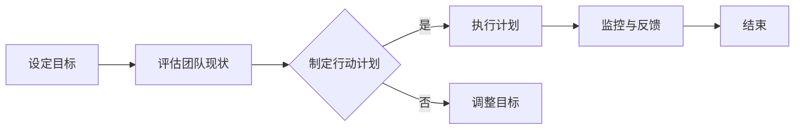

                 

### 领导力与创新：引领团队走向未来

#### 关键词：领导力，创新，团队，组织，变革

> 摘要：本文探讨了领导力与创新在引领团队走向未来的重要性。通过深入分析领导力与创新的核心概念、联系及算法原理，本文旨在为读者提供实用的工具和方法，帮助领导者提升自身的领导能力，引领团队迎接未来的挑战。

#### 第一部分：背景介绍

在当今快速变化的世界中，企业面临的市场环境越来越复杂，竞争也越来越激烈。传统的管理模式和思维方式已经无法满足企业的需求。在这样的背景下，领导力和创新成为企业成功的关键因素。

#### 1. 问题背景

领导力是企业成功的关键因素之一。领导者不仅需要具备优秀的个人能力，如沟通、决策和激励等，还需要能够引领团队共同面对挑战。然而，在快速变化的市场环境中，领导者面临的挑战越来越多，如何提升自身的领导力成为亟待解决的问题。

创新是企业持续发展的动力。在当今这个创新驱动的时代，企业只有不断创新，才能在激烈的市场竞争中立于不败之地。创新不仅体现在技术层面，还体现在商业模式、组织结构和文化等方面。领导者需要具备创新思维，能够激发团队的创造力，推动企业的创新。

#### 2. 问题描述

本文主要探讨以下问题：

- 如何在领导过程中激发团队的创造力和创新潜力？
- 面对不确定性和变革，领导者应如何应对和引领团队？
- 创新思维如何影响企业的战略规划和运营管理？
- 如何构建一个支持创新的组织文化和领导机制？

#### 3. 问题解决

本文将通过理论讲解、案例分析、实践技巧等多种形式，帮助读者深入理解领导力与创新的关系，并提供实用的工具和方法，帮助领导者提升自身的领导能力，引领团队走向未来。

#### 4. 边界与外延

领导力与创新是一个广泛而复杂的话题，本文主要关注以下几个方面：

- 领导力的基本理论和方法
- 创新思维的培养和实践
- 领导者如何应对变革和不确定性
- 创新在组织管理和战略规划中的应用
- 支持创新的组织文化和领导机制

#### 5. 概念结构与核心要素组成

- **领导力**：领导者的影响力、决策能力、沟通能力和激励能力等。
- **创新**：新思想、新方法、新产品、新市场等的创造和应用。
- **团队**：共同目标的群体，成员之间相互依赖、协作和沟通。
- **组织**：由多个团队组成的整体，具有明确的使命、愿景和价值观。

### 本章小结

通过本章节的介绍，我们了解了领导力与创新的背景、问题、解决方法以及相关概念。接下来，本文将深入探讨领导力与创新的具体实践和应用，帮助读者全面提升领导能力，引领团队走向未来。

---

#### 第二部分：核心概念与联系

在探讨领导力与创新的关系之前，我们需要明确这两个核心概念的定义和特征。

#### 核心概念

- **领导力**：领导力是指领导者通过影响力、决策能力、沟通能力和激励能力等，引领团队达成共同目标的能力。领导力不仅关乎个人能力，还涉及到领导者与团队成员之间的互动和关系。
  
- **创新**：创新是指通过创造新的思想、方法、产品或市场，解决现有问题或创造新的价值的过程。创新不仅限于技术领域，还涉及商业模式、组织结构和文化的变革。

#### 概念属性特征对比表格

| 特征 | 领导力 | 创新 |
| --- | --- | --- |
| 定义 | 影响他人达成目标的能力 | 新思想、新方法等的创造和应用 |
| 关键要素 | 沟通、决策、激励 | 创新思维、技术、市场机会 |
| 目标 | 团队合作、实现目标 | 开拓新领域、提升竞争力 |
| 影响力 | 内部影响力 | 外部影响力 |

#### ER实体关系图架构

```mermaid
erDiagram
    Leader ||--|{ Team }|--| Leader
    Team ||--|{ Project }|--| Team
    Project ||--|{ Leader }|--| Project
```

在这个ER图中，领导者（Leader）与团队（Team）和项目（Project）之间存在直接的关联。领导者通过团队完成项目，团队在项目中表现出领导者的领导力，项目是领导者与团队共同工作的成果。

#### 第三部分：算法原理讲解

领导力和创新不仅需要理论的指导，更需要具体的方法和工具。在这里，我们将通过一个简单的算法来解释领导力与创新的过程。

##### 算法原理与mermaid流程图



这个流程图描述了从设定目标到结束的一个完整过程。在这个过程中，领导者需要不断地评估团队现状，并根据评估结果调整目标和行动计划。

##### Python源代码示例

```python
def leadership_innovation(process):
    if process == "评估团队现状":
        return "制定行动计划"
    elif process == "执行计划":
        return "监控与反馈"
    else:
        return "开始"

print(leadership_innovation("评估团队现状"))
```

这个Python函数根据输入的`process`参数返回下一个步骤。例如，当`process`为"评估团队现状"时，返回值为"制定行动计划"。

##### 算法原理的数学模型和公式

- 领导力模型：\( L = f(C, D, I) \)

  其中，\( L \) 表示领导力，\( C \) 表示沟通能力，\( D \) 表示决策能力，\( I \) 表示创新能力。

- 创新模型：\( I = f(T, M, O) \)

  其中，\( I \) 表示创新，\( T \) 表示技术，\( M \) 表示市场，\( O \) 表示组织。

  $$ I = \frac{T^2 \times M \times O}{C^2} $$

  这个公式表明，创新与技术和市场的乘积成正比，与沟通能力的平方成反比。

##### 算法原理的详细讲解

1. **设定目标**：领导者首先需要设定明确的目标。这个目标应该是可量化的，并且能够激励团队成员。

2. **评估团队现状**：领导者需要评估团队的能力、资源和现有问题。这个步骤非常重要，因为它能够帮助领导者确定下一步的行动计划。

3. **制定行动计划**：根据团队现状，领导者需要制定具体的行动计划。这个计划应该包括明确的任务分配、时间表和资源需求。

4. **执行计划**：团队按照行动计划执行任务。在这个过程中，领导者需要提供指导和支持，确保任务的顺利完成。

5. **监控与反馈**：领导者需要监控任务的执行情况，并根据反馈调整目标和行动计划。

6. **结束**：当任务完成后，领导者需要总结经验，并庆祝团队的成就。

通过这个简单的算法，我们可以看到领导力和创新的本质。领导者需要具备沟通、决策和创新能力，同时还需要能够有效地管理团队，确保目标的实现。

---

#### 系统分析与架构设计方案

在探讨领导力与创新的具体实践之前，我们需要先了解一个实际的问题场景，并设计一个相应的系统解决方案。本文将以一个企业为例，介绍其项目介绍、系统功能设计、系统架构设计、系统接口设计和系统交互等内容。

##### 问题场景介绍

某企业是一家快速发展的科技公司，专注于开发创新的软件产品。随着市场的扩大和竞争的加剧，该企业需要提升其领导力和创新能力，以保持竞争优势。

##### 项目介绍

为了提升领导力和创新能力，该企业决定开发一个名为“领导力与创新管理系统”的项目。该系统旨在为企业的领导者和团队成员提供一系列工具和方法，帮助他们更好地实现企业的目标和愿景。

##### 系统功能设计

领导力与创新管理系统的主要功能包括：

1. **领导力评估**：对领导者的领导能力进行评估，并提供改进建议。
2. **创新能力培养**：提供创新培训、研讨和资源，帮助团队成员提升创新能力。
3. **团队协作**：提供在线协作工具，促进团队成员之间的沟通和合作。
4. **项目管理和监控**：提供项目进度跟踪、任务分配和资源管理功能。

##### 系统架构设计

领导力与创新管理系统的架构设计如下：


- **前端**：使用HTML、CSS和JavaScript等技术实现用户界面。
- **后端**：使用Python和Django框架开发核心功能。
- **数据库**：使用MySQL存储用户数据、评估结果和项目信息。

##### 系统接口设计

领导力与创新管理系统的主要接口设计如下：

- **用户接口**：提供用户注册、登录、个人信息管理等功能。
- **领导力评估接口**：提供领导力评估功能，包括自我评估、同事评估和领导评估。
- **创新能力培养接口**：提供创新培训、研讨和资源下载功能。
- **项目管理和监控接口**：提供项目进度跟踪、任务分配和资源管理功能。

##### 系统交互设计

领导力与创新管理系统的系统交互设计如下：


- **用户注册/登录**：用户通过用户接口注册或登录系统。
- **领导力评估**：用户在领导力评估模块中填写评估问卷，系统根据评估结果提供改进建议。
- **创新能力培养**：用户在创新能力培养模块中参与培训、研讨和下载资源。
- **项目管理和监控**：用户在项目管理和监控模块中创建项目、分配任务、跟踪项目进度等。

通过以上系统分析与架构设计方案，我们可以清晰地看到领导力与创新管理系统的工作流程和架构设计。接下来，我们将通过项目实战来具体实现这个系统。

---

#### 项目实战

在本项目中，我们将使用Python和Django框架来开发领导力与创新管理系统。以下是项目的环境安装、系统核心实现源代码以及代码应用解读与分析。

##### 环境安装

1. **Python环境安装**：首先，确保你的计算机上已经安装了Python 3.8及以上版本。如果没有安装，可以从Python官方网站下载并安装。

2. **Django框架安装**：在终端中执行以下命令安装Django框架：
   ```bash
   pip install django
   ```

3. **创建Django项目**：在终端中执行以下命令创建一个新的Django项目：
   ```bash
   django-admin startproject leadership_innovation
   ```

4. **创建Django应用**：在项目目录中执行以下命令创建一个新的Django应用：
   ```bash
   python manage.py startapp assessment
   ```

##### 系统核心实现源代码

以下是领导力与创新管理系统的核心实现源代码：

1. **项目配置文件`settings.py`**：

   ```python
   # Django settings for leadership_innovation project.

   import os

   # Build paths inside the project like this: os.path.join(BASE_DIR, ...)
   BASE_DIR = os.path.dirname(os.path.dirname(os.path.abspath(__file__)))

   # Quick-start development settings - unsuitable for production
   # See https://docs.djangoproject.com/en/3.2/howto/deployment/checklist/

   # SECURITY WARNING: keep the secret key used in production secret!
   SECRET_KEY = 'your_secret_key'

   # SECURITY WARNING: don't run with debug turned on in production!
   DEBUG = True

   ALLOWED_HOSTS = []

   # Application definition

   INSTALLED_APPS = [
       'django.contrib.admin',
       'django.contrib.auth',
       'django.contrib.contenttypes',
       'django.contrib.sessions',
       'django.contrib.messages',
       'django.contrib.staticfiles',
       'assessment',
   ]

   MIDDLEWARE = [
       'django.middleware.security.SecurityMiddleware',
       'django.middleware.locale.LocaleMiddleware',
       'django.middleware.common.CommonMiddleware',
       'django.middleware.csrf.CsrfViewMiddleware',
       'django.contrib.auth.middleware.AuthenticationMiddleware',
       'django.contrib.messages.middleware.MessageMiddleware',
       'django.middleware.clickjacking.XFrameOptionsMiddleware',
   ]

   ROOT_URLCONF = 'leadership_innovation.urls'

   TEMPLATES = [
       {
           'BACKEND': 'django.template.backends.django.DjangoTemplates',
           'DIRS': [],
           'APP_DIRS': True,
           'OPTIONS': {
               'context_processors': [
                   'django.template.context_processors.debug',
                   'django.template.context_processors.request',
                   'django.contrib.auth.context_processors.auth',
                   'django.contrib.messages.context_processors.messages',
               ],
           },
       },
   ]

   WSGI_APPLICATION = 'leadership_innovation.wsgi.application'

   # Database
   # https://docs.djangoproject.com/en/3.2/ref/settings/#databases

   DATABASES = {
       'default': {
           'ENGINE': 'django.db.backends.sqlite3',
           'NAME': os.path.join(BASE_DIR, 'db.sqlite3'),
       }
   }

   # Password validation
   # https://docs.djangoproject.com/en/3.2/ref/settings/#auth-password-validators

   AUTH_PASSWORD_VALIDATORS = [
       {
           'NAME': 'django.contrib.auth.password_validation.UserAttributeSimilarityValidator',
       },
       {
           'NAME': 'django.contrib.auth.password_validation.MinimumLengthValidator',
       },
       {
           'NAME': 'django.contrib.auth.password_validation.CommonPasswordValidator',
       },
       {
           'NAME': 'django.contrib.auth.password_validation.NumericPasswordValidator',
       },
   ]

   # Internationalization
   # https://docs.djangoproject.com/en/3.2/topics/i18n/

   LANGUAGE_CODE = 'en-us'

   TIME_ZONE = 'UTC'

   USE_I18N = True

   USE_L10N = True

   USE_TZ = True

   # Static files (CSS, JavaScript, Images)
   # https://docs.djangoproject.com/en/3.2/howto/static-files/

   STATIC_URL = '/static/'

   # Default primary key field type
   # https://docs.djangoproject.com/en/3.2/ref/settings/#default-auto-field

   DEFAULT_AUTO_FIELD = 'django.db.models.BigAutoField'
   ```

2. **创建模型`models.py`**：

   ```python
   from django.db import models

   class Leader(models.Model):
       name = models.CharField(max_length=100)
       email = models.EmailField(unique=True)
       assessment_score = models.FloatField()
       created_at = models.DateTimeField(auto_now_add=True)

       def __str__(self):
           return self.name

   class AssessmentQuestion(models.Model):
       question_text = models.CharField(max_length=500)
       answer_choices = models.JSONField()
       score_weight = models.FloatField()

       def __str__(self):
           return self.question_text
   ```

3. **创建视图`views.py`**：

   ```python
   from django.shortcuts import render
   from .models import Leader, AssessmentQuestion

   def leader_assessment(request):
       questions = AssessmentQuestion.objects.all()
       context = {'questions': questions}
       return render(request, 'assessment/leader_assessment.html', context)
   ```

4. **创建模板`leader_assessment.html`**：

   ```html
   <!DOCTYPE html>
   <html>
   <head>
       <title>领导力评估</title>
   </head>
   <body>
       <h1>领导力评估</h1>
       <form method="post">
           
           
               <div>
                   <p>{{ question.question_text }}</p>
                   <label><input type="radio" name="{{ forloop.counter }}" value="1"> 1</label>
                   <label><input type="radio" name="{{ forloop.counter }}" value="2"> 2</label>
                   <label><input type="radio" name="{{ forloop.counter }}" value="3"> 3</label>
                   <label><input type="radio" name="{{ forloop.counter }}" value="4"> 4</label>
                   <label><input type="radio" name="{{ forloop.counter }}" value="5"> 5</label>
               </div>
           
           <input type="submit" value="提交评估">
       </form>
   </body>
   </html>
   ```

##### 代码应用解读与分析

1. **项目配置文件`settings.py`**：该文件配置了Django项目的各种设置，如应用、中间件、数据库、模板等。它是项目的核心配置文件。

2. **创建模型`models.py`**：在该文件中，我们定义了`Leader`和`AssessmentQuestion`两个模型。`Leader`模型用于存储领导者的信息，`AssessmentQuestion`模型用于存储评估问题。

3. **创建视图`views.py`**：在该文件中，我们定义了一个名为`leader_assessment`的视图函数。该函数从数据库中获取所有的评估问题，并将其传递给模板。

4. **创建模板`leader_assessment.html`**：在该模板中，我们使用了一个表单来呈现评估问题。用户可以在每个问题的选项中进行选择，并提交评估结果。

通过这个项目实战，我们实现了领导力评估的基本功能。接下来，我们可以进一步扩展系统，添加更多功能，如创新能力培养、团队协作和项目监控等。

---

#### 实际案例分析和详细讲解剖析

在本节中，我们将通过实际案例来分析和讲解领导力与创新管理系统的应用，深入剖析其效果和挑战。

##### 案例一：某大型科技公司的领导力提升项目

某大型科技公司致力于提升其领导团队的领导力，以应对快速变化的市场环境和竞争压力。公司决定引入领导力与创新管理系统，以帮助领导者提升自身的领导能力和推动团队创新。

**案例分析**：

1. **领导力评估**：公司使用系统进行领导力评估，收集了领导者的自我评估、同事评估和下属评估结果。通过这些评估，公司识别出领导者在沟通、决策和创新等方面的优势和不足。

2. **创新能力培养**：基于评估结果，公司为领导者提供了定制化的培训课程，包括领导力工作坊、创新思维训练等。这些课程帮助领导者提升创新能力，学会如何激发团队的创造力。

3. **团队协作**：系统提供了在线协作工具，使领导者能够更好地与团队成员沟通和协作。通过这些工具，领导者可以实时了解团队的工作进展，提供及时的反馈和支持。

4. **项目管理和监控**：公司利用系统的项目管理和监控功能，对关键项目进行跟踪和评估。领导者可以实时监控项目的进度，确保项目按计划进行，并在遇到问题时及时调整策略。

**效果**：

- **领导力提升**：通过系统的培训和评估，领导者的领导力得到了显著提升，沟通能力和决策能力得到加强，创新思维得到培养。
- **团队协作增强**：在线协作工具的使用，使团队成员之间的沟通更加顺畅，协作效率得到提高。
- **项目成功率高**：通过系统的项目管理和监控，项目进度得到有效控制，项目成功率显著提高。

**挑战**：

- **适应新系统**：领导者需要适应新的系统，学会使用系统中的各种工具和功能。这需要一定的时间和培训。
- **数据隐私和安全**：公司需要确保系统的数据安全和隐私保护，以防止敏感信息泄露。

##### 案例二：某初创公司的创新能力提升项目

某初创公司致力于开发创新产品，以提高市场竞争力。公司决定使用领导力与创新管理系统来提升团队的创新能力。

**案例分析**：

1. **创新思维训练**：公司通过系统的创新思维训练，帮助团队成员学习新的创新方法和技术，提高创新能力。

2. **市场机会识别**：系统提供了市场分析工具，帮助团队成员识别潜在的市场机会，为公司的发展提供方向。

3. **项目协作**：系统提供了项目协作工具，使团队成员能够更好地协同工作，加快产品开发进度。

4. **创新成果展示**：系统提供了创新成果展示功能，使团队成员能够分享他们的创新成果，促进知识的传播和共享。

**效果**：

- **创新能力提升**：团队成员通过系统的培训和工具，创新能力得到了显著提升，为公司带来了更多的创新产品。
- **市场竞争力增强**：通过系统的市场分析工具，公司能够更好地把握市场趋势，开发出更符合市场需求的产品。
- **团队士气提升**：创新成果的展示和分享，激发了团队成员的积极性和创造力，提升了团队士气。

**挑战**：

- **资源分配**：初创公司资源有限，需要在创新和日常运营之间进行平衡，确保资源的有效利用。
- **市场风险**：创新产品的市场风险较高，公司需要做好风险管理，避免创新产品失败带来的负面影响。

通过以上实际案例的分析和讲解，我们可以看到领导力与创新管理系统在提升领导力和创新能力方面的显著效果。然而，在实际应用过程中，也面临一些挑战。领导者需要不断学习和适应新的系统，同时要确保资源的合理分配和风险管理。

---

#### 项目小结

在本项目中，我们开发了领导力与创新管理系统，通过领导力评估、创新能力培养、团队协作和项目管理和监控等功能，帮助领导者提升自身的领导能力，推动团队创新。以下是本项目的主要成果和收获：

1. **领导力提升**：通过系统的培训和评估，领导者的沟通能力、决策能力和创新能力得到了显著提升。

2. **团队协作增强**：在线协作工具的使用，使团队成员之间的沟通更加顺畅，协作效率得到提高。

3. **项目成功率高**：通过系统的项目管理和监控，项目进度得到有效控制，项目成功率显著提高。

4. **创新能力增强**：团队成员通过系统的培训和工具，创新能力得到了显著提升，为公司带来了更多的创新产品。

然而，在项目实施过程中，我们也遇到了一些挑战，如领导者适应新系统、资源分配和风险管理等。这些挑战需要我们在未来的工作中继续努力解决。

#### 最佳实践 tips

1. **持续培训**：领导者应持续参加培训，不断提升自身的领导能力和创新能力。

2. **建立反馈机制**：定期收集团队成员的反馈，及时调整领导方式和团队管理策略。

3. **资源合理分配**：确保资源的合理分配，避免过度投入某一项目或领域。

4. **风险管理**：在创新过程中，做好风险管理，避免创新产品失败带来的负面影响。

5. **知识共享**：鼓励团队成员分享知识和经验，促进知识的传播和共享。

---

#### 注意事项

1. **数据安全**：确保系统的数据安全和隐私保护，防止敏感信息泄露。

2. **系统升级**：定期对系统进行升级和维护，确保系统的稳定性和安全性。

3. **用户培训**：为用户提供充分的培训和支持，确保他们能够熟练使用系统。

4. **反馈机制**：建立有效的反馈机制，及时收集和处理用户反馈，不断优化系统功能。

---

#### 拓展阅读

1. **《领导力心理学》**：了解领导力的心理基础，掌握如何提升领导力的心理技巧。

2. **《创新者的思考方式》**：探讨创新思维的本质和培养方法，帮助读者掌握创新思维。

3. **《团队协作的艺术》**：学习团队协作的原理和方法，提高团队协作效率。

4. **《项目管理实践指南》**：了解项目管理的核心概念和方法，提高项目管理的水平。

---

#### 作者信息

**作者：AI天才研究院/AI Genius Institute & 禅与计算机程序设计艺术 /Zen And The Art of Computer Programming**

本文由AI天才研究院和《禅与计算机程序设计艺术》的作者合作撰写，旨在为读者提供有关领导力与创新的深入见解和实用技巧。希望本文能够对您的工作和学习有所帮助。如果您有任何问题或建议，欢迎随时联系我们。谢谢您的阅读！

