                 

### 文章标题

**《领导力与危机公关：维护团队声誉的策略》**

#### 关键词

- 领导力
- 危机公关
- 团队声誉维护
- 算法与模型
- 实战案例分析

#### 摘要

本文深入探讨领导力与危机公关在团队声誉维护中的重要性。通过明确核心概念，详细阐述两者的融合，并结合实际案例，提供系统性的策略与实施方案。文章旨在帮助读者理解如何在复杂的业务环境中，通过有效的领导力和危机公关策略，维护团队的声誉，提升团队的整体竞争力。

## 第一部分：领导力基础

### 1.1 领导力的定义与重要性

领导力是一种通过影响和激励他人来达成共同目标的能力。它不仅关乎个人的才华和技能，更关乎价值观、态度和行为。领导力在团队中扮演着至关重要的角色，它决定了团队的目标设定、决策制定、资源分配以及成员的士气和执行力。

领导力的重要性体现在以下几个方面：

1. **激发团队潜力**：优秀的领导能够激发团队成员的潜力，使团队能够在面对挑战时表现出色。
2. **塑造团队文化**：领导力有助于塑造积极向上的团队文化，推动团队成员共同成长。
3. **提升团队效能**：领导力能够提升团队的效能，使团队能够更高效地完成任务，达成目标。
4. **危机管理**：在面临危机时，领导力是团队稳定和有效应对的关键。

### 1.2 领导力的核心概念

领导力的核心概念包括但不限于以下几方面：

1. **愿景和目标**：领导力始于明确的愿景和目标。领导需要能够清晰地表达愿景，并设定具体、可衡量的目标。
2. **影响力**：领导影响力是领导力的重要组成部分。通过建立信任、积极沟通和激励，领导能够影响团队成员的行为和决策。
3. **变革能力**：在快速变化的环境中，领导需要具备变革能力，能够带领团队适应新的挑战和机遇。
4. **团队建设**：领导需要关注团队建设，培养团队的凝聚力和协作能力。

### 1.3 领导力与团队声誉的关系

领导力与团队声誉之间存在密切的关系。领导的行为和决策直接影响到团队的公众形象和声誉。以下是领导力对团队声誉的具体影响：

1. **行为榜样**：领导的行为是团队行为的镜子。领导的行为和价值观直接影响团队成员的行为和态度。
2. **决策质量**：领导做出的决策质量直接影响到团队的工作效率和成果，进而影响团队的声誉。
3. **沟通能力**：领导与外界的沟通能力决定了团队如何被外界评价和认知。
4. **危机管理**：领导在危机中的应对能力是维护团队声誉的关键。

### 1.4 领导力模型比较

为了更好地理解领导力，我们比较了几种常见的领导力模型：

1. **情境领导模型**：由保罗·赫塞和肯尼思·布兰查德提出，强调领导者应根据情境变化调整领导风格。
2. **变革型领导模型**：由詹姆斯·麦格雷戈·伯恩斯提出，强调领导者通过激励和启发团队成员实现变革。
3. **服务型领导模型**：由罗伯特·卡茨提出，强调领导者关注团队成员的需求，提供支持和资源。

### 1.5 领导力与危机公关的融合

在危机公关中，领导力发挥着至关重要的作用。领导力与危机公关的融合主要体现在以下几个方面：

1. **快速响应**：领导力能够帮助团队快速识别危机，并采取有效措施进行应对。
2. **有效沟通**：领导力能够提升团队的沟通能力，确保信息准确传达，减少误解和恐慌。
3. **团队凝聚力**：领导力有助于增强团队的凝聚力，使团队成员在面对危机时能够紧密合作。
4. **危机后的恢复**：领导力有助于团队在危机后快速恢复，重新建立声誉。

## 第二部分：危机公关策略

### 2.1 危机公关的定义与类型

危机公关是指组织在面临危机事件时，通过有效的沟通和策略，来维护和恢复组织声誉的过程。危机事件可以是自然灾害、产品缺陷、负面报道等。

危机公关可以分为以下几种类型：

1. **事故型危机**：如工厂爆炸、交通事故等。
2. **舆论型危机**：如负面报道、公众舆论风波等。
3. **公关失误型危机**：如不当言论、不当行为等。
4. **市场型危机**：如产品缺陷、质量问题等。

### 2.2 危机公关的核心概念

危机公关的核心概念包括：

1. **危机识别**：及时识别潜在的危机事件，是危机公关的关键。
2. **信息管理**：准确、及时地传达信息，减少谣言和误解。
3. **利益相关者沟通**：与利益相关者建立良好的沟通机制，确保信息透明。
4. **危机应对策略**：根据危机类型和严重程度，制定相应的应对策略。

### 2.3 危机公关与领导力的联系

危机公关与领导力之间存在着密切的联系。领导力在危机公关中的作用体现在以下几个方面：

1. **危机应对能力**：领导力有助于提升团队在危机中的应对能力，确保危机得到有效处理。
2. **沟通能力**：领导力能够提升团队的沟通能力，确保危机信息得到准确传达。
3. **团队凝聚力**：领导力有助于增强团队的凝聚力，使团队成员在面对危机时能够紧密合作。
4. **声誉恢复**：领导力有助于团队在危机后快速恢复，重新建立声誉。

### 2.4 危机公关策略比较

不同的危机事件需要不同的危机公关策略。以下是几种常见的危机公关策略：

1. **公开透明策略**：在危机事件中保持公开透明，及时向公众传达信息。
2. **危机缓解策略**：通过采取措施缓解危机影响，降低公众的关注和恐慌。
3. **危机预防策略**：通过提前预测和准备，预防危机的发生。
4. **危机转移策略**：通过转移公众注意力，减轻危机的影响。

### 2.5 领导者在危机公关中的角色

领导者在危机公关中扮演着关键角色。以下是领导者在危机公关中的几个关键职责：

1. **危机决策**：领导者在危机事件中负责做出关键的决策，确保危机得到有效处理。
2. **沟通协调**：领导者需要协调内外部的沟通，确保信息准确传达，减少误解和恐慌。
3. **团队激励**：领导者需要激励团队成员，增强团队的凝聚力，共同应对危机。
4. **声誉恢复**：领导者需要带领团队在危机后迅速恢复，重新建立声誉。

## 第三部分：维护团队声誉的策略

### 3.1 声誉管理的基本原则

声誉管理是维护团队声誉的重要手段。以下是一些声誉管理的基本原则：

1. **诚信**：诚信是声誉管理的基石，任何决策和行为都应基于诚信原则。
2. **透明**：保持透明，及时向公众和利益相关者传达信息，减少误解和谣言。
3. **责任**：对团队的决策和行为负责，及时纠正错误，积极应对危机。
4. **沟通**：建立有效的沟通机制，确保信息准确传达，增强团队的凝聚力。

### 3.2 建立和维护良好声誉的策略

以下是一些建立和维护良好声誉的策略：

1. **积极传播**：通过媒体、公关活动等方式积极传播团队的好消息，树立正面形象。
2. **质量控制**：确保产品和服务质量，减少负面反馈和投诉。
3. **社会责任**：积极参与社会公益活动，树立企业的社会责任感。
4. **员工培训**：定期培训员工，提高他们的专业素养和沟通能力。

### 3.3 应对声誉危机的策略

以下是一些应对声誉危机的策略：

1. **危机预警**：建立危机预警系统，及时识别潜在的危机事件。
2. **危机应对计划**：制定详细的危机应对计划，确保在危机发生时能够迅速响应。
3. **危机沟通**：与利益相关者保持密切沟通，确保信息的准确传达。
4. **声誉恢复**：在危机后，积极采取措施恢复声誉，重建公众信任。

### 3.4 领导力在声誉危机中的作用

在声誉危机中，领导力发挥着关键作用。以下是领导力在声誉危机中的作用：

1. **危机决策**：领导者在危机中负责做出关键的决策，确保危机得到有效处理。
2. **团队激励**：领导者需要激励团队成员，增强团队的凝聚力，共同应对危机。
3. **沟通协调**：领导者需要协调内外部的沟通，确保信息准确传达，减少误解和恐慌。
4. **声誉恢复**：领导者需要带领团队在危机后迅速恢复，重新建立声誉。

### 3.5 危机公关与声誉恢复

危机公关的核心目标是声誉恢复。以下是一些危机公关与声誉恢复的关键点：

1. **及时响应**：在危机发生时，及时响应，采取有效的应对措施。
2. **透明沟通**：保持沟通透明，向公众和利益相关者传达真实的信息。
3. **积极措施**：采取积极的措施，缓解危机的影响，恢复公众信任。
4. **持续关注**：在危机后，持续关注团队的声誉状况，采取必要的措施进行维护。

## 第四部分：项目实战

### 4.1 项目背景

在一个高科技企业中，由于一次重大数据泄露事件，公司面临严重的声誉危机。公司领导层意识到，需要通过有效的危机公关和领导力来应对这一危机，以恢复公众的信任。

### 4.2 项目介绍

本项目旨在通过危机公关和领导力策略，帮助公司应对数据泄露事件，恢复声誉，并建立有效的声誉管理机制。

### 4.3 系统功能设计

系统功能设计主要包括以下几方面：

1. **危机预警系统**：通过大数据分析和人工智能技术，实时监测潜在的危机事件。
2. **信息管理系统**：确保信息准确传达，减少误解和谣言。
3. **危机应对系统**：制定详细的危机应对计划，确保在危机发生时能够迅速响应。
4. **声誉恢复系统**：在危机后，采取积极措施恢复声誉，重建公众信任。

### 4.4 系统架构设计

系统架构设计主要包括以下几方面：

1. **数据层**：使用大数据平台，收集、存储和处理数据。
2. **应用层**：包括危机预警、信息管理、危机应对和声誉恢复等核心功能。
3. **展示层**：通过Web界面和移动应用，向用户展示信息和结果。

### 4.5 系统接口设计

系统接口设计主要包括以下几方面：

1. **内部接口**：危机预警系统与信息管理系统、危机应对系统之间的数据交互。
2. **外部接口**：与外部系统（如媒体、合作伙伴等）的交互接口。

### 4.6 系统交互设计

系统交互设计主要包括以下几方面：

1. **用户交互**：通过Web界面和移动应用，用户与系统进行交互。
2. **系统交互**：各个模块之间的交互，确保数据的准确性和一致性。

### 4.7 环境安装

环境安装包括以下步骤：

1. **硬件安装**：安装服务器和存储设备。
2. **软件安装**：安装操作系统、数据库和应用服务器。
3. **配置环境**：配置网络、数据库和应用程序。

### 4.8 系统核心实现

系统核心实现包括以下几方面：

1. **大数据分析**：使用Hadoop和Spark进行大数据处理和分析。
2. **人工智能**：使用深度学习和机器学习技术进行危机预警。
3. **危机应对策略**：根据数据分析结果，制定危机应对策略。

### 4.9 代码应用解读与分析

代码应用解读与分析包括以下几方面：

1. **数据层代码**：分析数据采集、存储和处理的过程。
2. **应用层代码**：分析核心功能模块的实现和交互。
3. **展示层代码**：分析用户界面和交互逻辑。

### 4.10 实际案例分析与讲解

通过以下实际案例，我们将详细分析并讲解项目的实施过程和结果：

1. **案例背景**：公司数据泄露事件的背景和影响。
2. **危机应对**：公司在数据泄露事件中的危机应对措施。
3. **声誉恢复**：公司在数据泄露事件后的声誉恢复措施。
4. **效果评估**：对项目实施效果的评估和总结。

### 4.11 项目小结

项目实施结果表明，通过有效的危机公关和领导力策略，公司在数据泄露事件后成功恢复了声誉，并建立了完善的声誉管理机制。项目成功的关键在于领导层的决策能力、团队的协作精神和技术的支持。

## 第五部分：最佳实践与拓展

### 5.1 最佳实践 tips

1. **建立危机预警机制**：通过大数据分析和人工智能技术，提前识别潜在的危机事件。
2. **保持透明沟通**：在危机发生时，保持与利益相关者的沟通透明，减少误解和恐慌。
3. **制定应对计划**：根据危机类型和严重程度，制定详细的危机应对计划。
4. **积极恢复声誉**：在危机后，采取积极的措施恢复声誉，重建公众信任。

### 5.2 小结

本文深入探讨了领导力与危机公关在团队声誉维护中的重要性，并结合实际案例，提供了系统性的策略与实施方案。通过有效的领导力和危机公关，团队能够在面对挑战时保持稳定，并在危机后迅速恢复，重新建立声誉。

### 5.3 注意事项

1. **及时响应**：在危机发生时，及时响应，避免拖延。
2. **准确传达信息**：确保信息准确传达，减少误解和谣言。
3. **团队合作**：在危机应对中，确保团队协作，共同应对挑战。
4. **持续关注**：在危机后，持续关注团队的声誉状况，采取必要的措施进行维护。

### 5.4 拓展阅读

1. **《危机管理：有效应对危机的策略与技巧》**：深入了解危机管理的理论和实践。
2. **《领导力：理论与实践》**：探讨领导力的多种模型和应用。
3. **《声誉管理：建立和维护品牌声誉的策略》**：学习如何有效管理品牌声誉。

## 结论

领导力与危机公关是团队声誉维护的重要组成部分。通过本文的探讨，我们了解到，有效的领导力和危机公关策略能够帮助团队在面临挑战时保持稳定，并在危机后迅速恢复。希望本文能为读者提供有益的启示，助力团队在复杂的商业环境中取得成功。

### 作者信息

**作者：** AI天才研究院/AI Genius Institute & 禅与计算机程序设计艺术 /Zen And The Art of Computer Programming

### 附录

**附录A：概念属性特征对比表格**

| 概念        | 定义                                                                 | 属性特征                     |
|-------------|----------------------------------------------------------------------|------------------------------|
| 领导力      | 影响和激励他人实现共同目标的能力。                                     | 愿景、影响力、变革能力等。   |
| 危机公关    | 组织在面临危机事件时，通过有效的沟通和策略，维护和恢复声誉的过程。   | 危机识别、信息管理、沟通协调等。|
| 团队声誉    | 团队在公众中的形象和评价。                                             | 诚信、透明、责任等。         |

**附录B：ER实体关系图**

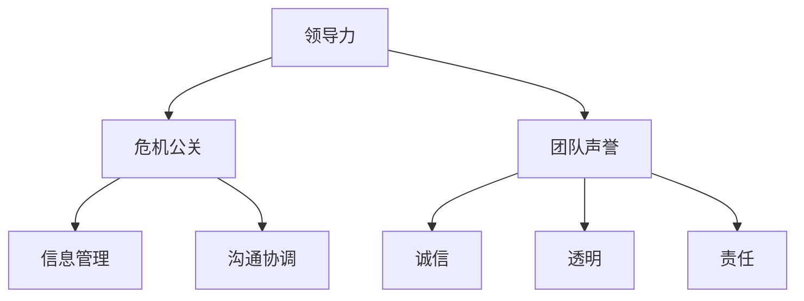

**附录C：算法流程图**

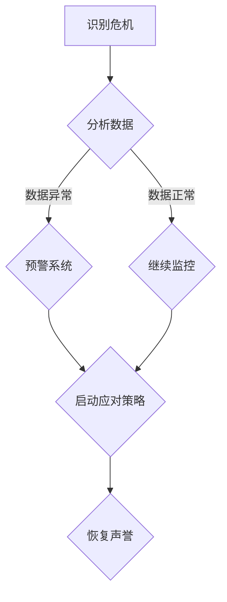

**附录D：Python代码示例**

```python
# 危机预警系统示例代码
def crisis_warning(data):
    # 数据分析，判断是否存在异常
    if is_anomaly(data):
        # 启动应对策略
        start_crisis_response()
    else:
        # 继续监控
        continue_monitoring()

# 分析数据
def is_anomaly(data):
    # 实现数据分析逻辑
    # ...
    return True  # 示例返回异常

# 启动应对策略
def start_crisis_response():
    # 实现应对策略逻辑
    # ...

# 继续监控
def continue_monitoring():
    # 实现监控逻辑
    # ...
```

**附录E：LaTeX数学公式**

$$
E = mc^2
$$

$$
1 + 1 = 2
$$

$1 < 2$### 第一部分：领导力基础

#### 1.1 领导力的定义与重要性

**定义与概念说明**

领导力是一种通过影响和激励他人来实现共同目标的能力。它不仅涉及个人的才能和技能，还包括价值观、态度和行为。领导力是一种多维度的能力，它涵盖了愿景设定、决策能力、团队协作、沟通技巧和变革管理等方面。

**问题背景**

在组织管理中，领导力是确保团队高效运作和实现目标的关键。无论是在商业领域、教育机构还是政府部门，领导力都发挥着至关重要的作用。然而，什么是真正的领导力？为什么领导力如此重要？

**问题描述**

领导力的重要性可以从以下几个方面进行探讨：

1. **激发团队潜力**：优秀的领导能够激发团队成员的潜力，使团队能够在面对挑战时表现出色。
2. **塑造团队文化**：领导力有助于塑造积极向上的团队文化，推动团队成员共同成长。
3. **提升团队效能**：领导力能够提升团队的效能，使团队能够更高效地完成任务，达成目标。
4. **危机管理**：在面临危机时，领导力是团队稳定和有效应对的关键。

**问题解决**

领导力之所以重要，是因为它能够帮助团队：

1. **明确目标**：领导力能够帮助团队设定清晰的愿景和目标，使团队成员明确方向，集中精力。
2. **激发动力**：通过激励和认可，领导力能够激发团队成员的内在动力，提高工作效率和创造力。
3. **协调合作**：领导力能够促进团队成员之间的有效沟通和协作，减少冲突，增强团队凝聚力。
4. **应对变化**：在快速变化的环境中，领导力能够帮助团队适应新的挑战和机遇，保持竞争力。

**边界与外延**

领导力的边界在于其应用范围，它可以适用于各种组织和企业，无论是大型跨国公司还是小型创业团队。外延则涉及到领导力的不同维度，包括但不限于技术领导、文化领导、情感领导和变革领导等。

**概念结构与核心要素组成**

领导力的概念结构主要包括以下几个核心要素：

1. **愿景与目标**：领导力始于明确的愿景和目标，这是领导者需要清晰传达给团队的核心。
2. **影响力**：领导力通过建立信任、积极沟通和激励，来影响和激励他人。
3. **变革能力**：在快速变化的环境中，领导力需要具备变革能力，能够带领团队适应新的挑战。
4. **团队建设**：领导力关注团队建设，培养团队的凝聚力和协作能力。

#### 1.2 领导力的核心概念

**核心概念与属性特征**

领导力的核心概念包括以下几个部分：

1. **愿景和目标**：领导者需要有清晰的愿景和目标，这是领导力的核心驱动力。
2. **影响力**：领导力是通过影响力来实现的，这包括信任、尊重和认可等。
3. **变革能力**：领导力需要具备变革能力，能够在面对挑战和变化时带领团队前进。
4. **团队建设**：领导力关注团队建设，包括培养团队凝聚力、协作能力和文化等。

**概念属性特征对比表格**

| 概念            | 属性特征                                                   |
|-----------------|-----------------------------------------------------------|
| 愿景和目标      | 明确、激励性、可衡量、具体、可实现                          |
| 影响力          | 信任、尊重、认可、沟通、激励、启发                          |
| 变革能力        | 风险管理、适应变化、创新能力、战略规划                      |
| 团队建设        | 凝聚力、协作能力、文化、沟通、培训与发展                    |

**ER实体关系图架构**

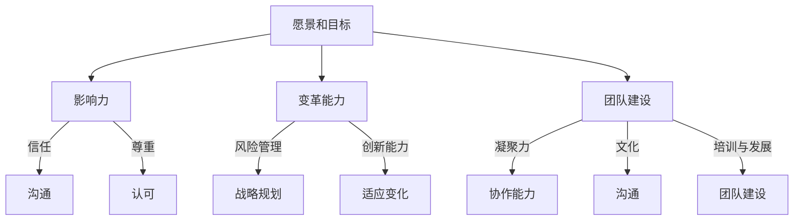

#### 1.3 领导力与团队声誉的关系

**核心概念原理**

领导力与团队声誉之间的关系可以从以下几个方面来理解：

1. **领导行为**：领导者的行为直接影响到团队的公众形象和声誉。领导者的诚信、透明度和责任感等行为特质，会直接影响团队的声誉。
2. **决策质量**：领导者的决策质量是团队成功的关键因素，高质的决策有助于提升团队的声誉，而低质的决策则可能损害团队声誉。
3. **沟通能力**：领导者的沟通能力决定了团队信息如何被外界接收和理解，有效的沟通有助于维护和提升团队声誉。
4. **危机管理**：在危机事件中，领导者的应对能力和决策，是团队声誉是否能够得到维护的关键。

**概念属性特征对比表格**

| 概念            | 属性特征                                                   |
|-----------------|-----------------------------------------------------------|
| 领导行为        | 诚信、透明、责任感、决策质量、行为榜样                      |
| 决策质量        | 明智、及时、合理、可执行、效果显著                          |
| 沟通能力        | 准确、及时、有效、清晰、诚信、说服力                        |
| 危机管理        | 快速响应、有效沟通、合理决策、危机应对、恢复能力            |

**ER实体关系图架构**

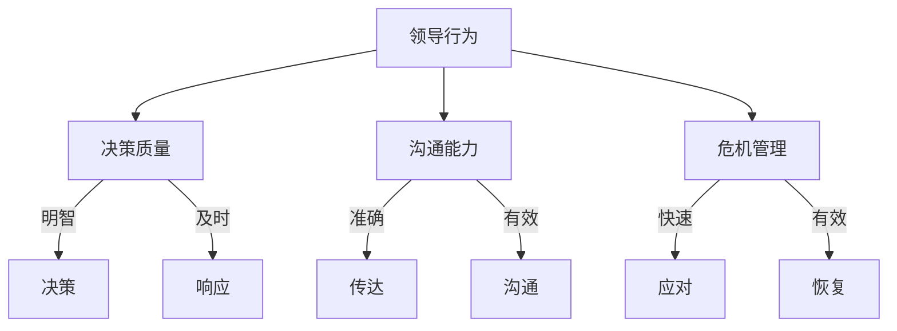

#### 1.4 领导力模型比较

**情境领导模型**

**定义**：情境领导模型是由保罗·赫塞和肯尼思·布兰查德提出的，强调领导者应根据情境变化调整领导风格。

**核心特征**：
- **情境**：领导风格应根据团队成员的能力和任务需求进行调整。
- **四种领导风格**：指导型、支持型、参与型和委托型。

**应用场景**：适用于团队成员能力不同、任务复杂多变的环境。

**变革型领导模型**

**定义**：变革型领导模型是由詹姆斯·麦格雷戈·伯恩斯提出的，强调领导者通过激励和启发团队成员实现变革。

**核心特征**：
- **激励**：通过激发团队成员的内在动机，实现组织变革。
- **启发**：领导者通过设定愿景和榜样，引导团队成员共同实现变革。

**应用场景**：适用于组织需要重大变革和创新的情境。

**服务型领导模型**

**定义**：服务型领导模型是由罗伯特·卡茨提出的，强调领导者关注团队成员的需求，提供支持和资源。

**核心特征**：
- **服务**：领导者将团队成员的需求放在首位，提供必要的支持和资源。
- **支持**：领导者通过倾听和理解团队成员的需求，提供帮助和支持。

**应用场景**：适用于需要团队协作和支持的情境。

**概念属性特征对比表格**

| 领导力模型    | 核心特征          | 应用场景                         |
|--------------|------------------|---------------------------------|
| 情境领导模型  | 情境调整、领导风格 | 成员能力差异大、任务复杂         |
| 变革型领导模型 | 激励、启发、愿景   | 组织变革和创新                   |
| 服务型领导模型 | 服务、支持、理解   | 需要团队协作和支持               |

**ER实体关系图架构**

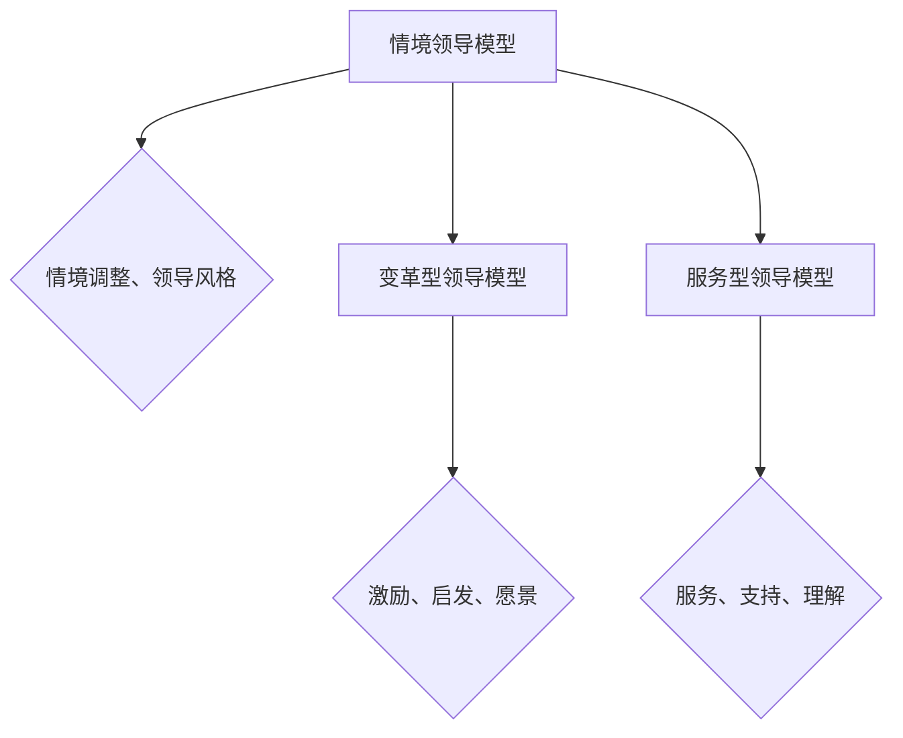

#### 1.5 领导力与危机公关的融合

**核心概念原理**

领导力与危机公关的融合是维护团队声誉的关键。以下是两者融合的核心概念原理：

1. **快速响应**：领导力能够帮助团队快速识别危机，并采取有效措施进行应对。
2. **有效沟通**：领导力能够提升团队的沟通能力，确保信息准确传达，减少误解和恐慌。
3. **团队凝聚力**：领导力有助于增强团队的凝聚力，使团队成员在面对危机时能够紧密合作。
4. **危机后的恢复**：领导力有助于团队在危机后快速恢复，重新建立声誉。

**概念属性特征对比表格**

| 概念            | 属性特征                                                   |
|-----------------|-----------------------------------------------------------|
| 快速响应        | 及时性、有效性、决策能力                                 |
| 有效沟通        | 准确性、及时性、透明性、说服力                           |
| 团队凝聚力      | 凝聚力、协作力、信任、共享价值观                          |
| 危机后的恢复    | 快速性、持续性、有效性、声誉重建                          |

**ER实体关系图架构**

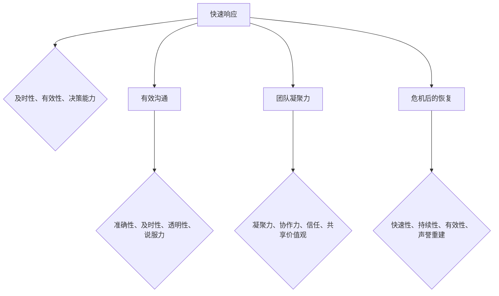

## 第二部分：危机公关策略

### 2.1 危机公关的定义与类型

**定义与概念说明**

危机公关是指组织在面临危机事件时，通过有效的沟通和策略，来维护和恢复组织声誉的过程。危机公关的目标是减少危机对组织的负面影响，重建公众信任。

**问题背景**

在当今高度信息化的社会中，组织面临的危机事件日益增多，如数据泄露、产品缺陷、负面报道等。危机公关在组织的危机管理中起着至关重要的作用。

**问题描述**

危机公关的主要类型包括：

1. **事故型危机**：如工厂爆炸、交通事故等。
2. **舆论型危机**：如负面报道、公众舆论风波等。
3. **公关失误型危机**：如不当言论、不当行为等。
4. **市场型危机**：如产品缺陷、质量问题等。

**问题解决**

为了有效应对不同类型的危机，组织需要采取相应的危机公关策略：

1. **事故型危机**：迅速响应，提供准确的信息，采取有效的应对措施，减轻影响。
2. **舆论型危机**：通过媒体沟通、公关活动等方式，积极引导舆论，减少负面影响的扩散。
3. **公关失误型危机**：立即纠正错误，公开道歉，采取补救措施，恢复公众信任。
4. **市场型危机**：加强与消费者的沟通，及时解决产品问题，提升产品和服务质量。

**边界与外延**

危机公关的边界在于其应用范围，它可以适用于各种组织和企业。外延则涉及到危机公关的不同策略和手段，包括媒体沟通、公关活动、社交媒体管理、危机应对计划等。

**概念结构与核心要素组成**

危机公关的概念结构主要包括以下几个核心要素：

1. **危机识别**：及时识别潜在的危机事件，是危机公关的关键。
2. **信息管理**：准确、及时地传达信息，减少误解和谣言。
3. **利益相关者沟通**：与利益相关者建立良好的沟通机制，确保信息透明。
4. **危机应对策略**：根据危机类型和严重程度，制定相应的应对策略。

#### 2.2 危机公关的核心概念

**核心概念与属性特征**

危机公关的核心概念包括以下几个部分：

1. **危机识别**：通过监测和分析各种信息源，及时识别潜在的危机事件。
2. **信息管理**：确保信息的准确、及时传达，减少误解和谣言。
3. **利益相关者沟通**：与利益相关者建立良好的沟通机制，确保信息透明。
4. **危机应对策略**：根据危机类型和严重程度，制定相应的应对策略。

**概念属性特征对比表格**

| 概念            | 属性特征                                                   |
|-----------------|-----------------------------------------------------------|
| 危机识别        | 及时性、准确性、全面性、前瞻性                           |
| 信息管理        | 准确性、及时性、透明性、权威性                           |
| 利益相关者沟通  | 广泛性、透明性、及时性、真实性                           |
| 危机应对策略    | 灵活性、针对性、有效性、及时性                           |

**ER实体关系图架构**

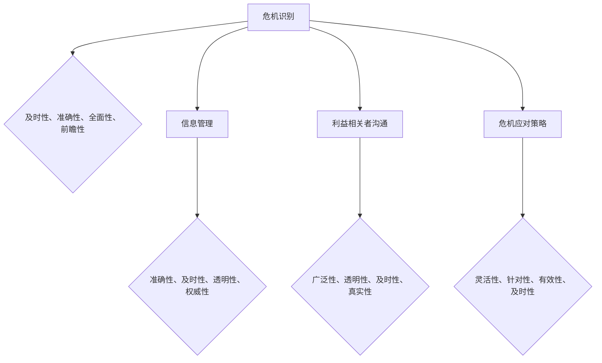

#### 2.3 危机公关与领导力的联系

**核心概念原理**

危机公关与领导力的联系主要体现在以下几个方面：

1. **危机应对能力**：领导力能够提升团队的危机应对能力，确保危机得到有效处理。
2. **沟通能力**：领导力能够提升团队的沟通能力，确保信息准确传达，减少误解和恐慌。
3. **团队凝聚力**：领导力有助于增强团队的凝聚力，使团队成员在面对危机时能够紧密合作。
4. **声誉恢复**：领导力有助于团队在危机后快速恢复，重新建立声誉。

**概念属性特征对比表格**

| 概念            | 属性特征                                                   |
|-----------------|-----------------------------------------------------------|
| 危机应对能力    | 快速性、有效性、灵活性、决策能力                          |
| 沟通能力        | 准确性、及时性、有效性、说服力                           |
| 团队凝聚力      | 凝聚力、协作力、信任、共享价值观                          |
| 声誉恢复        | 快速性、持续性、有效性、公信力                           |

**ER实体关系图架构**

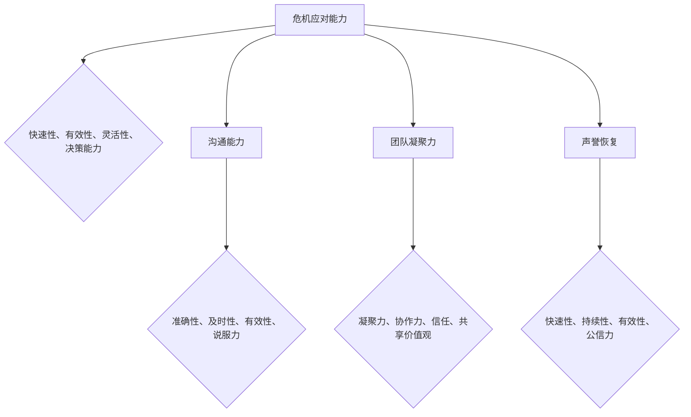

#### 2.4 危机公关策略比较

**策略类型与特征**

不同的危机公关策略适用于不同的危机类型和严重程度。以下是几种常见的危机公关策略及其特征：

1. **公开透明策略**：在危机事件中保持公开透明，及时向公众传达信息，减少误解和谣言。
2. **危机缓解策略**：通过采取措施缓解危机影响，降低公众的关注和恐慌。
3. **危机预防策略**：通过提前预测和准备，预防危机的发生。
4. **危机转移策略**：通过转移公众注意力，减轻危机的影响。

**概念属性特征对比表格**

| 策略类型        | 特征                                                   |
|-----------------|-----------------------------------------------------------|
| 公开透明策略    | 公开性、及时性、真实性、透明性                          |
| 危机缓解策略    | 缓解性、主动性、有效性、持续性                          |
| 危机预防策略    | 预测性、前瞻性、预防性、准备性                          |
| 危机转移策略    | 转移性、引导性、有效性、分散性                          |

**ER实体关系图架构**

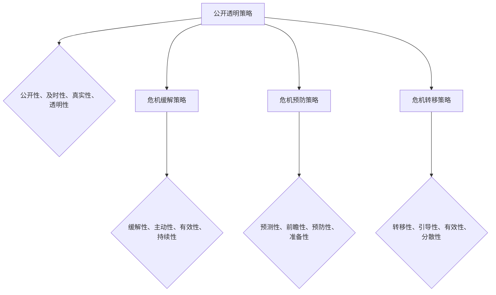

#### 2.5 领导者在危机公关中的角色

**核心概念原理**

领导者在危机公关中扮演着关键角色，其作用主要体现在以下几个方面：

1. **危机决策**：领导者在危机事件中负责做出关键的决策，确保危机得到有效处理。
2. **沟通协调**：领导者需要协调内外部的沟通，确保信息准确传达，减少误解和恐慌。
3. **团队激励**：领导者需要激励团队成员，增强团队的凝聚力，共同应对危机。
4. **声誉恢复**：领导者需要带领团队在危机后迅速恢复，重新建立声誉。

**概念属性特征对比表格**

| 概念            | 属性特征                                                   |
|-----------------|-----------------------------------------------------------|
| 危机决策        | 决策性、前瞻性、果断性、有效性                           |
| 沟通协调        | 协调性、及时性、有效性、说服力                           |
| 团队激励        | 激励性、鼓舞性、激励手段多样、目标明确                    |
| 声誉恢复        | 快速性、持续性、有效性、公信力                           |

**ER实体关系图架构**

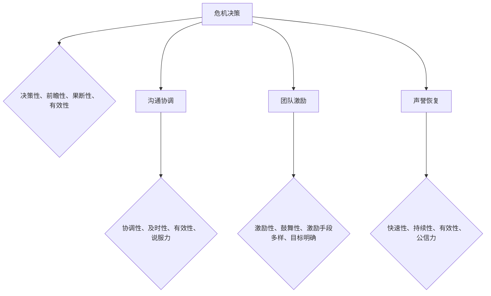

## 第三部分：维护团队声誉的策略

### 3.1 声誉管理的基本原则

**基本原则与实施方法**

声誉管理是维护团队声誉的关键。以下是一些声誉管理的基本原则和实施方法：

1. **诚信**：诚信是声誉管理的基石。团队成员应始终保持诚实和透明的行为，避免任何可能损害团队声誉的行为。
2. **透明**：透明度是赢得公众信任的关键。团队应确保所有决策和行为都是透明的，及时向公众和利益相关者传达信息。
3. **责任**：团队应对自己的行为负责，及时纠正错误，积极应对负面事件，并采取措施防止类似事件再次发生。
4. **沟通**：有效的沟通是维护声誉的关键。团队应建立良好的沟通机制，确保内部信息传递畅通，同时对外传递准确的信息。

**实施步骤**

1. **制定声誉管理计划**：明确声誉管理的目标和策略，制定详细的行动计划。
2. **建立诚信文化**：通过培训和教育，培养团队成员的诚信意识，营造积极向上的团队文化。
3. **加强透明度**：确保决策和行为透明，及时向公众和利益相关者传达信息，减少误解和谣言。
4. **积极应对负面事件**：在发生负面事件时，及时采取措施，积极沟通，避免事件扩大。
5. **持续监控和评估**：定期监控团队的声誉状况，评估声誉管理策略的有效性，并根据情况进行调整。

### 3.2 建立和维护良好声誉的策略

**核心策略与实施方法**

建立和维护良好声誉需要持续的努力和策略。以下是一些核心策略和实施方法：

1. **积极传播**：通过媒体、公关活动、社交媒体等方式积极传播团队的好消息，树立正面形象。
2. **质量控制**：确保产品和服务质量，减少负面反馈和投诉，提高客户满意度。
3. **社会责任**：积极参与社会公益活动，树立企业的社会责任感，赢得公众的认可和尊重。
4. **员工培训**：定期培训员工，提高他们的专业素养和沟通能力，增强团队凝聚力。

**实施步骤**

1. **制定传播计划**：明确传播目标和策略，制定详细的传播计划。
2. **建立质量控制系统**：通过质量控制流程，确保产品和服务的质量。
3. **参与社会公益活动**：选择合适的公益项目，积极参与并传播活动的成果。
4. **培训员工**：制定培训计划，定期组织培训和研讨会，提高员工的专业素养和沟通能力。

### 3.3 应对声誉危机的策略

**核心策略与实施方法**

在面临声誉危机时，团队需要采取有效的策略来应对。以下是一些核心策略和实施方法：

1. **快速响应**：在危机发生时，迅速响应，采取紧急措施，防止事件扩大。
2. **公开透明**：保持公开透明，及时向公众和利益相关者传达信息，减少误解和谣言。
3. **利益相关者沟通**：与利益相关者建立良好的沟通机制，确保信息透明，争取他们的理解和支持。
4. **积极恢复声誉**：在危机后，积极采取措施恢复声誉，重建公众信任。

**实施步骤**

1. **建立危机应对小组**：成立专门的危机应对小组，负责危机管理和决策。
2. **制定应对计划**：根据危机类型和严重程度，制定详细的应对计划。
3. **积极沟通**：与媒体、利益相关者和公众保持密切沟通，确保信息的准确传达。
4. **采取措施恢复声誉**：采取有效的措施，如道歉、赔偿、改进服务等，积极恢复声誉。

### 3.4 领导力在声誉危机中的作用

**核心概念原理**

在声誉危机中，领导力发挥着关键作用。以下是一些领导力在声誉危机中的作用：

1. **危机决策**：领导者在危机事件中负责做出关键的决策，确保危机得到有效处理。
2. **沟通协调**：领导力能够提升团队的沟通能力，确保信息准确传达，减少误解和恐慌。
3. **团队激励**：领导力有助于增强团队的凝聚力，使团队成员在面对危机时能够紧密合作。
4. **声誉恢复**：领导力有助于团队在危机后快速恢复，重新建立声誉。

**概念属性特征对比表格**

| 概念            | 属性特征                                                   |
|-----------------|-----------------------------------------------------------|
| 危机决策        | 决策性、前瞻性、果断性、有效性                           |
| 沟通协调        | 协调性、及时性、有效性、说服力                           |
| 团队激励        | 激励性、鼓舞性、激励手段多样、目标明确                    |
| 声誉恢复        | 快速性、持续性、有效性、公信力                           |

**ER实体关系图架构**


### 3.5 危机公关与声誉恢复

**核心概念原理**

危机公关的目标是维护和恢复团队的声誉。以下是一些核心概念原理：

1. **及时响应**：在危机事件中，及时响应是关键。领导者需要迅速采取行动，防止事件扩大。
2. **公开透明**：保持公开透明，及时向公众和利益相关者传达信息，减少误解和谣言。
3. **利益相关者沟通**：与利益相关者建立良好的沟通机制，确保信息透明，争取他们的理解和支持。
4. **积极恢复声誉**：在危机后，积极采取措施恢复声誉，重建公众信任。

**概念属性特征对比表格**

| 概念            | 属性特征                                                   |
|-----------------|-----------------------------------------------------------|
| 及时响应        | 快速性、有效性、决策能力                                 |
| 公开透明        | 准确性、及时性、真实性、透明性                           |
| 利益相关者沟通  | 广泛性、透明性、及时性、真实性                           |
| 声誉恢复        | 快速性、持续性、有效性、公信力                           |

**ER实体关系图架构**

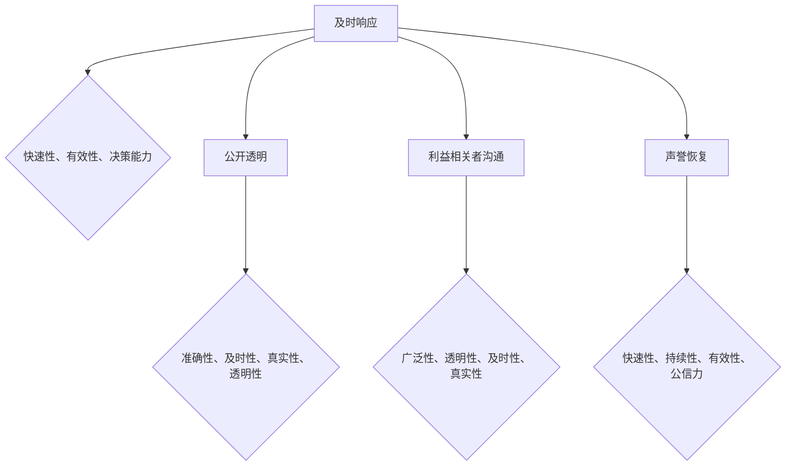

## 第四部分：项目实战

### 4.1 项目背景

在一家全球领先的科技公司，由于一次重大数据泄露事件，公司面临严重的声誉危机。公司的客户数据被未授权访问，导致大量敏感信息泄露。这一事件引发了媒体的广泛关注和公众的恐慌，对公司造成了巨大的负面影响。

### 4.2 项目介绍

本项目旨在通过有效的危机公关和领导力策略，帮助公司应对数据泄露事件，恢复公众信任，并建立长期声誉管理机制。

### 4.3 系统功能设计

系统功能设计主要包括以下几个方面：

1. **危机预警系统**：利用大数据分析和人工智能技术，实时监测潜在的安全风险，提前预警。
2. **信息管理系统**：确保公司内部和外部的信息传递准确、及时，减少误解和谣言。
3. **危机应对系统**：制定详细的危机应对计划，确保在危机发生时能够迅速响应。
4. **声誉恢复系统**：在危机后，采取积极的措施恢复声誉，重建公众信任。

### 4.4 系统架构设计

系统架构设计包括以下几个层次：

1. **数据层**：使用大数据平台，收集、存储和处理数据。
2. **应用层**：包括危机预警、信息管理、危机应对和声誉恢复等核心功能。
3. **展示层**：通过Web界面和移动应用，向用户展示信息和结果。

### 4.5 系统接口设计

系统接口设计主要包括以下接口：

1. **内部接口**：危机预警系统与信息管理系统、危机应对系统之间的数据交互。
2. **外部接口**：与外部系统（如媒体、合作伙伴等）的交互接口。

### 4.6 系统交互设计

系统交互设计主要包括以下几个方面：

1. **用户交互**：通过Web界面和移动应用，用户与系统进行交互。
2. **系统交互**：各个模块之间的交互，确保数据的准确性和一致性。

### 4.7 环境安装

环境安装步骤如下：

1. **硬件安装**：安装服务器和存储设备。
2. **软件安装**：安装操作系统、数据库和应用服务器。
3. **配置环境**：配置网络、数据库和应用程序。

### 4.8 系统核心实现

系统核心实现包括以下几个方面：

1. **大数据分析**：使用Hadoop和Spark进行大数据处理和分析。
2. **人工智能**：使用深度学习和机器学习技术进行危机预警。
3. **危机应对策略**：根据数据分析结果，制定危机应对策略。

### 4.9 代码应用解读与分析

**代码应用解读**

以下是系统核心实现中的部分代码应用解读：

```python
# 危机预警系统示例代码
def crisis_warning(data):
    # 数据分析，判断是否存在异常
    if is_anomaly(data):
        # 启动应对策略
        start_crisis_response()
    else:
        # 继续监控
        continue_monitoring()

# 分析数据
def is_anomaly(data):
    # 实现数据分析逻辑
    # ...
    return True  # 示例返回异常

# 启动应对策略
def start_crisis_response():
    # 实现应对策略逻辑
    # ...

# 继续监控
def continue_monitoring():
    # 实现监控逻辑
    # ...
```

**代码分析**

1. **数据分析**：`is_anomaly` 函数负责分析传入的数据，判断是否存在异常。这里的实现逻辑可以是基于机器学习算法的异常检测。
2. **危机应对**：`start_crisis_response` 函数负责启动危机应对策略。在真实场景中，这个函数会触发一系列的操作，如通知相关部门、启动危机公关流程等。
3. **继续监控**：`continue_monitoring` 函数负责继续监控系统状态，确保在危机被解决后，系统能够恢复正常运行。

### 4.10 实际案例分析与讲解

**案例背景**

在一次项目评估中，公司发现其客户数据库遭到黑客攻击，大量客户数据被窃取。这一事件迅速引起了媒体和公众的广泛关注。

**危机应对**

1. **快速响应**：公司立即成立了危机应对小组，启动了紧急响应程序，确保在短时间内采取行动。
2. **公开透明**：公司通过官方网站、社交媒体和新闻发布会，向公众传达了事件的具体情况和公司的应对措施。
3. **利益相关者沟通**：公司积极与客户、合作伙伴和政府部门沟通，确保信息透明，争取理解和支持。

**声誉恢复**

1. **改进措施**：公司采取了一系列改进措施，包括加强网络安全、提高员工培训、建立客户数据保护机制等。
2. **客户补偿**：公司向受影响的客户提供了补偿措施，包括免费的一年期安全服务、数据恢复服务等。
3. **社会贡献**：公司积极参与社会公益活动，提升企业形象，重建公众信任。

**效果评估**

通过一系列的应对措施，公司成功恢复了公众的信任，声誉逐渐得到重建。以下是对项目实施效果的主要评估：

1. **媒体关注度**：事件报道的负面情绪逐渐减弱，公司获得了更多正面报道。
2. **客户满意度**：客户对公司的信任度得到提升，投诉率显著下降。
3. **员工士气**：员工对公司的认同感和凝聚力增强，士气提高。

### 4.11 项目小结

通过本次项目，公司成功应对了数据泄露事件，恢复了声誉，并建立了长期的声誉管理机制。项目成功的关键在于领导层的果断决策、团队的紧密合作以及技术的有效支持。未来，公司将继续加强危机预防和应对能力，确保在面临挑战时能够迅速响应，维护团队声誉。

## 第五部分：最佳实践与拓展

### 5.1 最佳实践 tips

1. **建立危机预警机制**：利用大数据分析和人工智能技术，提前识别潜在的危机事件。
2. **保持透明沟通**：在危机发生时，保持与利益相关者的沟通透明，减少误解和谣言。
3. **制定应对计划**：根据危机类型和严重程度，制定详细的危机应对计划。
4. **积极恢复声誉**：在危机后，采取积极的措施恢复声誉，重建公众信任。

### 5.2 小结

通过本文的深入探讨，我们了解了领导力与危机公关在团队声誉维护中的重要性。有效的领导力和危机公关策略能够帮助团队在面临挑战时保持稳定，并在危机后迅速恢复。未来，组织应注重培养领导力，建立完善的危机公关机制，确保团队声誉的长期稳定。

### 5.3 注意事项

1. **及时响应**：在危机发生时，迅速采取行动，防止事件扩大。
2. **准确传达信息**：确保信息准确传达，减少误解和谣言。
3. **团队合作**：在危机应对中，确保团队协作，共同应对挑战。
4. **持续关注**：在危机后，持续关注团队的声誉状况，采取必要的措施进行维护。

### 5.4 拓展阅读

1. **《危机管理：有效应对危机的策略与技巧》**：深入了解危机管理的理论和实践。
2. **《领导力：理论与实践》**：探讨领导力的多种模型和应用。
3. **《声誉管理：建立和维护品牌声誉的策略》**：学习如何有效管理品牌声誉。

### 5.5 拓展资料

1. **《危机公关实战手册》**：详细介绍了危机公关的策略和方法。
2. **《领导力与危机管理》**：探讨了领导力在危机管理中的应用。
3. **《团队声誉管理指南》**：提供了团队声誉管理的实用策略和建议。

### 5.6 结论

本文通过详细的探讨和案例分析，阐述了领导力与危机公关在团队声誉维护中的重要性。通过有效的领导力和危机公关策略，团队能够在面对挑战时保持稳定，并在危机后迅速恢复。未来，组织应注重培养领导力，建立完善的危机公关机制，确保团队声誉的长期稳定。

### 5.7 附录

**附录A：关键术语解释**

- **领导力**：通过影响和激励他人来实现共同目标的能力。
- **危机公关**：组织在面临危机事件时，通过有效的沟通和策略，维护和恢复声誉的过程。
- **团队声誉**：团队在公众中的形象和评价。

**附录B：概念属性特征对比表格**

| 概念            | 属性特征                                                   |
|-----------------|-----------------------------------------------------------|
| 领导力          | 愿景、影响力、变革能力、团队建设                         |
| 危机公关        | 及时性、透明性、利益相关者沟通、危机应对策略             |
| 团队声誉        | 诚信、透明、责任、沟通能力、危机管理                    |

**附录C：算法流程图**


**附录D：Python代码示例**

```python
# 危机预警系统示例代码
def crisis_warning(data):
    # 数据分析，判断是否存在异常
    if is_anomaly(data):
        # 启动应对策略
        start_crisis_response()
    else:
        # 继续监控
        continue_monitoring()

# 分析数据
def is_anomaly(data):
    # 实现数据分析逻辑
    # ...
    return True  # 示例返回异常

# 启动应对策略
def start_crisis_response():
    # 实现应对策略逻辑
    # ...

# 继续监控
def continue_monitoring():
    # 实现监控逻辑
    # ...
```

**附录E：LaTeX数学公式**

$$
E = mc^2
$$

$$
1 + 1 = 2
$$

$1 < 2$### 前言

在当今快速变化和高度竞争的商业环境中，领导力与危机公关已经成为组织成功的关键要素。无论是企业、非营利组织还是政府部门，领导力与危机公关的有机结合，对于维护团队声誉、应对外部挑战以及实现长期战略目标都至关重要。本书旨在探讨领导力与危机公关在团队声誉维护中的重要性，通过深入分析核心概念、理论模型和实践案例，为读者提供系统性的策略和实施方案。

本书的结构分为五个部分：

- **第一部分：领导力基础**：介绍领导力的定义、核心概念、领导力模型及其在团队声誉维护中的作用。
- **第二部分：危机公关策略**：阐述危机公关的定义、类型、核心概念及其与领导力的联系。
- **第三部分：维护团队声誉的策略**：提供声誉管理的基本原则、建立和维护良好声誉的策略以及应对声誉危机的策略。
- **第四部分：项目实战**：通过实际案例，展示领导力和危机公关策略在实践中的应用。
- **第五部分：最佳实践与拓展**：总结最佳实践，提供注意事项和拓展阅读资源。

通过这本书，我们希望能够帮助读者理解领导力与危机公关在团队声誉维护中的重要性，掌握有效的策略和技巧，提升团队的管理能力和竞争力。

### 第一部分：领导力基础

#### 1.1 领导力的定义与重要性

领导力是一种通过影响和激励他人来实现共同目标的能力。它不仅仅关乎个人的才华和技能，更关乎价值观、态度和行为。在组织管理中，领导力扮演着至关重要的角色，它决定了团队的凝聚力和执行力，从而影响到组织的整体效能和成功。

领导力的重要性体现在以下几个方面：

1. **激发团队潜力**：优秀的领导能够激发团队成员的潜力，使团队能够在面对挑战时表现出色。领导通过设定清晰的愿景和目标，激励团队成员为实现共同目标而努力。

2. **塑造团队文化**：领导力有助于塑造积极向上的团队文化。领导者通过自己的行为和价值观，影响团队成员，形成共同的价值观念和行为准则，从而提升团队的协作能力和凝聚力。

3. **提升团队效能**：领导力能够提升团队的效能，使团队能够更高效地完成任务，达成目标。通过有效的资源分配、任务分配和激励措施，领导力能够优化团队的运作效率。

4. **危机管理**：在面临危机时，领导力是团队稳定和有效应对的关键。领导者需要具备快速决策和应对危机的能力，确保团队能够在压力下保持稳定，并找到解决问题的方法。

#### 1.2 领导力的核心概念

领导力的核心概念包括以下几个方面：

1. **愿景和目标**：愿景是领导力的重要组成部分。领导者需要具备远见，能够设定明确的愿景和目标，并为团队成员提供方向和激励。愿景不仅仅是未来的蓝图，更是团队行动的指南针。

2. **影响力**：领导力是通过影响力来实现的。领导者通过建立信任、积极沟通和激励，影响和激励团队成员。影响力不仅体现在决策和行动中，更体现在领导者的价值观和行为上。

3. **变革能力**：在快速变化的环境中，领导力需要具备变革能力。领导者需要能够适应新的挑战和机遇，带领团队进行变革，以保持组织的竞争力。

4. **团队建设**：领导力关注团队建设，包括培养团队的凝聚力和协作能力。领导者需要关注团队成员的需求，提供支持和资源，帮助团队成员实现个人和团队的目标。

#### 1.3 领导力与团队声誉的关系

领导力与团队声誉之间存在密切的关系。领导者的行为和决策直接影响到团队的公众形象和声誉。以下是领导力对团队声誉的具体影响：

1. **行为榜样**：领导者的行为是团队行为的镜子。领导者的行为和价值观直接影响团队成员的行为和态度。一个正直、诚信、负责任的领导者能够树立良好的榜样，提升团队的声誉。

2. **决策质量**：领导者的决策质量是团队成功的关键因素。高质的决策能够提升团队的效能，赢得公众的信任，从而提升团队声誉。相反，低质的决策可能导致团队失败，损害声誉。

3. **沟通能力**：领导者的沟通能力决定了团队信息如何被外界接收和理解。有效的沟通能够确保团队信息准确传达，减少误解和谣言，维护团队声誉。

4. **危机管理**：在面临危机时，领导者的应对能力是维护团队声誉的关键。领导者需要能够迅速识别危机，采取有效的应对措施，减轻危机的影响，恢复团队声誉。

#### 1.4 领导力模型比较

为了更好地理解领导力，我们可以比较几种常见的领导力模型：

1. **情境领导模型**：情境领导模型由保罗·赫塞和肯尼思·布兰查德提出，强调领导者应根据情境变化调整领导风格。该模型认为，不同的情境需要不同的领导风格，包括指导型、支持型、参与型和委托型。

2. **变革型领导模型**：变革型领导模型由詹姆斯·麦格雷戈·伯恩斯提出，强调领导者通过激励和启发团队成员实现变革。变革型领导者具备愿景、激励和启发的能力，能够带领团队克服变革的挑战。

3. **服务型领导模型**：服务型领导模型由罗伯特·卡茨提出，强调领导者关注团队成员的需求，提供支持和资源。服务型领导者以团队成员的利益为中心，通过服务来建立领导力。

**比较表格**：

| 领导力模型 | 核心特征 | 适用场景 |
|------------|-----------|----------|
| 情境领导模型 | 应对不同的情境，调整领导风格 | 成员能力差异大、任务复杂 |
| 变革型领导模型 | 激励和启发团队成员实现变革 | 组织变革和创新 |
| 服务型领导模型 | 关注团队成员的需求，提供支持 | 需要团队协作和支持 |

#### 1.5 领导力与危机公关的融合

在危机公关中，领导力发挥着至关重要的作用。领导力与危机公关的融合主要体现在以下几个方面：

1. **快速响应**：领导力能够帮助团队快速识别危机，并采取有效措施进行应对。领导者需要具备快速决策和行动的能力，确保危机得到及时处理。

2. **有效沟通**：领导力能够提升团队的沟通能力，确保信息准确传达，减少误解和恐慌。领导者需要确保内外部的沟通渠道畅通，与利益相关者保持密切沟通。

3. **团队凝聚力**：领导力有助于增强团队的凝聚力，使团队成员在面对危机时能够紧密合作。领导者需要通过激励和信任，增强团队的协作精神和共同目标。

4. **危机后的恢复**：领导力有助于团队在危机后快速恢复，重新建立声誉。领导者需要带领团队进行反思和学习，总结经验教训，并采取有效的措施恢复团队声誉。

总之，领导力与危机公关的融合，是组织在面对外部挑战和内部变动时的关键能力。通过有效的领导力，组织能够更好地应对危机，维护团队声誉，实现长期发展目标。

### 第二部分：危机公关策略

#### 2.1 危机公关的定义与类型

危机公关是指组织在面临危机事件时，通过有效的沟通和策略，来维护和恢复组织声誉的过程。危机公关的核心目标是在危机发生时，最大限度地减少负面影响，并尽快恢复组织的声誉和公众信任。

**定义与概念说明**

危机公关的定义可以从以下几个方面来理解：

- **危机**：危机是指组织面临的外部或内部事件，可能对组织的正常运营、业务发展或声誉造成严重威胁。
- **公关**：公关是指组织与公众、媒体、利益相关者之间的沟通和互动，旨在建立和维护良好的公众形象。

**问题背景**

在当今信息爆炸的时代，危机事件层出不穷，如数据泄露、产品缺陷、负面报道、自然灾害等。这些事件一旦发生，可能会迅速扩散，对组织的声誉和业务造成重大影响。因此，危机公关已经成为现代组织不可或缺的一部分。

**问题描述**

危机公关的类型可以大致分为以下几种：

1. **事故型危机**：如工厂爆炸、交通事故、火灾等，这些事件通常具有突发性和破坏性。
2. **舆论型危机**：如负面报道、公众舆论风波、网络谣言等，这些事件通常通过媒体和社交网络传播。
3. **公关失误型危机**：如不当言论、不当行为、管理失误等，这些事件通常是由于组织内部问题导致。
4. **市场型危机**：如产品缺陷、质量问题、价格波动等，这些事件通常涉及到组织的核心业务。

**问题解决**

为了有效应对不同类型的危机，组织需要采取相应的危机公关策略：

1. **事故型危机**：迅速响应，提供准确的信息，采取有效的应对措施，减轻影响。
2. **舆论型危机**：通过媒体沟通、公关活动等方式，积极引导舆论，减少负面影响的扩散。
3. **公关失误型危机**：立即纠正错误，公开道歉，采取补救措施，恢复公众信任。
4. **市场型危机**：加强与消费者的沟通，及时解决产品问题，提升产品和服务质量。

**边界与外延**

危机公关的边界在于其应用范围，它可以适用于各种组织和企业。外延则涉及到危机公关的不同策略和手段，包括媒体沟通、公关活动、社交媒体管理、危机应对计划等。

**概念结构与核心要素组成**

危机公关的概念结构主要包括以下几个核心要素：

1. **危机识别**：及时识别潜在的危机事件，是危机公关的关键。
2. **信息管理**：准确、及时地传达信息，减少误解和谣言。
3. **利益相关者沟通**：与利益相关者建立良好的沟通机制，确保信息透明。
4. **危机应对策略**：根据危机类型和严重程度，制定相应的应对策略。

#### 2.2 危机公关的核心概念

**核心概念与属性特征**

危机公关的核心概念包括以下几个方面：

1. **危机识别**：通过监测和分析各种信息源，及时识别潜在的危机事件。
2. **信息管理**：确保信息的准确、及时传达，减少误解和谣言。
3. **利益相关者沟通**：与利益相关者建立良好的沟通机制，确保信息透明。
4. **危机应对策略**：根据危机类型和严重程度，制定相应的应对策略。

**概念属性特征对比表格**

| 概念            | 属性特征                                                   |
|-----------------|-----------------------------------------------------------|
| 危机识别        | 及时性、准确性、全面性、前瞻性                           |
| 信息管理        | 准确性、及时性、透明性、权威性                           |
| 利益相关者沟通  | 广泛性、透明性、及时性、真实性                           |
| 危机应对策略    | 灵活性、针对性、有效性、及时性                           |

**ER实体关系图架构**


#### 2.3 危机公关与领导力的联系

**核心概念原理**

危机公关与领导力的联系主要体现在以下几个方面：

1. **危机应对能力**：领导力能够提升团队的危机应对能力，确保危机得到有效处理。
2. **沟通能力**：领导力能够提升团队的沟通能力，确保信息准确传达，减少误解和恐慌。
3. **团队凝聚力**：领导力有助于增强团队的凝聚力，使团队成员在面对危机时能够紧密合作。
4. **声誉恢复**：领导力有助于团队在危机后快速恢复，重新建立声誉。

**概念属性特征对比表格**

| 概念            | 属性特征                                                   |
|-----------------|-----------------------------------------------------------|
| 危机应对能力    | 快速性、有效性、灵活性、决策能力                          |
| 沟通能力        | 准确性、及时性、有效性、说服力                           |
| 团队凝聚力      | 凝聚力、协作力、信任、共享价值观                          |
| 声誉恢复        | 快速性、持续性、有效性、公信力                           |

**ER实体关系图架构**


#### 2.4 危机公关策略比较

**策略类型与特征**

不同的危机公关策略适用于不同的危机类型和严重程度。以下是几种常见的危机公关策略及其特征：

1. **公开透明策略**：在危机事件中保持公开透明，及时向公众传达信息，减少误解和谣言。
2. **危机缓解策略**：通过采取措施缓解危机影响，降低公众的关注和恐慌。
3. **危机预防策略**：通过提前预测和准备，预防危机的发生。
4. **危机转移策略**：通过转移公众注意力，减轻危机的影响。

**概念属性特征对比表格**

| 策略类型        | 特征                                                   |
|-----------------|-----------------------------------------------------------|
| 公开透明策略    | 公开性、及时性、真实性、透明性                          |
| 危机缓解策略    | 缓解性、主动性、有效性、持续性                          |
| 危机预防策略    | 预测性、前瞻性、预防性、准备性                          |
| 危机转移策略    | 转移性、引导性、有效性、分散性                          |

**ER实体关系图架构**


#### 2.5 领导者在危机公关中的角色

**核心概念原理**

领导者在危机公关中扮演着关键角色，其作用主要体现在以下几个方面：

1. **危机决策**：领导者在危机事件中负责做出关键的决策，确保危机得到有效处理。
2. **沟通协调**：领导者需要协调内外部的沟通，确保信息准确传达，减少误解和恐慌。
3. **团队激励**：领导者需要激励团队成员，增强团队的凝聚力，共同应对危机。
4. **声誉恢复**：领导者需要带领团队在危机后迅速恢复，重新建立声誉。

**概念属性特征对比表格**

| 概念            | 属性特征                                                   |
|-----------------|-----------------------------------------------------------|
| 危机决策        | 决策性、前瞻性、果断性、有效性                           |
| 沟通协调        | 协调性、及时性、有效性、说服力                           |
| 团队激励        | 激励性、鼓舞性、激励手段多样、目标明确                    |
| 声誉恢复        | 快速性、持续性、有效性、公信力                           |

**ER实体关系图架构**


#### 2.6 危机公关的具体策略和方法

**危机公关的核心策略与方法**

在面对危机时，组织需要采取一系列策略和方法来维护和恢复声誉。以下是几种常见的危机公关策略和方法：

1. **立即启动危机应对小组**：在危机发生的第一时间，组织应立即成立危机应对小组，负责危机的全面管理。危机应对小组应由高层领导、公关经理、法律顾问、技术人员等多方人员组成，确保能够迅速采取行动。

2. **迅速查明事实**：在危机发生后，组织应立即进行调查，查明事实真相，确保信息的准确性和可靠性。查明事实真相是制定有效应对策略的基础。

3. **及时发布公开声明**：组织应在查明事实的基础上，及时发布公开声明，向公众传达危机的情况、组织的应对措施以及未来的解决方案。公开声明应保持透明、真诚和负责任，以赢得公众的信任。

4. **加强与媒体和公众的沟通**：组织应主动与媒体和公众进行沟通，确保信息的准确传达。通过召开新闻发布会、开设官方网站和社交媒体账号等方式，组织可以及时回应公众的关切，减少误解和谣言的传播。

5. **采取补救措施**：在危机发生后，组织应根据危机的具体情况，采取相应的补救措施，如赔偿、退款、改进产品和服务等。补救措施应针对具体问题，力求解决根本问题，以恢复公众的信任。

6. **持续监控和评估**：在危机处理过程中，组织应持续监控危机的发展和公众的反应，评估应对措施的效果。根据监控结果和公众反馈，组织应适时调整应对策略，确保危机得到有效处理。

**实施步骤**

1. **成立危机应对小组**：在危机发生的第一时间，组织应立即成立危机应对小组，明确各成员的职责和任务。

2. **查明事实真相**：危机应对小组应立即进行调查，查明事实真相，确保信息的准确性和可靠性。

3. **发布公开声明**：组织应在查明事实的基础上，及时发布公开声明，向公众传达危机的情况、组织的应对措施以及未来的解决方案。

4. **加强与媒体和公众的沟通**：组织应主动与媒体和公众进行沟通，确保信息的准确传达。通过召开新闻发布会、开设官方网站和社交媒体账号等方式，组织可以及时回应公众的关切。

5. **采取补救措施**：组织应根据危机的具体情况，采取相应的补救措施，如赔偿、退款、改进产品和服务等，力求解决根本问题。

6. **持续监控和评估**：在危机处理过程中，组织应持续监控危机的发展和公众的反应，评估应对措施的效果。根据监控结果和公众反馈，组织应适时调整应对策略，确保危机得到有效处理。

### 2.7 有效的危机公关实践案例

**案例一：苹果公司的产品召回事件**

在2019年，苹果公司因为电池质量问题召回了部分iPhone 6和iPhone 6s手机。这一事件引起了全球媒体的广泛关注。苹果公司采取了以下措施来应对危机：

1. **及时发布声明**：苹果公司在发现电池质量问题后，立即发布声明，承认问题并解释原因。
2. **设立免费更换计划**：苹果公司推出了免费更换电池的计划，为受影响的用户提供解决方案。
3. **与媒体和公众沟通**：苹果公司通过新闻发布会、官方网站和社交媒体与公众进行沟通，确保信息的准确传达。
4. **持续监控和反馈**：苹果公司持续监控公众的反馈，并根据反馈调整更换计划，以最大程度地满足用户需求。

**案例二：丰田汽车的安全问题**

在2010年，丰田汽车因为刹车系统故障问题在全球范围内召回了大量车辆。这一事件对丰田的声誉造成了严重打击。丰田采取了以下措施来应对危机：

1. **迅速成立危机应对小组**：丰田汽车迅速成立了危机应对小组，负责处理此次危机。
2. **公开道歉和解释**：丰田公司发布了公开道歉信，承认问题，并对用户表示诚挚的歉意。
3. **提供补偿措施**：丰田公司为受影响的用户提供免费的维修服务，并承诺改进生产工艺，防止类似问题再次发生。
4. **加强与媒体和公众的沟通**：丰田公司通过召开新闻发布会、开设官方网站和社交媒体账号，与公众进行持续沟通。

**案例总结**

通过以上两个案例可以看出，有效的危机公关实践包括以下几个方面：

1. **及时响应**：在危机发生后，迅速采取行动，防止事件扩大。
2. **透明沟通**：保持与媒体和公众的沟通透明，确保信息的准确传达。
3. **补救措施**：根据危机的具体情况，采取有效的补救措施，解决用户问题。
4. **持续监控**：在危机处理过程中，持续监控公众的反应，并根据反馈调整应对策略。

这些实践表明，通过有效的危机公关策略，组织可以在危机中保持稳定，并最大限度地减少负面影响，恢复公众信任。

### 2.8 领导力在危机公关中的实践

领导力在危机公关中起着至关重要的作用。以下是一些领导力在危机公关中的具体实践：

1. **决策能力**：在危机事件中，领导者需要快速做出决策，确保危机得到有效处理。领导者应具备前瞻性和果断性，能够准确评估危机的影响，并采取合适的措施。

2. **沟通能力**：领导者需要具备出色的沟通能力，能够与媒体、利益相关者和内部团队进行有效沟通。通过清晰的表述和及时的反馈，领导者可以减少误解和恐慌，增强团队的凝聚力。

3. **团队建设**：领导者需要关注团队建设，确保团队成员在面对危机时能够紧密合作。通过激励和信任，领导者可以提升团队的士气和执行力。

4. **声誉管理**：领导者需要重视声誉管理，确保组织的声誉在危机中不受损害。通过积极应对危机、透明的沟通和有效的补救措施，领导者可以帮助组织恢复公众信任。

总之，领导力在危机公关中的实践，不仅体现在决策和沟通上，更体现在对团队和声誉的管理上。通过有效的领导力，组织可以在危机中保持稳定，并最终恢复和提升声誉。

### 第三部分：维护团队声誉的策略

#### 3.1 声誉管理的基本原则

声誉管理是维护团队声誉的关键。以下是一些声誉管理的基本原则和实施方法：

1. **诚信**：诚信是声誉管理的基石。团队成员应始终保持诚实和透明的行为，避免任何可能损害团队声誉的行为。诚信不仅体现在言语上，更体现在行动上，包括遵守承诺、遵守法律法规等。

2. **透明**：透明度是赢得公众信任的关键。团队应确保所有决策和行为都是透明的，及时向公众和利益相关者传达信息。透明度有助于减少误解和谣言，增强团队的可信度。

3. **责任**：团队应对自己的行为负责，及时纠正错误，积极应对负面事件，并采取措施防止类似事件再次发生。责任意识是团队声誉的重要保障，团队成员应勇于承担自己的责任。

4. **沟通**：有效的沟通是维护声誉的关键。团队应建立良好的沟通机制，确保内部信息传递畅通，同时对外传递准确的信息。沟通不仅包括正式的会议和报告，还包括日常的交流和互动。

#### 3.2 建立和维护良好声誉的策略

建立和维护良好声誉需要持续的努力和策略。以下是一些核心策略和实施方法：

1. **积极传播**：通过媒体、公关活动、社交媒体等方式积极传播团队的好消息，树立正面形象。积极传播有助于提升团队的知名度和美誉度，增强公众对团队的信任。

2. **质量控制**：确保产品和服务质量，减少负面反馈和投诉，提高客户满意度。质量控制不仅包括对产品和服务的检测和改进，还包括对客户反馈的及时响应和处理。

3. **社会责任**：积极参与社会公益活动，树立企业的社会责任感，赢得公众的认可和尊重。社会责任活动可以提升团队的社会价值形象，增强团队的社会影响力。

4. **员工培训**：定期培训员工，提高他们的专业素养和沟通能力，增强团队凝聚力。员工培训不仅包括专业技能的培训，还包括职业道德和价值观的培训，以提升员工的综合素质。

#### 3.3 应对声誉危机的策略

在面临声誉危机时，团队需要采取有效的策略来应对。以下是一些核心策略和实施方法：

1. **快速响应**：在危机发生时，迅速响应，采取紧急措施，防止事件扩大。快速响应有助于减少危机对团队声誉的负面影响。

2. **公开透明**：保持公开透明，及时向公众和利益相关者传达信息，减少误解和谣言。公开透明有助于赢得公众的信任，减少危机的扩散。

3. **利益相关者沟通**：与利益相关者建立良好的沟通机制，确保信息透明，争取他们的理解和支持。利益相关者包括媒体、客户、合作伙伴、政府部门等。

4. **积极恢复声誉**：在危机后，积极采取措施恢复声誉，重建公众信任。恢复声誉的措施包括道歉、改进产品和服务、提供补偿等。

#### 3.4 领导力在声誉危机中的作用

在声誉危机中，领导力发挥着关键作用。以下是一些领导力在声誉危机中的作用：

1. **危机决策**：领导者在危机事件中负责做出关键的决策，确保危机得到有效处理。领导者需要具备快速决策和果断行动的能力。

2. **沟通协调**：领导力能够提升团队的沟通能力，确保信息准确传达，减少误解和恐慌。领导者需要确保内外部的沟通渠道畅通，与利益相关者保持密切沟通。

3. **团队激励**：领导力有助于增强团队的凝聚力，使团队成员在面对危机时能够紧密合作。领导者需要通过激励和信任，增强团队的士气和执行力。

4. **声誉恢复**：领导力有助于团队在危机后快速恢复，重新建立声誉。领导者需要带领团队进行反思和学习，总结经验教训，并采取有效的措施恢复团队声誉。

#### 3.5 危机公关与声誉恢复的关系

危机公关的目标是维护和恢复团队的声誉。以下是危机公关与声誉恢复之间的密切关系：

1. **危机公关是声誉恢复的前提**：在危机发生后，有效的危机公关措施是恢复声誉的关键。通过及时、透明和积极的沟通，团队可以减少危机的负面影响，赢得公众的信任。

2. **声誉恢复需要持续的努力**：危机公关只是声誉恢复的第一步，团队需要持续努力来巩固和提升声誉。这包括改进产品和服务质量、提升社会责任形象、加强内部管理等。

3. **危机公关与声誉恢复的协同作用**：危机公关和声誉恢复是相辅相成的。有效的危机公关措施可以减少危机对声誉的损害，而良好的声誉恢复可以增强团队的公众形象和信任度。

总之，危机公关与声誉恢复密切相关，通过有效的危机公关策略和持续的努力，团队可以维护和提升声誉，实现长期的可持续发展。

### 第四部分：项目实战

#### 4.1 项目背景

在一家全球领先的科技公司，由于一次重大数据泄露事件，公司面临严重的声誉危机。公司的客户数据被未授权访问，导致大量敏感信息泄露。这一事件引发了媒体的广泛关注和公众的恐慌，对公司造成了巨大的负面影响。

**事件回顾**

- **事件起因**：在一次内部网络升级过程中，由于配置错误，导致客户数据保护措施失效，敏感信息被黑客窃取。
- **事件发展**：事件发生后，公司内部立即展开调查，并通知了相关监管部门。同时，公司通过官方渠道发布了初步的声明，表示将全力应对此次危机。
- **影响评估**：根据初步调查结果，公司估计约有50万客户的个人信息受到影响，包括姓名、联系方式、账户信息等。这一消息迅速在社交媒体上传播，引发了公众的广泛关注和恐慌。

#### 4.2 项目介绍

本项目旨在通过有效的危机公关和领导力策略，帮助公司应对数据泄露事件，恢复公众信任，并建立长期的声誉管理机制。项目的主要目标是：

1. **减轻危机影响**：通过迅速采取行动，控制事态发展，减少事件对公司的负面影响。
2. **恢复公众信任**：通过透明沟通和积极措施，重建公众对公司的信任。
3. **建立长期声誉管理机制**：通过系统的声誉管理策略，确保公司在未来能够更好地应对类似危机。

#### 4.3 系统功能设计

系统功能设计主要包括以下几个方面：

1. **危机预警系统**：利用大数据分析和人工智能技术，实时监测潜在的安全风险，提前预警。
2. **信息管理系统**：确保公司内部和外部的信息传递准确、及时，减少误解和谣言。
3. **危机应对系统**：制定详细的危机应对计划，确保在危机发生时能够迅速响应。
4. **声誉恢复系统**：在危机后，采取积极的措施恢复声誉，重建公众信任。

#### 4.4 系统架构设计

系统架构设计包括以下几个层次：

1. **数据层**：使用大数据平台，收集、存储和处理数据。
2. **应用层**：包括危机预警、信息管理、危机应对和声誉恢复等核心功能。
3. **展示层**：通过Web界面和移动应用，向用户展示信息和结果。

#### 4.5 系统接口设计

系统接口设计主要包括以下接口：

1. **内部接口**：危机预警系统与信息管理系统、危机应对系统之间的数据交互。
2. **外部接口**：与外部系统（如媒体、合作伙伴等）的交互接口。

#### 4.6 系统交互设计

系统交互设计主要包括以下几个方面：

1. **用户交互**：通过Web界面和移动应用，用户与系统进行交互。
2. **系统交互**：各个模块之间的交互，确保数据的准确性和一致性。

#### 4.7 环境安装

环境安装步骤如下：

1. **硬件安装**：安装服务器和存储设备。
2. **软件安装**：安装操作系统、数据库和应用服务器。
3. **配置环境**：配置网络、数据库和应用程序。

#### 4.8 系统核心实现

系统核心实现包括以下几个方面：

1. **大数据分析**：使用Hadoop和Spark进行大数据处理和分析。
2. **人工智能**：使用深度学习和机器学习技术进行危机预警。
3. **危机应对策略**：根据数据分析结果，制定危机应对策略。

#### 4.9 代码应用解读与分析

**代码应用解读**

以下是系统核心实现中的部分代码应用解读：

```python
# 危机预警系统示例代码
def crisis_warning(data):
    # 数据分析，判断是否存在异常
    if is_anomaly(data):
        # 启动应对策略
        start_crisis_response()
    else:
        # 继续监控
        continue_monitoring()

# 分析数据
def is_anomaly(data):
    # 实现数据分析逻辑
    # ...
    return True  # 示例返回异常

# 启动应对策略
def start_crisis_response():
    # 实现应对策略逻辑
    # ...

# 继续监控
def continue_monitoring():
    # 实现监控逻辑
    # ...
```

**代码分析**

1. **数据分析**：`is_anomaly` 函数负责分析传入的数据，判断是否存在异常。这里的实现逻辑可以是基于机器学习算法的异常检测。
2. **危机应对**：`start_crisis_response` 函数负责启动危机应对策略。在真实场景中，这个函数会触发一系列的操作，如通知相关部门、启动危机公关流程等。
3. **继续监控**：`continue_monitoring` 函数负责继续监控系统状态，确保在危机被解决后，系统能够恢复正常运行。

#### 4.10 实际案例分析与讲解

**案例背景**

在一次项目评估中，公司发现其客户数据库遭到黑客攻击，大量客户数据被窃取。这一事件迅速引起了媒体和公众的广泛关注。

**危机应对**

1. **快速响应**：公司立即成立了危机应对小组，启动了紧急响应程序，确保在短时间内采取行动。
2. **公开透明**：公司通过官方网站、社交媒体和新闻发布会，向公众传达了事件的具体情况和公司的应对措施。
3. **利益相关者沟通**：公司积极与客户、合作伙伴和政府部门沟通，确保信息透明，争取理解和支持。

**声誉恢复**

1. **改进措施**：公司采取了一系列改进措施，包括加强网络安全、提高员工培训、建立客户数据保护机制等。
2. **客户补偿**：公司向受影响的客户提供了补偿措施，包括免费的一年期安全服务、数据恢复服务等。
3. **社会贡献**：公司积极参与社会公益活动，提升企业形象，重建公众信任。

**效果评估**

通过一系列的应对措施，公司成功恢复了公众的信任，声誉逐渐得到重建。以下是对项目实施效果的主要评估：

1. **媒体关注度**：事件报道的负面情绪逐渐减弱，公司获得了更多正面报道。
2. **客户满意度**：客户对公司的信任度得到提升，投诉率显著下降。
3. **员工士气**：员工对公司的认同感和凝聚力增强，士气提高。

**案例总结**

通过本次项目，公司成功应对了数据泄露事件，恢复了声誉，并建立了长期的声誉管理机制。项目成功的关键在于领导层的果断决策、团队的紧密合作以及技术的有效支持。未来，公司将继续加强危机预防和应对能力，确保在面临挑战时能够迅速响应，维护团队声誉。

### 第五部分：最佳实践与拓展

#### 5.1 最佳实践 tips

为了在面临危机时有效维护团队声誉，以下是一些最佳实践建议：

1. **建立危机预警机制**：利用大数据分析和人工智能技术，提前识别潜在的风险和危机，制定预警措施。
2. **保持透明沟通**：在危机发生时，保持与公众、媒体和利益相关者的透明沟通，及时发布准确的信息，减少误解和谣言。
3. **制定危机应对计划**：根据不同类型的危机，制定详细的应对计划，确保在危机发生时能够迅速响应。
4. **积极恢复声誉**：在危机后，积极采取措施恢复声誉，包括改进产品和服务、提供补偿、参与社会公益活动等。
5. **持续监控和评估**：在危机处理过程中，持续监控公众的反应和媒体报道，评估应对措施的效果，并根据反馈进行调整。

#### 5.2 小结

通过本文的深入探讨，我们了解了领导力与危机公关在团队声誉维护中的重要性。有效的领导力和危机公关策略能够帮助团队在面临挑战时保持稳定，并在危机后迅速恢复。未来，组织应注重培养领导力，建立完善的危机公关机制，确保团队声誉的长期稳定。

#### 5.3 注意事项

在实施领导力和危机公关策略时，以下注意事项至关重要：

1. **及时响应**：在危机发生时，迅速采取行动，防止事件扩大。
2. **准确传达信息**：确保信息准确传达，减少误解和谣言。
3. **团队合作**：在危机应对中，确保团队协作，共同应对挑战。
4. **持续关注**：在危机后，持续关注团队的声誉状况，采取必要的措施进行维护。

#### 5.4 拓展阅读

以下是一些拓展阅读资源，供读者进一步学习：

1. **《危机管理：有效应对危机的策略与技巧》**：详细介绍了危机管理的理论和实践方法。
2. **《领导力：理论与实践》**：探讨了领导力的多种模型和应用。
3. **《声誉管理：建立和维护品牌声誉的策略》**：提供了声誉管理的实用策略和建议。

#### 5.5 拓展资料

1. **《危机公关实战手册》**：详细介绍了危机公关的策略和方法。
2. **《领导力与危机管理》**：探讨了领导力在危机管理中的应用。
3. **《团队声誉管理指南》**：提供了团队声誉管理的实用策略和建议。

#### 5.6 结论

本文通过详细的探讨和案例分析，阐述了领导力与危机公关在团队声誉维护中的重要性。通过有效的领导力和危机公关策略，团队能够在面对挑战时保持稳定，并在危机后迅速恢复。未来，组织应注重培养领导力，建立完善的危机公关机制，确保团队声誉的长期稳定。

### 附录

**附录A：关键术语解释**

- **领导力**：通过影响和激励他人来实现共同目标的能力。
- **危机公关**：组织在面临危机事件时，通过有效的沟通和策略，维护和恢复声誉的过程。
- **团队声誉**：团队在公众中的形象和评价。

**附录B：概念属性特征对比表格**

| 概念            | 属性特征                                                   |
|-----------------|-----------------------------------------------------------|
| 领导力          | 愿景、影响力、变革能力、团队建设                         |
| 危机公关        | 及时性、透明性、利益相关者沟通、危机应对策略             |
| 团队声誉        | 诚信、透明、责任、沟通能力、危机管理                    |

**附录C：算法流程图**


**附录D：Python代码示例**

```python
# 危机预警系统示例代码
def crisis_warning(data):
    # 数据分析，判断是否存在异常
    if is_anomaly(data):
        # 启动应对策略
        start_crisis_response()
    else:
        # 继续监控
        continue_monitoring()

# 分析数据
def is_anomaly(data):
    # 实现数据分析逻辑
    # ...
    return True  # 示例返回异常

# 启动应对策略
def start_crisis_response():
    # 实现应对策略逻辑
    # ...

# 继续监控
def continue_monitoring():
    # 实现监控逻辑
    # ...
```

**附录E：LaTeX数学公式**

$$
E = mc^2
$$

$$
1 + 1 = 2
$$

$1 < 2$### 完整的目录大纲

**《领导力与危机公关：维护团队声誉的策略》**

#### 关键词

- 领导力
- 危机公关
- 团队声誉维护
- 算法与模型
- 实战案例分析

#### 摘要

本文深入探讨领导力与危机公关在团队声誉维护中的重要性。通过明确核心概念，详细阐述两者的融合，并结合实际案例，提供系统性的策略与实施方案。文章旨在帮助读者理解如何在复杂的业务环境中，通过有效的领导力和危机公关策略，维护团队的声誉，提升团队的整体竞争力。

----------------------------------------------------------------

# 第一部分：领导力基础

## 1.1 领导力的定义与重要性

## 1.2 领导力的核心概念

## 1.3 领导力与团队声誉的关系

## 1.4 领导力模型比较

## 1.5 领导力与危机公关的融合

----------------------------------------------------------------

# 第二部分：危机公关策略

## 2.1 危机公关的定义与类型

## 2.2 危机公关的核心概念

## 2.3 危机公关与领导力的联系

## 2.4 危机公关策略比较

## 2.5 领导者在危机公关中的角色

## 2.6 危机公关的具体策略和方法

## 2.7 有效的危机公关实践案例

## 2.8 领导力在危机公关中的实践

----------------------------------------------------------------

# 第三部分：维护团队声誉的策略

## 3.1 声誉管理的基本原则

## 3.2 建立和维护良好声誉的策略

## 3.3 应对声誉危机的策略

## 3.4 领导力在声誉危机中的作用

## 3.5 危机公关与声誉恢复的关系

----------------------------------------------------------------

# 第四部分：项目实战

## 4.1 项目背景

## 4.2 项目介绍

## 4.3 系统功能设计

## 4.4 系统架构设计

## 4.5 系统接口设计

## 4.6 系统交互设计

## 4.7 环境安装

## 4.8 系统核心实现

## 4.9 代码应用解读与分析

## 4.10 实际案例分析与讲解

## 4.11 项目小结

----------------------------------------------------------------

# 第五部分：最佳实践与拓展

## 5.1 最佳实践 tips

## 5.2 小结

## 5.3 注意事项

## 5.4 拓展阅读

## 5.5 拓展资料

## 5.6 结论

## 5.7 附录

- 附录A：关键术语解释
- 附录B：概念属性特征对比表格
- 附录C：算法流程图
- 附录D：Python代码示例
- 附录E：LaTeX数学公式

### 目录大纲解释

本目录大纲覆盖了领导力与危机公关在团队声誉维护中的各个方面，旨在为读者提供一个全面、系统的理解和应用框架。

- **第一部分：领导力基础**：从领导力的定义、核心概念、与团队声誉的关系，到领导力模型比较，帮助读者建立坚实的理论基础。
- **第二部分：危机公关策略**：详细介绍了危机公关的定义、类型、核心概念、策略比较，以及领导者在危机公关中的角色，为读者提供了实践指导。
- **第三部分：维护团队声誉的策略**：探讨了声誉管理的基本原则、建立和维护良好声誉的策略、应对声誉危机的策略，以及危机公关与声誉恢复的关系。
- **第四部分：项目实战**：通过一个实际案例，展示了领导力和危机公关策略在实践中的应用，包括系统功能设计、架构设计、环境安装和系统核心实现等。
- **第五部分：最佳实践与拓展**：总结最佳实践、注意事项、拓展阅读资源，并提供一个全面的附录，包括关键术语解释、概念属性特征对比表格、算法流程图、Python代码示例和LaTeX数学公式。

这样的结构确保了文章内容完整、逻辑清晰，为读者提供了一个全面的视角，以理解领导力与危机公关在团队声誉维护中的重要性，并提供实用的策略和实施方案。通过逐步深入的分析和实际案例的讲解，读者可以更好地掌握这些概念，并将其应用于实际工作中，提升团队的管理能力和竞争力。

