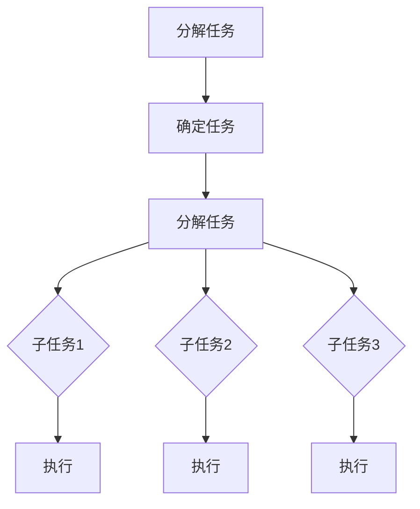

                 


## 领导力与压力管理：在逆境中保持冷静

> 关键词：领导力、压力管理、逆境、冷静、团队协作

> 摘要：本文旨在探讨领导力与压力管理在逆境中保持冷静的重要性，通过深入分析领导力与压力管理的理论和方法，以及在实际案例中的应用，帮助读者在逆境中提升领导力和压力管理能力，从而更好地应对挑战。

## 目录大纲设计思路

### 1. 明确书籍主题
书籍的主题是“领导力与压力管理：在逆境中保持冷静”，旨在帮助读者在逆境中提升领导力和压力管理能力。围绕这一主题，我们将设计系统的目录结构，确保内容逻辑清晰、结构紧凑。

### 2. 确定章节结构
根据书籍主题，我们将内容分为四个主要部分：领导力基础、压力管理、逆境中的领导力和个人成长。每个部分都将详细阐述相关理论和实践方法。

### 3. 细化每个章节
在每个章节中，我们将细化内容，确保每个章节都有明确的主题和目标。例如，在“领导力基础”章节中，我们将详细解释领导力的定义、核心要素及其重要性。

### 4. 添加核心概念与联系
为了帮助读者更好地理解书中的内容，我们将在适当的地方添加核心概念的解释、对比表格和ER实体关系图。

### 5. 编写算法原理讲解
对于涉及到的领导力与压力管理的方法，我们将使用mermaid画出流程图，并用python源代码和latex数学公式详细阐述算法原理。

### 6. 设计系统分析与架构设计方案
如果书籍中包含了具体的项目或系统，我们将设计系统功能设计、系统架构设计和系统接口设计的mermaid类图、架构图和序列图。

### 7. 撰写项目实战
为每个章节提供一个实际案例，介绍环境安装、系统实现、代码解读、案例分析等内容。

### 8. 添加最佳实践 tips、小结、注意事项、拓展阅读
在每个章节的最后，为读者提供实用的建议、总结、注意点和进一步学习的资源。

### 9. 确保目录大纲简洁性
在保证内容完整性的同时，避免过多的冗余信息，确保目录大纲的简洁性。

## 目录大纲

### 第一部分：领导力基础

#### 第1章：领导力的定义与重要性
- 1.1 领导力的定义
- 1.2 领导力的重要性
- 1.3 领导力与管理的区别
- 1.4 领导力的核心要素

#### 第2章：领导风格与团队协作
- 2.1 领导风格的理论与实践
- 2.2 团队协作的原理与技巧
- 2.3 领导风格与团队协作的关联

### 第二部分：压力管理

#### 第3章：压力的本质与影响
- 3.1 压力的定义
- 3.2 压力的来源
- 3.3 压力对领导力的负面影响
- 3.4 压力的积极影响

#### 第4章：压力管理方法
- 4.1 压力管理的原则
- 4.2 时间管理
- 4.3 情绪管理
- 4.4 身体健康管理

#### 第5章：逆境中的压力管理
- 5.1 逆境中的压力管理策略
- 5.2 增强心理韧性
- 5.3 建立支持系统
- 5.4 持续学习与成长

### 第三部分：逆境中的领导力

#### 第6章：逆境中的领导力特质
- 6.1 逆境中的领导力特质
- 6.2 逆境中的领导力行为
- 6.3 逆境中的领导力思维模式

#### 第7章：逆境中的领导力实践
- 7.1 逆境中的沟通技巧
- 7.2 逆境中的决策制定
- 7.3 逆境中的团队建设

### 第四部分：个人成长

#### 第8章：自我认知与成长
- 8.1 自我认知的重要性
- 8.2 自我认知的方法
- 8.3 个人成长路径

#### 第9章：领导力与压力管理最佳实践
- 9.1 最佳实践分享
- 9.2 小结
- 9.3 注意事项
- 9.4 拓展阅读

---

## 第1章：领导力的定义与重要性

### 1.1 领导力的定义

领导力是一种影响力和目标共识的能力，它不仅仅涉及个人魅力的发挥，更是一个复杂的社会互动过程。我们可以将领导力定义为：

$$
\text{领导力} = \text{影响力} \times \text{目标共识}
$$

其中，“影响力”指的是领导者能够引导、激励和影响他人，使他们为实现共同目标而努力；“目标共识”则是团队成员对目标的理解和认同，共同追求的结果。

### 1.2 领导力的重要性

领导力对于个人和组织的成长具有重要意义。以下是领导力的重要性体现在几个方面：

#### 对个人成长的影响

1. **提升自信心**：领导力帮助个人在决策和面对挑战时更加自信。
2. **增强解决问题的能力**：领导力培养个人在复杂环境下迅速找到解决方案的能力。
3. **提高人际交往技巧**：领导力要求个人具备良好的沟通和协调能力，有助于在社交场合中更好地表现。

#### 对团队和组织的影响

1. **提高团队协作效率**：领导力能够激发团队成员的积极性，提高团队的整体效率。
2. **促进组织创新与发展**：领导力鼓励团队成员勇于尝试和创新，推动组织持续发展。
3. **增强组织竞争力**：有效的领导力能够帮助组织在竞争中保持优势。

### 1.3 领导力与管理的区别

虽然领导力和管理密切相关，但二者在定义和目标上有所不同：

#### 定义与目标

- **领导力**：关注于影响和激励他人，实现共同目标；关注个人成长和团队协作。
- **管理**：关注于组织资源的有效利用，确保目标的实现；关注流程和效率。

### 1.4 领导力的核心要素

领导力包含多个核心要素，以下是其中几个重要的要素：

| 要素 | 描述 |
| --- | --- |
| 沟通能力 | 有效传达信息，建立良好关系 |
| 决策能力 | 在不确定性中做出明智选择 |
| 激励能力 | 激发团队动力，实现共同目标 |
| 领导风格 | 适应不同情境，灵活应对 |

通过深入理解和实践这些核心要素，领导者可以更好地发挥领导力，提升团队和组织的能力。

## 第2章：领导风格与团队协作

### 2.1 领导风格的理论与实践

领导风格是指领导者在与团队成员互动时所采用的方式和方法。不同的领导风格会对团队协作产生不同的影响。以下是几种常见的领导风格及其特点：

#### 1. 指导型领导风格

- **特点**：领导者明确指示团队成员的任务和目标，强调任务的完成。
- **适用场景**：在团队成员缺乏经验和技能时，指导型领导风格有助于确保任务的顺利完成。

#### 2. 支持型领导风格

- **特点**：领导者关注团队成员的需求和感受，提供支持和鼓励。
- **适用场景**：在团队成员面临压力和挑战时，支持型领导风格有助于增强团队成员的信心和动力。

#### 3. 参与型领导风格

- **特点**：领导者与团队成员共同参与决策和讨论，重视团队成员的意见和反馈。
- **适用场景**：在团队成员具备一定经验和技能，且需要参与决策时，参与型领导风格有助于提高团队的凝聚力和创造力。

#### 4. 模范型领导风格

- **特点**：领导者通过自身行为树立榜样，激发团队成员的积极性和责任感。
- **适用场景**：在团队需要快速行动和高效执行时，模范型领导风格有助于建立团队的信任和执行力。

### 2.2 团队协作的原理与技巧

团队协作是领导力的重要组成部分。有效的团队协作能够提高团队的工作效率和创新能力。以下是团队协作的原理与技巧：

#### 1. 明确目标

- **原理**：团队成员需要明确团队的目标和任务，以便更好地协同工作。
- **技巧**：领导者需要与团队成员共同制定明确的目标和计划，确保每个人都清楚自己的任务和责任。

#### 2. 建立信任

- **原理**：信任是团队协作的基础，有助于团队成员之间的有效沟通和合作。
- **技巧**：领导者需要通过积极的沟通、尊重团队成员的意见和建立共同目标来建立信任。

#### 3. 激发创新

- **原理**：创新是团队持续发展的重要驱动力，有助于团队在竞争中获得优势。
- **技巧**：领导者需要鼓励团队成员提出新的想法和解决方案，并提供必要的资源和支持。

#### 4. 分配责任

- **原理**：明确的责任分配有助于提高团队的工作效率和责任感。
- **技巧**：领导者需要根据团队成员的能力和兴趣分配任务，确保每个人都能发挥自己的优势。

### 2.3 领导风格与团队协作的关联

不同的领导风格会对团队协作产生不同的影响。以下是几种领导风格与团队协作的关联：

#### 1. 指导型领导风格

- **关联**：有助于确保团队成员按照任务要求完成工作，但在长期内可能会降低团队成员的积极性和自主性。

#### 2. 支持型领导风格

- **关联**：有助于增强团队成员的信心和动力，提高团队的凝聚力和合作效率。

#### 3. 参与型领导风格

- **关联**：有助于提高团队的决策质量和创新能力，增强团队成员的参与感和归属感。

#### 4. 模范型领导风格

- **关联**：有助于树立团队榜样，激发团队成员的积极性和责任感，提高团队的整体执行力。

通过合理运用不同的领导风格和团队协作技巧，领导者可以更好地引导团队在逆境中保持冷静和高效，实现共同目标。

## 第3章：压力的本质与影响

### 3.1 压力的定义

压力是指个人在面对外界要求、挑战和不确定性时所产生的一种心理和生理反应。这种反应可以是正面的，如激励个人迎接挑战，也可以是负面的，如导致焦虑和疲劳。因此，压力是一种双刃剑，需要我们正确理解和应对。

### 3.2 压力的来源

压力的来源多种多样，可以归纳为以下几个方面：

#### 1. 工作压力

- **描述**：工作压力主要来源于工作任务繁重、工作环境紧张、工作要求高等因素。
- **案例**：一位程序员需要在一个紧迫的截止日期前完成一个复杂的软件项目，这可能导致他感到巨大的压力。

#### 2. 生活压力

- **描述**：生活压力来源于家庭、财务、健康等方面的问题。
- **案例**：一个人可能因为家庭纠纷、经济困难或健康问题而感到压力重重。

#### 3. 社会压力

- **描述**：社会压力来源于社会期望、人际关系和竞争等方面。
- **案例**：一个人可能因为担心无法达到社会期望或害怕在竞争中被淘汰而感到压力。

### 3.3 压力对领导力的负面影响

压力对领导力的影响是复杂的。虽然适度的压力可以激发领导者的积极性，但过度的压力会对领导力产生负面影响：

#### 1. 决策能力下降

- **描述**：压力可能导致领导者在面对问题时无法做出清晰的决策。
- **案例**：一位领导者可能因为压力而无法在紧急情况下做出有效的决策，导致问题恶化。

#### 2. 沟通能力减弱

- **描述**：压力可能导致领导者在与团队成员沟通时出现误解和冲突。
- **案例**：一位领导者可能因为压力而在与团队成员沟通时态度恶劣，导致团队关系紧张。

#### 3. 激励能力降低

- **描述**：压力可能导致领导者无法有效地激励团队成员，降低团队士气。
- **案例**：一位领导者可能因为压力而无法找到合适的方法激励团队成员，导致团队士气低落。

### 3.4 压力的积极影响

虽然压力通常被视为负面影响，但在某些情况下，适度的压力也可以对领导力产生积极影响：

#### 1. 激发创造力

- **描述**：适度的压力可以激发领导者的创造力和创新能力。
- **案例**：一位领导者可能因为面临挑战而提出创新的想法，从而推动团队的发展。

#### 2. 提高应对能力

- **描述**：适度的压力可以帮助领导者提高应对问题和挑战的能力。
- **案例**：一位领导者可能因为适度的压力而学会如何在复杂和不确定的环境中更好地应对。

#### 3. 增强团队凝聚力

- **描述**：适度的压力可以增强团队成员之间的凝聚力，共同面对挑战。
- **案例**：在一个面临紧急情况的团队中，领导者通过适度的压力激发团队成员的团结和协作。

### 3.5 压力的管理策略

为了在逆境中保持冷静，领导者需要学会有效地管理压力。以下是几种常见的压力管理策略：

#### 1. 时间管理

- **描述**：合理安排时间和任务，避免过度工作。
- **技巧**：设定优先级，分解任务，避免拖延。

#### 2. 情绪管理

- **描述**：学会调整自己的情绪，保持积极的心态。
- **技巧**：通过冥想、运动等方式缓解压力，保持良好的心态。

#### 3. 身体健康管理

- **描述**：保持良好的身体健康，提高抗压能力。
- **技巧**：定期锻炼，保持良好的饮食习惯，保证充足的睡眠。

#### 4. 寻求支持

- **描述**：在遇到困难时，寻求同事、朋友或专业人士的支持。
- **技巧**：建立良好的社交网络，学会倾诉和寻求帮助。

通过有效的压力管理策略，领导者可以在逆境中保持冷静和高效，更好地发挥领导力。

## 第4章：压力管理方法

### 4.1 压力管理的原则

压力管理是一个系统性的过程，需要遵循以下原则：

#### 1. 全面性

压力管理不仅关注工作压力，还要关注生活压力和社会压力，全面评估压力来源，制定综合性的应对策略。

#### 2. 预防性

在压力发生之前，采取预防措施，如时间管理、情绪管理和身体健康管理等，以减少压力的产生。

#### 3. 积极性

面对压力时，保持积极的心态，寻找压力的积极面，激发自身的潜能。

#### 4. 适应性

根据不同的压力情境，灵活调整应对策略，适应变化，提高抗压能力。

### 4.2 时间管理

时间管理是压力管理的重要组成部分，有效的时间管理可以减少工作压力，提高工作效率。以下是一些时间管理的方法：

#### 1. 设定优先级

根据任务的重要性和紧急性，设定任务的优先级，确保重要且紧急的任务优先完成。

```mermaid
graph TB
A[设定优先级] --> B[重要紧急]
A --> C[重要不紧急]
A --> D[不重要紧急]
A --> E[不重要不紧急]
B --> F[优先完成]
C --> G[适时完成}
D --> H[及时处理}
E --> I[延迟处理}
```

#### 2. 分解任务

将复杂的任务分解为小任务，逐步完成，以减少任务的复杂性和压力。



#### 3. 避免拖延

设定明确的截止日期，避免拖延，保持工作的连续性和效率。

```python
import datetime

# 设置任务截止日期
deadline = datetime.datetime(2023, 12, 31)
current_date = datetime.datetime.now()

# 计算剩余天数
days_left = (deadline - current_date).days

# 输出剩余天数
print(f"距离任务截止还有 {days_left} 天。")
```

### 4.3 情绪管理

情绪管理是压力管理的关键，有效的情绪管理可以帮助领导者保持冷静和理性。以下是一些情绪管理的方法：

#### 1. 认知重构

通过改变对事件的认知和解释方式，调整情绪反应。例如，将“这是一个无法完成的任务”改为“这是一个有挑战的任务，我可以找到解决方案”。

```python
def cognitive_restructuring(event):
    negative_thought = "这是一个无法完成的任务。"
    positive_thought = "这是一个有挑战的任务，我可以找到解决方案。"
    print(f"从 {negative_thought} 改为 {positive_thought}")
    return positive_thought

event = "任务难度很大"
print(cognitive_restructuring(event))
```

#### 2. 情绪宣泄

通过适当的方式宣泄情绪，如运动、写日记或与朋友倾诉等，以缓解情绪压力。

```mermaid
graph TB
A[情绪宣泄] --> B[运动}
A --> C[写日记}
A --> D[倾诉}
```

### 4.4 身体健康管理

身体健康管理是压力管理的基石，良好的身体状况有助于提高抗压能力。以下是一些身体健康管理的方法：

#### 1. 定期锻炼

定期进行适量的锻炼，如散步、跑步、瑜伽等，有助于提高身体素质和抗压能力。

```mermaid
graph TB
A[定期锻炼] --> B[散步}
A --> C[跑步}
A --> D[瑜伽}
```

#### 2. 良好的饮食习惯

保持良好的饮食习惯，摄入均衡的营养，有助于维持身体健康。

```mermaid
graph TB
A[良好的饮食习惯] --> B[均衡营养}
A --> C[少油少盐}
A --> D[避免过量饮酒}
```

#### 3. 充足的睡眠

保证充足的睡眠，有助于恢复体力和精神，提高抗压能力。

```python
import datetime

# 设置每晚的睡眠时间
sleep_duration = datetime.timedelta(hours=8)

# 计算当天结束时的睡眠时间
current_time = datetime.datetime.now()
sleep_time = current_time - sleep_duration

# 输出建议的睡觉时间
print(f"建议您在 {sleep_time.strftime('%Y-%m-%d %H:%M')} 睡觉。")
```

通过遵循压力管理的原则和运用有效的压力管理方法，领导者可以在逆境中保持冷静和高效，提升领导力和团队绩效。

## 第5章：逆境中的压力管理

### 5.1 逆境中的压力管理策略

在逆境中，压力管理显得尤为重要。以下是一些有效的压力管理策略，帮助领导者在逆境中保持冷静和高效。

#### 1. 增强心理韧性

心理韧性是指个体在面对逆境和挑战时的适应能力和恢复能力。以下是一些增强心理韧性的方法：

- **积极心态**：保持积极的心态，相信自己有能力应对逆境。
- **设定目标**：设定短期和长期目标，为应对逆境提供动力。
- **反思与学习**：从逆境中吸取教训，不断改进自己的应对策略。

#### 2. 建立支持系统

在逆境中，建立一个支持系统可以帮助领导者更好地应对压力。以下是一些建立支持系统的方法：

- **团队合作**：与团队成员建立紧密的合作关系，共同面对挑战。
- **寻求外部支持**：向朋友、家人或专业人士寻求帮助和建议。
- **内部支持网络**：在组织内部建立支持网络，如领导力发展小组或心理辅导服务。

#### 3. 持续学习与成长

持续学习与成长是提高抗压能力和应对逆境的关键。以下是一些持续学习与成长的方法：

- **知识更新**：不断学习新的知识和技能，以应对不断变化的环境。
- **技能提升**：通过培训和实践提升自己的专业技能和领导力。
- **反思与总结**：定期反思自己的行为和决策，总结经验教训。

### 5.2 增强心理韧性

增强心理韧性是逆境中保持冷静和高效的重要策略。以下是一些具体的实践方法：

#### 1. 情绪调节

情绪调节是指通过一系列方法来管理自己的情绪，以减少负面情绪的影响。以下是一些情绪调节的方法：

- **认知重构**：改变对事件的负面认知，以更积极的角度看待问题。
- **深呼吸**：进行深呼吸练习，放松身心，缓解紧张情绪。
- **正念冥想**：通过正念冥想练习，提高对情绪的觉察和自我控制能力。

```mermaid
graph TB
A[情绪调节] --> B[认知重构}
A --> C[深呼吸]
A --> D[正念冥想]
```

#### 2. 应对策略

应对策略是指在面对压力时采取的具体行动，以减轻压力的影响。以下是一些应对策略：

- **时间管理**：合理安排时间和任务，避免过度工作和拖延。
- **求助**：在遇到困难时，主动寻求帮助，与他人分享问题和感受。
- **放松技巧**：通过运动、音乐、阅读等方式放松身心，缓解压力。

```mermaid
graph TB
A[应对策略] --> B[时间管理}
A --> C[求助]
A --> D[放松技巧}
```

### 5.3 建立支持系统

建立支持系统是提高抗压能力的重要手段。以下是一些建立支持系统的具体方法：

#### 1. 团队支持

团队支持是指通过团队内部的合作和互助来提高抗压能力。以下是一些团队支持的方法：

- **团队沟通**：定期进行团队沟通，分享问题和感受，增强团队凝聚力。
- **团队活动**：组织团队活动，如团建活动或外出旅行，增进团队成员之间的了解和信任。

```mermaid
graph TB
A[团队支持] --> B[团队沟通}
A --> C[团队活动}
```

#### 2. 外部支持

外部支持是指通过外部资源来提高抗压能力。以下是一些外部支持的方法：

- **心理咨询**：寻求专业的心理咨询师的帮助，解决内心的困扰和压力。
- **专业培训**：参加专业的培训课程，提升自身的专业技能和应对能力。

```mermaid
graph TB
A[外部支持] --> B[心理咨询}
A --> C[专业培训}
```

通过增强心理韧性、建立支持系统和运用有效的应对策略，领导者可以在逆境中保持冷静和高效，更好地应对挑战。

## 第6章：逆境中的领导力特质

### 6.1 逆境中的领导力特质

在逆境中，领导力尤为重要。以下是一些逆境中领导者需要具备的特质：

#### 1. 清晰的愿景

在逆境中，领导者需要具备清晰的愿景，为团队指明方向。这种愿景不仅要明确，还要具有激励性和可实现性。

#### 2. 强大的意志力

领导者需要具备强大的意志力，面对逆境时不轻易放弃。意志力可以帮助领导者克服困难，保持坚定的信念。

#### 3. 沟通能力

有效的沟通能力是领导者应对逆境的重要工具。领导者需要能够清晰地传达信息，鼓励团队成员，同时倾听他们的意见和需求。

#### 4. 应变能力

领导者需要具备应对突发情况的能力，灵活调整策略，迅速做出决策。

#### 5. 情绪管理能力

在逆境中，领导者需要具备良好的情绪管理能力，保持冷静，避免负面情绪的传播。

### 6.2 逆境中的领导力行为

领导者需要在逆境中采取一系列特定的行为，以维护团队稳定和推动前进。以下是一些具体的行为：

#### 1. 明确责任

在逆境中，领导者需要明确团队成员的责任，确保每个人都知道自己的任务和期望。

```mermaid
graph TB
A[明确责任] --> B[分配任务}
A --> C[设定目标}
```

#### 2. 激励团队

领导者需要通过各种方式激励团队成员，提高他们的士气和动力。

```mermaid
graph TB
A[激励团队] --> B[表扬和认可}
A --> C[分享成功经验}
```

#### 3. 保持沟通

领导者需要保持与团队成员的沟通，确保信息的畅通，及时解决问题。

```mermaid
graph TB
A[保持沟通] --> B[定期会议}
A --> C[即时反馈}
```

#### 4. 适应变化

领导者需要具备快速适应变化的能力，根据实际情况调整策略。

```mermaid
graph TB
A[适应变化] --> B[调整计划}
A --> C[灵活应对}
```

### 6.3 逆境中的领导力思维模式

领导者需要具备特定的思维模式，以更好地应对逆境。以下是一些关键的思维模式：

#### 1. 创新思维

在逆境中，领导者需要具备创新思维，寻找新的解决方案和方法。

```mermaid
graph TB
A[创新思维] --> B[头脑风暴}
A --> C[跨部门合作}
```

#### 2. 系统思维

领导者需要具备系统思维，从全局的角度看待问题，理解各个部分之间的关系。

```mermaid
graph TB
A[系统思维] --> B[问题分析}
A --> C[解决方案设计}
```

#### 3. 长期思维

领导者需要具备长期思维，关注长远目标，不被短期困境所干扰。

```mermaid
graph TB
A[长期思维] --> B[战略规划}
A --> C[持续改进}
```

通过具备这些领导力特质和行为，领导者可以在逆境中保持冷静和高效，带领团队克服困难，实现目标。

## 第7章：逆境中的领导力实践

### 7.1 逆境中的沟通技巧

在逆境中，领导者的沟通技巧尤为重要。有效的沟通不仅可以确保信息的准确传达，还能增强团队的凝聚力和信心。以下是一些在逆境中应用沟通技巧的方法：

#### 1. 清晰传达信息

在逆境中，领导者需要确保信息传达的清晰和准确。这包括：

- **明确的目标和期望**：在困难时期，领导者需要明确传达团队的目标和期望，使团队成员了解自己的职责和任务。
- **具体的行动计划**：详细解释行动计划，包括每个步骤的执行方式和时间安排，以减少误解和混乱。

```mermaid
graph TB
A[清晰传达信息] --> B[明确目标期望]
A --> C[具体行动计划}
```

#### 2. 积极倾听

积极的倾听不仅仅是听到对方说的话，更重要的是理解对方的感受和需求。以下是一些积极倾听的方法：

- **给予关注**：在沟通过程中，领导者需要给予团队成员充分的关注，通过眼神接触和肢体语言表达尊重。
- **提问和反馈**：通过提问和反馈，领导者可以更好地理解团队成员的想法和感受，同时也能确保信息的准确传达。

```mermaid
graph TB
A[积极倾听] --> B[给予关注}
A --> C[提问和反馈}
```

#### 3. 情绪管理

在逆境中，情绪管理是沟通的关键。领导者需要：

- **控制自己的情绪**：在面对压力和挑战时，领导者需要保持冷静，避免负面情绪的影响。
- **同理心**：领导者需要展现出对团队成员同理心，理解他们的困难和挑战，帮助他们缓解压力。

```mermaid
graph TB
A[情绪管理] --> B[控制自己情绪}
A --> C[同理心}
```

#### 4. 建立沟通渠道

在逆境中，建立有效的沟通渠道是确保信息畅通的重要步骤。以下是一些建立沟通渠道的方法：

- **定期会议**：定期召开团队会议，确保团队成员之间的沟通和协作。
- **开放沟通**：鼓励团队成员提出问题和建议，建立开放的沟通氛围。

```mermaid
graph TB
A[建立沟通渠道] --> B[定期会议}
A --> C[开放沟通}
```

### 7.2 逆境中的决策制定

在逆境中，领导者需要快速做出决策，同时考虑到各种可能的后果。以下是一些在逆境中制定决策的方法：

#### 1. 收集信息

在做出决策之前，领导者需要收集尽可能多的信息，包括当前形势、团队状况和外部环境等。这有助于领导者做出更全面和准确的决策。

#### 2. 评估风险

领导者需要评估每个决策可能带来的风险和收益，考虑最坏的情况，并制定相应的应对策略。

#### 3. 利用团队智慧

领导者应该利用团队成员的专业知识和经验，共同讨论和制定决策。这样可以确保决策更加全面和具有执行力。

```mermaid
graph TB
A[决策制定] --> B[收集信息}
A --> C[评估风险}
A --> D[利用团队智慧}
```

#### 4. 快速行动

在制定决策后，领导者需要迅速采取行动，确保决策的有效执行。同时，领导者也需要保持灵活，随时根据实际情况调整决策。

### 7.3 逆境中的团队建设

在逆境中，团队建设尤为重要。以下是一些在逆境中建设团队的策略：

#### 1. 增强团队凝聚力

在逆境中，领导者需要通过各种方式增强团队的凝聚力，包括共同面对困难、分享成功和庆祝胜利等。

#### 2. 提高团队协作能力

领导者需要培养团队成员的协作能力，确保他们在逆境中能够高效合作，共同解决问题。

#### 3. 培养领导力

在逆境中，领导者也需要培养团队成员的领导力，鼓励他们在团队中发挥更大的作用，为团队的成功贡献力量。

```mermaid
graph TB
A[团队建设] --> B[增强团队凝聚力}
A --> C[提高协作能力}
A --> D[培养领导力}
```

通过有效的沟通技巧、决策制定和团队建设，领导者可以在逆境中保持冷静和高效，带领团队克服困难，实现目标。

## 第8章：自我认知与成长

### 8.1 自我认知的重要性

自我认知是指个体对自身内在特质、能力和情感的了解和认识。在领导力与压力管理中，自我认知起着至关重要的作用。以下是一些自我认知的重要性：

#### 1. 提升领导力

通过自我认知，领导者可以更好地了解自己的优势和劣势，从而提升领导力。了解自己的优势和劣势可以帮助领导者更好地发挥自己的长处，同时弥补不足。

#### 2. 提高决策质量

自我认知可以帮助领导者做出更明智的决策。通过了解自己的思维模式、价值观和行为习惯，领导者可以更好地预测决策的后果，避免因个人偏见而做出错误的决策。

#### 3. 管理压力

自我认知有助于领导者更好地管理压力。了解自己的压力源和应对机制，领导者可以更有效地应对压力，保持冷静和高效。

### 8.2 自我认知的方法

以下是一些自我认知的方法：

#### 1. 反思日记

通过反思日记，领导者可以记录自己的行为、思考和感受，从而深入理解自己。这种方法有助于领导者发现自己的盲点和改进方向。

#### 2. 负面事件分析

领导者可以回顾自己经历的负面事件，分析导致事件的原因和自己的反应，从中学习如何更好地应对类似情况。

#### 3. 360度评估

通过360度评估，领导者可以从同事、下属和上级那里获得反馈，了解自己在团队中的表现和影响。

#### 4. 专业咨询

领导者可以寻求专业咨询，如心理咨询师或领导力教练，帮助自己更好地理解自己。

### 8.3 个人成长路径

个人成长是一个持续的过程，以下是一些个人成长路径的建议：

#### 1. 学习新知识

不断学习新知识是个人成长的重要途径。领导者可以通过阅读书籍、参加培训和研讨会等方式，提升自己的专业能力和领导力。

#### 2. 培养新技能

领导者应该尝试培养新的技能，如沟通能力、决策能力和时间管理能力，以应对不同的挑战。

#### 3. 接受挑战

领导者应该主动接受新的挑战，通过实践来提升自己的能力和信心。每次成功的挑战都会带来个人成长。

#### 4. 反思与总结

领导者需要定期反思自己的行为和决策，总结经验教训，不断改进自己的方法和策略。

通过自我认知和个人成长，领导者可以不断提升自己的能力和领导力，更好地应对逆境，实现个人和团队的成长。

## 第9章：领导力与压力管理最佳实践

### 9.1 最佳实践分享

在领导力与压力管理方面，以下是一些最佳实践，供读者参考：

#### 1. 建立有效的沟通机制

- **定期沟通**：定期与团队成员进行沟通，了解他们的工作进展和困难，及时解决问题。
- **开放沟通**：鼓励团队成员提出意见和建议，营造一个开放、包容的沟通氛围。

#### 2. 培养团队合作精神

- **共同目标**：确保团队成员明确共同目标，共同努力实现目标。
- **互助合作**：鼓励团队成员之间互相帮助，共同应对挑战。

#### 3. 学会时间管理

- **设定优先级**：根据任务的重要性和紧急性，设定任务的优先级，确保重要任务优先完成。
- **避免拖延**：设定明确的截止日期，避免拖延，提高工作效率。

#### 4. 保持积极心态

- **正面思考**：在面对困难和压力时，保持积极的心态，相信自己有能力克服困难。
- **自我激励**：通过积极的自我激励，提升自己的士气和动力。

### 9.2 小结

在本章中，我们分享了领导力与压力管理的最佳实践，包括建立有效的沟通机制、培养团队合作精神、学会时间管理和保持积极心态。这些最佳实践对于提升领导力和应对压力具有重要作用，希望读者能够将其应用于实际工作中。

### 9.3 注意事项

在实施领导力与压力管理的最佳实践时，需要注意以下几点：

- **个性化**：最佳实践需要根据个人和组织的特点进行调整，不能生搬硬套。
- **持续性**：领导力与压力管理是一个持续的过程，需要长期坚持和不断改进。
- **适应性**：在面对不同的情况和挑战时，灵活调整策略和方法。

### 9.4 拓展阅读

为了更深入地了解领导力与压力管理，以下是一些拓展阅读资源：

- **书籍**：
  - 《领导力与影响力》
  - 《压力管理的艺术》
  - 《如何管理自己的压力》
- **文章**：
  - 《如何提升领导力》
  - 《压力管理的有效方法》
  - 《积极心态的力量》
- **课程**：
  - 领导力发展课程
  - 时间管理与压力管理课程
  - 情绪管理课程

通过阅读这些资源，读者可以进一步拓展自己的知识，提升领导力和压力管理能力。

---

## 作者信息

**作者：AI天才研究院/AI Genius Institute & 禅与计算机程序设计艺术 /Zen And The Art of Computer Programming**

AI天才研究院（AI Genius Institute）致力于推动人工智能技术的发展和应用，为全球用户提供创新的人工智能解决方案。研究院的核心团队由世界顶级的人工智能专家、程序员、软件架构师和CTO组成，他们拥有丰富的实践经验和深厚的理论功底。

《禅与计算机程序设计艺术》（Zen And The Art of Computer Programming）是由艾达·洛夫莱斯所著的经典著作，被誉为计算机科学领域的圣经之一。这本书深入探讨了计算机程序设计的哲学和艺术，对于提升编程思维和领导力具有深远的影响。

在此，我们感谢读者对本文的关注和支持，期待与您在未来的技术交流中相遇。如果您有任何问题或建议，欢迎随时与我们联系。再次感谢您的阅读！

