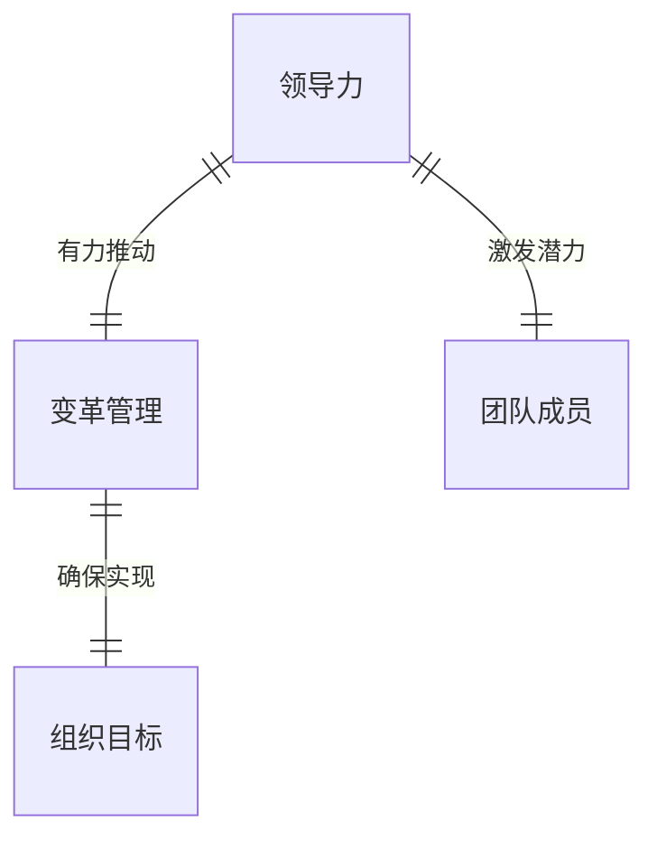

                 

### 引言

在当今快速变化的世界，无论是技术进步、市场动态还是社会环境，都在不断地推动着企业向新的常态转变。对于IT行业来说，这一转变尤为显著。随着云计算、人工智能、大数据等技术的广泛应用，企业面临着前所未有的机遇与挑战。在这个背景下，领导力和变革管理成为确保企业持续发展的关键因素。

#### 研究背景

首先，我们需要明确领导力和变革管理的概念。领导力不仅仅是指导团队完成任务，更是一种激发团队潜能、引领团队走向未来的能力。变革管理则是指在组织内部实施变革的过程中，通过一系列策略和方法，确保变革顺利进行，同时减少对员工和组织的负面影响。

#### 研究问题与目标

本文旨在探讨如何通过提升领导力和有效的变革管理，帮助IT团队适应新常态。具体来说，我们将回答以下几个问题：

1. 领导力在变革管理中的作用是什么？
2. 如何通过领导力提升，推动团队适应新常态？
3. 变革管理的关键步骤和策略是什么？
4. 如何在实际项目中应用这些策略？

#### 研究方法与框架

本文将采用文献综述、案例分析和理论模型相结合的方法。首先，通过文献综述，梳理领导力和变革管理的核心概念和理论。然后，通过案例分析，探讨成功和失败的案例，提炼出可行的策略和方法。最后，结合理论模型，提出适用于新常态下的领导力和变革管理框架。

#### 边界与外延

在研究过程中，我们将重点关注IT行业的领导力和变革管理。虽然这些理论和策略在其他领域同样适用，但本文将集中讨论IT行业的独特挑战和解决方案。

### 核心概念与联系

在探讨领导力和变革管理之前，我们需要明确这两个核心概念的定义、属性以及它们之间的联系。

#### 领导力

领导力是一种影响他人、激励他们实现共同目标的能力。在IT行业中，领导力不仅仅是技术上的指导，更是如何在快速变化的环境中引导团队、激发创新的重要能力。以下是领导力的几个核心要素：

1. **愿景与目标**：领导者需要明确团队的目标和愿景，使团队成员理解并致力于实现这些目标。
2. **沟通与信任**：领导者需要通过有效的沟通建立信任，确保信息的透明和及时传递。
3. **激励与鼓励**：领导者需要通过激励措施，鼓励团队成员发挥最大潜力。
4. **决策与执行**：领导者需要具备快速决策和有效执行的能力，确保团队在面对挑战时能够迅速响应。

#### 变革管理

变革管理是指组织在实施重大变革时，通过一系列策略和过程，确保变革成功进行。以下是变革管理的几个核心要素：

1. **规划与准备**：在变革之前，需要进行详细的规划和准备，包括确定变革的目标、制定实施计划等。
2. **沟通与教育**：通过有效的沟通和教育，确保团队成员理解变革的必要性和意义。
3. **参与与反馈**：鼓励团队成员参与变革过程，提供反馈，确保变革符合团队的实际需求。
4. **监控与调整**：在变革过程中，持续监控进展，及时调整策略，确保变革顺利进行。

#### 核心概念对比分析

**| 要素 | 领导力 | 变革管理 |**

| --- | --- | --- |

| **愿景与目标** | 确定团队目标和愿景 | 确定变革目标和愿景 |

| **沟通与信任** | 建立信任和有效沟通 | 确保信息的透明和及时传递 |

| **激励与鼓励** | 激发团队成员潜力 | 鼓励团队成员积极参与变革 |

| **决策与执行** | 快速决策和有效执行 | 制定实施计划并确保执行 |

| **规划与准备** | 需要明确的计划和准备 | 需要详细的规划和准备 |

| **沟通与教育** | 确保团队成员理解目标 | 确保团队成员理解变革的必要性和意义 |

| **参与与反馈** | 鼓励团队成员参与决策 | 鼓励团队成员提供反馈 |

| **监控与调整** | 持续监控进展并调整策略 | 持续监控进展并调整实施计划 |

通过上述对比，我们可以看出，领导力和变革管理虽然有不同的核心要素，但它们在实现组织目标、推动团队发展方面有着紧密的联系。领导力是变革管理的基础，有效的领导力能够确保变革顺利进行，并激发团队成员的积极性。

#### ER实体关系图架构

为了更清晰地理解领导力和变革管理的关系，我们可以使用ER（Entity-Relationship）实体关系图来表示。以下是领导力和变革管理的ER图：

在这个ER图中，领导力通过推动变革管理和激发团队成员的潜力，最终实现组织目标。变革管理则通过有效的规划和实施，确保领导力的策略能够落地并产生实际效果。

通过上述分析，我们可以看出领导力和变革管理在组织发展中的重要性。在接下来的章节中，我们将进一步探讨如何提升领导力，以及如何在变革管理中应用这些领导力策略，帮助IT团队适应新常态。

### 领导力理论与模型

在提升领导力之前，我们需要了解领导力的理论基础。领导力理论的发展经历了多个阶段，从早期的特质理论到行为理论，再到现代的情境理论，每一个阶段都为我们理解领导力提供了新的视角。

#### 传统领导力理论

1. **特质理论**：特质理论认为领导者具备一系列固有的特质，如自信、决断力、智慧等。这种理论关注领导者的个人特征，强调领导者与普通员工的区别。
2. **行为理论**：行为理论则认为领导者的行为模式可以学习，领导风格和行为对团队绩效有重要影响。这一理论强调领导者如何行动，如何与团队成员互动。
3. **领导替代理论**：领导替代理论提出，在某些情境下，领导者并非团队绩效的唯一决定因素。团队成员自身的素质、动机和环境因素也可能对团队绩效产生重要影响。

#### 当代领导力理论

1. **情境理论**：情境理论认为，领导风格应当根据不同情境进行调整。领导者需要具备灵活性和适应性，能够根据具体情况选择最有效的领导风格。
2. **变革型领导理论**：变革型领导理论强调领导者通过激励、启发和感召，激发团队成员的内在动机，推动团队实现变革和成长。
3. **服务型领导理论**：服务型领导理论认为，领导者应当以服务团队成员为中心，关注团队成员的需求和成长，通过提供支持和资源，帮助团队成员实现个人和团队目标。

#### 领导力模型案例分析

为了更好地理解这些理论，我们可以通过一些实际的领导力模型来进行分析。以下是一些常见的领导力模型及其案例分析：

1. **费德勒模型**：费德勒模型认为，领导者的效能取决于领导风格与情境因素的关系。模型将领导风格分为任务导向型和关系导向型，并提出了不同的情境因素，如领导者与团队成员的关系、任务结构等。
   
   **案例分析**：在一个创业公司中，任务导向型的领导者可能更适合制定明确的目标和任务，确保团队高效执行。而在一个需要高度协作的项目中，关系导向型的领导者则能更好地促进团队成员之间的沟通与合作。

2. **路径-目标理论**：路径-目标理论认为，领导者的目标是帮助团队成员明确工作方向，并提供必要的支持和资源。领导者通过设定路径和目标，激励团队成员达成目标。

   **案例分析**：在一个技术转型项目中，领导者可以通过明确项目目标、制定详细的实施计划，并为团队成员提供所需资源，确保项目顺利进行。

3. **变革型领导理论**：变革型领导理论强调领导者通过激励、启发和感召，推动团队实现变革。领导者需要具备愿景和远见，能够激发团队成员的内在动机。

   **案例分析**：在一个公司面临重大市场变化时，变革型领导者可以通过分享愿景、激励团队成员，推动公司进行战略调整和业务转型。

4. **服务型领导理论**：服务型领导理论认为，领导者应当以服务团队成员为中心，关注团队成员的需求和成长。

   **案例分析**：在一个团队面临挑战时，服务型领导者可以通过提供支持和资源，帮助团队成员克服困难，增强团队凝聚力。

#### 领导力模型的选择与应用

选择和应用领导力模型时，需要考虑以下因素：

1. **团队特点**：不同团队可能需要不同的领导风格和模型。领导者需要了解团队成员的个性、能力水平和需求，选择最合适的模型。
2. **情境因素**：领导风格和模型应当根据具体情境进行调整。领导者需要具备灵活性和适应性，能够根据不同情境选择最有效的策略。
3. **组织文化**：组织文化对领导风格和模型的选择有重要影响。领导者需要与组织文化相匹配，确保领导力策略能够得到有效实施。

综上所述，领导力理论为我们提供了多种理解和应用领导力的视角。通过了解不同的领导力模型，我们可以根据具体情境和团队特点，选择最合适的领导力策略，推动团队实现目标。

### 领导风格与行为

领导风格是指领导者在与团队成员互动过程中表现出的行为模式。不同的领导风格对团队动力和员工绩效有着显著影响。在探讨领导风格与团队动力的关系时，我们需要了解几种常见的领导风格及其特点。

#### 领导风格的类型

1. **专制型领导**：专制型领导者通常采取权威式的管理方式，决策权集中在领导者手中，团队成员的参与度较低。这种领导风格在需要迅速作出决策或面对紧急情况时可能有效，但长期来看，可能导致团队成员的士气低落和创造力受限。

2. **民主型领导**：民主型领导者鼓励团队成员参与决策过程，重视团队成员的意见和建议。这种领导风格有助于增强团队的凝聚力和归属感，促进团队成员的积极性和创造力。

3. **参与型领导**：参与型领导者不仅关注决策过程，还重视团队成员的感受和需求。他们通过建立信任和开放沟通，激励团队成员发挥最大潜力。这种领导风格在团队面临挑战和变革时尤为重要。

4. **放任型领导**：放任型领导者给予团队成员高度自主权，鼓励他们自我管理和决策。这种领导风格适用于高度自律和自我驱动的团队，但在团队缺乏经验和能力时可能效果不佳。

#### 领导行为对团队的影响

1. **激励效应**：有效的领导行为能够激发团队成员的工作热情和积极性。例如，民主型和参与型领导通过认可和奖励，激励团队成员追求卓越。

2. **凝聚力**：领导风格对团队凝聚力有重要影响。民主型和参与型领导通过开放沟通和共同决策，增强团队成员之间的信任和合作。

3. **绩效表现**：领导行为直接影响到团队的工作绩效。专制型领导可能在短期内提升效率，但长期来看，可能导致团队绩效下降。而民主型和参与型领导则有助于提升团队的整体绩效。

#### 领导行为的调整与优化

为了优化领导行为，领导者需要从以下几个方面进行调整和改进：

1. **自我认知**：领导者需要了解自己的领导风格和行为特点，识别自身的优势和不足。通过自我反思和反馈，不断改进领导行为。

2. **情境适应**：领导风格应当根据具体情境进行调整。领导者需要具备灵活性和适应性，能够根据不同情境选择最合适的领导风格。

3. **团队互动**：领导者需要加强与团队成员的互动，了解他们的需求和期望。通过建立信任和开放沟通，增强团队的凝聚力和合作。

4. **持续学习**：领导力是一个持续发展的过程。领导者需要不断学习新知识和技能，提升自身的领导能力。

#### 领导行为与变革管理的关系

在变革管理过程中，领导行为尤为重要。有效的领导行为能够：

1. **明确变革目标**：领导者需要明确变革的目标和愿景，确保团队成员理解变革的必要性和意义。

2. **激发变革动力**：领导者通过激励和鼓励，激发团队成员的变革动力，确保变革顺利推进。

3. **管理变革阻力**：变革过程中，领导者需要面对各种变革阻力。通过有效的沟通和管理，领导者可以减少阻力，促进变革的顺利进行。

4. **持续监督与支持**：在变革过程中，领导者需要持续监督变革进展，提供必要的支持和资源，确保变革目标的实现。

总之，领导风格与行为对团队动力和变革管理有着深远的影响。通过优化领导行为，领导者可以更好地激发团队潜能，推动团队适应新常态。

### 领导力提升策略

在当今快速变化的环境中，提升领导力是确保团队成功的关键。以下是一些具体的领导力提升策略，旨在帮助领导者提高自身素质，增强团队凝聚力和工作效率。

#### 自我认知与自我提升

自我认知是领导力提升的基础。领导者需要深入了解自己的优点和不足，识别自身的领导风格和潜在问题。以下是一些建议：

1. **定期自我反思**：领导者应定期对自己的行为和决策进行反思，识别改进空间。
2. **寻求反馈**：领导者可以主动向同事、下属和导师寻求反馈，了解自己的领导效果。
3. **参加领导力培训**：通过参加领导力培训课程，领导者可以学习最新的领导理论和方法，提升自身的领导能力。

#### 团队建设与沟通

团队建设是提升领导力的关键环节。有效的团队建设可以增强团队凝聚力，提高团队工作效率。以下是一些建议：

1. **建立共同目标**：领导者需要与团队成员共同设定明确的目标，确保每个成员都清楚自己的职责和期望。
2. **加强团队协作**：领导者应鼓励团队成员之间的协作和互助，建立良好的沟通机制。
3. **培养团队文化**：领导者需要培养积极向上的团队文化，激发团队成员的归属感和自豪感。

#### 应对变革的策略

在快速变化的环境中，领导者需要具备应对变革的能力。以下是一些建议：

1. **积极面对变革**：领导者应积极面对变革，理解变革的必要性和意义。
2. **有效沟通**：领导者需要与团队成员进行有效沟通，确保他们理解变革的目标和计划。
3. **激励团队成员**：领导者应通过激励措施，激发团队成员的变革动力，鼓励他们积极参与变革。

#### 领导力提升的最佳实践

以下是一些在实践中被证明有效的领导力提升策略：

1. **领导力导师计划**：通过导师计划，新晋领导者可以学习资深领导者的经验，提升自身的领导能力。
2. **领导力发展项目**：组织领导力发展项目，为领导者提供学习和成长的机会。
3. **持续学习与反馈**：鼓励领导者持续学习新知识和技能，并通过定期反馈，不断提升自身的领导水平。

总之，提升领导力需要领导者具备自我认知、团队建设、应对变革等多方面的能力。通过有效的领导力提升策略，领导者可以更好地激发团队潜能，推动团队实现目标。

### 变革管理理论

变革管理是组织在实施重大变革过程中，通过一系列策略和方法，确保变革成功进行的过程。在探讨变革管理的理论之前，我们需要明确几个核心概念。

#### 变革管理的定义

变革管理是指组织在实施重大变革时，通过一系列计划、执行和监控过程，确保变革目标实现的管理活动。它不仅包括变革的实施，还包括对变革过程的规划、沟通、参与和反馈。

#### 变革管理的核心步骤

变革管理通常包括以下几个核心步骤：

1. **规划与准备**：在变革之前，组织需要制定详细的变革计划，明确变革的目标、范围和策略。同时，对变革所需资源、时间表和关键角色进行安排。

2. **沟通与教育**：通过有效的沟通和教育，确保团队成员理解变革的必要性和目标，减少对变革的抗拒。这包括组织内部的信息传递、培训和工作坊等。

3. **参与与反馈**：鼓励团队成员参与变革过程，提供反馈，确保变革符合团队的实际需求。这有助于增强团队成员的认同感和参与感，提高变革的成功率。

4. **监控与调整**：在变革过程中，持续监控进展，及时调整策略和计划，确保变革按照预期进行。这包括对变革效果的评估、问题的识别和解决。

#### 变革模型分析

以下是一些常见的变革管理模型：

1. **Kotter模型**：Kotter模型提出了八个步骤，包括建立紧急感、形成指导团队、清晰沟通愿景、empower行动，等等。

2. **Leavitt模型**：Leavitt模型从结构、技术、人员、职权等方面分析变革的阻力，提出通过改变这些因素来促进变革。

3. **Lippitt-Warner模型**：Lippitt-Warner模型将变革过程分为反应阶段、重新适应阶段和再适应阶段，强调团队成员在不同阶段的心理和行为变化。

#### 变革管理的挑战与应对策略

在变革管理过程中，领导者会面临多种挑战。以下是一些常见挑战及其应对策略：

1. **抗拒变革**：团队成员可能对变革持有抗拒态度。应对策略包括：
   - **积极沟通**：与团队成员进行有效沟通，解释变革的必要性和好处。
   - **参与和反馈**：鼓励团队成员参与变革过程，提供反馈，增强认同感。
   - **激励措施**：通过奖励和认可，激励团队成员积极参与变革。

2. **资源限制**：变革通常需要大量资源，包括人力、财力和时间。应对策略包括：
   - **优先级排序**：确定变革的优先级，确保资源能够优先分配给最重要的变革项目。
   - **灵活调整**：根据实际情况，灵活调整变革计划，确保资源的高效利用。

3. **变革阻力**：变革过程中，可能会出现各种阻力，如组织惯性、文化冲突等。应对策略包括：
   - **识别和解决**：及时识别变革阻力，通过沟通、教育和调整策略，解决这些问题。
   - **建立支持网络**：建立支持网络，为变革提供支持和资源，减少变革的阻力。

通过理解变革管理的理论，并掌握有效的应对策略，领导者可以更好地推动组织实现变革目标。在接下来的章节中，我们将进一步探讨如何在实际项目中应用这些策略。

### 变革过程中的团队管理

在变革过程中，团队管理扮演着至关重要的角色。有效的团队管理不仅能确保变革顺利进行，还能增强团队的凝聚力和成员的参与度。以下从团队成员的角色与责任、变革中的团队动力、变革中的冲突管理等方面，详细探讨如何在变革过程中进行团队管理。

#### 团队成员的角色与责任

1. **领导者**：在变革过程中，领导者不仅需要明确变革的目标和愿景，还需要制定详细的变革计划，并确保团队成员理解和支持变革。领导者应扮演变革的推动者、沟通者和支持者的角色。

2. **团队成员**：团队成员在变革过程中，需要积极参与，理解并支持变革。具体角色和责任包括：
   - **理解变革目标**：团队成员应明确变革的目标和愿景，理解变革对组织和个人意义。
   - **参与变革过程**：积极参与变革的讨论和实施，提出建议和反馈。
   - **适应变革**：在变革过程中，团队成员需要适应新的工作模式和文化，提高自身的灵活性和适应性。

3. **变革倡导者**：变革倡导者是变革过程中的关键角色，他们通常在组织中拥有较高的地位和影响力，负责推动变革的落实。变革倡导者的角色和责任包括：
   - **宣传变革**：通过有效沟通，宣传变革的必要性和目标。
   - **解决阻力**：识别和解决变革过程中的各种阻力，确保变革顺利进行。

#### 变革中的团队动力

1. **激励与认可**：在变革过程中，领导者需要通过激励和认可，激发团队成员的积极性和参与度。例如，通过设立奖励机制、表彰优秀表现等，鼓励团队成员积极参与变革。

2. **信任与支持**：建立信任和支持的团队氛围，有助于团队成员在面对变革时更加团结和协作。领导者可以通过开放沟通、倾听团队成员的意见和反馈，建立信任关系。

3. **共同目标**：确保团队成员明确共同目标，有助于增强团队的凝聚力。领导者应与团队成员共同设定明确的目标，并确保每个成员都理解自己的职责和期望。

#### 变革中的冲突管理

1. **识别冲突**：在变革过程中，领导者需要及时识别和解决各种冲突。常见的冲突包括文化冲突、角色冲突和目标冲突等。

2. **沟通与解决**：通过有效的沟通，领导者可以了解冲突的原因和影响，并采取适当措施解决冲突。例如，组织冲突解决会议、调解冲突等。

3. **平衡利益**：在解决冲突时，领导者需要平衡各方利益，确保变革目标的实现。例如，在处理文化冲突时，领导者需要尊重不同文化背景的团队成员，寻找共同点。

4. **提供支持**：在变革过程中，领导者需要为团队成员提供必要的支持和资源，帮助他们应对变革带来的压力和挑战。

通过有效的团队管理，领导者可以确保变革顺利进行，同时增强团队的凝聚力和成员的参与度。在变革过程中，领导者需要充分发挥团队成员的潜力，推动团队实现变革目标。

### 变革管理的实践与案例分析

在探讨变革管理的实际应用时，我们可以通过一些成功的案例来分析变革管理的实施流程、具体措施以及实施过程中遇到的挑战和解决方案。

#### 实施流程

1. **需求识别**：在开始变革前，首先需要明确变革的需求。这可以通过调研、数据分析、用户反馈等方式进行。

2. **规划与准备**：在明确需求后，制定详细的变革计划，包括目标、范围、时间表、关键角色和资源分配等。这一阶段需要充分沟通，确保所有相关人员都清楚变革的预期和目标。

3. **沟通与教育**：通过有效的沟通和教育，确保团队成员理解变革的必要性和目标，减少对变革的抗拒。这一阶段可以采用多种方式，如培训、研讨会、内部宣传等。

4. **实施与监控**：在实施过程中，持续监控进展，及时调整策略和计划。这包括定期评估变革效果、识别问题和挑战，并采取相应措施解决。

5. **反馈与优化**：在变革完成后，收集团队成员的反馈，评估变革效果，并针对发现的问题进行优化和改进。

#### 具体措施

1. **建立变革团队**：建立专门的变革团队，负责变革的规划和实施。团队成员应包括来自不同部门、层次和角色的代表，以确保变革的全面性和有效性。

2. **明确角色与责任**：在变革过程中，明确各个角色的责任和任务。这包括领导者、变革倡导者、项目经理、团队成员等。

3. **制定详细的实施计划**：制定详细的变革实施计划，包括具体的步骤、时间表、资源需求等。这有助于确保变革的有序进行，减少不确定性。

4. **加强沟通与协作**：通过定期会议、报告、邮件等方式，确保团队成员之间的沟通和协作。这有助于及时解决问题，确保变革顺利进行。

5. **激励与认可**：在变革过程中，通过激励措施和认可，鼓励团队成员积极参与和努力工作。这可以采用奖励、晋升、表彰等方式。

#### 挑战与解决方案

1. **抗拒变革**：团队成员可能对变革持有抗拒态度。解决策略包括：
   - **积极沟通**：与团队成员进行有效沟通，解释变革的必要性和目标。
   - **参与和反馈**：鼓励团队成员参与变革过程，提供反馈，增强认同感。
   - **激励措施**：通过奖励和认可，激励团队成员积极参与变革。

2. **资源限制**：变革通常需要大量资源，包括人力、财力和时间。解决策略包括：
   - **优先级排序**：确定变革的优先级，确保资源能够优先分配给最重要的变革项目。
   - **灵活调整**：根据实际情况，灵活调整变革计划，确保资源的高效利用。

3. **变革阻力**：变革过程中，可能会出现各种阻力，如组织惯性、文化冲突等。解决策略包括：
   - **识别和解决**：及时识别变革阻力，通过沟通、教育和调整策略，解决这些问题。
   - **建立支持网络**：建立支持网络，为变革提供支持和资源，减少变革的阻力。

#### 成功案例分析

1. **案例一：某公司数字化转型**

   某公司决定进行数字化转型，以提升业务效率和市场竞争力。变革过程中，公司通过以下措施确保变革成功：
   - **需求识别**：通过市场调研和用户反馈，明确数字化转型的重要性。
   - **规划与准备**：成立专门的数字化转型团队，制定详细的变革计划。
   - **沟通与教育**：通过内部培训和宣传，确保员工理解数字化转型的目标和意义。
   - **实施与监控**：在实施过程中，持续监控进展，及时调整策略。
   - **反馈与优化**：在变革完成后，收集员工反馈，进行优化和改进。

   通过这一系列措施，公司成功实现了数字化转型，提升了业务效率和市场竞争力。

2. **案例二：某政府部门简化审批流程**

   某政府部门决定简化审批流程，以提高行政效率和公共服务质量。变革过程中，政府通过以下措施确保变革成功：
   - **需求识别**：通过调查和数据分析，明确审批流程中的瓶颈和问题。
   - **规划与准备**：制定详细的审批流程优化方案，明确各阶段的任务和时间表。
   - **沟通与教育**：通过内部培训和宣传，确保员工理解审批流程优化的目标和意义。
   - **实施与监控**：在实施过程中，持续监控进展，及时解决问题和调整策略。
   - **反馈与优化**：在变革完成后，收集员工和公众的反馈，进行优化和改进。

   通过这一系列措施，政府成功简化了审批流程，提高了行政效率和公共服务质量。

#### 失败案例分析

1. **案例一：某公司新产品发布失败**

   某公司决定推出一款新产品，希望通过新产品提升市场竞争力。然而，在变革过程中，公司出现了以下问题：
   - **需求识别不足**：在推出新产品前，公司未能充分了解市场需求和用户反馈。
   - **沟通与教育不足**：公司未能及时向员工和合作伙伴传达新产品计划和目标。
   - **资源分配不当**：公司在资源分配上出现了偏差，导致关键资源的不足。

   结果，新产品发布失败，公司损失了大量资源和时间。为了避免类似失败，公司应加强需求识别、沟通和资源分配，确保变革的顺利进行。

通过上述案例分析，我们可以看到，成功的变革管理需要明确需求、制定详细的计划、加强沟通和协作，并灵活应对各种挑战。在变革过程中，领导者需要充分发挥领导力，推动团队实现变革目标。

### 新常态下的领导力特征

随着全球化和技术进步的加速，企业正面临着前所未有的变化和挑战。新常态下的领导力特征主要体现在以下几个方面：

#### 新常态的社会环境

新常态的社会环境具有以下几个特点：

1. **快速变化**：技术进步和社会变革的步伐加快，要求企业具备快速响应和适应的能力。
2. **不确定性增加**：市场环境的不确定性增加，企业需要具备应对不确定性的策略和能力。
3. **全球化**：全球化使得企业面临更加复杂的市场环境，需要具备跨文化和跨地域管理的技能。
4. **数字化**：数字化转型已经成为企业发展的关键，领导者需要具备数字化战略规划和执行能力。

#### 新常态下的领导力需求

在新常态下，领导力需求发生了显著变化：

1. **灵活性和适应性**：领导者需要具备灵活性和适应性，能够快速调整战略和应对变化。
2. **创新和创造力**：领导者需要具备创新和创造力，能够引领企业在快速变化的环境中寻找新的机会。
3. **跨文化沟通**：领导者需要具备跨文化沟通能力，能够在全球化的背景下有效管理多元文化团队。
4. **数字化素养**：领导者需要具备数字化素养，能够理解和应用数字技术推动企业创新和增长。

#### 新常态下的变革管理特点

新常态下的变革管理具有以下几个特点：

1. **持续变革**：在快速变化的新常态下，变革不再是阶段性事件，而是持续的、常态化的过程。
2. **敏捷管理**：领导者需要采用敏捷管理方法，能够快速响应变化和调整策略。
3. **全员参与**：变革需要全员参与，领导者需要激发员工的积极性，共同推动变革。
4. **数据驱动**：在数据驱动的新常态下，领导者需要依赖数据做出决策，确保变革的成效。

#### 应对新常态的策略

为了在新常态下保持竞争力，企业需要采取以下策略：

1. **持续学习**：领导者需要持续学习新知识和技能，不断提升自身的领导力。
2. **创新文化**：企业需要培养创新文化，鼓励员工提出新的想法和解决方案。
3. **数字化转型**：企业需要进行数字化转型，利用数字技术提升运营效率和创新能力。
4. **跨文化管理**：领导者需要具备跨文化管理能力，能够有效管理多元文化团队。

通过以上策略，企业可以更好地适应新常态，实现可持续发展。

### 新常态下的实践与挑战

在新常态下，领导者和组织面临着一系列新的实践挑战。为了应对这些挑战，我们需要探讨新常态下的团队管理策略、领导力提升方法和变革管理实践。

#### 团队管理策略

1. **灵活的工作模式**：在远程工作和数字化环境中，领导者需要采用灵活的工作模式，确保团队成员能够高效协作。例如，通过使用协作工具、视频会议和在线项目管理软件，确保团队沟通顺畅和任务有序。
   
   **示例**：某跨国公司引入远程办公政策，使用Zoom和Slack等工具，确保全球团队的实时沟通和协作。

2. **远程团队建设**：领导者需要重视远程团队建设，通过虚拟团队活动、定期的团队聚会和在线交流，增强团队凝聚力和信任感。
   
   **示例**：某团队每月举行一次虚拟团队建设活动，如在线游戏、在线聚会，增强团队成员之间的联系。

3. **赋能员工**：在新常态下，领导者需要赋予员工更多的自主权和责任感，鼓励他们自我管理和决策。这样可以提高员工的积极性和创造力。
   
   **示例**：某公司推行“自我管理团队”模式，团队成员自主制定工作计划，并互相监督进度，提高了工作效率。

#### 领导力提升方法

1. **数字化领导力**：领导者需要提升数字化领导力，理解并应用数字技术，推动企业的数字化转型。
   
   **示例**：某公司的CEO参加了一系列数字化转型课程，掌握了大数据分析、人工智能等技能，成功推动了公司的数字化转型。

2. **灵活领导风格**：领导者需要具备灵活的领导风格，能够根据不同情境和团队需求，调整领导策略。
   
   **示例**：某公司的领导者根据团队的个性和能力，采用不同的领导风格，如对创新团队采用放任型领导，对执行团队采用严格型领导。

3. **持续学习**：领导者需要持续学习新知识和技能，不断提升自身的领导力和管理水平。
   
   **示例**：某公司建立了内部学习平台，鼓励员工参加在线课程、研讨会和培训，不断提升自身的专业能力和领导力。

#### 变革管理实践

1. **敏捷变革**：在新常态下，领导者需要采用敏捷变革方法，快速响应变化，并灵活调整变革策略。
   
   **示例**：某公司在面对市场变化时，采用敏捷变革方法，快速调整产品线和营销策略，成功抓住了市场机会。

2. **全员参与**：变革需要全员参与，领导者需要激发员工的积极性，共同推动变革。
   
   **示例**：某公司在实施变革时，通过组织内部研讨会、调查问卷和反馈机制，广泛征求员工意见和建议，确保变革符合团队实际需求。

3. **数据驱动**：领导者需要依赖数据做出决策，确保变革的成效。
   
   **示例**：某公司通过数据分析，评估不同变革措施的效果，并根据数据反馈调整变革策略，提高了变革的成功率。

#### 挑战与应对

1. **技术变革的阻力**：在数字化转型过程中，员工可能对新技术和新工作流程持有抗拒态度。
   
   **应对策略**：通过培训和沟通，帮助员工了解新技术的优势和潜力，提供技术支持，减少变革阻力。

2. **远程工作带来的挑战**：远程工作可能影响团队的沟通和协作，增加管理难度。
   
   **应对策略**：采用虚拟团队建设活动、定期会议和在线协作工具，确保团队保持紧密联系和高效合作。

3. **领导力不足**：在快速变化的新常态下，领导者可能面临领导力不足的挑战。
   
   **应对策略**：通过培训和持续学习，提升领导者的领导力和管理水平，确保他们能够有效应对新常态下的挑战。

总之，新常态下的团队管理和领导力提升需要领导者具备灵活性和创新精神，同时采用数据驱动和全员参与的方法。通过应对挑战和实施有效策略，领导者可以帮助团队在新常态下保持竞争力，实现持续发展。

### 小结与展望

本文通过详细探讨领导力和变革管理的理论与实践，揭示了这两个核心要素在应对新常态中的重要性。我们首先介绍了领导力和变革管理的定义、核心要素及其相互联系，随后深入分析了领导力提升的策略和变革管理的实施流程与挑战。通过具体的案例分析，我们进一步了解了领导力和变革管理在实际项目中的应用和效果。

#### 研究结论

本文的主要结论如下：

1. **领导力是变革管理的基础**：有效的领导力能够确保团队成员理解并支持变革，从而推动变革顺利进行。
2. **变革管理是领导力的具体应用**：通过有效的变革管理策略，领导者可以确保变革目标实现，提升组织的竞争力。
3. **新常态下，领导力和变革管理的重要性更为凸显**：在快速变化的环境中，领导者需要具备灵活性和创新精神，通过数据驱动和全员参与的方法，推动组织实现持续发展。

#### 研究贡献

本文的研究贡献主要体现在以下几个方面：

1. **理论贡献**：通过整合领导力和变革管理的相关理论，提出了适用于新常态下的领导力和变革管理框架。
2. **实践指导**：提供了具体的领导力提升策略和变革管理实践方法，为领导者提供了实际操作指南。
3. **案例分析**：通过案例分析，总结了成功和失败的变革管理经验，为其他组织提供了有益的借鉴。

#### 研究局限与未来方向

尽管本文在领导力和变革管理方面进行了深入探讨，但仍存在一些局限：

1. **研究范围**：本文主要关注IT行业，尽管其他行业也有类似的问题和挑战，但本文的结论可能需要进一步验证。
2. **数据来源**：本文的数据主要来源于文献和案例分析，未来研究可以增加实证研究，提高结论的可靠性。
3. **动态变化**：领导力和变革管理是一个动态变化的过程，未来研究需要关注更加复杂和多变的环境。

未来研究方向包括：

1. **跨行业研究**：探讨领导力和变革管理在不同行业的应用和效果。
2. **实证研究**：通过大规模实证研究，验证本文提出的理论框架和策略的有效性。
3. **动态环境**：研究在快速变化和不确定的环境中，如何更加有效地应用领导力和变革管理策略。

#### 拓展阅读建议

为了深入理解领导力和变革管理，以下是一些拓展阅读建议：

1. **《变革之舞：领导力如何驱动变革管理》**：作者詹姆斯·库泽斯和巴里·波斯纳详细探讨了领导力在变革管理中的作用。
2. **《领导力：理论与实践》**：作者斯蒂芬·罗宾斯提供了全面的领导力理论框架，并分析了不同领导风格的影响。
3. **《变革管理：如何成功地实施变革》**：作者约翰·P·科特提供了详细的变革管理步骤和策略，帮助领导者实现变革目标。

通过阅读这些书籍，读者可以进一步了解领导力和变革管理的理论和实践，提升自身的领导力和变革管理能力。

