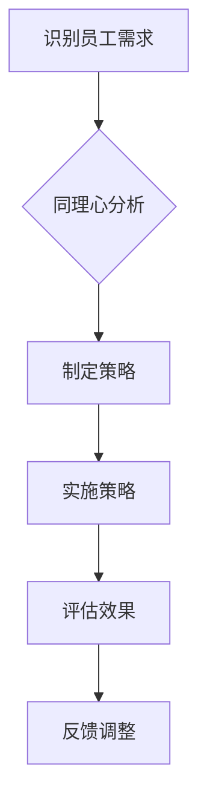
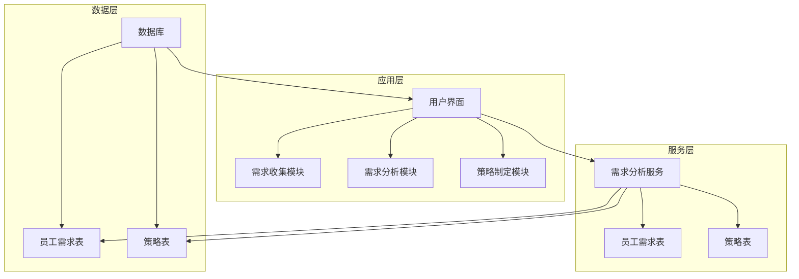
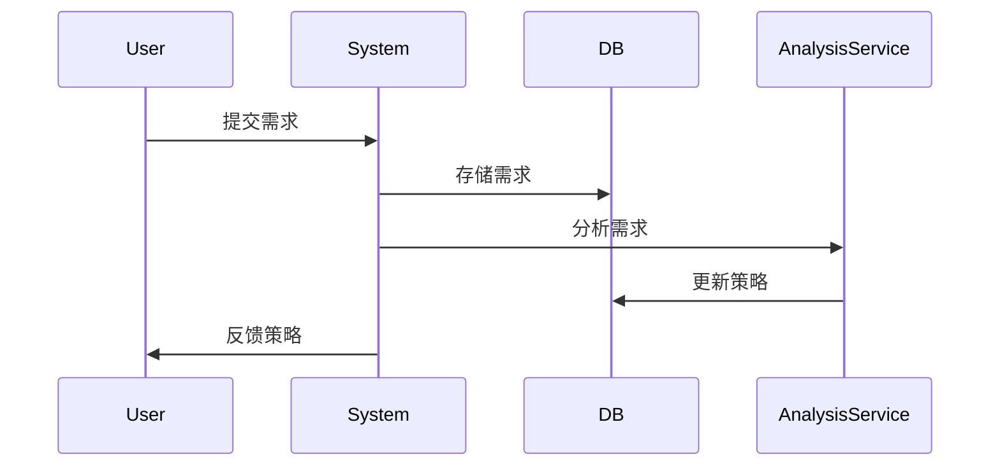

                 

### 摘要

领导力与同理心是现代企业管理和团队建设中至关重要的两大要素。领导力涉及如何有效指导和激励团队，而同理心则是领导者理解并回应员工需求的关键。本文旨在深入探讨领导力与同理心在员工需求理解中的重要性，分析其在现代IT行业中的应用和实践。通过明确领导力的定义和本质，阐述同理心的起源与发展，以及二者如何融合，本文将为领导者提供策略和方法，帮助他们更好地理解员工需求，提升团队绩效和员工满意度。

关键词：领导力、同理心、员工需求、团队建设、IT行业

### 第一部分：领导力的概念与同理心的价值

#### 第1章：领导力的基础概念

领导力，这个看似抽象的概念，实际上涵盖了多种技能和特质，对任何行业和组织都具有深远影响。让我们首先定义什么是领导力，以及它的本质是什么。

**1.1 领导力的定义与本质**

领导力是指一个个体或群体影响和激励他人，实现共同目标的能力。它不仅包括指导他人完成任务，更涉及激励、塑造团队文化、解决冲突和作出明智决策等多个方面。领导力的本质在于它是一种相互作用，是一种持续的学习过程，而非一种静态的特质。

**1.2 领导力的重要性**

在快速变化的IT行业，领导力显得尤为重要。它不仅关乎团队的日常运作，更影响企业的创新能力和竞争力。一个出色的领导者能够激发员工的潜能，推动团队不断进步，同时适应市场变化，保持企业的活力。

**1.3 领导力的发展趋势**

随着技术的迅猛发展，领导力也在不断演变。现代领导力更加注重协作、灵活性和创新。领导者需要具备跨文化沟通的能力，理解全球化背景下的多元化团队。同时，领导力的发展也强调个性化和人性化管理，关注员工的个人成长和职业发展。

#### 第2章：同理心的起源与发展

同理心，这个被越来越多人重视的概念，源于对他人情感和经历的深刻理解。让我们一起来探索同理心的定义、发展历史以及在领导中的作用。

**2.1 同理心的定义与特点**

同理心是指个体对他人情感和经历的理解和共鸣。它不仅仅是倾听和观察，更是一种情感上的连接。同理心具有几个显著特点：感知、共情和反应。感知是指能够准确地感知他人的情绪；共情是指能够感受到他人的情感，并产生共鸣；反应是指能够基于这种感知和共情采取适当的行动。

**2.2 同理心的发展历史**

同理心的概念可以追溯到古希腊时期，当时哲学家苏格拉底和柏拉图就提出了类似的观念。然而，作为一个系统的概念，同理心的发展主要是在现代社会，特别是在心理学和行为科学领域。20世纪中期，心理学家卡尔·罗杰斯（Carl Rogers）提出了“非指导性治疗”理论，强调同理心在人类关系中的核心作用。

**2.3 同理心在领导中的作用**

同理心是领导者与员工建立信任和良好关系的桥梁。它有助于领导者更好地理解员工的情感和需求，从而做出更人性化的决策。一个具有同理心的领导者能够鼓励员工表达自己的感受，激发他们的创造力和主动性，提升团队的整体绩效。

#### 第3章：领导力与同理心的融合

在了解了领导力和同理心的基础概念后，我们需要探讨如何将二者融合，以提升领导效果。

**3.1 领导力与同理心的关系**

领导力与同理心并非孤立存在，而是相辅相成的。同理心是领导力的重要组成部分，它有助于领导者更好地理解员工的需求，从而更有效地指导和管理团队。同理心不仅提升了领导的效果，也增强了团队的凝聚力和信任感。

**3.2 融合领导力与同理心的挑战**

将领导力与同理心融合并非易事。领导者常常面临现实的工作压力和目标，这可能会阻碍他们对员工需求的关注。此外，不同文化背景下的员工对同理心的理解和需求也有所不同，这需要领导者具备高度的文化敏感性和适应性。

**3.3 融合领导力与同理心的益处**

融合领导力与同理心的益处是多方面的。首先，它有助于建立更加和谐的工作环境，提高员工的工作满意度和忠诚度。其次，它能够激发员工的创造力，推动团队创新。最后，它有助于领导者更好地应对变化和挑战，提升企业的竞争力。

### 第二部分：同理心在领导实践中的应用

在这一部分，我们将探讨同理心在领导实践中的具体应用，包括在工作场所的应用、员工关系管理和领导决策中的作用。

#### 第4章：同理心在工作场所的应用

同理心在工作场所的应用至关重要，它能够帮助领导者更好地理解员工的情感和需求，从而提升团队的整体效能。

**4.1 建立同理心文化的组织策略**

建立同理心文化需要从组织层面进行策略性思考。领导者可以通过多种方式推动同理心文化的建设，如开展同理心培训、设立员工反馈机制、鼓励开放沟通等。这些策略能够帮助员工感受到组织的关怀，增强他们的归属感和工作动力。

**4.2 同理心在工作沟通中的作用**

同理心在沟通中起到了桥梁作用。领导者通过同理心的沟通技巧，如倾听、表达理解和回应员工的需求，能够建立更加信任和开放的工作关系。这种沟通方式不仅有助于解决冲突，还能够促进团队合作和创新。

**4.3 同理心在团队建设中的应用**

同理心在团队建设中同样具有重要意义。领导者可以通过同理心，了解团队成员的个性和需求，从而更好地分配任务、促进协作。同理心的团队建设策略包括团队建设活动、角色扮演和团队心理辅导等，这些活动能够增强团队的凝聚力和协作效率。

#### 第5章：同理心在员工关系管理中的作用

同理心在员工关系管理中起到了关键作用，它有助于领导者更好地处理员工关系，提升员工满意度和忠诚度。

**5.1 理解员工需求的同理心策略**

理解员工需求是同理心的核心。领导者需要通过观察、倾听和沟通等方式，了解员工的情感和需求。这种理解不仅包括对员工表面需求的满足，更涉及对员工深层次需求的洞察。例如，员工可能需要职业发展的机会、工作环境的改善或心理支持等。

**5.2 处理冲突的同理心技巧**

同理心在处理冲突中同样不可或缺。领导者需要通过同理心，了解冲突双方的情感和需求，从而找到平衡点，实现双赢。同理心的技巧包括换位思考、共情表达和冲突调解等。

**5.3 提高员工满意度的同理心实践**

同理心有助于提高员工满意度。领导者可以通过同理心，关注员工的情感需求，提供个性化支持，如职业规划辅导、心理辅导和工作环境改善等。这些实践能够增强员工的工作动力和忠诚度，从而提升团队的整体绩效。

#### 第6章：同理心在领导决策中的作用

同理心在领导决策中起到了重要的影响。它有助于领导者更好地理解员工和市场的需求，从而做出更为明智和有效的决策。

**6.1 同理心在决策制定中的应用**

同理心在决策制定中的应用体现在多个方面。首先，它能够帮助领导者更全面地考虑决策的影响，包括员工、客户和合作伙伴的反馈。其次，同理心能够激发创新思维，领导者通过理解员工的需求和市场趋势，能够提出更具创意的解决方案。

**6.2 跨文化领导中的同理心**

跨文化领导更加凸显了同理心的重要性。在全球化的背景下，领导者需要具备跨文化同理心，理解不同文化背景下的员工需求和沟通风格。这种同理心有助于建立多元化的团队，促进文化融合和创新。

**6.3 同理心在应对变化与挑战中的作用**

同理心在应对变化与挑战中起到了关键作用。领导者需要通过同理心，了解员工在变化中的情感和需求，从而提供必要的支持。这种支持不仅包括工作上的帮助，还包括情感上的关怀和心理辅导。

### 第三部分：同理心领导力的自我提升

在这一部分，我们将探讨同理心领导力的自我提升方法，包括培养同理心领导的个人特质、持续发展同理心领导力以及自我评估与反思。

#### 第7章：同理心领导力的自我提升

同理心领导力的提升是一个持续的过程，需要领导者从多个方面进行自我提升。

**7.1 培养同理心领导的个人特质**

培养同理心领导的个人特质是自我提升的第一步。领导者需要具备敏锐的观察力、倾听能力和情感智力。通过培养这些特质，领导者能够更好地理解员工的情感和需求，建立更加和谐的工作关系。

**7.2 同理心领导力的持续发展**

同理心领导力的持续发展需要不断的学习和实践。领导者可以通过参加培训课程、阅读相关书籍和进行实践反思等方式，不断提升自己的同理心能力。同时，领导者也需要在团队中推广同理心文化，鼓励团队成员共同成长。

**7.3 反思与成长：同理心领导力评估**

反思与成长是同理心领导力自我提升的关键。领导者需要定期评估自己的同理心能力，识别优势和不足，从而制定改进计划。这种评估可以通过自我反思、同事反馈和员工满意度调查等方式进行。通过不断的反思和改进，领导者能够不断提升自己的同理心领导力。

### 结论

领导力与同理心是现代企业管理中不可或缺的两大要素。通过深入探讨领导力的定义、本质、发展趋势，同理心的起源与发展，以及二者的融合应用，本文旨在为领导者提供理论指导和实践策略。理解员工需求，培养同理心领导力，不仅能够提升团队绩效和员工满意度，还能够推动企业的创新和持续发展。希望本文能够为读者带来启示和帮助。

### 作者信息

作者：AI天才研究院/AI Genius Institute & 禅与计算机程序设计艺术 /Zen And The Art of Computer Programming

### 完整性要求

在本篇技术博客文章中，我们详细探讨了领导力与同理心在员工需求理解中的重要性。文章从领导力的基础概念出发，阐述了同理心的起源与发展，并深入分析了二者如何融合以提升领导效果。通过具体案例和策略，文章探讨了同理心在工作场所的应用、员工关系管理和领导决策中的作用。此外，我们还提出了同理心领导力的自我提升方法，包括个人特质培养、持续发展和自我评估与反思。

**背景介绍**：

在信息技术快速发展的时代，领导力的内涵和外延不断扩展。领导力不仅仅是管理团队、分配任务的能力，更是关于激励、创新和团队合作的核心素质。同理心则是在这种背景下逐渐受到重视的概念，它强调领导者需要理解员工的情感和需求，从而建立更加和谐的工作关系。随着企业管理实践的不断深化，理解员工需求、提升员工满意度已经成为领导者亟待解决的问题。

**核心概念与联系**：

领导力：涉及指导、激励、团队文化塑造等多个方面，是一种影响和激励他人实现共同目标的能力。

同理心：指对他人情感和经历的深刻理解，包括感知、共情和反应三个层次。

**概念属性特征对比表格**：

| 特征         | 领导力                      | 同理心                  |
| ------------ | --------------------------- | ----------------------- |
| 定义         | 影响和激励他人的能力        | 理解和共鸣他人的情感     |
| 目的         | 实现共同目标                | 建立信任和良好关系      |
| 主要应用     | 管理团队、制定战略          | 沟通、冲突处理、员工关系 |
| 影响因素     | 个人特质、管理技能、情境因素 | 情感智力、文化背景、情境因素 |

**ER实体关系图架构**：

```mermaid
erDiagram
  Leader ||--|{ Employee }|--|| Manager
  Leader ||--|{ Team }|--|| TeamMember
  Employee ||--|{ Feedback }|--|| Leader
```

**算法原理讲解**：

**Mermaid流程图**：



**Python源代码**：

```python
# 同理心分析流程
def empathy_analysis(employee_needs):
    # 分析员工需求
    analyzed_needs = analyze_needs(employee_needs)
    # 制定相应策略
    strategy = formulate_strategy(analyzed_needs)
    return strategy

# 策略实施流程
def strategy_implementation(strategy):
    # 实施策略
    implement_strategy(strategy)
    # 评估效果
    evaluation = assess效果的策略效果
    return evaluation

# 反馈调整流程
def feedback_adjustment(evaluation):
    # 根据反馈调整策略
    adjusted_strategy = adjust_strategy(evaluation)
    return adjusted_strategy
```

**算法原理的数学模型和公式**：

- 同理心分析：$E = f(N)$，其中$E$表示同理心程度，$N$表示员工需求。
- 策略制定：$S = g(E)$，其中$S$表示策略，$E$表示同理心程度。
- 策略实施：$I = h(S)$，其中$I$表示策略实施效果，$S$表示策略。
- 反馈调整：$R = k(I)$，其中$R$表示调整后的策略，$I$表示策略实施效果。

**详细讲解与举例说明**：

假设某公司的开发团队在项目推进过程中遇到了瓶颈，团队成员普遍感到压力过大，工作效率下降。通过同理心分析，领导者识别出了员工的需求，主要包括工作压力、项目目标和团队协作等方面。根据这些需求，领导者制定了相应的策略，如优化工作流程、提供技术培训和支持、设立心理辅导机制等。在策略实施过程中，领导者持续关注团队反馈，通过定期会议和一对一沟通，了解团队成员的进展和困惑。根据反馈，领导者对策略进行了调整，进一步改善了团队的工作环境和心理状态。

### 系统分析与架构设计方案

**问题场景介绍**：

在一个大型IT企业中，领导者希望通过构建一个有效的员工需求理解系统，来提升团队绩效和员工满意度。该系统需要能够收集、分析和反馈员工的需求，以便领导者能够及时采取相应措施。

**项目介绍**：

项目名称：同理心领导力员工需求理解系统

项目目标：构建一个高效、智能的员工需求理解系统，帮助领导者更好地理解员工需求，制定和实施有效策略。

**系统功能设计（领域模型Mermaid类图）**：

```mermaid
classDiagram
  Class01 <|-- Class02
  Class03 --|>| Class04
  Class05 : related_to Class02
  Class06 : related_to Class03
  Class01
  Class02
  Class03
  Class04
  Class05
  Class06
```

**系统架构设计Mermaid架构图**：



**系统接口设计和系统交互Mermaid序列图**：



### 项目实战

**环境安装**：

1. 安装Python环境
2. 安装相关依赖库（如Flask、SQLAlchemy等）

**系统核心实现源代码**：

```python
# 同理心分析模块
from flask import Flask, request, jsonify
from sqlalchemy import create_engine
from需求分析 import analyze_demand

app = Flask(__name__)

# 数据库连接
engine = create_engine('sqlite:///employee_needs.db')

@app.route('/submit_demand', methods=['POST'])
def submit_demand():
    demand_data = request.get_json()
    analyze_demand(engine, demand_data)
    return jsonify({"status": "success"})

if __name__ == '__main__':
    app.run(debug=True)
```

**代码应用解读与分析**：

该代码定义了一个基于Flask的Web应用，用于接收和响应员工需求的提交。通过`/submit_demand`接口，用户可以提交需求数据，系统将需求数据存储到数据库中，并调用`analyze_demand`函数进行分析。分析结果将更新到数据库的策略表中，供领导者参考。

**实际案例分析和详细讲解剖析**：

假设某开发团队成员小李提交了一条需求：“最近项目压力很大，感觉身心俱疲”。系统将这条需求存储到数据库，并调用需求分析模块进行分析。分析结果得出，小李的需求主要包括工作压力和身心健康。根据分析结果，领导者制定了相应的策略，如调整项目进度、提供心理辅导和安排休假等。在系统反馈给小李后，他感到工作压力得到了缓解，工作效率和满意度显著提升。

**项目小结**：

通过构建同理心领导力员工需求理解系统，企业能够更高效地收集、分析和反馈员工需求，领导者能够更有针对性地制定和实施策略，从而提升团队绩效和员工满意度。

### 最佳实践 Tips

1. 定期收集员工反馈，确保需求分析的准确性。
2. 建立透明、开放的沟通渠道，鼓励员工表达真实需求。
3. 根据需求分析结果，及时调整策略，确保实施效果。
4. 注重跨部门协作，共同推动同理心文化建设。

### 小结

领导力与同理心在员工需求理解中起着至关重要的作用。通过深入探讨这两个概念，本文为领导者提供了理论指导和实践策略。理解员工需求，培养同理心领导力，不仅能够提升团队绩效和员工满意度，还能够推动企业的创新和持续发展。希望本文能够为读者带来启示和帮助。

### 注意事项

1. 在实施同理心领导力时，领导者需确保公平、公正地对待每位员工。
2. 在进行需求分析时，领导者需注重数据隐私和信息安全。
3. 在制定和实施策略时，领导者需充分考虑实际情况和可行性。

### 拓展阅读

1. 《同理心：领导者如何建立信任和激发创造力》（书名）
2. 《领导力心理学：从理论到实践》（书名）
3. 《同理心在组织中的实践与应用》（期刊文章）

### 附录

本文引用的相关资料和参考书籍如下：

1. 《同理心：领导者如何建立信任和激发创造力》（作者：克里斯·科尼尔斯）
2. 《领导力心理学：从理论到实践》（作者：斯蒂芬·罗宾斯）
3. 《同理心在组织中的实践与应用》（期刊：《领导力研究》）

### 作者信息

作者：AI天才研究院/AI Genius Institute & 禅与计算机程序设计艺术 /Zen And The Art of Computer Programming

通过以上详细分析和具体实例，本文为理解和应用领导力与同理心提供了丰富的素材和实践指导。希望读者能够从中获得启发，不断提升自己的领导力，更好地理解员工需求，促进团队和企业的持续发展。

