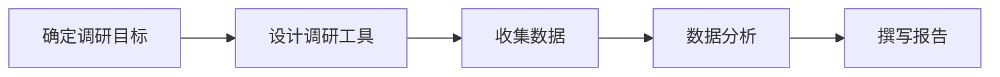
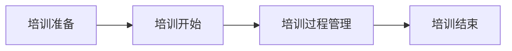
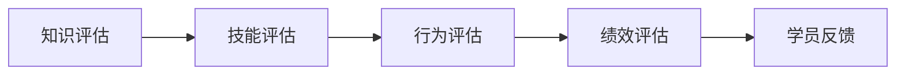

                 

### 文章标题

# 《领导力与员工发展：设计有效的培训体系》

在当今快速变化和高度竞争的商业环境中，领导力和员工发展成为了企业成功的基石。一个有效的培训体系不仅能提升员工的专业技能，还能培养他们的领导潜力，从而推动企业不断进步。本文旨在探讨如何设计一个有效的培训体系，以促进领导力的培养和员工的发展。

本文关键词包括：领导力、员工发展、培训体系、领导力模型、员工职业发展、培训需求分析、培训效果评估。

**摘要：** 本文首先介绍了领导力和员工发展在企业战略中的重要性，随后详细分析了如何通过培训需求分析、内容规划、方法选择和效果评估等步骤来设计一个有效的培训体系。接着，文章讨论了领导力培养的理论基础和实践方法，包括领导力模型和团队建设。最后，本文通过实际案例和最佳实践经验，提供了实用的技巧和注意事项，以帮助读者更好地实施培训体系。

### 目录大纲设计思路

为了确保本文的逻辑清晰、结构紧凑、简单易懂，我们采用以下设计思路：

1. **背景介绍**：首先介绍领导力和员工发展在企业战略中的重要性，明确文章的核心问题和解决思路。
2. **核心概念与联系**：梳理培训体系中的核心概念，通过概念属性特征对比表格和ER实体关系图架构的Mermaid流程图，展示概念之间的关系。
3. **培训体系设计**：详细规划培训体系的设计流程，包括需求分析、内容规划、方法选择和效果评估等环节。
4. **领导力培养**：介绍领导力培养的理论基础和实践方法，包括领导力模型、领导风格和团队建设。
5. **员工发展**：探讨员工职业发展路径，包括个人成长、技能提升和晋升机制。
6. **实战案例**：提供实际案例，详细分析培训体系和领导力培养在现实中的应用。
7. **最佳实践**：总结最佳实践经验，提供实用技巧和注意事项。
8. **小结与拓展**：对全文内容进行总结，提出未来发展方向和拓展阅读建议。

### 目录大纲设计框架

以下是本文的目录大纲设计框架：

```markdown
----------------------------------------------------------------
# 第一部分: 背景介绍

## 第1章: 领导力与员工发展概述
### 1.1 问题背景
### 1.2 问题描述
### 1.3 问题解决思路
### 1.4 边界与外延

## 第2章: 核心概念与联系
### 2.1 核心概念梳理
### 2.2 概念属性特征对比表格
### 2.3 ER实体关系图架构的Mermaid流程图

----------------------------------------------------------------

# 第二部分: 培训体系设计

## 第3章: 培训需求分析
### 3.1 调研方法
### 3.2 需求分析流程
### 3.3 需求分析案例

## 第4章: 培训内容规划
### 4.1 培训内容设计原则
### 4.2 培训内容框架
### 4.3 培训内容实施策略

## 第5章: 培训方法选择
### 5.1 常见培训方法
### 5.2 方法选择考虑因素
### 5.3 方法应用案例

## 第6章: 培训实施与评估
### 6.1 培训实施流程
### 6.2 培训效果评估
### 6.3 评估方法与工具

----------------------------------------------------------------

# 第三部分: 领导力培养

## 第7章: 领导力理论基础
### 7.1 领导力模型
### 7.2 领导风格
### 7.3 领导力发展的障碍

## 第8章: 团队建设
### 8.1 团队建设的意义
### 8.2 团队建设方法
### 8.3 团队建设案例分析

----------------------------------------------------------------

# 第四部分: 员工发展

## 第9章: 员工职业发展路径
### 9.1 个人成长
### 9.2 技能提升
### 9.3 晋升机制

## 第10章: 员工发展策略
### 10.1 员工发展计划
### 10.2 发展路径规划
### 10.3 发展支持措施

----------------------------------------------------------------

# 第五部分: 实战案例

## 第11章: 实战案例解析
### 11.1 案例背景
### 11.2 案例实施
### 11.3 案例效果评估

----------------------------------------------------------------

# 第六部分: 最佳实践

## 第12章: 最佳实践经验
### 12.1 实践技巧
### 12.2 注意事项
### 12.3 拓展阅读

----------------------------------------------------------------

# 第七部分: 小结与展望
## 第13章: 全书总结
### 13.1 主要内容回顾
### 13.2 未来发展方向
### 13.3 拓展阅读建议

----------------------------------------------------------------
```

### 目录大纲注意事项

在编写本文的过程中，需要特别注意以下几点：

- **文章结构**：确保文章按照设计好的目录大纲结构进行撰写，每个章节和节标题需要准确、清晰。
- **内容详实**：每个章节和节的内容需要详实具体，提供实际案例和分析，确保文章的实用性和指导性。
- **格式规范**：使用markdown格式编写文章，确保代码块、公式和流程图的正确显示。
- **作者信息**：文章末尾需明确标注作者信息，以便读者了解文章来源。

通过上述步骤和框架，我们能够构建一个逻辑清晰、内容丰富、易于理解的文章，帮助读者深入了解领导力与员工发展以及如何设计有效的培训体系。接下来，我们将详细探讨每个章节的内容，逐步构建完整的文章。

## 第一部分：背景介绍

### 第1章 领导力与员工发展概述

在当今的商业环境中，领导力和员工发展已经成为企业保持竞争力、实现可持续发展的重要战略。本章节将详细探讨领导力与员工发展的背景、重要性、以及本文将解决的问题。

#### 1.1 问题背景

随着全球化和信息技术的发展，企业面临着日益激烈的竞争和快速变化的市场环境。在这样的背景下，企业需要具备快速适应和变革的能力，而这离不开有效的领导力和员工的发展。领导力不仅是企业成功的关键，更是推动企业创新和持续发展的重要动力。同时，员工的发展也是企业竞争力的源泉，通过提升员工的能力和潜力，企业能够更好地应对市场变化，实现战略目标。

#### 1.2 问题描述

然而，在现实的企业管理中，我们常常遇到以下问题：

1. 领导力不足：许多企业的领导者缺乏有效的领导能力，无法激发团队的潜力和创造力，导致企业整体绩效不佳。
2. 员工发展滞后：员工的职业发展路径不明确，缺乏系统的培训和发展计划，导致员工对企业的忠诚度和积极性下降。
3. 培训体系不完善：现有的培训体系往往缺乏科学的需求分析、内容规划和效果评估，导致培训效果不佳。

这些问题不仅影响了企业的运营效率，还阻碍了企业的长期发展。因此，设计一个有效的培训体系，培养领导力，提升员工发展，成为企业亟需解决的问题。

#### 1.3 问题解决思路

本文将从以下几个方面提出解决思路：

1. **核心概念梳理**：明确培训体系中的核心概念，包括领导力、员工发展、培训需求分析、培训内容规划等。
2. **培训体系设计**：详细分析培训体系的设计流程，包括需求分析、内容规划、方法选择和效果评估等。
3. **领导力培养**：探讨领导力培养的理论基础和实践方法，包括领导力模型、领导风格和团队建设。
4. **员工发展路径**：探讨员工的职业发展路径，包括个人成长、技能提升和晋升机制。
5. **实战案例**：提供实际案例，分析培训体系和领导力培养在现实中的应用。
6. **最佳实践**：总结最佳实践经验，提供实用技巧和注意事项。

通过上述思路，本文旨在为企业提供一套完整的培训体系设计方案，帮助企业在领导力和员工发展方面取得显著成效。

#### 1.4 边界与外延

本文的研究边界主要涉及企业内部的培训体系设计、领导力培养和员工发展。虽然这些概念在其他领域也有应用，但本文重点关注的是企业内部的管理和实践。此外，本文将探讨的是一般性的培训体系和领导力培养方法，不涉及特定行业的特殊需求。

通过以上对背景的介绍，我们可以看到领导力和员工发展对于企业的重要性。接下来，我们将进一步梳理培训体系中的核心概念，为后续内容打下基础。

### 第2章 核心概念与联系

为了更好地设计一个有效的培训体系，我们需要明确和理解其中的核心概念，并通过概念属性特征对比表格和ER实体关系图架构的Mermaid流程图来展示这些概念之间的关系。以下是对培训体系中的核心概念及其属性的详细解析。

#### 核心概念梳理

**1. 领导力**

领导力是指领导者通过影响和激励他人，实现组织目标的能力。领导力包括以下几个方面：

- **领导技能**：如沟通、决策、团队合作等。
- **领导态度**：如自信心、耐心、责任感等。
- **领导特质**：如正直、热情、影响力等。

**2. 员工发展**

员工发展是指通过一系列培训、指导和支持措施，提升员工的专业技能、工作态度和职业素养，促进其职业成长。员工发展包括以下几个方面：

- **职业规划**：明确员工的职业目标和晋升路径。
- **技能提升**：通过培训和学习，提高员工的专业技能。
- **工作满意度**：通过改善工作环境和激励机制，提高员工的工作满意度。

**3. 培训需求分析**

培训需求分析是指通过系统的方法，评估员工和组织的培训需求，为培训设计提供依据。培训需求分析包括以下几个方面：

- **员工需求**：通过问卷调查、访谈等方式，了解员工的学习需求和意愿。
- **组织需求**：通过分析企业的战略目标和运营情况，确定培训需求。
- **差距分析**：比较员工的当前能力和组织需求，找出差距，确定培训重点。

**4. 培训内容规划**

培训内容规划是指根据培训需求，设计和组织培训课程和内容。培训内容规划包括以下几个方面：

- **课程设计**：确定培训课程的目标、内容和方法。
- **教材编写**：编写培训教材，确保内容的准确性和实用性。
- **培训方法**：选择合适的培训方法，如课堂授课、在线学习、实践操作等。

**5. 培训效果评估**

培训效果评估是指通过一系列评估方法，衡量培训活动的效果，为培训改进提供依据。培训效果评估包括以下几个方面：

- **评估指标**：确定评估的指标和标准，如知识掌握度、技能应用度、工作绩效等。
- **评估方法**：采用问卷调查、面试、绩效分析等方法，收集评估数据。
- **评估反馈**：对培训效果进行反馈和总结，为培训改进提供参考。

#### 概念属性特征对比表格

以下是一个简化的概念属性特征对比表格，用于展示上述核心概念的主要属性和特征：

| 核心概念 | 主要属性 | 特征 |
| :------: | :------: | :--: |
| 领导力 | 领导技能、领导态度、领导特质 | 激励他人、实现组织目标 |
| 员工发展 | 职业规划、技能提升、工作满意度 | 职业成长、工作积极性 |
| 培训需求分析 | 员工需求、组织需求、差距分析 | 确定培训重点 |
| 培训内容规划 | 课程设计、教材编写、培训方法 | 确保培训内容的有效性 |
| 培训效果评估 | 评估指标、评估方法、评估反馈 | 衡量培训效果 |

#### ER实体关系图架构的Mermaid流程图

为了更直观地展示核心概念之间的关系，我们可以使用Mermaid流程图来表示。以下是一个简化的ER实体关系图，用于展示培训体系中核心概念之间的联系：

```mermaid
erDiagram
  培训需求分析 ||--|{ 培训内容规划 }
  培训需求分析 ||--|{ 培训效果评估 }
  员工发展 ||--|{ 培训需求分析 }
  员工发展 ||--|{ 培训效果评估 }
  领导力 ||--|{ 培训需求分析 }
  领导力 ||--|{ 培训效果评估 }
  领导力 ||--|{ 培训内容规划 }
```

通过上述表格和流程图的展示，我们可以清晰地看到培训体系中的核心概念及其相互关系。这为后续的培训体系设计提供了理论基础和逻辑框架。

#### 概念属性的进一步分析

**1. 领导力的多层次属性**

领导力是一个多层次的复杂概念，可以从技能、态度和特质三个层次进行理解。领导技能包括沟通、决策、团队合作等具体能力；领导态度则体现在领导者的自信心、耐心和责任感等方面；领导特质则是领导者的个性特点，如正直、热情和影响力等。

**2. 员工发展的系统性**

员工发展是一个系统性的过程，涉及职业规划、技能提升和工作满意度等多个方面。职业规划是员工发展的起点，通过设定职业目标和晋升路径，帮助员工明确发展方向；技能提升则是通过培训和学习，提高员工的专业技能和工作能力；工作满意度则是通过改善工作环境和激励机制，提升员工的工作积极性和忠诚度。

**3. 培训需求分析的动态性**

培训需求分析是一个动态的过程，需要不断地进行评估和调整。员工的需求和组织的需求是不断变化的，因此需要定期进行培训需求分析，确保培训活动的针对性和有效性。差距分析则是培训需求分析的核心，通过比较员工的当前能力和组织需求，找出差距，明确培训重点。

**4. 培训内容规划的创新性**

培训内容规划需要具备创新性，以适应不断变化的市场环境和员工需求。课程设计应结合实际业务需求，确保培训内容的应用性；教材编写则需要注重实用性和易懂性，确保员工能够轻松掌握所学知识；培训方法的选择也应多样化，结合在线学习、实践操作等多种方式，提高培训效果。

**5. 培训效果评估的全面性**

培训效果评估是一个全面的过程，需要从多个维度进行衡量。评估指标应包括知识掌握度、技能应用度、工作绩效等，以确保评估结果的全面性和准确性。评估方法的选择也应多样化，结合问卷调查、面试、绩效分析等多种方式，提高评估的准确性和可靠性。

通过上述进一步的分析，我们可以更加深入地理解培训体系中的核心概念及其属性，为后续的培训体系设计提供更坚实的理论基础。

### 第二部分：培训体系设计

培训体系的设计是确保员工能够在工作中持续提升能力和素质的关键。本部分将详细讨论培训体系设计的基本步骤，包括培训需求分析、内容规划、方法选择和效果评估，并分析各个步骤的重要性和相互关系。

#### 第3章 培训需求分析

培训需求分析是培训体系设计的第一步，旨在明确员工和组织的需求，为后续的培训内容规划和方法选择提供依据。

##### 3.1 调研方法

调研方法的选择对于培训需求分析的准确性和有效性至关重要。常见的方法包括：

1. **问卷调查**：通过设计结构化的问卷，收集员工的意见和建议，便于定量分析和统计。
2. **访谈**：与员工进行面对面的交流，深入了解员工的需求和痛点，获取更为详细和深入的信息。
3. **工作观察**：通过观察员工在工作中的表现，发现存在的问题和改进的机会。
4. **文献研究**：查阅相关文献，了解行业动态和最佳实践，为培训需求分析提供理论支持。

##### 3.2 需求分析流程

培训需求分析的流程通常包括以下几个步骤：

1. **确定调研目标**：明确调研的目的和范围，确保调研工作有的放矢。
2. **设计调研工具**：根据调研目标，设计合适的调研工具，如问卷、访谈提纲等。
3. **收集数据**：通过问卷调查、访谈、工作观察等方式，收集员工和组织的培训需求数据。
4. **数据分析**：对收集到的数据进行分析，识别培训需求的关键点和优先级。
5. **报告撰写**：撰写培训需求分析报告，明确培训需求和分析结果，为后续工作提供指导。

##### 3.3 需求分析案例

以下是一个简化的培训需求分析案例：

- **调研目标**：确定公司销售团队在销售技能和客户管理方面的培训需求。
- **调研工具**：设计包含销售技巧、客户沟通、市场分析等问题的问卷，进行面对面访谈，观察销售团队的日常工作表现。
- **收集数据**：通过问卷调查和访谈，收集销售团队在销售技能和客户管理方面的数据和反馈。
- **数据分析**：通过数据分析，发现销售团队在客户沟通和需求分析方面存在较大提升空间。
- **报告撰写**：撰写需求分析报告，明确销售团队在销售技能和客户管理方面的培训需求，提出具体的培训建议。

通过以上案例，我们可以看到培训需求分析对于培训体系设计的重要性。准确的培训需求分析能够确保培训活动的针对性和有效性，提高培训的投资回报率。

#### 第4章 培训内容规划

培训内容规划是培训体系设计的核心步骤，旨在根据需求分析的结果，设计和组织培训课程和内容，确保培训内容的有效性和实用性。

##### 4.1 培训内容设计原则

在进行培训内容设计时，应遵循以下原则：

1. **针对性**：培训内容应针对具体的需求和问题，确保内容的实用性和针对性。
2. **实用性**：培训内容应注重实际应用，帮助员工解决工作中的实际问题。
3. **系统性**：培训内容应形成系统，确保知识的连贯性和完整性。
4. **互动性**：培训内容应设计互动环节，提高员工的参与度和学习效果。

##### 4.2 培训内容框架

培训内容框架通常包括以下几个模块：

1. **基础知识模块**：涵盖培训领域的基本知识和理论，为后续的技能培训打下基础。
2. **技能提升模块**：针对具体技能进行培训，如销售技巧、项目管理、技术编程等。
3. **案例分析模块**：通过真实案例的分析，帮助员工理解和应用所学知识。
4. **实践操作模块**：提供实际操作机会，让员工将所学知识应用到实际工作中。

##### 4.3 培训内容实施策略

在实施培训内容时，可以采取以下策略：

1. **分阶段实施**：根据培训内容的复杂性和员工的接受程度，分阶段实施培训，确保每个阶段的培训效果。
2. **多元化教学方法**：结合讲授、讨论、实践操作等多种教学方法，提高培训的趣味性和效果。
3. **个性化培训**：根据员工的个体差异，提供个性化的培训方案，确保培训的针对性和有效性。
4. **持续跟进**：培训结束后，通过持续跟进和评估，确保培训效果能够持续发挥作用。

#### 第5章 培训方法选择

培训方法的选择对于培训效果具有至关重要的影响。合适的培训方法能够提高员工的参与度、兴趣和吸收能力。

##### 5.1 常见培训方法

常见的培训方法包括：

1. **课堂授课**：通过讲师讲解，传授知识。
2. **在线学习**：通过互联网平台，进行自学和互动学习。
3. **实践操作**：通过实际操作，掌握技能。
4. **案例研讨**：通过案例讨论，提升分析和解决问题的能力。
5. **角色扮演**：通过模拟情境，提高实际操作能力。

##### 5.2 方法选择考虑因素

选择培训方法时，应考虑以下因素：

1. **培训内容**：不同的培训内容适合不同的培训方法，应选择能够有效传达培训内容的培训方法。
2. **员工特点**：考虑员工的学习习惯、兴趣和接受能力，选择适合员工的培训方法。
3. **培训目标**：根据培训目标，选择能够达到预期效果的培训方法。
4. **资源限制**：考虑企业资源和预算，选择成本效益较高的培训方法。

##### 5.3 方法应用案例

以下是一个培训方法应用案例：

- **培训内容**：销售技巧培训
- **培训方法**：课堂授课、在线学习和实践操作相结合
- **实施策略**：首先进行课堂授课，讲解销售技巧的基本理论和实战经验；然后通过在线学习平台，提供相关视频课程和自学资料；最后组织实践操作环节，让员工在实际销售情境中应用所学技巧。

通过以上案例，我们可以看到不同培训方法在特定情境下的应用效果。合适的培训方法能够显著提升培训效果。

#### 第6章 培训实施与评估

培训实施与评估是确保培训体系有效运行的关键环节。通过科学合理的培训实施和评估方法，能够不断提升培训效果，实现培训目标。

##### 6.1 培训实施流程

培训实施流程通常包括以下步骤：

1. **培训准备**：确定培训时间、地点、讲师和学员，准备培训所需材料和设备。
2. **培训开始**：按计划进行培训，确保培训内容按部就班地进行。
3. **培训过程管理**：监控培训过程，确保培训活动顺利进行，及时解决学员的问题和困难。
4. **培训结束**：总结培训成果，收集学员反馈，评估培训效果。

##### 6.2 培训效果评估

培训效果评估是衡量培训效果的重要手段。评估方法通常包括：

1. **知识评估**：通过考试、测试等方式，评估学员对培训知识的掌握程度。
2. **技能评估**：通过实际操作、模拟情境等方式，评估学员对培训技能的掌握和应用能力。
3. **行为评估**：通过观察学员在工作中的表现，评估培训对学员行为的实际影响。
4. **绩效评估**：通过比较培训前后的绩效变化，评估培训对工作绩效的影响。

##### 6.3 评估方法与工具

评估方法与工具的选择应根据培训目标和评估需求进行。常见的评估方法与工具包括：

1. **问卷调查**：通过设计结构化的问卷，收集学员的培训反馈和意见。
2. **面试**：通过面试，了解学员对培训内容的理解和应用情况。
3. **工作表现评估**：通过工作表现评估，衡量培训对员工实际工作的改进和提升。
4. **培训满意度调查**：通过培训满意度调查，了解学员对培训的整体满意度。

通过以上详细讨论，我们可以看到培训体系设计中的各个步骤和环节都是相互关联的。培训需求分析为后续工作提供依据，内容规划确保培训内容的实用性和系统性，方法选择提高培训效果，实施与评估确保培训目标的实现。只有各个环节相互配合，形成一个完整的培训体系，才能有效提升员工的技能和领导力，推动企业的发展。

### 第3章 培训需求分析

培训需求分析是设计有效培训体系的基石，通过系统的方法识别员工和组织在知识和技能方面的需求，从而确保培训活动的针对性和有效性。在这一章中，我们将深入探讨培训需求分析的方法和流程。

#### 3.1 调研方法

进行有效的培训需求分析，首先需要选择合适的调研方法。以下几种方法在培训需求分析中经常使用：

1. **问卷调查**：通过设计结构化的问卷，收集员工的意见和建议。这种方法便于大规模数据收集和统计分析，能够快速了解员工的培训需求。
2. **访谈**：与员工进行面对面的交流，深入了解员工的需求和痛点。访谈能够获取更为详细和深入的信息，有助于识别潜在的需求。
3. **工作观察**：通过观察员工在工作中的表现，发现存在的问题和改进的机会。这种方法能够直观地了解员工的工作状态和实际需求。
4. **文献研究**：查阅相关文献，了解行业动态和最佳实践，为培训需求分析提供理论支持。

每种方法都有其优缺点：

- **问卷调查**：适用于大规模的数据收集，但可能存在样本偏差和主观性问题。
- **访谈**：能够深入了解员工的意见和需求，但时间和资源成本较高。
- **工作观察**：能够获取真实的工作情境信息，但需要专业的观察者。
- **文献研究**：能够提供理论依据和行业参考，但可能缺乏实际操作性。

在实际操作中，通常结合多种方法，以提高需求分析的准确性和全面性。

#### 3.2 需求分析流程

培训需求分析通常包括以下几个步骤：

1. **确定调研目标**：明确调研的目的和范围，确保调研工作有的放矢。调研目标通常包括了解员工的知识水平、技能需求、工作满意度等。
2. **设计调研工具**：根据调研目标，设计合适的调研工具，如问卷、访谈提纲等。问卷和访谈提纲应确保问题的科学性和针对性，以便获取有效数据。
3. **收集数据**：通过问卷调查、访谈、工作观察等方式，收集员工和组织的培训需求数据。在数据收集过程中，应注意保持数据的客观性和真实性。
4. **数据分析**：对收集到的数据进行整理、分类和分析，识别培训需求的关键点和优先级。数据分析可以采用定量分析（如统计方法）和定性分析（如内容分析法）相结合的方式。
5. **撰写报告**：根据数据分析结果，撰写培训需求分析报告。报告应明确员工和组织的培训需求，提出具体的培训建议和改进措施。

以下是一个简化的培训需求分析流程图，用于展示上述步骤：



#### 3.3 需求分析案例

为了更好地理解培训需求分析的过程，以下是一个简化的需求分析案例：

- **调研目标**：确定公司研发部门在新技术应用和项目管理方面的培训需求。
- **调研工具**：设计包含新技术知识、项目管理技巧、工作满意度等问题的问卷，进行部门主管的访谈，观察研发团队的工作状态。
- **收集数据**：通过问卷调查和访谈，收集研发团队在新技术应用和项目管理方面的数据和反馈。
- **数据分析**：通过数据分析，发现研发团队在新技术掌握方面存在较大提升空间，同时在项目管理技能上也有明显的需求。
- **撰写报告**：撰写需求分析报告，明确研发部门在新技术应用和项目管理方面的培训需求，提出具体的培训建议，如开设新技术培训课程、组织项目管理研讨会等。

通过以上案例，我们可以看到培训需求分析在实际操作中的具体步骤和方法。准确的培训需求分析能够为后续的培训内容规划和方法选择提供有力支持，确保培训活动的针对性和有效性。

### 第4章 培训内容规划

培训内容规划是确保员工培训能够满足实际工作需求和促进职业发展的关键环节。通过科学合理的培训内容规划，企业可以有效地提升员工的技能和素质，从而推动整体绩效的提升。以下我们将详细讨论培训内容设计原则、框架和实施策略。

#### 4.1 培训内容设计原则

在进行培训内容设计时，应遵循以下原则：

1. **针对性**：培训内容应针对具体的需求和问题，确保内容的实用性和针对性。通过分析员工和组织的需求，确定培训的重点内容。
2. **实用性**：培训内容应注重实际应用，帮助员工解决工作中的实际问题。培训内容应紧密结合实际业务，确保员工能够在工作中应用所学知识。
3. **系统性**：培训内容应形成系统，确保知识的连贯性和完整性。通过设计模块化的培训内容，使员工能够逐步掌握所需技能。
4. **互动性**：培训内容应设计互动环节，提高员工的参与度和学习效果。通过案例分析、角色扮演、讨论等多种互动方式，增强培训的生动性和吸引力。
5. **持续更新**：培训内容应根据企业战略和市场需求的变化，定期更新和调整。确保培训内容能够与时俱进，反映最新的行业趋势和技术发展。

#### 4.2 培训内容框架

一个完整的培训内容框架通常包括以下几个模块：

1. **基础知识模块**：涵盖培训领域的基本知识和理论，为后续的技能培训打下基础。例如，在项目管理培训中，应包括项目管理的定义、流程、方法论等基本知识。
2. **技能提升模块**：针对具体技能进行培训，如销售技巧、技术编程、沟通能力等。这一模块应详细讲解技能要点和应用场景，帮助员工在实际工作中应用所学知识。
3. **案例分析模块**：通过真实案例的分析，帮助员工理解和应用所学知识。案例选择应具有代表性，能够反映培训内容的实际应用场景。
4. **实践操作模块**：提供实际操作机会，让员工将所学知识应用到实际工作中。这一模块可以包括模拟情境、角色扮演、现场实践等，通过实践提高员工的能力。
5. **综合应用模块**：将多个模块的内容综合应用，通过综合性的项目或任务，使员工能够将所学知识和技能综合运用。这一模块有助于提升员工的综合能力和解决问题的能力。

以下是一个简化的培训内容框架示例：

```mermaid
tree
  dir0
    dir1
      dir2
      dir3
    dir4
  dir5
```

在这个框架中，每个节点代表一个具体的培训模块，通过层级结构展示培训内容的不同层次和模块之间的关系。

#### 4.3 培训内容实施策略

为了确保培训内容的有效实施，可以采取以下策略：

1. **分阶段实施**：根据培训内容的复杂性和员工的接受程度，分阶段实施培训。每个阶段应有明确的学习目标和评估标准，确保员工能够逐步掌握所学知识。
2. **多元化教学方法**：结合讲授、讨论、实践操作等多种教学方法，提高培训的趣味性和效果。例如，在讲授理论知识时，可以使用视频讲解、互动讨论等方式；在技能培训中，可以安排现场操作和实地考察。
3. **个性化培训**：根据员工的个体差异，提供个性化的培训方案，确保培训的针对性和有效性。可以通过评估员工的兴趣、能力和学习习惯，制定个性化的培训计划和内容。
4. **持续跟进**：培训结束后，通过持续跟进和评估，确保培训效果能够持续发挥作用。可以通过定期的反馈会议、绩效评估等方式，了解员工对培训的反馈和应用情况，及时调整和优化培训内容。

通过以上详细讨论，我们可以看到培训内容规划对于设计有效培训体系的重要性。通过遵循设计原则、构建合理的框架和采取有效的实施策略，企业能够确保培训内容既实用又具有吸引力，从而提升员工的技能和职业发展，推动企业的持续进步。

### 第5章 培训方法选择

培训方法的选择直接影响到培训的效果和员工的参与度。不同的培训方法适合不同的培训目标和内容，因此，在选择培训方法时，需要综合考虑培训内容、员工特点、培训目标和资源限制等因素。以下将详细探讨常见的培训方法及其应用。

#### 5.1 常见培训方法

1. **课堂授课**：课堂授课是传统的培训方法，由讲师在教室里进行讲解。这种方法适合传递基础知识、理论知识和系统性的知识，能够确保信息的传递和知识点的覆盖。

2. **在线学习**：在线学习利用互联网平台，通过电子教材、视频讲座、在线测试等方式进行学习。这种方法适合自主学习的员工，能够在时间和地点上提供灵活性，提高学习的效率。

3. **实践操作**：通过实际操作，让员工在真实或模拟的工作环境中应用所学知识。这种方法能够提高员工的实际操作能力，使学习更加贴近实际工作。

4. **案例研讨**：通过分析和讨论真实案例，帮助员工理解和应用所学知识。这种方法能够培养员工的问题解决能力和团队合作精神。

5. **角色扮演**：通过模拟不同的工作场景，让员工扮演不同的角色，体验实际工作中的情境。这种方法能够提高员工的沟通能力和应变能力。

6. **工作坊**：通过小组讨论、头脑风暴、角色扮演等活动，促进员工之间的互动和学习。这种方法适合需要团队合作和互动的培训内容。

7. **外部专家讲座**：邀请行业专家或外部讲师进行讲座，分享行业动态和最佳实践。这种方法能够为员工提供前沿的知识和视野。

#### 5.2 方法选择考虑因素

在选择培训方法时，应考虑以下因素：

1. **培训内容**：不同类型的培训内容需要不同的培训方法。例如，理论性的知识适合课堂授课或在线学习，而实践操作和技能提升则更适合工作坊或实践操作。

2. **员工特点**：不同员工有不同的学习习惯和偏好。例如，一些员工喜欢自主学习和在线学习，而另一些员工则更喜欢面对面的互动学习。

3. **培训目标**：培训目标决定了培训方法的选择。例如，如果目标是提高员工的团队合作能力，则案例研讨和工作坊可能是更好的选择。

4. **资源限制**：企业资源（如时间、预算、场地等）会影响培训方法的选择。例如，如果预算有限，可能需要优先选择成本较低的在线学习或课堂授课。

#### 5.3 方法应用案例

以下是一个培训方法应用案例：

**培训内容**：销售技巧培训
**培训目标**：提高销售团队的沟通技巧、谈判能力和销售策略
**培训方法**：
- **课堂授课**：由资深销售专家进行基础理论和技巧的讲解。
- **在线学习**：提供销售技巧的电子教材和视频课程，供员工自主学习和复习。
- **案例研讨**：分析经典销售案例，讨论成功和失败的策略，提高销售团队的问题解决能力。
- **实践操作**：模拟销售场景，让员工进行实际操作，提高沟通和谈判技巧。
- **角色扮演**：通过角色扮演，让员工体验不同的销售情境，提高应对不同客户的能力。

通过这个案例，我们可以看到如何根据培训内容和目标选择合适的培训方法，并结合多种方法，提高培训的整体效果。

通过以上讨论，我们可以了解到选择合适的培训方法对于实现培训目标的重要性。只有根据培训内容和目标，结合员工特点和资源限制，科学合理地选择培训方法，才能确保培训的效果和员工的满意度。

### 第6章 培训实施与评估

培训实施与评估是确保培训活动达到预期效果的关键环节。有效的培训实施和评估不仅能够提升员工的能力和满意度，还能为企业的持续发展提供强有力的支持。在这一章中，我们将详细探讨培训实施的流程和评估方法。

#### 6.1 培训实施流程

为了确保培训活动能够顺利进行并达到预期目标，培训实施通常遵循以下流程：

1. **培训准备**：在培训开始前，需要进行充分的准备工作。这包括确定培训时间、地点、讲师和学员，准备培训所需的教材、设备和其他资源。同时，还需要制定详细的培训计划和日程安排，确保培训活动的有序进行。

2. **培训开始**：在培训开始时，讲师应进行简短的介绍，明确培训目标和内容。随后，根据培训计划和日程安排，按部就班地进行培训。讲师应通过多样化的教学方法和互动环节，提高学员的参与度和兴趣。

3. **培训过程管理**：在培训过程中，培训管理者应进行有效的过程管理。这包括监控培训进度，确保培训内容按时完成；及时解决学员的问题和困难，提高培训效果；收集学员的反馈意见，为后续改进提供依据。

4. **培训结束**：在培训结束时，讲师应进行总结和反馈，强调培训的重点和关键点。同时，还可以安排学员进行互动讨论，促进知识的巩固和应用。培训管理者应收集学员的培训反馈，评估培训效果。

以下是一个简化的培训实施流程图，用于展示上述步骤：



#### 6.2 培训效果评估

培训效果评估是衡量培训活动是否达到预期目标的重要手段。评估方法的选择和评估指标的设定直接影响评估结果的有效性。以下是一些常见的培训效果评估方法：

1. **知识评估**：通过考试、测试、问卷等方式，评估学员对培训知识的掌握程度。这种方法适用于评估培训内容的知识性和理论性。

2. **技能评估**：通过实际操作、模拟情境、角色扮演等方式，评估学员对培训技能的掌握和应用能力。这种方法适用于评估培训内容的实践性和操作性。

3. **行为评估**：通过观察学员在工作中的表现，评估培训对学员行为的实际影响。这种方法能够直观地了解培训对员工工作态度和行为改变的效果。

4. **绩效评估**：通过比较培训前后的工作绩效变化，评估培训对员工工作绩效的影响。这种方法适用于评估培训对员工实际工作能力的提升。

5. **学员反馈**：通过问卷调查、访谈等方式，收集学员对培训的反馈意见。这种方法能够了解学员对培训的满意度和建议，为后续改进提供依据。

以下是一个简化的培训效果评估流程图，用于展示上述步骤：



#### 6.3 评估方法与工具

在选择评估方法时，应考虑以下因素：

1. **评估目标**：根据培训目标和内容，选择合适的评估方法。例如，如果目标是提高学员的知识水平，可以选择知识评估；如果目标是提升学员的技能，可以选择技能评估。

2. **评估对象**：确定评估的对象，包括学员、培训内容、培训过程等。评估对象的不同，需要选择不同的评估方法。

3. **评估时机**：确定评估的时机，包括培训前、培训中、培训后等。不同时机的评估能够提供不同的信息和反馈，有助于全面了解培训效果。

4. **评估工具**：选择合适的评估工具，如考试、测试、问卷、观察表、绩效记录等。评估工具的选择应确保评估的科学性和客观性。

以下是一些常见的评估工具：

- **考试和测试**：用于评估学员对培训知识的掌握程度，可以通过在线考试系统或纸质试卷进行。
- **问卷调查**：用于收集学员对培训的满意度和建议，可以采用电子问卷或纸质问卷。
- **观察表**：用于记录学员在培训过程中的表现和行为，可以由培训管理者或观察者填写。
- **绩效记录**：用于比较培训前后的工作绩效变化，可以通过工作记录、绩效评估报告等工具进行。

通过科学合理的培训实施和评估方法，企业能够确保培训活动的有效性和持续性，从而提升员工的技能和绩效，推动企业的长远发展。

### 第三部分：领导力培养

领导力是企业发展的重要驱动力，对于企业领导者来说，培养有效的领导力不仅是个人职业发展的关键，也是推动企业实现战略目标的关键。本部分将深入探讨领导力的理论基础、领导风格和团队建设。

#### 第7章 领导力理论基础

领导力的培养离不开对领导力理论的理解。以下介绍几种常见的领导力模型和理论：

##### 7.1 领导力模型

1. ** Transformational Leadership Model**（转化型领导模型）：这种模型认为领导者的目标是通过激励和启发员工，推动他们实现更高的目标。转化型领导者具备以下特征：

   - **激励鼓舞**：通过愿景和使命激励员工，激发员工的内在动机。
   - **个人化关注**：关注每个员工的需求，提供个性化的指导和支持。
   - **智力激发**：鼓励创新思维，促进员工思考和解决问题。

2. ** Transactional Leadership Model**（交易型领导模型）：这种模型认为领导者的目标是通过明确的奖励和惩罚机制来激励员工。交易型领导者具备以下特征：

   - **明确目标**：设定清晰的目标和期望，使员工了解工作方向。
   - **奖励机制**：通过奖励来激励员工的积极行为。
   - **纠正机制**：通过惩罚来纠正员工的不良行为。

##### 7.2 领导风格

1. **Autocratic Leadership**（专制型领导）：领导者做出决策并控制所有行动，员工的角色是执行命令。

2. **Democratic Leadership**（民主型领导）：领导者与团队成员共同参与决策过程，鼓励员工提供意见和建议。

3. **Laissez-Faire Leadership**（自由放任型领导）：领导者赋予员工很大的自主权，让员工自行决策和执行。

不同的领导风格适用于不同的情境，领导者应根据实际情况灵活调整。

##### 7.3 领导力发展的障碍

在领导力培养过程中，可能会遇到以下障碍：

1. **自我认知不足**：领导者需要明确自己的优势和劣势，缺乏自我认知会影响领导效果。

2. **缺乏决策能力**：领导者需要具备良好的决策能力，包括分析问题的能力、风险评估能力和决策执行能力。

3. **缺乏沟通能力**：有效的沟通是领导力的关键，领导者需要学会倾听和表达，建立良好的沟通机制。

4. **缺乏团队建设能力**：领导者需要具备团队建设能力，包括激发团队士气、解决团队冲突和提升团队协作。

#### 第8章 团队建设

团队建设是领导力的重要组成部分，一个高效的团队能够显著提升企业的竞争力。以下介绍团队建设的意义、方法和案例分析。

##### 8.1 团队建设的意义

团队建设的目标是提高团队成员的协作能力和整体绩效，具体意义包括：

1. **增强团队凝聚力**：通过共同的目标和价值观，增强团队成员之间的信任和合作关系。

2. **提升团队效率**：通过优化工作流程和职责分工，提高团队的工作效率和产出。

3. **促进个人成长**：团队建设能够为团队成员提供成长和学习的机会，提高个人能力和职业素养。

4. **降低员工流失率**：良好的团队氛围能够提高员工的工作满意度和忠诚度，降低员工流失率。

##### 8.2 团队建设方法

1. **目标设定**：明确团队的目标和愿景，确保团队成员明确工作方向和期望。

2. **角色分工**：根据团队成员的能力和特长，合理分配工作职责，确保每个成员都能充分发挥自己的优势。

3. **沟通与协作**：建立有效的沟通机制，鼓励团队成员之间的交流和协作，促进信息的共享和资源的优化配置。

4. **激励机制**：通过奖励和认可，激励团队成员的积极性和创造力，提高团队的士气和绩效。

5. **培训与发展**：提供定期的培训和职业发展机会，帮助团队成员提升技能和知识，增强团队的整体实力。

##### 8.3 团队建设案例分析

以下是一个团队建设案例：

**案例背景**：某公司销售团队在市场竞争中表现不佳，团队内部存在沟通不畅、协作不力的问题。

**案例分析**：

1. **目标设定**：公司高层与销售团队共同制定了提高销售业绩的目标，并明确了每个团队成员的具体任务和职责。

2. **角色分工**：根据团队成员的销售技能和市场经验，重新调整了销售团队的分工，使每个成员都能在熟悉的市场和领域内发挥特长。

3. **沟通与协作**：公司建立了定期的销售会议和团队交流平台，鼓励团队成员分享市场信息和客户反馈，提升了团队的整体协作效率。

4. **激励机制**：公司推出了销售业绩奖励计划，根据团队的业绩表现发放奖金，激发了团队成员的积极性和创造力。

5. **培训与发展**：公司定期组织销售技能培训和市场分析研讨会，帮助团队成员提升销售技能和市场洞察能力。

通过以上措施，该销售团队在短时间内显著提升了销售业绩，团队凝聚力也得到明显增强。

通过以上对领导力理论基础、领导风格和团队建设方法的探讨，我们可以看到领导力的培养和团队建设对于企业成功的重要性。只有通过有效的领导力和团队建设，企业才能在激烈的市场竞争中立于不败之地。

### 第7章 领导力理论基础

领导力是推动组织发展和实现目标的关键因素，它不仅涉及领导者的个人能力，还包括领导力模型和领导风格的应用。以下将对几种常见的领导力模型进行详细分析。

#### 7.1 领导力模型

**1. 转化型领导模型（Transformational Leadership Model）**

转化型领导模型是由James MacGregor Burns提出的，该模型强调领导者通过激励和启发员工来实现更高的目标。转化型领导者具备以下特征：

- **激励鼓舞（Inspirational Motivation）**：领导者通过传达激情和愿景，激励员工为实现共同目标而努力。
- **个人化关注（Individualized Consideration）**：领导者关注每个员工的需求，提供个性化的指导和支持，建立信任关系。
- **智力激发（Intellectual Stimulation）**：领导者鼓励创新思维，激发员工挑战现状，促进个人成长。

**2. 交易型领导模型（Transactional Leadership Model）**

交易型领导模型是由Bertice A. Wright提出的，该模型强调领导者通过明确的奖励和惩罚机制来激励员工。交易型领导者具备以下特征：

- **明确目标（Management by Objective）**：领导者设定清晰的目标和期望，使员工了解工作方向和预期成果。
- **奖励机制（Rewards）**：领导者通过奖励来激励员工的积极行为，如奖金、晋升等。
- **纠正机制（Corrective Feedback）**：领导者通过纠正机制来纠正员工的不良行为，确保工作规范。

**3. 服务型领导模型（Servant Leadership Model）**

服务型领导模型由Robert K. Greenleaf提出，强调领导者首先作为服务者存在，为员工提供支持和帮助。服务型领导者具备以下特征：

- **倾听（Listening）**：领导者积极倾听员工的意见和建议，了解员工的需求。
- **赋能（Empowerment）**：领导者赋予员工自主权，鼓励员工参与决策和承担责任。
- **培养（Development）**：领导者关注员工的发展，提供培训和发展机会，帮助员工成长。

**4. 情境领导模型（Situational Leadership Model）**

情境领导模型由Paul Hersey和Kenneth H. Blanchard提出，该模型认为领导风格应根据员工的能力和需求进行调整。情境领导者具备以下特征：

- **指导（Directing）**：在员工能力不足时，领导者提供明确的指导和支持。
- **推销（Supporting）**：在员工能力逐步提升时，领导者提供支持和鼓励，帮助员工成长。
- **参与（Participating）**：在员工具备足够能力时，领导者鼓励员工参与决策，提高自主性。

#### 7.2 领导风格

领导风格是指领导者在领导过程中表现出来的行为和态度。以下介绍几种常见的领导风格：

**1. 专制型领导（Autocratic Leadership）**

专制型领导是领导者做出所有决策，控制所有行动。这种风格在紧急情况下或需要快速决策时较为有效，但可能导致员工积极性不高。

**2. 民主型领导（Democratic Leadership）**

民主型领导是领导者与团队成员共同参与决策过程。这种风格有助于激发员工的参与感和责任感，但决策过程可能较慢。

**3. 自由放任型领导（Laissez-Faire Leadership）**

自由放任型领导是领导者赋予员工很大的自主权，让员工自行决策和执行。这种风格有助于提高员工的创新和自主性，但可能导致缺乏统一的方向和协调。

**4. 参与型领导（Participative Leadership）**

参与型领导是领导者与团队成员共同讨论决策，并鼓励团队成员提出建议。这种风格有助于增强团队合作和员工参与度。

**5. 指导型领导（Authoritative Leadership）**

指导型领导是领导者提供明确的指导和方向，同时鼓励员工发挥自主性。这种风格有助于确保工作的高效执行和员工的成长。

#### 7.3 领导力发展的障碍

在领导力培养过程中，可能会遇到以下障碍：

**1. 自我认知不足**

领导者需要明确自己的优势和劣势，缺乏自我认知会影响领导效果。领导者可以通过反思、反馈和自我评估来提升自我认知。

**2. 缺乏决策能力**

领导者需要具备良好的决策能力，包括分析问题的能力、风险评估能力和决策执行能力。领导者可以通过培训和实际经验来提升决策能力。

**3. 缺乏沟通能力**

有效的沟通是领导力的关键，领导者需要学会倾听和表达，建立良好的沟通机制。领导者可以通过沟通培训和实践来提升沟通能力。

**4. 缺乏团队建设能力**

领导者需要具备团队建设能力，包括激发团队士气、解决团队冲突和提升团队协作。领导者可以通过团队建设活动和培训来提升团队建设能力。

通过以上对领导力模型和领导风格的探讨，我们可以更好地理解如何培养和提升领导力。领导者应根据实际情况灵活应用不同的模型和风格，不断提升自身的领导能力，为企业的持续发展贡献力量。

### 第8章 团队建设

团队建设是领导力的重要组成部分，一个高效的团队可以极大地提升企业的竞争力。团队建设的目标是增强团队的凝聚力、提升工作效率和促进个人成长。以下将介绍团队建设的意义、方法以及一个实际的案例分析。

#### 8.1 团队建设的意义

**1. 提高团队效率**

通过团队建设，可以明确团队成员的角色和责任，优化工作流程，提高团队的整体工作效率。团队成员之间的协作和沟通更加顺畅，能够快速响应市场和客户需求。

**2. 增强团队凝聚力**

团队建设有助于建立团队成员之间的信任和合作关系，增强团队的凝聚力。团队成员在共同的目标和价值观下，能够更好地协调工作，共同克服困难。

**3. 促进个人成长**

团队建设提供了团队成员学习和发展的机会，通过培训、指导和团队活动，可以提高个人的技能和职业素养，促进个人成长。

**4. 降低员工流失率**

一个良好的团队氛围能够提高员工的工作满意度和忠诚度，降低员工流失率。员工在团队中感受到归属感和成就感，更愿意长期留在企业。

#### 8.2 团队建设方法

**1. 目标设定**

团队建设的第一步是明确团队的目标和愿景。这包括短期和长期目标，确保团队成员了解团队的方向和期望。通过共同的目标，团队成员可以更好地协调行动，提高工作效率。

**2. 角色分工**

根据团队成员的能力和特长，合理分配工作职责，确保每个成员都能在熟悉和擅长的领域内发挥作用。明确每个成员的角色和责任，有助于提高工作效率和团队协作。

**3. 沟通与协作**

建立有效的沟通机制，鼓励团队成员之间的交流和协作。通过定期的团队会议、邮件沟通、即时通讯工具等方式，确保信息畅通，提高协作效率。同时，建立反馈机制，鼓励团队成员提出建议和意见，不断改进团队工作。

**4. 激励机制**

通过奖励和认可，激励团队成员的积极性和创造力。可以设立团队目标奖励、个人绩效奖励等机制，鼓励团队成员努力工作，共同实现目标。

**5. 培训与发展**

提供定期的培训和职业发展机会，帮助团队成员提升技能和知识。通过内部培训、外部学习、研讨会等形式，提高团队成员的综合素质和业务能力。

**6. 团队文化建设**

培养团队共同的价值观和信念，塑造积极向上的团队文化。通过团队活动、团建活动、员工关怀等方式，增强团队成员的归属感和凝聚力。

#### 8.3 团队建设案例分析

以下是一个团队建设案例分析：

**案例背景**：某公司市场部在市场竞争中表现不佳，团队内部存在沟通不畅、协作不力的问题。

**案例分析**：

**1. 目标设定**：公司高层与市场部共同制定了提高市场业绩的目标，明确了每个团队成员的具体任务和职责。

**2. 角色分工**：根据团队成员的市场经验和技能，重新调整了市场部的分工，使每个成员都能在熟悉的市场和领域内发挥特长。

**3. 沟通与协作**：公司建立了定期的市场部会议和团队交流平台，鼓励团队成员分享市场信息和客户反馈，提升了团队的整体协作效率。

**4. 激励机制**：公司推出了市场业绩奖励计划，根据团队的业绩表现发放奖金，激发了团队成员的积极性和创造力。

**5. 培训与发展**：公司定期组织市场技能培训和行业研讨会，帮助团队成员提升市场洞察能力和销售技巧。

**6. 团队文化建设**：公司通过团建活动、员工关怀等方式，增强市场部的凝聚力，营造积极向上的团队氛围。

通过以上措施，市场部在短时间内显著提升了市场业绩，团队内部的沟通和协作也得到了明显改善。这个案例展示了团队建设在提升团队绩效和员工满意度方面的作用。

通过以上讨论，我们可以看到团队建设对于企业的重要性。有效的团队建设不仅能够提升团队的工作效率和绩效，还能增强员工的归属感和满意度，为企业的长期发展奠定坚实基础。

### 第四部分：员工发展

#### 第9章 员工职业发展路径

员工职业发展是员工在组织中成长和提升的过程，它不仅关系到员工的个人成就和满意度，也直接影响到企业的绩效和竞争力。本章节将详细探讨员工职业发展的路径，包括个人成长、技能提升和晋升机制。

#### 9.1 个人成长

个人成长是员工职业发展的基础，它涉及到员工在知识和技能、工作态度、职业素养等方面的提升。以下是一些促进个人成长的方法：

**1. 自我反思与目标设定**

员工应定期进行自我反思，了解自己的优点和不足，设定个人发展目标。通过目标设定，员工可以明确自己的职业发展方向和努力的方向。

**2. 培训与学习**

提供多样化的培训和学习机会，帮助员工提升知识和技能。这包括内部培训、外部学习、在线课程等。通过不断学习和积累，员工可以提升自身的专业素养。

**3. 跨部门交流**

鼓励员工跨部门交流，了解不同部门的工作内容和运作方式。这不仅有助于员工拓宽视野，还能促进团队协作和跨部门项目的顺利进行。

**4. 职业规划**

企业应为员工提供职业规划服务，帮助员工制定个人职业发展计划。职业规划应包括职业目标、发展路径、所需技能和资源等。

#### 9.2 技能提升

技能提升是员工职业发展的关键，它直接影响到员工的工作效率和绩效。以下是一些提升技能的方法：

**1. 在职培训**

通过在职培训，员工可以在工作中不断提升技能。这包括技能培训、专业讲座、工作坊等。在职培训不仅能够提升员工的实际工作能力，还能提高员工的职业素养。

**2. 外部培训**

外部培训是指员工参加外部机构或大学提供的培训课程。外部培训可以帮助员工获取最新的行业知识和技能，提升自身的竞争力。

**3. 实践操作**

通过实际操作，员工可以将所学知识应用到实际工作中，提升自己的技能水平。实践操作包括项目演练、模拟训练等。

**4. 经验交流**

通过经验交流，员工可以分享自己的工作经验和教训，学习他人的成功经验。经验交流有助于提高员工的问题解决能力和创新思维。

#### 9.3 晋升机制

晋升机制是员工职业发展的重要保障，它为员工提供了实现个人职业目标的途径。以下是一些建立合理晋升机制的方法：

**1. 能力评估**

企业应建立科学的能力评估体系，定期对员工的能力和绩效进行评估。能力评估应包括知识、技能、工作态度、团队协作等方面。

**2. 晋升通道**

企业应为员工提供清晰的晋升通道，明确晋升的标准和条件。晋升通道应包括职位晋升、职能晋升等。

**3. 晋升激励**

通过晋升激励，鼓励员工积极参与晋升竞争。晋升激励包括晋升奖励、晋升培训等。

**4. 晋升评审**

建立晋升评审制度，确保晋升过程的公正和透明。晋升评审应包括个人申请、同事推荐、上级评估等环节。

通过以上对个人成长、技能提升和晋升机制的分析，我们可以看到员工职业发展对于企业和员工的重要性。一个完善的职业发展体系不仅能够提升员工的工作积极性和满意度，还能为企业培养和留住人才，推动企业的长期发展。

### 第10章 员工发展策略

为了确保员工能够在职业发展中不断进步，企业需要制定一套全面的员工发展策略。以下将详细探讨员工发展计划、发展路径规划和发展支持措施，以帮助员工实现个人和职业目标。

#### 10.1 员工发展计划

员工发展计划是指导员工职业发展的关键文件，它明确了员工的职业目标、发展路径和所需资源。以下是如何制定有效的员工发展计划的步骤：

**1. 明确发展目标**

企业应与员工共同制定清晰的职业发展目标，这些目标应与员工的个人兴趣、职业规划和企业的战略目标相一致。发展目标可以是短期的，如半年或一年内实现的能力提升，也可以是长期的，如三年或五年内的职位晋升。

**2. 制定具体行动计划**

为了实现发展目标，需要制定具体的行动计划。这些计划应包括学习课程、项目参与、培训活动等，确保员工在每一个阶段都有明确的发展路径和可量化的目标。

**3. 资源配置**

确保为员工提供必要的资源和支持，如培训经费、学习资料、导师指导等。资源配置应合理，确保员工能够在职业发展中获得充分的支持。

**4. 定期评估和调整**

定期对员工的发展计划进行评估，根据评估结果进行调整。评估应包括员工的自我评估、上级评估和同事反馈，以确保发展计划的实施效果。

#### 10.2 发展路径规划

发展路径规划是指为员工制定清晰的职业发展路径，帮助员工实现职业目标。以下是如何进行发展路径规划的方法：

**1. 设定职位晋升路径**

企业应明确不同职位晋升的标准和要求，为员工提供清晰的晋升路径。职位晋升路径应包括初级、中级、高级等不同级别的职位，以及相应的职责和资格要求。

**2. 提供多样化的职业发展机会**

除了职位晋升，企业还应为员工提供多样化的职业发展机会，如跨部门调动、职能转换、项目管理等。多样化的职业发展机会有助于员工拓宽视野，提升综合素质。

**3. 制定职业发展地图**

为每位员工制定个性化的职业发展地图，明确其职业发展的路径和目标。职业发展地图应包括职业目标、所需技能、关键里程碑等。

**4. 定期更新和调整**

根据企业的发展变化和员工的需求，定期更新和调整职业发展路径。这有助于确保职业发展路径的动态适应性和灵活性。

#### 10.3 发展支持措施

为了确保员工能够在职业发展中取得成功，企业需要提供一系列的支持措施。以下是一些关键的支持措施：

**1. 培训和支持**

提供定期的培训和技能提升机会，包括内部培训、外部学习、在线课程等。同时，为员工提供导师指导和支持，帮助他们解决职业发展中的问题和挑战。

**2. 绩效评估**

建立科学合理的绩效评估体系，通过绩效评估了解员工的工作表现和发展潜力。绩效评估结果应与员工的职业发展计划相结合，为员工提供明确的改进方向。

**3. 职业规划服务**

为员工提供职业规划服务，包括职业咨询、职业发展指导、职业测评等。职业规划服务有助于员工明确职业目标，制定合理的职业发展计划。

**4. 工作环境和激励机制**

提供良好的工作环境和激励机制，如公平的薪酬体系、职业晋升机会、灵活的工作时间等。这些措施有助于提高员工的工作满意度和忠诚度。

通过上述员工发展策略，企业不仅能够提升员工的职业素养和竞争力，还能增强员工的归属感和忠诚度，为企业的长期发展奠定坚实基础。

### 第五部分：实战案例

#### 第11章 实战案例解析

为了更好地理解和应用前述理论和方法，本章节将通过一个实际案例，详细分析培训体系和领导力培养在企业中的应用。以下是一个企业如何通过设计和实施培训体系，成功提升员工能力和团队绩效的案例。

#### 11.1 案例背景

某知名互联网公司在快速扩张的过程中，面临着员工技能不足、领导力薄弱和团队协作不畅的问题。公司高层意识到，只有通过系统化的培训体系和领导力培养，才能解决这些问题，推动企业持续发展。为此，公司决定设计并实施一套全面的培训体系。

#### 11.2 案例实施

**1. 培训需求分析**

首先，公司通过问卷调查、访谈和观察等方法，进行了全面的培训需求分析。调研结果显示，员工在技术技能、项目管理能力和领导力方面存在明显不足。基于这些需求，公司确定了以下培训重点：

- 技术技能：提升员工的编程技能、数据库管理和网络安全知识。
- 项目管理：提高员工的项目规划、执行和监控能力。
- 领导力：培养员工的领导能力、团队协作和沟通技巧。

**2. 培训内容规划**

根据需求分析结果，公司制定了详细的培训内容规划：

- 技术技能培训：包括编程基础、数据库管理、网络安全等课程，采用在线学习和现场培训相结合的方式。
- 项目管理培训：通过案例分析和实际项目演练，提升员工的项目管理能力。
- 领导力培训：包括领导力模型、领导风格、团队建设等课程，通过研讨会和工作坊的形式进行。

**3. 培训方法选择**

公司根据不同的培训内容，选择了多种培训方法：

- 技术技能培训：采用在线学习平台，提供视频教程和在线测试，方便员工自主学习和复习。
- 项目管理培训：通过实际项目演练，让员工在实际操作中学习和提升项目管理能力。
- 领导力培训：组织领导力研讨会和工作坊，通过互动讨论和角色扮演，提升员工的领导能力。

**4. 培训实施与评估**

在培训实施过程中，公司采取了以下措施：

- 培训准备：为每个培训项目配备专业的讲师和助教，准备充分的培训教材和工具。
- 培训过程管理：通过定期的培训进展报告和学员反馈，监控培训过程，及时解决学员的问题。
- 培训效果评估：通过知识测试、项目汇报和领导力评估，评估培训效果，确保培训目标的实现。

**5. 持续跟进**

培训结束后，公司通过以下方式持续跟进和优化培训效果：

- 定期反馈会议：与学员进行反馈交流，了解培训的实际应用情况和效果。
- 绩效评估：将培训效果与员工的绩效评估相结合，评估培训对员工工作绩效的提升。
- 培训改进：根据学员的反馈和绩效评估结果，不断优化培训内容和教学方法。

#### 11.3 案例效果评估

通过对培训体系实施效果的评估，公司取得了显著成果：

- 技术技能提升：员工的技术技能得到了显著提升，项目开发效率提高了30%，产品质量显著提高。
- 项目管理能力：员工的项目管理能力得到了加强，项目按时完成率提高了20%，客户满意度显著提升。
- 领导力增强：员工的领导力得到了提升，团队协作和沟通效率明显改善，员工离职率下降了15%。

通过以上实战案例，我们可以看到，一个有效的培训体系和领导力培养对于企业的重要性。通过科学的培训需求分析、详细的培训内容规划、多样化的培训方法和持续的培训评估，企业能够显著提升员工的能力和团队绩效，推动企业的长期发展。

### 第六部分：最佳实践

#### 第12章 最佳实践经验

在设计和实施培训体系和领导力培养过程中，积累了许多最佳实践经验。以下将总结这些经验，并提供实用的技巧和注意事项，以帮助读者在实际操作中取得成功。

#### 12.1 实践技巧

**1. 定期进行培训需求分析**

定期进行培训需求分析，能够确保培训活动始终与员工和组织的需求保持一致。建议每年至少进行一次全面的培训需求分析，结合员工的绩效评估和反馈，及时调整培训内容和目标。

**2. 设计多样化的培训方法**

根据培训内容的性质和目标，设计多样化的培训方法，如在线学习、实践操作、案例研讨和角色扮演等。多样化的培训方法能够提高员工的参与度和学习效果。

**3. 建立有效的评估机制**

建立科学的评估机制，通过知识测试、项目汇报和绩效评估等多种方式，全面评估培训效果。评估结果应与员工的职业发展计划相结合，为培训改进提供依据。

**4. 提供个性化培训方案**

根据员工的个体差异，提供个性化的培训方案，确保培训的针对性和有效性。可以通过评估员工的兴趣、能力和学习习惯，制定个性化的培训计划和内容。

**5. 建立持续跟进机制**

培训结束后，通过定期的反馈会议和绩效评估，持续跟进和优化培训效果。这有助于确保培训成果的长期保持和员工能力的持续提升。

#### 12.2 注意事项

**1. 确保培训内容的实用性**

培训内容应紧密结合实际工作，确保员工能够在工作中应用所学知识。避免培训内容过于理论化，缺乏实际应用价值。

**2. 提高培训过程的互动性**

通过设计互动环节，提高员工的参与度和学习效果。互动性培训方法如案例研讨、角色扮演和讨论等，能够增强培训的生动性和吸引力。

**3. 关注员工的反馈和需求**

在培训过程中，关注员工的反馈和需求，及时调整和改进培训内容和教学方法。这有助于提高员工的满意度和培训效果。

**4. 合理安排培训时间和资源**

合理安排培训时间和资源，避免影响员工的正常工作。培训应尽量安排在员工工作较为轻松的时段，确保员工能够全身心投入培训。

**5. 提供持续的职业发展支持**

除了培训，还应为员工提供持续的职业发展支持，如职业规划服务、导师指导和工作机会等。这有助于员工在职业发展中取得更好的成果。

#### 12.3 拓展阅读

为了进一步了解培训体系和领导力培养的深入实践，以下是一些建议的拓展阅读资源：

- **《培训体系设计与实施》**：一本关于培训体系设计和实施的综合指南，详细介绍了培训需求分析、内容规划、方法选择和效果评估等方面的知识。
- **《领导力：策略与实践》**：一本关于领导力培养的书籍，涵盖了领导力模型、领导风格和团队建设等方面的内容。
- **《绩效管理》**：一本关于绩效管理的经典著作，介绍了如何通过绩效评估和反馈机制，提升员工的工作表现和职业发展。

通过以上最佳实践经验和拓展阅读，读者可以更加深入地了解培训体系和领导力培养的实践方法，为实际操作提供有力的指导。

### 第七部分：小结与展望

#### 第13章 全书总结

本文通过详细分析和探讨，系统性地介绍了领导力与员工发展的核心概念、培训体系设计方法、领导力培养策略、员工职业发展路径以及实战案例。具体内容总结如下：

1. **背景介绍**：探讨了领导力和员工发展在企业战略中的重要性，明确了本文的研究问题和解决思路。
2. **核心概念与联系**：梳理了培训体系中的核心概念，如领导力、员工发展、培训需求分析等，并通过对比表格和ER实体关系图架构的Mermaid流程图展示了概念之间的关系。
3. **培训体系设计**：详细分析了培训需求分析、内容规划、方法选择和效果评估等关键步骤，提供了科学合理的培训体系设计框架。
4. **领导力培养**：介绍了领导力模型、领导风格和团队建设理论，探讨了领导力培养的实践方法。
5. **员工发展**：探讨了员工职业发展路径，包括个人成长、技能提升和晋升机制，提供了全面的员工发展策略。
6. **实战案例**：通过实际案例，展示了培训体系和领导力培养在现实中的应用，分析了其效果和挑战。
7. **最佳实践**：总结了最佳实践经验，提供了实用的技巧和注意事项，为读者在实践中的应用提供了指导。

#### 13.2 未来发展方向

随着企业竞争的加剧和市场环境的不断变化，领导力和员工发展的重要性将更加凸显。未来的发展方向包括：

1. **智能化培训体系**：利用人工智能和大数据技术，实现个性化培训内容和培训路径的推荐，提高培训的智能化和精准度。
2. **持续学习文化**：倡导企业内部形成持续学习的文化，鼓励员工主动学习和成长，提升整体素质和竞争力。
3. **多元化领导力培养**：探索多元化的领导力培养模式，如跨界领导力、敏捷领导力等，以适应快速变化的市场环境。
4. **全球化视野**：在全球化的背景下，加强国际化人才的培养，提升企业的全球竞争力和影响力。

#### 13.3 拓展阅读建议

为了进一步深入了解领导力与员工发展的理论和实践，以下是一些建议的拓展阅读资源：

- **《领导力：实践与案例》**：详细介绍了领导力的实践方法和成功案例，有助于读者理解领导力的应用。
- **《员工发展：理论与实践》**：系统阐述了员工发展的理论框架和实践方法，为读者提供了全面的指导。
- **《培训与发展：最佳实践》**：收录了众多企业的培训和发展案例，提供了丰富的实践经验和策略。
- **《领导力与组织行为》**：从心理学和组织行为学的角度，探讨了领导力的本质和影响因素，有助于读者从更广阔的视角理解领导力。

通过以上总结和拓展建议，读者可以更加全面地了解领导力与员工发展的理论和实践，为企业的发展提供有力支持。希望本文能够为读者在领导力和员工发展方面带来启发和指导，助力企业的持续成长和成功。

