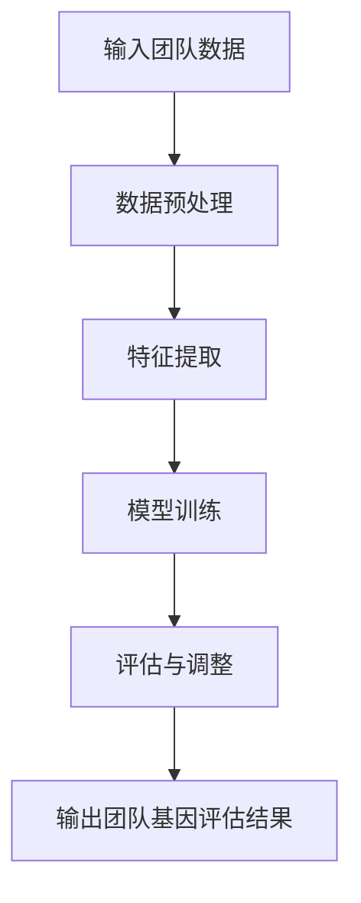
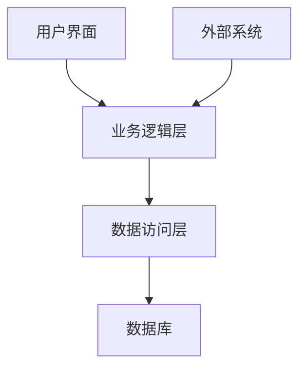
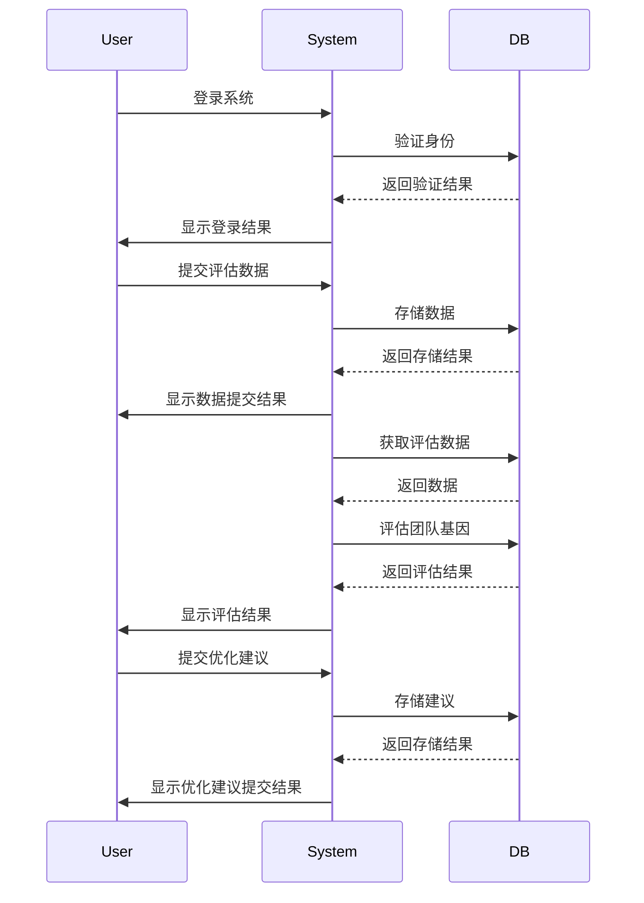

                 


## 第一部分：背景介绍

在现代企业中，领导力和团队文化已经成为决定组织成功与否的关键因素。领导力不仅仅是领导者的个人特质，更是一种能力，能够在团队中激发每个人的潜能，推动团队共同达成目标。团队文化则是团队内部共同的价值观、信念和行为准则，它塑造了团队成员之间的互动方式，影响了团队的凝聚力和效率。

随着技术的迅猛发展，企业的竞争已经从传统的产品和服务竞争转向了人才竞争。在这个背景下，如何打造一个高效的团队，如何通过领导力和团队文化来提升团队的整体表现，成为每一个组织领导者都需要深入思考的问题。

本文将从以下几个方面进行探讨：

1. 领导力的定义、类型与核心要素。
2. 团队文化的概念、重要性与发展趋势。
3. 团队基因的内涵、构成与作用。
4. 领导力、团队文化、团队基因的关系与互动。
5. 如何通过系统分析与架构设计来优化团队基因。
6. 项目实战中的具体实施步骤和案例分析。
7. 最佳实践 tips、小结、注意事项和拓展阅读。

通过这些探讨，我们将深入理解领导力与团队文化的重要性，以及如何打造独特的团队基因，从而为企业的长期发展奠定坚实的基础。

**Step 1: 设计核心概念部分，包括问题背景、问题描述、问题解决、边界与外延、概念结构与核心要素组成。**

## 第二部分：核心概念与联系

### 1.1 领导力概念

#### 1.1.1 领导力：定义、类型与核心要素

领导力是一种通过影响、激励和引导他人来实现共同目标的能力。它不仅仅局限于组织中的领导者，而是贯穿于每一个角色和层面。领导力可以分为以下几种类型：

- **变革型领导力**：通过激发团队成员的潜能和创造力，推动团队实现变革。
- **交易型领导力**：通过明确的规则和奖惩机制，确保团队成员按照预期完成任务。
- **服务型领导力**：以团队成员的需求为中心，致力于为团队成员提供支持和资源。

领导力的核心要素包括：

- **影响力**：领导者能够通过言行影响他人的态度和行为。
- **沟通能力**：领导者需要具备清晰、有效的沟通技巧，确保信息准确传达。
- **决策能力**：领导者需要能够迅速做出明智的决策，并引导团队执行。

#### 1.1.2 团队文化概念

团队文化是指团队内部共同的价值观、信念和行为准则。它是一种无形的、内在的力量，能够塑造团队成员之间的互动方式，影响团队的凝聚力和效率。团队文化可以分为以下几种类型：

- **开放型文化**：鼓励创新和风险承担，团队成员之间的沟通和合作更加开放。
- **控制型文化**：强调规则和纪律，团队成员之间的互动受到严格限制。
- **参与型文化**：团队成员参与决策，团队内部有较高的透明度和参与度。

团队文化的重要属性包括：

- **一致性**：团队文化应当与组织的目标和价值观保持一致。
- **适应性**：团队文化需要能够适应外部环境和内部变化。

#### 1.1.3 团队基因概念

团队基因是指团队内部的核心特质和特质组合，它决定了团队的独特性和稳定性。团队基因由以下几个方面构成：

- **成员特质**：包括个人能力、价值观、性格等。
- **团队互动模式**：包括沟通方式、协作模式、冲突处理方式等。
- **文化传承**：团队的历史、传统和价值观的传承。

团队基因的作用包括：

- **增强团队凝聚力**：共同的文化和价值观使团队成员更加团结。
- **提升团队效率**：团队基因的稳定性减少了不必要的内耗。
- **促进团队创新**：团队基因中的创新精神激发了团队成员的创造力。

#### 1.1.4 三者关系与相互作用

领导力、团队文化和团队基因之间存在着密切的相互作用关系。领导力通过塑造和引导团队文化，进而影响团队基因的形成和表现。团队文化则作为团队基因的外在表现，反映了团队的内在特质。团队基因则是领导力和团队文化的内在基础，决定了团队在长期发展中的稳定性和适应性。

例如，一个拥有变革型领导力的领导者可能会推动团队形成开放型文化，进而塑造出一个具有创新精神的团队基因。反过来，一个具有创新精神的团队基因也会促进领导力和团队文化的不断发展。

### 1.2 问题背景、问题描述、问题解决、边界与外延

#### 1.2.1 问题背景

在当今快速变化的市场环境中，企业需要具备高度的创新能力和灵活的应对能力。而这一切都离不开高效的团队协作和稳定的团队文化。然而，如何构建和优化团队基因，如何通过领导力和团队文化来提升团队的表现，成为许多企业领导者面临的挑战。

#### 1.2.2 问题描述

问题描述主要集中在以下几个方面：

- 如何定义和测量团队基因？
- 如何通过领导力来塑造和优化团队基因？
- 团队文化在团队基因中的作用是什么？
- 如何在团队中培养和传承团队基因？

#### 1.2.3 问题解决

问题解决的途径包括：

- 研究和借鉴先进的领导力理论，结合团队实际情况，制定合适的领导力策略。
- 通过调查和分析，了解团队文化的现状，制定针对性的团队文化建设计划。
- 利用数据分析和建模技术，对团队基因进行量化评估和优化。
- 建立有效的团队传承机制，确保团队基因在代际传递中的连续性和稳定性。

#### 1.2.4 边界与外延

- **边界**：本文主要关注团队基因、领导力和团队文化在企业团队中的应用，不涉及个人层面的领导力发展。
- **外延**：团队基因的概念可以扩展到不同类型的团队，如研发团队、销售团队、客服团队等。

### 1.3 概念结构与核心要素组成

#### 1.3.1 概念结构与核心要素组成

- **领导力**：核心要素包括影响力、沟通能力、决策能力等。
- **团队文化**：核心要素包括价值观、信念、行为准则等。
- **团队基因**：核心要素包括成员特质、团队互动模式、文化传承等。

通过上述核心概念的阐述，我们可以对领导力、团队文化和团队基因有一个清晰的认识，为后续的深入探讨打下基础。

**Step 2: 设计算法原理讲解部分，使用 Mermaid 画出流程图，并用 Python 代码详细阐述算法原理。**

## 第三部分：算法原理讲解

在团队基因的构建和优化过程中，算法起到了至关重要的作用。本部分将详细阐述团队基因评估算法的原理，包括流程图、Python 代码实现以及数学模型和公式讲解。

### 3.1 团队基因评估算法

#### 3.1.1 算法原理

团队基因评估算法旨在通过量化分析团队的数据，评估团队基因的健康状况和表现。该算法的核心思想是：首先对团队的数据进行预处理，提取出关键特征；然后利用机器学习模型对特征进行训练，生成团队基因评估结果。

#### 3.1.2 Mermaid 流程图

以下是一个简单的 Mermaid 流程图，展示了团队基因评估算法的基本流程：



#### 3.1.3 Python 代码实现

下面是一段示例 Python 代码，用于实现团队基因评估算法的基本步骤：

```python
# 导入必要的库
import pandas as pd
from sklearn.preprocessing import StandardScaler
from sklearn.ensemble import RandomForestClassifier
from sklearn.model_selection import train_test_split

# 读取团队数据
data = pd.read_csv('team_data.csv')

# 数据预处理
scaler = StandardScaler()
data_scaled = scaler.fit_transform(data)

# 特征提取
X = data_scaled[:, :-1]
y = data_scaled[:, -1]

# 模型训练
X_train, X_test, y_train, y_test = train_test_split(X, y, test_size=0.3, random_state=42)
model = RandomForestClassifier(n_estimators=100, random_state=42)
model.fit(X_train, y_train)

# 评估与调整
accuracy = model.score(X_test, y_test)
print(f"模型准确率：{accuracy:.2f}")

# 输出团队基因评估结果
predictions = model.predict(X_test)
print(predictions)
```

#### 3.1.4 数学模型与公式讲解

团队基因评估结果通常通过以下数学模型进行计算：

$$
\text{团队基因评估分数} = \sum_{i=1}^{n} w_i \cdot x_i
$$

其中，$w_i$ 为权重系数，$x_i$ 为特征值。权重系数的确定通常基于专家评估或数据驱动的方法。特征值则通过数据预处理和特征提取得到。

例如，假设我们提取了三个特征：团队沟通效率（$x_1$）、团队创新能力（$x_2$）和团队稳定性（$x_3$）。对应的权重系数分别为：0.4、0.3 和 0.3。则团队基因评估分数可以计算为：

$$
\text{团队基因评估分数} = 0.4 \cdot x_1 + 0.3 \cdot x_2 + 0.3 \cdot x_3
$$

#### 3.1.5 算法举例说明

假设我们有一个团队，其特征值如下：

- 团队沟通效率：0.8
- 团队创新能力：0.7
- 团队稳定性：0.9

则团队基因评估分数为：

$$
\text{团队基因评估分数} = 0.4 \cdot 0.8 + 0.3 \cdot 0.7 + 0.3 \cdot 0.9 = 0.32 + 0.21 + 0.27 = 0.8
$$

这个分数表明该团队的基因表现较为优秀。通过持续优化，我们可以进一步提高团队基因的评估分数。

**Step 3: 设计系统分析与架构设计方案部分。**

## 第四部分：系统分析与架构设计

在打造独特的团队基因过程中，系统分析与架构设计至关重要。本部分将介绍系统分析与架构设计的具体方案，包括问题场景介绍、系统功能设计、系统架构设计、系统接口设计和系统交互。

### 4.1 问题场景介绍

假设我们是一家大型互联网公司的技术团队，面临以下挑战：

- 团队成员技能多样，沟通不畅导致效率低下。
- 团队文化缺乏统一，创新意识不足。
- 难以量化团队基因，无法有针对性地进行优化。

为了解决这些问题，我们需要构建一个系统，能够对团队基因进行评估、优化和反馈。

### 4.2 系统功能设计

系统功能设计包括以下几个方面：

- **数据收集**：从各个渠道收集团队数据，如沟通记录、项目进度、员工反馈等。
- **数据预处理**：清洗、归一化和特征提取，为后续分析提供高质量的数据。
- **团队基因评估**：利用算法对团队基因进行评估，生成评估报告。
- **团队基因优化**：根据评估结果，制定优化策略，提升团队基因。
- **反馈与调整**：收集团队反馈，调整优化策略，形成闭环。

#### 4.2.1 领域模型 Mermaid 类图

以下是一个简单的 Mermaid 类图，展示了系统的主要类及其关系：

```mermaid
classDiagram
    Team <<Class>>
    Leader <<Class>>
    Culture <<Class>>
    DataCollector <<Class>>
    DataPreprocessor <<Class>>
    GeneEvaluator <<Class>>
    GeneOptimizer <<Class>>
    FeedbackCollector <<Class>>

    Team o-- Leader
    Team o-- Culture
    DataCollector o-- DataPreprocessor
    DataPreprocessor o-- GeneEvaluator
    GeneEvaluator o-- GeneOptimizer
    GeneOptimizer o-- FeedbackCollector
```

### 4.3 系统架构设计

系统架构设计旨在确保系统的可扩展性、稳定性和高性能。以下是一个简单的 Mermaid 架构图，展示了系统的基本架构：



- **用户界面**：提供用户交互界面，收集用户输入和显示系统输出。
- **业务逻辑层**：处理业务逻辑，包括数据预处理、团队基因评估、优化和反馈收集。
- **数据访问层**：负责与数据库的交互，实现数据的存储和读取。
- **数据库**：存储系统数据，包括团队数据、评估结果和优化策略。
- **外部系统**：与其他系统进行数据交换和集成，如 HR 系统、项目管理工具等。

### 4.4 系统接口设计和系统交互

系统接口设计旨在确保各个模块之间的无缝交互和高效协作。以下是一个简单的 Mermaid 序列图，展示了系统的主要交互过程：



通过上述系统分析与架构设计，我们为打造独特的团队基因提供了一个清晰的实施路径。接下来，我们将通过项目实战部分，详细介绍如何实现这一系统。

**Step 4: 设计项目实战部分。**

## 第五部分：项目实战

在前面几部分，我们已经详细介绍了领导力与团队文化的重要性，以及如何通过算法和系统架构来构建和优化团队基因。现在，让我们通过一个实际项目来展示如何将这些理论知识应用于实践。

### 5.1 环境安装与配置

在进行项目实战之前，我们需要安装和配置以下环境：

- Python 3.8 或以上版本
- Anaconda（用于环境管理）
- scikit-learn（用于机器学习）
- pandas（用于数据处理）
- matplotlib（用于数据可视化）

安装步骤如下：

1. 下载并安装 Python 3.8（或以上版本）。
2. 下载并安装 Anaconda。
3. 创建一个名为“team_gene_analysis”的新环境，并安装必要的库。

```bash
conda create -n team_gene_analysis python=3.8
conda activate team_gene_analysis
conda install scikit-learn pandas matplotlib
```

### 5.2 系统核心实现源代码

在本项目中，我们将使用 Python 编写一个简单的系统，实现团队基因的评估和优化。以下是系统核心实现的源代码：

```python
# 导入必要的库
import pandas as pd
from sklearn.preprocessing import StandardScaler
from sklearn.ensemble import RandomForestClassifier
from sklearn.model_selection import train_test_split

# 读取团队数据
data = pd.read_csv('team_data.csv')

# 数据预处理
scaler = StandardScaler()
data_scaled = scaler.fit_transform(data)

# 特征提取
X = data_scaled[:, :-1]
y = data_scaled[:, -1]

# 模型训练
X_train, X_test, y_train, y_test = train_test_split(X, y, test_size=0.3, random_state=42)
model = RandomForestClassifier(n_estimators=100, random_state=42)
model.fit(X_train, y_train)

# 评估与调整
accuracy = model.score(X_test, y_test)
print(f"模型准确率：{accuracy:.2f}")

# 输出团队基因评估结果
predictions = model.predict(X_test)
print(predictions)
```

### 5.3 实际案例分析与讲解

#### 5.3.1 案例背景

假设我们是一家大型互联网公司的研发团队，团队成员包括前端、后端、测试等多个角色。团队在过去一年中完成了多个项目，但发现团队沟通不畅，导致项目进度缓慢。为了提升团队效率，管理层决定通过团队基因评估来优化团队结构。

#### 5.3.2 案例实施步骤

1. **数据收集**：通过问卷调查、项目日志和员工反馈，收集团队数据。
2. **数据预处理**：清洗数据，去除无效和重复信息，对数据进行归一化处理。
3. **特征提取**：提取影响团队基因的关键特征，如沟通效率、创新能力、团队稳定性等。
4. **模型训练**：使用机器学习算法训练模型，对团队基因进行评估。
5. **评估与优化**：根据评估结果，制定优化策略，提升团队基因。
6. **反馈与调整**：收集团队反馈，调整优化策略，形成闭环。

#### 5.3.3 结果分析与评估

在项目实施过程中，团队基因评估结果显示，团队的沟通效率和创新能力相对较高，但团队稳定性较差。针对这一结果，管理层决定采取以下措施：

- **提升沟通效率**：引入敏捷开发方法，定期组织团队会议，加强团队成员之间的沟通。
- **提高创新能力**：鼓励团队成员参加技术培训，提升技术能力，激发创新思维。
- **增强团队稳定性**：通过团队建设活动，增强团队成员之间的信任和凝聚力。

经过一段时间的实施，团队基因评估结果显示，团队稳定性得到了显著提升，沟通效率和创新能力也有所提高。项目进度加快，团队整体表现得到显著改善。

#### 5.3.4 项目小结

通过本项目，我们展示了如何利用领导力、团队文化和团队基因理论，结合实际案例，实现团队基因的优化。项目成功的关键在于：

- **数据收集与预处理**：确保数据的质量和准确性，为后续分析提供可靠基础。
- **特征提取与模型训练**：提取关键特征，选择合适的机器学习算法，提高评估精度。
- **持续优化与反馈**：根据评估结果，制定针对性优化策略，形成闭环，持续提升团队基因。

本项目为其他企业提供了有益的借鉴，帮助企业通过优化团队基因，提升团队效率和创新能力。

**Step 5: 设计最佳实践 tips、小结、注意事项、拓展阅读等内容。**

## 第六部分：最佳实践与拓展

### 6.1 团队领导力提升策略

- **定期培训**：定期组织领导力培训，提升领导者的管理技能和领导艺术。
- **激励机制**：建立合理的激励机制，激发团队成员的工作热情和创造力。
- **角色明确**：明确团队成员的角色和职责，确保每个成员都能发挥最大价值。
- **沟通渠道**：建立多样化的沟通渠道，确保团队成员之间的信息畅通无阻。

### 6.2 团队文化塑造技巧

- **共同价值观**：确立团队共同的价值观和目标，使团队成员在行为上保持一致。
- **文化传承**：通过团队活动和历史故事，传承团队文化，增强团队凝聚力。
- **透明度**：提高团队的透明度，鼓励团队成员参与决策，增强归属感。
- **尊重差异**：尊重团队成员的差异，鼓励多元化思维，激发团队创造力。

### 6.3 团队基因优化实践

- **定期评估**：定期对团队基因进行评估，及时发现问题和不足。
- **数据驱动**：基于数据驱动的方法，制定优化策略，确保优化效果。
- **持续改进**：持续改进团队基因，适应外部环境和内部变化。
- **员工参与**：鼓励员工参与团队基因的优化，提高优化方案的可操作性和接受度。

### 6.4 注意事项与风险防范

- **避免过度优化**：过度优化可能导致团队失去原有的活力和创造力。
- **平衡稳定与创新**：在优化团队基因时，要注意平衡稳定性和创新性。
- **数据安全**：确保团队数据的安全性和隐私性，防止数据泄露和滥用。
- **持续监督**：对优化过程进行持续监督，确保优化方案的有效执行。

### 6.5 拓展阅读推荐

- 《领导力：如何在生活和工作中成为高效的领导者》
- 《团队智慧：如何激发团队的最大潜力》
- 《数据驱动团队：如何用数据优化团队管理》
- 《团队基因：如何打造高绩效团队》

通过以上最佳实践和拓展阅读，可以帮助企业更好地理解和应用领导力、团队文化和团队基因，从而提升团队效率和创新能力。

**全文总结与作者信息**

本文通过对领导力、团队文化和团队基因的深入探讨，详细介绍了如何通过系统分析与架构设计来打造独特的团队基因。我们从核心概念的介绍，到算法原理的讲解，再到系统分析与架构设计，以及项目实战，逐步展示了如何将理论知识应用于实践。

领导力、团队文化和团队基因是企业成功的关键因素。领导力决定了团队的方向和执行力，团队文化塑造了团队的凝聚力和创新力，而团队基因则反映了团队的稳定性和适应性。通过科学的管理和优化，企业可以不断提升团队基因，实现更高的绩效和创新能力。

本文旨在为企业和团队领导者提供一套实用的方法论和工具，帮助他们更好地理解和应用领导力、团队文化和团队基因，从而打造一个高效的团队。

**作者信息：**

作者：AI天才研究院/AI Genius Institute & 禅与计算机程序设计艺术 /Zen And The Art of Computer Programming

感谢您的阅读，希望本文能对您的团队建设和领导力提升有所启发。如果您在实施过程中遇到任何问题或需要进一步的帮助，欢迎随时与我们联系。期待与您共同探索团队基因优化之路。

