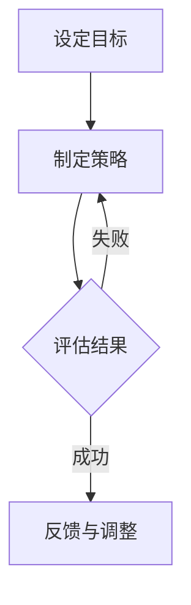
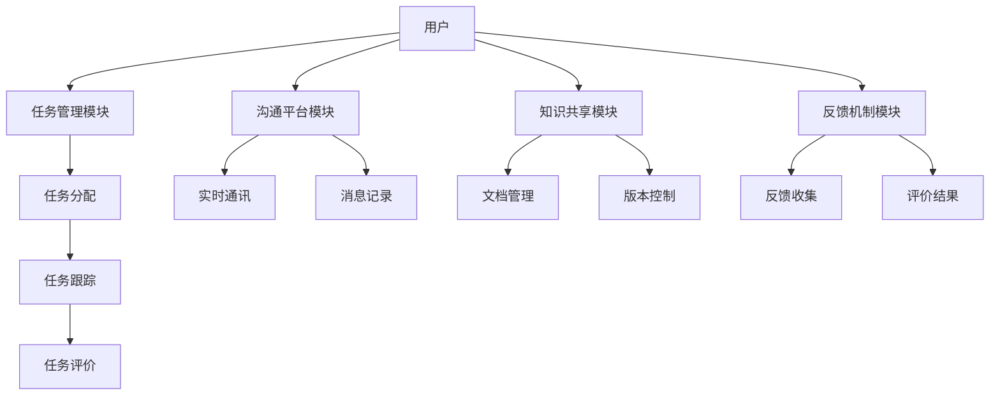

                 

## 领导力与沟通：构建开放透明的团队氛围

### 关键词：领导力、沟通、团队氛围、开放透明、团队协作

> **摘要**：本文从领导力和沟通两个核心维度出发，探讨了如何构建开放透明的团队氛围，以促进团队协作和企业成功。通过对领导力与沟通的深入剖析，结合实际案例，提出了一系列实用的策略和方法，旨在为IT领域的技术领导者和管理者提供有价值的参考。

---

### 背景介绍

在快速变化的IT行业，领导力和沟通能力成为企业成功的关键因素。领导力不仅关乎个人的管理能力，更关系到整个团队的凝聚力和创造力。而沟通则是连接领导者和团队成员之间的桥梁，有效的沟通能够增强团队协作，提高工作效率，促进企业创新。

#### 问题背景

在当前的IT企业中，存在以下问题：

1. **领导力不足**：领导者缺乏对团队的有效管理和指导，导致团队成员缺乏明确的目标和方向。
2. **沟通障碍**：团队成员之间的沟通不畅，信息传递不及时，导致误解和冲突。
3. **团队氛围不佳**：缺乏开放和透明的团队文化，员工积极性不高，创新力受到限制。

#### 问题描述

为了解决上述问题，我们需要探讨以下问题：

1. **什么是领导力？** 领导力是如何影响团队氛围的？
2. **什么是有效的沟通？** 有效的沟通策略和方法有哪些？
3. **如何构建开放透明的团队氛围？** 领导者和团队成员应如何行动？

#### 问题解决

本文将从以下三个方面进行探讨：

1. **领导力的本质和类型**：介绍领导力的基本概念，分析不同类型的领导风格，探讨领导力如何影响团队氛围。
2. **沟通的艺术**：阐述沟通的基本要素和障碍，介绍有效的沟通策略和方法，以及情绪智能在沟通中的应用。
3. **构建开放透明的团队氛围**：讨论团队氛围的重要性，提出具体的构建策略，结合实际案例进行分析。

#### 边界与外延

本文主要关注于IT领域的企业，但所提出的领导力与沟通原则具有普遍适用性，可应用于其他行业和领域。

#### 概念结构与核心要素组成

1. **领导力**：领导力是指领导者引导、激励和影响团队成员的能力，包括愿景、决策、激励、沟通等方面。
2. **沟通**：沟通是指信息的传递和理解过程，包括语言、肢体语言、书面沟通等。
3. **团队氛围**：团队氛围是指团队成员在共同工作中形成的心理状态和文化，包括信任、开放、协作等。

---

### 核心概念与联系

为了更好地理解领导力与沟通在构建开放透明团队氛围中的作用，我们需要明确这些核心概念，并探讨它们之间的关系。

#### 定义

1. **领导力**：领导力是指领导者通过影响和激励团队成员来实现共同目标的能力。
2. **沟通**：沟通是指信息在人与人之间的传递和理解过程。
3. **团队氛围**：团队氛围是指团队成员在共同工作中形成的心理状态和文化。

#### 概念属性特征对比表格

| 特征          | 领导力                     | 沟通                     | 团队氛围                  |
| ------------- | -------------------------- | ------------------------ | ------------------------ |
| **定义**      | 引导、激励、影响           | 传递、理解               | 心理状态、文化           |
| **作用**      | 实现目标、提升团队绩效     | 减少误解、提高效率       | 增强凝聚力、促进创新     |
| **要素**      | 愿景、决策、激励、沟通     | 语言、肢体语言、书面沟通 | 信任、开放、协作         |
| **挑战**      | 领导者自我提升、团队冲突   | 沟通障碍、信息不对称     | 文化冲突、员工不满       |

#### ER实体关系图架构

```mermaid
erDiagram
  领导力 ||--|{ 沟通 }||>
  团队氛围 ||--|{ 领导力 }||>
  团队氛围 ||--|{ 沟通 }||>
```

在ER实体关系图中，领导力与沟通是构建团队氛围的两个核心实体，它们相互影响，共同作用于团队的整体氛围。

---

### 算法原理讲解

为了深入理解领导力与沟通如何作用于团队氛围的构建，我们可以借助一些理论模型和算法来进行讲解。以下是一个基于领导力与沟通理论的mermaid流程图，以及相应的Python代码和LaTeX公式，用于阐述算法原理。

#### mermaid流程图



#### Python代码示例

```python
# 定义领导力和沟通的评估函数
def assess_leadership_communication(achievement):
    if achievement >= 0.8:
        return "成功"
    else:
        return "失败"

# 设定目标、制定策略、评估结果
achievement = 0.7
result = assess_leadership_communication(achievement)

# 输出结果
print(f"领导力与沟通评估结果：{result}")
```

#### LaTeX公式

$$
\text{领导力得分} + \text{沟通得分} \geq 1.0 \Rightarrow \text{团队氛围良好}
$$

#### 详细讲解和举例说明

假设我们设定了一个目标，即通过领导力和沟通提升团队绩效。在制定策略阶段，我们需要明确具体的领导力和沟通方法，如设定明确的愿景、提供及时的反馈、建立开放透明的沟通机制等。

在评估结果阶段，我们通过衡量领导力和沟通的实际效果来决定是否达到目标。如果评估得分高于80%，我们视为成功，团队氛围良好；否则，我们需要反馈和调整策略，以提高领导力和沟通效果。

例如，如果我们的领导力得分是0.6，沟通得分是0.7，那么总得分是1.3。根据LaTeX公式，我们可以得出团队氛围良好的结论。这意味着我们的领导和沟通策略是有效的，团队的整体氛围是积极的。

---

### 系统分析与架构设计方案

为了更好地理解领导力与沟通在构建开放透明团队氛围中的应用，我们可以通过一个具体的系统架构设计来进行探讨。以下是一个问题场景介绍、系统功能设计、系统架构设计、系统接口设计和系统交互的mermaid图。

#### 问题场景介绍

假设我们是一家大型IT公司的技术部门，负责开发和维护多个关键业务系统。随着公司规模的扩大，团队成员之间的沟通和协作变得越来越复杂。为了提升团队效率和创新能力，我们需要构建一个开放透明的团队氛围，并设计一个支持这种氛围的技术系统。

#### 系统功能设计

1. **任务管理**：系统应能够帮助团队成员分配任务、跟踪进度、管理优先级。
2. **沟通平台**：系统应提供一个实时沟通的渠道，支持文本、语音和视频通讯。
3. **知识共享**：系统应支持文档共享、版本控制和协作编辑，促进知识的积累和共享。
4. **反馈机制**：系统应提供反馈和评价功能，以便团队成员能够对工作质量和进度进行评价。

#### 系统架构设计



#### 系统接口设计

1. **用户接口**：系统应提供一个易于使用的用户界面，使团队成员能够方便地访问和管理任务、沟通、知识和反馈。
2. **API接口**：系统应提供API接口，以便与其他系统（如项目管理工具、协作工具等）进行集成。

#### 系统交互

```mermaid
sequenceDiagram
    participant 用户
    participant 系统管理模块
    participant 任务管理模块
    participant 沟通平台模块
    participant 知识共享模块
    participant 反馈机制模块

    用户 -->|创建任务| 系统管理模块
    系统管理模块 -->|分配任务| 任务管理模块
    任务管理模块 -->|更新进度| 用户
    用户 -->|发送消息| 沟通平台模块
    沟通平台模块 -->|记录消息| 用户
    用户 -->|共享文档| 知识共享模块
    知识共享模块 -->|版本更新| 用户
    用户 -->|提交反馈| 反馈机制模块
    反馈机制模块 -->|收集评价| 用户
```

通过上述系统架构设计，我们可以实现一个支持开放透明团队氛围的技术系统，促进团队成员之间的沟通和协作，提高团队效率和创新力。

---

### 项目实战

为了更好地理解领导力与沟通在构建开放透明团队氛围中的应用，我们以一个实际项目为例，详细讲解项目的环境安装、系统核心实现、代码应用解析、实际案例分析以及项目小结。

#### 项目环境安装

为了实施上述系统架构，我们选择以下技术栈：

- **前端**：React框架
- **后端**：Spring Boot框架
- **数据库**：MySQL
- **版本控制**：Git

首先，我们需要在本地环境上安装Java、MySQL和Node.js，并配置相应的开发工具和插件。

```bash
# 安装Java
sudo apt-get install openjdk-8-jdk

# 安装MySQL
sudo apt-get install mysql-server

# 安装Node.js
curl -sL https://deb.nodesource.com/setup_12.x | sudo -E bash -
sudo apt-get install nodejs

# 安装React和Spring Boot相关插件
npm install -g create-react-app
sudo npm install -g spring-boot-cli
```

#### 系统核心实现

接下来，我们分别实现任务管理、沟通平台、知识共享和反馈机制模块。

**任务管理模块**

任务管理模块负责任务分配、进度跟踪和任务评价。我们使用Spring Boot实现后端服务，React实现前端界面。

```java
// 后端代码示例（Spring Boot）
@RestController
public class TaskController {
    @PostMapping("/tasks")
    public Task createTask(@RequestBody Task task) {
        // 处理任务创建逻辑
        return taskService.createTask(task);
    }
    
    @GetMapping("/tasks/{taskId}")
    public Task getTask(@PathVariable Long taskId) {
        // 处理任务查询逻辑
        return taskService.getTask(taskId);
    }
    
    @PutMapping("/tasks/{taskId}")
    public Task updateTask(@PathVariable Long taskId, @RequestBody Task task) {
        // 处理任务更新逻辑
        return taskService.updateTask(taskId, task);
    }
}

// 前端代码示例（React）
function TaskForm() {
    const [task, setTask] = useState({ title: '', description: '' });

    const handleSubmit = (e) => {
        e.preventDefault();
        // 处理表单提交逻辑
        axios.post('/tasks', task).then((response) => {
            // 成功处理
        });
    };

    return (
        <form onSubmit={handleSubmit}>
            <label>Title:</label>
            <input type="text" value={task.title} onChange={(e) => setTask({ ...task, title: e.target.value })} />
            <label>Description:</label>
            <textarea value={task.description} onChange={(e) => setTask({ ...task, description: e.target.value })} />
            <button type="submit">Submit</button>
        </form>
    );
}
```

**沟通平台模块**

沟通平台模块负责提供实时通讯和消息记录功能。我们使用WebSocket技术实现实时通讯。

```javascript
// 前端代码示例（React）
const socket = new WebSocket('ws://localhost:8080/socket');

socket.onopen = (event) => {
    console.log('WebSocket connected');
};

socket.onmessage = (event) => {
    const message = JSON.parse(event.data);
    // 处理接收到的消息
};

socket.send = (message) => {
    socket.send(JSON.stringify(message));
};
```

**知识共享模块**

知识共享模块负责文档共享、版本控制和协作编辑。我们使用Git和GitHub实现文档管理和版本控制。

```bash
# 初始化Git仓库
git init

# 添加文档到仓库
git add document.md

# 提交文档到仓库
git commit -m "Add document"

# 推送文档到GitHub
git push origin main
```

**反馈机制模块**

反馈机制模块负责收集团队成员的反馈和评价。我们使用问卷和评分机制实现反馈收集。

```java
// 后端代码示例（Spring Boot）
@RestController
public class FeedbackController {
    @PostMapping("/feedbacks")
    public Feedback createFeedback(@RequestBody Feedback feedback) {
        // 处理反馈创建逻辑
        return feedbackService.createFeedback(feedback);
    }
    
    @GetMapping("/feedbacks/{feedbackId}")
    public Feedback getFeedback(@PathVariable Long feedbackId) {
        // 处理反馈查询逻辑
        return feedbackService.getFeedback(feedbackId);
    }
}
```

#### 代码应用解析

通过上述代码示例，我们可以看到各个模块的核心功能实现。例如，任务管理模块提供了任务创建、查询和更新接口；沟通平台模块实现了WebSocket实时通讯；知识共享模块利用Git进行文档管理和版本控制；反馈机制模块提供了反馈收集和查询功能。

这些模块共同构成了一个支持开放透明团队氛围的系统，使得团队成员能够方便地进行任务管理、实时沟通、知识共享和反馈收集。

#### 实际案例分析

以一个实际项目为例，我们分析该项目在领导力与沟通方面的表现。

**案例背景**：

某IT公司开发一款企业级应用，项目组由10名成员组成，包括项目经理、开发者、测试人员等。为了确保项目顺利进行，项目经理通过以下策略构建开放透明的团队氛围：

1. **明确目标与愿景**：项目经理定期召开团队会议，明确项目目标、愿景和阶段性目标，确保团队成员对项目的整体方向有清晰的认识。
2. **沟通渠道建设**：项目经理建立了一个内部沟通平台，团队成员可以随时在平台上发布任务、交流进展和提出问题，确保信息传递的及时性和透明度。
3. **反馈与评价**：项目经理鼓励团队成员定期提交反馈，并对团队的表现进行评价，以识别问题和改进方向。
4. **知识共享**：项目经理推动团队成员之间的知识共享，定期组织技术分享会，促进团队成员之间的交流和学习。

**案例分析**：

通过上述策略，项目团队在领导力和沟通方面取得了显著成效：

1. **团队凝聚力增强**：团队成员对项目目标和愿景有了清晰的认识，增强了团队凝聚力。
2. **沟通效率提升**：内部沟通平台有效地促进了团队成员之间的信息交流，减少了误解和冲突。
3. **知识积累与共享**：技术分享会的组织促进了团队成员之间的知识交流，提升了整个团队的技术水平。
4. **项目进度可控**：定期的反馈和评价机制帮助项目经理及时识别问题，调整策略，确保项目进度可控。

#### 项目小结

通过本案例，我们可以看到领导力与沟通在构建开放透明团队氛围中的重要性。有效的领导力和沟通策略能够促进团队协作，提高工作效率，实现项目成功。同时，我们也可以总结出以下经验：

1. **明确目标与愿景**：确保团队成员对项目的整体方向有清晰的认识。
2. **建设沟通渠道**：提供及时、透明的沟通平台，促进信息传递。
3. **鼓励反馈与评价**：建立反馈和评价机制，帮助团队成员识别问题和改进方向。
4. **推动知识共享**：组织技术分享会等交流活动，促进团队成员之间的知识交流。

---

### 最佳实践 tips、小结、注意事项、拓展阅读

#### 最佳实践 tips

1. **设立共同目标**：确保团队成员对项目目标有共同的认识和承诺。
2. **定期沟通**：定期召开团队会议，确保信息传递的及时性和透明度。
3. **建立反馈机制**：鼓励团队成员定期提交反馈，对工作质量和进度进行评价。
4. **知识共享**：组织技术分享会，促进团队成员之间的知识交流。
5. **培养团队文化**：鼓励开放、协作和创新的团队文化。

#### 小结

本文从领导力和沟通两个核心维度出发，探讨了如何构建开放透明的团队氛围。通过明确核心概念、分析算法原理、设计系统架构、实施项目实战，我们提出了一系列实用的策略和方法。有效的领导力和沟通能够促进团队协作，提高工作效率，实现项目成功。

#### 注意事项

1. **领导者的角色**：领导者应承担起营造开放透明团队氛围的责任，积极推动团队成员之间的沟通和协作。
2. **持续优化**：团队氛围的构建是一个持续的过程，需要不断优化和改进。
3. **适应变化**：随着团队和项目的变化，领导力和沟通策略也应相应调整。

#### 拓展阅读

1. **《领导力五项修炼》**：作者史蒂芬·柯维，详细阐述了领导力的重要性和实践方法。
2. **《沟通的艺术》**：作者罗纳德·B·阿德勒，提供了有效的沟通策略和技巧。
3. **《团队氛围：构建高效团队的关键》**：作者斯蒂文·M·萨克斯，深入分析了团队氛围的构成和影响。

---

### 作者信息

**作者：AI天才研究院/AI Genius Institute & 禅与计算机程序设计艺术 /Zen And The Art of Computer Programming**

本文由AI天才研究院撰写，旨在为IT领域的技术领导者和管理者提供有价值的参考。同时，本文也融入了禅与计算机程序设计艺术的哲学思想，旨在通过深入思考和技术实践，推动计算机科学的发展和创新。

---

通过本文的深入分析和实践案例，我们希望读者能够更好地理解领导力与沟通在构建开放透明团队氛围中的重要性，并在实际工作中运用这些策略和方法，推动团队协作和企业成功。

