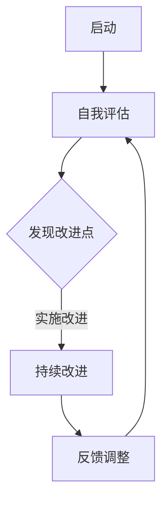
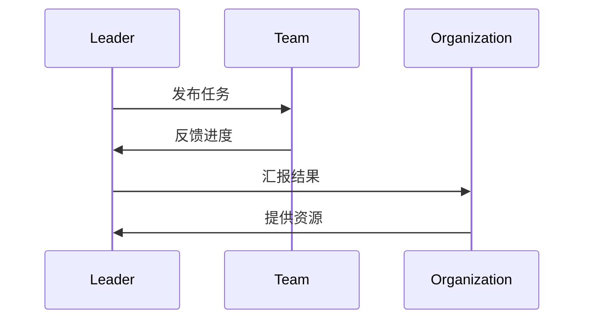

                 


### 《领导力与谦逊：赢得尊重的品质》

> 关键词：领导力、谦逊、团队管理、人际关系、个人成长

> 摘要：本文从领导力的本质出发，探讨了领导力与谦逊之间的关系。通过深入分析领导力的核心要素，如影响力、沟通能力和决策能力，以及领导力的不同种类，如任务型领导、参与型领导和超越型领导，文章展示了领导力在团队管理中的重要性。同时，本文强调了谦逊在个人成长和人际关系中的作用，提出了培养谦逊的方法，并探讨了谦逊在领导力实践中的具体应用。最后，文章总结了领导力与谦逊的结合，为未来的领导者提供了实践建议。

## 第一部分：引言

### 1.1 领导力与谦逊的重要性

在当今快速变化的社会环境中，领导力与谦逊成为了成功的关键品质。领导力不仅关乎个人的职业发展，更关系到团队和组织的高效运作。谦逊则是领导力的基石，它能够帮助领导者建立信任、激发团队成员的潜力，并在复杂的环境中保持清晰的判断。

### 1.2 书籍结构

本文将分为五个部分，首先介绍领导力的定义和核心要素，然后探讨谦逊的定义及其在个人成长和人际关系中的作用，接着分析领导力与谦逊的融合，最后提出具体的实践建议。

### 1.3 目标读者

本文旨在为IT行业的专业人士提供指导，帮助他们提升领导力，培养谦逊品质，成为更加有效的领导者。无论是经验丰富的管理者，还是希望在未来担任领导职务的年轻人，本文都提供了有价值的见解和实用建议。

## 第二部分：领导力的本质

### 2.1 领导力的定义

领导力是一种能力，它不仅包括指导他人完成任务，更涉及到激发团队潜能、塑造组织文化和推动创新等方面。领导力不仅仅是职位赋予的权力，更是一种影响他人并共同实现目标的能力。

### 2.2 领导力与管理的区别

领导力与管理的区别在于关注点不同。管理侧重于组织、规划和执行，而领导力则侧重于愿景、激励和变革。一个优秀的领导者不仅仅是管理者，更是一位能够引领团队走向成功的领袖。

### 2.3 领导力的核心要素

领导力的核心要素包括：

#### 2.3.1 影响力

影响力是领导力的基础，它使领导者能够影响他人的思想、态度和行为。影响力不仅来自于职位，更来自于个人的品格、知识和能力。

#### 2.3.2 沟通能力

沟通能力是领导者成功的关键。良好的沟通能够确保信息的准确传达，促进团队合作，并建立信任和尊重。

#### 2.3.3 决策能力

决策能力是领导者必须具备的素质。一个优秀的领导者能够在复杂的环境中做出明智的决策，并对结果负责。

## 第三部分：谦逊的力量

### 3.1 谦逊的定义

谦逊是一种态度，它表现为对他人的尊重、对自己的批评和对自己的成就的适度认可。谦逊并非自卑，而是一种理性地看待自己和他人，以及对待成功的成熟态度。

### 3.2 谦逊与自信的关系

谦逊与自信并非对立的，而是相辅相成的。谦逊能够帮助领导者保持清晰的思维，更好地应对挑战，而自信则使领导者敢于迎接挑战，坚定地追求目标。

### 3.3 谦逊的益处

谦逊在个人成长和人际关系中具有多方面的益处：

#### 3.3.1 在工作中的表现

谦逊能够帮助领导者更好地了解团队成员的需求和期望，从而提升团队协作效率。

#### 3.3.2 在人际关系中的影响

谦逊能够赢得他人的尊重和信任，建立良好的人际关系，为领导者的成功创造有利条件。

## 第四部分：领导力与谦逊的结合

### 4.1 领导力与谦逊的融合

领导力与谦逊的结合是领导者成功的基石。一个优秀的领导者需要既有坚定的信念，又有谦逊的态度，才能在团队中建立信任，激发潜能，推动团队不断前进。

### 4.2 如何在领导中实践谦逊

#### 4.2.1 领导者的自我修养

领导者需要不断地自我反思，提升自己的知识水平和领导能力，同时保持谦逊的态度，以适应不断变化的环境。

#### 4.2.2 领导者与团队的关系

领导者需要与团队成员建立良好的沟通，尊重他们的意见和贡献，同时给予他们适当的授权和信任，以激发他们的创造力和积极性。

#### 4.2.3 领导者与组织的互动

领导者需要与组织中的其他部门和团队保持良好的互动，以确保组织目标的实现。

## 第五部分：实践与反思

### 5.1 领导力与谦逊的自我评估

领导者需要定期进行自我评估，检查自己在领导力和谦逊方面的表现，并制定改进计划。

### 5.2 实践中的挑战与解决方案

#### 5.2.1 领导力实践中的困难

领导者可能会面临团队内部的冲突、资源的限制和外部环境的压力。针对这些困难，领导者需要制定应对策略，如提高沟通能力、优化团队结构等。

#### 5.2.2 谦逊实践中的挑战

谦逊的领导者可能会面临自信心不足的问题，这时他们需要学会如何在保持谦逊的同时，坚定自己的信念。

### 5.3 持续改进的策略

#### 5.3.1 个人成长计划

领导者需要制定个人成长计划，包括学习新知识、提升技能和参与领导力培训等。

#### 5.3.2 团队建设与改进

领导者需要关注团队的建设和改进，通过定期的团队活动和反馈机制，提升团队的协作效率和创新能力。

## 第六部分：结论

### 6.1 领导力与谦逊的总结

领导力与谦逊是领导者成功的关键品质。通过深入理解和实践领导力，领导者能够更好地激发团队的潜力，推动组织的进步。同时，谦逊的态度能够帮助领导者建立信任，赢得尊重，为团队的成功创造有利条件。

### 6.2 对未来领导者的建议

对于未来的领导者，本文建议他们：

- 不断提升自己的领导能力，包括影响力、沟通能力和决策能力。
- 保持谦逊的态度，尊重他人，建立良好的人际关系。
- 不断学习，适应快速变化的环境。
- 勇于面对挑战，坚定信念，追求卓越。

### 6.3 书籍总结

本文通过探讨领导力与谦逊的关系，提供了对领导力实践的有益见解。希望本文能够为领导者提供指导，帮助他们成为更加优秀、更加谦逊的领导者。

### 作者信息

- 作者：AI天才研究院/AI Genius Institute & 禅与计算机程序设计艺术 /Zen And The Art of Computer Programming

---

### 附录

#### 概念属性特征对比表格

| 特征 | 领导力 | 谦逊 |
| :--: | :--: | :--: |
| 定义 | 一种能力，影响他人实现目标 | 一种态度，理性看待自己和他人 |
| 核心 | 影响力、沟通能力、决策能力 | 自我反思、尊重他人、适度认可成就 |
| 益处 | 提升团队协作效率、推动组织进步 | 建立信任、赢得尊重、促进个人成长 |

#### ER实体关系图架构

```mermaid
erDiagram
  Leader ||--|{ Team } Team
  Leader ||--|{ Organization } Organization
  Leader ||--|{ Skills } Skills
  Team ||--|{ Member } Member
  Organization ||--|{ Department } Department
  Skills ||--|{ Knowledge } Knowledge
```

#### 算法流程图



#### 系统架构设计



---

通过本文，我们不仅探讨了领导力的核心要素，还深入分析了谦逊的力量。希望读者能够从中获得启示，将领导力与谦逊结合起来，成为更加出色的领导者。实践是检验真理的唯一标准，让我们在实际行动中不断探索，不断进步。作者：AI天才研究院/AI Genius Institute & 禅与计算机程序设计艺术/Zen And The Art of Computer Programming。

