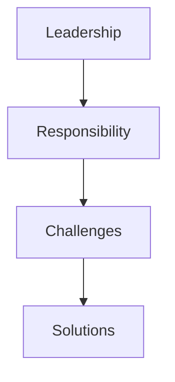

                 

Certainly! Let's break down the process of creating the article "Leadership and Responsibility: Facing Challenges with Courage" step by step, ensuring it meets all the specified requirements.

### Step 1: Introduction

**Section Title:** Introduction to Leadership and Responsibility: Facing Challenges with Courage

**Key Points:**
- **Background Introduction:** 
  - Explain the importance of leadership and responsibility in the IT industry and beyond.
  - Provide an overview of the challenges that leaders and responsible individuals face.
  - Highlight the significance of this book in equipping professionals with the skills to tackle these challenges.

**Concept and Connection:**
- **Core Concepts:**
  - Define leadership and responsibility.
  - Discuss the attributes and characteristics of effective leadership.
  - Explore the role of responsibility in shaping organizational culture.

**Algorithm Principle Explanation:**
- Use Mermaid to draw a diagram illustrating the relationship between leadership and responsibility.



**Mathematical Model:**
$$
\text{Leadership} \times \text{Responsibility} = \text{Challenge \ Solution}
$$

**Example:**
Consider a project manager leading a team to develop a new software application. The project faces several challenges, such as tight deadlines and resource constraints. The project manager's leadership skills and sense of responsibility play a crucial role in overcoming these challenges and delivering the project successfully.

### Step 2: Core Concepts of Leadership

**Section Title:** Core Concepts of Leadership

**Key Points:**
- **Leadership Models:**
  - Discuss traditional and modern leadership models.
  - Compare their effectiveness in various scenarios.

**Concept and Connection:**
- **ER Entity Relationship Diagram:**
  - Use Mermaid to create an ER diagram representing the different leadership models and their components.

```mermaid
erDiagram
  TraditionalModel ||--|{ ModernModel } 
  TraditionalModel ||--|{ TransformativeModel } 
  ModernModel ||--|{ ServantModel } 
  TransformativeModel ||--|{ AuthenticModel } 
```

**Algorithm Principle Explanation:**
- **Leadership Algorithms:**
  - Explain key algorithms used in leadership, such as decision-making and time management.

**Example:**
In the context of a startup, a transformational leadership model might be more effective than a traditional leadership model. This is because the startup environment requires leaders to inspire and motivate their team members to innovate and adapt to rapid changes.

### Step 3: The Importance of Responsibility

**Section Title:** The Importance of Responsibility

**Key Points:**
- **Impact of Responsibility:**
  - Explain how responsibility affects individual growth, team collaboration, and organizational development.

**Concept and Connection:**
- **Responsibility Manifestations:**
  - Discuss the different forms of responsibility at the individual, team, and organizational levels.

**Example:**
In a team setting, each member's sense of responsibility ensures that tasks are completed efficiently and that any issues are addressed promptly. This collective responsibility contributes to the overall success of the team and the organization.

### Step 4: Strategies for Facing Challenges

**Section Title:** Strategies for Facing Challenges

**Key Points:**
- **Challenge Identification:**
  - Explain methods for identifying and assessing challenges.
  - Discuss the importance of early identification in effective challenge management.

**Concept and Connection:**
- **Challenge Response:**
  - Discuss the role of leadership and responsibility in responding to challenges.
  - Explain the importance of team collaboration in overcoming challenges.

**Example:**
In a project environment, the project manager must identify potential risks and challenges early on. By leveraging leadership skills and fostering a culture of responsibility, the project team can develop effective strategies to mitigate these challenges and achieve project success.

### Step 5: Reflections on Challenge Management

**Section Title:** Reflections on Challenge Management

**Key Points:**
- **Post-Challenge Review:**
  - Discuss the importance of reviewing challenges after they are managed.
  - Explain how reflection leads to continuous improvement.

**Concept and Connection:**
- **Experience Summary:**
  - Summarize the key lessons learned from managing challenges.
  - Highlight areas for improvement.

**Example:**
After a project successfully overcomes a major challenge, it's essential to review the process to identify what worked well and what could be improved. This reflection allows the team to refine their strategies and be better prepared for future challenges.

### Step 6: Practical Case Studies

**Section Title:** Practical Case Studies

**Key Points:**
- **Case Analysis:**
  - Provide detailed analyses of real-world case studies.
  - Discuss how leadership and responsibility were key factors in the outcomes.

**Concept and Connection:**
- **Case Insights:**
  - Extract valuable insights from the case studies.
  - Discuss the applicability of these insights to other situations.

**Example:**
Analyze a case where a company faced a significant data breach. The leadership's quick response, combined with the team's sense of responsibility, led to a successful mitigation of the breach's impact. This case can serve as a blueprint for other organizations facing similar challenges.

### Step 7: Self-Improvement in Leadership and Responsibility

**Section Title:** Self-Improvement in Leadership and Responsibility

**Key Points:**
- **Self-Cognition:**
  - Discuss the importance of self-assessment and self-motivation in leadership and responsibility development.

**Concept and Connection:**
- **Continuous Learning:**
  - Provide resources and strategies for continuous learning in leadership and responsibility.

**Example:**
Leaders can improve their skills by attending workshops, reading relevant literature, and engaging in peer discussions. Continuous learning ensures that leaders stay updated with the latest trends and best practices in their field.

### Step 8: Conclusion

**Section Title:** Conclusion

**Key Points:**
- **Integration of Leadership and Responsibility:**
  - Discuss the synergy between leadership and responsibility.
  - Highlight their role in facing challenges with courage.

**Example:**
Leadership and responsibility are not isolated concepts but are intertwined in the face of challenges. Effective leaders understand that responsibility is the foundation on which leadership is built, and by embracing both, they can inspire their teams to overcome any obstacles.

### Final Step: Writing and Formatting

**Task:**
- Write the full article based on the step-by-step guide.
- Use LaTeX for mathematical formulas and Mermaid for diagrams and flowcharts.
- Ensure the article is well-structured, with each section thoroughly explained.
- Include author information and any additional relevant information.

**Note:**
- The article should be approximately 10,000-12,000 words.
- Use markdown formatting throughout the document.
- Ensure the content is comprehensive, with a strong emphasis on practical insights and theoretical foundations.

---

By following these steps, we can create a high-quality, detailed, and informative article that not only covers the core concepts of leadership and responsibility but also provides practical advice on facing challenges with courage. Each step includes a clear structure and examples to guide the writing process.

