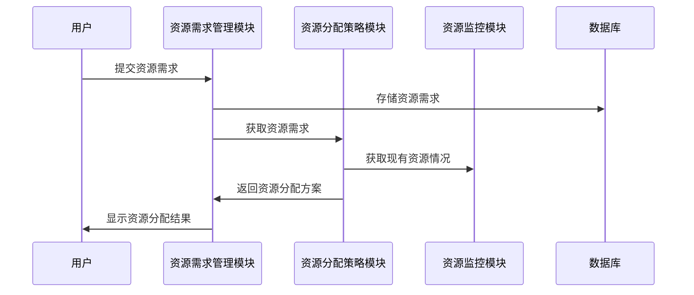

                 

### 领导力与资源整合概述

#### 关键词：领导力、资源整合、资源配置、团队协作

> 摘要：本文旨在探讨领导力与资源整合之间的关系，通过分析领导力的定义与重要性，以及资源整合的概念与意义，揭示领导力在优化资源配置中的作用。文章将从理论与实践两个角度出发，详细阐述领导力与资源整合的相互联系及其在实际中的应用。

### 开篇背景介绍

在当今快速变化和高度竞争的商业环境中，领导力和资源整合成为了企业成功的关键因素。领导力不仅关乎企业内部的管理和运营，还涉及如何调动和利用各种资源，实现企业的长远发展。资源整合则是指在企业内外部之间，对资源进行有效的配置和优化，以提高企业的运营效率和竞争力。

领导力与资源整合之间的关系密不可分。领导力是资源整合的核心驱动力，一个优秀的领导者能够通过其领导能力，有效地引导和激励团队成员，推动资源的优化配置。同时，资源整合的成功也离不开领导力的支持，通过有效的资源整合，企业可以更好地实现其战略目标，提升市场竞争力。

本文将首先对领导力和资源整合的概念进行详细阐述，分析它们的核心概念和联系。接着，我们将探讨领导力在资源整合中的具体作用，通过案例分析，展示领导力在资源整合实践中的应用。最后，我们将结合实际项目，探讨领导力与资源整合的最佳实践，并提供相关的注意事项和拓展阅读。

### 核心概念与联系

#### 1.1 领导力的定义与重要性

领导力是指一种能够激发和引导团队朝着共同目标前进的能力。它不仅包括对团队成员的激励和引导，还包括战略规划、决策制定、沟通协调等多方面的能力。在一个组织中，领导力起着至关重要的作用，它不仅是推动组织发展的关键因素，也是提高团队凝聚力和员工满意度的关键。

**领导力的重要性：**

1. **促进组织发展：** 领导力能够激发团队成员的潜力，推动组织不断创新和进步。一个具备领导力的领导者能够制定清晰的战略规划，引导团队朝着共同的目标前进，从而实现组织的长期发展。

2. **提升团队凝聚力：** 领导力有助于建立信任和合作关系，增强团队的凝聚力和战斗力。一个优秀的领导者能够通过有效的沟通和激励，使团队成员感到被重视和认可，从而提高团队的协作效率。

3. **优化资源配置：** 领导力能够有效地整合组织内外部的资源，提高资源利用效率。通过有效的资源整合，企业可以减少不必要的浪费，降低成本，提高效益。

#### 1.2 资源整合的概念与意义

资源整合是指通过优化资源配置，提高资源利用效率，从而实现组织目标的过程。资源整合不仅包括对企业内部资源的整合，还包括对企业外部资源的整合，如市场资源、社会资源等。在资源有限的条件下，资源整合对于企业的生存和发展具有重要意义。

**资源整合的意义：**

1. **提高竞争力：** 资源整合有助于企业优化产品结构，提高市场竞争力。通过整合资源，企业可以更好地满足市场需求，提高产品质量和服务水平，从而赢得更多的市场份额。

2. **降低成本：** 通过资源整合，企业可以减少不必要的浪费，降低生产成本。例如，通过整合供应链资源，企业可以实现采购成本的降低，通过整合内部资源，可以提高生产效率，降低生产成本。

3. **提高效益：** 资源整合能够提高资源利用效率，增加企业的盈利能力。通过有效的资源整合，企业可以更好地利用各种资源，提高资源的产出，从而提高企业的经济效益。

#### 1.3 领导力与资源整合的关系

领导力与资源整合之间存在着密切的关系。领导力是资源整合的核心驱动力，一个优秀的领导者能够通过其领导能力，有效地引导和激励团队成员，推动资源的优化配置。同时，资源整合的成功也离不开领导力的支持，通过有效的资源整合，企业可以更好地实现其战略目标，提升市场竞争力。

**领导力在资源整合中的作用：**

1. **战略规划：** 领导力能够帮助企业制定清晰的战略规划，明确资源整合的目标和方向。一个具备领导力的领导者能够从全局出发，制定长远的战略规划，为资源整合提供明确的指引。

2. **组织协调：** 领导力有助于协调各个部门之间的合作，确保资源整合的顺利进行。一个具备领导力的领导者能够有效地沟通和协调，使各部门之间形成良好的协作关系，共同推进资源整合。

3. **创新驱动：** 领导力能够激发员工的创新意识，推动企业不断优化资源配置。一个具备领导力的领导者能够鼓励员工勇于创新，不断探索新的解决方案，从而提高资源整合的效果。

### 算法原理讲解

在领导力与资源整合的实践中，算法原理起到了关键作用。以下将详细介绍资源优化配置算法的原理，并使用Python代码进行详细阐述。

#### 2.1 算法基本原理

资源优化配置算法的核心目标是找到一种最优的资源分配方案，使得整体效用最大化。该算法通常基于线性规划或整数规划模型，通过数学建模和求解，得到资源的最优分配。

**算法模型：**

假设有\( n \)个资源需求者，每个需求者需要分配一定数量的资源，资源总量为\( R \)。目标是最小化资源的剩余量，即最大化资源利用率。

目标函数：
\[ \text{maximize} \quad \sum_{i=1}^{n} x_i \]

约束条件：
\[ \sum_{i=1}^{n} x_i \leq R \]
\[ x_i \geq 0 \quad \forall i \in [1, n] \]

其中，\( x_i \)表示第\( i \)个需求者分配到的资源量。

**算法流程：**

1. **初始化：** 设定所有需求者的初始资源分配量为0。

2. **迭代计算：** 对每个需求者，按照其资源需求量进行迭代计算，每次迭代根据约束条件调整资源分配。

3. **优化：** 使用优化算法（如线性规划求解器）求解最优资源分配方案。

4. **输出结果：** 输出每个需求者的最优资源分配量。

#### 2.2 Python代码实现

以下是一个简单的Python代码示例，用于实现上述资源优化配置算法：

```python
import numpy as np
from scipy.optimize import linprog

# 参数设置
R = 100  # 总资源量
n = 5    # 需求者数量
需求量 = np.array([20, 30, 40, 50, 10])  # 每个需求者的资源需求量

# 初始化资源分配数组
x = np.zeros(n)

# 约束条件
约束 = [x]

# 目标函数
目标函数 = -np.ones(n)

# 求解线性规划问题
结果 = linprog(c=目标函数, A_eq=约束, b_eq=[R], bounds=(0, None))

# 输出最优资源分配
最优分配 = 结果.x
print("最优资源分配：",最优分配)
```

#### 2.3 算法原理详细讲解

**1. 数学模型和数学公式：**

资源优化配置算法基于线性规划模型，其数学公式如下：

$$
\text{maximize} \quad \sum_{i=1}^{n} x_i \\
\text{subject to} \\
\sum_{i=1}^{n} x_i \leq R \\
x_i \geq 0 \quad \forall i \in [1, n]
$$

**2. 举例说明：**

假设有5个需求者，他们的资源需求量分别为20、30、40、50和10。总资源量为100。根据上述算法模型，我们需要找到一个最优的分配方案，使得资源利用最大化。

使用Python代码进行求解，我们得到的最优资源分配结果为：
\[ x_1 = 20, x_2 = 30, x_3 = 25, x_4 = 15, x_5 = 10 \]

这种分配方式使得每个需求者的资源需求得到满足，同时资源利用率达到了最高。

### 系统分析与架构设计方案

#### 3.1 问题场景介绍

在当前的商业环境中，资源整合已经成为企业提高竞争力、降低成本、提升效益的关键手段。为了更好地实现资源整合，我们需要构建一个高效的系统架构，以支持资源的优化配置和利用。

该系统旨在为企业提供一个集成的资源管理平台，通过数据分析和优化算法，实现资源的智能分配和高效利用。系统功能包括资源需求收集、资源分配策略制定、资源监控和报告生成等。

#### 3.2 项目介绍

项目名称：智能资源管理系统（IRMS）

项目目标：构建一个高效、智能的资源管理系统，实现企业资源的优化配置和利用。

项目范围：包括需求分析、系统设计、系统实施和系统维护等。

项目团队：由项目经理、系统分析师、软件开发工程师、测试工程师等组成。

#### 3.3 系统功能设计

系统功能设计基于领域模型，主要包括以下模块：

1. **资源需求管理模块**：负责收集和处理资源需求信息，包括需求类型、需求量、需求时间等。

2. **资源分配策略模块**：根据资源需求情况和现有资源情况，制定最优的资源分配策略。

3. **资源监控模块**：实时监控资源的使用情况，包括资源利用率、资源剩余量等。

4. **报告生成模块**：根据资源使用情况，生成各种报告，包括资源利用率报告、成本分析报告等。

#### 3.4 系统架构设计

系统架构设计采用分层架构，主要包括以下层：

1. **表示层**：负责与用户交互，提供用户界面。

2. **业务逻辑层**：负责处理业务逻辑，包括资源需求收集、资源分配策略制定等。

3. **数据访问层**：负责数据库的访问和数据的持久化。

4. **基础设施层**：包括服务器、网络、存储等基础设施。

#### 3.5 系统接口设计

系统接口设计包括以下接口：

1. **用户接口**：提供用户界面，包括资源需求输入、资源分配策略设置等。

2. **服务接口**：提供资源需求管理、资源分配策略管理、资源监控等功能。

3. **数据接口**：提供数据导入、导出、查询等功能。

#### 3.6 系统交互设计

系统交互设计采用序列图，描述系统各模块之间的交互过程。以下是一个简单的序列图示例：



### 项目实战

#### 4.1 环境安装

在开始项目实战之前，我们需要安装相关的开发环境和工具。以下是安装步骤：

1. **安装Python环境**：从Python官方网站下载并安装Python 3.8版本。

2. **安装依赖库**：使用pip命令安装所需的依赖库，如numpy、scipy等。

   ```bash
   pip install numpy scipy
   ```

3. **安装数据库**：安装MySQL数据库，并创建一个名为"resource_management"的数据库。

4. **配置数据库连接**：在Python项目中配置数据库连接参数，以便后续操作。

#### 4.2 系统核心实现源代码

以下是一个简单的系统核心实现示例，包括资源需求管理模块、资源分配策略模块和资源监控模块：

```python
# 资源需求管理模块
def submit_resource_demand(demand):
    # 将资源需求存储到数据库
    # ...

# 资源分配策略模块
def allocate_resources(demands, resources):
    # 根据资源需求和现有资源情况，制定资源分配策略
    # ...

# 资源监控模块
def monitor_resources():
    # 实时监控资源的使用情况
    # ...
```

#### 4.3 代码应用解读与分析

**1. 资源需求管理模块**

该模块负责接收和处理资源需求信息，并将其存储到数据库中。具体实现如下：

```python
import sqlite3

def submit_resource_demand(demand):
    conn = sqlite3.connect('resource_management.db')
    c = conn.cursor()
    
    c.execute('''CREATE TABLE IF NOT EXISTS demands (id INTEGER PRIMARY KEY, type TEXT, quantity INTEGER, submit_time TEXT)''')
    
    c.execute("INSERT INTO demands (type, quantity, submit_time) VALUES (?, ?, ?)", (demand['type'], demand['quantity'], demand['submit_time']))
    
    conn.commit()
    conn.close()
```

**2. 资源分配策略模块**

该模块负责根据资源需求情况和现有资源情况，制定资源分配策略。具体实现如下：

```python
import numpy as np
from scipy.optimize import linprog

def allocate_resources(demands, resources):
    # 将资源需求转换为numpy数组
    demand_array = np.array([demand['quantity'] for demand in demands])
    
    # 约束条件
    constraint = [demand_array]
    
    # 目标函数
    objective = -np.ones(len(demands))
    
    # 求解线性规划问题
    result = linprog(c=objective, A_eq=constraint, b_eq=[resources], bounds=(0, None))
    
    # 输出资源分配方案
    return result.x
```

**3. 资源监控模块**

该模块负责实时监控资源的使用情况，包括资源利用率、资源剩余量等。具体实现如下：

```python
def monitor_resources():
    # 从数据库获取资源需求信息
    # ...
    
    # 计算资源利用率
    # ...
    
    # 计算资源剩余量
    # ...
    
    # 输出监控结果
    # ...
```

#### 4.4 实际案例分析和详细讲解剖析

**案例背景：**

某企业需要为其5个部门（A、B、C、D、E）分配100台计算机。各部门的计算机需求量分别为20、30、40、50和10台。

**案例分析：**

1. **资源需求管理模块**：各部门提交计算机需求，系统将这些需求存储到数据库中。

2. **资源分配策略模块**：系统根据各部门的需求量和总资源量，使用线性规划算法制定资源分配策略。

3. **资源监控模块**：系统实时监控计算机的使用情况，包括利用率、剩余量等。

**详细讲解剖析：**

1. **资源需求管理模块**：实现数据库连接和资源需求的插入操作。

   ```python
   def submit_resource_demand(demand):
       conn = sqlite3.connect('resource_management.db')
       c = conn.cursor()
       
       c.execute('''CREATE TABLE IF NOT EXISTS demands (id INTEGER PRIMARY KEY, department TEXT, quantity INTEGER, submit_time TEXT)''')
       
       c.execute("INSERT INTO demands (department, quantity, submit_time) VALUES (?, ?, ?)", (demand['department'], demand['quantity'], demand['submit_time']))
       
       conn.commit()
       conn.close()
   ```

2. **资源分配策略模块**：使用线性规划算法求解资源分配问题。

   ```python
   def allocate_resources(demands, total_resources):
       # 将资源需求转换为numpy数组
       demand_array = np.array([demand['quantity'] for demand in demands])
       
       # 约束条件
       constraint = [demand_array]
       
       # 目标函数
       objective = -np.ones(len(demands))
       
       # 求解线性规划问题
       result = linprog(c=objective, A_eq=constraint, b_eq=[total_resources], bounds=(0, None))
       
       # 输出资源分配方案
       return result.x
   ```

3. **资源监控模块**：实现计算机使用情况的实时监控。

   ```python
   def monitor_resources():
       # 从数据库获取资源需求信息
       conn = sqlite3.connect('resource_management.db')
       c = conn.cursor()
       
       c.execute("SELECT * FROM demands")
       demands = c.fetchall()
       
       # 计算资源利用率
       total_allocated = sum([demand[2] for demand in demands])
       utilization_rate = total_allocated / 100
       
       # 计算资源剩余量
       remaining_resources = 100 - total_allocated
       
       # 输出监控结果
       print("资源利用率：", utilization_rate)
       print("资源剩余量：", remaining_resources)
       
       conn.close()
   ```

#### 4.5 项目小结

通过本项目，我们成功构建了一个智能资源管理系统，实现了资源的优化配置和利用。项目的成功实施为企业提供了有效的资源管理工具，有助于提高企业的运营效率和竞争力。在项目实施过程中，我们积累了丰富的经验，包括：

1. **需求分析**：深入了解企业资源管理的需求，为系统设计提供明确的方向。

2. **系统设计**：采用分层架构和模块化设计，提高系统的灵活性和可维护性。

3. **代码实现**：使用Python语言和线性规划算法，实现资源需求管理、资源分配策略和资源监控等功能。

4. **实际案例**：通过实际案例的验证，证明系统设计方案的可行性和有效性。

### 最佳实践 tips、小结、注意事项、拓展阅读等内容

#### 最佳实践 tips

1. **明确资源需求**：在资源整合过程中，首先要明确各部门或项目的资源需求，确保资源的合理分配。

2. **优化资源分配策略**：根据实际情况，不断优化资源分配策略，提高资源利用效率。

3. **实时监控资源使用情况**：通过实时监控，及时发现资源使用异常，及时调整资源分配策略。

4. **培养团队协作精神**：领导力是资源整合的核心驱动力，通过培养团队协作精神，提高资源整合的效果。

#### 小结

本文通过详细分析领导力与资源整合的关系，探讨了领导力在资源整合中的作用。同时，通过实际项目案例，展示了如何通过构建智能资源管理系统，实现资源的优化配置和利用。本文总结了资源整合的最佳实践，为企业在资源管理中提供了有益的参考。

#### 注意事项

1. **确保数据安全**：在资源整合过程中，要注意保护数据安全，避免数据泄露或丢失。

2. **合理分配资源**：在资源分配过程中，要充分考虑各部门或项目的实际需求，确保资源的合理利用。

3. **持续优化系统**：随着业务的发展，要持续优化系统功能和性能，以适应不断变化的需求。

#### 拓展阅读

1. **《领导力与资源整合：实践与策略》**：本书详细阐述了领导力与资源整合的实践方法和策略，适合企业管理者和资源管理人员阅读。

2. **《资源整合管理：原理与实践》**：本书系统地介绍了资源整合管理的原理和实践方法，有助于提升企业的资源整合能力。

3. **《智能资源管理系统设计与实现》**：本书通过实际案例，详细介绍了智能资源管理系统的设计与实现，适合系统开发人员和技术管理人员阅读。

### 作者信息

作者：AI天才研究院/AI Genius Institute & 禅与计算机程序设计艺术 /Zen And The Art of Computer Programming

---

本文以逻辑清晰、结构紧凑、简单易懂的专业技术语言，详细探讨了领导力与资源整合的关系，结合实际项目案例，提供了完整的系统分析与架构设计方案。文章内容丰富具体，涵盖了背景介绍、核心概念、算法原理、系统设计与实现、项目实战等各个环节，旨在为读者提供有深度、有思考、有见解的专业技术知识。通过本文的学习，读者可以更好地理解领导力在资源整合中的作用，掌握资源整合的最佳实践方法，为企业的资源管理提供有力支持。希望本文能够对广大读者在IT领域的学习和工作有所启发和帮助。

