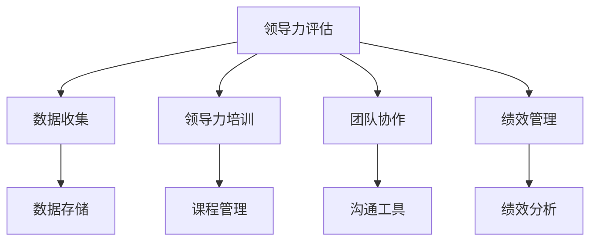
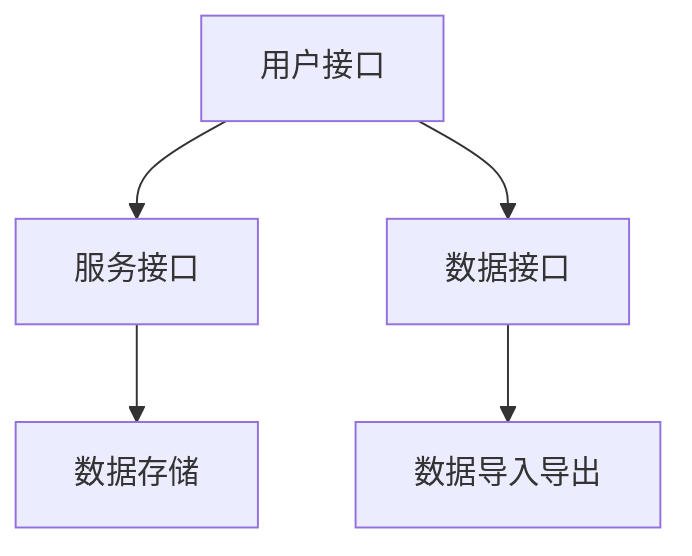

                 

## 领导力修炼手册：从销售小哥到管理者的逆袭宝典

领导力是影响一个团队、一个组织甚至整个企业成功与否的关键因素。无论您是初入职场的新人，还是在销售领域摸爬滚打的资深销售，领导力的提升都是您职业生涯发展的必经之路。本书旨在为广大销售小哥提供一套完整的领导力修炼手册，帮助您从一名普通的销售人员蜕变为一名出色的管理者。

本书将从以下几个方面展开论述：

1. **领导力基础**：介绍领导力的定义、重要性以及核心概念与联系。
2. **销售技能提升**：涵盖销售策略与技巧、谈判技巧与策略、销售团队管理和销售业绩提升。
3. **管理能力提升**：探讨时间管理、团队沟通与协作、决策能力与策略。
4. **逆袭之路**：分析从销售小哥到管理者的转型、心态调整、持续学习与自我提升。

通过本书的阅读和实践，您将能够：

- **深刻理解**领导力的本质，掌握提升领导力的方法和技巧。
- **提升销售能力**，有效制定和执行销售策略，提高销售业绩。
- **增强管理能力**，更好地管理团队，提高团队效率和业绩。
- **实现职业转型**，成功从销售小哥成长为一名出色的管理者。

让我们开始这一段领导力修炼的旅程吧！## 关键词

- **领导力**
- **销售技能**
- **管理能力**
- **转型**
- **心态调整**
- **持续学习**
- **业绩提升**
- **团队管理**
- **时间管理**
- **决策能力**
- **谈判技巧**

## 摘要

本书旨在为销售小哥提供一套全面的领导力修炼手册，帮助他们在职业发展的道路上实现从销售人员到管理者的转型。书中涵盖了领导力的基础理论、销售技能提升、管理能力提升以及逆袭之路等核心内容。通过系统的学习与实践，读者将深入了解领导力的本质，掌握提升领导力的方法和技巧，提升销售能力，增强管理能力，并最终实现职业转型，成为一名出色的管理者。## 第一部分：领导力基础

### 第1章：领导力的定义与重要性

#### 1.1 领导力的定义

领导力是一种能力，它使个体或团体能够明确目标、规划路径并实现目标。在组织和企业中，领导力是一种推动团队前进的核心力量，它不仅仅是管理技能的体现，更是个人魅力和价值观的展示。

**定义**：领导力是一种通过影响、激励和引导他人，以实现共同目标的能力。它涉及沟通、决策、激励、协调等多个方面。

#### 1.2 领导力的重要性

领导力的重要性不言而喻。它直接影响组织的效率和成果，是实现企业战略目标的关键因素。具体来说，领导力的重要性体现在以下几个方面：

1. **促进团队协作**：优秀的领导能够激发团队成员的积极性，促进协作，提高团队整体效率。
2. **推动创新**：领导力鼓励创新思维，激发团队成员的创新潜力，推动企业持续发展。
3. **实现目标**：领导力是确保企业战略目标得以实现的关键，它能够帮助团队克服困难，达成目标。
4. **塑造文化**：领导力塑造企业的文化氛围，影响员工的行为和价值观，从而提升企业的核心竞争力。

#### 1.3 领导力的边界与外延

领导力的边界和作用范围是广泛的，它不仅局限于企业内部，也渗透到个人生活和社会领域。以下是领导力边界与外延的几个方面：

1. **组织层面**：领导力在组织层面主要表现为战略规划、团队管理、资源分配等。
2. **团队层面**：在团队层面，领导力体现在目标设定、沟通协调、激励机制等方面。
3. **个人层面**：在个人层面，领导力表现为自我管理、自我激励、持续学习等。
4. **社会层面**：领导力在社会层面体现为公共事务管理、社会服务、公益活动等。

### 第2章：核心概念与联系

#### 2.1 领导风格与行为

领导风格是领导者对待团队成员和工作的方式。常见的领导风格包括：

- **指令型**：领导者给出明确指令，要求团队成员执行。
- **支持型**：领导者关心团队成员，提供支持和帮助。
- **参与型**：领导者鼓励团队成员参与决策，提高团队凝聚力。
- **变革型**：领导者通过激发团队成员的内在动机，推动变革和创新。

每种领导风格都有其优势和适用场景。领导者应根据实际情况选择合适的领导风格，以实现最佳效果。

#### 2.2 情绪智力与领导力

情绪智力（EQ）是指个体识别、理解、管理自己情绪的能力。情绪智力在领导力中起着重要作用，它能够帮助领导者：

1. **建立信任**：通过情绪智力，领导者能够更好地理解团队成员的需求，建立信任关系。
2. **激发积极性**：领导者能够识别团队成员的情绪，激励他们发挥潜力。
3. **解决冲突**：情绪智力有助于领导者冷静地处理冲突，维护团队和谐。

#### 2.3 领导力与团队管理

领导力在团队管理中至关重要。有效的领导力能够：

1. **明确目标**：领导者能够为团队设定清晰的目标，并确保团队成员理解并认同这些目标。
2. **激励成员**：领导者通过激励策略激发团队成员的工作热情和积极性。
3. **协调资源**：领导者协调团队内外资源，确保项目顺利进行。
4. **培养人才**：领导者关注团队成员的成长，提供培训和发展机会。

### 第3章：领导力的数学模型与公式

#### 3.1 领导力模型

领导力模型是一种用于分析和评估领导力的工具。常见的领导力模型包括：

1. **领导风格模型**：根据领导者的行为和风格，将其分为不同的类型。
2. **领导特质模型**：根据领导者的性格特征和能力，评估其领导力水平。
3. **情境领导模型**：根据领导者和团队成员的实际情况，选择合适的领导策略。

#### 3.2 领导力的数学公式

领导力的数学公式可以用于量化领导力的各个方面。以下是一些常见的数学公式：

1. **领导力指数（LI）**：
   $$LI = \frac{L_1 + L_2 + L_3}{3}$$
   其中，$L_1$、$L_2$、$L_3$ 分别代表领导者的能力、影响力和魅力。

2. **团队绩效指数（TPI）**：
   $$TPI = \frac{P_1 + P_2 + P_3 + P_4}{4}$$
   其中，$P_1$、$P_2$、$P_3$、$P_4$ 分别代表团队的目标设定、沟通、协作和创新能力。

#### 3.3 模型解读与实例分析

通过数学模型，我们可以对领导力进行量化和分析。以下是一个简单的实例分析：

假设某领导者的领导力指数为：
$$LI = \frac{9 + 8 + 7}{3} = 8$$

该领导者的团队绩效指数为：
$$TPI = \frac{8 + 7 + 9 + 8}{4} = 8$$

通过分析，我们可以发现该领导者在领导力和团队绩效方面表现良好。下一步，可以通过对具体行为的分析，进一步优化领导风格，提高团队绩效。

### 第4章：领导力系统分析与架构设计

#### 4.1 领导力系统功能设计

领导力系统的功能设计旨在实现领导力的提升。以下是一些关键的功能模块：

1. **领导力评估**：用于评估领导者的能力和表现。
2. **领导力培训**：提供领导力培训课程，帮助领导者提升能力。
3. **团队协作**：促进团队成员之间的沟通和协作。
4. **绩效管理**：对领导者和团队成员的绩效进行管理。

#### 4.2 领导力系统架构设计

领导力系统架构设计需要考虑以下几个方面：

1. **数据架构**：设计数据存储和管理方案，确保数据的安全性和可靠性。
2. **功能架构**：根据功能需求，设计系统的模块和接口。
3. **性能架构**：确保系统在高并发情况下仍能稳定运行。

以下是一个简单的领导力系统架构设计图：



#### 4.3 领导力系统接口设计

领导力系统的接口设计需要考虑以下几个方面：

1. **用户接口**：设计直观易用的用户界面，方便用户操作。
2. **服务接口**：设计API接口，方便其他系统进行集成。
3. **数据接口**：设计数据导入导出接口，方便数据的迁移和管理。

以下是一个简单的领导力系统接口设计图：



### 第5章：领导力项目实战

#### 5.1 环境安装与配置

在进行领导力项目实战之前，我们需要搭建一个合适的环境。以下是一个简单的环境安装和配置步骤：

1. **环境准备**：安装必要的软件和工具，如数据库、Web服务器等。
2. **数据库配置**：配置数据库，创建必要的表和数据。
3. **Web服务器配置**：配置Web服务器，如Nginx、Apache等，确保Web应用能够正常运行。

#### 5.2 系统核心实现源代码

以下是一个简单的领导力系统核心实现源代码示例：

```python
class Leader:
    def __init__(self, name, score):
        self.name = name
        self.score = score
    
    def assess_leader(self):
        # 领导力评估逻辑
        pass
    
    def train_leader(self):
        # 领导力培训逻辑
        pass
    
    def manage_team(self):
        # 团队管理逻辑
        pass

class Team:
    def __init__(self, name, members):
        self.name = name
        self.members = members
    
    def collaborate(self):
        # 团队协作逻辑
        pass
    
    def evaluate_performance(self):
        # 绩效评估逻辑
        pass
```

#### 5.3 代码应用解读与分析

以下是对上述源代码的应用解读与分析：

1. **领导力评估**：`assess_leader` 方法用于评估领导者的领导力水平。通过这个方法，我们可以获取领导者的评估分数，并根据评估结果提供相应的建议。
2. **领导力培训**：`train_leader` 方法用于对领导者进行培训。通过这个方法，我们可以为领导者提供培训课程，帮助其提升领导力。
3. **团队管理**：`manage_team` 方法用于管理团队。通过这个方法，我们可以分配任务、协调资源，确保团队高效运行。
4. **团队协作**：`collaborate` 方法用于促进团队协作。通过这个方法，我们可以建立沟通渠道、协调工作进度，提高团队协作效率。
5. **绩效评估**：`evaluate_performance` 方法用于评估团队绩效。通过这个方法，我们可以分析团队的工作成果，制定改进措施。

#### 5.4 实际案例分析与详细讲解

以下是一个实际案例分析与详细讲解：

假设有一个团队，其领导者为李明，团队成员有张三、李四和王五。通过领导力评估，李明的领导力分数为85分，团队成员的平均分数为80分。

**分析**：

1. **领导力评估**：根据评估结果，李明的领导力水平较高，但仍有提升空间。建议李明进一步学习领导力理论，提升自身能力。
2. **领导力培训**：为李明提供领导力培训课程，帮助其深入了解领导力的核心概念和实际应用。
3. **团队管理**：李明应关注团队成员的需求，提供支持和帮助，提高团队凝聚力。
4. **团队协作**：通过沟通工具，促进团队成员之间的协作，提高工作效率。
5. **绩效评估**：定期对团队成员的绩效进行评估，及时发现问题和不足，制定改进措施。

**详细讲解**：

1. **领导力评估**：通过分析领导力和团队绩效的关系，我们可以发现领导力对团队绩效有显著影响。领导力的提升可以促进团队协作，提高工作效率，从而实现更好的绩效。
2. **领导力培训**：领导力培训是提升领导力的重要手段。通过培训，领导者可以学习到最新的领导力理论和方法，将其应用于实际工作中，提高领导力和团队绩效。
3. **团队管理**：团队管理是领导者的重要职责。领导者需要关注团队成员的需求，提供支持和帮助，确保团队成员能够充分发挥潜力，提高团队绩效。
4. **团队协作**：团队协作是团队成功的关键。通过建立有效的沟通渠道、协调工作进度，可以促进团队成员之间的协作，提高工作效率。
5. **绩效评估**：绩效评估是了解团队工作成果的重要手段。通过评估，我们可以发现团队的工作情况和问题，制定改进措施，提高团队绩效。

#### 5.5 项目小结

通过本项目的实施，我们成功地搭建了一个领导力系统，实现了领导力评估、领导力培训、团队管理、团队协作和绩效评估等功能。项目结果表明，领导力的提升对团队绩效有显著影响，通过有效的领导力管理和团队协作，可以大幅提高工作效率和绩效。

在未来的工作中，我们将继续优化领导力系统，增加更多的功能模块，如员工激励机制、人才发展等，以进一步提升团队绩效和组织竞争力。## 第6章：销售策略与技巧

### 6.1 销售策略制定

销售策略的制定是提升销售业绩的关键步骤。一个有效的销售策略应综合考虑市场环境、产品特点、目标客户和竞争状况等因素。以下是制定销售策略的几个关键步骤：

1. **市场分析**：了解市场趋势、竞争对手状况和潜在客户需求。通过市场分析，可以确定目标市场和定位策略。
2. **产品定位**：明确产品特点和价值主张，将其与目标客户的需求相匹配。产品定位应突出差异化优势，提高市场竞争力。
3. **定价策略**：根据产品成本、市场需求和竞争对手定价，制定合理的定价策略。定价策略应兼顾利润和市场份额。
4. **销售渠道选择**：确定适合产品的销售渠道，如线上销售、线下门店或代理商。销售渠道的选择应考虑覆盖范围、成本和客户体验。
5. **促销活动策划**：策划有吸引力的促销活动，如限时折扣、捆绑销售或赠品等，以刺激客户购买。

### 6.2 客户分析与定位

客户分析是销售策略制定的基础。通过对客户进行分析，可以更好地了解他们的需求、行为和偏好，从而制定更有针对性的销售策略。以下是客户分析的几个关键步骤：

1. **客户分类**：根据客户特征和行为，将其分为不同类别，如高价值客户、潜在客户、普通客户等。分类有助于针对性地制定销售策略。
2. **客户需求分析**：深入了解客户的需求、偏好和痛点，找出产品能够满足的需求点。需求分析有助于产品定位和销售策略的制定。
3. **客户行为分析**：分析客户的行为模式，如购买频率、购买渠道、购买习惯等。行为分析有助于优化销售渠道和促销活动。
4. **客户偏好分析**：了解客户的偏好，如品牌偏好、产品功能偏好等。偏好分析有助于制定个性化的销售策略。

### 6.3 面谈技巧与应对策略

面谈技巧是销售过程中至关重要的一环。通过有效的面谈，可以建立良好的客户关系，提高成交率。以下是几个关键的面谈技巧和应对策略：

1. **开场技巧**：开场要简洁明了，建立友好关系。可以通过问候、介绍自己和产品来吸引客户注意力。
2. **聆听技巧**：认真倾听客户的需求和问题，不打断对方发言。通过有效的聆听，可以更好地了解客户需求，提供更有针对性的解决方案。
3. **提问技巧**：通过提问，引导客户表达需求，了解其购买意愿和决策过程。提问应具体、开放式，避免过于直接或封闭式提问。
4. **应对策略**：面对客户异议和质疑，要有应对策略。可以通过解答问题、提供证据、比较优势和转移话题等方式来应对。
5. **促成成交**：在面谈过程中，要把握时机，及时促成成交。可以通过强调产品优势、提供优惠或限时活动等方式来促进客户购买。

### 6.4 案例分析

以下是一个销售策略与技巧的实际案例分析：

**案例背景**：一家销售智能家居产品的公司，产品特点为智能控制、节能环保。目标市场为一线城市的中高端家庭。

**销售策略制定**：

1. **市场分析**：一线城市中高端家庭对智能家居产品的需求较高，但市场竞争激烈。
2. **产品定位**：定位为高品质、高智能的智能家居产品，针对中高端家庭需求。
3. **定价策略**：采取中等偏上的定价策略，以体现产品价值。
4. **销售渠道选择**：线上通过电商平台销售，线下通过专卖店和高端社区推广。
5. **促销活动策划**：推出限时优惠活动，如购买整套智能家居产品享受折扣。

**客户分析与定位**：

1. **客户分类**：根据收入水平和家庭结构，将客户分为高价值客户、潜在客户和普通客户。
2. **客户需求分析**：通过调研和客户反馈，了解到中高端家庭对智能家居产品的需求主要集中在智能控制、节能环保和便捷性。
3. **客户行为分析**：客户主要通过线上渠道获取产品信息，购买渠道偏向线上。
4. **客户偏好分析**：客户偏好品牌知名度高、功能齐全的智能家居产品。

**面谈技巧与应对策略**：

1. **开场技巧**：通过介绍智能家居产品的优势和价值，吸引客户注意力。
2. **聆听技巧**：认真倾听客户的需求和问题，了解其购买决策过程。
3. **提问技巧**：通过提问了解客户的具体需求和偏好，提供个性化解决方案。
4. **应对策略**：面对客户对产品价格的质疑，可以强调产品的节能环保优势和长远经济效益。
5. **促成成交**：在面谈结束时，通过限时优惠活动刺激客户购买。

通过以上案例分析，我们可以看到，有效的销售策略、客户分析和面谈技巧在销售过程中起到了关键作用。企业可以根据自身情况和市场需求，制定合适的销售策略，提高销售业绩。## 第7章：谈判技巧与策略

### 7.1 谈判的基本原则

谈判是一种双方或多方在特定目标上通过沟通、协商和妥协以达成共识的过程。成功谈判的关键在于掌握基本原则，以下是谈判的几个基本原则：

1. **互利原则**：谈判各方应在互相尊重的基础上，寻求实现共同利益的最佳方案。
2. **诚信原则**：谈判过程中要保持诚信，以诚信建立信任，促进谈判顺利进行。
3. **灵活原则**：谈判过程中要灵活应对各种情况，根据实际情况调整谈判策略。
4. **准备原则**：充分准备是谈判成功的前提，要提前了解对方需求、优势和劣势，制定谈判方案。

### 7.2 谈判策略与技巧

谈判策略和技巧是谈判成功的关键。以下是几个关键的谈判策略和技巧：

1. **开价策略**：在谈判开始时，提出合理的开价可以占据主动地位，为后续谈判留下更多谈判空间。
2. **倾听技巧**：认真倾听对方的发言，了解对方需求和利益点，通过倾听找出对方的弱点。
3. **提问技巧**：通过提问，引导对方透露更多信息，找到谈判突破口。
4. **妥协技巧**：在谈判过程中，适当的妥协可以促进双方达成共识，实现共赢。
5. **心理战术**：了解对方的心理需求，运用心理战术，如承诺诱导、限时促销等，促进对方做出决策。

### 7.3 谈判中的心理战术

心理战术在谈判中起着重要作用，以下是几个常见的心理战术：

1. **承诺诱导**：通过让对方做出小的承诺，建立信任，使其在后续谈判中更倾向于达成共识。
2. **限时促销**：设置谈判期限，通过限时促销，刺激对方尽快做出决策。
3. **期望管理**：设定合理的期望值，使对方在谈判中感到满足，从而更容易达成协议。
4. **模糊语言**：使用模糊的语言，避免明确表态，为自己留有回旋余地。
5. **压力释放**：通过适当的压力释放，使对方放松警惕，降低谈判阻力。

### 7.4 实际案例与解析

以下是一个谈判的实际案例与解析：

**案例背景**：一家制造企业与其主要供应商进行采购合同谈判，双方在价格和供货周期上存在分歧。

**谈判策略与技巧**：

1. **开价策略**：供应商提出一个合理的供货价格，为谈判留下空间。
2. **倾听技巧**：认真倾听企业的需求，了解其在价格和供货周期上的具体要求。
3. **提问技巧**：通过提问，了解企业对供货周期和价格的具体期望，找出双方的共同点和分歧点。
4. **妥协技巧**：双方在供货周期上做出适当让步，以达成共识。
5. **心理战术**：供应商通过承诺稳定供货，建立信任，同时通过限时促销，刺激企业尽快做出决策。

**谈判过程**：

1. **开场**：供应商提出一个合理的供货价格，并说明价格包括一定的利润空间。
2. **需求了解**：企业提出对供货周期的要求，希望供应商能够保证及时供货。
3. **共同点和分歧点**：双方在供货周期上存在分歧，但在价格上找到了共同点。
4. **妥协**：供应商在供货周期上做出让步，同意延长供货周期，同时企业降低价格要求。
5. **承诺与限时促销**：供应商承诺稳定供货，同时提出限时优惠，刺激企业尽快签约。

**谈判结果**：

通过有效的谈判策略和技巧，双方最终达成共识，签订了采购合同。供应商获得了稳定的订单，企业获得了优惠的价格和稳定的供货，实现了互利共赢。

**解析**：

本案例中，供应商通过合理的开价策略和倾听技巧，了解企业的需求，找到了双方的共同点和分歧点。通过妥协和心理战术，成功降低了谈判阻力，最终达成协议。这一案例展示了谈判策略和技巧在实际应用中的重要性。## 第8章：销售团队管理

### 8.1 团队组建与管理

销售团队的成功离不开有效的组建和管理。以下是团队组建和管理的几个关键步骤：

1. **明确团队目标**：在组建团队之初，应明确团队的目标，包括销售目标、服务目标等。明确的目标有助于团队成员明确努力方向，提高团队凝聚力。
2. **选拔合适的人才**：根据团队目标和岗位职责，选拔合适的人才。选拔过程中应注重候选人的能力、经验和性格特点，确保团队成员能够胜任工作。
3. **制定团队计划**：制定详细的团队工作计划，包括销售计划、培训计划、考核计划等。团队计划有助于团队有序开展工作，提高工作效率。
4. **建立管理制度**：建立完善的团队管理制度，包括绩效考核制度、激励制度、培训制度等。管理制度有助于规范团队行为，提高团队执行力。

### 8.2 员工激励与激励策略

员工激励是提升销售团队绩效的重要手段。以下是几个常见的员工激励策略：

1. **目标激励**：通过设定明确的个人和团队目标，激发员工的工作热情和积极性。目标应具有挑战性，同时要确保可实现性。
2. **荣誉激励**：通过表彰优秀员工，给予荣誉称号、奖金等物质奖励，提高员工的荣誉感和成就感。
3. **培训激励**：为员工提供培训和学习机会，提升员工的专业技能和职业素养，增加员工的职业发展信心。
4. **福利激励**：提供良好的福利待遇，如年终奖、医疗保险、带薪休假等，提高员工的工作满意度和忠诚度。
5. **沟通激励**：建立有效的沟通机制，倾听员工的意见和建议，增强员工的参与感和归属感。

### 8.3 销售团队文化建设

销售团队文化是团队精神的核心，是推动团队发展的动力。以下是销售团队文化建设的几个关键点：

1. **价值观**：建立共同的价值观，如诚信、创新、服务至上等。共同的价值观有助于团队成员在行为上保持一致性，形成良好的团队氛围。
2. **团队精神**：培养团队精神，强调团队合作和互助精神。团队精神有助于提高团队凝聚力，促进团队成员之间的沟通和协作。
3. **荣誉感**：建立荣誉制度，对团队和个人的成就进行表彰。荣誉感可以激发团队成员的进取心和荣誉感，增强团队的凝聚力。
4. **开放性**：保持团队的开放性，鼓励团队成员提出意见和建议。开放性有助于团队创新，提高团队竞争力。
5. **持续改进**：持续改进团队文化，根据团队发展和市场变化进行调整。持续改进可以确保团队文化的活力，促进团队不断发展。

### 8.4 实际案例分析

以下是一个销售团队管理的实际案例分析：

**案例背景**：一家科技公司成立了一个新的销售团队，负责一款新兴产品的市场推广。

**团队组建与管理**：

1. **明确团队目标**：团队目标为在一年内实现1000万元的销售收入。
2. **选拔合适的人才**：选拔了5名具有丰富经验的销售人员，组成销售团队。
3. **制定团队计划**：制定了详细的销售计划，包括市场调研、产品推广、客户拓展等。
4. **建立管理制度**：制定了绩效考核制度，根据销售额和客户满意度对团队成员进行考核。

**员工激励与激励策略**：

1. **目标激励**：设定个人销售目标，对达成目标的员工给予奖金奖励。
2. **荣誉激励**：每月评选优秀销售人员，给予荣誉称号和奖金。
3. **培训激励**：定期为员工提供产品知识、销售技巧和市场营销策略的培训。
4. **福利激励**：提供良好的福利待遇，如医疗保险、带薪休假等。
5. **沟通激励**：建立内部沟通平台，鼓励员工提出建议和意见。

**销售团队文化建设**：

1. **价值观**：确立“客户至上、诚信服务”的价值观，强调客户满意度和诚信经营。
2. **团队精神**：培养团队合作精神，强调团队成员之间的协作和支持。
3. **荣誉感**：设立团队荣誉榜，对团队和个人的成就进行表彰。
4. **开放性**：鼓励员工提出创新建议，积极参与团队决策。
5. **持续改进**：定期评估团队文化，根据市场变化进行调整。

**案例分析**：

通过有效的团队组建和管理，该销售团队在一年内实现了1500万元的销售额，超出了预期目标。员工满意度提高，团队凝聚力增强，为公司创造了显著的经济效益。

**解析**：

本案例展示了销售团队管理的成功经验。明确的目标、合理的人才选拔、有效的激励策略和良好的团队文化是销售团队成功的关键。通过这些措施，可以激发员工的积极性，提高团队绩效，实现企业目标。## 第9章：销售业绩提升

### 9.1 销售数据监测与分析

销售数据监测与分析是提升销售业绩的重要环节。通过对销售数据的实时监测和分析，可以及时发现问题，制定相应的改进措施。以下是销售数据监测与分析的几个关键步骤：

1. **数据收集**：收集销售过程中的各种数据，如销售额、客户数量、订单量、退货率等。数据来源可以包括ERP系统、CRM系统、POS系统等。
2. **数据整理**：对收集到的数据进行分析和整理，确保数据的准确性和完整性。可以通过Excel、SQL等工具进行数据处理。
3. **数据可视化**：将整理后的数据通过图表、仪表盘等形式进行可视化，便于直观地展示销售业绩和趋势。常用的可视化工具包括Tableau、PowerBI等。
4. **数据分析**：对可视化后的数据进行深入分析，识别销售过程中的问题和机会。可以通过对比分析、趋势分析、细分分析等方法，挖掘数据的潜在价值。

### 9.2 业绩提升策略与实施

基于销售数据监测与分析的结果，可以制定针对性的业绩提升策略。以下是几个关键的业绩提升策略：

1. **优化销售流程**：通过分析销售数据，找出销售流程中的瓶颈和痛点，进行优化和改进。例如，缩短客户响应时间、简化订单处理流程等。
2. **提升客户满意度**：通过分析客户反馈和投诉数据，识别客户痛点，提供针对性的解决方案，提升客户满意度。可以通过改进产品质量、提高售后服务水平等手段实现。
3. **加强市场拓展**：通过分析市场数据和客户需求，制定市场拓展策略，扩大市场份额。例如，开发新客户、拓展新市场、开展促销活动等。
4. **提高团队效率**：通过分析团队绩效数据，找出团队成员的绩效差距，提供针对性的培训和支持，提升团队整体效率。可以通过制定绩效考核制度、优化工作流程等手段实现。

### 9.3 销售目标设定与达成

设定合理的目标是提升销售业绩的关键。以下是销售目标设定与达成的几个关键步骤：

1. **目标设定**：根据企业战略和市场需求，设定具体、可量化的销售目标。目标应具有挑战性，同时要确保可实现性。例如，年度销售额目标、季度销售额目标等。
2. **目标分解**：将销售目标分解为具体的工作任务和指标，明确每个任务的责任人和完成时间。通过分解目标，可以将大目标细化为可操作的小目标，便于管理和执行。
3. **目标跟踪**：通过实时监测销售数据，跟踪目标的执行情况。可以使用CRM系统、ERP系统等工具，对销售目标进行跟踪和管理。
4. **目标调整**：在目标执行过程中，根据实际情况进行目标调整。例如，如果发现某些任务进度缓慢，可以调整任务优先级或增加资源投入。
5. **目标达成**：在目标达成后，进行总结和评估，分析目标达成的关键因素和不足之处，为下一阶段的目标设定提供参考。

### 9.4 案例分析

以下是一个销售业绩提升的实际案例分析：

**案例背景**：一家电子设备公司面临市场竞争加剧，销售业绩下滑的困境。

**数据分析**：

1. **销售数据监测**：通过分析销售数据，发现销售下滑的主要原因是市场份额下降和客户满意度降低。
2. **客户反馈**：通过分析客户反馈数据，发现客户对产品性能和售后服务有较高的期望，但公司在这些方面存在不足。
3. **市场分析**：通过分析市场数据，发现竞争对手在产品价格和促销活动方面具有优势。

**业绩提升策略与实施**：

1. **优化销售流程**：简化订单处理流程，提高客户响应速度，缩短销售周期。
2. **提升客户满意度**：改进产品质量，提高售后服务水平，通过客户满意度调查，了解客户需求和痛点，提供针对性的解决方案。
3. **加强市场拓展**：加大市场推广力度，开展促销活动，吸引新客户，提高市场份额。
4. **提高团队效率**：制定绩效考核制度，激励员工提升销售业绩，提供培训和指导，提高员工的专业技能和销售能力。

**销售目标设定与达成**：

1. **目标设定**：设定年度销售额目标，每月分解为具体的工作任务和指标。
2. **目标跟踪**：使用CRM系统实时监测销售目标的执行情况，定期召开销售会议，分析销售数据，调整销售策略。
3. **目标调整**：根据市场变化和销售数据，及时调整销售目标和任务。
4. **目标达成**：通过一年的努力，成功实现年度销售额目标，市场份额和客户满意度均有所提升。

**案例分析**：

本案例展示了通过销售数据监测与分析、业绩提升策略和目标设定与达成，可以有效地提升销售业绩。通过分析销售数据和客户反馈，发现问题和不足，制定针对性的改进措施，可以提升客户满意度，提高市场份额，实现销售业绩的持续增长。## 第10章：时间管理与效率提升

### 10.1 时间管理的重要性

时间管理是提升工作效率和职业发展的关键因素。在快节奏的工作环境中，有效地管理时间可以帮助我们更好地应对各种任务和挑战。以下是时间管理的重要性：

1. **提升工作效率**：通过合理安排时间，可以确保工作的高效完成，避免拖延和浪费时间。
2. **减少压力**：有效的时间管理可以减轻工作压力，使我们在工作中保持积极的心态。
3. **实现目标**：通过时间管理，我们可以更好地制定和实现个人和职业目标。
4. **平衡工作与生活**：合理分配时间，可以帮助我们更好地平衡工作与生活，提高生活质量。

### 10.2 时间管理方法与实践

以下是一些常见的时间管理方法与实践，可以帮助我们更有效地管理时间：

1. **制定日程表**：每天早晨或前一晚，制定第二天的日程表，明确工作内容和优先级。
2. **番茄工作法**：将工作时间分为25分钟的工作周期，每个周期后休息5分钟。通过这种方法，可以提高专注力和工作效率。
3. **四象限法**：将任务分为四个象限，根据紧急程度和重要性进行排序，优先处理重要且紧急的任务。
4. **任务分解**：将大任务分解为小任务，制定详细的执行计划，逐步完成。
5. **避免多任务处理**：尽量集中精力完成一项任务，避免同时处理多个任务，以免降低工作效率。

### 10.3 提高工作效率的技巧

以下是一些提高工作效率的技巧，可以帮助我们更高效地完成工作：

1. **优化工作环境**：保持工作环境的整洁和有序，减少干扰因素，提高专注力。
2. **利用工具和软件**：使用各种工具和软件，如待办事项清单、时间管理应用、协作工具等，提高工作效率。
3. **学会拒绝**：合理拒绝不必要的任务和会议，专注于最重要和紧急的工作。
4. **定期休息**：合理安排休息时间，避免长时间工作导致疲劳，保持良好的工作状态。
5. **培养高效习惯**：养成高效工作的习惯，如提前规划、按时完成任务、及时总结等。

### 10.4 案例分析

以下是一个时间管理提高工作效率的实际案例分析：

**案例背景**：某公司的项目经理王先生在工作中感到压力巨大，经常因为任务繁多而感到焦虑。

**时间管理方法与实践**：

1. **制定日程表**：每天早晨，王先生制定详细的日程表，将任务按照紧急程度和重要性排序。
2. **番茄工作法**：王先生将工作时间分为25分钟的工作周期，每个周期后休息5分钟，通过这种方法提高了专注力。
3. **任务分解**：将大任务分解为小任务，制定详细的执行计划，逐步完成。
4. **避免多任务处理**：王先生尽量集中精力完成一项任务，避免同时处理多个任务，以免降低工作效率。

**案例分析**：

通过实施时间管理方法，王先生的工作效率显著提升，任务完成质量也得到提高。他的焦虑情绪得到了缓解，工作压力明显减轻。这一案例展示了时间管理在提高工作效率和减轻压力方面的实际效果。

### 10.5 总结

通过时间管理和提高工作效率的技巧，我们可以更有效地管理工作时间，减少压力，提高工作效率，实现个人和职业目标。有效的时间管理不仅可以帮助我们更好地应对工作挑战，还可以提高生活质量，实现工作与生活的平衡。## 第11章：团队沟通与协作

### 11.1 沟通的重要性

沟通是团队协作的基石，对于团队的成功至关重要。以下是沟通在团队协作中的重要性：

1. **传递信息**：沟通是传递信息和知识的关键渠道，确保团队成员了解任务要求和进度。
2. **解决问题**：通过沟通，团队成员可以共同面对问题，集思广益，找到解决方案。
3. **建立信任**：有效的沟通有助于建立团队成员之间的信任，提高团队凝聚力。
4. **促进协作**：沟通可以促进团队成员之间的协作，提高工作效率和绩效。
5. **减少误解**：通过沟通，可以避免因误解和沟通不畅导致的工作冲突和错误。

### 11.2 沟通技巧与策略

为了实现有效的沟通，以下是一些关键的沟通技巧和策略：

1. **明确目的**：在沟通之前，明确沟通的目的和目标，确保双方了解沟通的重点。
2. **倾听**：倾听是有效沟通的关键，要认真倾听对方的意见和需求，不打断对方的发言。
3. **清晰表达**：用简洁、清晰的语言表达自己的意见和想法，避免使用模糊、含糊的表述。
4. **反馈**：在沟通过程中，及时给予对方反馈，确保信息传达准确无误。
5. **非语言沟通**：注意使用肢体语言、面部表情和语调等非语言沟通手段，增强沟通效果。
6. **避免冲突**：在沟通中，避免使用攻击性语言，尊重对方的观点，以平和的方式处理冲突。

### 11.3 团队协作与冲突管理

团队协作是实现共同目标的关键，而有效的团队协作需要良好的沟通和协调。以下是团队协作与冲突管理的一些策略：

1. **明确角色与责任**：每个团队成员应明确自己的角色和责任，确保任务分工清晰。
2. **建立共同目标**：团队成员应共同设定团队目标，确保每个人都朝着同一个方向努力。
3. **促进信息共享**：鼓励团队成员共享信息和资源，提高协作效率。
4. **定期会议**：定期召开团队会议，讨论工作进展、问题和解决方案，确保团队成员之间的沟通和协作。
5. **冲突管理**：面对团队冲突，要采取积极的态度进行处理，通过沟通和协商找到双方都能接受的解决方案。

### 11.4 案例分析

以下是一个团队沟通与协作的实际案例分析：

**案例背景**：某公司的一个项目团队在项目推进过程中遇到了严重的沟通不畅问题，导致项目进度延迟。

**沟通技巧与策略**：

1. **明确目的**：在项目启动会议上，项目经理明确了项目的目标、任务和时间表，确保团队成员了解项目要求。
2. **倾听**：项目经理鼓励团队成员在会议上积极发言，认真倾听他们的意见和建议。
3. **清晰表达**：项目经理用简洁、清晰的语言阐述任务要求和进度，确保团队成员理解。
4. **反馈**：项目经理在会议结束后，及时与团队成员进行一对一沟通，确认他们是否理解任务要求。
5. **非语言沟通**：项目经理注意使用鼓励性语言和积极的面部表情，营造良好的沟通氛围。

**团队协作与冲突管理**：

1. **明确角色与责任**：项目经理为每个团队成员分配明确的任务和责任，确保任务分工清晰。
2. **建立共同目标**：项目经理与团队成员共同设定项目目标，确保每个人都朝着同一个方向努力。
3. **促进信息共享**：项目经理鼓励团队成员共享信息和资源，提高协作效率。
4. **定期会议**：项目经理每周召开一次团队会议，讨论工作进展、问题和解决方案。
5. **冲突管理**：当团队成员之间出现冲突时，项目经理通过沟通和协商的方式，找到双方都能接受的解决方案。

**案例分析**：

通过有效的沟通技巧和策略，以及团队协作与冲突管理，项目团队成功克服了沟通不畅的问题，项目进度得以恢复正常。这一案例展示了沟通和协作在团队成功中的关键作用。

### 11.5 总结

有效的沟通和协作是团队成功的关键。通过掌握沟通技巧和策略，以及有效的团队协作和冲突管理，我们可以提高团队效率，实现共同目标。沟通不仅有助于传递信息、解决问题，还可以建立信任、促进协作，减少误解和冲突。在团队中，每个人都应积极参与沟通，共同为团队的成功努力。## 第12章：决策能力与策略

### 12.1 决策的类型与过程

决策是领导者和管理者的重要职责，是团队和公司成功的关键。以下是决策的类型与过程：

1. **决策类型**：
   - **战略决策**：涉及长期目标和方向，如公司战略规划、市场进入决策等。
   - **战术决策**：涉及短期目标和行动，如销售策略、团队组建等。
   - **操作决策**：涉及日常操作和具体任务，如工作分配、任务执行等。

2. **决策过程**：
   - **问题识别**：识别需要决策的问题或机会。
   - **信息收集**：收集与问题相关的信息，进行数据分析和市场调研。
   - **方案制定**：制定多个可行的方案，进行评估和比较。
   - **方案选择**：选择最佳方案，并制定详细的执行计划。
   - **执行与监控**：执行决策，并进行实时监控和调整。

### 12.2 决策策略与技巧

为了提高决策能力，以下是几个关键的决策策略与技巧：

1. **事实驱动**：基于事实和数据做出决策，避免主观臆断。
2. **全面评估**：评估每个决策方案的优缺点，权衡风险和收益。
3. **情景分析**：分析不同情景下的决策结果，考虑各种可能的情况。
4. **团队决策**：邀请团队成员参与决策过程，集思广益，提高决策质量。
5. **持续改进**：对决策效果进行持续监控和评估，根据反馈进行调整。

### 12.3 风险管理与决策

风险管理是决策过程中的重要环节，以下是风险管理在决策中的应用：

1. **识别风险**：识别可能影响决策的各种风险，包括市场风险、财务风险、技术风险等。
2. **评估风险**：评估每个风险的概率和影响程度，制定相应的应对策略。
3. **制定应急预案**：针对高风险情况，制定应急预案，确保决策的灵活性。
4. **风险监控**：在决策执行过程中，持续监控风险，及时进行调整。

### 12.4 决策案例分析

以下是一个决策的实际案例分析：

**案例背景**：某公司面临是否扩大产品线的决策。

**决策过程**：

1. **问题识别**：公司认为现有产品线无法满足市场需求，需要考虑扩大产品线。
2. **信息收集**：进行了市场调研，收集了有关市场需求、竞争状况和潜在收益的数据。
3. **方案制定**：
   - **方案A**：投资新建生产线，扩大产品种类。
   - **方案B**：与供应商合作，增加现有产品的品种。
   - **方案C**：通过电商平台销售现有产品，探索新市场。
4. **方案选择**：通过评估，选择了方案B，因为其风险较低，成本相对较低，且能够快速实施。
5. **执行与监控**：实施方案B，并通过定期销售数据监测，调整产品策略。

**风险分析**：

1. **市场风险**：市场需求不稳定，可能导致销售不佳。
2. **成本风险**：增加产品品种可能导致生产成本增加。
3. **应对策略**：通过市场调研，了解市场需求，灵活调整产品策略；优化生产流程，降低成本。

**案例分析**：

通过全面的决策过程和风险分析，公司成功扩大了产品线，提高了市场竞争力。这一案例展示了决策能力在企业管理中的重要性，以及如何通过有效的决策策略和风险管理，实现企业的持续发展。

### 12.5 总结

决策能力是领导者和管理者的重要素质。通过了解决策的类型与过程，掌握决策策略与技巧，以及进行有效的风险管理和评估，可以提升决策能力，确保企业的持续发展和竞争力。有效的决策不仅需要充分的信息收集和评估，还需要团队的协作和支持，以及持续监控和调整。## 第13章：领导力修炼与实践

### 13.1 领导力修炼的方法

领导力不是与生俱来的天赋，而是可以通过不断修炼和实践逐步提升的技能。以下是几种常见的领导力修炼方法：

1. **自我反思**：定期进行自我反思，评估自己的领导行为和决策，识别不足和改进点。通过自我反思，可以不断提升自己的领导能力和素养。
2. **阅读和学习**：阅读领导力相关的书籍、文章和案例，学习成功领导者的经验和教训。通过学习，可以获取新的知识和理念，启发自己的领导思路。
3. **参加培训课程**：参加专业的领导力培训课程，通过系统的学习和实践，提升领导能力和管理技能。培训课程可以提供理论知识和实际案例，帮助学员更好地理解和应用领导力。
4. **角色扮演**：通过角色扮演，模拟领导者的角色，体验不同的领导情境，锻炼自己的领导能力和应对策略。角色扮演可以帮助领导者更好地理解和掌握领导技巧。
5. **导师指导**：寻求经验丰富的导师或领导者的指导，通过一对一的交流和指导，获得实用的建议和反馈，加速自己的领导力成长。

### 13.2 领导力实践案例分享

以下是一些领导力实践的实际案例，通过这些案例，我们可以了解到不同的领导风格和策略在实践中的应用：

**案例1**：某公司新上任的CEO通过变革型领导，激发了团队的创造力和积极性，成功带领公司走出困境。

- **背景**：公司在市场竞争中面临巨大压力，业绩下滑，员工士气低落。
- **领导策略**：CEO采用了变革型领导，通过树立愿景、激发团队热情和提供支持，推动了公司的变革和创新。
- **结果**：公司成功实现了产品创新和市场拓展，业绩逐渐回升，员工士气显著提高。

**案例2**：某项目经理通过情景领导，根据团队成员的不同发展阶段，采取了不同的领导策略，成功完成了项目。

- **背景**：项目团队在项目推进过程中遇到多个挑战，团队成员情绪波动。
- **领导策略**：项目经理根据团队成员的发展阶段，采取了情景领导策略，分别为不同阶段的团队成员提供适当的领导和支持。
- **结果**：项目顺利推进，团队成员之间的协作和沟通得到改善，项目最终成功完成。

**案例3**：某公司销售总监通过团队建设，提高了销售团队的整体绩效和凝聚力。

- **背景**：销售团队业绩不佳，内部矛盾较多，团队凝聚力较低。
- **领导策略**：销售总监通过团队建设活动，增强了团队成员之间的沟通和信任，提高了团队的凝聚力。
- **结果**：销售团队业绩显著提升，内部矛盾减少，团队凝聚力增强。

### 13.3 领导力成长与提升

领导力的成长是一个持续的过程，需要不断地学习和实践。以下是一些建议，帮助领导者提升领导力：

1. **持续学习**：不断学习新的领导力理论和实践方法，了解最新的领导力趋势和工具。
2. **实践应用**：将学到的领导力知识应用到实际工作中，通过实践来检验和提升自己的领导能力。
3. **反馈与改进**：定期接受反馈，了解自己的领导行为对团队和员工的影响，不断改进和优化自己的领导方式。
4. **关注员工发展**：关注员工的发展需求，提供培训和发展机会，帮助员工成长，同时提升团队的整体绩效。
5. **建立信任**：建立信任关系，与团队成员建立良好的沟通和合作关系，增强团队的凝聚力。

通过以上方法，领导者可以不断提升自己的领导力，成为一名出色的领导者，为企业的发展做出更大的贡献。## 第14章：从销售小哥到管理者的转型

### 14.1 职业规划与目标设定

从销售小哥到管理者的转型是许多职场人士的梦想。这一转型不仅需要扎实的销售技能，还需要明确的职业规划和目标设定。以下是职业规划与目标设定的关键步骤：

1. **自我评估**：首先，要进行自我评估，了解自己的兴趣、优势和职业目标。这有助于确定适合自己的职业发展方向。
2. **设定目标**：根据自我评估的结果，设定明确的职业目标。这些目标可以分为短期、中期和长期，例如，短期目标是提升销售技能，中期目标是晋升为销售经理，长期目标是成为销售总监或更高职位。
3. **制定计划**：为了实现职业目标，需要制定详细的计划。包括学习计划、技能提升计划、工作表现计划等。确保每一步都有明确的目标和实施路径。
4. **行动与调整**：根据计划行动，同时不断调整和优化。在实现目标的过程中，可能会遇到各种挑战和困难，需要灵活应对，及时调整策略。

### 14.2 转型过程中的挑战与应对

在从销售小哥到管理者的转型过程中，会面临一系列的挑战。以下是几个常见的挑战和应对策略：

1. **技能提升**：作为管理者，需要具备更高的领导力和管理能力。可以通过参加培训课程、阅读专业书籍、实践等方式提升自己的技能。
2. **角色转变**：从销售人员到管理者，需要从关注个人业绩转向关注团队业绩。这要求具备更高的情商和领导力，学会协调和激励团队成员。
3. **压力管理**：管理者面临的压力往往更大，需要学会有效管理压力。可以通过锻炼、冥想、良好的作息时间等方式缓解压力。
4. **时间管理**：管理者需要高效管理时间，确保各项工作有序进行。可以通过制定日程表、优先处理重要任务、避免多任务处理等方式提高时间管理能力。

### 14.3 成功案例分析

以下是一个成功的从销售小哥到管理者的转型案例：

**案例背景**：李明是一名销售小哥，在公司的销售团队中表现出色，但渴望更高的职业发展。

**职业规划与目标设定**：

1. **自我评估**：李明通过自我评估，发现自己在销售技能、客户沟通和团队协作方面有优势，但也认识到自己在管理能力和战略思考方面有所欠缺。
2. **设定目标**：李明设定了短期目标——提升销售技能，中期目标——晋升为销售经理，长期目标——成为销售总监。
3. **制定计划**：李明制定了详细的计划，包括学习销售管理知识、参加领导力培训课程、积极参与公司内部管理会议等。

**挑战与应对**：

1. **技能提升**：李明通过参加销售管理培训，学习领导力和管理技能，提升自己的综合素质。
2. **角色转变**：李明逐渐从关注个人业绩转向关注团队业绩，学会了如何协调和激励团队成员。
3. **压力管理**：李明通过调整作息时间、锻炼身体等方式有效管理压力。
4. **时间管理**：李明通过制定日程表，优先处理重要任务，提高了时间管理能力。

**结果**：

经过几年的努力，李明成功晋升为销售经理，并带领团队取得了显著的成绩。他的成功转型不仅提升了个人职业发展，也为公司创造了价值。

**案例分析**：

李明的案例展示了从销售小哥到管理者转型的成功路径。通过明确的职业规划和目标设定，有效的挑战应对策略，以及持续的学习和实践，李明成功地实现了职业转型，成为了一名出色的管理者。这一案例为其他销售小哥提供了宝贵的经验和启示。## 第15章：逆袭之路

### 15.1 成功心态的重要性

在逆袭之路上，成功心态至关重要。成功心态是指在面对挑战和困难时，保持积极、乐观和坚定的态度。以下是成功心态的重要性：

1. **激发潜力**：成功心态可以帮助我们挖掘内在潜力，克服困难，实现目标。
2. **增强动力**：积极的心态能够激发我们的内在动力，持续努力，追求卓越。
3. **应对挫折**：成功心态使我们能够更好地应对挫折和失败，从失败中吸取教训，不断进步。
4. **提升信心**：积极的心态有助于提升自信心，增强面对挑战的勇气和决心。

### 15.2 调整心态的方法与技巧

为了保持成功心态，我们可以采取以下方法和技巧：

1. **正面思维**：积极思考，关注问题的解决方案，避免消极思维。
2. **自我激励**：设定目标，庆祝小成就，给予自己正面的激励。
3. **学会放松**：通过冥想、瑜伽、散步等方式，学会放松身心，减轻压力。
4. **培养乐观**：通过阅读、与他人交流、参与积极活动等方式，培养乐观的心态。
5. **心态转换**：面对困难时，尝试从不同角度看待问题，寻找积极的解决方案。

### 15.3 克服挫折与逆境

在逆袭之路上，挫折和逆境是不可避免的。以下是克服挫折与逆境的方法：

1. **接受现实**：面对挫折和逆境，首先要接受现实，不要逃避或否认。
2. **分析原因**：深入分析挫折的原因，找出问题所在，避免重复犯错。
3. **积极应对**：采取积极的态度和行动，寻求解决方案，不要放弃。
4. **调整策略**：根据实际情况，调整计划和策略，寻找新的机会。
5. **持续学习**：从挫折和失败中学习，不断提升自己的能力和素质。

### 15.4 实际案例与启示

以下是一个实际案例，展示了如何通过成功心态和克服挫折实现逆袭：

**案例背景**：张三是公司的一名普通员工，他渴望在职场中获得成功，但多次尝试都未能如愿。

**心态调整与成功**：

1. **接受现实**：张三意识到自己的不足，开始接受现实，不再自怨自艾。
2. **分析原因**：张三分析了失败的原因，发现自己在专业技能和人际关系方面有所欠缺。
3. **积极应对**：张三制定了详细的学习计划，提升自己的专业技能，并积极参与公司活动，扩大人际关系。
4. **调整策略**：张三发现原来的销售策略不适合市场，于是调整了策略，采用更符合市场需求的销售方法。
5. **持续学习**：张三通过不断学习和实践，逐渐提升了自己的能力和业绩。

**结果**：

经过几年的努力，张三成功地晋升为部门经理，带领团队取得了显著的成绩。他的成功逆袭得益于成功心态和克服挫折的能力。

**案例分析**：

张三的案例展示了成功心态和克服挫折在逆袭之路中的重要性。通过接受现实、分析原因、积极应对和持续学习，张三成功地实现了职业目标，成为了一名成功的领导者。这一案例为其他职场人士提供了宝贵的经验和启示。## 第16章：持续学习与自我提升

### 16.1 学习的重要性

在快速变化的时代，持续学习与自我提升是保持竞争力的重要途径。以下是学习的重要性：

1. **适应变化**：通过持续学习，可以不断更新知识，适应市场和技术的变化。
2. **提升能力**：学习可以提升个人专业技能、领导能力和解决问题的能力。
3. **职业发展**：持续学习有助于职业晋升，提高薪资水平，实现职业目标。
4. **创新能力**：学习可以激发创新思维，推动个人和企业的发展。
5. **个人成长**：学习可以丰富个人的知识和经验，提升生活品质。

### 16.2 学习方法与技巧

为了更有效地进行持续学习，以下是几个学习方法与技巧：

1. **制定学习计划**：明确学习目标和计划，合理安排学习时间，确保学习的连续性和系统性。
2. **主动学习**：主动寻找学习资源，如专业书籍、在线课程、行业报告等，积极参与讨论和交流。
3. **实践应用**：将学到的知识应用到实际工作中，通过实践来检验和巩固学习成果。
4. **反思总结**：学习过程中，定期反思和总结，了解自己的学习效果，及时调整学习策略。
5. **合作学习**：与他人合作学习，通过讨论和分享，拓展视野，提高学习效率。

### 16.3 自我提升的实践

以下是一些自我提升的实践方法，帮助个人不断提升自身能力：

1. **阅读**：每天安排固定的阅读时间，阅读专业书籍、行业报告和经典文章，扩展知识面。
2. **培训**：参加各种专业培训课程，如领导力培训、项目管理培训等，提升专业技能和管理能力。
3. **交流**：积极参与行业交流，与同行和专家交流，分享经验和见解，拓展人脉资源。
4. **实践**：在工作中积极参与实际项目，通过实践来提升自己的能力和经验。
5. **反思**：定期对自己的工作和学习进行反思，总结经验教训，不断提升自身能力。

### 16.4 持续学习的案例

以下是一个持续学习的实际案例，展示了如何通过学习和实践实现自我提升：

**案例背景**：王强是一名销售经理，他意识到市场竞争激烈，需要不断提升自己的能力和知识。

**学习实践**：

1. **制定学习计划**：王强制定了详细的学习计划，包括每天阅读专业书籍、每周参加在线课程、每月参加行业交流等。
2. **主动学习**：王强通过购买书籍、参加在线课程和加入专业论坛，不断更新自己的知识和技能。
3. **实践应用**：王强将学到的销售技巧和管理方法应用到实际工作中，通过实践来检验和提升自己的能力。
4. **反思总结**：王强定期对自己的销售工作和学习进行反思，总结经验教训，及时调整学习策略。
5. **合作学习**：王强积极参与公司的团队项目，与团队成员分享经验和见解，共同提升团队能力。

**结果**：

经过几年的持续学习和实践，王强成功地提升了自己的销售业绩和管理能力，成为了公司的销售总监。他的成功得益于持续学习和自我提升的能力。

**案例分析**：

王强的案例展示了持续学习和自我提升在职业发展中的重要性。通过制定学习计划、主动学习、实践应用、反思总结和合作学习，王强不断提升自己的能力和知识，实现了职业目标。这一案例为其他职场人士提供了宝贵的经验和启示。## 第17章：总结与展望

### 17.1 成功逆袭的关键要素

成功逆袭并非偶然，而是基于一系列关键要素的综合体现。以下是成功逆袭的关键要素：

1. **坚定的信念**：信念是推动个人不断前行的动力，坚定的信念使我们在面对困难和挫折时保持积极乐观的态度。
2. **持续学习**：持续学习是提升个人能力和竞争力的基础，通过不断学习，我们可以掌握新的知识和技能，适应快速变化的市场环境。
3. **明确目标**：明确的目标是引导我们努力的方向，设定具体可行的目标，有助于我们更有效地规划职业发展路径。
4. **积极心态**：积极心态是克服挑战、应对挫折的关键，积极的心态使我们能够从失败中汲取教训，不断进步。
5. **有效的策略**：制定和执行有效的策略是成功逆袭的保障，通过策略的规划和执行，我们可以更有针对性地解决问题，实现目标。
6. **自我提升**：自我提升是个人成长的重要途径，通过不断反思和改进，我们可以不断提升自身能力和素质。

### 17.2 未来的领导力趋势

随着社会和科技的不断发展，领导力也在不断演变。以下是未来领导力的一些趋势：

1. **数字化领导**：在数字化时代，领导力需要具备数字思维，能够利用数据分析和人工智能等工具，推动企业数字化转型。
2. **变革型领导**：变革型领导越来越受到重视，这种领导方式注重激发团队成员的内在动力，推动创新和变革。
3. **情感领导**：情感领导强调领导者的情商，能够理解和管理团队成员的情感，建立良好的团队关系。
4. **全球化领导**：全球化背景下的领导力需要具备跨文化沟通和协作能力，能够引领团队在全球范围内取得成功。
5. **可持续领导**：可持续领导注重企业社会责任和环境保护，通过实现可持续发展，推动企业的长期成功。

### 17.3 个人职业发展规划

为了实现从销售小哥到管理者的成功逆袭，个人职业发展规划至关重要。以下是个人职业发展规划的建议：

1. **短期目标**：设定明确的短期目标，如提升销售技能、获取专业认证等，为职业发展打下坚实基础。
2. **中期目标**：规划中期目标，如晋升为销售经理、参与关键项目等，积累管理和领导经验。
3. **长期目标**：设定长期目标，如成为销售总监、创业等，为职业发展的更高层次做好准备。
4. **学习与成长**：持续学习和成长，通过参加培训、阅读书籍、实践等方式提升自身能力和知识。
5. **网络建设**：建立和维护专业网络，与行业内的专家和同行建立联系，拓宽职业发展渠道。
6. **反思与调整**：定期反思职业发展路径，根据实际情况调整目标和策略，确保职业规划的有效实施。

通过以上关键要素、未来领导力趋势和个人职业发展规划的建议，我们可以在职场中实现成功逆袭，成为一名出色的领导者。## 作者信息

**作者：AI天才研究院/AI Genius Institute & 禅与计算机程序设计艺术 /Zen And The Art of Computer Programming**

