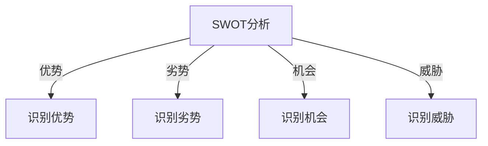
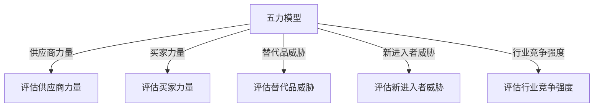

                 

### 《领导力修炼手册：从项目总监到管理者的进阶指南》

关键词：领导力、项目总监、管理者、进阶指南、团队建设、有效沟通

摘要：本文旨在为项目总监和有志于成为管理者的专业人士提供一份全面的领导力进阶指南。通过分析项目总监的角色与责任、领导力的核心技巧和实践，文章将帮助读者理解并掌握从项目总监到管理者的转型之路。本文分为四个部分，首先介绍领导力的基础概念，然后探讨领导力技巧，接着展示领导力在项目管理中的应用，最后讨论领导力的持续提升策略。通过逐步分析和思考，本文希望为读者提供实用的领导力提升方法。

### 第一部分：领导力基础

#### 第1章：领导力的定义与类型

领导力是一种影响和激励他人实现共同目标的能力。它不仅涉及决策和规划，还包括沟通、激励和团队合作等多个方面。领导力可以分为四种主要类型：指令型领导力、变革型领导力、授权型领导力和模范型领导力。每种类型都有其特定的应用场景和效果。

#### 第2章：项目总监的角色与责任

项目总监在项目中扮演着核心角色，负责项目规划、执行和监控。他们需要确保项目按计划进行，解决项目中出现的各种问题，并与利益相关者保持良好的沟通。项目总监的责任包括制定项目目标、管理项目资源、协调团队成员的工作等。

### 第二部分：领导力技巧

#### 第3章：有效沟通

有效沟通是领导力的核心要素之一。项目总监需要掌握多种沟通技巧，如倾听、清晰表达、反馈和冲突解决。这些技巧不仅有助于提高团队协作效率，还能增强团队成员的信任和凝聚力。

#### 第4章：团队建设

团队建设是项目成功的关键。项目总监需要了解团队成员的角色和需求，建立良好的团队文化，促进团队成员之间的协作和信任。这包括明确团队目标、分配任务、激励员工和提供培训与发展机会等。

#### 第5章：激励与员工发展

项目总监需要了解如何激励员工，以提升团队绩效。这包括了解员工需求、提供反馈和认可、制定职业发展计划等。通过激励员工，项目总监可以帮助他们发挥最大潜力，实现个人和团队目标。

### 第三部分：领导力实践

#### 第6章：项目管理的领导力应用

在项目管理中，领导力贯穿始终。项目总监需要运用领导力来管理项目风险、变更和控制，确保项目按计划进行。这包括制定风险管理计划、建立变更控制流程和监控项目进度等。

#### 第7章：领导力进阶之路

从项目总监到高级管理者的转型是一个长期而复杂的过程。项目总监需要不断提升自己的领导力，学习先进的管理理论和实践，同时培养自己的领导风格和人际关系技能。通过不断学习和实践，项目总监可以成功地实现职业生涯的进阶。

### 第四部分：附录

#### 附录A：常用领导力工具与技术

附录A将介绍一些常用的领导力工具和技术，如SWOT分析、五力模型、SMART目标和情境领导模型等。这些工具和技术可以帮助项目总监更好地理解和应用领导力。

#### 附录B：领导力案例分析

附录B将通过实际案例展示领导力在不同情境下的应用。这些案例将提供实践中的经验和教训，帮助读者更好地理解和掌握领导力。

#### 附录C：推荐阅读

附录C将列出一些与领导力相关的经典书籍、文章和在线资源，供读者进一步学习和参考。

### 结束语

《领导力修炼手册：从项目总监到管理者的进阶指南》旨在帮助项目总监和有志于成为管理者的专业人士提升领导力。通过本文的逐步分析和思考，读者可以更好地理解领导力的核心概念和实践方法，从而在职业生涯中取得更大的成功。

作者：AI天才研究院/AI Genius Institute & 禅与计算机程序设计艺术/Zen And The Art of Computer Programming

---

注：本文为摘要形式，具体内容还需根据目录大纲进一步展开和详细阐述。在撰写全文时，每个章节都需要包含背景介绍、核心概念与联系、算法原理讲解、系统分析与架构设计方案、项目实战、最佳实践 tips、小结、注意事项和拓展阅读等内容，以确保文章的完整性和深度。

### 第一部分：领导力基础

#### 第1章：领导力的定义与类型

领导力是一种影响和激励他人实现共同目标的能力。它不仅仅是一种职位赋予的权力，而是一种通过个人魅力、专业知识、沟通技巧和团队协作能力来推动团队前进的力量。领导力可以存在于各种组织和个人中，不论职位高低，都可以展现出领导力。

#### 1.1 领导力的定义与类型

领导力的定义有多种，其中最常见的是以下几种：

- **特质论**：认为领导力是由一系列内在特质决定的，如自信、智慧、诚实、公正等。
- **行为论**：认为领导力是通过一系列可观察的行为表现出来的，如激励、沟通、决策等。
- **情境论**：认为领导力取决于具体情境，不同的情境需要不同的领导风格。

领导力可以分为以下几种类型：

1. **指令型领导力**：这是一种较为传统的领导风格，领导者通过明确的指令和指导来管理团队。这种风格适用于需要快速决策和明确行动的场景。
   
2. **变革型领导力**：这种领导风格强调激发团队成员的潜能，推动创新和变革。领导者通过愿景、激励和启发来影响团队成员。

3. **授权型领导力**：这种风格鼓励团队成员自主决策和承担责任。领导者通过信任和支持，使团队成员能够发挥最大的潜力。

4. **模范型领导力**：领导者通过自身的榜样作用来影响团队成员。他们通过自身的行动和价值观来激励他人。

#### 1.2 领导力的重要性

领导力在组织中起着至关重要的作用。它不仅影响项目的成功，还影响团队的士气、合作和创新能力。以下是领导力重要性的几个方面：

- **提高团队绩效**：有效的领导力可以提高团队的协作效率，减少冲突，提高团队的士气和生产力。
- **促进创新和变革**：领导力可以激发团队成员的创新思维，推动组织不断进步和适应市场变化。
- **建立组织文化**：领导力塑造组织的价值观和行为规范，形成积极、健康的工作环境。

#### 1.3 领导力的五个核心特质

有效的领导者通常具备以下五个核心特质：

1. **诚信**：领导者需要具备高度的诚信，这是建立信任和团队忠诚度的关键。
   
2. **自信**：领导者需要对自己的决策和行动有信心，同时也要鼓励团队成员相信自己的能力。

3. **决策能力**：领导者需要具备良好的决策能力，能够在压力下做出明智的决策。

4. **沟通能力**：领导者需要具备优秀的沟通能力，能够清晰表达自己的想法，同时也要倾听和理解团队成员的意见。

5. **领导风格适应性**：领导者需要根据不同的情境和团队成员的需求，灵活调整自己的领导风格。

### 第2章：项目总监的角色与责任

#### 2.1 项目总监的职责

项目总监（Project Director）在项目中扮演着核心角色，负责确保项目的成功完成。项目总监的职责主要包括以下几个方面：

1. **项目规划**：项目总监需要制定详细的项目计划，包括项目目标、任务分解、时间表和资源分配等。
   
2. **项目执行**：项目总监需要确保项目按照计划进行，监控项目进度，解决项目中出现的各种问题。

3. **团队管理**：项目总监需要管理项目团队，协调团队成员的工作，确保团队的高效协作。

4. **风险管理**：项目总监需要识别项目风险，制定风险管理计划，并采取措施控制风险。

5. **利益相关者沟通**：项目总监需要与项目的利益相关者保持良好的沟通，确保项目目标的一致性和利益相关者的满意度。

#### 2.2 项目管理与领导力

项目管理与领导力密切相关。项目总监需要运用领导力来推动项目进展，解决项目中出现的各种问题。以下是领导力在项目管理中的应用：

1. **激励员工**：项目总监需要通过激励和认可来激发团队成员的工作积极性，提高团队的士气。
   
2. **沟通协调**：项目总监需要具备优秀的沟通技巧，与团队成员、利益相关者保持良好的沟通，确保信息的畅通和协调。

3. **决策能力**：项目总监需要在压力下做出明智的决策，以确保项目目标的实现。

4. **团队建设**：项目总监需要建立高效团队，促进团队成员之间的协作和信任。

#### 2.3 项目总监面临的挑战

项目总监在项目管理中面临多种挑战：

1. **资源管理**：项目总监需要合理分配资源，确保项目能够在预算和时间限制内完成。

2. **风险控制**：项目总监需要识别和管理项目风险，确保项目能够顺利进行。

3. **团队协作**：项目总监需要协调团队成员的工作，解决团队内部和外部的冲突。

4. **变化应对**：项目总监需要灵活应对项目中的各种变化，确保项目目标的实现。

通过了解领导力的核心概念和项目总监的职责与挑战，读者可以更好地理解项目总监的角色，为成为更有效的领导者打下基础。在接下来的章节中，我们将进一步探讨领导力的技巧和实践，帮助读者提升自己的领导能力。

### 第二部分：领导力技巧

#### 第3章：有效沟通

沟通是领导力的核心要素之一。对于项目总监来说，有效的沟通不仅能够确保项目目标的实现，还能够增强团队的凝聚力和成员的满意度。本章将探讨有效沟通的重要性、常见障碍以及提高沟通效率的方法。

#### 3.1 沟通的重要性

沟通在领导力中的作用至关重要。以下是沟通对领导力的重要性：

1. **信息传递**：沟通是信息传递的重要手段，项目总监需要确保信息准确、及时地传递给团队成员和利益相关者。
   
2. **决策支持**：有效的沟通可以帮助项目总监在做出决策时获得更多的信息和建议，从而做出更明智的决策。

3. **团队协作**：良好的沟通能够促进团队成员之间的协作和信任，提高团队的效率和绩效。

4. **员工满意度**：通过有效的沟通，项目总监可以了解员工的需求和意见，提高员工的满意度和忠诚度。

#### 3.2 有效沟通的障碍

尽管沟通对于领导力至关重要，但在实际工作中，沟通往往存在一些障碍：

1. **语言障碍**：团队成员可能来自不同的文化背景，使用不同的语言，这可能导致沟通障碍。

2. **信息过载**：项目过程中会产生大量的信息，如果信息处理不当，可能会导致信息过载，影响沟通效率。

3. **误解和偏见**：沟通中的误解和偏见可能会导致冲突和团队协作的障碍。

4. **时间限制**：项目通常有严格的时间限制，这可能会导致沟通的匆忙和不够深入。

#### 3.3 提高沟通效率的方法

为了克服沟通障碍，提高沟通效率，项目总监可以采取以下方法：

1. **明确沟通目标**：在沟通前，明确沟通的目标和预期结果，确保沟通的针对性。

2. **倾听**：倾听是有效沟通的关键，项目总监需要给予团队成员充分的时间来表达自己的想法和意见。

3. **反馈**：及时给予反馈，可以帮助团队成员理解他们的意见是否被接受，以及如何改进。

4. **简洁明了**：在沟通时，使用简洁明了的语言，避免使用复杂的术语和过于冗长的描述。

5. **使用多种沟通渠道**：根据沟通的内容和目的，选择合适的沟通渠道，如面对面会议、电子邮件、即时通讯工具等。

6. **培养文化**：建立开放和尊重的沟通文化，鼓励团队成员自由表达意见和反馈。

7. **培训与支持**：为团队成员提供沟通技巧的培训和支持，帮助他们提高沟通效率。

通过有效沟通，项目总监可以确保项目目标的实现，提高团队的效率和绩效。在接下来的章节中，我们将继续探讨团队建设和员工激励等领导力技巧。

### 第4章：团队建设

团队建设是项目成功的关键之一。一个高效的团队可以在复杂的项目环境中实现目标，克服各种挑战。项目总监需要理解团队建设的基本原则、如何分配角色与责任，并掌握建立高效团队的方法。本章将详细讨论这些方面。

#### 4.1 团队建设的原则

团队建设需要遵循一些基本原则，以确保团队的协同工作和高效运作：

1. **共同目标**：团队需要明确共同的目标和愿景，这有助于团队成员团结一致，共同朝着目标努力。

2. **信任与尊重**：建立信任和尊重的氛围，是团队协作的基础。团队成员需要相互信任，尊重彼此的意见和贡献。

3. **开放沟通**：团队需要保持开放和坦诚的沟通，鼓励成员分享想法、意见和建议，以促进问题的解决和创新的产生。

4. **公平与公正**：团队需要确保公平和公正，避免偏见和不公平的待遇，这样可以增强团队的凝聚力和忠诚度。

5. **灵活性与适应性**：团队需要具备灵活性和适应性，以应对项目中的变化和挑战。

6. **个人发展**：团队建设应该支持团队成员的个人发展，提供培训和学习机会，帮助他们提升技能和职业素养。

#### 4.2 团队角色与责任的分配

在团队建设中，明确角色与责任至关重要。以下是分配团队角色和责任时需要考虑的几个方面：

1. **任务匹配**：根据团队成员的技能和兴趣，分配合适的任务，确保每个人都能在团队中发挥最大价值。

2. **分工协作**：明确各成员的具体职责和工作范围，确保团队成员之间的工作不会重叠或冲突。

3. **明确责任**：对于每个任务，都需要明确责任人和负责人，确保任务能够按时、高质量地完成。

4. **培训与发展**：为新加入的团队成员提供必要的培训，帮助他们快速适应团队工作。

5. **反馈与评估**：定期对团队成员的表现进行反馈和评估，确保他们能够持续改进和提升。

#### 4.3 建立高效团队的方法

为了建立高效团队，项目总监可以采取以下几种方法：

1. **团队建设活动**：组织定期的团队建设活动，如团队建设工作坊、团队拓展训练等，增强团队成员之间的互动和信任。

2. **共同目标设定**：与团队成员一起设定共同的目标和愿景，确保团队目标的明确性和激励性。

3. **角色明确**：确保每个团队成员都清楚自己的角色和职责，避免职责不清和任务重叠。

4. **开放沟通**：建立开放沟通的机制，鼓励团队成员自由表达意见和反馈，解决团队内部的问题。

5. **支持与激励**：为团队成员提供必要的支持和激励，如提供培训、奖励优秀表现等。

6. **领导支持**：项目总监需要提供持续的领导支持，关注团队的工作进展，及时解决团队遇到的问题。

通过遵循团队建设的基本原则，明确角色与责任，并采取有效的团队建设方法，项目总监可以打造一个高效、协作的团队，推动项目的成功完成。在接下来的章节中，我们将探讨激励与员工发展的重要性以及如何提升员工绩效。

### 第5章：激励与员工发展

#### 5.1 员工激励的理论与实践

员工激励是提升团队绩效和员工满意度的关键。有效的员工激励机制能够激发员工的潜能，提高工作效率，并促进组织的整体发展。以下是几种常见的员工激励理论：

1. **需要层次理论**：马斯洛的需求层次理论认为，人的需求可以分为生理需求、安全需求、社交需求、尊重需求和自我实现需求。项目总监可以通过满足员工的这些需求来激励员工。

2. **双因素理论**：赫茨伯格的双因素理论将工作因素分为激励因素和保健因素。激励因素如认可、成就和责任能够激励员工，而保健因素如工作条件、薪酬和人际关系等则影响员工的工作满意度。

3. **目标设置理论**：目标设置理论认为，明确、具有挑战性的目标能够激励员工努力工作。项目总监可以设定具有挑战性的目标，并帮助员工制定实现目标的计划。

在实践员工激励时，项目总监可以采取以下方法：

1. **认可与奖励**：及时认可员工的贡献，并设立奖励机制，如奖金、晋升、培训机会等，以激励员工。

2. **透明沟通**：与员工保持透明沟通，让他们了解组织的目标、项目的进展以及他们的工作如何影响整体成果。

3. **职业发展机会**：提供职业发展机会，如培训、晋升通道等，帮助员工实现个人职业目标。

4. **工作环境**：创造良好的工作环境，包括提供安全、舒适的工作条件，以及提供团队合作和支持的氛围。

#### 5.2 员工发展计划

员工发展计划是激励员工和提升团队绩效的重要手段。以下是制定员工发展计划时需要考虑的几个方面：

1. **能力评估**：对员工的能力和潜力进行评估，确定他们的优势和需要提升的领域。

2. **培训与发展**：根据评估结果，制定个性化的培训计划，提供必要的培训资源，帮助员工提升技能和知识。

3. **职业规划**：与员工一起制定职业规划，明确他们的长期职业目标和实现路径。

4. **反馈与支持**：定期提供反馈，帮助员工了解自己的表现和进步，并提供必要的支持和指导。

5. **晋升机制**：建立明确的晋升机制，为员工提供晋升机会，激励他们持续提升自己的能力和绩效。

#### 5.3 提升员工绩效的策略

提升员工绩效是项目总监的重要任务之一。以下是几种有效的提升员工绩效的策略：

1. **明确绩效目标**：与员工一起设定明确的绩效目标，确保员工了解他们的工作期望和目标。

2. **绩效反馈**：定期进行绩效反馈，让员工了解自己的表现和进步，并提供具体的改进建议。

3. **目标管理与监控**：通过目标管理工具，如目标卡片、KPI等，监控员工的工作进展和绩效表现。

4. **激励机制**：建立有效的激励机制，如奖金、奖励和晋升等，激励员工努力工作，提高绩效。

5. **团队支持**：提供团队支持，鼓励团队合作，解决团队内部的问题和障碍，提高团队的整体绩效。

通过有效的员工激励和发展策略，项目总监可以提升员工的工作积极性和满意度，进而提高团队的整体绩效和项目的成功率。在接下来的章节中，我们将探讨领导力在项目管理中的应用，帮助项目总监更好地运用领导力推动项目进展。

### 第6章：项目管理的领导力应用

在项目管理中，领导力是确保项目成功的关键因素。项目总监不仅需要具备技术和管理能力，还需要运用领导力来协调资源、解决问题和激励团队。本章将详细探讨领导力在项目生命周期中的具体应用，以及如何在项目管理中应用领导力来管理项目风险和变更控制。

#### 6.1 项目生命周期中的领导力

项目生命周期通常包括启动、规划、执行、监控和收尾五个阶段。在每个阶段，领导力都发挥着不同的作用：

1. **启动阶段**：在项目启动阶段，项目总监需要明确项目目标、范围和主要利益相关者的期望。领导力体现在制定清晰的项目愿景和激励团队成员对项目目标的承诺。

2. **规划阶段**：在项目规划阶段，项目总监需要制定详细的项目计划，包括时间表、资源分配和风险分析。领导力体现在决策能力、团队协调和制定有效的工作流程。

3. **执行阶段**：在项目执行阶段，项目总监需要确保项目按计划进行，监控项目进度，解决项目中出现的问题。领导力体现在有效的沟通、冲突解决和激励机制。

4. **监控阶段**：在项目监控阶段，项目总监需要监控项目的绩效，确保项目目标得到实现。领导力体现在持续的监督、反馈和改进。

5. **收尾阶段**：在项目收尾阶段，项目总监需要总结项目经验，评估项目结果，并为未来的项目提供反馈。领导力体现在对项目成功和失败的反思，以及从经验中学习的能力。

#### 6.2 领导力在项目风险管理与变更控制中的应用

项目风险管理和变更控制是项目管理中至关重要的环节。项目总监需要运用领导力来管理这些方面：

1. **风险识别与评估**：项目总监需要识别项目中的潜在风险，评估风险的可能性和影响。领导力体现在召集团队进行风险讨论，确保所有潜在风险得到充分考虑。

   **Mermaid 流程图**：
   ```mermaid
   graph TD
   A[项目开始] --> B[识别风险]
   B --> C{评估风险}
   C -->|可能性高| D[制定风险应对计划]
   C -->|可能性低| E[监控风险]
   ```

2. **风险应对计划**：项目总监需要制定风险应对计划，以减少风险对项目的影响。领导力体现在制定具体、可执行的风险应对措施，并确保团队成员理解并参与这些措施。

   **Python 源代码示例**：
   ```python
   # 风险应对计划
   risk.mitigation_steps = [
       {"risk_id": "R1", "action": "增加测试阶段", "responsible": "QA团队"},
       {"risk_id": "R2", "action": "备份数据库", "responsible": "开发团队"},
   ]
   ```

3. **变更控制**：项目中的变更可能会影响项目进度、成本和范围。项目总监需要运用领导力来管理变更：

   **Mermaid 流程图**：
   ```mermaid
   graph TD
   A[项目需求] --> B[变更请求]
   B --> C{评估变更}
   C -->|批准| D[实施变更]
   C -->|拒绝| E[沟通变更拒绝理由]
   ```

4. **变更管理计划**：项目总监需要制定变更管理计划，确保所有变更都经过正式的评估和批准。领导力体现在确保变更流程透明、公正，并得到团队成员的支持。

   **Python 源代码示例**：
   ```python
   # 变更管理计划
   change_management_plan = {
       "approval_process": "变更请求需要经过项目经理和业务负责人共同批准",
       "implementation_steps": "变更实施前需进行测试，确保对项目不影响",
   }
   ```

通过运用领导力来管理项目风险和变更控制，项目总监可以确保项目在面临不确定性和变化时依然能够保持稳定和高效。在接下来的章节中，我们将探讨如何从项目总监进阶为高级管理者，并探讨领导力的持续提升策略。

### 第7章：领导力进阶之路

#### 7.1 领导力的发展路径

从项目总监到高级管理者的进阶是一个充满挑战的过程。领导力的发展路径通常包括以下几个阶段：

1. **初级阶段**：在这个阶段，项目总监主要关注具体的项目任务和目标，通过实践学习和积累经验。

2. **中级阶段**：随着经验的积累，项目总监开始承担更多的责任，包括跨项目的协调和管理。这个阶段需要提升管理能力和战略思维。

3. **高级阶段**：在这个阶段，高级管理者需要具备全面的管理能力和领导力，能够处理复杂的组织问题和战略决策。

#### 7.2 从项目总监到高级管理者的转型

从项目总监到高级管理者的转型需要项目总监具备以下几个方面的能力：

1. **战略思维**：高级管理者需要具备战略思维，能够从整体角度审视组织的发展和项目的影响。

2. **领导力**：高级管理者需要具备强大的领导力，能够激励和带领团队实现组织目标。

3. **决策能力**：高级管理者需要在复杂多变的环境中做出明智的决策，这对他们的决策能力和风险意识提出了更高的要求。

4. **人际沟通**：高级管理者需要具备良好的人际沟通能力，能够与不同层级、不同背景的员工和利益相关者有效沟通。

#### 7.3 领导力的持续提升策略

领导力不是一成不变的，而是一个持续提升的过程。以下是一些领导力持续提升的策略：

1. **终身学习**：领导者需要不断学习新的知识和技能，保持思维的活跃和视野的广阔。

2. **反思与总结**：领导者需要定期反思自己的工作，总结经验教训，持续改进自己的领导方法。

3. **角色模型**：领导者可以从优秀的领导者和导师中学习，借鉴他们的成功经验和领导风格。

4. **实践应用**：将学到的知识和技能应用到实际工作中，通过实践来提升自己的领导力。

5. **反馈与改进**：寻求团队成员和利益相关者的反馈，并根据反馈进行调整和改进。

通过不断学习和实践，项目总监可以逐步提升自己的领导力，成功实现从项目总监到高级管理者的转型。在职业生涯中，持续提升领导力将帮助他们在组织中发挥更大的作用，实现个人和组织的共同发展。

### 附录A：常用领导力工具与技术

为了帮助项目总监和有志于提升领导力的专业人士更好地应用领导力，以下是几种常用的领导力工具和技术。

#### SWOT分析

SWOT分析是一种战略规划工具，用于评估组织的优势、劣势、机会和威胁。项目总监可以通过SWOT分析来识别项目或组织的核心要素，并制定相应的战略。

**核心概念**：SWOT分析包括以下四个方面：

- **优势（Strengths）**：项目或组织内部的优势。
- **劣势（Weaknesses）**：项目或组织内部存在的劣势。
- **机会（Opportunities）**：外部环境中出现的机会。
- **威胁（Threats）**：外部环境中可能出现的威胁。

**应用示例**：项目总监可以通过SWOT分析来评估项目的风险和机会，并制定相应的应对策略。

**Mermaid流程图**：


#### 五力模型

五力模型是由迈克尔·波特提出的一种用于分析行业竞争力的工具。项目总监可以使用五力模型来评估项目的市场环境和竞争态势。

**核心概念**：五力模型包括以下五个方面：

- **供应商力量**：供应商对项目的影响力和谈判能力。
- **买家力量**：买家对项目的影响力和议价能力。
- **替代品威胁**：市场上潜在的替代品对项目的威胁。
- **新进入者的威胁**：新进入者对市场格局的威胁。
- **行业竞争强度**：行业内竞争者的竞争程度。

**应用示例**：项目总监可以通过五力模型来评估项目的市场定位和竞争策略。

**Mermaid流程图**：


#### SMART目标

SMART目标是一种目标设定方法，它确保目标具有明确性、可衡量性、可实现性、相关性和时限性。

**核心概念**：SMART目标包括以下五个方面：

- **具体（Specific）**：目标需要明确、具体。
- **可衡量（Measurable）****：目标需要有具体的衡量标准。
- **可实现（Achievable）****：目标需要是可实现的。
- **相关（Relevant）****：目标需要与组织的整体目标相关。
- **时限性（Time-bound）****：目标需要有明确的时间限制。

**应用示例**：项目总监可以设定SMART目标来管理项目进度和绩效。

**Python源代码示例**：
```python
# SMART目标示例
smart_goals = [
    {"name": "完成需求分析", "specific": "详细的需求文档", "measurable": "需求文档提交日期", "achievable": "当前资源充足", "relevant": "需求分析是项目成功的基础", "time-bound": "2023年12月31日"},
    {"name": "完成系统测试", "specific": "通过全部测试用例", "measurable": "测试报告提交日期", "achievable": "测试环境已搭建", "relevant": "系统测试是确保项目质量的必要环节", "time-bound": "2024年3月31日"},
]
```

通过使用这些领导力工具和技术，项目总监可以更有效地规划和执行项目，提升领导力，实现组织的成功。

### 附录B：领导力案例分析

#### 案例一：谷歌的“20%时间政策”

谷歌的“20%时间政策”是变革型领导力的典范。这一政策允许员工在工作时间的20%自由探索和实验自己的创意项目。这个政策极大地激发了员工的创造力和创新精神，产生了许多谷歌的知名产品，如Gmail和Google News。

**分析**：
1. **领导力类型**：变革型领导力。领导者通过鼓励创新和自主性来推动团队和组织的变革。
2. **成功原因**：通过授权和信任，领导者激发了员工的潜能，推动了组织的创新和成长。
3. **教训**：领导者应该鼓励员工创新，并提供必要的资源和支持，以激发团队的创造力。

#### 案例二：苹果公司的“设计思维”

乔布斯领导下的苹果公司以其独特的设计思维而闻名。苹果公司注重用户体验，并将设计思维贯穿于产品开发的全过程。这种领导风格注重细节、用户反馈和持续改进。

**分析**：
1. **领导力类型**：模范型领导力。领导者通过自身的行为和价值观来影响团队成员，强调设计和用户体验的重要性。
2. **成功原因**：领导者以身作则，通过持续关注用户体验和产品细节，提升了产品的质量和用户满意度。
3. **教训**：领导者应该注重用户体验，通过持续改进和细节关注来提升产品和服务的质量。

#### 案例三：丰田公司的“精益生产”

丰田公司以其精益生产系统而闻名，该系统强调持续改进、消除浪费和尊重员工。丰田的领导力风格注重团队合作、员工参与和不断优化。

**分析**：
1. **领导力类型**：授权型领导力。领导者通过授权员工参与决策和改进过程，激发了员工的工作热情和创造力。
2. **成功原因**：领导者通过授权和团队协作，建立了高效的工作流程，降低了成本，提升了产品质量。
3. **教训**：领导者应该鼓励员工参与决策和改进过程，通过团队协作来实现持续改进和优化。

这些案例展示了不同类型的领导力如何在不同组织中发挥作用，为项目总监和领导者提供了宝贵的经验和启示。

### 附录C：推荐阅读

为了帮助读者进一步深入理解领导力，我们推荐以下几本经典书籍和资源：

1. **《领导力：实践中的领导力》（Leadership: The Art of Delegation）** by John C. Maxwell
   - 本书通过实际案例，详细介绍了领导力的各个方面，尤其是如何通过委托和授权来提升领导力。

2. **《变革型领导力》（Transforming Leadership）** by James M. Kouzes and Barry Z. Posner
   - 本书探讨了变革型领导力如何激发团队的潜力和实现组织的转型。

3. **《团队协作的艺术》（The Five Dysfunctions of a Team）** by Patrick Lencioni
   - 本书通过分析团队协作中的五大障碍，提供了克服这些障碍的方法和策略。

4. **《领导力心理学》（Leadership Psychology）** by Richard D. Lepsinger and James M. Kouzes
   - 本书结合心理学理论，深入探讨了领导力的心理机制和影响因素。

5. **《如何在工作中使用领导力》（How to Win Friends and Influence People）** by Dale Carnegie
   - 本书提供了实用的沟通和人际关系技巧，帮助领导者提升影响力和团队协作能力。

通过阅读这些书籍，读者可以进一步了解领导力的核心概念和实践方法，为提升自己的领导力提供指导。

