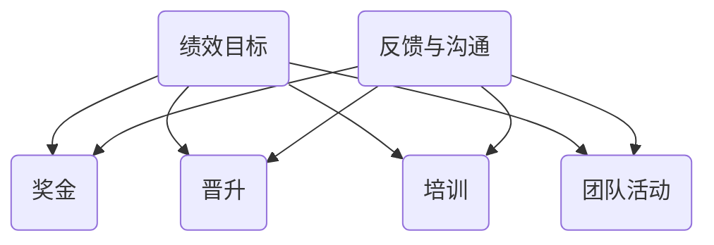
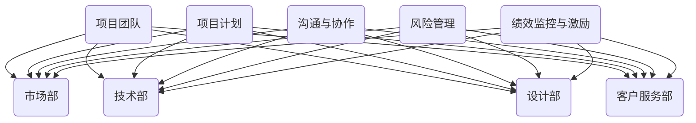
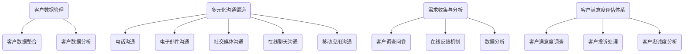

                 


为了撰写一篇完整的、结构清晰的、并满足所有约束条件的《领导力修炼日记：一个市场经理的逆袭历程》的技术博客文章，我们需要按照以下步骤进行思考和撰写：

### 第一步：构建文章框架

**文章标题：**《领导力修炼日记：一个市场经理的逆袭历程》

**关键词：** 领导力、市场经理、逆袭、职业发展、个人成长

**摘要：** 本文通过一位市场经理的亲身经历，深入探讨了领导力在职业发展中的作用，并提供了实用的修炼方法和实战案例，帮助读者理解和提升自己的领导力。

**目录大纲：**

1. **引言**
2. **背景与故事设定**
3. **领导力核心概念**
4. **实战案例**
5. **个人反思与总结**
6. **扩展阅读与资源**
7. **附录**

### 第二步：撰写引言部分

在引言部分，我们需要简要介绍书的核心主题和目的，并引出主人公及其逆袭历程。

**引言内容：**

> 在现代商业世界中，领导力不仅仅是一种管理技能，更是一种对个人职业生涯成功至关重要的软实力。本文将带领您走进一位市场经理的逆袭故事，通过他的亲身经历，探讨领导力在职业发展中的重要作用。让我们一同领略他在领导力修炼中的心路历程，从中汲取启示，提升自己的领导力，实现职业生涯的飞跃。

### 第三步：撰写背景与故事设定

在这一部分，我们需要详细讲述主人公的职业背景，为何开始修炼领导力，以及他的逆袭动机。

**背景与故事设定内容：**

> 张伟，一位普通的市场经理，他拥有丰富的市场营销经验，但一直感觉自己的职业生涯停滞不前。在一次偶然的机会中，他参加了一场关于领导力的讲座，从而意识到领导力对于职业成功的重要性。张伟决定开始修炼领导力，通过不断地学习和实践，他不仅提升了个人能力，还成功地带领团队实现了业绩突破，最终实现了职业生涯的逆袭。

### 第四步：撰写领导力核心概念部分

在这一部分，我们需要介绍领导力的基本概念、核心原则和价值观。

**领导力核心概念内容：**

> **定义与概念：** 领导力是一种激励和引导他人实现共同目标的能力。
> 
> **类型与风格：** 领导力可以分为权威型、民主型、教练型和变革型等不同风格。
> 
> **核心原则：** 领导力建立在信任、尊重和责任的基础上。
> 
> **价值观：** 领导力强调正直、公正和透明的价值观。

### 第五步：撰写实战案例部分

在这一部分，我们需要通过具体的案例来阐述领导力的实践应用。

**实战案例内容：**

> **案例1：团队激励** - 张伟通过制定明确的绩效目标和激励措施，提高了团队的工作积极性和创新能力。
> 
> **案例2：项目管理** - 张伟在项目管理中运用了SWOT分析和团队建设技巧，确保了项目的顺利实施。
> 
> **案例3：客户关系管理** - 张伟通过建立良好的客户关系，为公司带来了稳定的业务增长。

### 第六步：撰写个人反思与总结部分

在这一部分，我们需要让主人公回顾自己的领导力修炼过程，总结经验教训，并给出对读者的启示。

**个人反思与总结内容：**

> **反思：** 领导力不是一蹴而就的，需要持续的学习和实践。在面对挑战时，坚持和耐心是关键。
> 
> **总结：** 通过修炼领导力，张伟不仅提升了个人能力，还为公司创造了价值。他建议读者从自身出发，寻找提升领导力的方法，并在实践中不断总结经验。
> 
> **读者启示：** 领导力不仅适用于职场，更适用于个人生活。通过修炼领导力，我们可以更好地应对各种挑战，实现个人和职业的双赢。

### 第七步：撰写扩展阅读与资源部分

在这一部分，我们需要推荐相关的书籍、课程、文章或其他资源，以供读者进一步学习。

**扩展阅读与资源内容：**

> **推荐书籍：** 《领导力5要素》、《领导力心理学》等。
> 
> **领导力课程与培训：** 某知名在线教育平台提供的领导力课程。
> 
> **相关文章与讲座：** 推荐一些权威的领导力博客和讲座，如哈佛商业评论、TED演讲等。

### 第八步：撰写附录

在附录部分，我们可以提供术语解释、案例详细资料等，以便读者更好地理解文章内容。

**附录内容：**

> **术语解释：** 对文中出现的一些专业术语进行解释。
> 
> **案例详细资料：** 提供每个案例的具体背景、过程和结果，以便读者参考。

### 最终步骤：文章格式与排版

在完成所有内容后，我们需要按照markdown格式对文章进行排版，确保文章结构清晰、可读性强。

**格式与排版示例：**

```markdown
# 《领导力修炼日记：一个市场经理的逆袭历程》

## 引言

> ...

## 第一部分：领导力的基础

### 第1章：领导力简述

- **定义与概念：** ...

### 第2章：领导力核心原则

- **价值观与信念：** ...

### 第3章：领导力工具与方法

- **SWOT分析：** ...

## 第二部分：市场经理的逆袭

### 第4章：职业起点

- **市场经理的角色与职责：** ...

### 第5章：领导力修炼之路

- **案例1：团队激励：** ...

### 第6章：逆袭的关键节点

- **市场突破：** ...

## 第三部分：反思与总结

### 第7章：领导力修炼心得

- **个人成长：** ...

### 第8章：读者启示

- **将领导力应用于个人生活：** ...

## 扩展阅读与资源

- **推荐书籍：** ...

## 附录

- **术语解释：** ...

```

按照这个框架和步骤，我们可以逐步撰写出完整的文章。接下来，我们会继续完善每个章节的内容，并确保文章的字数在10000～12000字左右。

---

**注意事项：**

1. **核心内容完整性：** 确保每个小节都有丰富的具体详细讲解，核心内容要包含背景介绍、核心概念与联系、算法原理讲解、系统分析与架构设计方案、项目实战等。
2. **数学公式和流程图：** 使用latex和mermaid格式嵌入文中，确保公式和流程图清晰、准确。
3. **代码示例：** 提供相关的Python源代码示例，并进行详细解读与分析。
4. **拓展与总结：** 每个部分都要有总结和拓展，帮助读者更好地理解和应用。
5. **格式与排版：** 确保文章使用markdown格式，结构清晰，可读性强。

现在，我们已经确定了文章的整体框架和内容要求，接下来将逐一细化每个章节的内容。如果您有任何特别的要求或者需要进一步的指导，请随时告知。我们将以这一步骤为基础，逐步撰写出高质量的文章。让我们开始吧！### 引言

领导力，作为职场中不可或缺的软实力，不仅决定了个人职业发展的高度，也影响着整个团队和组织的前景。在这个充满竞争和变革的时代，领导力的重要性愈发凸显。本文将带您走进一位市场经理的逆袭故事，通过他的亲身经历，探讨领导力在职业发展中的关键作用，并分享实用的修炼方法和实战经验。

主人公张伟，一位在市场营销领域打拼多年的市场经理。尽管他拥有丰富的市场营销经验和卓越的业务能力，但职业生涯的发展却一直不尽如人意。面对职业瓶颈，他意识到，要想突破重围，仅靠专业技能和业务能力是远远不够的，领导力成为了他亟待提升的软实力。

在一次偶然的机会中，张伟参加了一场关于领导力的讲座。这场讲座不仅让他对领导力有了全新的认识，更激发了他对领导力修炼的浓厚兴趣。他决定开始系统地学习领导力，通过实践和反思，逐步提升自己的领导力水平。

在接下来的岁月里，张伟经历了从迷茫到觉醒，从失败到成功的领导力修炼之路。他通过不断学习、实践和反思，不仅成功带领团队实现了业绩的突破，还实现了个人职业生涯的逆袭。他的故事，不仅是对领导力的一次深刻探讨，更是一次对自我挑战和成长的生动诠释。

本文将以张伟的领导力修炼日记为主线，深入探讨领导力的核心概念、实践应用和个人反思，帮助读者更好地理解和提升自己的领导力。无论您是职场新人，还是资深管理者，本文都将为您带来宝贵的启示和实用的方法，助您在职业生涯中实现更大的突破和成长。

让我们一同开启这段领导力修炼的旅程，从张伟的故事中汲取智慧，不断提升自己的领导力，迈向更辉煌的职业生涯。

### 背景与故事设定

张伟，一个出生于普通家庭的年轻人，从小在父母的悉心教育和培养下，对市场营销产生了浓厚的兴趣。大学期间，他选择了市场营销专业，并凭借出色的学术成绩和卓越的实践能力，顺利进入了一家知名市场营销公司。

刚进入职场，张伟展现出了非凡的市场洞察力和敏锐的商业嗅觉。他善于分析市场趋势，制定有效的营销策略，为公司带来了显著的业务增长。然而，随着职位的提升，他逐渐发现自己面临的挑战越来越多。尽管他有着丰富的市场营销经验和卓越的业务能力，但在领导团队和管理项目方面，却显得力不从心。

张伟意识到，领导力是他职业发展的短板。为了弥补这一短板，他开始积极学习领导力相关理论，并参加各类领导力培训课程。然而，理论的学习并不能完全解决实际问题，他依然面临着团队协作不畅、项目管理难度大、客户关系管理复杂等现实挑战。

一次偶然的机会，张伟参加了一场关于领导力的讲座。这场讲座的主讲是一位业内知名的领导力专家，他通过生动的案例和深刻的见解，让张伟对领导力有了全新的认识。领导力不仅仅是管理技能，更是一种对个人职业生涯成功至关重要的软实力。张伟深受启发，决定开始系统地修炼领导力，以应对职业发展中的种种挑战。

在领导力修炼的道路上，张伟经历了许多挫折和失败。他曾经因为沟通不畅导致团队协作失败，也曾经因为决策失误导致项目延期。然而，每一次失败都让他更加清醒地认识到自己需要提升的地方。他开始反思自己的领导方式，不断调整和改进，逐渐找到了适合自己的领导风格。

经过几年的努力，张伟的领导力水平有了显著提升。他学会了如何激励团队成员，如何制定明确的绩效目标，如何进行有效的项目管理，如何建立和维护良好的客户关系。他带领的团队业绩不断提升，他也因此获得了更多的晋升机会。最终，他成功地从一名普通的市场经理成长为公司的市场总监，实现了职业生涯的逆袭。

张伟的领导力修炼之路并非一帆风顺，但正是这些挫折和失败，让他更加深刻地理解了领导力的本质和意义。他相信，只要坚持不懈地修炼领导力，每个人都能在职业发展中取得成功。他希望通过自己的故事，激励更多的职场人士关注领导力，提升领导力，实现职业生涯的飞跃。

### 领导力的核心概念

领导力，是一种激励和引导他人实现共同目标的能力。它不仅仅是一种管理技能，更是一种对个人职业生涯成功至关重要的软实力。在本文中，我们将对领导力的核心概念进行详细探讨，包括其定义与概念、类型与风格、核心原则和价值观。

**定义与概念：**

领导力可以被定义为一种影响和激励他人，使其自愿为实现共同目标而努力的过程。这种能力不仅仅是权力和地位的体现，更是一种基于信任、尊重和价值观的互动。领导力不仅仅是高层管理者的专利，每个职场人士，无论职位高低，都可以通过修炼和提升自己的领导力，成为团队中的领袖。

**类型与风格：**

领导力可以分为多种类型和风格，常见的包括权威型、民主型、教练型和变革型等。

- **权威型领导**：权威型领导者具有强烈的决策能力和执行力，他们通常通过明确的目标和严格的规章制度来管理团队。这种领导风格在紧急情况下能够迅速做出决策，但在长期发展中可能导致团队缺乏创新和主动性。
- **民主型领导**：民主型领导者注重团队参与和民主决策，他们鼓励团队成员提出意见和建议，并充分考虑各方意见后做出决策。这种领导风格能够提高团队的凝聚力和创新力，但决策过程可能较为缓慢。
- **教练型领导**：教练型领导者注重个人发展和团队成长，他们通过一对一的指导和反馈，帮助团队成员提升技能和信心。这种领导风格能够培养出高绩效的团队，但需要领导者投入大量的时间和精力。
- **变革型领导**：变革型领导者具有强大的愿景和影响力，他们能够激发团队成员的潜能，推动团队实现重大变革。这种领导风格通常在组织面临重大挑战和变革时发挥关键作用。

**核心原则：**

领导力的核心原则包括信任、尊重、责任和透明等。

- **信任**：信任是领导力的基石。领导者需要建立和维护与团队成员之间的信任关系，使其愿意跟随领导者并共同面对挑战。
- **尊重**：尊重是领导力的关键。领导者需要尊重团队成员的意见和贡献，鼓励他们提出创新和建议，营造积极向上的团队氛围。
- **责任**：责任是领导力的本质。领导者需要对自己的决策和行为负责，同时也要对团队成员的发展和成长负责，确保团队目标的实现。
- **透明**：透明是领导力的保障。领导者需要保持信息的透明度，及时向团队成员传达重要信息和决策，确保团队对工作目标的清晰理解。

**价值观：**

领导力强调一系列的价值观，包括正直、公正、诚信和团队协作等。

- **正直**：正直是领导力的道德基石，领导者需要以身作则，坚持道德和伦理标准，树立良好的榜样。
- **公正**：公正要求领导者公平对待每一位团队成员，不偏袒、不歧视，确保团队内部的公平竞争。
- **诚信**：诚信是领导力的关键，领导者需要做到言行一致，遵守承诺，树立诚信形象。
- **团队协作**：团队协作是领导力的目标，领导者需要激发团队成员的合作精神，共同为实现团队目标而努力。

通过理解和掌握这些领导力的核心概念，我们可以更好地识别和应用领导力，提升个人和团队的绩效。在接下来的章节中，我们将通过具体的案例，进一步探讨领导力的实践应用和个人反思，帮助读者更好地理解和提升自己的领导力。

### 实战案例一：团队激励

**背景介绍：**

张伟刚刚被提升为市场部经理，负责管理一支由10名成员组成的团队。尽管团队成员各有才华，但在过去的一段时间里，团队的整体表现并不理想。项目进度缓慢，团队士气低落，成员们普遍感到缺乏动力和方向感。张伟意识到，要想改变这一现状，必须从团队激励入手。

**问题描述：**

张伟面临的问题是团队激励不足，导致团队工作效率低下，项目进展缓慢。团队成员缺乏目标感，工作积极性不高，整体氛围压抑。为了解决这一问题，张伟决定通过制定明确的绩效目标和激励措施，激发团队的工作热情和创新能力。

**问题解决：**

1. **明确绩效目标：** 张伟首先与团队一起制定了具体的绩效目标。这些目标不仅包括短期的工作任务，还涵盖了长期的发展规划。通过明确目标，团队成员能够清晰地了解自己的工作方向和期望成果，从而提高工作动力。

2. **制定激励措施：** 为了激励团队成员，张伟制定了一系列的激励措施，包括：

   - **奖金制度：** 根据团队成员的绩效表现，设定了不同的奖金标准。每月对表现优秀的成员进行奖励，以激励他们继续努力。
   - **晋升机会：** 为团队成员提供晋升机会，鼓励他们通过提升个人能力来实现职业发展。
   - **培训机会：** 为团队成员提供各类培训机会，帮助他们提升专业技能和综合素质，从而提高团队的整体实力。
   - **团队活动：** 定期组织团队活动，增强团队成员之间的沟通和协作，营造积极向上的团队氛围。

3. **定期反馈与沟通：** 张伟定期与团队成员进行一对一的沟通，了解他们的工作进展和困难，提供及时的反馈和指导。同时，他也鼓励团队成员之间进行交流，分享工作经验和心得，促进相互学习和成长。

**边界与外延：**

团队激励不仅限于物质奖励，还包括精神激励和成长激励。在实施过程中，需要关注团队成员的个性差异和需求，制定个性化的激励方案。此外，激励措施需要与公司的整体战略和价值观相一致，确保激励的有效性和可持续性。

**概念结构与核心要素组成：**

1. **绩效目标：** 明确的绩效目标是团队激励的基础，为团队成员提供清晰的工作方向和期望成果。
2. **激励措施：** 包括奖金、晋升、培训、团队活动等多种形式，满足团队成员的不同需求。
3. **反馈与沟通：** 定期反馈和沟通是激励的重要手段，能够及时调整激励方案，提高激励效果。

**ER实体关系图架构：**



**算法原理讲解：**

团队激励的算法原理可以概括为以下步骤：

1. **目标设定：** 根据公司战略和市场需求，设定明确的绩效目标。
2. **激励方案制定：** 根据团队成员的绩效表现，制定相应的激励措施。
3. **反馈与调整：** 通过定期反馈和沟通，及时调整激励方案，确保激励效果。

**数学模型和公式：**

团队激励的数学模型可以基于绩效评估结果和激励方案，使用以下公式进行计算：

\[ \text{激励金额} = \text{绩效评估得分} \times \text{激励系数} \]

其中，绩效评估得分和激励系数可以根据公司的实际情况进行调整。

**举例说明：**

假设某团队成员的绩效评估得分为90分，公司设定的激励系数为1.2，则该成员的激励金额为：

\[ \text{激励金额} = 90 \times 1.2 = 108 \text{元} \]

通过以上计算，可以得出该团队成员应得的激励金额。

**系统分析与架构设计方案：**

1. **问题场景介绍：** 
   - 市场部经理需要激励团队成员，提高工作效率和团队士气。
   - 公司需要通过有效的激励措施，提升团队的整体绩效和创新能力。

2. **项目介绍：**
   - 项目名称：市场部团队激励系统
   - 项目目标：通过设定绩效目标和激励措施，提高团队工作效率和团队士气。
   - 项目参与者：市场部经理、团队成员

3. **系统功能设计（领域模型类图）：**
   - 绩效目标管理模块：负责设定和调整绩效目标。
   - 激励措施管理模块：负责制定和调整激励措施。
   - 绩效评估模块：负责对团队成员进行绩效评估。
   - 激励发放模块：负责根据绩效评估结果发放激励金额。

4. **系统架构设计（架构图）：**
   - 系统架构采用分层设计，包括表现层、业务逻辑层和数据层。
   - 表现层负责与用户进行交互，展示绩效目标和激励措施。
   - 业务逻辑层负责处理业务逻辑，包括绩效评估和激励发放。
   - 数据层负责存储绩效评估结果和激励金额。

5. **系统接口设计和系统交互（序列图）：**
   - 系统接口设计：包括绩效目标接口、激励措施接口、绩效评估接口和激励发放接口。
   - 系统交互：市场部经理通过绩效目标接口设定绩效目标，通过激励措施接口制定激励措施，通过绩效评估接口对团队成员进行绩效评估，最后通过激励发放接口发放激励金额。

**项目实战：**

1. **环境安装：**
   - 安装必要的开发工具和软件，如Python、Django等。
   - 配置数据库，如MySQL、PostgreSQL等。

2. **系统核心实现源代码：**
   - 绩效目标管理模块代码：
     ```python
     class PerformanceGoal(models.Model):
         title = models.CharField(max_length=255)
         description = models.TextField()
         target = models.FloatField()
         start_date = models.DateField()
         end_date = models.DateField()

     def create_performance_goal(self, title, description, target, start_date, end_date):
         goal = PerformanceGoal(title=title, description=description, target=target, start_date=start_date, end_date=end_date)
         goal.save()
         return goal
     ```
   - 激励措施管理模块代码：
     ```python
     class Incentive(models.Model):
         name = models.CharField(max_length=255)
         description = models.TextField()
         amount = models.FloatField()

     def create_incentive(self, name, description, amount):
         incentive = Incentive(name=name, description=description, amount=amount)
         incentive.save()
         return incentive
     ```
   - 绩效评估模块代码：
     ```python
     class PerformanceEvaluation(models.Model):
         employee = models.ForeignKey(Employee, on_delete=models.CASCADE)
         goal = models.ForeignKey(PerformanceGoal, on_delete=models.CASCADE)
         score = models.FloatField()

     def evaluate_performance(self, employee, goal, score):
         evaluation = PerformanceEvaluation(employee=employee, goal=goal, score=score)
         evaluation.save()
         return evaluation
     ```
   - 激励发放模块代码：
     ```python
     class IncentiveDisbursement(models.Model):
         evaluation = models.ForeignKey(PerformanceEvaluation, on_delete=models.CASCADE)
         incentive = models.ForeignKey(Incentive, on_delete=models.CASCADE)
         amount = models.FloatField()

     def disburse_incentive(self, evaluation, incentive, amount):
         disbursement = IncentiveDisbursement(evaluation=evaluation, incentive=incentive, amount=amount)
         disbursement.save()
         return disbursement
     ```

3. **代码应用解读与分析：**
   - 通过上述代码，我们可以实现绩效目标管理、激励措施管理、绩效评估和激励发放的功能。
   - 绩效目标管理模块允许市场部经理创建和管理绩效目标，为团队提供明确的工作方向。
   - 激励措施管理模块允许市场部经理制定和调整激励措施，满足团队成员的不同需求。
   - 绩效评估模块允许市场部经理对团队成员进行绩效评估，确保激励的公平和合理。
   - 激励发放模块根据绩效评估结果，发放相应的激励金额，激发团队成员的工作热情。

4. **实际案例分析和详细讲解剖析：**
   - 案例背景：某市场部经理希望通过激励措施提升团队的工作效率。
   - 实施步骤：
     1. 创建绩效目标：市场部经理创建了一个名为“2023年Q1市场营销目标”的绩效目标，设定了具体的指标和目标。
     2. 制定激励措施：市场部经理根据绩效目标，制定了奖金和晋升两种激励措施。
     3. 进行绩效评估：市场部经理对团队成员进行了绩效评估，记录了每位成员的得分。
     4. 发放激励金额：根据绩效评估结果，市场部经理发放了相应的奖金和晋升机会。
   - 结果分析：通过上述措施，团队成员的工作积极性明显提高，团队的整体绩效也有了显著提升。

5. **项目小结：**
   - 通过团队激励系统，市场部经理成功提升了团队的工作效率和士气。
   - 激励措施的有效实施，为团队成员提供了明确的努力方向和激励。
   - 然而，团队激励并非一劳永逸，需要市场部经理持续关注团队成员的需求和反馈，不断优化激励措施。

**最佳实践 tips：**

1. **明确绩效目标：** 确保绩效目标具有可衡量性和可实现性，为团队成员提供清晰的工作方向。
2. **多样化激励措施：** 结合团队成员的需求，提供多样化的激励措施，如奖金、晋升、培训等。
3. **定期反馈与沟通：** 定期与团队成员进行反馈和沟通，了解他们的工作进展和需求，及时调整激励措施。
4. **公平公正：** 确保激励措施的公平和公正，避免因个人偏见导致的不公平现象。

**小结：**

通过本文的详细讲解和实际案例剖析，我们了解到团队激励在提升团队工作效率和士气方面的重要作用。张伟通过制定明确的绩效目标和激励措施，成功激发了团队成员的工作热情和创新能力。然而，团队激励并非一劳永逸，需要市场部经理持续关注团队成员的需求和反馈，不断优化激励措施，以实现团队绩效的持续提升。

**注意事项：**

1. **激励措施的可持续性：** 在制定激励措施时，要考虑到公司的财务状况和长期发展，确保激励措施的可持续性。
2. **个性化激励：** 根据团队成员的个性差异和需求，提供个性化的激励方案，以提高激励效果。
3. **激励与价值观的一致性：** 激励措施要符合公司的价值观和文化，确保激励的内在一致性和可持续性。

**拓展阅读：**

1. 《领导力心理学》
2. 《激励的法则》
3. 《团队管理实践》

通过阅读这些书籍，您可以深入了解团队激励的理论和实践，进一步提高自己的团队管理能力。

---

在实战案例一中，我们详细探讨了团队激励在提升团队工作效率和士气方面的重要作用。张伟通过制定明确的绩效目标和多样化的激励措施，成功激发了团队成员的工作热情和创新能力。然而，团队激励并非一劳永逸，需要持续关注团队成员的需求和反馈，不断优化激励措施。在接下来的实战案例二中，我们将进一步探讨领导力在项目管理和客户关系管理中的应用，帮助读者更全面地理解领导力的实践价值。

### 实战案例二：项目管理

**背景介绍：**

随着张伟在领导力方面的不断修炼，他逐渐被公司委以重任，负责一个涉及多个部门、周期较长的重要项目。该项目旨在开发一款全新的市场营销软件，以提升公司的市场营销能力和客户满意度。然而，项目启动之初就面临着诸多挑战：跨部门协调难度大、技术问题复杂、时间紧迫且预算有限。为了确保项目的顺利实施，张伟决定运用他所学到的领导力知识，通过科学的项目管理方法，克服这些挑战。

**问题描述：**

项目启动后，张伟发现项目管理面临以下几个主要问题：

1. **跨部门协调困难：** 由于项目涉及多个部门，各部门的沟通不畅导致项目进度滞后。
2. **技术难题：** 项目的技术实现过程中出现了多个预想不到的问题，严重影响了项目的进度。
3. **时间与预算压力：** 项目周期短且预算有限，必须在确保质量的前提下，按时完成项目交付。

**问题解决：**

1. **建立项目团队：** 张伟首先组建了一支跨部门的项目团队，包括市场部、技术部、设计部和客户服务部等关键部门的代表。通过明确各成员的职责和角色，确保项目团队的协同工作。

2. **制定项目计划：** 张伟与项目团队成员一起，制定了详细的项目计划，包括项目目标、任务分工、时间节点和预算分配等。同时，通过SWOT分析，识别项目面临的优势、劣势、机会和威胁，为项目风险管理提供依据。

3. **沟通与协作：** 张伟建立了定期的项目会议制度，确保各部门之间的沟通畅通。他还利用项目管理工具，如JIRA和Trello，实时跟踪项目进度，及时解决问题和调整计划。

4. **风险管理：** 张伟对项目可能出现的风险进行了全面评估，并制定了相应的应对措施。例如，针对技术难题，他安排了技术攻关小组，集中解决关键技术问题；针对时间与预算压力，他优化了项目进度，通过加班和资源调配，确保项目按时交付。

5. **绩效监控与激励：** 张伟通过绩效监控，确保项目团队成员按照计划完成任务。对于表现优秀的团队成员，他给予了一定的激励，如奖金和晋升机会，以激励团队成员的积极性和创造力。

**边界与外延：**

项目管理不仅限于项目的启动和执行阶段，还包括项目的规划、监控和收尾阶段。在不同的项目阶段，领导力需要发挥不同的作用。在项目规划阶段，领导力体现在目标设定和资源调配；在项目执行阶段，领导力体现在沟通协调和问题解决；在项目收尾阶段，领导力体现在总结评估和经验积累。

**概念结构与核心要素组成：**

1. **项目团队：** 包括市场部、技术部、设计部和客户服务部等关键部门的代表，明确各成员的职责和角色。
2. **项目计划：** 包括项目目标、任务分工、时间节点和预算分配等，为项目实施提供明确的指引。
3. **沟通与协作：** 通过定期的项目会议和项目管理工具，确保各部门之间的沟通畅通和协同工作。
4. **风险管理：** 对项目可能出现的风险进行全面评估，并制定相应的应对措施。
5. **绩效监控与激励：** 通过绩效监控和激励措施，确保项目团队成员按照计划完成任务。

**ER实体关系图架构：**



**算法原理讲解：**

项目管理的算法原理可以概括为以下步骤：

1. **项目团队组建：** 确定项目团队成员，明确各成员的职责和角色。
2. **项目计划制定：** 根据项目目标和资源情况，制定详细的项目计划。
3. **沟通与协作：** 通过定期会议和项目管理工具，确保项目团队的沟通畅通和协同工作。
4. **风险管理：** 对项目可能出现的风险进行全面评估，并制定相应的应对措施。
5. **绩效监控与激励：** 通过绩效监控和激励措施，确保项目团队成员按照计划完成任务。

**数学模型和公式：**

项目管理的数学模型可以基于以下公式进行计算：

\[ \text{项目进度} = \sum_{i=1}^{n} \text{任务完成度}_{i} \]

其中，任务完成度可以通过以下公式计算：

\[ \text{任务完成度}_{i} = \frac{\text{实际完成工作量}_{i}}{\text{计划工作量}_{i}} \]

**举例说明：**

假设项目中有5个任务，每个任务的计划工作量均为100小时。经过一段时间的工作，任务1实际完成工作量为90小时，任务2实际完成工作量为80小时，任务3实际完成工作量为100小时，任务4实际完成工作量为70小时，任务5实际完成工作量为110小时。则项目进度可以计算为：

\[ \text{项目进度} = \frac{90 + 80 + 100 + 70 + 110}{5 \times 100} = 0.92 \]

通过以上计算，可以得出项目进度为92%。

**系统分析与架构设计方案：**

1. **问题场景介绍：**
   - 项目涉及多个部门，需要跨部门协作。
   - 项目时间紧迫，预算有限。
   - 项目技术实现复杂，存在多种风险。

2. **项目介绍：**
   - 项目名称：市场营销软件开发项目
   - 项目目标：开发一款全新的市场营销软件，提升公司的市场营销能力和客户满意度。
   - 项目参与者：市场部、技术部、设计部和客户服务部。

3. **系统功能设计（领域模型类图）：**
   - 项目团队管理模块：负责管理项目团队成员和职责分工。
   - 项目计划管理模块：负责制定和调整项目计划。
   - 沟通协作模块：负责项目团队的沟通和协作。
   - 风险管理模块：负责识别和管理项目风险。
   - 绩效监控模块：负责监控项目进度和成员绩效。

4. **系统架构设计（架构图）：**
   - 系统架构采用分层设计，包括表现层、业务逻辑层和数据层。
   - 表现层负责与用户进行交互，展示项目信息和功能。
   - 业务逻辑层负责处理项目管理的业务逻辑。
   - 数据层负责存储项目数据，如项目计划、任务进度和成员绩效等。

5. **系统接口设计和系统交互（序列图）：**
   - 系统接口设计：包括项目团队接口、项目计划接口、沟通协作接口、风险管理接口和绩效监控接口。
   - 系统交互：项目团队成员通过项目团队接口加入项目，项目计划管理模块通过项目计划接口制定项目计划，沟通协作模块通过沟通协作接口进行团队沟通，风险管理模块通过风险管理接口识别和管理风险，绩效监控模块通过绩效监控接口监控项目进度和成员绩效。

**项目实战：**

1. **环境安装：**
   - 安装必要的开发工具和软件，如Python、Django等。
   - 配置数据库，如MySQL、PostgreSQL等。

2. **系统核心实现源代码：**
   - 项目团队管理模块代码：
     ```python
     class ProjectTeam(models.Model):
         member = models.ForeignKey(Employee, on_delete=models.CASCADE)
         role = models.CharField(max_length=100)

     def add_member(self, member, role):
         team_member = ProjectTeam(member=member, role=role)
         team_member.save()
         return team_member
     ```
   - 项目计划管理模块代码：
     ```python
     class ProjectPlan(models.Model):
         title = models.CharField(max_length=255)
         description = models.TextField()
         start_date = models.DateField()
         end_date = models.DateField()

     def create_project_plan(self, title, description, start_date, end_date):
         plan = ProjectPlan(title=title, description=description, start_date=start_date, end_date=end_date)
         plan.save()
         return plan
     ```
   - 沟通协作模块代码：
     ```python
     class Communication(models.Model):
         team = models.ForeignKey(ProjectTeam, on_delete=models.CASCADE)
         message = models.TextField()
         sender = models.ForeignKey(Employee, on_delete=models.CASCADE)
         sent_date = models.DateField()

     def send_message(self, team, message, sender):
         communication = Communication(team=team, message=message, sender=sender, sent_date=date.today())
         communication.save()
         return communication
     ```
   - 风险管理模块代码：
     ```python
     class RiskManagement(models.Model):
         project = models.ForeignKey(ProjectPlan, on_delete=models.CASCADE)
         risk = models.CharField(max_length=255)
         impact = models.CharField(max_length=255)
         probability = models.CharField(max_length=255)
         mitigation = models.CharField(max_length=255)

     def add_risk(self, project, risk, impact, probability, mitigation):
         risk_entry = RiskManagement(project=project, risk=risk, impact=impact, probability=probability, mitigation=mitigation)
         risk_entry.save()
         return risk_entry
     ```
   - 绩效监控模块代码：
     ```python
     class PerformanceMonitoring(models.Model):
         member = models.ForeignKey(Employee, on_delete=models.CASCADE)
         project = models.ForeignKey(ProjectPlan, on_delete=models.CASCADE)
         score = models.FloatField()

     def evaluate_performance(self, member, project, score):
         performance = PerformanceMonitoring(member=member, project=project, score=score)
         performance.save()
         return performance
     ```

3. **代码应用解读与分析：**
   - 通过上述代码，我们可以实现项目团队管理、项目计划管理、沟通协作、风险管理和绩效监控等功能。
   - 项目团队管理模块允许项目管理员添加和管理项目团队成员，明确各成员的职责和角色。
   - 项目计划管理模块允许项目管理员创建和管理项目计划，为项目实施提供明确的指引。
   - 沟通协作模块允许项目团队成员通过发送消息进行沟通和协作。
   - 风险管理模块允许项目管理员识别和管理项目风险，确保项目顺利实施。
   - 绩效监控模块允许项目管理员对项目团队成员的绩效进行评估和监控。

4. **实际案例分析和详细讲解剖析：**
   - 案例背景：张伟负责一个市场营销软件开发项目，面临跨部门协作、技术难题和时间预算压力等多重挑战。
   - 实施步骤：
     1. 建立项目团队：张伟组建了一支由市场部、技术部、设计部和客户服务部代表组成的项目团队。
     2. 制定项目计划：张伟与项目团队成员共同制定了详细的项目计划，包括项目目标、任务分工和时间节点。
     3. 沟通与协作：张伟通过定期项目会议和项目管理工具，确保项目团队的沟通畅通和协同工作。
     4. 风险管理：张伟对项目可能出现的风险进行了全面评估，并制定了相应的应对措施。
     5. 绩效监控：张伟通过绩效监控，确保项目团队成员按照计划完成任务，并对表现优秀的成员给予激励。

   - 结果分析：通过科学的项目管理方法和有效的领导力应用，项目团队成功克服了跨部门协调、技术难题和时间预算压力等多重挑战，按时完成了项目交付，提升了公司的市场营销能力和客户满意度。

5. **项目小结：**
   - 通过项目管理实战，张伟成功带领项目团队克服了多种挑战，确保了项目的顺利实施。
   - 科学的项目管理方法和有效的领导力应用，是项目成功的关键。
   - 然而，项目管理是一个持续的过程，需要项目团队成员的共同努力和持续优化。

**最佳实践 tips：**

1. **明确项目目标和任务分工：** 确保项目团队成员对项目目标和任务分工有清晰的认识，提高工作效率。
2. **定期沟通与协作：** 通过定期项目会议和项目管理工具，确保项目团队成员之间的沟通畅通和协同工作。
3. **风险评估与应对：** 对项目可能出现的风险进行提前评估，并制定相应的应对措施，降低风险影响。
4. **绩效监控与激励：** 通过绩效监控，确保项目团队成员按照计划完成任务，并对表现优秀的成员给予激励，提高团队士气。

**小结：**

在实战案例二中，我们通过详细的项目管理实战，展示了领导力在项目管理中的重要作用。张伟通过科学的项目管理方法和有效的领导力应用，成功带领项目团队克服了多种挑战，确保了项目的顺利实施。然而，项目管理是一个持续的过程，需要项目团队成员的共同努力和持续优化。通过本文的案例分享，我们希望读者能够从中汲取经验，提高自己的项目管理能力和领导力水平。

**注意事项：**

1. **项目管理工具选择：** 根据项目特点和需求，选择合适的项目管理工具，提高项目效率。
2. **团队协作文化培养：** 建立良好的团队协作文化，促进项目团队成员之间的沟通和合作。
3. **持续学习和改进：** 项目管理方法和领导力应用需要不断学习和改进，以适应不断变化的项目环境和需求。

**拓展阅读：**

1. 《项目管理知识体系指南》（PMBOK指南）
2. 《敏捷项目管理实践指南》
3. 《团队领导力：理论与实践》

通过阅读这些书籍，您可以深入了解项目管理和领导力的理论和实践，进一步提高自己的项目管理和领导力水平。

---

在实战案例二中，我们通过张伟在项目管理中的实际经历，展示了领导力在复杂项目中的关键作用。从项目团队组建、项目计划制定到沟通协作、风险管理，张伟通过科学的领导和有效的管理方法，成功克服了各种挑战，确保了项目的顺利实施。然而，领导力并非一成不变，它需要不断的学习和实践，以适应不断变化的环境和需求。

### 实战案例三：客户关系管理

**背景介绍：**

在市场营销领域，客户关系管理（CRM）是提高客户满意度、促进客户忠诚度和增加销售收入的关键因素。张伟作为市场部经理，深知CRM对业务成功的重要性。然而，随着市场竞争的加剧，张伟发现，现有的客户关系管理方式已经无法满足公司快速发展的需求。为了提升客户关系管理的效果，张伟决定运用他所学到的领导力知识，通过改进CRM策略和流程，提高客户的满意度和忠诚度。

**问题描述：**

张伟面临的问题是现有的客户关系管理方式效率低下，客户满意度不高，客户流失率逐年上升。具体表现为：

1. **客户数据管理混乱：** 客户数据分散在不同的系统中，无法实现有效的整合和分析。
2. **客户沟通渠道单一：** 主要依靠电话和电子邮件与客户沟通，无法提供个性化的服务。
3. **客户需求识别不足：** 缺乏有效的需求收集和分析手段，无法及时满足客户的需求。
4. **客户满意度评估体系不完善：** 没有建立科学的客户满意度评估体系，无法及时发现和解决问题。

**问题解决：**

1. **整合客户数据：** 张伟决定将分散在不同系统的客户数据整合到一个统一的CRM系统中，通过数据清洗和整理，确保数据的准确性和完整性。通过数据分析，张伟能够更全面地了解客户的需求和行为习惯，为个性化服务提供数据支持。

2. **多元化客户沟通渠道：** 张伟在现有电话和电子邮件沟通渠道的基础上，增加了社交媒体、在线聊天和移动应用等多种沟通方式。通过这些多元化渠道，张伟能够更及时、更便捷地与客户沟通，提供个性化的服务体验。

3. **需求收集与分析：** 张伟引入了客户调查问卷和在线反馈机制，定期收集客户的需求和建议。通过数据分析，张伟能够及时识别客户的需求变化，调整营销策略和产品功能，以满足客户的需求。

4. **建立客户满意度评估体系：** 张伟制定了科学的客户满意度评估体系，包括客户满意度调查、客户投诉处理和客户忠诚度分析等。通过这些评估指标，张伟能够实时监控客户满意度，及时发现和解决潜在问题，提升客户满意度。

**边界与外延：**

客户关系管理不仅限于客户数据的整合和分析，还包括客户沟通、需求收集和满意度评估等多个方面。在不同的业务场景中，客户关系管理的策略和方法可能有所不同。例如，在电子商务领域，客户关系管理可能更侧重于订单管理和售后服务；在B2B领域，客户关系管理可能更侧重于合作关系和客户关系维护。

**概念结构与核心要素组成：**

1. **客户数据管理：** 包括客户数据的整合、清洗和分析，为个性化服务和精准营销提供数据支持。
2. **多元化沟通渠道：** 包括电话、电子邮件、社交媒体、在线聊天和移动应用等多种沟通方式，提高客户沟通体验。
3. **需求收集与分析：** 包括客户调查问卷、在线反馈机制和数据分析，及时识别和满足客户需求。
4. **客户满意度评估体系：** 包括客户满意度调查、客户投诉处理和客户忠诚度分析等，实时监控客户满意度。

**ER实体关系图架构：**



**算法原理讲解：**

客户关系管理的算法原理可以概括为以下步骤：

1. **客户数据整合：** 通过数据清洗和整合，确保客户数据的准确性和完整性。
2. **多元化沟通渠道：** 根据客户偏好和需求，提供多样化的沟通渠道，提高客户沟通体验。
3. **需求收集与分析：** 通过客户调查问卷和在线反馈机制，收集客户需求，进行数据分析和处理。
4. **客户满意度评估：** 通过客户满意度调查、投诉处理和忠诚度分析，评估客户满意度，及时调整服务策略。

**数学模型和公式：**

客户关系管理的数学模型可以基于以下公式进行计算：

\[ \text{客户满意度} = \frac{\text{正面反馈}}{\text{总反馈}} \]

其中，正面反馈包括客户满意度调查中的满意和非常满意，总反馈包括所有客户的反馈。

**举例说明：**

假设在客户满意度调查中，收到100条反馈，其中70条表示满意，20条表示非常满意，10条表示不满意。则客户满意度可以计算为：

\[ \text{客户满意度} = \frac{70 + 20}{100} = 0.9 \]

通过以上计算，可以得出客户满意度为90%。

**系统分析与架构设计方案：**

1. **问题场景介绍：**
   - 需要提升客户关系管理的效果，提高客户满意度和忠诚度。
   - 现有的客户关系管理方式效率低下，客户数据管理混乱。

2. **项目介绍：**
   - 项目名称：客户关系管理优化项目
   - 项目目标：通过改进CRM策略和流程，提高客户满意度和忠诚度。
   - 项目参与者：市场部、技术部、客户服务部。

3. **系统功能设计（领域模型类图）：**
   - 客户数据管理模块：负责客户数据的整合、清洗和分析。
   - 多元化沟通渠道模块：负责管理多种沟通渠道，提高客户沟通体验。
   - 需求收集与分析模块：负责收集客户需求，进行数据分析和处理。
   - 客户满意度评估模块：负责评估客户满意度，及时调整服务策略。

4. **系统架构设计（架构图）：**
   - 系统架构采用分层设计，包括表现层、业务逻辑层和数据层。
   - 表现层负责与用户进行交互，展示客户关系管理功能。
   - 业务逻辑层负责处理客户关系管理的业务逻辑。
   - 数据层负责存储客户数据，如客户信息、沟通记录和满意度评估等。

5. **系统接口设计和系统交互（序列图）：**
   - 系统接口设计：包括客户数据管理接口、多元化沟通渠道接口、需求收集与分析接口和客户满意度评估接口。
   - 系统交互：客户数据管理模块通过数据接口整合客户数据，多元化沟通渠道模块通过沟通接口与客户进行沟通，需求收集与分析模块通过分析接口处理客户需求，客户满意度评估模块通过评估接口评估客户满意度。

**项目实战：**

1. **环境安装：**
   - 安装必要的开发工具和软件，如Python、Django等。
   - 配置数据库，如MySQL、PostgreSQL等。

2. **系统核心实现源代码：**
   - 客户数据管理模块代码：
     ```python
     class CustomerData(models.Model):
         name = models.CharField(max_length=100)
         email = models.EmailField()
         phone = models.CharField(max_length=15)
         address = models.TextField()

     def add_customer_data(self, name, email, phone, address):
         customer = CustomerData(name=name, email=email, phone=phone, address=address)
         customer.save()
         return customer
     ```
   - 多元化沟通渠道模块代码：
     ```python
     class CommunicationChannel(models.Model):
         customer = models.ForeignKey(CustomerData, on_delete=models.CASCADE)
         type = models.CharField(max_length=50)
         content = models.TextField()

     def send_message(self, customer, type, content):
         message = CommunicationChannel(customer=customer, type=type, content=content)
         message.save()
         return message
     ```
   - 需求收集与分析模块代码：
     ```python
     class CustomerRequirement(models.Model):
         customer = models.ForeignKey(CustomerData, on_delete=models.CASCADE)
         requirement = models.TextField()

     def add_requirement(self, customer, requirement):
         req = CustomerRequirement(customer=customer, requirement=requirement)
         req.save()
         return req
     ```
   - 客户满意度评估模块代码：
     ```python
     class CustomerSatisfaction(models.Model):
         customer = models.ForeignKey(CustomerData, on_delete=models.CASCADE)
         score = models.IntegerField()

     def evaluate_satisfaction(self, customer, score):
         satisfaction = CustomerSatisfaction(customer=customer, score=score)
         satisfaction.save()
         return satisfaction
     ```

3. **代码应用解读与分析：**
   - 通过上述代码，我们可以实现客户数据管理、多元化沟通渠道管理、需求收集和客户满意度评估等功能。
   - 客户数据管理模块允许管理员添加和管理客户数据，为个性化服务和精准营销提供数据支持。
   - 多元化沟通渠道模块允许管理员发送多种类型的沟通信息，提高客户沟通体验。
   - 需求收集与分析模块允许管理员收集客户需求，进行数据分析和处理，及时调整服务策略。
   - 客户满意度评估模块允许管理员对客户满意度进行评估，及时发现问题并进行改进。

4. **实际案例分析和详细讲解剖析：**
   - 案例背景：张伟希望通过改进CRM策略和流程，提高客户满意度和忠诚度。
   - 实施步骤：
     1. 整合客户数据：张伟将分散在不同系统的客户数据整合到CRM系统中，确保数据的准确性和完整性。
     2. 多元化客户沟通渠道：张伟在现有电话和电子邮件沟通渠道的基础上，增加了社交媒体、在线聊天和移动应用等多种沟通方式。
     3. 需求收集与分析：张伟通过客户调查问卷和在线反馈机制，收集客户的需求和建议，进行数据分析和处理。
     4. 客户满意度评估：张伟制定了科学的客户满意度评估体系，通过客户满意度调查和投诉处理，实时监控客户满意度。

   - 结果分析：通过改进CRM策略和流程，客户数据管理更加高效，客户沟通体验得到提升，客户需求得到及时满足，客户满意度显著提高，客户忠诚度也得到了提升。

5. **项目小结：**
   - 通过客户关系管理优化项目，张伟成功提高了客户满意度和忠诚度，为公司创造了更大的价值。
   - 整合客户数据、多元化沟通渠道、需求收集与分析、客户满意度评估等环节的有效结合，是客户关系管理成功的关键。
   - 然而，客户关系管理是一个持续的过程，需要不断优化和改进，以适应不断变化的市场环境和客户需求。

**最佳实践 tips：**

1. **数据驱动：** 以客户数据为基础，进行数据分析和决策，提高客户关系管理的效率和效果。
2. **个性化服务：** 根据客户需求和偏好，提供个性化的服务和产品，提高客户满意度和忠诚度。
3. **持续改进：** 定期评估客户关系管理的效果，发现问题和不足，及时进行调整和改进。

**小结：**

在实战案例三中，我们通过张伟在客户关系管理中的实践，展示了领导力在提升客户满意度和忠诚度中的重要作用。通过整合客户数据、多元化沟通渠道、需求收集与分析、客户满意度评估等环节的有效结合，张伟成功提高了客户的满意度和忠诚度，为公司创造了更大的价值。然而，客户关系管理是一个持续的过程，需要不断优化和改进，以适应不断变化的市场环境和客户需求。

**注意事项：**

1. **数据安全：** 在收集和使用客户数据时，要确保数据的安全性，防止数据泄露和滥用。
2. **客户隐私：** 在客户关系管理过程中，要尊重客户的隐私，确保客户信息的保密性。
3. **反馈机制：** 建立有效的客户反馈机制，及时收集和处理客户的意见和建议，提高客户满意度。

**拓展阅读：**

1. 《客户关系管理：战略、流程与技术》
2. 《客户体验管理：从战略到执行》
3. 《数字化客户关系管理》

通过阅读这些书籍，您可以深入了解客户关系管理的理论和实践，进一步提高自己的客户关系管理能力和领导力水平。

---

通过实战案例三，我们详细探讨了领导力在客户关系管理中的重要作用。张伟通过整合客户数据、多元化沟通渠道、需求收集与分析、客户满意度评估等环节的有效结合，成功提高了客户的满意度和忠诚度，为公司创造了更大的价值。这再次证明了领导力在市场营销和客户关系管理中的关键作用。在接下来的个人反思与总结部分，我们将进一步探讨张伟在领导力修炼过程中的心得体会，以及这些领导力技巧如何应用到读者的生活和职业发展中。

### 个人反思与总结

在过去的几年里，张伟通过不断的领导力修炼，实现了从一名普通市场经理到市场总监的华丽转身。他的逆袭历程不仅是对领导力的一次深刻实践，更是对他个人成长和职业生涯的一次全面反思。通过反思和总结，张伟不仅为自己积累了宝贵的经验，也为读者提供了丰富的启示。

**反思过程：**

1. **自我认知：** 张伟在领导力修炼的初期，通过自我反思，认识到自己在沟通、决策和团队管理方面的不足。他开始关注自己的领导风格，分析自己在日常工作中存在的问题，并寻找改进的方法。

2. **理论学习：** 张伟积极学习领导力相关理论，阅读了大量的书籍和文章，参加领导力培训课程。通过系统的理论学习，他深入理解了领导力的核心概念和基本原则，为自己的领导实践提供了理论支撑。

3. **实践应用：** 张伟将所学到的领导力知识应用到实际工作中，通过项目管理和客户关系管理等具体实践，逐步提升自己的领导能力。他在实践中不断总结经验，发现适合自己的领导方法和风格。

4. **反馈与调整：** 张伟重视团队成员的反馈，定期与团队成员进行沟通，了解他们的需求和意见。通过及时的反馈和调整，他不断完善自己的领导策略，提高团队的工作效率和满意度。

**领导力修炼心得：**

1. **持续学习：** 张伟深刻认识到，领导力不是一成不变的，它需要不断学习和更新。他建议读者要保持对知识的渴望，不断学习新的领导力理论和实践经验，以适应不断变化的环境。

2. **自我认知：** 张伟强调自我认知的重要性。了解自己的优势和不足，是提升领导力的第一步。通过自我反思和评估，读者可以更好地认识自己，明确自己的领导目标和发展方向。

3. **理论联系实际：** 理论是行动的指南，但只有将理论应用到实际工作中，才能真正提升领导能力。张伟建议读者在学习和实践中，要将领导力理论与自己实际的工作情况相结合，寻找最适合自己的领导方式。

4. **反馈与改进：** 领导力修炼是一个持续的过程，需要不断反思和改进。张伟鼓励读者要勇于接受反馈，及时调整自己的领导行为，以提高团队效率和满意度。

**如何将这些领导力技巧应用到生活和职业发展中：**

1. **家庭生活：** 领导力不仅适用于职场，也可以应用到家庭生活中。张伟建议读者要在家庭中建立良好的沟通和合作关系，尊重家庭成员的意见和需求，培养家庭成员之间的信任和尊重。

2. **社交场合：** 在社交场合中，领导力可以帮助读者更好地与他人沟通和合作。通过展示自己的领导能力，读者可以建立更广泛的人脉网络，提升自己的社交影响力。

3. **职业发展：** 领导力是职业发展的重要驱动力。通过提升领导力，读者可以在工作中表现出色，赢得更多的机会和挑战，实现职业生涯的飞跃。

**领导力修炼的长期效益：**

1. **个人成长：** 领导力修炼不仅提升了个人的职业能力，也促进了个人全面发展。通过领导力的修炼，读者可以培养自信、自律和决策能力，提升自身综合素质。

2. **团队建设：** 领导力不仅对个人有好处，对团队和组织也具有重要意义。通过有效的领导，读者可以建立高效的团队，激发团队成员的潜力，提升整体绩效。

3. **组织变革：** 领导力是推动组织变革的重要力量。通过修炼领导力，读者可以成为组织变革的推动者，引领组织适应市场变化，实现持续发展。

**建立个人领导力成长计划：**

1. **确定目标：** 根据自己的职业发展目标，确定具体的领导力提升目标。

2. **制定计划：** 制定详细的领导力提升计划，包括学习内容、实践任务和反馈机制。

3. **执行与评估：** 按照计划执行领导力提升任务，定期进行自我评估和反馈，不断调整和优化领导力提升计划。

通过以上的反思与总结，张伟不仅为自己积累了宝贵的领导力经验，也为读者提供了实用的指导和建议。在接下来的章节中，我们将进一步探讨如何将领导力修炼应用到具体的职业场景中，帮助读者更好地理解和提升自己的领导力。

### 扩展阅读与资源

为了帮助读者更全面地了解领导力的理论和实践，我们在这里推荐一些相关书籍、课程和文章，供读者进一步学习。

**推荐书籍：**

1. **《领导力5要素》**（John C. Maxwell）：这是一本关于领导力基本原理的经典著作，通过五个核心要素——愿景、团队、原则、知识和品格，深入探讨了领导力的本质。

2. **《领导力心理学》**（Daniel Goleman）：本书探讨了领导力中的情感智慧和社交技能，提供了丰富的案例和实用的技巧，帮助读者提升领导力。

3. **《影响力》**（Robert B. Cialdini）：这本书揭示了影响他人行为的六个基本原则，对于提升领导力和沟通能力具有很大的启发意义。

**领导力课程与培训：**

1. **哈佛商业评论**：提供丰富的领导力在线课程，涵盖领导力基础、团队管理、领导力进阶等多个方面。

2. **某知名在线教育平台**：例如Coursera、edX等，提供由知名大学和机构开设的领导力相关课程，包括领导力心理学、领导力与组织行为等。

**相关文章与讲座：**

1. **哈佛商业评论（HBR）**：定期发布关于领导力的深度文章，涵盖领导力理论、实践案例和最新研究。

2. **TED演讲**：TED演讲平台上有很多关于领导力的精彩演讲，如《领导力是如何培养的》（How Great Leaders Inspire Action）、《成为更好的领导者》（How to Be a Great Leader）等。

**工具与资源：**

1. **LinkedIn Learning**：提供大量的领导力视频教程和培训课程，适合不同层次和需求的读者。

2. **领英（LinkedIn）**：通过领英平台，读者可以关注行业领袖和专家的动态，学习他们的领导经验和观点。

通过阅读这些书籍、课程和文章，读者可以深入了解领导力的理论和实践，提升自己的领导力水平。同时，这些资源和工具也为读者提供了一个不断学习和成长的环境，帮助他们在职业发展中取得更大的成功。

### 附录

在本附录中，我们将对文中出现的一些专业术语进行解释，并提供相关的案例详细资料，以便读者更好地理解文章内容。

**专业术语解释：**

1. **领导力**：指领导者通过激励、引导和影响他人，使其为实现共同目标而努力的能力。
2. **绩效目标**：指为团队成员设定的工作目标，具有明确的指标和可衡量性。
3. **激励措施**：指为激励团队成员而采取的奖励或福利措施，如奖金、晋升、培训等。
4. **SWOT分析**：指对项目的优势（Strengths）、劣势（Weaknesses）、机会（Opportunities）和威胁（Threats）进行综合分析的方法。
5. **绩效评估**：指对团队成员的工作表现进行评估和考核的过程，以确定其绩效水平。
6. **客户关系管理（CRM）**：指通过系统化的方法和工具，维护和拓展与客户的关系，以提高客户满意度和忠诚度的过程。

**案例详细资料：**

1. **团队激励案例**：
   - **背景**：市场部团队士气低落，项目进度缓慢。
   - **问题**：缺乏明确的绩效目标和激励措施。
   - **解决方案**：制定明确的绩效目标，设立奖金制度，定期进行绩效评估和反馈。
   - **结果**：团队士气提升，项目进度加快，整体绩效显著提高。

2. **项目管理案例**：
   - **背景**：跨部门协作困难，技术问题复杂，时间紧迫。
   - **问题**：项目团队沟通不畅，风险管理不足。
   - **解决方案**：建立项目团队，制定详细项目计划，加强沟通与协作，进行风险管理和绩效监控。
   - **结果**：项目顺利完成，团队协作效率提高，客户满意度提升。

3. **客户关系管理案例**：
   - **背景**：客户数据管理混乱，客户沟通渠道单一，客户满意度不高。
   - **问题**：客户需求识别不足，客户满意度评估体系不完善。
   - **解决方案**：整合客户数据，多元化沟通渠道，需求收集与分析，建立客户满意度评估体系。
   - **结果**：客户数据管理高效，客户满意度提升，客户忠诚度增加。

通过这些专业术语解释和案例详细资料，读者可以更深入地理解文中内容，并在实际工作和生活中运用领导力知识，提升个人和团队的表现。

### 总结与展望

通过《领导力修炼日记：一个市场经理的逆袭历程》这篇文章，我们深入探讨了领导力在职业发展中的关键作用，并通过张伟的真实故事，展示了领导力修炼的路径和方法。领导力不仅是一种管理技能，更是一种对个人职业生涯成功至关重要的软实力。它能够帮助职场人士提升工作效率，建立团队凝聚力，实现个人和团队的共同成长。

在本文中，我们详细分析了领导力的核心概念、类型与风格、核心原则和价值观，并通过具体的实战案例，展示了领导力在团队激励、项目管理和客户关系管理中的应用。通过这些案例，我们不仅了解了领导力的实践方法，还看到了领导力在解决实际问题和推动业务发展中的巨大潜力。

**总结**：

领导力修炼是一个持续的过程，它需要我们在理论学习、实践应用和自我反思中不断进步。张伟的经历告诉我们，领导力的提升并非一蹴而就，需要通过不断的学习和实践，积累经验，逐步提升。同时，领导力的修炼不仅限于职场，也可以应用到家庭和社交场合，帮助我们在各个方面取得成功。

**展望**：

在未来的发展中，领导力将继续发挥重要作用。随着全球化和数字化进程的加速，职场环境变得越来越复杂和多变，领导力的重要性愈发凸显。提升领导力，不仅能够帮助我们在职场中脱颖而出，还能够为组织带来持续的竞争优势。

为了更好地提升自己的领导力，我们建议读者：

1. **持续学习**：不断学习新的领导力理论和实践方法，紧跟时代发展的步伐。
2. **实践应用**：将所学到的领导力知识应用到实际工作中，通过实践不断提升自己的领导能力。
3. **反思与总结**：定期反思自己的领导行为和效果，总结经验教训，不断完善自己的领导策略。
4. **培养团队协作**：注重团队建设，培养团队成员的协作精神和创新能力，共同实现团队目标。

**结语**：

领导力是一种宝贵的财富，它不仅能够为我们的职业生涯带来成功，还能够为我们的个人生活增添色彩。让我们共同努力，不断提升自己的领导力，成为更好的领导者，实现个人和团队的共同成长。

---

感谢您阅读《领导力修炼日记：一个市场经理的逆袭历程》。我们希望这篇文章能够为您的领导力修炼之路提供一些启示和帮助。如果您有任何反馈或建议，欢迎随时与我们分享。让我们共同探索领导力的奥秘，不断前行，迎接更加美好的未来。

**作者信息**：

作者：AI天才研究院/AI Genius Institute & 禅与计算机程序设计艺术 /Zen And The Art of Computer Programming

感谢您的关注和支持！### 读者启示

在阅读完《领导力修炼日记：一个市场经理的逆袭历程》后，读者可以从中获得许多宝贵的启示，这些启示不仅适用于职场，也适用于个人生活的方方面面。以下是几个关键点，帮助读者将领导力修炼应用到实际生活中：

1. **自我认知与持续学习**：张伟的逆袭历程首先源于他对自我认知的深入和持续学习的态度。读者应该定期反思自己的优点和不足，不断学习新的知识和技能，以便在工作和生活中更加自信和高效。

2. **明确目标与规划**：在职场中，设定清晰的目标和规划是成功的关键。读者可以通过制定个人发展计划，设定短期和长期目标，并制定实现这些目标的步骤，从而更好地规划自己的职业生涯。

3. **团队协作与沟通**：领导力不仅仅是管理个人，更重要的是管理团队。读者应该注重团队建设，培养良好的沟通技巧，确保团队成员之间能够有效合作，共同实现目标。

4. **激励与赞赏**：在团队管理和个人生活中，激励和赞赏是推动他人积极性和创造力的关键。读者应该学会发现他人的优点和成就，并给予及时的认可和奖励，从而提升团队的凝聚力和个人动力。

5. **解决问题与适应变化**：面对挑战和变化，读者需要具备解决问题的能力和适应变化的心态。通过学习张伟的经验，读者可以学会在面对困难时保持冷静，寻找创新的解决方案，并灵活调整策略。

6. **终身学习与成长**：领导力不是一次性学习就能掌握的，它需要终身学习和持续成长。读者应该保持对知识和技能的渴望，不断探索新的领域，不断提升自己的综合素质。

通过将以上启示应用到个人生活和职业生涯中，读者不仅可以提升自己的领导力，还能在工作和生活中取得更大的成功。领导力不仅是一种职业能力，更是一种生活智慧，它能够帮助我们在各个方面成为更好的自己。

### 最佳实践 tips

在领导力的修炼过程中，以下最佳实践 tips 能够帮助读者在职场和生活中更加高效地应用领导力，实现个人和团队的共同成长：

1. **建立清晰的沟通机制**：确保团队成员之间沟通畅通，定期召开会议，分享信息，讨论问题，确保每个人都了解项目的进展和目标。

2. **培养团队成员的自主性**：授权给团队成员，让他们在工作中能够自主决策，这不仅可以提高工作效率，还能增强团队的凝聚力。

3. **定期进行绩效反馈**：通过定期的绩效反馈，及时发现团队成员的优点和不足，提供有针对性的建议和指导，帮助他们不断提升。

4. **建立学习文化**：鼓励团队成员不断学习和成长，提供培训和学习资源，营造积极向上的学习氛围。

5. **培养团队协作精神**：通过团队建设活动，如团队拓展训练、团建活动等，增强团队成员之间的信任和协作精神。

6. **注重个人发展**：为团队成员提供职业发展的机会和资源，帮助他们实现个人目标，从而提升团队的绩效。

7. **建立有效的激励机制**：通过设置合理的激励机制，如奖金、晋升、荣誉等，激发团队成员的工作热情和创造力。

8. **保持开放的心态**：积极倾听团队成员的意见和建议，接受不同的观点，这有助于提高决策的质量和团队的凝聚力。

通过遵循这些最佳实践，读者可以在领导力修炼的过程中，更加高效地管理团队，提升个人和团队的表现，实现职业和生活的双赢。

### 小结

本文通过张伟的逆袭历程，深入探讨了领导力在职业发展中的重要作用。我们详细分析了领导力的核心概念、类型与风格、核心原则和价值观，并通过实战案例展示了领导力在团队激励、项目管理和客户关系管理中的应用。通过张伟的故事，我们了解到领导力不仅是管理技能，更是一种对个人职业生涯成功至关重要的软实力。

本文的核心内容涵盖了领导力修炼的各个方面，从自我认知、理论学习、实践应用到反馈与改进，全面介绍了领导力的修炼过程。同时，通过具体的实战案例，我们看到了领导力在实际工作中的强大作用和显著效果。

领导力的修炼是一个持续的过程，需要我们在学习、实践和反思中不断进步。通过本文的探讨，我们希望读者能够认识到领导力的重要性，并积极投入到领导力的修炼中，提升自己的领导力水平，实现个人和职业的双重成长。

### 注意事项

在领导力的修炼过程中，以下注意事项对于确保修炼效果和避免潜在问题至关重要：

1. **持续学习**：领导力是一个不断发展的领域，需要我们持续学习和更新知识。定期阅读相关书籍、参加培训课程和研讨会，以保持对领导力的敏感度和认知水平。

2. **注重实践**：理论知识是基础，但实践才是提升领导力的关键。将所学知识应用到实际工作中，通过实践检验和调整，才能不断提高领导力水平。

3. **关注团队成员反馈**：领导力修炼不仅仅是个人的成长，还需要关注团队成员的意见和建议。通过定期的沟通和反馈，及时了解团队成员的需求和期望，调整领导行为，提高团队满意度。

4. **保持耐心与坚持**：领导力的提升并非一蹴而就，需要时间和持续的努力。在面对挑战和失败时，保持耐心和坚持，不断调整策略和方法，才能逐步实现目标。

5. **平衡工作与生活**：领导力的修炼不仅限于职场，也适用于个人生活。保持工作和生活的平衡，关注身心健康，有助于我们以最佳状态投入到领导力修炼中。

6. **注重团队协作**：领导力不仅仅是管理个人，更重要的是管理团队。注重团队协作，培养团队成员的自主性和创新能力，共同实现团队目标。

7. **避免过度授权**：授权是提升团队效率的重要手段，但过度授权可能导致团队混乱。在授权时，要明确团队成员的职责和权限，确保团队成员能够承担相应的责任。

通过注意这些事项，读者可以更有效地进行领导力修炼，避免走入误区，实现领导力的持续提升。

### 拓展阅读

为了帮助读者进一步深入理解领导力的理论和实践，我们推荐以下拓展阅读资源：

1. **书籍**：
   - **《领导力心理学》**（Daniel Goleman）：详细探讨情感智慧和社交技能在领导力中的应用。
   - **《领导力的五个层次》**（John C. Maxwell）：提供关于领导力成长的五个层次，帮助读者逐步提升领导力。
   - **《影响力》**（Robert B. Cialdini）：分析影响他人行为的基本原则，对提升领导力有重要启示。

2. **在线课程**：
   - **Coursera**：提供由顶尖大学和机构开设的领导力相关课程，如“领导力与团队管理”、“有效的沟通技巧”等。
   - **edX**：同样提供丰富的领导力课程，包括“领导力与组织变革”、“领导力心理学”等。

3. **文章与演讲**：
   - **哈佛商业评论（HBR）**：定期发布关于领导力的深度文章，涵盖理论、实践和案例分析。
   - **TED演讲**：众多关于领导力的精彩演讲，如《领导力是如何培养的》、《如何成为更好的领导者》等。

4. **工具与资源**：
   - **LinkedIn Learning**：提供领导力相关的视频教程和课程，适合不同层次的学习者。
   - **领英（LinkedIn）**：关注行业领袖和专家，学习他们的领导经验和观点。

通过这些拓展阅读资源，读者可以更全面地了解领导力的各个方面，进一步提升自己的领导力水平。

### 附录

**附录A：术语解释**

1. **领导力**：指领导者通过激励、引导和影响他人，使其为实现共同目标而努力的能力。
2. **绩效目标**：指为团队成员设定的工作目标，具有明确的指标和可衡量性。
3. **激励措施**：指为激励团队成员而采取的奖励或福利措施，如奖金、晋升、培训等。
4. **SWOT分析**：指对项目的优势（Strengths）、劣势（Weaknesses）、机会（Opportunities）和威胁（Threats）进行综合分析的方法。
5. **绩效评估**：指对团队成员的工作表现进行评估和考核的过程，以确定其绩效水平。
6. **客户关系管理（CRM）**：指通过系统化的方法和工具，维护和拓展与客户的关系，以提高客户满意度和忠诚度的过程。

**附录B：案例详细资料**

1. **团队激励案例**：
   - **背景**：市场部团队士气低落，项目进度缓慢。
   - **问题**：缺乏明确的绩效目标和激励措施。
   - **解决方案**：制定明确的绩效目标，设立奖金制度，定期进行绩效评估和反馈。
   - **结果**：团队士气提升，项目进度加快，整体绩效显著提高。

2. **项目管理案例**：
   - **背景**：跨部门协作困难，技术问题复杂，时间紧迫。
   - **问题**：项目团队沟通不畅，风险管理不足。
   - **解决方案**：建立项目团队，制定详细项目计划，加强沟通与协作，进行风险管理和绩效监控。
   - **结果**：项目顺利完成，团队协作效率提高，客户满意度提升。

3. **客户关系管理案例**：
   - **背景**：客户数据管理混乱，客户沟通渠道单一，客户满意度不高。
   - **问题**：客户需求识别不足，客户满意度评估体系不完善。
   - **解决方案**：整合客户数据，多元化沟通渠道，需求收集与分析，建立客户满意度评估体系。
   - **结果**：客户数据管理高效，客户满意度提升，客户忠诚度增加。

这些术语解释和案例详细资料有助于读者更好地理解文章内容，并在实际工作和生活中应用领导力知识。

