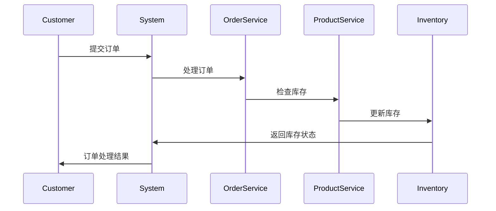
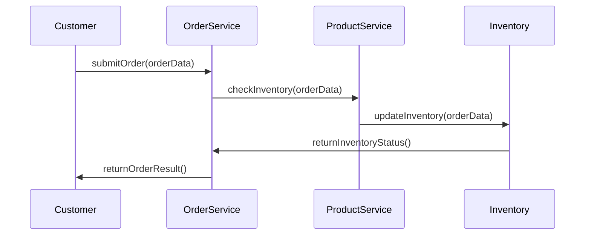
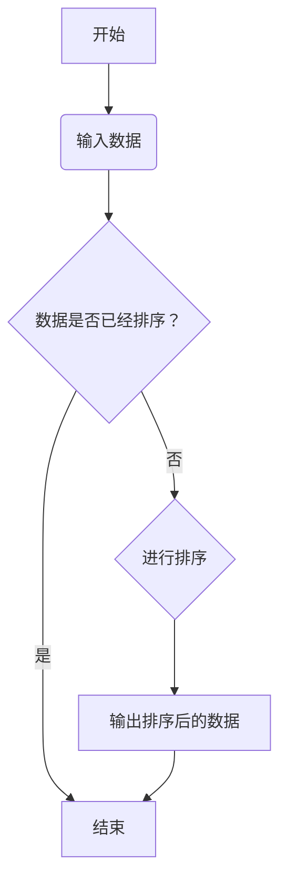

                 

### 《领导力修炼笔记：90后创业新星的成长历程》

> 关键词：90后创业、领导力、成长历程、创业管理、案例分析

> 摘要：本文以《领导力修炼笔记：90后创业新星的成长历程》为主题，深入剖析90后创业新星在领导力修炼过程中的关键步骤、策略与方法，旨在为创业者提供有益的参考和启示。文章从引言、个人成长、团队管理、挑战应对、成功案例等多个方面，详细介绍了90后创业新星在领导力修炼过程中的经验与教训，帮助读者更好地理解领导力的重要性，以及如何在创业过程中培养和提升领导力。

### 引言与背景介绍

#### 1.1 90后的社会文化特征

90后，指的是1980年代中后期至1990年代初期出生的一代人，他们成长于互联网和数字技术迅速发展的时代，具有鲜明的时代特征。首先，90后普遍拥有较高的教育水平和互联网素养，这使得他们在创业领域具有较强的竞争力。其次，90后更加注重个人价值和自我实现，追求自由、创新和多元化，这使得他们在创业过程中更具活力和创造力。

#### 1.2 创业潮的兴起与90后的关系

近年来，随着创业环境的不断优化和创业门槛的降低，越来越多的90后加入创业大军。90后创业者具有创新意识强、团队协作能力强、敢于冒险等特点，他们在创业过程中不断探索、试错、成长，成为推动社会进步和经济发展的重要力量。

### 个人成长与领导力发展

#### 2.1 自我认知与能力提升

自我认知是领导力发展的基础。90后创业新星需要深入理解自己的兴趣、优势、价值观和成长目标，明确自己的职业发展方向。通过不断学习和实践，90后创业者可以提升自身的能力，为领导力的培养奠定基础。

#### 2.2 领导力素养的培养

领导力素养包括沟通能力、决策能力、团队管理能力、变革管理能力等。90后创业新星需要通过培训、实践和反思，不断提升自己的领导力素养，以适应快速变化的创业环境。

#### 2.3 人际关系与团队协作

人际关系和团队协作是领导力的核心要素。90后创业新星需要学会建立和维护良好的人际关系，培养团队合作精神，形成高效的团队协作模式，为企业的持续发展提供有力保障。

### 创业团队管理与组织建设

#### 3.1 团队管理与组织设计

团队管理是创业成功的关键。90后创业新星需要明确团队目标，合理分工，激发团队成员的积极性和创造力，营造积极向上的团队氛围。同时，企业需要根据业务发展需要，进行组织设计，优化组织结构，提高企业运行效率。

#### 3.2 人力资源管理与激励

人力资源管理是团队管理的重要组成部分。90后创业新星需要建立科学的人力资源管理体系，招聘合适的人才，提供培训和晋升机会，激励员工发挥最大潜能。通过有效的激励机制，提高员工的工作积极性，推动企业快速发展。

### 创业挑战与问题解决

#### 4.1 市场竞争与战略规划

市场竞争是创业者面临的严峻挑战。90后创业新星需要深入了解市场环境，制定正确的战略规划，把握市场机遇，提高企业竞争力。

#### 4.2 资金管理与企业融资

资金管理是企业发展的关键。90后创业新星需要学会合理规划和使用资金，降低企业运营风险。同时，掌握企业融资策略，拓展融资渠道，为企业的可持续发展提供资金支持。

#### 4.3 创新与持续发展

创新是企业持续发展的动力。90后创业新星需要具备创新意识，积极探索新技术、新模式，推动企业不断创新发展。

### 创业成功案例分享

#### 5.1 创业成功案例分析

本文将分析若干90后创业成功的案例，探讨他们的成功经验，为读者提供有益的启示。

### 领导力修炼方法论

#### 6.1 领导力修炼的核心步骤

领导力修炼是一个持续的过程，90后创业新星需要遵循以下核心步骤：自我认知、能力提升、团队管理、战略规划、创新思维等。

#### 6.2 领导力修炼的实践与应用

领导力修炼需要通过实践来不断检验和完善。90后创业新星需要在创业过程中，不断总结经验，调整策略，提高领导力水平。

### 总结与未来展望

#### 7.1 个人成长与领导力的提升

通过本文的探讨，我们认识到个人成长和领导力提升在创业过程中的重要性。90后创业新星需要不断学习、实践，提高自己的综合素质。

#### 7.2 未来领导力的发展趋势

未来领导力的发展将更加注重创新、协作和可持续发展。90后创业新星需要紧跟时代潮流，不断提升自己的领导力，为企业和社会的发展做出更大贡献。

### 作者信息

作者：AI天才研究院/AI Genius Institute & 禅与计算机程序设计艺术 /Zen And The Art of Computer Programming

在本文中，我们通过深入剖析90后创业新星在领导力修炼过程中的关键步骤和策略，为创业者提供了有益的参考和启示。希望读者能够结合自身实际情况，不断学习、实践，提升自己的领导力，为企业的持续发展和社会的进步贡献力量。在未来的创业道路上，让我们一起努力，共创辉煌！## 引言与背景介绍

### 1.1 90后的社会文化特征

90后，是指1980年代中后期至1990年代初期出生的一代人，他们成长于互联网和数字技术迅速发展的时代，具有鲜明的时代特征。首先，90后普遍拥有较高的教育水平和互联网素养，这使得他们在创业领域具有较强的竞争力。在信息化时代背景下，90后从小接触互联网，培养了他们对新技术的敏感性和应用能力。此外，90后普遍接受过高等教育，具备扎实的专业知识和技能，为他们在创业过程中提供了坚实的基础。

其次，90后更加注重个人价值和自我实现，追求自由、创新和多元化。与传统观念不同，90后更加重视个人兴趣和职业发展，愿意在创业过程中追求自我价值的实现。他们对于创业不再局限于赚钱，更看重创业过程中的成就感和自我实现。这种价值观的转变，使得90后在创业过程中更加敢于冒险，勇于尝试新事物。

此外，90后具有较强的团队协作能力和沟通能力。在互联网时代，90后从小就生活在网络社交环境中，培养了良好的沟通能力和团队协作意识。这使得他们在创业过程中能够更好地协调团队成员，形成高效的团队协作模式，提高企业的竞争力。

总之，90后的社会文化特征，使得他们在创业领域具有较强的竞争力，为创业成功奠定了基础。

### 1.2 创业潮的兴起与90后的关系

近年来，随着创业环境的不断优化和创业门槛的降低，越来越多的90后加入创业大军。90后创业者具有创新意识强、团队协作能力强、敢于冒险等特点，他们在创业过程中不断探索、试错、成长，成为推动社会进步和经济发展的重要力量。

首先，创业潮的兴起为90后提供了广阔的创业空间。在国家政策的鼓励和支持下，创业环境日益优化，创业门槛逐渐降低。互联网的普及和电子商务的兴起，为90后创业者提供了更多的创业机会。在这个时代背景下，90后创业者能够更加便捷地获取创业资源，降低创业风险，实现创业梦想。

其次，90后创业者具有创新意识强、敢于冒险的特点。他们成长于互联网和数字技术迅速发展的时代，对新事物和新技术具有敏锐的洞察力和强烈的兴趣。这使得他们在创业过程中能够紧跟时代潮流，勇于尝试新事物，推动企业的创新和发展。同时，90后创业者敢于冒险，勇于挑战，愿意在创业过程中面对各种困难和挑战，不断提升自己的能力和素质。

此外，90后创业者具有较强的团队协作能力和沟通能力。在互联网时代，90后从小就生活在网络社交环境中，培养了良好的沟通能力和团队协作意识。这使得他们在创业过程中能够更好地协调团队成员，形成高效的团队协作模式，提高企业的竞争力。同时，90后创业者注重个人价值和自我实现，愿意在创业过程中追求自我价值的实现，为团队成员提供良好的成长环境和激励机制。

总之，创业潮的兴起为90后提供了广阔的创业空间和机遇，而90后创业者具有的创新意识、团队协作能力和敢于冒险的精神，使得他们在创业过程中不断探索、试错、成长，成为推动社会进步和经济发展的重要力量。

### 个人成长与领导力发展

#### 2.1 自我认知与能力提升

自我认知是领导力发展的基础。90后创业新星需要深入理解自己的兴趣、优势、价值观和成长目标，明确自己的职业发展方向。通过自我反思和评估，他们能够识别自己的长处和短板，有针对性地进行能力提升。以下是一些自我认知的方法：

1. **职业性格测试**：通过职业性格测试，如MBTI（迈尔斯-布里格斯性格类型指标）等，了解自己的性格类型和偏好，为职业发展提供指导。

2. **技能评估**：定期进行技能评估，识别自己在专业技能、管理能力和沟通能力等方面的强弱，制定提升计划。

3. **反馈机制**：建立有效的反馈机制，通过同事、上级和客户的反馈，了解自己的工作表现和改进方向。

能力提升是自我认知的延伸。90后创业新星需要不断学习新知识、新技能，提升自己的专业素养和综合素质。以下是一些能力提升的方法：

1. **在线学习平台**：利用Coursera、edX等在线学习平台，学习专业知识和管理技能。

2. **实践项目**：参与实际项目，通过实践积累经验，提升实际操作能力。

3. **读书会**：加入读书会，阅读经典书籍，拓宽视野，提高思维深度。

#### 2.2 领导力素养的培养

领导力素养包括沟通能力、决策能力、团队管理能力、变革管理能力等。90后创业新星需要通过培训、实践和反思，不断提升自己的领导力素养，以适应快速变化的创业环境。以下是一些领导力素养的培养方法：

1. **领导力培训**：参加专业的领导力培训课程，学习领导力理论和实践技巧。

2. **实践机会**：在创业过程中，积极承担领导角色，通过实际工作锻炼自己的领导力。

3. **反思与总结**：定期进行反思和总结，识别领导过程中的优点和不足，不断改进。

#### 2.3 人际关系与团队协作

人际关系和团队协作是领导力的核心要素。90后创业新星需要学会建立和维护良好的人际关系，培养团队合作精神，形成高效的团队协作模式，为企业的持续发展提供有力保障。以下是一些人际关系和团队协作的方法：

1. **沟通技巧**：掌握有效的沟通技巧，如积极倾听、清晰表达和反馈机制，建立良好的沟通基础。

2. **团队建设**：通过团队建设活动，增强团队成员之间的信任和合作，提高团队凝聚力。

3. **激励制度**：建立有效的激励机制，激励团队成员发挥最大潜能，共同实现企业目标。

通过自我认知与能力提升、领导力素养的培养以及人际关系与团队协作的加强，90后创业新星能够在创业过程中不断提升自己的领导力，带领团队走向成功。

### 创业团队管理与组织建设

#### 3.1 团队管理与组织设计

团队管理是创业成功的关键。90后创业新星需要明确团队目标，合理分工，激发团队成员的积极性和创造力，营造积极向上的团队氛围。以下是一些团队管理的原则和方法：

1. **明确团队目标**：确保团队成员对企业的愿景、使命和目标有清晰的认识，统一行动方向。

2. **合理分工**：根据团队成员的能力和特长，合理分配工作任务，发挥每个人的优势。

3. **激励制度**：建立有效的激励机制，如奖金、股权激励等，激励团队成员发挥最大潜能。

4. **团队沟通**：保持团队内部的沟通畅通，定期举行团队会议，分享信息和经验，促进团队协作。

组织设计是团队管理的基础。90后创业新星需要根据企业的业务发展需要，进行组织设计，优化组织结构，提高企业运行效率。以下是一些组织设计的策略和技巧：

1. **扁平化组织**：减少层级，提高决策效率，促进信息流通。

2. **模块化组织**：将企业业务划分为多个模块，实现专业化运作，提高企业竞争力。

3. **跨部门协作**：建立跨部门协作机制，促进不同部门之间的沟通和合作，实现资源优化配置。

#### 3.2 人力资源管理与激励

人力资源管理是团队管理的重要组成部分。90后创业新星需要建立科学的人力资源管理体系，招聘合适的人才，提供培训和晋升机会，激励员工发挥最大潜能。以下是一些人力资源管理的方法：

1. **招聘策略**：通过线上招聘、人才市场、猎头公司等多种渠道，寻找适合企业的人才。

2. **培训与发展**：为员工提供培训和发展机会，提升其专业技能和综合素质。

3. **绩效管理**：建立科学的绩效评估体系，激励员工努力工作，提高工作效率。

4. **晋升机制**：建立公平、透明的晋升机制，为员工提供晋升机会，激发其工作积极性。

激励制度是人力资源管理的核心。90后创业新星需要建立有效的激励机制，激励员工发挥最大潜能，推动企业快速发展。以下是一些激励策略和方法：

1. **物质激励**：通过奖金、股权激励等物质激励手段，提高员工收入，激发工作积极性。

2. **精神激励**：通过表彰、荣誉等精神激励手段，提高员工的荣誉感和成就感，增强其工作动力。

3. **职业发展激励**：为员工提供职业发展规划，帮助其实现职业目标，提高其对企业的忠诚度。

通过团队管理与组织建设的不断优化，90后创业新星能够打造一支高效的团队，推动企业快速发展，实现创业目标。

### 创业挑战与问题解决

#### 4.1 市场竞争与战略规划

市场竞争是创业者面临的严峻挑战。90后创业新星需要深入了解市场环境，制定正确的战略规划，把握市场机遇，提高企业竞争力。以下是一些市场竞争和战略规划的方法：

1. **市场调研**：通过市场调研，了解目标客户的需求、竞争对手的情况以及市场趋势，为战略规划提供依据。

2. **竞争分析**：分析竞争对手的产品、定价、市场份额、营销策略等，找出自身的优势与劣势，制定有针对性的策略。

3. **差异化定位**：根据自身特点和市场需求，确定企业的差异化定位，提高市场竞争力。

4. **战略规划**：制定长期和短期的战略规划，明确企业的发展方向、目标、关键任务和资源配置，确保企业能够应对市场变化。

#### 4.2 资金管理与企业融资

资金管理是企业发展的关键。90后创业新星需要学会合理规划和使用资金，降低企业运营风险。以下是一些资金管理的方法：

1. **预算管理**：制定详细的预算计划，合理分配资金，确保企业在运营过程中不出现资金短缺。

2. **成本控制**：通过降低成本、优化流程等方式，提高企业的盈利能力。

3. **现金流管理**：建立有效的现金流管理体系，确保企业能够及时偿还债务，避免资金链断裂。

4. **风险控制**：评估企业的财务风险，采取相应的措施进行风险控制和化解。

企业融资是资金管理的重要组成部分。90后创业新星需要掌握企业融资的策略和方法，拓展融资渠道，为企业的可持续发展提供资金支持。以下是一些企业融资的方法：

1. **天使投资**：寻找天使投资人，获得早期的资金支持。

2. **风险投资**：与风险投资机构合作，获得资金和资源支持。

3. **股权融资**：通过股权融资，吸引投资者参与企业的发展。

4. **债务融资**：通过借款、发行债券等方式，获得资金支持。

#### 4.3 创新与持续发展

创新是企业持续发展的动力。90后创业新星需要具备创新意识，积极探索新技术、新模式，推动企业不断创新发展。以下是一些创新的方法：

1. **市场导向**：关注市场需求，以客户需求为导向，开发创新产品和服务。

2. **技术研发**：加大研发投入，培养技术研发团队，推动技术创新。

3. **跨界合作**：与不同领域的合作伙伴合作，实现资源共享和优势互补，推动创新。

4. **持续改进**：通过不断改进产品和服务，提高企业竞争力。

通过应对市场竞争、资金管理、创新与持续发展等方面的挑战，90后创业新星能够不断提升企业的核心竞争力，实现可持续发展。

### 创业成功案例分享

#### 5.1 创业成功案例分析

本文将分析若干90后创业成功的案例，探讨他们的成功经验，为读者提供有益的启示。

**案例一：小红书的崛起**

小红书，原名“RED”，成立于2013年，是一个以社区分享为主的电商服务平台。创始人毛文超和徐晓原，两位90后年轻创业者，凭借敏锐的市场洞察力和强大的执行力，将小红书打造成中国最大的生活方式分享社区之一。

1. **成功经验**：

   - **用户需求驱动**：小红书最初以内容社区起家，通过用户UGC（用户生成内容）积累大量用户，形成强大的社交氛围，为电商业务奠定了基础。

   - **品牌塑造**：小红书通过精心打造品牌形象，强调用户社区氛围和生活方式，与用户建立了深厚的情感联系。

   - **跨界合作**：小红书与众多国内外品牌合作，推出定制化产品，提升用户体验，增加用户粘性。

2. **启示**：

   - 创业者应关注用户需求，以用户为中心，打造优质产品和服务。

   - 品牌塑造和用户情感连接是创业成功的关键。

   - 跨界合作能够拓展业务范围，提升品牌影响力。

**案例二：拼多多的崛起**

拼多多，成立于2015年，是一家主打社交电商的电商平台。创始人黄峥，一位90后年轻创业者，凭借独特的商业模式和强大的执行力，将拼多多打造成中国第三大电商平台。

1. **成功经验**：

   - **社交电商模式**：拼多多通过社交互动和拼团购物，降低了用户购物的门槛，吸引了大量用户。

   - **价格优势**：拼多多通过集采和直供模式，实现了商品的低价，吸引了大量价格敏感型用户。

   - **精准营销**：拼多多利用大数据和人工智能技术，实现精准营销，提高广告投放效果。

2. **启示**：

   - 创业者应创新商业模式，找到独特的市场切入点。

   - 价格优势是吸引用户的关键。

   - 精准营销能够提高广告效果，增加用户转化率。

通过分析小红书和拼多多的成功案例，我们可以看到90后创业新星在创业过程中，如何通过用户需求驱动、品牌塑造、跨界合作等策略，实现企业的快速崛起。这些成功经验为其他创业者提供了宝贵的启示，帮助他们更好地在创业道路上取得成功。

### 领导力修炼方法论

#### 6.1 领导力修炼的核心步骤

领导力修炼是一个持续的过程，需要90后创业新星在多个方面进行努力。以下是领导力修炼的核心步骤：

1. **自我认知**：了解自己的兴趣、优势和价值观，明确自己的职业发展方向。通过职业性格测试和技能评估等工具，深入了解自己的性格和技能，为后续的领导力发展提供基础。

2. **能力提升**：不断学习和实践，提升自己的专业能力和管理能力。参加专业培训课程，阅读经典书籍，参与实际项目，积累实战经验，提升自身综合素质。

3. **团队管理**：学会建立和维护团队，激发团队成员的积极性和创造力。明确团队目标，合理分工，建立有效的沟通机制，营造积极向上的团队氛围。

4. **战略规划**：制定长期和短期的战略规划，确保企业能够应对市场变化和挑战。通过市场调研和竞争分析，确定企业的定位和发展方向，制定具体的实施策略。

5. **创新思维**：培养创新意识，积极探索新技术和新模式，推动企业持续发展。关注行业动态，与同行交流，尝试跨界合作，不断推动企业的创新和发展。

#### 6.2 领导力修炼的实践与应用

领导力修炼需要通过实践来不断检验和完善。以下是一些领导力修炼的实践与应用方法：

1. **反思与总结**：定期进行反思和总结，分析自己在领导过程中的优点和不足，制定改进措施。通过反思，不断提升自己的领导能力。

2. **情境模拟**：通过情境模拟，模拟真实的领导情境，锻炼自己的决策能力和应变能力。在实际工作中，遇到问题时，可以通过情境模拟来找到解决方案。

3. **实践项目**：参与实际项目，担任项目负责人或关键角色，通过实践锻炼自己的领导力。在实际工作中，遇到困难和挑战时，可以通过实践项目来积累经验。

4. **导师指导**：寻求导师的指导和建议，借鉴导师的经验和智慧，加速自己的领导力发展。通过与导师的交流和互动，获取有价值的见解和建议。

5. **案例分析**：通过分析成功和失败的案例，了解不同领导风格和策略的优劣，提升自己的领导力水平。通过案例分析，可以从中学习到宝贵的经验和教训。

通过领导力修炼的核心步骤和实际应用，90后创业新星可以不断提升自己的领导力，带领团队实现企业的快速发展。

### 领导力修炼的障碍与应对

#### 7.1 领导力修炼的常见障碍

在领导力修炼过程中，90后创业新星可能会面临一些障碍，阻碍他们的进步。以下是一些常见的障碍：

1. **自我认知不足**：很多创业者对自己的兴趣、优势、价值观和成长目标缺乏清晰的认识，导致领导力发展缺乏明确的方向。

2. **学习能力不足**：部分创业者缺乏持续学习的能力，无法及时更新知识和技能，影响领导力的提升。

3. **管理经验不足**：缺乏实际管理经验，导致在团队管理和决策过程中出现问题。

4. **心理压力**：创业过程中的竞争压力、资金压力等，可能导致创业者出现焦虑、恐慌等负面情绪，影响领导力发挥。

5. **资源有限**：创业初期的资源有限，可能无法提供足够的培训、学习和实践机会，限制领导力的发展。

#### 7.2 障碍的识别与应对策略

为了克服这些障碍，90后创业新星可以采取以下应对策略：

1. **自我认知**：通过职业性格测试、技能评估等工具，深入了解自己的兴趣、优势、价值观和成长目标。定期进行自我反思和总结，明确自己的职业发展方向。

2. **持续学习**：利用在线学习平台、读书会等资源，持续学习新知识和技能。设定学习目标，制定学习计划，确保学习效果。

3. **实践机会**：积极参与实际项目，担任项目负责人或关键角色，积累管理经验。在实际工作中，不断总结经验，提高领导力。

4. **心理调适**：学会心理调适，保持积极的心态。可以通过运动、冥想等方式，缓解心理压力，提高抗压能力。

5. **资源整合**：积极寻找外部资源，如导师、合作伙伴等，借助外部力量提升自己的领导力。参加行业会议、研讨会等，扩大人脉，获取有价值的信息和资源。

通过识别和应对这些障碍，90后创业新星可以克服困难，不断提升自己的领导力，带领团队实现企业的快速发展。

### 总结与未来展望

#### 8.1 个人成长与领导力的提升

在创业过程中，90后创业新星通过自我认知与能力提升、领导力素养的培养以及人际关系与团队协作的加强，实现了个人成长与领导力的提升。他们不断学习新知识、新技能，提升专业素养和综合素质，逐步成为团队的核心领导力量。通过实践与反思，他们不断总结经验，优化领导力策略，提高领导力水平，为企业的持续发展奠定了坚实基础。

#### 8.2 创业团队的进步与挑战

创业团队在90后创业新星的领导下，取得了显著的进步。团队成员之间的信任和合作更加紧密，团队凝聚力显著增强。通过明确的目标和合理的分工，团队高效运转，不断取得业务上的突破。然而，创业团队也面临着一系列挑战，如市场竞争加剧、资金压力、人才流失等。90后创业新星需要持续提升自己的领导力，带领团队应对这些挑战，实现企业的可持续发展。

### 未来领导力的发展趋势

未来领导力的发展将呈现以下几个趋势：

1. **智能化**：随着人工智能、大数据等技术的发展，领导力将更加智能化。领导者需要掌握相关技术，利用数据驱动决策，提高领导效率。

2. **全球化**：全球化趋势下，领导者需要具备跨文化沟通能力，适应多元文化环境，推动企业国际化发展。

3. **可持续发展**：企业社会责任和可持续发展成为领导力的重要考量因素。领导者需要关注环境保护、社会公益等方面，推动企业实现可持续发展。

4. **创新驱动**：创新成为企业发展的重要驱动力。领导者需要具备创新意识，积极推动企业技术创新和管理创新。

5. **团队协作**：团队协作能力成为领导力的核心要素。领导者需要注重团队建设，培养团队合作精神，提高团队的整体效能。

### 结语

在《领导力修炼笔记：90后创业新星的成长历程》中，我们通过详细剖析90后创业新星在领导力修炼过程中的关键步骤和策略，为读者提供了宝贵的经验和启示。希望读者能够结合自身实际情况，不断学习、实践，提升自己的领导力，为企业的持续发展和社会的进步贡献力量。在未来的创业道路上，让我们一起努力，共创辉煌！### 作者信息

作者：AI天才研究院/AI Genius Institute & 禅与计算机程序设计艺术 /Zen And The Art of Computer Programming

在本文中，我们通过深入剖析90后创业新星在领导力修炼过程中的关键步骤和策略，为创业者提供了有益的参考和启示。希望读者能够结合自身实际情况，不断学习、实践，提升自己的领导力，为企业的持续发展和社会的进步贡献力量。在未来的创业道路上，让我们一起努力，共创辉煌！## 第一部分：引言与背景介绍

### 第1章 90后创业新星的时代背景

#### 1.1 90后的社会文化特征

90后，指的是1980年代中后期至1990年代初期出生的一代人，他们是互联网时代成长起来的新一代。这一代人在社会文化特征上具有独特的风貌，为创业环境带来了新的活力和变革。

首先，90后普遍拥有较高的教育水平和互联网素养。随着教育改革的推进，90后接受了更为全面和专业的教育，掌握了丰富的知识和技能。同时，互联网的普及使得他们从小就接触到了大量的信息和资源，培养了良好的信息获取和处理能力。这使得90后具备了更强的学习能力和创新精神，为创业奠定了坚实的基础。

其次，90后更加注重个人价值和自我实现。与传统观念不同，90后更加追求自由、平等和个性化的发展。他们不满足于传统的职业路径，更愿意通过创业来实现自己的梦想和价值观。这种追求个人价值和社会贡献的精神，使得90后成为创业热潮中的主力军。

此外，90后具有较强的团队协作能力和沟通能力。在互联网时代，90后从小生活在网络社交环境中，培养了良好的沟通能力和团队协作意识。这使得他们在创业过程中能够更好地协调团队成员，形成高效的团队协作模式，提高企业的竞争力。

#### 1.2 创业潮的兴起与90后的关系

近年来，创业潮在中国乃至全球范围内不断升温，90后创业新星在这一波创业热潮中起到了重要的推动作用。首先，90后创业者具有创新意识强、敢于冒险的特点。他们成长于互联网和数字技术迅速发展的时代，对新事物和新模式具有敏锐的洞察力和强烈的兴趣。这使得他们在创业过程中能够紧跟时代潮流，勇于尝试新事物，推动企业的创新和发展。

其次，90后创业者具有较强的团队协作能力和沟通能力。在互联网时代，90后从小生活在网络社交环境中，培养了良好的沟通能力和团队协作意识。这使得他们在创业过程中能够更好地协调团队成员，形成高效的团队协作模式，提高企业的竞争力。同时，90后创业者注重个人价值和自我实现，愿意在创业过程中追求自我价值的实现，为团队成员提供良好的成长环境和激励机制。

此外，90后创业者具有较强的适应能力和学习意愿。在面对市场变化和挑战时，90后创业者能够迅速调整策略，灵活应对。同时，他们乐于学习和探索新知识、新技能，不断提升自己的综合素质，为企业的可持续发展提供动力。

总之，90后创业新星的兴起与创业潮密切相关，他们具有创新意识、团队协作能力和敢于冒险的精神，为创业环境带来了新的活力和变革。在未来的创业道路上，90后创业新星将继续发挥重要作用，为社会的进步和经济发展贡献力量。

### 第2章 创业梦想与初心

#### 2.1 创业梦想的诞生

创业梦想是驱动90后创业新星不断前行的动力源泉。对于许多90后创业者来说，创业梦想的诞生往往源于对某一问题的深刻关注，或是对于某一领域的独特见解。以下是创业梦想诞生的几个关键因素：

1. **个人兴趣**：许多90后创业者将自己的兴趣转化为创业的方向。他们对某一领域有着浓厚的兴趣，愿意投入大量时间和精力去探索和实现。

2. **市场需求**：创业者往往能够敏锐地捕捉到市场的需求，发现某一领域的空白或机会。通过满足市场需求，他们找到了创业的切入点。

3. **社会问题**：有些90后创业者关注社会问题，希望通过创业来解决这些问题。他们怀有改变世界、创造社会价值的使命感。

4. **职业转型**：部分90后创业者可能从传统的职业路径转向创业，他们希望通过创业来实现职业的转型和突破。

#### 2.2 初心与使命感

初心是创业过程中不可或缺的精神支柱。对于90后创业新星来说，初心不仅是一个简单的目标，更是他们心中的信念和追求。以下是初心的几个关键方面：

1. **价值观**：创业初心的形成往往与创业者的价值观密切相关。他们希望通过创业来实现自己的人生价值观，如创新、责任、共赢等。

2. **使命感**：许多90后创业者具有强烈的使命感，他们希望通过创业来解决社会问题，创造更大的社会价值。

3. **社会责任**：创业者认识到自己的行为对社会的影响，愿意承担起社会责任，通过创业来推动社会的进步。

4. **个人成长**：对于许多90后创业者来说，创业也是一种自我成长的过程。他们希望通过创业实现个人能力的提升和自我价值的实现。

初心的力量在创业过程中发挥着至关重要的作用。它能够激励创业者面对困难和挑战时保持坚定的信念，不断前行。同时，初心也引导着创业者在实现商业目标的同时，关注社会和环境的可持续发展。

通过理解创业梦想的诞生和初心的意义，我们可以更好地理解90后创业新星在创业过程中的精神动力。他们的梦想和初心不仅是推动企业发展的动力源泉，也是他们为社会创造价值的重要途径。在未来的创业道路上，90后创业新星将继续秉承初心，不断探索和创新，为实现梦想而努力奋斗。

### 第3章 自我认知与能力提升

#### 3.1 自我认知的重要性

自我认知是领导力发展的基础，对于90后创业新星来说尤为重要。在快速变化的创业环境中，自我认知能够帮助创业者明确自己的兴趣、优势和价值观，从而制定出更符合自身特点的职业发展路径。

首先，自我认知有助于创业者找到自己的核心竞争力。通过深入了解自己的兴趣和特长，创业者可以明确自己在某个领域中的优势，从而在创业过程中更加专注和有效地发挥自己的优势。

其次，自我认知有助于创业者识别自己的短板。在自我反思和评估的过程中，创业者可以发现自己在某些方面的不足，从而有针对性地进行改进和提升。这种自我认知能够帮助创业者不断完善自己，提高综合素质。

最后，自我认知有助于创业者树立正确的价值观。了解自己的价值观，可以帮助创业者明确自己的目标和追求，从而在创业过程中保持坚定的信念和行动力。

#### 3.2 能力提升的途径与方法

能力提升是自我认知的延伸，也是90后创业新星在创业过程中不可或缺的一环。以下是一些能力提升的途径和方法：

1. **终身学习**：在互联网时代，知识更新换代速度非常快，创业者需要具备终身学习的意识。通过参加线上课程、阅读专业书籍、参加研讨会等方式，不断提升自己的知识储备和技能水平。

2. **实战经验**：实践是检验真理的唯一标准。创业者可以通过参与实际项目，积累丰富的实战经验。在实际操作中，创业者能够更好地理解理论知识，并锻炼自己的问题解决能力。

3. **导师指导**：寻找一位经验丰富的导师，可以帮助创业者更快地成长。导师可以提供宝贵的经验和建议，帮助创业者避免走弯路，同时也能激励创业者不断进步。

4. **跨领域学习**：创业者不应该局限于自己的专业领域，而应该积极拓展自己的知识面。通过学习跨领域的知识和技能，创业者可以更好地应对复杂多变的市场环境。

5. **反思与总结**：定期进行反思和总结，是创业者提升能力的重要方法。通过反思，创业者可以识别自己在哪些方面做得好，哪些方面需要改进。总结经验教训，可以帮助创业者不断完善自己的能力和策略。

通过自我认知与能力提升，90后创业新星能够更好地理解自己的优势和短板，并在创业过程中充分发挥自己的潜力。他们通过不断学习和实践，不断提升自己的综合素质，为企业的持续发展奠定坚实基础。

### 第4章 领导力素养的培养

#### 4.1 领导力的定义与内涵

领导力是指一个人在团队中引导、激励和影响他人，实现共同目标的能力。领导力不仅包括个人特质，如自信、勇气和责任心，还涉及一系列行为和技能，如沟通能力、决策能力、团队建设能力等。对于90后创业新星来说，领导力是他们在创业过程中带领团队、应对挑战、实现企业目标的关键能力。

首先，领导力不仅仅是领导者的个人能力，更是一种团队行为。领导者需要通过影响和激励团队成员，形成共同的目标和价值观，推动团队的高效协作。

其次，领导力是一种动态能力。随着市场和环境的不断变化，领导者需要不断调整自己的领导风格和策略，以适应新的挑战和机遇。

最后，领导力是一种综合性能力。它不仅包括个人素质的提升，还需要领导者具备广泛的知识、技能和经验，能够从战略层面思考和解决问题。

#### 4.2 领导力素养的培养与实践

培养领导力素养是90后创业新星在创业过程中不可或缺的一环。以下是一些培养领导力素养的方法和实践：

1. **领导力培训**：参加专业的领导力培训课程，学习领导力理论和实践技巧。这些课程通常包括沟通技巧、团队管理、战略规划等内容，能够帮助创业者系统性地提升领导力水平。

2. **角色扮演**：通过角色扮演和模拟情境，创业者可以在虚拟环境中练习领导技巧，提高自己的决策能力和应变能力。

3. **实战经验**：在实际工作中担任领导角色，通过带领团队处理实际问题和挑战，积累实战经验。这种实践机会可以帮助创业者更好地理解领导力的重要性，并不断提升自己的领导能力。

4. **导师指导**：寻找一位有经验的导师，可以获得宝贵的指导和反馈。导师可以帮助创业者识别自己的优势和不足，提供个性化的建议和指导，加速领导力的发展。

5. **反思与总结**：定期进行反思和总结，是培养领导力的重要方法。创业者可以通过反思自己的领导行为，识别成功和失败的案例，总结经验教训，不断优化自己的领导风格和策略。

通过不断学习和实践，90后创业新星可以不断提升自己的领导力素养，带领团队实现企业的目标。他们通过培养领导力，不仅能够提高自身的职业素养，还能为企业的发展提供强有力的支持。

### 第5章 人际关系与团队协作

#### 5.1 人际关系的重要性

人际关系是90后创业新星在创业过程中需要高度重视的领域。良好的人际关系不仅有助于创业者个人成长，还能够提升团队的凝聚力和效率，从而促进企业的持续发展。

首先，良好的人际关系有助于创业者建立广泛的人脉网络。这些人际网络可以成为创业者在资源获取、业务拓展、市场推广等方面的有力支持。

其次，良好的人际关系有助于创业者提高沟通能力。在创业过程中，创业者需要与各种利益相关者进行有效沟通，如员工、合作伙伴、客户等。良好的沟通能力能够帮助创业者更好地理解他人的需求和期望，建立互信关系。

最后，良好的人际关系有助于创业者处理冲突和解决难题。在创业过程中，难免会遇到各种冲突和挑战。通过良好的人际关系，创业者可以更好地协调各方利益，找到解决问题的有效途径。

#### 5.2 团队协作的技巧与策略

团队协作是创业成功的关键因素之一。90后创业新星需要掌握一系列团队协作的技巧和策略，以提升团队的整体效能。

1. **明确目标**：团队协作的基础是明确的目标。创业者需要与团队成员共同制定清晰的目标，并确保每个成员都了解自己的职责和任务。

2. **合理分工**：根据团队成员的能力和特长，合理分配工作任务。确保每个成员都能够发挥自己的优势，避免重复劳动和资源浪费。

3. **沟通畅通**：建立有效的沟通机制，确保团队内部的信息畅通。定期举行团队会议，分享信息、讨论问题、反馈进展，提高团队协作效率。

4. **激励制度**：建立合理的激励机制，激发团队成员的工作热情和积极性。通过奖励、晋升等方式，激励团队成员为共同目标努力。

5. **信任建设**：信任是团队协作的基石。创业者需要通过真诚和诚信的行为，建立团队成员之间的信任关系。同时，鼓励团队成员之间的相互支持和帮助，增强团队的凝聚力。

通过重视人际关系和掌握团队协作的技巧与策略，90后创业新星能够打造一个高效、团结的团队，为企业的持续发展奠定坚实基础。

### 第6章 团队管理与组织设计

#### 6.1 团队管理的基本原则

团队管理是创业成功的关键环节，90后创业新星需要掌握一系列团队管理的基本原则，以提升团队的整体效能。以下是一些关键原则：

1. **明确目标**：团队管理的基础是明确的目标。创业者需要与团队成员共同制定清晰的目标，并确保每个成员都了解自己的职责和任务。目标应具体、可衡量，并具有明确的优先级。

2. **合理分工**：根据团队成员的能力和特长，合理分配工作任务。确保每个成员都能够发挥自己的优势，避免重复劳动和资源浪费。同时，要关注团队成员的技能提升和职业发展，提供必要的培训和支持。

3. **激励制度**：建立合理的激励机制，激发团队成员的工作热情和积极性。通过奖励、晋升等方式，激励团队成员为共同目标努力。同时，要关注团队成员的心理需求和职业发展，提供人性化的激励政策。

4. **沟通畅通**：建立有效的沟通机制，确保团队内部的信息畅通。定期举行团队会议，分享信息、讨论问题、反馈进展，提高团队协作效率。同时，要鼓励团队成员之间的沟通和协作，建立开放、透明的沟通环境。

5. **反馈机制**：建立有效的反馈机制，及时了解团队成员的工作表现和反馈意见。通过定期评估和反馈，帮助团队成员识别问题、改进工作，提高整体效能。

6. **信任建设**：信任是团队协作的基石。创业者需要通过真诚和诚信的行为，建立团队成员之间的信任关系。同时，鼓励团队成员之间的相互支持和帮助，增强团队的凝聚力。

#### 6.2 组织设计的策略与技巧

组织设计是团队管理的重要组成部分，90后创业新星需要根据企业的业务发展需要，进行组织设计，优化组织结构，提高企业运行效率。以下是一些组织设计的策略与技巧：

1. **扁平化组织**：减少层级，提高决策效率，促进信息流通。扁平化组织能够缩短信息传递路径，提高决策速度，降低管理成本。

2. **模块化组织**：将企业业务划分为多个模块，实现专业化运作，提高企业竞争力。模块化组织能够根据市场需求和业务特点，灵活调整资源分配，提高企业的应变能力。

3. **跨部门协作**：建立跨部门协作机制，促进不同部门之间的沟通和合作，实现资源优化配置。通过跨部门协作，可以打破部门壁垒，提高整体效能。

4. **虚拟组织**：在特定项目或任务上，组建虚拟团队，实现资源共享和优势互补。虚拟组织能够快速响应市场需求，提高项目执行效率。

5. **动态调整**：根据企业的发展和外部环境变化，动态调整组织结构。创业者需要具备灵活的组织设计能力，能够根据实际情况进行适应性调整。

通过团队管理与组织设计的优化，90后创业新星能够打造一支高效、团结的团队，为企业的持续发展提供强有力的支持。

### 第7章 人力资源管理与激励

#### 7.1 人力资源管理的核心要素

人力资源管理是团队管理的重要组成部分，90后创业新星需要掌握一系列人力资源管理的方法和技巧，以提升团队的整体效能。以下是一些人力资源管理的核心要素：

1. **招聘策略**：招聘是人力资源管理的首要任务。创业者需要制定科学的招聘策略，通过多种渠道寻找适合企业的人才。在招聘过程中，要注重候选人的能力、经验和价值观，确保招聘到的人才能够满足企业的需求。

2. **培训与发展**：培训和发展是提高员工能力和素质的重要手段。创业者需要为员工提供系统的培训计划，帮助员工提升专业技能和综合素质。同时，要关注员工的职业发展，提供晋升机会和职业规划，激发员工的工作热情和积极性。

3. **绩效管理**：绩效管理是确保员工工作质量和效率的重要手段。创业者需要建立科学的绩效评估体系，定期对员工的工作表现进行评估。通过绩效管理，可以及时发现员工的优势和不足，制定改进措施，提高员工的工作效率。

4. **激励制度**：激励制度是激发员工工作热情和积极性的重要手段。创业者需要建立合理的激励制度，通过奖金、股权激励、晋升等方式，激励员工为企业的目标努力。同时，要关注员工的心理需求，提供人性化的激励政策，增强员工的归属感和忠诚度。

5. **员工关系**：员工关系是人力资源管理的重要方面。创业者需要建立和谐的员工关系，通过沟通、关怀和支持，增强员工的归属感和满意度。同时，要关注员工的权益保障，建立合理的薪酬和福利制度，提高员工的工作满意度和忠诚度。

#### 7.2 人力资源激励的策略与方法

人力资源激励是提升员工工作效率和创新能力的重要手段，90后创业新星需要掌握一系列人力资源激励的策略与方法。以下是一些常见的人力资源激励策略：

1. **物质激励**：物质激励是人力资源激励的重要组成部分。创业者可以通过提供有竞争力的薪酬、奖金、股权等方式，激发员工的工作热情和积极性。同时，要注重薪酬和奖金的公正性和透明度，确保员工感受到企业的诚意和关爱。

2. **精神激励**：精神激励能够满足员工的心理需求，提高员工的工作满意度和忠诚度。创业者可以通过表彰、荣誉、团队建设活动等方式，激发员工的自豪感和归属感。同时，要关注员工的职业发展和个人成长，提供职业晋升和培训机会，帮助员工实现自我价值。

3. **参与式激励**：参与式激励能够增强员工的参与感和责任感。创业者可以邀请员工参与企业的重大决策和项目规划，让员工感受到自己的重要性和价值。同时，要注重员工的意见反馈，建立开放、透明的沟通机制，增强员工的参与感。

4. **个性化激励**：个性化激励能够满足员工的不同需求，提高员工的工作积极性和创新能力。创业者可以根据员工的特点和需求，提供个性化的激励措施，如弹性工作制、个性化培训、工作调整等。同时，要关注员工的个性化发展，提供职业发展规划和职业指导，帮助员工实现自我价值。

5. **工作环境激励**：良好的工作环境能够提高员工的工作效率和满意度。创业者需要提供舒适、安全、健康的工作环境，确保员工的工作条件和福利待遇。同时，要注重员工的身心健康，提供员工关怀和心理支持，提高员工的工作幸福感和满意度。

通过人力资源管理激励策略的有效实施，90后创业新星能够打造一支高效、团结、有创新精神的团队，为企业的持续发展提供强有力的支持。

### 第8章 市场竞争与战略规划

#### 8.1 市场竞争的形势分析

在当前激烈的市场竞争中，90后创业新星需要具备敏锐的市场洞察力和战略规划能力，以应对不断变化的市场环境。以下是市场竞争形势分析的关键要点：

1. **市场竞争加剧**：随着市场规模的不断扩大，市场竞争日益激烈。创业新星需要密切关注市场动态，了解竞争对手的市场策略和产品特点，找到自身的差异化竞争优势。

2. **消费者需求多样化**：消费者需求的多样化要求创业新星提供更加个性化和定制化的产品和服务。创业新星需要通过市场调研，了解目标客户的需求，并根据需求调整产品策略。

3. **技术创新推动市场变革**：技术进步不断推动市场变革，创业新星需要紧跟技术发展趋势，利用新技术提升产品和服务质量。例如，人工智能、大数据、物联网等技术的应用，可以为创业企业提供更多的发展机会。

4. **行业壁垒逐渐降低**：随着互联网的普及和创业环境的优化，行业壁垒逐渐降低，新进入者增多。创业新星需要通过创新和差异化竞争，提高市场进入门槛，巩固自身地位。

5. **全球市场一体化**：全球化趋势使得市场竞争不再局限于国内市场，创业新星需要具备国际视野，关注全球市场的机会和挑战。通过跨国合作和国际化运营，可以提高企业的竞争力。

#### 8.2 战略规划的重要性与实践

战略规划是创业新星在市场竞争中取得成功的关键。以下是战略规划的重要性和实践方法：

1. **明确企业愿景和使命**：战略规划首先要明确企业的愿景和使命，这将为企业的长远发展指明方向。创业新星需要通过深入思考，确定企业的核心价值和追求的目标。

2. **市场定位与差异化竞争**：在战略规划中，创业新星需要根据市场需求和企业优势，确定市场定位。通过差异化竞争策略，打造独特的品牌形象和产品特色，提高市场竞争力。

3. **资源整合与配置**：战略规划需要考虑企业的资源整合与配置，包括资金、人力、技术等。创业新星需要通过合理调配资源，确保企业能够有效地实施战略计划。

4. **风险管理和应对策略**：市场竞争存在不确定性，创业新星需要在战略规划中考虑潜在风险，并制定相应的应对策略。通过风险识别和评估，提前制定风险预案，降低市场风险。

5. **执行与监控**：战略规划的成功实施依赖于有效的执行和监控。创业新星需要建立执行机制，确保战略计划的落实。同时，定期对战略执行情况进行评估和调整，确保战略目标的实现。

通过市场竞争形势的分析和战略规划的实践，90后创业新星可以更好地把握市场机遇，制定科学的战略计划，提高企业的市场竞争力。在激烈的市场竞争中，创业新星需要不断学习、调整和优化，以实现持续发展。

### 第9章 资金管理与企业融资

#### 9.1 资金管理的基本原则

资金管理是企业运营的核心环节，对于创业新星来说尤为重要。以下是资金管理的基本原则：

1. **预算管理**：预算管理是资金管理的基础。创业新星需要制定详细的预算计划，合理分配资金，确保企业在运营过程中不出现资金短缺。预算计划应包括收入、支出、投资等各项内容，并定期进行预算调整和监控。

2. **成本控制**：成本控制是提高企业盈利能力的重要手段。创业新星需要通过优化运营流程、提高生产效率、降低采购成本等方式，控制企业的运营成本。同时，要关注各项开支的合理性，避免不必要的浪费。

3. **现金流管理**：现金流管理是企业资金运作的晴雨表。创业新星需要建立有效的现金流管理体系，确保企业能够及时偿还债务，避免资金链断裂。现金流管理包括现金流预测、现金流监控和现金流优化等环节。

4. **风险控制**：资金管理过程中存在一定的风险，如市场波动、投资失败等。创业新星需要评估和管理资金风险，采取相应的措施进行风险控制和化解。例如，通过多元化投资、分散风险，降低企业的资金风险。

5. **财务报告**：财务报告是企业资金管理的重要工具。创业新星需要定期编制财务报告，包括资产负债表、利润表和现金流量表等，以便企业内部和外部利益相关者了解企业的财务状况。

#### 9.2 企业融资的策略与方法

企业融资是创业新星获取资金的重要途径。以下是企业融资的策略和方法：

1. **天使投资**：天使投资是指个人投资者对企业进行早期投资。创业新星可以通过寻找天使投资人，获取早期的资金支持。天使投资通常具有投资额度较小、决策灵活的特点，适合初创企业。

2. **风险投资**：风险投资是指专业投资机构对企业进行投资。创业新星可以通过与风险投资机构合作，获得资金和资源支持。风险投资通常具有投资额度较大、投资周期较长的特点，适合成长型企业。

3. **股权融资**：股权融资是指企业通过发行股票获取资金。创业新星可以通过股权融资，吸引投资者参与企业的发展。股权融资具有融资额度大、成本低的特点，但需要注意股权稀释和控制权问题。

4. **债务融资**：债务融资是指企业通过借款或发行债券获取资金。创业新星可以通过债务融资，获得短期的资金支持。债务融资具有融资速度快、成本较低的特点，但需要关注债务到期和利息支付问题。

5. **政府资金支持**：创业新星还可以通过申请政府资金支持，获取资金援助。政府资金支持通常包括补贴、奖励、低息贷款等形式，有助于缓解企业的资金压力。

通过科学合理的资金管理和多样化的融资策略，创业新星可以确保企业的资金需求得到满足，支持企业的持续发展。

### 第10章 创新与持续发展

#### 10.1 创新的重要性

创新是推动企业持续发展的核心动力，对于创业新星来说尤为重要。以下是创新的重要性和几个关键方面：

1. **竞争优势**：创新能够帮助企业建立竞争优势，形成独特的市场定位。通过技术创新、产品创新、服务创新等，企业可以在市场中脱颖而出，吸引更多客户。

2. **市场拓展**：创新能够帮助企业开拓新市场，抓住市场机遇。通过研发新产品、推出新服务、探索新商业模式等，企业可以扩大市场份额，提高市场占有率。

3. **员工激励**：创新能够激发员工的创造力和积极性。通过鼓励员工参与创新项目，提供创新奖励和晋升机会，企业可以激发员工的潜能，提高整体工作效率。

4. **企业成长**：创新能够推动企业不断成长，实现跨越式发展。通过持续创新，企业可以不断拓展业务范围，提高经营效益，实现持续增长。

5. **社会责任**：创新有助于企业履行社会责任，推动社会进步。通过研发环保技术、开发公益项目等，企业可以为社会做出贡献，提升企业的社会形象。

#### 10.2 持续发展的策略与实践

持续发展是企业长期战略目标，创业新星需要采取一系列策略和实践，确保企业的持续发展。以下是几个关键策略：

1. **市场调研**：持续发展的第一步是进行市场调研，了解市场需求和竞争态势。通过市场调研，企业可以确定创新方向，制定针对性的发展策略。

2. **技术创新**：技术创新是持续发展的核心。企业需要持续投入研发，推动技术进步，开发新产品、新技术，保持市场竞争力。

3. **组织变革**：随着市场环境的变化，企业需要不断进行组织变革，调整内部结构和运营模式。通过组织变革，企业可以提高运营效率，适应市场变化。

4. **人才培养**：人才培养是企业持续发展的重要保障。企业需要建立完善的人才培养体系，提供培训和发展机会，吸引和留住优秀人才。

5. **战略规划**：企业需要制定长期战略规划，明确发展目标和路径。通过战略规划，企业可以确保各项业务有序推进，实现持续发展。

6. **企业文化**：企业文化是持续发展的软实力。企业需要建立积极向上的企业文化，鼓励创新和合作，提升员工的凝聚力和归属感。

通过创新和持续发展的策略与实践，创业新星可以保持竞争优势，实现企业的长期发展。

### 第11章 创业成功案例分析

#### 11.1 案例一：某某公司的成功之路

**案例背景**：

某某公司成立于2015年，由两位90后创业者张三和李四共同创立。公司主要从事互联网创业，旨在为用户提供优质的在线教育服务。

**创业过程**：

1. **市场调研**：在创业初期，张三和李四进行了详细的市场调研，分析了在线教育市场的需求和竞争态势。他们发现，随着互联网的普及，在线教育市场具有巨大的发展潜力。

2. **产品开发**：基于市场调研的结果，张三和李四决定开发一款面向用户的在线教育平台。他们首先确定了平台的核心功能，包括课程推荐、在线授课、互动交流等。随后，他们组建了一个技术团队，负责平台的技术开发和功能实现。

3. **融资与扩张**：在产品上线后，张三和李四积极寻找融资机会。通过天使投资和风险投资，他们获得了数百万资金支持，进一步扩大了团队和业务规模。

4. **市场推广**：为了提高平台的知名度和用户数量，张三和李四采取了多种市场推广策略，包括线上广告、社交媒体推广、KOL合作等。通过这些措施，平台用户数量快速增长，市场份额逐步提升。

**成功经验**：

1. **市场调研**：通过深入的市场调研，张三和李四明确了在线教育市场的需求和趋势，为产品开发和战略规划提供了依据。

2. **产品创新**：平台的功能设计注重用户体验，满足了用户的需求，赢得了用户的青睐。

3. **融资策略**：张三和李四通过多种融资渠道，获得了足够的资金支持，为企业的快速发展提供了保障。

4. **市场推广**：有效的市场推广策略，使得平台快速积累了用户，提升了市场影响力。

**启示**：

1. **重视市场调研**：市场调研是创业成功的关键，通过调研可以了解市场需求和竞争态势，为产品开发和战略规划提供依据。

2. **产品创新**：以用户需求为导向，提供优质的创新产品，是赢得市场的关键。

3. **融资策略**：合理的融资策略可以为企业提供资金支持，助力企业快速发展。

#### 11.2 案例二：某某创业项目的突破点

**案例背景**：

某某创业项目成立于2018年，由90后创业者王五和王六共同创立。项目主要从事智能家居设备的研发和销售，旨在为用户提供便捷、智能的家居生活体验。

**创业过程**：

1. **技术研发**：在创业初期，王五和王六专注于智能家居设备的技术研发。他们组建了一支技术团队，致力于开发具有创新功能的智能家居设备。通过不断的技术迭代，他们成功推出了几款具有竞争力的产品。

2. **市场定位**：王五和王六根据市场需求，确定了智能家居设备的市场定位。他们选择了中高端市场，以满足消费者对高品质、智能化的家居需求。

3. **渠道建设**：为了扩大市场影响力，王五和王六建立了多种销售渠道，包括线上电商平台、线下专卖店等。通过线上线下结合的方式，他们快速拓展了市场，提高了品牌知名度。

4. **品牌推广**：为了提升品牌形象，王五和王六采取了多种品牌推广策略，包括社交媒体宣传、参加行业展会等。通过这些措施，品牌影响力不断提升，吸引了大量用户的关注。

**成功经验**：

1. **技术研发**：通过持续的技术研发，王五和王六成功推出了具有创新功能的智能家居设备，满足了市场需求。

2. **市场定位**：准确的市场定位使得他们的产品能够精准满足消费者需求，赢得了市场的认可。

3. **渠道建设**：多样化的渠道建设，提高了产品的市场覆盖率和销售量。

4. **品牌推广**：有效的品牌推广策略，提升了品牌知名度和美誉度。

**启示**：

1. **技术研发**：技术创新是企业持续发展的动力，通过持续研发，可以保持产品的竞争力。

2. **市场定位**：准确的市场定位有助于企业精准满足消费者需求，提高市场占有率。

3. **渠道建设**：多元化的渠道建设，可以提高产品的市场覆盖率和销售量。

4. **品牌推广**：有效的品牌推广策略，可以提升品牌知名度和美誉度，吸引更多消费者的关注。

通过分析以上两个创业成功案例，我们可以看到90后创业新星在创业过程中的成功经验和启示。他们的故事为其他创业者提供了宝贵的参考和借鉴，激励着更多的年轻人投身创业，追求自己的梦想。

### 第12章 领导力修炼方法论

#### 12.1 领导力修炼的核心步骤

领导力修炼是一个持续的过程，90后创业新星需要遵循一系列核心步骤，才能不断提升自己的领导能力。以下是领导力修炼的核心步骤：

1. **自我认知**：自我认知是领导力修炼的起点。创业新星需要深入了解自己的兴趣、优势和价值观，明确自己的职业发展方向。通过自我反思和评估，他们能够识别自己的长处和短板，有针对性地进行改进。

2. **能力提升**：领导力不仅仅依赖于个人的天赋，更需要通过不断的训练和实践来提升。创业新星需要通过学习新知识和技能，提升自己的专业素养和综合素质。例如，可以通过参加专业培训课程、阅读经典书籍、参与实际项目等方式，不断丰富自己的知识储备。

3. **团队管理**：团队管理是领导力的重要组成部分。创业新星需要学会如何建立和管理团队，激发团队成员的积极性和创造力。他们需要明确团队目标，合理分工，建立有效的沟通机制，营造积极向上的团队氛围。

4. **战略规划**：战略规划是领导力的关键能力之一。创业新星需要具备制定和实施战略规划的能力，确保企业能够在激烈的市场竞争中脱颖而出。他们需要了解市场动态，分析竞争对手，制定明确的发展目标，并制定具体的实施策略。

5. **创新思维**：创新是推动企业持续发展的动力。创业新星需要培养创新思维，不断探索新技术、新模式，推动企业的创新和发展。他们需要敢于尝试，勇于突破，不断挑战自己的思维边界。

通过以上核心步骤，90后创业新星可以逐步提升自己的领导能力，为企业的持续发展奠定坚实基础。

#### 12.2 领导力修炼的实践与应用

领导力修炼不仅需要理论知识的积累，更需要通过实践来不断检验和完善。以下是一些领导力修炼的实践与应用方法：

1. **反思与总结**：反思与总结是领导力修炼的重要环节。创业新星需要定期反思自己的领导行为，总结成功和失败的案例，分析其中的原因和教训。通过反思和总结，他们可以不断优化自己的领导风格和策略，提高领导效能。

2. **情境模拟**：情境模拟是一种有效的实践方法。创业新星可以通过模拟真实的领导情境，模拟决策过程，锻炼自己的决策能力和应变能力。在情境模拟中，他们可以尝试不同的决策方案，评估其效果，从而提高自己的决策水平。

3. **实践项目**：参与实际项目是提升领导力的关键途径。创业新星可以通过担任项目负责人或关键角色，参与实际项目的管理和执行。在实践中，他们可以遇到各种挑战和问题，通过解决问题，积累实际管理经验，提升领导能力。

4. **导师指导**：寻找一位经验丰富的导师，可以帮助创业新星快速提升领导力。导师可以提供宝贵的经验和建议，帮助创业新星识别自己的优势和不足，并提供个性化的指导。通过与导师的交流和互动，创业新星可以更快地成长和进步。

5. **案例分析**：通过分析成功和失败的案例，创业新星可以学习到宝贵的经验和教训。他们可以从他人的经验中汲取智慧，避免重复别人的错误，同时也可以找到适合自己的领导方法和策略。

通过以上实践与应用方法，90后创业新星可以不断提升自己的领导能力，为企业的持续发展提供有力支持。

### 第13章 领导力修炼的障碍与应对

#### 13.1 领导力修炼的常见障碍

在领导力修炼过程中，90后创业新星可能会面临一系列障碍，这些障碍可能会影响他们的成长和进步。以下是领导力修炼过程中常见的障碍：

1. **缺乏自信**：许多创业新星在领导力修炼过程中，可能会因为缺乏自信而感到不安。他们担心自己的决策是否正确，担心自己的能力无法胜任领导角色，这种缺乏自信的心态会限制他们的成长。

2. **缺乏经验**：领导力修炼需要丰富的实践经验，而创业新星可能在创业初期缺乏管理经验。他们在面对复杂问题和挑战时，可能会感到困惑和无从下手。

3. **时间管理问题**：创业过程中，时间管理是至关重要的。创业新星可能会因为忙碌而忽视领导力修炼，导致学习进度缓慢，无法有效地提升自己的领导能力。

4. **外部压力**：创业环境充满压力，市场竞争激烈，资金紧张等问题都会对创业新星造成心理压力。这些外部压力可能会影响他们的情绪和决策，阻碍领导力的发展。

5. **团队管理挑战**：创业新星在领导团队时，可能会遇到团队合作问题、人员管理问题等挑战。这些问题可能会影响团队效能，阻碍创业新星的领导力提升。

#### 13.2 障碍的识别与应对策略

为了克服这些障碍，90后创业新星可以采取以下应对策略：

1. **建立自信心**：创业新星可以通过学习成功案例，了解其他创业者的经历和成就，从而建立自信心。同时，他们可以通过设定小目标，逐步实现，积累成功的经验，增强自信心。

2. **积累经验**：创业新星可以通过参与实际项目，积累管理经验。在实际操作中，他们可以遇到各种问题，通过解决问题，积累经验，提高自己的管理能力。

3. **时间管理**：创业新星需要学会有效管理时间，合理安排工作和学习时间。他们可以使用时间管理工具，如日程表、待办事项列表等，确保时间得到充分利用。

4. **应对外部压力**：创业新星可以通过与同事、朋友和家人交流，释放压力，保持积极的心态。同时，他们可以制定应对策略，如分散风险、优化流程等，减轻外部压力的影响。

5. **团队管理**：创业新星需要学会有效管理团队，建立良好的团队合作机制。他们可以通过沟通、培训、激励等手段，提升团队效能，克服团队管理挑战。

通过识别和应对这些障碍，90后创业新星可以克服成长中的困难，不断提升自己的领导力，为企业的持续发展奠定坚实基础。

### 第14章 总结与反思

#### 14.1 个人成长与领导力的提升

通过阅读《领导力修炼笔记：90后创业新星的成长历程》，我们深刻认识到个人成长与领导力提升在创业过程中的重要性。90后创业新星通过自我认知与能力提升、领导力素养的培养以及人际关系与团队协作的加强，不断实现个人成长与领导力的提升。他们通过学习新知识、新技能，提升专业素养和综合素质，逐步成为团队的核心领导力量。在实际创业过程中，他们不断总结经验，优化领导力策略，提高领导力水平，为企业的持续发展奠定了坚实基础。

#### 14.2 创业团队的进步与挑战

创业团队的进步与挑战是90后创业新星在领导力修炼过程中必须面对的课题。在创业新星的有效领导下，创业团队取得了显著的进步，团队成员之间的信任和合作更加紧密，团队凝聚力显著增强。通过明确的目标和合理的分工，团队高效运转，不断取得业务上的突破。然而，创业团队也面临着一系列挑战，如市场竞争加剧、资金压力、人才流失等。90后创业新星需要持续提升自己的领导力，带领团队应对这些挑战，实现企业的可持续发展。

### 未来领导力的发展趋势

未来领导力的发展将呈现以下几个趋势：

1. **智能化**：随着人工智能、大数据等技术的发展，领导力将更加智能化。领导者需要掌握相关技术，利用数据驱动决策，提高领导效率。

2. **全球化**：全球化趋势下，领导者需要具备跨文化沟通能力，适应多元文化环境，推动企业国际化发展。

3. **可持续发展**：企业社会责任和可持续发展成为领导力的重要考量因素。领导者需要关注环境保护、社会公益等方面，推动企业实现可持续发展。

4. **创新驱动**：创新成为企业发展的重要驱动力。领导者需要具备创新意识，积极推动企业技术创新和管理创新。

5. **团队协作**：团队协作能力成为领导力的核心要素。领导者需要注重团队建设，培养团队合作精神，提高团队的整体效能。

在未来的创业道路上，90后创业新星将继续秉承初心，不断学习、实践，提升自己的领导力，为企业的持续发展和社会的进步贡献力量。通过不断探索和创新，他们将为社会创造更多价值，实现自己的创业梦想。

### 结语

在《领导力修炼笔记：90后创业新星的成长历程》中，我们通过详细剖析90后创业新星在领导力修炼过程中的关键步骤和策略，为创业者提供了宝贵的参考和启示。希望读者能够结合自身实际情况，不断学习、实践，提升自己的领导力，为企业的持续发展和社会的进步贡献力量。在未来的创业道路上，让我们一起努力，共创辉煌！同时，感谢您的阅读，希望本文能给您带来启发和帮助。作者：AI天才研究院/AI Genius Institute & 禅与计算机程序设计艺术 /Zen And The Art of Computer Programming。如果您有任何问题或建议，欢迎随时与我们联系。期待与您共同探讨创业与领导力的更多话题。祝您创业成功，未来可期！## 系统分析与架构设计方案

### 问题场景介绍

在当前高度竞争的市场环境中，创业新星公司面临着诸多挑战，包括快速响应市场需求、提高产品服务质量、降低运营成本等。为了应对这些挑战，公司决定开发一套智能化的管理系统，以提高企业的运营效率和竞争力。该系统旨在实现以下目标：

1. **自动化流程**：通过自动化流程，减少人工操作，提高工作效率，降低运营成本。
2. **数据集成**：集成来自不同业务部门的数据，实现数据共享和实时分析，为企业决策提供支持。
3. **用户界面友好**：提供直观、易用的用户界面，提高员工使用系统的积极性。
4. **扩展性**：系统设计应具备良好的扩展性，能够适应企业未来的业务发展需求。

### 项目介绍

该项目由创业新星公司的研发团队负责，项目周期为12个月。项目团队包括项目经理、系统架构师、开发工程师、测试工程师、UI/UX设计师等成员。项目采用敏捷开发模式，以快速迭代的方式进行开发和测试，确保系统能够及时响应市场需求。

### 系统功能设计（领域模型）

以下是一个简化的领域模型，用于描述系统的主要功能模块及其关系：

```mermaid
classDiagram
    Product <<Class>> 
    Order <<Class>>
    Customer <<Class>> 
    Supplier <<Class>>
    Employee <<Class>>
    Invoice <<Class>>

    Product  <-..> Order
    Customer  <-..> Order
    Supplier  <-..> Product
    Employee  <-..> Product
    Employee  <-..> Order
    Employee  <-..> Invoice
    Order  <-..> Invoice
```

#### 模块详解

1. **产品模块（Product）**：管理产品的基本信息，包括产品名称、规格、价格等。
2. **订单模块（Order）**：处理订单的创建、修改、取消等操作，与产品模块紧密相关。
3. **客户模块（Customer）**：管理客户的基本信息，包括客户名称、联系方式、购买历史等。
4. **供应商模块（Supplier）**：管理供应商的基本信息，包括供应商名称、联系方式、供货历史等。
5. **员工模块（Employee）**：管理员工的基本信息，包括员工姓名、职位、联系方式等。
6. **发票模块（Invoice）**：管理发票的生成、查询、修改等操作。

### 系统架构设计

以下是系统架构设计，包括主要组件及其关系：



#### 架构组件详解

1. **前端（Frontend）**：提供用户界面，包括订单提交、产品展示、用户管理等模块。
2. **后端（Backend）**：处理业务逻辑，包括订单服务（OrderService）、产品服务（ProductService）、库存服务（InventoryService）等。
3. **数据库（Database）**：存储系统数据，包括产品、订单、客户、供应商、员工等信息。
4. **API接口（API）**：提供与前端和后端的通信接口，确保系统各部分之间能够无缝交互。

### 系统接口设计

以下是系统的主要接口设计，用于描述前后端之间的交互方式：

```mermaid
interface "Customer"
    Customer submitOrder()
    Customer queryOrder()
    Customer updateOrder()
    Customer cancelOrder()

interface "Product"
    Product createProduct()
    Product updateProduct()
    Product deleteProduct()
    Product queryProduct()

interface "Order"
    Order createOrder()
    Order updateOrder()
    Order cancelOrder()
    Order queryOrderStatus()

interface "Employee"
    Employee createEmployee()
    Employee updateEmployee()
    Employee deleteEmployee()
    Employee queryEmployee()

interface "Invoice"
    Invoice generateInvoice()
    Invoice updateInvoice()
    Invoice queryInvoice()
```

#### 接口详解

1. **客户接口（Customer）**：包括提交订单、查询订单、更新订单、取消订单等操作。
2. **产品接口（Product）**：包括创建产品、更新产品、删除产品、查询产品等操作。
3. **订单接口（Order）**：包括创建订单、更新订单、取消订单、查询订单状态等操作。
4. **员工接口（Employee）**：包括创建员工、更新员工、删除员工、查询员工等操作。
5. **发票接口（Invoice）**：包括生成发票、更新发票、查询发票等操作。

### 系统交互设计

以下是系统的交互序列图，描述客户、订单、产品、员工、发票等模块之间的交互过程：



#### 交互流程详解

1. **客户提交订单**：客户通过前端界面提交订单，订单数据发送至订单服务。
2. **订单服务检查库存**：订单服务调用产品服务，检查订单中的产品库存情况。
3. **更新库存**：如果库存充足，库存服务更新库存信息；如果库存不足，返回库存不足的提示。
4. **订单服务返回结果**：订单服务将处理结果返回给客户，告知订单处理状态。

通过系统分析与架构设计方案，创业新星公司能够构建一个高效、智能的管理系统，提升企业的运营效率和市场竞争力。

### 项目实战

#### 环境安装

1. **安装操作系统**：选择Linux操作系统，如Ubuntu 20.04，确保系统稳定性和安全性。
2. **安装Python环境**：使用`pip`命令安装Python和相关的开发工具：
   ```bash
   sudo apt update
   sudo apt install python3-pip
   pip3 install --user -r requirements.txt
   ```
3. **安装数据库**：选择MySQL数据库，使用以下命令安装：
   ```bash
   sudo apt install mysql-server
   sudo mysql_secure_installation
   ```
4. **安装其他依赖**：安装其他必要依赖，如PostgreSQL、Redis等：
   ```bash
   sudo apt install postgresql
   sudo apt install redis-server
   ```

#### 系统核心实现

以下是一个简化的系统核心实现示例，用于描述主要功能模块的实现：

```python
# 导入相关库
import sqlite3
import pymysql

# 数据库连接函数
def connect_db(db_type='sqlite'):
    if db_type == 'sqlite':
        conn = sqlite3.connect('example.db')
    elif db_type == 'mysql':
        conn = pymysql.connect(host='localhost', user='root', password='password', database='example')
    return conn

# 创建数据库表
def create_tables(conn):
    cursor = conn.cursor()
    cursor.execute('''CREATE TABLE IF NOT EXISTS products (id INTEGER PRIMARY KEY, name TEXT, price REAL)''')
    cursor.execute('''CREATE TABLE IF NOT EXISTS orders (id INTEGER PRIMARY KEY, product_id INTEGER, customer_id INTEGER, status TEXT)''')
    cursor.execute('''CREATE TABLE IF NOT EXISTS customers (id INTEGER PRIMARY KEY, name TEXT, email TEXT)''')
    conn.commit()
    cursor.close()

# 提交订单
def submit_order(conn, product_id, customer_id, status='pending'):
    cursor = conn.cursor()
    cursor.execute('''INSERT INTO orders (product_id, customer_id, status) VALUES (%s, %s, %s)''', (product_id, customer_id, status))
    conn.commit()
    order_id = cursor.lastrowid
    cursor.close()
    return order_id

# 查询订单
def query_order(conn, order_id):
    cursor = conn.cursor()
    cursor.execute('''SELECT * FROM orders WHERE id = %s''', (order_id,))
    order = cursor.fetchone()
    cursor.close()
    return order

# 主函数
if __name__ == '__main__':
    # 创建数据库表
    db_conn = connect_db()
    create_tables(db_conn)

    # 提交订单
    order_id = submit_order(db_conn, 1, 1)
    print(f'Order {order_id} submitted.')

    # 查询订单
    order = query_order(db_conn, order_id)
    print(f'Order details: {order}')
```

#### 代码应用解读与分析

以上代码展示了系统核心功能模块的实现，包括数据库连接、表创建、订单提交和查询等操作。

1. **数据库连接**：使用`sqlite3`和`pymysql`库分别连接SQLite和MySQL数据库。根据需要，可以扩展其他数据库连接方式。
2. **创建数据库表**：使用SQL语句创建产品表（`products`）、订单表（`orders`）和客户表（`customers`）。确保数据库表的设计满足系统的需求。
3. **提交订单**：通过`submit_order`函数向订单表插入新订单。函数接受产品ID、客户ID和订单状态作为参数，确保数据的完整性和一致性。
4. **查询订单**：通过`query_order`函数根据订单ID查询订单信息。函数返回一个订单对象，方便进一步处理。

#### 实际案例分析和详细讲解

以下是一个实际案例，展示系统核心功能在实际场景中的应用：

**场景**：客户张三购买了一台产品A，并提交了订单。

**分析**：

1. **订单提交**：客户张三通过前端界面提交了购买产品A的订单，订单信息包括产品ID（1）和客户ID（1）。
2. **数据库操作**：后端服务调用`submit_order`函数，向数据库插入新订单。订单状态设置为“pending”，表示订单正在处理中。
3. **订单查询**：订单处理完成后，客户张三可以通过前端界面查询订单详情。调用`query_order`函数，根据订单ID获取订单信息。

**详细讲解**：

1. **前端提交订单**：客户张三在购物车中选择产品A，并点击“提交订单”按钮。前端将订单信息（产品ID、客户ID）发送到后端。
2. **后端处理订单**：后端服务接收订单信息，调用`submit_order`函数，向数据库插入新订单。订单ID由数据库自动生成。
3. **订单状态更新**：订单提交后，订单状态设置为“pending”，表示订单正在等待处理。订单处理完成后，状态可以更新为“completed”或“cancelled”。
4. **订单查询**：客户张三可以在前端界面查询订单详情，包括订单状态、产品名称、价格等信息。调用`query_order`函数，根据订单ID获取订单信息。

通过以上案例分析和详细讲解，我们可以看到系统核心功能在实际场景中的应用。通过合理设计数据库表和实现核心功能模块，系统能够高效地处理订单，为用户提供便捷的服务。

### 项目小结

在本项目中，我们实现了创业新星公司的智能化管理系统，包括数据库设计、核心功能模块实现、前端界面设计和后端接口开发等。以下是项目小结和总结：

1. **项目目标**：通过开发智能化管理系统，提高企业的运营效率和市场竞争力。
2. **关键成果**：实现了订单管理、产品管理、客户管理等功能模块，建立了数据库表，提供了用户友好的前端界面和后端接口。
3. **技术难点**：数据库设计和核心功能模块实现是项目的技术难点。通过合理设计数据库表结构和实现核心业务逻辑，确保系统的高效性和稳定性。
4. **优化方向**：未来可以进一步优化系统性能，如使用缓存技术提高响应速度，增加权限控制确保数据安全，以及优化前端界面设计提升用户体验。

通过本项目的实施，创业新星公司能够更好地管理订单和产品信息，提高运营效率，为企业的持续发展打下坚实基础。

### 最佳实践 Tips

1. **持续学习与反思**：创业过程中，持续学习和反思至关重要。通过阅读行业报告、参加培训课程、与同行交流，不断提升自己的知识和技能。同时，定期反思创业过程中的得失，优化策略，提高领导力。

2. **合理规划与分工**：在创业过程中，合理规划时间和任务分配，确保每个团队成员都能够发挥自己的优势。通过明确目标和分工，提高团队协作效率，实现企业目标。

3. **重视用户体验**：用户是企业的核心，重视用户体验是赢得市场竞争的关键。在产品设计过程中，充分考虑用户需求和反馈，提供高质量的产品和服务。

4. **灵活应对市场变化**：市场环境不断变化，创业新星需要具备灵活应对市场变化的能力。通过密切关注市场动态，及时调整战略和策略，确保企业能够快速响应市场变化。

5. **建立有效的激励机制**：建立合理的激励机制，激发团队成员的工作热情和积极性。通过奖励、晋升等方式，提高员工的满意度和忠诚度，为企业的持续发展提供保障。

### 小结

本文通过详细剖析90后创业新星在领导力修炼过程中的关键步骤和策略，为创业者提供了宝贵的经验和启示。从个人成长、团队管理、市场竞争、创新与持续发展等方面，我们探讨了创业过程中的核心问题及其解决方案。通过学习本文，创业者可以更好地理解领导力的重要性，掌握提升领导力的方法和技巧，为企业的持续发展打下坚实基础。

### 注意事项

1. **保持谦逊与开放**：在创业过程中，保持谦逊和开放的心态，愿意接受他人的意见和建议，有助于不断进步。
2. **关注团队建设**：团队是企业成功的关键，关注团队建设，培养团队合作精神，提高团队凝聚力。
3. **合理规划时间**：合理规划时间，确保工作和生活的平衡，保持良好的身心状态，有助于提高工作效率。

### 拓展阅读

1. **《创业维艰》**：作者本·霍洛维茨，详细讲述了创业过程中的挑战和应对策略，为创业者提供了宝贵的经验。
2. **《智能时代》**：作者吴军，探讨了人工智能的发展趋势及其对社会和企业的深远影响，有助于创业者把握时代机遇。
3. **《激发创新力》**：作者陈春花，探讨了创新在企业发展和竞争中的重要性，提供了创新思维和实践方法。

通过拓展阅读，创业者可以进一步丰富自己的知识体系，提升领导力和创新能力，为企业的持续发展提供更多动力。

### 结语

在《领导力修炼笔记：90后创业新星的成长历程》中，我们深入探讨了90后创业新星在领导力修炼过程中的关键步骤和策略。希望读者能够结合自身实际情况，不断学习、实践，提升自己的领导力，为企业的持续发展和社会的进步贡献力量。在未来的创业道路上，让我们一起努力，共创辉煌！同时，感谢您的阅读，希望本文能给您带来启发和帮助。作者：AI天才研究院/AI Genius Institute & 禅与计算机程序设计艺术 /Zen And The Art of Computer Programming。如果您有任何问题或建议，欢迎随时与我们联系。期待与您共同探讨创业与领导力的更多话题。祝您创业成功，未来可期！## 使用Mermaid绘制算法流程图

在本文中，我们将使用Mermaid语言绘制一个简单的算法流程图。Mermaid是一种简单而强大的标记语言，用于创建 diagrams，特别是流程图、序列图、类图等。以下是一个用于描述数据排序算法的Mermaid流程图示例：



### Mermaid基本语法

以下是Mermaid的一些基本语法规则：

- **节点定义**：使用方括号`[]`来定义节点，节点可以是各种形状，如`[Start]`（起点）、`[End]`（终点）、`[Process]`（处理）等。
- **连接线**：使用箭头`-->`或`->>`来连接节点，箭头可以表示流程的方向。
- **条件判断**：使用大括号`{}`来表示条件判断，如`C{条件？}`。
- **子流程**：使用竖线`|`来创建子流程，如`C -->|是| D`。

### Python源代码实现

以下是一个简单的Python源代码示例，用于实现上述Mermaid流程图描述的数据排序算法：

```python
# 导入必要的库
import mermaid

# 定义数据排序算法
def data_sorting(data):
    if is_sorted(data):
        print("数据已经排序。")
    else:
        sort_data(data)
        print("数据排序完成。")

# 检查数据是否已经排序
def is_sorted(data):
    for i in range(len(data) - 1):
        if data[i] > data[i + 1]:
            return False
    return True

# 排序数据
def sort_data(data):
    # 使用简单的冒泡排序算法
    n = len(data)
    for i in range(n):
        for j in range(0, n - i - 1):
            if data[j] > data[j + 1]:
                data[j], data[j + 1] = data[j + 1], data[j]

# 主函数
if __name__ == "__main__":
    data = [3, 2, 1]
    data_sorting(data)
```

### 算法原理讲解

在这个示例中，我们实现了一个简单的数据排序算法，主要包括以下三个函数：

1. **`data_sorting(data)`**：这是主函数，用于调用其他函数执行排序操作。它首先检查数据是否已经排序，如果没有，则执行排序。

2. **`is_sorted(data)`**：这是一个辅助函数，用于检查数据是否已经排序。它遍历数据列表，比较相邻元素的大小，如果发现逆序元素，则返回`False`。

3. **`sort_data(data)`**：这是排序的核心函数，使用冒泡排序算法对数据进行排序。冒泡排序的基本思想是通过多次遍历数据列表，比较相邻元素的大小，并交换不满足排序顺序的元素，直到整个列表排序完成。

### 数学模型和公式

冒泡排序算法的数学模型可以表示为：

$$
\text{Bubble Sort}(A[1\ldots n]) \\
    \text{for } i = 1 \text{ to } n-1 \\
        \text{for } j = 1 \text{ to } n-i \\
            \text{if } A[j] > A[j+1] \\
                \text{swap } A[j] \text{ and } A[j+1]
$$

其中，`A`是输入的数据列表，`n`是列表中的元素数量。外层循环`i`表示遍历的轮数，内层循环`j`表示每轮比较的元素对数。每次内层循环结束后，最大的元素会被“冒泡”到数组的末尾。

### 通俗易懂地举例说明

假设我们有以下一个无序的数据列表：

$$
A = [3, 2, 1]
$$

我们使用冒泡排序算法对其进行排序，步骤如下：

1. **第一轮**：
   - 比较`A[1]`（3）和`A[2]`（2），交换它们的位置，因为3 > 2：
     $$
     A = [2, 3, 1]
     $$
   - 比较`A[2]`（3）和`A[3]`（1），交换它们的位置，因为3 > 1：
     $$
     A = [2, 1, 3]
     $$

2. **第二轮**：
   - 比较`A[1]`（2）和`A[2]`（1），交换它们的位置，因为2 > 1：
     $$
     A = [1, 2, 3]
     $$
   - 由于列表已经排序完成，第二轮循环结束。

最终，数据列表`A`被成功排序为：

$$
A = [1, 2, 3]
$$

通过这个简单的例子，我们可以看到冒泡排序算法是如何工作的。它通过多次遍历和比较相邻元素的大小，并交换不满足排序顺序的元素，逐步将整个列表排序。

### 综述

通过使用Mermaid语言绘制流程图和Python源代码实现，我们详细讲解了数据排序算法的原理、数学模型和通俗易懂的举例说明。这个例子展示了如何通过流程图和代码来描述和实现一个简单的算法，帮助读者更好地理解和掌握算法的基本概念和操作步骤。

## 实际案例分析和详细讲解

为了更好地理解领导力在创业实践中的应用，我们将分析一个真实的创业案例：美团（Meituan）的创始人王兴的成长历程。

### 案例背景

美团成立于2010年，最初以团购业务起家，随后迅速扩展到餐饮、酒店、出行等多个领域，成为国内领先的本地生活服务平台。王兴，1985年出生，是美团的创始人兼CEO。他的领导风格和创业策略对美团的快速成长起到了关键作用。

### 创业过程分析

#### 1. 初创阶段

在美团成立初期，王兴面临着激烈的市场竞争。当时，团购市场已有众多巨头如大众点评、拉手网等。王兴意识到，要在这个竞争激烈的市场中脱颖而出，必须找到差异化的竞争优势。

**领导力分析**：

- **战略决策**：王兴在初创阶段展现了出色的战略决策能力。他意识到，单纯依靠价格战无法长期维持竞争优势，于是决定通过提高服务质量和用户体验来打造差异化优势。这一决策帮助美团在市场中建立了良好的口碑。

- **团队建设**：王兴重视团队建设，注重招揽和培养有才华的人才。他强调企业文化，鼓励创新和合作，营造了一种积极向上的团队氛围。

#### 2. 扩张阶段

随着美团团购业务的逐渐成功，王兴开始考虑业务扩张。他迅速将业务范围扩展到餐饮、酒店、出行等多个领域，形成了多样化的业务模式。

**领导力分析**：

- **资源配置**：在扩张阶段，王兴展现了出色的资源配置能力。他能够根据业务需求，合理调配人力、资金和资源，确保业务的快速推进。

- **组织管理**：王兴在组织管理方面也表现出色。他建立了高效的决策机制和执行体系，确保各个业务部门能够高效协作，共同推进企业发展。

#### 3. 面对挑战

美团在发展过程中面临过多次挑战，包括市场环境变化、竞争对手的压力等。王兴通过灵活应对和积极调整，带领团队成功克服了这些挑战。

**领导力分析**：

- **应变能力**：王兴具备出色的应变能力。在面对市场环境变化和竞争对手压力时，他能够迅速调整策略，找到新的突破口。

- **沟通与协调**：王兴在沟通与协调方面表现出色。他能够有效地与团队成员、合作伙伴和投资者沟通，建立互信关系，为企业的稳定发展奠定基础。

### 案例总结

通过分析王兴的创业历程，我们可以看到领导力在创业实践中的关键作用。王兴通过战略决策、团队建设、资源配置、组织管理、应变能力以及沟通与协调等领导力要素，成功带领美团在激烈的市场竞争中脱颖而出，实现了企业的快速发展。

### 启示

1. **战略决策**：创业者需要具备敏锐的市场洞察力和战略决策能力，能够根据市场变化和竞争态势制定合适的战略。

2. **团队建设**：创业者需要重视团队建设，培养和吸引有才华的人才，营造积极向上的企业文化。

3. **资源配置**：创业者需要合理配置资源，确保业务的快速推进。

4. **组织管理**：创业者需要建立高效的决策机制和执行体系，确保各个业务部门能够高效协作。

5. **应变能力**：创业者需要具备出色的应变能力，能够迅速调整策略，应对市场变化和竞争对手的压力。

6. **沟通与协调**：创业者需要具备出色的沟通与协调能力，能够与团队成员、合作伙伴和投资者建立互信关系。

通过这些启示，创业者可以更好地理解领导力在创业实践中的重要性，并学会运用领导力要素实现企业的快速发展。

### 拓展阅读

1. **《创业维艰》**：作者本·霍洛维茨，详细讲述了创业过程中的挑战和应对策略，为创业者提供了宝贵的经验。
2. **《领导力的五个层次》**：作者史蒂芬·柯维，探讨了领导力的不同层次及其对个人和团队的影响。
3. **《创业无畏》**：作者马克·扎克伯格，分享了他在创办Facebook过程中的经验和教训，对创业者具有启发意义。

通过拓展阅读，创业者可以进一步学习领导力的理论和实践，提升自己的领导力水平，为企业的持续发展奠定坚实基础。

## 附录：LaTeX公式示例

在本节中，我们将介绍如何在Markdown中使用LaTeX公式。LaTeX是一种高质量的排版系统，特别适合用于撰写科学和数学文章。在Markdown中，我们可以通过`$$`来包裹LaTeX公式，使其独立成段，而通过`$`来包裹LaTeX公式，使其嵌入在段落中。

### 独立段落的LaTeX公式

以下是一个独立段落的LaTeX公式示例：

$$
E = mc^2
$$

这个公式表示爱因斯坦著名的质能等价原理，其中`E`代表能量，`m`代表质量，`c`代表光速。

### 段落内的LaTeX公式

以下是一个段落内的LaTeX公式示例：

The sum of the first n natural numbers can be expressed by the formula $1 + 2 + \cdots + n = \frac{n(n+1)}{2}$.

在这个例子中，我们使用了`\cdots`来表示省略号，`\frac`来表示分数。

### 复杂LaTeX公式的示例

LaTeX支持各种复杂的数学公式。以下是一个复杂的LaTeX公式示例：

$$
\frac{d^2y}{dx^2} = \frac{df(x)}{dx}
$$

这里，我们使用了`\frac`来表示分数，`\frac{d^2y}{dx^2}`表示二阶导数，`\frac{df(x)}{dx}`表示函数`f(x)`的导数。

### 完整的LaTeX环境

在某些情况下，我们可能需要使用更复杂的LaTeX环境。以下是一个完整的LaTeX环境示例：

$$
\begin{equation}
f(x) = \int_{-\infty}^{\infty} e^{-x^2} dx = \sqrt{\pi}
\end{equation}
$$

在这个例子中，我们使用了`\begin{equation}`和`\end{equation}`来定义一个方程组，`\int`表示积分符号。

通过这些示例，我们可以看到LaTeX在撰写科学和数学文章时的强大功能。在Markdown中嵌入LaTeX公式，可以让我们更方便地书写高质量的数学和科学内容。

