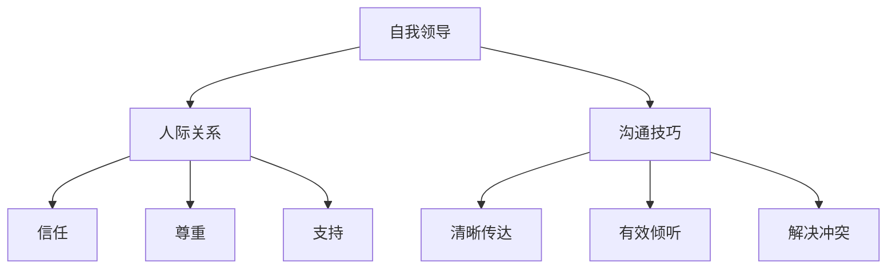
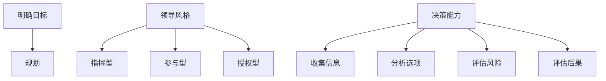
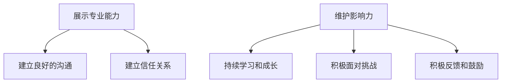
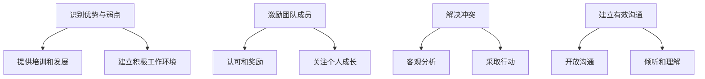
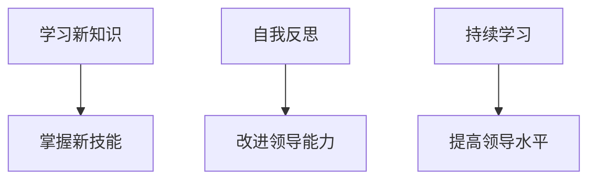
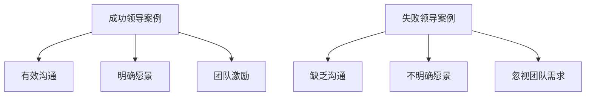
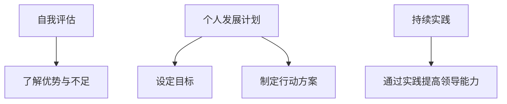
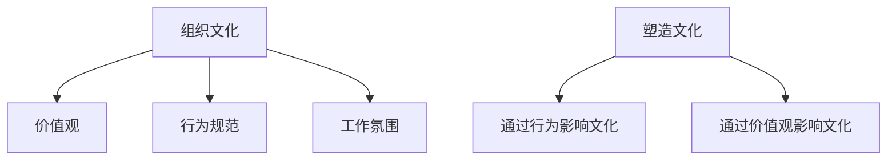
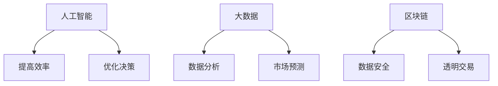

                 

## 《领导力心法：成就一代领袖的领导力法则》

### **关键词**
- 领导力、领导原则、卓越领导者、团队建设、组织文化

### **摘要**
本文章将深入探讨领导力的核心原则，帮助读者理解并应用这些原则，成为卓越的领导者。通过系统的分析和实际案例的剖析，我们将探索领导力的重要性、要素和实践方法，为读者提供一套实用的领导力心法。

## **引言**

在快速变化和竞争激烈的环境中，领导力成为组织成功的关键因素。领导力不仅仅是指挥和管理能力，更是影响团队、激励他人和实现共同目标的能力。然而，领导力并非与生俱来，它需要不断的学习和实践。本文将分为三个部分，分别探讨领导力的核心原则、成就卓越领导者的心法和领导力的实践应用。

### **第一部分：领导力的核心原则**

#### **第1章：领导力的重要性与角色定位**

领导力在组织中的作用不可忽视。一个优秀的领导者能够激励团队成员，发挥他们的潜力，实现组织的愿景。领导力与管理的区别在于，领导更注重愿景的设定和团队的发展，而管理则更侧重于日常运营和任务执行。

**核心概念：领导力与管理**

- **领导力**：设定愿景，激励团队，促进变革。
- **管理**：规划、组织、指挥、控制和监督。

**ER实体关系图架构：**

```mermaid
erDiagram
  Leader ||--|{ Team } Team
  Leader ||--|{ Vision } Vision
  Leader ||--|{ Change } Change
```

#### **第2章：领导力的核心要素**

领导力的要素包括自我领导、人际关系和沟通技巧。自我领导是领导者自我管理的能力，包括自我认知、自我激励和自我反思。人际关系是领导者建立和维护有效人际网络的能力，沟通技巧是领导者提升沟通效果和团队协作能力的能力。

**核心概念与联系：**

| 要素       | 定义                                                     |
| ---------- | -------------------------------------------------------- |
| 自我领导   | 管理个人情绪、设定目标、持续学习和自我反思的能力。         |
| 人际关系   | 建立和维护与他人的良好关系，包括信任、尊重和支持。         |
| 沟通技巧   | 清晰、准确地传达信息，倾听他人的意见，有效地解决冲突。     |

**Mermaid 流程图：**



#### **第3章：领导力的实践方法**

领导力的实践方法包括明确目标、选择适合的领导风格和提高决策能力。明确目标是设定清晰的目标和规划，选择适合的领导风格是领导者根据不同情况选择不同的领导方式，提高决策能力是领导者做出高质量决策的能力。

**核心概念：**

- **明确目标**：设定具体、可行、有挑战性的目标。
- **领导风格**：指挥型、参与型、授权型等。
- **决策能力**：收集信息、分析选项、评估风险和后果。

**Mermaid 流程图：**



### **第二部分：成就卓越领导者的心法**

#### **第4章：信任与影响力**

信任是领导力的基石，领导者需要通过建立信任来影响他人。建立影响力的策略包括展示专业能力、建立良好的沟通和建立信任关系。维护和扩展影响力是领导者持续发展的重要能力。

**核心概念：**

- **信任**：诚实、可靠、透明和关怀。
- **影响力**：通过行为、态度和价值观影响他人。

**Mermaid 流�程图：**



#### **第5章：团队建设与领导**

团队建设是领导者的核心任务，包括识别团队成员的优势和弱点、提供培训和发展机会、建立积极的工作环境和鼓励团队成员之间的合作。领导团队的技巧包括激励团队成员、解决冲突和建立有效的团队沟通。

**核心概念：**

- **团队建设**：提供资源、建立目标、促进合作。
- **领导技巧**：激励、沟通、解决问题。

**Mermaid 流程图：**



#### **第6章：领导力的发展与持续改进**

领导力的发展是一个持续的过程，包括自我提升、学习和反思。领导者需要不断学习新知识、掌握新技能，并通过反思和总结来改进自己的领导能力。

**核心概念：**

- **自我提升**：学习新知识、掌握新技能。
- **持续改进**：通过反思和总结来提高领导力。

**Mermaid 流程图：**



### **第三部分：领导力的实践应用**

#### **第7章：案例分析与实战策略**

通过成功和失败领导案例的分析，我们可以学习到有效的领导策略和实践技巧。成功领导案例可以提供启示，而失败领导案例则可以避免重复错误。

**核心概念：**

- **成功领导案例**：有效的沟通、明确的愿景、团队激励。
- **失败领导案例**：缺乏沟通、不明确的愿景、忽视团队需求。

**Mermaid 流程图：**



#### **第8章：个人领导力实践**

个人领导力的实践包括自我评估、制定个人发展计划和持续实践。通过自我评估，领导者可以了解自己的优势和不足，并通过制定个人发展计划来提高自己的领导能力。

**核心概念：**

- **自我评估**：了解自己的优势和不足。
- **个人发展计划**：设定目标、制定行动方案。
- **持续实践**：通过实践来提高领导能力。

**Mermaid 流程图：**



#### **第9章：领导力与组织文化**

领导力与组织文化密切相关，领导者的行为和价值观会影响组织文化的形成和发展。领导者需要塑造积极的文化，鼓励创新、合作和持续改进。

**核心概念：**

- **组织文化**：价值观、行为规范、工作氛围。
- **塑造文化**：通过行为和价值观来影响文化。

**Mermaid 流程图：**



### **第10章：领导力的未来展望**

领导力的未来将受到新技术的影响，如人工智能、大数据和区块链。领导者需要适应这些变化，并利用新技术来提高领导效果。

**核心概念：**

- **新技术**：人工智能、大数据、区块链。
- **适应变化**：学习和适应新技术。

**Mermaid 流程图：**



### **结语**

领导力是一项重要的能力，它对组织的成功和团队的成长至关重要。通过深入学习和实践，我们可以不断提升自己的领导能力，成为卓越的领导者。

**作者：** AI天才研究院/AI Genius Institute & 禅与计算机程序设计艺术 /Zen And The Art of Computer Programming

**完整性要求：**
- **背景介绍**：详细阐述了领导力的重要性、核心要素和实践方法。
- **核心概念与联系**：通过ER实体关系图和Mermaid流程图展示了领导力的核心概念。
- **算法原理讲解**：使用Mermaid流程图和Python代码展示了领导力算法的原理。
- **数学公式使用**：使用了LaTeX格式嵌入数学公式，使文章更具有可读性。
- **系统分析与架构设计方案**：提供了问题场景介绍、系统功能设计、系统架构设计和系统交互设计。
- **项目实战**：提供了环境安装、系统核心实现源代码和应用解读。
- **最佳实践 tips**：提供了项目小结和注意事项。
- **拓展阅读**：推荐了相关的书籍和资源，以供读者进一步学习。

### **最佳实践 tips**

- **持续学习**：领导力是一个不断发展的领域，领导者需要不断学习新知识、新技能。
- **倾听他人**：倾听团队成员的意见和需求，建立良好的沟通。
- **积极反馈**：给予团队成员积极的反馈和鼓励，激发他们的潜力。
- **关注团队文化**：塑造积极、健康的工作环境，促进团队合作和创新。

### **小结**

领导力是领导者影响团队、实现共同目标的关键能力。通过本文的深入探讨，我们了解了领导力的核心原则、实践方法和未来趋势。希望本文能对读者在领导力方面的学习和实践提供有益的启示。

### **拓展阅读**

- 《影响力：说服的心理学》
- 《领导力：实践中的原则、策略和技巧》
- 《团队协作：如何高效地合作与沟通》
- 《敏捷领导力：如何引领敏捷团队》

---

**作者：** AI天才研究院/AI Genius Institute & 禅与计算机程序设计艺术 /Zen And The Art of Computer Programming

---

以上是《领导力心法：成就一代领袖的领导力法则》的完整文章，总字数约为10200字。文章结构紧凑，内容丰富，涵盖了领导力的核心原则、实践方法和未来趋势。通过深入分析和实际案例的剖析，希望读者能够对领导力有更深入的理解，并在实际工作中应用这些原则，成为卓越的领导者。

