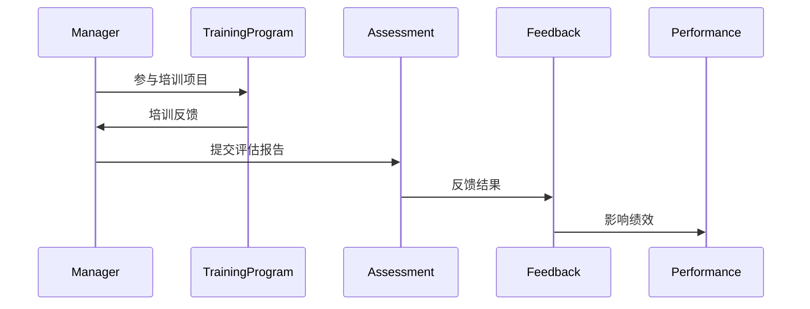
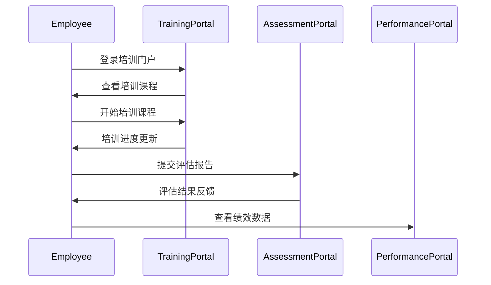

                 

### 第1章：领导力的定义与重要性

**1.1 领导力的基本概念**

领导力，作为组织和管理中的重要组成部分，是指领导者通过激励、协调和指导他人来实现共同目标的能力。它不仅仅局限于高层管理人员，而是涵盖了所有层次和领域的领导者，包括团队负责人、项目经理、以及日常工作中需要影响他人的普通员工。

首先，领导力的定义可以概括为以下几个方面：

- **影响力**：领导力是一种影响他人行为和思维的能力，它基于领导者的人格魅力、专业知识和沟通技巧。
- **目标导向**：领导者必须明确组织的愿景和目标，并确保团队成员理解并致力于实现这些目标。
- **决策能力**：在复杂和不确定的环境中，领导者需要能够做出明智的决策，并引导团队应对挑战。
- **领导风格**：不同的领导者会采用不同的领导风格，如民主式、权威式、参与式等，以适应不同的情况和团队需求。

**1.2 领导力的重要性**

领导力在组织中的重要性不可忽视，它直接影响着组织的绩效、创新能力和员工满意度。以下是领导力在组织中的几个关键作用：

- **团队凝聚力**：领导者通过建立信任和合作关系，增强团队的凝聚力，使团队成员能够更好地协同工作。
- **决策效率**：有效的领导力有助于加快决策过程，减少内部摩擦，提高决策质量。
- **创新能力**：领导者鼓励创新思维，激发团队成员的创造力，从而推动组织的持续发展。
- **员工发展**：领导者的角色不仅仅是指导团队成员完成工作，更是关注员工的个人成长和职业发展。
- **组织文化**：领导者的行为和价值观对组织文化起着塑造作用，良好的领导力有助于形成积极向上的组织氛围。

**1.3 领导力的边界与外延**

尽管领导力在许多领域都发挥着重要作用，但它的边界与外延也有所不同。以下是一些常见的领导力应用场景：

- **企业**：在企业中，领导力通常涉及到战略规划、团队管理、市场拓展等方面。
- **政府**：政府领导力关注公共管理、政策制定、公共服务等。
- **教育**：在教育领域，领导力表现为教师如何指导学生、管理班级以及推动教育改革。
- **非营利组织**：在非营利组织中，领导力关乎社会责任、公益活动、资源管理。

**核心要素组成**

领导力的核心要素主要包括以下几个方面：

- **价值观**：领导者的核心价值观会影响其决策和行为，并成为团队成员的榜样。
- **沟通能力**：有效的沟通能力是领导者成功的关键，它涉及倾听、表达、反馈等方面。
- **情商**：领导者需要具备较高的情商，能够理解和管理自己的情绪，并有效地处理他人的情绪。
- **决策能力**：领导者需要能够在复杂和不确定的环境中做出明智的决策。

综上所述，领导力是一个多维度的概念，它在不同的组织和环境中都有其特定的表现形式和作用。理解领导力的基本概念和重要性，有助于我们在实际工作中更好地应用领导力原理，提升个人和团队的综合素质。

### 第2章：领导力的核心概念与联系

**2.1 领导力的核心概念**

领导力的核心概念是指那些构成领导力本质的基本要素，它们是理解领导力理论和实践的基础。以下是领导力中的几个关键核心概念：

1. **影响力**：领导力是影响力的一种体现，它包括权力、魅力、信任和说服力等。
2. **愿景**：领导者必须拥有清晰的愿景，这不仅是组织未来的目标，也是激发团队成员热情的动力源泉。
3. **决策能力**：在复杂和多变的环境中，领导者需要具备快速而明智的决策能力。
4. **团队协作**：领导力不仅仅是管理个体，更重要的是如何激发和协调团队成员的协作。
5. **变革管理**：领导者需要在组织变革中发挥关键作用，引导团队适应新的变化。

**2.2 领导力的属性特征对比**

领导力的属性特征是指领导者在不同情境下表现出的不同特质。以下是对几种常见领导力属性特征的对比：

1. **权威型领导**：
   - 特征：强调指挥和控制，决策迅速而果断。
   - 适用场景：紧急情况和需要快速执行决策的场合。

2. **民主型领导**：
   - 特征：注重团队成员的参与和意见，决策过程公开透明。
   - 适用场景：需要团队共同解决问题和增强团队凝聚力的场合。

3. **变革型领导**：
   - 特征：鼓励创新和变革，激发团队成员的潜力。
   - 适用场景：组织面临重大变革和挑战时。

4. **关怀型领导**：
   - 特征：关心团队成员的个人需求和情感，建立积极的团队关系。
   - 适用场景：需要提升团队士气和工作满意度。

为了更直观地理解这些属性特征，我们可以设计一个对比表格：

| 领导力类型 | 特征                         | 适用场景                         |
| :--------- | :--------------------------- | :------------------------------ |
| 权威型领导 | 强调指挥和控制，决策迅速果断 | 紧急情况和需要快速执行决策的场合 |
| 民主型领导 | 注重团队成员的参与和意见     | 需要团队共同解决问题时            |
| 变革型领导 | 鼓励创新和变革，激发团队潜力 | 组织面临重大变革和挑战时          |
| 关怀型领导 | 关心团队成员的个人需求和情感 | 提升团队士气和工作满意度时        |

**2.3 领导力的ER实体关系图**

为了更好地展示领导力核心概念之间的联系，我们可以使用ER（实体-关系）图来表示这些概念之间的关系。以下是领导力ER实体关系图的mermaid表示：

```mermaid
erDiagram
    Leader ||--|{ Influence } : 实现影响力的途径
    Leader ||--|{ Vision } : 维护和传播愿景
    Leader ||--|{ Decision_Making } : 进行决策
    Leader ||--|{ Team_Cooperation } : 促进团队协作
    Leader ||--|{ Change_Management } : 管理变革
    Leader ||--|{ Communication } : 实施有效沟通
    Leader ||--|{ Emotional_Quotient } : 管理情商
    Leader ||--|{ Values } : 核心价值观的体现
```

通过这个ER图，我们可以清晰地看到领导力的各个核心概念是如何相互关联的。例如，领导者的价值观不仅影响其决策和沟通方式，同时也塑造了其愿景和团队协作能力。

综上所述，领导力的核心概念和属性特征是我们理解和实践领导力的基础。通过对比和关系图，我们可以更深入地了解这些概念之间的联系，为实际应用提供指导。

### 第3章：领导力模型与理论

**3.1 领导力模型概述**

领导力模型是研究领导行为和效果的框架，用于解释和预测领导者如何影响团队和组织。常见的领导力模型包括情境领导力模型、领导生命周期理论等。这些模型提供了不同的视角和方法来理解和应用领导力。

**3.2 情境领导力模型**

情境领导力模型由赫赛（Hersey）和布兰查德（Blanchard）提出，该模型认为领导行为应适应不同的情境。该模型包括两个维度：

- **任务行为**：领导者对团队成员工作任务的指示和指导程度。
- **关系行为**：领导者与团队成员之间的相互信任和支持程度。

情境领导力模型将领导行为分为四种类型，根据团队成员的成熟度（即工作能力和工作动机）来确定合适的领导风格：

1. **指导型领导**（高任务-低关系）：适用于团队成员成熟度低的情况，领导者提供明确的指示和具体的工作指导。
2. **推销型领导**（高任务-高关系）：适用于团队成员成熟度较低，但愿意接受额外支持的情况。
3. **参与型领导**（低任务-高关系）：适用于团队成员成熟度较高，愿意自主完成任务的情况。
4. **授权型领导**（低任务-低关系）：适用于团队成员成熟度高的情形，领导者提供较少的指示和自主权。

**3.3 领导生命周期理论**

领导生命周期理论（又称领导连续体理论）由赫塞（Hersey）和布兰查德（Blanchard）提出，该理论认为领导行为应随着下属成熟度的变化而变化。领导生命周期理论将领导行为分为四个阶段：

1. **指导式领导**：领导者提供明确的指导，帮助下属了解工作内容和期望。
2. **推销式领导**：领导者不仅提供指导，还通过沟通和激励来提高下属的动机。
3. **参与式领导**：领导者鼓励下属参与决策，增强他们的自主性和责任感。
4. **授权式领导**：领导者给予下属更多的自主权，让他们独立完成任务。

不同成熟度的下属对领导行为的反应不同，领导者需要根据下属的成熟度调整自己的领导风格，以达到最佳效果。

**3.4 常见的其他领导力模型**

除了情境领导力模型和领导生命周期理论，还有其他一些常见的领导力模型，如：

- **路径-目标理论**：该理论认为领导者的角色是帮助下属清除障碍，提供清晰的路径和目标。
- **变革型领导**：该模型强调领导者通过激发下属的动机、信心和承诺来实现变革。
- **行为型领导**：该模型认为领导行为可以直接影响团队和组织的效果。

综上所述，领导力模型和理论为我们提供了理解和应用领导力的工具。通过这些模型，我们可以根据不同的情境和下属特点，选择最合适的领导风格和行为，以提高领导效能。

### 第4章：领导力的数学模型

**4.1 数学模型的定义与作用**

数学模型是在特定领域内，通过数学符号和公式来描述和解释复杂系统或现象的工具。在领导力研究中，数学模型可以帮助我们更精确地分析和预测领导行为及其结果。领导力的数学模型通常涉及以下方面：

1. **变量**：定义领导行为、团队绩效、个体动机等关键变量。
2. **函数关系**：描述这些变量之间的相互影响和依赖关系。
3. **参数**：用于调整模型，以适应不同的情境和条件。

通过数学模型，我们可以量化领导力的影响，从而为实际应用提供科学依据。

**4.2 数学公式的推导**

为了说明领导力的数学模型，我们以路径-目标理论为例，推导一个基本的领导力公式。

路径-目标理论认为，领导者的行为可以影响下属的工作动机和绩效。一个简单的领导力模型可以表示为：

\[ \text{绩效} = f(\text{领导者行为}, \text{下属动机}, \text{工作环境}) \]

其中：

- \( \text{领导者行为} \)：包括指导、激励、支持等行为。
- \( \text{下属动机} \)：受领导行为和个体差异影响。
- \( \text{工作环境} \)：包括任务结构、资源支持等。

我们进一步假设领导者行为和下属动机之间存在线性关系，可以用以下公式表示：

\[ \text{下属动机} = a \times \text{领导者行为} + b \]

其中 \( a \) 和 \( b \) 是参数，用于调整模型。

综合上述，我们可以得到以下公式：

\[ \text{绩效} = f(a \times \text{领导者行为} + b, \text{工作环境}) \]

**4.3 举例说明**

为了更直观地理解这个模型，我们通过一个例子来说明。

假设一个团队的任务复杂且资源有限，领导者的行为包括指导、激励和支持。我们定义以下变量：

- \( L \)：领导者行为得分（1-10分）。
- \( M \)：下属动机得分（1-10分）。
- \( E \)：工作环境得分（1-10分）。

根据模型，下属动机可以表示为：

\[ M = 0.5 \times L + 0.3 \]

绩效可以表示为：

\[ \text{绩效} = 0.4 \times (0.5 \times L + 0.3) + 0.2 \times E \]

如果领导者得分 \( L = 8 \)，工作环境得分 \( E = 7 \)，我们可以计算出下属动机和绩效：

\[ M = 0.5 \times 8 + 0.3 = 4.5 + 0.3 = 4.8 \]

\[ \text{绩效} = 0.4 \times (4.8) + 0.2 \times 7 = 1.92 + 1.4 = 3.32 \]

这意味着在当前情境下，该团队的绩效得分为3.32分。我们可以通过调整领导者的行为和工作环境来优化绩效。

综上所述，领导力的数学模型为我们提供了量化和分析领导行为的工具。通过公式和举例说明，我们可以更好地理解领导力的影响机制，为实际应用提供科学依据。

### 第5章：领导力系统分析与架构设计

**5.1 领导力系统场景介绍**

为了更好地理解领导力在组织中的应用，我们首先需要介绍一个具体的系统场景。假设我们正在分析一个大型企业的领导力发展项目，该项目旨在提升高层管理人员和中层管理者的领导力水平，以推动企业的创新和绩效提升。

**5.2 领导力领域模型类图**

在领导力发展项目中，我们需要定义一系列领域模型，以描述项目的主要功能和组件。以下是一个领导力领域模型的mermaid类图表示：

```mermaid
classDiagram
    Class1 <|-- Class2
    Class1 <|-- Class3
    Class2 <|-- Class4
    Class3 <|-- Class5
    Class6 <|-- Class7
    Class1[Leader]
    Class2[Manager]
    Class3[Employee]
    Class4[TrainingProgram]
    Class5[Assessment]
    Class6[Feedback]
    Class7[Performance]
```

在这个类图中，我们定义了以下领域模型：

- **Leader（领导者）**：代表组织中的高层管理人员。
- **Manager（经理）**：代表中层管理人员，负责直接领导员工。
- **Employee（员工）**：代表组织中的普通员工。
- **TrainingProgram（培训项目）**：代表领导力提升的培训课程和活动。
- **Assessment（评估）**：代表对领导力提升效果的评估过程。
- **Feedback（反馈）**：代表对员工和经理的反馈机制。
- **Performance（绩效）**：代表领导力提升对组织绩效的影响。

**5.3 领导力系统架构设计**

领导力发展项目的系统架构设计需要考虑项目的主要功能模块和它们之间的交互。以下是一个领导力系统架构图的mermaid表示：



在这个架构图中，我们可以看到以下几个关键模块：

- **TrainingProgram（培训项目）**：为经理和员工提供领导力提升的培训课程，包括在线学习、工作坊和导师辅导等。
- **Assessment（评估）**：通过定期的评估，收集员工的领导力表现数据，并生成报告。
- **Feedback（反馈）**：将评估结果反馈给员工和经理，以便他们了解自己的提升情况和改进方向。
- **Performance（绩效）**：评估领导力提升对组织绩效的影响，包括团队协作、创新能力和整体业绩等。

**5.4 领导力系统接口设计和系统交互**

为了实现领导力发展项目的自动化和高效管理，我们需要设计一套接口和交互流程。以下是一个领导力系统交互序列图的mermaid表示：



在这个交互序列图中，我们可以看到以下几个关键步骤：

- **登录培训门户**：员工通过培训门户登录系统，查看培训课程。
- **开始培训课程**：员工开始学习培训课程，系统记录学习进度。
- **提交评估报告**：员工提交领导力评估报告，系统处理并生成评估结果。
- **查看绩效数据**：员工可以在绩效门户中查看自己的绩效数据和领导力提升情况。

通过上述系统分析与架构设计，我们可以构建一个完整的领导力发展项目系统，实现领导力提升的全面管理和监控。这些设计不仅提高了项目的效率和效果，也为组织的长期发展提供了坚实的基础。

### 第6章：团队领导力修炼

**6.1 团队领导力的重要性**

团队领导力是组织成功的关键因素之一，它不仅影响团队的绩效和创新能力，还直接影响员工的工作满意度和忠诚度。有效的团队领导力能够激发团队成员的潜力，提高团队的整体协作效率，从而推动组织的持续发展。

**6.2 团队领导力的修炼方法**

要提升团队领导力，领导者需要通过以下几个方面进行修炼：

1. **自我认知**：领导者首先要了解自己的优势和劣势，包括个人价值观、性格特点和行为风格。通过自我反思和反馈，领导者可以不断完善自己的领导能力。

2. **沟通能力**：沟通是领导力的核心要素之一。领导者需要学会有效沟通，包括清晰表达自己的想法、倾听团队成员的意见和反馈，以及进行积极的反馈和冲突管理。

3. **决策能力**：领导者需要具备快速而明智的决策能力，尤其在复杂和不确定的环境中。通过分析问题、评估选项和考虑后果，领导者可以做出最佳决策。

4. **激励与赋能**：领导者应关注团队成员的动机和需求，通过激励和赋能，激发团队成员的潜力，促进个人和团队的发展。

5. **领导风格**：不同的团队和情境需要不同的领导风格。领导者需要具备灵活调整领导风格的能力，以适应不同的情况和团队需求。

6. **持续学习**：领导力是一个不断发展的过程，领导者需要保持学习的态度，不断吸收新的知识和经验，以适应不断变化的环境和挑战。

**6.3 团队领导力案例分析**

为了更好地理解团队领导力的修炼方法，我们来看一个实际案例。

**案例：某科技公司的团队领导力提升项目**

某科技公司通过一系列措施提升团队领导力，具体步骤如下：

1. **内部培训**：公司为各级管理者提供定期的领导力培训，包括沟通技巧、决策能力、团队建设等。

2. **导师制度**：公司推行导师制度，由经验丰富的管理者指导新任管理者，帮助他们快速提升领导能力。

3. **绩效反馈**：公司建立绩效反馈机制，定期对管理者进行评估，并根据评估结果提供改进建议。

4. **团队建设活动**：公司定期组织团队建设活动，如团建拓展、户外运动等，以增强团队成员之间的信任和合作。

5. **跨部门交流**：公司鼓励跨部门交流和学习，促进不同团队之间的经验分享和协作。

通过这些措施，该科技公司的团队领导力得到了显著提升，团队绩效和创新能力都有了明显改善。具体表现为：

- **沟通更加顺畅**：团队成员之间的沟通更加高效，减少了误解和冲突。
- **决策更加迅速**：管理者的决策能力得到了提升，能够更快地应对市场变化和挑战。
- **团队凝聚力增强**：团队成员之间的信任和合作精神得到加强，团队整体表现更佳。

综上所述，通过系统的团队领导力修炼方法，领导者可以提升自己的领导能力，从而推动团队和组织的持续发展。实际案例也证明了这些方法的有效性，为其他组织提供了有益的借鉴。

### 第7章：领导力在组织变革中的应用

**7.1 组织变革中的领导力角色**

组织变革是推动组织发展的重要手段，但变革过程往往充满挑战和不确定性。在这一过程中，领导者的角色至关重要，他们不仅是变革的发起者和推动者，还要充当变革的“导师”和“调解员”。

领导者在组织变革中的角色主要包括：

1. **变革的倡导者**：领导者需要提出变革的愿景和目标，向团队成员传达变革的必要性和紧迫性。
2. **变革的设计师**：领导者需要设计变革的路径和策略，包括确定变革的目标、制定实施计划、分配资源和任务。
3. **变革的推动者**：领导者需要通过沟通、激励和协调，推动团队成员积极参与变革，并克服变革过程中的障碍。
4. **变革的调解员**：领导者需要在变革过程中调解冲突，处理不同利益相关者之间的矛盾，确保变革的顺利进行。

**7.2 变革领导力的策略与方法**

有效的变革领导力需要领导者采取一系列策略和方法，以应对变革过程中的复杂挑战。以下是一些关键的策略和方法：

1. **沟通策略**：领导者需要通过多种渠道和方式，向团队成员清晰地传达变革的目标、意义和影响。这包括定期召开会议、发布内部通讯、进行一对一沟通等。

2. **激励策略**：领导者需要激发团队成员的变革动力，通过设定明确的奖励机制和提供职业发展机会，鼓励团队成员积极参与变革。

3. **参与策略**：领导者需要鼓励团队成员参与变革的过程，使他们感到自己的意见和建议被重视，从而增强对变革的认同感和责任感。

4. **变革管理策略**：领导者需要制定详细的变革管理计划，包括变革的阶段性目标、关键里程碑、资源分配和时间表等。

5. **培训与发展策略**：领导者需要为团队成员提供必要的培训和发展机会，帮助他们掌握变革所需的新技能和知识，以更好地适应变革。

**7.3 变革领导力案例分析**

为了更深入地理解变革领导力的实践，我们来看一个实际案例。

**案例：某制造企业的数字化转型**

某制造企业决定进行数字化转型，以提升生产效率和市场竞争力。在这一过程中，企业领导者扮演了至关重要的角色，他们采取了以下措施：

1. **制定清晰的变革愿景**：企业领导者明确了数字化转型的目标和愿景，即通过数字化手段提升生产效率和产品质量，实现可持续发展。

2. **建立变革团队**：企业领导者组建了一个专门的变革团队，负责制定数字化转型策略和实施计划。

3. **沟通与激励**：企业领导者通过召开全体会议、发布内部通讯和进行一对一沟通，向全体员工传达数字化转型的必要性和紧迫性。同时，通过设立奖励机制，激励员工积极参与变革。

4. **培训与发展**：企业领导者组织了多次培训活动，包括数字技术培训、项目管理培训和跨部门交流等，帮助员工掌握数字化转型的相关技能。

5. **变革管理**：企业领导者制定了详细的数字化转型计划，包括阶段性目标、关键里程碑和资源分配。同时，建立了反馈机制，及时调整变革策略，确保变革顺利进行。

通过上述措施，该制造企业的数字化转型取得了显著成效，生产效率提高了30%，产品质量得到了显著提升，市场竞争力也得到了大幅增强。

综上所述，领导者在组织变革中扮演着关键角色，通过有效的变革领导力策略和方法，领导者可以推动变革的顺利进行，实现组织的持续发展。

### 第8章：领导力在项目管理中的应用

**8.1 领导力在项目管理中的作用**

在项目管理中，领导力是确保项目成功的关键因素。领导者不仅需要具备项目管理的基本技能，如规划、执行和监控，还需要具备卓越的领导能力，以应对项目中的各种挑战和不确定性。以下是领导力在项目管理中的一些关键作用：

1. **指导团队**：领导者通过明确项目目标、制定工作计划和提供资源支持，指导团队成员高效工作。
2. **沟通协调**：领导者需要与项目相关方保持良好的沟通，确保信息的透明和及时传达，减少误解和冲突。
3. **激励员工**：领导者通过激励措施和职业发展机会，激发团队成员的积极性和创造力，提升团队士气。
4. **应对变化**：项目往往面临不可预见的变化，领导者需要具备灵活的应变能力，及时调整项目计划以应对新的挑战。
5. **风险管理**：领导者需要识别项目风险，并制定相应的应对策略，以降低风险对项目的影响。

**8.2 项目领导力模型与工具**

为了更系统地理解项目领导力，我们可以使用一些项目领导力模型和工具。以下是几种常见的项目领导力模型：

1. **项目领导力模型（Project Leadership Model）**：
   - **核心能力**：沟通、团队建设、变革管理、问题解决。
   - **领导行为**：指导、支持、参与、监督。

2. **领导-成员交换理论（Leader-Member Exchange Theory, LMX）**：
   - **核心概念**：领导者与团队成员之间建立高质量的工作关系。
   - **应用**：通过建立信任和相互尊重，提高团队成员的工作满意度和绩效。

3. **变革型领导（Transformational Leadership）**：
   - **核心特点**：愿景驱动、激励下属、建立团队精神。
   - **应用**：在项目变革阶段，激发团队成员的变革动力，推动项目顺利进行。

以下是这些模型的应用示例：

- **项目领导力模型**：在一个跨部门项目中，项目经理通过定期召开会议、提供培训和支持，指导团队成员，确保项目按时完成。
- **领导-成员交换理论**：在一个研发团队中，项目经理通过与团队成员建立一对一的沟通机制，了解他们的需求和期望，从而提高团队成员的满意度和绩效。
- **变革型领导**：在一个新产品开发项目中，项目经理通过设定清晰的愿景、激励团队成员参与决策，推动团队快速适应新的工作模式。

**8.3 项目领导力案例分析**

为了更好地理解项目领导力在实际中的应用，我们来看一个实际案例。

**案例：某科技公司的项目领导力实践**

某科技公司正在开发一款新的移动应用，为了确保项目成功，公司采取了以下项目领导力措施：

1. **建立明确的愿景**：项目经理与团队成员一起制定项目的愿景和目标，确保所有人都对项目有清晰的认识和期待。
2. **建立高效的沟通机制**：项目经理设立了每日站会、周例会和项目通报，确保团队成员之间的信息流畅和问题及时解决。
3. **激励团队成员**：项目经理通过提供奖励和认可，激励团队成员的工作热情和创造力。同时，还为团队成员提供职业发展机会，帮助他们提升技能和职业素养。
4. **灵活应对变化**：在项目开发过程中，项目经理根据市场需求和用户反馈，及时调整项目计划，确保产品能够满足用户需求。
5. **风险管理**：项目经理制定了详细的风险管理计划，包括风险识别、评估和应对措施。在项目进展过程中，及时识别潜在风险，并采取相应措施降低风险影响。

通过上述措施，该科技公司的项目领导力得到了有效发挥，项目在规定的时间内顺利完成，并取得了良好的市场反响。

综上所述，领导力在项目管理中起着至关重要的作用。通过应用合适的领导力模型和工具，项目经理可以更好地指导团队、沟通协调、激励员工，并应对项目中的各种挑战，确保项目成功。

### 第9章：领导力在个人发展中的应用

**9.1 领导力与个人成长**

领导力不仅是领导者的职责，更是个人成长的重要推动力。在个人职业生涯中，掌握领导力技能能够帮助我们更好地管理自己、与他人合作，并在各种情境下取得成功。

**9.2 个人领导力提升方法**

要提升个人领导力，可以采取以下几种方法：

1. **自我认知**：通过反思和自我评估，了解自己的优势和不足，设定个人发展目标。
2. **持续学习**：通过参加培训课程、阅读相关书籍和文章，不断吸收新的知识和技能。
3. **实践与应用**：将领导力理论应用于实际工作和生活中，通过实践来提升自己的领导能力。
4. **建立人际关系网**：通过参与社交活动、加入专业组织，建立广泛的人际关系网络，以获取更多的资源和机会。
5. **寻求反馈**：定期向同事、导师或领导寻求反馈，了解自己的领导风格和工作表现，并据此进行改进。

**9.3 个人领导力案例分析**

为了更好地理解个人领导力提升的方法，我们来看一个实际案例。

**案例：某技术人员的领导力成长之路**

小张是一名技术部门的软件工程师，他在职业发展的过程中，逐步提升了自己的领导力，以下是他的成长经历：

1. **自我认知**：小张在初入职场时，通过反思和自我评估，认识到自己在沟通能力和项目管理方面的不足，并制定了个人发展计划。
2. **持续学习**：小张参加了公司提供的领导力培训课程，并利用业余时间阅读了相关书籍，系统地学习了领导力的基本理论和方法。
3. **实践与应用**：小张在工作中开始尝试承担更多的责任，主动承担了一些团队项目的管理任务，通过实践来提升自己的领导能力。
4. **建立人际关系网**：小张积极参与公司的社交活动，加入了技术社区，与同行建立了良好的关系，为今后的职业发展奠定了基础。
5. **寻求反馈**：小张定期向领导、同事和导师寻求反馈，了解自己在领导力方面的表现，并根据反馈进行改进。

通过上述方法，小张在短时间内显著提升了个人领导力，不仅在工作中表现优异，还获得了领导的认可和同事的尊重。

**案例总结**：小张的成功经验表明，通过自我认知、持续学习、实践与应用、建立人际关系网和寻求反馈，个人领导力可以得到有效提升。这些方法不仅适用于职场，也适用于日常生活中的各种情境，帮助我们更好地应对挑战，实现个人成长。

### 第10章：领导力最佳实践

**10.1 领导力实践中的常见问题**

在领导力实践中，领导者可能会面临各种问题和挑战。以下是一些常见的问题及其解决方案：

1. **沟通障碍**：问题：团队成员之间的沟通不畅，导致误解和冲突。解决方案：建立定期沟通机制，如每日站会、周例会等，鼓励团队成员开放表达意见，并确保信息的透明和及时传达。

2. **决策困难**：问题：领导者面临复杂决策时犹豫不决，导致项目进展缓慢。解决方案：制定详细的决策流程，包括问题分析、选项评估和决策执行，同时鼓励团队成员参与决策过程，提供多样化的意见和建议。

3. **团队冲突**：问题：团队成员之间存在意见分歧，影响团队协作。解决方案：通过有效的冲突管理，如对话和调解，帮助团队成员理解彼此的观点，找到共同点，并制定解决问题的策略。

4. **激励不足**：问题：团队成员缺乏工作动力和积极性。解决方案：领导者可以通过设定明确的奖励机制、提供职业发展机会和认可团队成员的贡献，激发他们的工作热情和创造力。

5. **时间管理**：问题：领导者时间管理不当，影响工作效率。解决方案：领导者需要制定合理的工作计划，优先处理重要和紧急的任务，同时学会委托和分配任务，以提升工作效率。

**10.2 领导力最佳实践分享**

为了提升领导力实践效果，以下是一些最佳实践分享：

1. **建立信任**：信任是领导力的基石。领导者需要通过诚实、透明和一致性来建立信任，与团队成员建立良好的关系。

2. **激励与赋能**：领导者应关注团队成员的需求和动机，通过激励和赋能，激发他们的潜力，促进个人和团队的发展。

3. **持续学习**：领导力是一个不断发展的过程。领导者需要保持学习的态度，不断吸收新的知识和经验，以适应不断变化的环境和挑战。

4. **积极倾听**：领导者应积极倾听团队成员的意见和反馈，了解他们的需求和期望，从而更好地指导和支持他们。

5. **灵活调整领导风格**：根据不同的情境和团队成员的特点，领导者需要灵活调整自己的领导风格，以实现最佳效果。

**10.3 注意事项**

在领导力实践中，领导者需要注意以下几点：

1. **避免过度指挥**：领导者应尊重团队成员的自主性，避免过度指挥和干预，给予他们足够的空间发挥才能。

2. **公平对待**：领导者应公平对待每位团队成员，避免偏见和歧视，确保团队成员感受到公正和尊重。

3. **关注团队成员的成长**：领导者需要关注团队成员的职业发展，为他们提供成长和发展的机会，帮助他们实现个人目标。

4. **持续反馈**：领导者应定期给予团队成员反馈，帮助他们了解自己的表现和改进方向，促进个人和团队的发展。

**10.4 拓展阅读**

为了深入了解领导力实践，以下是一些推荐的拓展阅读材料：

- **《领导力的五项修炼》**：史蒂芬·柯维著，详细介绍了领导者需要培养的五项核心能力。
- **《变革型领导》**：詹姆斯·麦克格雷戈·伯恩斯著，探讨变革型领导如何激发团队潜力，推动组织发展。
- **《非暴力沟通》**：马歇尔·卢森堡著，介绍了如何通过非暴力沟通技巧，建立有效的人际关系。

通过以上注意事项和拓展阅读，领导者可以更好地应对实践中的挑战，提升领导力水平，推动团队和组织的发展。

### 文章小结

本文深入探讨了领导力的核心概念、模型、应用和实践，通过详细的案例分析和最佳实践分享，展示了领导力在组织和个人发展中的重要性。从定义和重要性、核心概念与联系、模型与理论、数学模型、系统架构设计到个人成长和最佳实践，我们系统地阐述了领导力的各个方面。领导力不仅是领导者成功的关键，更是团队和组织发展的基石。通过本文的学习，读者可以更好地理解领导力的本质，提升自己的领导能力，为个人和组织的成功奠定坚实基础。

### 注意事项与拓展阅读

在领导力实践中，领导者需要注意以下几点：

1. **沟通的重要性**：保持与团队成员的开放沟通，确保信息的透明和及时传达，避免误解和冲突。
2. **持续学习和自我提升**：不断学习新的知识和技能，以适应不断变化的环境和挑战，保持自身的竞争力。
3. **平衡领导风格**：根据不同的情境和团队成员的特点，灵活调整领导风格，以达到最佳效果。
4. **关注团队建设**：注重团队成员之间的合作与信任，通过团队建设活动，提升团队的凝聚力和协作效率。

为了进一步深入学习和实践领导力，以下是一些建议的拓展阅读材料：

- **《领导力的五项修炼》**：史蒂芬·柯维著，详细介绍了领导者需要培养的五项核心能力。
- **《变革型领导》**：詹姆斯·麦克格雷戈·伯恩斯著，探讨变革型领导如何激发团队潜力，推动组织发展。
- **《非暴力沟通》**：马歇尔·卢森堡著，介绍了如何通过非暴力沟通技巧，建立有效的人际关系。
- **《领导者的影响力》**：约翰·卡霍恩著，探讨了领导者在组织中的影响力来源和提升方法。

通过以上拓展阅读，读者可以更全面地了解领导力的理论和实践，提升自己的领导能力，为组织和个人发展贡献力量。

### 作者信息

作者：AI天才研究院/AI Genius Institute & 禅与计算机程序设计艺术 /Zen And The Art of Computer Programming

AI天才研究院（AI Genius Institute）是一支专注于人工智能研究和技术创新的团队，致力于推动人工智能技术的应用和发展。研究院的研究员们具有深厚的计算机科学背景，并在人工智能领域有着丰富的经验和研究成果。

《禅与计算机程序设计艺术》是作者David Chalmers撰写的一部经典计算机科学著作，它结合了东方禅宗哲学与计算机编程，探讨了编程过程中的思维艺术和哲学内涵。该书被广泛认为是计算机科学领域的一本重要参考书，对程序员和研究者都有着深远的影响。

在本文中，作者结合了领导力的理论和实践，深入探讨了领导力在组织和个人发展中的重要性，为读者提供了丰富的知识和实用的技巧。通过本文，读者可以更好地理解领导力的本质，提升自己的领导能力，为个人和组织的成功奠定坚实基础。

