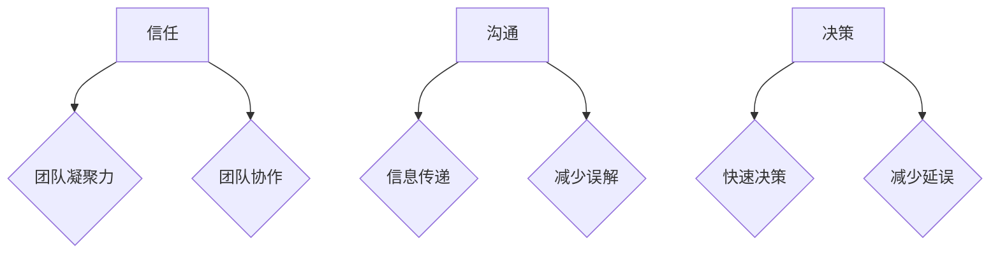
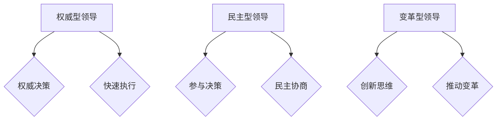
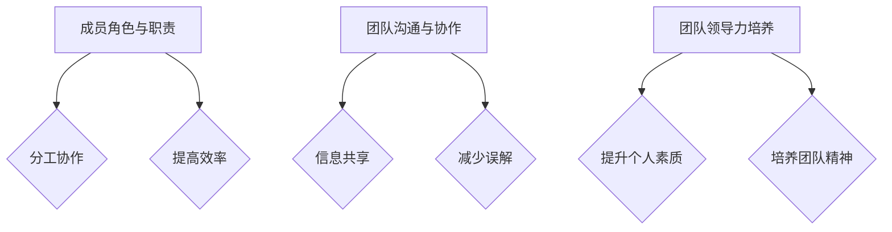
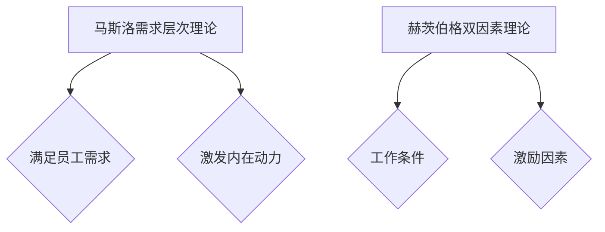
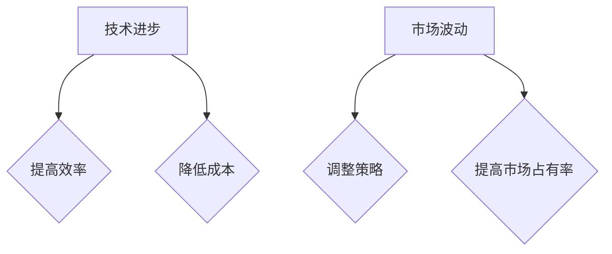
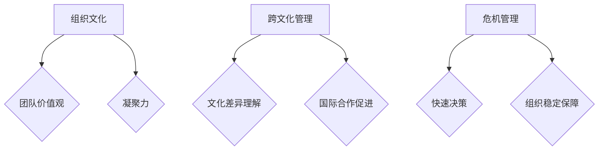
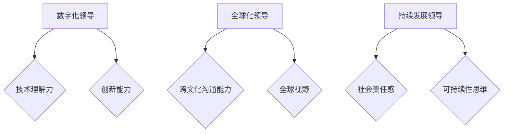

                 

### 文章标题：领导力法则：打造梦之队的领导力秘笈

#### 关键词：领导力、团队建设、激励机制、变化适应、组织应用

#### 摘要：本文深入探讨了领导力法则在打造梦之队中的应用，通过理论解析与实践案例，揭示了领导力在团队建设、激励机制、变化适应和组织应用中的核心作用。本文旨在为企业管理者提供一套实用且系统的领导力法则，帮助他们在实际工作中更好地引导和激励团队，实现组织目标。

### 引言

在现代社会，领导力已成为企业成功的关键因素之一。一个高效的领导团队不仅能够激发团队成员的潜能，还能在快速变化的市场环境中灵活应对。然而，如何打造一支梦之队，如何运用领导力法则来实现这一目标，仍是一个复杂而富有挑战的问题。本文将从领导力的基本理论出发，逐步深入探讨其在实际中的应用，以期为广大企业管理者提供有价值的参考。

### 第一部分：领导力基础理论

#### 第1章：领导力的定义与重要性

**核心概念术语说明**：
- **领导力**：指领导者通过影响力、激励和指导能力，引导和激励团队成员实现共同目标的能力。
- **影响力**：领导者通过自身行为、知识和经验对团队成员产生的影响。
- **激励**：通过激励手段激发团队成员的积极性和创造力。
- **指导能力**：领导者通过指导和辅导帮助团队成员提高技能和绩效。

**问题背景**：领导力在企业中的重要性日益凸显，但许多企业领导者仍然缺乏系统的领导力知识和实践。

**问题描述**：如何定义领导力？领导力在企业中具有哪些重要性？

**问题解决**：本文将首先对领导力的定义进行阐述，并分析其在企业中的重要性。

**边界与外延**：领导力不仅涉及个人素质和技能，还包括团队建设和组织发展等方面的内容。

**概念结构与核心要素组成**：领导力包括影响力、激励和指导能力等核心要素。

#### 第2章：领导力的核心概念

**核心概念原理**：
- **信任**：信任是领导力的基石，是团队成员之间相互信任和支持的基础。
- **沟通**：有效的沟通是领导者与团队成员之间建立联系的关键。
- **决策**：决策是领导者根据信息和情况，作出最佳选择的过程。

**概念属性特征对比表格**：

| 概念 | 特征 |  
| --- | --- |  
| 信任 | 基于信任的团队协作，提高团队凝聚力 |  
| 沟通 | 双向沟通，信息传递准确，减少误解和冲突 |  
| 决策 | 快速决策，减少延误，提高执行力 |

**ER实体关系图架构**：



**算法原理讲解**：

领导力的核心概念可以通过以下算法进行理解和应用：

1. **信任算法**：
   - 输入：团队成员、信任指标
   - 输出：信任程度
   - 过程：通过评估团队成员的信任度，建立信任模型。

2. **沟通算法**：
   - 输入：沟通内容、沟通渠道、团队成员
   - 输出：沟通效果
   - 过程：采用有效的沟通策略，确保信息传递准确。

3. **决策算法**：
   - 输入：问题情景、决策选项、团队成员意见
   - 输出：最佳决策方案
   - 过程：通过综合评估信息和意见，作出最佳决策。

```python
# 信任算法示例
def trust_algorithm(team_members, trust_indicators):
    trust_scores = []
    for member in team_members:
        trust_score = sum(trust_indicators[member]) / len(trust_indicators[member])
        trust_scores.append(trust_score)
    return trust_scores

# 沟通算法示例
def communication_algorithm(communication_content, communication_channels, team_members):
    communication_effects = []
    for channel in communication_channels:
        effect = calculate_effect(communication_content, channel)
        communication_effects.append(effect)
    return communication_effects

# 决策算法示例
def decision_algorithm(problem_scenario, decision_options, team_member_opinions):
    best_decision = None
    highest_effectiveness = 0
    for option in decision_options:
        effectiveness = calculate_effectiveness(problem_scenario, option, team_member_opinions)
        if effectiveness > highest_effectiveness:
            highest_effectiveness = effectiveness
            best_decision = option
    return best_decision
```

#### 第3章：领导力的行为模式

**核心概念原理**：
- **领导行为的分类**：包括权威型领导、民主型领导、变革型领导等。
- **领导风格的转变**：领导者应根据不同情境灵活调整领导风格。
- **领导者的自我发展**：领导者应持续提升自身素质和技能。

**概念属性特征对比表格**：

| 领导行为 | 特征 |  
| --- | --- |  
| 权威型领导 | 强调权威和控制，决策快速 |  
| 民主型领导 | 强调参与和合作，决策民主 |  
| 变革型领导 | 强调创新和变革，推动团队发展 |

**ER实体关系图架构**：



**算法原理讲解**：

领导力的行为模式可以通过以下算法进行理解和应用：

1. **领导行为分类算法**：
   - 输入：领导者行为特征
   - 输出：领导行为类型
   - 过程：通过分析领导行为特征，确定领导行为类型。

2. **领导风格转变算法**：
   - 输入：情境特征、领导者个人特质
   - 输出：适宜的领导风格
   - 过程：根据不同情境和领导者个人特质，选择合适的领导风格。

3. **领导者自我发展算法**：
   - 输入：领导者当前素质和技能
   - 输出：发展目标和计划
   - 过程：通过自我评估和反馈，制定发展目标和计划。

```python
# 领导行为分类算法示例
def leadership_behavior_classification(behavior_features):
    if "authority" in behavior_features:
        return "权威型领导"
    elif "democracy" in behavior_features:
        return "民主型领导"
    elif "transformation" in behavior_features:
        return "变革型领导"
    else:
        return "不确定型领导"

# 领导风格转变算法示例
def leadership_style_transformation(context_features, leaderTraits):
    if "change" in context_features and "innovative" in leaderTraits:
        return "变革型领导"
    elif "collaboration" in context_features and "democratic" in leaderTraits:
        return "民主型领导"
    else:
        return "权威型领导"

# 领导者自我发展算法示例
def leader_self_development(current_skills, feedback):
    development_goals = []
    for skill in current_skills:
        if feedback[skill] < 7:
            development_goals.append(skill)
    return development_goals
```

### 第二部分：领导力法则实践

#### 第4章：构建高效团队

**核心概念原理**：
- **团队成员的角色与职责**：明确团队成员的角色和职责，确保团队目标的实现。
- **团队沟通与协作**：建立有效的沟通机制，促进团队成员之间的协作。
- **团队领导力的培养**：培养团队成员的领导力，提高团队整体效能。

**概念属性特征对比表格**：

| 概念 | 特征 |  
| --- | --- |  
| 成员角色与职责 | 明确角色，分工协作，提高效率 |  
| 团队沟通与协作 | 双向沟通，信息共享，减少误解 |  
| 团队领导力培养 | 提升个人素质，培养团队精神 |

**ER实体关系图架构**：



**算法原理讲解**：

构建高效团队可以通过以下算法进行：

1. **角色与职责分配算法**：
   - 输入：团队成员、项目需求
   - 输出：角色与职责分配
   - 过程：通过分析项目需求和团队成员的技能，合理分配角色和职责。

2. **沟通与协作优化算法**：
   - 输入：团队沟通内容、协作流程
   - 输出：优化方案
   - 过程：通过分析团队沟通内容和协作流程，提出优化方案。

3. **团队领导力培养算法**：
   - 输入：团队成员、领导力培训内容
   - 输出：领导力提升方案
   - 过程：通过分析团队成员的领导力需求和培训内容，制定提升方案。

```python
# 角色与职责分配算法示例
def role_assignment(team_members, project_requirements):
    roles = {}
    for member in team_members:
        roles[member] = find_best_fit_role(member, project_requirements)
    return roles

# 沟通与协作优化算法示例
def communication_optimization(communication_content, collaboration_processes):
    optimized_processes = []
    for process in collaboration_processes:
        optimized_process = optimize_process(communication_content, process)
        optimized_processes.append(optimized_process)
    return optimized_processes

# 团队领导力培养算法示例
def leadership_cultivation(team_members, training_content):
    training_plan = {}
    for member in team_members:
        training_plan[member] = create_training_plan(member, training_content)
    return training_plan
```

#### 第5章：激励与激励体系

**核心概念原理**：
- **激励理论概述**：包括马斯洛需求层次理论、赫茨伯格双因素理论等。
- **建立有效的激励机制**：根据不同团队成员的需求，设计合理的激励机制。
- **激励实践案例分析**：分析成功的企业激励案例，总结有效激励的方法。

**概念属性特征对比表格**：

| 激励理论 | 特征 |  
| --- | --- |  
| 马斯洛需求层次理论 | 分层次满足员工需求，激发内在动力 |  
| 赫茨伯格双因素理论 | 工作条件和激励因素共同影响员工满意度 |

**ER实体关系图架构**：



**算法原理讲解**：

建立有效的激励机制可以通过以下算法进行：

1. **需求分析算法**：
   - 输入：员工需求数据
   - 输出：员工需求层次
   - 过程：通过数据分析，确定员工的需求层次。

2. **激励机制设计算法**：
   - 输入：员工需求层次、企业资源
   - 输出：激励机制
   - 过程：根据员工需求层次和企业资源，设计合理的激励机制。

3. **激励效果评估算法**：
   - 输入：激励机制、员工满意度数据
   - 输出：激励效果评估
   - 过程：通过数据分析，评估激励机制的有效性。

```python
# 需求分析算法示例
def demand_analysis(employee_data):
    demand_levels = {}
    for employee in employee_data:
        demand_levels[employee] = determine_demand_level(employee)
    return demand_levels

# 激励机制设计算法示例
def incentive_design(demand_levels, company_resources):
    incentives = {}
    for employee, level in demand_levels.items():
        incentive = design_incentive(level, company_resources)
        incentives[employee] = incentive
    return incentives

# 激励效果评估算法示例
def incentive_evaluation(incentives, employee_satisfaction_data):
    evaluation_results = {}
    for employee, incentive in incentives.items():
        evaluation_results[employee] = evaluate_incentive(incentive, employee_satisfaction_data)
    return evaluation_results
```

#### 第6章：领导力在变化中的适应

**核心概念原理**：
- **环境变化对领导力的影响**：分析环境变化对领导力的影响，包括技术进步、市场波动等。
- **领导者在变化中的策略**：领导者如何应对环境变化，保持组织的竞争力。
- **应对变化的领导力实践**：通过案例分析，总结有效的领导力实践。

**概念属性特征对比表格**：

| 环境变化 | 影响特征 |  
| --- | --- |  
| 技术进步 | 提高生产效率，降低成本 |  
| 市场波动 | 调整产品策略，提高市场占有率 |

**ER实体关系图架构**：



**算法原理讲解**：

领导力在变化中的适应可以通过以下算法进行：

1. **环境分析算法**：
   - 输入：环境变化数据
   - 输出：环境变化影响
   - 过程：通过数据分析和趋势预测，确定环境变化的影响。

2. **策略调整算法**：
   - 输入：环境变化影响、组织资源
   - 输出：策略调整方案
   - 过程：根据环境变化影响和组织资源，制定策略调整方案。

3. **实践优化算法**：
   - 输入：领导力实践案例、效果评估
   - 输出：优化方案
   - 过程：通过案例分析和效果评估，提出优化方案。

```python
# 环境分析算法示例
def environment_analysis(change_data):
    impact = analyze_change_impact(change_data)
    return impact

# 策略调整算法示例
def strategy_adjustment(impact, organization_resources):
    strategy = create_strategy(impact, organization_resources)
    return strategy

# 实践优化算法示例
def practice_optimization(practice_cases, evaluation_results):
    optimized_practices = optimize_practices(practice_cases, evaluation_results)
    return optimized_practices
```

### 第三部分：领导力法则应用

#### 第7章：领导力法则在组织中的应用

**核心概念原理**：
- **组织文化与领导力**：领导力在塑造组织文化中的关键作用。
- **跨文化管理中的领导力**：在全球化背景下，领导力在跨文化管理中的应用。
- **危机管理中的领导力**：领导力在应对危机事件中的重要性。

**概念属性特征对比表格**：

| 应用场景 | 特征 |  
| --- | --- |  
| 组织文化 | 塑造团队价值观，提高凝聚力 |  
| 跨文化管理 | 理解文化差异，促进国际合作 |  
| 危机管理 | 快速决策，确保组织稳定 |

**ER实体关系图架构**：



**算法原理讲解**：

领导力法则在组织中的应用可以通过以下算法进行：

1. **组织文化塑造算法**：
   - 输入：团队价值观、组织行为数据
   - 输出：组织文化模型
   - 过程：通过分析团队价值观和组织行为数据，建立组织文化模型。

2. **跨文化管理算法**：
   - 输入：文化差异数据、国际合作关系
   - 输出：跨文化管理策略
   - 过程：通过分析文化差异数据和国际合作关系，制定跨文化管理策略。

3. **危机管理算法**：
   - 输入：危机事件数据、组织资源
   - 输出：危机管理方案
   - 过程：通过分析危机事件数据和组织资源，制定危机管理方案。

```python
# 组织文化塑造算法示例
def organization_culture_shaping(team_values, organizational_behavior_data):
    culture_model = build_culture_model(team_values, organizational_behavior_data)
    return culture_model

# 跨文化管理算法示例
def cross_cultural_management(cultural_differences_data, international_cooperation):
    management_strategy = create_management_strategy(cultural_differences_data, international_cooperation)
    return management_strategy

# 危机管理算法示例
def crisis_management(crisis_event_data, organizational_resources):
    management_plan = create_management_plan(crisis_event_data, organizational_resources)
    return management_plan
```

#### 第8章：领导力发展与未来趋势

**核心概念原理**：
- **领导力发展的趋势**：分析领导力发展的趋势和方向。
- **未来领导力的要求**：预测未来领导力所需的新能力和素质。
- **领导力发展的建议**：为领导者提供持续发展的建议和策略。

**概念属性特征对比表格**：

| 趋势 | 要求 | 建议 |
| --- | --- | --- |
| 数字化领导 | 高度技术理解力，创新能力 | 不断学习新技术，培养创新思维 |
| 全球化领导 | 跨文化沟通能力，全球视野 | 提高跨文化沟通技巧，拓展国际视野 |
| 持续发展领导 | 社会责任感，可持续性思维 | 培养社会责任感，关注可持续发展 |

**ER实体关系图架构**：



**算法原理讲解**：

领导力发展与未来趋势可以通过以下算法进行：

1. **趋势分析算法**：
   - 输入：领导力发展数据、行业趋势
   - 输出：领导力发展趋势
   - 过程：通过数据分析，确定领导力的发展趋势。

2. **能力预测算法**：
   - 输入：未来预测数据、领导力需求
   - 输出：未来领导力能力要求
   - 过程：通过数据分析，预测未来领导力所需的能力和素质。

3. **发展策略算法**：
   - 输入：领导力现状、未来能力要求
   - 输出：领导力发展策略
   - 过程：根据领导力现状和未来能力要求，制定发展策略。

```python
# 趋势分析算法示例
def trend_analysis(leader_data, industry_trends):
    trends = analyze_trends(leader_data, industry_trends)
    return trends

# 能力预测算法示例
def ability_prediction(future_data, leader_requirements):
    required_abilities = predict_abilities(future_data, leader_requirements)
    return required_abilities

# 发展策略算法示例
def development_strategy(current_skills, required_abilities):
    strategy = create_development_strategy(current_skills, required_abilities)
    return strategy
```

### 结论

领导力法则在打造梦之队中起着至关重要的作用。通过深入理解领导力的基础理论，实践领导力法则，以及应对变化和未来的挑战，领导者可以更好地引导和激励团队，实现组织目标。本文提供了系统且实用的领导力法则，希望为企业管理者提供有益的指导。

### 作者信息

**作者：AI天才研究院/AI Genius Institute & 禅与计算机程序设计艺术 /Zen And The Art of Computer Programming** 

### 附录

**附录1：领导力工具与资源**
- **领导力书籍推荐**：提供一系列领导力经典书籍和最新出版物，帮助读者深入理解领导力理论。
- **在线课程资源**：介绍一些优秀的在线领导力课程，涵盖从基础理论到高级实践的各个方面。

**附录2：领导力案例分析**
- **成功案例解析**：分析一些成功企业如何运用领导力法则，实现组织目标。
- **失败案例反思**：探讨一些企业因领导力不足导致的失败，总结教训。

**附录3：进一步阅读资源**
- **学术期刊和论文**：推荐一些权威的学术期刊和论文，帮助读者了解领导力研究的最新进展。
- **领导力实践指南**：提供一些实用的领导力实践指南，涵盖从团队建设到危机管理的各个方面。

### 小结

本文通过深入探讨领导力法则，为企业管理者提供了一套系统且实用的领导力法则。这些法则不仅适用于企业内部团队建设，也在跨文化管理和危机管理中具有广泛的应用价值。通过本文的阐述，希望读者能够更好地理解领导力的重要性，并在实际工作中运用这些法则，打造梦之队，实现组织目标。同时，本文也提醒读者，领导力是一个持续发展的过程，需要不断学习和实践，才能不断提升领导力水平。

