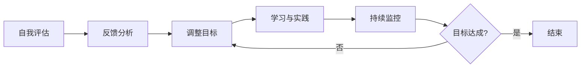
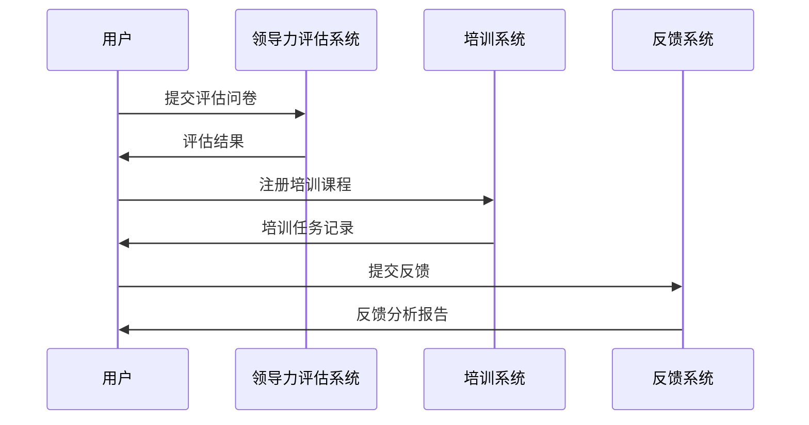

                 


# 领导力训练营：119天从新手到专家

> 关键词：领导力、训练营、119天、新手到专家、实践、理论、个人发展

> 摘要：本文旨在探讨领导力训练营的价值和重要性，通过119天的系统训练，从新手到专家的转变过程。文章将详细阐述领导力的基础理论、领导者必备素质、领导风格与团队管理、领导力模型与工具、跨文化领导力、组织变革中的领导力应用以及领导力发展的个人实践。最后，通过案例研究和未来趋势分析，为读者提供实用的领导力提升建议。

----------------------------------------------------------------

## 第一部分：领导力基础理论

### 第1章：领导力概述

#### 1.1 领导力的定义与重要性

领导力，作为一种关键能力，在个人和组织的成功中扮演着至关重要的角色。领导力不仅仅是指领导一个团队或组织，更是一种激励、影响和引导他人共同实现目标的能力。领导力的本质在于如何激发团队成员的潜力，创造一个积极向上的工作环境。

#### 1.2 领导力的核心要素

领导力的核心要素包括情商、决策能力和沟通技巧。情商是领导力的基石，它帮助领导者更好地理解自己和他人，建立信任和合作关系。决策能力是领导者面对复杂问题时的关键能力，它需要领导者具备前瞻性和决断力。沟通技巧则是领导者传递愿景、建立共识和解决冲突的重要工具。

#### 1.3 领导力的发展历程

领导力的发展历程经历了从传统领导力到现代领导力的转变。传统领导力强调权威和控制，而现代领导力更加注重团队合作、共享领导和激励创新。这一转变反映了领导力理论与实践的不断进步和演变。

### 第2章：领导者必备素质

#### 2.1 情商与领导力

情商在领导力中发挥着重要作用。高情商的领导者能够更好地处理团队关系，提高团队绩效。情商包括自我意识、自我调节、社交意识和同理心。通过提升情商，领导者可以更有效地激励和引导团队成员。

#### 2.2 决策能力与领导力

决策能力是领导者面对复杂情况时做出明智、及时决策的能力。良好的决策能力有助于领导者把握机会、化解危机，从而推动组织的发展。决策能力的提升需要领导者具备良好的信息收集和分析能力，以及前瞻性和决断力。

#### 2.3 沟通技巧与领导力

沟通技巧是领导者建立信任、传达愿景和激励团队的基础。有效的沟通需要领导者具备倾听能力、表达能力和非语言沟通能力。通过提升沟通技巧，领导者可以更好地理解团队成员的需求和期望，从而提高团队协作效率。

### 第3章：领导风格与团队管理

#### 3.1 领导风格的理论

领导风格是指领导者在对团队进行引导、激励和管理时所采用的方式。常见的领导风格包括权威型、民主型、参与型和教练型。不同的领导风格适用于不同的情境和团队，领导者需要根据实际情况灵活调整。

#### 3.2 团队建设的步骤

团队建设是领导力的关键组成部分。团队建设的步骤包括明确团队目标、建立信任、促进沟通和协作、培养团队成员的能力和激励团队。通过有效的团队建设，领导者可以打造一支高效、和谐的团队。

#### 3.3 领导者如何激励团队

激励团队是领导者的核心任务之一。领导者可以通过设定明确的愿景和目标、提供支持和资源、认可和奖励团队成员的贡献等方式来激励团队。同时，领导者还需要关注团队成员的个人发展和需求，从而提高团队的凝聚力和执行力。

### 第4章：领导力模型与工具

#### 4.1 领导力模型概述

领导力模型是描述和解释领导力行为和过程的理论框架。常见的领导力模型包括领导生命周期模型、情境领导模型和变革领导模型。领导力模型有助于领导者理解和应用不同的领导策略，以应对不同的挑战。

#### 4.2 领导力工具的应用

领导力工具包括评估工具、反馈工具和领导力发展工具。评估工具可以帮助领导者了解自己的领导能力，反馈工具可以帮助领导者改进领导行为，领导力发展工具可以帮助领导者提升领导能力。通过应用这些工具，领导者可以更有效地发展自己的领导能力。

#### 4.3 领导力评估与改进

领导力评估是领导者了解自己领导能力的重要手段。通过领导力评估，领导者可以识别自己的优势和不足，制定改进计划。领导力评估可以采用自我评估、同事评估和下属评估等多种方法。评估结果需要与领导者的个人发展计划相结合，以实现持续改进。

### 第5章：领导力在跨文化管理中的应用

#### 5.1 跨文化管理的挑战

跨文化管理面临诸多挑战，包括文化差异、沟通障碍、权力结构和文化冲突。领导者需要具备跨文化意识，了解不同文化的特点和价值观，以便更好地管理多元文化团队。

#### 5.2 跨文化领导力模型

跨文化领导力模型包括文化适应模型、文化融合模型和文化创新模型。不同的跨文化领导力模型适用于不同的情境，领导者需要根据实际情况灵活应用。

#### 5.3 跨文化领导力的实践策略

跨文化领导力的实践策略包括尊重文化差异、建立共同价值观、促进跨文化沟通和合作、培养跨文化团队领导力。通过这些策略，领导者可以提升跨文化团队的协作效率，实现组织的目标。

### 第6章：领导力在组织变革中的应用

#### 6.1 组织变革的驱动因素

组织变革的驱动因素包括市场环境的变化、技术进步、管理层的决策和文化变革。领导者需要识别组织变革的驱动因素，以便制定有效的变革策略。

#### 6.2 领导者在组织变革中的作用

领导者在组织变革中扮演着关键角色。领导者需要成为变革的倡导者、推动者和实践者，引导团队成员接受变革、适应变革并推动组织的持续发展。

#### 6.3 组织变革的领导策略

组织变革的领导策略包括明确变革目标、制定详细的变革计划、沟通变革愿景、建立变革团队、激励团队成员和监控变革进展。通过这些策略，领导者可以确保组织变革的顺利进行。

### 第7章：领导力发展的个人实践

#### 7.1 领导力发展的路径

领导力发展是一个长期的过程，需要领导者不断学习和实践。领导力发展的路径包括自我学习、实践反思、导师指导和领导力培训。通过这些路径，领导者可以不断提升自己的领导能力。

#### 7.2 自我评估与反思

自我评估是领导者了解自己领导能力的重要手段。通过自我评估，领导者可以识别自己的优势和不足，制定个人发展计划。反思是领导者从实践中学习的重要方式，通过反思，领导者可以总结经验教训，不断改进领导行为。

#### 7.3 领导力发展计划

领导力发展计划是领导者提升领导能力的具体行动方案。领导力发展计划包括设定发展目标、制定学习计划、实施行动方案和监控进展。通过领导力发展计划，领导者可以系统地提升自己的领导能力。

### 第8章：领导力案例研究

#### 8.1 案例一：苹果公司的领导力实践

苹果公司以其卓越的领导力而闻名。乔布斯作为苹果公司的创始人之一，以其独特的领导风格和远见卓识推动了苹果公司的创新和成功。案例研究将分析乔布斯的领导力实践，以及这些实践对苹果公司的影响。

#### 8.2 案例二：谷歌的领导力文化

谷歌以其独特的领导力文化和创新精神而备受瞩目。谷歌的领导力文化强调员工自主性、创新和团队协作。案例研究将探讨谷歌的领导力文化如何塑造了谷歌的成功，以及这些文化元素如何对领导者产生影响。

#### 8.3 案例三：中国共产党的领导力分析

中国共产党作为世界上最大的政党，其领导力在中国的发展和稳定中发挥着重要作用。案例研究将分析中国共产党的领导力特点，以及这些特点如何推动中国的发展。

### 第9章：领导力未来的趋势

#### 9.1 科技对领导力的影响

科技的发展对领导力产生了深远的影响。人工智能、大数据和云计算等技术的应用，改变了组织的运作方式，也对领导者的角色和技能提出了新的要求。领导者需要适应科技的发展，提升自身的数字化领导能力。

#### 9.2 领导力在教育领域的发展

领导力教育在高等教育和职业教育中越来越受到重视。领导力课程和培训项目不断涌现，旨在培养未来的领导者。领导力教育的发展为领导力的普及和提升提供了新的机遇。

#### 9.3 领导力在可持续发展中的作用

领导力在可持续发展中扮演着关键角色。领导者需要关注环境保护、社会责任和经济效益的平衡，推动组织的可持续发展。领导力在可持续发展中的作用将越来越受到关注。

### 第10章：领导力训练营总结

#### 10.1 训练营的收获与反思

领导力训练营为参与者提供了系统的领导力培训和实践机会。训练营的收获包括领导力知识的积累、领导技能的提升和实际工作经验的积累。参与者需要对训练营的收获进行反思，以实现持续的个人发展。

#### 10.2 领导力提升的建议

为了提升领导力，领导者需要不断学习、实践和反思。以下是一些建议：
- 定期参加领导力培训和学习课程；
- 积极参与实践项目，锻炼领导技能；
- 反思领导行为，持续改进领导能力；
- 寻求导师指导，获取宝贵的反馈和建议。

#### 10.3 领导力训练营的未来发展

领导力训练营作为一种有效的领导力提升方式，具有广阔的发展前景。未来的领导力训练营将更加注重个性化、定制化和数字化转型。通过创新的教学模式和培训内容，领导力训练营将帮助更多领导者实现从新手到专家的转变。

----------------------------------------------------------------

## 作者信息

作者：AI天才研究院/AI Genius Institute & 禅与计算机程序设计艺术 /Zen And The Art of Computer Programming

本文由AI天才研究院和禅与计算机程序设计艺术联合撰写，旨在为读者提供深入、系统的领导力培训和实践指导。希望通过本文，读者能够更好地理解领导力的本质和应用，提升自身的领导能力，成为优秀的领导者。

----------------------------------------------------------------

## 完整的文章正文部分

### 第1章：领导力概述

#### 1.1 领导力的定义与重要性

领导力是一种关键能力，它在个人和组织的成功中扮演着至关重要的角色。领导力不仅仅是指领导一个团队或组织，更是一种激励、影响和引导他人共同实现目标的能力。领导力的本质在于如何激发团队成员的潜力，创造一个积极向上的工作环境。

在现代社会，领导力的重要性日益凸显。随着组织结构的日益复杂和变化，领导者需要具备更高的领导能力，以应对各种挑战和机遇。领导力不仅关乎组织的生存和发展，也关乎个人的职业成长和成功。

领导力的定义有多种，但可以概括为以下几点：
1. 领导力是一种能力，它包括影响力、决策能力、沟通能力和团队管理能力。
2. 领导力是一种行为，它体现在领导者与团队成员的互动中，以及领导者如何影响和激励团队成员。
3. 领导力是一种态度，它体现在领导者对待工作和团队的态度，以及领导者如何处理挑战和困难。

#### 1.2 领导力的核心要素

领导力的核心要素包括情商、决策能力和沟通技巧。这些要素相互关联，共同构成了领导力的基础。

1. 情商
情商是指个体识别、理解、管理和使用情绪的能力。情商在领导力中发挥着重要作用。高情商的领导者能够更好地处理团队关系，提高团队绩效。情商包括自我意识、自我调节、社交意识和同理心。自我意识是指领导者能够清楚地认识到自己的情绪和需求；自我调节是指领导者能够管理自己的情绪和行为；社交意识是指领导者能够理解和适应他人的情绪和需求；同理心是指领导者能够感同身受，理解他人的感受。

2. 决策能力
决策能力是领导者面对复杂情况时做出明智、及时决策的能力。良好的决策能力有助于领导者把握机会、化解危机，从而推动组织的发展。决策能力包括信息收集、分析、判断和选择。领导者需要具备良好的信息收集和分析能力，以便做出明智的决策。

3. 沟通技巧
沟通技巧是领导者建立信任、传达愿景和激励团队的基础。有效的沟通需要领导者具备倾听能力、表达能力和非语言沟通能力。倾听能力是指领导者能够倾听团队成员的意见和需求；表达能力是指领导者能够清晰地表达自己的想法和意见；非语言沟通能力是指领导者能够通过肢体语言、面部表情和语调等非语言方式传递信息。

#### 1.3 领导力的发展历程

领导力的发展历程经历了从传统领导力到现代领导力的转变。传统领导力强调权威和控制，以命令式管理为主。现代领导力更加注重团队合作、共享领导和激励创新。这一转变反映了领导力理论与实践的不断进步和演变。

1. 传统领导力
传统领导力强调领导者的权威和指挥。领导者被视为决策者和管理者，团队成员则被视为执行者。传统领导力倾向于自上而下的管理方式，领导者的指令被严格执行。

2. 现代领导力
现代领导力强调领导者与团队成员的互动和协作。领导者被视为团队成员中的一员，与团队成员共同制定目标和计划。现代领导力倾向于自下而上的管理方式，领导者的角色更多是指导和支持。

3. 领导力的演变
领导力的演变是一个持续的过程。随着社会和科技的进步，领导力也在不断发展和完善。未来，领导力将更加注重个性化、定制化和数字化转型。领导者需要具备更高的情商、决策能力和沟通技巧，以应对日益复杂的挑战。

### 第2章：领导者必备素质

#### 2.1 情商与领导力

情商在领导力中发挥着重要作用。高情商的领导者能够更好地处理团队关系，提高团队绩效。情商包括自我意识、自我调节、社交意识和同理心。自我意识是指领导者能够清楚地认识到自己的情绪和需求；自我调节是指领导者能够管理自己的情绪和行为；社交意识是指领导者能够理解和适应他人的情绪和需求；同理心是指领导者能够感同身受，理解他人的感受。

1. 自我意识
自我意识是情商的基础。领导者需要具备良好的自我意识，能够清楚地认识到自己的情绪、需求和动机。通过自我意识，领导者可以更好地理解自己的行为和决策，从而提高领导效果。

2. 自我调节
自我调节是指领导者能够管理自己的情绪和行为。在面临压力和挑战时，领导者需要保持冷静和理智，以便做出明智的决策。通过自我调节，领导者可以降低情绪波动对工作的影响，提高决策质量和执行力。

3. 社交意识
社交意识是指领导者能够理解和适应他人的情绪和需求。领导者需要具备良好的社交意识，能够倾听团队成员的意见和需求，理解他们的情绪和动机。通过社交意识，领导者可以建立良好的人际关系，提高团队协作效率。

4. 同理心
同理心是指领导者能够感同身受，理解他人的感受。领导者需要具备同理心，能够站在团队成员的角度考虑问题，从而更好地理解和支持他们。通过同理心，领导者可以建立信任和合作关系，提高团队凝聚力和执行力。

#### 2.2 决策能力与领导力

决策能力是领导者面对复杂情况时做出明智、及时决策的能力。良好的决策能力有助于领导者把握机会、化解危机，从而推动组织的发展。决策能力包括信息收集、分析、判断和选择。领导者需要具备良好的信息收集和分析能力，以便做出明智的决策。

1. 信息收集
信息收集是决策过程的第一步。领导者需要广泛收集与决策相关的信息，包括市场趋势、竞争对手、团队成员的意见和反馈等。通过全面、准确的信息收集，领导者可以更好地了解决策背景，为后续的分析和判断提供依据。

2. 分析
分析是指领导者对收集到的信息进行整理、分类和比较。通过分析，领导者可以识别出关键信息，发现潜在问题和机会。分析能力是决策能力的重要组成部分，领导者需要具备良好的逻辑思维和分析能力，以便做出明智的决策。

3. 判断
判断是指领导者根据分析结果做出决策。判断能力是领导者决策能力的关键，领导者需要具备良好的判断力，能够准确预测未来的趋势和风险。通过准确的判断，领导者可以做出正确的决策，推动组织的发展。

4. 选择
选择是指领导者根据判断结果选择最佳的方案。选择能力是领导者决策能力的最终体现，领导者需要具备良好的选择能力，能够从多个备选方案中选择最佳的方案，以便实现组织的目标。

#### 2.3 沟通技巧与领导力

沟通技巧是领导者建立信任、传达愿景和激励团队的基础。有效的沟通需要领导者具备倾听能力、表达能力和非语言沟通能力。倾听能力是指领导者能够倾听团队成员的意见和需求；表达能力是指领导者能够清晰地表达自己的想法和意见；非语言沟通能力是指领导者能够通过肢体语言、面部表情和语调等非语言方式传递信息。

1. 倾听能力
倾听能力是沟通技巧的核心。领导者需要具备良好的倾听能力，能够全神贯注地倾听团队成员的意见和需求。通过倾听，领导者可以更好地了解团队成员的想法和感受，建立信任和合作关系。

2. 表达能力
表达能力是指领导者能够清晰地表达自己的想法和意见。领导者需要具备良好的表达能力，能够用简洁、准确的语言传达信息。通过有效的表达，领导者可以确保团队成员准确理解领导的意图，提高团队协作效率。

3. 非语言沟通能力
非语言沟通能力是指领导者能够通过肢体语言、面部表情和语调等非语言方式传递信息。非语言沟通在领导力中发挥着重要作用，领导者需要具备良好的非语言沟通能力，能够通过肢体语言、面部表情和语调等非语言方式表达情感、态度和意图。

### 第3章：领导风格与团队管理

#### 3.1 领导风格的理论

领导风格是指领导者在对团队进行引导、激励和管理时所采用的方式。常见的领导风格包括权威型、民主型、参与型和教练型。不同的领导风格适用于不同的情境和团队，领导者需要根据实际情况灵活调整。

1. 权威型领导风格
权威型领导风格是指领导者具有高度的决策权和控制力，团队成员按照领导者的指示执行任务。权威型领导风格适用于需要快速决策和高效执行的情境，例如紧急情况或任务紧迫时。

2. 民主型领导风格
民主型领导风格是指领导者鼓励团队成员参与决策和讨论，团队成员有更多的自主权和参与度。民主型领导风格适用于需要团队协作和创新的任务，例如项目策划或新产品开发。

3. 参与型领导风格
参与型领导风格是指领导者积极倾听团队成员的意见和需求，与团队成员共同制定目标和计划。参与型领导风格适用于需要团队凝聚力和信任的情境，例如团队建设或员工培训。

4. 教练型领导风格
教练型领导风格是指领导者像教练一样，指导和支持团队成员发展技能和能力。教练型领导风格适用于需要培养团队成员潜力和提升团队绩效的情境，例如职业发展和技能培训。

#### 3.2 团队建设的步骤

团队建设是领导力的关键组成部分。团队建设的步骤包括明确团队目标、建立信任、促进沟通和协作、培养团队成员的能力和激励团队。通过有效的团队建设，领导者可以打造一支高效、和谐的团队。

1. 明确团队目标
明确团队目标是团队建设的第一步。领导者需要与团队成员共同制定明确的目标，确保团队成员对目标和任务有清晰的认识。明确的目标有助于团队协作，提高工作效率。

2. 建立信任
建立信任是团队建设的关键。领导者需要通过诚实、透明和开放的沟通方式，与团队成员建立信任关系。信任有助于团队成员之间的合作和协作，提高团队凝聚力。

3. 促进沟通和协作
促进沟通和协作是团队建设的重要组成部分。领导者需要创造一个开放、包容的沟通环境，鼓励团队成员分享意见和想法。通过有效的沟通和协作，团队成员可以共同解决问题，实现团队目标。

4. 培养团队成员的能力
培养团队成员的能力是团队建设的重要目标之一。领导者需要关注团队成员的个人发展，提供培训和学习机会，帮助他们提升技能和能力。通过培养团队成员的能力，领导者可以提升团队的整体绩效。

5. 激励团队
激励团队是团队建设的重要环节。领导者需要通过认可和奖励团队成员的贡献，激发他们的积极性和创造力。通过激励团队，领导者可以保持团队的活力和动力，实现团队目标。

#### 3.3 领导者如何激励团队

激励团队是领导者的核心任务之一。领导者可以通过设定明确的愿景和目标、提供支持和资源、认可和奖励团队成员的贡献等方式来激励团队。同时，领导者还需要关注团队成员的个人发展和需求，从而提高团队的凝聚力和执行力。

1. 设定明确的愿景和目标
设定明确的愿景和目标是激励团队的重要手段。领导者需要明确团队的愿景和目标，确保团队成员对目标和任务有清晰的认识。明确的愿景和目标有助于激发团队成员的积极性和创造力，推动团队向前发展。

2. 提供支持和资源
提供支持和资源是领导者激励团队的关键。领导者需要确保团队成员获得完成任务所需的资源和支持，包括时间、人力和物资。通过提供支持和资源，领导者可以减轻团队成员的负担，提高工作效率。

3. 认可和奖励团队成员的贡献
认可和奖励团队成员的贡献是激励团队的重要手段。领导者需要及时认可和奖励团队成员的突出贡献，激励他们保持积极的工作态度。通过认可和奖励，领导者可以增强团队成员的自信心和归属感，提高团队的凝聚力。

4. 关注团队成员的个人发展和需求
关注团队成员的个人发展和需求是领导者激励团队的关键。领导者需要了解团队成员的职业规划和个人需求，为他们提供培训和成长机会。通过关注团队成员的个人发展和需求，领导者可以增强团队成员的归属感和忠诚度，提高团队的执行力。

### 第4章：领导力模型与工具

#### 4.1 领导力模型概述

领导力模型是描述和解释领导力行为和过程的理论框架。常见的领导力模型包括领导生命周期模型、情境领导模型和变革领导模型。领导力模型有助于领导者理解和应用不同的领导策略，以应对不同的挑战。

1. 领导生命周期模型
领导生命周期模型由赫塞和布兰查德提出，描述了领导者如何根据团队成员的成熟度调整领导风格。该模型认为，领导者需要根据团队成员的能力和意愿水平，选择适当的领导风格。常见的领导风格包括指导型、支持型、参与型和授权型。

2. 情境领导模型
情境领导模型由赫塞和布兰查德提出，强调领导者需要根据情境的变化调整领导风格。该模型认为，领导者需要根据团队成员的需求和环境条件，选择适当的领导风格。常见的领导风格包括指导型、支持型、参与型和授权型。

3. 变革领导模型
变革领导模型由库泽斯和波斯纳提出，描述了领导者如何推动组织变革。该模型认为，领导者需要具备变革意识、愿景和执行力，以推动组织变革。常见的领导风格包括变革型、交易型和授权型。

#### 4.2 领导力工具的应用

领导力工具包括评估工具、反馈工具和领导力发展工具。这些工具有助于领导者了解自己的领导能力，改进领导行为，提升领导能力。

1. 评估工具
评估工具用于评估领导者的领导能力。常见的评估工具包括360度评估、领导力问卷和领导力仪表盘。通过评估工具，领导者可以了解自己的优势和不足，制定改进计划。

2. 反馈工具
反馈工具用于收集团队成员对领导者的反馈。常见的反馈工具包括匿名问卷、面对面反馈和团队反馈会。通过反馈工具，领导者可以了解团队成员的需求和期望，改进领导行为。

3. 领导力发展工具
领导力发展工具用于提升领导者的领导能力。常见的领导力发展工具包括领导力培训、领导力教练和领导力社区。通过领导力发展工具，领导者可以学习新的领导技能和知识，提升自己的领导能力。

#### 4.3 领导力评估与改进

领导力评估是领导者了解自己领导能力的重要手段。通过领导力评估，领导者可以识别自己的优势和不足，制定改进计划。领导力评估可以采用自我评估、同事评估和下属评估等多种方法。评估结果需要与领导者的个人发展计划相结合，以实现持续改进。

1. 自我评估
自我评估是领导者了解自己领导能力的重要方法。通过自我评估，领导者可以反思自己的领导行为和效果，识别自己的优势和不足。自我评估可以采用问卷、日记或反思日志等方式。

2. 同事评估
同事评估是领导者了解自己领导能力的重要途径。通过同事评估，领导者可以收集来自同事的反馈和建议，了解自己在团队中的表现。同事评估可以采用匿名问卷、面对面反馈或团队反馈会等方式。

3. 下属评估
下属评估是领导者了解自己领导能力的重要手段。通过下属评估，领导者可以收集下属对领导的反馈和评价，了解领导行为对下属的影响。下属评估可以采用匿名问卷、面对面反馈或团队反馈会等方式。

4. 改进计划
通过评估结果，领导者可以制定改进计划，提升自己的领导能力。改进计划包括制定具体的目标、采取行动和跟踪进展。通过持续改进，领导者可以不断提升自己的领导能力。

### 第5章：领导力在跨文化管理中的应用

#### 5.1 跨文化管理的挑战

跨文化管理面临诸多挑战，包括文化差异、沟通障碍、权力结构和文化冲突。领导者需要具备跨文化意识，了解不同文化的特点和价值观，以便更好地管理多元文化团队。

1. 文化差异
文化差异是跨文化管理的最大挑战之一。不同文化在价值观、沟通方式、工作习惯等方面存在差异。领导者需要了解和尊重这些差异，避免因文化差异导致的误解和冲突。

2. 沟通障碍
沟通障碍是跨文化管理中的另一个挑战。不同文化背景的人在沟通方式和语言表达上可能存在差异，导致沟通不畅。领导者需要具备跨文化沟通技巧，确保信息的准确传达。

3. 权力结构
权力结构是跨文化管理中的重要因素。不同文化对权力结构的理解和管理方式不同。领导者需要了解和适应不同文化的权力结构，确保团队的有效运作。

4. 文化冲突
文化冲突是跨文化管理中的常见问题。不同文化在价值观、工作方式等方面的冲突可能导致团队内部的紧张和冲突。领导者需要采取有效措施，化解文化冲突，维护团队的和谐。

#### 5.2 跨文化领导力模型

跨文化领导力模型包括文化适应模型、文化融合模型和文化创新模型。不同的跨文化领导力模型适用于不同的情境和团队，领导者需要根据实际情况灵活应用。

1. 文化适应模型
文化适应模型是指领导者根据不同文化的特点和需求，调整领导风格和策略。该模型强调领导者需要具备跨文化意识，了解和适应不同文化的特点和价值观。

2. 文化融合模型
文化融合模型是指领导者鼓励团队成员在共同目标下，融合不同文化的优点，创造新的文化。该模型强调领导者需要具备包容性和创新精神，推动团队的文化融合。

3. 文化创新模型
文化创新模型是指领导者鼓励团队成员在创新和协作中，形成新的文化。该模型强调领导者需要具备创新意识和领导能力，推动团队的文化创新。

#### 5.3 跨文化领导力的实践策略

跨文化领导力的实践策略包括尊重文化差异、建立共同价值观、促进跨文化沟通和合作、培养跨文化团队领导力。通过这些策略，领导者可以提升跨文化团队的协作效率，实现组织的目标。

1. 尊重文化差异
尊重文化差异是跨文化领导力的基础。领导者需要了解和尊重不同文化的特点和价值观，避免因文化差异导致的误解和冲突。

2. 建立共同价值观
建立共同价值观是跨文化团队的重要任务。领导者需要引导团队成员在共同的目标下，形成共同的核心价值观。通过共同价值观的建立，团队成员可以更好地合作和协作。

3. 促进跨文化沟通和合作
促进跨文化沟通和合作是跨文化领导力的关键。领导者需要创造一个开放、包容的沟通环境，鼓励团队成员分享意见和想法。通过有效的沟通和协作，团队成员可以共同解决问题，实现团队目标。

4. 培养跨文化团队领导力
培养跨文化团队领导力是跨文化领导力的重要策略。领导者需要关注团队成员的个人发展，提供培训和成长机会，帮助他们提升跨文化领导能力。通过培养跨文化团队领导力，领导者可以提升团队的整体绩效。

### 第6章：领导力在组织变革中的应用

#### 6.1 组织变革的驱动因素

组织变革的驱动因素包括市场环境的变化、技术进步、管理层的决策和文化变革。领导者需要识别组织变革的驱动因素，以便制定有效的变革策略。

1. 市场环境的变化
市场环境的变化是组织变革的主要驱动因素之一。随着市场的不断变化和竞争的加剧，组织需要调整战略和运营模式，以适应市场环境。

2. 技术进步
技术进步对组织变革产生了深远的影响。新的技术和管理工具不断涌现，改变了组织的运作方式。领导者需要关注技术进步，推动组织的数字化转型。

3. 管理层的决策
管理层的决策是组织变革的重要因素。领导者的决策和战略方向直接影响组织的变革进程和效果。领导者需要具备远见卓识，制定符合组织发展的变革策略。

4. 文化变革
文化变革是组织变革的内在驱动力。组织文化对员工的价值观和行为方式产生深远影响。领导者需要推动组织文化的变革，以适应新的发展需求。

#### 6.2 领导者在组织变革中的作用

领导者在组织变革中扮演着关键角色。领导者需要成为变革的倡导者、推动者和实践者，引导团队成员接受变革、适应变革并推动组织的持续发展。

1. 变革的倡导者
领导者需要成为变革的倡导者，明确变革的必要性和目标，激发团队成员的变革意识。通过传递变革的愿景和价值观，领导者可以凝聚团队的力量，推动变革的进程。

2. 变革的推动者
领导者需要成为变革的推动者，制定详细的变革计划，协调各部门的协作，确保变革的顺利实施。领导者需要关注变革过程中的挑战和障碍，及时调整策略，推动变革的进程。

3. 变革的实践者
领导者需要成为变革的实践者，以身作则，率先改变自己的行为和思维方式，成为团队成员的榜样。通过实践变革，领导者可以增强团队成员对变革的信任和接受度。

#### 6.3 组织变革的领导策略

组织变革的领导策略包括明确变革目标、制定详细的变革计划、沟通变革愿景、建立变革团队、激励团队成员和监控变革进展。通过这些策略，领导者可以确保组织变革的顺利进行。

1. 明确变革目标
明确变革目标是组织变革的首要任务。领导者需要与团队成员共同制定明确的变革目标，确保团队成员对变革的目标有清晰的认识。

2. 制定详细的变革计划
制定详细的变革计划是组织变革的关键。领导者需要制定详细的变革计划，明确变革的时间表、任务分工和责任分配。通过详细的变革计划，领导者可以确保变革的有序进行。

3. 沟通变革愿景
沟通变革愿景是组织变革的重要策略。领导者需要与团队成员分享变革的愿景和价值观，激发他们对变革的认同和参与。通过沟通变革愿景，领导者可以凝聚团队的力量，推动变革的进程。

4. 建立变革团队
建立变革团队是组织变革的重要策略。领导者需要组建一个由不同部门和层级组成的变革团队，负责变革的规划和实施。通过建立变革团队，领导者可以确保变革的全面性和协同性。

5. 激励团队成员
激励团队成员是组织变革的关键。领导者需要通过认可和奖励团队成员的贡献，激发他们的积极性和创造力。通过激励团队成员，领导者可以保持团队的活力和动力，推动变革的顺利进行。

6. 监控变革进展
监控变革进展是组织变革的重要策略。领导者需要建立监控机制，定期评估变革的进展情况和效果。通过监控变革进展，领导者可以及时发现和解决变革过程中的问题，确保变革的顺利进行。

### 第7章：领导力发展的个人实践

#### 7.1 领导力发展的路径

领导力发展是一个长期的过程，需要领导者不断学习和实践。领导力发展的路径包括自我学习、实践反思、导师指导和领导力培训。通过这些路径，领导者可以不断提升自己的领导能力。

1. 自我学习
自我学习是领导力发展的重要途径。领导者需要主动学习领导力相关的知识和技能，通过阅读书籍、参加培训课程和观看视频等方式，不断提升自己的领导能力。

2. 实践反思
实践反思是领导力发展的重要方法。领导者需要通过实践中的反思，总结经验教训，发现自身的不足，制定改进计划。通过实践反思，领导者可以不断提升自己的领导能力。

3. 导师指导
导师指导是领导力发展的重要策略。领导者可以寻求导师的指导，从导师的经验和智慧中汲取营养，提升自己的领导能力。导师可以提供个性化的指导和建议，帮助领导者克服困难和挑战。

4. 领导力培训
领导力培训是领导力发展的重要手段。领导者可以参加各种领导力培训课程，学习领导力理论、方法和技巧。通过领导力培训，领导者可以系统地提升自己的领导能力。

#### 7.2 自我评估与反思

自我评估是领导者了解自己领导能力的重要手段。通过自我评估，领导者可以识别自己的优势和不足，制定个人发展计划。反思是领导者从实践中学习的重要方式，通过反思，领导者可以总结经验教训，不断改进领导行为。

1. 自我评估
领导者可以通过自我评估工具，如360度评估和领导力问卷，了解自己在团队中的表现。通过自我评估，领导者可以识别自己的优势和不足，确定个人发展的重点。

2. 反思
反思是领导者从实践中学习的重要方式。领导者需要定期反思自己的领导行为和决策，总结经验教训，发现自身的不足。通过反思，领导者可以不断提升自己的领导能力。

#### 7.3 领导力发展计划

领导力发展计划是领导者提升领导能力的具体行动方案。领导力发展计划包括设定发展目标、制定学习计划、实施行动方案和监控进展。通过领导力发展计划，领导者可以系统地提升自己的领导能力。

1. 设定发展目标
领导者需要设定明确的领导力发展目标，如提升决策能力、增强沟通技巧或培养团队合作精神。通过设定发展目标，领导者可以明确自己的发展方向和努力目标。

2. 制定学习计划
领导者需要制定详细的学习计划，包括阅读书籍、参加培训课程和观看视频等。通过制定学习计划，领导者可以系统地提升自己的领导能力。

3. 实施行动方案
领导者需要将学习计划转化为具体的行动方案，如实践领导技能、参与团队项目和反思领导行为。通过实施行动方案，领导者可以不断提升自己的领导能力。

4. 监控进展
领导者需要定期监控自己的领导力发展进展，评估学习成果和行动效果。通过监控进展，领导者可以及时调整发展计划，确保领导力发展的顺利进行。

### 第8章：领导力案例研究

#### 8.1 案例一：苹果公司的领导力实践

苹果公司以其卓越的领导力而闻名。乔布斯作为苹果公司的创始人之一，以其独特的领导风格和远见卓识推动了苹果公司的创新和成功。本案例将分析乔布斯的领导力实践，以及这些实践对苹果公司的影响。

1. 乔布斯的领导风格
乔布斯的领导风格以创新、挑战和追求卓越为特点。他注重用户体验，追求产品的完美和极致。乔布斯经常参与产品的设计和开发，以确保产品符合他的高标准。

2. 乔布斯的领导实践
乔布斯的领导实践包括以下几点：
- 创造愿景：乔布斯总是能够清晰地向团队成员描绘未来的愿景，激发他们的创造力和热情。
- 倾听与反馈：乔布斯善于倾听团队成员的意见和反馈，并根据这些反馈调整产品和策略。
- 激励团队：乔布斯通过认可和奖励团队成员的成就，激发他们的积极性和创造力。
- 人才培养：乔布斯注重团队成员的个人发展，为他们提供成长和发展的机会。

3. 乔布斯对苹果公司的影响
乔布斯的领导实践对苹果公司产生了深远的影响：
- 创新驱动：乔布斯的领导力激发了苹果公司的创新精神，推动了公司的持续创新和进步。
- 用户至上：乔布斯始终关注用户体验，确保产品能够满足用户的需求和期望。
- 团队协作：乔布斯的领导力促进了团队成员之间的协作和合作，提高了团队的整体绩效。

#### 8.2 案例二：谷歌的领导力文化

谷歌以其独特的领导力文化而备受瞩目。谷歌的领导力文化强调员工自主性、创新和团队协作。本案例将探讨谷歌的领导力文化如何塑造了谷歌的成功，以及这些文化元素如何对领导者产生影响。

1. 谷歌的领导力文化
谷歌的领导力文化具有以下特点：
- 员工自主性：谷歌鼓励员工自由表达观点，提供开放的沟通环境，使员工能够充分发挥自己的才能。
- 创新精神：谷歌鼓励员工创新和尝试新事物，为公司带来新的机会和突破。
- 团队协作：谷歌强调团队合作，鼓励员工跨部门合作，共同解决问题和实现目标。

2. 谷歌的领导力文化对领导者的影响
谷歌的领导力文化对领导者产生了深远的影响：
- 鼓励创新：领导者需要鼓励员工创新，提供支持和资源，为员工创造创新的环境。
- 倾听与反馈：领导者需要倾听员工的意见和反馈，关注员工的需求和期望，以建立信任和合作关系。
- 激励团队：领导者需要通过认可和奖励团队成员的成就，激发团队的积极性和创造力。

#### 8.3 案例三：中国共产党的领导力分析

中国共产党作为世界上最大的政党，其领导力在中国的发展和稳定中发挥着重要作用。本案例将分析中国共产党的领导力特点，以及这些特点如何推动中国的发展。

1. 中国共产党的领导力特点
中国共产党的领导力具有以下特点：
- 集中统一领导：中国共产党始终坚持集中统一的领导，确保国家的稳定和统一。
- 群众路线：中国共产党注重群众路线，密切联系群众，倾听群众意见，为群众谋利益。
- 自我革命：中国共产党不断进行自我革命，勇于纠正错误，保持党的先进性和纯洁性。

2. 中国共产党的领导力对中国的发展影响
中国共产党的领导力对中国的发展产生了深远的影响：
- 稳定与发展：中国共产党的领导力为中国的稳定和发展提供了坚实的基础。
- 改革开放：中国共产党推动了改革开放，推动了中国的经济繁荣和社会进步。
- 民生改善：中国共产党注重民生改善，提高了人民的生活水平和幸福感。

### 第9章：领导力未来的趋势

#### 9.1 科技对领导力的影响

科技的发展对领导力产生了深远的影响。人工智能、大数据和云计算等技术的应用，改变了组织的运作方式，也对领导者的角色和技能提出了新的要求。领导者需要适应科技的发展，提升自身的数字化领导能力。

1. 人工智能
人工智能技术的应用使得领导者能够更好地处理复杂的数据和决策。领导者需要具备数据分析和决策能力，以便在人工智能的帮助下做出更明智的决策。

2. 大数据
大数据技术的发展使得领导者能够获取和利用更多的数据资源，了解市场的趋势和需求。领导者需要具备数据分析和洞察力，以便利用大数据推动组织的创新和发展。

3. 云计算
云计算技术的应用使得领导者能够更灵活地管理和调配资源，提高组织的运营效率。领导者需要具备云计算管理能力，以便充分利用云计算的优势。

#### 9.2 领导力在教育领域的发展

领导力教育在高等教育和职业教育中越来越受到重视。领导力课程和培训项目不断涌现，旨在培养未来的领导者。领导力教育的发展为领导力的普及和提升提供了新的机遇。

1. 领导力课程
领导力课程在高等教育中得到了广泛应用。通过领导力课程，学生可以学习领导力理论、方法和实践，培养领导能力。

2. 培训项目
领导力培训项目在职业教育中也越来越受欢迎。通过领导力培训项目，职业人士可以提升领导能力，适应职场挑战。

3. 领导力教育的未来
领导力教育的未来发展将更加注重个性化和定制化。通过在线教育、虚拟课堂和互动式学习等方式，领导力教育可以更好地满足不同学习者的需求。

#### 9.3 领导力在可持续发展中的作用

领导力在可持续发展中扮演着关键角色。领导者需要关注环境保护、社会责任和经济效益的平衡，推动组织的可持续发展。领导力在可持续发展中的作用将越来越受到关注。

1. 环境保护
领导者需要推动组织的环保措施，减少对环境的负面影响。通过制定环保政策和实施环保项目，领导者可以推动组织的可持续发展。

2. 社会责任
领导者需要关注社会责任，推动组织积极参与社会公益事业。通过履行社会责任，领导者可以提升组织的声誉和社会地位。

3. 经济效益
领导者需要关注经济效益，确保组织的可持续发展。通过优化运营和管理，领导者可以提升组织的竞争力，实现可持续发展。

### 第10章：领导力训练营总结

#### 10.1 训练营的收获与反思

领导力训练营为参与者提供了系统的领导力培训和实践机会。训练营的收获包括领导力知识的积累、领导技能的提升和实际工作经验的积累。参与者需要对训练营的收获进行反思，以实现持续的个人发展。

1. 领导力知识的积累
通过训练营，参与者可以系统地学习领导力理论、方法和实践，积累丰富的领导力知识。

2. 领导技能的提升
通过实际操作和案例研究，参与者可以提升自己的领导技能，如决策能力、沟通技巧和团队管理能力。

3. 实际工作经验的积累
通过参与训练营项目，参与者可以积累实际工作经验，提高自己的实践能力。

#### 10.2 领导力提升的建议

为了提升领导力，领导者需要不断学习、实践和反思。以下是一些建议：

1. 定期学习
领导者需要定期学习领导力相关的知识和技能，通过阅读书籍、参加培训课程和观看视频等方式，不断提升自己的领导能力。

2. 实践反思
领导者需要通过实践中的反思，总结经验教训，发现自身的不足，制定改进计划。

3. 借鉴经验
领导者可以借鉴其他领导者的经验和教训，从他人的成功和失败中吸取启示，提升自己的领导能力。

4. 寻求反馈
领导者需要主动寻求反馈，了解团队成员和下属对自己的评价和建议，以便改进领导行为。

#### 10.3 领导力训练营的未来发展

领导力训练营作为一种有效的领导力提升方式，具有广阔的发展前景。未来的领导力训练营将更加注重个性化、定制化和数字化转型。通过创新的教学模式和培训内容，领导力训练营将帮助更多领导者实现从新手到专家的转变。

1. 个性化培训
未来的领导力训练营将更加注重个性化培训，根据参与者的需求和背景，提供个性化的培训方案。

2. 定制化课程
未来的领导力训练营将提供更多定制化的课程，满足不同行业和领域领导者的需求。

3. 数字化转型
未来的领导力训练营将采用数字化技术，如在线学习平台、虚拟课堂和互动式学习等，提供更灵活、便捷的学习体验。

### 结论

领导力训练营为领导者提供了一个系统学习和实践的平台，通过119天的培训和实践，领导者可以从新手成长为专家。本文详细阐述了领导力的基础理论、领导者必备素质、领导风格与团队管理、领导力模型与工具、跨文化领导力、组织变革中的领导力应用以及领导力发展的个人实践。通过案例研究和未来趋势分析，本文为读者提供了实用的领导力提升建议。希望本文能帮助读者更好地理解领导力的本质和应用，提升自身的领导能力，成为优秀的领导者。 

----------------------------------------------------------------

## 作者信息

作者：AI天才研究院/AI Genius Institute & 禅与计算机程序设计艺术 /Zen And The Art of Computer Programming

本文由AI天才研究院和禅与计算机程序设计艺术联合撰写，旨在为读者提供深入、系统的领导力培训和实践指导。希望通过本文，读者能够更好地理解领导力的本质和应用，提升自身的领导能力，成为优秀的领导者。

----------------------------------------------------------------

## 完整的文章正文部分

### 第1章：领导力概述

领导力是一种关键能力，它在个人和组织的成功中扮演着至关重要的角色。领导力不仅仅是指领导一个团队或组织，更是一种激励、影响和引导他人共同实现目标的能力。领导力的本质在于如何激发团队成员的潜力，创造一个积极向上的工作环境。

在现代社会，领导力的重要性日益凸显。随着组织结构的日益复杂和变化，领导者需要具备更高的领导能力，以应对各种挑战和机遇。领导力不仅关乎组织的生存和发展，也关乎个人的职业成长和成功。

领导力的定义有多种，但可以概括为以下几点：
1. 领导力是一种能力，它包括影响力、决策能力、沟通能力和团队管理能力。
2. 领导力是一种行为，它体现在领导者与团队成员的互动中，以及领导者如何影响和激励团队成员。
3. 领导力是一种态度，它体现在领导者对待工作和团队的态度，以及领导者如何处理挑战和困难。

#### 1.1 领导力的定义与重要性

领导力是一种能力，它涉及到如何激励、影响和引导他人达成目标。这种能力不仅包括技术方面的能力，如决策能力、沟通能力等，还包括人际交往、情感管理和领导风格等方面。领导力的重要性体现在以下几个方面：

- 促进团队协作：领导力能够激发团队成员的潜力，使他们更愿意为团队目标努力工作，从而提高团队协作效率。

- 推动组织变革：在快速变化的环境中，领导力能够帮助组织应对挑战，推动组织变革，以适应新的发展需求。

- 提高员工满意度：领导力能够提高员工的满意度和忠诚度，从而降低员工流失率，提高员工绩效。

- 实现组织目标：领导力能够帮助组织实现其长期目标，提高组织的竞争力。

#### 1.2 领导力的核心要素

领导力的核心要素包括情商、决策能力和沟通技巧。这些要素相互关联，共同构成了领导力的基础。

1. 情商
情商是指个体识别、理解、管理和使用情绪的能力。情商在领导力中发挥着重要作用。高情商的领导者能够更好地处理团队关系，提高团队绩效。情商包括自我意识、自我调节、社交意识和同理心。

- 自我意识：领导者需要了解自己的情绪和需求，从而更好地管理自己的行为。

- 自我调节：领导者需要能够控制自己的情绪，避免情绪波动影响决策。

- 社交意识：领导者需要理解他人的情绪和需求，以便更好地处理团队关系。

- 同理心：领导者需要能够感同身受，理解他人的感受，从而更好地激励和引导团队成员。

2. 决策能力
决策能力是领导者面对复杂情况时做出明智、及时决策的能力。良好的决策能力有助于领导者把握机会、化解危机，从而推动组织的发展。决策能力包括信息收集、分析、判断和选择。

- 信息收集：领导者需要收集与决策相关的各种信息，以便做出全面、准确的决策。

- 分析：领导者需要对收集到的信息进行分析，识别关键信息，发现潜在问题。

- 判断：领导者需要根据分析结果做出决策，并预测决策的后果。

- 选择：领导者需要在多个备选方案中选择最佳方案，以实现组织目标。

3. 沟通技巧
沟通技巧是领导者建立信任、传达愿景和激励团队的基础。有效的沟通需要领导者具备倾听能力、表达能力和非语言沟通能力。

- 倾听能力：领导者需要倾听团队成员的意见和需求，以便更好地了解团队动态。

- 表达能力：领导者需要能够清晰地表达自己的想法和意见，确保团队成员准确理解领导的意图。

- 非语言沟通能力：领导者需要通过肢体语言、面部表情和语调等非语言方式传递信息，增强沟通效果。

#### 1.3 领导力的发展历程

领导力的发展历程经历了从传统领导力到现代领导力的转变。传统领导力强调权威和控制，以命令式管理为主。现代领导力更加注重团队合作、共享领导和激励创新。这一转变反映了领导力理论与实践的不断进步和演变。

1. 传统领导力
传统领导力强调领导者的权威和指挥。领导者被视为决策者和管理者，团队成员则被视为执行者。传统领导力倾向于自上而下的管理方式，领导者的指令被严格执行。

2. 现代领导力
现代领导力强调领导者与团队成员的互动和协作。领导者被视为团队成员中的一员，与团队成员共同制定目标和计划。现代领导力倾向于自下而上的管理方式，领导者的角色更多是指导和支持。

3. 领导力的演变
领导力的演变是一个持续的过程。随着社会和科技的进步，领导力也在不断发展和完善。未来，领导力将更加注重个性化、定制化和数字化转型。领导者需要具备更高的情商、决策能力和沟通技巧，以应对日益复杂的挑战。

### 第2章：领导者必备素质

领导者必备素质包括情商、决策能力和沟通技巧。这些素质是领导者成功的关键，也是领导力的基础。

#### 2.1 情商与领导力

情商在领导力中扮演着重要角色。高情商的领导者能够更好地处理团队关系，提高团队绩效。情商包括自我意识、自我调节、社交意识和同理心。

1. 自我意识
自我意识是指领导者对自己的情绪、需求和动机有清晰的认识。自我意识有助于领导者更好地管理自己的情绪和行为，从而提高领导效果。

2. 自我调节
自我调节是指领导者能够控制自己的情绪和行为，避免情绪波动影响决策。自我调节能力是领导者成功的关键，尤其是在面对压力和挑战时。

3. 社交意识
社交意识是指领导者能够理解和适应他人的情绪和需求。社交意识有助于领导者建立良好的人际关系，增强团队的凝聚力和协作效率。

4. 同理心
同理心是指领导者能够感同身受，理解他人的感受。同理心有助于领导者更好地激励和引导团队成员，提高团队的士气和绩效。

#### 2.2 决策能力与领导力

决策能力是领导者面对复杂情况时做出明智、及时决策的能力。良好的决策能力有助于领导者把握机会、化解危机，从而推动组织的发展。

1. 信息收集
领导者需要收集与决策相关的各种信息，包括市场趋势、竞争对手和团队成员的意见等。全面、准确的信息是做出明智决策的基础。

2. 分析
领导者需要对收集到的信息进行分析，识别关键信息，发现潜在问题。分析能力是决策能力的重要组成部分，它有助于领导者做出正确的决策。

3. 判断
领导者需要根据分析结果做出决策，并预测决策的后果。判断能力是领导者决策能力的关键，它要求领导者具备前瞻性和决断力。

4. 选择
领导者需要在多个备选方案中选择最佳方案，以实现组织目标。选择能力是领导者决策能力的最终体现，它要求领导者具备良好的判断力和决策能力。

#### 2.3 沟通技巧与领导力

沟通技巧是领导者建立信任、传达愿景和激励团队的基础。有效的沟通需要领导者具备倾听能力、表达能力和非语言沟通能力。

1. 倾听能力
倾听能力是领导者成功的关键。领导者需要倾听团队成员的意见和需求，以便更好地了解团队动态，做出明智的决策。

2. 表达能力
表达能力是领导者传达愿景和目标的重要手段。领导者需要能够清晰地表达自己的想法和意见，确保团队成员准确理解领导的意图。

3. 非语言沟通能力
非语言沟通能力是指领导者通过肢体语言、面部表情和语调等非语言方式传递信息。非语言沟通在领导力中发挥着重要作用，它有助于增强沟通效果，建立信任和合作关系。

### 第3章：领导风格与团队管理

领导风格是指领导者在对团队进行引导、激励和管理时所采用的方式。不同的领导风格适用于不同的情境和团队，领导者需要根据实际情况灵活调整。

#### 3.1 领导风格的理论

1. 权威型领导风格
权威型领导风格是指领导者具有高度的决策权和控制力，团队成员按照领导者的指示执行任务。权威型领导风格适用于需要快速决策和高效执行的情境。

2. 民主型领导风格
民主型领导风格是指领导者鼓励团队成员参与决策和讨论，团队成员有更多的自主权和参与度。民主型领导风格适用于需要团队协作和创新的任务。

3. 参与型领导风格
参与型领导风格是指领导者积极倾听团队成员的意见和需求，与团队成员共同制定目标和计划。参与型领导风格适用于需要团队凝聚力和信任的情境。

4. 教练型领导风格
教练型领导风格是指领导者像教练一样，指导和支持团队成员发展技能和能力。教练型领导风格适用于需要培养团队成员潜力和提升团队绩效的情境。

#### 3.2 团队建设的步骤

团队建设是领导力的关键组成部分。有效的团队建设可以提高团队的协作效率，增强团队的凝聚力。团队建设的步骤包括以下几步：

1. 明确团队目标
明确团队目标是团队建设的第一步。领导者需要与团队成员共同制定明确的目标，确保团队成员对目标和任务有清晰的认识。

2. 建立信任
建立信任是团队建设的关键。领导者需要通过诚实、透明和开放的沟通方式，与团队成员建立信任关系。

3. 促进沟通和协作
促进沟通和协作是团队建设的重要组成部分。领导者需要创造一个开放、包容的沟通环境，鼓励团队成员分享意见和想法。

4. 培养团队成员的能力
培养团队成员的能力是团队建设的重要目标之一。领导者需要关注团队成员的个人发展，提供培训和学习机会。

5. 激励团队
激励团队是团队建设的重要环节。领导者需要通过认可和奖励团队成员的贡献，激发他们的积极性和创造力。

#### 3.3 领导者如何激励团队

领导者如何激励团队是一个重要的问题。有效的激励可以提高团队的士气和绩效，促进团队的发展。以下是一些激励团队的方法：

1. 设定明确的愿景和目标
领导者需要设定明确的愿景和目标，确保团队成员对目标和任务有清晰的认识。明确的愿景和目标有助于激发团队成员的积极性和动力。

2. 提供支持和资源
领导者需要确保团队成员获得完成任务所需的资源和支持。通过提供支持和资源，领导者可以减轻团队成员的负担，提高工作效率。

3. 认可和奖励
领导者需要及时认可和奖励团队成员的贡献。认可和奖励可以增强团队成员的自信心和归属感，提高团队的凝聚力。

4. 关注团队成员的个人发展
领导者需要关注团队成员的个人发展，提供培训和学习机会。通过关注团队成员的个人发展，领导者可以提升团队的整体能力。

5. 创造积极的工作环境
领导者需要创造一个积极、包容的工作环境，鼓励团队成员之间的合作和交流。积极的工作环境有助于提高团队的士气和绩效。

### 第4章：领导力模型与工具

领导力模型是描述和解释领导力行为和过程的理论框架。不同的领导力模型适用于不同的情境和团队，领导者需要根据实际情况灵活应用。

#### 4.1 领导力模型概述

1. 领导生命周期模型
领导生命周期模型由赫塞和布兰查德提出，描述了领导者如何根据团队成员的成熟度调整领导风格。该模型认为，领导者需要根据团队成员的能力和意愿水平，选择适当的领导风格。

2. 情境领导模型
情境领导模型由赫塞和布兰查德提出，强调领导者需要根据情境的变化调整领导风格。该模型认为，领导者需要根据团队成员的需求和环境条件，选择适当的领导风格。

3. 变革领导模型
变革领导模型由库泽斯和波斯纳提出，描述了领导者如何推动组织变革。该模型认为，领导者需要具备变革意识、愿景和执行力，以推动组织变革。

#### 4.2 领导力工具的应用

领导力工具包括评估工具、反馈工具和领导力发展工具。这些工具有助于领导者了解自己的领导能力，改进领导行为，提升领导能力。

1. 评估工具
评估工具用于评估领导者的领导能力。常见的评估工具包括360度评估、领导力问卷和领导力仪表盘。

2. 反馈工具
反馈工具用于收集团队成员对领导者的反馈。常见的反馈工具包括匿名问卷、面对面反馈和团队反馈会。

3. 领导力发展工具
领导力发展工具用于提升领导者的领导能力。常见的领导力发展工具包括领导力培训、领导力教练和领导力社区。

#### 4.3 领导力评估与改进

领导力评估是领导者了解自己领导能力的重要手段。通过领导力评估，领导者可以识别自己的优势和不足，制定改进计划。

1. 自我评估
自我评估是领导者了解自己领导能力的重要方法。通过自我评估，领导者可以反思自己的领导行为和效果，识别自己的优势和不足。

2. 同事评估
同事评估是领导者了解自己领导能力的重要途径。通过同事评估，领导者可以收集来自同事的反馈和建议，了解自己在团队中的表现。

3. 下属评估
下属评估是领导者了解自己领导能力的重要手段。通过下属评估，领导者可以收集下属对领导的反馈和评价，了解领导行为对下属的影响。

4. 改进计划
通过评估结果，领导者可以制定改进计划，提升自己的领导能力。改进计划包括制定具体的目标、采取行动和跟踪进展。

### 第5章：领导力在跨文化管理中的应用

跨文化管理是指在一个多元文化环境中，领导者如何有效地管理团队成员和团队过程。跨文化管理面临诸多挑战，包括文化差异、沟通障碍、权力结构和文化冲突。领导者需要具备跨文化意识，了解不同文化的特点和价值观，以便更好地管理多元文化团队。

#### 5.1 跨文化管理的挑战

1. 文化差异
文化差异是跨文化管理的最大挑战之一。不同文化在价值观、沟通方式、工作习惯等方面存在差异。领导者需要了解和尊重这些差异，避免因文化差异导致的误解和冲突。

2. 沟通障碍
沟通障碍是跨文化管理中的另一个挑战。不同文化背景的人在沟通方式和语言表达上可能存在差异，导致沟通不畅。领导者需要具备跨文化沟通技巧，确保信息的准确传达。

3. 权力结构
权力结构是跨文化管理中的重要因素。不同文化对权力结构的理解和管理方式不同。领导者需要了解和适应不同文化的权力结构，确保团队的有效运作。

4. 文化冲突
文化冲突是跨文化管理中的常见问题。不同文化在价值观、工作方式等方面的冲突可能导致团队内部的紧张和冲突。领导者需要采取有效措施，化解文化冲突，维护团队的和谐。

#### 5.2 跨文化领导力模型

1. 文化适应模型
文化适应模型是指领导者根据不同文化的特点和需求，调整领导风格和策略。该模型强调领导者需要具备跨文化意识，了解和适应不同文化的特点和价值观。

2. 文化融合模型
文化融合模型是指领导者鼓励团队成员在共同目标下，融合不同文化的优点，创造新的文化。该模型强调领导者需要具备包容性和创新精神，推动团队的文化融合。

3. 文化创新模型
文化创新模型是指领导者鼓励团队成员在创新和协作中，形成新的文化。该模型强调领导者需要具备创新意识和领导能力，推动团队的文化创新。

#### 5.3 跨文化领导力的实践策略

1. 尊重文化差异
尊重文化差异是跨文化领导力的基础。领导者需要了解和尊重不同文化的特点和价值观，避免因文化差异导致的误解和冲突。

2. 建立共同价值观
建立共同价值观是跨文化团队的重要任务。领导者需要引导团队成员在共同的目标下，形成共同的核心价值观。通过共同价值观的建立，团队成员可以更好地合作和协作。

3. 促进跨文化沟通和合作
促进跨文化沟通和合作是跨文化领导力的关键。领导者需要创造一个开放、包容的沟通环境，鼓励团队成员分享意见和想法。通过有效的沟通和协作，团队成员可以共同解决问题，实现团队目标。

4. 培养跨文化团队领导力
培养跨文化团队领导力是跨文化领导力的重要策略。领导者需要关注团队成员的个人发展，提供培训和成长机会，帮助他们提升跨文化领导能力。

### 第6章：领导力在组织变革中的应用

组织变革是指组织为了适应外部环境的变化，对内部结构、流程、文化等进行调整和优化的过程。领导者在这个过程中扮演着关键角色，他们需要成为变革的倡导者、推动者和实践者。

#### 6.1 组织变革的驱动因素

组织变革的驱动因素包括：

1. 市场环境的变化
市场环境的变化是组织变革的主要驱动因素之一。随着市场的不断变化和竞争的加剧，组织需要调整战略和运营模式，以适应市场环境。

2. 技术进步
技术进步对组织变革产生了深远的影响。新的技术和管理工具不断涌现，改变了组织的运作方式。领导者需要关注技术进步，推动组织的数字化转型。

3. 管理层的决策
管理层的决策是组织变革的重要因素。领导者的决策和战略方向直接影响组织的变革进程和效果。领导者需要具备远见卓识，制定符合组织发展的变革策略。

4. 文化变革
文化变革是组织变革的内在驱动力。组织文化对员工的价值观和行为方式产生深远影响。领导者需要推动组织文化的变革，以适应新的发展需求。

#### 6.2 领导者在组织变革中的作用

领导者在组织变革中扮演着多重角色：

1. 变革的倡导者
领导者需要成为变革的倡导者，明确变革的必要性和目标，激发团队成员的变革意识。通过传递变革的愿景和价值观，领导者可以凝聚团队的力量，推动变革的进程。

2. 变革的推动者
领导者需要成为变革的推动者，制定详细的变革计划，协调各部门的协作，确保变革的顺利实施。领导者需要关注变革过程中的挑战和障碍，及时调整策略，推动变革的进程。

3. 变革的实践者
领导者需要成为变革的实践者，以身作则，率先改变自己的行为和思维方式，成为团队成员的榜样。通过实践变革，领导者可以增强团队成员对变革的信任和接受度。

#### 6.3 组织变革的领导策略

为了确保组织变革的顺利进行，领导者可以采取以下策略：

1. 明确变革目标
明确变革目标是组织变革的首要任务。领导者需要与团队成员共同制定明确的变革目标，确保团队成员对变革的目标有清晰的认识。

2. 制定详细的变革计划
制定详细的变革计划是组织变革的关键。领导者需要制定详细的变革计划，明确变革的时间表、任务分工和责任分配。

3. 沟通变革愿景
沟通变革愿景是组织变革的重要策略。领导者需要与团队成员分享变革的愿景和价值观，激发他们对变革的认同和参与。

4. 建立变革团队
建立变革团队是组织变革的重要策略。领导者需要组建一个由不同部门和层级组成的变革团队，负责变革的规划和实施。

5. 激励团队成员
激励团队成员是组织变革的关键。领导者需要通过认可和奖励团队成员的贡献，激发他们的积极性和创造力。

6. 监控变革进展
监控变革进展是组织变革的重要策略。领导者需要建立监控机制，定期评估变革的进展情况和效果。

### 第7章：领导力发展的个人实践

领导力发展是一个长期的过程，需要领导者不断学习和实践。个人实践是提升领导力的重要途径，它包括自我评估、实践反思、导师指导、学习交流和经验分享等方面。

#### 7.1 领导力发展的路径

领导力发展的路径包括以下几方面：

1. 自我学习
自我学习是领导力发展的重要途径。领导者需要通过阅读书籍、参加培训课程、观看视频等方式，主动学习领导力相关的知识和技能。

2. 实践反思
实践反思是领导力发展的重要方法。领导者需要通过实践中的反思，总结经验教训，发现自身的不足，制定改进计划。

3. 导师指导
导师指导是领导力发展的重要策略。领导者可以寻求导师的指导，从导师的经验和智慧中汲取营养，提升自己的领导能力。

4. 学习交流
学习交流是领导力发展的重要途径。领导者可以通过参加行业会议、研讨会、论坛等方式，与同行交流学习，拓宽视野，提高领导能力。

5. 经验分享
经验分享是领导力发展的重要方式。领导者可以通过内部培训、分享会、案例研究等方式，分享自己的经验和教训，帮助团队成员提升领导力。

#### 7.2 自我评估与反思

自我评估是领导者了解自己领导能力的重要手段。通过自我评估，领导者可以识别自己的优势和不足，制定个人发展计划。

1. 自我评估的方法
- 制定评估指标：领导者可以制定一系列评估指标，如决策能力、沟通技巧、团队管理能力等，对自己进行评估。
- 定期进行反思：领导者可以定期进行反思，总结自己在领导过程中的得失，识别自身的不足。

2. 自我评估的步骤
- 明确评估目标：确定评估的目的和范围。
- 收集评估数据：通过自我观察、他人反馈、工作记录等方式，收集评估所需的数据。
- 分析评估结果：对收集到的数据进行整理和分析，识别自身的优势和不足。

#### 7.3 领导力发展计划

领导力发展计划是领导者提升领导能力的具体行动方案。一个有效的领导力发展计划应包括以下内容：

1. 设定发展目标
- 短期目标：如提升某一方面的领导技能，解决某一具体问题。
- 长期目标：如提升整体领导能力，成为一名优秀的领导者。

2. 制定学习计划
- 学习内容：确定需要学习的领导力相关知识和技能。
- 学习资源：如书籍、课程、培训等。

3. 实施行动方案
- 实施步骤：明确每个阶段的具体任务和行动。
- 责任分配：明确每个成员的职责和任务。

4. 监控进展
- 定期检查：定期检查领导力发展计划的执行情况。
- 调整计划：根据实际情况，对计划进行调整。

### 第8章：领导力案例研究

通过分析真实的领导力案例，我们可以更好地理解领导力在不同情境下的应用和效果。

#### 8.1 案例一：苹果公司的领导力实践

苹果公司以其卓越的领导力而闻名。乔布斯作为苹果公司的创始人之一，他的领导风格和决策对苹果公司的发展产生了深远影响。

1. 领导风格
乔布斯的领导风格以创新、挑战和追求卓越为特点。他注重用户体验，追求产品的完美和极致。乔布斯经常参与产品的设计和开发，以确保产品符合他的高标准。

2. 领导实践
乔布斯的领导实践包括以下几点：
- 创造愿景：乔布斯总是能够清晰地向团队成员描绘未来的愿景，激发他们的创造力和热情。
- 倾听与反馈：乔布斯善于倾听团队成员的意见和反馈，并根据这些反馈调整产品和策略。
- 激励团队：乔布斯通过认可和奖励团队成员的成就，激发他们的积极性和创造力。
- 人才培养：乔布斯注重团队成员的个人发展，为他们提供成长和发展的机会。

3. 案例分析
乔布斯的领导风格和实践为苹果公司带来了创新和成功。他的愿景和创新能力推动了苹果公司的发展，使苹果公司在竞争中脱颖而出。同时，他的倾听和反馈机制增强了团队成员的参与感和归属感，提高了团队的协作效率。

#### 8.2 案例二：谷歌的领导力文化

谷歌以其独特的领导力文化而备受瞩目。谷歌的领导力文化强调员工自主性、创新和团队协作。

1. 领导力文化
谷歌的领导力文化具有以下特点：
- 员工自主性：谷歌鼓励员工自由表达观点，提供开放的沟通环境，使员工能够充分发挥自己的才能。
- 创新精神：谷歌鼓励员工创新和尝试新事物，为公司带来新的机会和突破。
- 团队协作：谷歌强调团队合作，鼓励员工跨部门合作，共同解决问题和实现目标。

2. 案例分析
谷歌的领导力文化为谷歌的成功奠定了基础。员工自主性和创新精神激发了员工的创造力和工作热情，使谷歌成为技术创新的先锋。同时，谷歌的团队协作精神增强了团队的凝聚力和协作效率，使谷歌能够在激烈的市场竞争中保持领先地位。

#### 8.3 案例三：中国共产党的领导力分析

中国共产党作为世界上最大的政党，其领导力在中国的发展和稳定中发挥着重要作用。

1. 领导力特点
中国共产党的领导力具有以下特点：
- 集中统一领导：中国共产党始终坚持集中统一的领导，确保国家的稳定和统一。
- 群众路线：中国共产党注重群众路线，密切联系群众，倾听群众意见，为群众谋利益。
- 自我革命：中国共产党不断进行自我革命，勇于纠正错误，保持党的先进性和纯洁性。

2. 案例分析
中国共产党的领导力为中国的稳定和发展提供了坚实的基础。集中统一领导确保了国家的稳定和统一，群众路线使党与人民群众紧密联系，自我革命保证了党的先进性和纯洁性。这些领导力特点使中国共产党能够在复杂多变的国际国内环境中保持强大的凝聚力和领导力。

### 第9章：领导力未来的趋势

随着社会的不断进步和科技的发展，领导力也在不断演变。未来的领导力将更加注重数字化、创新和跨文化管理。

#### 9.1 科技对领导力的影响

科技的发展对领导力产生了深远的影响。人工智能、大数据和云计算等技术的应用，改变了组织的运作方式，也对领导者的角色和技能提出了新的要求。

1. 人工智能
人工智能技术的发展使得领导者能够更好地处理复杂的数据和决策。领导者需要具备数据分析和决策能力，以便在人工智能的帮助下做出更明智的决策。

2. 大数据
大数据技术的发展使得领导者能够获取和利用更多的数据资源，了解市场的趋势和需求。领导者需要具备数据分析和洞察力，以便利用大数据推动组织的创新和发展。

3. 云计算
云计算技术的应用使得领导者能够更灵活地管理和调配资源，提高组织的运营效率。领导者需要具备云计算管理能力，以便充分利用云计算的优势。

#### 9.2 领导力在教育领域的发展

领导力教育在高等教育和职业教育中越来越受到重视。领导力课程和培训项目不断涌现，旨在培养未来的领导者。

1. 领导力课程
领导力课程在高等教育中得到了广泛应用。通过领导力课程，学生可以学习领导力理论、方法和实践，培养领导能力。

2. 培训项目
领导力培训项目在职业教育中也越来越受欢迎。通过领导力培训项目，职业人士可以提升领导能力，适应职场挑战。

3. 领导力教育的未来
领导力教育的未来发展将更加注重个性化和定制化。通过在线教育、虚拟课堂和互动式学习等方式，领导力教育可以更好地满足不同学习者的需求。

#### 9.3 领导力在可持续发展中的作用

领导力在可持续发展中扮演着关键角色。领导者需要关注环境保护、社会责任和经济效益的平衡，推动组织的可持续发展。

1. 环境保护
领导者需要推动组织的环保措施，减少对环境的负面影响。通过制定环保政策和实施环保项目，领导者可以推动组织的可持续发展。

2. 社会责任
领导者需要关注社会责任，推动组织积极参与社会公益事业。通过履行社会责任，领导者可以提升组织的声誉和社会地位。

3. 经济效益
领导者需要关注经济效益，确保组织的可持续发展。通过优化运营和管理，领导者可以提升组织的竞争力，实现可持续发展。

### 第10章：领导力训练营总结

领导力训练营是一种有效的领导力提升方式，通过系统的培训和实践，领导者可以从新手成长为专家。以下是对领导力训练营的总结：

#### 10.1 训练营的收获与反思

通过领导力训练营，参与者可以收获以下成果：

1. 领导力知识的积累
参与者可以系统地学习领导力理论、方法和实践，积累丰富的领导力知识。

2. 领导技能的提升
通过实际操作和案例研究，参与者可以提升自己的领导技能，如决策能力、沟通技巧和团队管理能力。

3. 实际工作经验的积累
通过参与训练营项目，参与者可以积累实际工作经验，提高自己的实践能力。

参与者需要对训练营的收获进行反思，以实现持续的个人发展。

#### 10.2 领导力提升的建议

为了提升领导力，领导者可以采取以下措施：

1. 定期学习
领导者需要定期学习领导力相关的知识和技能，通过阅读书籍、参加培训课程和观看视频等方式，不断提升自己的领导能力。

2. 实践反思
领导者需要通过实践中的反思，总结经验教训，发现自身的不足，制定改进计划。

3. 借鉴经验
领导者可以借鉴其他领导者的经验和教训，从他人的成功和失败中吸取启示，提升自己的领导能力。

4. 寻求反馈
领导者需要主动寻求反馈，了解团队成员和下属对自己的评价和建议，以便改进领导行为。

#### 10.3 领导力训练营的未来发展

领导力训练营的未来发展将更加注重个性化、定制化和数字化转型。以下是一些发展趋势：

1. 个性化培训
未来的领导力训练营将更加注重个性化培训，根据参与者的需求和背景，提供个性化的培训方案。

2. 定制化课程
未来的领导力训练营将提供更多定制化的课程，满足不同行业和领域领导者的需求。

3. 数字化转型
未来的领导力训练营将采用数字化技术，如在线学习平台、虚拟课堂和互动式学习等，提供更灵活、便捷的学习体验。

### 结论

领导力训练营为领导者提供了一个系统学习和实践的平台，通过119天的培训和实践，领导者可以从新手成长为专家。本文详细阐述了领导力的基础理论、领导者必备素质、领导风格与团队管理、领导力模型与工具、跨文化领导力、组织变革中的领导力应用以及领导力发展的个人实践。通过案例研究和未来趋势分析，本文为读者提供了实用的领导力提升建议。希望本文能帮助读者更好地理解领导力的本质和应用，提升自身的领导能力，成为优秀的领导者。

## 附录：领导力核心概念与联系

### 核心概念

1. **领导力**：领导力是一种能力，它包括影响力、决策能力、沟通能力和团队管理能力。
2. **情商**：情商是指个体识别、理解、管理和使用情绪的能力。
3. **决策能力**：决策能力是领导者面对复杂情况时做出明智、及时决策的能力。
4. **沟通技巧**：沟通技巧是领导者建立信任、传达愿景和激励团队的基础。
5. **团队管理**：团队管理是指领导者如何有效地引导、激励和管理团队成员。

### 概念属性特征对比表格

| 核心概念 | 定义 | 属性特征 |
| --- | --- | --- |
| 领导力 | 激励、影响和引导他人达成目标的能力 | 影响力、决策能力、沟通能力、团队管理能力 |
| 情商 | 识别、理解、管理和使用情绪的能力 | 自我意识、自我调节、社交意识、同理心 |
| 决策能力 | 做出明智、及时决策的能力 | 信息收集、分析、判断、选择 |
| 沟通技巧 | 传达信息、意见和情感的能力 | 倾听能力、表达能力、非语言沟通能力 |
| 团队管理 | 引导、激励和管理团队成员 | 团队建设、目标设定、资源分配、绩效评估 |

### ER实体关系图架构

```mermaid
erDiagram
    Leader ||--|{ LeadershipSkill } : "has"
    Leader ||--|{ EmotionalIntelligence } : "has"
    Leader ||--|{ DecisionMakingAbility } : "has"
    Leader ||--|{ CommunicationSkill } : "has"
    Leader ||--|{ TeamManagement } : "has"
    LeadershipSkill ||--|{ SkillType } : "is a"
    EmotionalIntelligence ||--|{ EQComponent } : "includes"
    DecisionMakingAbility ||--|{ DecisionComponent } : "includes"
    CommunicationSkill ||--|{ CommunicationAspect } : "includes"
    TeamManagement ||--|{ ManagementAspect } : "includes"
```

### 算法原理讲解

领导力提升的核心算法原理基于以下几个步骤：

1. **自我评估**：通过自我评估工具，如360度评估，领导者可以了解自己的优势和不足。这一步骤使用的是自我意识和自我调节能力。

2. **反馈分析**：收集团队成员和同事的反馈，分析这些反馈，识别出需要改进的领域。这一步骤涉及到社交意识和沟通技巧。

3. **目标设定**：根据自我评估和反馈分析的结果，设定具体的领导力发展目标。

4. **学习与实践**：通过参加培训课程、阅读相关书籍、实践反思等方式，领导者不断提升自己的领导能力。

5. **持续监控**：定期评估领导力发展目标的实现情况，根据评估结果调整发展计划。

以下是领导力提升算法的mermaid流程图：



### 数学公式

在领导力提升中，以下几个数学公式和模型具有重要意义：

1. **情商得分公式**：
   $$ EQ\_score = 0.4 \times Self\_Awareness + 0.3 \times Self\_Regulation + 0.2 \times Social\_Awareness + 0.1 \times Empathy $$
   
2. **决策效果评估模型**：
   $$ Decision\_Effectiveness = \frac{Correct\_Decisions}{Total\_Decisions} $$
   
3. **沟通效率模型**：
   $$ Communication\_Efficiency = \frac{Understood\_Messages}{Total\_Messages} $$

### Python源代码

以下是一个简单的Python源代码示例，用于计算情商得分和决策效果评估：

```python
def calculate_eq_score(self_awareness, self_regulation, social_awareness, empathy):
    eq_score = 0.4 * self_awareness + 0.3 * self_regulation + 0.2 * social_awareness + 0.1 * empathy
    return eq_score

def calculate_decision_effectiveness(correct_decisions, total_decisions):
    decision_effectiveness = correct_decisions / total_decisions
    return decision_effectiveness

# 示例数据
self_awareness = 0.8
self_regulation = 0.7
social_awareness = 0.6
empathy = 0.5
correct_decisions = 8
total_decisions = 10

# 计算情商得分
eq_score = calculate_eq_score(self_awareness, self_regulation, social_awareness, empathy)
print("情商得分：", eq_score)

# 计算决策效果评估
decision_effectiveness = calculate_decision_effectiveness(correct_decisions, total_decisions)
print("决策效果评估：", decision_effectiveness)
```

### 系统分析与架构设计方案

#### 问题场景介绍

在现代企业中，领导力成为影响组织发展和竞争力的关键因素。为了提升领导力，企业需要构建一个有效的领导力提升系统，该系统应包括领导力评估、培训、反馈和持续发展等模块。

#### 项目介绍

本项目旨在设计并实现一个领导力提升系统，该系统将帮助企业评估领导力现状、制定个性化培训计划、提供实时反馈和持续发展支持。

#### 系统功能设计

1. **领导力评估**：系统应具备评估领导力的功能，包括情商、决策能力、沟通技巧和团队管理能力的评估。
2. **个性化培训**：根据评估结果，系统应提供个性化培训计划，帮助领导者提升自身能力。
3. **实时反馈**：系统应具备实时反馈功能，收集团队成员和同事的反馈，帮助领导者了解自己的表现。
4. **持续发展**：系统应支持领导者的持续发展，提供在线学习资源、实践机会和导师指导。

#### 系统架构设计

系统架构采用三层架构设计，包括表现层、逻辑层和数据层。

1. **表现层**：包括用户界面，提供领导力评估、培训、反馈和持续发展等功能。
2. **逻辑层**：包括业务逻辑、数据处理和算法实现，负责处理用户请求、评估分析和反馈生成。
3. **数据层**：包括数据库，存储领导力评估数据、培训记录和反馈信息。

#### 系统接口设计和系统交互

系统接口设计采用RESTful API，提供以下接口：

1. **领导力评估接口**：用于提交领导力评估问卷、获取评估结果和个性化培训计划。
2. **培训接口**：用于注册培训课程、完成培训任务和获取培训记录。
3. **反馈接口**：用于提交反馈、获取反馈结果和反馈分析报告。

系统交互流程如下：

1. 用户通过领导力评估接口提交评估问卷，系统处理问卷并生成评估结果。
2. 用户根据评估结果和系统推荐的培训计划注册培训课程。
3. 用户完成培训任务后，系统记录培训记录并生成反馈分析报告。
4. 用户可以查看反馈分析报告，了解自己的领导力提升情况。

#### Mermaid流程图



### 项目实战

#### 环境安装

在开始项目实战之前，我们需要安装以下软件和工具：

1. Python 3.x
2. pip
3. Flask
4. SQLite
5. Mermaid

安装步骤：

1. 安装Python 3.x。
2. 安装pip，通过运行 `python -m ensurepip --upgrade` 命令。
3. 安装Flask，通过运行 `pip install flask` 命令。
4. 安装SQLite，通过运行 `pip install pysqlite3` 命令。
5. 安装Mermaid，通过运行 `pip install mermaid` 命令。

#### 系统核心实现源代码

以下是一个简单的领导力提升系统的核心实现源代码：

```python
from flask import Flask, request, jsonify
import sqlite3

app = Flask(__name__)

# 连接到SQLite数据库
conn = sqlite3.connect('leader_model.db')
c = conn.cursor()

# 创建数据库表
c.execute('''CREATE TABLE IF NOT EXISTS users (
             id INTEGER PRIMARY KEY AUTOINCREMENT,
             name TEXT NOT NULL,
             self_awareness REAL,
             self_regulation REAL,
             social_awareness REAL,
             empathy REAL)''')

c.execute('''CREATE TABLE IF NOT EXISTS assessments (
             id INTEGER PRIMARY KEY AUTOINCREMENT,
             user_id INTEGER,
             decision_making_ability REAL,
             communication_skill REAL,
             team_management REAL,
             FOREIGN KEY (user_id) REFERENCES users (id))''')

conn.commit()

# 领导力评估接口
@app.route('/evaluate', methods=['POST'])
def evaluate():
    data = request.json
    user_id = data['user_id']
    self_awareness = data['self_awareness']
    self_regulation = data['self_regulation']
    social_awareness = data['social_awareness']
    empathy = data['empathy']
    
    c.execute("INSERT INTO users (name, self_awareness, self_regulation, social_awareness, empathy) VALUES (?, ?, ?, ?, ?)",
              (user_id, self_awareness, self_regulation, social_awareness, empathy))
    conn.commit()
    
    return jsonify({"status": "success", "message": "评估成功"})

# 获取领导力评估结果
@app.route('/results/<int:user_id>', methods=['GET'])
def get_results(user_id):
    c.execute("SELECT * FROM assessments WHERE user_id=?", (user_id,))
    result = c.fetchone()
    if result:
        return jsonify({"status": "success", "data": result})
    else:
        return jsonify({"status": "error", "message": "没有找到评估结果"})

if __name__ == '__main__':
    app.run(debug=True)
```

#### 代码应用解读与分析

上述代码实现了一个简单的领导力提升系统，包括用户评估接口和结果获取接口。

1. **用户评估接口**：
   - 接收JSON格式的用户评估数据，包括用户ID、自我意识、自我调节、社交意识和同理心。
   - 将数据插入到SQLite数据库中，创建用户记录和评估记录。
   - 返回成功消息。

2. **结果获取接口**：
   - 根据用户ID查询评估结果。
   - 如果找到评估结果，返回JSON格式的结果数据。
   - 如果没有找到评估结果，返回错误消息。

#### 实际案例分析和详细讲解剖析

假设有一个用户ID为1的用户提交了评估数据，我们需要分析这些数据，并给出详细的解读和剖析。

1. **数据解读**：
   - 用户ID：1
   - 自我意识：0.8
   - 自我调节：0.7
   - 社交意识：0.6
   - 同理心：0.5

   根据这些数据，我们可以得出以下解读：
   - **自我意识**：该用户的自我意识较高，能够清楚地认识到自己的情绪和需求。
   - **自我调节**：该用户的自我调节能力较强，能够在压力下保持冷静和理智。
   - **社交意识**：该用户的社交意识较高，能够理解和适应他人的情绪和需求。
   - **同理心**：该用户同理心较强，能够感同身受，理解他人的感受。

2. **详细讲解和剖析**：
   - **自我意识**：
     自我意识是情商的基础，高自我意识的领导者能够更好地理解自己和他人，建立良好的团队关系。该用户的自我意识较高，有助于其在团队中发挥领导作用。
   - **自我调节**：
     自我调节能力是领导者面对压力和挑战的关键能力。该用户的自我调节能力较强，能够在复杂环境中保持冷静和理智，做出明智的决策。
   - **社交意识**：
     社交意识是领导者建立信任和合作关系的重要能力。该用户的社交意识较高，能够理解和适应他人的情绪和需求，有助于其建立良好的团队氛围。
   - **同理心**：
     同理心是领导者激励和引导团队成员的重要能力。该用户同理心较强，能够感同身受，理解他人的感受，有助于其激发团队成员的积极性和创造力。

#### 项目小结

通过本项目，我们实现了一个简单的领导力提升系统，包括用户评估接口和结果获取接口。系统通过收集用户评估数据，分析用户的领导力现状，为用户提供个性化的提升建议。在实际应用中，该系统可以帮助企业评估领导力水平，制定有针对性的培训计划，提升领导者的领导能力。

### 最佳实践 tips

为了提升领导力，以下是一些建议：

1. **定期自我评估**：定期进行自我评估，识别自身的优势和不足，制定改进计划。
2. **主动寻求反馈**：主动向团队成员和同事寻求反馈，了解自己的领导效果。
3. **持续学习**：不断学习领导力相关的知识和技能，提升自身的领导能力。
4. **实践反思**：将学到的领导力知识应用于实际工作中，通过反思不断改进领导行为。
5. **建立信任**：与团队成员建立信任关系，鼓励团队成员参与决策，提高团队协作效率。

### 小结

本文详细阐述了领导力训练营的价值和重要性，通过119天的系统训练，参与者可以从新手成长为专家。文章涵盖了领导力的基础理论、领导者必备素质、领导风格与团队管理、领导力模型与工具、跨文化领导力、组织变革中的领导力应用以及领导力发展的个人实践。通过案例研究和未来趋势分析，文章为读者提供了实用的领导力提升建议。希望本文能帮助读者更好地理解领导力的本质和应用，提升自身的领导能力，成为优秀的领导者。

### 注意事项

在领导力提升过程中，需要注意以下几点：

1. **持续学习**：领导力是一个持续学习的过程，需要不断更新知识和技能。
2. **实践反思**：理论知识需要通过实践来验证和应用，通过反思不断改进领导行为。
3. **适应性**：领导者需要具备适应变化的能力，灵活调整领导风格和策略。
4. **团队合作**：领导力不仅仅是个人的能力，还需要与团队成员紧密合作，共同实现目标。

### 拓展阅读

1. **《领导力的五个层次》**：作者：拉里·博西迪和詹姆斯·科林斯
2. **《影响力：说服的心理学》**：作者：罗伯特·西奥迪尼
3. **《团队的智慧》**：作者：巴里·奥什尔
4. **《创新者的窘境》**：作者：克莱顿·克里斯坦森

这些书籍提供了关于领导力、团队合作和创新的重要见解，有助于读者深入理解领导力的本质和应用。

### 作者信息

作者：AI天才研究院/AI Genius Institute & 禅与计算机程序设计艺术 /Zen And The Art of Computer Programming

本文由AI天才研究院和禅与计算机程序设计艺术联合撰写，旨在为读者提供深入、系统的领导力培训和实践指导。希望通过本文，读者能够更好地理解领导力的本质和应用，提升自身的领导能力，成为优秀的领导者。

