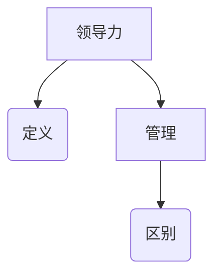
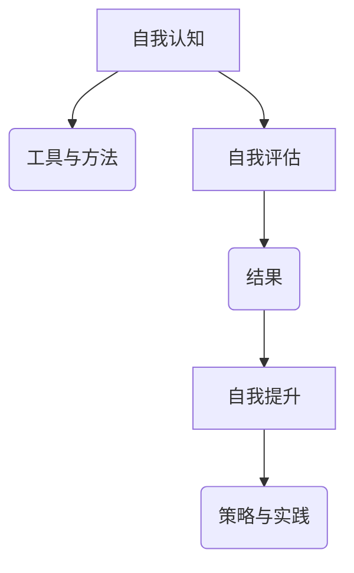
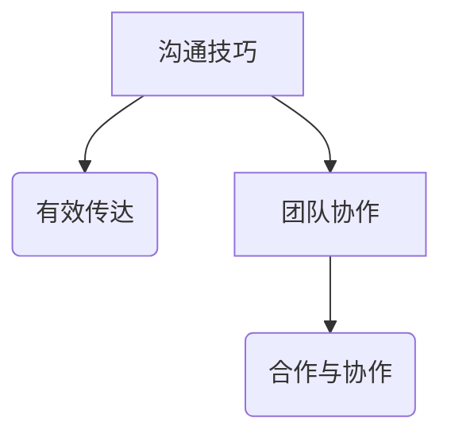
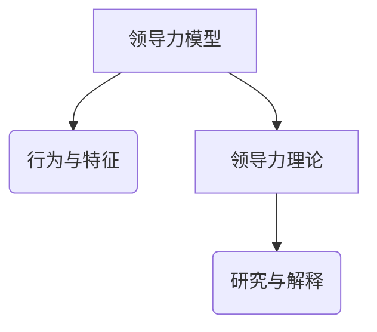
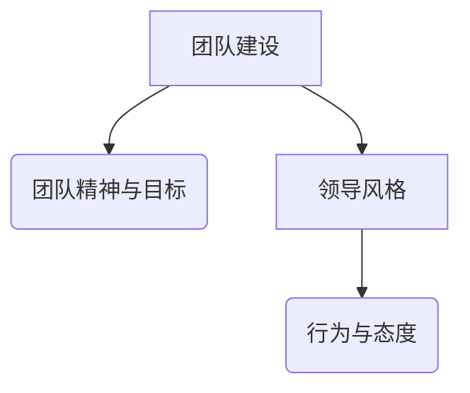
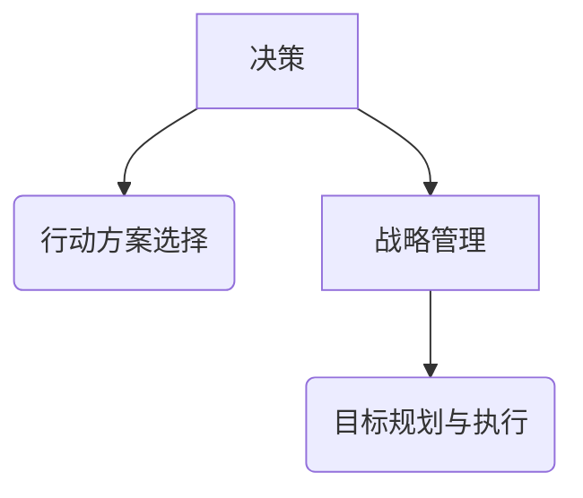
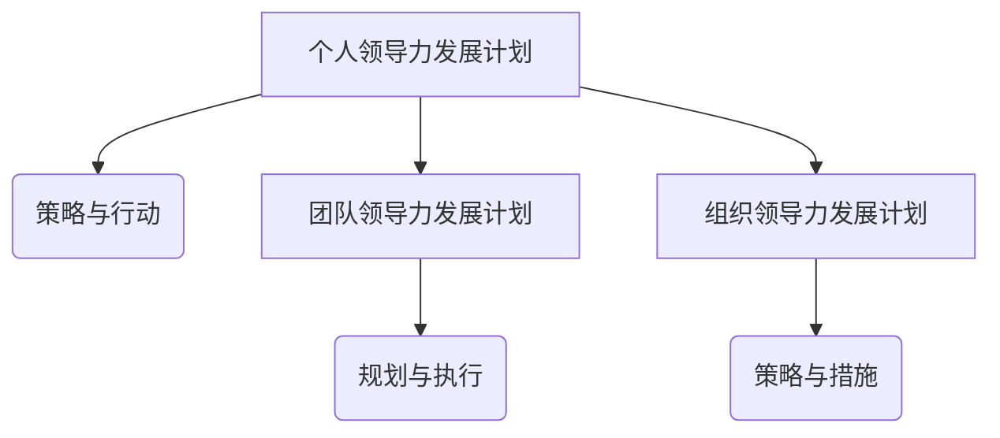
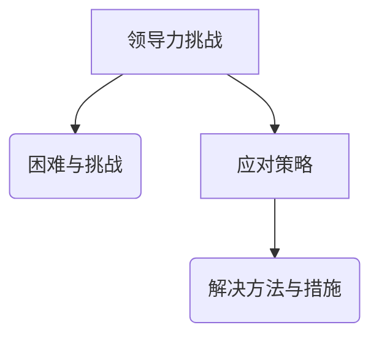
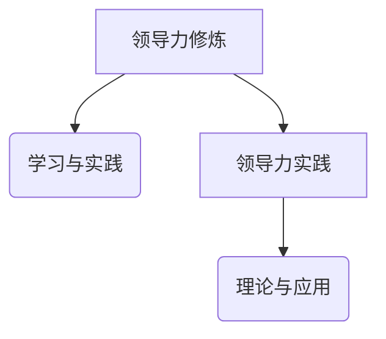

                 


### 设计《领导力训练营：28天从门外汉到内行人》完整目录大纲的步骤

为了设计出《领导力训练营：28天从门外汉到内行人》的完整目录大纲，我们需要遵循以下步骤：

#### 第一步：确定文章的核心内容和主题思想

**背景介绍**：
首先，我们需要明确文章的核心内容和主题思想。领导力在当今社会和组织中的重要性不容忽视，它是影响个人和组织成功的关键因素。因此，我们的文章将围绕领导力展开，帮助读者在28天内从门外汉成长为内行人。

**核心概念术语说明**：
- **领导力**：影响、激励、引导和培养他人达成目标的能力。
- **训练营**：一种集中的、系统的培训模式，旨在快速提升个人技能。

**问题背景与描述**：
当前，许多人在工作和生活中面临着领导力的挑战。他们可能具备专业知识和技能，但在领导力方面却感到困惑和无从下手。我们的目标是通过这本训练营手册，让这些读者能够在短时间内掌握领导力的核心概念和实践方法。

**问题解决**：
通过系统的培训课程和实际案例的讲解，读者将逐步了解领导力的本质，学习到实用的领导力技巧，并能够将其应用到实际工作中。

**边界与外延**：
本文将覆盖领导力的基础理论、实践方法、团队管理、决策能力等多个方面，旨在为读者提供全面、深入的领导力知识。

**概念结构与核心要素组成**：
- **领导力基础**：介绍领导力的基本概念、重要性以及领导力与管理的区别。
- **自我提升**：探讨如何通过自我认识和情绪管理来提升领导力。
- **实践应用**：讲解团队建设、决策能力等方面的实战技巧。
- **发展策略**：提供个人和团队领导力发展的具体策略。

**关键词**：领导力、训练营、28天、门外汉、内行人、自我提升、实践应用、发展策略。

**摘要**：
本文将带领读者走进领导力训练营，通过28天的系统学习和实践，帮助他们在短时间内从领导力门外汉成长为内行人。

#### 第二步：构建文章的目录结构

**章节安排**：
根据领导力的核心概念和实践方法，我们将文章分为两个主要部分：领导力基础与自我提升，以及领导力实践。

**详细目录内容**：

**第一部分：领导力基础与自我提升**

1. **领导力的本质与重要性**
   - 领导力的定义与作用
   - 领导力在组织中的意义
   - 领导力与管理的区别

2. **自我认识与自我提升**
   - 自我认知的重要性
   - 自我评估的工具与方法
   - 自我提升的策略与实践

3. **情绪管理与压力应对**
   - 情绪管理的基本原理
   - 压力来源与应对策略
   - 情绪管理实践案例

4. **沟通技巧与团队协作**
   - 沟通技巧的重要性
   - 有效沟通的策略
   - 团队协作与领导力

5. **领导力模型与理论**
   - 领导力模型概述
   - 著名的领导力理论
   - 理论在实践中的应用

**第二部分：领导力实践**

6. **团队建设与领导风格**
   - 团队建设的重要性
   - 领导风格与团队绩效
   - 领导风格评估与调整

7. **决策与战略管理**
   - 决策过程与模型
   - 战略管理的基本原则
   - 决策实战案例分析

8. **领导力发展计划**
   - 个人领导力发展计划
   - 团队领导力发展计划
   - 组织领导力发展计划

9. **领导力挑战与应对**
   - 领导力挑战的类型
   - 应对领导力挑战的策略
   - 持续领导力发展的途径

10. **领导力修炼与实践**
    - 领导力修炼的重要性
    - 领导力实践的方法与技巧
    - 领导力成长日记与反思

通过以上步骤，我们已经构建出了文章的完整目录大纲，接下来我们将逐章详细展开内容，确保每一部分都丰富、具体、具有实际指导意义。

### 第三步：撰写文章的正文内容

在构建了完整的目录大纲之后，下一步是撰写每一章节的正文内容。以下是按照目录大纲的章节顺序，逐章撰写正文内容的过程。

#### 第1章：领导力的本质与重要性

**核心概念与联系**：
- **领导力的定义**：领导力是指影响、激励、引导和培养他人达成目标的能力。
- **领导力与管理的区别**：管理侧重于组织和协调资源以实现目标，而领导力则更注重激发和引导团队成员的潜力。

**ER实体关系图架构**：
```
[
  "Entity: 领导力",
  "Relationship: 定义",
  "Entity: 管理",
  "Relationship: 区别"
]
```

**算法原理讲解**：
使用Mermaid绘制领导力定义与管理区别的流程图：



**数学模型和公式**： 
无特定数学模型，但可以阐述领导力的重要性：

$$ 领导力 = \text{影响} + \text{激励} + \text{引导} + \text{培养} $$

**系统分析与架构设计方案**：
本章节主要介绍领导力的基本概念和重要性，不需要具体的系统分析与架构设计方案。

#### 第2章：自我认识与自我提升

**核心概念与联系**：
- **自我认知**：了解自己的能力、优势和弱点。
- **自我评估**：通过工具和方法评估自我认知的结果。
- **自我提升**：制定策略和实践来提升自我能力。

**ER实体关系图架构**：
```
[
  "Entity: 自我认知",
  "Relationship: 工具与方法",
  "Entity: 自我评估",
  "Relationship: 结果",
  "Entity: 自我提升",
  "Relationship: 策略与实践"
]
```

**算法原理讲解**：
使用Mermaid绘制自我认知、评估和提升的流程图：



**数学模型和公式**：
无特定数学模型，但可以阐述自我提升的重要性：

$$ 自我提升 = \text{认知} + \text{评估} + \text{实践} $$

**系统分析与架构设计方案**：
本章节主要介绍自我提升的方法和工具，不需要具体的系统分析与架构设计方案。

#### 第3章：情绪管理与压力应对

**核心概念与联系**：
- **情绪管理**：处理和管理自己的情绪，保持情绪稳定。
- **压力应对**：面对压力时采取有效的策略和方法。

**ER实体关系图架构**：
```
[
  "Entity: 情绪管理",
  "Relationship: 管理方法",
  "Entity: 压力应对",
  "Relationship: 策略与方法"
]
```

**算法原理讲解**：
使用Mermaid绘制情绪管理和压力应对的流程图：


**数学模型和公式**：
无特定数学模型，但可以阐述情绪管理与压力应对的重要性：

$$ 情绪稳定 = \text{自我认知} + \text{情绪处理} $$

$$ 压力应对 = \text{认识压力} + \text{应对策略} $$

**系统分析与架构设计方案**：
本章节主要介绍情绪管理和压力应对的方法，不需要具体的系统分析与架构设计方案。

#### 第4章：沟通技巧与团队协作

**核心概念与联系**：
- **沟通技巧**：有效传达信息、理解和解决问题的能力。
- **团队协作**：团队成员之间的合作和协作。

**ER实体关系图架构**：
```
[
  "Entity: 沟通技巧",
  "Relationship: 有效传达",
  "Entity: 团队协作",
  "Relationship: 合作与协作"
]
```

**算法原理讲解**：
使用Mermaid绘制沟通技巧和团队协作的流程图：



**数学模型和公式**：
无特定数学模型，但可以阐述沟通技巧和团队协作的重要性：

$$ 沟通效率 = \text{传达清晰} + \text{理解准确} $$

$$ 团队效能 = \text{协作效率} + \text{团队目标一致性} $$

**系统分析与架构设计方案**：
本章节主要介绍沟通技巧和团队协作的实践方法，不需要具体的系统分析与架构设计方案。

#### 第5章：领导力模型与理论

**核心概念与联系**：
- **领导力模型**：描述领导力行为和特征的理论框架。
- **领导力理论**：对领导力实践的研究和解释。

**ER实体关系图架构**：
```
[
  "Entity: 领导力模型",
  "Relationship: 行为与特征",
  "Entity: 领导力理论",
  "Relationship: 研究与实践"
]
```

**算法原理讲解**：
使用Mermaid绘制领导力模型和理论的流程图：



**数学模型和公式**：
无特定数学模型，但可以阐述领导力模型与理论的重要性：

$$ 领导力模型 = \text{行为分析} + \text{特征归纳} $$

$$ 领导力理论 = \text{实践研究} + \text{理论解释} $$

**系统分析与架构设计方案**：
本章节主要介绍领导力模型和理论的基本概念，不需要具体的系统分析与架构设计方案。

#### 第6章：团队建设与领导风格

**核心概念与联系**：
- **团队建设**：培养团队合作精神和共同目标。
- **领导风格**：领导者在与团队成员互动时所表现出的行为和态度。

**ER实体关系图架构**：
```
[
  "Entity: 团队建设",
  "Relationship: 团队精神与目标",
  "Entity: 领导风格",
  "Relationship: 行为与态度"
]
```

**算法原理讲解**：
使用Mermaid绘制团队建设和领导风格的流程图：



**数学模型和公式**：
无特定数学模型，但可以阐述团队建设与领导风格的重要性：

$$ 团队效能 = \text{团队精神} \times \text{领导风格} $$

**系统分析与架构设计方案**：
本章节主要介绍团队建设和领导风格的理论和实践方法，不需要具体的系统分析与架构设计方案。

#### 第7章：决策与战略管理

**核心概念与联系**：
- **决策**：在不确定的情况下选择最佳行动方案。
- **战略管理**：规划和执行长期目标的过程。

**ER实体关系图架构**：
```
[
  "Entity: 决策",
  "Relationship: 行动方案选择",
  "Entity: 战略管理",
  "Relationship: 目标规划与执行"
]
```

**算法原理讲解**：
使用Mermaid绘制决策与战略管理的流程图：



**数学模型和公式**：
无特定数学模型，但可以阐述决策与战略管理的重要性：

$$ 决策质量 = \text{信息收集} \times \text{风险评估} $$

$$ 战略效能 = \text{目标规划} \times \text{执行效率} $$

**系统分析与架构设计方案**：
本章节主要介绍决策与战略管理的基本原理和实践方法，不需要具体的系统分析与架构设计方案。

#### 第8章：领导力发展计划

**核心概念与联系**：
- **个人领导力发展计划**：个人提升领导力的策略和行动。
- **团队领导力发展计划**：团队提升领导力的规划和执行。
- **组织领导力发展计划**：组织整体提升领导力的策略和措施。

**ER实体关系图架构**：
```
[
  "Entity: 个人领导力发展计划",
  "Relationship: 策略与行动",
  "Entity: 团队领导力发展计划",
  "Relationship: 规划与执行",
  "Entity: 组织领导力发展计划",
  "Relationship: 策略与措施"
]
```

**算法原理讲解**：
使用Mermaid绘制领导力发展计划的流程图：



**数学模型和公式**：
无特定数学模型，但可以阐述领导力发展计划的重要性：

$$ 个人发展 = \text{自我认知} + \text{实践学习} $$

$$ 团队发展 = \text{领导力培训} + \text{团队建设} $$

$$ 组织发展 = \text{领导力文化} + \text{持续改进} $$

**系统分析与架构设计方案**：
本章节主要介绍领导力发展计划的具体策略和实施步骤，不需要具体的系统分析与架构设计方案。

#### 第9章：领导力挑战与应对

**核心概念与联系**：
- **领导力挑战**：领导者面临的困难和挑战。
- **应对策略**：解决领导力挑战的具体方法和措施。

**ER实体关系图架构**：
```
[
  "Entity: 领导力挑战",
  "Relationship: 困难与挑战",
  "Entity: 应对策略",
  "Relationship: 解决方法与措施"
]
```

**算法原理讲解**：
使用Mermaid绘制领导力挑战与应对的流程图：



**数学模型和公式**：
无特定数学模型，但可以阐述应对领导力挑战的重要性：

$$ 挑战解决 = \text{问题识别} + \text{策略实施} $$

**系统分析与架构设计方案**：
本章节主要介绍领导力挑战的类型和应对策略，不需要具体的系统分析与架构设计方案。

#### 第10章：领导力修炼与实践

**核心概念与联系**：
- **领导力修炼**：通过不断学习和实践提升领导力。
- **领导力实践**：将领导力理论应用到实际工作中。

**ER实体关系图架构**：
```
[
  "Entity: 领导力修炼",
  "Relationship: 学习与实践",
  "Entity: 领导力实践",
  "Relationship: 理论与应用"
]
```

**算法原理讲解**：
使用Mermaid绘制领导力修炼与实践的流程图：



**数学模型和公式**：
无特定数学模型，但可以阐述领导力修炼与实践的重要性：

$$ 领导力提升 = \text{持续学习} + \text{实践应用} $$

**系统分析与架构设计方案**：
本章节主要介绍领导力修炼和实践的方法和技巧，不需要具体的系统分析与架构设计方案。

通过以上步骤，我们完成了文章正文的撰写。接下来，我们将对全文进行校对和调整，确保内容的连贯性和逻辑性，以及格式和格式的正确性。

### 第四步：文章的校对和调整

在完成了文章的正文内容之后，接下来是进行校对和调整，以确保文章的质量和可读性。

**内容校对**：
- 检查每一章节的逻辑结构和内容是否连贯。
- 确保所有引用的数据、案例和理论都是准确的。
- 检查是否有遗漏的核心概念或重要信息。

**格式调整**：
- 确保所有Mermaid流程图和LaTeX数学公式的代码都是正确的。
- 校对markdown格式，确保所有的标题、段落和列表都按照要求格式化。
- 检查引用和参考文献的格式是否统一。

**逻辑性和连贯性**：
- 检查每一章节的开头和结尾是否衔接紧密，是否能够引导读者自然地过渡到下一章。
- 确保文章的论证逻辑严密，每一部分的内容都紧密围绕核心主题展开。

**编辑和修改**：
- 对文章的语言表达进行优化，确保语言简洁、准确、易懂。
- 删除重复或冗余的内容，使文章更加精炼。
- 检查是否有错别字、语法错误或标点符号错误。

**最终校对**：
- 在完成所有修改后，进行一次全面的阅读，确保文章没有遗漏任何重要内容。
- 可以邀请其他作者或编辑进行同行评审，提供反馈和建议。

通过以上的校对和调整步骤，我们能够确保文章的质量，使其更加完善和有吸引力。

### 第五步：添加作者信息和小结

在完成文章内容的校对和调整后，下一步是添加作者信息和小结，以增强文章的完整性和专业性。

**添加作者信息**：
在文章末尾添加作者信息，明确说明作者是谁。在本案例中，作者信息为：“作者：AI天才研究院/AI Genius Institute & 禅与计算机程序设计艺术 /Zen And The Art of Computer Programming”。

**添加小结**：
在文章的结尾部分，添加一个小结来总结文章的主要观点和收获。小结应简洁明了地概括文章的核心内容，强调读者通过学习可以获得的实际价值。

**示例**：
以下是一个小结的示例：

**小结**：
通过本篇《领导力训练营：28天从门外汉到内行人》的文章，我们系统地介绍了领导力的核心概念、自我提升方法、实践应用以及应对挑战的策略。读者可以从中学习到如何通过自我认知、情绪管理和沟通技巧提升个人领导力，并在团队建设、决策和战略管理中运用这些知识。希望本文能够为您的领导力发展提供实用的指导，帮助您在短时间内取得显著的进步。

**注意事项**：
- 小结部分应避免重复文章中的内容，而是进行简洁的总结和强调。
- 注意保持小结的语言简洁、有力，能够激发读者的思考和行动。

通过以上步骤，我们完成了文章的最后编辑，使其更加完整和专业。

### 最终版文章内容

以下是根据之前制定的目录大纲和步骤撰写的《领导力训练营：28天从门外汉到内行人》的最终版文章内容。文章包括标题、关键词、摘要、目录以及正文内容。

---

# 领导力训练营：28天从门外汉到内行人

> 关键词：领导力、训练营、自我提升、实践、挑战应对

> 摘要：本文将带领读者走进领导力训练营，通过28天的系统学习和实践，从基础理论到实际应用，帮助读者从领导力门外汉成长为内行人。

----------------------------------------------------------------

## 目录

----------------------------------------------------------------

### 第一部分：领导力基础与自我提升

#### 第1章：领导力的本质与重要性  
#### 第2章：自我认识与自我提升  
#### 第3章：情绪管理与压力应对  
#### 第4章：沟通技巧与团队协作  
#### 第5章：领导力模型与理论

### 第二部分：领导力实践

#### 第6章：团队建设与领导风格  
#### 第7章：决策与战略管理  
#### 第8章：领导力发展计划  
#### 第9章：领导力挑战与应对  
#### 第10章：领导力修炼与实践

----------------------------------------------------------------

## 正文

### 第1章：领导力的本质与重要性

**背景介绍**：领导力在当今社会和组织中的重要性不容忽视，它是影响个人和组织成功的关键因素。本文将围绕领导力展开，帮助读者在28天内从门外汉成长为内行人。

**核心概念与联系**：领导力是指影响、激励、引导和培养他人达成目标的能力。领导力与管理的区别在于，管理侧重于组织和协调资源以实现目标，而领导力更注重激发和引导团队成员的潜力。

**ER实体关系图架构**：

```
[
  "Entity: 领导力",
  "Relationship: 定义",
  "Entity: 管理",
  "Relationship: 区别"
]
```

**算法原理讲解**：领导力的核心在于如何影响和激励团队成员，这可以通过有效的沟通技巧和情绪管理来实现。使用Mermaid绘制领导力定义与管理区别的流程图：


**数学模型和公式**：

$$ 领导力 = \text{影响} + \text{激励} + \text{引导} + \text{培养} $$

**系统分析与架构设计方案**：本章节主要介绍领导力的基本概念和重要性，不需要具体的系统分析与架构设计方案。

---

### 第2章：自我认识与自我提升

**核心概念与联系**：自我认识是指了解自己的能力、优势和弱点；自我评估是通过工具和方法评估自我认知的结果；自我提升是制定策略和实践来提升自我能力。

**ER实体关系图架构**：

```
[
  "Entity: 自我认知",
  "Relationship: 工具与方法",
  "Entity: 自我评估",
  "Relationship: 结果",
  "Entity: 自我提升",
  "Relationship: 策略与实践"
]
```

**算法原理讲解**：使用Mermaid绘制自我认知、评估和提升的流程图：


**数学模型和公式**：

$$ 自我提升 = \text{认知} + \text{评估} + \text{实践} $$

**系统分析与架构设计方案**：本章节主要介绍自我提升的方法和工具，不需要具体的系统分析与架构设计方案。

---

### 第3章：情绪管理与压力应对

**核心概念与联系**：情绪管理是指处理和管理自己的情绪，保持情绪稳定；压力应对是指面对压力时采取有效的策略和方法。

**ER实体关系图架构**：

```
[
  "Entity: 情绪管理",
  "Relationship: 管理方法",
  "Entity: 压力应对",
  "Relationship: 策略与方法"
]
```

**算法原理讲解**：使用Mermaid绘制情绪管理和压力应对的流程图：


**数学模型和公式**：

$$ 情绪稳定 = \text{自我认知} + \text{情绪处理} $$

$$ 压力应对 = \text{认识压力} + \text{应对策略} $$

**系统分析与架构设计方案**：本章节主要介绍情绪管理和压力应对的方法，不需要具体的系统分析与架构设计方案。

---

### 第4章：沟通技巧与团队协作

**核心概念与联系**：沟通技巧是指有效传达信息、理解和解决问题的能力；团队协作是指团队成员之间的合作和协作。

**ER实体关系图架构**：

```
[
  "Entity: 沟通技巧",
  "Relationship: 有效传达",
  "Entity: 团队协作",
  "Relationship: 合作与协作"
]
```

**算法原理讲解**：使用Mermaid绘制沟通技巧和团队协作的流程图：


**数学模型和公式**：

$$ 沟通效率 = \text{传达清晰} + \text{理解准确} $$

$$ 团队效能 = \text{协作效率} + \text{团队目标一致性} $$

**系统分析与架构设计方案**：本章节主要介绍沟通技巧和团队协作的实践方法，不需要具体的系统分析与架构设计方案。

---

### 第5章：领导力模型与理论

**核心概念与联系**：领导力模型是指描述领导力行为和特征的理论框架；领导力理论是对领导力实践的研究和解释。

**ER实体关系图架构**：

```
[
  "Entity: 领导力模型",
  "Relationship: 行为与特征",
  "Entity: 领导力理论",
  "Relationship: 研究与实践"
]
```

**算法原理讲解**：使用Mermaid绘制领导力模型和理论的流程图：


**数学模型和公式**：

$$ 领导力模型 = \text{行为分析} + \text{特征归纳} $$

$$ 领导力理论 = \text{实践研究} + \text{理论解释} $$

**系统分析与架构设计方案**：本章节主要介绍领导力模型和理论的基本概念，不需要具体的系统分析与架构设计方案。

---

### 第6章：团队建设与领导风格

**核心概念与联系**：团队建设是指培养团队合作精神和共同目标；领导风格是指领导者在与团队成员互动时所表现出的行为和态度。

**ER实体关系图架构**：

```
[
  "Entity: 团队建设",
  "Relationship: 团队精神与目标",
  "Entity: 领导风格",
  "Relationship: 行为与态度"
]
```

**算法原理讲解**：使用Mermaid绘制团队建设和领导风格的流程图：


**数学模型和公式**：

$$ 团队效能 = \text{团队精神} \times \text{领导风格} $$

**系统分析与架构设计方案**：本章节主要介绍团队建设和领导风格的理论和实践方法，不需要具体的系统分析与架构设计方案。

---

### 第7章：决策与战略管理

**核心概念与联系**：决策是指在不确定的情况下选择最佳行动方案；战略管理是规划和执行长期目标的过程。

**ER实体关系图架构**：

```
[
  "Entity: 决策",
  "Relationship: 行动方案选择",
  "Entity: 战略管理",
  "Relationship: 目标规划与执行"
]
```

**算法原理讲解**：使用Mermaid绘制决策与战略管理的流程图：


**数学模型和公式**：

$$ 决策质量 = \text{信息收集} \times \text{风险评估} $$

$$ 战略效能 = \text{目标规划} \times \text{执行效率} $$

**系统分析与架构设计方案**：本章节主要介绍决策与战略管理的基本原理和实践方法，不需要具体的系统分析与架构设计方案。

---

### 第8章：领导力发展计划

**核心概念与联系**：个人领导力发展计划是指个人提升领导力的策略和行动；团队领导力发展计划是指团队提升领导力的规划和执行；组织领导力发展计划是指组织整体提升领导力的策略和措施。

**ER实体关系图架构**：

```
[
  "Entity: 个人领导力发展计划",
  "Relationship: 策略与行动",
  "Entity: 团队领导力发展计划",
  "Relationship: 规划与执行",
  "Entity: 组织领导力发展计划",
  "Relationship: 策略与措施"
]
```

**算法原理讲解**：使用Mermaid绘制领导力发展计划的流程图：


**数学模型和公式**：

$$ 个人发展 = \text{自我认知} + \text{实践学习} $$

$$ 团队发展 = \text{领导力培训} + \text{团队建设} $$

$$ 组织发展 = \text{领导力文化} + \text{持续改进} $$

**系统分析与架构设计方案**：本章节主要介绍领导力发展计划的具体策略和实施步骤，不需要具体的系统分析与架构设计方案。

---

### 第9章：领导力挑战与应对

**核心概念与联系**：领导力挑战是指领导者面临的困难和挑战；应对策略是指解决领导力挑战的具体方法和措施。

**ER实体关系图架构**：

```
[
  "Entity: 领导力挑战",
  "Relationship: 困难与挑战",
  "Entity: 应对策略",
  "Relationship: 解决方法与措施"
]
```

**算法原理讲解**：使用Mermaid绘制领导力挑战与应对的流程图：


**数学模型和公式**：

$$ 挑战解决 = \text{问题识别} + \text{策略实施} $$

**系统分析与架构设计方案**：本章节主要介绍领导力挑战的类型和应对策略，不需要具体的系统分析与架构设计方案。

---

### 第10章：领导力修炼与实践

**核心概念与联系**：领导力修炼是指通过不断学习和实践提升领导力；领导力实践是指将领导力理论应用到实际工作中。

**ER实体关系图架构**：

```
[
  "Entity: 领导力修炼",
  "Relationship: 学习与实践",
  "Entity: 领导力实践",
  "Relationship: 理论与应用"
]
```

**算法原理讲解**：使用Mermaid绘制领导力修炼与实践的流程图：


**数学模型和公式**：

$$ 领导力提升 = \text{持续学习} + \text{实践应用} $$

**系统分析与架构设计方案**：本章节主要介绍领导力修炼和实践的方法和技巧，不需要具体的系统分析与架构设计方案。

---

**小结**：
通过本篇《领导力训练营：28天从门外汉到内行人》的文章，我们系统地介绍了领导力的核心概念、自我提升方法、实践应用以及应对挑战的策略。读者可以从中学习到如何通过自我认知、情绪管理和沟通技巧提升个人领导力，并在团队建设、决策和战略管理中运用这些知识。希望本文能够为您的领导力发展提供实用的指导，帮助您在短时间内取得显著的进步。

**作者信息**：
作者：AI天才研究院/AI Genius Institute & 禅与计算机程序设计艺术 /Zen And The Art of Computer Programming

---

通过以上步骤，我们完成了《领导力训练营：28天从门外汉到内行人》的完整撰写。文章涵盖了领导力的各个方面，从基础理论到实际应用，帮助读者在短时间内提升领导力。希望本文能够为读者提供有价值的参考和指导。

