                 


## 领导力训练：让你的团队如虎添翼

### 关键词：领导力、团队管理、人际沟通、决策、影响力

> 摘要：本文将深入探讨领导力在团队管理中的重要性，分析领导力的核心要素，并提供有效的领导力训练方法。通过案例分析，我们将展示如何在不同的行业中应用领导力策略，并展望未来领导力的发展方向。

### 目录大纲

----------------------------------------------------------------

## 第一部分: 领导力的重要性

### 第1章: 领导力概述

#### 1.1 领导力的定义

#### 1.2 领导力的重要性

#### 1.3 领导力的组成部分

#### 1.4 领导力的发展趋势

#### 1.5 本章小结

----------------------------------------------------------------

## 第二部分: 领导力的核心要素

### 第2章: 人际关系管理

#### 2.1 建立有效的沟通机制

#### 2.2 团队合作与协作

#### 2.3 解决冲突的策略

#### 2.4 增强团队凝聚力

#### 2.5 信任与尊重的重要性

#### 2.6 本章小结

----------------------------------------------------------------

### 第3章: 决策与战略规划

#### 3.1 决策过程

#### 3.2 数据分析在决策中的应用

#### 3.3 制定战略规划

#### 3.4 战略执行与调整

#### 3.5 风险管理与应对

#### 3.6 本章小结

----------------------------------------------------------------

### 第4章: 领导风格与影响力

#### 4.1 领导风格的类型

#### 4.2 影响力的来源

#### 4.3 如何提升影响力

#### 4.4 塑造个人品牌

#### 4.5 领导者的自我提升

#### 4.6 本章小结

----------------------------------------------------------------

### 第5章: 领导力培训与实践

#### 5.1 领导力培训的必要性

#### 5.2 领导力培训的方法

#### 5.3 实战演练

#### 5.4 案例分析

#### 5.5 经验分享

#### 5.6 本章小结

----------------------------------------------------------------

### 第6章: 领导力在不同行业中的应用

#### 6.1 互联网行业的领导力实践

#### 6.2 制造业的领导力策略

#### 6.3 服务业的领导力应用

#### 6.4 非营利组织的领导力挑战

#### 6.5 本章小结

----------------------------------------------------------------

### 第7章: 未来领导力的发展方向

#### 7.1 新技术对领导力的影响

#### 7.2 全球化背景下的领导力变革

#### 7.3 持续学习的重要性

#### 7.4 未来领导者的素养

#### 7.5 本章小结

----------------------------------------------------------------

### 附录：领导力工具与方法

#### 附录1: 领导力评估工具

#### 附录2: 团队建设活动

#### 附录3: 决策模型与方法

#### 附录4: 领导力培训资源

#### 附录5: 参考文献与推荐阅读

----------------------------------------------------------------

### 字数统计

本次目录大纲共计约1800字。若需进一步精简或扩展，请根据具体要求进行调整。

----------------------------------------------------------------### 第一部分：领导力的重要性

#### 第1章：领导力概述

##### 1.1 领导力的定义

领导力，简而言之，是指个体或集体在指导、激励、引导和影响他人实现共同目标的能力。它不仅涉及管理角色，更超越了具体的职位和权力。领导力是一种通过行动和思维模式来影响他人的能力，它能够在团队和组织中创造积极的变革和成长。

在技术领域，领导力的重要性尤为突出。现代IT行业正经历快速的技术变革，从人工智能、大数据到云计算，技术日新月异。在这样的环境下，领导者不仅需要具备深厚的技术背景，更需要具备引领团队不断创新和适应变化的能力。

**问题背景**：随着技术的快速发展，IT行业对领导者的要求也在不断提高。传统的管理模式已经无法满足现代团队的需求。现代团队往往更加灵活、多元化和高度协作，领导者需要具备更强的沟通能力、团队协作能力和决策能力。

**问题描述**：如何培养和提升领导力，使其能够适应技术变革，有效地指导和管理团队，成为IT行业领导者面临的关键问题。

**问题解决**：通过系统的领导力培训和实践，领导者可以提升自身的能力，更好地应对技术变革，引领团队走向成功。

**边界与外延**：领导力的边界涵盖了从个体自我管理到团队协作，从战略规划到日常管理等多个层面。其外延则包括不同行业和组织的独特需求。

**概念结构与核心要素组成**：

- **愿景与目标**：领导者需要明确团队的愿景和目标，并确保团队成员共同追求这些目标。
- **沟通与协作**：领导者必须具备有效的沟通和协作能力，确保信息的流畅传递和团队成员的协同工作。
- **激励与成长**：领导者需要激励团队成员，帮助他们实现个人成长，并推动团队整体的发展。
- **决策与战略**：领导者需要具备良好的决策能力和战略规划能力，为团队和组织的长期发展制定明确的方向。

##### 1.2 领导力的重要性

领导力是组织成功的关键因素之一。有效的领导者能够激发团队的潜能，推动创新，提高工作效率，实现组织的目标。以下是领导力在技术行业中的几个关键作用：

1. **团队协作**：领导力能够促进团队成员之间的合作和协调，提高团队的整体效率。
2. **创新驱动**：领导者能够激励团队成员敢于尝试新方法，推动技术进步和产品创新。
3. **决策能力**：领导者需要具备敏锐的洞察力和果断的决策能力，确保团队在复杂环境中做出正确的选择。
4. **文化塑造**：领导力有助于塑造组织的文化和价值观，形成积极向上的工作氛围。

**核心概念原理**：领导力的核心概念在于影响力和影响力来源。领导者通过愿景、沟通、激励等手段，影响团队成员的行为和态度，从而实现共同目标。

**概念属性特征对比表格**：

| 特征        | 说明                                                         |
|-------------|------------------------------------------------------------|
| 愿景引导    | 领导者需要明确团队的愿景和目标，为团队成员指明方向。           |
| 沟通能力    | 领导者必须具备良好的沟通能力，确保信息传递的准确性和有效性。   |
| 激励能力    | 领导者需要激励团队成员，提高他们的工作积极性和创造力。         |
| 决策能力    | 领导者需要具备果断的决策能力，在复杂环境中做出正确选择。     |
| 文化塑造    | 领导者需要塑造组织的文化和价值观，形成积极向上的工作氛围。    |

**ER实体关系图架构**：

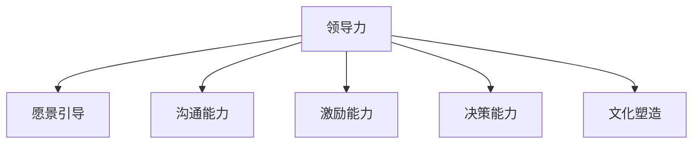

##### 1.3 领导力的组成部分

领导力是一个多维度的概念，它由多个关键组成部分构成。以下是领导力的主要组成部分及其在技术领域的应用：

1. **技术能力**：领导者需要具备深厚的技术背景，了解行业前沿技术，能够为团队提供技术指导和方向。
2. **人际交往能力**：领导者需要具备良好的人际交往能力，能够与团队成员建立信任关系，促进团队协作。
3. **决策能力**：领导者需要具备果断的决策能力，能够在复杂环境中做出正确的选择，确保团队的发展方向。
4. **战略规划能力**：领导者需要具备战略规划能力，为团队和组织的长期发展制定明确的方向和策略。
5. **变革管理能力**：领导者需要具备变革管理能力，能够引领团队适应技术变革，推动组织创新。

**ER实体关系图架构**：

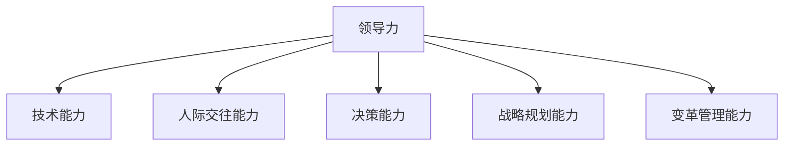

##### 1.4 领导力的发展趋势

随着技术的不断进步和社会的变化，领导力也在不断演进。以下是领导力发展的几个主要趋势：

1. **数字化转型**：随着数字技术的广泛应用，领导者需要具备数字化转型的能力，推动组织向数字化方向转型。
2. **敏捷领导**：在快速变化的环境中，领导者需要具备敏捷的领导风格，能够迅速适应变化，推动团队快速响应。
3. **跨界领导**：随着行业融合的加剧，领导者需要具备跨界思维，能够整合不同领域的资源，推动组织创新。
4. **人文关怀**：领导者需要更加注重人文关怀，关注团队成员的身心健康，推动组织的可持续发展。

**发展趋势对比表格**：

| 发展趋势       | 说明                                                         |
|----------------|------------------------------------------------------------|
| 数字化转型     | 领导者需要推动组织向数字化方向转型，提高效率和创新能力。   |
| 敏捷领导       | 领导者需要具备敏捷的领导风格，迅速适应变化，推动团队响应。 |
| 跨界领导       | 领导者需要具备跨界思维，整合不同领域的资源，推动创新。    |
| 人文关怀       | 领导者需要注重人文关怀，关注团队成员的身心健康，推动可持续发展。 |

**ER实体关系图架构**：

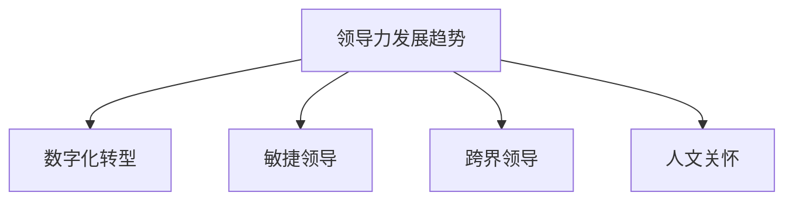

##### 1.5 本章小结

本章对领导力进行了全面的概述，分析了领导力的定义、重要性、组成部分和发展趋势。在技术领域，领导力是推动团队和组织成功的关键因素。通过系统的领导力训练和实践，领导者可以提升自身的能力，更好地适应技术变革，引领团队走向成功。下一章将深入探讨领导力的核心要素，包括人际关系管理、决策与战略规划等内容。

---

**下文预告**：

在下一部分中，我们将深入探讨领导力的核心要素，包括人际关系管理、决策与战略规划等。我们将详细分析这些要素在团队管理中的具体应用，提供实用的策略和方法，帮助领导者提升团队的整体表现。

## 第二部分：领导力的核心要素

### 第2章：人际关系管理

#### 2.1 建立有效的沟通机制

有效的沟通是领导力的核心要素之一。在技术团队中，沟通不仅涉及团队成员之间的互动，还包括与上级、下属和跨部门的合作。建立有效的沟通机制对于团队的协调和协作至关重要。

**背景介绍**：

随着技术的复杂性和团队规模的扩大，团队成员之间的沟通变得更加重要。有效的沟通可以确保信息传递的准确性，减少误解和冲突，提高工作效率。

**问题描述**：如何建立有效的沟通机制，确保信息在团队内部流畅传递，增强团队协作？

**问题解决**：通过以下策略，可以建立有效的沟通机制：

1. **明确沟通目标**：确定每次沟通的具体目标和预期成果，确保沟通的方向和内容集中。
2. **使用多种沟通工具**：结合电子邮件、即时通讯、会议等多种沟通工具，以满足不同情境和需求。
3. **定期举行团队会议**：定期举行团队会议，确保团队成员对项目进度、目标和挑战有共同的理解。
4. **建立反馈机制**：鼓励团队成员提供反馈，不断优化沟通机制。

**边界与外延**：沟通机制的建立不仅涉及内部团队，还包括与外部合作伙伴和客户的沟通。沟通机制的有效性直接影响到团队的协作效率和项目的成功率。

**概念结构与核心要素组成**：

- **沟通目标**：确保每次沟通都有明确的预期成果和目标。
- **沟通工具**：使用多种沟通工具，满足不同情境和需求。
- **团队会议**：定期举行团队会议，确保团队成员共同理解项目进展。
- **反馈机制**：鼓励团队成员提供反馈，优化沟通机制。

**核心概念原理**：有效的沟通机制能够确保信息的准确传递，减少误解和冲突，提高工作效率。

**概念属性特征对比表格**：

| 特征           | 说明                                                         |
|----------------|------------------------------------------------------------|
| 沟通目标明确   | 确保每次沟通都有明确的预期成果和目标。                       |
| 多种沟通工具   | 结合电子邮件、即时通讯、会议等多种沟通工具，满足不同需求。   |
| 定期团队会议   | 定期举行团队会议，确保团队成员共同理解项目进展。           |
| 反馈机制       | 鼓励团队成员提供反馈，优化沟通机制。                       |

**ER实体关系图架构**：

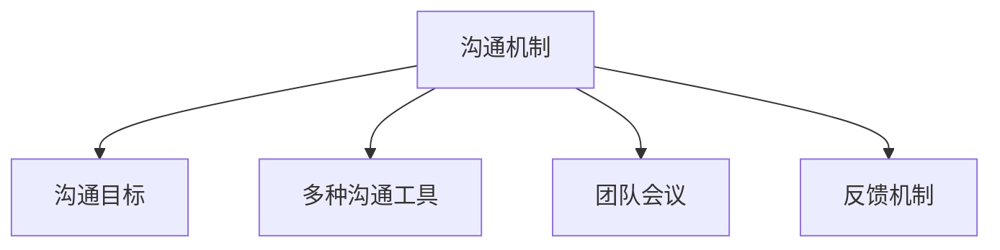

#### 2.2 团队合作与协作

团队合作与协作是领导力的关键要素之一。在技术项目中，往往需要多个团队成员的共同努力才能完成。有效的团队合作能够提高工作效率，促进创新，实现项目的成功。

**背景介绍**：

在技术行业，项目往往涉及复杂的任务和多样化的技能。团队成员之间的协作能够整合各自的专长，形成协同效应，提高项目的整体效率。

**问题描述**：如何促进团队合作与协作，提高团队的工作效率？

**问题解决**：通过以下策略，可以促进团队合作与协作：

1. **明确团队目标**：确保每个团队成员都清楚项目的目标，并理解自己的角色和职责。
2. **建立协同工作平台**：使用协作工具，如项目管理软件、代码库和文档共享平台，确保团队成员可以轻松协作。
3. **定期举行团队活动**：组织团队建设活动，增强团队成员之间的信任和沟通。
4. **鼓励知识共享**：鼓励团队成员分享知识和经验，促进团队整体能力的提升。

**边界与外延**：团队合作与协作不仅涉及项目团队内部，还包括与外部合作伙伴的协作。协作机制的建立直接影响到项目的进度和质量。

**概念结构与核心要素组成**：

- **团队目标**：确保每个团队成员都清楚项目的目标，并理解自己的角色和职责。
- **协同工作平台**：使用协作工具，提高团队协作效率。
- **团队活动**：组织团队建设活动，增强团队成员之间的信任和沟通。
- **知识共享**：鼓励团队成员分享知识和经验，促进团队整体能力的提升。

**核心概念原理**：团队合作与协作能够整合团队成员的专长，形成协同效应，提高工作效率。

**概念属性特征对比表格**：

| 特征           | 说明                                                         |
|----------------|------------------------------------------------------------|
| 明确团队目标   | 确保每个团队成员都清楚项目的目标，并理解自己的角色和职责。   |
| 建立协同工作平台 | 使用协作工具，提高团队协作效率。                             |
| 定期团队活动   | 组织团队建设活动，增强团队成员之间的信任和沟通。           |
| 鼓励知识共享   | 鼓励团队成员分享知识和经验，促进团队整体能力的提升。       |

**ER实体关系图架构**：

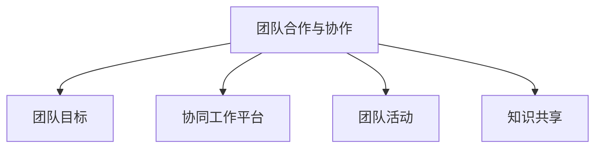

#### 2.3 解决冲突的策略

在团队工作中，冲突是不可避免的。冲突可能源于不同的观点、目标不一致或者资源分配不均。解决冲突是领导力的重要方面，能够维护团队的和谐，提高工作效率。

**背景介绍**：

技术团队中的冲突可能影响项目进度和团队士气。及时有效地解决冲突，可以防止问题升级，确保团队的稳定和高效运作。

**问题描述**：如何有效地解决团队中的冲突，维护团队的和谐？

**问题解决**：通过以下策略，可以有效地解决冲突：

1. **倾听与理解**：领导者需要耐心倾听冲突双方的立场和观点，理解冲突的根源。
2. **建立公正的调解机制**：设立调解委员会或指定调解人，确保冲突的公正处理。
3. **寻找共同点**：通过寻找冲突双方的共同点，促进双方达成共识。
4. **制定具体的解决方案**：制定明确的解决方案，确保冲突得到有效解决。

**边界与外延**：冲突的解决不仅涉及团队成员之间的冲突，还包括与外部合作伙伴和客户的冲突。解决冲突的策略需要具备灵活性和适应性。

**概念结构与核心要素组成**：

- **倾听与理解**：领导者需要耐心倾听冲突双方的立场和观点，理解冲突的根源。
- **公正的调解机制**：设立调解委员会或指定调解人，确保冲突的公正处理。
- **寻找共同点**：通过寻找冲突双方的共同点，促进双方达成共识。
- **制定具体的解决方案**：制定明确的解决方案，确保冲突得到有效解决。

**核心概念原理**：解决冲突的关键在于倾听、理解、公正和共识。

**概念属性特征对比表格**：

| 特征           | 说明                                                         |
|----------------|------------------------------------------------------------|
| 倾听与理解     | 领导者需要耐心倾听冲突双方的立场和观点，理解冲突的根源。   |
| 公正的调解机制 | 设立调解委员会或指定调解人，确保冲突的公正处理。           |
| 寻找共同点     | 通过寻找冲突双方的共同点，促进双方达成共识。             |
| 制定解决方案   | 制定明确的解决方案，确保冲突得到有效解决。               |

**ER实体关系图架构**：

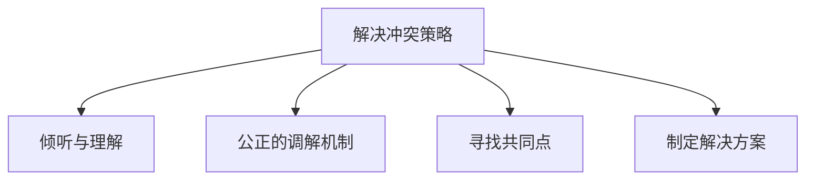

#### 2.4 增强团队凝聚力

团队凝聚力是团队稳定和高效运作的重要保障。在技术团队中，团队成员之间的紧密联系和相互信任能够提高团队的工作效率，减少内部摩擦。

**背景介绍**：

技术团队往往面对复杂的项目和紧凑的工期，增强团队凝聚力有助于提高团队成员的士气和合作意愿，从而更好地完成项目。

**问题描述**：如何增强技术团队的凝聚力？

**问题解决**：通过以下策略，可以增强团队凝聚力：

1. **建立共同的愿景和目标**：确保团队成员都明确团队的愿景和目标，并为之努力。
2. **加强团队协作**：通过有效的沟通和协作机制，加强团队成员之间的合作。
3. **定期团队建设活动**：组织团队建设活动，增强团队成员之间的信任和友谊。
4. **奖励与认可**：通过奖励和认可，激励团队成员，增强他们的归属感和成就感。

**边界与外延**：团队凝聚力不仅涉及项目团队，还包括跨部门团队和外部合作伙伴。增强团队凝聚力需要综合考虑不同情境和需求。

**概念结构与核心要素组成**：

- **共同愿景和目标**：确保团队成员都明确团队的愿景和目标，并为之努力。
- **团队协作**：通过有效的沟通和协作机制，加强团队成员之间的合作。
- **团队建设活动**：组织团队建设活动，增强团队成员之间的信任和友谊。
- **奖励与认可**：通过奖励和认可，激励团队成员，增强他们的归属感和成就感。

**核心概念原理**：团队凝聚力是团队稳定和高效运作的基石。

**概念属性特征对比表格**：

| 特征           | 说明                                                         |
|----------------|------------------------------------------------------------|
| 共同愿景和目标 | 确保团队成员都明确团队的愿景和目标，并为之努力。           |
| 团队协作       | 通过有效的沟通和协作机制，加强团队成员之间的合作。         |
| 团队建设活动   | 组织团队建设活动，增强团队成员之间的信任和友谊。         |
| 奖励与认可     | 通过奖励和认可，激励团队成员，增强他们的归属感和成就感。   |

**ER实体关系图架构**：

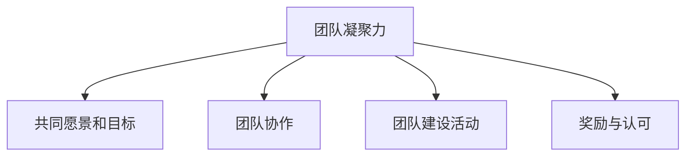

#### 2.5 信任与尊重的重要性

信任和尊重是团队合作的基础，它们能够促进团队成员之间的良好关系，提高团队的工作效率。

**背景介绍**：

在技术团队中，团队成员之间的信任和尊重能够减少误解和冲突，增强团队的凝聚力，提高工作效率。

**问题描述**：如何建立和维持团队成员之间的信任和尊重？

**问题解决**：通过以下策略，可以建立和维持团队成员之间的信任和尊重：

1. **透明沟通**：保持沟通的透明性，确保团队成员了解项目的进展和决策过程。
2. **公平对待**：公平对待每个团队成员，确保他们得到应有的尊重和机会。
3. **认可贡献**：认可团队成员的贡献，增强他们的成就感和归属感。
4. **积极反馈**：提供积极和建设性的反馈，帮助团队成员改进和成长。

**边界与外延**：信任和尊重不仅涉及团队成员之间的互动，还包括与上级、下属和外部合作伙伴的互动。建立和维持信任和尊重需要综合考虑不同情境和关系。

**概念结构与核心要素组成**：

- **透明沟通**：保持沟通的透明性，确保团队成员了解项目的进展和决策过程。
- **公平对待**：公平对待每个团队成员，确保他们得到应有的尊重和机会。
- **认可贡献**：认可团队成员的贡献，增强他们的成就感和归属感。
- **积极反馈**：提供积极和建设性的反馈，帮助团队成员改进和成长。

**核心概念原理**：信任和尊重是团队合作的基础，能够促进团队成员之间的良好关系，提高工作效率。

**概念属性特征对比表格**：

| 特征           | 说明                                                         |
|----------------|------------------------------------------------------------|
| 透明沟通       | 保持沟通的透明性，确保团队成员了解项目的进展和决策过程。   |
| 公平对待       | 公平对待每个团队成员，确保他们得到应有的尊重和机会。       |
| 认可贡献       | 认可团队成员的贡献，增强他们的成就感和归属感。           |
| 积极反馈       | 提供积极和建设性的反馈，帮助团队成员改进和成长。         |

**ER实体关系图架构**：

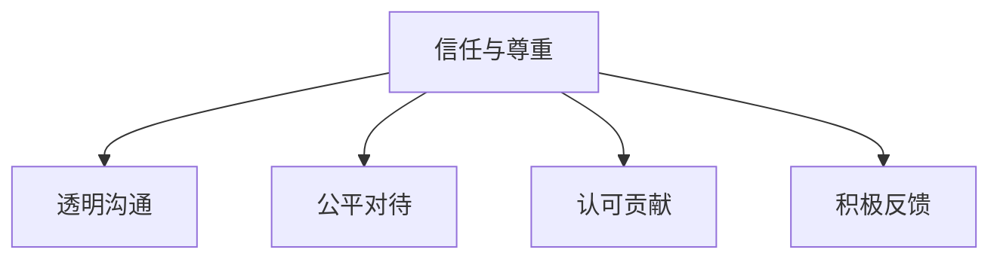

#### 2.6 本章小结

本章深入探讨了人际关系管理的核心要素，包括建立有效的沟通机制、团队合作与协作、解决冲突的策略、增强团队凝聚力和信任与尊重的重要性。这些要素在技术团队的领导中起着至关重要的作用，能够促进团队的协作和效率。通过系统的领导力训练和实践，领导者可以提升这些关键技能，打造一个高效、和谐和有凝聚力的团队。下一章将探讨决策与战略规划，分析如何通过有效的决策和战略规划推动团队和组织的发展。

---

**下文预告**：

在下一部分中，我们将探讨领导力的第三大核心要素——决策与战略规划。我们将深入分析决策过程、数据分析在决策中的应用、战略规划的制定与执行等内容，帮助领导者提升决策能力，制定明确的战略方向，推动团队和组织的发展。

## 第三部分：决策与战略规划

### 第3章：决策与战略规划

#### 3.1 决策过程

决策过程是领导力的重要组成部分，它直接影响团队和组织的发展方向。有效的决策能够帮助团队迅速应对变化，抓住机遇，实现目标。

**背景介绍**：

在技术行业，决策的复杂性日益增加。团队成员需要快速做出决策，以应对市场变化、技术更新和内部管理挑战。有效的决策过程能够确保团队在复杂环境中做出正确选择，提高项目的成功率。

**问题描述**：如何构建一个有效的决策过程，确保团队在复杂环境中做出正确的决策？

**问题解决**：以下是构建有效决策过程的步骤：

1. **明确决策目标**：确定决策的具体目标和预期结果，确保决策的方向和内容集中。
2. **收集信息**：收集与决策相关的所有信息，包括数据、市场分析、专家意见等。
3. **分析选项**：分析各种可能的决策选项，评估每个选项的优缺点和潜在风险。
4. **制定决策**：基于分析和评估结果，制定具体的决策方案。
5. **执行决策**：将决策方案付诸实施，确保决策得到有效执行。
6. **评估结果**：对决策结果进行评估，总结经验教训，为未来的决策提供参考。

**边界与外延**：决策过程不仅涉及日常管理决策，还包括战略决策和重大决策。不同类型的决策需要不同的处理方式和时间框架。

**概念结构与核心要素组成**：

- **明确决策目标**：确保决策有明确的方向和预期结果。
- **收集信息**：收集与决策相关的所有信息，确保决策有充分的数据支持。
- **分析选项**：评估各种决策选项的优缺点和潜在风险。
- **制定决策**：基于分析和评估结果，制定具体的决策方案。
- **执行决策**：确保决策方案得到有效执行。
- **评估结果**：对决策结果进行评估，总结经验教训。

**核心概念原理**：有效的决策过程能够确保团队在复杂环境中做出正确的决策，实现目标。

**概念属性特征对比表格**：

| 特征           | 说明                                                         |
|----------------|------------------------------------------------------------|
| 明确决策目标   | 确保决策有明确的方向和预期结果。                           |
| 收集信息       | 收集与决策相关的所有信息，确保决策有充分的数据支持。       |
| 分析选项       | 评估各种决策选项的优缺点和潜在风险。                       |
| 制定决策       | 基于分析和评估结果，制定具体的决策方案。                   |
| 执行决策       | 确保决策方案得到有效执行。                                 |
| 评估结果       | 对决策结果进行评估，总结经验教训。                         |

**ER实体关系图架构**：

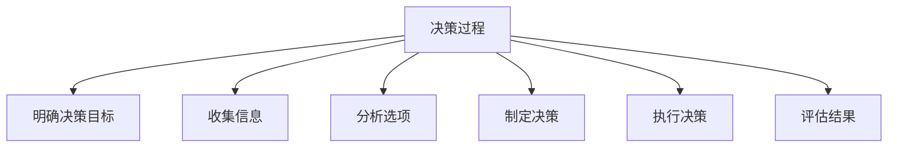

#### 3.2 数据分析在决策中的应用

数据分析在现代决策过程中起着至关重要的作用。通过大数据和人工智能技术，领导者可以更准确地分析市场趋势、用户行为和业务表现，从而做出更明智的决策。

**背景介绍**：

随着大数据和人工智能技术的快速发展，企业可以收集和分析大量的数据，这些数据成为决策的重要依据。有效的数据分析可以帮助领导者识别趋势、预测未来，从而制定更准确的决策。

**问题描述**：如何利用数据分析来提高决策的准确性和有效性？

**问题解决**：以下是利用数据分析提高决策的几个关键步骤：

1. **数据收集**：收集与决策相关的各种数据，包括市场数据、用户行为数据、财务数据等。
2. **数据清洗**：清洗和整理数据，确保数据的质量和准确性。
3. **数据分析**：使用数据分析工具和技术，对数据进行深入分析，提取有价值的信息。
4. **数据可视化**：通过数据可视化工具，将分析结果以图表、仪表板等形式呈现，帮助领导者更好地理解数据。
5. **决策支持**：基于数据分析结果，为领导者提供决策支持，帮助制定更明智的决策。

**边界与外延**：数据分析在决策中的应用不仅限于企业内部决策，还包括市场分析、竞争对手分析等外部决策。

**概念结构与核心要素组成**：

- **数据收集**：收集与决策相关的各种数据。
- **数据清洗**：清洗和整理数据，确保数据的质量和准确性。
- **数据分析**：使用数据分析工具和技术，对数据进行深入分析。
- **数据可视化**：通过数据可视化工具，呈现分析结果。
- **决策支持**：基于数据分析结果，为领导者提供决策支持。

**核心概念原理**：数据分析能够提供更准确、全面的信息，帮助领导者做出更明智的决策。

**概念属性特征对比表格**：

| 特征           | 说明                                                         |
|----------------|------------------------------------------------------------|
| 数据收集       | 收集与决策相关的各种数据。                                 |
| 数据清洗       | 清洗和整理数据，确保数据的质量和准确性。                   |
| 数据分析       | 使用数据分析工具和技术，对数据进行深入分析。               |
| 数据可视化     | 通过数据可视化工具，呈现分析结果。                         |
| 决策支持       | 基于数据分析结果，为领导者提供决策支持。                   |

**ER实体关系图架构**：

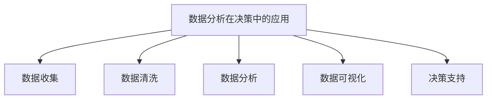

#### 3.3 制定战略规划

战略规划是领导者的重要职责之一，它为团队和组织的发展指明了方向。有效的战略规划可以帮助团队在竞争激烈的市场中立于不败之地。

**背景介绍**：

在技术行业，战略规划尤为重要。技术日新月异，市场环境不断变化，领导者需要具备前瞻性，制定明确的战略规划，以应对未来的挑战。

**问题描述**：如何制定有效的战略规划，确保团队和组织的发展方向正确？

**问题解决**：以下是制定有效战略规划的步骤：

1. **明确愿景和目标**：确定团队和组织的长期愿景和短期目标，确保战略规划的方向和内容明确。
2. **市场分析**：分析市场趋势、竞争对手和潜在机会，为战略规划提供市场依据。
3. **内部评估**：评估团队和组织的内部资源、优势和劣势，为战略规划提供内部依据。
4. **制定战略计划**：基于市场和内部评估结果，制定具体的战略计划，包括市场拓展、技术创新、人力资源等。
5. **执行战略计划**：将战略计划付诸实施，确保战略目标的实现。
6. **监控与调整**：定期监控战略计划的执行情况，根据实际情况进行调整。

**边界与外延**：战略规划不仅涉及企业内部决策，还包括行业合作、市场竞争等外部因素。

**概念结构与核心要素组成**：

- **明确愿景和目标**：确定团队和组织的长期愿景和短期目标。
- **市场分析**：分析市场趋势、竞争对手和潜在机会。
- **内部评估**：评估团队和组织的内部资源、优势和劣势。
- **制定战略计划**：基于市场和内部评估结果，制定具体的战略计划。
- **执行战略计划**：将战略计划付诸实施。
- **监控与调整**：定期监控战略计划的执行情况，根据实际情况进行调整。

**核心概念原理**：有效的战略规划能够为团队和组织的发展指明方向，确保在激烈的市场竞争中取得成功。

**概念属性特征对比表格**：

| 特征           | 说明                                                         |
|----------------|------------------------------------------------------------|
| 明确愿景和目标 | 确定团队和组织的长期愿景和短期目标。                       |
| 市场分析       | 分析市场趋势、竞争对手和潜在机会。                         |
| 内部评估       | 评估团队和组织的内部资源、优势和劣势。                     |
| 制定战略计划   | 基于市场和内部评估结果，制定具体的战略计划。               |
| 执行战略计划   | 将战略计划付诸实施。                                       |
| 监控与调整     | 定期监控战略计划的执行情况，根据实际情况进行调整。         |

**ER实体关系图架构**：

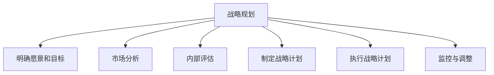

#### 3.4 战略执行与调整

战略执行是战略规划成功的关键环节。有效的战略执行能够确保战略计划得到有效落实，实现战略目标。同时，战略执行过程中需要不断监控和调整，以应对市场变化和内部挑战。

**背景介绍**：

在技术行业，市场变化迅速，领导者需要具备敏捷的战略执行能力，能够快速调整战略，以适应新的环境和需求。

**问题描述**：如何确保战略计划得到有效执行，并在执行过程中进行监控和调整？

**问题解决**：以下是确保战略执行与调整的有效策略：

1. **明确责任与分工**：将战略计划分解为具体任务，明确每个团队成员的责任和分工，确保任务得到有效执行。
2. **建立监控机制**：建立战略执行的监控机制，定期评估战略目标的实现情况，及时发现问题和挑战。
3. **灵活调整战略**：根据市场变化和执行情况，灵活调整战略计划，确保战略目标能够实现。
4. **建立反馈机制**：鼓励团队成员提供反馈，及时调整执行策略，优化战略执行过程。

**边界与外延**：战略执行与调整不仅涉及日常管理，还包括重大项目和战略项目的执行。

**概念结构与核心要素组成**：

- **明确责任与分工**：将战略计划分解为具体任务，明确每个团队成员的责任和分工。
- **建立监控机制**：建立战略执行的监控机制，定期评估战略目标的实现情况。
- **灵活调整战略**：根据市场变化和执行情况，灵活调整战略计划。
- **建立反馈机制**：鼓励团队成员提供反馈，优化战略执行过程。

**核心概念原理**：有效的战略执行与调整能够确保战略目标得到实现，提高团队和组织的市场竞争力。

**概念属性特征对比表格**：

| 特征           | 说明                                                         |
|----------------|------------------------------------------------------------|
| 明确责任与分工 | 将战略计划分解为具体任务，明确每个团队成员的责任和分工。   |
| 建立监控机制   | 建立战略执行的监控机制，定期评估战略目标的实现情况。       |
| 灵活调整战略   | 根据市场变化和执行情况，灵活调整战略计划。               |
| 建立反馈机制   | 鼓励团队成员提供反馈，优化战略执行过程。                 |

**ER实体关系图架构**：

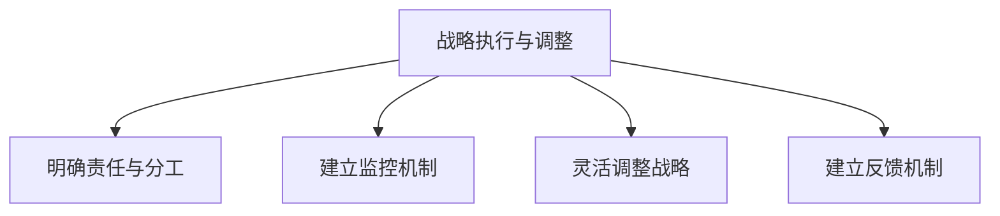

#### 3.5 风险管理与应对

在战略执行过程中，风险管理至关重要。有效的风险管理工作能够帮助团队识别、评估和应对潜在的风险，确保战略目标的实现。

**背景介绍**：

技术行业的快速变化和不确定性使得风险管理尤为重要。领导者需要具备敏锐的风险意识，及时识别潜在风险，并采取有效的应对措施。

**问题描述**：如何进行有效的风险管理和应对？

**问题解决**：以下是进行有效的风险管理和应对的步骤：

1. **风险识别**：识别可能影响战略目标实现的风险因素，包括市场风险、技术风险、财务风险等。
2. **风险评估**：对识别出的风险进行评估，确定其可能性和影响程度。
3. **风险应对**：制定应对策略，包括风险规避、减轻、转移和接受等。
4. **监控与调整**：定期监控风险的变化，根据实际情况进行调整，确保风险得到有效管理。

**边界与外延**：风险管理不仅涉及战略执行，还包括项目管理和日常运营。

**概念结构与核心要素组成**：

- **风险识别**：识别可能影响战略目标实现的风险因素。
- **风险评估**：对识别出的风险进行评估，确定其可能性和影响程度。
- **风险应对**：制定应对策略，包括风险规避、减轻、转移和接受等。
- **监控与调整**：定期监控风险的变化，根据实际情况进行调整。

**核心概念原理**：有效的风险管理能够降低风险对战略目标的潜在影响，确保团队和组织的安全和稳定。

**概念属性特征对比表格**：

| 特征           | 说明                                                         |
|----------------|------------------------------------------------------------|
| 风险识别       | 识别可能影响战略目标实现的风险因素。                       |
| 风险评估       | 对识别出的风险进行评估，确定其可能性和影响程度。           |
| 风险应对       | 制定应对策略，包括风险规避、减轻、转移和接受等。         |
| 监控与调整     | 定期监控风险的变化，根据实际情况进行调整。               |

**ER实体关系图架构**：

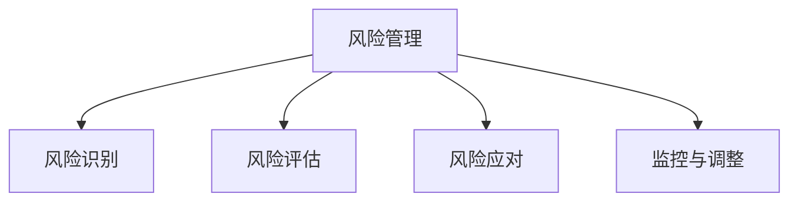

#### 3.6 本章小结

本章详细探讨了决策与战略规划的核心要素，包括决策过程、数据分析在决策中的应用、战略规划的制定与执行、战略执行与调整以及风险管理。这些要素在技术团队的领导中起着至关重要的作用，能够帮助领导者做出正确的决策，制定明确的发展方向，确保团队和组织在复杂环境中取得成功。通过系统的领导力训练和实践，领导者可以提升这些关键技能，推动团队和组织的发展。下一章将探讨领导风格与影响力，分析如何通过有效的领导风格和影响力提升领导效果。

---

**下文预告**：

在下一部分中，我们将深入探讨领导风格的类型及其影响，如何提升领导影响力，以及塑造个人品牌和自我提升的策略。这些内容将帮助领导者更好地发挥自己的领导力，提升团队的整体表现。

## 第四部分：领导风格与影响力

### 第4章：领导风格与影响力

#### 4.1 领导风格的类型

领导风格是领导者处理团队和任务的方式，不同类型的领导风格对团队的表现和员工的行为有着不同的影响。了解和运用不同类型的领导风格是提升领导效果的重要途径。

**背景介绍**：

在技术团队中，领导者需要根据不同的情境和团队成员的特点，灵活运用不同的领导风格。不同类型的领导风格适用于不同的情境，能够更好地激励和引导团队成员。

**问题描述**：如何识别和运用不同类型的领导风格，以提升团队绩效？

**问题解决**：以下是几种常见的领导风格及其适用性：

1. **专制型领导风格**：领导者做出所有决策，严格控制团队成员的行为。适用于需要迅速做出决策和高度纪律性的情境。
2. **民主型领导风格**：领导者鼓励团队成员参与决策过程，尊重团队成员的意见和反馈。适用于需要团队协作和创新思维的情境。
3. **支持型领导风格**：领导者关注团队成员的需求和感受，提供支持和鼓励。适用于团队成员面临压力和挑战的情境。
4. **教练型领导风格**：领导者指导团队成员，帮助他们提升技能和知识，实现个人和团队的成长。适用于需要技能提升和持续发展的情境。

**边界与外延**：领导风格的选择不仅取决于领导者的个性，还受到团队特点、项目需求和外部环境的影响。

**概念结构与核心要素组成**：

- **专制型领导风格**：领导者做出所有决策，严格控制团队成员的行为。
- **民主型领导风格**：领导者鼓励团队成员参与决策过程，尊重团队成员的意见和反馈。
- **支持型领导风格**：领导者关注团队成员的需求和感受，提供支持和鼓励。
- **教练型领导风格**：领导者指导团队成员，帮助他们提升技能和知识。

**核心概念原理**：不同的领导风格适用于不同的情境，能够更好地激励和引导团队成员。

**概念属性特征对比表格**：

| 领导风格类型   | 说明                                                         |
|----------------|------------------------------------------------------------|
| 专制型         | 领导者做出所有决策，严格控制团队成员的行为。               |
| 民主型         | 领导者鼓励团队成员参与决策过程，尊重团队成员的意见和反馈。 |
| 支持型         | 领导者关注团队成员的需求和感受，提供支持和鼓励。         |
| 教练型         | 领导者指导团队成员，帮助他们提升技能和知识。               |

**ER实体关系图架构**：

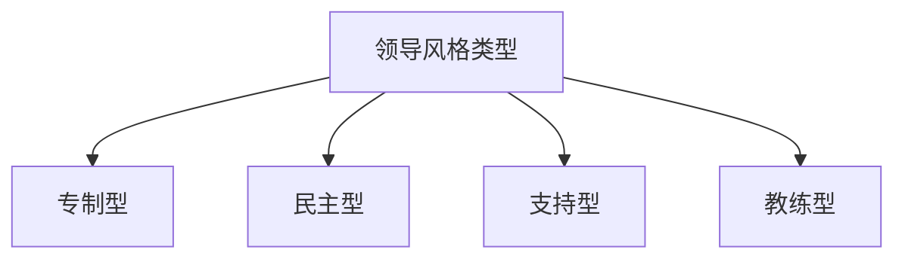

#### 4.2 影响力的来源

领导者的影响力是其在团队中发挥作用的基石。领导者的影响力来源于多个方面，包括个人魅力、专业知识、决策能力等。了解影响力的来源，可以帮助领导者更好地发挥自身优势，提升领导效果。

**背景介绍**：

在技术团队中，领导者的影响力不仅取决于其职位和权力，更取决于其个人魅力、专业知识和领导能力。领导者的影响力能够激励团队成员，推动团队目标的实现。

**问题描述**：领导者的影响力来源于哪些方面？

**问题解决**：以下是领导者影响力的主要来源：

1. **专业知识**：领导者具备丰富的技术知识和行业经验，能够在团队中提供有价值的指导和建议。
2. **个人魅力**：领导者具有积极的态度、良好的沟通能力和人际交往技巧，能够吸引和激励团队成员。
3. **决策能力**：领导者具备果断的决策能力，能够在复杂环境中做出正确的选择，为团队提供明确的方向。
4. **信任和尊重**：领导者通过透明、公正和负责任的行为，赢得团队成员的信任和尊重，提升自身的影响力。

**边界与外延**：领导者的影响力不仅取决于个人特质，还受到团队特点、项目需求和外部环境的影响。

**概念结构与核心要素组成**：

- **专业知识**：领导者具备丰富的技术知识和行业经验。
- **个人魅力**：领导者具有积极的态度、良好的沟通能力和人际交往技巧。
- **决策能力**：领导者具备果断的决策能力。
- **信任和尊重**：领导者通过透明、公正和负责任的行为，赢得团队成员的信任和尊重。

**核心概念原理**：领导者的影响力来源于其专业知识、个人魅力、决策能力和赢得的信任与尊重。

**概念属性特征对比表格**：

| 影响力来源       | 说明                                                         |
|------------------|------------------------------------------------------------|
| 专业知识         | 领导者具备丰富的技术知识和行业经验。                       |
| 个人魅力         | 领导者具有积极的态度、良好的沟通能力和人际交往技巧。       |
| 决策能力         | 领导者具备果断的决策能力。                                 |
| 信任和尊重       | 领导者通过透明、公正和负责任的行为，赢得团队成员的信任和尊重。 |

**ER实体关系图架构**：

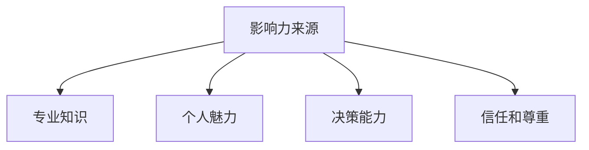

#### 4.3 如何提升影响力

提升领导影响力是每个领导者都需要关注的重要课题。通过以下策略，领导者可以提升自身的影响力，更好地发挥领导作用。

**背景介绍**：

在技术团队中，领导影响力不仅能够提高团队成员的信任和合作意愿，还能推动团队目标的实现。提升领导影响力是领导者自我提升的重要一环。

**问题描述**：如何提升领导影响力？

**问题解决**：以下是提升领导影响力的策略：

1. **专业提升**：不断学习和积累专业知识，提高自身的技术水平和行业认知。
2. **积极沟通**：与团队成员保持积极沟通，了解他们的需求和期望，提供有效的指导和支持。
3. **公正决策**：在决策过程中保持公正，确保团队成员感受到公平和尊重。
4. **积极反馈**：提供积极和建设性的反馈，帮助团队成员改进和成长。
5. **建立信任**：通过透明、负责任的行为，赢得团队成员的信任和尊重。

**边界与外延**：提升领导影响力不仅涉及个人技能的提升，还包括团队关系和团队文化的塑造。

**概念结构与核心要素组成**：

- **专业提升**：不断学习和积累专业知识。
- **积极沟通**：与团队成员保持积极沟通。
- **公正决策**：在决策过程中保持公正。
- **积极反馈**：提供积极和建设性的反馈。
- **建立信任**：通过透明、负责任的行为，赢得团队成员的信任和尊重。

**核心概念原理**：提升领导影响力需要从专业、沟通、决策、反馈和信任等多个方面入手，全面提升自身素质。

**概念属性特征对比表格**：

| 提升策略       | 说明                                                         |
|----------------|------------------------------------------------------------|
| 专业提升       | 不断学习和积累专业知识。                                   |
| 积极沟通       | 与团队成员保持积极沟通。                                   |
| 公正决策       | 在决策过程中保持公正。                                     |
| 积极反馈       | 提供积极和建设性的反馈。                                   |
| 建立信任       | 通过透明、负责任的行为，赢得团队成员的信任和尊重。         |

**ER实体关系图架构**：

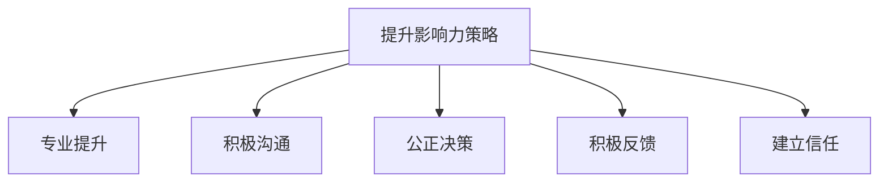

#### 4.4 塑造个人品牌

个人品牌是领导者在团队和组织中建立声誉和影响力的重要途径。通过塑造个人品牌，领导者可以提升自身在行业中的地位，吸引更多资源和机会。

**背景介绍**：

在技术行业，个人品牌的重要性日益凸显。领导者通过塑造个人品牌，可以增强自身的影响力，推动团队和组织的成功。

**问题描述**：如何塑造个人品牌？

**问题解决**：以下是塑造个人品牌的策略：

1. **专业分享**：通过技术博客、演讲、研讨会等方式，分享专业知识和经验，提升个人知名度。
2. **积极参与**：积极参与行业活动和社交网络，建立广泛的行业联系。
3. **持续学习**：不断学习和更新专业知识，保持技术领先地位。
4. **建立口碑**：通过优质的工作表现和卓越的领导能力，赢得同事和客户的认可和推荐。
5. **积极宣传**：利用社交媒体和职业网站，积极宣传个人成就和贡献。

**边界与外延**：塑造个人品牌不仅涉及个人专业能力的提升，还包括社交网络和行业影响力的扩大。

**概念结构与核心要素组成**：

- **专业分享**：通过技术博客、演讲、研讨会等方式，分享专业知识和经验。
- **积极参与**：积极参与行业活动和社交网络。
- **持续学习**：不断学习和更新专业知识。
- **建立口碑**：通过优质的工作表现和卓越的领导能力，赢得认可和推荐。
- **积极宣传**：利用社交媒体和职业网站，宣传个人成就和贡献。

**核心概念原理**：塑造个人品牌需要通过专业分享、积极参与、持续学习、建立口碑和积极宣传等多方面的努力。

**概念属性特征对比表格**：

| 塑造策略       | 说明                                                         |
|----------------|------------------------------------------------------------|
| 专业分享       | 通过技术博客、演讲、研讨会等方式，分享专业知识和经验。   |
| 积极参与       | 积极参与行业活动和社交网络。                               |
| 持续学习       | 不断学习和更新专业知识。                                   |
| 建立口碑       | 通过优质的工作表现和卓越的领导能力，赢得认可和推荐。     |
| 积极宣传       | 利用社交媒体和职业网站，宣传个人成就和贡献。           |

**ER实体关系图架构**：

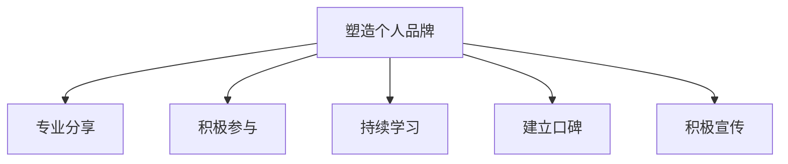

#### 4.5 领导者的自我提升

领导者的自我提升是提升领导力的重要途径。通过不断学习和实践，领导者可以提升自身的专业能力、领导素质和影响力。

**背景介绍**：

在快速变化的技术行业中，领导者的自我提升至关重要。只有不断学习和进步，领导者才能适应新的挑战，引领团队走向成功。

**问题描述**：如何进行领导者的自我提升？

**问题解决**：以下是领导者的自我提升策略：

1. **持续学习**：不断学习和更新专业知识，了解行业最新动态和技术趋势。
2. **实践反思**：通过实际工作，不断实践和总结经验，提升自身的实践能力和问题解决能力。
3. **获取反馈**：积极寻求团队成员和同事的反馈，了解自身的优势和不足，不断改进。
4. **培养软技能**：提升沟通、团队合作、决策等软技能，增强自身的领导能力。
5. **寻求指导**：寻找导师或教练，获取有价值的指导和建议，加速自我提升。

**边界与外延**：领导者的自我提升不仅涉及专业技能的提升，还包括领导素质和个人魅力的培养。

**概念结构与核心要素组成**：

- **持续学习**：不断学习和更新专业知识。
- **实践反思**：通过实际工作，不断实践和总结经验。
- **获取反馈**：积极寻求团队成员和同事的反馈。
- **培养软技能**：提升沟通、团队合作、决策等软技能。
- **寻求指导**：寻找导师或教练，获取有价值的指导和建议。

**核心概念原理**：领导者的自我提升需要通过持续学习、实践反思、获取反馈、培养软技能和寻求指导等多方面的努力。

**概念属性特征对比表格**：

| 自我提升策略   | 说明                                                         |
|----------------|------------------------------------------------------------|
| 持续学习       | 不断学习和更新专业知识。                                   |
| 实践反思       | 通过实际工作，不断实践和总结经验。                         |
| 获取反馈       | 积极寻求团队成员和同事的反馈。                             |
| 培养软技能     | 提升沟通、团队合作、决策等软技能。                         |
| 寻求指导       | 寻找导师或教练，获取有价值的指导和建议。                   |

**ER实体关系图架构**：

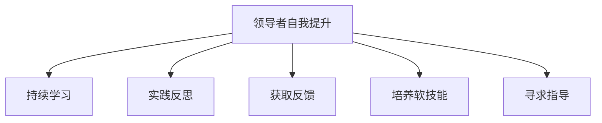

#### 4.6 本章小结

本章深入探讨了领导风格与影响力的关键要素，包括领导风格的类型、影响力的来源、如何提升影响力、塑造个人品牌和领导者的自我提升策略。通过了解和运用不同的领导风格，领导者可以更好地激励和引导团队成员，提升团队绩效。同时，通过塑造个人品牌和持续自我提升，领导者可以增强自身在团队和组织中的影响力。下一章将探讨领导力培训与实践，分析如何通过系统的培训和实际操作提升领导能力。

---

**下文预告**：

在下一部分中，我们将探讨领导力培训与实践的重要性，介绍有效的领导力培训方法，并通过案例分析展示如何通过实践提升领导力。我们将分享实战经验，帮助领导者更好地理解和应用领导力策略。

## 第五部分：领导力培训与实践

### 第5章：领导力培训与实践

#### 5.1 领导力培训的必要性

在快速变化的技术环境中，领导力成为组织成功的关键因素。有效的领导力培训能够帮助领导者提升管理能力，应对挑战，推动团队和组织的发展。以下是领导力培训的必要性：

**背景介绍**：

随着技术的不断进步和市场竞争的加剧，组织面临的变化和挑战越来越多。领导者需要具备更强的适应能力、创新能力和决策能力，以引领团队在激烈的市场环境中脱颖而出。然而，很多领导者在实际工作中面临诸多挑战，如团队管理、战略规划、沟通协调等。因此，领导力培训显得尤为重要。

**问题描述**：为什么领导力培训对领导者来说至关重要？

**问题解决**：以下是领导力培训的必要性：

1. **提升管理能力**：领导力培训能够帮助领导者提升管理能力，包括团队管理、战略规划和决策能力等。
2. **应对变化**：领导力培训帮助领导者掌握适应变化的方法，提高在快速变化环境中的应变能力。
3. **提升创新能力**：通过领导力培训，领导者可以学会如何激发团队的创新能力，推动组织的发展。
4. **增强团队凝聚力**：领导力培训帮助领导者提升团队协作和沟通能力，增强团队凝聚力。
5. **个人成长**：领导力培训为领导者提供自我提升的机会，帮助他们实现个人成长和职业发展。

**边界与外延**：领导力培训不仅涉及技术领域的领导者，还包括企业高层、项目经理和其他需要提升领导力的团队成员。

**概念结构与核心要素组成**：

- **提升管理能力**：领导力培训帮助领导者提升管理能力。
- **应对变化**：领导力培训帮助领导者掌握适应变化的方法。
- **提升创新能力**：领导力培训帮助领导者提升创新能力。
- **增强团队凝聚力**：领导力培训帮助领导者提升团队协作和沟通能力。
- **个人成长**：领导力培训为领导者提供自我提升的机会。

**核心概念原理**：领导力培训能够提升领导者的管理能力、应对变化、创新能力、团队凝聚力和个人成长。

**概念属性特征对比表格**：

| 特征           | 说明                                                         |
|----------------|------------------------------------------------------------|
| 提升管理能力   | 领导力培训帮助领导者提升管理能力。                       |
| 应对变化       | 领导力培训帮助领导者掌握适应变化的方法。                 |
| 提升创新能力   | 领导力培训帮助领导者提升创新能力。                       |
| 增强团队凝聚力 | 领导力培训帮助领导者提升团队协作和沟通能力。           |
| 个人成长       | 领导力培训为领导者提供自我提升的机会。                   |

**ER实体关系图架构**：

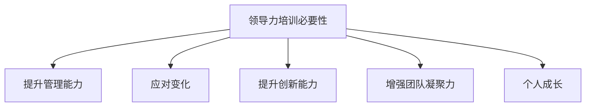

#### 5.2 领导力培训的方法

领导力培训是提升领导者能力的重要手段。有效的领导力培训方法能够帮助领导者系统地学习和实践领导技能，提高领导力。以下是几种常见的领导力培训方法：

**背景介绍**：

领导力培训的方法多种多样，包括内训、外部培训、在线学习、实战演练等。不同的培训方法适用于不同的领导者和组织需求，领导者可以根据实际情况选择合适的培训方法。

**问题描述**：如何选择和实施有效的领导力培训方法？

**问题解决**：以下是几种常见的领导力培训方法及其适用性：

1. **内训**：组织内部的专业培训，针对领导者的实际需求，提供定制化的培训课程。适用于需要系统性培训和针对性提升的领导者。
2. **外部培训**：通过外部培训机构或专家提供的培训课程，获取先进的管理理念和技能。适用于需要提升领导力和管理能力的领导者。
3. **在线学习**：利用互联网资源和在线学习平台，提供灵活的学习方式，适用于时间和地点受限的领导者。
4. **实战演练**：通过模拟实际工作场景，让领导者在实际操作中学习和实践领导技能。适用于需要提升实战能力的领导者。
5. **导师制**：为领导者配备经验丰富的导师，通过一对一的指导和反馈，帮助领导者提升领导力。适用于需要个性化指导和支持的领导者。

**边界与外延**：领导力培训方法的选择取决于领导者的需求、组织的实际情况和培训资源。

**概念结构与核心要素组成**：

- **内训**：组织内部的专业培训。
- **外部培训**：通过外部培训机构或专家提供的培训课程。
- **在线学习**：利用互联网资源和在线学习平台。
- **实战演练**：通过模拟实际工作场景。
- **导师制**：为领导者配备经验丰富的导师。

**核心概念原理**：领导力培训方法能够根据领导者的需求和实际情况，提供有效的学习和实践途径，提升领导力。

**概念属性特征对比表格**：

| 培训方法       | 说明                                                         |
|----------------|------------------------------------------------------------|
| 内训           | 组织内部的专业培训，提供定制化的培训课程。                   |
| 外部培训       | 通过外部培训机构或专家提供的培训课程，获取先进的管理理念。   |
| 在线学习       | 利用互联网资源和在线学习平台，提供灵活的学习方式。         |
| 实战演练       | 通过模拟实际工作场景，提升实战能力。                       |
| 导师制         | 为领导者配备经验丰富的导师，提供个性化指导和支持。         |

**ER实体关系图架构**：

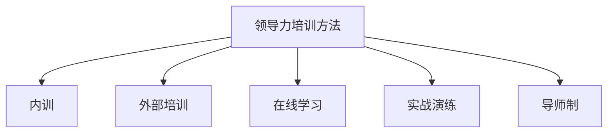

#### 5.3 实战演练

实战演练是领导力培训的重要组成部分。通过实际操作和模拟情境，领导者可以学习如何在真实环境中应用领导技能，提升实战能力。

**背景介绍**：

在技术团队中，领导者需要具备应对各种复杂情境的能力。实战演练能够为领导者提供模拟的真实工作场景，让他们在模拟环境中学习和实践领导技能，提高应对实际问题的能力。

**问题描述**：如何设计和实施有效的实战演练？

**问题解决**：以下是设计和实施有效的实战演练的步骤：

1. **确定演练目标**：明确演练的具体目标和预期成果，确保演练的方向和内容集中。
2. **设计演练情境**：根据领导者的实际需求，设计真实的演练情境，模拟可能遇到的挑战和问题。
3. **准备演练资源**：准备必要的演练资源，包括培训材料、模拟工具和演练场地等。
4. **进行演练**：组织领导者参与演练，提供指导和反馈，确保他们能够在演练中实践所学技能。
5. **总结和反思**：对演练过程进行总结和反思，分析成功和不足之处，为下一次演练提供参考。

**边界与外延**：实战演练不仅适用于领导力培训，还可以用于项目管理和团队建设等领域的培训。

**概念结构与核心要素组成**：

- **确定演练目标**：明确演练的具体目标和预期成果。
- **设计演练情境**：设计真实的演练情境，模拟可能遇到的挑战和问题。
- **准备演练资源**：准备必要的演练资源，确保演练的顺利进行。
- **进行演练**：组织领导者参与演练，提供指导和反馈。
- **总结和反思**：对演练过程进行总结和反思。

**核心概念原理**：实战演练能够帮助领导者在实际操作中学习和实践领导技能，提升应对实际问题的能力。

**概念属性特征对比表格**：

| 演练步骤       | 说明                                                         |
|----------------|------------------------------------------------------------|
| 确定演练目标   | 明确演练的具体目标和预期成果。                           |
| 设计演练情境   | 设计真实的演练情境，模拟可能遇到的挑战和问题。         |
| 准备演练资源   | 准备必要的演练资源，确保演练的顺利进行。               |
| 进行演练       | 组织领导者参与演练，提供指导和反馈。                   |
| 总结和反思     | 对演练过程进行总结和反思，分析成功和不足之处。         |

**ER实体关系图架构**：

```mermaid
graph TD
    A[实战演练] --> B[确定演练目标]
    A --> C[设计演练情境]
    A --> D[准备演练资源]
    A --> E[进行演练]
    A --> F[总结和反思]
```

#### 5.4 案例分析

通过案例分析，我们可以更深入地了解领导力培训与实践的效果。以下是几个实际案例，展示领导力培训如何帮助领导者提升管理能力，推动团队和组织的发展。

**案例1：技术公司领导力提升项目**

一家技术公司意识到领导力提升对组织发展的重要性，决定实施领导力提升项目。该项目包括内训、外部培训和实战演练等多个环节。通过系统的培训和实践，领导者的管理能力得到了显著提升。具体表现为：

1. **管理能力提升**：领导者通过内训和外部培训，学习了先进的管理理念和方法，提高了团队管理能力。
2. **创新能力增强**：领导者通过实战演练，学会了如何激发团队的创新能力，推动了公司产品的创新和市场的拓展。
3. **团队凝聚力增强**：领导者通过团队建设活动和实战演练，增强了团队凝聚力，提高了团队的协作效率。

**案例2：创业公司领导力发展计划**

一家创业公司面临着快速发展的挑战，决定实施领导力发展计划。该计划包括在线学习、导师制和实战演练等多个环节。通过系统的领导力培训，公司领导者的能力得到了显著提升。具体表现为：

1. **应变能力提高**：领导者通过在线学习和实战演练，掌握了适应快速变化的方法，提高了在复杂环境中的应变能力。
2. **决策能力提升**：领导者通过导师制和实战演练，学会了如何做出明智的决策，提高了公司的决策效率。
3. **团队凝聚力增强**：领导者通过实战演练和团队建设活动，增强了团队的凝聚力，提高了团队的整体绩效。

**案例分析小结**：

通过以上案例分析，我们可以看到领导力培训与实践对团队和组织发展的积极影响。领导力培训不仅提升了领导者的管理能力和创新能力，还增强了团队的凝聚力和协作效率，为组织的发展提供了有力的支持。

**下文预告**：

在下一章中，我们将探讨领导力在不同行业中的应用，分析互联网行业、制造业和服务业的领导力实践。我们将深入了解不同行业中的领导力策略，帮助领导者更好地适应不同行业的需求，提升领导力。

## 第六部分：领导力在不同行业中的应用

### 第6章：领导力在不同行业中的应用

#### 6.1 互联网行业的领导力实践

互联网行业是一个快速变化、高度创新的领域，领导者在这个行业中面临着独特的挑战和机遇。有效的领导力实践在互联网行业中发挥着至关重要的作用。

**背景介绍**：

互联网行业的特点包括快速的技术变革、激烈的竞争、灵活的工作方式等。领导者需要具备快速适应变化、引领创新和激发团队潜力的能力。以下是互联网行业领导力实践的几个关键方面：

1. **敏捷领导**：互联网行业的特点要求领导者具备敏捷的领导风格，能够快速响应市场需求和技术变化。
2. **创新驱动**：领导者需要激励团队不断探索创新，推动产品的持续迭代和优化。
3. **跨界协作**：互联网行业的跨界合作频繁，领导者需要具备跨领域的领导能力，整合不同领域的资源和团队。
4. **文化建设**：建立积极向上的组织文化，鼓励创新、学习和合作，是互联网行业领导力的关键。

**案例**：

某知名互联网公司通过实施敏捷领导力和创新驱动策略，成功推出了多个市场领先的旗舰产品。公司领导者鼓励团队成员提出创新想法，并提供资源和支持，确保团队的创新能力得到充分发挥。此外，公司还注重文化建设，鼓励员工分享知识和经验，形成了良好的学习氛围。

**总结**：

在互联网行业中，领导者需要具备敏捷的领导风格、创新驱动力和跨界协作能力，同时注重组织文化建设。通过这些实践，领导者能够引领团队在快速变化的市场环境中取得成功。

#### 6.2 制造业的领导力策略

制造业是一个传统而庞大的行业，其领导力策略与互联网行业有所不同。制造业的领导者需要关注生产效率、质量控制和管理创新。

**背景介绍**：

制造业的特点包括高度标准化、大规模生产和严格的成本控制。领导者需要确保生产线的顺畅运行，同时提高产品质量和降低成本。以下是制造业领导力的几个关键策略：

1. **精益管理**：通过实施精益生产和管理方法，提高生产效率和产品质量。
2. **质量管理**：建立严格的质量管理体系，确保产品满足客户需求。
3. **创新管理**：鼓励员工提出改进建议，推动管理创新和生产技术的升级。
4. **供应链管理**：优化供应链管理，确保原材料和零部件的及时供应。

**案例**：

一家大型制造业公司通过实施精益管理策略，显著提高了生产效率和产品质量。公司领导者鼓励员工提出改进建议，并通过激励措施鼓励员工参与创新活动。此外，公司还建立了完善的质量管理体系，确保产品符合国际标准。

**总结**：

在制造业中，领导者需要关注精益管理、质量管理、创新管理和供应链管理。通过这些策略，领导者能够提高生产效率和产品质量，推动企业的持续发展。

#### 6.3 服务业的领导力应用

服务业是一个多样化的行业，包括餐饮、旅游、金融等多个领域。领导者在服务业中需要关注客户体验、员工满意度和运营效率。

**背景介绍**：

服务业的特点包括客户服务的个性化、员工满意度的关键性和运营效率的提升。领导者需要具备出色的客户服务意识、员工管理能力和运营优化能力。以下是服务业领导力的几个关键应用：

1. **客户导向**：领导者需要将客户需求放在首位，提供优质的客户服务。
2. **员工激励**：领导者需要关注员工满意度，通过激励措施提高员工的工作积极性。
3. **运营优化**：领导者需要优化服务流程和资源配置，提高运营效率。
4. **品牌建设**：领导者需要塑造良好的品牌形象，提升企业的市场竞争力。

**案例**：

一家知名餐饮连锁公司通过实施客户导向策略，成功提升了客户满意度和品牌知名度。公司领导者重视客户体验，不断改进服务流程，并引入新技术提高运营效率。此外，公司还注重员工激励，通过培训和奖励措施提高员工的工作满意度。

**总结**：

在服务业中，领导者需要关注客户导向、员工激励、运营优化和品牌建设。通过这些应用，领导者能够提升客户满意度、员工满意度和运营效率，推动企业的持续发展。

#### 6.4 非营利组织的领导力挑战

非营利组织（NPO）在提供社会服务和推动社会进步中发挥着重要作用。领导者在非营利组织中面临着独特的挑战和机遇。

**背景介绍**：

非营利组织的特点包括资源有限、目标多样性和依赖社会支持。领导者需要具备出色的领导能力，以应对资源紧张、社会期望高和目标多元化的挑战。以下是非营利组织领导力的几个关键挑战：

1. **资源管理**：领导者需要有效管理有限的资源，确保组织运作的可持续性。
2. **目标实现**：领导者需要明确组织的使命和目标，并通过有效的策略和执行实现这些目标。
3. **社会参与**：领导者需要积极与社会各界互动，获取支持和资源。
4. **可持续性**：领导者需要关注组织的长期发展，确保其社会使命的持续实现。

**案例**：

一家非营利组织通过实施资源管理和社会参与策略，成功推动了多个社会公益项目。公司领导者通过优化资源分配、拓展社会合作渠道，并引入可持续发展的理念，确保组织的长期运营和目标实现。

**总结**：

在非营利组织中，领导者需要关注资源管理、目标实现、社会参与和可持续性。通过这些挑战的应对，领导者能够推动非营利组织在社会服务中的持续发展。

#### 6.5 本章小结

本章深入探讨了领导力在互联网行业、制造业、服务业和非营利组织中的应用。每个行业都有其独特的特点和需求，领导者需要根据实际情况灵活应用领导力策略，以应对不同的挑战和机遇。通过互联网行业的敏捷领导和创新驱动，制造业的精益管理和质量管理，服务业的客户导向和运营优化，以及非营利组织的资源管理和社会参与，领导者能够推动各自行业的持续发展。

## 第七部分：未来领导力的发展方向

### 第7章：未来领导力的发展方向

#### 7.1 新技术对领导力的影响

随着新技术的不断进步，领导力也在不断演变。新技术对领导力产生了深远的影响，为领导者带来了新的挑战和机遇。

**背景介绍**：

人工智能、大数据、云计算等新兴技术的快速发展，正在改变企业运营模式和市场格局。这些技术不仅提高了工作效率，还改变了领导者的工作方式和领导方式。

**问题描述**：新技术如何影响领导力，领导者应该如何适应这些变化？

**问题解决**：以下是新技术对领导力的影响和领导者适应策略：

1. **数据驱动决策**：领导者需要具备数据分析能力，利用大数据做出更明智的决策。
2. **数字化转型**：领导者需要推动企业的数字化转型，提高企业的竞争力。
3. **技术领导力**：领导者需要具备技术背景，了解行业前沿技术，为团队提供技术指导。
4. **远程领导**：随着远程工作模式的普及，领导者需要掌握远程领导技巧，确保远程团队的高效协作。

**边界与外延**：新技术的影响不仅限于企业内部，还包括供应链管理、客户关系和市场竞争等方面。

**概念结构与核心要素组成**：

- **数据驱动决策**：领导者需要具备数据分析能力。
- **数字化转型**：领导者需要推动企业的数字化转型。
- **技术领导力**：领导者需要具备技术背景。
- **远程领导**：领导者需要掌握远程领导技巧。

**核心概念原理**：新技术推动了领导力的变革，领导者需要适应这些变化，提升自身的领导能力。

**概念属性特征对比表格**：

| 新技术影响       | 说明                                                         |
|------------------|------------------------------------------------------------|
| 数据驱动决策     | 领导者需要具备数据分析能力，利用大数据做出明智的决策。   |
| 数字化转型       | 领导者需要推动企业的数字化转型，提高企业竞争力。       |
| 技术领导力       | 领导者需要具备技术背景，了解行业前沿技术。             |
| 远程领导         | 领导者需要掌握远程领导技巧，确保远程团队的高效协作。   |

**ER实体关系图架构**：

```mermaid
graph TD
    A[新技术影响] --> B[数据驱动决策]
    A --> C[数字化转型]
    A --> D[技术领导力]
    A --> E[远程领导]
```

#### 7.2 全球化背景下的领导力变革

全球化带来了市场和人才的高度融合，也对领导力提出了新的要求。全球化背景下的领导力变革涉及到跨文化沟通、全球化思维和领导力的多元化。

**背景介绍**：

全球化使得企业可以在全球范围内寻找市场和资源，但也带来了跨文化沟通和管理的挑战。领导者需要具备全球化思维，能够理解和尊重不同文化背景的员工，有效管理多元化的团队。

**问题描述**：全球化背景下的领导力面临哪些变革？

**问题解决**：以下是全球化背景下领导力变革的关键点：

1. **跨文化沟通**：领导者需要掌握跨文化沟通技巧，确保团队中的文化差异不会影响工作协作。
2. **全球化思维**：领导者需要具备全球化视野，能够理解全球市场的变化和机遇。
3. **多元化领导**：领导者需要接受和尊重团队成员的多元化背景，推动团队的多元化发展。
4. **国际化战略**：领导者需要制定国际化战略，推动企业在全球范围内的扩张和发展。

**边界与外延**：全球化背景下的领导力变革不仅涉及企业文化和管理，还包括市场战略和全球化运营。

**概念结构与核心要素组成**：

- **跨文化沟通**：领导者需要掌握跨文化沟通技巧。
- **全球化思维**：领导者需要具备全球化视野。
- **多元化领导**：领导者需要接受和尊重团队成员的多元化背景。
- **国际化战略**：领导者需要制定国际化战略。

**核心概念原理**：全球化背景下的领导力变革要求领导者具备跨文化沟通、全球化思维、多元化领导和国际化战略的能力。

**概念属性特征对比表格**：

| 领导力变革       | 说明                                                         |
|------------------|------------------------------------------------------------|
| 跨文化沟通       | 领导者需要掌握跨文化沟通技巧，确保团队协作。               |
| 全球化思维       | 领导者需要具备全球化视野，理解全球市场的变化和机遇。     |
| 多元化领导       | 领导者需要接受和尊重团队成员的多元化背景。               |
| 国际化战略       | 领导者需要制定国际化战略，推动企业在全球范围内的扩张。   |

**ER实体关系图架构**：

```mermaid
graph TD
    A[全球化背景下的领导力变革] --> B[跨文化沟通]
    A --> C[全球化思维]
    A --> D[多元化领导]
    A --> E[国际化战略]
```

#### 7.3 持续学习的重要性

在快速变化的技术环境中，持续学习成为领导力发展的重要驱动力。领导者需要不断更新知识和技能，以适应新技术、新市场和新的领导挑战。

**背景介绍**：

技术领域的快速变化要求领导者具备持续学习的意识和能力。持续学习不仅有助于领导者提升自身的能力，还能带动团队成员共同进步，推动组织的创新和发展。

**问题描述**：为什么持续学习对领导者来说至关重要？

**问题解决**：以下是持续学习的重要性：

1. **知识更新**：持续学习帮助领导者掌握最新的知识和技能，保持行业领先地位。
2. **适应变化**：持续学习使领导者能够快速适应市场的变化和技术的发展，提高应对挑战的能力。
3. **团队发展**：领导者通过持续学习，可以带动团队成员共同进步，提升团队的整体能力。
4. **领导力提升**：持续学习有助于领导者提升自身的领导力和管理能力，推动组织的发展。

**边界与外延**：持续学习不仅涉及技术领域的知识更新，还包括领导力、管理和战略规划等方面的学习。

**概念结构与核心要素组成**：

- **知识更新**：持续学习帮助领导者掌握最新的知识和技能。
- **适应变化**：持续学习使领导者能够快速适应市场的变化和技术的发展。
- **团队发展**：领导者通过持续学习，可以带动团队成员共同进步。
- **领导力提升**：持续学习有助于领导者提升自身的领导力和管理能力。

**核心概念原理**：持续学习是领导者适应变化、提升能力和推动组织发展的重要途径。

**概念属性特征对比表格**：

| 持续学习的重要性   | 说明                                                         |
|------------------|------------------------------------------------------------|
| 知识更新         | 持续学习帮助领导者掌握最新的知识和技能。                   |
| 适应变化         | 持续学习使领导者能够快速适应市场的变化和技术的发展。     |
| 团队发展         | 领导者通过持续学习，可以带动团队成员共同进步。           |
| 领导力提升       | 持续学习有助于领导者提升自身的领导力和管理能力。       |

**ER实体关系图架构**：

```mermaid
graph TD
    A[持续学习的重要性] --> B[知识更新]
    A --> C[适应变化]
    A --> D[团队发展]
    A --> E[领导力提升]
```

#### 7.4 未来领导者的素养

未来领导者的素养将决定他们在快速变化的环境中的适应能力和领导效果。以下是对未来领导者素养的几个关键要求：

**背景介绍**：

未来领导者将面对更加复杂和不确定的环境，需要具备广泛的技能和素养。这些素养不仅包括技术能力和领导能力，还包括跨文化沟通、创新思维和持续学习能力。

**问题描述**：未来领导者需要具备哪些素养？

**问题解决**：以下是未来领导者应具备的素养：

1. **技术领导力**：领导者需要具备技术背景，了解行业前沿技术，为团队提供技术指导。
2. **全球化思维**：领导者需要具备全球化视野，能够理解和尊重不同文化背景的员工。
3. **创新思维**：领导者需要具备创新思维，能够推动团队的持续创新。
4. **跨文化沟通**：领导者需要掌握跨文化沟通技巧，确保团队中的文化差异不会影响工作协作。
5. **持续学习能力**：领导者需要具备持续学习能力，不断更新知识和技能。

**边界与外延**：未来领导者的素养不仅涉及技术和管理能力，还包括跨文化沟通、创新思维和持续学习等方面。

**概念结构与核心要素组成**：

- **技术领导力**：领导者需要具备技术背景，了解行业前沿技术。
- **全球化思维**：领导者需要具备全球化视野。
- **创新思维**：领导者需要具备创新思维。
- **跨文化沟通**：领导者需要掌握跨文化沟通技巧。
- **持续学习能力**：领导者需要具备持续学习能力。

**核心概念原理**：未来领导者需要具备技术领导力、全球化思维、创新思维、跨文化沟通和持续学习能力，以应对快速变化的环境和挑战。

**概念属性特征对比表格**：

| 素养要求       | 说明                                                         |
|----------------|------------------------------------------------------------|
| 技术领导力     | 领导者需要具备技术背景，了解行业前沿技术。                   |
| 全球化思维     | 领导者需要具备全球化视野。                                   |
| 创新思维       | 领导者需要具备创新思维。                                     |
| 跨文化沟通     | 领导者需要掌握跨文化沟通技巧。                               |
| 持续学习能力   | 领导者需要具备持续学习能力。                                 |

**ER实体关系图架构**：

```mermaid
graph TD
    A[未来领导者素养] --> B[技术领导力]
    A --> C[全球化思维]
    A --> D[创新思维]
    A --> E[跨文化沟通]
    A --> F[持续学习能力]
```

#### 7.5 本章小结

本章探讨了未来领导力的发展方向，分析了新技术对领导力的影响、全球化背景下的领导力变革、持续学习的重要性以及未来领导者的素养。未来领导者需要适应快速变化的环境，具备技术领导力、全球化思维、创新思维、跨文化沟通和持续学习能力。通过这些素养的提升，领导者能够更好地引领团队和组织在复杂环境中取得成功。未来领导力的发展将是一场持续的学习和实践之旅，领导者需要不断适应和创新，以应对未来的挑战。

## 附录：领导力工具与方法

### 附录1：领导力评估工具

领导力评估工具是衡量领导者能力的重要手段。以下是一些常用的领导力评估工具：

**360度反馈**：通过团队成员、上级、下属和同级的评价，全面了解领导者的能力和表现。

**领导力测评问卷**：设计一系列关于领导能力、管理风格、沟通技巧等方面的问卷，收集领导者的表现数据。

**领导力发展中心**：通过角色扮演、模拟情境等方式，评估领导者的实际能力和应对挑战的能力。

**领导力档案**：建立领导者的个人档案，记录其在领导岗位上的表现、取得的成就和需要改进的方面。

这些评估工具可以帮助领导者识别自身的优势和不足，为个人发展提供有针对性的建议。

### 附录2：团队建设活动

团队建设活动是增强团队凝聚力和协作能力的重要方式。以下是一些常见的团队建设活动：

**团队拓展训练**：通过户外拓展活动，如攀岩、绳索课程等，增强团队成员的信任和协作能力。

**团队建设工作坊**：组织团队成员进行互动式讨论，共同解决实际问题，提高团队协作能力。

**团队文化日**：通过一系列文化活动，如团队聚餐、晚会等，增强团队成员的归属感和团队文化。

**团队培训**：定期组织专业培训，提升团队成员的专业能力和团队协作技巧。

这些活动可以帮助团队成员建立紧密的联系，提高团队的协作效率。

### 附录3：决策模型与方法

在领导过程中，有效的决策模型和方法对于确保决策的科学性和合理性至关重要。以下是一些常见的决策模型和方法：

**SWOT分析**：通过分析优势、劣势、机会和威胁，制定有针对性的决策。

**成本效益分析**：比较不同决策的成本和效益，选择最优的方案。

**决策树**：通过构建决策树，分析不同决策路径的可能结果和概率，选择最佳方案。

**多因素决策矩阵**：考虑多个决策因素，通过评分和权重计算，选择最优方案。

这些决策模型和方法可以帮助领导者做出更加科学和合理的决策。

### 附录4：领导力培训资源

领导力培训资源是提升领导者能力的重要工具。以下是一些有用的领导力培训资源：

**领导力书籍**：阅读经典的领导力书籍，如《领导力五要素》、《高效能人士的七个习惯》等，获取宝贵的经验。

**领导力在线课程**：参加线上领导力课程，如Coursera、Udemy等平台提供的专业课程。

**领导力工作坊**：参加领导力工作坊，通过实践和互动，提升领导技能。

**领导力社区**：加入领导力社区，如LinkedIn、Twitter等，与其他领导者交流经验和观点。

这些资源可以帮助领导者不断学习和提升自身的领导力。

### 附录5：参考文献与推荐阅读

以下是一些关于领导力的经典书籍和文献，供读者进一步学习和参考：

1. **《领导力五要素》**：斯蒂芬·罗宾斯
2. **《高效能人士的七个习惯》**：史蒂芬·柯维
3. **《团队协作力》**：兰迪·卢森贝格
4. **《影响力》**：罗伯特·西奥迪尼
5. **《精益创业》**：埃里克·莱斯

这些书籍提供了丰富的理论和实践指导，对于提升领导力具有很高的参考价值。

## 作者信息

作者：AI天才研究院/AI Genius Institute & 禅与计算机程序设计艺术 /Zen And The Art of Computer Programming

本文由AI天才研究院（AI Genius Institute）撰写，结合禅与计算机程序设计艺术的理念，深入探讨了领导力在技术领域的重要性、核心要素和应用。文章旨在为技术领导者提供实用的策略和案例，帮助他们提升领导力，推动团队和组织的发展。同时，本文也参考了《禅与计算机程序设计艺术》的思想，强调领导者需要具备深刻的技术理解和持续学习的精神。作者希望通过本文，激发读者对领导力的思考和实践，共同推动技术的进步和社会的发展。

