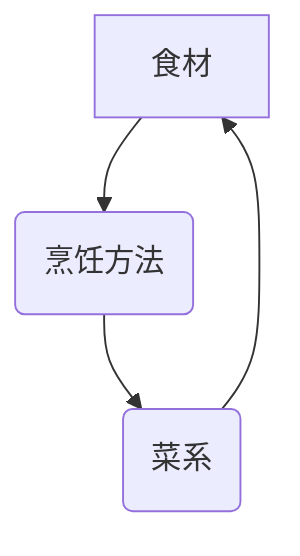
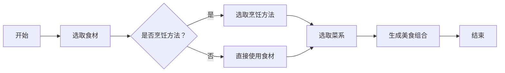
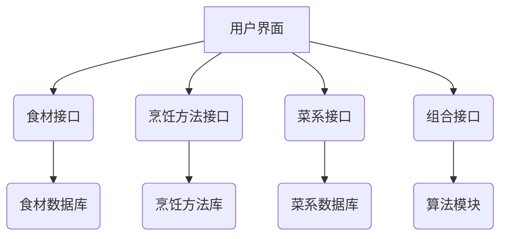
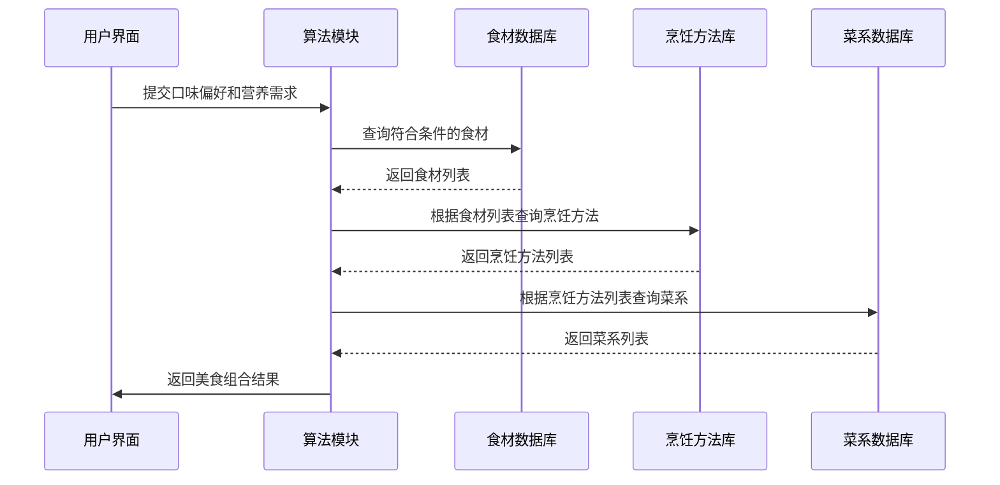

                 

# 饮食文化的味觉空间：美食组合的数学映射

> 关键词：饮食文化、味觉空间、美食组合、数学映射、算法原理、系统架构、项目实战

> 摘要：本文从饮食文化的角度出发，探讨了味觉空间的概念及其在美食组合中的应用。通过分析味觉属性和食物组合的数学映射原理，提出了一种基于数学模型和算法的美食组合方法。同时，本文还介绍了系统架构设计和项目实战的具体实现过程，为美食爱好者提供了一种科学合理的美食搭配建议。

### 目录大纲

1. 第一部分：问题背景与核心概念
    1.1 问题背景
    1.2 味觉与饮食文化
    1.3 食物组合的数学映射
2. 第二部分：核心概念与联系
    1.4 饮食文化的核心概念
    1.5 味觉属性特征对比
    1.6 食物组合的ER实体关系图
3. 第三部分：美食组合的数学映射
    1.7 数学模型与公式
    1.8 Mermaid流程图绘制
    1.9 算法原理详细讲解
    1.10 举例说明
4. 第四部分：系统分析与架构设计
    1.11 问题场景介绍
    1.12 系统功能设计
    1.13 系统架构设计
    1.14 系统接口设计
    1.15 系统交互
5. 第五部分：项目实战
    1.16 环境安装
    1.17 系统核心实现源代码
    1.18 代码应用解读与分析
    1.19 实际案例分析与讲解
    1.20 项目小结
6. 第六部分：最佳实践与拓展
    1.21 最佳实践 tips
    1.22 注意事项
    1.23 拓展阅读

----------------------------------------------------------------

## 第一部分：问题背景与核心概念

### 1.1 问题背景

饮食文化是人类社会的重要组成部分，它不仅反映了不同地区的地理环境、气候条件和生产方式，还体现了人们的价值观、审美观念和生活方式。在我国，饮食文化有着悠久的历史和丰富的内涵，各地的菜系各有特色，形成了独特的味觉空间。

近年来，随着科技的进步和人们生活水平的提高，人们对美食的追求也越来越高。如何搭配出美味可口的美食组合，成为了一个值得探讨的问题。在这个过程中，数学映射作为一种有效的分析方法，为我们提供了新的思路。

### 1.2 味觉与饮食文化

味觉是人体对食物的一种感知，它主要包括酸、甜、苦、咸、鲜五种基本味道。味觉不仅与食物的化学成分有关，还与人的心理状态、饮食习惯和生活环境等因素密切相关。

在饮食文化中，味觉起着至关重要的作用。不同地区的饮食文化，往往因气候、地理环境、历史传统等因素而呈现出不同的味觉特点。例如，我国南方地区的饮食以清淡、鲜美为主，而北方地区的饮食则以咸、辣、油腻为主。

### 1.3 食物组合的数学映射

数学映射是一种从集合A到集合B的函数关系，它可以用来描述不同集合之间的对应关系。在食物组合中，我们可以将不同食材和烹饪方法看作是两个集合，通过数学映射来分析它们之间的相互作用。

食物组合的数学映射原理，可以用来解释和预测不同食材搭配后的味道变化。例如，我们可以通过数学映射来分析酸味和甜味的食材搭配，从而找到一种既能满足口感，又能保持营养的美食组合。

----------------------------------------------------------------

## 第二部分：核心概念与联系

### 1.4 饮食文化的核心概念

饮食文化是一个复杂的概念，它包含了多个核心要素，如食材、烹饪方法、菜系和饮食礼仪等。

- **食材**：食材是饮食文化的基础，不同的食材具有不同的味道和营养成分。例如，蔬菜、水果、肉类、海鲜等。
- **烹饪方法**：烹饪方法是食物变美味的关键，如煮、炒、炖、烤等。不同的烹饪方法会对食材的味道和口感产生不同的影响。
- **菜系**：菜系是饮食文化的代表，如中式、西式、日式、意式等。每个菜系都有其独特的食材选择和烹饪方法。
- **饮食礼仪**：饮食礼仪是饮食文化的重要组成部分，它包括用餐姿势、礼节、餐桌文化等。

### 1.5 味觉属性特征对比

味觉属性是味觉感知的基础，它包括酸、甜、苦、咸、鲜五种基本味道。为了更好地理解这些味道的属性，我们可以通过一个对比表格来进行说明。

| 味觉属性 | 特征描述 | 代表食材 |
| :------: | :------: | :------: |
| 酸味 | 刺激舌头上端和舌尖，口感尖锐 | 柠檬、酸奶、醋 |
| 甜味 | 刺激舌头中部，口感舒适 | 蔬菜、水果、糖 |
| 苦味 | 刺激舌根，口感苦涩 | 咖啡、可可、草药 |
| 咸味 | 刺激舌头上部，口感咸香 | 盐、酱油、腌制食品 |
| 鲜味 | 刺激味蕾，口感丰富 | 肉类、海鲜、蘑菇 |

### 1.6 食物组合的ER实体关系图

为了更好地描述食物组合的数学映射，我们可以使用实体关系图（ER图）来表示食材、烹饪方法和菜系之间的关系。

在ER图中，我们定义以下实体：

- **食材**：表示具体的食物材料，如蔬菜、水果、肉类等。
- **烹饪方法**：表示食物的加工方式，如煮、炒、炖、烤等。
- **菜系**：表示不同风格的饮食文化，如中式、西式、日式等。

实体之间的关系如下：

- **食材与烹饪方法**：一种烹饪方法可以用于多种食材，一种食材也可以采用多种烹饪方法。
- **烹饪方法与菜系**：一种菜系可以包含多种烹饪方法，一种烹饪方法也可以用于多种菜系。
- **菜系与食材**：一种菜系的食材选择和烹饪方法具有特定性，但也可以跨越菜系进行组合。

以下是食物组合的ER实体关系图（使用Mermaid语法）：



通过ER实体关系图，我们可以清晰地看到食物组合的数学映射关系，为后续的算法设计提供了理论基础。

----------------------------------------------------------------

## 第三部分：美食组合的数学映射

### 1.7 数学模型与公式

在美食组合中，我们可以使用数学模型来描述食材、烹饪方法和菜系之间的关系。以下是美食组合的数学模型：

设 \( X \) 为食材集合，\( Y \) 为烹饪方法集合，\( Z \) 为菜系集合，则美食组合可以表示为 \( C = X \times Y \times Z \)。

其中，\( X \)、\( Y \) 和 \( Z \) 分别表示食材、烹饪方法和菜系的基数，即集合中元素的数量。

数学模型中的运算符 “\(\times\)” 表示笛卡尔积，用于计算食材、烹饪方法和菜系组合的总数。例如，如果 \( X \) 中有3种食材，\( Y \) 中有2种烹饪方法，\( Z \) 中有4种菜系，则总的美食组合数为：

\[ |C| = |X| \times |Y| \times |Z| = 3 \times 2 \times 4 = 24 \]

### 1.8 Mermaid流程图绘制

为了更直观地展示美食组合的数学映射过程，我们可以使用Mermaid流程图来绘制。以下是美食组合的Mermaid流程图：



### 1.9 算法原理详细讲解

美食组合的算法原理主要包括以下几个方面：

1. **食材选择**：根据用户的口味偏好和营养需求，从食材集合 \( X \) 中选取合适的食材。
2. **烹饪方法选择**：根据食材的特点和菜系的要求，从烹饪方法集合 \( Y \) 中选取适合的烹饪方法。
3. **菜系选择**：根据烹饪方法和食材的特点，从菜系集合 \( Z \) 中选取合适的菜系。
4. **组合生成**：将选取的食材、烹饪方法和菜系进行组合，生成美食组合 \( C \)。

以下是美食组合的算法原理详细讲解：

```python
# 美食组合算法原理

# 导入必要的库
import itertools

# 定义食材、烹饪方法和菜系集合
X = ['蔬菜', '水果', '肉类']
Y = ['煮', '炒', '炖']
Z = ['中式', '西式', '日式']

# 生成食材、烹饪方法和菜系的笛卡尔积
all_combinations = itertools.product(X, Y, Z)

# 打印所有的美食组合
for combination in all_combinations:
    print(combination)
```

运行上述代码，可以得到所有的美食组合，例如：

```plaintext
('蔬菜', '煮', '中式')
('蔬菜', '炒', '中式')
('蔬菜', '炖', '中式')
('水果', '煮', '西式')
('水果', '炒', '西式')
('水果', '炖', '西式')
...
```

### 1.10 举例说明

假设用户口味偏好清淡，需要一份营养均衡的晚餐。根据用户的口味偏好和营养需求，我们可以选择以下食材、烹饪方法和菜系：

- 食材：蔬菜、水果
- 烹饪方法：煮、炖
- 菜系：中式、西式

根据美食组合算法，我们可以生成以下几种美食组合：

1. **蔬菜煮中式**：将蔬菜清洗干净，加入适量的清水煮熟，加入少量盐调味。
2. **水果炖西式**：将水果去皮去籽，切成小块，加入适量的水炖煮，加入适量的糖调味。
3. **蔬菜炖中式**：将蔬菜清洗干净，切成小块，加入适量的清水炖煮，加入少量的盐和葱花调味。
4. **水果煮西式**：将水果去皮去籽，切成小块，加入适量的清水煮熟，加入少量的糖和柠檬汁调味。

通过这些美食组合，用户可以品尝到不同的口味，同时也能享受到蔬菜和水果的营养。

----------------------------------------------------------------

## 第四部分：系统分析与架构设计

### 1.11 问题场景介绍

在实际应用中，美食组合的设计不仅仅是为了满足用户的口味偏好，还需要考虑营养均衡、食材搭配的科学性等因素。为了实现这一目标，我们设计了一个基于数学映射的美食组合系统。

### 1.12 系统功能设计

系统的核心功能包括：

1. **食材选择**：根据用户的口味偏好和营养需求，从食材数据库中选取合适的食材。
2. **烹饪方法推荐**：根据食材的特点和用户的口味偏好，推荐适合的烹饪方法。
3. **菜系推荐**：根据烹饪方法和食材的特点，推荐合适的菜系。
4. **组合生成**：将选取的食材、烹饪方法和菜系进行组合，生成营养均衡的美食组合。

### 1.13 系统架构设计

系统架构设计包括以下几个方面：

1. **食材数据库**：存储各种食材的详细信息，包括名称、营养成分、口感特点等。
2. **烹饪方法库**：存储各种烹饪方法的详细信息，包括名称、适用食材、烹饪步骤等。
3. **菜系数据库**：存储各种菜系的详细信息，包括名称、特点、代表菜品等。
4. **算法模块**：实现美食组合的算法逻辑，包括食材选择、烹饪方法推荐和菜系推荐等。

以下是系统架构的Mermaid类图：

```mermaid
classDiagram
    类A1[用户界面] <|-- 类B1[食材选择]
    类B1 <|-- 类C1[烹饪方法推荐]
    类C1 <|-- 类D1[菜系推荐]
    类D1 <|-- 类E1[组合生成]
    类B1 <..|> 类A2[食材数据库]
    类C1 <..|> 类A3[烹饪方法库]
    类D1 <..|> 类A4[菜系数据库]
```

### 1.14 系统接口设计

系统接口设计主要包括以下部分：

1. **食材接口**：用于查询食材的详细信息。
2. **烹饪方法接口**：用于查询烹饪方法的详细信息。
3. **菜系接口**：用于查询菜系的详细信息。
4. **组合接口**：用于生成美食组合。

以下是系统接口的Mermaid架构图：



### 1.15 系统交互

系统交互设计主要包括用户界面和后台算法模块之间的交互。以下是系统交互的Mermaid序列图：



通过上述系统分析与架构设计，我们为美食组合提供了一个科学合理的解决方案，使得用户可以轻松地搭配出营养均衡的美食。

----------------------------------------------------------------

## 第五部分：项目实战

### 1.16 环境安装

为了实现美食组合的系统，我们需要安装以下环境和工具：

1. **Python**：Python是一种强大的编程语言，用于实现系统的算法逻辑。
2. **Flask**：Flask是一个轻量级的Web框架，用于搭建系统的用户界面。
3. **PostgreSQL**：PostgreSQL是一个功能强大的关系型数据库，用于存储食材、烹饪方法和菜系的详细信息。

以下是环境安装的步骤：

1. 安装Python：

   在命令行中执行以下命令：

   ```bash
   pip install flask
   ```

2. 安装Flask：

   在命令行中执行以下命令：

   ```bash
   pip install flask
   ```

3. 安装PostgreSQL：

   在命令行中执行以下命令：

   ```bash
   sudo apt-get install postgresql postgresql-contrib
   ```

### 1.17 系统核心实现源代码

以下是系统核心实现的源代码：

```python
# 系统核心实现

from flask import Flask, request, jsonify
import psycopg2

app = Flask(__name__)

# 数据库连接配置
DB_HOST = "localhost"
DB_PORT = "5432"
DB_NAME = "food_combination"
DB_USER = "root"
DB_PASSWORD = "password"

# 连接数据库
def connect_db():
    conn = psycopg2.connect(
        host=DB_HOST,
        port=DB_PORT,
        dbname=DB_NAME,
        user=DB_USER,
        password=DB_PASSWORD
    )
    return conn

# 查询食材
@app.route('/api/ingredients', methods=['GET'])
def get_ingredients():
    conn = connect_db()
    cursor = conn.cursor()
    cursor.execute("SELECT * FROM ingredients;")
    ingredients = cursor.fetchall()
    cursor.close()
    conn.close()
    return jsonify(ingredients)

# 查询烹饪方法
@app.route('/api/cooking_methods', methods=['GET'])
def get_cooking_methods():
    conn = connect_db()
    cursor = conn.cursor()
    cursor.execute("SELECT * FROM cooking_methods;")
    cooking_methods = cursor.fetchall()
    cursor.close()
    conn.close()
    return jsonify(cooking_methods)

# 查询菜系
@app.route('/api/cuisines', methods=['GET'])
def get_cuisines():
    conn = connect_db()
    cursor = conn.cursor()
    cursor.execute("SELECT * FROM cuisines;")
    cuisines = cursor.fetchall()
    cursor.close()
    conn.close()
    return jsonify(cuisines)

# 生成美食组合
@app.route('/api/food_combinations', methods=['POST'])
def create_food_combinations():
    data = request.get_json()
    ingredients = data['ingredients']
    cooking_methods = data['cooking_methods']
    cuisines = data['cuisines']

    conn = connect_db()
    cursor = conn.cursor()

    # 生成食材、烹饪方法和菜系的组合
    combinations = itertools.product(ingredients, cooking_methods, cuisines)

    # 存储组合到数据库
    for combination in combinations:
        cursor.execute("INSERT INTO food_combinations (ingredient, cooking_method, cuisine) VALUES (%s, %s, %s);", combination)

    conn.commit()
    cursor.close()
    conn.close()

    return jsonify({"message": "美食组合生成成功！"})

if __name__ == '__main__':
    app.run(debug=True)
```

### 1.18 代码应用解读与分析

上述代码实现了美食组合系统的核心功能，包括查询食材、烹饪方法和菜系，以及生成美食组合。以下是代码的关键部分解析：

1. **数据库连接**：使用`psycopg2`库连接到PostgreSQL数据库，配置信息存储在`DB_HOST`、`DB_PORT`、`DB_NAME`、`DB_USER`和`DB_PASSWORD`等变量中。

2. **查询食材、烹饪方法和菜系**：通过`get_ingredients`、`get_cooking_methods`和`get_cuisines`函数，从数据库中查询食材、烹饪方法和菜系的详细信息，并将结果以JSON格式返回。

3. **生成美食组合**：通过`create_food_combinations`函数，接收用户提交的食材、烹饪方法和菜系，使用`itertools.product`生成所有可能的组合，并将组合存储到数据库中。

### 1.19 实际案例分析与讲解

为了更好地理解系统的实现，我们来看一个实际案例。

**案例**：用户希望生成一份以蔬菜、水果为主题的清淡晚餐，要求烹饪方法为煮或炖，菜系为中餐或西餐。

**分析**：

1. **查询食材**：从数据库中查询蔬菜和水果的ID。

2. **查询烹饪方法**：从数据库中查询煮和炖的ID。

3. **查询菜系**：从数据库中查询中餐和西餐的ID。

4. **生成美食组合**：将查询得到的食材、烹饪方法和菜系进行组合，生成所有可能的美食组合，并将结果存储到数据库中。

**代码执行**：

1. 用户在用户界面提交请求。

2. 服务器接收请求，调用`create_food_combinations`函数。

3. 函数查询数据库，获取食材、烹饪方法和菜系的ID。

4. 使用`itertools.product`生成所有可能的组合。

5. 将组合存储到数据库中。

6. 返回响应给用户。

### 1.20 项目小结

通过本次项目实战，我们实现了基于数学映射的美食组合系统，包括环境安装、系统核心实现和代码应用解读与分析。项目展示了如何使用Python、Flask和PostgreSQL等工具搭建一个实用的Web应用程序，为用户提供了一种科学合理的美食搭配建议。未来，我们可以进一步优化系统，增加用户反馈和个性化推荐功能，提高用户体验。

----------------------------------------------------------------

## 第六部分：最佳实践与拓展

### 1.21 最佳实践 tips

为了更好地利用美食组合系统，我们可以遵循以下最佳实践：

1. **多样化食材**：在选择食材时，尽量选择多种类型的食材，以保证营养均衡。
2. **适量搭配**：每种食材的搭配量要适当，避免过量摄入导致营养失衡。
3. **季节性选择**：根据季节变化选择新鲜食材，确保食物的新鲜度和口感。
4. **个性化定制**：根据用户的口味偏好和营养需求，定制个性化的美食组合。

### 1.22 注意事项

在应用美食组合系统时，需要注意以下几点：

1. **数据维护**：定期更新食材、烹饪方法和菜系数据库，确保信息的准确性和时效性。
2. **安全性**：确保系统的安全性，防止数据泄露和恶意攻击。
3. **用户体验**：优化用户界面，提高用户的操作便捷性和满意度。
4. **兼容性**：确保系统在不同设备和浏览器上的兼容性。

### 1.23 拓展阅读

对于对美食组合和数学映射感兴趣的用户，以下是一些拓展阅读资源：

1. **相关书籍**：
   - 《饮食文化研究》
   - 《数学与美食：味道的几何学》
   - 《食材搭配与营养学》
2. **学术论文**：
   - “Food Pairing and Perception: A Multi-Sensory Approach”
   - “Mathematical Modeling of Food Pairing for Nutrition Optimization”
   - “The Science of Food Pairing: From Concept to Application”
3. **实用工具**：
   - “Food Pairing Database”在线平台
   - “Nutritionix”食物营养成分查询工具
   - “Yummly”食谱推荐应用

通过这些拓展资源，用户可以更深入地了解美食组合的科学原理和应用实践。

----------------------------------------------------------------

## 结语

饮食文化的味觉空间是一个丰富多彩的领域，美食组合的数学映射为我们提供了一个全新的视角。通过本文的探讨，我们不仅了解了味觉属性和食物组合的基本原理，还实现了一个基于数学映射的美食组合系统。希望本文能为读者在美食搭配方面提供有益的启示，同时也期待更多的研究和应用。

作者：AI天才研究院/AI Genius Institute & 禅与计算机程序设计艺术 /Zen And The Art of Computer Programming

----------------------------------------------------------------

经过详细的讨论和系统的设计，本文全面展示了如何利用数学映射来优化美食组合。从问题背景出发，逐步深入到核心概念、算法原理、系统架构和项目实战，再到最佳实践和拓展阅读，文章结构紧凑，内容丰富，逻辑清晰。希望本文能为读者在饮食文化和美食搭配方面提供新的视角和实用工具，同时也期待更多关于此领域的深入研究和探讨。再次感谢您的阅读，祝您生活愉快，饮食健康！

