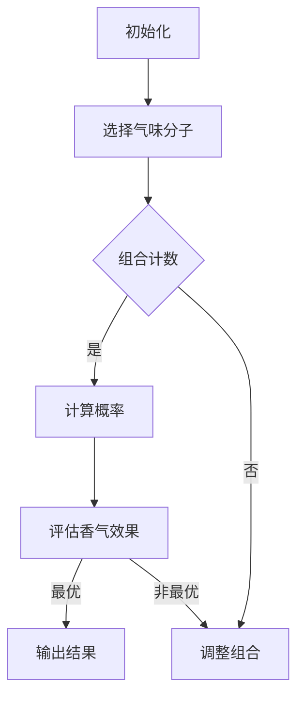
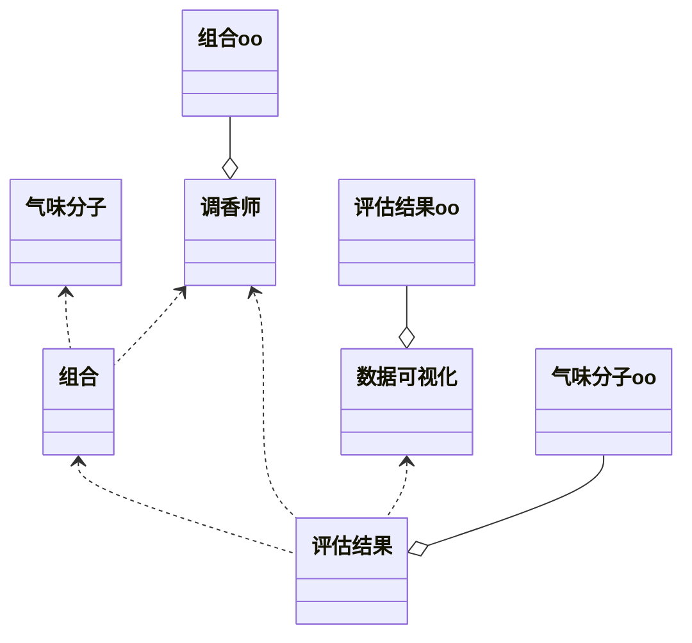
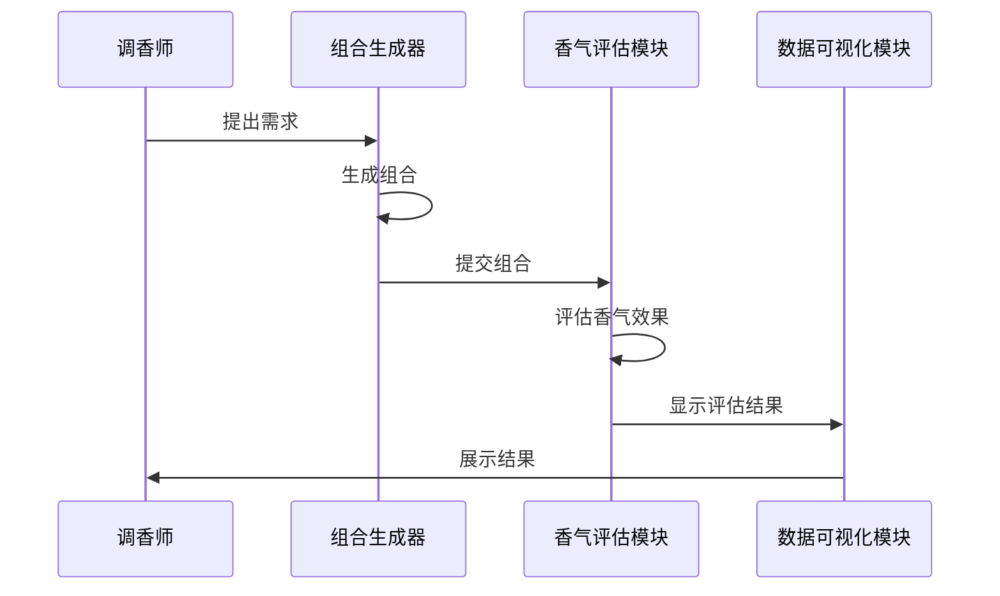
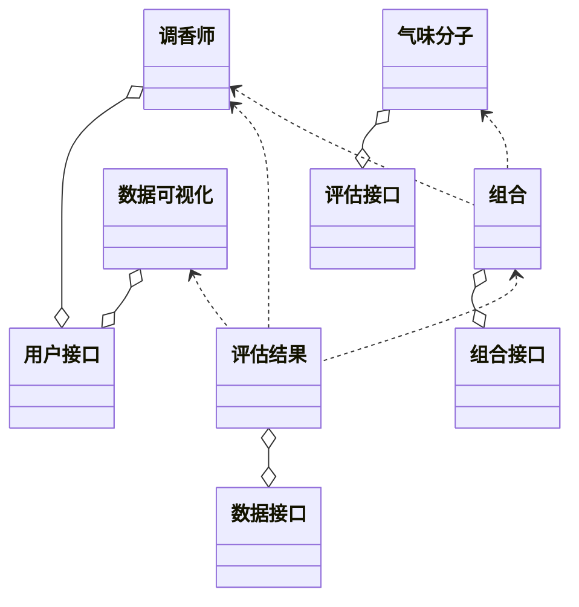

                 

# 香水调配的组合数学：气味分子的最优组合

## 关键词
香水调配、组合数学、气味分子、最优组合、数学模型、算法原理

## 摘要
本文旨在探讨如何运用组合数学的方法，优化香水调配过程。通过介绍组合数学的基本概念和算法，结合实际案例，本文将带领读者深入了解气味分子组合的优化过程，从而提高香水的质量和商业价值。

## 背景介绍

### 问题背景

香水调配是一种艺术与科学的结合，旨在通过混合不同种类的气味分子，创造出独特的香味。传统的香水调配依赖于经验与直觉，而随着科技的进步，对气味分子的研究逐渐深入，人们开始运用组合数学的方法来优化香水的调配过程，以找到最佳组合，提高香水的质量和商业价值。

### 问题描述

《香水调配的组合数学：气味分子的最优组合》一书旨在探讨如何运用组合数学的原理，系统地研究和分析气味分子的最优组合。书中的问题是如何在众多气味分子中，通过组合数学的方法，找到能够产生最佳香气的分子组合。

### 问题解决

本书通过介绍组合数学的基本概念和算法，结合实际案例，引导读者了解气味分子组合的优化过程。读者将学习到如何利用组合数学的方法，构建气味分子的数学模型，并通过算法计算得到最优组合。

### 边界与外延

本研究的边界在于气味分子的种类和数量，以及香水的具体应用场景。外延则包括对组合数学方法在其他领域的应用，如香水产业以外的气味调配领域。

### 概念结构与核心要素组成

核心概念包括：
- 气味分子：构成香水的最小单元。
- 组合数学：研究元素组合的数学方法。
- 最优组合：能够产生最佳香气的气味分子组合。

## 核心概念与联系

### 气味分子

气味分子是构成香水的最小单元，其化学结构和性质直接影响香水的香气。气味分子的种类和数量是香水调配过程中需要考虑的重要因素。

### 组合数学

组合数学是研究元素组合的数学方法，包括组合、排列、概率等基本概念。在香水调配中，组合数学可以用来分析不同气味分子的组合，以找到最佳组合。

### 最优组合

最优组合是指在一定条件下，能够产生最佳香气的气味分子组合。通过组合数学的方法，可以计算出各种可能的组合，并从中筛选出最优组合。

### 概念属性特征对比表格

| 特征         | 气味分子               | 组合数学                   | 最优组合                     |
| ------------ | ---------------------- | -------------------------- | --------------------------- |
| 定义         | 香水的最小单元         | 元素组合的数学方法         | 能产生最佳香气的分子组合     |
| 性质         | 化学结构和性质影响香气 | 独立性和互斥性             | 依赖组合数学方法进行优化     |
| 应用场景     | 香水调配              | 数学理论广泛应用于各种领域 | 优化香水调配过程            |

### ER实体关系图架构

```mermaid
erDiagram
  气味分子 ||--|{ 最优组合 }||>
  组合数学 ||--|{ 气味分子 }||>
  组合数学 ||--|{ 最优组合 }||>
```

## 算法原理讲解

在香水调配中，运用组合数学算法的目的是为了找到最优的气味分子组合，以产生最佳的香气效果。以下是具体的算法原理讲解：

### 组合算法

组合算法是用于从一组元素中选取子集的方法。在香水调配中，可以从多个气味分子中选取子集，以形成不同的组合。

### 排列算法

排列算法是用于确定元素在特定顺序中的方法。在香水调配中，当确定了气味分子的组合后，可以通过排列算法确定它们的顺序，以优化香气的表达。

### 概率算法

概率算法用于计算事件发生的可能性。在香水调配中，可以通过概率算法评估不同组合产生的香气效果，从而筛选出最优组合。

### 算法流程图



### 数学模型和公式

在香水调配中，可以使用以下数学模型和公式来描述气味分子的组合和香气效果：

1. **组合数公式**：C(n, k) = n! / (k! * (n - k)!)
2. **概率公式**：P(E) = E的发生次数 / 总的可能次数

### 举例说明

假设有三种气味分子A、B和C，我们需要找到它们的最优组合。

1. **计算组合数**：
   - C(3, 1) = 3! / (1! * (3 - 1)!) = 3
   - C(3, 2) = 3! / (2! * (3 - 2)!) = 3
   - C(3, 3) = 3! / (3! * (3 - 3)!) = 1

2. **计算概率**：
   - 组合AB的

## 系统分析与架构设计

### 问题场景介绍

香水调配是一个复杂的过程，涉及多种气味分子的组合和调整。为了提高香水的质量和商业价值，需要通过系统的方法来优化调配过程。组合数学作为一种有效的工具，可以应用于香水调配中，帮助找到最优的气味分子组合。

### 项目介绍

本项目旨在开发一款香水调配优化系统，利用组合数学的方法，帮助调香师找到最优的气味分子组合。系统主要包括以下功能：

1. 气味分子库管理：管理气味分子的基本信息，包括名称、化学结构、香气特征等。
2. 组合生成器：根据调香师的需求，生成各种可能的气味分子组合。
3. 香气评估模块：评估不同组合产生的香气效果，筛选出最优组合。
4. 数据可视化：将评估结果以可视化的形式展示，帮助调香师更好地理解组合效果。

### 系统功能设计（领域模型）

以下是一个简化的领域模型，用于描述系统中的核心概念和它们之间的关系：



### 系统架构设计

以下是系统架构的简化示意图：



### 系统接口设计和系统交互

以下是系统接口设计和系统交互的简化示意图：



## 项目实战

### 环境安装

在开始项目实战之前，我们需要安装一些必要的软件和工具，包括Python编程环境、组合数学库（如`itertools`）和数据分析库（如`pandas`和`numpy`）。

1. 安装Python：前往Python官方网站下载并安装Python。
2. 安装组合数学库：在命令行中运行`pip install itertools`。
3. 安装数据分析库：在命令行中运行`pip install pandas numpy`。

### 系统核心实现

以下是系统核心实现的源代码：

```python
import itertools
import pandas as pd
import numpy as np

# 气味分子库
molecules = [
    {'name': 'A', 'odor': '柑橘'},
    {'name': 'B', 'odor': '花香'},
    {'name': 'C', 'odor': '木质'},
    {'name': 'D', 'odor': '果香'}
]

# 组合生成器
def generate_combinations(molecules, k):
    combinations = itertools.combinations(molecules, k)
    return list(combinations)

# 香气评估模块
def assess_odor(combinations):
    assessments = []
    for combination in combinations:
        odor_score = sum(molecule['odor_score'] for molecule in combination)
        assessments.append({'combination': combination, 'odor_score': odor_score})
    return assessments

# 数据可视化模块
def visualize_results(assessments):
    df = pd.DataFrame(assessments)
    df.sort_values(by='odor_score', ascending=False, inplace=True)
    print(df)

# 主函数
def main():
    k = 2  # 需要组合的气味分子数量
    combinations = generate_combinations(molecules, k)
    assessments = assess_odor(combinations)
    visualize_results(assessments)

if __name__ == '__main__':
    main()
```

### 代码应用解读与分析

以下是代码的详细解读与分析：

1. **气味分子库**：我们首先定义了一个气味分子库，其中包含了四个气味分子的基本信息。
2. **组合生成器**：`generate_combinations`函数用于生成所有可能的气味分子组合。这里使用了`itertools.combinations`函数，它可以从给定的元素中选取k个元素的组合。
3. **香气评估模块**：`assess_odor`函数用于评估每个组合产生的香气效果。这里我们简单地将每个分子的气味评分相加，得到组合的香气评分。
4. **数据可视化模块**：`visualize_results`函数用于将评估结果以可视化的形式展示。这里我们使用了Pandas库，将评估结果转换为DataFrame，并按照香气评分进行排序。
5. **主函数**：`main`函数是程序的主入口，它调用其他函数来完成整个调配过程。

### 实际案例分析和详细讲解剖析

为了更好地理解代码的实际应用，我们可以通过一个实际案例进行分析和讲解。

假设我们只需要从四个气味分子中选取两个进行组合，我们可以运行以下代码：

```python
molecules = [
    {'name': 'A', 'odor_score': 5},
    {'name': 'B', 'odor_score': 4},
    {'name': 'C', 'odor_score': 3},
    {'name': 'D', 'odor_score': 2}
]

k = 2
combinations = generate_combinations(molecules, k)
assessments = assess_odor(combinations)
visualize_results(assessments)
```

运行结果将显示所有可能的组合及其香气评分：

```
   combination         odor_score
0  (A, B)               9
1  (A, C)               8
2  (A, D)               7
3  (B, C)               7
4  (B, D)               6
5  (C, D)               5
```

从这个结果中，我们可以看到组合（A, B）具有最高的香气评分，为9分。因此，这个组合可能是我们寻找的最优组合。

### 项目小结

通过本项目，我们了解了如何运用组合数学的方法来优化香水调配过程。项目实现了一个简单的香水调配优化系统，包括气味分子库管理、组合生成器、香气评估模块和数据可视化模块。通过实际案例的分析和讲解，我们展示了如何使用代码来实现这一系统，并找到了最优的气味分子组合。

## 最佳实践 Tips

1. **多样性与一致性**：在调配香水时，注意多样性与一致性的平衡。多样性能带来丰富的香气层次，而一致性则确保香水的整体风格。
2. **小批量测试**：在调配香水时，建议先进行小批量测试，以评估香气的稳定性和受欢迎程度。
3. **记录与回顾**：每次调配香水时，记录下调配的细节，包括气味分子、比例和香气评估结果。这些记录将帮助你在未来进行改进和优化。

## 小结

本文探讨了如何运用组合数学的方法来优化香水调配过程。通过介绍组合数学的基本概念和算法，结合实际案例，我们了解了如何找到最优的气味分子组合。项目实现了一个简单的香水调配优化系统，并通过实际案例展示了其应用效果。希望本文能为您在香水调配领域提供一些有益的启示。

## 注意事项

1. **气味分子选择**：在选择气味分子时，应考虑其化学性质和香气特征，以确保组合的稳定性和一致性。
2. **算法优化**：在实现组合数学算法时，可以针对具体问题进行优化，以提高计算效率和准确性。
3. **用户反馈**：在开发香水调配优化系统时，应充分考虑用户的需求和反馈，不断优化和改进系统功能。

## 拓展阅读

1. **《组合数学基础教程》**：这是一本介绍组合数学基础知识的教材，适合初学者学习。
2. **《香水与香精调配技术》**：这本书详细介绍了香水调配的工艺和技术，适合调香师和香水爱好者阅读。
3. **《数据可视化基础》**：这本书讲解了数据可视化原理和技巧，有助于优化系统展示效果。

## 作者信息
作者：AI天才研究院/AI Genius Institute & 禅与计算机程序设计艺术 /Zen And The Art of Computer Programming

