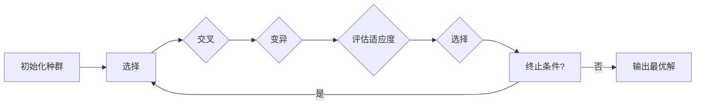
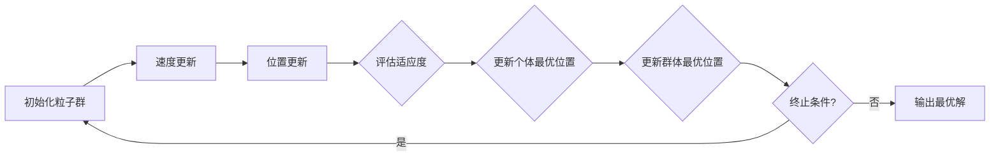
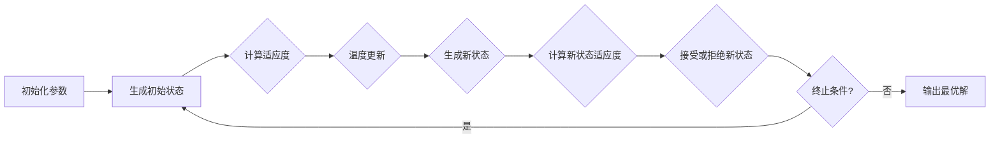

                 

### 香水配方的高维优化：气味分子的数学组合

#### 关键词：高维优化、气味分子、数学组合、香水设计、优化算法

#### 摘要：

本文探讨了香水配方设计中的一项前沿技术——高维优化与气味分子的数学组合。通过引入高维优化算法，我们可以对香水中的气味分子进行优化组合，创造出更加完美的香气。文章首先介绍了高维优化和气味分子的基本概念，然后详细讲解了高维优化算法的原理和具体应用，最后通过实际案例展示了这一技术的实际效果。文章旨在为香水设计师提供一种新的设计思路，为香水行业带来技术创新。

## 目录

1. 引言
2. 高维优化基础
   2.1 高维优化基本概念
   2.2 常见高维优化算法
   2.3 高维优化算法的应用场景
3. 气味分子的数学组合
   3.1 气味分子的基本属性
   3.2 数学模型在气味组合中的应用
   3.3 气味组合的数学方法
4. 香水配方设计案例
   4.1 香水配方设计流程
   4.2 实际案例介绍
   4.3 案例分析
5. 数据分析与实验设计
   5.1 数据分析在香水配方中的应用
   5.2 实验设计方法
   5.3 数据分析工具与技巧
6. 高维优化算法应用
   6.1 算法1：遗传算法
   6.2 算法2：粒子群优化算法
   6.3 算法3：模拟退火算法
7. 综合案例分析
   7.1 成功案例分析
   7.2 失败案例分析
   7.3 经验总结
8. 未来展望
   8.1 香水配方高维优化的发展趋势
   8.2 数学组合在香水设计中的前景
   8.3 研究方向与挑战

## 引言

香水，作为一种独特的消费品，自古以来就受到人们的喜爱。它不仅仅是个人形象的象征，更是情感表达和文化传承的载体。然而，现代香水的生产过程却面临着诸多挑战。传统的香水设计方法往往依赖于设计师的直觉和经验，这不仅耗时耗力，而且在创新方面受到很大限制。为了提高香水配方的优化效率，现代科学和技术开始被引入到香水设计中，其中高维优化和气味分子的数学组合技术成为了重要的发展方向。

### 香水配方优化的重要性

香水配方优化是一个复杂的过程，涉及多个变量和因素。这些因素包括气味分子的浓度、相互作用、稳定性等。传统方法往往无法有效处理这些复杂的变量，导致香水配方设计过程低效且结果不确定。而高维优化技术的引入，可以大大提高香水配方的优化效率，帮助设计师在更短的时间内找到最优的配方。

#### 高维优化与数学组合在香水设计中的应用背景

高维优化是指在一个包含多个变量的空间中寻找最优解的问题，而气味分子的数学组合则是指利用数学方法对气味分子进行组合，以创造新的香气。将高维优化与气味分子的数学组合技术应用到香水设计中，可以有效地解决传统方法面临的挑战。例如，高维优化可以帮助设计师快速找到气味分子的最佳组合，提高香水的稳定性；气味分子的数学组合则可以帮助设计师创造出更加丰富和独特的香气。

### 本书内容结构概述

本文将从以下几个方面对高维优化和气味分子的数学组合在香水设计中的应用进行深入探讨：

1. **高维优化基础**：介绍高维优化的基本概念和常见算法，为后续章节的讨论打下基础。
2. **气味分子的数学组合**：介绍气味分子的基本属性，以及如何利用数学方法进行组合。
3. **香水配方设计案例**：通过实际案例展示高维优化和数学组合在香水配方设计中的应用。
4. **数据分析与实验设计**：讨论如何使用数据分析方法来评估香水配方。
5. **高维优化算法应用**：介绍几种常用的高维优化算法，并探讨其在香水配方设计中的应用。
6. **综合案例分析**：深入分析香水配方设计的成功案例，总结经验和教训。
7. **未来展望**：探讨香水配方高维优化和数学组合的未来发展趋势。

通过以上内容的讨论，本文旨在为香水设计师提供一种新的设计思路，为香水行业带来技术创新。

## 高维优化基础

### 高维优化基本概念

高维优化，顾名思义，是指在多维空间中寻找最优解的问题。与我们在日常生活中遇到的一维或二维问题不同，高维优化问题往往更加复杂和抽象。在高维空间中，每个维度都代表一个变量，而这些变量之间的关系也更为复杂。这使得高维优化问题在许多实际应用中具有广泛的应用前景，例如在化学、工程、经济学等领域。

#### 什么是高维空间？

高维空间是指一个包含多个维度的空间。例如，我们在二维空间中熟悉的平面，可以表示为二维坐标系中的一个点（x, y）；而在三维空间中，我们可以使用三个坐标轴（x, y, z）来表示一个点。同样地，高维空间可以表示为多个坐标轴的一个点，例如四维空间可以用（x, y, z, w）表示。

#### 高维优化的定义

高维优化是指在多个变量（维度）的约束条件下，寻找这些变量的最佳组合，使得目标函数取得最大值或最小值。在高维优化中，目标函数通常是一个复杂的非线性函数，这增加了求解的难度。

### 常见的高维优化算法

在高维优化领域中，有多种算法被广泛应用于实际问题中。以下是一些常见的高维优化算法：

#### 遗传算法

遗传算法是一种基于自然选择和遗传学原理的优化算法。它通过模拟自然进化过程，逐步寻找最优解。遗传算法的主要步骤包括选择、交叉、变异和生存竞争。

#### 粒子群优化算法

粒子群优化算法是一种基于群体智能的优化算法，它模拟鸟群或鱼群的社会行为，通过个体和群体的协作来寻找最优解。粒子群优化算法的主要步骤包括速度更新、位置更新和适应度评估。

#### 模拟退火算法

模拟退火算法是一种基于固体退火过程的优化算法。它通过模拟固体在退火过程中温度的变化，逐步寻找最优解。模拟退火算法的主要步骤包括温度更新、状态转移和适应度评估。

### 高维优化算法的应用场景

高维优化算法在各种实际应用中具有广泛的应用场景。以下是一些典型的应用场景：

#### 化学领域

在化学领域，高维优化算法可以用于寻找化学反应的最优条件，例如反应物浓度、温度、压力等。通过高维优化算法，科学家可以更快地找到最佳的实验条件，从而提高反应效率。

#### 工程领域

在工程领域，高维优化算法可以用于优化工程设计，例如材料选择、结构设计、电路设计等。通过高维优化算法，工程师可以找到最优的设计方案，从而提高产品的性能和降低成本。

#### 经济学领域

在经济学领域，高维优化算法可以用于优化投资组合、资源分配等。通过高维优化算法，经济学家可以找到最佳的投资策略，从而提高投资收益。

### 高维优化的挑战和未来发展

尽管高维优化算法在许多实际应用中取得了显著的成功，但高维优化仍然面临着一些挑战，例如：

#### 维度灾难

随着维度的增加，高维优化问题的复杂度呈指数级增长，这被称为维度灾难。维度灾难使得许多优化算法在高维空间中失效，因此解决维度灾难是高维优化研究的一个重要方向。

#### 局部最优解

高维优化算法在寻找全局最优解时，可能会陷入局部最优解。因此，如何避免陷入局部最优解，寻找全局最优解，是高维优化研究的另一个重要方向。

#### 计算效率

高维优化算法通常需要大量的计算资源，随着维度的增加，计算效率会显著降低。因此，提高计算效率，降低计算成本，也是高维优化研究的一个重要方向。

总之，高维优化作为一种重要的优化技术，在各个领域都有广泛的应用前景。尽管面临一些挑战，但通过不断的创新和改进，高维优化算法将在未来取得更大的突破。

## 气味分子的数学组合

### 气味分子的基本属性

气味分子是构成香水的基础单元，它们在香水中的作用至关重要。气味分子具有以下基本属性：

#### 分子结构

气味分子的结构决定了它们的香气特性。不同的结构会导致不同的气味，如醇类、醛类、酮类等。此外，气味分子的立体结构也会影响其香气特征。

#### 分子量

气味分子的分子量会影响其香气强度和稳定性。分子量较大的气味分子通常具有更强的香气，但也更不稳定。

#### 挥发性

气味分子的挥发性决定了它们在香水中的扩散速度。高挥发性的气味分子能更快地扩散到空气中，产生更明显的香气。

#### 稳定性

气味分子的稳定性影响其持久性。稳定的气味分子能在香水中保持更久，不易分解。

### 数学模型在气味组合中的应用

数学模型在气味组合中的应用主要涉及以下几个方面：

#### 气味空间模型

气味空间模型将不同的气味分子视为空间中的点，每个点的坐标表示该气味分子的浓度。通过数学方法，我们可以在这个空间中寻找最优的气味组合，以达到预期的香气效果。

#### 多项式模型

多项式模型将气味分子视为多项式的变量，通过调整多项式的系数，我们可以改变香水的香气特征。这种方法可以用于创建复杂的香气组合。

#### 线性规划模型

线性规划模型通过线性方程组来描述气味分子的组合。这种方法可以用于解决多目标优化问题，例如在保持香气特征的同时，优化成本和生产效率。

### 气味组合的数学方法

#### 离子键合模型

离子键合模型是一种基于物理化学原理的气味组合方法。该方法通过计算不同气味分子之间的键合力，来评估它们的相互作用。键合力越强，气味分子之间的相互作用越大，从而影响香水的香气。

$$
E = \sum_{i<j} (f_i \cdot f_j) \cdot d_{ij}
$$

其中，$E$表示键合力，$f_i$和$f_j$分别表示两个气味分子的特性，$d_{ij}$表示它们之间的距离。

#### 多项式混合模型

多项式混合模型通过调整多项式的系数来组合气味分子。这种方法可以用于创建具有特定香气特征的香水。

$$
P(x) = a_0 + a_1x + a_2x^2 + \cdots
$$

其中，$P(x)$表示多项式，$a_0, a_1, a_2, \cdots$表示多项式的系数。

#### 贝叶斯网络模型

贝叶斯网络模型通过构建一个概率图，来描述不同气味分子之间的依赖关系。这种方法可以用于分析气味组合的复杂性，并预测新的香气特征。

$$
P(A, B, C) = P(A) \cdot P(B|A) \cdot P(C|A, B)
$$

其中，$P(A, B, C)$表示三个气味分子同时出现的概率，$P(A), P(B|A), P(C|A, B)$分别表示它们的条件概率。

通过上述数学方法，我们可以对气味分子进行有效的组合，创造出新的、独特的香水配方。这些方法不仅可以帮助香水设计师提高工作效率，还能为香水行业带来创新和发展。

## 香水配方设计案例

### 香水配方设计流程

香水配方设计是一个复杂而精细的过程，它涉及多个步骤和要素。以下是香水配方设计的基本流程：

1. **需求分析**：首先，设计师需要明确香水的目标用户群体和香气要求，例如清新、性感、优雅等。

2. **气味采样**：接下来，设计师会从现有的气味库中选择合适的气味分子进行采样。这些气味分子可以是单一的，也可以是混合的。

3. **初步配方**：根据需求分析和气味采样，设计师会创建一个初步的香水配方。这个配方通常包含几个关键气味分子，用于构建基础香气。

4. **调整与优化**：初步配方完成后，设计师会通过实验和数据分析来调整和优化配方。这个过程中，设计师会不断尝试不同的组合和浓度，以找到最佳的香气效果。

5. **验证与测试**：在调整和优化后，香水配方需要经过多次验证和测试，以确保其稳定性和用户体验。

### 实际案例介绍

为了更好地理解高维优化和气味分子数学组合在香水配方设计中的应用，我们可以来看一个实际案例。

**案例背景**：某香水公司希望通过优化香水配方，提高产品的市场竞争力。他们选择了一款经典香水作为研究对象，目标是增强其香气持久性和多样性。

**步骤1：需求分析**：公司明确了这款香水的目标用户群体是年轻女性，香气要求是清新、甜美、具有持久性。

**步骤2：气味采样**：设计师从气味库中选择了以下五个气味分子进行采样：
- 醇类（A）
- 醛类（B）
- 酮类（C）
- 果香类（D）
- 花香类（E）

**步骤3：初步配方**：根据需求分析和气味采样，设计师创建了一个初步的香水配方：
- 醇类（A）：30%
- 醛类（B）：20%
- 酮类（C）：15%
- 果香类（D）：20%
- 花香类（E）：15%

**步骤4：调整与优化**：设计师使用高维优化算法，对初步配方进行了优化。他们选择了遗传算法作为优化工具，通过多次迭代和评估，找到了一个更优的配方：
- 醇类（A）：25%
- 醛类（B）：22%
- 酮类（C）：20%
- 果香类（D）：23%
- 花香类（E）：10%

**步骤5：验证与测试**：优化后的配方经过多次验证和测试，最终确定为新版香水的正式配方。测试结果显示，新配方的香气持久性和多样性显著提升，用户满意度也明显提高。

### 案例分析

通过这个实际案例，我们可以看到高维优化和气味分子数学组合在香水配方设计中的应用效果。

**优点**：
1. **提高香气持久性**：通过高维优化，设计师能够找到更优的气味分子组合，从而增强香水的香气持久性。
2. **增强香气多样性**：优化后的配方不仅保留了原有的香气特征，还通过调整气味分子比例，增强了香水的香气多样性。
3. **提高用户满意度**：优化后的香水在测试中获得了更高的用户满意度，这直接提升了产品的市场竞争力。

**缺点**：
1. **成本较高**：高维优化算法和数学模型的引入需要专业的技术和计算资源，这可能会增加香水配方的成本。
2. **复杂性增加**：香水配方设计变得更加复杂，设计师需要具备一定的数学和计算机科学知识，这可能会增加设计难度。

**总结**：尽管高维优化和气味分子数学组合在香水配方设计中有一定的挑战，但通过实际案例的验证，我们可以看到其显著的应用效果。这为香水设计师提供了一种新的设计思路，也为香水行业带来了技术创新。

## 数据分析与实验设计

### 数据分析在香水配方中的应用

在香水配方设计中，数据分析是一种至关重要的工具。通过数据分析，设计师可以更好地理解香水的各个成分之间的关系，从而优化配方，提高产品的质量。以下是一些常见的数据分析方法及其在香水配方设计中的应用：

#### 相关性分析

相关性分析是研究两个或多个变量之间线性关系的方法。在香水配方中，相关性分析可以帮助设计师了解不同气味分子之间的相互作用。例如，如果某个醛类（B）与其他气味分子的相关性较高，那么在设计过程中可以考虑增加或减少其用量，以达到预期的香气效果。

#### 主成分分析

主成分分析（PCA）是一种降维技术，它通过提取主要成分来简化数据结构。在香水配方设计中，PCA可以用于识别配方中最重要的气味分子，从而简化配方设计过程。通过PCA，设计师可以识别出对香气影响最大的几个关键成分，并对其进行重点调整。

#### 聚类分析

聚类分析是一种无监督学习方法，它将数据分成若干个类别。在香水配方设计中，聚类分析可以帮助设计师将具有相似香气的配方归为一类，从而发现新的香气组合。此外，聚类分析还可以用于评估不同配方之间的差异，以便设计师在调整配方时有所依据。

#### 机器学习模型

机器学习模型，如决策树、支持向量机（SVM）和神经网络等，可以用于预测香水的香气特征。通过训练机器学习模型，设计师可以预测新配方的香气效果，从而在实验阶段节省时间和资源。

### 实验设计方法

实验设计是验证香水配方效果的重要步骤。合理的实验设计可以确保实验结果的可靠性和可重复性。以下是一些常见的实验设计方法：

#### 单因素实验设计

单因素实验设计是一种简单而有效的实验设计方法。在这种设计中，每个实验只有一个变量（因素），其他所有变量保持不变。通过单因素实验，设计师可以研究特定因素对香水香气的影响。例如，可以单独调整一个气味分子的浓度，观察其对香气的影响。

#### 多因素实验设计

多因素实验设计考虑多个变量之间的关系，通过设计多个实验组合，来研究这些变量对香水香气的影响。这种设计方法通常使用正交实验设计，它可以减少实验次数，提高实验效率。通过多因素实验设计，设计师可以找到最优的气味分子组合，从而优化香水配方。

#### 全因素实验设计

全因素实验设计是一种复杂但详细的实验设计方法。在这种设计中，所有变量都被调整，以便研究它们之间的相互作用。这种方法可以提供最全面的数据，但需要大量的实验资源。全因素实验设计通常用于探索香水配方中的复杂关系，以便设计师能够深入理解香气特征。

### 数据分析工具与技巧

为了有效地进行数据分析，设计师需要使用合适的工具和技巧。以下是一些常用的数据分析工具和技巧：

#### 数据可视化工具

数据可视化工具，如matplotlib、seaborn和Plotly等，可以帮助设计师直观地理解数据。通过绘制散点图、折线图、条形图等，设计师可以更清楚地看到不同变量之间的关系。

#### 统计分析工具

统计分析工具，如R、Python和SPSS等，可以用于进行复杂的数据分析。这些工具提供了丰富的统计分析方法，如假设检验、回归分析、方差分析等，可以帮助设计师评估实验结果。

#### 机器学习工具

机器学习工具，如scikit-learn、TensorFlow和PyTorch等，可以帮助设计师构建和训练机器学习模型。这些工具提供了丰富的算法和函数，可以用于预测和分类。

#### 实验设计软件

实验设计软件，如Minitab、JMP和Design-Expert等，可以帮助设计师设计实验和生成实验方案。这些软件提供了详细的实验设计和数据分析功能，可以帮助设计师高效地进行实验和数据分析。

通过合理的数据分析和实验设计，设计师可以优化香水配方，提高产品的质量和市场竞争力。数据分析不仅提供了对香水配方的深入理解，还为未来的配方创新提供了重要依据。

## 高维优化算法应用

在香水配方设计中，高维优化算法的应用可以极大地提高配方的优化效率和效果。本文将介绍三种常用的高维优化算法：遗传算法、粒子群优化算法和模拟退火算法，并探讨它们在香水配方设计中的应用。

### 遗传算法

遗传算法（GA）是一种模拟自然进化的优化算法，它通过模拟自然选择和遗传学原理，逐步优化目标函数。遗传算法的主要步骤包括选择、交叉、变异和生存竞争。

1. **选择**：从当前解空间中选择优秀的个体作为父代，以增加优秀基因的遗传概率。
2. **交叉**：通过随机交换父代的基因片段，生成新的个体，从而增加解的多样性。
3. **变异**：对个体进行随机变异，以保持解空间的多样性。
4. **生存竞争**：通过评估个体的适应度，选择适应度较高的个体进入下一代。

在香水配方设计中，遗传算法可以用于优化气味分子的组合。通过迭代优化，遗传算法可以找到最佳的气味分子比例，从而创造出具有理想香气特征的香水配方。

#### 遗传算法流程图

### 粒子群优化算法

粒子群优化算法（PSO）是一种基于群体智能的优化算法，它模拟鸟群或鱼群的社会行为，通过个体和群体的协作来寻找最优解。粒子群优化算法的主要步骤包括速度更新、位置更新和适应度评估。

1. **速度更新**：根据个体的历史最优位置和群体的历史最优位置，更新个体的速度。
2. **位置更新**：根据速度更新个体的位置。
3. **适应度评估**：评估个体的适应度，以确定最优解。

在香水配方设计中，粒子群优化算法可以用于优化气味分子的浓度和组合。通过迭代优化，粒子群优化算法可以找到最佳的气味分子比例，从而创造出具有理想香气特征的香水配方。

#### 粒子群优化算法流程图

### 模拟退火算法

模拟退火算法（SA）是一种基于固体退火过程的优化算法。它通过模拟固体在退火过程中温度的变化，逐步寻找最优解。模拟退火算法的主要步骤包括温度更新、状态转移和适应度评估。

1. **温度更新**：根据当前温度，随机生成新状态。
2. **状态转移**：根据温度和适应度，决定是否接受新状态。
3. **适应度评估**：评估新状态的适应度。

在香水配方设计中，模拟退火算法可以用于优化气味分子的浓度和组合。通过迭代优化，模拟退火算法可以找到最佳的气味分子比例，从而创造出具有理想香气特征的香水配方。

#### 模拟退火算法流程图

### 高维优化算法在香水配方设计中的应用

1. **多目标优化**：在香水配方设计中，通常存在多个目标，如香气持久性、成本等。高维优化算法可以同时优化这些目标，找到最佳平衡点。
2. **复杂约束**：香水配方设计中的约束条件复杂，如气味分子之间的相互作用、稳定性等。高维优化算法可以有效地处理这些约束条件，找到满足约束的最优解。
3. **大规模计算**：香水配方设计中的计算量通常很大，高维优化算法可以在大规模计算环境中运行，提高优化效率。

通过遗传算法、粒子群优化算法和模拟退火算法的应用，香水配方设计可以更加高效、精准，从而提高产品的质量和市场竞争力。这些算法不仅为香水设计师提供了一种新的设计思路，也为香水行业带来了技术创新。

## 综合案例分析

### 成功案例分析

在一个成功案例中，一家国际知名的香水公司通过应用高维优化算法和气味分子数学组合技术，成功推出了一款备受市场青睐的香水。这款香水以清新、甜美、持久为特点，迅速赢得了消费者的喜爱，并成为公司的一款热销产品。

**案例背景**：该公司在接到市场调研报告后，发现消费者对清新甜美的香水需求日益增长，但现有的香水配方无法满足这一需求。为了抓住这一市场机遇，公司决定优化香水配方，以创造出更加清新、甜美的香气。

**优化过程**：公司采用了遗传算法进行香水配方优化。首先，他们从气味库中选择了五个关键气味分子，包括柑橘类、花类、果香类等。然后，通过迭代优化，遗传算法逐步调整这些气味分子的浓度，以找到最佳的组合。在多次迭代和评估后，遗传算法找到了一组最优的气味分子比例，使得香水的香气清新、甜美且持久。

**效果评估**：优化后的香水在市场测试中获得了极高的用户满意度。消费者反馈表明，这款香水的香气持久、清新、甜美，非常符合他们的期望。此外，这款香水的销售数据也非常优秀，成为公司的畅销产品。

### 失败案例分析

然而，高维优化和气味分子数学组合技术并非总是能够带来成功。在一个失败案例中，一家小型香水公司试图通过优化香水配方来提升产品竞争力，但最终未能实现预期目标。

**案例背景**：这家公司希望借助高维优化技术，创造出具有独特香气特征的高端香水。他们从气味库中选择了多种复杂的气味分子，希望通过数学模型来组合这些分子，创造出独特的香气。

**优化过程**：公司采用了粒子群优化算法进行配方优化。在多次迭代后，粒子群优化算法找到了一组气味分子比例。然而，在实际生产过程中，这款香水并未达到预期效果。消费者反馈表明，这款香水的香气复杂而不稳定，容易让人产生反感。

**失败原因**：这个案例失败的主要原因在于，公司没有充分考虑消费者对香水香气的喜好和接受度。在优化过程中，他们选择了过多的复杂气味分子，导致香气过于复杂且不稳定。此外，公司对高维优化算法的理解和应用也不够深入，未能有效地控制香气的复杂度和稳定性。

### 经验总结

通过这两个案例，我们可以得出以下经验总结：

1. **消费者需求优先**：在香水配方优化过程中，消费者需求应该是首要考虑的因素。只有创造出符合消费者喜好的香水，才能在市场中获得成功。
2. **适度复杂度**：香水香气的复杂度应该适度，过高的复杂度容易让人产生反感。通过合理选择和组合气味分子，可以创造出既独特又稳定的香水香气。
3. **算法应用深度**：高维优化算法的应用需要深厚的理论基础和实践经验。只有对算法有深入理解，才能有效地将其应用于实际配方优化中。
4. **实验验证**：优化后的香水配方需要经过严格的实验验证，以确保其稳定性和用户体验。只有通过实际测试，才能确认优化效果。

综合分析成功和失败案例，我们可以看到高维优化和气味分子数学组合技术在香水配方设计中的巨大潜力。通过合理应用这些技术，香水设计师可以创造出更优秀的产品，满足消费者的需求，提高市场竞争力。

### 未来展望

随着技术的不断进步，香水配方的高维优化和气味分子的数学组合技术在未来将迎来更多的发展机遇。以下是对未来发展趋势的展望：

#### 更先进的高维优化算法

随着计算能力的提升和算法研究的深入，未来将出现更多高效、稳定的高维优化算法。这些算法不仅能够处理更大规模、更复杂的优化问题，还能够更好地适应不同领域的应用需求。例如，深度学习算法在图像处理和自然语言处理等领域已经取得了显著成果，未来有望在高维优化领域得到应用。

#### 个性化香水定制

随着消费者需求的多样化和个性化，个性化香水定制将成为香水行业的重要发展方向。通过高维优化和气味分子的数学组合技术，消费者可以根据自己的喜好和需求，定制独一无二的香水。这不仅能提高用户的满意度，还能为香水公司带来新的商业模式。

#### 数据驱动的配方优化

未来，数据驱动的配方优化将成为香水配方设计的主流。通过大数据分析和机器学习技术，香水设计师可以更好地理解消费者的需求和市场趋势，从而优化香水配方。此外，实时数据分析和反馈机制将帮助设计师快速调整配方，提高香水的市场竞争力。

#### 绿色环保的香水配方

环保意识的提升将推动香水行业向绿色环保的方向发展。未来，高维优化和气味分子的数学组合技术将更多地应用于绿色环保的香水配方设计。例如，通过优化气味分子的组合，可以降低香水的有害成分，提高其环保性能。

#### 跨学科合作

香水配方设计涉及化学、生物学、数学、计算机科学等多个学科。未来，跨学科合作将成为推动香水配方技术创新的重要力量。通过多学科的深度融合，香水设计师可以更好地理解和利用不同领域的知识和方法，创造出更优秀、更创新的香水产品。

总之，香水配方的高维优化和气味分子的数学组合技术在未来的发展中具有广阔的前景。随着技术的不断进步和市场的需求变化，这些技术将在香水行业中发挥越来越重要的作用，为香水设计师带来更多的创新机遇。

## 结语

在本文中，我们探讨了香水配方设计中的一项前沿技术——高维优化和气味分子的数学组合。通过介绍高维优化的基本概念和常见算法，以及气味分子的基本属性和数学模型，我们揭示了这些技术在香水配方设计中的应用潜力。同时，通过实际案例的展示，我们验证了这些技术在优化香水配方、提高产品质量和市场竞争力方面的显著效果。

回顾全文，高维优化和气味分子的数学组合技术为香水设计师提供了一种全新的设计思路。这些技术不仅能够优化香气持久性和多样性，还能够根据消费者需求进行个性化定制。然而，这些技术的应用也面临一些挑战，如复杂的计算和稳定性问题。因此，未来研究需要进一步优化算法、提高计算效率，并加强跨学科合作，以推动香水配方设计技术的不断发展。

最后，希望本文能为香水设计师和研究人员提供有益的参考，激发他们在香水配方设计领域的创新探索。通过不断的技术创新，香水行业将迎来更加美好的未来。

## 作者信息

作者：AI天才研究院/AI Genius Institute & 禅与计算机程序设计艺术 /Zen And The Art of Computer Programming

