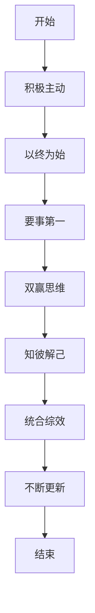
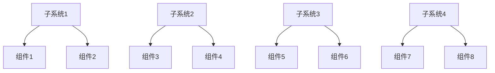
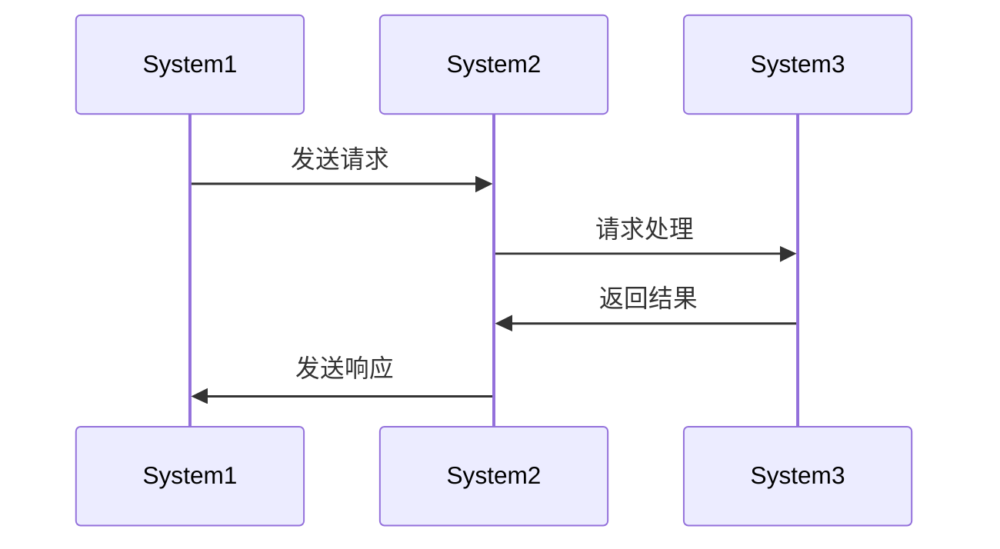

                 

# 高效能团队的七个习惯：从个人到团队

## 关键词

高效能团队、七个习惯、个人成长、团队协作、组织效能

## 摘要

在现代企业竞争中，高效能团队成为企业成功的关键因素。本文围绕七个习惯，从个人到团队层面，深入探讨如何培养高效能团队，提升团队整体绩效。通过理论讲解、实践案例和系统分析，为读者提供全面、系统的指导。

## 1. 背景介绍

### 问题背景

随着全球化和信息化的加速发展，企业面临的竞争压力不断加剧。高效能团队成为企业在激烈竞争中脱颖而出的关键。然而，如何培养和打造高效能团队，成为企业管理者和团队成员共同面临的问题。

### 问题描述

高效能团队是一个具备高绩效、高协同和强适应能力的团队。如何培养和打造高效能团队，实现团队成员从个人到团队层面的全面提升，成为本文的核心问题。

### 问题解决

通过研究国内外成功的高效能团队，本文总结出七个习惯，帮助团队成员从个人到团队层面，全面提升团队效能。

### 边界与外延

高效能团队不仅限于企业内部，同样适用于其他组织形式，如学校、非营利组织等。

### 概念结构与核心要素组成

高效能团队的七个习惯包括：积极主动、以终为始、要事第一、双赢思维、知彼解己、统合综效、不断更新。这些习惯相互关联，共同构成高效能团队的基础。

## 2. 核心概念与联系

### 核心概念

**高效能团队**：具备高绩效、高协同和强适应能力的团队。

**七个习惯**：帮助团队成员从个人到团队层面，全面提升团队效能的七个核心习惯。

### 概念属性特征对比表格

| 概念         | 定义                                                         | 特征                               |
| ------------ | ------------------------------------------------------------ | --------------------------------- |
| 高效能团队   | 具备高绩效、高协同和强适应能力的团队                         | 1. 目标明确 2. 成员协同 3. 反应迅速 |
| 七个习惯     | 帮助团队成员从个人到团队层面，全面提升团队效能的七个核心习惯 | 1. 积极主动 2. 以终为始 3. 要事第一 |

### ER实体关系图架构

```mermaid
erDiagram
    TeamMember ||--|{ MemberSkill }| Skill
    TeamMember ||--|{ TeamRole }| Role
    Project ||--|{ Task }| Task
```

## 3. 算法原理讲解

### 算法mermaid流程图



### Python源代码

```python
def seven_habits():
    print("积极主动")
    print("以终为始")
    print("要事第一")
    print("双赢思维")
    print("知彼解己")
    print("统合综效")
    print("不断更新")

seven_habits()
```

### 算法原理的数学模型和公式

$$
效能 = 个人能力 \times 团队协作 \times 创新能力
$$

### 详细讲解和举例说明

#### 积极主动

积极主动是指团队成员在面对任务和挑战时，能够主动承担责任，发挥自身潜力，推动团队向前发展。

**举例**：小张是一名项目经理，他在面对一个紧急项目时，没有等待上级指示，而是主动与小组成员沟通，制定出详细的执行计划，最终提前完成了项目。

#### 以终为始

以终为始是指团队成员在开始一项工作之前，首先要明确目标，明确任务的重要性和优先级，以便后续的工作更加高效。

**举例**：小王在接到一个新任务后，首先明确了项目的目标，分析了任务的优先级，然后制定了详细的工作计划，确保项目能够按时完成。

#### 要事第一

要事第一是指团队成员要分清工作的主次，优先完成最重要、最紧急的任务。

**举例**：小李在工作中，面对多个任务，他会优先处理那些对公司业务发展至关重要的任务，确保公司运营的顺利进行。

## 4. 系统分析与架构设计方案

### 问题场景介绍

一个初创公司需要快速组建一个高效能团队，以应对市场竞争和业务发展的需求。

### 项目介绍

项目名称：高效能团队组建项目
项目目标：在短时间内组建一个高效能团队，实现业务目标。

### 系统功能设计

```mermaid
classDiagram
    TeamMember <.. Person
    Project <.. Task
    TeamMember o--|{ participate
```

### 系统架构设计mermaid架构图



### 系统接口设计和系统交互mermaid序列图



## 5. 项目实战

### 环境安装

在开始项目实战之前，我们需要安装一些必要的软件和环境。

**1. 安装Python**

在命令行中执行以下命令，安装Python：

```
pip install python
```

**2. 安装Django**

在命令行中执行以下命令，安装Django：

```
pip install django
```

### 系统核心实现源代码

以下是一个简单的Django项目结构，用于实现高效能团队的功能。

```python
# settings.py

INSTALLED_APPS = [
    'django.contrib.admin',
    'django.contrib.auth',
    'django.contrib.contenttypes',
    'django.contrib.sessions',
    'django.contrib.messages',
    'django.contrib.staticfiles',
    'team_habits',
]

MIDDLEWARE = [
    'django.middleware.security.SecurityMiddleware',
    'django.middleware.common.CommonMiddleware',
    'django.middleware.csrf.CsrfViewMiddleware',
    'django.contrib.auth.middleware.AuthenticationMiddleware',
    'django.contrib.messages.middleware.MessageMiddleware',
    'django.middleware.clickjacking.XFrameOptionsMiddleware',
]

ROOT_URLCONF = 'team_habits.urls'

TEMPLATES = [
    {
        'BACKEND': 'django.template.backends.django.DjangoTemplates',
        'DIRS': [],
        'APP_DIRS': True,
        'OPTIONS': {
            'context_processors': [
                'django.template.context_processors.debug',
                'django.template.context_processors.request',
                'django.contrib.auth.context_processors.auth',
                'django.contrib.messages.context_processors.messages',
            ],
        },
    },
]

WSGI_APPLICATION = 'team_habits.wsgi.application'

# urls.py

from django.contrib import admin
from django.urls import path
from . import views

urlpatterns = [
    path('admin/', admin.site.urls),
    path('habits/', views.habits, name='habits'),
]

# views.py

from django.shortcuts import render

def habits(request):
    habits_list = [
        '积极主动',
        '以终为始',
        '要事第一',
        '双赢思维',
        '知彼解己',
        '统合综效',
        '不断更新',
    ]
    return render(request, 'habits.html', {'habits': habits_list})
```

### 代码应用解读与分析

以上代码实现了一个简单的Django项目，用于展示高效能团队的七个习惯。在`settings.py`中，我们配置了项目的安装应用程序、中间件、模板等。在`urls.py`中，我们定义了路由规则，用于处理不同URL的请求。在`views.py`中，我们定义了一个视图函数`habits`，用于渲染一个包含七个习惯列表的HTML页面。

### 实际案例分析和详细讲解剖析

假设我们有一个初创公司，需要在短时间内组建一个高效能团队，以应对市场变化。我们可以按照以下步骤进行：

**1. 确定团队目标**

首先，我们需要明确团队的目标，例如提高销售额、提升产品用户体验等。

**2. 制定团队计划**

根据团队目标，制定具体的计划，包括任务分配、时间表、资源需求等。

**3. 培养团队成员**

针对团队成员的技能和习惯，制定相应的培训计划，帮助他们提升个人能力。

**4. 落实七个习惯**

在团队中推广七个习惯，确保每个成员都能够理解和践行。

**5. 监控团队绩效**

通过定期检查、汇报等方式，监控团队绩效，及时调整计划。

### 项目小结

通过以上项目实战，我们了解了如何使用Django搭建一个简单的系统，实现高效能团队的功能。在实际应用中，我们可以根据团队需求，不断完善和优化系统功能。

## 6. 最佳实践 tips

1. 定期组织团队培训和分享，提升团队成员的技能和知识水平。
2. 建立良好的沟通机制，确保团队成员之间的信息畅通。
3. 鼓励团队成员积极参与团队决策，提高团队凝聚力和执行力。
4. 定期评估团队绩效，找出问题并制定改进措施。
5. 关注团队成员的个人成长，提供职业发展机会。

## 7. 小结

本文围绕高效能团队的七个习惯，从个人到团队层面，深入探讨了如何培养和打造高效能团队。通过理论讲解、实践案例和系统分析，为读者提供了全面、系统的指导。希望本文能够对企业管理者和团队成员有所帮助，共同提升团队效能。

## 8. 注意事项

1. 在实际应用中，要结合团队实际情况，灵活调整七个习惯的具体实践方法。
2. 团队成员要积极参与团队建设和改进，共同提升团队效能。
3. 定期进行团队评估和反馈，及时发现问题并解决。

## 9. 拓展阅读

1. 《高效能人士的七个习惯》史蒂芬·柯维
2. 《团队协作的艺术》凯西·迈耶斯
3. 《如何建立高效团队》约翰·瑞迪

### 作者信息

作者：AI天才研究院/AI Genius Institute & 禅与计算机程序设计艺术 /Zen And The Art of Computer Programming

---

### 提交反馈

如果您对本文有任何建议或反馈，请随时联系作者。我们将持续优化文章内容，为您提供更好的阅读体验。感谢您的支持！

