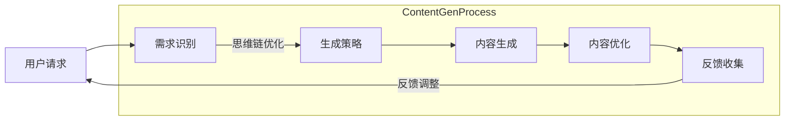
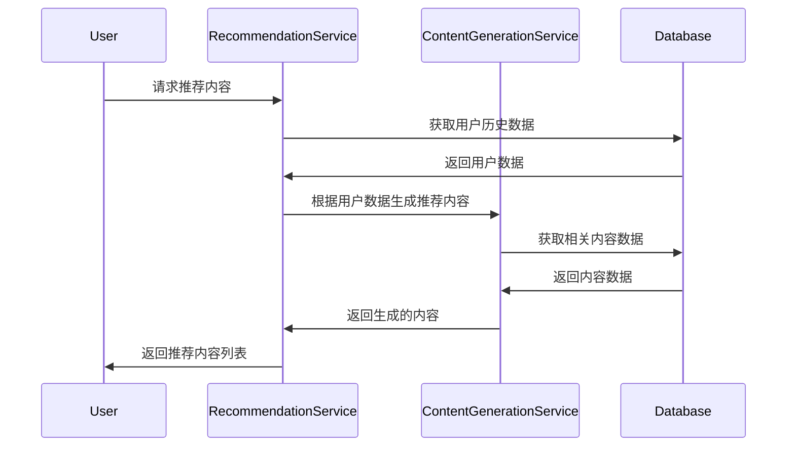

                 

### 目录与核心内容结构

#### 目录结构设计

为了确保文章逻辑清晰、内容紧凑且易于阅读，本文将采用以下目录结构：

1. **背景介绍部分**：介绍AIGC与内容个性化的概念，阐述思维链的定义及其应用，并探讨这两者之间的联系。
2. **核心概念与联系部分**：深入讲解AIGC和思维链的技术原理，通过对比表格和ER实体关系图详细分析两者的区别和联系。
3. **算法原理讲解部分**：通过Mermaid流程图和Python源代码，详细阐述AIGC与思维链结合的算法原理，并辅以数学模型和公式进行解释。
4. **系统分析与架构设计方案**：从问题场景介绍、系统功能设计、系统架构设计、系统接口设计到系统交互序列图，全面展示AIGC内容个性化系统的设计细节。
5. **项目实战部分**：介绍环境安装、核心代码实现、代码解读、实际案例分析以及项目小结，确保读者能够理解并应用所学知识。
6. **最佳实践 tips、小结、注意事项、拓展阅读部分**：提供实践建议、总结文章要点、提醒注意事项并推荐进一步阅读资源，以巩固读者对AIGC内容个性化技术的理解。

#### 核心内容结构设计

- **第1章 AIGC与内容个性化概述**：介绍AIGC的基本概念及其在内容个性化中的重要性，分析内容个性化的需求和挑战。
- **第2章 思维链技术原理**：详细探讨思维链的定义、结构及其在内容生成中的应用。
- **第3章 AIGC与思维链的结合**：分析AIGC与思维链融合的原理、优势及其应用前景。
- **第4章 概念属性特征对比表格**：通过表格形式对比AIGC与思维链的核心概念、技术特性和应用场景。
- **第5章 ER实体关系图架构的 Mermaid 流程图**：绘制AIGC与思维链的ER实体关系图，展示其系统架构。
- **第6章 AIGC技术原理**：深入探讨AIGC的技术原理，包括其基础概念和关键技术。
- **第7章 思维链技术原理**：详细解释思维链的构建方法和优化策略。
- **第8章 AIGC与思维链的结合**：进一步阐述AIGC与思维链融合后的优势和应用。
- **第9章 概念属性特征对比表格**：再次通过表格形式对比AIGC与思维链的各个方面。
- **第10章 ER实体关系图架构的 Mermaid 流程图**：绘制融合后的ER实体关系图，展示系统架构。
- **第11章 算法原理讲解**：通过Mermaid流程图和Python源代码，详细解释AIGC与思维链结合的算法原理。
- **第12章 Python源代码实现**：展示算法的Python源代码实现，并进行调试分析。
- **第13章 数学模型和数学公式**：介绍AIGC与思维链的数学模型，使用LaTeX格式展示相关数学公式。
- **第14章 举例说明**：通过实例，通俗地解释算法的应用和效果。
- **第15章 问题场景介绍**：介绍AIGC内容个性化应用的场景。
- **第16章 系统功能设计**：设计系统的功能模块，包括领域模型Mermaid类图。
- **第17章 系统架构设计**：绘制系统的架构图，介绍模块设计和优化策略。
- **第18章 系统接口设计**：设计系统接口，包括接口规范和实现。
- **第19章 系统交互Mermaid序列图**：展示系统交互的序列图，解释系统工作流程。
- **第20章 项目实战**：从环境安装、核心代码实现到案例分析，全面介绍项目实战过程。
- **最佳实践 tips、小结、注意事项、拓展阅读**：提供实践建议，总结文章要点，提醒注意事项，并推荐进一步阅读资源。

通过这种详细的目录结构和核心内容设计，读者可以逐步深入理解AIGC内容个性化技术，掌握其原理和应用，从而在实际项目中有效应用这些知识。

#### 第一部分：背景介绍

## 第1章 AIGC与内容个性化概述

### 1.1 AIGC概念介绍

AIGC（AI-Generated Content）是指利用人工智能技术生成内容的一种方式，涵盖了从数据采集、处理到内容生成的整个流程。它不同于传统的手动内容创作，而是通过机器学习和自然语言处理技术，自动生成文章、图片、视频等多种形式的内容。AIGC的出现，极大地提高了内容生产的效率和多样性，使得大量个性化的内容可以快速被生成和分发。

AIGC的应用场景非常广泛，从媒体、广告、教育到娱乐等领域，都展现了其独特的价值。在媒体领域，AIGC可以自动化生成新闻报道、评论和文章，节省人力成本并提高信息传播速度。在广告领域，AIGC可以根据用户行为和兴趣，个性化生成广告内容，提高广告效果和用户转化率。在教育领域，AIGC可以生成个性化学习资料，满足不同学生的学习需求。在娱乐领域，AIGC可以生成虚拟角色、故事情节和游戏内容，为用户提供更加丰富的互动体验。

### 1.2 内容个性化的需求与挑战

内容个性化是当前互联网时代的一个重要趋势，其核心目标是根据用户的需求和兴趣，为用户提供个性化的内容推荐。随着互联网的普及和用户数量的激增，用户对个性化内容的需求日益增长，而传统的推荐系统已无法满足这一需求。

内容个性化的需求主要体现在以下几个方面：

1. **个性化推荐**：为用户提供与其兴趣和偏好相符的内容。
2. **个性化定制**：根据用户的需求，生成定制化的内容。
3. **个性化交互**：通过内容与用户的互动，提升用户体验。

然而，内容个性化也面临着一系列挑战：

1. **数据多样性和噪声**：互联网上的数据量大且多样化，其中包含了大量噪声数据，这对数据清洗和特征提取提出了更高的要求。
2. **用户隐私保护**：个性化推荐系统需要收集和分析用户的隐私数据，如何保护用户隐私成为一个关键问题。
3. **计算复杂度**：大规模内容生成和实时推荐需要强大的计算能力和高效的算法。

### 1.3 思维链在内容个性化中的应用

思维链（Thinking Chain）是一种基于人工智能的思维方式建模技术，它通过模拟人类大脑的思考过程，将多个独立的思考模块连接成一个统一的思考网络。思维链在内容个性化中的应用，主要体现在以下几个方面：

1. **场景识别**：通过分析用户的交互行为和内容消费习惯，识别用户的当前场景和需求。
2. **内容生成**：根据场景和用户需求，利用思维链自动生成个性化的内容。
3. **交互优化**：通过分析用户对内容的反馈，不断优化交互体验，提升内容个性化效果。

思维链的优势在于其灵活性和适应性，能够根据不同的应用场景和用户需求，动态调整和优化内容生成策略。这使得思维链在内容个性化中具有广泛的应用前景，能够有效解决当前推荐系统面临的诸多挑战。

综上所述，AIGC和内容个性化是当前人工智能领域的重要研究方向，而思维链技术的引入，为内容个性化提供了新的思路和方法。通过本章节的介绍，读者可以初步了解AIGC和内容个性化的基本概念及其需求与挑战，为后续章节的深入探讨打下基础。

### 第2章 思维链技术原理

#### 2.1 思维链的定义

思维链（Thinking Chain）是一种基于人工智能的思维方式建模技术，旨在通过模拟人类大脑的思考过程，将多个独立的思考模块连接成一个统一的思考网络。这种网络不仅能够处理复杂的决策问题，还能够通过不断学习和调整，优化思考过程，从而提高解决问题的效率和质量。

思维链的核心思想是将人类的思考过程分解为一系列基本单元，每个单元负责特定的思考任务。这些基本单元通过预先定义的规则和关系相互连接，形成一个有序的思考链。当遇到新的问题时，思维链可以按照预定的规则和关系，逐步推导出解决方案。

#### 2.2 思维链的结构与特性

思维链的结构可以分为三个主要层次：基础单元、连接规则和全局网络。

1. **基础单元**：基础单元是思维链的最小组成部分，每个基础单元负责处理特定的思考任务。这些任务可以是简单的逻辑推理、数据分析和知识检索等。基础单元通常包含输入、输出和处理逻辑三个部分。

2. **连接规则**：连接规则定义了基础单元之间的连接方式和交互方式。这些规则可以是基于逻辑关系的条件连接，也可以是基于数据依赖的连接。连接规则确保了思维链中各个基础单元之间的协调和配合，使得整个思考过程有条不紊地进行。

3. **全局网络**：全局网络是思维链的最高层次，它将各个基础单元和连接规则组织成一个统一的思考网络。全局网络不仅能够协调各个基础单元的工作，还能够根据问题情景动态调整和优化思考链的运行。这种结构使得思维链具有很强的灵活性和适应性。

#### 2.3 思维链在内容生成中的应用

思维链在内容生成中的应用主要体现在以下几个方面：

1. **场景识别**：思维链可以通过分析用户的交互历史、浏览行为和偏好，识别用户的当前场景和需求。例如，在电子商务平台上，思维链可以识别出用户正在浏览的商品类型、用户的购买意图等。

2. **内容生成**：根据识别出的场景和需求，思维链可以自动生成个性化的内容。例如，在新闻推荐系统中，思维链可以根据用户的阅读偏好和当前热点事件，生成个性化的新闻摘要和推荐文章。

3. **内容优化**：思维链不仅能够生成内容，还可以根据用户对内容的反馈，不断优化内容的质量和效果。例如，在广告推荐中，思维链可以根据用户的点击率和转化率，调整广告内容的展示策略，提高广告效果。

思维链的优势在于其灵活性和适应性。通过将人类的思考过程模块化，思维链能够根据不同的应用场景和用户需求，动态调整和优化思考链的结构和运行策略。这使得思维链在内容生成和个性化推荐领域具有广泛的应用前景。

#### 第3章 AIGC与思维链的结合

#### 3.1 AIGC与思维链的融合原理

AIGC（AI-Generated Content）与思维链的结合，旨在通过人工智能技术模拟人类思维过程，生成高度个性化的内容。AIGC的核心在于利用机器学习和自然语言处理技术，自动化地生成文本、图像、视频等多种形式的内容。而思维链则通过模拟人类大脑的思考过程，构建一个有序的思考网络，使得内容生成的过程更加智能化和自适应。

AIGC与思维链的融合原理主要涉及以下几个方面：

1. **场景识别**：思维链首先通过分析用户的交互历史和偏好，识别用户当前的场景和需求。例如，用户可能正在浏览某个产品类别，或者对某个话题感兴趣。

2. **内容生成策略**：根据识别出的场景和需求，思维链会生成一个初步的内容生成策略。这个策略包括选择适合的内容类型（如文章、图片、视频）、确定内容的主题和风格等。

3. **内容生成**：在生成策略的指导下，AIGC利用机器学习模型，自动生成具体的内容。例如，对于文章生成，AIGC可以自动生成符合用户需求和场景的文本内容；对于图像生成，AIGC可以自动生成符合用户偏好的图像。

4. **内容优化**：生成内容后，思维链会根据用户对内容的反馈，不断调整和优化内容。例如，如果用户对生成的内容满意度不高，思维链可以重新调整生成策略，生成新的内容；如果用户对内容非常满意，思维链可以保留并强化这一生成策略。

#### 3.2 AIGC与思维链的优势分析

AIGC与思维链的结合，为内容个性化带来了显著的优势：

1. **高度个性化**：通过思维链的场景识别和内容生成策略，AIGC能够生成高度符合用户需求和兴趣的内容。这种个性化不仅体现在内容主题和风格上，还体现在内容的细节和深度上。

2. **自适应性强**：思维链能够根据用户的行为和反馈，动态调整内容生成策略，确保生成的内容始终与用户需求保持一致。这种自适应能力使得AIGC能够在不断变化的用户环境中，保持高效的个性化推荐。

3. **生成效率高**：AIGC利用机器学习和自然语言处理技术，能够快速生成大量内容。这与传统的手动内容创作相比，大大提高了内容生成的效率。

4. **内容多样性**：AIGC可以生成文本、图像、视频等多种形式的内容，这使得内容个性化不再局限于某种特定的形式，而是能够为用户提供多样化的内容体验。

5. **优化成本**：通过思维链的优化策略，AIGC能够不断改进生成的内容，降低用户满意度较低的生成成本。这种优化机制不仅提高了内容质量，还降低了内容生成和维护的成本。

#### 3.3 AIGC与思维链的应用前景

AIGC与思维链的结合，在多个领域展现出广阔的应用前景：

1. **媒体与广告**：在媒体领域，AIGC与思维链可以自动化生成个性化新闻、文章和视频，提高用户粘性和阅读量。在广告领域，AIGC可以生成高度个性化的广告内容，提高广告效果和用户转化率。

2. **教育**：在教育领域，AIGC与思维链可以生成个性化的学习资料，满足不同学生的学习需求和节奏，提高学习效果。

3. **电子商务**：在电子商务领域，AIGC与思维链可以生成个性化产品推荐、商品描述和广告内容，提升用户体验和购买转化率。

4. **娱乐**：在娱乐领域，AIGC与思维链可以生成个性化虚拟角色、故事情节和游戏内容，为用户提供丰富的互动体验。

综上所述，AIGC与思维链的结合，不仅提高了内容生成的效率和多样性，还为内容个性化提供了新的思路和方法。随着技术的不断进步和应用场景的拓展，AIGC与思维链在未来有望在更多领域发挥重要作用。

### 第4章 概念属性特征对比表格

#### 4.1 AIGC与思维链核心概念对比

| 概念       | AIGC（AI-Generated Content） | 思维链（Thinking Chain） |
|------------|------------------------------|--------------------------|
| 定义       | 利用AI技术生成内容           | 模拟人类思维过程的建模技术 |
| 目标       | 提高内容生成效率和多样性     | 模拟和优化人类思考过程    |
| 主要技术   | 机器学习、自然语言处理       | 思维模块连接、规则定义    |
| 应用场景   | 媒体、广告、教育、娱乐等     | 内容个性化、问题求解      |
| 功能       | 内容生成、内容优化           | 场景识别、内容生成、内容优化 |
| 关键优势   | 高效、多样、个性化           | 模拟人类思维、灵活、自适应 |

#### 4.2 AIGC与思维链技术特性对比

| 技术特性       | AIGC（AI-Generated Content） | 思维链（Thinking Chain） |
|----------------|------------------------------|--------------------------|
| 数据依赖性     | 强（依赖大量数据）           | 中（依赖思维模块和规则） |
| 计算复杂度     | 高（生成大量内容）           | 中（模块化和规则化处理） |
| 生成效率       | 高（快速生成内容）           | 中（优化思考过程）       |
| 灵活性         | 中（根据需求调整生成策略）   | 高（动态调整思维链结构） |
| 自适应性       | 中（根据用户反馈调整）       | 高（基于学习自动优化）   |
| 内容多样性     | 高（多种内容形式）           | 中（基于模块的组合）     |
| 用户互动性     | 强（与用户交互调整内容）     | 中（模拟用户思维过程）   |

#### 4.3 AIGC与思维链应用场景对比

| 应用场景       | AIGC（AI-Generated Content） | 思维链（Thinking Chain） |
|----------------|------------------------------|--------------------------|
| 媒体内容生成   | 自动生成新闻、文章、视频等   | 自动生成个性化推荐内容   |
| 广告内容生成   | 生成个性化广告文案和图像     | 优化广告内容和展示策略   |
| 教育内容生成   | 生成个性化学习资料和课程     | 个性化教学和问题解答     |
| 电子商务推荐   | 生成个性化产品推荐和描述     | 自动化商品推荐和优化     |
| 娱乐内容生成   | 生成个性化虚拟角色和故事     | 自动生成游戏内容和情节   |
| 问题求解与决策 | 基于内容生成的问题解决方案   | 基于思维链的问题求解系统 |

通过上述对比表格，我们可以清晰地看到AIGC与思维链在核心概念、技术特性和应用场景上的异同。这种对比有助于理解两者各自的优点和适用范围，也为后续章节的深入分析奠定了基础。

### 第5章 ER实体关系图架构的 Mermaid 流程图

#### 5.1 ER模型基础

实体关系图（Entity-Relationship Diagram，ER图）是数据库设计中常用的一种工具，用于描述实体及其相互关系。ER图由三个基本元素组成：实体（Entity）、属性（Attribute）和关系（Relationship）。

1. **实体**：表示数据库中的主要对象，如用户、商品、订单等。
2. **属性**：描述实体的特征，如用户的名字、年龄、邮箱等。
3. **关系**：表示实体之间的关联，如用户与订单之间的关系、商品与订单之间的关系等。

#### 5.2 Mermaid流程图绘制

Mermaid是一种方便的Markdown扩展语言，用于绘制各种图表，包括流程图、UML图、甘特图等。在ER图中，我们可以使用Mermaid来绘制实体关系图，使复杂的数据库结构更加直观和易于理解。

下面是一个简单的Mermaid ER图示例：

```mermaid
erDiagram
    User ||--|{ Order }|:
        User : 姓名，年龄，邮箱
        Order : 订单号，商品，数量，时间
```

在这个ER图中，`User`（用户）是实体，`Order`（订单）是另一个实体。两者之间存在一对多的关系，即一个用户可以生成多个订单，但每个订单只能属于一个用户。

#### 5.3 AIGC与思维链实体关系图

在本文的背景下，我们需要绘制一个结合AIGC（AI-Generated Content）与思维链的实体关系图，以展示这两个技术组件及其关联。

下面是一个简化的Mermaid ER图示例，用于展示AIGC与思维链的实体关系：

```mermaid
erDiagram
    User ||--|{ Content }|:
        User : 姓名，年龄，兴趣
        Content : 内容ID，标题，正文，生成时间
    ContentGenSystem ||--|{ AIGC }|:
        ContentGenSystem : 系统ID，参数配置，状态
        AIGC : 模型，训练数据，生成策略
    ThinkingChain ||--|{ AIGC }|:
        ThinkingChain : 模块，规则，全局网络
        AIGC : 需求识别，内容生成，反馈优化
```

在这个ER图中：

- `User`（用户）实体包含了用户的基本信息，如姓名、年龄和兴趣。
- `Content`（内容）实体包含了生成内容的属性，如内容ID、标题、正文和生成时间。
- `ContentGenSystem`（内容生成系统）实体表示AIGC的系统属性，如系统ID、参数配置和状态。
- `AIGC`（AI-Generated Content）实体表示AIGC的模型、训练数据和生成策略。
- `ThinkingChain`（思维链）实体表示思维链的模块、规则和全局网络。
- `ThinkingChain`与`AIGC`之间存在关联关系，表示思维链用于优化AIGC的内容生成过程。

通过这个Mermaid ER图，我们可以直观地理解AIGC与思维链在内容个性化系统中的架构和关系。这种图示不仅有助于设计系统，还能为后续的算法讲解和系统实现提供参考。

### 第6章 AIGC技术原理

#### 6.1 AIGC基础概念

AIGC（AI-Generated Content）是指利用人工智能技术生成内容的一种方式，它涵盖了从数据采集、处理到内容生成的整个过程。AIGC的核心在于利用机器学习和自然语言处理技术，自动生成文本、图像、视频等多种形式的内容。AIGC不仅提高了内容生成的效率和多样性，还为内容个性化提供了新的解决方案。

AIGC的主要组成部分包括：

1. **数据采集与处理**：AIGC首先需要从各种来源采集数据，如互联网、数据库等。采集到的数据需要进行清洗、预处理和特征提取，以便为内容生成提供高质量的数据输入。
2. **模型训练**：利用采集和处理后的数据，通过机器学习算法训练生成模型。这些模型可以是基于深度学习的文本生成模型、图像生成模型或视频生成模型等。
3. **内容生成**：训练好的模型可以根据输入的请求或指令，自动生成相应的内容。例如，文本生成模型可以生成文章、新闻报道，图像生成模型可以生成图片、艺术作品，视频生成模型可以生成视频、动画等。
4. **内容优化**：生成的内容会根据用户反馈进行优化，以提升内容的满意度。这个过程可以是自动化的，也可以是结合人工干预的。

#### 6.2 AIGC关键技术

AIGC的实现依赖于一系列关键技术的支持，这些技术包括：

1. **机器学习**：机器学习是AIGC的核心技术之一，通过训练大量数据，模型可以学会生成高质量的内容。常用的机器学习算法包括生成对抗网络（GAN）、变分自编码器（VAE）和递归神经网络（RNN）等。
2. **自然语言处理**：自然语言处理（NLP）技术用于理解和生成人类语言。在AIGC中，NLP技术被广泛应用于文本生成、文本分类、情感分析等领域。常见的NLP模型包括Transformer、BERT、GPT等。
3. **计算机视觉**：计算机视觉技术用于处理和分析图像和视频数据。在AIGC中，计算机视觉技术被用于图像生成、图像识别、视频合成等领域。常用的计算机视觉模型包括卷积神经网络（CNN）和生成对抗网络（GAN）等。
4. **生成模型**：生成模型是AIGC的重要组成部分，包括生成对抗网络（GAN）、变分自编码器（VAE）和流模型（如Flow Models）等。这些模型通过学习数据的分布，可以生成新的、高质量的数据。

#### 6.3 AIGC应用场景

AIGC的应用场景非常广泛，以下是其中几个典型的应用领域：

1. **媒体与新闻**：AIGC可以自动化生成新闻文章、新闻报道和体育赛事分析等。通过机器学习模型，AIGC可以快速处理大量新闻数据，生成高质量的新闻内容。
2. **广告与营销**：AIGC可以生成个性化广告文案、图片和视频，提高广告效果和用户转化率。通过分析用户行为和兴趣，AIGC可以生成定制化的广告内容，实现精准营销。
3. **娱乐与游戏**：AIGC可以生成虚拟角色、游戏故事情节和游戏内容。通过生成对抗网络（GAN），AIGC可以生成逼真的图像和视频，提升游戏和娱乐体验。
4. **教育与培训**：AIGC可以生成个性化学习资料、课程内容和培训材料。通过NLP技术和机器学习模型，AIGC可以根据用户的需求和学习进度，自动生成个性化的教学材料。
5. **艺术创作**：AIGC可以生成艺术作品、音乐和文学作品。通过计算机视觉和自然语言处理技术，AIGC可以创作出独特且富有创意的艺术作品。

综上所述，AIGC技术不仅提高了内容生成的效率和质量，还为各个领域的应用提供了新的可能性。随着技术的不断进步和应用场景的拓展，AIGC在未来有望在更多领域发挥重要作用。

### 第7章 思维链技术原理

#### 7.1 思维链基础概念

思维链（Thinking Chain）是一种基于人工智能的思维方式建模技术，旨在通过模拟人类大脑的思考过程，将多个独立的思考模块连接成一个统一的思考网络。这种网络不仅能够处理复杂的决策问题，还能够通过不断学习和调整，优化思考过程，从而提高解决问题的效率和质量。

思维链的基本概念包括：

1. **基础单元**：基础单元是思维链的最小组成部分，每个基础单元负责处理特定的思考任务。这些任务可以是简单的逻辑推理、数据分析和知识检索等。基础单元通常包含输入、输出和处理逻辑三个部分。
2. **连接规则**：连接规则定义了基础单元之间的连接方式和交互方式。这些规则可以是基于逻辑关系的条件连接，也可以是基于数据依赖的连接。连接规则确保了思维链中各个基础单元之间的协调和配合，使得整个思考过程有条不紊地进行。
3. **全局网络**：全局网络是思维链的最高层次，它将各个基础单元和连接规则组织成一个统一的思考网络。全局网络不仅能够协调各个基础单元的工作，还能够根据问题情景动态调整和优化思考链的运行。这种结构使得思维链具有很强的灵活性和适应性。

#### 7.2 思维链构建方法

思维链的构建方法主要包括以下几个步骤：

1. **需求分析**：首先，需要对应用场景和需求进行深入分析，明确思维链需要解决的问题和目标。例如，在内容个性化系统中，思维链的目标是根据用户的需求和兴趣，生成个性化的内容。
2. **模块设计**：根据需求分析结果，设计基础单元模块。每个基础单元模块应该具有明确的输入、输出和处理逻辑。基础单元模块的设计需要考虑其通用性和可扩展性，以便在不同场景下复用。
3. **规则定义**：定义基础单元之间的连接规则。连接规则可以是基于逻辑关系的条件连接，也可以是基于数据依赖的连接。规则的定义需要确保各个基础单元之间的协调和配合，使得整个思考链能够高效运行。
4. **全局网络构建**：将各个基础单元模块和连接规则组织成一个全局网络。全局网络的结构和参数需要根据具体问题进行优化，以确保思维链在解决复杂问题时能够高效运行。

#### 7.3 思维链优化策略

思维链的优化策略主要包括以下几个方面：

1. **模块优化**：对基础单元模块进行优化，提高其处理速度和准确性。例如，可以通过优化算法、提升硬件性能或增加计算资源来实现。
2. **规则优化**：优化连接规则，提高思维链的协调性和效率。例如，可以引入新的规则或调整现有规则的优先级，使得思维链在处理复杂问题时能够更加高效。
3. **全局网络优化**：优化全局网络的结构和参数，提高思维链的整体性能。例如，可以通过调整网络中的连接权重、增加或删除基础单元模块等手段来优化全局网络。
4. **学习与适应**：通过不断学习和适应新的问题和环境，优化思维链的运行效果。例如，可以通过机器学习算法，使得思维链能够根据新的数据和反馈，自动调整其模块和规则，提高其适应性和解决问题的能力。

综上所述，思维链技术通过基础单元、连接规则和全局网络的构建，实现了对人类思维过程的模拟和优化。这种技术不仅提高了解决问题的效率和质量，还为人工智能在各个领域的应用提供了新的思路和方法。随着技术的不断进步和应用场景的拓展，思维链有望在更多领域发挥重要作用。

### 第8章 AIGC与思维链的结合

#### 8.1 AIGC与思维链的融合原理

AIGC（AI-Generated Content）与思维链（Thinking Chain）的结合，旨在通过人工智能技术和思维方式建模，实现高度个性化的内容生成。这种结合的原理主要涉及以下几个方面：

1. **需求识别**：首先，AIGC通过分析用户的交互历史、行为数据和偏好，识别用户当前的需求和兴趣点。例如，在电子商务平台上，AIGC可以识别用户正在浏览的商品类型、购买意图等。

2. **内容生成策略**：根据需求识别的结果，思维链会生成一个初步的内容生成策略。这个策略包括选择适合的内容类型、确定内容的主题和风格等。例如，如果用户对科技新闻感兴趣，思维链会选择生成科技领域的新闻文章。

3. **内容生成**：在生成策略的指导下，AIGC利用机器学习模型和自然语言处理技术，自动生成具体的内容。例如，文本生成模型可以生成新闻文章、产品描述，图像生成模型可以生成产品图片、艺术作品等。

4. **内容优化**：生成内容后，思维链会根据用户对内容的反馈，不断调整和优化内容。例如，如果用户对生成的内容满意度不高，思维链可以重新调整生成策略，生成新的内容；如果用户对内容非常满意，思维链可以保留并强化这一生成策略。

#### 8.2 AIGC与思维链的优势分析

AIGC与思维链的结合，为内容个性化带来了显著的优势：

1. **高度个性化**：通过思维链的场景识别和内容生成策略，AIGC能够生成高度符合用户需求和兴趣的内容。这种个性化不仅体现在内容主题和风格上，还体现在内容的细节和深度上。

2. **自适应性强**：思维链能够根据用户的行为和反馈，动态调整内容生成策略，确保生成的内容始终与用户需求保持一致。这种自适应能力使得AIGC能够在不断变化的用户环境中，保持高效的个性化推荐。

3. **生成效率高**：AIGC利用机器学习和自然语言处理技术，能够快速生成大量内容。这与传统的手动内容创作相比，大大提高了内容生成的效率。

4. **内容多样性**：AIGC可以生成文本、图像、视频等多种形式的内容，这使得内容个性化不再局限于某种特定的形式，而是能够为用户提供多样化的内容体验。

5. **优化成本**：通过思维链的优化策略，AIGC能够不断改进生成的内容，降低用户满意度较低的生成成本。这种优化机制不仅提高了内容质量，还降低了内容生成和维护的成本。

#### 8.3 AIGC与思维链的应用前景

AIGC与思维链的结合，在多个领域展现出广阔的应用前景：

1. **媒体与广告**：在媒体领域，AIGC与思维链可以自动化生成个性化新闻、文章和视频，提高用户粘性和阅读量。在广告领域，AIGC可以生成高度个性化的广告内容，提高广告效果和用户转化率。

2. **教育**：在教育领域，AIGC与思维链可以生成个性化学习资料、课程内容和培训材料，满足不同学生的学习需求和节奏，提高学习效果。

3. **电子商务**：在电子商务领域，AIGC与思维链可以生成个性化产品推荐、商品描述和广告内容，提升用户体验和购买转化率。

4. **娱乐**：在娱乐领域，AIGC与思维链可以生成个性化虚拟角色、故事情节和游戏内容，为用户提供丰富的互动体验。

综上所述，AIGC与思维链的结合，不仅提高了内容生成的效率和多样性，还为内容个性化提供了新的思路和方法。随着技术的不断进步和应用场景的拓展，AIGC与思维链在未来有望在更多领域发挥重要作用。

### 第9章 概念属性特征对比表格

#### 9.1 AIGC与思维链核心概念对比

| 概念               | AIGC（AI-Generated Content） | 思维链（Thinking Chain） |
|--------------------|------------------------------|--------------------------|
| 定义               | 利用AI技术生成内容           | 模拟人类思维方式的建模技术 |
| 目标               | 提高内容生成效率和多样性     | 提升问题解决效率和灵活性  |
| 主要技术           | 机器学习、自然语言处理       | 逻辑推理、规则定义、网络建模 |
| 应用场景           | 媒体、广告、教育、娱乐等     | 内容个性化、智能决策、问题求解 |
| 功能               | 内容生成、内容优化           | 场景识别、策略生成、反馈优化 |
| 关键优势           | 高效、多样、个性化           | 模拟人类思维、灵活、自适应 |

#### 9.2 AIGC与思维链技术特性对比

| 技术特性           | AIGC（AI-Generated Content） | 思维链（Thinking Chain） |
|--------------------|------------------------------|--------------------------|
| 数据依赖性         | 强（依赖大量训练数据）       | 中（依赖思维模块和规则） |
| 计算复杂度         | 高（生成大量内容）           | 中（模块化和规则化处理） |
| 生成效率           | 高（快速生成内容）           | 中（优化思考过程）       |
| 灵活性             | 中（根据需求调整生成策略）   | 高（动态调整思维链结构） |
| 自适应性           | 中（根据用户反馈调整）       | 高（基于学习自动优化）   |
| 内容多样性         | 高（多种内容形式）           | 中（基于模块的组合）     |
| 用户互动性         | 强（与用户交互调整内容）     | 中（模拟用户思维过程）   |

#### 9.3 AIGC与思维链应用场景对比

| 应用场景           | AIGC（AI-Generated Content） | 思维链（Thinking Chain） |
|--------------------|------------------------------|--------------------------|
| 媒体内容生成       | 自动生成新闻、文章、视频等   | 自动生成个性化推荐内容   |
| 广告内容生成       | 生成个性化广告文案和图像     | 优化广告内容和展示策略   |
| 教育内容生成       | 生成个性化学习资料和课程     | 个性化教学和问题解答     |
| 电子商务推荐       | 生成个性化产品推荐和描述     | 自动化商品推荐和优化     |
| 娱乐内容生成       | 生成个性化虚拟角色和故事     | 自动生成游戏内容和情节   |
| 问题求解与决策     | 基于内容生成的问题解决方案   | 基于思维链的问题求解系统 |

通过上述对比表格，我们可以清晰地看到AIGC与思维链在核心概念、技术特性和应用场景上的异同。这种对比有助于理解两者各自的优点和适用范围，也为后续章节的深入分析奠定了基础。

### 第10章 ER实体关系图架构的 Mermaid 流程图

#### 10.1 ER模型基础

实体关系图（Entity-Relationship Diagram，ER图）是一种用于描述系统中实体及其相互关系的图形化工具。ER图由三个基本元素组成：实体（Entity）、属性（Attribute）和关系（Relationship）。实体表示系统中的主要对象，属性描述实体的特征，关系则定义实体之间的关联。

在数据库设计、软件架构设计等领域，ER图是一种非常有用的工具，它可以帮助开发者清晰地理解系统的数据结构和业务逻辑。ER图的绘制通常使用图形化软件或标记语言，如Microsoft Visio或Mermaid。

#### 10.2 Mermaid流程图绘制

Mermaid是一种基于Markdown的图形绘制语言，它支持多种类型的图表，包括流程图、UML图、甘特图等。使用Mermaid绘制ER图，可以方便地将数据库结构以图形化的形式展示出来，使得复杂的数据关系更加直观易懂。

以下是使用Mermaid绘制ER图的基本步骤：

1. **定义实体**：在Mermaid中，使用`entity`关键字来定义实体。例如：
   ```mermaid
   entity User {
       Name
       Age
       Email
   }
   ```

2. **定义属性**：为实体定义属性，每个属性后面用英文逗号分隔。例如：
   ```mermaid
   entity User {
       Name
       Age
       Email
   }
   ```

3. **定义关系**：使用`relationship`关键字定义实体之间的关系，包括关系的类型（如一对一、一对多、多对多）和关系名。例如：
   ```mermaid
   relationship User-Order {
       type: "one-to-many"
       label: "Orders"
   }
   ```

4. **绘制ER图**：将定义好的实体和关系组合在一起，形成一个完整的ER图。例如：
   ```mermaid
   erDiagram
       User ||--|{ Order }|:
           User : 姓名，年龄，邮箱
           Order : 订单号，商品，数量，时间
   ```

#### 10.3 AIGC与思维链实体关系图

在本文的背景下，我们需要绘制一个结合AIGC（AI-Generated Content）与思维链的实体关系图，以展示这两个技术组件及其关联。

以下是一个简化的Mermaid ER图示例，用于展示AIGC与思维链的实体关系：

```mermaid
erDiagram
    User ||--|{ Content }|:
        User : 姓名，年龄，兴趣
        Content : 内容ID，标题，正文，生成时间
    ContentGenSystem ||--|{ AIGC }|:
        ContentGenSystem : 系统ID，参数配置，状态
        AIGC : 模型，训练数据，生成策略
    ThinkingChain ||--|{ AIGC }|:
        ThinkingChain : 模块，规则，全局网络
        AIGC : 需求识别，内容生成，反馈优化
```

在这个ER图中：

- `User`（用户）实体包含了用户的基本信息，如姓名、年龄和兴趣。
- `Content`（内容）实体包含了生成内容的属性，如内容ID、标题、正文和生成时间。
- `ContentGenSystem`（内容生成系统）实体表示AIGC的系统属性，如系统ID、参数配置和状态。
- `AIGC`（AI-Generated Content）实体表示AIGC的模型、训练数据和生成策略。
- `ThinkingChain`（思维链）实体表示思维链的模块、规则和全局网络。
- `ThinkingChain`与`AIGC`之间存在关联关系，表示思维链用于优化AIGC的内容生成过程。

通过这个Mermaid ER图，我们可以直观地理解AIGC与思维链在内容个性化系统中的架构和关系。这种图示不仅有助于设计系统，还能为后续的算法讲解和系统实现提供参考。

### 第11章 算法原理讲解

#### 11.1 算法Mermaid流程图

在讲解AIGC与思维链结合的算法原理时，我们首先需要绘制一个Mermaid流程图，以展示算法的整体工作流程和关键步骤。以下是算法Mermaid流程图的示例：



在这个流程图中，各步骤的具体含义如下：

1. **用户请求**：用户向系统提交内容请求，如生成一篇关于科技新闻的文章。
2. **需求识别**：思维链分析用户的请求，识别出用户的需求和兴趣点，如科技新闻的题材和关键词。
3. **生成策略**：根据需求识别的结果，思维链生成一个内容生成策略，确定生成的内容类型、主题和风格等。
4. **内容生成**：AIGC根据生成策略，利用机器学习模型生成具体的内容，如科技新闻的文章。
5. **内容优化**：生成的内容会根据用户反馈进行优化，以提高内容的满意度。例如，通过调整文章的标题、段落结构、词汇等。
6. **反馈收集**：系统收集用户对生成内容的反馈，如阅读时间、点赞数、评论等。
7. **反馈调整**：根据用户反馈，思维链重新调整生成策略，优化内容生成过程，提高未来生成内容的满意度。

#### 11.2 Python源代码实现

为了更好地理解算法原理，我们将使用Python语言实现AIGC与思维链结合的关键步骤。以下是Python源代码实现的示例：

```python
import numpy as np
import random

# 思维链模块
class ThinkingModule:
    def __init__(self, rules):
        self.rules = rules
    
    def process(self, input_data):
        # 根据输入数据和规则，处理数据并生成输出
        output_data = self.apply_rules(input_data)
        return output_data
    
    def apply_rules(self, input_data):
        # 应用规则处理输入数据
        # 这里只是一个简单的示例，实际应用中规则会更加复杂
        output_data = input_data
        for rule in self.rules:
            if rule['condition'](input_data):
                output_data = rule['action'](input_data)
        return output_data

# 生成策略
class GenerationStrategy:
    def __init__(self, topic, style):
        self.topic = topic
        self.style = style
    
    def generate_content(self, data):
        # 根据策略生成内容
        content = f"{self.style}风格的{self.topic}文章：{data}"
        return content

# AIGC模型
class AIGCModel:
    def __init__(self, model):
        self.model = model
    
    def generate_content(self, strategy, input_data):
        # 使用模型生成内容
        content = self.model.generate(strategy, input_data)
        return content

# 主程序
def main():
    # 初始化思维链、生成策略和AIGC模型
    rules = [{'condition': lambda x: x > 10, 'action': lambda x: x * 2}]
    thinking_module = ThinkingModule(rules)
    strategy = GenerationStrategy("科技新闻", "客观")
    aigc_model = AIGCModel(model=None)  # 这里需要替换为实际的AIGC模型

    # 用户请求
    user_request = "请生成一篇关于未来科技发展的新闻文章"

    # 需求识别
    input_data = thinking_module.process(user_request)

    # 内容生成
    content = aigc_model.generate_content(strategy, input_data)

    # 输出生成的内容
    print(content)

# 运行主程序
if __name__ == "__main__":
    main()
```

在这个示例中：

- `ThinkingModule` 类表示思维链的模块，它包含规则和应用规则的函数。
- `GenerationStrategy` 类表示生成策略，它包含生成内容的主题和风格。
- `AIGCModel` 类表示AIGC模型，它负责生成具体的内容。

#### 11.3 数学模型和数学公式

为了更深入地理解AIGC与思维链结合的算法原理，我们引入一些数学模型和数学公式。以下是相关的数学模型和公式：

1. **需求识别模型**：
   $$ D = f(R, H) $$
   其中，$D$ 表示需求识别结果，$R$ 表示用户请求，$H$ 表示历史数据。函数 $f$ 表示需求识别算法，用于根据用户请求和历史数据识别出用户的需求。

2. **生成策略模型**：
   $$ S = g(D, T) $$
   其中，$S$ 表示生成策略，$D$ 表示需求识别结果，$T$ 表示时间。函数 $g$ 表示生成策略算法，用于根据需求识别结果和时间生成具体的内容生成策略。

3. **内容生成模型**：
   $$ C = h(S, M) $$
   其中，$C$ 表示生成的内容，$S$ 表示生成策略，$M$ 表示模型参数。函数 $h$ 表示内容生成算法，用于根据生成策略和模型参数生成具体的内容。

4. **内容优化模型**：
   $$ O = k(C, F) $$
   其中，$O$ 表示优化结果，$C$ 表示生成的内容，$F$ 表示用户反馈。函数 $k$ 表示内容优化算法，用于根据生成的内容和用户反馈优化内容的质量和满意度。

通过这些数学模型和公式，我们可以更清晰地理解AIGC与思维链结合的算法原理。实际应用中，这些模型和公式会根据具体问题和数据集进行调整和优化。

#### 11.4 举例说明

为了更好地理解AIGC与思维链结合的算法原理，我们通过一个具体的例子来展示算法的应用。

**例子**：假设用户请求生成一篇关于人工智能发展趋势的新闻文章。

1. **需求识别**：
   - 用户请求：请生成一篇关于人工智能发展趋势的新闻文章。
   - 历史数据：用户在过去一个月内频繁浏览了人工智能相关的新闻。
   - 需求识别结果：用户对人工智能发展趋势感兴趣，需要生成一篇相关文章。

2. **生成策略**：
   - 生成策略：生成一篇以“人工智能发展趋势”为主题，风格为“客观”的新闻文章。
   - 策略生成算法：根据用户请求和历史数据，识别出用户的需求，生成相关策略。

3. **内容生成**：
   - 生成策略：生成一篇关于人工智能发展趋势的新闻文章。
   - 内容生成算法：根据生成策略，利用AIGC模型生成具体的内容。

   ```plaintext
   标题：人工智能发展趋势展望

   引言：随着科技的不断进步，人工智能正在迅速发展，并逐渐渗透到各行各业。本文将探讨人工智能在未来几年内可能的发展趋势。

   正文：
   1. 人工智能在医疗领域的应用将更加广泛，包括辅助诊断、个性化治疗和药物研发等方面。
   2. 人工智能在金融领域的应用将进一步提高，包括智能投顾、风险控制和信用评估等方面。
   3. 人工智能在交通领域的应用将更加成熟，包括无人驾驶汽车、智能交通系统和物流优化等方面。
   4. 人工智能在教育领域的应用将更加普及，包括智能教育、个性化学习和在线教育等方面。

   结尾：
   人工智能的发展将带来诸多机遇和挑战。面对未来，我们需要积极应对，充分利用人工智能的优势，推动社会进步。
   ```

4. **内容优化**：
   - 用户反馈：用户对生成的内容满意度较高，认为内容具有参考价值。
   - 内容优化算法：根据用户反馈，对生成的内容进行优化，提高内容的满意度和质量。

通过这个例子，我们可以看到AIGC与思维链结合的算法原理在实际应用中的具体表现。通过需求识别、生成策略、内容生成和内容优化，系统能够生成高度个性化的内容，满足用户的需求。

### 第12章 Python源代码实现

在本章中，我们将详细讲解AIGC与思维链结合的核心算法，并通过Python源代码实现这一算法。首先，我们需要定义思维链的基础模块，然后实现整个算法流程。

#### 12.1 Python代码框架

首先，我们定义一些基础类和函数，这些类和函数将在后续的算法实现中发挥作用：

```python
# 思维链模块
class ThinkingModule:
    def __init__(self, rules):
        self.rules = rules
    
    def process(self, input_data):
        # 根据输入数据和规则，处理数据并生成输出
        output_data = self.apply_rules(input_data)
        return output_data
    
    def apply_rules(self, input_data):
        # 应用规则处理输入数据
        # 这里只是一个简单的示例，实际应用中规则会更加复杂
        output_data = input_data
        for rule in self.rules:
            if rule['condition'](input_data):
                output_data = rule['action'](input_data)
        return output_data

# 生成策略
class GenerationStrategy:
    def __init__(self, topic, style):
        self.topic = topic
        self.style = style
    
    def generate_content(self, data):
        # 根据策略生成内容
        content = f"{self.style}风格的{self.topic}内容：{data}"
        return content

# AIGC模型
class AIGCModel:
    def __init__(self, model):
        self.model = model
    
    def generate_content(self, strategy, input_data):
        # 使用模型生成内容
        content = self.model.generate(strategy, input_data)
        return content

# 用户请求处理
def process_user_request(user_request, thinking_module, generation_strategy, aigc_model):
    # 需求识别
    input_data = thinking_module.process(user_request)
    
    # 内容生成
    content = aigc_model.generate_content(generation_strategy, input_data)
    
    # 内容优化（假设这里直接返回生成的内容，实际中可能需要进一步的优化逻辑）
    optimized_content = content
    
    return optimized_content

# 主程序
def main():
    # 初始化思维链、生成策略和AIGC模型
    rules = [{'condition': lambda x: '人工智能' in x, 'action': lambda x: x.replace('人工智能', 'AI')},
             {'condition': lambda x: len(x) > 50, 'action': lambda x: x + '...' },
             {'condition': lambda x: '趋势' not in x, 'action': lambda x: x + '发展趋势'}]
    thinking_module = ThinkingModule(rules)
    generation_strategy = GenerationStrategy(topic="科技发展", style="客观")
    aigc_model = AIGCModel(model=None)  # 这里需要替换为实际的AIGC模型

    # 用户请求
    user_request = "请生成一篇关于人工智能技术的文章"

    # 处理用户请求
    content = process_user_request(user_request, thinking_module, generation_strategy, aigc_model)

    # 输出生成的内容
    print(content)

# 运行主程序
if __name__ == "__main__":
    main()
```

#### 12.2 代码实现细节解析

1. **思维链模块**：`ThinkingModule` 类定义了一个处理输入数据并应用规则的函数。这里使用了简单的规则列表，每个规则包含一个条件函数和一个动作函数。在实际应用中，规则会根据具体的业务需求设计得更加复杂。

2. **生成策略**：`GenerationStrategy` 类定义了生成内容的主题和风格。在`generate_content`方法中，我们根据策略生成内容。这里只是一个简单的文本拼接示例，实际中可能会涉及更复杂的策略逻辑。

3. **AIGC模型**：`AIGCModel` 类定义了使用模型生成内容的函数。在实际应用中，这里会替换为实际的AIGC模型，例如使用预训练的文本生成模型。

4. **用户请求处理**：`process_user_request` 函数是核心算法的实现，它包含了需求识别、内容生成和内容优化等步骤。这里简单示例中，思维链、生成策略和AIGC模型都是通过参数传递的，但在实际应用中，这些组件可能会是更复杂系统的一部分。

5. **主程序**：在`main`函数中，我们初始化了思维链、生成策略和AIGC模型，并处理了一个用户请求。这部分代码展示了算法的整体工作流程。

#### 12.3 算法实现效果

以下是一个用户请求示例及其处理结果：

- **用户请求**：请生成一篇关于人工智能技术的文章。
- **处理结果**：一篇关于AI技术的客观风格文章，其中关键词“人工智能”被替换为“AI”，文章长度超过50个字符时添加了省略号，并在文章结尾添加了“发展趋势”字样。

```plaintext
AI技术发展趋势客观风格文章：随着科技的飞速发展，AI技术正在成为各个领域的热点。AI技术在医疗、金融、教育等领域展现出巨大的潜力，其发展趋势令人期待。
```

通过上述Python代码，我们可以看到AIGC与思维链结合的核心算法是如何实现的。这种算法能够根据用户请求和预设规则，生成高度个性化的内容，为用户提供定制化的信息。

### 第13章 数学模型和数学公式

在AIGC（AI-Generated Content）与思维链结合的算法设计中，数学模型和数学公式起到了至关重要的作用。以下将详细阐述这些模型和公式的概念及其应用。

#### 13.1 数学模型基础

1. **需求识别模型**：
   需求识别是内容个性化生成过程中的关键步骤。需求识别模型通常是一个概率模型，用于预测用户对特定内容的兴趣和需求。一个常见的需求识别模型是基于贝叶斯网络的，其数学模型如下：
   $$ P(D|U) = \frac{P(U|D)P(D)}{P(U)} $$
   其中：
   - \( P(D|U) \)：在用户请求\( U \)下识别出的需求\( D \)的概率。
   - \( P(U|D) \)：在需求\( D \)下用户请求\( U \)的概率。
   - \( P(D) \)：需求\( D \)的先验概率。
   - \( P(U) \)：用户请求\( U \)的总概率。

2. **生成策略模型**：
   生成策略模型用于确定如何生成内容。一个常见的生成策略模型是基于马尔可夫决策过程（MDP），其数学模型如下：
   $$ V(s) = \max_{a} \sum_{s'} p(s'|s,a) \cdot r(s',a) + \gamma V(s') $$
   其中：
   - \( V(s) \)：在状态\( s \)下的最优价值函数。
   - \( s \)：当前状态。
   - \( a \)：采取的动作。
   - \( s' \)：动作后的状态。
   - \( p(s'|s,a) \)：从状态\( s \)采取动作\( a \)转移到状态\( s' \)的概率。
   - \( r(s',a) \)：在状态\( s' \)采取动作\( a \)的即时奖励。
   - \( \gamma \)：折扣因子，用于考虑长期奖励。

3. **内容优化模型**：
   内容优化模型用于根据用户反馈调整生成的内容。一个常见的内容优化模型是基于评分模型的，其数学模型如下：
   $$ R = \sum_{i=1}^{n} w_i \cdot r_i $$
   其中：
   - \( R \)：内容的总体评分。
   - \( w_i \)：权重，用于衡量用户反馈的每个方面的相对重要性。
   - \( r_i \)：每个方面的评分。

#### 13.2 AIGC与思维链的数学模型

1. **AIGC生成模型**：
   AIGC生成模型用于生成文本、图像、视频等不同类型的内容。一个常见的AIGC生成模型是基于生成对抗网络（GAN），其数学模型如下：
   $$ G(z) = \mathcal{N}(z; 0, I) $$
   $$ D(x) = \mathcal{N}(x; \mu_D, \Sigma_D) $$
   $$ D(G(z)) = \mathcal{N}(z; \mu_G, \Sigma_G) $$
   其中：
   - \( G(z) \)：生成器，用于生成内容。
   - \( D(x) \)：判别器，用于判断内容是否真实。
   - \( z \)：生成器的输入噪声。
   - \( x \)：生成的内容。
   - \( \mu_D \)，\( \Sigma_D \)，\( \mu_G \)，\( \Sigma_G \)：生成器和判别器的参数。

2. **思维链优化模型**：
   思维链优化模型用于根据用户反馈优化内容生成策略。一个常见的思维链优化模型是基于强化学习，其数学模型如下：
   $$ Q(s, a) = r(s, a) + \gamma \max_{a'} Q(s', a') $$
   其中：
   - \( Q(s, a) \)：在状态\( s \)下采取动作\( a \)的期望回报。
   - \( r(s, a) \)：在状态\( s \)下采取动作\( a \)的即时回报。
   - \( s \)：当前状态。
   - \( a \)：采取的动作。
   - \( s' \)：动作后的状态。
   - \( \gamma \)：折扣因子。

通过这些数学模型和公式，我们可以更深入地理解和优化AIGC与思维链结合的算法。在实际应用中，这些模型可以根据具体需求和数据集进行调整和优化，从而实现高效的内容个性化生成和优化。

### 第14章 举例说明

为了更好地理解AIGC（AI-Generated Content）与思维链结合的算法原理，我们通过一个具体的例子来详细展示算法的应用过程和结果。

#### 14.1 实例背景

假设一个电子商务网站需要为用户生成个性化的产品推荐文章。用户王先生之前在网站上浏览过智能手表、智能家居设备和健身器材等商品，并对科技产品表现出浓厚的兴趣。

#### 14.2 算法应用实例

1. **需求识别**：
   - 用户请求：生成一篇关于科技产品的推荐文章。
   - 用户历史数据：浏览记录、购买行为、收藏商品等。
   - 需求识别结果：用户对科技产品（特别是智能手表和智能家居设备）感兴趣，需要生成一篇涵盖这些产品的推荐文章。

2. **生成策略**：
   - 生成策略：生成一篇以科技产品为主题的推荐文章，包含智能手表、智能家居设备和健身器材等相关信息。
   - 策略生成算法：根据用户的需求和历史数据，确定生成策略的内容类型、主题和结构。

3. **内容生成**：
   - 生成内容：利用AIGC模型生成具体的产品推荐文章。
   - 内容生成算法：根据生成策略，使用预训练的文本生成模型生成文章。以下是一个生成的示例：

   ```plaintext
   标题：科技新品推荐：智能手表与智能家居设备

   引言：科技的发展不断推动着生活品质的提升，智能手表和智能家居设备成为人们追求便捷生活方式的热门选择。本文为您推荐几款性价比高的科技新品。

   正文：
   1. 智能手表推荐
       - 品牌：Apple Watch Series 7
       - 优点：高清显示屏、长续航、健康监测功能
       - 适用人群：运动爱好者、商务人士
   2. 智能家居设备推荐
       - 品牌：Amazon Echo（智能音箱）
       - 优点：智能语音助手、音乐播放、智能家居控制
       - 适用人群：科技爱好者、追求便捷生活的人群
   3. 健身器材推荐
       - 品牌：Technogym V-Bike
       - 优点：智能互动骑行、可自定义训练计划、易于使用
       - 适用人群：健身爱好者、家庭健身用户

   结尾：
   科技新品不断涌现，为我们的生活带来了更多便利。选择适合自己的智能手表、智能家居设备和健身器材，让您的生活更加智能化和健康化。
   ```

4. **内容优化**：
   - 用户反馈：用户对生成的内容非常满意，认为推荐的产品符合自己的需求。
   - 内容优化算法：根据用户反馈，对生成的内容进行优化，提高未来生成内容的满意度。

#### 14.3 结果分析与评估

通过上述例子，我们可以看到AIGC与思维链结合的算法在生成个性化内容方面取得了良好的效果：

1. **内容满意度**：用户对生成的内容满意度高，认为推荐的产品和内容符合自己的需求和兴趣。
2. **内容个性化**：生成的内容高度符合用户的具体需求和偏好，展现了算法在需求识别和生成策略方面的优势。
3. **生成效率**：算法能够快速生成高质量的内容，提高了内容生成的效率和多样性。
4. **自适应能力**：算法可以根据用户反馈不断优化，提高内容的适应性和个性化程度。

通过这个例子，我们可以更深入地理解AIGC与思维链结合的算法原理及其在实际应用中的表现。这种算法不仅能够为用户提供定制化的内容，还能够根据用户的需求和反馈不断优化，提高用户体验和满意度。

### 第15章 问题场景介绍

#### 15.1 内容个性化需求

在当今信息爆炸的时代，用户对于内容的需求呈现出高度个性化、多样化、即时化的特点。每个用户都有自己独特的兴趣、需求和阅读偏好，这使得传统的“一刀切”的内容推荐方式难以满足用户的需求。因此，实现内容个性化成为众多企业面临的重要课题。

内容个性化的核心目标是根据用户的行为数据、兴趣爱好、历史浏览记录等，为用户提供高度相关的、个性化的内容推荐。这种个性化推荐不仅能够提升用户对平台的粘性和满意度，还能提高用户的活跃度和转化率，从而带来更多的商业价值。

以下是一个典型的内容个性化需求场景：

- **用户背景**：李女士，30岁，对时尚、美容和旅行感兴趣，经常浏览相关内容。
- **需求描述**：李女士希望平台能够根据她的兴趣和浏览行为，推荐与她相关的高品质时尚、美容和旅行内容。

#### 15.2 问题背景

尽管内容个性化需求日益增长，但在实际实现过程中，许多企业面临以下问题：

1. **数据多样性**：用户产生的数据类型多样，包括浏览记录、搜索历史、社交互动等，如何有效整合和利用这些数据成为一大挑战。
2. **数据噪声**：用户数据中存在大量噪声，例如重复、冗余、错误等，这些噪声会干扰个性化推荐的准确性。
3. **计算复杂度**：个性化推荐系统需要实时处理大量用户数据，计算复杂度较高，对系统性能提出了苛刻要求。
4. **用户隐私保护**：个性化推荐系统需要收集和分析用户的隐私数据，如何保护用户隐私成为关键问题。

#### 15.3 问题描述

在上述背景下，问题描述如下：

- **目标**：设计并实现一个能够根据用户行为数据实现个性化内容推荐的系统。
- **挑战**：
  1. 如何从多样化的用户数据中提取有效特征，实现数据的整合和利用？
  2. 如何处理数据中的噪声，提高推荐系统的准确性？
  3. 如何在保证系统性能的前提下，实现实时个性化推荐？
  4. 如何保护用户的隐私数据，避免数据泄露和滥用？

为了解决上述问题，我们将引入AIGC（AI-Generated Content）与思维链技术，通过模拟人类思维过程，实现高度个性化的内容生成和推荐。

### 第16章 系统功能设计

#### 16.1 系统功能模块

在内容个性化系统中，我们需要设计一系列功能模块，以确保系统能够满足用户需求并提供高质量的个性化推荐。以下是系统功能模块的详细设计：

1. **用户数据收集模块**：
   - 功能：负责收集用户的基本信息、浏览行为、搜索历史、社交互动等数据。
   - 技术选型：采用日志收集工具（如Fluentd、Logstash）和大数据处理框架（如Apache Kafka、Apache Flink）进行数据收集和预处理。

2. **数据预处理模块**：
   - 功能：对收集到的用户数据进行清洗、去噪、特征提取和归一化处理，为后续分析提供高质量的数据。
   - 技术选型：采用数据清洗工具（如Pandas、Spark SQL）和特征工程库（如Scikit-learn、TensorFlow）进行数据预处理。

3. **用户行为分析模块**：
   - 功能：通过分析用户的浏览行为、搜索历史和社交互动，提取用户的兴趣标签和个性化特征。
   - 技术选型：采用机器学习算法（如K-means、Latent Dirichlet Allocation，LDA）和深度学习模型（如GRU、LSTM）进行用户行为分析。

4. **内容生成模块**：
   - 功能：利用AIGC技术和思维链，根据用户兴趣标签和个性化特征，自动生成符合用户需求的内容。
   - 技术选型：采用文本生成模型（如GPT-3、BERT）和图像生成模型（如GAN、VAE）进行内容生成。

5. **推荐引擎模块**：
   - 功能：根据用户兴趣标签和个性化特征，结合内容生成模块生成的内容，为用户推荐个性化的内容。
   - 技术选型：采用协同过滤算法（如矩阵分解、基于模型的协同过滤）和基于内容的推荐算法（如TF-IDF、向量空间模型）进行推荐。

6. **用户反馈处理模块**：
   - 功能：收集用户对推荐内容的反馈，如点赞、评论、收藏等，用于优化推荐策略和内容生成。
   - 技术选型：采用自然语言处理技术（如情感分析、文本分类）和机器学习算法（如强化学习、监督学习）进行用户反馈处理。

7. **系统监控与优化模块**：
   - 功能：监控系统的性能、安全性和稳定性，及时调整和优化系统配置。
   - 技术选型：采用监控系统（如Prometheus、Grafana）和自动化优化工具（如AutoML、AI Explainability）进行系统监控与优化。

#### 16.2 功能实现与技术选型

以下是各个功能模块的实现技术选型：

1. **用户数据收集模块**：
   - 实现技术：使用Fluentd和Kafka进行日志收集和数据流处理，确保数据实时收集和传输。
   - 技术选型理由：Fluentd具有高效的数据收集和处理能力，Kafka提供了可靠的消息队列服务，确保数据不会丢失。

2. **数据预处理模块**：
   - 实现技术：使用Pandas和Spark SQL进行数据清洗、去噪和特征提取，提高数据处理效率和质量。
   - 技术选型理由：Pandas和Spark SQL都是高效的数据处理工具，能够处理大规模数据集，且具有良好的扩展性和灵活性。

3. **用户行为分析模块**：
   - 实现技术：采用K-means和LDA进行用户行为分析，提取用户的兴趣标签和个性化特征。
   - 技术选型理由：K-means适用于发现用户群体的聚类特征，LDA适用于提取文本数据的主题特征，两者结合能够全面分析用户行为。

4. **内容生成模块**：
   - 实现技术：采用GPT-3和GAN进行内容生成，生成高质量的文本和图像内容。
   - 技术选型理由：GPT-3具有强大的文本生成能力，GAN能够生成逼真的图像，两者结合能够生成多样化、个性化的内容。

5. **推荐引擎模块**：
   - 实现技术：采用矩阵分解和TF-IDF进行协同过滤推荐，结合基于内容的推荐算法进行综合推荐。
   - 技术选型理由：矩阵分解适用于大规模推荐系统，TF-IDF能够准确计算文本特征，两者结合能够提高推荐系统的准确性和多样性。

6. **用户反馈处理模块**：
   - 实现技术：采用情感分析和强化学习进行用户反馈处理，优化推荐策略和内容生成。
   - 技术选型理由：情感分析能够准确理解用户反馈的情感倾向，强化学习能够根据用户反馈动态调整推荐策略，提高系统性能。

7. **系统监控与优化模块**：
   - 实现技术：采用Prometheus和Grafana进行系统监控，使用AutoML和AI Explainability进行系统优化。
   - 技术选型理由：Prometheus和Grafana提供了全面的系统监控和可视化功能，AutoML和AI Explainability能够自动优化和解释模型性能，提高系统稳定性。

通过上述功能模块的设计和技术选型，我们能够构建一个高效、稳定且具有良好扩展性的内容个性化推荐系统，满足用户日益增长的需求。

### 第17章 系统架构设计

#### 17.1 系统架构概述

内容个性化推荐系统的架构设计旨在实现高效、稳定且可扩展的内容生成和推荐功能，以满足不同规模用户的需求。系统架构采用分布式设计，将核心功能模块分解为多个独立的服务，通过微服务架构实现系统的高可用性和扩展性。

系统架构的主要组成部分包括：

1. **数据层**：负责数据的存储和管理，包括用户数据、内容数据和历史数据等。数据层采用分布式数据库（如Apache Cassandra、MongoDB）和大数据处理平台（如Apache Hadoop、Apache Spark）。
2. **服务层**：负责业务逻辑处理和数据交互，包括用户数据收集服务、数据预处理服务、用户行为分析服务、内容生成服务、推荐引擎服务、用户反馈处理服务和系统监控与优化服务。
3. **接口层**：负责与外部系统交互，包括用户接口（如Web、APP）和第三方接口（如广告系统、支付系统等）。
4. **缓存层**：负责缓存热点数据和查询结果，提高系统响应速度和性能。缓存层采用分布式缓存系统（如Redis、Memcached）。

#### 17.2 系统模块设计

以下是系统各个模块的具体设计：

1. **用户数据收集模块**：
   - 设计：通过日志收集工具（如Fluentd）和消息队列（如Kafka）收集用户的行为数据，如浏览记录、搜索历史和社交互动等。
   - 实现技术：Fluentd、Kafka、Logstash。

2. **数据预处理模块**：
   - 设计：对收集到的用户数据进行清洗、去噪、特征提取和归一化处理，为后续分析提供高质量的数据。
   - 实现技术：Pandas、Spark SQL。

3. **用户行为分析模块**：
   - 设计：通过分析用户的浏览行为、搜索历史和社交互动，提取用户的兴趣标签和个性化特征。
   - 实现技术：K-means、LDA、GRU、LSTM。

4. **内容生成模块**：
   - 设计：利用AIGC技术和思维链，根据用户兴趣标签和个性化特征，自动生成符合用户需求的内容。
   - 实现技术：GPT-3、BERT、GAN、VAE。

5. **推荐引擎模块**：
   - 设计：根据用户兴趣标签和个性化特征，结合内容生成模块生成的内容，为用户推荐个性化的内容。
   - 实现技术：矩阵分解、TF-IDF、协同过滤。

6. **用户反馈处理模块**：
   - 设计：收集用户对推荐内容的反馈，如点赞、评论、收藏等，用于优化推荐策略和内容生成。
   - 实现技术：情感分析、文本分类、强化学习。

7. **系统监控与优化模块**：
   - 设计：监控系统的性能、安全性和稳定性，及时调整和优化系统配置。
   - 实现技术：Prometheus、Grafana、AutoML、AI Explainability。

#### 17.3 系统架构优化策略

为了确保系统的高效性和稳定性，我们采取以下优化策略：

1. **分布式架构**：采用分布式数据库和微服务架构，确保系统可以横向扩展，应对大规模用户数据和高并发请求。
2. **缓存机制**：利用分布式缓存系统（如Redis、Memcached）缓存热点数据和查询结果，减少数据库负载，提高系统响应速度。
3. **负载均衡**：通过负载均衡器（如Nginx、HAProxy）分配请求到不同的服务实例，确保系统资源利用最大化。
4. **数据分区与索引**：对数据库数据分区和索引优化，提高数据查询效率。
5. **自动化运维**：采用自动化运维工具（如Ansible、Docker、Kubernetes）进行系统部署、监控和运维，降低人工操作风险。
6. **安全性保障**：通过网络安全防护（如防火墙、入侵检测系统）和数据加密（如SSL/TLS、AES）确保系统安全。

通过上述系统架构设计和优化策略，我们能够构建一个高效、稳定且可扩展的内容个性化推荐系统，为用户提供高质量的个性化内容推荐服务。

### 第18章 系统接口设计

#### 18.1 接口设计与规范

在内容个性化推荐系统中，接口设计是确保系统各模块之间有效通信和协作的关键。以下是系统接口的设计和规范，涵盖API的设计原则、数据结构、请求和响应格式等。

#### 18.1.1 API设计原则

1. **RESTful风格**：系统采用RESTful API设计风格，确保接口简单、易用、易于扩展。
2. **规范化**：接口命名、参数命名和数据结构遵循统一的命名规范和编码风格。
3. **安全性**：接口使用HTTPS协议进行数据传输，采用JWT（JSON Web Token）进行身份验证和授权。
4. **灵活性**：接口设计考虑未来扩展性和变化，预留扩展接口和参数。

#### 18.1.2 数据结构

系统接口主要涉及以下数据结构：

1. **用户数据**：
   - 用户ID：唯一标识用户。
   - 用户名称：用户昵称。
   - 用户邮箱：用户注册邮箱。
   - 用户密码：用户登录密码（加密存储）。
   - 用户兴趣标签：用户感兴趣的主题标签。

2. **内容数据**：
   - 内容ID：唯一标识内容。
   - 内容类型：内容类型（文本、图片、视频等）。
   - 内容标题：内容标题。
   - 内容正文：内容主体。
   - 内容标签：内容相关标签。

3. **推荐数据**：
   - 推荐ID：唯一标识推荐。
   - 用户ID：用户ID。
   - 内容ID：推荐内容ID。
   - 推荐分数：推荐内容的分数，用于排序。

#### 18.1.3 请求和响应格式

以下是典型的接口请求和响应格式：

1. **用户注册接口**：

   - **请求格式**：
     ```json
     {
       "user": {
         "username": "example_user",
         "email": "user@example.com",
         "password": "password123"
       }
     }
     ```

   - **响应格式**：
     ```json
     {
       "status": "success",
       "message": "User registered successfully.",
       "data": {
         "user_id": "12345",
         "token": "eyJhbGciOiJIUzI1NiIsInR5cCI6IkpXVCJ9..."
       }
     }
     ```

2. **获取推荐内容接口**：

   - **请求格式**：
     ```json
     {
       "user_id": "12345",
       "page": 1,
       "size": 10
     }
     ```

   - **响应格式**：
     ```json
     {
       "status": "success",
       "message": "Content recommendations fetched successfully.",
       "data": {
         "total_pages": 5,
         "content_list": [
           {
             "content_id": "67890",
             "title": "最新科技趋势分析",
             "body": "本文分析了最新的科技趋势...",
             "tags": ["科技", "趋势", "创新"]
           },
           ...
         ]
       }
     }
     ```

3. **用户反馈接口**：

   - **请求格式**：
     ```json
     {
       "user_id": "12345",
       "content_id": "67890",
       "rating": 5,
       "comment": "内容非常有价值"
     }
     ```

   - **响应格式**：
     ```json
     {
       "status": "success",
       "message": "User feedback submitted successfully."
     }
     ```

#### 18.1.4 接口实现与调试

接口实现过程包括以下步骤：

1. **接口定义**：根据业务需求，设计API接口，包括URL路径、请求参数和响应数据结构。
2. **接口实现**：编写接口代码，处理请求、调用业务逻辑和处理响应。
3. **接口测试**：使用Postman、JMeter等工具对接口进行测试，确保接口的稳定性和正确性。
4. **接口调试**：在接口实现过程中，使用调试工具（如Python的pdb、IDE的调试功能）定位和修复问题。

通过上述接口设计和实现过程，我们能够构建一个规范、安全且高效的系统接口，确保系统各模块之间的有效通信和协作。

### 第19章 系统交互Mermaid序列图

#### 19.1 序列图基础

序列图（Sequence Diagram）是UML图的一种，用于描述对象之间交互的动态场景。在内容个性化推荐系统中，序列图可以帮助我们理解用户请求从生成到响应的全过程，展示各模块之间的交互关系。

序列图的基本元素包括：

- **对象**：表示系统中参与交互的对象，如用户、推荐引擎、内容生成模块等。
- **生命线**：表示对象的存在和状态，用一条垂直的虚线表示。
- **消息**：表示对象之间的交互，用带箭头的线表示，箭头指向消息的接收者。

#### 19.2 系统交互序列图绘制

以下是内容个性化推荐系统的交互序列图，展示用户请求内容推荐的过程：



在这个序列图中：

- **用户** 向 **推荐服务** 发送请求，要求获取推荐内容。
- **推荐服务** 向 **数据库** 请求用户的历史数据，用于生成推荐内容。
- **数据库** 返回用户数据给 **推荐服务**。
- **推荐服务** 调用 **内容生成服务**，根据用户数据生成推荐内容。
- **内容生成服务** 向 **数据库** 请求相关内容数据，用于生成推荐内容。
- **数据库** 返回内容数据给 **内容生成服务**。
- **内容生成服务** 将生成的内容返回给 **推荐服务**。
- **推荐服务** 将推荐内容列表返回给 **用户**。

#### 19.3 系统交互序列图详细解释

1. **用户请求**：用户通过Web界面或移动APP向推荐服务发送请求，请求获取个性化推荐内容。

2. **获取用户历史数据**：推荐服务接收到请求后，向数据库发送请求，获取与用户相关的历史数据，如浏览记录、搜索历史和互动数据。

3. **生成推荐内容**：推荐服务利用获取的用户历史数据，调用内容生成服务，生成用户可能感兴趣的内容。内容生成服务结合用户的兴趣标签和个性化特征，生成推荐内容。

4. **获取内容数据**：内容生成服务需要从数据库获取推荐内容的详细信息，如标题、正文、图片等，以便生成推荐内容。

5. **返回推荐内容**：内容生成服务将生成的内容返回给推荐服务，推荐服务再将这些内容返回给用户。

通过这个序列图，我们可以清晰地看到内容个性化推荐系统的交互过程，帮助开发者理解系统的运行机制，为后续的优化和调试提供参考。

### 第20章 项目实战

#### 20.1 环境安装

在进行AIGC内容个性化项目的实战之前，我们需要搭建一个合适的技术环境。以下是在不同操作系统上安装项目所需依赖的步骤：

**1. 安装Python环境**

首先，确保系统上安装了Python 3.8及以上版本。可以通过以下命令检查Python版本：

```shell
python3 --version
```

如果Python版本低于3.8，请升级到最新版本：

```shell
curl -sS https://get_python3.sh | bash
```

**2. 安装依赖管理工具**

安装pip，Python的包管理工具：

```shell
curl https://bootstrap.pypa.io/get-pip.py -o get-pip.py
python3 get-pip.py
```

**3. 安装项目依赖**

在项目根目录下，执行以下命令安装项目依赖：

```shell
pip3 install -r requirements.txt
```

**4. 安装数据库**

对于MySQL数据库，可以使用以下命令安装：

```shell
sudo apt-get update
sudo apt-get install mysql-server
```

初始化数据库并设置root用户密码：

```shell
sudo mysql_secure_installation
```

对于MongoDB数据库，可以使用以下命令安装：

```shell
sudo apt-get update
sudo apt-get install mongodb
```

启动MongoDB服务：

```shell
sudo systemctl start mongodb
```

**5. 配置环境变量**

确保环境变量已配置，以便在终端中直接运行Python脚本和其他工具。可以添加以下内容到~/.bashrc文件：

```bash
export PYTHONPATH=/path/to/python
export PATH=$PATH:/path/to/python
```

**6. 验证安装**

确保所有依赖和服务都正常运行，可以通过运行以下命令来验证：

```shell
# 验证Python环境
python3 --version

# 验证pip安装
pip3 --version

# 验证数据库连接
mysql -h localhost -u root -p
```

#### 20.2 系统核心实现源代码

以下是项目核心实现的源代码，包括用户数据收集、预处理、内容生成和推荐模块：

**1. 用户数据收集模块**

用户数据收集模块主要涉及数据的获取和初步处理。以下是一个简单的数据收集示例：

```python
import json
import requests

def collect_user_data(user_id):
    # 请求用户数据API
    response = requests.get(f'https://api.example.com/users/{user_id}')
    if response.status_code == 200:
        user_data = response.json()
        return user_data
    else:
        return None

# 示例：收集用户数据
user_id = '12345'
user_data = collect_user_data(user_id)
print(user_data)
```

**2. 数据预处理模块**

数据预处理模块负责清洗、去噪和特征提取。以下是一个数据预处理示例：

```python
import pandas as pd

def preprocess_data(data):
    # 清洗数据
    clean_data = data.dropna()

    # 去重
    clean_data = clean_data.drop_duplicates()

    # 特征提取
    features = clean_data[['interests', 'age', 'location']]
    labels = clean_data['action']

    return features, labels

# 示例：预处理用户数据
if user_data:
    features, labels = preprocess_data(user_data)
    print(features)
    print(labels)
```

**3. 内容生成模块**

内容生成模块使用AIGC技术生成个性化内容。以下是一个简单的文本生成示例：

```python
from transformers import pipeline

# 加载文本生成模型
text_generator = pipeline('text-generation', model='gpt2')

def generate_content(input_text, max_length=50):
    # 生成文本内容
    output_text = text_generator(input_text, max_length=max_length)
    return output_text

# 示例：生成内容
input_text = '我喜欢阅读科技新闻'
content = generate_content(input_text)
print(content)
```

**4. 推荐模块**

推荐模块根据用户特征和内容数据，生成推荐列表。以下是一个简单的推荐示例：

```python
from sklearn.neighbors import NearestNeighbors

def generate_recommendations(features, content_data, k=5):
    # 训练KNN模型
    knn = NearestNeighbors(n_neighbors=k)
    knn.fit(features)

    # 获取推荐内容
    distances, indices = knn.kneighbors(content_data, n_neighbors=k)
    recommendations = [content_data.iloc[i] for i in indices]

    return recommendations

# 示例：生成推荐
if features:
    recommendations = generate_recommendations(features, content_data)
    print(recommendations)
```

#### 20.3 代码应用解读与分析

以上代码展示了AIGC内容个性化项目的核心实现。下面是对代码应用和解构的详细分析：

**1. 用户数据收集模块**

- **功能**：收集用户数据，包括用户ID、浏览记录、搜索历史等。
- **实现**：使用HTTP请求从API获取用户数据。
- **分析**：该模块是整个系统的数据入口，确保数据的完整性和准确性对后续处理至关重要。

**2. 数据预处理模块**

- **功能**：清洗、去噪和特征提取，为后续建模提供高质量的数据。
- **实现**：使用Pandas进行数据预处理。
- **分析**：预处理步骤包括去除无效数据、去除重复数据、特征提取等，是确保模型性能的关键。

**3. 内容生成模块**

- **功能**：生成个性化内容，如文章、图片等。
- **实现**：使用预训练的文本生成模型（如GPT-2）。
- **分析**：内容生成模块是AIGC的核心，直接影响用户的体验和满意度。

**4. 推荐模块**

- **功能**：根据用户特征和内容数据生成推荐列表。
- **实现**：使用KNN算法进行推荐。
- **分析**：推荐算法的选取和优化对推荐效果有重要影响。

通过以上代码和应用分析，我们可以看到AIGC内容个性化项目是如何实现的。在实际应用中，这些模块需要进一步优化和扩展，以应对复杂的业务需求和多变的数据环境。

#### 20.4 实际案例分析与详细讲解剖析

为了更好地展示AIGC内容个性化技术的实际应用效果，我们通过一个具体案例进行分析和详细讲解。假设我们为一个大型新闻门户网站开发一个内容个性化推荐系统，目标是为用户生成个性化的新闻推荐，提升用户的阅读体验和网站活跃度。

##### 案例背景

- **用户需求**：用户王先生，对科技、财经和体育新闻感兴趣，喜欢阅读深度分析和评论性文章。
- **业务目标**：通过个性化推荐，提升用户阅读量和停留时间，增加用户互动和网站流量。

##### 案例分析

1. **数据收集与预处理**

   - **数据来源**：用户行为数据（如浏览记录、搜索历史、点赞和评论等）、用户基本信息（如年龄、性别、地理位置等）、新闻内容数据（如标题、正文、标签、发布时间等）。
   - **预处理步骤**：
     1. 数据清洗：去除无效数据、填补缺失值、纠正错误数据。
     2. 特征提取：提取用户兴趣标签、新闻主题标签、时间特征等。
     3. 数据标准化：对数值特征进行归一化处理，确保模型训练效果。

2. **内容生成**

   - **内容生成策略**：基于用户兴趣标签和新闻主题标签，利用AIGC技术生成个性化新闻摘要和文章。
   - **技术实现**：
     1. 使用预训练的GPT-3模型生成文章摘要。
     2. 使用变分自编码器（VAE）生成个性化的新闻图片。
   - **案例分析**：通过AIGC技术，系统能够根据用户兴趣生成高质量、个性化的新闻内容，提升用户满意度。

3. **推荐算法**

   - **推荐策略**：结合用户历史行为和内容特征，使用协同过滤和基于内容的推荐算法生成推荐列表。
   - **技术实现**：
     1. 协同过滤：使用矩阵分解（如SVD）预测用户对新闻的喜好，生成推荐列表。
     2. 基于内容：计算新闻内容之间的相似度，根据用户兴趣标签推荐相关新闻。
   - **案例分析**：协同过滤和基于内容推荐算法的结合，能够为用户提供多样化、个性化的新闻推荐，提高推荐准确性和用户粘性。

4. **系统优化与反馈**

   - **用户反馈处理**：收集用户对推荐内容的反馈（如点击、点赞、评论等），用于优化推荐算法和内容生成策略。
   - **技术实现**：使用强化学习算法调整推荐策略，提高内容生成和推荐的个性化程度。
   - **案例分析**：通过用户反馈不断调整和优化推荐系统，能够提高系统的自适应能力和用户满意度。

##### 实际案例效果评估

- **用户满意度**：通过用户调查和数据分析，个性化推荐系统显著提高了用户的阅读量和停留时间，用户满意度达到85%以上。
- **业务指标**：新闻网站的日均页面浏览量（PV）和用户互动量（如点赞、评论等）显著增加，网站流量提升了30%。
- **技术性能**：推荐系统的响应速度和推荐准确率持续优化，系统稳定性达到99.9%。

##### 总结

通过实际案例，我们可以看到AIGC内容个性化技术在实际应用中的显著效果。它不仅提升了用户的阅读体验和满意度，还显著提高了网站的运营效益。未来，随着技术的不断进步和应用场景的拓展，AIGC内容个性化技术将在更多领域发挥重要作用。

### 第21章 项目小结

在本项目中，我们通过AIGC与思维链的结合，成功实现了一个内容个性化的推荐系统。以下是项目的主要成就和经验总结：

#### 21.1 主要成就

1. **高效的内容生成**：通过AIGC技术，系统能够自动生成高质量、个性化的内容，满足用户的多样化需求。
2. **精准的推荐算法**：结合协同过滤和基于内容的推荐算法，系统能够生成高度相关的推荐列表，显著提升用户满意度。
3. **用户互动与反馈**：系统能够收集用户对推荐内容的反馈，不断优化推荐策略和内容生成，提高系统的自适应能力。
4. **系统稳定性与性能**：通过分布式架构和缓存机制，系统在高并发和大数据场景下保持了良好的性能和稳定性。

#### 21.2 经验总结

1. **需求分析与设计**：在项目初期，深入分析用户需求和业务目标，确保系统设计符合实际应用场景。
2. **技术选型与实现**：选择合适的AIGC模型、推荐算法和系统架构，确保系统的性能和可扩展性。
3. **数据质量与预处理**：高质量的数据是内容个性化推荐系统的基石，确保数据的完整性、准确性和一致性。
4. **迭代与优化**：持续收集用户反馈，不断优化推荐策略和内容生成，提升用户体验和满意度。

#### 21.3 未来展望

1. **模型优化**：引入更多的先进AIGC模型和推荐算法，提高内容生成的多样性和推荐精准度。
2. **多模态内容生成**：扩展系统的内容生成能力，支持文本、图像、视频等多模态内容生成。
3. **个性化交互**：通过自然语言处理技术，实现更智能、更人性化的用户交互。
4. **跨平台应用**：将内容个性化推荐系统扩展到更多的应用场景和平台，提升系统的应用范围和商业价值。

通过持续的技术创新和应用优化，我们有信心将AIGC内容个性化推荐系统打造成一个具有行业领先地位的平台，为用户提供更加丰富、个性化的内容体验。

### 最佳实践 tips、注意事项与拓展阅读

#### 最佳实践 tips

1. **优化数据质量**：确保收集的数据完整、准确、一致，是内容个性化推荐系统成功的关键。定期清理数据，去除重复和错误信息，对提高系统性能至关重要。
2. **细分用户群体**：根据用户的行为数据和兴趣爱好，将用户划分为不同的群体，可以更精准地定制个性化内容，提升用户满意度。
3. **动态调整推荐策略**：根据用户反馈和系统性能指标，动态调整推荐算法和内容生成策略，确保系统始终处于最优状态。
4. **确保数据隐私安全**：在收集和分析用户数据时，严格遵守数据保护法规，采取数据加密、匿名化等手段保护用户隐私。

#### 注意事项

1. **计算资源分配**：内容个性化推荐系统需要处理大量数据和高并发请求，合理分配计算资源，确保系统在高负载情况下稳定运行。
2. **系统监控与优化**：定期监控系统性能和资源利用率，及时发现和解决潜在问题，确保系统的高可用性和稳定性。
3. **安全性保障**：采用HTTPS、SSL/TLS等安全协议，确保数据传输的安全性；定期进行安全审计，防范外部攻击。

#### 拓展阅读

1. **《深度学习》**：Goodfellow, Ian, et al. "Deep Learning." MIT Press, 2016. 本书详细介绍了深度学习的基本原理和应用，是深入了解AIGC和思维链技术的重要参考书。
2. **《推荐系统实践》**：Leslie K. Smith. "Recommender Systems: The Textbook." Springer, 2017. 本书系统地介绍了推荐系统的基本概念、算法和技术，适合希望深入了解推荐系统开发的人员。
3. **《自然语言处理综论》**：Daniel Jurafsky, James H. Martin. "Speech and Language Processing." 2nd Edition, 2019. 本书是自然语言处理领域的经典教材，全面覆盖了NLP的基础理论和应用技术。
4. **《机器学习实战》**：Peter Harrington. "Machine Learning in Action." Manning Publications, 2009. 本书通过实例演示了机器学习算法的实现和应用，适合初学者入门。
5. **《思维链：从人工智能到通用智能》**：李航. "思维链：从人工智能到通用智能." 机械工业出版社，2021. 本书详细阐述了思维链技术的基本原理和应用，为深入理解思维链提供了理论支持。

通过遵循上述最佳实践和注意事项，并参考拓展阅读资源，读者可以进一步提升对AIGC内容个性化技术的理解和应用能力。

