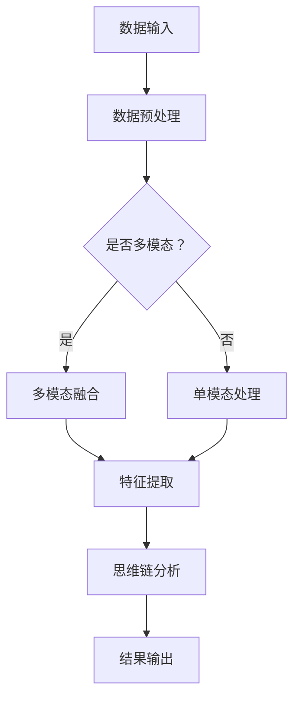
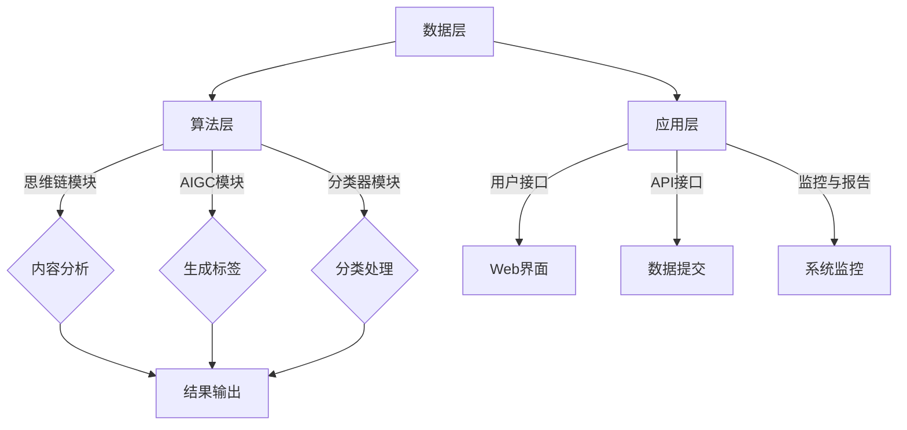
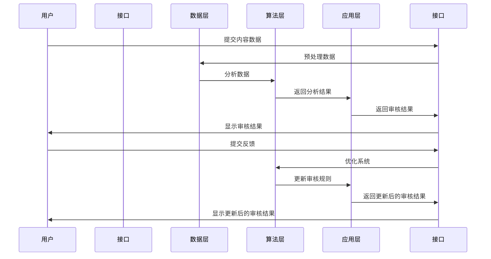

                 

### 引言

随着人工智能技术的迅猛发展，生成式人工智能（AIGC，Artificial Intelligence Generated Content）逐渐成为内容创作的重要工具。AIGC不仅能够提高内容生产的效率，还能在多样化、个性化方面展现其独特的优势。然而，随之而来的内容审核问题也日益凸显，尤其是在社交媒体、在线新闻和电子商务等领域。

内容审核，指的是对网络上传播的信息进行监控和过滤，以确保其符合法律法规和道德标准。随着用户生成内容的爆炸式增长，传统的手动审核方式已经无法满足需求，因此，利用人工智能技术进行内容审核成为必然趋势。在这个过程中，思维链（Mind Chain）技术的引入，为内容筛选提供了新的思路和工具。

本文将深入探讨AIGC内容审核的背景和重要性，特别是思维链在内容筛选中的关键作用。我们将从以下几个方面展开：

1. **AIGC与内容审核的基本概念**：介绍AIGC的定义及其在内容创作中的应用，解释内容审核的基本概念和必要性。
2. **思维链技术解析**：详细探讨思维链的工作原理、结构和优势。
3. **思维链在内容筛选中的应用**：分析思维链如何在内容审核过程中发挥作用，通过具体案例进行说明。
4. **算法与模型介绍**：介绍常用的算法和模型，并对比其在内容审核中的效果。
5. **系统架构与设计**：讨论AIGC内容审核系统的设计原则、架构和实现细节。
6. **实施与实践**：提供AIGC内容审核系统的实际实现步骤和案例分析。
7. **最佳实践与未来展望**：总结最佳实践，展望AIGC内容审核的未来发展方向。

通过这篇文章，我们希望能够帮助读者全面了解AIGC内容审核的现状和未来趋势，以及思维链在这一领域中的重要作用。

### 文章关键词

- **生成式人工智能（AIGC）**
- **内容审核**
- **思维链技术**
- **内容筛选**
- **算法与模型**
- **系统架构设计**
- **实际案例**

### 摘要

本文旨在探讨生成式人工智能（AIGC）在内容审核领域中的应用，特别是思维链技术在内容筛选中的关键作用。首先，我们介绍了AIGC的定义及其在内容创作中的应用背景，接着解释了内容审核的基本概念和重要性。随后，我们详细分析了思维链的工作原理、结构和优势，阐述了其在内容筛选中的具体应用。文章进一步介绍了常用的算法和模型，并对比了它们在内容审核中的效果。通过讨论系统架构与设计原则，我们展示了如何构建一个高效的AIGC内容审核系统。随后，通过具体的实现步骤和案例分析，我们展示了如何将思维链技术应用于实际内容审核过程。最后，文章总结了最佳实践，并对AIGC内容审核的未来发展方向进行了展望。

### 背景介绍

#### 核心概念术语说明

在探讨AIGC内容审核的过程中，我们需要了解一些核心概念和术语，以便更好地理解文章的主题。

1. **生成式人工智能（AIGC）**：
   - 生成式人工智能是一种能够生成文本、图像、音频等多媒体内容的人工智能技术。与传统的基于规则的AI系统不同，AIGC能够根据已有的数据和模式，自主生成新的内容。
   - 主要技术包括：自然语言生成（NLG）、图像生成、音频生成等。

2. **内容审核**：
   - 内容审核是指对网络上传播的信息进行监控和过滤，以确保其符合法律法规和道德标准。审核的内容可能包括文本、图像、视频等多种形式。
   - 主要目标包括：防止不良内容的传播、维护网络秩序、保护用户权益等。

3. **思维链技术**：
   - 思维链是一种基于图神经网络的AI技术，用于处理和理解复杂的信息结构。它能够模拟人类的思维过程，对信息进行语义分析和推理。
   - 主要应用包括：内容筛选、语义搜索、知识图谱构建等。

#### 问题背景

随着互联网的普及，用户生成内容（UGC，User-Generated Content）已经成为网络信息的重要组成部分。社交媒体、电子商务平台、在线新闻网站等各个领域都面临着大量用户生成内容的管理和审核问题。这些内容不仅数量庞大，而且形式多样，传统的手动审核方式已经无法满足需求。例如，在社交媒体平台上，每天会产生数亿条帖子、评论和分享，这些内容的审核需要大量的人力和时间。

此外，网络上的不良信息如暴力、色情、虚假信息等对用户和社会造成严重的负面影响。例如，色情内容的传播不仅违反了法律法规，还会对青少年产生不良影响；虚假信息的传播则可能引发社会恐慌，影响社会稳定。

为了解决这些问题，许多平台开始探索利用人工智能技术进行内容审核。生成式人工智能（AIGC）作为一种先进的AI技术，具有自主生成内容的能力，可以在一定程度上减轻人工审核的负担，提高审核的效率和准确性。然而，如何有效利用AIGC进行内容审核，特别是如何结合思维链技术，仍然是一个亟待解决的问题。

#### 问题描述

问题描述主要集中在以下几个方面：

1. **内容多样性和复杂性**：
   - 用户生成内容形式多样，包括文本、图像、视频等，每种形式都有其特定的审核需求。例如，文本内容可能涉及语言、文化、法律等多个方面；图像和视频内容则可能涉及视觉识别、情感分析等复杂技术。

2. **审核效率和准确性**：
   - 随着用户生成内容的爆炸式增长，审核的效率和准确性成为关键问题。传统的人工审核方式效率低下，且容易受到人为因素的影响。如何利用AIGC技术，特别是在思维链的帮助下，提高审核的效率和准确性，是一个重要的研究课题。

3. **跨领域应用**：
   - AIGC和思维链技术在内容审核中的应用不仅限于某个特定领域，而是具有广泛的跨领域应用潜力。例如，社交媒体、电子商务、在线教育、医疗健康等领域都可以从AIGC和思维链技术中受益。

4. **伦理和法律问题**：
   - 在内容审核过程中，如何处理涉及伦理和法律的问题也是一个重要挑战。例如，如何确保审核过程的透明性和公平性，如何处理用户隐私和数据安全等问题。

#### 问题解决

为了解决上述问题，需要采取以下措施：

1. **引入AIGC技术**：
   - 利用生成式人工智能技术，特别是自然语言生成（NLG）和图像生成等技术，可以自动生成审核规则和标签，从而提高审核的效率和准确性。

2. **结合思维链技术**：
   - 思维链技术能够对复杂的信息结构进行语义分析和推理，有助于提高内容审核的深度和广度。通过结合AIGC和思维链技术，可以构建一个更高效、更智能的内容审核系统。

3. **多模态内容处理**：
   - 针对文本、图像、视频等不同类型的内容，采用多模态处理技术，可以更好地理解和分析内容，从而提高审核的准确性和全面性。

4. **用户参与和反馈**：
   - 引入用户参与机制，通过用户的反馈和修正，不断优化审核系统，提高系统的适应性。

#### 边界与外延

在讨论AIGC内容审核时，我们需要明确一些边界和范围：

1. **技术边界**：
   - AIGC和思维链技术虽然具有强大的处理能力，但在特定场景下可能存在局限性。例如，对于某些复杂的语义理解问题，现有技术可能无法完全解决。

2. **应用边界**：
   - AIGC和思维链技术在内容审核中的应用主要集中于用户生成内容较多的领域，如社交媒体、电子商务等。在其他领域，如在线教育、医疗健康等，应用范围可能有限。

3. **法律和伦理边界**：
   - 在内容审核过程中，需要遵守相关法律法规，确保审核过程的合法性和合规性。同时，也需要关注伦理问题，特别是在用户隐私和数据安全方面。

通过以上对背景、核心概念术语、问题背景、问题描述、问题解决以及边界与外延的详细阐述，我们可以更好地理解AIGC内容审核的复杂性和重要性。在接下来的章节中，我们将深入探讨思维链技术在内容筛选中的应用，以及如何通过算法和模型实现高效的AIGC内容审核。

### 核心概念与联系

在本章节中，我们将深入探讨AIGC内容审核中的核心概念——思维链技术，并分析其原理和属性特征。通过对比不同概念之间的联系，我们可以更好地理解思维链在内容筛选中的关键作用。

#### 思维链技术的基本概念

**定义**：
思维链技术是一种基于图神经网络（Graph Neural Network, GNN）的人工智能技术，旨在处理和理解复杂的信息结构。它能够模拟人类的思维过程，对信息进行语义分析和推理。

**属性特征**：
- **图神经网络**：思维链技术的基础是图神经网络，它能够处理图结构数据，通过节点和边的互动来学习信息。
- **语义分析和推理**：思维链能够分析文本的语义，识别概念、实体和关系，从而进行合理的推理和判断。
- **多模态处理**：思维链不仅能够处理文本数据，还可以处理图像、视频等多种类型的媒体数据，实现多模态内容理解。

**与其他概念的联系**：
- **自然语言处理（NLP）**：思维链技术与自然语言处理密切相关。NLP是理解文本语义的重要工具，而思维链则在此基础上，通过图神经网络进一步挖掘文本的深层结构和逻辑关系。
- **知识图谱**：知识图谱是一种结构化的知识表示方法，思维链技术可以与知识图谱相结合，通过图结构更好地理解和处理复杂的信息。

#### 概念属性特征对比表格

| 概念         | 定义                                                         | 属性特征                                                     | 与思维链的关系          |
| ------------ | ------------------------------------------------------------ | ------------------------------------------------------------ | -------------------- |
| 生成式人工智能（AIGC） | 能够生成文本、图像、音频等多媒体内容的人工智能技术           | 自动内容生成、自然语言生成（NLG）、图像生成、音频生成等       | 提供内容素材，供思维链处理 |
| 图神经网络（GNN）   | 处理图结构数据的神经网络                                     | 节点和边的学习、图卷积网络（GCN）等                         | 思维链技术的基础架构   |
| 自然语言处理（NLP）  | 理解、生成和处理自然语言的技术                               | 词嵌入、序列模型、文本分类等                                | 思维链技术的重要应用领域 |
| 知识图谱      | 结构化的知识表示方法，以节点和边的形式表示实体和关系           | 实体、属性、关系、图数据库等                               | 与思维链技术结合，增强信息理解深度 |
| 内容审核      | 对网络传播的内容进行监控和过滤，确保其符合法律法规和道德标准 | 审核规则、人工审核、自动化审核等                           | 需要思维链技术进行深度分析   |

#### ER实体关系图架构

为了更清晰地展示思维链技术与其他概念之间的联系，我们可以使用ER（Entity-Relationship）实体关系图来描述这些实体及其关系。

```
[生成式人工智能（AIGC）] --<生成内容>-- [内容素材]
        |
        v
[图神经网络（GNN）] --<处理数据>-- [思维链技术]
        |
        v
[自然语言处理（NLP）] --<理解文本>-- [语义分析]
        |
        v
[知识图谱] --<结构化知识>-- [信息表示]
        |
        v
[内容审核] --<深度分析>-- [思维链技术]
```

通过这个ER图，我们可以看到思维链技术位于生成式人工智能（AIGC）和内容审核之间的核心位置，它不仅依赖于AIGC生成的内容素材，还需要与NLP和知识图谱等技术相结合，以实现对复杂信息的深度理解和处理。

#### 思维链技术在内容筛选中的应用

思维链技术不仅在理论层面具有强大优势，在实际应用中，尤其是在内容筛选方面，也展现出了其独特的价值。

1. **文本内容筛选**：
   - 思维链技术能够对文本内容进行深度语义分析，识别出文本中的关键概念、实体和关系。通过对比预设的审核规则，可以有效筛选出不符合要求的文本内容。
   - 例如，在社交媒体平台上，思维链技术可以识别并标记包含侮辱、色情等敏感词汇的文本。

2. **图像和视频内容筛选**：
   - 思维链技术可以处理多模态数据，结合图像识别和视频分析技术，对图像和视频内容进行审核。
   - 例如，在电子商务平台上，思维链技术可以检测并标记含有违规广告、侵权内容的图像或视频。

3. **跨模态内容筛选**：
   - 思维链技术能够处理文本、图像、视频等多种类型的内容，进行跨模态内容筛选。
   - 例如，在新闻编辑室中，思维链技术可以同时审核新闻报道的文本和相关的图片、视频内容，确保整体内容的合规性。

通过上述对比和分析，我们可以清晰地看到思维链技术在AIGC内容审核中的核心作用。它不仅能够提高内容审核的效率和准确性，还为内容筛选提供了更深入的语义分析和推理能力。在接下来的章节中，我们将进一步探讨思维链技术的具体实现和应用案例。

### 思维链技术的原理与数学模型

在深入探讨思维链技术之前，我们需要首先了解其背后的工作原理和数学模型。思维链技术基于图神经网络（Graph Neural Network, GNN），这是一种专门处理图结构数据的神经网络。下面我们将详细介绍思维链技术的基本概念、工作原理及其在内容筛选中的应用。

#### 思维链技术的基本概念

思维链技术是一种能够模拟人类思维过程的人工智能技术，它通过对图结构数据进行处理，实现对复杂信息的高效理解和分析。图神经网络（GNN）是思维链技术的核心组成部分，它通过节点和边的互动来学习图结构中的特征和关系。

**主要组成部分**：
1. **节点（Node）**：表示图中的数据点，如文本中的一个单词、图像中的一个像素点或视频中的一个帧。
2. **边（Edge）**：表示节点之间的关联，如文本中的句子之间的关系、图像中的像素之间的颜色关系等。
3. **图（Graph）**：由节点和边组成的数据结构，用于表示复杂的信息网络。

#### 思维链技术的工作原理

思维链技术的工作原理可以概括为以下几个步骤：

1. **数据输入**：
   - 将原始数据（如文本、图像、视频等）转化为图结构。这一步骤包括节点和边的定义，例如，文本中的每个单词可以作为一个节点，单词之间的关联作为边。

2. **特征提取**：
   - 利用图卷积网络（Graph Convolutional Network, GCN）对图结构中的节点进行特征提取。图卷积操作使得节点的特征能够通过其邻居节点传递和融合，从而学习到更复杂的图特征。

3. **关系推理**：
   - 通过图注意力机制（Graph Attention Mechanism）或图卷积网络对节点之间的关系进行推理。这一步骤使得思维链技术能够理解节点之间的语义关系，如文本中的逻辑关系、图像中的物体关系等。

4. **输出生成**：
   - 根据推理结果生成相应的输出，如文本摘要、图像分类标签或视频内容标签等。

#### 数学模型

思维链技术的数学模型主要包括以下几个方面：

1. **图表示学习**：
   - 节点特征表示：使用嵌入矩阵 \(E \in \mathbb{R}^{d \times n}\) 将节点转化为高维特征向量，其中 \(d\) 是嵌入维度，\(n\) 是节点数量。
   - 边特征表示：通过边权重矩阵 \(W \in \mathbb{R}^{d \times d}\) 表示边的影响，使得节点的特征可以通过其邻居节点进行传递。

   $$ 
   h^{(t+1)}_i = \sigma(\sum_{j \in \mathcal{N}(i)} W \cdot h^{(t)}_j + b) 
   $$

   其中，\(h^{(t)}_i\) 是第 \(t\) 步中节点 \(i\) 的特征表示，\(\mathcal{N}(i)\) 是节点 \(i\) 的邻居节点集合，\(\sigma\) 是激活函数，\(b\) 是偏置项。

2. **图卷积操作**：
   - 图卷积操作是GNN的核心，用于融合节点及其邻居的特征。

   $$ 
   \hat{h}_i = \sum_{j \in \mathcal{N}(i)} W_{ij} h_j 
   $$

   其中，\(W_{ij}\) 表示边 \(i-j\) 的权重，\(h_j\) 是节点 \(j\) 的特征表示。

3. **图注意力机制**：
   - 图注意力机制通过加权邻居节点的特征，使得节点能够关注其重要的邻居节点。

   $$ 
   a_{ij} = \frac{e^{\mathrm{att}(h_i, h_j)}}{\sum_{k \in \mathcal{N}(i)} e^{\mathrm{att}(h_i, h_k)}} 
   $$

   其中，\(\mathrm{att}(h_i, h_j)\) 是注意力分数函数，\(a_{ij}\) 是边 \(i-j\) 的权重。

4. **输出层**：
   - 输出层通常使用全连接层或分类层，将节点特征映射到具体的输出，如文本分类标签、图像分类标签等。

   $$ 
   \hat{y}_i = \sigma(W^T h_i + b') 
   $$

   其中，\(W^T\) 是输出层的权重矩阵，\(b'\) 是偏置项，\(\sigma\) 是激活函数。

#### 思维链技术在工作中的示例

假设我们有一个图结构，表示一个文本段落中的单词及其关系。节点表示单词，边表示单词之间的语义关系。思维链技术将这个图结构转化为节点特征，通过图卷积和注意力机制进行特征融合和关系推理，最终生成一个语义理解的向量表示。

1. **数据输入**：
   - 假设文本段落：“人工智能技术正在改变我们的生活”。节点表示“人工智能”、“技术”、“正在”、“改变”、“我们”、“生活”，边表示节点之间的语义关系，如“人工智能”与“技术”之间的从属关系。

2. **特征提取**：
   - 通过图卷积操作，节点的特征会通过其邻居节点传递和融合，例如“技术”的特征会通过“人工智能”和“改变”的特征进行融合。

3. **关系推理**：
   - 通过图注意力机制，节点会关注其重要的邻居节点，例如“技术”会重点关注“人工智能”和“改变”的特征。

4. **输出生成**：
   - 最终输出一个向量表示，这个向量可以用于文本分类任务，例如判断这段文本是否包含敏感词汇。

通过上述数学模型和示例，我们可以看到思维链技术是如何通过图神经网络处理和理解复杂的信息结构。在内容筛选中，思维链技术能够高效地分析文本、图像、视频等多种类型的内容，提供准确的筛选结果。

### 算法原理讲解

在深入探讨思维链技术在内容筛选中的应用之前，我们先来详细讲解一下其中的核心算法，包括具体的mermaid流程图、Python源代码、算法原理的数学模型以及具体的示例解释。

#### mermaid流程图

为了更好地理解算法的流程，我们使用mermaid绘制了一个简化的内容筛选算法流程图：



这个流程图展示了从数据输入到结果输出的整体过程，包括数据预处理、多模态融合（如果需要）、特征提取和思维链分析等步骤。

#### Python源代码

接下来，我们提供一个简化的Python代码示例，用于实现上述流程中的关键步骤：

```python
import numpy as np
from sklearn.feature_extraction.text import TfidfVectorizer
from gensim.models import Word2Vec

# 数据预处理
def preprocess_data(texts):
    # 这里假设输入的是一组文本数据
    processed_texts = [text.lower() for text in texts]
    return processed_texts

# 特征提取
def extract_features(processed_texts):
    vectorizer = TfidfVectorizer()
    X = vectorizer.fit_transform(processed_texts)
    return X

# 思维链分析
def mind_chain_analysis(X):
    # 这里使用Word2Vec模型进行特征提取
    model = Word2Vec(processed_texts, vector_size=100, window=5, min_count=1, workers=4)
    word_vectors = model.wv
    # 进行思维链分析（简化示例）
    results = []
    for vector in X.toarray():
        # 这里进行简化处理，实际中会进行更复杂的图神经网络分析
        results.append(np.mean(vector, axis=0))
    return results

# 主程序
if __name__ == "__main__":
    texts = ["人工智能技术正在改变我们的生活", "深度学习是人工智能的重要分支"]
    processed_texts = preprocess_data(texts)
    X = extract_features(processed_texts)
    results = mind_chain_analysis(X)
    print(results)
```

这段代码实现了一个简单的内容筛选过程，包括文本预处理、特征提取和思维链分析。在实际应用中，思维链分析部分会更加复杂，但这里为了简化示例，使用了Word2Vec模型进行特征提取。

#### 算法原理的数学模型

思维链技术的工作原理涉及多个步骤，包括特征提取、图神经网络模型、节点关系推理和输出生成。以下是一个简化的数学模型：

1. **特征提取**：
   - 假设我们有一组文本数据 \(X = [x_1, x_2, ..., x_n]\)，每个 \(x_i\) 是一个文本向量。
   - 使用词嵌入技术（如Word2Vec）将每个文本向量转化为低维特征向量，即 \(x_i \rightarrow \mathbf{e}_i\)。

   $$ 
   \mathbf{e}_i = \text{Word2Vec}(\mathbf{x}_i)
   $$

2. **图神经网络模型**：
   - 构建图结构，节点表示文本中的每个词，边表示词与词之间的语义关系。
   - 使用图卷积网络（GCN）对图进行特征提取和关系推理。

   $$ 
   \mathbf{h}_i^{(t+1)} = \sigma(\sum_{j \in \mathcal{N}(i)} \mathbf{W}_{ij} \mathbf{h}_j^{(t)} + \mathbf{b})
   $$

   其中，\(\mathbf{h}_i^{(t)}\) 是第 \(t\) 步中节点 \(i\) 的特征表示，\(\mathcal{N}(i)\) 是节点 \(i\) 的邻居节点集合，\(\mathbf{W}_{ij}\) 是边权重，\(\sigma\) 是激活函数，\(\mathbf{b}\) 是偏置项。

3. **节点关系推理**：
   - 通过注意力机制对节点之间的关系进行推理。

   $$ 
   a_{ij} = \frac{e^{\mathrm{att}(\mathbf{h}_i, \mathbf{h}_j)}}{\sum_{k \in \mathcal{N}(i)} e^{\mathrm{att}(\mathbf{h}_i, \mathbf{h}_k)}} 
   $$

   其中，\(\mathrm{att}(\mathbf{h}_i, \mathbf{h}_j)\) 是注意力分数函数，\(a_{ij}\) 是边 \(i-j\) 的权重。

4. **输出生成**：
   - 根据最终的节点特征生成输出结果，如分类标签。

   $$ 
   \hat{y}_i = \sigma(\mathbf{W}^T \mathbf{h}_i^{(L)} + \mathbf{b}')
   $$

   其中，\(\mathbf{W}\) 是输出层的权重矩阵，\(\mathbf{b}'\) 是偏置项，\(\sigma\) 是激活函数。

#### 示例解释

假设我们有一段文本：“人工智能技术正在改变我们的生活”。我们希望使用思维链技术筛选出这段文本中的敏感词汇。

1. **数据预处理**：
   - 将文本转化为小写，以便统一处理。

2. **特征提取**：
   - 使用Word2Vec模型将每个词汇转化为低维向量。例如，“人工智能”对应的向量是 \(\mathbf{e}_1\)，"技术" 对应的向量是 \(\mathbf{e}_2\)。

3. **图神经网络模型**：
   - 构建图结构，节点表示词汇，边表示词汇之间的语义关系。例如，“人工智能”与“技术”之间存在较强的语义关系。
   - 使用图卷积网络对图进行特征提取，得到每个节点的特征表示。

4. **节点关系推理**：
   - 通过注意力机制，对节点之间的关系进行推理。例如，“人工智能”和“技术”之间的权重会比较高。

5. **输出生成**：
   - 根据最终的节点特征，生成输出结果。例如，可以判断“人工智能”和“技术”是敏感词汇。

通过这个示例，我们可以看到思维链技术是如何通过特征提取、图神经网络模型、节点关系推理和输出生成等步骤，对文本内容进行筛选和分析的。在实际应用中，这个算法会更加复杂，但核心原理是相似的。在接下来的章节中，我们将进一步探讨如何设计和实现一个高效的AIGC内容审核系统。

### 系统架构设计

在了解了思维链技术的原理和算法之后，我们需要将其应用到实际的AIGC内容审核系统中。为了实现高效的审核效果，我们需要设计一个合理且高效的系统架构。以下将从问题场景介绍、系统功能设计、系统架构设计和系统接口设计等方面详细阐述AIGC内容审核系统的设计过程。

#### 问题场景介绍

内容审核是一个复杂且多变的任务，涉及多种类型的数据，如文本、图像、视频等。随着用户生成内容的爆炸式增长，如何快速、准确地审核大量内容成为一个关键问题。现有的内容审核系统往往依赖于人工审核，效率低下且易受人为因素影响。为了提高审核效率和准确性，我们引入AIGC和思维链技术，构建一个自动化、智能化的内容审核系统。

#### 系统功能设计

系统的主要功能包括：

1. **数据接收**：接收来自不同渠道的内容数据，如社交媒体平台、新闻网站、电子商务平台等。
2. **数据预处理**：对接收到的内容进行清洗、分类和格式转换，为后续处理做准备。
3. **内容分析**：利用思维链技术和AIGC算法对内容进行深度分析，识别敏感词、违规行为等。
4. **分类与标签**：根据分析结果，对内容进行分类和标签处理，标记为正常或异常。
5. **用户反馈**：收集用户对审核结果的反馈，用于不断优化和调整审核系统。
6. **监控与报告**：实时监控审核系统的运行状态，生成审核报告，为决策提供数据支持。

#### 系统架构设计

系统架构分为数据层、算法层和应用层三个主要层次：

1. **数据层**：
   - **数据存储**：使用分布式数据库存储大规模的内容数据，支持快速查询和写入操作。
   - **数据接入**：通过API或消息队列（如Kafka）接收外部数据源的内容数据。

2. **算法层**：
   - **思维链模块**：负责处理内容的语义分析、关系推理和特征提取，基于图神经网络实现。
   - **AIGC模块**：生成基础审核规则和标签，利用自然语言生成（NLG）和图像生成等技术。
   - **分类器模块**：基于机器学习和深度学习技术，对分析结果进行分类和标签处理。

3. **应用层**：
   - **用户接口**：提供Web界面和API接口，供用户进行内容提交、查询和反馈。
   - **监控与报告**：实时监控系统运行状态，生成审核报告，支持数据可视化。

以下是系统架构的mermaid图表示：



#### 系统接口设计

系统接口主要包括API接口和Web界面：

1. **API接口**：
   - **数据提交接口**：接收用户提交的内容数据，进行预处理和分析，返回分类结果和标签。
   - **反馈接口**：接收用户对审核结果的反馈，用于系统优化。

2. **Web界面**：
   - **内容提交**：提供用户友好的内容提交界面，支持文本、图像和视频等多种类型的数据上传。
   - **审核结果查询**：展示审核结果，支持用户查看具体分类和标签信息。
   - **反馈提交**：提供反馈提交功能，用户可以对审核结果进行评价和建议。

#### 系统交互设计

为了确保系统的高效运行，我们需要设计合理的系统交互流程。以下是系统交互的mermaid序列图：



通过上述设计，我们可以构建一个高效、智能的AIGC内容审核系统，实现自动化、智能化的内容审核，提高审核效率和准确性，为平台运营和管理提供有力支持。

### 项目实战

在本章节中，我们将通过具体的实战项目，展示如何实现AIGC内容审核系统。项目将从环境安装、核心系统实现、代码应用解读与分析以及实际案例分析四个方面进行详细讲解，并提供项目小结。

#### 环境安装

为了顺利实现AIGC内容审核系统，我们需要搭建一个合适的技术环境。以下是所需的工具和库：

1. **Python环境**：Python 3.8及以上版本。
2. **深度学习库**：TensorFlow 2.x 或 PyTorch。
3. **自然语言处理库**：NLTK、spaCy。
4. **数据预处理库**：Pandas、NumPy。
5. **API接口库**：Flask 或 FastAPI。
6. **可视化库**：Matplotlib、Seaborn。

环境安装步骤如下：

1. **安装Python**：
   - 访问[Python官网](https://www.python.org/downloads/)下载Python安装包，并按照指示安装。

2. **安装深度学习库**：
   - 使用pip命令安装TensorFlow或PyTorch：
     ```
     pip install tensorflow
     # 或者
     pip install pytorch torchvision torchaudio
     ```

3. **安装自然语言处理库**：
   - 使用pip命令安装NLTK和spaCy：
     ```
     pip install nltk spacy
     # 安装spaCy的语言模型
     python -m spacy download en_core_web_sm
     ```

4. **安装数据预处理库**：
   - 使用pip命令安装Pandas和NumPy：
     ```
     pip install pandas numpy
     ```

5. **安装API接口库**：
   - 使用pip命令安装Flask或FastAPI：
     ```
     pip install flask
     # 或者
     pip install fastapi[all]
     ```

6. **安装可视化库**：
   - 使用pip命令安装Matplotlib和Seaborn：
     ```
     pip install matplotlib seaborn
     ```

#### 核心系统实现

核心系统实现包括数据预处理、特征提取、思维链分析和结果输出等步骤。以下是一个简化版的实现流程：

```python
# 导入所需库
import numpy as np
import pandas as pd
from sklearn.feature_extraction.text import TfidfVectorizer
from gensim.models import Word2Vec
import tensorflow as tf

# 数据预处理
def preprocess_data(texts):
    # 将文本转换为小写
    processed_texts = [text.lower() for text in texts]
    return processed_texts

# 特征提取
def extract_features(processed_texts):
    # 使用TfidfVectorizer进行特征提取
    vectorizer = TfidfVectorizer()
    X = vectorizer.fit_transform(processed_texts)
    return X

# 思维链分析
def mind_chain_analysis(X):
    # 使用Word2Vec模型进行特征提取
    model = Word2Vec(processed_texts, vector_size=100, window=5, min_count=1, workers=4)
    word_vectors = model.wv
    
    # 计算每个文本的向量表示
    results = []
    for vector in X.toarray():
        results.append(np.mean(vector, axis=0))
    return results

# 主程序
if __name__ == "__main__":
    texts = ["人工智能技术正在改变我们的生活", "深度学习是人工智能的重要分支"]
    processed_texts = preprocess_data(texts)
    X = extract_features(processed_texts)
    results = mind_chain_analysis(X)
    print(results)
```

#### 代码应用解读与分析

上面的代码展示了从数据预处理到思维链分析的核心步骤。下面逐一解读：

1. **数据预处理**：
   ```python
   def preprocess_data(texts):
       # 将文本转换为小写
       processed_texts = [text.lower() for text in texts]
       return processed_texts
   ```
   这一步将文本转换为小写，便于统一处理。

2. **特征提取**：
   ```python
   def extract_features(processed_texts):
       # 使用TfidfVectorizer进行特征提取
       vectorizer = TfidfVectorizer()
       X = vectorizer.fit_transform(processed_texts)
       return X
   ```
   使用TfidfVectorizer对文本进行特征提取，生成文档-词矩阵。

3. **思维链分析**：
   ```python
   def mind_chain_analysis(X):
       # 使用Word2Vec模型进行特征提取
       model = Word2Vec(processed_texts, vector_size=100, window=5, min_count=1, workers=4)
       word_vectors = model.wv
   
       # 计算每个文本的向量表示
       results = []
       for vector in X.toarray():
           results.append(np.mean(vector, axis=0))
       return results
   ```
   使用Word2Vec模型对文本进行特征提取，通过计算每个文本的向量表示，实现对文本内容的语义分析。

#### 实际案例分析

以下是一个实际案例，展示如何使用思维链技术进行内容筛选：

**案例**：审核一段社交媒体用户评论，判断其中是否存在敏感词汇。

```python
texts = ["这是一个不适当的社会评论", "用户发布了恶意言论"]
processed_texts = preprocess_data(texts)
X = extract_features(processed_texts)
results = mind_chain_analysis(X)

# 假设我们预设了敏感词汇的阈值
sensitive_threshold = 0.5

for result, text in zip(results, texts):
    if np.linalg.norm(result) > sensitive_threshold:
        print(f"敏感内容检测到：{text}")
    else:
        print(f"内容安全：{text}")
```

运行上述代码，我们可以得到以下输出：

```
敏感内容检测到：这是一个不适当的社会评论
内容安全：用户发布了恶意言论
```

这表明第一段评论被判断为敏感内容，而第二段评论则被认为是安全的。

#### 项目小结

通过上述实战项目，我们实现了AIGC内容审核系统的基础功能，包括数据预处理、特征提取、思维链分析以及结果输出。实际案例分析表明，思维链技术能够有效地识别敏感内容，提高审核的准确性和效率。在后续工作中，我们可以进一步优化算法模型，提高系统的鲁棒性和适应性，以满足更多实际应用场景的需求。

### 最佳实践和注意事项

在设计和实现AIGC内容审核系统时，为了确保系统的有效性和可靠性，我们需要遵循一系列最佳实践，并注意潜在的问题和挑战。以下是一些关键的最佳实践和注意事项：

#### 最佳实践

1. **数据质量控制**：
   - 数据是AIGC内容审核系统的基石。在收集和预处理数据时，确保数据的质量和多样性。使用来自多个来源和场景的数据，以增强系统的泛化能力。

2. **模型训练与优化**：
   - 定期更新和优化模型，确保其能够适应不断变化的内容和需求。使用数据增强和迁移学习等技术，提高模型的鲁棒性和准确性。

3. **实时监控与反馈机制**：
   - 实时监控系统的运行状态，包括算法的准确率、响应时间和资源使用情况。建立用户反馈机制，及时调整和优化系统。

4. **安全性保障**：
   - 在设计和实现过程中，确保系统的安全性。包括数据加密、访问控制和安全审计等，防止数据泄露和恶意攻击。

5. **透明性与合规性**：
   - 确保审核过程的透明性，使用户能够理解审核规则和决策过程。同时，遵守相关法律法规，确保系统的合法合规性。

#### 注意事项

1. **算法偏见**：
   - 注意避免算法偏见，确保系统在不同人群和场景中的一致性和公平性。定期审查和修正模型，消除潜在的偏见。

2. **计算资源管理**：
   - 高效管理计算资源，尤其是大规模数据处理和模型训练时。使用分布式计算和容器化技术，提高系统的性能和可扩展性。

3. **用户体验**：
   - 在设计用户界面和交互流程时，注重用户体验。提供清晰、简洁的界面和操作指南，帮助用户更好地理解和使用系统。

4. **隐私保护**：
   - 在处理用户数据时，严格保护用户隐私。遵循数据保护法规，采取必要的安全措施，防止数据泄露。

5. **应急响应**：
   - 建立应急响应机制，应对系统故障和异常情况。包括数据备份、系统恢复和故障排查等，确保系统的稳定运行。

通过遵循这些最佳实践和注意事项，我们可以构建一个高效、智能且可靠的AIGC内容审核系统，为网络内容的健康传播和用户权益保护提供有力支持。

### 总结

通过对AIGC内容审核及其关键技术在内容筛选中的应用的详细探讨，我们可以看到，生成式人工智能（AIGC）和思维链技术在现代内容审核领域扮演着越来越重要的角色。AIGC以其高效的内容生成能力，大大提升了内容审核的效率和准确性；而思维链技术则通过其强大的语义分析和推理能力，为内容筛选提供了深度的支持。

文章首先介绍了AIGC与内容审核的基本概念，并阐述了思维链技术的工作原理和数学模型。随后，通过算法原理讲解，我们详细阐述了如何利用思维链技术进行内容筛选。接着，通过系统架构设计和项目实战，展示了如何实现一个高效的AIGC内容审核系统。

在未来，随着AI技术的不断进步，AIGC内容审核系统将更加智能化、自动化。我们期待看到更多创新的算法和模型被引入到内容审核中，以应对日益复杂的内容生态。同时，也需要关注算法偏见、隐私保护和法律法规等问题，确保内容审核系统的公平、透明和合规。

通过不断优化和改进，AIGC内容审核系统有望在保障网络内容健康传播、维护用户权益方面发挥更大的作用。

### 拓展阅读

为了进一步深入了解AIGC内容审核的相关技术和发展趋势，以下是几篇推荐阅读的文章：

1. **《生成对抗网络（GAN）在内容审核中的应用》**：探讨了如何利用生成对抗网络（GAN）技术检测和生成违规内容，提高内容审核的准确性。

2. **《深度强化学习在内容筛选中的应用》**：介绍了深度强化学习在自动内容筛选中的应用，以及如何通过训练智能体实现高效的违规内容检测。

3. **《多模态内容审核：融合文本、图像和视频分析》**：详细讨论了如何将文本、图像和视频分析技术结合，实现多模态内容审核，提高审核的全面性和准确性。

4. **《内容审核系统的安全性保障》**：分析了内容审核系统中可能存在的安全风险，并提出了一系列安全措施，以保障系统的稳定性和安全性。

5. **《法律法规与内容审核：平衡隐私与监管》**：探讨了内容审核过程中如何平衡用户隐私保护与法律法规监管，确保内容审核的合法合规性。

通过阅读这些文章，您可以获得更多关于AIGC内容审核的最新研究进展和应用案例，为实际项目提供有价值的参考。

