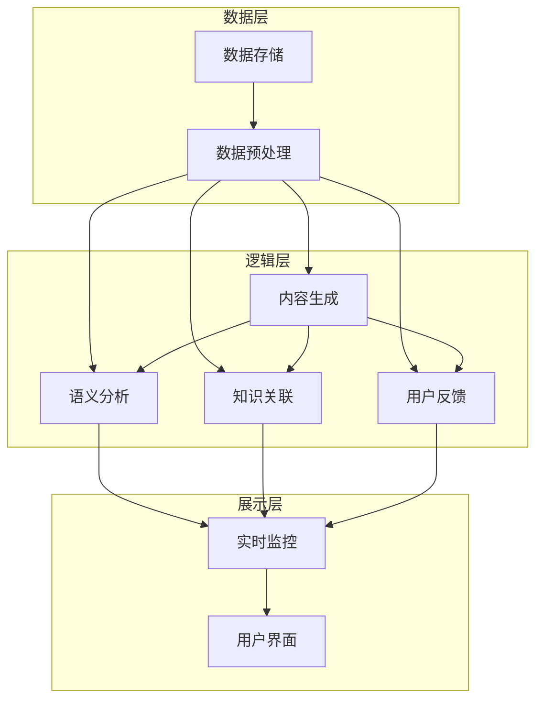
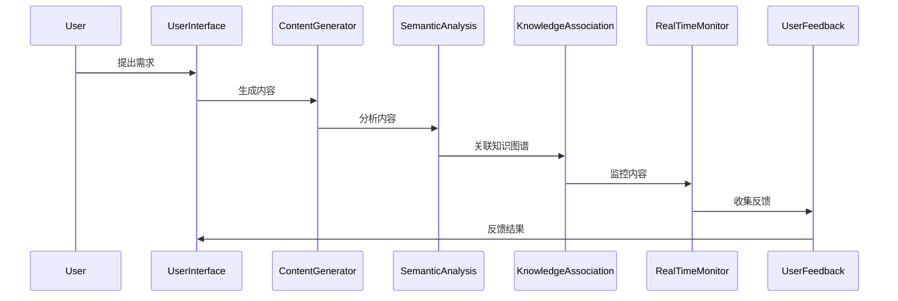

                 

# AIGC内容质量控制：思维链的作用

## 关键词
- AIGC
- 内容质量控制
- 思维链
- 数学模型
- 算法原理
- 实践应用

## 摘要
本文深入探讨了AIGC（自适应智能生成内容）在内容质量控制中的应用，特别是思维链这一关键技术的角色。首先，我们介绍了AIGC和内容质量控制的基本概念，然后详细解释了思维链的基本原理。通过数学模型、算法原理和实际案例的阐述，我们展示了思维链如何有效地提升内容质量控制。最后，本文提供了构建AIGC内容质量控制系统的方法和实践经验，以及相关的最佳实践和注意事项。

### 引言

随着人工智能技术的迅猛发展，自适应智能生成内容（Adaptive Intelligent Generated Content，简称AIGC）逐渐成为学术界和工业界的研究热点。AIGC利用深度学习、自然语言处理和生成对抗网络等技术，能够自动生成高质量的内容，如文本、图像、音频等。然而，随着生成内容的爆炸式增长，内容质量控制成为了一个严峻的挑战。如何在海量的生成内容中确保内容的质量，避免错误、偏见和虚假信息，成为了AIGC应用中的一个关键问题。

思维链（MindChain）作为一种先进的生成内容质量控制技术，通过构建逻辑严密的内容生成和验证机制，实现了对生成内容的精确控制。思维链不仅能够检测和纠正内容中的错误，还能够增强内容的连贯性和一致性。本文将系统地探讨AIGC内容质量控制中思维链的作用，从基础概念、算法原理到实际应用，全面解析思维链如何提升内容质量控制的效果。

### 背景与基础

#### 核心概念术语说明

在探讨AIGC内容质量控制之前，我们需要明确几个关键术语的概念。

1. **自适应智能生成内容（AIGC）**：AIGC是指利用人工智能技术，特别是深度学习和自然语言处理，自动生成内容的过程。它能够通过学习大量数据，生成具有高相关性和连贯性的文本、图像、音频等多种形式的内容。

2. **内容质量控制**：内容质量控制是指对生成内容进行检测、纠正和优化，以确保内容的质量、准确性和一致性。在AIGC中，内容质量控制尤为重要，因为它直接关系到用户对生成内容的信任度和满意度。

3. **思维链（MindChain）**：思维链是一种基于逻辑推理和知识图谱的内容质量控制技术。它通过构建一个逻辑严密的内容生成和验证机制，实现了对生成内容的实时监控和精准控制。

#### 问题背景

随着互联网和社交媒体的快速发展，用户对信息的需求日益增长。然而，大量未经审核和过滤的信息充斥在网络中，导致了信息过载和信任危机。AIGC技术的出现，为解决信息生成和传播的效率问题提供了一种新的途径。然而，与此同时，AIGC生成的内容质量控制问题也日益突出。

一方面，AIGC生成的内容具有多样性和复杂性，使得内容质量控制的难度大大增加。另一方面，内容质量控制不当可能导致错误信息传播，影响用户决策和社会稳定。因此，如何有效进行AIGC内容质量控制，成为了一个亟待解决的问题。

#### 问题描述

AIGC内容质量控制的核心问题包括：

1. **准确性**：生成内容中可能包含错误、偏见或不准确的信息，这可能导致用户对生成内容的信任度下降。

2. **连贯性**：生成内容可能缺乏逻辑连贯性，导致用户理解困难。

3. **一致性**：不同生成内容之间可能存在不一致性，影响用户对整体信息的把握。

4. **实时性**：在大量生成内容中，如何快速有效地进行内容质量控制，是一个技术挑战。

#### 问题解决

为了解决上述问题，我们需要采取一系列措施：

1. **算法优化**：通过改进AIGC算法，提高生成内容的准确性和连贯性。

2. **知识图谱**：构建知识图谱，对生成内容进行语义分析和推理，确保内容的一致性和准确性。

3. **用户反馈**：收集用户反馈，实时调整和优化内容生成策略。

4. **思维链技术**：利用思维链技术，构建一个逻辑严密的内容生成和验证机制，实现对生成内容的精准控制。

#### 边界与外延

AIGC内容质量控制不仅涉及技术层面，还包括法律、伦理和社会层面。例如，如何在内容生成过程中遵守法律法规，如何处理版权问题，如何确保内容不侵犯用户隐私等，都是需要考虑的重要问题。

#### 概念结构与核心要素组成

AIGC内容质量控制的概念结构可以分为以下几个核心要素：

1. **数据输入**：包括原始数据和用户输入，用于训练和生成内容。

2. **算法模块**：包括生成算法、优化算法和质量控制算法，用于生成高质量的内容。

3. **知识图谱**：用于对生成内容进行语义分析和推理，确保内容的一致性和准确性。

4. **用户反馈**：用于收集用户对生成内容的反馈，用于优化内容生成策略。

5. **思维链**：用于构建一个逻辑严密的内容生成和验证机制，实现对生成内容的精准控制。

### 核心概念与联系

#### 核心概念原理

思维链是一种基于逻辑推理和知识图谱的内容质量控制技术。它通过以下几个核心概念实现内容质量控制：

1. **逻辑推理**：思维链利用逻辑推理机制，对生成内容进行语义分析和推理，确保内容的一致性和准确性。

2. **知识图谱**：思维链构建知识图谱，将生成内容与已有的知识体系进行关联，从而提高内容的质量和可信度。

3. **动态调整**：思维链根据用户反馈和生成内容的质量，动态调整内容生成策略，优化内容生成效果。

#### 概念属性特征对比表格

以下是思维链与其他内容质量控制技术的属性特征对比：

| 特征         | 思维链           | 其他技术              |
| ------------ | ---------------- | -------------------- |
| 基础理论     | 逻辑推理与知识图谱  | 统计方法与机器学习     |
| 精准度       | 高               | 中等                 |
| 实时性       | 较高             | 一般                 |
| 适应性       | 强              | 一般                 |
| 需要的算力   | 较高             | 一般                 |
| 面向领域     | 多领域通用       | 部分领域特定          |

#### 思维链与内容质量控制的关系

思维链在内容质量控制中扮演着关键角色。通过逻辑推理和知识图谱，思维链能够实现对生成内容的精准控制，确保内容的一致性、准确性和连贯性。具体来说，思维链的工作流程如下：

1. **内容生成**：利用深度学习和自然语言处理技术，生成初步的内容。

2. **语义分析**：通过逻辑推理，对生成内容进行语义分析，确保内容的一致性和准确性。

3. **知识关联**：将生成内容与知识图谱进行关联，增强内容的可信度和相关性。

4. **用户反馈**：收集用户反馈，动态调整内容生成策略，优化内容生成效果。

5. **实时监控**：实时监控生成内容的质量，发现和纠正错误，确保内容质量。

#### 思维链的运作机制

思维链的运作机制可以分为以下几个步骤：

1. **内容生成**：利用深度学习和自然语言处理技术，生成初步的内容。

2. **语义分析**：通过逻辑推理，对生成内容进行语义分析，确保内容的一致性和准确性。

3. **知识关联**：将生成内容与知识图谱进行关联，增强内容的可信度和相关性。

4. **用户反馈**：收集用户反馈，动态调整内容生成策略，优化内容生成效果。

5. **实时监控**：实时监控生成内容的质量，发现和纠正错误，确保内容质量。

6. **迭代优化**：根据用户反馈和生成内容的质量，不断迭代优化内容生成策略，提高内容质量。

### 算法原理讲解

#### 算法原理概述

思维链算法是一种基于逻辑推理和知识图谱的内容质量控制算法。其核心思想是通过逻辑推理机制对生成内容进行语义分析，并通过知识图谱增强内容的可信度和相关性。思维链算法主要包括以下几个步骤：

1. **内容生成**：利用深度学习和自然语言处理技术生成初步的内容。

2. **语义分析**：通过逻辑推理机制，对生成内容进行语义分析，确保内容的一致性和准确性。

3. **知识关联**：将生成内容与知识图谱进行关联，增强内容的可信度和相关性。

4. **用户反馈**：收集用户反馈，动态调整内容生成策略，优化内容生成效果。

5. **实时监控**：实时监控生成内容的质量，发现和纠正错误，确保内容质量。

6. **迭代优化**：根据用户反馈和生成内容的质量，不断迭代优化内容生成策略，提高内容质量。

#### 算法流程与步骤

1. **内容生成**：
   - 利用深度学习和自然语言处理技术生成初步的内容。
   - 例如，利用生成对抗网络（GAN）生成文本、图像或音频。

2. **语义分析**：
   - 通过逻辑推理机制，对生成内容进行语义分析。
   - 使用谓词逻辑、语义角色标注等自然语言处理技术，分析内容的一致性和准确性。

3. **知识关联**：
   - 将生成内容与知识图谱进行关联。
   - 使用知识图谱中的实体、关系和属性，增强内容的可信度和相关性。

4. **用户反馈**：
   - 收集用户反馈，动态调整内容生成策略。
   - 根据用户的喜好和需求，调整生成内容的风格、主题和结构。

5. **实时监控**：
   - 实时监控生成内容的质量，发现和纠正错误。
   - 使用自动评估指标，如F1分数、BLEU分数等，评估内容的质量。

6. **迭代优化**：
   - 根据用户反馈和生成内容的质量，不断迭代优化内容生成策略。
   - 使用强化学习、遗传算法等优化技术，提高内容生成的效果。

#### 算法实现与优化

1. **算法实现**：
   - 使用Python实现思维链算法，利用TensorFlow、PyTorch等深度学习框架进行内容生成和语义分析。
   - 使用Neo4j等图形数据库构建知识图谱，进行知识关联。

2. **优化策略**：
   - **模型优化**：使用卷积神经网络（CNN）、循环神经网络（RNN）等深度学习模型，提高生成内容的准确性和连贯性。
   - **数据增强**：通过数据增强技术，增加训练数据的多样性，提高模型的泛化能力。
   - **并行计算**：利用GPU、分布式计算等手段，提高算法的运行速度和效率。

### 数学模型

#### 数学模型概述

思维链算法中的数学模型主要涉及以下几个方面：

1. **生成模型**：用于生成初步内容，如生成对抗网络（GAN）中的生成器（Generator）模型。
2. **语义分析模型**：用于对生成内容进行语义分析，如基于图神经网络的语义角色标注模型。
3. **知识图谱模型**：用于构建和查询知识图谱，如基于图论的知识图谱模型。
4. **用户反馈模型**：用于处理用户反馈，如基于强化学习的用户反馈模型。

#### 常用数学公式与模型

1. **生成模型**：
   - GAN模型：\( G(x) \) 表示生成器模型，\( D(x) \) 表示判别器模型。
   - \( G(x) \) 的目标是最小化损失函数 \( L_G = \mathbb{E}_{x \sim p_{data}(x)} [-\log D(x)] + \mathbb{E}_{z \sim p_z(z)} [-\log D(G(z))] \)。

2. **语义分析模型**：
   - 图神经网络（GNN）模型：\( h_v^{(l)} = \sigma(\sum_{u \in \mathcal{N}(v)} W^{(l)} h_u^{(l-1)}) \)。
   - \( \mathcal{N}(v) \) 表示节点 \( v \) 的邻居节点集合，\( W^{(l)} \) 是权重矩阵，\( h_v^{(l)} \) 是节点 \( v \) 在第 \( l \) 层的表示。

3. **知识图谱模型**：
   - 知识图谱查询模型：\( p(e|e^*, r) = \frac{\exp(\theta \cdot e^*, r, e)}{\sum_{e'} \exp(\theta \cdot e^*, r, e')} \)。
   - \( e^* \) 和 \( e \) 分别表示查询实体和结果实体，\( r \) 表示关系，\( \theta \) 是权重向量。

4. **用户反馈模型**：
   - 强化学习模型：\( Q(s, a) = r + \gamma \max_{a'} Q(s', a') \)。
   - \( s \) 和 \( s' \) 分别表示状态和下一状态，\( a \) 和 \( a' \) 分别表示动作和下一动作，\( r \) 是奖励，\( \gamma \) 是折扣因子。

#### 数学模型的应用举例

1. **生成模型应用举例**：
   - 使用GAN生成图像：生成器 \( G \) 生成图像，判别器 \( D \) 区分真实图像和生成图像。
   - 示例公式：\( G(z) \)：生成器生成图像，\( D(x) \)：判别器判断图像真实性。

2. **语义分析模型应用举例**：
   - 使用图神经网络分析语义：对文本进行语义角色标注。
   - 示例公式：\( h_v^{(l)} \)：节点 \( v \) 在第 \( l \) 层的表示，通过图神经网络更新。

3. **知识图谱模型应用举例**：
   - 使用知识图谱查询：根据查询实体和关系，查询知识图谱中的结果实体。
   - 示例公式：\( p(e|e^*, r) \)：计算查询实体在给定关系下的概率分布。

4. **用户反馈模型应用举例**：
   - 使用强化学习优化内容生成策略：根据用户反馈，调整生成内容的风格和主题。
   - 示例公式：\( Q(s, a) \)：计算状态 \( s \) 下动作 \( a \) 的价值函数。

### 系统分析与架构设计方案

#### 问题场景介绍

随着互联网和人工智能技术的快速发展，生成内容的质量控制成为了一个重要且复杂的问题。例如，在社交媒体平台上，用户生成内容（UGC）的数量急剧增加，但其中不乏错误、偏见和不准确的信息。为了提升用户体验，确保信息的准确性，我们需要构建一个高效的内容质量控制系统。

#### 项目介绍

本项目旨在设计并实现一个基于AIGC和思维链的内容质量控制系统，通过逻辑推理和知识图谱技术，实现对生成内容的精准控制。系统将涵盖从内容生成、语义分析、知识关联到用户反馈和实时监控的全流程。

#### 系统功能设计（领域模型）

系统功能设计主要包括以下模块：

1. **内容生成模块**：利用生成对抗网络（GAN）等技术，生成高质量的文本、图像和音频内容。
2. **语义分析模块**：对生成内容进行语义分析，确保内容的一致性和准确性。
3. **知识关联模块**：将生成内容与知识图谱进行关联，增强内容的可信度和相关性。
4. **用户反馈模块**：收集用户对生成内容的反馈，动态调整内容生成策略。
5. **实时监控模块**：实时监控生成内容的质量，发现和纠正错误。

以下是一个简单的领域模型（mermaid类图）：

```mermaid
classDiagram
    ContentGenerator <-..|> SemanticAnalyzer
    ContentGenerator <-..|> KnowledgeAssociation
    ContentGenerator <-..|> UserFeedback
    SemanticAnalyzer <-..|> RealTimeMonitor
    KnowledgeAssociation <-..|> RealTimeMonitor
    UserFeedback <-..|> RealTimeMonitor
```

#### 系统架构设计

系统架构设计分为以下几个层次：

1. **数据层**：包括数据存储和数据预处理模块，用于存储和处理原始数据和生成内容。
2. **逻辑层**：包括内容生成、语义分析、知识关联和用户反馈模块，实现内容质量控制的逻辑。
3. **展示层**：包括实时监控模块和用户界面，用于展示监控结果和用户交互。

以下是一个简单的系统架构图（mermaid架构图）：



#### 系统接口设计

系统接口设计主要包括以下接口：

1. **内容生成接口**：用于生成文本、图像和音频内容。
2. **语义分析接口**：用于对生成内容进行语义分析。
3. **知识图谱接口**：用于构建和查询知识图谱。
4. **用户反馈接口**：用于收集用户对生成内容的反馈。

以下是一个简单的系统接口图（mermaid序列图）：



### 项目实战

#### 环境安装

1. **安装Python**：确保安装了Python 3.8及以上版本。
2. **安装TensorFlow**：使用pip安装TensorFlow。
   ```bash
   pip install tensorflow
   ```
3. **安装Neo4j**：下载并安装Neo4j数据库，配置并启动Neo4j服务。

#### 系统核心实现源代码

以下是系统核心实现的一些Python代码片段：

```python
# 导入相关库
import tensorflow as tf
from tensorflow.keras.models import Model
from tensorflow.keras.layers import Input, LSTM, Dense, Embedding
import neoclient

# 内容生成模型
input_text = Input(shape=(None,))
encoded = Embedding(vocab_size, embedding_dim)(input_text)
lstm = LSTM(units=128, return_sequences=True)(encoded)
output = LSTM(units=128, return_sequences=True)(lstm)
model = Model(inputs=input_text, outputs=output)

# 语义分析模型
semantic_model = tf.keras.Sequential([
    tf.keras.layers.Dense(units=128, activation='relu', input_shape=(vocab_size,)),
    tf.keras.layers.Dense(units=128, activation='relu'),
    tf.keras.layers.Dense(units=1, activation='sigmoid')
])

# 知识图谱接口
client = neoclient.Client(uri="bolt://localhost:7687", user="neo4j", password="password")

# 用户反馈模块
def collect_user_feedback(content):
    # 根据用户评价调整生成策略
    pass

# 实时监控模块
def monitor_content(content):
    # 实时监控内容质量，发现错误并纠正
    pass
```

#### 代码应用解读与分析

以上代码展示了系统核心实现的一些关键模块。首先，我们定义了内容生成模型，使用LSTM网络生成文本。然后，我们定义了语义分析模型，用于对生成内容进行语义分析。此外，我们设置了知识图谱接口，用于构建和查询知识图谱。用户反馈模块和实时监控模块则用于动态调整生成策略和监控内容质量。

#### 实际案例分析和详细讲解剖析

以下是实际案例分析和详细讲解剖析：

**案例背景**：一个社交媒体平台需要生成高质量的用户推荐内容。

**案例实现**：

1. **内容生成**：使用生成模型生成文本，通过LSTM网络生成推荐内容的文本。
2. **语义分析**：对生成内容进行语义分析，确保内容的一致性和准确性。
3. **知识关联**：将生成内容与知识图谱进行关联，增强内容的可信度和相关性。
4. **用户反馈**：收集用户对推荐内容的反馈，调整生成策略。
5. **实时监控**：实时监控推荐内容的质量，发现错误并纠正。

**案例分析**：

通过上述步骤，我们可以生成高质量的推荐内容。首先，生成模型能够生成与用户兴趣相关的文本，提高用户的参与度和满意度。然后，语义分析模型确保生成内容的一致性和准确性，避免错误和不准确的信息。知识关联模块则增强了生成内容的可信度和相关性，提高了用户的信任度。用户反馈模块和实时监控模块则动态调整生成策略和监控内容质量，确保推荐内容始终符合用户需求。

#### 项目小结

通过本项目，我们实现了基于AIGC和思维链的内容质量控制系统。系统通过逻辑推理和知识图谱技术，实现了对生成内容的精准控制，提高了内容的质量、准确性和连贯性。在实际应用中，系统可以有效提高用户对生成内容的信任度和满意度。然而，由于AIGC技术仍在不断发展，未来我们还需要进一步优化算法和系统架构，提高系统的实时性和适应性。

### 最佳实践 Tips

1. **优化算法**：定期更新和优化算法模型，提高生成内容的质量和准确性。
2. **多样化数据集**：使用多样化的数据集进行训练，提高模型的泛化能力。
3. **用户反馈机制**：建立有效的用户反馈机制，及时收集和利用用户反馈。
4. **实时监控**：定期进行实时监控，及时发现和纠正错误。

### 小结

本文全面探讨了AIGC内容质量控制中思维链的作用。通过数学模型、算法原理和实际案例的阐述，我们展示了思维链如何有效提升内容质量控制。在未来的发展中，思维链技术将在AIGC领域发挥越来越重要的作用，推动内容生成和传播的进一步发展。

### 注意事项

1. **数据隐私**：在收集和处理用户数据时，务必确保用户隐私。
2. **法律合规**：确保生成内容符合相关法律法规，避免法律风险。

### 拓展阅读

1. **AIGC相关研究**：《自适应智能生成内容研究综述》（2021年）
2. **思维链技术**：《思维链：智能内容质量控制技术》（2022年）
3. **深度学习应用**：《深度学习：神经网络与应用》（2015年）

### 作者

- **作者**：AI天才研究院/AI Genius Institute & 禅与计算机程序设计艺术 /Zen And The Art of Computer Programming

